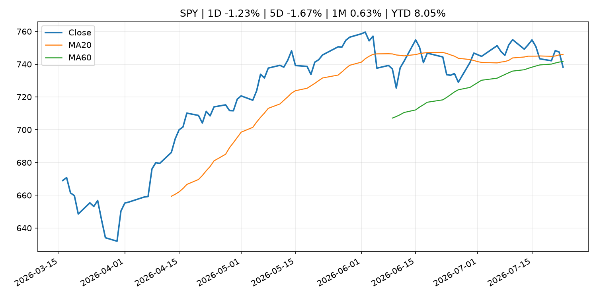
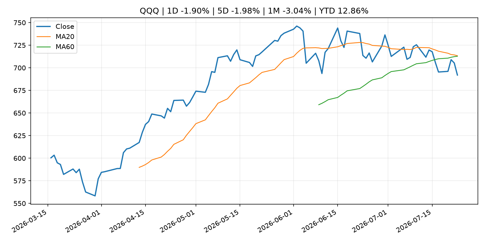
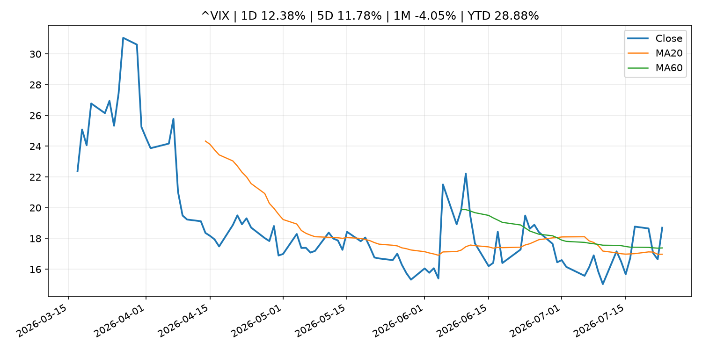
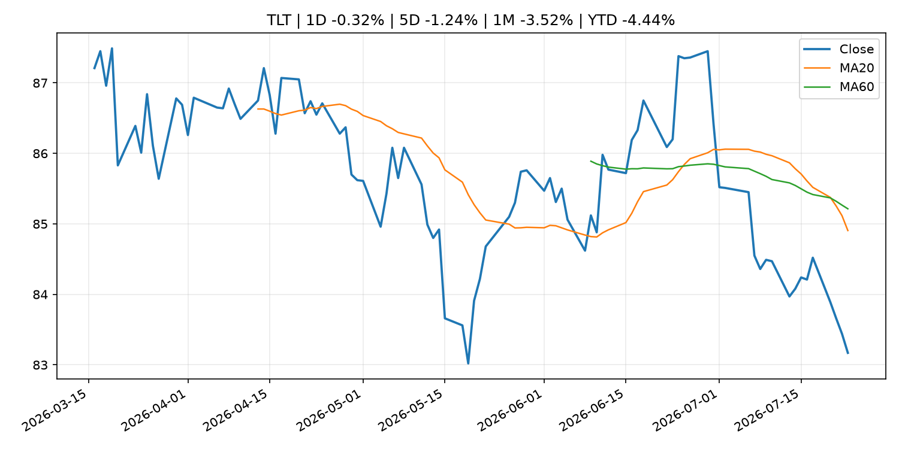
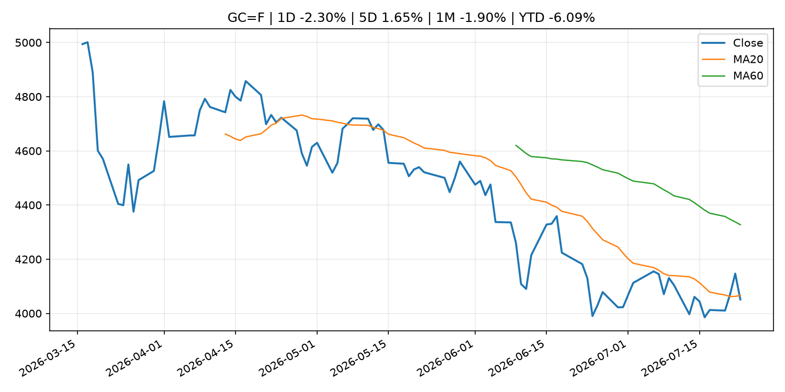
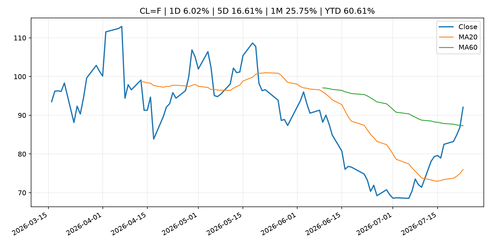
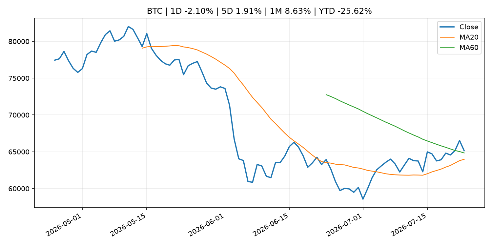
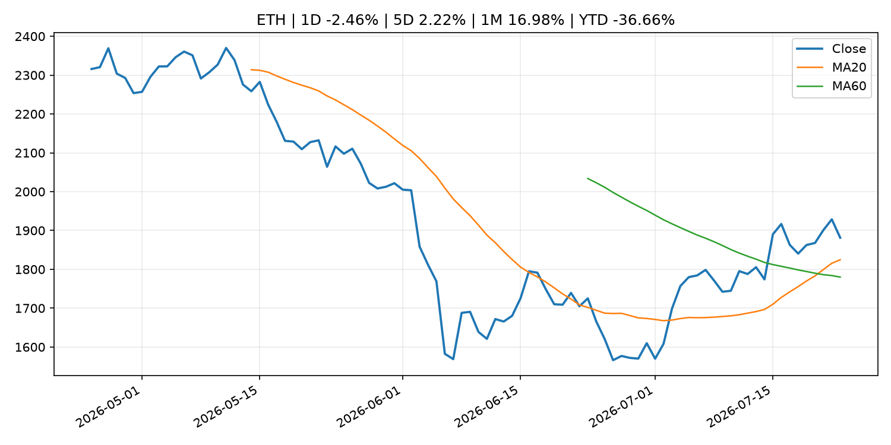
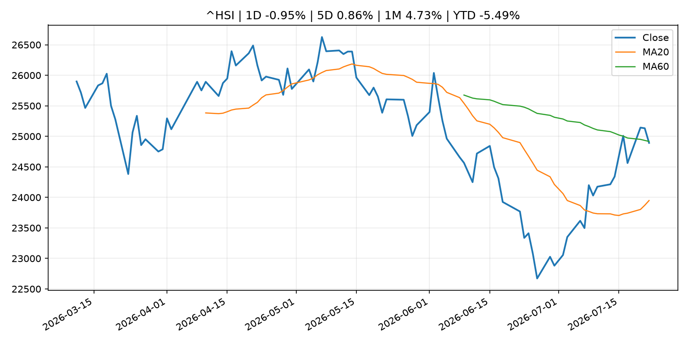

# Global Macro Morning Briefing - 2026-07-24

> Not financial advice / 非投资建议。

## 0. 今日总览
- 市场状态：mixed。市场信号不足，暂不判断明确状态。 但存在信号冲突，需要降低单一叙事置信度。
- 今日三大主线：
  1. central_bank_decision: Odds of Federal Reserve rate hike surge as oil prices rip higher
  2. fiscal_policy: These 16 states are offering tax-free shopping days as back-to-school costs soar to over $800 per student
  3. geopolitical_risk: Live markets: Bitcoin slides as stocks slump on Iran war expansion, AI spending concern
- 一句话结论：今日晨报重点关注：央行决策会重定价利率、汇率、久期资产和风险资产。；财政和贸易政策会影响增长、通胀、企业利润和跨境资本流。。跨资产方面，SPY 1D -1.23%；QQQ 1D -1.90%；^VIX 1D 12.38%；TLT 1D -0.32%；GC=F 1D -2.30%；CL=F 1D 6.02%；BTC 1D -2.10%；ETH 1D -2.46%；市场信号不足，暂不判断明确状态。 但存在信号冲突，需要降低单一叙事置信度。政策、通胀、利率、美元、美债、能源和加密监管仍是主要观察线索。所有结论仅基于公开数据与短摘要整理，不构成投资建议。

## 1. 隔夜跨资产市场
- 美股：SPY 1D -1.23%，QQQ 1D -1.90%，整体趋势需结合 VIX 和利率确认。
- 美债/美元：TLT 1D -0.32%，美元指数 1D 0.29%，是判断折现率压力的核心线索。
- 黄金/原油：黄金 1D -2.30%，原油 1D 6.02%，用于观察避险、通胀和地缘风险。
- 加密：BTC 1D -2.10%，ETH 1D -2.46%，关注是否独立于纳指走出加密自身行情。
- 港股/A股：恒生 1D -0.95%，沪深300/上证 1D n/a，重点看中国政策预期与人民币线索。
- 风险观察：关注后续数据是否确认当前跨资产信号。

### US_EQUITY

| symbol | latest close | 1D | 5D | 1M | YTD | trend |
|---|---:|---:|---:|---:|---:|---|
| SPY | 738.18 | -1.23% | -1.67% | 0.63% | 8.05% | range_bound |
| QQQ | 691.96 | -1.90% | -1.98% | -3.04% | 12.86% | range_bound |
| DIA | 516.26 | -1.00% | -1.63% | -0.07% | 6.75% | range_bound |
| IWM | 292.09 | -0.58% | -1.18% | -1.09% | 17.41% | range_bound |
| VTI | 364.69 | -1.13% | -1.59% | 0.27% | 8.44% | range_bound |

### US_MACRO_MARKET

| symbol | latest close | 1D | 5D | 1M | YTD | trend |
|---|---:|---:|---:|---:|---:|---|
| ^VIX | 18.70 | 12.38% | 11.78% | -4.05% | 28.88% | range_bound |
| DX-Y.NYB | 101.44 | 0.29% | 0.70% | 0.03% | 3.07% | uptrend |
| TLT | 83.17 | -0.32% | -1.24% | -3.52% | -4.44% | strong_downtrend |
| IEF | 92.85 | -0.27% | -0.93% | -1.35% | -3.36% | downtrend |

### COMMODITIES

| symbol | latest close | 1D | 5D | 1M | YTD | trend |
|---|---:|---:|---:|---:|---:|---|
| GC=F | 4,051.50 | -2.30% | 1.65% | -1.90% | -6.09% | downtrend |
| SI=F | 57.92 | -3.51% | 3.61% | -6.62% | -17.92% | strong_downtrend |
| CL=F | 92.06 | 6.02% | 16.61% | 25.75% | 60.61% | range_bound |
| BZ=F | 100.40 | 6.73% | 19.20% | 30.25% | 65.27% | range_bound |
| NG=F | 2.91 | -0.55% | 1.78% | -7.56% | -19.60% | range_bound |
| HG=F | 6.33 | -1.83% | 0.59% | 3.13% | 12.29% | range_bound |

### HK_MARKET

| symbol | latest close | 1D | 5D | 1M | YTD | trend |
|---|---:|---:|---:|---:|---:|---|
| ^HSI | 24,892.66 | -0.95% | 0.86% | 4.73% | -5.49% | range_bound |
| 0700.HK | 445.20 | 1.04% | -8.02% | 7.33% | -28.54% | downtrend |
| 9988.HK | 114.90 | 1.14% | -1.71% | 16.12% | -22.89% | range_bound |
| 3690.HK | 87.30 | 4.36% | 0.11% | 25.43% | -16.54% | range_bound |
| 1810.HK | 27.14 | 1.72% | -1.31% | 19.98% | -32.62% | range_bound |
| 1211.HK | 88.65 | 0.91% | -2.53% | 16.88% | -10.23% | range_bound |

### CRYPTO

| symbol | latest close | 1D | 5D | 1M | YTD | trend |
|---|---:|---:|---:|---:|---:|---|
| BTC | 65,141.80 | -2.10% | 1.91% | 8.63% | -25.62% | range_bound |
| ETH | 1,881.33 | -2.46% | 2.22% | 16.98% | -36.66% | strong_uptrend |
| SOLANA | 76.11 | -2.57% | 1.49% | -1.61% | -38.88% | range_bound |
| BINANCECOIN | 566.98 | -1.13% | -0.13% | 3.10% | -34.28% | downtrend |
| RIPPLE | 1.11 | -2.75% | 2.06% | 5.73% | -39.63% | range_bound |

## 2. 今日最重要的 10 条新闻
### 1. Odds of Federal Reserve rate hike surge as oil prices rip higher
- 来源：CNBC Economy
- 时间：2026-07-23T20:25:28+00:00
- 地区：US
- 事件类型：central_bank_decision
- 重要性层级：Tier 1
- 一句话摘要：Investors are increasingly readying for the Federal Reserve to hike interest rates in September.
- 为什么重要：央行决策会重定价利率、汇率、久期资产和风险资产。
- 可能影响：主要影响 QQQ，方向为 negative，强度 high；鹰派政策提高折现率，压制成长股估值。
  - 资产：QQQ
    方向：negative
    强度：high
    原因：鹰派政策提高折现率，压制成长股估值。
  - 资产：SPY
    方向：negative
    强度：medium
    原因：更紧政策通常削弱风险偏好。
  - 资产：TLT
    方向：negative
    强度：high
    原因：利率上行通常压低长债价格。
  - 资产：DXY
    方向：positive
    强度：high
    原因：更高利率预期通常支撑美元。
  - 资产：BTC
    方向：negative
    强度：high
    原因：流动性收紧通常压制高 beta 加密资产。
  - 资产：CL=F
    方向：positive
    强度：high
    原因：供给扰动或 OPEC 减产通常推升 WTI 原油。
- 原文链接：[https://www.cnbc.com/2026/07/23/fed-interest-rate-odds-oil-jobless-claims.html](https://www.cnbc.com/2026/07/23/fed-interest-rate-odds-oil-jobless-claims.html)

### 2. These 16 states are offering tax-free shopping days as back-to-school costs soar to over $800 per student
- 来源：MarketWatch Top Stories
- 时间：2026-07-23T21:15:00+00:00
- 地区：US
- 事件类型：fiscal_policy
- 重要性层级：Tier 1
- 一句话摘要：As inflation continues to squeeze household budgets, parents and students are on a mission to find back-to-school bargains.
- 为什么重要：财政和贸易政策会影响增长、通胀、企业利润和跨境资本流。
- 可能影响：主要影响 DXY，方向为 positive，强度 high；通胀压力可能推高政策利率预期并支撑美元。
  - 资产：DXY
    方向：positive
    强度：high
    原因：通胀压力可能推高政策利率预期并支撑美元。
  - 资产：TLT
    方向：negative
    强度：high
    原因：通胀上行通常推升收益率、压低长债价格。
  - 资产：QQQ
    方向：negative
    强度：high
    原因：更高利率对成长股估值折现率不利。
  - 资产：SPY
    方向：mixed
    强度：medium
    原因：名义增长可能支撑收入，但更高利率压制估值。
  - 资产：GC=F
    方向：mixed
    强度：medium
    原因：通胀对黄金是支撑，但实际利率上行会形成压力。
  - 资产：BTC
    方向：mixed
    强度：medium
    原因：抗通胀叙事和流动性收紧可能相互抵消。
- 原文链接：[https://www.marketwatch.com/story/these-16-states-are-offering-tax-holidays-as-back-to-school-costs-soar-to-over-800-per-student-0ec92464?mod=mw_rss_topstories](https://www.marketwatch.com/story/these-16-states-are-offering-tax-holidays-as-back-to-school-costs-soar-to-over-800-per-student-0ec92464?mod=mw_rss_topstories)

### 3. Live markets: Bitcoin slides as stocks slump on Iran war expansion, AI spending concern
- 来源：CoinDesk
- 时间：2026-07-23T09:03:33+00:00
- 地区：global
- 事件类型：geopolitical_risk
- 重要性层级：Tier 1
- 一句话摘要：Live markets: Bitcoin slides as stocks slump on Iran war expansion, AI spending concern
- 为什么重要：地缘风险可能推升避险需求、能源价格和市场波动率。
- 可能影响：可能影响利率、汇率、风险资产或大宗商品预期，但当前公开信息不足以判断明确方向。
  - 资产：暂无明确资产映射
  - 方向：unknown
  - 强度：low
  - 原因：公开信息不足以判断方向。
- 原文链接：[https://www.coindesk.com/tech/2026/07/23/live-markets-bitcoin-trades-above-usd65-000-as-alphabet-s-bigger-ai-bill-props-up-the-chip-trade](https://www.coindesk.com/tech/2026/07/23/live-markets-bitcoin-trades-above-usd65-000-as-alphabet-s-bigger-ai-bill-props-up-the-chip-trade)

### 4. S&P 500 flashes sell signals — options traders are bracing for wild swings in Apple, Meta and Microsoft
- 来源：MarketWatch Top Stories
- 时间：2026-07-23T22:03:00+00:00
- 地区：US
- 事件类型：earnings
- 重要性层级：Tier 2
- 一句话摘要：Nervous investors set the stage for massive post-earnings moves in Wall Street’s biggest stocks.
- 为什么重要：大型科技股盈利和资本开支会影响纳指、半导体和 AI 交易主线。
- 可能影响：主要影响 QQQ，方向为 mixed，强度 high；AI 资本开支会影响大型科技股盈利和估值预期。
  - 资产：QQQ
    方向：mixed
    强度：high
    原因：AI 资本开支会影响大型科技股盈利和估值预期。
  - 资产：SMH
    方向：mixed
    强度：high
    原因：AI 投资周期直接影响半导体需求。
  - 资产：NVDA
    方向：mixed
    强度：high
    原因：AI 训练和推理需求是英伟达收入预期核心变量。
  - 资产：MSFT
    方向：mixed
    强度：medium
    原因：云和 AI 资本开支影响利润率与增长叙事。
  - 资产：GOOGL
    方向：mixed
    强度：medium
    原因：AI 投资和搜索商业化影响估值。
  - 资产：META
    方向：mixed
    强度：medium
    原因：AI 基建支出与广告效率共同影响市场预期。
- 原文链接：[https://www.marketwatch.com/story/s-p-500-flashes-sell-signals-options-traders-are-bracing-for-wild-swings-in-apple-meta-and-microsoft-83ff7d65?mod=mw_rss_topstories](https://www.marketwatch.com/story/s-p-500-flashes-sell-signals-options-traders-are-bracing-for-wild-swings-in-apple-meta-and-microsoft-83ff7d65?mod=mw_rss_topstories)

### 5. SEC Announces Roundtable on Preparations for 24-Hour Trading
- 来源：SEC Press Releases
- 时间：2026-07-23T11:04:00-04:00
- 地区：US
- 事件类型：regulation
- 重要性层级：Tier 2
- 一句话摘要：The Securities and Exchange Commission announced today that it will host a roundtable on Sept. 17, 2026, to discuss moving towards 24-hour trading in the U.S. equity markets, including preparations to support overnight trading, operations and resiliency…
- 为什么重要：监管变化会改变行业盈利预期和资产风险溢价。
- 可能影响：主要影响 BTC，方向为 mixed，强度 high；加密监管或 ETF 进展会改变 BTC 的资金流和风险溢价。
  - 资产：BTC
    方向：mixed
    强度：high
    原因：加密监管或 ETF 进展会改变 BTC 的资金流和风险溢价。
  - 资产：ETH
    方向：mixed
    强度：high
    原因：监管框架会影响 ETH 产品化和机构参与度。
  - 资产：COIN
    方向：mixed
    强度：medium
    原因：监管清晰度和执法风险会影响交易平台估值。
  - 资产：crypto market
    方向：mixed
    强度：high
    原因：信息影响整个加密市场结构，但方向取决于细节。
- 原文链接：[https://www.sec.gov/newsroom/press-releases/2026-69-sec-announces-roundtable-preparations-24-hour-trading](https://www.sec.gov/newsroom/press-releases/2026-69-sec-announces-roundtable-preparations-24-hour-trading)

### 6. Tassat wants to help smaller banks tap the trillion-dollar stablecoin boom before Wall Street lock them out
- 来源：CoinDesk
- 时间：2026-07-23T18:10:02+00:00
- 地区：global
- 事件类型：crypto_market_structure
- 重要性层级：Tier 2
- 一句话摘要：Tassat wants to help smaller banks tap the trillion-dollar stablecoin boom before Wall Street lock them out
- 为什么重要：加密市场结构和监管变化会影响 BTC、ETH 及相关股票的风险溢价。
- 可能影响：主要影响 BTC，方向为 mixed，强度 high；加密监管或 ETF 进展会改变 BTC 的资金流和风险溢价。
  - 资产：BTC
    方向：mixed
    强度：high
    原因：加密监管或 ETF 进展会改变 BTC 的资金流和风险溢价。
  - 资产：ETH
    方向：mixed
    强度：high
    原因：监管框架会影响 ETH 产品化和机构参与度。
  - 资产：COIN
    方向：mixed
    强度：medium
    原因：监管清晰度和执法风险会影响交易平台估值。
  - 资产：crypto market
    方向：mixed
    强度：high
    原因：信息影响整个加密市场结构，但方向取决于细节。
- 原文链接：[https://www.coindesk.com/business/2026/07/23/tassat-wants-to-help-smaller-banks-tap-the-trillion-dollar-stablecoin-boom-before-wall-street-lock-them-out](https://www.coindesk.com/business/2026/07/23/tassat-wants-to-help-smaller-banks-tap-the-trillion-dollar-stablecoin-boom-before-wall-street-lock-them-out)

### 7. The SEC settles with Coinbase over its missing Gary Gensler texts
- 来源：CoinDesk
- 时间：2026-07-23T15:36:39+00:00
- 地区：global
- 事件类型：regulation
- 重要性层级：Tier 2
- 一句话摘要：The SEC settles with Coinbase over its missing Gary Gensler texts
- 为什么重要：监管变化会改变行业盈利预期和资产风险溢价。
- 可能影响：主要影响 BTC，方向为 mixed，强度 high；加密监管或 ETF 进展会改变 BTC 的资金流和风险溢价。
  - 资产：BTC
    方向：mixed
    强度：high
    原因：加密监管或 ETF 进展会改变 BTC 的资金流和风险溢价。
  - 资产：ETH
    方向：mixed
    强度：high
    原因：监管框架会影响 ETH 产品化和机构参与度。
  - 资产：COIN
    方向：mixed
    强度：medium
    原因：监管清晰度和执法风险会影响交易平台估值。
  - 资产：crypto market
    方向：mixed
    强度：high
    原因：信息影响整个加密市场结构，但方向取决于细节。
- 原文链接：[https://www.coindesk.com/policy/2026/07/23/sec-agrees-to-end-lawsuit-over-missing-ethereum-records-will-pay-usd150-000-in-fees](https://www.coindesk.com/policy/2026/07/23/sec-agrees-to-end-lawsuit-over-missing-ethereum-records-will-pay-usd150-000-in-fees)

### 8. Goldman Sachs CEO backs Clarity Act despite banking industry's concerns over stablecoin rules
- 来源：CoinDesk
- 时间：2026-07-23T13:53:19+00:00
- 地区：global
- 事件类型：crypto_market_structure
- 重要性层级：Tier 2
- 一句话摘要：Goldman Sachs CEO backs Clarity Act despite banking industry's concerns over stablecoin rules
- 为什么重要：加密市场结构和监管变化会影响 BTC、ETH 及相关股票的风险溢价。
- 可能影响：主要影响 BTC，方向为 mixed，强度 high；加密监管或 ETF 进展会改变 BTC 的资金流和风险溢价。
  - 资产：BTC
    方向：mixed
    强度：high
    原因：加密监管或 ETF 进展会改变 BTC 的资金流和风险溢价。
  - 资产：ETH
    方向：mixed
    强度：high
    原因：监管框架会影响 ETH 产品化和机构参与度。
  - 资产：COIN
    方向：mixed
    强度：medium
    原因：监管清晰度和执法风险会影响交易平台估值。
  - 资产：crypto market
    方向：mixed
    强度：high
    原因：信息影响整个加密市场结构，但方向取决于细节。
- 原文链接：[https://www.coindesk.com/policy/2026/07/23/goldman-sachs-ceo-backs-clarity-act-despite-banking-industry-s-concerns-over-stablecoin-rules](https://www.coindesk.com/policy/2026/07/23/goldman-sachs-ceo-backs-clarity-act-despite-banking-industry-s-concerns-over-stablecoin-rules)

### 9. SEC Announces Departure of Principal Deputy Director of Enforcement Sam Waldon
- 来源：SEC Press Releases
- 时间：2026-07-22T09:45:25-04:00
- 地区：US
- 事件类型：regulation
- 重要性层级：Tier 2
- 一句话摘要：The Securities and Exchange Commission today announced that Sam Waldon, Principal Deputy Director of the Division of Enforcement, will depart the agency on July 31, 2026, after more than 14 years at the SEC. He will be succeeded as Principal Deputy…
- 为什么重要：监管变化会改变行业盈利预期和资产风险溢价。
- 可能影响：主要影响 BTC，方向为 mixed，强度 high；加密监管或 ETF 进展会改变 BTC 的资金流和风险溢价。
  - 资产：BTC
    方向：mixed
    强度：high
    原因：加密监管或 ETF 进展会改变 BTC 的资金流和风险溢价。
  - 资产：ETH
    方向：mixed
    强度：high
    原因：监管框架会影响 ETH 产品化和机构参与度。
  - 资产：COIN
    方向：mixed
    强度：medium
    原因：监管清晰度和执法风险会影响交易平台估值。
  - 资产：crypto market
    方向：mixed
    强度：high
    原因：信息影响整个加密市场结构，但方向取决于细节。
- 原文链接：[https://www.sec.gov/newsroom/press-releases/2026-68-sec-announces-departure-principal-deputy-director-enforcement-sam-waldon](https://www.sec.gov/newsroom/press-releases/2026-68-sec-announces-departure-principal-deputy-director-enforcement-sam-waldon)

### 10. Trump rolls out a new wave of global tariffs. Here are the latest rates.
- 来源：MarketWatch Top Stories
- 时间：2026-07-23T21:50:00+00:00
- 地区：US
- 事件类型：central_bank_speech
- 重要性层级：Tier 2
- 一句话摘要：President Donald Trump and U.S. Trade Representative Jamieson Greer are making a fresh move with tariffs on Thursday.
- 为什么重要：央行官员表态可能影响市场对下一次会议的定价。
- 可能影响：可能影响利率、汇率、风险资产或大宗商品预期，但当前公开信息不足以判断明确方向。
  - 资产：暂无明确资产映射
  - 方向：unknown
  - 强度：low
  - 原因：公开信息不足以判断方向。
- 原文链接：[https://www.marketwatch.com/story/trump-rolls-out-a-new-wave-of-tariffs-here-are-the-latest-rates-449af1d3?mod=mw_rss_topstories](https://www.marketwatch.com/story/trump-rolls-out-a-new-wave-of-tariffs-here-are-the-latest-rates-449af1d3?mod=mw_rss_topstories)

## 3. 政策与央行观察
### 1. Odds of Federal Reserve rate hike surge as oil prices rip higher
- 来源：CNBC Economy
- 时间：2026-07-23T20:25:28+00:00
- 地区：US
- 事件类型：central_bank_decision
- 重要性层级：Tier 1
- 一句话摘要：Investors are increasingly readying for the Federal Reserve to hike interest rates in September.
- 为什么重要：央行决策会重定价利率、汇率、久期资产和风险资产。
- 可能影响：主要影响 QQQ，方向为 negative，强度 high；鹰派政策提高折现率，压制成长股估值。
  - 资产：QQQ
    方向：negative
    强度：high
    原因：鹰派政策提高折现率，压制成长股估值。
  - 资产：SPY
    方向：negative
    强度：medium
    原因：更紧政策通常削弱风险偏好。
  - 资产：TLT
    方向：negative
    强度：high
    原因：利率上行通常压低长债价格。
  - 资产：DXY
    方向：positive
    强度：high
    原因：更高利率预期通常支撑美元。
  - 资产：BTC
    方向：negative
    强度：high
    原因：流动性收紧通常压制高 beta 加密资产。
  - 资产：CL=F
    方向：positive
    强度：high
    原因：供给扰动或 OPEC 减产通常推升 WTI 原油。
- 原文链接：[https://www.cnbc.com/2026/07/23/fed-interest-rate-odds-oil-jobless-claims.html](https://www.cnbc.com/2026/07/23/fed-interest-rate-odds-oil-jobless-claims.html)

### 2. These 16 states are offering tax-free shopping days as back-to-school costs soar to over $800 per student
- 来源：MarketWatch Top Stories
- 时间：2026-07-23T21:15:00+00:00
- 地区：US
- 事件类型：fiscal_policy
- 重要性层级：Tier 1
- 一句话摘要：As inflation continues to squeeze household budgets, parents and students are on a mission to find back-to-school bargains.
- 为什么重要：财政和贸易政策会影响增长、通胀、企业利润和跨境资本流。
- 可能影响：主要影响 DXY，方向为 positive，强度 high；通胀压力可能推高政策利率预期并支撑美元。
  - 资产：DXY
    方向：positive
    强度：high
    原因：通胀压力可能推高政策利率预期并支撑美元。
  - 资产：TLT
    方向：negative
    强度：high
    原因：通胀上行通常推升收益率、压低长债价格。
  - 资产：QQQ
    方向：negative
    强度：high
    原因：更高利率对成长股估值折现率不利。
  - 资产：SPY
    方向：mixed
    强度：medium
    原因：名义增长可能支撑收入，但更高利率压制估值。
  - 资产：GC=F
    方向：mixed
    强度：medium
    原因：通胀对黄金是支撑，但实际利率上行会形成压力。
  - 资产：BTC
    方向：mixed
    强度：medium
    原因：抗通胀叙事和流动性收紧可能相互抵消。
- 原文链接：[https://www.marketwatch.com/story/these-16-states-are-offering-tax-holidays-as-back-to-school-costs-soar-to-over-800-per-student-0ec92464?mod=mw_rss_topstories](https://www.marketwatch.com/story/these-16-states-are-offering-tax-holidays-as-back-to-school-costs-soar-to-over-800-per-student-0ec92464?mod=mw_rss_topstories)

### 3. SEC Announces Roundtable on Preparations for 24-Hour Trading
- 来源：SEC Press Releases
- 时间：2026-07-23T11:04:00-04:00
- 地区：US
- 事件类型：regulation
- 重要性层级：Tier 2
- 一句话摘要：The Securities and Exchange Commission announced today that it will host a roundtable on Sept. 17, 2026, to discuss moving towards 24-hour trading in the U.S. equity markets, including preparations to support overnight trading, operations and resiliency…
- 为什么重要：监管变化会改变行业盈利预期和资产风险溢价。
- 可能影响：主要影响 BTC，方向为 mixed，强度 high；加密监管或 ETF 进展会改变 BTC 的资金流和风险溢价。
  - 资产：BTC
    方向：mixed
    强度：high
    原因：加密监管或 ETF 进展会改变 BTC 的资金流和风险溢价。
  - 资产：ETH
    方向：mixed
    强度：high
    原因：监管框架会影响 ETH 产品化和机构参与度。
  - 资产：COIN
    方向：mixed
    强度：medium
    原因：监管清晰度和执法风险会影响交易平台估值。
  - 资产：crypto market
    方向：mixed
    强度：high
    原因：信息影响整个加密市场结构，但方向取决于细节。
- 原文链接：[https://www.sec.gov/newsroom/press-releases/2026-69-sec-announces-roundtable-preparations-24-hour-trading](https://www.sec.gov/newsroom/press-releases/2026-69-sec-announces-roundtable-preparations-24-hour-trading)

### 4. Tassat wants to help smaller banks tap the trillion-dollar stablecoin boom before Wall Street lock them out
- 来源：CoinDesk
- 时间：2026-07-23T18:10:02+00:00
- 地区：global
- 事件类型：crypto_market_structure
- 重要性层级：Tier 2
- 一句话摘要：Tassat wants to help smaller banks tap the trillion-dollar stablecoin boom before Wall Street lock them out
- 为什么重要：加密市场结构和监管变化会影响 BTC、ETH 及相关股票的风险溢价。
- 可能影响：主要影响 BTC，方向为 mixed，强度 high；加密监管或 ETF 进展会改变 BTC 的资金流和风险溢价。
  - 资产：BTC
    方向：mixed
    强度：high
    原因：加密监管或 ETF 进展会改变 BTC 的资金流和风险溢价。
  - 资产：ETH
    方向：mixed
    强度：high
    原因：监管框架会影响 ETH 产品化和机构参与度。
  - 资产：COIN
    方向：mixed
    强度：medium
    原因：监管清晰度和执法风险会影响交易平台估值。
  - 资产：crypto market
    方向：mixed
    强度：high
    原因：信息影响整个加密市场结构，但方向取决于细节。
- 原文链接：[https://www.coindesk.com/business/2026/07/23/tassat-wants-to-help-smaller-banks-tap-the-trillion-dollar-stablecoin-boom-before-wall-street-lock-them-out](https://www.coindesk.com/business/2026/07/23/tassat-wants-to-help-smaller-banks-tap-the-trillion-dollar-stablecoin-boom-before-wall-street-lock-them-out)

### 5. The SEC settles with Coinbase over its missing Gary Gensler texts
- 来源：CoinDesk
- 时间：2026-07-23T15:36:39+00:00
- 地区：global
- 事件类型：regulation
- 重要性层级：Tier 2
- 一句话摘要：The SEC settles with Coinbase over its missing Gary Gensler texts
- 为什么重要：监管变化会改变行业盈利预期和资产风险溢价。
- 可能影响：主要影响 BTC，方向为 mixed，强度 high；加密监管或 ETF 进展会改变 BTC 的资金流和风险溢价。
  - 资产：BTC
    方向：mixed
    强度：high
    原因：加密监管或 ETF 进展会改变 BTC 的资金流和风险溢价。
  - 资产：ETH
    方向：mixed
    强度：high
    原因：监管框架会影响 ETH 产品化和机构参与度。
  - 资产：COIN
    方向：mixed
    强度：medium
    原因：监管清晰度和执法风险会影响交易平台估值。
  - 资产：crypto market
    方向：mixed
    强度：high
    原因：信息影响整个加密市场结构，但方向取决于细节。
- 原文链接：[https://www.coindesk.com/policy/2026/07/23/sec-agrees-to-end-lawsuit-over-missing-ethereum-records-will-pay-usd150-000-in-fees](https://www.coindesk.com/policy/2026/07/23/sec-agrees-to-end-lawsuit-over-missing-ethereum-records-will-pay-usd150-000-in-fees)

### 6. Goldman Sachs CEO backs Clarity Act despite banking industry's concerns over stablecoin rules
- 来源：CoinDesk
- 时间：2026-07-23T13:53:19+00:00
- 地区：global
- 事件类型：crypto_market_structure
- 重要性层级：Tier 2
- 一句话摘要：Goldman Sachs CEO backs Clarity Act despite banking industry's concerns over stablecoin rules
- 为什么重要：加密市场结构和监管变化会影响 BTC、ETH 及相关股票的风险溢价。
- 可能影响：主要影响 BTC，方向为 mixed，强度 high；加密监管或 ETF 进展会改变 BTC 的资金流和风险溢价。
  - 资产：BTC
    方向：mixed
    强度：high
    原因：加密监管或 ETF 进展会改变 BTC 的资金流和风险溢价。
  - 资产：ETH
    方向：mixed
    强度：high
    原因：监管框架会影响 ETH 产品化和机构参与度。
  - 资产：COIN
    方向：mixed
    强度：medium
    原因：监管清晰度和执法风险会影响交易平台估值。
  - 资产：crypto market
    方向：mixed
    强度：high
    原因：信息影响整个加密市场结构，但方向取决于细节。
- 原文链接：[https://www.coindesk.com/policy/2026/07/23/goldman-sachs-ceo-backs-clarity-act-despite-banking-industry-s-concerns-over-stablecoin-rules](https://www.coindesk.com/policy/2026/07/23/goldman-sachs-ceo-backs-clarity-act-despite-banking-industry-s-concerns-over-stablecoin-rules)

### 7. SEC Announces Departure of Principal Deputy Director of Enforcement Sam Waldon
- 来源：SEC Press Releases
- 时间：2026-07-22T09:45:25-04:00
- 地区：US
- 事件类型：regulation
- 重要性层级：Tier 2
- 一句话摘要：The Securities and Exchange Commission today announced that Sam Waldon, Principal Deputy Director of the Division of Enforcement, will depart the agency on July 31, 2026, after more than 14 years at the SEC. He will be succeeded as Principal Deputy…
- 为什么重要：监管变化会改变行业盈利预期和资产风险溢价。
- 可能影响：主要影响 BTC，方向为 mixed，强度 high；加密监管或 ETF 进展会改变 BTC 的资金流和风险溢价。
  - 资产：BTC
    方向：mixed
    强度：high
    原因：加密监管或 ETF 进展会改变 BTC 的资金流和风险溢价。
  - 资产：ETH
    方向：mixed
    强度：high
    原因：监管框架会影响 ETH 产品化和机构参与度。
  - 资产：COIN
    方向：mixed
    强度：medium
    原因：监管清晰度和执法风险会影响交易平台估值。
  - 资产：crypto market
    方向：mixed
    强度：high
    原因：信息影响整个加密市场结构，但方向取决于细节。
- 原文链接：[https://www.sec.gov/newsroom/press-releases/2026-68-sec-announces-departure-principal-deputy-director-enforcement-sam-waldon](https://www.sec.gov/newsroom/press-releases/2026-68-sec-announces-departure-principal-deputy-director-enforcement-sam-waldon)

### 8. Trump rolls out a new wave of global tariffs. Here are the latest rates.
- 来源：MarketWatch Top Stories
- 时间：2026-07-23T21:50:00+00:00
- 地区：US
- 事件类型：central_bank_speech
- 重要性层级：Tier 2
- 一句话摘要：President Donald Trump and U.S. Trade Representative Jamieson Greer are making a fresh move with tariffs on Thursday.
- 为什么重要：央行官员表态可能影响市场对下一次会议的定价。
- 可能影响：可能影响利率、汇率、风险资产或大宗商品预期，但当前公开信息不足以判断明确方向。
  - 资产：暂无明确资产映射
  - 方向：unknown
  - 强度：low
  - 原因：公开信息不足以判断方向。
- 原文链接：[https://www.marketwatch.com/story/trump-rolls-out-a-new-wave-of-tariffs-here-are-the-latest-rates-449af1d3?mod=mw_rss_topstories](https://www.marketwatch.com/story/trump-rolls-out-a-new-wave-of-tariffs-here-are-the-latest-rates-449af1d3?mod=mw_rss_topstories)

## 4. 市场异动与图表
- SPY 下跌 -1.23%
- QQQ 下跌 -1.90%
- VIX 上涨 12.38%
- Gold 下跌 -2.30%
- Oil 上涨 6.02%
- BTC 下跌 -2.10%
- ETH 下跌 -2.46%

### 信号矛盾
- 股债同时承压，可能是利率或流动性冲击而非传统避险。

### SPY

### QQQ

### ^VIX

### TLT

### GC=F

### CL=F

### BTC

### ETH

### ^HSI

## 5. 华尔街与机构公开观点
- 暂无可靠公开观点。

## 6. 今日重点关注
- 经济数据：经济数据：暂无可靠公开日历数据；如配置经济日历源后可自动填充。
- 央行讲话：央行讲话：暂无可靠公开日历数据；重点跟踪 Fed、ECB、BoJ、PBOC 官网 RSS。
- 财报：财报：暂无可靠数据。
- 政策事件：政策事件：暂无可靠数据。
- 风险提醒：风险提醒：关注数据源失败项、突发地缘风险、利率和美元的二阶反应。

## 7. 英文金融表达与宏观概念
- **inflation expectations**：通胀预期，指家庭、企业或市场对未来通胀的预估。 例句：Inflation expectations can shape wage bargaining and bond yields.
- **real yield**：实际收益率，名义利率扣除通胀预期后的收益率。 例句：Gold often reacts more to real yields than nominal yields.
- **terminal rate**：终端利率，市场预期本轮加息周期的最高政策利率。 例句：A higher terminal rate can pressure growth stocks.
- **risk-off**：避险模式，资金偏向美元、国债、黄金等防御资产。 例句：A geopolitical shock can push markets into risk-off mode.
- **supply disruption**：供给扰动，通常指能源或商品供应受冲突、减产或天气影响。 例句：Supply disruption can lift oil prices and inflation expectations.
- **market structure**：市场结构，指交易、托管、清算、ETF、监管等制度安排。 例句：Crypto market structure rules can affect institutional participation.

## 8. 背景材料
- [JPMorgan report finds dramatic jump in AI-themed ETFs — despite rough quarter](https://www.cnbc.com/2026/07/23/jpmorgan-dramatic-jump-in-ai-etfs-despite-rough-quarter.html)（CNBC Economy，other）：Wall Street is banking heavily on exchange-traded funds that give investors artificial intelligence exposure, according to JPMorgan Asset Management.
- [ECB reveals shortlisted designs for new banknotes and launches public survey](https://www.ecb.europa.eu//press/pr/date/2026/html/ecb.pr260723~c2d43f9170.en.html)（ECB Press Releases，other）：ECB reveals shortlisted designs for new banknotes and launches public survey
- [Christine Lagarde, Boris Vujčić: Monetary policy statement (with Q&A)](https://www.ecb.europa.eu//press/press_conference/monetary-policy-statement/2026/html/ecb.is260723~b6fadd48f4.en.html)（ECB Press Releases，other）：Christine Lagarde, Boris Vujčić: Monetary policy statement (with Q&A)
- [BlackRock, Coinbase, Strategy in a new group pledging $15 million to prepare Bitcoin for quantum threats](https://www.coindesk.com/business/2026/07/23/blackrock-coinbase-strategy-in-group-pledging-usd15-million-to-prepare-bitcoin-for-quantum-threats)（CoinDesk，other）：BlackRock, Coinbase, Strategy in a new group pledging $15 million to prepare Bitcoin for quantum threats
- [Monetary policy decisions](https://www.ecb.europa.eu//press/pr/date/2026/html/ecb.mp260723~29f24d99bc.en.html)（ECB Press Releases，other）：Monetary policy decisions
- [Bulls face a test unlike anything in bitcoin's 17-year history](https://www.coindesk.com/daybook-us/2026/07/23/bulls-face-a-test-unlike-anything-in-bitcoin-s-17-year-history)（CoinDesk，other）：Bulls face a test unlike anything in bitcoin's 17-year history
- [Crypto catches its breath as bitcoin settles into a holding pattern amid July rally](https://www.coindesk.com/markets/2026/07/23/crypto-catches-its-breath-as-bitcoin-settles-into-a-holding-pattern-after-its-best-month-since-january)（CoinDesk，other）：Crypto catches its breath as bitcoin settles into a holding pattern amid July rally
- [Developments in Real Exports and Real Imports](http://www.boj.or.jp/en/research/research_data/reri/index.htm)（Bank of Japan Announcements，other）：Developments in Real Exports and Real Imports
- [Bitcoin, Ethereum-linked protocols lose $35 million in multiple attacks hours apart](https://www.coindesk.com/tech/2026/07/23/bitcoin-ethereum-linked-protocols-lose-usd35-million-in-multiple-attacks-hours-apart)（CoinDesk，other）：Bitcoin, Ethereum-linked protocols lose $35 million in multiple attacks hours apart
- [Bitcoin wilts as oil and rates rise. Clarity Act odds tumble to 38%](https://www.coindesk.com/markets/2026/07/23/bitcoin-wilts-as-oil-and-rates-rise-clarity-act-odds-tumble-to-38)（CoinDesk，other）：Bitcoin wilts as oil and rates rise. Clarity Act odds tumble to 38%
- [John Paulson says we are in the early stages of a long-term bull market for gold](https://www.cnbc.com/2026/07/22/john-paulson-says-we-are-in-early-stages-of-a-long-term-bull-market-for-gold.html)（CNBC Economy，other）：He said demand for bullion continues to broaden, led by central banks that have been adding to their reserves alongside growing private-sector interest.
- [Tesla holds bitcoin treasury steady, reports $112M impairment loss](https://www.coindesk.com/markets/2026/07/22/tesla-holds-bitcoin-steady-reports-usd112m-impairment-loss)（CoinDesk，other）：Tesla holds bitcoin treasury steady, reports $112M impairment loss
- [Japanese Government Bonds Held by the Bank of Japan](http://www.boj.or.jp/en/statistics/boj/other/mei/release/2026/mei260717.xlsx)（Bank of Japan Announcements，other）：Japanese Government Bonds Held by the Bank of Japan
- [(BOJ Review) The Development and Strengthening of International Forums in Asia with the Participation of the Bank of Japan](http://www.boj.or.jp/en/research/wps_rev/rev_2026/rev26e09.htm)（Bank of Japan Announcements，other）：(BOJ Review) The Development and Strengthening of International Forums in Asia with the Participation of the Bank of Japan
- [Meeting on the Fifth Market Functioning Survey concerning Climate Change](http://www.boj.or.jp/en/paym/m-climate/mcli260722a.htm)（Bank of Japan Announcements，other）：Meeting on the Fifth Market Functioning Survey concerning Climate Change
- [Bank of Japan Accounts (July 20)](http://www.boj.or.jp/en/statistics/boj/other/acmai/release/2026/ac260720.htm)（Bank of Japan Announcements，routine_announcement）：Bank of Japan Accounts (July 20)
- [Statistics on Securities Financing Transactions in Japan](http://www.boj.or.jp/en/statistics/bis/repo/index.htm)（Bank of Japan Announcements，other）：Statistics on Securities Financing Transactions in Japan

## 9. 数据源、失败项与免责声明
- 采集时间：2026-07-23T22:54:44
- 数据源：公开 RSS、Yahoo Finance、CoinGecko、AKShare、FRED、SEC data.sec.gov，以及用户自有 inputs/reports 文件。
- 合规说明：不绕过 WSJ、Bloomberg、FT、Reuters 等付费墙；对付费媒体只使用公开 RSS 标题、摘要、链接和发布时间。
- 免责声明：Not financial advice / 非投资建议。本项目仅供个人学习、研究和信息整理，不构成投资建议、交易建议或任何收益承诺。
- 失败或跳过的数据源：
  - crypto data failed coin=dogecoin
  - China market data failed symbol=上证指数: empty dataframe
  - China market data failed symbol=深证成指: empty dataframe
  - China market data failed symbol=创业板指: empty dataframe
  - China market data failed symbol=沪深300: empty dataframe
  - China market data failed symbol=中证500: empty dataframe
  - China market data failed symbol=科创50: empty dataframe
  - FRED_API_KEY not set; skipping FRED macro series
  - SEC failed cik=0000320193
  - SEC failed cik=0000789019
  - SEC failed cik=0001045810
  - SEC failed cik=0001318605
  - SEC failed cik=0001577552
