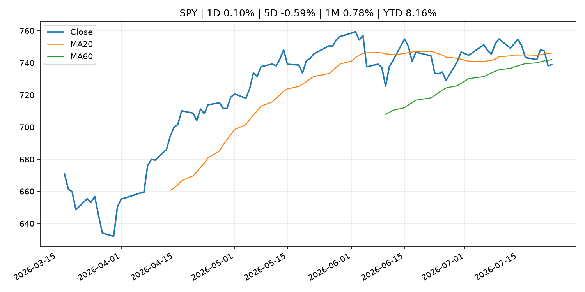
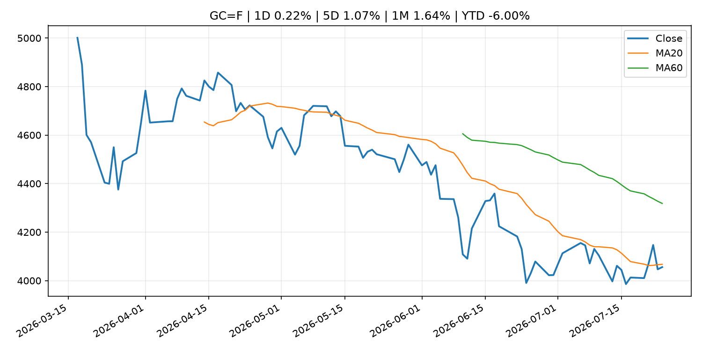
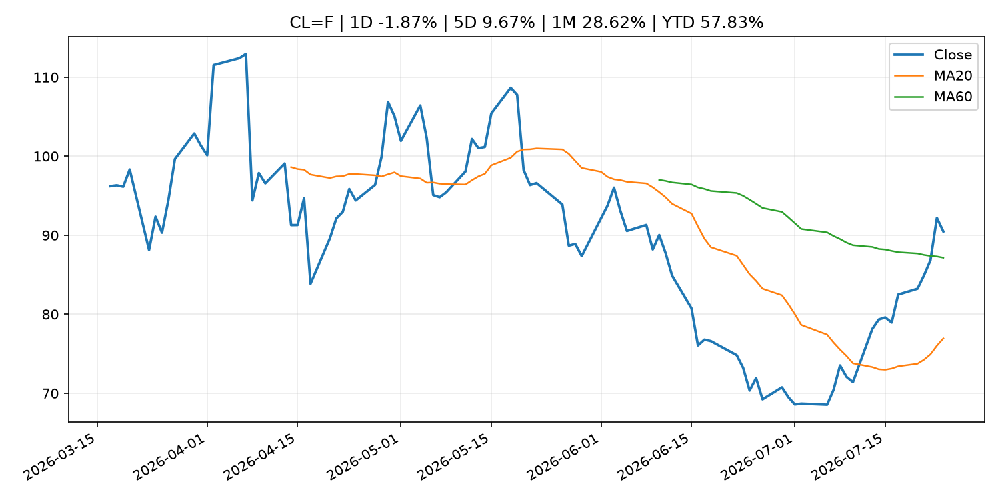
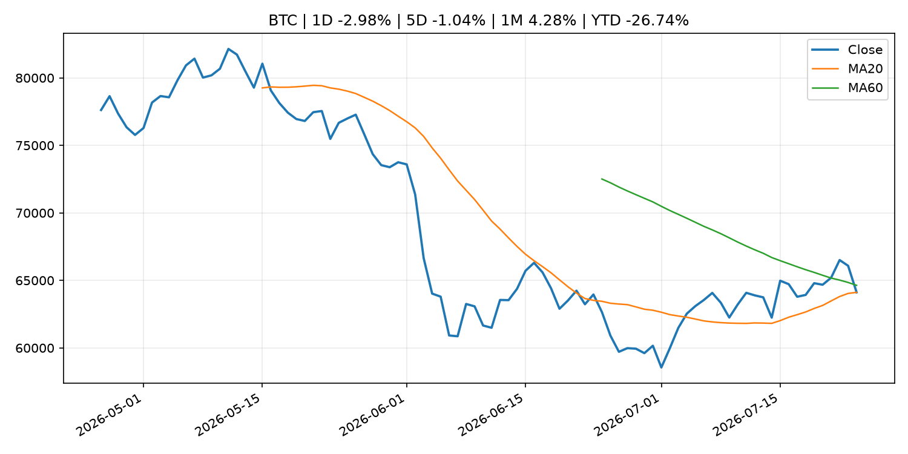
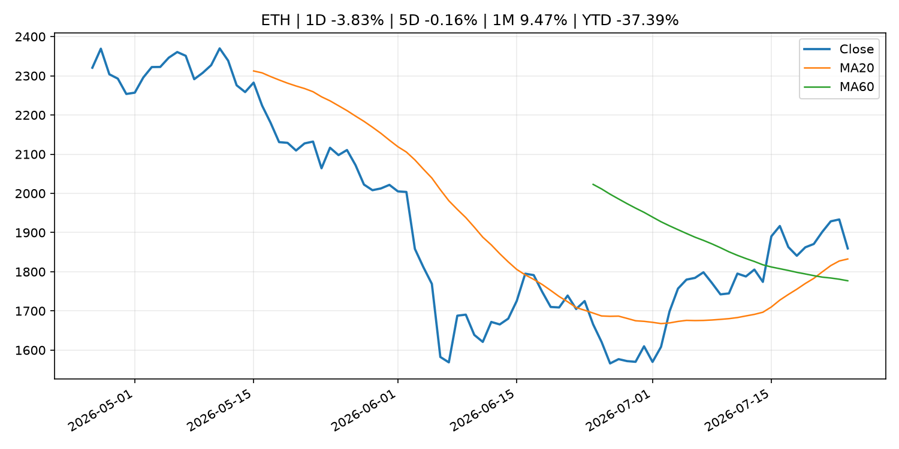
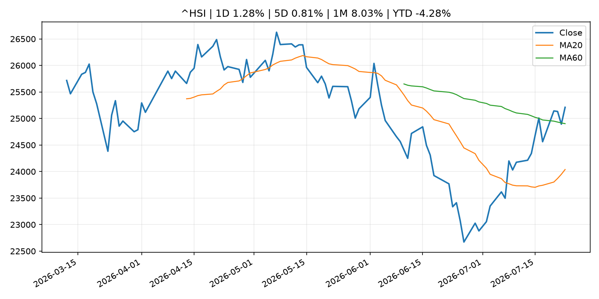

# Global Macro Morning Briefing - 2026-07-25

> Not financial advice / 非投资建议。

## 0. 今日总览
- 市场状态：unknown。市场信号不足，暂不判断明确状态。
- 今日三大主线：
  1. fiscal_policy: These 16 states are offering tax-free shopping days as back-to-school costs soar to over $800 per student
  2. central_bank_decision: Odds of Federal Reserve rate hike surge as oil prices rip higher
  3. fiscal_policy: EU hits Russia with massive 21st sanctions package targeting $120B crypto network
- 一句话结论：今日晨报重点关注：财政和贸易政策会影响增长、通胀、企业利润和跨境资本流。；央行决策会重定价利率、汇率、久期资产和风险资产。。跨资产方面，SPY 1D 0.10%；QQQ 1D -1.12%；^VIX 1D -0.64%；TLT 1D 0.10%；GC=F 1D 0.22%；CL=F 1D -1.87%；BTC 1D -2.98%；ETH 1D -3.83%；市场信号不足，暂不判断明确状态。政策、通胀、利率、美元、美债、能源和加密监管仍是主要观察线索。所有结论仅基于公开数据与短摘要整理，不构成投资建议。

## 1. 隔夜跨资产市场
- 美股：SPY 1D 0.10%，QQQ 1D -1.12%，整体趋势需结合 VIX 和利率确认。
- 美债/美元：TLT 1D 0.10%，美元指数 1D 0.03%，是判断折现率压力的核心线索。
- 黄金/原油：黄金 1D 0.22%，原油 1D -1.87%，用于观察避险、通胀和地缘风险。
- 加密：BTC 1D -2.98%，ETH 1D -3.83%，关注是否独立于纳指走出加密自身行情。
- 港股/A股：恒生 1D 1.28%，沪深300/上证 1D n/a，重点看中国政策预期与人民币线索。
- 风险观察：关注后续数据是否确认当前跨资产信号。

### US_EQUITY

| symbol | latest close | 1D | 5D | 1M | YTD | trend |
|---|---:|---:|---:|---:|---:|---|
| SPY | 738.93 | 0.10% | -0.59% | 0.78% | 8.16% | range_bound |
| QQQ | 684.23 | -1.12% | -1.60% | -3.71% | 11.60% | strong_downtrend |
| DIA | 518.76 | 0.48% | -0.39% | 0.05% | 7.26% | range_bound |
| IWM | 291.17 | -0.31% | -0.98% | -1.86% | 17.04% | range_bound |
| VTI | 364.80 | 0.03% | -0.60% | 0.32% | 8.47% | range_bound |

### US_MACRO_MARKET

| symbol | latest close | 1D | 5D | 1M | YTD | trend |
|---|---:|---:|---:|---:|---:|---|
| ^VIX | 18.58 | -0.64% | -1.01% | -0.27% | 28.05% | range_bound |
| DX-Y.NYB | 101.46 | 0.03% | 0.71% | -0.14% | 3.09% | uptrend |
| TLT | 83.25 | 0.10% | -1.50% | -4.73% | -4.34% | strong_downtrend |
| IEF | 93.03 | 0.19% | -0.86% | -1.79% | -3.17% | downtrend |

### COMMODITIES

| symbol | latest close | 1D | 5D | 1M | YTD | trend |
|---|---:|---:|---:|---:|---:|---|
| GC=F | 4,055.70 | 0.22% | 1.07% | 1.64% | -6.00% | downtrend |
| SI=F | 58.49 | 1.20% | 4.38% | 0.75% | -17.10% | downtrend |
| CL=F | 90.47 | -1.87% | 9.67% | 28.62% | 57.83% | range_bound |
| BZ=F | 98.38 | -2.29% | 11.67% | 33.41% | 61.94% | range_bound |
| NG=F | 2.91 | -0.27% | -0.10% | -9.72% | -19.62% | strong_downtrend |
| HG=F | 6.34 | 0.55% | 1.92% | 6.67% | 12.40% | range_bound |

### HK_MARKET

| symbol | latest close | 1D | 5D | 1M | YTD | trend |
|---|---:|---:|---:|---:|---:|---|
| ^HSI | 25,210.81 | 1.28% | 0.81% | 8.03% | -4.28% | range_bound |
| 0700.HK | 434.60 | -2.38% | -5.85% | 1.35% | -30.24% | downtrend |
| 9988.HK | 110.00 | -4.26% | -2.31% | 10.66% | -26.17% | range_bound |
| 3690.HK | 86.70 | -0.69% | 3.65% | 27.97% | -17.11% | range_bound |
| 1810.HK | 26.72 | -1.55% | -0.60% | 16.38% | -33.66% | range_bound |
| 1211.HK | 88.65 | 0.00% | -0.06% | 16.72% | -10.23% | range_bound |

### CRYPTO

| symbol | latest close | 1D | 5D | 1M | YTD | trend |
|---|---:|---:|---:|---:|---:|---|
| BTC | 64,116.23 | -2.98% | -1.04% | 4.28% | -26.74% | range_bound |
| ETH | 1,859.39 | -3.83% | -0.16% | 9.47% | -37.39% | strong_uptrend |
| SOLANA | 73.89 | -5.20% | -2.11% | -8.35% | -40.66% | range_bound |
| BINANCECOIN | 564.49 | -1.09% | -1.02% | 1.14% | -34.57% | downtrend |
| RIPPLE | 1.09 | -4.38% | -0.07% | 0.42% | -40.70% | downtrend |

## 2. 今日最重要的 10 条新闻
### 1. These 16 states are offering tax-free shopping days as back-to-school costs soar to over $800 per student
- 来源：MarketWatch Top Stories
- 时间：2026-07-24T21:21:00+00:00
- 地区：US
- 事件类型：fiscal_policy
- 重要性层级：Tier 1
- 一句话摘要：As inflation continues to squeeze household budgets, parents and students are on a mission to find back-to-school bargains.
- 为什么重要：财政和贸易政策会影响增长、通胀、企业利润和跨境资本流。
- 可能影响：主要影响 DXY，方向为 positive，强度 high；通胀压力可能推高政策利率预期并支撑美元。
  - 资产：DXY
    方向：positive
    强度：high
    原因：通胀压力可能推高政策利率预期并支撑美元。
  - 资产：TLT
    方向：negative
    强度：high
    原因：通胀上行通常推升收益率、压低长债价格。
  - 资产：QQQ
    方向：negative
    强度：high
    原因：更高利率对成长股估值折现率不利。
  - 资产：SPY
    方向：mixed
    强度：medium
    原因：名义增长可能支撑收入，但更高利率压制估值。
  - 资产：GC=F
    方向：mixed
    强度：medium
    原因：通胀对黄金是支撑，但实际利率上行会形成压力。
  - 资产：BTC
    方向：mixed
    强度：medium
    原因：抗通胀叙事和流动性收紧可能相互抵消。
- 原文链接：[https://www.marketwatch.com/story/these-16-states-are-offering-tax-holidays-as-back-to-school-costs-soar-to-over-800-per-student-0ec92464?mod=mw_rss_topstories](https://www.marketwatch.com/story/these-16-states-are-offering-tax-holidays-as-back-to-school-costs-soar-to-over-800-per-student-0ec92464?mod=mw_rss_topstories)

### 2. Odds of Federal Reserve rate hike surge as oil prices rip higher
- 来源：CNBC Economy
- 时间：2026-07-23T20:25:28+00:00
- 地区：US
- 事件类型：central_bank_decision
- 重要性层级：Tier 1
- 一句话摘要：Investors are increasingly readying for the Federal Reserve to hike interest rates in September.
- 为什么重要：央行决策会重定价利率、汇率、久期资产和风险资产。
- 可能影响：主要影响 QQQ，方向为 negative，强度 high；鹰派政策提高折现率，压制成长股估值。
  - 资产：QQQ
    方向：negative
    强度：high
    原因：鹰派政策提高折现率，压制成长股估值。
  - 资产：SPY
    方向：negative
    强度：medium
    原因：更紧政策通常削弱风险偏好。
  - 资产：TLT
    方向：negative
    强度：high
    原因：利率上行通常压低长债价格。
  - 资产：DXY
    方向：positive
    强度：high
    原因：更高利率预期通常支撑美元。
  - 资产：BTC
    方向：negative
    强度：high
    原因：流动性收紧通常压制高 beta 加密资产。
  - 资产：CL=F
    方向：positive
    强度：high
    原因：供给扰动或 OPEC 减产通常推升 WTI 原油。
- 原文链接：[https://www.cnbc.com/2026/07/23/fed-interest-rate-odds-oil-jobless-claims.html](https://www.cnbc.com/2026/07/23/fed-interest-rate-odds-oil-jobless-claims.html)

### 3. EU hits Russia with massive 21st sanctions package targeting $120B crypto network
- 来源：CoinDesk
- 时间：2026-07-24T11:58:06+00:00
- 地区：global
- 事件类型：fiscal_policy
- 重要性层级：Tier 1
- 一句话摘要：EU hits Russia with massive 21st sanctions package targeting $120B crypto network
- 为什么重要：财政和贸易政策会影响增长、通胀、企业利润和跨境资本流。
- 可能影响：可能影响利率、汇率、风险资产或大宗商品预期，但当前公开信息不足以判断明确方向。
  - 资产：暂无明确资产映射
  - 方向：unknown
  - 强度：low
  - 原因：公开信息不足以判断方向。
- 原文链接：[https://www.coindesk.com/policy/2026/07/24/eu-hits-russia-with-massive-21st-sanctions-package-targeting-usd120b-crypto-network](https://www.coindesk.com/policy/2026/07/24/eu-hits-russia-with-massive-21st-sanctions-package-targeting-usd120b-crypto-network)

### 4. SEC Announces Roundtable on Preparations for 24-Hour Trading
- 来源：SEC Press Releases
- 时间：2026-07-23T11:04:00-04:00
- 地区：US
- 事件类型：regulation
- 重要性层级：Tier 2
- 一句话摘要：The Securities and Exchange Commission announced today that it will host a roundtable on Sept. 17, 2026, to discuss moving towards 24-hour trading in the U.S. equity markets, including preparations to support overnight trading, operations and resiliency…
- 为什么重要：监管变化会改变行业盈利预期和资产风险溢价。
- 可能影响：主要影响 BTC，方向为 mixed，强度 high；加密监管或 ETF 进展会改变 BTC 的资金流和风险溢价。
  - 资产：BTC
    方向：mixed
    强度：high
    原因：加密监管或 ETF 进展会改变 BTC 的资金流和风险溢价。
  - 资产：ETH
    方向：mixed
    强度：high
    原因：监管框架会影响 ETH 产品化和机构参与度。
  - 资产：COIN
    方向：mixed
    强度：medium
    原因：监管清晰度和执法风险会影响交易平台估值。
  - 资产：crypto market
    方向：mixed
    强度：high
    原因：信息影响整个加密市场结构，但方向取决于细节。
- 原文链接：[https://www.sec.gov/newsroom/press-releases/2026-69-sec-announces-roundtable-preparations-24-hour-trading](https://www.sec.gov/newsroom/press-releases/2026-69-sec-announces-roundtable-preparations-24-hour-trading)

### 5. Tassat wants to help smaller banks tap the trillion-dollar stablecoin boom before Wall Street locks them out
- 来源：CoinDesk
- 时间：2026-07-23T18:10:02+00:00
- 地区：global
- 事件类型：crypto_market_structure
- 重要性层级：Tier 2
- 一句话摘要：Tassat wants to help smaller banks tap the trillion-dollar stablecoin boom before Wall Street locks them out
- 为什么重要：加密市场结构和监管变化会影响 BTC、ETH 及相关股票的风险溢价。
- 可能影响：主要影响 BTC，方向为 mixed，强度 high；加密监管或 ETF 进展会改变 BTC 的资金流和风险溢价。
  - 资产：BTC
    方向：mixed
    强度：high
    原因：加密监管或 ETF 进展会改变 BTC 的资金流和风险溢价。
  - 资产：ETH
    方向：mixed
    强度：high
    原因：监管框架会影响 ETH 产品化和机构参与度。
  - 资产：COIN
    方向：mixed
    强度：medium
    原因：监管清晰度和执法风险会影响交易平台估值。
  - 资产：crypto market
    方向：mixed
    强度：high
    原因：信息影响整个加密市场结构，但方向取决于细节。
- 原文链接：[https://www.coindesk.com/business/2026/07/23/tassat-wants-to-help-smaller-banks-tap-the-trillion-dollar-stablecoin-boom-before-wall-street-lock-them-out](https://www.coindesk.com/business/2026/07/23/tassat-wants-to-help-smaller-banks-tap-the-trillion-dollar-stablecoin-boom-before-wall-street-lock-them-out)

### 6. The SEC settles with Coinbase over its missing Gary Gensler texts
- 来源：CoinDesk
- 时间：2026-07-23T15:36:39+00:00
- 地区：global
- 事件类型：regulation
- 重要性层级：Tier 2
- 一句话摘要：The SEC settles with Coinbase over its missing Gary Gensler texts
- 为什么重要：监管变化会改变行业盈利预期和资产风险溢价。
- 可能影响：主要影响 BTC，方向为 mixed，强度 high；加密监管或 ETF 进展会改变 BTC 的资金流和风险溢价。
  - 资产：BTC
    方向：mixed
    强度：high
    原因：加密监管或 ETF 进展会改变 BTC 的资金流和风险溢价。
  - 资产：ETH
    方向：mixed
    强度：high
    原因：监管框架会影响 ETH 产品化和机构参与度。
  - 资产：COIN
    方向：mixed
    强度：medium
    原因：监管清晰度和执法风险会影响交易平台估值。
  - 资产：crypto market
    方向：mixed
    强度：high
    原因：信息影响整个加密市场结构，但方向取决于细节。
- 原文链接：[https://www.coindesk.com/policy/2026/07/23/sec-agrees-to-end-lawsuit-over-missing-ethereum-records-will-pay-usd150-000-in-fees](https://www.coindesk.com/policy/2026/07/23/sec-agrees-to-end-lawsuit-over-missing-ethereum-records-will-pay-usd150-000-in-fees)

### 7. Bitcoin settles near $65,000 as oil's march toward $100 fails to spook the market
- 来源：CoinDesk
- 时间：2026-07-24T11:19:38+00:00
- 地区：global
- 事件类型：other
- 重要性层级：Tier 3
- 一句话摘要：Bitcoin settles near $65,000 as oil's march toward $100 fails to spook the market
- 为什么重要：这条信息暂未匹配到重大宏观、政策或市场事件，更适合作为背景跟踪。
- 可能影响：主要影响 CL=F，方向为 positive，强度 high；供给扰动或 OPEC 减产通常推升 WTI 原油。
  - 资产：CL=F
    方向：positive
    强度：high
    原因：供给扰动或 OPEC 减产通常推升 WTI 原油。
  - 资产：BZ=F
    方向：positive
    强度：high
    原因：全球供给风险通常直接影响 Brent 原油。
  - 资产：SPY
    方向：mixed
    强度：medium
    原因：能源股可能受益，但通胀和成本压力不利于宽基风险资产。
- 原文链接：[https://www.coindesk.com/markets/2026/07/24/bitcoin-settles-near-usd65-000-as-oil-s-march-toward-usd100-fails-to-spook-the-market](https://www.coindesk.com/markets/2026/07/24/bitcoin-settles-near-usd65-000-as-oil-s-march-toward-usd100-fails-to-spook-the-market)

### 8. Philip R. Lane: Outlook for the euro area economy
- 来源：ECB Press Releases
- 时间：2026-07-24T17:30:00+02:00
- 地区：EU
- 事件类型：other
- 重要性层级：Tier 3
- 一句话摘要：Philip R. Lane: Outlook for the euro area economy
- 为什么重要：这条信息暂未匹配到重大宏观、政策或市场事件，更适合作为背景跟踪。
- 可能影响：更偏背景信息，短期市场影响可能有限。
  - 资产：暂无明确资产映射
  - 方向：unknown
  - 强度：low
  - 原因：公开信息不足以判断方向。
- 原文链接：[https://www.ecb.europa.eu//press/key/date/2026/html/ecb.sp260724~d484b483b9.en.pdf](https://www.ecb.europa.eu//press/key/date/2026/html/ecb.sp260724~d484b483b9.en.pdf)

## 3. 政策与央行观察
### 1. These 16 states are offering tax-free shopping days as back-to-school costs soar to over $800 per student
- 来源：MarketWatch Top Stories
- 时间：2026-07-24T21:21:00+00:00
- 地区：US
- 事件类型：fiscal_policy
- 重要性层级：Tier 1
- 一句话摘要：As inflation continues to squeeze household budgets, parents and students are on a mission to find back-to-school bargains.
- 为什么重要：财政和贸易政策会影响增长、通胀、企业利润和跨境资本流。
- 可能影响：主要影响 DXY，方向为 positive，强度 high；通胀压力可能推高政策利率预期并支撑美元。
  - 资产：DXY
    方向：positive
    强度：high
    原因：通胀压力可能推高政策利率预期并支撑美元。
  - 资产：TLT
    方向：negative
    强度：high
    原因：通胀上行通常推升收益率、压低长债价格。
  - 资产：QQQ
    方向：negative
    强度：high
    原因：更高利率对成长股估值折现率不利。
  - 资产：SPY
    方向：mixed
    强度：medium
    原因：名义增长可能支撑收入，但更高利率压制估值。
  - 资产：GC=F
    方向：mixed
    强度：medium
    原因：通胀对黄金是支撑，但实际利率上行会形成压力。
  - 资产：BTC
    方向：mixed
    强度：medium
    原因：抗通胀叙事和流动性收紧可能相互抵消。
- 原文链接：[https://www.marketwatch.com/story/these-16-states-are-offering-tax-holidays-as-back-to-school-costs-soar-to-over-800-per-student-0ec92464?mod=mw_rss_topstories](https://www.marketwatch.com/story/these-16-states-are-offering-tax-holidays-as-back-to-school-costs-soar-to-over-800-per-student-0ec92464?mod=mw_rss_topstories)

### 2. Odds of Federal Reserve rate hike surge as oil prices rip higher
- 来源：CNBC Economy
- 时间：2026-07-23T20:25:28+00:00
- 地区：US
- 事件类型：central_bank_decision
- 重要性层级：Tier 1
- 一句话摘要：Investors are increasingly readying for the Federal Reserve to hike interest rates in September.
- 为什么重要：央行决策会重定价利率、汇率、久期资产和风险资产。
- 可能影响：主要影响 QQQ，方向为 negative，强度 high；鹰派政策提高折现率，压制成长股估值。
  - 资产：QQQ
    方向：negative
    强度：high
    原因：鹰派政策提高折现率，压制成长股估值。
  - 资产：SPY
    方向：negative
    强度：medium
    原因：更紧政策通常削弱风险偏好。
  - 资产：TLT
    方向：negative
    强度：high
    原因：利率上行通常压低长债价格。
  - 资产：DXY
    方向：positive
    强度：high
    原因：更高利率预期通常支撑美元。
  - 资产：BTC
    方向：negative
    强度：high
    原因：流动性收紧通常压制高 beta 加密资产。
  - 资产：CL=F
    方向：positive
    强度：high
    原因：供给扰动或 OPEC 减产通常推升 WTI 原油。
- 原文链接：[https://www.cnbc.com/2026/07/23/fed-interest-rate-odds-oil-jobless-claims.html](https://www.cnbc.com/2026/07/23/fed-interest-rate-odds-oil-jobless-claims.html)

### 3. EU hits Russia with massive 21st sanctions package targeting $120B crypto network
- 来源：CoinDesk
- 时间：2026-07-24T11:58:06+00:00
- 地区：global
- 事件类型：fiscal_policy
- 重要性层级：Tier 1
- 一句话摘要：EU hits Russia with massive 21st sanctions package targeting $120B crypto network
- 为什么重要：财政和贸易政策会影响增长、通胀、企业利润和跨境资本流。
- 可能影响：可能影响利率、汇率、风险资产或大宗商品预期，但当前公开信息不足以判断明确方向。
  - 资产：暂无明确资产映射
  - 方向：unknown
  - 强度：low
  - 原因：公开信息不足以判断方向。
- 原文链接：[https://www.coindesk.com/policy/2026/07/24/eu-hits-russia-with-massive-21st-sanctions-package-targeting-usd120b-crypto-network](https://www.coindesk.com/policy/2026/07/24/eu-hits-russia-with-massive-21st-sanctions-package-targeting-usd120b-crypto-network)

### 4. SEC Announces Roundtable on Preparations for 24-Hour Trading
- 来源：SEC Press Releases
- 时间：2026-07-23T11:04:00-04:00
- 地区：US
- 事件类型：regulation
- 重要性层级：Tier 2
- 一句话摘要：The Securities and Exchange Commission announced today that it will host a roundtable on Sept. 17, 2026, to discuss moving towards 24-hour trading in the U.S. equity markets, including preparations to support overnight trading, operations and resiliency…
- 为什么重要：监管变化会改变行业盈利预期和资产风险溢价。
- 可能影响：主要影响 BTC，方向为 mixed，强度 high；加密监管或 ETF 进展会改变 BTC 的资金流和风险溢价。
  - 资产：BTC
    方向：mixed
    强度：high
    原因：加密监管或 ETF 进展会改变 BTC 的资金流和风险溢价。
  - 资产：ETH
    方向：mixed
    强度：high
    原因：监管框架会影响 ETH 产品化和机构参与度。
  - 资产：COIN
    方向：mixed
    强度：medium
    原因：监管清晰度和执法风险会影响交易平台估值。
  - 资产：crypto market
    方向：mixed
    强度：high
    原因：信息影响整个加密市场结构，但方向取决于细节。
- 原文链接：[https://www.sec.gov/newsroom/press-releases/2026-69-sec-announces-roundtable-preparations-24-hour-trading](https://www.sec.gov/newsroom/press-releases/2026-69-sec-announces-roundtable-preparations-24-hour-trading)

### 5. Tassat wants to help smaller banks tap the trillion-dollar stablecoin boom before Wall Street locks them out
- 来源：CoinDesk
- 时间：2026-07-23T18:10:02+00:00
- 地区：global
- 事件类型：crypto_market_structure
- 重要性层级：Tier 2
- 一句话摘要：Tassat wants to help smaller banks tap the trillion-dollar stablecoin boom before Wall Street locks them out
- 为什么重要：加密市场结构和监管变化会影响 BTC、ETH 及相关股票的风险溢价。
- 可能影响：主要影响 BTC，方向为 mixed，强度 high；加密监管或 ETF 进展会改变 BTC 的资金流和风险溢价。
  - 资产：BTC
    方向：mixed
    强度：high
    原因：加密监管或 ETF 进展会改变 BTC 的资金流和风险溢价。
  - 资产：ETH
    方向：mixed
    强度：high
    原因：监管框架会影响 ETH 产品化和机构参与度。
  - 资产：COIN
    方向：mixed
    强度：medium
    原因：监管清晰度和执法风险会影响交易平台估值。
  - 资产：crypto market
    方向：mixed
    强度：high
    原因：信息影响整个加密市场结构，但方向取决于细节。
- 原文链接：[https://www.coindesk.com/business/2026/07/23/tassat-wants-to-help-smaller-banks-tap-the-trillion-dollar-stablecoin-boom-before-wall-street-lock-them-out](https://www.coindesk.com/business/2026/07/23/tassat-wants-to-help-smaller-banks-tap-the-trillion-dollar-stablecoin-boom-before-wall-street-lock-them-out)

### 6. The SEC settles with Coinbase over its missing Gary Gensler texts
- 来源：CoinDesk
- 时间：2026-07-23T15:36:39+00:00
- 地区：global
- 事件类型：regulation
- 重要性层级：Tier 2
- 一句话摘要：The SEC settles with Coinbase over its missing Gary Gensler texts
- 为什么重要：监管变化会改变行业盈利预期和资产风险溢价。
- 可能影响：主要影响 BTC，方向为 mixed，强度 high；加密监管或 ETF 进展会改变 BTC 的资金流和风险溢价。
  - 资产：BTC
    方向：mixed
    强度：high
    原因：加密监管或 ETF 进展会改变 BTC 的资金流和风险溢价。
  - 资产：ETH
    方向：mixed
    强度：high
    原因：监管框架会影响 ETH 产品化和机构参与度。
  - 资产：COIN
    方向：mixed
    强度：medium
    原因：监管清晰度和执法风险会影响交易平台估值。
  - 资产：crypto market
    方向：mixed
    强度：high
    原因：信息影响整个加密市场结构，但方向取决于细节。
- 原文链接：[https://www.coindesk.com/policy/2026/07/23/sec-agrees-to-end-lawsuit-over-missing-ethereum-records-will-pay-usd150-000-in-fees](https://www.coindesk.com/policy/2026/07/23/sec-agrees-to-end-lawsuit-over-missing-ethereum-records-will-pay-usd150-000-in-fees)

## 4. 市场异动与图表
- QQQ 下跌 -1.12%
- Oil 下跌 -1.87%
- BTC 下跌 -2.98%
- ETH 下跌 -3.83%

### SPY

### QQQ

### ^VIX

### TLT

### GC=F

### CL=F

### BTC

### ETH

### ^HSI

## 5. 华尔街与机构公开观点
- 暂无可靠公开观点。

## 6. 今日重点关注
- 经济数据：经济数据：暂无可靠公开日历数据；如配置经济日历源后可自动填充。
- 央行讲话：央行讲话：暂无可靠公开日历数据；重点跟踪 Fed、ECB、BoJ、PBOC 官网 RSS。
- 财报：财报：暂无可靠数据。
- 政策事件：政策事件：暂无可靠数据。
- 风险提醒：风险提醒：关注数据源失败项、突发地缘风险、利率和美元的二阶反应。

## 7. 英文金融表达与宏观概念
- **inflation expectations**：通胀预期，指家庭、企业或市场对未来通胀的预估。 例句：Inflation expectations can shape wage bargaining and bond yields.
- **real yield**：实际收益率，名义利率扣除通胀预期后的收益率。 例句：Gold often reacts more to real yields than nominal yields.
- **terminal rate**：终端利率，市场预期本轮加息周期的最高政策利率。 例句：A higher terminal rate can pressure growth stocks.
- **risk-off**：避险模式，资金偏向美元、国债、黄金等防御资产。 例句：A geopolitical shock can push markets into risk-off mode.
- **supply disruption**：供给扰动，通常指能源或商品供应受冲突、减产或天气影响。 例句：Supply disruption can lift oil prices and inflation expectations.
- **market structure**：市场结构，指交易、托管、清算、ETF、监管等制度安排。 例句：Crypto market structure rules can affect institutional participation.

## 8. 背景材料
- [I will definitely claim Social Security early. Why do so few people talk about the elephant in the room?](https://www.marketwatch.com/story/i-will-claim-social-security-early-why-do-so-few-people-talk-about-the-elephant-in-the-room-64820675?mod=mw_rss_topstories)（MarketWatch Top Stories，other）：“The strongest argument for claiming benefits earlier goes beyond the traditional break-even analyses.”
- [The stock market is completely unprepared for a 6% yield on the 30-year Treasury](https://www.marketwatch.com/story/the-30-year-treasury-yield-is-closing-in-on-5-2-a-surge-to-6-could-slam-stocks-fa9631fb?mod=mw_rss_topstories)（MarketWatch Top Stories，other）：Long-bond spike would crush stock gains and deepen bond-fund losses.
- [I am a 63-year-old semiretired physician. If I saved $2 million for retirement, should my Social Security become optional?](https://www.marketwatch.com/story/i-am-a-63-year-old-semiretired-physician-if-you-have-saved-2-million-for-retirement-should-social-security-be-optional-0de70d53?mod=mw_rss_topstories)（MarketWatch Top Stories，other）：“At that point, they arguably no longer need the government’s retirement safety net.”
- [Before you ask AI to invest your life savings, you need to understand its hidden biases](https://www.marketwatch.com/story/can-ai-replace-your-financial-adviser-why-bots-still-cant-match-human-judgment-ddb5903a?mod=mw_rss_topstories)（MarketWatch Top Stories，other）：Bots can build a portfolio in seconds — but wait until you see where their financial advice fails.
- [Philip R. Lane: Outlook for the euro area economy](https://www.ecb.europa.eu//press/key/date/2026/html/ecb.sp260724~d484b483b9.en.pdf)（ECB Press Releases，other）：Philip R. Lane: Outlook for the euro area economy
- [Sam Altman-backed World Network secures $52.5 million in fresh funding to fight online AI deepfakes](https://www.coindesk.com/business/2026/07/24/sam-altman-backed-world-network-secures-fresh-funding-to-fight-online-ai-deepfakes)（CoinDesk，other）：Sam Altman-backed World Network secures $52.5 million in fresh funding to fight online AI deepfakes
- [Saylor and team overhaul Strategy's bitcoin metrics as bear market persists](https://www.coindesk.com/markets/2026/07/24/saylor-and-team-overhaul-strategy-s-bitcoin-metrics-as-bear-market-persists)（CoinDesk，other）：Saylor and team overhaul Strategy's bitcoin metrics as bear market persists
- [Decisions taken by the Governing Council of the ECB (in addition to decisions setting interest rates)](https://www.ecb.europa.eu//press/govcdec/otherdec/2026/html/ecb.gc260724~eebbc30622.en.html)（ECB Press Releases，other）：Decisions taken by the Governing Council of the ECB (in addition to decisions setting interest rates)
- [A $5 billion cluster has formed in bitcoin options. It tells a bullish story](https://www.coindesk.com/markets/2026/07/24/a-usd5-billion-cluster-has-formed-in-bitcoin-options-it-tells-a-bullish-story)（CoinDesk，other）：A $5 billion cluster has formed in bitcoin options. It tells a bullish story
- [Bitcoin settles near $65,000 as oil's march toward $100 fails to spook the market](https://www.coindesk.com/markets/2026/07/24/bitcoin-settles-near-usd65-000-as-oil-s-march-toward-usd100-fails-to-spook-the-market)（CoinDesk，other）：Bitcoin settles near $65,000 as oil's march toward $100 fails to spook the market
- [Poolin was bitcoin's biggest mining pool and now it's filing for bankruptcy](https://www.coindesk.com/markets/2026/07/24/poolin-was-bitcoin-s-biggest-mining-pool-and-now-it-s-filing-for-bankruptcy)（CoinDesk，other）：Poolin was bitcoin's biggest mining pool and now it's filing for bankruptcy
- [Bitcoin treasury companies sell up, repay debt, pivot to AI as share prices collapse](https://www.coindesk.com/markets/2026/07/24/bitcoin-treasury-companies-sell-up-repay-debt-pivot-to-ai-as-share-prices-collapse)（CoinDesk，other）：Bitcoin treasury companies sell up, repay debt, pivot to AI as share prices collapse
- [India orders takedown of Jack Dorsey’s bitcoin-linked messaging app Bitchat](https://www.coindesk.com/tech/2026/07/24/india-orders-takedown-of-jack-dorsey-s-bitcoin-linked-messaging-app-bitchat)（CoinDesk，other）：India orders takedown of Jack Dorsey’s bitcoin-linked messaging app Bitchat
- [ECB to extend use of climate factors in Eurosystem collateral framework to non-financial corporate credit claims](https://www.ecb.europa.eu//press/pr/date/2026/html/ecb.pr260724_4~f082ce289d.en.html)（ECB Press Releases，other）：ECB to extend use of climate factors in Eurosystem collateral framework to non-financial corporate credit claims
- [Results of the June 2026 survey on credit terms and conditions in euro-denominated securities financing and OTC derivatives markets (SESFOD)](https://www.ecb.europa.eu//press/pr/date/2026/html/ecb.pr260724_3~c0b45e246f.en.html)（ECB Press Releases，other）：Results of the June 2026 survey on credit terms and conditions in euro-denominated securities financing and OTC derivatives markets (SESFOD)
- [ECB to start implementing enhanced repo facility for central banks](https://www.ecb.europa.eu//press/pr/date/2026/html/ecb.pr260724_2~d7d475d2f0.en.html)（ECB Press Releases，other）：ECB to start implementing enhanced repo facility for central banks
- [Results of the ECB Survey of Professional Forecasters for the third quarter of 2026](https://www.ecb.europa.eu//press/pr/date/2026/html/ecb.pr260724~a099353951.en.html)（ECB Press Releases，other）：Results of the ECB Survey of Professional Forecasters for the third quarter of 2026
- [ECB Consumer Expectations Survey results – June 2026](https://www.ecb.europa.eu//press/pr/date/2026/html/ecb.pr260724_1~fa277eb6fe.en.html)（ECB Press Releases，other）：ECB Consumer Expectations Survey results – June 2026
- [Live updates: Bitcoin gives up gains, falls below $64,000 as stocks retreat](https://www.coindesk.com/tech/2026/07/24/live-updates-dogecoin-and-ether-lead-pullback-as-investors-digest-tech-earnings)（CoinDesk，other）：Live updates: Bitcoin gives up gains, falls below $64,000 as stocks retreat
- [Bitcoin holds near $65,000 as $800 billion AI selloff leaves crypto largely untouched](https://www.coindesk.com/markets/2026/07/24/bitcoin-holds-near-usd65-000-as-usd800-billion-ai-selloff-leaves-crypto-largely-untouched)（CoinDesk，other）：Bitcoin holds near $65,000 as $800 billion AI selloff leaves crypto largely untouched

## 9. 数据源、失败项与免责声明
- 采集时间：2026-07-24T23:00:16
- 数据源：公开 RSS、Yahoo Finance、CoinGecko、AKShare、FRED、SEC data.sec.gov，以及用户自有 inputs/reports 文件。
- 合规说明：不绕过 WSJ、Bloomberg、FT、Reuters 等付费墙；对付费媒体只使用公开 RSS 标题、摘要、链接和发布时间。
- 免责声明：Not financial advice / 非投资建议。本项目仅供个人学习、研究和信息整理，不构成投资建议、交易建议或任何收益承诺。
- 失败或跳过的数据源：
  - crypto data failed coin=dogecoin
  - China market data failed symbol=上证指数: empty dataframe
  - China market data failed symbol=深证成指: empty dataframe
  - China market data failed symbol=创业板指: empty dataframe
  - China market data failed symbol=沪深300: empty dataframe
  - China market data failed symbol=中证500: empty dataframe
  - China market data failed symbol=科创50: empty dataframe
  - FRED_API_KEY not set; skipping FRED macro series
  - SEC failed cik=0000320193
  - SEC failed cik=0000789019
  - SEC failed cik=0001045810
  - SEC failed cik=0001318605
  - SEC failed cik=0001577552
