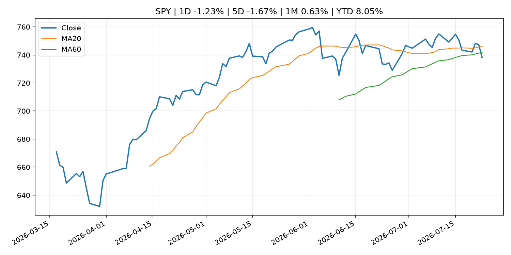
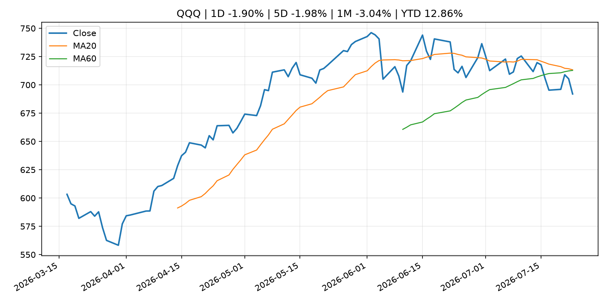
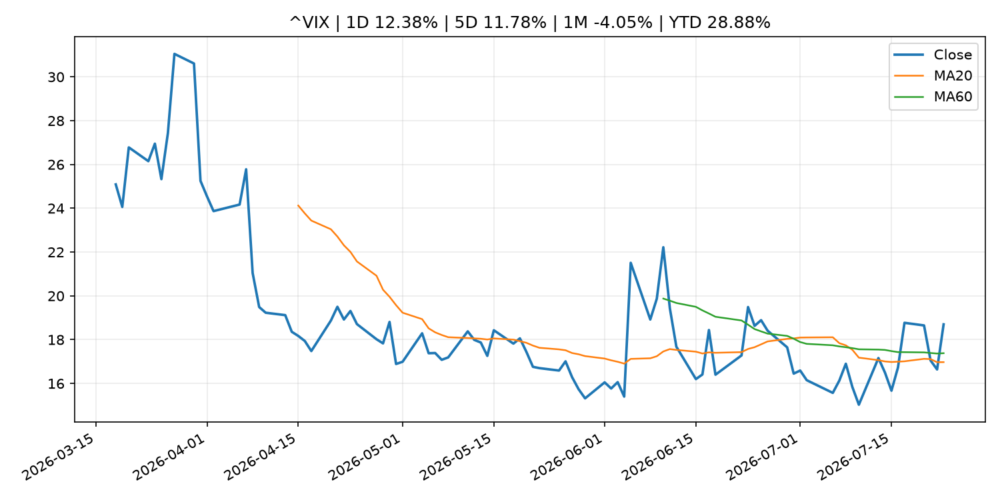
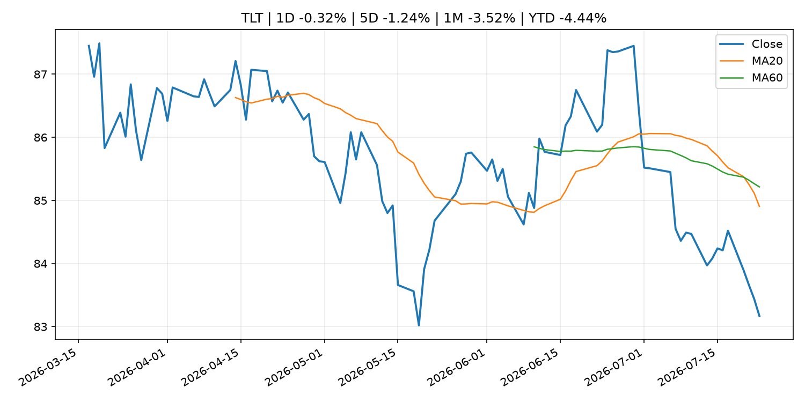
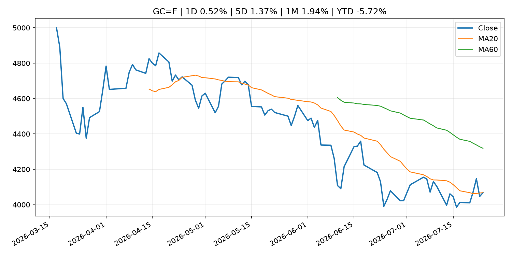
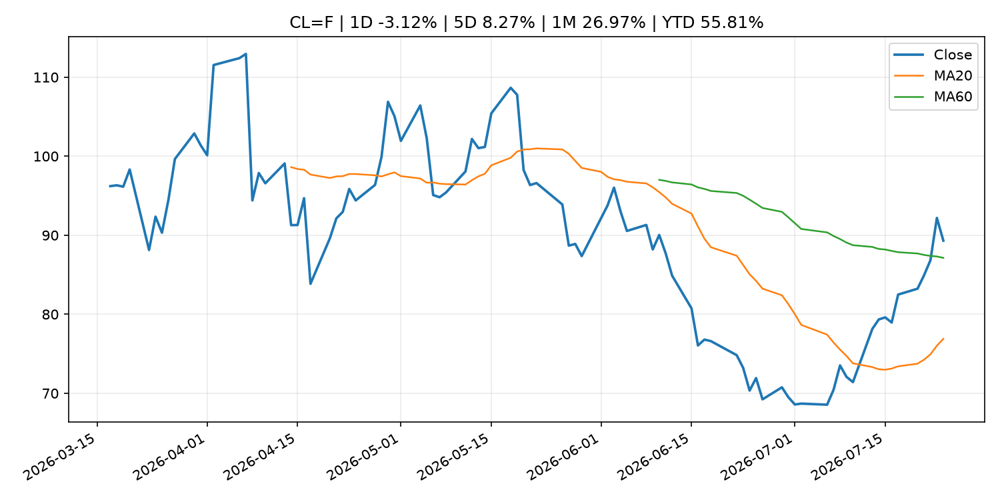
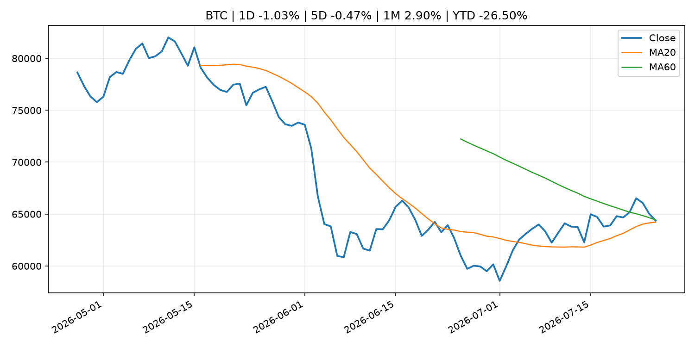
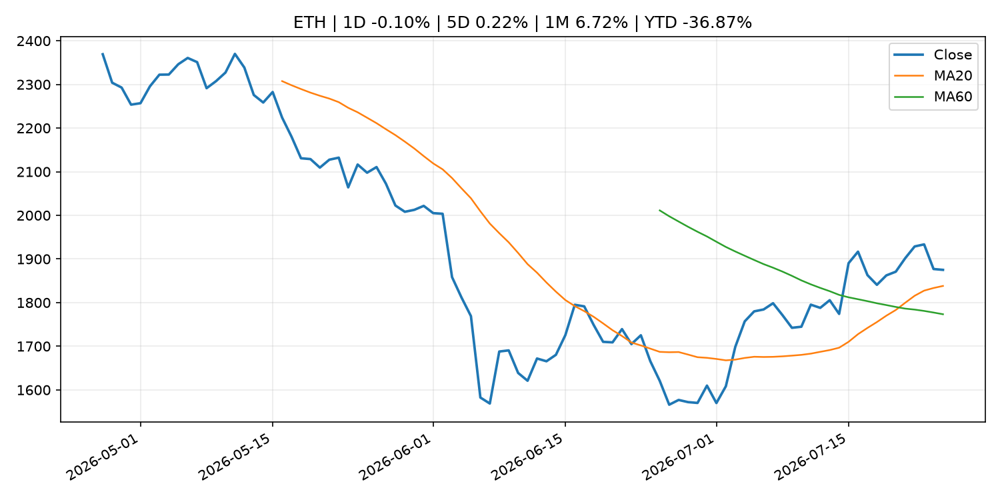

# Global Macro Morning Briefing - 2026-07-26

> Not financial advice / 非投资建议。

## 0. 今日总览
- 市场状态：mixed。股指回落、VIX 抬升且避险资产走强，市场偏风险规避。 但存在信号冲突，需要降低单一叙事置信度。
- 今日三大主线：
  1. fiscal_policy: EU hits Russia with massive 21st sanctions package targeting $120B crypto network
- 一句话结论：今日晨报重点关注：财政和贸易政策会影响增长、通胀、企业利润和跨境资本流。；这条信息暂未匹配到重大宏观、政策或市场事件，更适合作为背景跟踪。。跨资产方面，SPY 1D -1.23%；QQQ 1D -1.90%；^VIX 1D 12.38%；TLT 1D -0.32%；GC=F 1D 0.52%；CL=F 1D -3.12%；BTC 1D -1.03%；ETH 1D -0.10%；股指回落、VIX 抬升且避险资产走强，市场偏风险规避。 但存在信号冲突，需要降低单一叙事置信度。政策、通胀、利率、美元、美债、能源和加密监管仍是主要观察线索。所有结论仅基于公开数据与短摘要整理，不构成投资建议。

## 1. 隔夜跨资产市场
- 美股：SPY 1D -1.23%，QQQ 1D -1.90%，整体趋势需结合 VIX 和利率确认。
- 美债/美元：TLT 1D -0.32%，美元指数 1D 0.29%，是判断折现率压力的核心线索。
- 黄金/原油：黄金 1D 0.52%，原油 1D -3.12%，用于观察避险、通胀和地缘风险。
- 加密：BTC 1D -1.03%，ETH 1D -0.10%，关注是否独立于纳指走出加密自身行情。
- 港股/A股：恒生 1D 1.28%，沪深300/上证 1D n/a，重点看中国政策预期与人民币线索。
- 风险观察：关注避险是否演变为信用或流动性压力。

### US_EQUITY

| symbol | latest close | 1D | 5D | 1M | YTD | trend |
|---|---:|---:|---:|---:|---:|---|
| SPY | 738.18 | -1.23% | -1.67% | 0.63% | 8.05% | range_bound |
| QQQ | 691.96 | -1.90% | -1.98% | -3.04% | 12.86% | range_bound |
| DIA | 516.26 | -1.00% | -1.63% | -0.07% | 6.75% | range_bound |
| IWM | 292.09 | -0.58% | -1.18% | -1.09% | 17.41% | range_bound |
| VTI | 364.69 | -1.13% | -1.59% | 0.27% | 8.44% | range_bound |

### US_MACRO_MARKET

| symbol | latest close | 1D | 5D | 1M | YTD | trend |
|---|---:|---:|---:|---:|---:|---|
| ^VIX | 18.70 | 12.38% | 11.78% | -4.05% | 28.88% | range_bound |
| DX-Y.NYB | 101.43 | 0.29% | 0.69% | 0.02% | 3.06% | uptrend |
| TLT | 83.17 | -0.32% | -1.24% | -3.52% | -4.44% | strong_downtrend |
| IEF | 92.85 | -0.27% | -0.93% | -1.35% | -3.36% | downtrend |

### COMMODITIES

| symbol | latest close | 1D | 5D | 1M | YTD | trend |
|---|---:|---:|---:|---:|---:|---|
| GC=F | 4,067.60 | 0.52% | 1.37% | 1.94% | -5.72% | downtrend |
| SI=F | 58.66 | 1.48% | 4.67% | 1.04% | -16.87% | downtrend |
| CL=F | 89.31 | -3.12% | 8.27% | 26.97% | 55.81% | range_bound |
| BZ=F | 96.78 | -3.88% | 9.85% | 31.24% | 59.31% | range_bound |
| NG=F | 2.87 | -1.54% | -1.37% | -10.87% | -20.65% | strong_downtrend |
| HG=F | 6.32 | 0.24% | 1.61% | 6.34% | 12.06% | range_bound |

### HK_MARKET

| symbol | latest close | 1D | 5D | 1M | YTD | trend |
|---|---:|---:|---:|---:|---:|---|
| ^HSI | 25,210.81 | 1.28% | 0.81% | 8.03% | -4.28% | range_bound |
| 0700.HK | 434.60 | -2.38% | -5.85% | 1.35% | -30.24% | downtrend |
| 9988.HK | 110.00 | -4.26% | -2.31% | 10.66% | -26.17% | range_bound |
| 3690.HK | 86.70 | -0.69% | 3.65% | 27.97% | -17.11% | range_bound |
| 1810.HK | 26.72 | -1.55% | -0.60% | 16.38% | -33.66% | range_bound |
| 1211.HK | 88.65 | 0.00% | -0.06% | 16.72% | -10.23% | range_bound |

### CRYPTO

| symbol | latest close | 1D | 5D | 1M | YTD | trend |
|---|---:|---:|---:|---:|---:|---|
| BTC | 64,365.34 | -1.03% | -0.47% | 2.90% | -26.50% | range_bound |
| ETH | 1,875.02 | -0.10% | 0.22% | 6.72% | -36.87% | strong_uptrend |
| SOLANA | 74.46 | -1.72% | -2.42% | -9.51% | -40.20% | range_bound |
| BINANCECOIN | 569.12 | 0.38% | -0.25% | -0.74% | -34.03% | downtrend |
| RIPPLE | 1.10 | -0.61% | 0.29% | -3.01% | -40.23% | downtrend |

## 2. 今日最重要的 10 条新闻
### 1. EU hits Russia with massive 21st sanctions package targeting $120B crypto network
- 来源：CoinDesk
- 时间：2026-07-24T11:58:06+00:00
- 地区：global
- 事件类型：fiscal_policy
- 重要性层级：Tier 1
- 一句话摘要：EU hits Russia with massive 21st sanctions package targeting $120B crypto network
- 为什么重要：财政和贸易政策会影响增长、通胀、企业利润和跨境资本流。
- 可能影响：可能影响利率、汇率、风险资产或大宗商品预期，但当前公开信息不足以判断明确方向。
  - 资产：暂无明确资产映射
  - 方向：unknown
  - 强度：low
  - 原因：公开信息不足以判断方向。
- 原文链接：[https://www.coindesk.com/policy/2026/07/24/eu-hits-russia-with-massive-21st-sanctions-package-targeting-usd120b-crypto-network](https://www.coindesk.com/policy/2026/07/24/eu-hits-russia-with-massive-21st-sanctions-package-targeting-usd120b-crypto-network)

### 2. Bitcoin settles near $65,000 as oil's march toward $100 fails to spook the market
- 来源：CoinDesk
- 时间：2026-07-24T11:19:38+00:00
- 地区：global
- 事件类型：other
- 重要性层级：Tier 3
- 一句话摘要：Bitcoin settles near $65,000 as oil's march toward $100 fails to spook the market
- 为什么重要：这条信息暂未匹配到重大宏观、政策或市场事件，更适合作为背景跟踪。
- 可能影响：主要影响 CL=F，方向为 positive，强度 high；供给扰动或 OPEC 减产通常推升 WTI 原油。
  - 资产：CL=F
    方向：positive
    强度：high
    原因：供给扰动或 OPEC 减产通常推升 WTI 原油。
  - 资产：BZ=F
    方向：positive
    强度：high
    原因：全球供给风险通常直接影响 Brent 原油。
  - 资产：SPY
    方向：mixed
    强度：medium
    原因：能源股可能受益，但通胀和成本压力不利于宽基风险资产。
- 原文链接：[https://www.coindesk.com/markets/2026/07/24/bitcoin-settles-near-usd65-000-as-oil-s-march-toward-usd100-fails-to-spook-the-market](https://www.coindesk.com/markets/2026/07/24/bitcoin-settles-near-usd65-000-as-oil-s-march-toward-usd100-fails-to-spook-the-market)

### 3. I am a 63-year-old semiretired physician. If I saved $2 million for retirement, should my Social Security become optional?
- 来源：MarketWatch Top Stories
- 时间：2026-07-25T20:15:00+00:00
- 地区：US
- 事件类型：other
- 重要性层级：Tier 3
- 一句话摘要：“At that point, they arguably no longer need the government’s retirement safety net.”
- 为什么重要：这条信息暂未匹配到重大宏观、政策或市场事件，更适合作为背景跟踪。
- 可能影响：更偏背景信息，短期市场影响可能有限。
  - 资产：暂无明确资产映射
  - 方向：unknown
  - 强度：low
  - 原因：公开信息不足以判断方向。
- 原文链接：[https://www.marketwatch.com/story/i-am-a-63-year-old-semiretired-physician-if-you-have-saved-2-million-for-retirement-should-social-security-be-optional-0de70d53?mod=mw_rss_topstories](https://www.marketwatch.com/story/i-am-a-63-year-old-semiretired-physician-if-you-have-saved-2-million-for-retirement-should-social-security-be-optional-0de70d53?mod=mw_rss_topstories)

## 3. 政策与央行观察
### 1. EU hits Russia with massive 21st sanctions package targeting $120B crypto network
- 来源：CoinDesk
- 时间：2026-07-24T11:58:06+00:00
- 地区：global
- 事件类型：fiscal_policy
- 重要性层级：Tier 1
- 一句话摘要：EU hits Russia with massive 21st sanctions package targeting $120B crypto network
- 为什么重要：财政和贸易政策会影响增长、通胀、企业利润和跨境资本流。
- 可能影响：可能影响利率、汇率、风险资产或大宗商品预期，但当前公开信息不足以判断明确方向。
  - 资产：暂无明确资产映射
  - 方向：unknown
  - 强度：low
  - 原因：公开信息不足以判断方向。
- 原文链接：[https://www.coindesk.com/policy/2026/07/24/eu-hits-russia-with-massive-21st-sanctions-package-targeting-usd120b-crypto-network](https://www.coindesk.com/policy/2026/07/24/eu-hits-russia-with-massive-21st-sanctions-package-targeting-usd120b-crypto-network)

## 4. 市场异动与图表
- SPY 下跌 -1.23%
- QQQ 下跌 -1.90%
- VIX 上涨 12.38%
- Gold 上涨 0.52%
- Oil 下跌 -3.12%

### 信号矛盾
- 股债同时承压，可能是利率或流动性冲击而非传统避险。

### SPY

### QQQ

### ^VIX

### TLT

### GC=F

### CL=F

### BTC

### ETH

### ^HSI

## 5. 华尔街与机构公开观点
- 暂无可靠公开观点。

## 6. 今日重点关注
- 经济数据：经济数据：暂无可靠公开日历数据；如配置经济日历源后可自动填充。
- 央行讲话：央行讲话：暂无可靠公开日历数据；重点跟踪 Fed、ECB、BoJ、PBOC 官网 RSS。
- 财报：财报：暂无可靠数据。
- 政策事件：政策事件：暂无可靠数据。
- 风险提醒：风险提醒：关注数据源失败项、突发地缘风险、利率和美元的二阶反应。

## 7. 英文金融表达与宏观概念
- **risk-off**：避险模式，资金偏向美元、国债、黄金等防御资产。 例句：A geopolitical shock can push markets into risk-off mode.
- **supply disruption**：供给扰动，通常指能源或商品供应受冲突、减产或天气影响。 例句：Supply disruption can lift oil prices and inflation expectations.
- **market structure**：市场结构，指交易、托管、清算、ETF、监管等制度安排。 例句：Crypto market structure rules can affect institutional participation.
- **inflation expectations**：通胀预期，指家庭、企业或市场对未来通胀的预估。 例句：Inflation expectations can shape wage bargaining and bond yields.
- **real yield**：实际收益率，名义利率扣除通胀预期后的收益率。 例句：Gold often reacts more to real yields than nominal yields.
- **terminal rate**：终端利率，市场预期本轮加息周期的最高政策利率。 例句：A higher terminal rate can pressure growth stocks.

## 8. 背景材料
- [I am a 63-year-old semiretired physician. If I saved $2 million for retirement, should my Social Security become optional?](https://www.marketwatch.com/story/i-am-a-63-year-old-semiretired-physician-if-you-have-saved-2-million-for-retirement-should-social-security-be-optional-0de70d53?mod=mw_rss_topstories)（MarketWatch Top Stories，other）：“At that point, they arguably no longer need the government’s retirement safety net.”
- [Is your index fund an accidental bet on AI? These two massive ETFs show why it might be.](https://www.marketwatch.com/story/south-korean-stocks-werent-a-big-deal-in-your-emerging-markets-fund-artificial-intelligence-changed-that-21308089?mod=mw_rss_topstories)（MarketWatch Top Stories，other）：South Korean stocks weren’t a big deal in emerging-markets funds. Artificial intelligence changed that.
- [Philip R. Lane: Outlook for the euro area economy](https://www.ecb.europa.eu//press/key/date/2026/html/ecb.sp260724~d484b483b9.en.pdf)（ECB Press Releases，other）：Philip R. Lane: Outlook for the euro area economy
- [Sam Altman-backed World Network secures $52.5 million in fresh funding to fight online AI deepfakes](https://www.coindesk.com/business/2026/07/24/sam-altman-backed-world-network-secures-fresh-funding-to-fight-online-ai-deepfakes)（CoinDesk，other）：Sam Altman-backed World Network secures $52.5 million in fresh funding to fight online AI deepfakes
- [Saylor and team overhaul Strategy's bitcoin metrics as bear market persists](https://www.coindesk.com/markets/2026/07/24/saylor-and-team-overhaul-strategy-s-bitcoin-metrics-as-bear-market-persists)（CoinDesk，other）：Saylor and team overhaul Strategy's bitcoin metrics as bear market persists
- [Decisions taken by the Governing Council of the ECB (in addition to decisions setting interest rates)](https://www.ecb.europa.eu//press/govcdec/otherdec/2026/html/ecb.gc260724~eebbc30622.en.html)（ECB Press Releases，other）：Decisions taken by the Governing Council of the ECB (in addition to decisions setting interest rates)
- [A $5 billion cluster has formed in bitcoin options. It tells a bullish story](https://www.coindesk.com/markets/2026/07/24/a-usd5-billion-cluster-has-formed-in-bitcoin-options-it-tells-a-bullish-story)（CoinDesk，other）：A $5 billion cluster has formed in bitcoin options. It tells a bullish story
- [Bitcoin settles near $65,000 as oil's march toward $100 fails to spook the market](https://www.coindesk.com/markets/2026/07/24/bitcoin-settles-near-usd65-000-as-oil-s-march-toward-usd100-fails-to-spook-the-market)（CoinDesk，other）：Bitcoin settles near $65,000 as oil's march toward $100 fails to spook the market
- [Poolin was bitcoin's biggest mining pool and now it's filing for bankruptcy](https://www.coindesk.com/markets/2026/07/24/poolin-was-bitcoin-s-biggest-mining-pool-and-now-it-s-filing-for-bankruptcy)（CoinDesk，other）：Poolin was bitcoin's biggest mining pool and now it's filing for bankruptcy
- [Bitcoin treasury companies sell up, repay debt, pivot to AI as share prices collapse](https://www.coindesk.com/markets/2026/07/24/bitcoin-treasury-companies-sell-up-repay-debt-pivot-to-ai-as-share-prices-collapse)（CoinDesk，other）：Bitcoin treasury companies sell up, repay debt, pivot to AI as share prices collapse
- [India orders takedown of Jack Dorsey’s bitcoin-linked messaging app Bitchat](https://www.coindesk.com/tech/2026/07/24/india-orders-takedown-of-jack-dorsey-s-bitcoin-linked-messaging-app-bitchat)（CoinDesk，other）：India orders takedown of Jack Dorsey’s bitcoin-linked messaging app Bitchat
- [ECB to extend use of climate factors in Eurosystem collateral framework to non-financial corporate credit claims](https://www.ecb.europa.eu//press/pr/date/2026/html/ecb.pr260724_4~f082ce289d.en.html)（ECB Press Releases，other）：ECB to extend use of climate factors in Eurosystem collateral framework to non-financial corporate credit claims
- [Results of the June 2026 survey on credit terms and conditions in euro-denominated securities financing and OTC derivatives markets (SESFOD)](https://www.ecb.europa.eu//press/pr/date/2026/html/ecb.pr260724_3~c0b45e246f.en.html)（ECB Press Releases，other）：Results of the June 2026 survey on credit terms and conditions in euro-denominated securities financing and OTC derivatives markets (SESFOD)
- [ECB to start implementing enhanced repo facility for central banks](https://www.ecb.europa.eu//press/pr/date/2026/html/ecb.pr260724_2~d7d475d2f0.en.html)（ECB Press Releases，other）：ECB to start implementing enhanced repo facility for central banks
- [Results of the ECB Survey of Professional Forecasters for the third quarter of 2026](https://www.ecb.europa.eu//press/pr/date/2026/html/ecb.pr260724~a099353951.en.html)（ECB Press Releases，other）：Results of the ECB Survey of Professional Forecasters for the third quarter of 2026
- [ECB Consumer Expectations Survey results – June 2026](https://www.ecb.europa.eu//press/pr/date/2026/html/ecb.pr260724_1~fa277eb6fe.en.html)（ECB Press Releases，other）：ECB Consumer Expectations Survey results – June 2026
- [Live updates: Bitcoin gives up gains, falls below $64,000 as stocks retreat](https://www.coindesk.com/tech/2026/07/24/live-updates-dogecoin-and-ether-lead-pullback-as-investors-digest-tech-earnings)（CoinDesk，other）：Live updates: Bitcoin gives up gains, falls below $64,000 as stocks retreat
- [Bitcoin holds near $65,000 as $800 billion AI selloff leaves crypto largely untouched](https://www.coindesk.com/markets/2026/07/24/bitcoin-holds-near-usd65-000-as-usd800-billion-ai-selloff-leaves-crypto-largely-untouched)（CoinDesk，other）：Bitcoin holds near $65,000 as $800 billion AI selloff leaves crypto largely untouched
- [U.S., other nations back open-source AI with 'strong security' at China summit](https://www.cnbc.com/2026/07/24/china-ai-open-source-apec.html)（CNBC Economy，other）：The APEC statement is the first to include open-source cooperation at a minister level, said Li Lecheng, China's industry and information technology minister.

## 9. 数据源、失败项与免责声明
- 采集时间：2026-07-25T22:53:59
- 数据源：公开 RSS、Yahoo Finance、CoinGecko、AKShare、FRED、SEC data.sec.gov，以及用户自有 inputs/reports 文件。
- 合规说明：不绕过 WSJ、Bloomberg、FT、Reuters 等付费墙；对付费媒体只使用公开 RSS 标题、摘要、链接和发布时间。
- 免责声明：Not financial advice / 非投资建议。本项目仅供个人学习、研究和信息整理，不构成投资建议、交易建议或任何收益承诺。
- 失败或跳过的数据源：
  - crypto data failed coin=dogecoin
  - China market data failed symbol=上证指数: empty dataframe
  - China market data failed symbol=深证成指: empty dataframe
  - China market data failed symbol=创业板指: empty dataframe
  - China market data failed symbol=沪深300: empty dataframe
  - China market data failed symbol=中证500: empty dataframe
  - China market data failed symbol=科创50: empty dataframe
  - FRED_API_KEY not set; skipping FRED macro series
  - SEC failed cik=0000320193
  - SEC failed cik=0000789019
  - SEC failed cik=0001045810
  - SEC failed cik=0001318605
  - SEC failed cik=0001577552
