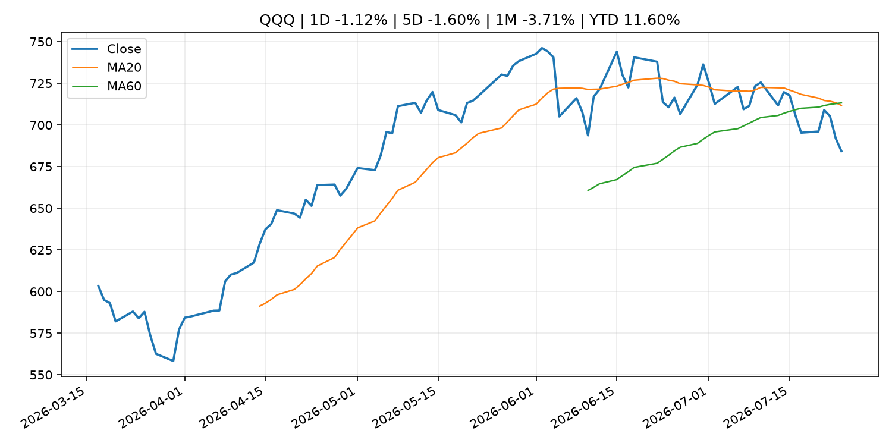
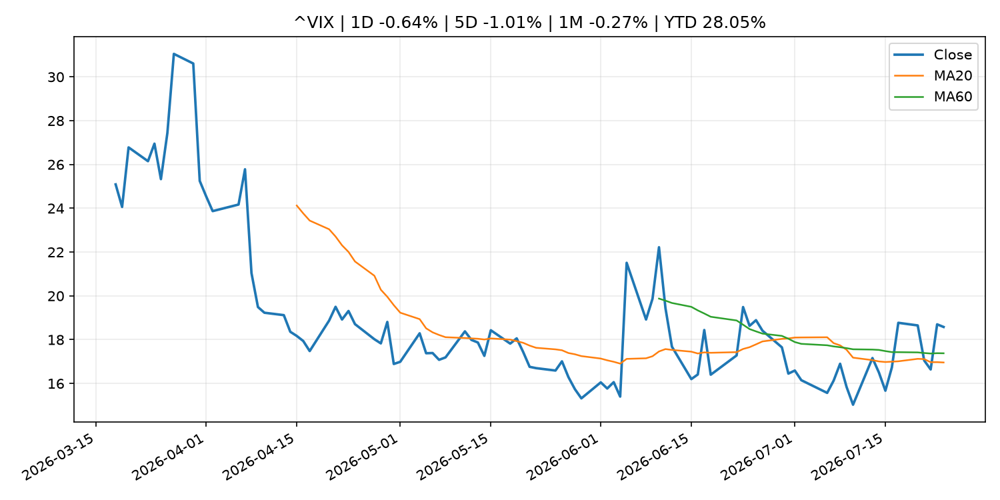
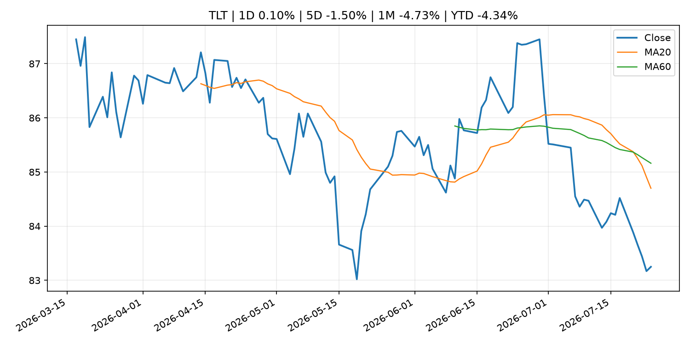
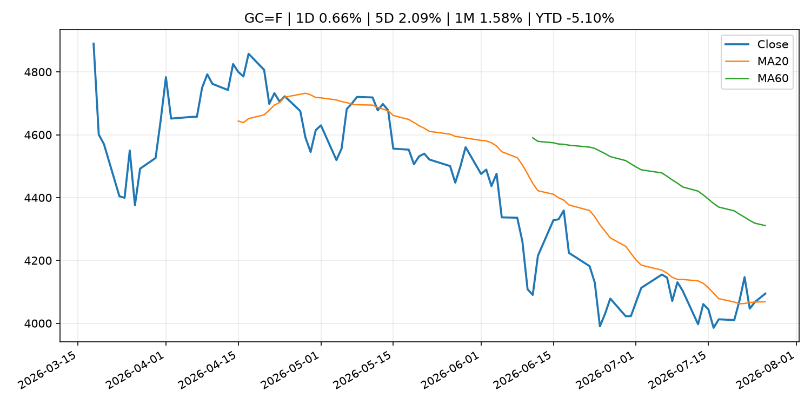
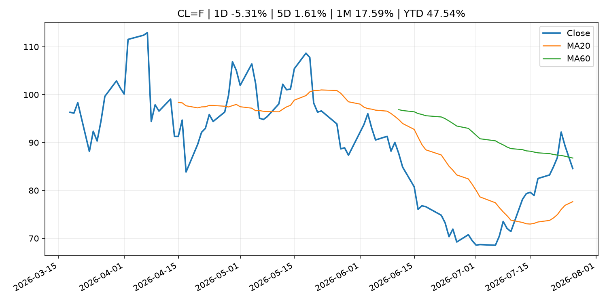
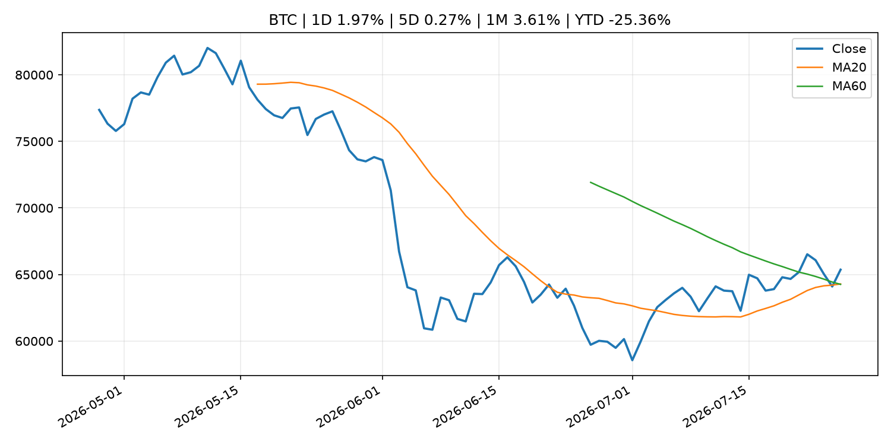
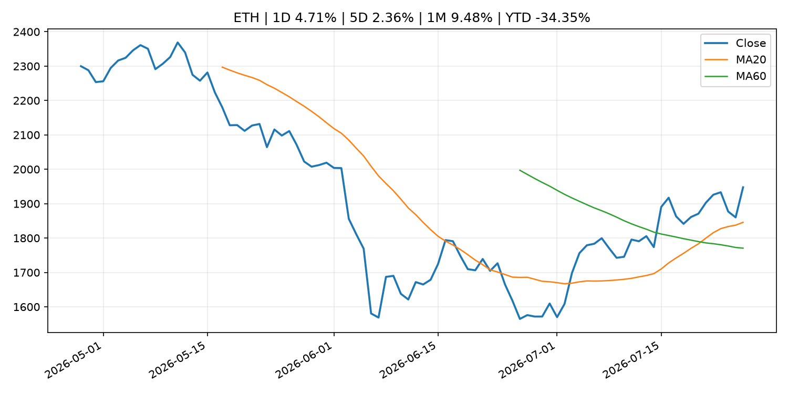
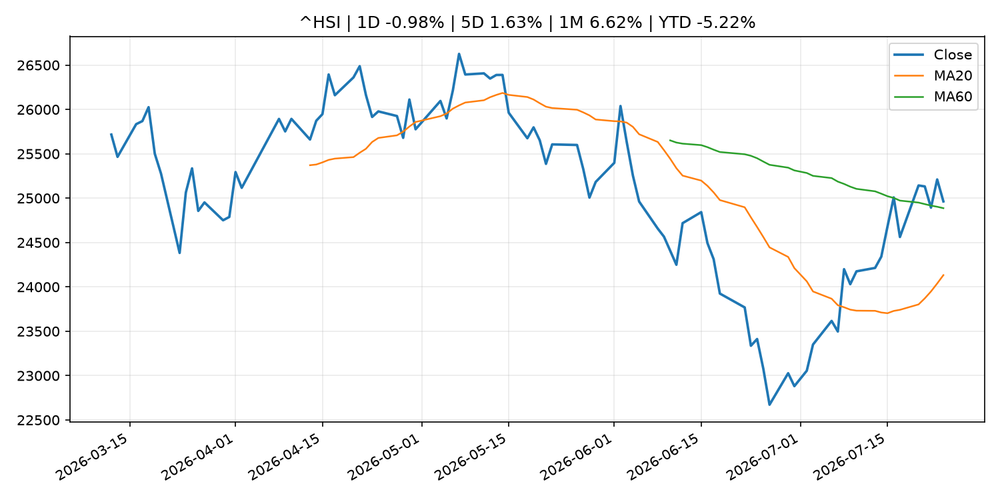

# Global Macro Morning Briefing - 2026-07-27

> Not financial advice / 非投资建议。

## 0. 今日总览
- 市场状态：unknown。市场信号不足，暂不判断明确状态。
- 今日三大主线：
  1. central_bank_speech: The Treasury market is sending Fed Chair Kevin Warsh a clear warning about rates
  2. earnings: Oil prices sink, stock futures rally as U.S. and Iran pause attacks, Wall Street awaits busy week
  3. earnings: The S&P 500’s earnings growth has gone bonkers thanks to one company
- 一句话结论：今日晨报重点关注：央行官员表态可能影响市场对下一次会议的定价。；大型科技股盈利和资本开支会影响纳指、半导体和 AI 交易主线。。跨资产方面，SPY 1D 0.10%；QQQ 1D -1.12%；^VIX 1D -0.64%；TLT 1D 0.10%；GC=F 1D 0.66%；CL=F 1D -5.31%；BTC 1D 1.97%；ETH 1D 4.71%；市场信号不足，暂不判断明确状态。政策、通胀、利率、美元、美债、能源和加密监管仍是主要观察线索。所有结论仅基于公开数据与短摘要整理，不构成投资建议。

## 1. 隔夜跨资产市场
- 美股：SPY 1D 0.10%，QQQ 1D -1.12%，整体趋势需结合 VIX 和利率确认。
- 美债/美元：TLT 1D 0.10%，美元指数 1D -0.16%，是判断折现率压力的核心线索。
- 黄金/原油：黄金 1D 0.66%，原油 1D -5.31%，用于观察避险、通胀和地缘风险。
- 加密：BTC 1D 1.97%，ETH 1D 4.71%，关注是否独立于纳指走出加密自身行情。
- 港股/A股：恒生 1D -0.98%，沪深300/上证 1D n/a，重点看中国政策预期与人民币线索。
- 风险观察：关注后续数据是否确认当前跨资产信号。

### US_EQUITY

| symbol | latest close | 1D | 5D | 1M | YTD | trend |
|---|---:|---:|---:|---:|---:|---|
| SPY | 738.93 | 0.10% | -0.59% | 0.78% | 8.16% | range_bound |
| QQQ | 684.23 | -1.12% | -1.60% | -3.71% | 11.60% | strong_downtrend |
| DIA | 518.76 | 0.48% | -0.39% | 0.05% | 7.26% | range_bound |
| IWM | 291.17 | -0.31% | -0.98% | -1.86% | 17.04% | range_bound |
| VTI | 364.80 | 0.03% | -0.60% | 0.32% | 8.47% | range_bound |

### US_MACRO_MARKET

| symbol | latest close | 1D | 5D | 1M | YTD | trend |
|---|---:|---:|---:|---:|---:|---|
| ^VIX | 18.58 | -0.64% | -1.01% | -0.27% | 28.05% | range_bound |
| DX-Y.NYB | 101.31 | -0.16% | 0.31% | -0.12% | 2.93% | uptrend |
| TLT | 83.25 | 0.10% | -1.50% | -4.73% | -4.34% | strong_downtrend |
| IEF | 93.03 | 0.19% | -0.86% | -1.79% | -3.17% | downtrend |

### COMMODITIES

| symbol | latest close | 1D | 5D | 1M | YTD | trend |
|---|---:|---:|---:|---:|---:|---|
| GC=F | 4,094.30 | 0.66% | 2.09% | 1.58% | -5.10% | range_bound |
| SI=F | 60.12 | 2.50% | 5.85% | 3.05% | -14.78% | range_bound |
| CL=F | 84.57 | -5.31% | 1.61% | 17.59% | 47.54% | range_bound |
| BZ=F | 91.68 | -5.27% | 2.76% | 21.82% | 50.91% | range_bound |
| NG=F | 2.84 | -1.18% | -0.80% | -15.14% | -21.59% | strong_downtrend |
| HG=F | 6.36 | 0.70% | 1.04% | 4.84% | 12.85% | range_bound |

### HK_MARKET

| symbol | latest close | 1D | 5D | 1M | YTD | trend |
|---|---:|---:|---:|---:|---:|---|
| ^HSI | 24,963.23 | -0.98% | 1.63% | 6.62% | -5.22% | range_bound |
| 0700.HK | 434.60 | -2.38% | -5.85% | 1.35% | -30.24% | downtrend |
| 9988.HK | 110.00 | -4.26% | -2.31% | 10.66% | -26.17% | range_bound |
| 3690.HK | 86.70 | -0.69% | 3.65% | 27.97% | -17.11% | range_bound |
| 1810.HK | 26.72 | -1.55% | -0.60% | 16.38% | -33.66% | range_bound |
| 1211.HK | 88.65 | 0.00% | -0.06% | 16.72% | -10.23% | range_bound |

### CRYPTO

| symbol | latest close | 1D | 5D | 1M | YTD | trend |
|---|---:|---:|---:|---:|---:|---|
| BTC | 65,363.65 | 1.97% | 0.27% | 3.61% | -25.36% | strong_uptrend |
| ETH | 1,947.63 | 4.71% | 2.36% | 9.48% | -34.35% | strong_uptrend |
| SOLANA | 76.62 | 3.64% | -1.45% | -6.22% | -38.47% | range_bound |
| BINANCECOIN | 575.32 | 1.95% | 0.82% | 0.09% | -33.31% | range_bound |
| RIPPLE | 1.11 | 1.83% | 0.01% | -3.89% | -39.62% | range_bound |

## 2. 今日最重要的 10 条新闻
### 1. The Treasury market is sending Fed Chair Kevin Warsh a clear warning about rates
- 来源：MarketWatch Top Stories
- 时间：2026-07-26T12:30:00+00:00
- 地区：US
- 事件类型：central_bank_speech
- 重要性层级：Tier 2
- 一句话摘要：Rising Treasury yields show how “enormously worried” the market is about inflation — and whether the Fed will back up its tough talk with action
- 为什么重要：央行官员表态可能影响市场对下一次会议的定价。
- 可能影响：主要影响 DXY，方向为 positive，强度 high；通胀压力可能推高政策利率预期并支撑美元。
  - 资产：DXY
    方向：positive
    强度：high
    原因：通胀压力可能推高政策利率预期并支撑美元。
  - 资产：TLT
    方向：negative
    强度：high
    原因：通胀上行通常推升收益率、压低长债价格。
  - 资产：QQQ
    方向：negative
    强度：high
    原因：更高利率对成长股估值折现率不利。
  - 资产：SPY
    方向：mixed
    强度：medium
    原因：名义增长可能支撑收入，但更高利率压制估值。
  - 资产：GC=F
    方向：mixed
    强度：medium
    原因：通胀对黄金是支撑，但实际利率上行会形成压力。
  - 资产：BTC
    方向：mixed
    强度：medium
    原因：抗通胀叙事和流动性收紧可能相互抵消。
- 原文链接：[https://www.marketwatch.com/story/the-treasury-market-is-sending-fed-chair-kevin-warsh-a-clear-warning-about-rates-d0026da9?mod=mw_rss_topstories](https://www.marketwatch.com/story/the-treasury-market-is-sending-fed-chair-kevin-warsh-a-clear-warning-about-rates-d0026da9?mod=mw_rss_topstories)

### 2. Oil prices sink, stock futures rally as U.S. and Iran pause attacks, Wall Street awaits busy week
- 来源：MarketWatch Top Stories
- 时间：2026-07-26T22:42:00+00:00
- 地区：US
- 事件类型：earnings
- 重要性层级：Tier 2
- 一句话摘要：U.S. stock-index futures rallied and oil prices tumbled on Sunday as the U.S. and Iran took a pause from fighting, and as Wall Street gears up for the Fed’s meeting and key earnings reports from Big Tech companies.
- 为什么重要：大型科技股盈利和资本开支会影响纳指、半导体和 AI 交易主线。
- 可能影响：主要影响 CL=F，方向为 positive，强度 high；供给扰动或 OPEC 减产通常推升 WTI 原油。
  - 资产：CL=F
    方向：positive
    强度：high
    原因：供给扰动或 OPEC 减产通常推升 WTI 原油。
  - 资产：BZ=F
    方向：positive
    强度：high
    原因：全球供给风险通常直接影响 Brent 原油。
  - 资产：SPY
    方向：mixed
    强度：medium
    原因：能源股可能受益，但通胀和成本压力不利于宽基风险资产。
- 原文链接：[https://www.marketwatch.com/story/oil-prices-sink-stock-futures-rally-as-u-s-and-iran-pause-attacks-wall-street-awaits-busy-week-75030e00?mod=mw_rss_topstories](https://www.marketwatch.com/story/oil-prices-sink-stock-futures-rally-as-u-s-and-iran-pause-attacks-wall-street-awaits-busy-week-75030e00?mod=mw_rss_topstories)

### 3. The S&P 500’s earnings growth has gone bonkers thanks to one company
- 来源：MarketWatch Top Stories
- 时间：2026-07-26T14:00:00+00:00
- 地区：US
- 事件类型：earnings
- 重要性层级：Tier 2
- 一句话摘要：Markets are gearing up for the busiest week of second-quarter earnings season.
- 为什么重要：大型科技股盈利和资本开支会影响纳指、半导体和 AI 交易主线。
- 可能影响：可能影响利率、汇率、风险资产或大宗商品预期，但当前公开信息不足以判断明确方向。
  - 资产：暂无明确资产映射
  - 方向：unknown
  - 强度：low
  - 原因：公开信息不足以判断方向。
- 原文链接：[https://www.marketwatch.com/story/the-s-p-500s-earnings-growth-has-gone-bonkers-thanks-to-one-company-1c45b2ba?mod=mw_rss_topstories](https://www.marketwatch.com/story/the-s-p-500s-earnings-growth-has-gone-bonkers-thanks-to-one-company-1c45b2ba?mod=mw_rss_topstories)

### 4. There’s a technical ‘triple threat’ for stocks, but also places investors can hide
- 来源：MarketWatch Top Stories
- 时间：2026-07-26T19:15:00+00:00
- 地区：US
- 事件类型：other
- 重要性层级：Tier 3
- 一句话摘要：Treasury yields and oil prices surged, and the dollar confirmed the breakout toward a longer-term uptrend, to push the S&P 500 below key chart support.
- 为什么重要：这条信息暂未匹配到重大宏观、政策或市场事件，更适合作为背景跟踪。
- 可能影响：主要影响 CL=F，方向为 positive，强度 high；供给扰动或 OPEC 减产通常推升 WTI 原油。
  - 资产：CL=F
    方向：positive
    强度：high
    原因：供给扰动或 OPEC 减产通常推升 WTI 原油。
  - 资产：BZ=F
    方向：positive
    强度：high
    原因：全球供给风险通常直接影响 Brent 原油。
  - 资产：SPY
    方向：mixed
    强度：medium
    原因：能源股可能受益，但通胀和成本压力不利于宽基风险资产。
- 原文链接：[https://www.marketwatch.com/story/theres-a-technical-triple-threat-for-stocks-but-also-places-investors-can-hide-59108c6b?mod=mw_rss_topstories](https://www.marketwatch.com/story/theres-a-technical-triple-threat-for-stocks-but-also-places-investors-can-hide-59108c6b?mod=mw_rss_topstories)

### 5. I will definitely claim Social Security early. Why do so few people talk about the elephant in the room?
- 来源：MarketWatch Top Stories
- 时间：2026-07-26T20:00:00+00:00
- 地区：US
- 事件类型：other
- 重要性层级：Tier 3
- 一句话摘要：“The strongest argument for claiming benefits earlier goes beyond the traditional break-even analyses.”
- 为什么重要：这条信息暂未匹配到重大宏观、政策或市场事件，更适合作为背景跟踪。
- 可能影响：更偏背景信息，短期市场影响可能有限。
  - 资产：暂无明确资产映射
  - 方向：unknown
  - 强度：low
  - 原因：公开信息不足以判断方向。
- 原文链接：[https://www.marketwatch.com/story/i-will-claim-social-security-early-why-do-so-few-people-talk-about-the-elephant-in-the-room-64820675?mod=mw_rss_topstories](https://www.marketwatch.com/story/i-will-claim-social-security-early-why-do-so-few-people-talk-about-the-elephant-in-the-room-64820675?mod=mw_rss_topstories)

## 3. 政策与央行观察
### 1. The Treasury market is sending Fed Chair Kevin Warsh a clear warning about rates
- 来源：MarketWatch Top Stories
- 时间：2026-07-26T12:30:00+00:00
- 地区：US
- 事件类型：central_bank_speech
- 重要性层级：Tier 2
- 一句话摘要：Rising Treasury yields show how “enormously worried” the market is about inflation — and whether the Fed will back up its tough talk with action
- 为什么重要：央行官员表态可能影响市场对下一次会议的定价。
- 可能影响：主要影响 DXY，方向为 positive，强度 high；通胀压力可能推高政策利率预期并支撑美元。
  - 资产：DXY
    方向：positive
    强度：high
    原因：通胀压力可能推高政策利率预期并支撑美元。
  - 资产：TLT
    方向：negative
    强度：high
    原因：通胀上行通常推升收益率、压低长债价格。
  - 资产：QQQ
    方向：negative
    强度：high
    原因：更高利率对成长股估值折现率不利。
  - 资产：SPY
    方向：mixed
    强度：medium
    原因：名义增长可能支撑收入，但更高利率压制估值。
  - 资产：GC=F
    方向：mixed
    强度：medium
    原因：通胀对黄金是支撑，但实际利率上行会形成压力。
  - 资产：BTC
    方向：mixed
    强度：medium
    原因：抗通胀叙事和流动性收紧可能相互抵消。
- 原文链接：[https://www.marketwatch.com/story/the-treasury-market-is-sending-fed-chair-kevin-warsh-a-clear-warning-about-rates-d0026da9?mod=mw_rss_topstories](https://www.marketwatch.com/story/the-treasury-market-is-sending-fed-chair-kevin-warsh-a-clear-warning-about-rates-d0026da9?mod=mw_rss_topstories)

## 4. 市场异动与图表
- QQQ 下跌 -1.12%
- Gold 上涨 0.66%
- Oil 下跌 -5.31%
- ETH 上涨 4.71%

### SPY

### QQQ

### ^VIX

### TLT

### GC=F

### CL=F

### BTC

### ETH

### ^HSI

## 5. 华尔街与机构公开观点
- 暂无可靠公开观点。

## 6. 今日重点关注
- 经济数据：经济数据：暂无可靠公开日历数据；如配置经济日历源后可自动填充。
- 央行讲话：央行讲话：暂无可靠公开日历数据；重点跟踪 Fed、ECB、BoJ、PBOC 官网 RSS。
- 财报：财报：暂无可靠数据。
- 政策事件：政策事件：暂无可靠数据。
- 风险提醒：风险提醒：关注数据源失败项、突发地缘风险、利率和美元的二阶反应。

## 7. 英文金融表达与宏观概念
- **inflation expectations**：通胀预期，指家庭、企业或市场对未来通胀的预估。 例句：Inflation expectations can shape wage bargaining and bond yields.
- **real yield**：实际收益率，名义利率扣除通胀预期后的收益率。 例句：Gold often reacts more to real yields than nominal yields.
- **risk-off**：避险模式，资金偏向美元、国债、黄金等防御资产。 例句：A geopolitical shock can push markets into risk-off mode.
- **supply disruption**：供给扰动，通常指能源或商品供应受冲突、减产或天气影响。 例句：Supply disruption can lift oil prices and inflation expectations.
- **market structure**：市场结构，指交易、托管、清算、ETF、监管等制度安排。 例句：Crypto market structure rules can affect institutional participation.
- **terminal rate**：终端利率，市场预期本轮加息周期的最高政策利率。 例句：A higher terminal rate can pressure growth stocks.

## 8. 背景材料
- [I will definitely claim Social Security early. Why do so few people talk about the elephant in the room?](https://www.marketwatch.com/story/i-will-claim-social-security-early-why-do-so-few-people-talk-about-the-elephant-in-the-room-64820675?mod=mw_rss_topstories)（MarketWatch Top Stories，other）：“The strongest argument for claiming benefits earlier goes beyond the traditional break-even analyses.”
- [There’s a technical ‘triple threat’ for stocks, but also places investors can hide](https://www.marketwatch.com/story/theres-a-technical-triple-threat-for-stocks-but-also-places-investors-can-hide-59108c6b?mod=mw_rss_topstories)（MarketWatch Top Stories，other）：Treasury yields and oil prices surged, and the dollar confirmed the breakout toward a longer-term uptrend, to push the S&P 500 below key chart support.
- [I am a 63-year-old semiretired physician. If I saved $2 million for retirement, should my Social Security become optional?](https://www.marketwatch.com/story/i-am-a-63-year-old-semiretired-physician-if-you-have-saved-2-million-for-retirement-should-social-security-be-optional-0de70d53?mod=mw_rss_topstories)（MarketWatch Top Stories，other）：“At that point, they arguably no longer need the government’s retirement safety net.”

## 9. 数据源、失败项与免责声明
- 采集时间：2026-07-26T22:58:55
- 数据源：公开 RSS、Yahoo Finance、CoinGecko、AKShare、FRED、SEC data.sec.gov，以及用户自有 inputs/reports 文件。
- 合规说明：不绕过 WSJ、Bloomberg、FT、Reuters 等付费墙；对付费媒体只使用公开 RSS 标题、摘要、链接和发布时间。
- 免责声明：Not financial advice / 非投资建议。本项目仅供个人学习、研究和信息整理，不构成投资建议、交易建议或任何收益承诺。
- 失败或跳过的数据源：
  - crypto data failed coin=dogecoin
  - China market data failed symbol=上证指数: empty dataframe
  - China market data failed symbol=深证成指: empty dataframe
  - China market data failed symbol=创业板指: empty dataframe
  - China market data failed symbol=沪深300: empty dataframe
  - China market data failed symbol=中证500: empty dataframe
  - China market data failed symbol=科创50: empty dataframe
  - FRED_API_KEY not set; skipping FRED macro series
  - SEC failed cik=0000320193
  - SEC failed cik=0000789019
  - SEC failed cik=0001045810
  - SEC failed cik=0001318605
  - SEC failed cik=0001577552
