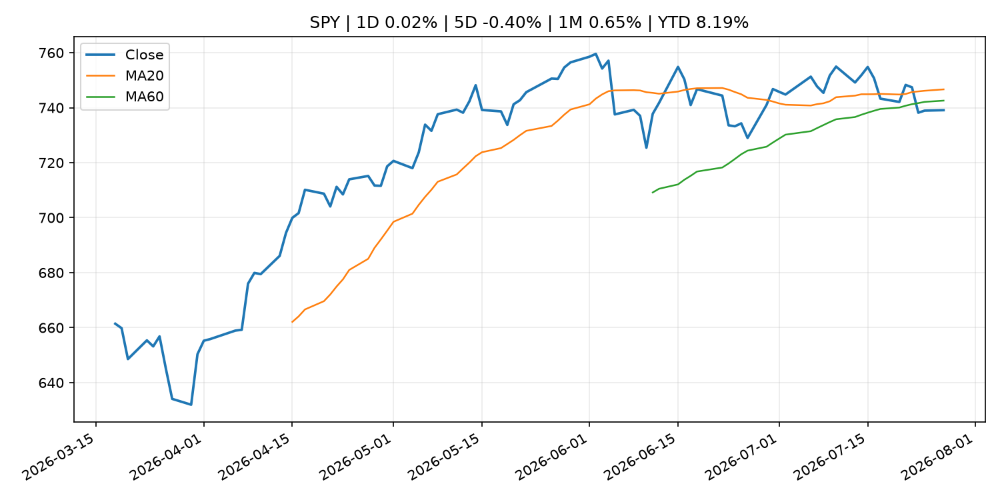
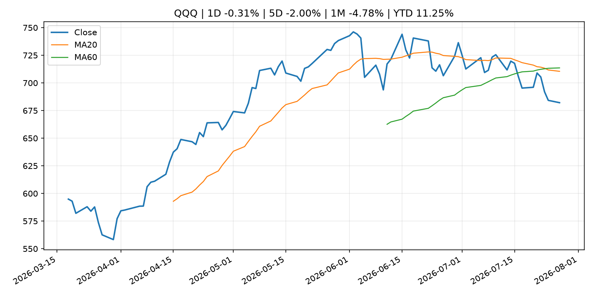
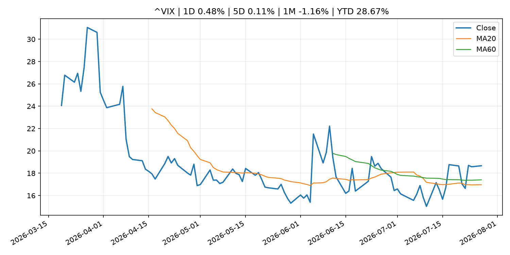
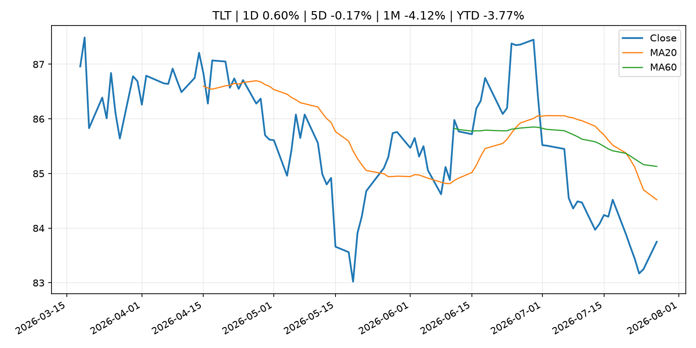
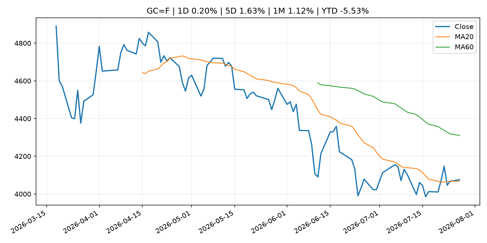
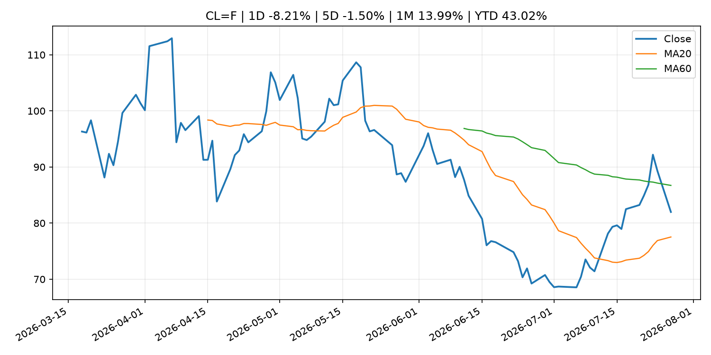
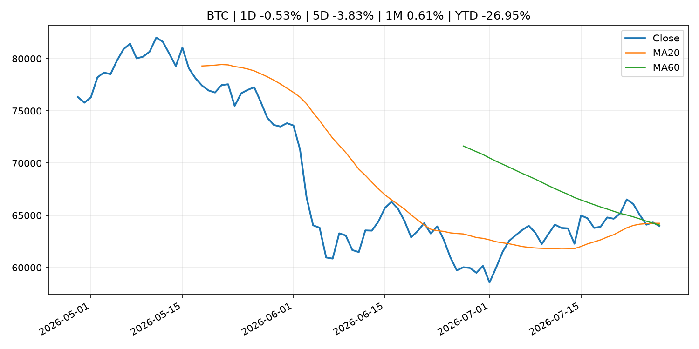
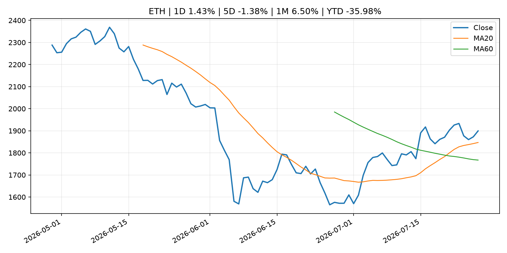
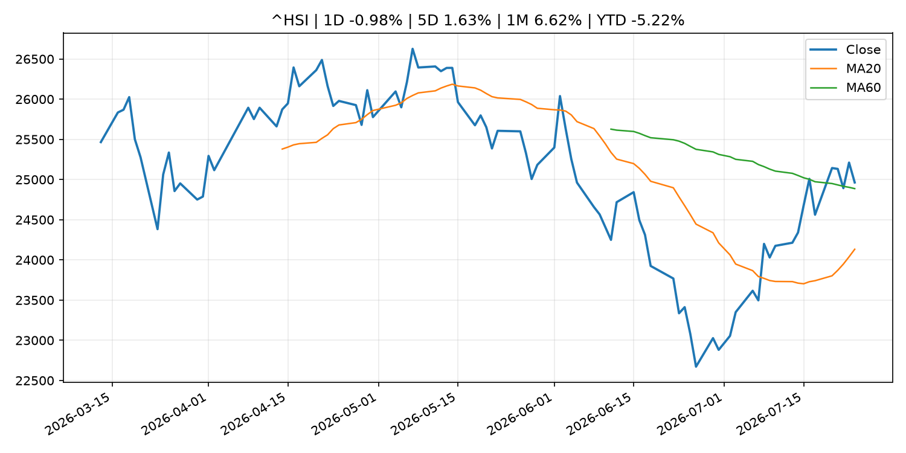

# Global Macro Morning Briefing - 2026-07-28

> Not financial advice / 非投资建议。

## 0. 今日总览
- 市场状态：unknown。市场信号不足，暂不判断明确状态。
- 今日三大主线：
  1. earnings: More cracks emerge in AI-related bonds as Meta, Microsoft earnings loom
  2. earnings: Nvidia forms 37-member AI security alliance without OpenAI, Anthropic or Google
  3. regulation: Small Business Forum’s Report to Congress Highlights Recommendations to Improve Capital-Raising Policy
- 一句话结论：今日晨报重点关注：大型科技股盈利和资本开支会影响纳指、半导体和 AI 交易主线。；大型科技股盈利和资本开支会影响纳指、半导体和 AI 交易主线。。跨资产方面，SPY 1D 0.02%；QQQ 1D -0.31%；^VIX 1D 0.48%；TLT 1D 0.60%；GC=F 1D 0.20%；CL=F 1D -8.21%；BTC 1D -0.53%；ETH 1D 1.43%；市场信号不足，暂不判断明确状态。政策、通胀、利率、美元、美债、能源和加密监管仍是主要观察线索。所有结论仅基于公开数据与短摘要整理，不构成投资建议。

## 1. 隔夜跨资产市场
- 美股：SPY 1D 0.02%，QQQ 1D -0.31%，整体趋势需结合 VIX 和利率确认。
- 美债/美元：TLT 1D 0.60%，美元指数 1D 0.04%，是判断折现率压力的核心线索。
- 黄金/原油：黄金 1D 0.20%，原油 1D -8.21%，用于观察避险、通胀和地缘风险。
- 加密：BTC 1D -0.53%，ETH 1D 1.43%，关注是否独立于纳指走出加密自身行情。
- 港股/A股：恒生 1D -0.98%，沪深300/上证 1D n/a，重点看中国政策预期与人民币线索。
- 风险观察：关注后续数据是否确认当前跨资产信号。

### US_EQUITY

| symbol | latest close | 1D | 5D | 1M | YTD | trend |
|---|---:|---:|---:|---:|---:|---|
| SPY | 739.09 | 0.02% | -0.40% | 0.65% | 8.19% | range_bound |
| QQQ | 682.12 | -0.31% | -2.00% | -4.78% | 11.25% | strong_downtrend |
| DIA | 521.26 | 0.48% | 0.64% | 0.39% | 7.78% | range_bound |
| IWM | 292.91 | 0.60% | 0.21% | -2.01% | 17.74% | range_bound |
| VTI | 365.18 | 0.10% | -0.29% | 0.33% | 8.58% | range_bound |

### US_MACRO_MARKET

| symbol | latest close | 1D | 5D | 1M | YTD | trend |
|---|---:|---:|---:|---:|---:|---|
| ^VIX | 18.67 | 0.48% | 0.11% | -1.16% | 28.67% | range_bound |
| DX-Y.NYB | 101.51 | 0.04% | 0.52% | 0.08% | 3.14% | uptrend |
| TLT | 83.75 | 0.60% | -0.17% | -4.12% | -3.77% | strong_downtrend |
| IEF | 93.28 | 0.27% | -0.28% | -1.59% | -2.91% | downtrend |

### COMMODITIES

| symbol | latest close | 1D | 5D | 1M | YTD | trend |
|---|---:|---:|---:|---:|---:|---|
| GC=F | 4,075.60 | 0.20% | 1.63% | 1.12% | -5.53% | range_bound |
| SI=F | 58.67 | 0.02% | 3.29% | 0.55% | -16.85% | downtrend |
| CL=F | 81.98 | -8.21% | -1.50% | 13.99% | 43.02% | range_bound |
| BZ=F | 87.76 | -9.32% | -1.64% | 16.61% | 44.46% | range_bound |
| NG=F | 2.77 | -3.52% | -3.15% | -17.14% | -23.44% | strong_downtrend |
| HG=F | 6.39 | 1.16% | 1.50% | 5.32% | 13.36% | range_bound |

### HK_MARKET

| symbol | latest close | 1D | 5D | 1M | YTD | trend |
|---|---:|---:|---:|---:|---:|---|
| ^HSI | 24,963.23 | -0.98% | 1.63% | 6.62% | -5.22% | range_bound |
| 0700.HK | 443.00 | 1.93% | -7.28% | 5.13% | -28.89% | range_bound |
| 9988.HK | 111.00 | 0.91% | -4.97% | 16.84% | -25.50% | range_bound |
| 3690.HK | 89.30 | 3.00% | 3.48% | 35.10% | -14.63% | strong_uptrend |
| 1810.HK | 28.68 | 7.34% | 3.39% | 28.61% | -28.80% | range_bound |
| 1211.HK | 88.55 | -0.11% | -1.77% | 16.44% | -10.33% | range_bound |

### CRYPTO

| symbol | latest close | 1D | 5D | 1M | YTD | trend |
|---|---:|---:|---:|---:|---:|---|
| BTC | 63,974.36 | -0.53% | -3.83% | 0.61% | -26.95% | range_bound |
| ETH | 1,899.44 | 1.43% | -1.38% | 6.50% | -35.98% | strong_uptrend |
| SOLANA | 74.34 | -0.18% | -4.80% | -8.81% | -40.30% | range_bound |
| BINANCECOIN | 566.30 | -0.38% | -1.26% | -3.86% | -34.39% | strong_downtrend |
| RIPPLE | 1.07 | -2.59% | -6.44% | -7.57% | -41.93% | downtrend |

## 2. 今日最重要的 10 条新闻
### 1. More cracks emerge in AI-related bonds as Meta, Microsoft earnings loom
- 来源：MarketWatch Top Stories
- 时间：2026-07-27T21:35:00+00:00
- 地区：US
- 事件类型：earnings
- 重要性层级：Tier 2
- 一句话摘要：‘The money has to come from somewhere,’ says Bryce Doty at Sit, of pressure heavy AI-debt supply and the rest of the bond market
- 为什么重要：大型科技股盈利和资本开支会影响纳指、半导体和 AI 交易主线。
- 可能影响：主要影响 QQQ，方向为 mixed，强度 high；AI 资本开支会影响大型科技股盈利和估值预期。
  - 资产：QQQ
    方向：mixed
    强度：high
    原因：AI 资本开支会影响大型科技股盈利和估值预期。
  - 资产：SMH
    方向：mixed
    强度：high
    原因：AI 投资周期直接影响半导体需求。
  - 资产：NVDA
    方向：mixed
    强度：high
    原因：AI 训练和推理需求是英伟达收入预期核心变量。
  - 资产：MSFT
    方向：mixed
    强度：medium
    原因：云和 AI 资本开支影响利润率与增长叙事。
  - 资产：GOOGL
    方向：mixed
    强度：medium
    原因：AI 投资和搜索商业化影响估值。
  - 资产：META
    方向：mixed
    强度：medium
    原因：AI 基建支出与广告效率共同影响市场预期。
- 原文链接：[https://www.marketwatch.com/story/more-cracks-emerge-in-ai-related-bonds-as-meta-microsoft-earnings-loom-04275db2?mod=mw_rss_topstories](https://www.marketwatch.com/story/more-cracks-emerge-in-ai-related-bonds-as-meta-microsoft-earnings-loom-04275db2?mod=mw_rss_topstories)

### 2. Nvidia forms 37-member AI security alliance without OpenAI, Anthropic or Google
- 来源：CoinDesk
- 时间：2026-07-27T13:25:58+00:00
- 地区：global
- 事件类型：earnings
- 重要性层级：Tier 2
- 一句话摘要：Nvidia forms 37-member AI security alliance without OpenAI, Anthropic or Google
- 为什么重要：大型科技股盈利和资本开支会影响纳指、半导体和 AI 交易主线。
- 可能影响：主要影响 QQQ，方向为 mixed，强度 high；AI 资本开支会影响大型科技股盈利和估值预期。
  - 资产：QQQ
    方向：mixed
    强度：high
    原因：AI 资本开支会影响大型科技股盈利和估值预期。
  - 资产：SMH
    方向：mixed
    强度：high
    原因：AI 投资周期直接影响半导体需求。
  - 资产：NVDA
    方向：mixed
    强度：high
    原因：AI 训练和推理需求是英伟达收入预期核心变量。
  - 资产：MSFT
    方向：mixed
    强度：medium
    原因：云和 AI 资本开支影响利润率与增长叙事。
  - 资产：GOOGL
    方向：mixed
    强度：medium
    原因：AI 投资和搜索商业化影响估值。
  - 资产：META
    方向：mixed
    强度：medium
    原因：AI 基建支出与广告效率共同影响市场预期。
- 原文链接：[https://www.coindesk.com/tech/2026/07/27/nvidia-forms-37-member-ai-security-alliance-without-openai-anthropic-or-google](https://www.coindesk.com/tech/2026/07/27/nvidia-forms-37-member-ai-security-alliance-without-openai-anthropic-or-google)

### 3. Small Business Forum’s Report to Congress Highlights Recommendations to Improve Capital-Raising Policy
- 来源：SEC Press Releases
- 时间：2026-07-27T15:59:17-04:00
- 地区：US
- 事件类型：regulation
- 重要性层级：Tier 2
- 一句话摘要：The Securities and Exchange Commission released a report to Congress today highlighting policy recommendations from the SEC’s 45th Annual Government-Business Forum on Small Business Capital Formation. The report provides a summary of the forum…
- 为什么重要：监管变化会改变行业盈利预期和资产风险溢价。
- 可能影响：主要影响 BTC，方向为 mixed，强度 high；加密监管或 ETF 进展会改变 BTC 的资金流和风险溢价。
  - 资产：BTC
    方向：mixed
    强度：high
    原因：加密监管或 ETF 进展会改变 BTC 的资金流和风险溢价。
  - 资产：ETH
    方向：mixed
    强度：high
    原因：监管框架会影响 ETH 产品化和机构参与度。
  - 资产：COIN
    方向：mixed
    强度：medium
    原因：监管清晰度和执法风险会影响交易平台估值。
  - 资产：crypto market
    方向：mixed
    强度：high
    原因：信息影响整个加密市场结构，但方向取决于细节。
- 原文链接：[https://www.sec.gov/newsroom/press-releases/2026-70-small-business-forums-report-congress-highlights-recommendations-improve-capital-raising-policy](https://www.sec.gov/newsroom/press-releases/2026-70-small-business-forums-report-congress-highlights-recommendations-improve-capital-raising-policy)

### 4. Thailand's SEC alleges Bitkub concealed cyberattack that led to $50 million hack
- 来源：CoinDesk
- 时间：2026-07-27T13:32:16+00:00
- 地区：global
- 事件类型：regulation
- 重要性层级：Tier 2
- 一句话摘要：Thailand's SEC alleges Bitkub concealed cyberattack that led to $50 million hack
- 为什么重要：监管变化会改变行业盈利预期和资产风险溢价。
- 可能影响：主要影响 BTC，方向为 mixed，强度 high；加密监管或 ETF 进展会改变 BTC 的资金流和风险溢价。
  - 资产：BTC
    方向：mixed
    强度：high
    原因：加密监管或 ETF 进展会改变 BTC 的资金流和风险溢价。
  - 资产：ETH
    方向：mixed
    强度：high
    原因：监管框架会影响 ETH 产品化和机构参与度。
  - 资产：COIN
    方向：mixed
    强度：medium
    原因：监管清晰度和执法风险会影响交易平台估值。
  - 资产：crypto market
    方向：mixed
    强度：high
    原因：信息影响整个加密市场结构，但方向取决于细节。
- 原文链接：[https://www.coindesk.com/policy/2026/07/27/thailand-s-sec-alleges-bitkub-concealed-cyberattack-that-led-to-usd50-million-hack](https://www.coindesk.com/policy/2026/07/27/thailand-s-sec-alleges-bitkub-concealed-cyberattack-that-led-to-usd50-million-hack)

### 5. Securitize builds Wall Street credentials with SEC adviser license as tokenization expands
- 来源：CoinDesk
- 时间：2026-07-27T13:00:00+00:00
- 地区：global
- 事件类型：regulation
- 重要性层级：Tier 2
- 一句话摘要：Securitize builds Wall Street credentials with SEC adviser license as tokenization expands
- 为什么重要：监管变化会改变行业盈利预期和资产风险溢价。
- 可能影响：主要影响 BTC，方向为 mixed，强度 high；加密监管或 ETF 进展会改变 BTC 的资金流和风险溢价。
  - 资产：BTC
    方向：mixed
    强度：high
    原因：加密监管或 ETF 进展会改变 BTC 的资金流和风险溢价。
  - 资产：ETH
    方向：mixed
    强度：high
    原因：监管框架会影响 ETH 产品化和机构参与度。
  - 资产：COIN
    方向：mixed
    强度：medium
    原因：监管清晰度和执法风险会影响交易平台估值。
  - 资产：crypto market
    方向：mixed
    强度：high
    原因：信息影响整个加密市场结构，但方向取决于细节。
- 原文链接：[https://www.coindesk.com/business/2026/07/27/securitize-builds-wall-street-credentials-with-sec-adviser-license-as-tokenization-expands](https://www.coindesk.com/business/2026/07/27/securitize-builds-wall-street-credentials-with-sec-adviser-license-as-tokenization-expands)

### 6. SpaceX’s stock falls to a new low despite a near-flawless Starship flight
- 来源：MarketWatch Top Stories
- 时间：2026-07-27T20:41:00+00:00
- 地区：US
- 事件类型：earnings
- 重要性层级：Tier 2
- 一句话摘要：SpaceX’s earnings report next week could unleash a further wave of selling, as some insiders will soon be able to unload shares.
- 为什么重要：大型科技股盈利和资本开支会影响纳指、半导体和 AI 交易主线。
- 可能影响：可能影响利率、汇率、风险资产或大宗商品预期，但当前公开信息不足以判断明确方向。
  - 资产：暂无明确资产映射
  - 方向：unknown
  - 强度：low
  - 原因：公开信息不足以判断方向。
- 原文链接：[https://www.marketwatch.com/story/spacexs-stock-falls-to-a-new-low-despite-a-near-flawless-starship-flight-034a99ab?mod=mw_rss_topstories](https://www.marketwatch.com/story/spacexs-stock-falls-to-a-new-low-despite-a-near-flawless-starship-flight-034a99ab?mod=mw_rss_topstories)

### 7. Interest rates in U.S., U.K., Japan and Coinbase, Strategy earnings: Crypto Week Ahead
- 来源：CoinDesk
- 时间：2026-07-27T09:43:58+00:00
- 地区：global
- 事件类型：earnings
- 重要性层级：Tier 2
- 一句话摘要：Interest rates in U.S., U.K., Japan and Coinbase, Strategy earnings: Crypto Week Ahead
- 为什么重要：大型科技股盈利和资本开支会影响纳指、半导体和 AI 交易主线。
- 可能影响：可能影响利率、汇率、风险资产或大宗商品预期，但当前公开信息不足以判断明确方向。
  - 资产：暂无明确资产映射
  - 方向：unknown
  - 强度：low
  - 原因：公开信息不足以判断方向。
- 原文链接：[https://www.coindesk.com/markets/2026/07/27/interest-rates-in-u-s-u-k-japan-and-coinbase-strategy-earnings-crypto-week-ahead](https://www.coindesk.com/markets/2026/07/27/interest-rates-in-u-s-u-k-japan-and-coinbase-strategy-earnings-crypto-week-ahead)

### 8. Bitcoin is back above $65,000 as U.S. and Iran hold fire. Oil drops 5%
- 来源：CoinDesk
- 时间：2026-07-27T04:21:26+00:00
- 地区：global
- 事件类型：other
- 重要性层级：Tier 3
- 一句话摘要：Bitcoin is back above $65,000 as U.S. and Iran hold fire. Oil drops 5%
- 为什么重要：这条信息暂未匹配到重大宏观、政策或市场事件，更适合作为背景跟踪。
- 可能影响：主要影响 CL=F，方向为 positive，强度 high；供给扰动或 OPEC 减产通常推升 WTI 原油。
  - 资产：CL=F
    方向：positive
    强度：high
    原因：供给扰动或 OPEC 减产通常推升 WTI 原油。
  - 资产：BZ=F
    方向：positive
    强度：high
    原因：全球供给风险通常直接影响 Brent 原油。
  - 资产：SPY
    方向：mixed
    强度：medium
    原因：能源股可能受益，但通胀和成本压力不利于宽基风险资产。
- 原文链接：[https://www.coindesk.com/markets/2026/07/27/bitcoin-is-back-above-usd65-000-as-u-s-iran-hold-fire-oil-drops-5](https://www.coindesk.com/markets/2026/07/27/bitcoin-is-back-above-usd65-000-as-u-s-iran-hold-fire-oil-drops-5)

### 9. For 44 years, this investor held aces in the long-bond game. He just folded.
- 来源：MarketWatch Top Stories
- 时间：2026-07-27T20:52:00+00:00
- 地区：US
- 事件类型：other
- 重要性层级：Tier 3
- 一句话摘要：Lacy Hunt’s about-face on long-term Treasurys marks the end of an era. Here’s what it means for your money.
- 为什么重要：这条信息暂未匹配到重大宏观、政策或市场事件，更适合作为背景跟踪。
- 可能影响：更偏背景信息，短期市场影响可能有限。
  - 资产：暂无明确资产映射
  - 方向：unknown
  - 强度：low
  - 原因：公开信息不足以判断方向。
- 原文链接：[https://www.marketwatch.com/story/for-44-years-this-investor-held-aces-in-the-long-bond-game-he-just-folded-dcd39375?mod=mw_rss_topstories](https://www.marketwatch.com/story/for-44-years-this-investor-held-aces-in-the-long-bond-game-he-just-folded-dcd39375?mod=mw_rss_topstories)

## 3. 政策与央行观察
### 1. Small Business Forum’s Report to Congress Highlights Recommendations to Improve Capital-Raising Policy
- 来源：SEC Press Releases
- 时间：2026-07-27T15:59:17-04:00
- 地区：US
- 事件类型：regulation
- 重要性层级：Tier 2
- 一句话摘要：The Securities and Exchange Commission released a report to Congress today highlighting policy recommendations from the SEC’s 45th Annual Government-Business Forum on Small Business Capital Formation. The report provides a summary of the forum…
- 为什么重要：监管变化会改变行业盈利预期和资产风险溢价。
- 可能影响：主要影响 BTC，方向为 mixed，强度 high；加密监管或 ETF 进展会改变 BTC 的资金流和风险溢价。
  - 资产：BTC
    方向：mixed
    强度：high
    原因：加密监管或 ETF 进展会改变 BTC 的资金流和风险溢价。
  - 资产：ETH
    方向：mixed
    强度：high
    原因：监管框架会影响 ETH 产品化和机构参与度。
  - 资产：COIN
    方向：mixed
    强度：medium
    原因：监管清晰度和执法风险会影响交易平台估值。
  - 资产：crypto market
    方向：mixed
    强度：high
    原因：信息影响整个加密市场结构，但方向取决于细节。
- 原文链接：[https://www.sec.gov/newsroom/press-releases/2026-70-small-business-forums-report-congress-highlights-recommendations-improve-capital-raising-policy](https://www.sec.gov/newsroom/press-releases/2026-70-small-business-forums-report-congress-highlights-recommendations-improve-capital-raising-policy)

### 2. Thailand's SEC alleges Bitkub concealed cyberattack that led to $50 million hack
- 来源：CoinDesk
- 时间：2026-07-27T13:32:16+00:00
- 地区：global
- 事件类型：regulation
- 重要性层级：Tier 2
- 一句话摘要：Thailand's SEC alleges Bitkub concealed cyberattack that led to $50 million hack
- 为什么重要：监管变化会改变行业盈利预期和资产风险溢价。
- 可能影响：主要影响 BTC，方向为 mixed，强度 high；加密监管或 ETF 进展会改变 BTC 的资金流和风险溢价。
  - 资产：BTC
    方向：mixed
    强度：high
    原因：加密监管或 ETF 进展会改变 BTC 的资金流和风险溢价。
  - 资产：ETH
    方向：mixed
    强度：high
    原因：监管框架会影响 ETH 产品化和机构参与度。
  - 资产：COIN
    方向：mixed
    强度：medium
    原因：监管清晰度和执法风险会影响交易平台估值。
  - 资产：crypto market
    方向：mixed
    强度：high
    原因：信息影响整个加密市场结构，但方向取决于细节。
- 原文链接：[https://www.coindesk.com/policy/2026/07/27/thailand-s-sec-alleges-bitkub-concealed-cyberattack-that-led-to-usd50-million-hack](https://www.coindesk.com/policy/2026/07/27/thailand-s-sec-alleges-bitkub-concealed-cyberattack-that-led-to-usd50-million-hack)

### 3. Securitize builds Wall Street credentials with SEC adviser license as tokenization expands
- 来源：CoinDesk
- 时间：2026-07-27T13:00:00+00:00
- 地区：global
- 事件类型：regulation
- 重要性层级：Tier 2
- 一句话摘要：Securitize builds Wall Street credentials with SEC adviser license as tokenization expands
- 为什么重要：监管变化会改变行业盈利预期和资产风险溢价。
- 可能影响：主要影响 BTC，方向为 mixed，强度 high；加密监管或 ETF 进展会改变 BTC 的资金流和风险溢价。
  - 资产：BTC
    方向：mixed
    强度：high
    原因：加密监管或 ETF 进展会改变 BTC 的资金流和风险溢价。
  - 资产：ETH
    方向：mixed
    强度：high
    原因：监管框架会影响 ETH 产品化和机构参与度。
  - 资产：COIN
    方向：mixed
    强度：medium
    原因：监管清晰度和执法风险会影响交易平台估值。
  - 资产：crypto market
    方向：mixed
    强度：high
    原因：信息影响整个加密市场结构，但方向取决于细节。
- 原文链接：[https://www.coindesk.com/business/2026/07/27/securitize-builds-wall-street-credentials-with-sec-adviser-license-as-tokenization-expands](https://www.coindesk.com/business/2026/07/27/securitize-builds-wall-street-credentials-with-sec-adviser-license-as-tokenization-expands)

## 4. 市场异动与图表
- TLT 上涨 0.60%
- Oil 下跌 -8.21%

### SPY

### QQQ

### ^VIX

### TLT

### GC=F

### CL=F

### BTC

### ETH

### ^HSI

## 5. 华尔街与机构公开观点
- 暂无可靠公开观点。

## 6. 今日重点关注
- 经济数据：经济数据：暂无可靠公开日历数据；如配置经济日历源后可自动填充。
- 央行讲话：央行讲话：暂无可靠公开日历数据；重点跟踪 Fed、ECB、BoJ、PBOC 官网 RSS。
- 财报：财报：暂无可靠数据。
- 政策事件：政策事件：暂无可靠数据。
- 风险提醒：风险提醒：关注数据源失败项、突发地缘风险、利率和美元的二阶反应。

## 7. 英文金融表达与宏观概念
- **real yield**：实际收益率，名义利率扣除通胀预期后的收益率。 例句：Gold often reacts more to real yields than nominal yields.
- **supply disruption**：供给扰动，通常指能源或商品供应受冲突、减产或天气影响。 例句：Supply disruption can lift oil prices and inflation expectations.
- **market structure**：市场结构，指交易、托管、清算、ETF、监管等制度安排。 例句：Crypto market structure rules can affect institutional participation.
- **AI capex**：AI 资本开支，指云厂商和科技公司投入 AI 基建的支出。 例句：AI capex guidance can move semiconductor stocks.
- **inflation expectations**：通胀预期，指家庭、企业或市场对未来通胀的预估。 例句：Inflation expectations can shape wage bargaining and bond yields.
- **terminal rate**：终端利率，市场预期本轮加息周期的最高政策利率。 例句：A higher terminal rate can pressure growth stocks.

## 8. 背景材料
- [For 44 years, this investor held aces in the long-bond game. He just folded.](https://www.marketwatch.com/story/for-44-years-this-investor-held-aces-in-the-long-bond-game-he-just-folded-dcd39375?mod=mw_rss_topstories)（MarketWatch Top Stories，other）：Lacy Hunt’s about-face on long-term Treasurys marks the end of an era. Here’s what it means for your money.
- [Bitcoin shrugs off AI selloff but high-stakes Fed meeting could determine what's next](https://www.coindesk.com/markets/2026/07/27/bitcoin-shrugs-off-ai-selloff-but-high-stakes-fed-meeting-could-determine-what-s-next)（CoinDesk，other）：Bitcoin shrugs off AI selloff but high-stakes Fed meeting could determine what's next
- [Bitcoin options traders are dropping their hedges going into the Fed meeting](https://www.coindesk.com/markets/2026/07/27/bitcoin-options-traders-are-dropping-their-hedges-going-into-the-fed-meeting)（CoinDesk，other）：Bitcoin options traders are dropping their hedges going into the Fed meeting
- [Ballooning U.S. debt sends investors to bitcoin, gold to shelter from dollar devaluation](https://www.coindesk.com/daybook-us/2026/07/27/ballooning-u-s-debt-sends-investors-to-bitcoin-gold-to-shelter-from-dollar-devaluation)（CoinDesk，other）：Ballooning U.S. debt sends investors to bitcoin, gold to shelter from dollar devaluation
- [Bitcoin ETFs post third straight weekly inflows despite $465 million in late-week losses](https://www.coindesk.com/markets/2026/07/27/bitcoin-etfs-record-third-consecutive-weekly-inflows-despite-losses-of-usd465-million-to-end-week)（CoinDesk，other）：Bitcoin ETFs post third straight weekly inflows despite $465 million in late-week losses
- [(IMES Newsletter) 2026 BOJ-IMES Conference](http://www.boj.or.jp/en/about/release_2026/rel260727a.htm)（Bank of Japan Announcements，other）：(IMES Newsletter) 2026 BOJ-IMES Conference
- [Live updates: Bitcoin gives up early gains, holds near $65,000 as AI stocks skid](https://www.coindesk.com/markets/2026/07/27/live-updates-ether-leads-crypto-higher-as-bitcoin-trades-around-usd65-500)（CoinDesk，other）：Live updates: Bitcoin gives up early gains, holds near $65,000 as AI stocks skid
- [Bitcoin is back above $65,000 as U.S. and Iran hold fire. Oil drops 5%](https://www.coindesk.com/markets/2026/07/27/bitcoin-is-back-above-usd65-000-as-u-s-iran-hold-fire-oil-drops-5)（CoinDesk，other）：Bitcoin is back above $65,000 as U.S. and Iran hold fire. Oil drops 5%
- [Services Producer Price Index (June)](http://www.boj.or.jp/en/statistics/pi/cspi_release/sppi2606.pdf)（Bank of Japan Announcements，other）：Services Producer Price Index (June)

## 9. 数据源、失败项与免责声明
- 采集时间：2026-07-27T22:59:46
- 数据源：公开 RSS、Yahoo Finance、CoinGecko、AKShare、FRED、SEC data.sec.gov，以及用户自有 inputs/reports 文件。
- 合规说明：不绕过 WSJ、Bloomberg、FT、Reuters 等付费墙；对付费媒体只使用公开 RSS 标题、摘要、链接和发布时间。
- 免责声明：Not financial advice / 非投资建议。本项目仅供个人学习、研究和信息整理，不构成投资建议、交易建议或任何收益承诺。
- 失败或跳过的数据源：
  - crypto data failed coin=dogecoin
  - China market data failed symbol=上证指数: empty dataframe
  - China market data failed symbol=深证成指: empty dataframe
  - China market data failed symbol=创业板指: empty dataframe
  - China market data failed symbol=沪深300: empty dataframe
  - China market data failed symbol=中证500: empty dataframe
  - China market data failed symbol=科创50: empty dataframe
  - FRED_API_KEY not set; skipping FRED macro series
  - SEC failed cik=0000320193
  - SEC failed cik=0000789019
  - SEC failed cik=0001045810
  - SEC failed cik=0001318605
  - SEC failed cik=0001577552
