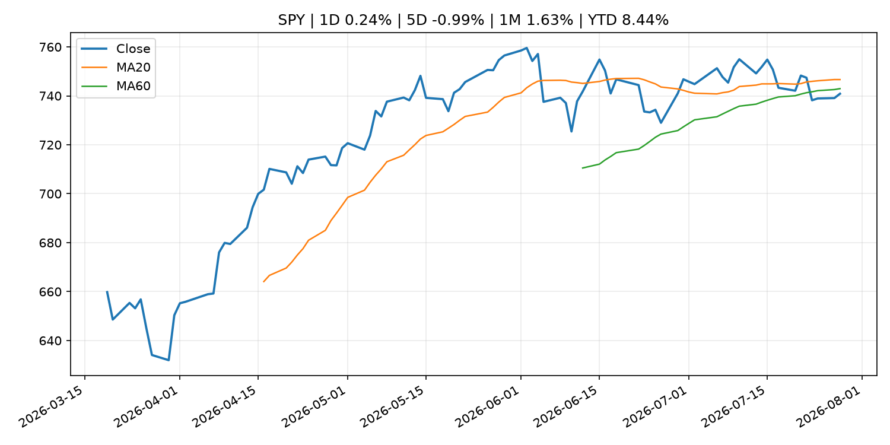
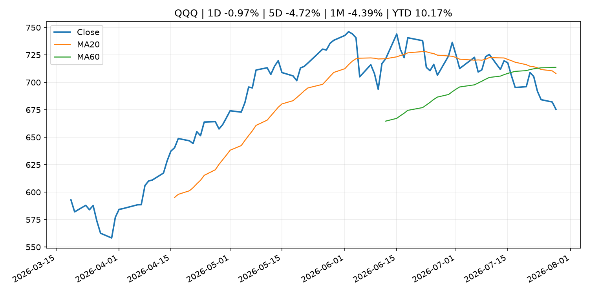
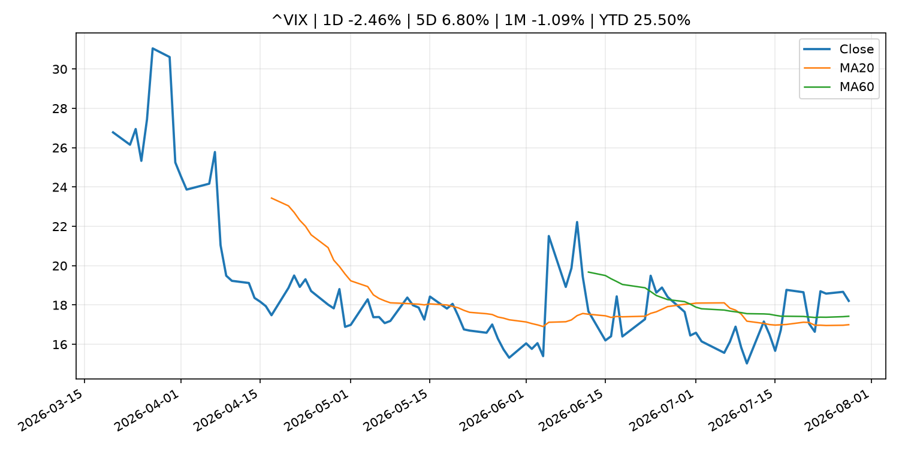
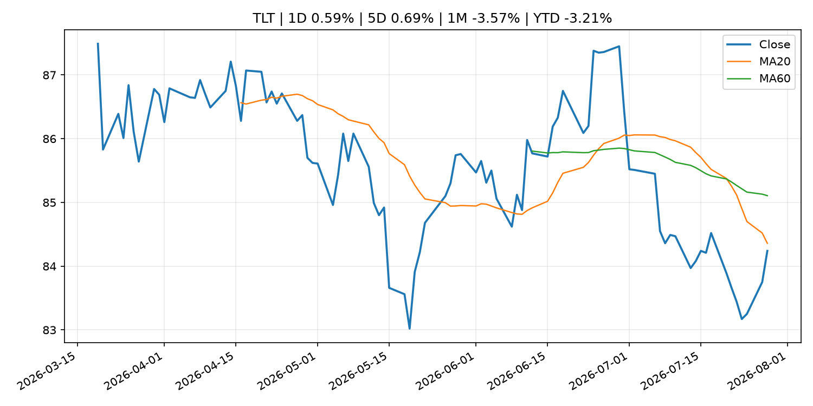
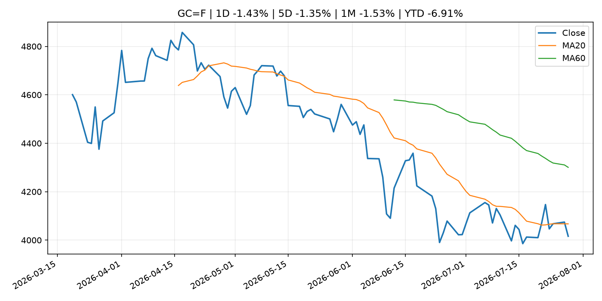
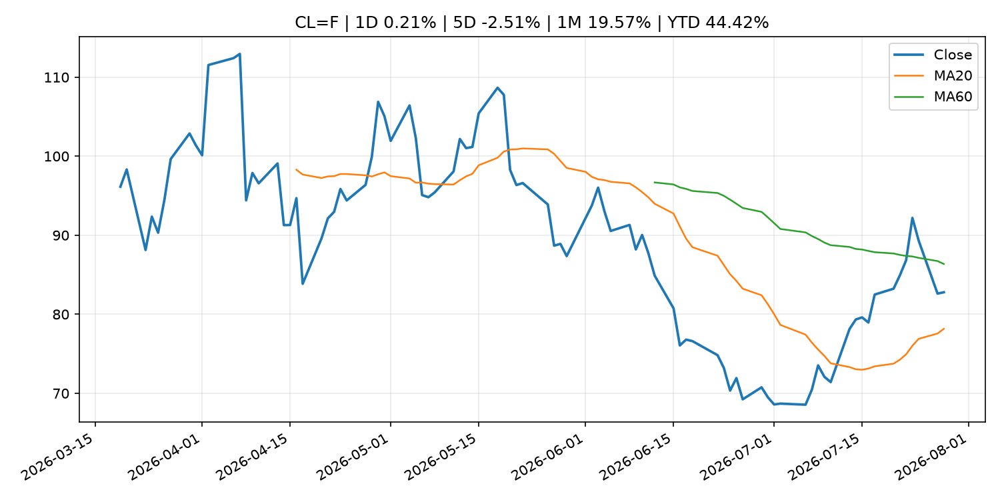
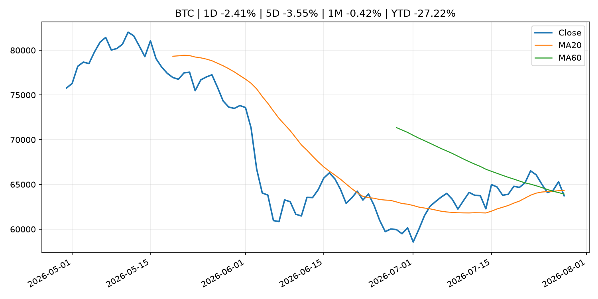
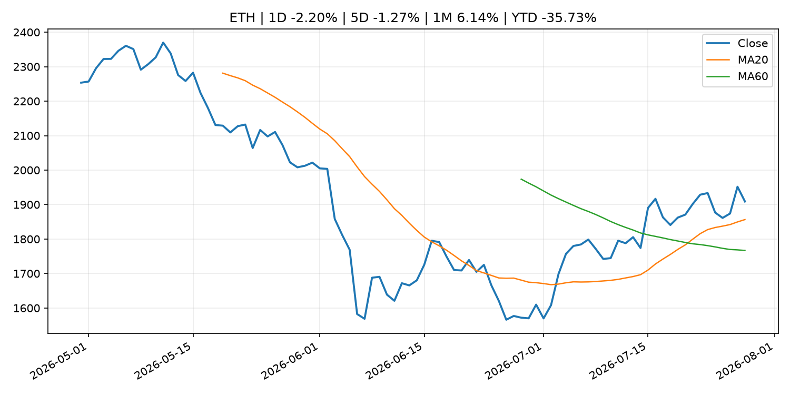
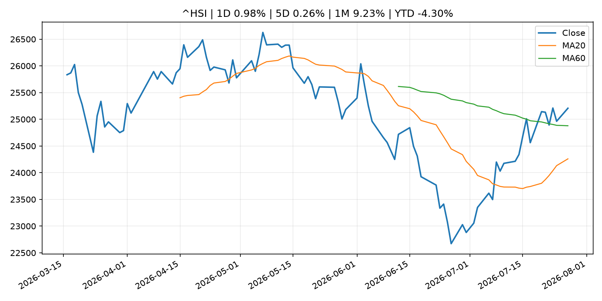

# Global Macro Morning Briefing - 2026-07-29

> Not financial advice / 非投资建议。

## 0. 今日总览
- 市场状态：unknown。市场信号不足，暂不判断明确状态。
- 今日三大主线：
  1. macro_data: Indicators for Core CPI
  2. financial_stability: 1inch opens Aqua liquidity protocol across 13 chains
  3. earnings: Microsoft is making a $190 billion AI gamble — and investors will soon see if it’s paying off
- 一句话结论：今日晨报重点关注：这类宏观数据会直接改变市场对通胀、增长和政策路径的预期。；金融稳定信号可能放大跨资产波动，并影响央行反应函数。。跨资产方面，SPY 1D 0.24%；QQQ 1D -0.97%；^VIX 1D -2.46%；TLT 1D 0.59%；GC=F 1D -1.43%；CL=F 1D 0.21%；BTC 1D -2.41%；ETH 1D -2.20%；市场信号不足，暂不判断明确状态。政策、通胀、利率、美元、美债、能源和加密监管仍是主要观察线索。所有结论仅基于公开数据与短摘要整理，不构成投资建议。

## 1. 隔夜跨资产市场
- 美股：SPY 1D 0.24%，QQQ 1D -0.97%，整体趋势需结合 VIX 和利率确认。
- 美债/美元：TLT 1D 0.59%，美元指数 1D -0.08%，是判断折现率压力的核心线索。
- 黄金/原油：黄金 1D -1.43%，原油 1D 0.21%，用于观察避险、通胀和地缘风险。
- 加密：BTC 1D -2.41%，ETH 1D -2.20%，关注是否独立于纳指走出加密自身行情。
- 港股/A股：恒生 1D 0.98%，沪深300/上证 1D n/a，重点看中国政策预期与人民币线索。
- 风险观察：关注后续数据是否确认当前跨资产信号。

### US_EQUITY

| symbol | latest close | 1D | 5D | 1M | YTD | trend |
|---|---:|---:|---:|---:|---:|---|
| SPY | 740.86 | 0.24% | -0.99% | 1.63% | 8.44% | range_bound |
| QQQ | 675.49 | -0.97% | -4.72% | -4.39% | 10.17% | strong_downtrend |
| DIA | 526.89 | 1.08% | 1.03% | 1.77% | 8.94% | uptrend |
| IWM | 293.37 | 0.16% | -1.07% | -2.15% | 17.92% | range_bound |
| VTI | 365.99 | 0.22% | -0.94% | 1.04% | 8.83% | range_bound |

### US_MACRO_MARKET

| symbol | latest close | 1D | 5D | 1M | YTD | trend |
|---|---:|---:|---:|---:|---:|---|
| ^VIX | 18.21 | -2.46% | 6.80% | -1.09% | 25.50% | range_bound |
| DX-Y.NYB | 101.39 | -0.08% | 0.40% | -0.04% | 3.02% | uptrend |
| TLT | 84.24 | 0.59% | 0.69% | -3.57% | -3.21% | downtrend |
| IEF | 93.56 | 0.30% | 0.27% | -1.55% | -2.62% | downtrend |

### COMMODITIES

| symbol | latest close | 1D | 5D | 1M | YTD | trend |
|---|---:|---:|---:|---:|---:|---|
| GC=F | 4,016.20 | -1.43% | -1.35% | -1.53% | -6.91% | downtrend |
| SI=F | 57.16 | -2.24% | -2.85% | -3.47% | -18.99% | downtrend |
| CL=F | 82.78 | 0.21% | -2.51% | 19.57% | 44.42% | range_bound |
| BZ=F | 87.50 | -0.97% | -3.86% | 21.54% | 44.03% | range_bound |
| NG=F | 2.69 | -2.75% | -6.07% | -16.71% | -25.62% | strong_downtrend |
| HG=F | 6.34 | -0.06% | -2.70% | 3.15% | 12.32% | range_bound |

### HK_MARKET

| symbol | latest close | 1D | 5D | 1M | YTD | trend |
|---|---:|---:|---:|---:|---:|---|
| ^HSI | 25,207.18 | 0.98% | 0.26% | 9.23% | -4.30% | range_bound |
| 0700.HK | 447.20 | 0.95% | -5.65% | 8.60% | -28.22% | range_bound |
| 9988.HK | 112.00 | 0.90% | -4.27% | 25.14% | -24.83% | range_bound |
| 3690.HK | 90.30 | 1.12% | 5.99% | 40.54% | -13.67% | strong_uptrend |
| 1810.HK | 29.26 | 2.02% | 6.71% | 36.60% | -27.36% | range_bound |
| 1211.HK | 89.80 | 1.41% | 0.00% | 23.61% | -9.06% | range_bound |

### CRYPTO

| symbol | latest close | 1D | 5D | 1M | YTD | trend |
|---|---:|---:|---:|---:|---:|---|
| BTC | 63,734.07 | -2.41% | -3.55% | -0.42% | -27.22% | range_bound |
| ETH | 1,908.93 | -2.20% | -1.27% | 6.14% | -35.73% | strong_uptrend |
| SOLANA | 73.39 | -4.19% | -5.84% | -10.38% | -41.06% | range_bound |
| BINANCECOIN | 568.36 | -1.10% | -0.43% | -2.94% | -34.15% | downtrend |
| RIPPLE | 1.06 | -4.42% | -6.92% | -7.14% | -42.27% | downtrend |

## 2. 今日最重要的 10 条新闻
### 1. Indicators for Core CPI
- 来源：Bank of Japan Announcements
- 时间：2026-07-28T14:00:00+09:00
- 地区：Japan
- 事件类型：macro_data
- 重要性层级：Tier 1
- 一句话摘要：Indicators for Core CPI
- 为什么重要：这类宏观数据会直接改变市场对通胀、增长和政策路径的预期。
- 可能影响：主要影响 DXY，方向为 positive，强度 high；通胀压力可能推高政策利率预期并支撑美元。
  - 资产：DXY
    方向：positive
    强度：high
    原因：通胀压力可能推高政策利率预期并支撑美元。
  - 资产：TLT
    方向：negative
    强度：high
    原因：通胀上行通常推升收益率、压低长债价格。
  - 资产：QQQ
    方向：negative
    强度：high
    原因：更高利率对成长股估值折现率不利。
  - 资产：SPY
    方向：mixed
    强度：medium
    原因：名义增长可能支撑收入，但更高利率压制估值。
  - 资产：GC=F
    方向：mixed
    强度：medium
    原因：通胀对黄金是支撑，但实际利率上行会形成压力。
  - 资产：BTC
    方向：mixed
    强度：medium
    原因：抗通胀叙事和流动性收紧可能相互抵消。
- 原文链接：[http://www.boj.or.jp/en/research/research_data/cpi/index.htm](http://www.boj.or.jp/en/research/research_data/cpi/index.htm)

### 2. 1inch opens Aqua liquidity protocol across 13 chains
- 来源：CoinDesk
- 时间：2026-07-28T11:00:00+00:00
- 地区：global
- 事件类型：financial_stability
- 重要性层级：Tier 1
- 一句话摘要：1inch opens Aqua liquidity protocol across 13 chains
- 为什么重要：金融稳定信号可能放大跨资产波动，并影响央行反应函数。
- 可能影响：可能影响利率、汇率、风险资产或大宗商品预期，但当前公开信息不足以判断明确方向。
  - 资产：暂无明确资产映射
  - 方向：unknown
  - 强度：low
  - 原因：公开信息不足以判断方向。
- 原文链接：[https://www.coindesk.com/web3/2026/07/27/1inch-opens-aqua-liquidity-protocol-across-13-chains](https://www.coindesk.com/web3/2026/07/27/1inch-opens-aqua-liquidity-protocol-across-13-chains)

### 3. Microsoft is making a $190 billion AI gamble — and investors will soon see if it’s paying off
- 来源：MarketWatch Top Stories
- 时间：2026-07-28T20:33:00+00:00
- 地区：US
- 事件类型：earnings
- 重要性层级：Tier 2
- 一句话摘要：Wednesday’s earnings report will offer a read on whether Microsoft’s aggressive AI buildout is delivering appropriate returns
- 为什么重要：大型科技股盈利和资本开支会影响纳指、半导体和 AI 交易主线。
- 可能影响：主要影响 QQQ，方向为 mixed，强度 high；AI 资本开支会影响大型科技股盈利和估值预期。
  - 资产：QQQ
    方向：mixed
    强度：high
    原因：AI 资本开支会影响大型科技股盈利和估值预期。
  - 资产：SMH
    方向：mixed
    强度：high
    原因：AI 投资周期直接影响半导体需求。
  - 资产：NVDA
    方向：mixed
    强度：high
    原因：AI 训练和推理需求是英伟达收入预期核心变量。
  - 资产：MSFT
    方向：mixed
    强度：medium
    原因：云和 AI 资本开支影响利润率与增长叙事。
  - 资产：GOOGL
    方向：mixed
    强度：medium
    原因：AI 投资和搜索商业化影响估值。
  - 资产：META
    方向：mixed
    强度：medium
    原因：AI 基建支出与广告效率共同影响市场预期。
- 原文链接：[https://www.marketwatch.com/story/microsoft-is-making-a-190-billion-ai-gamble-and-investors-will-soon-see-if-its-paying-off-b53bd89a?mod=mw_rss_topstories](https://www.marketwatch.com/story/microsoft-is-making-a-190-billion-ai-gamble-and-investors-will-soon-see-if-its-paying-off-b53bd89a?mod=mw_rss_topstories)

### 4. 'Anything remotely dovish' from Fed could be good for bitcoin, says analyst
- 来源：CoinDesk
- 时间：2026-07-28T20:23:31+00:00
- 地区：global
- 事件类型：central_bank_speech
- 重要性层级：Tier 2
- 一句话摘要：'Anything remotely dovish' from Fed could be good for bitcoin, says analyst
- 为什么重要：央行官员表态可能影响市场对下一次会议的定价。
- 可能影响：主要影响 QQQ，方向为 positive，强度 high；宽松预期降低折现率，有利于成长股。
  - 资产：QQQ
    方向：positive
    强度：high
    原因：宽松预期降低折现率，有利于成长股。
  - 资产：SPY
    方向：positive
    强度：high
    原因：宽松政策通常改善风险偏好。
  - 资产：TLT
    方向：positive
    强度：high
    原因：降息预期通常推升长债价格。
  - 资产：DXY
    方向：negative
    强度：medium
    原因：利差预期回落通常压制美元。
  - 资产：GC=F
    方向：positive
    强度：medium
    原因：实际利率下降通常利好黄金。
  - 资产：BTC
    方向：positive
    强度：high
    原因：流动性改善通常支持加密资产。
- 原文链接：[https://www.coindesk.com/markets/2026/07/28/remotely-dovish-fed-could-be-good-for-bitcoin-says-analyst](https://www.coindesk.com/markets/2026/07/28/remotely-dovish-fed-could-be-good-for-bitcoin-says-analyst)

### 5. Meta likely to highlight smart glasses, avoid social media policy on upcoming earnings call, Kalshi traders say
- 来源：CNBC Economy
- 时间：2026-07-28T17:40:03+00:00
- 地区：US
- 事件类型：earnings
- 重要性层级：Tier 2
- 一句话摘要：The Facebook and Instagram owner is set to report earnings after the market close on Wednesday.
- 为什么重要：大型科技股盈利和资本开支会影响纳指、半导体和 AI 交易主线。
- 可能影响：主要影响 QQQ，方向为 mixed，强度 high；AI 资本开支会影响大型科技股盈利和估值预期。
  - 资产：QQQ
    方向：mixed
    强度：high
    原因：AI 资本开支会影响大型科技股盈利和估值预期。
  - 资产：SMH
    方向：mixed
    强度：high
    原因：AI 投资周期直接影响半导体需求。
  - 资产：NVDA
    方向：mixed
    强度：high
    原因：AI 训练和推理需求是英伟达收入预期核心变量。
  - 资产：MSFT
    方向：mixed
    强度：medium
    原因：云和 AI 资本开支影响利润率与增长叙事。
  - 资产：GOOGL
    方向：mixed
    强度：medium
    原因：AI 投资和搜索商业化影响估值。
  - 资产：META
    方向：mixed
    强度：medium
    原因：AI 基建支出与广告效率共同影响市场预期。
- 原文链接：[https://www.cnbc.com/2026/07/28/meta-q2-earnings-call-mentions-kalshi-market-odds-.html](https://www.cnbc.com/2026/07/28/meta-q2-earnings-call-mentions-kalshi-market-odds-.html)

### 6. Small Business Forum’s Report to Congress Highlights Recommendations to Improve Capital-Raising Policy
- 来源：SEC Press Releases
- 时间：2026-07-27T15:59:17-04:00
- 地区：US
- 事件类型：regulation
- 重要性层级：Tier 2
- 一句话摘要：The Securities and Exchange Commission released a report to Congress today highlighting policy recommendations from the SEC’s 45th Annual Government-Business Forum on Small Business Capital Formation. The report provides a summary of the forum…
- 为什么重要：监管变化会改变行业盈利预期和资产风险溢价。
- 可能影响：主要影响 BTC，方向为 mixed，强度 high；加密监管或 ETF 进展会改变 BTC 的资金流和风险溢价。
  - 资产：BTC
    方向：mixed
    强度：high
    原因：加密监管或 ETF 进展会改变 BTC 的资金流和风险溢价。
  - 资产：ETH
    方向：mixed
    强度：high
    原因：监管框架会影响 ETH 产品化和机构参与度。
  - 资产：COIN
    方向：mixed
    强度：medium
    原因：监管清晰度和执法风险会影响交易平台估值。
  - 资产：crypto market
    方向：mixed
    强度：high
    原因：信息影响整个加密市场结构，但方向取决于细节。
- 原文链接：[https://www.sec.gov/newsroom/press-releases/2026-70-small-business-forums-report-congress-highlights-recommendations-improve-capital-raising-policy](https://www.sec.gov/newsroom/press-releases/2026-70-small-business-forums-report-congress-highlights-recommendations-improve-capital-raising-policy)

### 7. Seagate’s earnings are welcome news for the battered AI trade
- 来源：MarketWatch Top Stories
- 时间：2026-07-28T22:17:00+00:00
- 地区：US
- 事件类型：earnings
- 重要性层级：Tier 2
- 一句话摘要：The storage maker’s June-quarter results come in ahead of Wall Street’s expectations, and the stock rallies after hours
- 为什么重要：大型科技股盈利和资本开支会影响纳指、半导体和 AI 交易主线。
- 可能影响：可能影响利率、汇率、风险资产或大宗商品预期，但当前公开信息不足以判断明确方向。
  - 资产：暂无明确资产映射
  - 方向：unknown
  - 强度：low
  - 原因：公开信息不足以判断方向。
- 原文链接：[https://www.marketwatch.com/story/seagates-earnings-are-welcome-news-for-the-battered-ai-trade-92dfc30f?mod=mw_rss_topstories](https://www.marketwatch.com/story/seagates-earnings-are-welcome-news-for-the-battered-ai-trade-92dfc30f?mod=mw_rss_topstories)

### 8. Bloom Energy sees sales top $1 billion as AI proves a validation moment for fuel-cell technology
- 来源：MarketWatch Top Stories
- 时间：2026-07-28T21:17:00+00:00
- 地区：US
- 事件类型：earnings
- 重要性层级：Tier 2
- 一句话摘要：Fuel-cell maker also raises its 2026 guidance for the second straight time
- 为什么重要：大型科技股盈利和资本开支会影响纳指、半导体和 AI 交易主线。
- 可能影响：可能影响利率、汇率、风险资产或大宗商品预期，但当前公开信息不足以判断明确方向。
  - 资产：暂无明确资产映射
  - 方向：unknown
  - 强度：low
  - 原因：公开信息不足以判断方向。
- 原文链接：[https://www.marketwatch.com/story/bloom-energy-sees-sales-top-1-billion-as-ai-proves-a-validation-moment-for-fuel-cell-technology-5cb69476?mod=mw_rss_topstories](https://www.marketwatch.com/story/bloom-energy-sees-sales-top-1-billion-as-ai-proves-a-validation-moment-for-fuel-cell-technology-5cb69476?mod=mw_rss_topstories)

### 9. Leveraged ETFs tied to SK Hynix are getting hammered as chip wreck deepens
- 来源：MarketWatch Top Stories
- 时间：2026-07-28T21:08:00+00:00
- 地区：US
- 事件类型：other
- 重要性层级：Tier 3
- 一句话摘要：Volatility around the AI trade has been rough this week for bullish bets on stocks via leveraged ETFs
- 为什么重要：这条信息暂未匹配到重大宏观、政策或市场事件，更适合作为背景跟踪。
- 可能影响：更偏背景信息，短期市场影响可能有限。
  - 资产：暂无明确资产映射
  - 方向：unknown
  - 强度：low
  - 原因：公开信息不足以判断方向。
- 原文链接：[https://www.marketwatch.com/story/leveraged-etfs-tied-to-sk-hynix-are-getting-hammered-as-chip-wreck-deepens-5303c33c?mod=mw_rss_topstories](https://www.marketwatch.com/story/leveraged-etfs-tied-to-sk-hynix-are-getting-hammered-as-chip-wreck-deepens-5303c33c?mod=mw_rss_topstories)

### 10. Morgan Stanley debuts ether, solana exchange-traded products after bitcoin fund success
- 来源：CoinDesk
- 时间：2026-07-28T14:30:57+00:00
- 地区：global
- 事件类型：other
- 重要性层级：Tier 3
- 一句话摘要：Morgan Stanley debuts ether, solana exchange-traded products after bitcoin fund success
- 为什么重要：这条信息暂未匹配到重大宏观、政策或市场事件，更适合作为背景跟踪。
- 可能影响：更偏背景信息，短期市场影响可能有限。
  - 资产：暂无明确资产映射
  - 方向：unknown
  - 强度：low
  - 原因：公开信息不足以判断方向。
- 原文链接：[https://www.coindesk.com/markets/2026/07/28/morgan-stanley-debuts-ether-and-solana-etps-after-bitcoin-fund-success](https://www.coindesk.com/markets/2026/07/28/morgan-stanley-debuts-ether-and-solana-etps-after-bitcoin-fund-success)

## 3. 政策与央行观察
### 1. 1inch opens Aqua liquidity protocol across 13 chains
- 来源：CoinDesk
- 时间：2026-07-28T11:00:00+00:00
- 地区：global
- 事件类型：financial_stability
- 重要性层级：Tier 1
- 一句话摘要：1inch opens Aqua liquidity protocol across 13 chains
- 为什么重要：金融稳定信号可能放大跨资产波动，并影响央行反应函数。
- 可能影响：可能影响利率、汇率、风险资产或大宗商品预期，但当前公开信息不足以判断明确方向。
  - 资产：暂无明确资产映射
  - 方向：unknown
  - 强度：low
  - 原因：公开信息不足以判断方向。
- 原文链接：[https://www.coindesk.com/web3/2026/07/27/1inch-opens-aqua-liquidity-protocol-across-13-chains](https://www.coindesk.com/web3/2026/07/27/1inch-opens-aqua-liquidity-protocol-across-13-chains)

### 2. 'Anything remotely dovish' from Fed could be good for bitcoin, says analyst
- 来源：CoinDesk
- 时间：2026-07-28T20:23:31+00:00
- 地区：global
- 事件类型：central_bank_speech
- 重要性层级：Tier 2
- 一句话摘要：'Anything remotely dovish' from Fed could be good for bitcoin, says analyst
- 为什么重要：央行官员表态可能影响市场对下一次会议的定价。
- 可能影响：主要影响 QQQ，方向为 positive，强度 high；宽松预期降低折现率，有利于成长股。
  - 资产：QQQ
    方向：positive
    强度：high
    原因：宽松预期降低折现率，有利于成长股。
  - 资产：SPY
    方向：positive
    强度：high
    原因：宽松政策通常改善风险偏好。
  - 资产：TLT
    方向：positive
    强度：high
    原因：降息预期通常推升长债价格。
  - 资产：DXY
    方向：negative
    强度：medium
    原因：利差预期回落通常压制美元。
  - 资产：GC=F
    方向：positive
    强度：medium
    原因：实际利率下降通常利好黄金。
  - 资产：BTC
    方向：positive
    强度：high
    原因：流动性改善通常支持加密资产。
- 原文链接：[https://www.coindesk.com/markets/2026/07/28/remotely-dovish-fed-could-be-good-for-bitcoin-says-analyst](https://www.coindesk.com/markets/2026/07/28/remotely-dovish-fed-could-be-good-for-bitcoin-says-analyst)

### 3. Small Business Forum’s Report to Congress Highlights Recommendations to Improve Capital-Raising Policy
- 来源：SEC Press Releases
- 时间：2026-07-27T15:59:17-04:00
- 地区：US
- 事件类型：regulation
- 重要性层级：Tier 2
- 一句话摘要：The Securities and Exchange Commission released a report to Congress today highlighting policy recommendations from the SEC’s 45th Annual Government-Business Forum on Small Business Capital Formation. The report provides a summary of the forum…
- 为什么重要：监管变化会改变行业盈利预期和资产风险溢价。
- 可能影响：主要影响 BTC，方向为 mixed，强度 high；加密监管或 ETF 进展会改变 BTC 的资金流和风险溢价。
  - 资产：BTC
    方向：mixed
    强度：high
    原因：加密监管或 ETF 进展会改变 BTC 的资金流和风险溢价。
  - 资产：ETH
    方向：mixed
    强度：high
    原因：监管框架会影响 ETH 产品化和机构参与度。
  - 资产：COIN
    方向：mixed
    强度：medium
    原因：监管清晰度和执法风险会影响交易平台估值。
  - 资产：crypto market
    方向：mixed
    强度：high
    原因：信息影响整个加密市场结构，但方向取决于细节。
- 原文链接：[https://www.sec.gov/newsroom/press-releases/2026-70-small-business-forums-report-congress-highlights-recommendations-improve-capital-raising-policy](https://www.sec.gov/newsroom/press-releases/2026-70-small-business-forums-report-congress-highlights-recommendations-improve-capital-raising-policy)

## 4. 市场异动与图表
- QQQ 下跌 -0.97%
- TLT 上涨 0.59%
- Gold 下跌 -1.43%
- BTC 下跌 -2.41%
- ETH 下跌 -2.20%

### SPY

### QQQ

### ^VIX

### TLT

### GC=F

### CL=F

### BTC

### ETH

### ^HSI

## 5. 华尔街与机构公开观点
- 暂无可靠公开观点。

## 6. 今日重点关注
- 经济数据：经济数据：暂无可靠公开日历数据；如配置经济日历源后可自动填充。
- 央行讲话：央行讲话：暂无可靠公开日历数据；重点跟踪 Fed、ECB、BoJ、PBOC 官网 RSS。
- 财报：财报：暂无可靠数据。
- 政策事件：政策事件：暂无可靠数据。
- 风险提醒：风险提醒：关注数据源失败项、突发地缘风险、利率和美元的二阶反应。

## 7. 英文金融表达与宏观概念
- **inflation expectations**：通胀预期，指家庭、企业或市场对未来通胀的预估。 例句：Inflation expectations can shape wage bargaining and bond yields.
- **market structure**：市场结构，指交易、托管、清算、ETF、监管等制度安排。 例句：Crypto market structure rules can affect institutional participation.
- **AI capex**：AI 资本开支，指云厂商和科技公司投入 AI 基建的支出。 例句：AI capex guidance can move semiconductor stocks.
- **real yield**：实际收益率，名义利率扣除通胀预期后的收益率。 例句：Gold often reacts more to real yields than nominal yields.
- **terminal rate**：终端利率，市场预期本轮加息周期的最高政策利率。 例句：A higher terminal rate can pressure growth stocks.
- **soft landing**：软着陆，指通胀回落而经济避免明显衰退。 例句：Markets often rally when data support a soft landing.

## 8. 背景材料
- [Leveraged ETFs tied to SK Hynix are getting hammered as chip wreck deepens](https://www.marketwatch.com/story/leveraged-etfs-tied-to-sk-hynix-are-getting-hammered-as-chip-wreck-deepens-5303c33c?mod=mw_rss_topstories)（MarketWatch Top Stories，other）：Volatility around the AI trade has been rough this week for bullish bets on stocks via leveraged ETFs
- [Morgan Stanley debuts ether, solana exchange-traded products after bitcoin fund success](https://www.coindesk.com/markets/2026/07/28/morgan-stanley-debuts-ether-and-solana-etps-after-bitcoin-fund-success)（CoinDesk，other）：Morgan Stanley debuts ether, solana exchange-traded products after bitcoin fund success
- [Core Scientific lands AMD AI deal as bitcoin mining operation winds down](https://www.coindesk.com/business/2026/07/28/core-scientific-lands-amd-ai-deal-as-bitcoin-mining-operation-winds-down)（CoinDesk，other）：Core Scientific lands AMD AI deal as bitcoin mining operation winds down
- [Apple kept fake bitcoin wallet on App Store after $875,000 theft report, lawsuit alleges](https://www.coindesk.com/business/2026/07/28/apple-kept-fake-bitcoin-wallet-on-app-store-after-usd875-000-theft-report-lawsuit-alleges)（CoinDesk，other）：Apple kept fake bitcoin wallet on App Store after $875,000 theft report, lawsuit alleges
- [Bitcoin’s recent stability hasn't been enough to spark a broader altcoin rally](https://www.coindesk.com/daybook-us/2026/07/28/bitcoin-s-recent-stability-hasn-t-been-enough-to-spark-a-broader-altcoin-rally)（CoinDesk，other）：Bitcoin’s recent stability hasn't been enough to spark a broader altcoin rally
- [Bitcoin drops as South Korean stocks tumble, Senate shelves crypto Clarity Act](https://www.coindesk.com/markets/2026/07/28/bitcoin-drops-as-south-korean-stocks-tumble-senate-shelves-crypto-clarity-act)（CoinDesk，other）：Bitcoin drops as South Korean stocks tumble, Senate shelves crypto Clarity Act
- [Hong Kong’s central bank puts a number on lenders' quantum preparedness. It's very low.](https://www.coindesk.com/markets/2026/07/28/hong-kong-s-central-bank-puts-a-number-on-lenders-quantum-preparedness-it-s-very-low)（CoinDesk，other）：Hong Kong’s central bank puts a number on lenders' quantum preparedness. It's very low.
- [Bitcoin slides 2% after U.S. close while Korea’s Kospi plunges 10%](https://www.coindesk.com/markets/2026/07/28/bitcoin-slides-2-after-u-s-close-while-korea-s-kospi-plunges-10)（CoinDesk，other）：Bitcoin slides 2% after U.S. close while Korea’s Kospi plunges 10%
- [Bitcoin shrugs off AI selloff but high-stakes Fed meeting could determine what's next](https://www.coindesk.com/markets/2026/07/27/bitcoin-shrugs-off-ai-selloff-but-high-stakes-fed-meeting-could-determine-what-s-next)（CoinDesk，other）：Bitcoin shrugs off AI selloff but high-stakes Fed meeting could determine what's next
- [(IMES Newsletter) 2026 BOJ-IMES Conference](http://www.boj.or.jp/en/about/release_2026/rel260727a.htm)（Bank of Japan Announcements，other）：(IMES Newsletter) 2026 BOJ-IMES Conference
- [Services Producer Price Index (June)](http://www.boj.or.jp/en/statistics/pi/cspi_release/sppi2606.pdf)（Bank of Japan Announcements，other）：Services Producer Price Index (June)

## 9. 数据源、失败项与免责声明
- 采集时间：2026-07-28T22:57:15
- 数据源：公开 RSS、Yahoo Finance、CoinGecko、AKShare、FRED、SEC data.sec.gov，以及用户自有 inputs/reports 文件。
- 合规说明：不绕过 WSJ、Bloomberg、FT、Reuters 等付费墙；对付费媒体只使用公开 RSS 标题、摘要、链接和发布时间。
- 免责声明：Not financial advice / 非投资建议。本项目仅供个人学习、研究和信息整理，不构成投资建议、交易建议或任何收益承诺。
- 失败或跳过的数据源：
  - crypto data failed coin=dogecoin
  - China market data failed symbol=上证指数: empty dataframe
  - China market data failed symbol=深证成指: empty dataframe
  - China market data failed symbol=创业板指: empty dataframe
  - China market data failed symbol=沪深300: empty dataframe
  - China market data failed symbol=中证500: empty dataframe
  - China market data failed symbol=科创50: empty dataframe
  - FRED_API_KEY not set; skipping FRED macro series
  - SEC failed cik=0000320193
  - SEC failed cik=0000789019
  - SEC failed cik=0001045810
  - SEC failed cik=0001318605
  - SEC failed cik=0001577552
