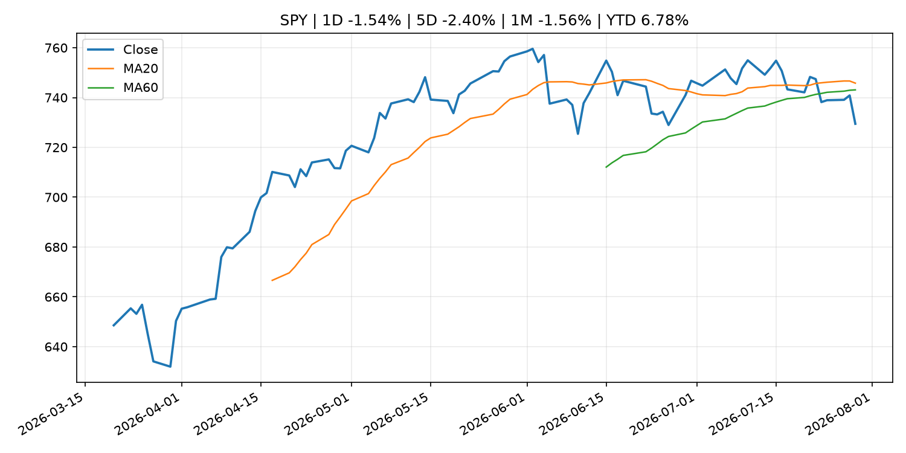
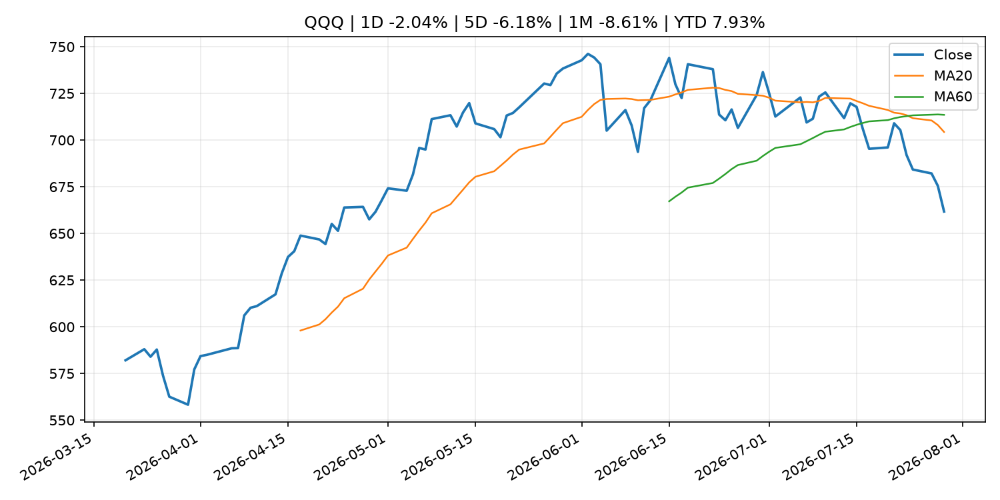
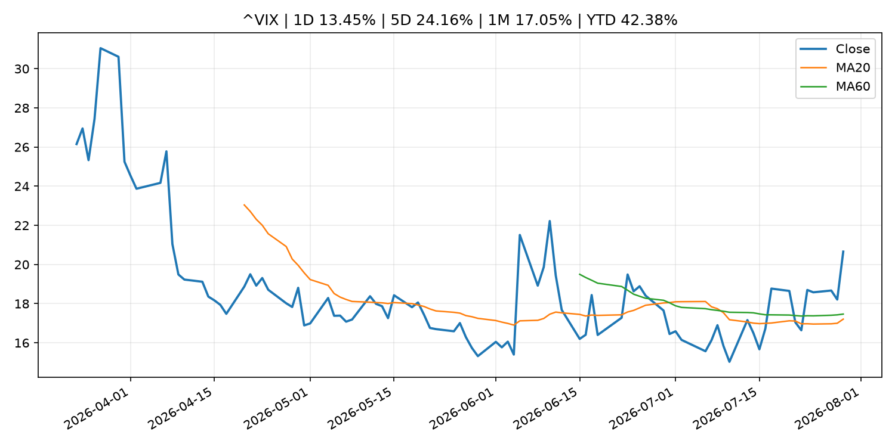
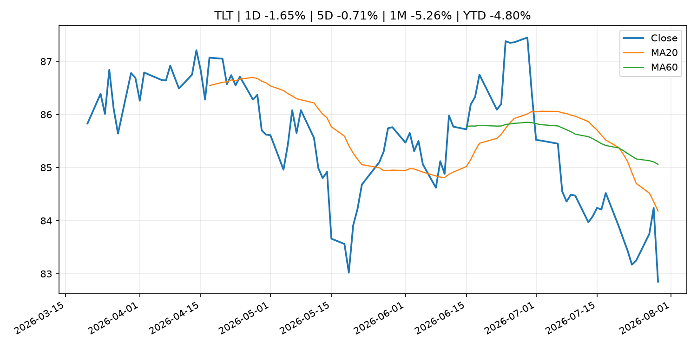
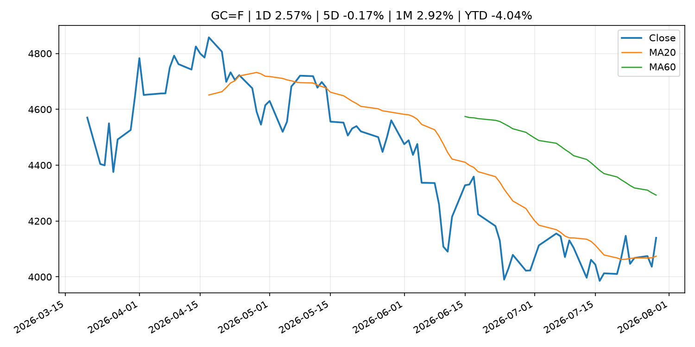
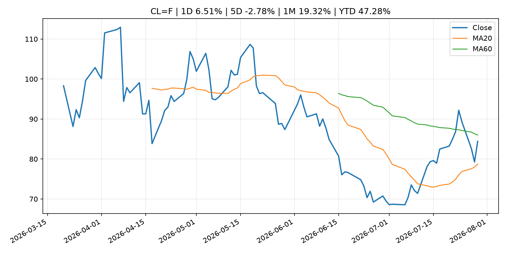
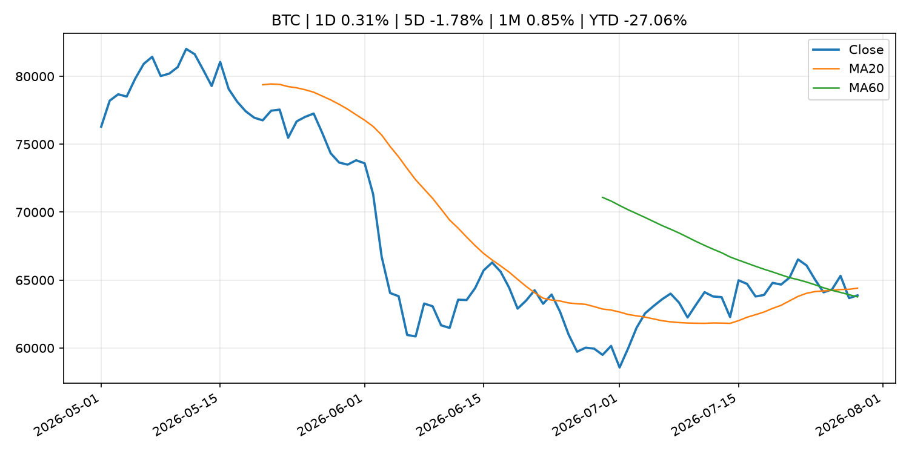
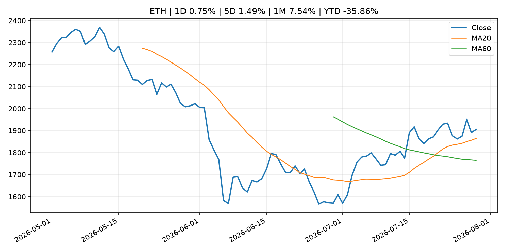
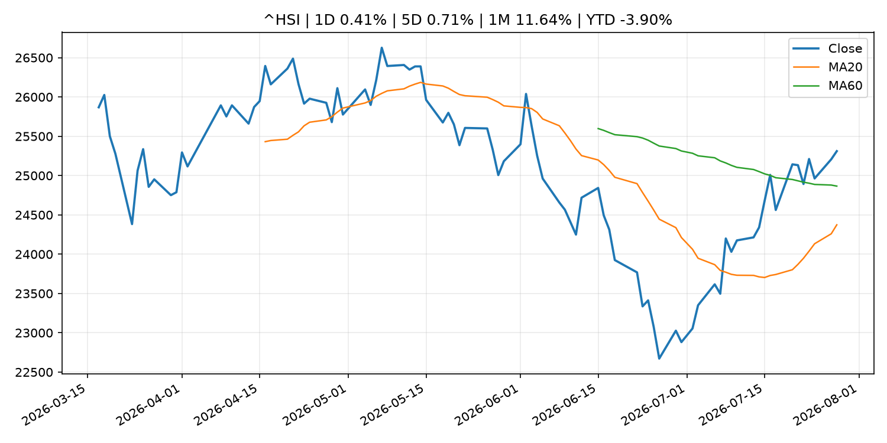

# Global Macro Morning Briefing - 2026-07-30

> Not financial advice / 非投资建议。

## 0. 今日总览
- 市场状态：mixed。股指回落、VIX 抬升且避险资产走强，市场偏风险规避。 但存在信号冲突，需要降低单一叙事置信度。
- 今日三大主线：
  1. geopolitical_risk: Why the USO oil ETF is a better buy than crude futures as the Iran war rages
  2. central_bank_decision: Bond market is calling Warsh’s bluff on inflation fight as yields surge
  3. macro_data: Indicators for Core CPI
- 一句话结论：今日晨报重点关注：地缘风险可能推升避险需求、能源价格和市场波动率。；央行决策会重定价利率、汇率、久期资产和风险资产。。跨资产方面，SPY 1D -1.54%；QQQ 1D -2.04%；^VIX 1D 13.45%；TLT 1D -1.65%；GC=F 1D 2.57%；CL=F 1D 6.51%；BTC 1D 0.31%；ETH 1D 0.75%；股指回落、VIX 抬升且避险资产走强，市场偏风险规避。 但存在信号冲突，需要降低单一叙事置信度。政策、通胀、利率、美元、美债、能源和加密监管仍是主要观察线索。所有结论仅基于公开数据与短摘要整理，不构成投资建议。

## 1. 隔夜跨资产市场
- 美股：SPY 1D -1.54%，QQQ 1D -2.04%，整体趋势需结合 VIX 和利率确认。
- 美债/美元：TLT 1D -1.65%，美元指数 1D -0.57%，是判断折现率压力的核心线索。
- 黄金/原油：黄金 1D 2.57%，原油 1D 6.51%，用于观察避险、通胀和地缘风险。
- 加密：BTC 1D 0.31%，ETH 1D 0.75%，关注是否独立于纳指走出加密自身行情。
- 港股/A股：恒生 1D 0.41%，沪深300/上证 1D n/a，重点看中国政策预期与人民币线索。
- 风险观察：关注避险是否演变为信用或流动性压力。

### US_EQUITY

| symbol | latest close | 1D | 5D | 1M | YTD | trend |
|---|---:|---:|---:|---:|---:|---|
| SPY | 729.46 | -1.54% | -2.40% | -1.56% | 6.78% | range_bound |
| QQQ | 661.73 | -2.04% | -6.18% | -8.61% | 7.93% | strong_downtrend |
| DIA | 515.41 | -2.18% | -1.16% | -1.20% | 6.57% | range_bound |
| IWM | 288.57 | -1.64% | -1.78% | -3.48% | 15.99% | range_bound |
| VTI | 360.42 | -1.52% | -2.29% | -1.83% | 7.17% | range_bound |

### US_MACRO_MARKET

| symbol | latest close | 1D | 5D | 1M | YTD | trend |
|---|---:|---:|---:|---:|---:|---|
| ^VIX | 20.66 | 13.45% | 24.16% | 17.05% | 42.38% | range_bound |
| DX-Y.NYB | 100.80 | -0.57% | -0.33% | -0.30% | 2.42% | range_bound |
| TLT | 82.85 | -1.65% | -0.71% | -5.26% | -4.80% | strong_downtrend |
| IEF | 93.17 | -0.42% | 0.08% | -1.99% | -3.03% | downtrend |

### COMMODITIES

| symbol | latest close | 1D | 5D | 1M | YTD | trend |
|---|---:|---:|---:|---:|---:|---|
| GC=F | 4,139.90 | 2.57% | -0.17% | 2.92% | -4.04% | range_bound |
| SI=F | 58.47 | 2.04% | -2.59% | 0.50% | -17.14% | downtrend |
| CL=F | 84.42 | 6.51% | -2.78% | 19.32% | 47.28% | range_bound |
| BZ=F | 90.40 | 7.50% | -3.90% | 23.58% | 48.81% | range_bound |
| NG=F | 2.73 | 2.48% | -6.74% | -14.24% | -24.60% | strong_downtrend |
| HG=F | 6.37 | 0.74% | -1.27% | 4.45% | 12.93% | range_bound |

### HK_MARKET

| symbol | latest close | 1D | 5D | 1M | YTD | trend |
|---|---:|---:|---:|---:|---:|---|
| ^HSI | 25,310.85 | 0.41% | 0.71% | 11.64% | -3.90% | range_bound |
| 0700.HK | 466.40 | 4.29% | 5.86% | 10.99% | -25.14% | uptrend |
| 9988.HK | 113.60 | 1.43% | 0.00% | 22.15% | -23.76% | range_bound |
| 3690.HK | 92.30 | 2.21% | 10.34% | 36.44% | -11.76% | strong_uptrend |
| 1810.HK | 31.88 | 8.95% | 19.49% | 45.84% | -20.85% | range_bound |
| 1211.HK | 93.60 | 4.23% | 6.55% | 28.40% | -5.22% | range_bound |

### CRYPTO

| symbol | latest close | 1D | 5D | 1M | YTD | trend |
|---|---:|---:|---:|---:|---:|---|
| BTC | 63,873.56 | 0.31% | -1.78% | 0.85% | -27.06% | range_bound |
| ETH | 1,904.84 | 0.75% | 1.49% | 7.54% | -35.86% | uptrend |
| SOLANA | 73.53 | -0.90% | -2.95% | -8.76% | -40.95% | range_bound |
| BINANCECOIN | 570.38 | 0.84% | 0.60% | -1.08% | -33.88% | downtrend |
| RIPPLE | 1.07 | 0.81% | -3.03% | -3.48% | -41.69% | strong_downtrend |

## 2. 今日最重要的 10 条新闻
### 1. Why the USO oil ETF is a better buy than crude futures as the Iran war rages
- 来源：MarketWatch Top Stories
- 时间：2026-07-29T22:44:00+00:00
- 地区：US
- 事件类型：geopolitical_risk
- 重要性层级：Tier 1
- 一句话摘要：The United States Oil Fund has climbed by 58% since the start of the Iran war, more than double the gain of WTI crude futures.
- 为什么重要：地缘风险可能推升避险需求、能源价格和市场波动率。
- 可能影响：主要影响 CL=F，方向为 positive，强度 high；供给扰动或 OPEC 减产通常推升 WTI 原油。
  - 资产：CL=F
    方向：positive
    强度：high
    原因：供给扰动或 OPEC 减产通常推升 WTI 原油。
  - 资产：BZ=F
    方向：positive
    强度：high
    原因：全球供给风险通常直接影响 Brent 原油。
  - 资产：SPY
    方向：mixed
    强度：medium
    原因：能源股可能受益，但通胀和成本压力不利于宽基风险资产。
  - 资产：BTC
    方向：mixed
    强度：high
    原因：加密监管或 ETF 进展会改变 BTC 的资金流和风险溢价。
  - 资产：ETH
    方向：mixed
    强度：high
    原因：监管框架会影响 ETH 产品化和机构参与度。
  - 资产：COIN
    方向：mixed
    强度：medium
    原因：监管清晰度和执法风险会影响交易平台估值。
- 原文链接：[https://www.marketwatch.com/story/why-the-uso-oil-etf-is-a-better-buy-than-crude-futures-as-the-iran-war-rages-85d1ebe0?mod=mw_rss_topstories](https://www.marketwatch.com/story/why-the-uso-oil-etf-is-a-better-buy-than-crude-futures-as-the-iran-war-rages-85d1ebe0?mod=mw_rss_topstories)

### 2. Bond market is calling Warsh’s bluff on inflation fight as yields surge
- 来源：MarketWatch Top Stories
- 时间：2026-07-29T21:43:00+00:00
- 地区：US
- 事件类型：central_bank_decision
- 重要性层级：Tier 1
- 一句话摘要：The yield on the 30-year Treasury bond touched its highest level since 2007 during Warsh’s press conference.
- 为什么重要：央行决策会重定价利率、汇率、久期资产和风险资产。
- 可能影响：主要影响 DXY，方向为 positive，强度 high；通胀压力可能推高政策利率预期并支撑美元。
  - 资产：DXY
    方向：positive
    强度：high
    原因：通胀压力可能推高政策利率预期并支撑美元。
  - 资产：TLT
    方向：negative
    强度：high
    原因：通胀上行通常推升收益率、压低长债价格。
  - 资产：QQQ
    方向：negative
    强度：high
    原因：更高利率对成长股估值折现率不利。
  - 资产：SPY
    方向：mixed
    强度：medium
    原因：名义增长可能支撑收入，但更高利率压制估值。
  - 资产：GC=F
    方向：mixed
    强度：medium
    原因：通胀对黄金是支撑，但实际利率上行会形成压力。
  - 资产：BTC
    方向：mixed
    强度：medium
    原因：抗通胀叙事和流动性收紧可能相互抵消。
- 原文链接：[https://www.marketwatch.com/story/bond-market-is-calling-warshs-bluff-on-inflation-fight-as-yields-surge-4700f9b5?mod=mw_rss_topstories](https://www.marketwatch.com/story/bond-market-is-calling-warshs-bluff-on-inflation-fight-as-yields-surge-4700f9b5?mod=mw_rss_topstories)

### 3. Indicators for Core CPI
- 来源：Bank of Japan Announcements
- 时间：2026-07-28T14:00:00+09:00
- 地区：Japan
- 事件类型：macro_data
- 重要性层级：Tier 1
- 一句话摘要：Indicators for Core CPI
- 为什么重要：这类宏观数据会直接改变市场对通胀、增长和政策路径的预期。
- 可能影响：主要影响 DXY，方向为 positive，强度 high；通胀压力可能推高政策利率预期并支撑美元。
  - 资产：DXY
    方向：positive
    强度：high
    原因：通胀压力可能推高政策利率预期并支撑美元。
  - 资产：TLT
    方向：negative
    强度：high
    原因：通胀上行通常推升收益率、压低长债价格。
  - 资产：QQQ
    方向：negative
    强度：high
    原因：更高利率对成长股估值折现率不利。
  - 资产：SPY
    方向：mixed
    强度：medium
    原因：名义增长可能支撑收入，但更高利率压制估值。
  - 资产：GC=F
    方向：mixed
    强度：medium
    原因：通胀对黄金是支撑，但实际利率上行会形成压力。
  - 资产：BTC
    方向：mixed
    强度：medium
    原因：抗通胀叙事和流动性收紧可能相互抵消。
- 原文链接：[http://www.boj.or.jp/en/research/research_data/cpi/index.htm](http://www.boj.or.jp/en/research/research_data/cpi/index.htm)

### 4. Citadel bets on a Fed rate hike Wednesday as bitcoin analysts call a hold. Someone will be wrong.
- 来源：CoinDesk
- 时间：2026-07-29T05:37:38+00:00
- 地区：global
- 事件类型：central_bank_decision
- 重要性层级：Tier 1
- 一句话摘要：Citadel bets on a Fed rate hike Wednesday as bitcoin analysts call a hold. Someone will be wrong.
- 为什么重要：央行决策会重定价利率、汇率、久期资产和风险资产。
- 可能影响：主要影响 QQQ，方向为 negative，强度 high；鹰派政策提高折现率，压制成长股估值。
  - 资产：QQQ
    方向：negative
    强度：high
    原因：鹰派政策提高折现率，压制成长股估值。
  - 资产：SPY
    方向：negative
    强度：medium
    原因：更紧政策通常削弱风险偏好。
  - 资产：TLT
    方向：negative
    强度：high
    原因：利率上行通常压低长债价格。
  - 资产：DXY
    方向：positive
    强度：high
    原因：更高利率预期通常支撑美元。
  - 资产：BTC
    方向：negative
    强度：high
    原因：流动性收紧通常压制高 beta 加密资产。
- 原文链接：[https://www.coindesk.com/markets/2026/07/29/citadel-bets-on-a-fed-rate-hike-wednesday-as-bitcoin-analysts-call-a-hold-someone-will-be-wrong](https://www.coindesk.com/markets/2026/07/29/citadel-bets-on-a-fed-rate-hike-wednesday-as-bitcoin-analysts-call-a-hold-someone-will-be-wrong)

### 5. Federal Reserve issues FOMC statement
- 来源：Federal Reserve Press Releases
- 时间：2026-07-29T18:00:00+00:00
- 地区：US
- 事件类型：central_bank_decision
- 重要性层级：Tier 1
- 一句话摘要：Federal Reserve issues FOMC statement
- 为什么重要：央行决策会重定价利率、汇率、久期资产和风险资产。
- 可能影响：可能影响利率、汇率、风险资产或大宗商品预期，但当前公开信息不足以判断明确方向。
  - 资产：暂无明确资产映射
  - 方向：unknown
  - 强度：low
  - 原因：公开信息不足以判断方向。
- 原文链接：[https://www.federalreserve.gov/newsevents/pressreleases/monetary20260729a.htm](https://www.federalreserve.gov/newsevents/pressreleases/monetary20260729a.htm)

### 6. Bitcoin steadies above $64,000 as crypto looks to Fed interest-rate decision
- 来源：CoinDesk
- 时间：2026-07-29T10:34:18+00:00
- 地区：global
- 事件类型：central_bank_decision
- 重要性层级：Tier 1
- 一句话摘要：Bitcoin steadies above $64,000 as crypto looks to Fed interest-rate decision
- 为什么重要：央行决策会重定价利率、汇率、久期资产和风险资产。
- 可能影响：可能影响利率、汇率、风险资产或大宗商品预期，但当前公开信息不足以判断明确方向。
  - 资产：暂无明确资产映射
  - 方向：unknown
  - 强度：low
  - 原因：公开信息不足以判断方向。
- 原文链接：[https://www.coindesk.com/markets/2026/07/29/bitcoin-steadies-above-usd64-000-as-crypto-looks-to-fed-interest-rate-decision](https://www.coindesk.com/markets/2026/07/29/bitcoin-steadies-above-usd64-000-as-crypto-looks-to-fed-interest-rate-decision)

### 7. Robinhood slides 4% despite earnings beat as crypto revenue cools
- 来源：CoinDesk
- 时间：2026-07-29T20:40:43+00:00
- 地区：global
- 事件类型：earnings
- 重要性层级：Tier 2
- 一句话摘要：Robinhood slides 4% despite earnings beat as crypto revenue cools
- 为什么重要：大型科技股盈利和资本开支会影响纳指、半导体和 AI 交易主线。
- 可能影响：主要影响 QQQ，方向为 positive，强度 high；通胀低于预期通常压低利率预期，有利于久期较长的成长股。
  - 资产：QQQ
    方向：positive
    强度：high
    原因：通胀低于预期通常压低利率预期，有利于久期较长的成长股。
  - 资产：SPY
    方向：positive
    强度：medium
    原因：通胀降温改善软着陆预期，对宽基股指偏正面。
  - 资产：TLT
    方向：positive
    强度：high
    原因：降息预期升温时长债价格通常受益。
  - 资产：DXY
    方向：negative
    强度：medium
    原因：美元可能随美债收益率和政策利率预期回落。
  - 资产：GC=F
    方向：positive
    强度：medium
    原因：实际利率压力下降时黄金通常受益。
  - 资产：BTC
    方向：positive
    强度：medium
    原因：流动性预期改善通常支持高 beta 加密资产。
- 原文链接：[https://www.coindesk.com/markets/2026/07/29/robinhood-slides-4-despite-earnings-beat-as-crypto-revenue-cools](https://www.coindesk.com/markets/2026/07/29/robinhood-slides-4-despite-earnings-beat-as-crypto-revenue-cools)

### 8. 'Anything remotely dovish' from Fed could be good for bitcoin, says analyst
- 来源：CoinDesk
- 时间：2026-07-28T20:23:31+00:00
- 地区：global
- 事件类型：central_bank_speech
- 重要性层级：Tier 2
- 一句话摘要：'Anything remotely dovish' from Fed could be good for bitcoin, says analyst
- 为什么重要：央行官员表态可能影响市场对下一次会议的定价。
- 可能影响：主要影响 QQQ，方向为 positive，强度 high；宽松预期降低折现率，有利于成长股。
  - 资产：QQQ
    方向：positive
    强度：high
    原因：宽松预期降低折现率，有利于成长股。
  - 资产：SPY
    方向：positive
    强度：high
    原因：宽松政策通常改善风险偏好。
  - 资产：TLT
    方向：positive
    强度：high
    原因：降息预期通常推升长债价格。
  - 资产：DXY
    方向：negative
    强度：medium
    原因：利差预期回落通常压制美元。
  - 资产：GC=F
    方向：positive
    强度：medium
    原因：实际利率下降通常利好黄金。
  - 资产：BTC
    方向：positive
    强度：high
    原因：流动性改善通常支持加密资产。
- 原文链接：[https://www.coindesk.com/markets/2026/07/28/remotely-dovish-fed-could-be-good-for-bitcoin-says-analyst](https://www.coindesk.com/markets/2026/07/28/remotely-dovish-fed-could-be-good-for-bitcoin-says-analyst)

### 9. Meta likely to highlight smart glasses, avoid social media policy on upcoming earnings call, Kalshi traders say
- 来源：CNBC Economy
- 时间：2026-07-28T17:40:03+00:00
- 地区：US
- 事件类型：earnings
- 重要性层级：Tier 2
- 一句话摘要：The Facebook and Instagram owner is set to report earnings after the market close on Wednesday.
- 为什么重要：大型科技股盈利和资本开支会影响纳指、半导体和 AI 交易主线。
- 可能影响：主要影响 QQQ，方向为 mixed，强度 high；AI 资本开支会影响大型科技股盈利和估值预期。
  - 资产：QQQ
    方向：mixed
    强度：high
    原因：AI 资本开支会影响大型科技股盈利和估值预期。
  - 资产：SMH
    方向：mixed
    强度：high
    原因：AI 投资周期直接影响半导体需求。
  - 资产：NVDA
    方向：mixed
    强度：high
    原因：AI 训练和推理需求是英伟达收入预期核心变量。
  - 资产：MSFT
    方向：mixed
    强度：medium
    原因：云和 AI 资本开支影响利润率与增长叙事。
  - 资产：GOOGL
    方向：mixed
    强度：medium
    原因：AI 投资和搜索商业化影响估值。
  - 资产：META
    方向：mixed
    强度：medium
    原因：AI 基建支出与广告效率共同影响市场预期。
- 原文链接：[https://www.cnbc.com/2026/07/28/meta-q2-earnings-call-mentions-kalshi-market-odds-.html](https://www.cnbc.com/2026/07/28/meta-q2-earnings-call-mentions-kalshi-market-odds-.html)

### 10. Stablecoin firm Brale says new protocol can remove a major hurdle to scaling custom tokens
- 来源：CoinDesk
- 时间：2026-07-29T15:27:30+00:00
- 地区：global
- 事件类型：crypto_market_structure
- 重要性层级：Tier 2
- 一句话摘要：Stablecoin firm Brale says new protocol can remove a major hurdle to scaling custom tokens
- 为什么重要：加密市场结构和监管变化会影响 BTC、ETH 及相关股票的风险溢价。
- 可能影响：主要影响 BTC，方向为 mixed，强度 high；加密监管或 ETF 进展会改变 BTC 的资金流和风险溢价。
  - 资产：BTC
    方向：mixed
    强度：high
    原因：加密监管或 ETF 进展会改变 BTC 的资金流和风险溢价。
  - 资产：ETH
    方向：mixed
    强度：high
    原因：监管框架会影响 ETH 产品化和机构参与度。
  - 资产：COIN
    方向：mixed
    强度：medium
    原因：监管清晰度和执法风险会影响交易平台估值。
  - 资产：crypto market
    方向：mixed
    强度：high
    原因：信息影响整个加密市场结构，但方向取决于细节。
- 原文链接：[https://www.coindesk.com/business/2026/07/29/stablecoin-firm-brale-says-new-protocol-can-remove-a-major-hurdle-to-scaling-custom-tokens](https://www.coindesk.com/business/2026/07/29/stablecoin-firm-brale-says-new-protocol-can-remove-a-major-hurdle-to-scaling-custom-tokens)

## 3. 政策与央行观察
### 1. Bond market is calling Warsh’s bluff on inflation fight as yields surge
- 来源：MarketWatch Top Stories
- 时间：2026-07-29T21:43:00+00:00
- 地区：US
- 事件类型：central_bank_decision
- 重要性层级：Tier 1
- 一句话摘要：The yield on the 30-year Treasury bond touched its highest level since 2007 during Warsh’s press conference.
- 为什么重要：央行决策会重定价利率、汇率、久期资产和风险资产。
- 可能影响：主要影响 DXY，方向为 positive，强度 high；通胀压力可能推高政策利率预期并支撑美元。
  - 资产：DXY
    方向：positive
    强度：high
    原因：通胀压力可能推高政策利率预期并支撑美元。
  - 资产：TLT
    方向：negative
    强度：high
    原因：通胀上行通常推升收益率、压低长债价格。
  - 资产：QQQ
    方向：negative
    强度：high
    原因：更高利率对成长股估值折现率不利。
  - 资产：SPY
    方向：mixed
    强度：medium
    原因：名义增长可能支撑收入，但更高利率压制估值。
  - 资产：GC=F
    方向：mixed
    强度：medium
    原因：通胀对黄金是支撑，但实际利率上行会形成压力。
  - 资产：BTC
    方向：mixed
    强度：medium
    原因：抗通胀叙事和流动性收紧可能相互抵消。
- 原文链接：[https://www.marketwatch.com/story/bond-market-is-calling-warshs-bluff-on-inflation-fight-as-yields-surge-4700f9b5?mod=mw_rss_topstories](https://www.marketwatch.com/story/bond-market-is-calling-warshs-bluff-on-inflation-fight-as-yields-surge-4700f9b5?mod=mw_rss_topstories)

### 2. Citadel bets on a Fed rate hike Wednesday as bitcoin analysts call a hold. Someone will be wrong.
- 来源：CoinDesk
- 时间：2026-07-29T05:37:38+00:00
- 地区：global
- 事件类型：central_bank_decision
- 重要性层级：Tier 1
- 一句话摘要：Citadel bets on a Fed rate hike Wednesday as bitcoin analysts call a hold. Someone will be wrong.
- 为什么重要：央行决策会重定价利率、汇率、久期资产和风险资产。
- 可能影响：主要影响 QQQ，方向为 negative，强度 high；鹰派政策提高折现率，压制成长股估值。
  - 资产：QQQ
    方向：negative
    强度：high
    原因：鹰派政策提高折现率，压制成长股估值。
  - 资产：SPY
    方向：negative
    强度：medium
    原因：更紧政策通常削弱风险偏好。
  - 资产：TLT
    方向：negative
    强度：high
    原因：利率上行通常压低长债价格。
  - 资产：DXY
    方向：positive
    强度：high
    原因：更高利率预期通常支撑美元。
  - 资产：BTC
    方向：negative
    强度：high
    原因：流动性收紧通常压制高 beta 加密资产。
- 原文链接：[https://www.coindesk.com/markets/2026/07/29/citadel-bets-on-a-fed-rate-hike-wednesday-as-bitcoin-analysts-call-a-hold-someone-will-be-wrong](https://www.coindesk.com/markets/2026/07/29/citadel-bets-on-a-fed-rate-hike-wednesday-as-bitcoin-analysts-call-a-hold-someone-will-be-wrong)

### 3. Federal Reserve issues FOMC statement
- 来源：Federal Reserve Press Releases
- 时间：2026-07-29T18:00:00+00:00
- 地区：US
- 事件类型：central_bank_decision
- 重要性层级：Tier 1
- 一句话摘要：Federal Reserve issues FOMC statement
- 为什么重要：央行决策会重定价利率、汇率、久期资产和风险资产。
- 可能影响：可能影响利率、汇率、风险资产或大宗商品预期，但当前公开信息不足以判断明确方向。
  - 资产：暂无明确资产映射
  - 方向：unknown
  - 强度：low
  - 原因：公开信息不足以判断方向。
- 原文链接：[https://www.federalreserve.gov/newsevents/pressreleases/monetary20260729a.htm](https://www.federalreserve.gov/newsevents/pressreleases/monetary20260729a.htm)

### 4. Bitcoin steadies above $64,000 as crypto looks to Fed interest-rate decision
- 来源：CoinDesk
- 时间：2026-07-29T10:34:18+00:00
- 地区：global
- 事件类型：central_bank_decision
- 重要性层级：Tier 1
- 一句话摘要：Bitcoin steadies above $64,000 as crypto looks to Fed interest-rate decision
- 为什么重要：央行决策会重定价利率、汇率、久期资产和风险资产。
- 可能影响：可能影响利率、汇率、风险资产或大宗商品预期，但当前公开信息不足以判断明确方向。
  - 资产：暂无明确资产映射
  - 方向：unknown
  - 强度：low
  - 原因：公开信息不足以判断方向。
- 原文链接：[https://www.coindesk.com/markets/2026/07/29/bitcoin-steadies-above-usd64-000-as-crypto-looks-to-fed-interest-rate-decision](https://www.coindesk.com/markets/2026/07/29/bitcoin-steadies-above-usd64-000-as-crypto-looks-to-fed-interest-rate-decision)

### 5. 'Anything remotely dovish' from Fed could be good for bitcoin, says analyst
- 来源：CoinDesk
- 时间：2026-07-28T20:23:31+00:00
- 地区：global
- 事件类型：central_bank_speech
- 重要性层级：Tier 2
- 一句话摘要：'Anything remotely dovish' from Fed could be good for bitcoin, says analyst
- 为什么重要：央行官员表态可能影响市场对下一次会议的定价。
- 可能影响：主要影响 QQQ，方向为 positive，强度 high；宽松预期降低折现率，有利于成长股。
  - 资产：QQQ
    方向：positive
    强度：high
    原因：宽松预期降低折现率，有利于成长股。
  - 资产：SPY
    方向：positive
    强度：high
    原因：宽松政策通常改善风险偏好。
  - 资产：TLT
    方向：positive
    强度：high
    原因：降息预期通常推升长债价格。
  - 资产：DXY
    方向：negative
    强度：medium
    原因：利差预期回落通常压制美元。
  - 资产：GC=F
    方向：positive
    强度：medium
    原因：实际利率下降通常利好黄金。
  - 资产：BTC
    方向：positive
    强度：high
    原因：流动性改善通常支持加密资产。
- 原文链接：[https://www.coindesk.com/markets/2026/07/28/remotely-dovish-fed-could-be-good-for-bitcoin-says-analyst](https://www.coindesk.com/markets/2026/07/28/remotely-dovish-fed-could-be-good-for-bitcoin-says-analyst)

### 6. Stablecoin firm Brale says new protocol can remove a major hurdle to scaling custom tokens
- 来源：CoinDesk
- 时间：2026-07-29T15:27:30+00:00
- 地区：global
- 事件类型：crypto_market_structure
- 重要性层级：Tier 2
- 一句话摘要：Stablecoin firm Brale says new protocol can remove a major hurdle to scaling custom tokens
- 为什么重要：加密市场结构和监管变化会影响 BTC、ETH 及相关股票的风险溢价。
- 可能影响：主要影响 BTC，方向为 mixed，强度 high；加密监管或 ETF 进展会改变 BTC 的资金流和风险溢价。
  - 资产：BTC
    方向：mixed
    强度：high
    原因：加密监管或 ETF 进展会改变 BTC 的资金流和风险溢价。
  - 资产：ETH
    方向：mixed
    强度：high
    原因：监管框架会影响 ETH 产品化和机构参与度。
  - 资产：COIN
    方向：mixed
    强度：medium
    原因：监管清晰度和执法风险会影响交易平台估值。
  - 资产：crypto market
    方向：mixed
    强度：high
    原因：信息影响整个加密市场结构，但方向取决于细节。
- 原文链接：[https://www.coindesk.com/business/2026/07/29/stablecoin-firm-brale-says-new-protocol-can-remove-a-major-hurdle-to-scaling-custom-tokens](https://www.coindesk.com/business/2026/07/29/stablecoin-firm-brale-says-new-protocol-can-remove-a-major-hurdle-to-scaling-custom-tokens)

## 4. 市场异动与图表
- SPY 下跌 -1.54%
- QQQ 下跌 -2.04%
- VIX 上涨 13.45%
- TLT 下跌 -1.65%
- DXY 下跌 -0.57%
- Gold 上涨 2.57%
- Oil 上涨 6.51%

### 信号矛盾
- 股债同时承压，可能是利率或流动性冲击而非传统避险。

### SPY

### QQQ

### ^VIX

### TLT

### GC=F

### CL=F

### BTC

### ETH

### ^HSI

## 5. 华尔街与机构公开观点
- 暂无可靠公开观点。

## 6. 今日重点关注
- 经济数据：经济数据：暂无可靠公开日历数据；如配置经济日历源后可自动填充。
- 央行讲话：央行讲话：暂无可靠公开日历数据；重点跟踪 Fed、ECB、BoJ、PBOC 官网 RSS。
- 财报：财报：暂无可靠数据。
- 政策事件：政策事件：暂无可靠数据。
- 风险提醒：风险提醒：关注数据源失败项、突发地缘风险、利率和美元的二阶反应。

## 7. 英文金融表达与宏观概念
- **inflation expectations**：通胀预期，指家庭、企业或市场对未来通胀的预估。 例句：Inflation expectations can shape wage bargaining and bond yields.
- **real yield**：实际收益率，名义利率扣除通胀预期后的收益率。 例句：Gold often reacts more to real yields than nominal yields.
- **terminal rate**：终端利率，市场预期本轮加息周期的最高政策利率。 例句：A higher terminal rate can pressure growth stocks.
- **risk-off**：避险模式，资金偏向美元、国债、黄金等防御资产。 例句：A geopolitical shock can push markets into risk-off mode.
- **supply disruption**：供给扰动，通常指能源或商品供应受冲突、减产或天气影响。 例句：Supply disruption can lift oil prices and inflation expectations.
- **market structure**：市场结构，指交易、托管、清算、ETF、监管等制度安排。 例句：Crypto market structure rules can affect institutional participation.

## 8. 背景材料
- [Here are the five big takeaways from this week's Fed meeting](https://www.cnbc.com/2026/07/29/here-are-the-five-big-takeaways-from-this-weeks-fed-meeting.html)（CNBC Economy，other）：The Federal Reserve on Wednesday followed through on expectations for no interest rate change.
- [Chipotle lifts its sales forecast even as a lettuce-linked outbreak slows foot traffic](https://www.marketwatch.com/story/chipotle-lifts-its-sales-forecast-even-as-a-lettuce-linked-outbreak-slows-foot-traffic-2249eeab?mod=mw_rss_topstories)（MarketWatch Top Stories，other）：Mexican fast-casual chain acknowledged ‘softening’ traffic in the second half of July, but it’s taking a rosier view of its full-year prospects.
- [Jeffrey Gundlach says the bond market is telling Warsh the Fed has to start acting on inflation](https://www.cnbc.com/2026/07/29/gundlach-says-the-bond-market-is-signaling-the-fed-has-to-act-on-inflation.html)（CNBC Economy，other）：Gundlach said the divergent moves across the Treasury curve showed investors' skepticism that the Fed will ultimately follow through.
- [My girlfriend is 62. Can she claim her late husband’s full Social Security benefit — or does she have to wait?](https://www.marketwatch.com/story/my-girlfriend-is-62-can-she-claim-her-late-husbands-full-social-security-benefit-or-does-she-have-to-wait-315c0fa1?mod=mw_rss_topstories)（MarketWatch Top Stories，other）：“Her husband passed away 10 years ago. They had been married for more than 20 years.”
- [Here's what changed in the second Fed statement under Warsh](https://www.cnbc.com/2026/07/29/fed-decision-redline-heres-what-changed-in-the-second-statement-under-warsh.html)（CNBC Economy，other）：This is a comparison of Wednesday's Federal Open Market Committee statement with the one issued after the Fed's previous policymaking meeting in June.
- [Crypto Long & Short: What this year's $972 million crypto hacks actually tell us about security](https://www.coindesk.com/coindesk-indices/2026/07/29/crypto-long-and-short-what-this-year-s-usd972-million-crypto-hacks-actually-tell-us-about-security)（CoinDesk，other）：Crypto Long & Short: What this year's $972 million crypto hacks actually tell us about security
- [The inside story of how a hike in Hong Kong changed crypto trading forever](https://www.coindesk.com/business/2026/07/29/the-inside-story-of-how-a-hike-in-hong-kong-changed-crypto-trading-forever)（CoinDesk，other）：The inside story of how a hike in Hong Kong changed crypto trading forever
- [Binance offers gold and silver options after commodity futures pull in billions in daily volume](https://www.coindesk.com/markets/2026/07/29/binance-offers-gold-and-silver-options-after-commodity-futures-pull-in-billions-in-daily-volume)（CoinDesk，other）：Binance offers gold and silver options after commodity futures pull in billions in daily volume
- [ECB wage tracker at 2.7% in Q1 2027, indicating stable negotiated wage pressures](https://www.ecb.europa.eu//press/pr/date/2026/html/ecb.pr260729~4ad7508d8a.en.html)（ECB Press Releases，other）：ECB wage tracker at 2.7% in Q1 2027, indicating stable negotiated wage pressures
- [Live updates: Bitcoin edges above $64,000 as Fed holds policy steady](https://www.coindesk.com/tech/2026/07/29/live-updates-bitcoin-clears-usd64-000-in-asia-hours-ahead-of-fed-decision)（CoinDesk，other）：Live updates: Bitcoin edges above $64,000 as Fed holds policy steady
- [Bitcoin rises toward $64,000 as Korea's record chip crash leaves crypto untouched](https://www.coindesk.com/markets/2026/07/29/bitcoin-rises-toward-usd64-000-as-korea-s-record-chip-crash-leaves-crypto-untouched)（CoinDesk，other）：Bitcoin rises toward $64,000 as Korea's record chip crash leaves crypto untouched
- [Average Contract Interest Rates on Loans and Discounts (June)](http://www.boj.or.jp/en/statistics/dl/loan/yaku/yaku2606.pdf)（Bank of Japan Announcements，other）：Average Contract Interest Rates on Loans and Discounts (June)

## 9. 数据源、失败项与免责声明
- 采集时间：2026-07-29T22:59:48
- 数据源：公开 RSS、Yahoo Finance、CoinGecko、AKShare、FRED、SEC data.sec.gov，以及用户自有 inputs/reports 文件。
- 合规说明：不绕过 WSJ、Bloomberg、FT、Reuters 等付费墙；对付费媒体只使用公开 RSS 标题、摘要、链接和发布时间。
- 免责声明：Not financial advice / 非投资建议。本项目仅供个人学习、研究和信息整理，不构成投资建议、交易建议或任何收益承诺。
- 失败或跳过的数据源：
  - crypto data failed coin=dogecoin
  - China market data failed symbol=上证指数: empty dataframe
  - China market data failed symbol=深证成指: empty dataframe
  - China market data failed symbol=创业板指: empty dataframe
  - China market data failed symbol=沪深300: empty dataframe
  - China market data failed symbol=中证500: empty dataframe
  - China market data failed symbol=科创50: empty dataframe
  - FRED_API_KEY not set; skipping FRED macro series
  - SEC failed cik=0000320193
  - SEC failed cik=0000789019
  - SEC failed cik=0001045810
  - SEC failed cik=0001318605
  - SEC failed cik=0001577552
