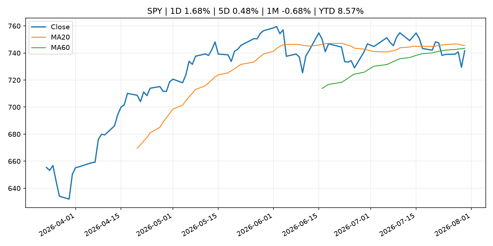
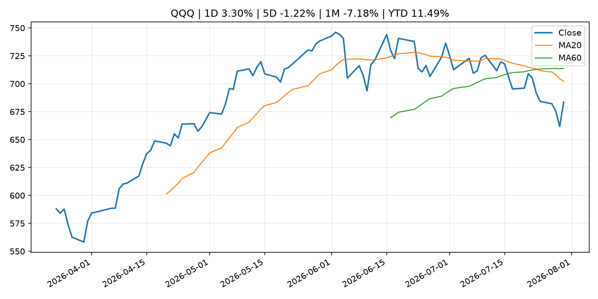
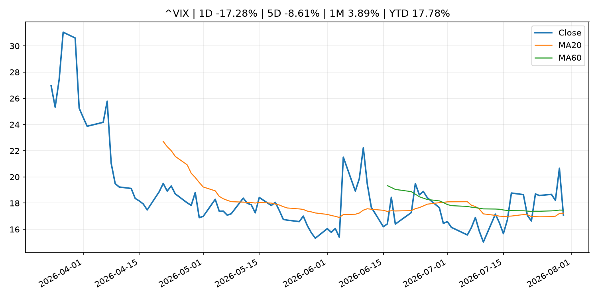
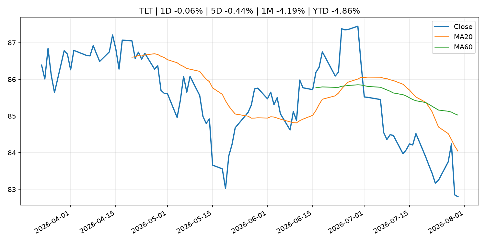
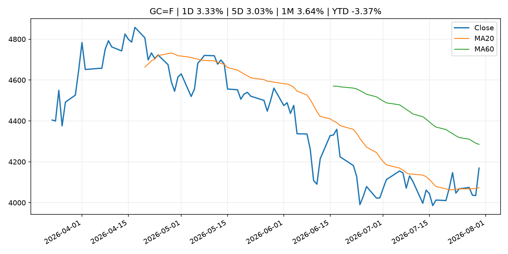
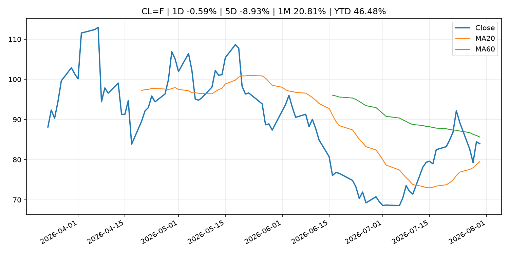
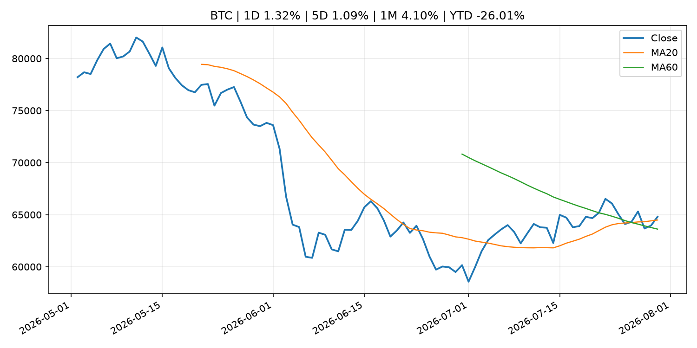
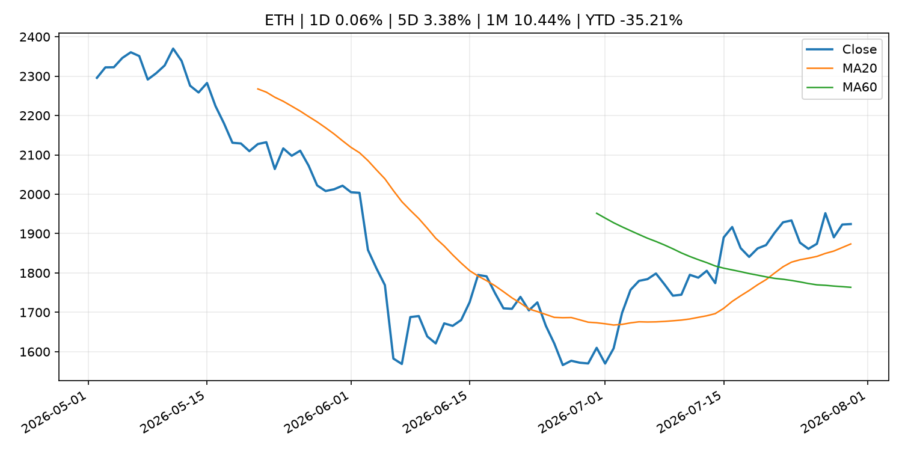
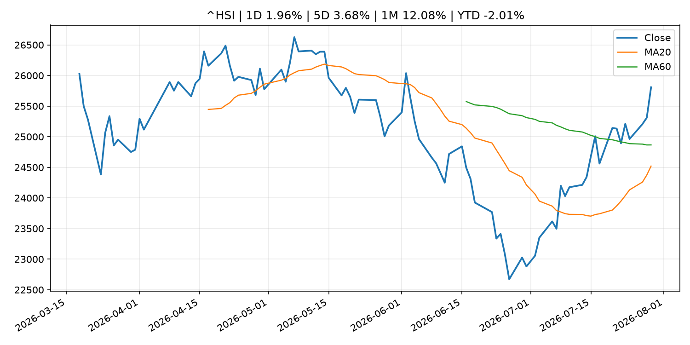

# Global Macro Morning Briefing - 2026-07-31

> Not financial advice / 非投资建议。

## 0. 今日总览
- 市场状态：risk_on。股指上涨、波动率或美元回落，市场更接近风险偏好改善。
- 今日三大主线：
  1. central_bank_decision: Federal Reserve issues FOMC statement
  2. earnings: Micron, Sandisk and other chip stocks get major boosts in the wake of Microsoft’s earnings
  3. earnings: Why Microsoft’s stock soared to a historic gain after earnings
- 一句话结论：今日晨报重点关注：央行决策会重定价利率、汇率、久期资产和风险资产。；大型科技股盈利和资本开支会影响纳指、半导体和 AI 交易主线。。跨资产方面，SPY 1D 1.68%；QQQ 1D 3.30%；^VIX 1D -17.28%；TLT 1D -0.06%；GC=F 1D 3.33%；CL=F 1D -0.59%；BTC 1D 1.32%；ETH 1D 0.06%；股指上涨、波动率或美元回落，市场更接近风险偏好改善。政策、通胀、利率、美元、美债、能源和加密监管仍是主要观察线索。所有结论仅基于公开数据与短摘要整理，不构成投资建议。

## 1. 隔夜跨资产市场
- 美股：SPY 1D 1.68%，QQQ 1D 3.30%，整体趋势需结合 VIX 和利率确认。
- 美债/美元：TLT 1D -0.06%，美元指数 1D -0.82%，是判断折现率压力的核心线索。
- 黄金/原油：黄金 1D 3.33%，原油 1D -0.59%，用于观察避险、通胀和地缘风险。
- 加密：BTC 1D 1.32%，ETH 1D 0.06%，关注是否独立于纳指走出加密自身行情。
- 港股/A股：恒生 1D 1.96%，沪深300/上证 1D n/a，重点看中国政策预期与人民币线索。
- 风险观察：确认风险偏好是否扩散到小盘股、信用利差和周期品。

### US_EQUITY

| symbol | latest close | 1D | 5D | 1M | YTD | trend |
|---|---:|---:|---:|---:|---:|---|
| SPY | 741.69 | 1.68% | 0.48% | -0.68% | 8.57% | range_bound |
| QQQ | 683.55 | 3.30% | -1.22% | -7.18% | 11.49% | strong_downtrend |
| DIA | 521.51 | 1.18% | 1.02% | -0.17% | 7.83% | range_bound |
| IWM | 292.59 | 1.39% | 0.17% | -2.62% | 17.61% | range_bound |
| VTI | 366.27 | 1.62% | 0.43% | -1.02% | 8.91% | range_bound |

### US_MACRO_MARKET

| symbol | latest close | 1D | 5D | 1M | YTD | trend |
|---|---:|---:|---:|---:|---:|---|
| ^VIX | 17.09 | -17.28% | -8.61% | 3.89% | 17.78% | downtrend |
| DX-Y.NYB | 99.97 | -0.82% | -1.44% | -1.21% | 1.57% | range_bound |
| TLT | 82.80 | -0.06% | -0.44% | -4.19% | -4.86% | strong_downtrend |
| IEF | 93.21 | 0.04% | 0.39% | -1.44% | -2.99% | downtrend |

### COMMODITIES

| symbol | latest close | 1D | 5D | 1M | YTD | trend |
|---|---:|---:|---:|---:|---:|---|
| GC=F | 4,169.20 | 3.33% | 3.03% | 3.64% | -3.37% | range_bound |
| SI=F | 59.31 | 2.49% | 2.61% | -0.29% | -15.95% | range_bound |
| CL=F | 83.96 | -0.59% | -8.93% | 20.81% | 46.48% | range_bound |
| BZ=F | 89.45 | -1.42% | -11.16% | 22.67% | 47.24% | range_bound |
| NG=F | 2.75 | 0.77% | -5.83% | -16.15% | -24.10% | strong_downtrend |
| HG=F | 6.50 | 3.63% | 3.12% | 4.99% | 15.27% | range_bound |

### HK_MARKET

| symbol | latest close | 1D | 5D | 1M | YTD | trend |
|---|---:|---:|---:|---:|---:|---|
| ^HSI | 25,807.92 | 1.96% | 3.68% | 12.08% | -2.01% | range_bound |
| 0700.HK | 471.80 | 1.16% | 5.97% | 9.77% | -24.27% | uptrend |
| 9988.HK | 111.80 | -1.58% | -2.70% | 20.41% | -24.97% | range_bound |
| 3690.HK | 92.65 | 0.38% | 6.13% | 35.26% | -11.42% | strong_uptrend |
| 1810.HK | 31.04 | -2.63% | 14.37% | 43.44% | -22.94% | range_bound |
| 1211.HK | 94.80 | 1.28% | 6.94% | 30.85% | -4.00% | range_bound |

### CRYPTO

| symbol | latest close | 1D | 5D | 1M | YTD | trend |
|---|---:|---:|---:|---:|---:|---|
| BTC | 64,799.72 | 1.32% | 1.09% | 4.10% | -26.01% | uptrend |
| ETH | 1,924.20 | 0.06% | 3.38% | 10.44% | -35.21% | uptrend |
| SOLANA | 74.68 | 1.06% | 1.02% | -4.00% | -40.03% | range_bound |
| BINANCECOIN | 592.12 | 3.78% | 4.92% | 4.21% | -31.40% | range_bound |
| RIPPLE | 1.08 | 1.68% | -0.54% | -0.37% | -41.02% | downtrend |

## 2. 今日最重要的 10 条新闻
### 1. Federal Reserve issues FOMC statement
- 来源：Federal Reserve Press Releases
- 时间：2026-07-29T18:00:00+00:00
- 地区：US
- 事件类型：central_bank_decision
- 重要性层级：Tier 1
- 一句话摘要：Federal Reserve issues FOMC statement
- 为什么重要：央行决策会重定价利率、汇率、久期资产和风险资产。
- 可能影响：可能影响利率、汇率、风险资产或大宗商品预期，但当前公开信息不足以判断明确方向。
  - 资产：暂无明确资产映射
  - 方向：unknown
  - 强度：low
  - 原因：公开信息不足以判断方向。
- 原文链接：[https://www.federalreserve.gov/newsevents/pressreleases/monetary20260729a.htm](https://www.federalreserve.gov/newsevents/pressreleases/monetary20260729a.htm)

### 2. Micron, Sandisk and other chip stocks get major boosts in the wake of Microsoft’s earnings
- 来源：MarketWatch Top Stories
- 时间：2026-07-30T20:26:00+00:00
- 地区：US
- 事件类型：earnings
- 重要性层级：Tier 2
- 一句话摘要：Microsoft is spending heavily on AI but is also taking a “responsible” approach to its financials, an analyst said.
- 为什么重要：大型科技股盈利和资本开支会影响纳指、半导体和 AI 交易主线。
- 可能影响：主要影响 QQQ，方向为 mixed，强度 high；AI 资本开支会影响大型科技股盈利和估值预期。
  - 资产：QQQ
    方向：mixed
    强度：high
    原因：AI 资本开支会影响大型科技股盈利和估值预期。
  - 资产：SMH
    方向：mixed
    强度：high
    原因：AI 投资周期直接影响半导体需求。
  - 资产：NVDA
    方向：mixed
    强度：high
    原因：AI 训练和推理需求是英伟达收入预期核心变量。
  - 资产：MSFT
    方向：mixed
    强度：medium
    原因：云和 AI 资本开支影响利润率与增长叙事。
  - 资产：GOOGL
    方向：mixed
    强度：medium
    原因：AI 投资和搜索商业化影响估值。
  - 资产：META
    方向：mixed
    强度：medium
    原因：AI 基建支出与广告效率共同影响市场预期。
- 原文链接：[https://www.marketwatch.com/story/micron-sandisk-and-other-chip-stocks-get-major-boosts-in-the-wake-of-microsofts-earnings-25460e61?mod=mw_rss_topstories](https://www.marketwatch.com/story/micron-sandisk-and-other-chip-stocks-get-major-boosts-in-the-wake-of-microsofts-earnings-25460e61?mod=mw_rss_topstories)

### 3. Why Microsoft’s stock soared to a historic gain after earnings
- 来源：MarketWatch Top Stories
- 时间：2026-07-30T20:21:00+00:00
- 地区：US
- 事件类型：earnings
- 重要性层级：Tier 2
- 一句话摘要：The company’s cloud business is sporting impressive growth, and Microsoft expects to avoid heading into cash-burn mode as it spends up on AI.
- 为什么重要：大型科技股盈利和资本开支会影响纳指、半导体和 AI 交易主线。
- 可能影响：主要影响 QQQ，方向为 mixed，强度 high；AI 资本开支会影响大型科技股盈利和估值预期。
  - 资产：QQQ
    方向：mixed
    强度：high
    原因：AI 资本开支会影响大型科技股盈利和估值预期。
  - 资产：SMH
    方向：mixed
    强度：high
    原因：AI 投资周期直接影响半导体需求。
  - 资产：NVDA
    方向：mixed
    强度：high
    原因：AI 训练和推理需求是英伟达收入预期核心变量。
  - 资产：MSFT
    方向：mixed
    强度：medium
    原因：云和 AI 资本开支影响利润率与增长叙事。
  - 资产：GOOGL
    方向：mixed
    强度：medium
    原因：AI 投资和搜索商业化影响估值。
  - 资产：META
    方向：mixed
    强度：medium
    原因：AI 基建支出与广告效率共同影响市场预期。
- 原文链接：[https://www.marketwatch.com/story/why-microsofts-stock-is-soaring-toward-a-historic-gain-after-earnings-96cd5b1e?mod=mw_rss_topstories](https://www.marketwatch.com/story/why-microsofts-stock-is-soaring-toward-a-historic-gain-after-earnings-96cd5b1e?mod=mw_rss_topstories)

### 4. Warsh’s Wall Street cred takes a hit as investors doubt the Fed chair’s inflation-fighting resolve
- 来源：MarketWatch Top Stories
- 时间：2026-07-30T19:02:00+00:00
- 地区：US
- 事件类型：central_bank_speech
- 重要性层级：Tier 2
- 一句话摘要：Kevin Warsh insists the Federal Reserve will do whatever it takes to reduce U.S. inflation to its 2% target, but investors aren’t buying it.
- 为什么重要：央行官员表态可能影响市场对下一次会议的定价。
- 可能影响：主要影响 DXY，方向为 positive，强度 high；通胀压力可能推高政策利率预期并支撑美元。
  - 资产：DXY
    方向：positive
    强度：high
    原因：通胀压力可能推高政策利率预期并支撑美元。
  - 资产：TLT
    方向：negative
    强度：high
    原因：通胀上行通常推升收益率、压低长债价格。
  - 资产：QQQ
    方向：negative
    强度：high
    原因：更高利率对成长股估值折现率不利。
  - 资产：SPY
    方向：mixed
    强度：medium
    原因：名义增长可能支撑收入，但更高利率压制估值。
  - 资产：GC=F
    方向：mixed
    强度：medium
    原因：通胀对黄金是支撑，但实际利率上行会形成压力。
  - 资产：BTC
    方向：mixed
    强度：medium
    原因：抗通胀叙事和流动性收紧可能相互抵消。
- 原文链接：[https://www.marketwatch.com/story/warshs-wall-street-cred-takes-a-hit-as-investors-doubt-the-fed-chairs-inflation-fighting-resolve-82be4f77?mod=mw_rss_topstories](https://www.marketwatch.com/story/warshs-wall-street-cred-takes-a-hit-as-investors-doubt-the-fed-chairs-inflation-fighting-resolve-82be4f77?mod=mw_rss_topstories)

### 5. Bitcoin analysts agree the Fed's hold was hawkish. They are split on what happens next.
- 来源：CoinDesk
- 时间：2026-07-30T06:28:58+00:00
- 地区：global
- 事件类型：central_bank_speech
- 重要性层级：Tier 2
- 一句话摘要：Bitcoin analysts agree the Fed's hold was hawkish. They are split on what happens next.
- 为什么重要：央行官员表态可能影响市场对下一次会议的定价。
- 可能影响：主要影响 QQQ，方向为 negative，强度 high；鹰派政策提高折现率，压制成长股估值。
  - 资产：QQQ
    方向：negative
    强度：high
    原因：鹰派政策提高折现率，压制成长股估值。
  - 资产：SPY
    方向：negative
    强度：medium
    原因：更紧政策通常削弱风险偏好。
  - 资产：TLT
    方向：negative
    强度：high
    原因：利率上行通常压低长债价格。
  - 资产：DXY
    方向：positive
    强度：high
    原因：更高利率预期通常支撑美元。
  - 资产：BTC
    方向：negative
    强度：high
    原因：流动性收紧通常压制高 beta 加密资产。
- 原文链接：[https://www.coindesk.com/markets/2026/07/30/bitcoin-analysts-agree-the-fed-s-hold-was-hawkish-they-don-t-agree-on-what-happens-next](https://www.coindesk.com/markets/2026/07/30/bitcoin-analysts-agree-the-fed-s-hold-was-hawkish-they-don-t-agree-on-what-happens-next)

### 6. SEC Announces Continuation of Small Business Advisory Committee Meeting
- 来源：SEC Press Releases
- 时间：2026-07-30T09:53:38-04:00
- 地区：US
- 事件类型：regulation
- 重要性层级：Tier 2
- 一句话摘要：The Securities and Exchange Commission announced that the Small Business Capital Formation Advisory Committee meeting held on July 21, 2026, will reconvene August 6, 2026, at 1 p.m. ET, virtually, on SEC.gov. The committee will…
- 为什么重要：监管变化会改变行业盈利预期和资产风险溢价。
- 可能影响：主要影响 BTC，方向为 mixed，强度 high；加密监管或 ETF 进展会改变 BTC 的资金流和风险溢价。
  - 资产：BTC
    方向：mixed
    强度：high
    原因：加密监管或 ETF 进展会改变 BTC 的资金流和风险溢价。
  - 资产：ETH
    方向：mixed
    强度：high
    原因：监管框架会影响 ETH 产品化和机构参与度。
  - 资产：COIN
    方向：mixed
    强度：medium
    原因：监管清晰度和执法风险会影响交易平台估值。
  - 资产：crypto market
    方向：mixed
    强度：high
    原因：信息影响整个加密市场结构，但方向取决于细节。
- 原文链接：[https://www.sec.gov/newsroom/press-releases/2026-71-sec-announces-continuation-small-business-advisory-committee-meeting](https://www.sec.gov/newsroom/press-releases/2026-71-sec-announces-continuation-small-business-advisory-committee-meeting)

### 7. Federal Reserve Board issues enforcement actions with former employee of Regions Bank and former employee of First Interstate Bank
- 来源：Federal Reserve Press Releases
- 时间：2026-07-30T15:00:00+00:00
- 地区：US
- 事件类型：regulation
- 重要性层级：Tier 2
- 一句话摘要：Federal Reserve Board issues enforcement actions with former employee of Regions Bank and former employee of First Interstate Bank
- 为什么重要：监管变化会改变行业盈利预期和资产风险溢价。
- 可能影响：可能影响利率、汇率、风险资产或大宗商品预期，但当前公开信息不足以判断明确方向。
  - 资产：暂无明确资产映射
  - 方向：unknown
  - 强度：low
  - 原因：公开信息不足以判断方向。
- 原文链接：[https://www.federalreserve.gov/newsevents/pressreleases/enforcement20260730a.htm](https://www.federalreserve.gov/newsevents/pressreleases/enforcement20260730a.htm)

### 8. Federal Reserve Board issues enforcement action with Iuka Bancshares, Inc. and The Iuka State Bank
- 来源：Federal Reserve Press Releases
- 时间：2026-07-30T15:00:00+00:00
- 地区：US
- 事件类型：regulation
- 重要性层级：Tier 2
- 一句话摘要：Federal Reserve Board issues enforcement action with Iuka Bancshares, Inc. and The Iuka State Bank
- 为什么重要：监管变化会改变行业盈利预期和资产风险溢价。
- 可能影响：可能影响利率、汇率、风险资产或大宗商品预期，但当前公开信息不足以判断明确方向。
  - 资产：暂无明确资产映射
  - 方向：unknown
  - 强度：low
  - 原因：公开信息不足以判断方向。
- 原文链接：[https://www.federalreserve.gov/newsevents/pressreleases/enforcement20260730b.htm](https://www.federalreserve.gov/newsevents/pressreleases/enforcement20260730b.htm)

### 9. Jeffrey Gundlach says the bond market is telling Warsh the Fed has to start acting on inflation
- 来源：CNBC Economy
- 时间：2026-07-29T22:20:18+00:00
- 地区：US
- 事件类型：other
- 重要性层级：Tier 3
- 一句话摘要：Gundlach said the divergent moves across the Treasury curve showed investors' skepticism that the Fed will ultimately follow through.
- 为什么重要：这条信息暂未匹配到重大宏观、政策或市场事件，更适合作为背景跟踪。
- 可能影响：主要影响 DXY，方向为 positive，强度 high；通胀压力可能推高政策利率预期并支撑美元。
  - 资产：DXY
    方向：positive
    强度：high
    原因：通胀压力可能推高政策利率预期并支撑美元。
  - 资产：TLT
    方向：negative
    强度：high
    原因：通胀上行通常推升收益率、压低长债价格。
  - 资产：QQQ
    方向：negative
    强度：high
    原因：更高利率对成长股估值折现率不利。
  - 资产：SPY
    方向：mixed
    强度：medium
    原因：名义增长可能支撑收入，但更高利率压制估值。
  - 资产：GC=F
    方向：mixed
    强度：medium
    原因：通胀对黄金是支撑，但实际利率上行会形成压力。
  - 资产：BTC
    方向：mixed
    强度：medium
    原因：抗通胀叙事和流动性收紧可能相互抵消。
- 原文链接：[https://www.cnbc.com/2026/07/29/gundlach-says-the-bond-market-is-signaling-the-fed-has-to-act-on-inflation.html](https://www.cnbc.com/2026/07/29/gundlach-says-the-bond-market-is-signaling-the-fed-has-to-act-on-inflation.html)

### 10. Strategy books $8.2 billion Q2 loss on bitcoin price decline
- 来源：CoinDesk
- 时间：2026-07-30T20:32:13+00:00
- 地区：global
- 事件类型：other
- 重要性层级：Tier 3
- 一句话摘要：Strategy books $8.2 billion Q2 loss on bitcoin price decline
- 为什么重要：这条信息暂未匹配到重大宏观、政策或市场事件，更适合作为背景跟踪。
- 可能影响：更偏背景信息，短期市场影响可能有限。
  - 资产：暂无明确资产映射
  - 方向：unknown
  - 强度：low
  - 原因：公开信息不足以判断方向。
- 原文链接：[https://www.coindesk.com/markets/2026/07/30/strategy-books-usd8-2-billion-second-quarter-loss-on-bitcoin-price-decline](https://www.coindesk.com/markets/2026/07/30/strategy-books-usd8-2-billion-second-quarter-loss-on-bitcoin-price-decline)

## 3. 政策与央行观察
### 1. Federal Reserve issues FOMC statement
- 来源：Federal Reserve Press Releases
- 时间：2026-07-29T18:00:00+00:00
- 地区：US
- 事件类型：central_bank_decision
- 重要性层级：Tier 1
- 一句话摘要：Federal Reserve issues FOMC statement
- 为什么重要：央行决策会重定价利率、汇率、久期资产和风险资产。
- 可能影响：可能影响利率、汇率、风险资产或大宗商品预期，但当前公开信息不足以判断明确方向。
  - 资产：暂无明确资产映射
  - 方向：unknown
  - 强度：low
  - 原因：公开信息不足以判断方向。
- 原文链接：[https://www.federalreserve.gov/newsevents/pressreleases/monetary20260729a.htm](https://www.federalreserve.gov/newsevents/pressreleases/monetary20260729a.htm)

### 2. Warsh’s Wall Street cred takes a hit as investors doubt the Fed chair’s inflation-fighting resolve
- 来源：MarketWatch Top Stories
- 时间：2026-07-30T19:02:00+00:00
- 地区：US
- 事件类型：central_bank_speech
- 重要性层级：Tier 2
- 一句话摘要：Kevin Warsh insists the Federal Reserve will do whatever it takes to reduce U.S. inflation to its 2% target, but investors aren’t buying it.
- 为什么重要：央行官员表态可能影响市场对下一次会议的定价。
- 可能影响：主要影响 DXY，方向为 positive，强度 high；通胀压力可能推高政策利率预期并支撑美元。
  - 资产：DXY
    方向：positive
    强度：high
    原因：通胀压力可能推高政策利率预期并支撑美元。
  - 资产：TLT
    方向：negative
    强度：high
    原因：通胀上行通常推升收益率、压低长债价格。
  - 资产：QQQ
    方向：negative
    强度：high
    原因：更高利率对成长股估值折现率不利。
  - 资产：SPY
    方向：mixed
    强度：medium
    原因：名义增长可能支撑收入，但更高利率压制估值。
  - 资产：GC=F
    方向：mixed
    强度：medium
    原因：通胀对黄金是支撑，但实际利率上行会形成压力。
  - 资产：BTC
    方向：mixed
    强度：medium
    原因：抗通胀叙事和流动性收紧可能相互抵消。
- 原文链接：[https://www.marketwatch.com/story/warshs-wall-street-cred-takes-a-hit-as-investors-doubt-the-fed-chairs-inflation-fighting-resolve-82be4f77?mod=mw_rss_topstories](https://www.marketwatch.com/story/warshs-wall-street-cred-takes-a-hit-as-investors-doubt-the-fed-chairs-inflation-fighting-resolve-82be4f77?mod=mw_rss_topstories)

### 3. Bitcoin analysts agree the Fed's hold was hawkish. They are split on what happens next.
- 来源：CoinDesk
- 时间：2026-07-30T06:28:58+00:00
- 地区：global
- 事件类型：central_bank_speech
- 重要性层级：Tier 2
- 一句话摘要：Bitcoin analysts agree the Fed's hold was hawkish. They are split on what happens next.
- 为什么重要：央行官员表态可能影响市场对下一次会议的定价。
- 可能影响：主要影响 QQQ，方向为 negative，强度 high；鹰派政策提高折现率，压制成长股估值。
  - 资产：QQQ
    方向：negative
    强度：high
    原因：鹰派政策提高折现率，压制成长股估值。
  - 资产：SPY
    方向：negative
    强度：medium
    原因：更紧政策通常削弱风险偏好。
  - 资产：TLT
    方向：negative
    强度：high
    原因：利率上行通常压低长债价格。
  - 资产：DXY
    方向：positive
    强度：high
    原因：更高利率预期通常支撑美元。
  - 资产：BTC
    方向：negative
    强度：high
    原因：流动性收紧通常压制高 beta 加密资产。
- 原文链接：[https://www.coindesk.com/markets/2026/07/30/bitcoin-analysts-agree-the-fed-s-hold-was-hawkish-they-don-t-agree-on-what-happens-next](https://www.coindesk.com/markets/2026/07/30/bitcoin-analysts-agree-the-fed-s-hold-was-hawkish-they-don-t-agree-on-what-happens-next)

### 4. SEC Announces Continuation of Small Business Advisory Committee Meeting
- 来源：SEC Press Releases
- 时间：2026-07-30T09:53:38-04:00
- 地区：US
- 事件类型：regulation
- 重要性层级：Tier 2
- 一句话摘要：The Securities and Exchange Commission announced that the Small Business Capital Formation Advisory Committee meeting held on July 21, 2026, will reconvene August 6, 2026, at 1 p.m. ET, virtually, on SEC.gov. The committee will…
- 为什么重要：监管变化会改变行业盈利预期和资产风险溢价。
- 可能影响：主要影响 BTC，方向为 mixed，强度 high；加密监管或 ETF 进展会改变 BTC 的资金流和风险溢价。
  - 资产：BTC
    方向：mixed
    强度：high
    原因：加密监管或 ETF 进展会改变 BTC 的资金流和风险溢价。
  - 资产：ETH
    方向：mixed
    强度：high
    原因：监管框架会影响 ETH 产品化和机构参与度。
  - 资产：COIN
    方向：mixed
    强度：medium
    原因：监管清晰度和执法风险会影响交易平台估值。
  - 资产：crypto market
    方向：mixed
    强度：high
    原因：信息影响整个加密市场结构，但方向取决于细节。
- 原文链接：[https://www.sec.gov/newsroom/press-releases/2026-71-sec-announces-continuation-small-business-advisory-committee-meeting](https://www.sec.gov/newsroom/press-releases/2026-71-sec-announces-continuation-small-business-advisory-committee-meeting)

### 5. Federal Reserve Board issues enforcement actions with former employee of Regions Bank and former employee of First Interstate Bank
- 来源：Federal Reserve Press Releases
- 时间：2026-07-30T15:00:00+00:00
- 地区：US
- 事件类型：regulation
- 重要性层级：Tier 2
- 一句话摘要：Federal Reserve Board issues enforcement actions with former employee of Regions Bank and former employee of First Interstate Bank
- 为什么重要：监管变化会改变行业盈利预期和资产风险溢价。
- 可能影响：可能影响利率、汇率、风险资产或大宗商品预期，但当前公开信息不足以判断明确方向。
  - 资产：暂无明确资产映射
  - 方向：unknown
  - 强度：low
  - 原因：公开信息不足以判断方向。
- 原文链接：[https://www.federalreserve.gov/newsevents/pressreleases/enforcement20260730a.htm](https://www.federalreserve.gov/newsevents/pressreleases/enforcement20260730a.htm)

### 6. Federal Reserve Board issues enforcement action with Iuka Bancshares, Inc. and The Iuka State Bank
- 来源：Federal Reserve Press Releases
- 时间：2026-07-30T15:00:00+00:00
- 地区：US
- 事件类型：regulation
- 重要性层级：Tier 2
- 一句话摘要：Federal Reserve Board issues enforcement action with Iuka Bancshares, Inc. and The Iuka State Bank
- 为什么重要：监管变化会改变行业盈利预期和资产风险溢价。
- 可能影响：可能影响利率、汇率、风险资产或大宗商品预期，但当前公开信息不足以判断明确方向。
  - 资产：暂无明确资产映射
  - 方向：unknown
  - 强度：low
  - 原因：公开信息不足以判断方向。
- 原文链接：[https://www.federalreserve.gov/newsevents/pressreleases/enforcement20260730b.htm](https://www.federalreserve.gov/newsevents/pressreleases/enforcement20260730b.htm)

## 4. 市场异动与图表
- SPY 上涨 1.68%
- QQQ 上涨 3.30%
- VIX 下跌 -17.28%
- DXY 下跌 -0.82%
- Gold 上涨 3.33%

### SPY

### QQQ

### ^VIX

### TLT

### GC=F

### CL=F

### BTC

### ETH

### ^HSI

## 5. 华尔街与机构公开观点
- 暂无可靠公开观点。

## 6. 今日重点关注
- 经济数据：经济数据：暂无可靠公开日历数据；如配置经济日历源后可自动填充。
- 央行讲话：央行讲话：暂无可靠公开日历数据；重点跟踪 Fed、ECB、BoJ、PBOC 官网 RSS。
- 财报：财报：暂无可靠数据。
- 政策事件：政策事件：暂无可靠数据。
- 风险提醒：风险提醒：关注数据源失败项、突发地缘风险、利率和美元的二阶反应。

## 7. 英文金融表达与宏观概念
- **inflation expectations**：通胀预期，指家庭、企业或市场对未来通胀的预估。 例句：Inflation expectations can shape wage bargaining and bond yields.
- **real yield**：实际收益率，名义利率扣除通胀预期后的收益率。 例句：Gold often reacts more to real yields than nominal yields.
- **terminal rate**：终端利率，市场预期本轮加息周期的最高政策利率。 例句：A higher terminal rate can pressure growth stocks.
- **risk-off**：避险模式，资金偏向美元、国债、黄金等防御资产。 例句：A geopolitical shock can push markets into risk-off mode.
- **market structure**：市场结构，指交易、托管、清算、ETF、监管等制度安排。 例句：Crypto market structure rules can affect institutional participation.
- **AI capex**：AI 资本开支，指云厂商和科技公司投入 AI 基建的支出。 例句：AI capex guidance can move semiconductor stocks.

## 8. 背景材料
- [Strategy books $8.2 billion Q2 loss on bitcoin price decline](https://www.coindesk.com/markets/2026/07/30/strategy-books-usd8-2-billion-second-quarter-loss-on-bitcoin-price-decline)（CoinDesk，other）：Strategy books $8.2 billion Q2 loss on bitcoin price decline
- [Coinbase sinks 5% after missing second quarter revenue estimates](https://www.coindesk.com/markets/2026/07/30/coinbase-sinks-5-after-missing-q2-revenue-estimates)（CoinDesk，other）：Coinbase sinks 5% after missing second quarter revenue estimates
- [Ethereum enters its second decade after a year of upheaval at the foundation](https://www.coindesk.com/tech/2026/07/30/ethereum-enters-its-second-decade-after-a-year-of-upheaval-at-the-foundation)（CoinDesk，other）：Ethereum enters its second decade after a year of upheaval at the foundation
- [Here's what changed in the second Fed statement under Warsh](https://www.cnbc.com/2026/07/29/fed-decision-redline-heres-what-changed-in-the-second-statement-under-warsh.html)（CNBC Economy，other）：This is a comparison of Wednesday's Federal Open Market Committee statement with the one issued after the Fed's previous policymaking meeting in June.
- [Bitcoin ETFs on track for the smallest monthly inflows ever](https://www.coindesk.com/daybook-us/2026/07/30/bitcoin-etfs-on-track-for-the-smallest-monthly-inflows-ever)（CoinDesk，other）：Bitcoin ETFs on track for the smallest monthly inflows ever
- [Live updates: Bitcoin holds above $64,000 as Nasdaq surges on AI trade comeback](https://www.coindesk.com/tech/2026/07/30/live-updates-bitcoin-holds-near-usd64-000-as-microsoft-s-ai-payoff-lifts-stocks)（CoinDesk，other）：Live updates: Bitcoin holds above $64,000 as Nasdaq surges on AI trade comeback
- [Bitcoin and ether markets are ruled by perps. SpaceX showed how far their influence can go](https://www.coindesk.com/markets/2026/07/30/bitcoin-and-ether-markets-are-ruled-by-perps-spacex-showed-how-far-their-influence-can-go)（CoinDesk，other）：Bitcoin and ether markets are ruled by perps. SpaceX showed how far their influence can go
- [Digital euro app to incorporate highest accessibility standards](https://www.ecb.europa.eu//press/pr/date/2026/html/ecb.pr260730~3b3bfbb565.en.html)（ECB Press Releases，other）：Digital euro app to incorporate highest accessibility standards
- [Bitcoin, ether whipsaw wipes out $286 million in leveraged bets](https://www.coindesk.com/markets/2026/07/30/bitcoin-ether-whipsaw-wipes-out-usd280-million-even-as-prices-remain-flat-over-24-hours)（CoinDesk，other）：Bitcoin, ether whipsaw wipes out $286 million in leveraged bets
- [Bitcoin's quantum plan assumes some algorithms break. AI just weakened one in 60 hours](https://www.coindesk.com/tech/2026/07/29/bitcoin-s-quantum-plan-assumes-some-algorithms-break-ai-just-weakened-one-in-60-hours)（CoinDesk，other）：Bitcoin's quantum plan assumes some algorithms break. AI just weakened one in 60 hours
- [Here are the five big takeaways from this week's Fed meeting](https://www.cnbc.com/2026/07/29/here-are-the-five-big-takeaways-from-this-weeks-fed-meeting.html)（CNBC Economy，other）：The Federal Reserve on Wednesday followed through on expectations for no interest rate change.
- [Jeffrey Gundlach says the bond market is telling Warsh the Fed has to start acting on inflation](https://www.cnbc.com/2026/07/29/gundlach-says-the-bond-market-is-signaling-the-fed-has-to-act-on-inflation.html)（CNBC Economy，other）：Gundlach said the divergent moves across the Treasury curve showed investors' skepticism that the Fed will ultimately follow through.
- [ECB wage tracker at 2.7% in Q1 2027, indicating stable negotiated wage pressures](https://www.ecb.europa.eu//press/pr/date/2026/html/ecb.pr260729~4ad7508d8a.en.html)（ECB Press Releases，other）：ECB wage tracker at 2.7% in Q1 2027, indicating stable negotiated wage pressures
- [Average Contract Interest Rates on Loans and Discounts (June)](http://www.boj.or.jp/en/statistics/dl/loan/yaku/yaku2606.pdf)（Bank of Japan Announcements，other）：Average Contract Interest Rates on Loans and Discounts (June)

## 9. 数据源、失败项与免责声明
- 采集时间：2026-07-30T23:04:17
- 数据源：公开 RSS、Yahoo Finance、CoinGecko、AKShare、FRED、SEC data.sec.gov，以及用户自有 inputs/reports 文件。
- 合规说明：不绕过 WSJ、Bloomberg、FT、Reuters 等付费墙；对付费媒体只使用公开 RSS 标题、摘要、链接和发布时间。
- 免责声明：Not financial advice / 非投资建议。本项目仅供个人学习、研究和信息整理，不构成投资建议、交易建议或任何收益承诺。
- 失败或跳过的数据源：
  - crypto data failed coin=dogecoin
  - China market data failed symbol=上证指数: empty dataframe
  - China market data failed symbol=深证成指: empty dataframe
  - China market data failed symbol=创业板指: empty dataframe
  - China market data failed symbol=沪深300: empty dataframe
  - China market data failed symbol=中证500: empty dataframe
  - China market data failed symbol=科创50: empty dataframe
  - FRED_API_KEY not set; skipping FRED macro series
  - SEC failed cik=0000320193
  - SEC failed cik=0000789019
  - SEC failed cik=0001045810
  - SEC failed cik=0001318605
  - SEC failed cik=0001577552
