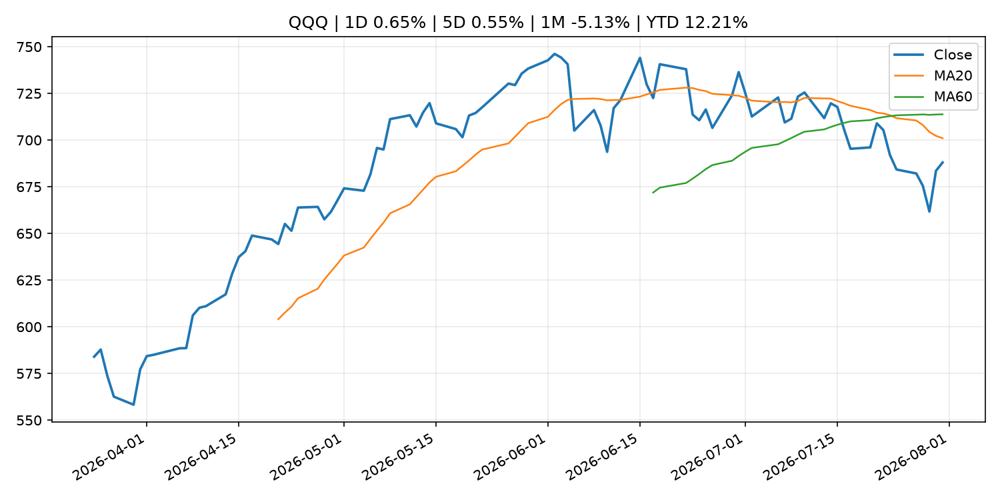
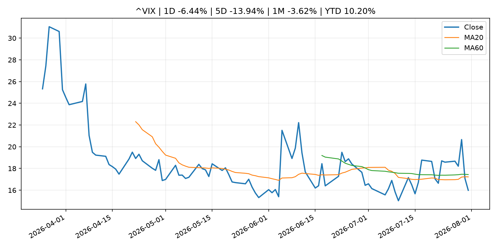
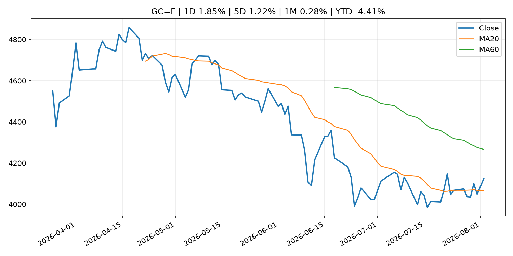
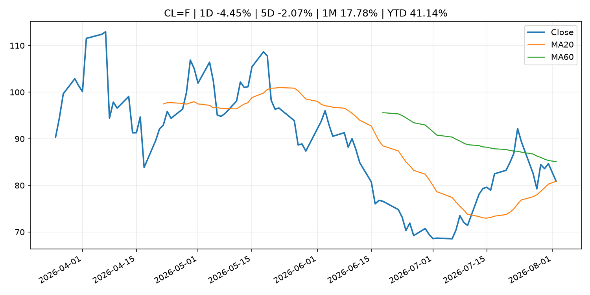
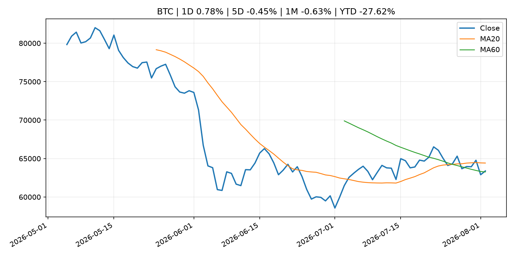
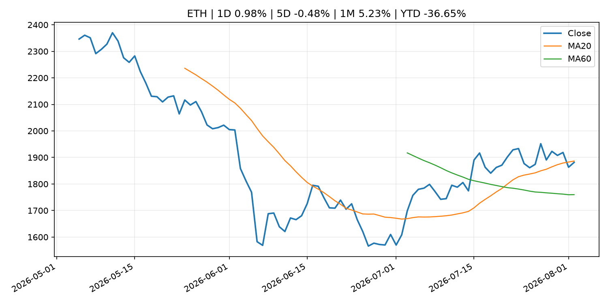
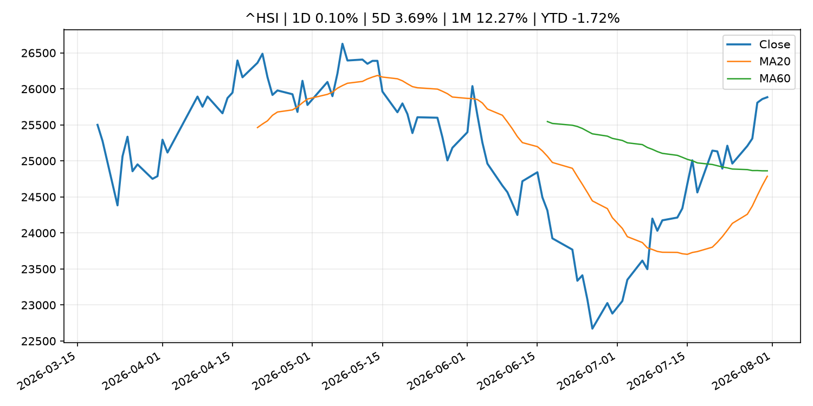

# Global Macro Morning Briefing - 2026-08-03

> Not financial advice / 非投资建议。

## 0. 今日总览
- 市场状态：risk_on。股指上涨、波动率或美元回落，市场更接近风险偏好改善。
- 今日三大主线：
  1. geopolitical_risk: Bitcoin cold-wallet attack spreads to 4,500 addresses as losses near $89 million
  2. geopolitical_risk: How bitcoin cold wallets lost $70 million in an attack that never touched the devices
  3. earnings: Here’s what’s worth streaming in August 2026 on Netflix, Hulu, HBO Max and more
- 一句话结论：今日晨报重点关注：地缘风险可能推升避险需求、能源价格和市场波动率。；地缘风险可能推升避险需求、能源价格和市场波动率。。跨资产方面，SPY 1D 0.72%；QQQ 1D 0.65%；^VIX 1D -6.44%；TLT 1D -0.66%；GC=F 1D 1.85%；CL=F 1D -4.45%；BTC 1D 0.78%；ETH 1D 0.98%；股指上涨、波动率或美元回落，市场更接近风险偏好改善。政策、通胀、利率、美元、美债、能源和加密监管仍是主要观察线索。所有结论仅基于公开数据与短摘要整理，不构成投资建议。

## 1. 隔夜跨资产市场
- 美股：SPY 1D 0.72%，QQQ 1D 0.65%，整体趋势需结合 VIX 和利率确认。
- 美债/美元：TLT 1D -0.66%，美元指数 1D -0.14%，是判断折现率压力的核心线索。
- 黄金/原油：黄金 1D 1.85%，原油 1D -4.45%，用于观察避险、通胀和地缘风险。
- 加密：BTC 1D 0.78%，ETH 1D 0.98%，关注是否独立于纳指走出加密自身行情。
- 港股/A股：恒生 1D 0.10%，沪深300/上证 1D n/a，重点看中国政策预期与人民币线索。
- 风险观察：确认风险偏好是否扩散到小盘股、信用利差和周期品。

### US_EQUITY

| symbol | latest close | 1D | 5D | 1M | YTD | trend |
|---|---:|---:|---:|---:|---:|---|
| SPY | 747.03 | 0.72% | 1.10% | 0.17% | 9.35% | uptrend |
| QQQ | 687.99 | 0.65% | 0.55% | -5.13% | 12.21% | strong_downtrend |
| DIA | 524.32 | 0.54% | 1.07% | 0.37% | 8.41% | uptrend |
| IWM | 291.20 | -0.48% | 0.01% | -2.71% | 17.05% | range_bound |
| VTI | 368.21 | 0.53% | 0.93% | -0.29% | 9.49% | range_bound |

### US_MACRO_MARKET

| symbol | latest close | 1D | 5D | 1M | YTD | trend |
|---|---:|---:|---:|---:|---:|---|
| ^VIX | 15.99 | -6.44% | -13.94% | -3.62% | 10.20% | downtrend |
| DX-Y.NYB | 99.66 | -0.14% | -1.83% | -1.19% | 1.26% | range_bound |
| TLT | 82.25 | -0.66% | -1.20% | -3.82% | -5.49% | strong_downtrend |
| IEF | 92.95 | -0.28% | -0.09% | -1.15% | -3.26% | downtrend |

### COMMODITIES

| symbol | latest close | 1D | 5D | 1M | YTD | trend |
|---|---:|---:|---:|---:|---:|---|
| GC=F | 4,124.10 | 1.85% | 1.22% | 0.28% | -4.41% | range_bound |
| SI=F | 58.67 | 1.86% | 0.33% | -3.26% | -16.85% | range_bound |
| CL=F | 80.90 | -4.45% | -2.07% | 17.78% | 41.14% | range_bound |
| BZ=F | 90.12 | 1.22% | -6.88% | 25.92% | 48.35% | range_bound |
| NG=F | 2.74 | -0.18% | -0.90% | -14.21% | -24.21% | strong_downtrend |
| HG=F | 6.55 | 1.77% | 3.33% | 7.12% | 16.13% | range_bound |

### HK_MARKET

| symbol | latest close | 1D | 5D | 1M | YTD | trend |
|---|---:|---:|---:|---:|---:|---|
| ^HSI | 25,884.43 | 0.10% | 3.69% | 12.27% | -1.72% | range_bound |
| 0700.HK | 475.20 | 0.72% | 9.34% | 10.46% | -23.72% | strong_uptrend |
| 9988.HK | 117.00 | 4.65% | 6.36% | 23.81% | -21.48% | range_bound |
| 3690.HK | 92.50 | -0.16% | 6.69% | 30.56% | -11.57% | strong_uptrend |
| 1810.HK | 28.78 | -7.28% | 7.71% | 27.35% | -28.55% | range_bound |
| 1211.HK | 94.15 | -0.69% | 6.20% | 20.24% | -4.66% | range_bound |

### CRYPTO

| symbol | latest close | 1D | 5D | 1M | YTD | trend |
|---|---:|---:|---:|---:|---:|---|
| BTC | 63,389.02 | 0.78% | -0.45% | -0.63% | -27.62% | range_bound |
| ETH | 1,881.49 | 0.98% | -0.48% | 5.23% | -36.65% | range_bound |
| SOLANA | 73.63 | 1.02% | -0.77% | -4.03% | -40.87% | range_bound |
| BINANCECOIN | 587.71 | 0.07% | 3.91% | 2.29% | -31.87% | range_bound |
| RIPPLE | 1.09 | 2.25% | 2.03% | -0.90% | -40.98% | downtrend |

## 2. 今日最重要的 10 条新闻
### 1. Bitcoin cold-wallet attack spreads to 4,500 addresses as losses near $89 million
- 来源：CoinDesk
- 时间：2026-08-01T20:10:54+00:00
- 地区：global
- 事件类型：geopolitical_risk
- 重要性层级：Tier 1
- 一句话摘要：Bitcoin cold-wallet attack spreads to 4,500 addresses as losses near $89 million
- 为什么重要：地缘风险可能推升避险需求、能源价格和市场波动率。
- 可能影响：可能影响利率、汇率、风险资产或大宗商品预期，但当前公开信息不足以判断明确方向。
  - 资产：暂无明确资产映射
  - 方向：unknown
  - 强度：low
  - 原因：公开信息不足以判断方向。
- 原文链接：[https://www.coindesk.com/tech/2026/08/02/bitcoin-cold-wallet-attack-spreads-to-4-500-addresses-as-losses-near-usd89-million](https://www.coindesk.com/tech/2026/08/02/bitcoin-cold-wallet-attack-spreads-to-4-500-addresses-as-losses-near-usd89-million)

### 2. How bitcoin cold wallets lost $70 million in an attack that never touched the devices
- 来源：CoinDesk
- 时间：2026-08-01T05:55:46+00:00
- 地区：global
- 事件类型：geopolitical_risk
- 重要性层级：Tier 1
- 一句话摘要：How bitcoin cold wallets lost $70 million in an attack that never touched the devices
- 为什么重要：地缘风险可能推升避险需求、能源价格和市场波动率。
- 可能影响：可能影响利率、汇率、风险资产或大宗商品预期，但当前公开信息不足以判断明确方向。
  - 资产：暂无明确资产映射
  - 方向：unknown
  - 强度：low
  - 原因：公开信息不足以判断方向。
- 原文链接：[https://www.coindesk.com/tech/2026/08/01/how-bitcoin-cold-wallets-lost-usd70-million-in-an-attack-that-never-touched-the-devices](https://www.coindesk.com/tech/2026/08/01/how-bitcoin-cold-wallets-lost-usd70-million-in-an-attack-that-never-touched-the-devices)

### 3. Here’s what’s worth streaming in August 2026 on Netflix, Hulu, HBO Max and more
- 来源：MarketWatch Top Stories
- 时间：2026-08-02T15:19:00+00:00
- 地区：US
- 事件类型：earnings
- 重要性层级：Tier 2
- 一句话摘要：Turn off your brain and enjoy new seasons of Apple’s ‘Ted Lasso,’ Amazon’s ‘Reacher,’ Netflix’s ‘Outer Banks’ and much more
- 为什么重要：大型科技股盈利和资本开支会影响纳指、半导体和 AI 交易主线。
- 可能影响：主要影响 QQQ，方向为 mixed，强度 high；AI 资本开支会影响大型科技股盈利和估值预期。
  - 资产：QQQ
    方向：mixed
    强度：high
    原因：AI 资本开支会影响大型科技股盈利和估值预期。
  - 资产：SMH
    方向：mixed
    强度：high
    原因：AI 投资周期直接影响半导体需求。
  - 资产：NVDA
    方向：mixed
    强度：high
    原因：AI 训练和推理需求是英伟达收入预期核心变量。
  - 资产：MSFT
    方向：mixed
    强度：medium
    原因：云和 AI 资本开支影响利润率与增长叙事。
  - 资产：GOOGL
    方向：mixed
    强度：medium
    原因：AI 投资和搜索商业化影响估值。
  - 资产：META
    方向：mixed
    强度：medium
    原因：AI 基建支出与广告效率共同影响市场预期。
- 原文链接：[https://www.marketwatch.com/story/heres-whats-worth-streaming-in-august-2026-on-netflix-hulu-hbo-max-and-more-21b78a08?mod=mw_rss_topstories](https://www.marketwatch.com/story/heres-whats-worth-streaming-in-august-2026-on-netflix-hulu-hbo-max-and-more-21b78a08?mod=mw_rss_topstories)

### 4. S&P 500 profit growth is getting even wilder as Amazon makes its mark
- 来源：MarketWatch Top Stories
- 时间：2026-08-02T14:00:00+00:00
- 地区：US
- 事件类型：earnings
- 重要性层级：Tier 2
- 一句话摘要：Amazon is the latest Big Tech company to report abnormally large earnings growth, thanks to paper gains on Anthropic investments.
- 为什么重要：大型科技股盈利和资本开支会影响纳指、半导体和 AI 交易主线。
- 可能影响：主要影响 QQQ，方向为 mixed，强度 high；AI 资本开支会影响大型科技股盈利和估值预期。
  - 资产：QQQ
    方向：mixed
    强度：high
    原因：AI 资本开支会影响大型科技股盈利和估值预期。
  - 资产：SMH
    方向：mixed
    强度：high
    原因：AI 投资周期直接影响半导体需求。
  - 资产：NVDA
    方向：mixed
    强度：high
    原因：AI 训练和推理需求是英伟达收入预期核心变量。
  - 资产：MSFT
    方向：mixed
    强度：medium
    原因：云和 AI 资本开支影响利润率与增长叙事。
  - 资产：GOOGL
    方向：mixed
    强度：medium
    原因：AI 投资和搜索商业化影响估值。
  - 资产：META
    方向：mixed
    强度：medium
    原因：AI 基建支出与广告效率共同影响市场预期。
- 原文链接：[https://www.marketwatch.com/story/s-p-500-profit-growth-is-getting-even-wilder-as-amazon-makes-its-mark-5ddf2082?mod=mw_rss_topstories](https://www.marketwatch.com/story/s-p-500-profit-growth-is-getting-even-wilder-as-amazon-makes-its-mark-5ddf2082?mod=mw_rss_topstories)

### 5. SEC to review Nasdaq bitcoin options approval after CME challenge
- 来源：CoinDesk
- 时间：2026-08-01T15:48:27+00:00
- 地区：global
- 事件类型：regulation
- 重要性层级：Tier 2
- 一句话摘要：SEC to review Nasdaq bitcoin options approval after CME challenge
- 为什么重要：监管变化会改变行业盈利预期和资产风险溢价。
- 可能影响：主要影响 BTC，方向为 mixed，强度 high；加密监管或 ETF 进展会改变 BTC 的资金流和风险溢价。
  - 资产：BTC
    方向：mixed
    强度：high
    原因：加密监管或 ETF 进展会改变 BTC 的资金流和风险溢价。
  - 资产：ETH
    方向：mixed
    强度：high
    原因：监管框架会影响 ETH 产品化和机构参与度。
  - 资产：COIN
    方向：mixed
    强度：medium
    原因：监管清晰度和执法风险会影响交易平台估值。
  - 资产：crypto market
    方向：mixed
    强度：high
    原因：信息影响整个加密市场结构，但方向取决于细节。
- 原文链接：[https://www.coindesk.com/policy/2026/08/01/sec-to-review-nasdaq-bitcoin-options-approval-after-cme-challenge](https://www.coindesk.com/policy/2026/08/01/sec-to-review-nasdaq-bitcoin-options-approval-after-cme-challenge)

### 6. Financial stocks are crushing it. These charts show why the ‘breakout’ rally may have just begun.
- 来源：MarketWatch Top Stories
- 时间：2026-08-02T12:00:00+00:00
- 地区：US
- 事件类型：earnings
- 重要性层级：Tier 2
- 一句话摘要：The breakout to record highs by bank stocks, plus their strong earnings and favorable valuations, suggest more good times ahead for the financial sector.
- 为什么重要：大型科技股盈利和资本开支会影响纳指、半导体和 AI 交易主线。
- 可能影响：可能影响利率、汇率、风险资产或大宗商品预期，但当前公开信息不足以判断明确方向。
  - 资产：暂无明确资产映射
  - 方向：unknown
  - 强度：low
  - 原因：公开信息不足以判断方向。
- 原文链接：[https://www.marketwatch.com/story/financial-stocks-are-crushing-it-these-charts-show-why-the-breakout-rally-may-have-just-begun-6db3cc12?mod=mw_rss_topstories](https://www.marketwatch.com/story/financial-stocks-are-crushing-it-these-charts-show-why-the-breakout-rally-may-have-just-begun-6db3cc12?mod=mw_rss_topstories)

### 7. Why a DeFi platform ditched its consumer app to become the secret backend for tech giants
- 来源：CoinDesk
- 时间：2026-08-02T17:00:00+00:00
- 地区：global
- 事件类型：other
- 重要性层级：Tier 3
- 一句话摘要：Why a DeFi platform ditched its consumer app to become the secret backend for tech giants
- 为什么重要：这条信息暂未匹配到重大宏观、政策或市场事件，更适合作为背景跟踪。
- 可能影响：更偏背景信息，短期市场影响可能有限。
  - 资产：暂无明确资产映射
  - 方向：unknown
  - 强度：low
  - 原因：公开信息不足以判断方向。
- 原文链接：[https://www.coindesk.com/web3/2026/08/02/why-a-defi-platform-ditched-its-consumer-app-to-become-the-secret-backend-for-tech-giants](https://www.coindesk.com/web3/2026/08/02/why-a-defi-platform-ditched-its-consumer-app-to-become-the-secret-backend-for-tech-giants)

### 8. My girlfriend is 62. Can she claim her late husband’s full Social Security benefit — or does she have to wait?
- 来源：MarketWatch Top Stories
- 时间：2026-08-02T16:00:00+00:00
- 地区：US
- 事件类型：other
- 重要性层级：Tier 3
- 一句话摘要：“Her husband passed away 10 years ago. They had been married for more than 20 years.”
- 为什么重要：这条信息暂未匹配到重大宏观、政策或市场事件，更适合作为背景跟踪。
- 可能影响：更偏背景信息，短期市场影响可能有限。
  - 资产：暂无明确资产映射
  - 方向：unknown
  - 强度：low
  - 原因：公开信息不足以判断方向。
- 原文链接：[https://www.marketwatch.com/story/my-girlfriend-is-62-can-she-claim-her-late-husbands-full-social-security-benefit-or-does-she-have-to-wait-315c0fa1?mod=mw_rss_topstories](https://www.marketwatch.com/story/my-girlfriend-is-62-can-she-claim-her-late-husbands-full-social-security-benefit-or-does-she-have-to-wait-315c0fa1?mod=mw_rss_topstories)

## 3. 政策与央行观察
### 1. SEC to review Nasdaq bitcoin options approval after CME challenge
- 来源：CoinDesk
- 时间：2026-08-01T15:48:27+00:00
- 地区：global
- 事件类型：regulation
- 重要性层级：Tier 2
- 一句话摘要：SEC to review Nasdaq bitcoin options approval after CME challenge
- 为什么重要：监管变化会改变行业盈利预期和资产风险溢价。
- 可能影响：主要影响 BTC，方向为 mixed，强度 high；加密监管或 ETF 进展会改变 BTC 的资金流和风险溢价。
  - 资产：BTC
    方向：mixed
    强度：high
    原因：加密监管或 ETF 进展会改变 BTC 的资金流和风险溢价。
  - 资产：ETH
    方向：mixed
    强度：high
    原因：监管框架会影响 ETH 产品化和机构参与度。
  - 资产：COIN
    方向：mixed
    强度：medium
    原因：监管清晰度和执法风险会影响交易平台估值。
  - 资产：crypto market
    方向：mixed
    强度：high
    原因：信息影响整个加密市场结构，但方向取决于细节。
- 原文链接：[https://www.coindesk.com/policy/2026/08/01/sec-to-review-nasdaq-bitcoin-options-approval-after-cme-challenge](https://www.coindesk.com/policy/2026/08/01/sec-to-review-nasdaq-bitcoin-options-approval-after-cme-challenge)

## 4. 市场异动与图表
- SPY 上涨 0.72%
- QQQ 上涨 0.65%
- VIX 下跌 -6.44%
- TLT 下跌 -0.66%
- Gold 上涨 1.85%
- Oil 下跌 -4.45%

### SPY

### QQQ

### ^VIX

### TLT

### GC=F

### CL=F

### BTC

### ETH

### ^HSI

## 5. 华尔街与机构公开观点
- 暂无可靠公开观点。

## 6. 今日重点关注
- 经济数据：经济数据：暂无可靠公开日历数据；如配置经济日历源后可自动填充。
- 央行讲话：央行讲话：暂无可靠公开日历数据；重点跟踪 Fed、ECB、BoJ、PBOC 官网 RSS。
- 财报：财报：暂无可靠数据。
- 政策事件：政策事件：暂无可靠数据。
- 风险提醒：风险提醒：关注数据源失败项、突发地缘风险、利率和美元的二阶反应。

## 7. 英文金融表达与宏观概念
- **market structure**：市场结构，指交易、托管、清算、ETF、监管等制度安排。 例句：Crypto market structure rules can affect institutional participation.
- **inflation expectations**：通胀预期，指家庭、企业或市场对未来通胀的预估。 例句：Inflation expectations can shape wage bargaining and bond yields.
- **real yield**：实际收益率，名义利率扣除通胀预期后的收益率。 例句：Gold often reacts more to real yields than nominal yields.
- **terminal rate**：终端利率，市场预期本轮加息周期的最高政策利率。 例句：A higher terminal rate can pressure growth stocks.
- **soft landing**：软着陆，指通胀回落而经济避免明显衰退。 例句：Markets often rally when data support a soft landing.
- **risk-off**：避险模式，资金偏向美元、国债、黄金等防御资产。 例句：A geopolitical shock can push markets into risk-off mode.

## 8. 背景材料
- [Why a DeFi platform ditched its consumer app to become the secret backend for tech giants](https://www.coindesk.com/web3/2026/08/02/why-a-defi-platform-ditched-its-consumer-app-to-become-the-secret-backend-for-tech-giants)（CoinDesk，other）：Why a DeFi platform ditched its consumer app to become the secret backend for tech giants
- [My girlfriend is 62. Can she claim her late husband’s full Social Security benefit — or does she have to wait?](https://www.marketwatch.com/story/my-girlfriend-is-62-can-she-claim-her-late-husbands-full-social-security-benefit-or-does-she-have-to-wait-315c0fa1?mod=mw_rss_topstories)（MarketWatch Top Stories，other）：“Her husband passed away 10 years ago. They had been married for more than 20 years.”
- [Goldman traders are on pace for a record year. A close-up look at how they're doing it](https://www.cnbc.com/2026/08/01/goldman-traders-are-on-pace-for-a-record-year-a-close-up-look-at-how-theyre-doing-it.html)（CNBC Economy，other）：In a new interview with CNBC, a Goldman exec breaks down what's driving stocks, where markets are headed, and how the bank’s equities desk fuels its growth.
- [If Social Security’s funding crisis is the elephant in the room, this is the mouse everyone has overlooked. You have been warned.](https://www.marketwatch.com/story/if-social-securitys-funding-crisis-is-the-elephant-in-the-room-this-is-the-mouse-everyone-has-overlooked-you-have-been-warned-b95c450d?mod=mw_rss_topstories)（MarketWatch Top Stories，other）：“Delaying Social Security until 70 results in an increased monthly payment — and that comes with proportionally higher cost-of-living adjustments.”
- [Unlike the FTX collapse, the $89 million Coldcard exploit has investors sending bitcoin back to exchanges](https://www.coindesk.com/markets/2026/08/02/unlike-the-ftx-collapse-the-usd88-million-coldcard-exploit-has-investors-sending-bitcoin-back-to-exchanges)（CoinDesk，other）：Unlike the FTX collapse, the $89 million Coldcard exploit has investors sending bitcoin back to exchanges
- [Bank of Italy research suggests stablecoins aren't necessarily cheaper for remittances](https://www.coindesk.com/business/2026/08/01/bank-of-italy-research-suggests-stablecoins-aren-t-necessarily-cheaper-for-remittances)（CoinDesk，other）：Bank of Italy research suggests stablecoins aren't necessarily cheaper for remittances
- [Bitcoin mining difficulty shrinks 14% from this year's high as plunging revenues force operators to pivot](https://www.coindesk.com/business/2026/08/01/bitcoin-mining-difficulty-shrinks-14-from-this-year-s-high-as-plunging-revenues-force-operators-to-pivot)（CoinDesk，other）：Bitcoin mining difficulty shrinks 14% from this year's high as plunging revenues force operators to pivot

## 9. 数据源、失败项与免责声明
- 采集时间：2026-08-02T22:54:23
- 数据源：公开 RSS、Yahoo Finance、CoinGecko、AKShare、FRED、SEC data.sec.gov，以及用户自有 inputs/reports 文件。
- 合规说明：不绕过 WSJ、Bloomberg、FT、Reuters 等付费墙；对付费媒体只使用公开 RSS 标题、摘要、链接和发布时间。
- 免责声明：Not financial advice / 非投资建议。本项目仅供个人学习、研究和信息整理，不构成投资建议、交易建议或任何收益承诺。
- 失败或跳过的数据源：
  - crypto data failed coin=dogecoin
  - China market data failed symbol=上证指数: empty dataframe
  - China market data failed symbol=深证成指: empty dataframe
  - China market data failed symbol=创业板指: empty dataframe
  - China market data failed symbol=沪深300: empty dataframe
  - China market data failed symbol=中证500: empty dataframe
  - China market data failed symbol=科创50: empty dataframe
  - FRED_API_KEY not set; skipping FRED macro series
  - SEC failed cik=0000320193
  - SEC failed cik=0000789019
  - SEC failed cik=0001045810
  - SEC failed cik=0001318605
  - SEC failed cik=0001577552
