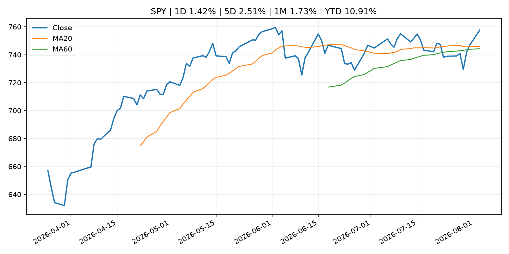
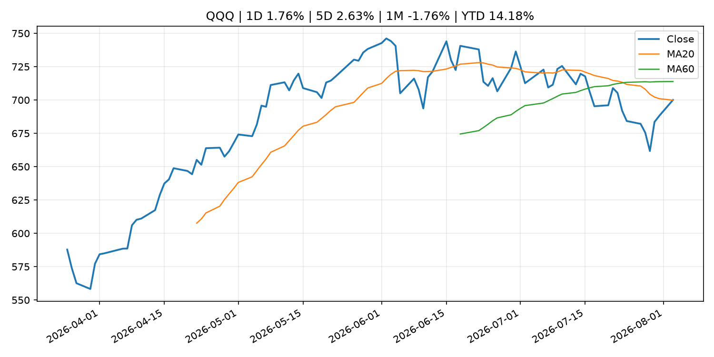
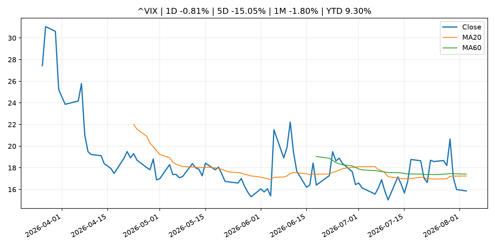
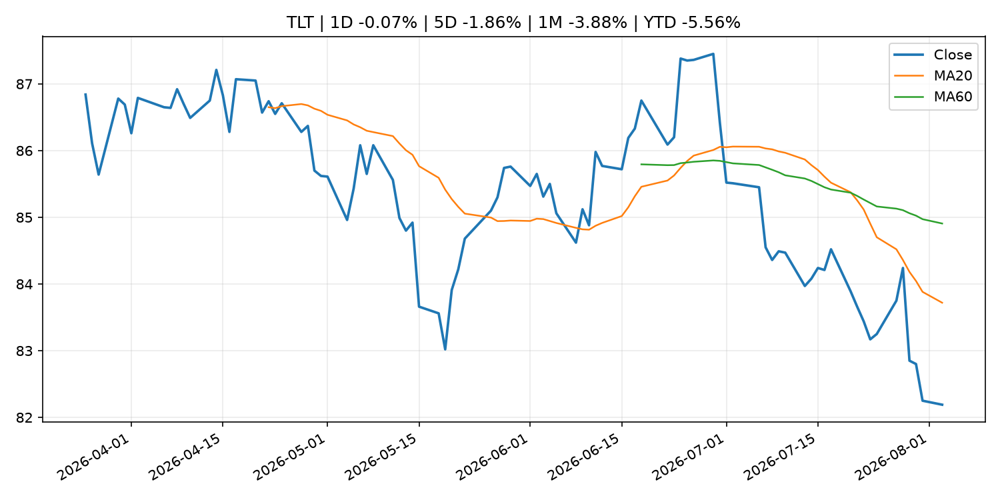
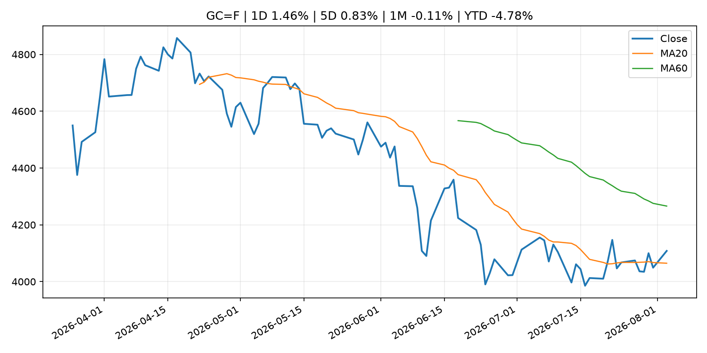
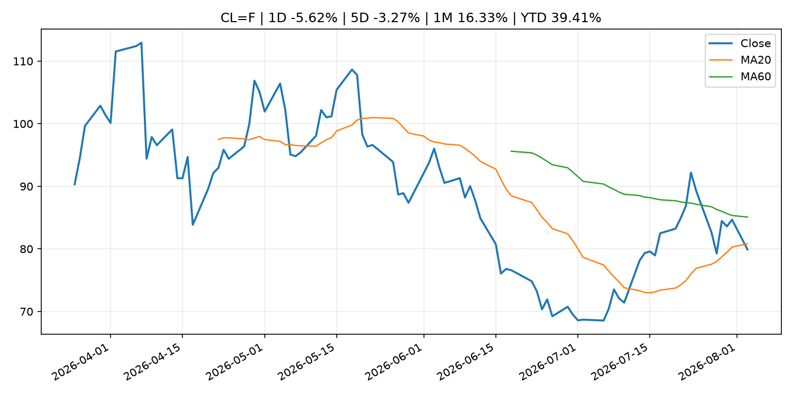
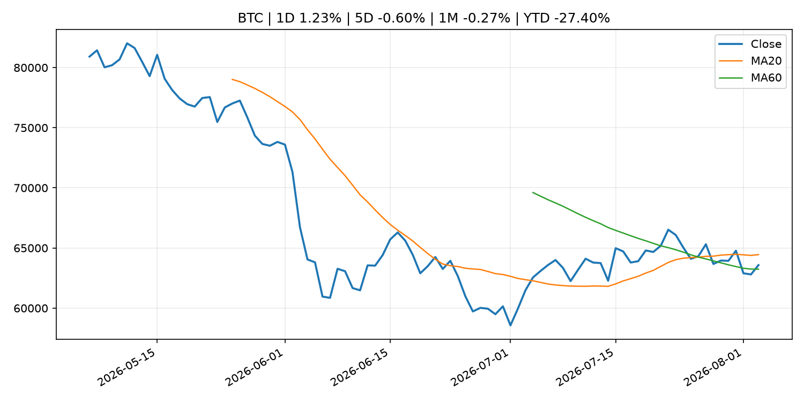
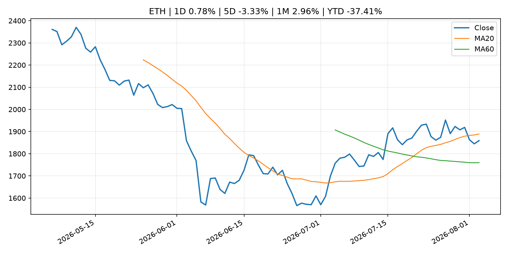
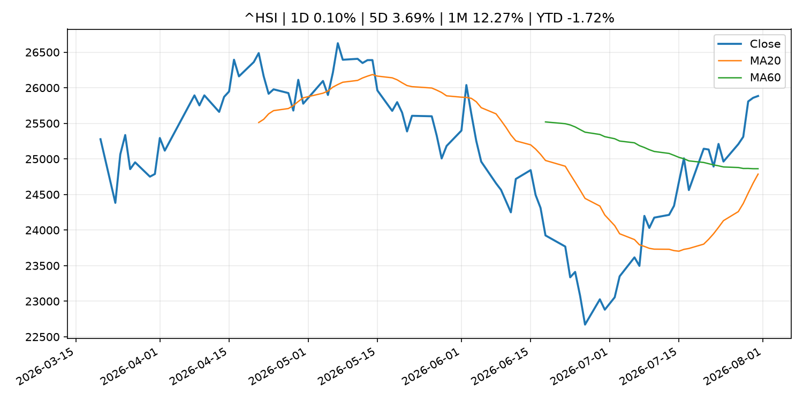

# Global Macro Morning Briefing - 2026-08-04

> Not financial advice / 非投资建议。

## 0. 今日总览
- 市场状态：unknown。市场信号不足，暂不判断明确状态。
- 今日三大主线：
  1. earnings: Palantir’s stock climbs after earnings, as AI drives turbocharged growth
  2. central_bank_speech: Trump-linked American Bitcoin president Matt Prusak departs for Giga Energy
  3. earnings: U.S. Jobs, Circle, Galaxy, American Bitcoin earnings: Crypto Week Ahead
- 一句话结论：今日晨报重点关注：大型科技股盈利和资本开支会影响纳指、半导体和 AI 交易主线。；央行官员表态可能影响市场对下一次会议的定价。。跨资产方面，SPY 1D 1.42%；QQQ 1D 1.76%；^VIX 1D -0.81%；TLT 1D -0.07%；GC=F 1D 1.46%；CL=F 1D -5.62%；BTC 1D 1.23%；ETH 1D 0.78%；市场信号不足，暂不判断明确状态。政策、通胀、利率、美元、美债、能源和加密监管仍是主要观察线索。所有结论仅基于公开数据与短摘要整理，不构成投资建议。

## 1. 隔夜跨资产市场
- 美股：SPY 1D 1.42%，QQQ 1D 1.76%，整体趋势需结合 VIX 和利率确认。
- 美债/美元：TLT 1D -0.07%，美元指数 1D 0.19%，是判断折现率压力的核心线索。
- 黄金/原油：黄金 1D 1.46%，原油 1D -5.62%，用于观察避险、通胀和地缘风险。
- 加密：BTC 1D 1.23%，ETH 1D 0.78%，关注是否独立于纳指走出加密自身行情。
- 港股/A股：恒生 1D 0.10%，沪深300/上证 1D n/a，重点看中国政策预期与人民币线索。
- 风险观察：关注后续数据是否确认当前跨资产信号。

### US_EQUITY

| symbol | latest close | 1D | 5D | 1M | YTD | trend |
|---|---:|---:|---:|---:|---:|---|
| SPY | 757.67 | 1.42% | 2.51% | 1.73% | 10.91% | uptrend |
| QQQ | 700.07 | 1.76% | 2.63% | -1.76% | 14.18% | range_bound |
| DIA | 531.22 | 1.32% | 1.91% | 0.63% | 9.84% | uptrend |
| IWM | 296.22 | 1.72% | 1.13% | -0.46% | 19.07% | uptrend |
| VTI | 373.84 | 1.53% | 2.37% | 1.38% | 11.16% | uptrend |

### US_MACRO_MARKET

| symbol | latest close | 1D | 5D | 1M | YTD | trend |
|---|---:|---:|---:|---:|---:|---|
| ^VIX | 15.86 | -0.81% | -15.05% | -1.80% | 9.30% | downtrend |
| DX-Y.NYB | 99.99 | 0.19% | -1.50% | -0.86% | 1.60% | range_bound |
| TLT | 82.19 | -0.07% | -1.86% | -3.88% | -5.56% | strong_downtrend |
| IEF | 92.82 | -0.14% | -0.49% | -1.38% | -3.39% | downtrend |

### COMMODITIES

| symbol | latest close | 1D | 5D | 1M | YTD | trend |
|---|---:|---:|---:|---:|---:|---|
| GC=F | 4,108.20 | 1.46% | 0.83% | -0.11% | -4.78% | range_bound |
| SI=F | 58.33 | 1.29% | -0.23% | -3.81% | -17.32% | range_bound |
| CL=F | 79.91 | -5.62% | -3.27% | 16.33% | 39.41% | downtrend |
| BZ=F | 83.58 | -7.26% | -5.41% | 16.41% | 37.58% | downtrend |
| NG=F | 2.77 | 0.84% | 0.11% | -13.33% | -23.44% | strong_downtrend |
| HG=F | 6.54 | 1.65% | 3.21% | 7.00% | 16.00% | range_bound |

### HK_MARKET

| symbol | latest close | 1D | 5D | 1M | YTD | trend |
|---|---:|---:|---:|---:|---:|---|
| ^HSI | 25,884.43 | 0.10% | 3.69% | 12.27% | -1.72% | range_bound |
| 0700.HK | 475.20 | 0.72% | 9.34% | 10.46% | -23.72% | strong_uptrend |
| 9988.HK | 117.00 | 4.65% | 6.36% | 23.81% | -21.48% | range_bound |
| 3690.HK | 92.50 | -0.16% | 6.69% | 30.56% | -11.57% | strong_uptrend |
| 1810.HK | 28.78 | -7.28% | 7.71% | 27.35% | -28.55% | range_bound |
| 1211.HK | 94.15 | -0.69% | 6.20% | 20.24% | -4.66% | range_bound |

### CRYPTO

| symbol | latest close | 1D | 5D | 1M | YTD | trend |
|---|---:|---:|---:|---:|---:|---|
| BTC | 63,576.13 | 1.23% | -0.60% | -0.27% | -27.40% | range_bound |
| ETH | 1,859.00 | 0.78% | -3.33% | 2.96% | -37.41% | range_bound |
| SOLANA | 73.48 | 2.20% | -0.56% | -4.41% | -40.99% | range_bound |
| BINANCECOIN | 589.60 | 2.57% | 3.21% | 2.77% | -31.66% | range_bound |
| RIPPLE | 1.08 | 1.37% | 0.56% | -0.93% | -41.57% | downtrend |

## 2. 今日最重要的 10 条新闻
### 1. Palantir’s stock climbs after earnings, as AI drives turbocharged growth
- 来源：MarketWatch Top Stories
- 时间：2026-08-03T21:59:00+00:00
- 地区：US
- 事件类型：earnings
- 重要性层级：Tier 2
- 一句话摘要：Companies are turning to Palantir for greater autonomy over their AI models and data, according to CEO Alex Karp.
- 为什么重要：大型科技股盈利和资本开支会影响纳指、半导体和 AI 交易主线。
- 可能影响：可能影响利率、汇率、风险资产或大宗商品预期，但当前公开信息不足以判断明确方向。
  - 资产：暂无明确资产映射
  - 方向：unknown
  - 强度：low
  - 原因：公开信息不足以判断方向。
- 原文链接：[https://www.marketwatch.com/story/palantirs-stock-gains-as-ai-drives-turbocharged-growth-e006b70a?mod=mw_rss_topstories](https://www.marketwatch.com/story/palantirs-stock-gains-as-ai-drives-turbocharged-growth-e006b70a?mod=mw_rss_topstories)

### 2. Trump-linked American Bitcoin president Matt Prusak departs for Giga Energy
- 来源：CoinDesk
- 时间：2026-08-03T15:24:45+00:00
- 地区：global
- 事件类型：central_bank_speech
- 重要性层级：Tier 2
- 一句话摘要：Trump-linked American Bitcoin president Matt Prusak departs for Giga Energy
- 为什么重要：央行官员表态可能影响市场对下一次会议的定价。
- 可能影响：可能影响利率、汇率、风险资产或大宗商品预期，但当前公开信息不足以判断明确方向。
  - 资产：暂无明确资产映射
  - 方向：unknown
  - 强度：low
  - 原因：公开信息不足以判断方向。
- 原文链接：[https://www.coindesk.com/business/2026/08/03/trump-linked-american-bitcoin-president-matt-prusak-departs-for-giga-energy](https://www.coindesk.com/business/2026/08/03/trump-linked-american-bitcoin-president-matt-prusak-departs-for-giga-energy)

### 3. U.S. Jobs, Circle, Galaxy, American Bitcoin earnings: Crypto Week Ahead
- 来源：CoinDesk
- 时间：2026-08-03T08:16:28+00:00
- 地区：global
- 事件类型：earnings
- 重要性层级：Tier 2
- 一句话摘要：U.S. Jobs, Circle, Galaxy, American Bitcoin earnings: Crypto Week Ahead
- 为什么重要：大型科技股盈利和资本开支会影响纳指、半导体和 AI 交易主线。
- 可能影响：可能影响利率、汇率、风险资产或大宗商品预期，但当前公开信息不足以判断明确方向。
  - 资产：暂无明确资产映射
  - 方向：unknown
  - 强度：low
  - 原因：公开信息不足以判断方向。
- 原文链接：[https://www.coindesk.com/markets/2026/08/03/u-s-jobs-circle-galaxy-american-bitcoin-earnings-crypto-week-ahead](https://www.coindesk.com/markets/2026/08/03/u-s-jobs-circle-galaxy-american-bitcoin-earnings-crypto-week-ahead)

### 4. Should wealthier Americans forgo their Social Security benefits as a charitable gesture?
- 来源：MarketWatch Top Stories
- 时间：2026-08-03T22:30:00+00:00
- 地区：US
- 事件类型：other
- 重要性层级：Tier 3
- 一句话摘要：A reader writes: “I will likely be in a position to decline my benefits.”
- 为什么重要：这条信息暂未匹配到重大宏观、政策或市场事件，更适合作为背景跟踪。
- 可能影响：更偏背景信息，短期市场影响可能有限。
  - 资产：暂无明确资产映射
  - 方向：unknown
  - 强度：low
  - 原因：公开信息不足以判断方向。
- 原文链接：[https://www.marketwatch.com/story/should-wealthier-americans-forgo-their-social-security-benefits-as-a-charitable-gesture-2c7b6801?mod=mw_rss_topstories](https://www.marketwatch.com/story/should-wealthier-americans-forgo-their-social-security-benefits-as-a-charitable-gesture-2c7b6801?mod=mw_rss_topstories)

### 5. Traders in the world’s most important financial market are bracing for a wild stretch ahead
- 来源：MarketWatch Top Stories
- 时间：2026-08-03T20:32:00+00:00
- 地区：US
- 事件类型：other
- 重要性层级：Tier 3
- 一句话摘要：Volatility is ticking higher in the $30 trillion Treasury market as investors bet that yields will push higher.
- 为什么重要：这条信息暂未匹配到重大宏观、政策或市场事件，更适合作为背景跟踪。
- 可能影响：更偏背景信息，短期市场影响可能有限。
  - 资产：暂无明确资产映射
  - 方向：unknown
  - 强度：low
  - 原因：公开信息不足以判断方向。
- 原文链接：[https://www.marketwatch.com/story/traders-in-the-worlds-most-important-financial-market-are-bracing-for-a-wild-stretch-ahead-4a1507dc?mod=mw_rss_topstories](https://www.marketwatch.com/story/traders-in-the-worlds-most-important-financial-market-are-bracing-for-a-wild-stretch-ahead-4a1507dc?mod=mw_rss_topstories)

## 3. 政策与央行观察
### 1. Trump-linked American Bitcoin president Matt Prusak departs for Giga Energy
- 来源：CoinDesk
- 时间：2026-08-03T15:24:45+00:00
- 地区：global
- 事件类型：central_bank_speech
- 重要性层级：Tier 2
- 一句话摘要：Trump-linked American Bitcoin president Matt Prusak departs for Giga Energy
- 为什么重要：央行官员表态可能影响市场对下一次会议的定价。
- 可能影响：可能影响利率、汇率、风险资产或大宗商品预期，但当前公开信息不足以判断明确方向。
  - 资产：暂无明确资产映射
  - 方向：unknown
  - 强度：low
  - 原因：公开信息不足以判断方向。
- 原文链接：[https://www.coindesk.com/business/2026/08/03/trump-linked-american-bitcoin-president-matt-prusak-departs-for-giga-energy](https://www.coindesk.com/business/2026/08/03/trump-linked-american-bitcoin-president-matt-prusak-departs-for-giga-energy)

## 4. 市场异动与图表
- SPY 上涨 1.42%
- QQQ 上涨 1.76%
- Gold 上涨 1.46%
- Oil 下跌 -5.62%

### SPY

### QQQ

### ^VIX

### TLT

### GC=F

### CL=F

### BTC

### ETH

### ^HSI

## 5. 华尔街与机构公开观点
- 暂无可靠公开观点。

## 6. 今日重点关注
- 经济数据：经济数据：暂无可靠公开日历数据；如配置经济日历源后可自动填充。
- 央行讲话：央行讲话：暂无可靠公开日历数据；重点跟踪 Fed、ECB、BoJ、PBOC 官网 RSS。
- 财报：财报：暂无可靠数据。
- 政策事件：政策事件：暂无可靠数据。
- 风险提醒：风险提醒：关注数据源失败项、突发地缘风险、利率和美元的二阶反应。

## 7. 英文金融表达与宏观概念
- **real yield**：实际收益率，名义利率扣除通胀预期后的收益率。 例句：Gold often reacts more to real yields than nominal yields.
- **market structure**：市场结构，指交易、托管、清算、ETF、监管等制度安排。 例句：Crypto market structure rules can affect institutional participation.
- **inflation expectations**：通胀预期，指家庭、企业或市场对未来通胀的预估。 例句：Inflation expectations can shape wage bargaining and bond yields.
- **terminal rate**：终端利率，市场预期本轮加息周期的最高政策利率。 例句：A higher terminal rate can pressure growth stocks.
- **soft landing**：软着陆，指通胀回落而经济避免明显衰退。 例句：Markets often rally when data support a soft landing.
- **risk-off**：避险模式，资金偏向美元、国债、黄金等防御资产。 例句：A geopolitical shock can push markets into risk-off mode.

## 8. 背景材料
- [Should wealthier Americans forgo their Social Security benefits as a charitable gesture?](https://www.marketwatch.com/story/should-wealthier-americans-forgo-their-social-security-benefits-as-a-charitable-gesture-2c7b6801?mod=mw_rss_topstories)（MarketWatch Top Stories，other）：A reader writes: “I will likely be in a position to decline my benefits.”
- [Traders in the world’s most important financial market are bracing for a wild stretch ahead](https://www.marketwatch.com/story/traders-in-the-worlds-most-important-financial-market-are-bracing-for-a-wild-stretch-ahead-4a1507dc?mod=mw_rss_topstories)（MarketWatch Top Stories，other）：Volatility is ticking higher in the $30 trillion Treasury market as investors bet that yields will push higher.
- [Visa to buy cybersecurity firm BioCatch for $2.4 billion amid surge in AI-powered scams](https://www.cnbc.com/2026/08/03/visa-buys-biocatch-fraud-detection.html)（CNBC Economy，other）：It is also the latest move by Visa to expand its value-added services business, which has become one of the company's fastest-growing divisions.
- [U.S.-Japan intervention revives yen carry trade fears for bitcoin](https://www.coindesk.com/markets/2026/08/03/u-s-japan-intervention-revives-yen-carry-trade-fears-for-bitcoin)（CoinDesk，other）：U.S.-Japan intervention revives yen carry trade fears for bitcoin
- [Strategy sold another $105 million of bitcoin last week, repurchased $81.2 million of STRC](https://www.coindesk.com/markets/2026/08/03/strategy-sold-another-usd105-million-of-bitcoin-last-week-repurchased-usd81-2-million-of-strc)（CoinDesk，other）：Strategy sold another $105 million of bitcoin last week, repurchased $81.2 million of STRC
- [Solo Bitcoin miner nets $200,000 as Coldcard hardware wallet drains rocks sentiment](https://www.coindesk.com/daybook-us/2026/08/03/solo-bitcoin-miner-nets-usd200-000-as-coldcard-hardware-wallet-drains-rocks-sentiment)（CoinDesk，other）：Solo Bitcoin miner nets $200,000 as Coldcard hardware wallet drains rocks sentiment
- [Bitcoin, ether decline as Coldcard exploit enters a fifth day](https://www.coindesk.com/markets/2026/08/03/bitcoin-ether-decline-as-coldcard-exploit-enters-a-fifth-day)（CoinDesk，other）：Bitcoin, ether decline as Coldcard exploit enters a fifth day
- [Live updates: Bitcoin flirts with $64,000 as stocks start strong in August](https://www.coindesk.com/business/2026/08/03/live-updates-traders-say-bitcoin-sell-off-from-usd65-000-points-to-thin-volume-not-panic-selling)（CoinDesk，other）：Live updates: Bitcoin flirts with $64,000 as stocks start strong in August
- [The bitcoin futures yield collapse: Once over 20%, now less than Treasury notes](https://www.coindesk.com/markets/2026/08/03/the-bitcoin-futures-yield-collapse-once-over-20-now-less-than-treasury-notes)（CoinDesk，other）：The bitcoin futures yield collapse: Once over 20%, now less than Treasury notes
- [Bitcoin slips under $63,000 despite Iran deal hopes as Coldcard losses rattle market](https://www.coindesk.com/markets/2026/08/03/bitcoin-slips-under-usd63-000-despite-iran-deal-hopes-as-coldcard-losses-rattle-market)（CoinDesk，other）：Bitcoin slips under $63,000 despite Iran deal hopes as Coldcard losses rattle market
- [Trump Media’s bitcoin stash may be down to loan collateral after $165 million BTC move](https://www.coindesk.com/markets/2026/08/03/trump-media-s-bitcoin-stash-may-be-down-to-loan-collateral-after-usd165-million-btc-move)（CoinDesk，other）：Trump Media’s bitcoin stash may be down to loan collateral after $165 million BTC move
- [Michael Saylor’s Strategy is now tracking bitcoin’s 200-week moving average](https://www.coindesk.com/markets/2026/08/03/michael-saylor-s-strategy-is-now-tracking-bitcoin-s-200-week-moving-average)（CoinDesk，other）：Michael Saylor’s Strategy is now tracking bitcoin’s 200-week moving average
- [Outlook for Economic Activity and Prices (July 2026, full text)](http://www.boj.or.jp/en/mopo/outlook/gor2607b.pdf)（Bank of Japan Announcements，other）：Outlook for Economic Activity and Prices (July 2026, full text)
- [Sources of Changes in Current Account Balances and Market Operations (July)](http://www.boj.or.jp/en/statistics/boj/fm/juqf/juqf07.xlsx)（Bank of Japan Announcements，other）：Sources of Changes in Current Account Balances and Market Operations (July)
- [Why a DeFi platform ditched its consumer app to become the secret backend for tech giants](https://www.coindesk.com/web3/2026/08/02/why-a-defi-platform-ditched-its-consumer-app-to-become-the-secret-backend-for-tech-giants)（CoinDesk，other）：Why a DeFi platform ditched its consumer app to become the secret backend for tech giants
- [Goldman traders are on pace for a record year. A close-up look at how they're doing it](https://www.cnbc.com/2026/08/01/goldman-traders-are-on-pace-for-a-record-year-a-close-up-look-at-how-theyre-doing-it.html)（CNBC Economy，other）：In a new interview with CNBC, a Goldman exec breaks down what's driving stocks, where markets are headed, and how the bank’s equities desk fuels its growth.
- [Unlike the FTX collapse, the $89 million Coldcard exploit has investors sending bitcoin back to exchanges](https://www.coindesk.com/markets/2026/08/02/unlike-the-ftx-collapse-the-usd88-million-coldcard-exploit-has-investors-sending-bitcoin-back-to-exchanges)（CoinDesk，other）：Unlike the FTX collapse, the $89 million Coldcard exploit has investors sending bitcoin back to exchanges

## 9. 数据源、失败项与免责声明
- 采集时间：2026-08-03T22:58:34
- 数据源：公开 RSS、Yahoo Finance、CoinGecko、AKShare、FRED、SEC data.sec.gov，以及用户自有 inputs/reports 文件。
- 合规说明：不绕过 WSJ、Bloomberg、FT、Reuters 等付费墙；对付费媒体只使用公开 RSS 标题、摘要、链接和发布时间。
- 免责声明：Not financial advice / 非投资建议。本项目仅供个人学习、研究和信息整理，不构成投资建议、交易建议或任何收益承诺。
- 失败或跳过的数据源：
  - crypto data failed coin=dogecoin
  - China market data failed symbol=上证指数: empty dataframe
  - China market data failed symbol=深证成指: empty dataframe
  - China market data failed symbol=创业板指: empty dataframe
  - China market data failed symbol=沪深300: empty dataframe
  - China market data failed symbol=中证500: empty dataframe
  - China market data failed symbol=科创50: empty dataframe
  - FRED_API_KEY not set; skipping FRED macro series
  - SEC failed cik=0000320193
  - SEC failed cik=0000789019
  - SEC failed cik=0001045810
  - SEC failed cik=0001318605
  - SEC failed cik=0001577552
