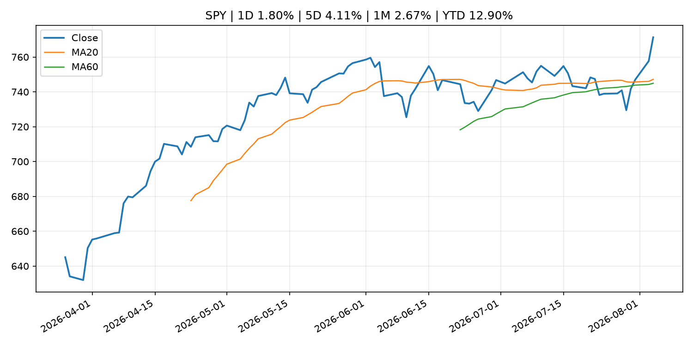
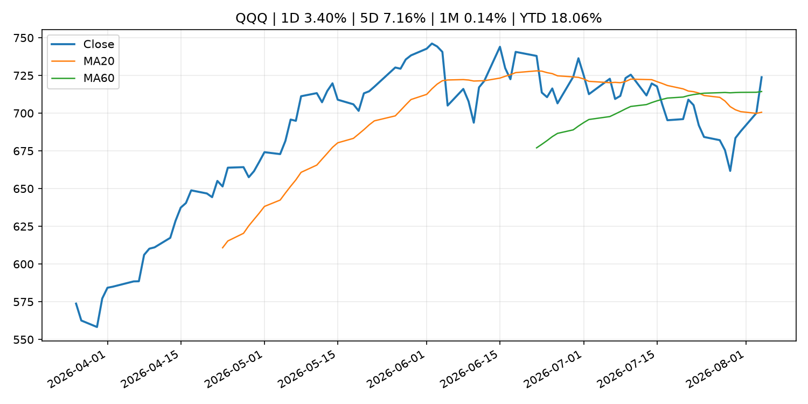
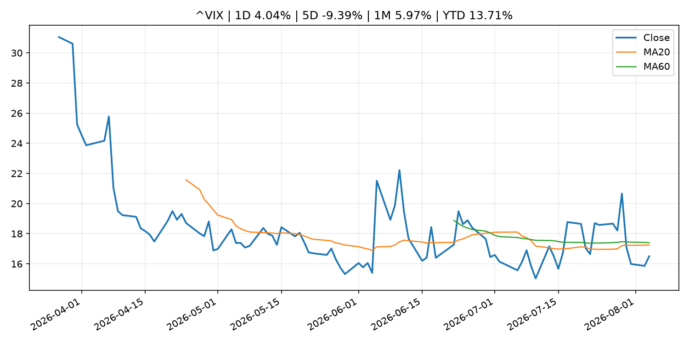
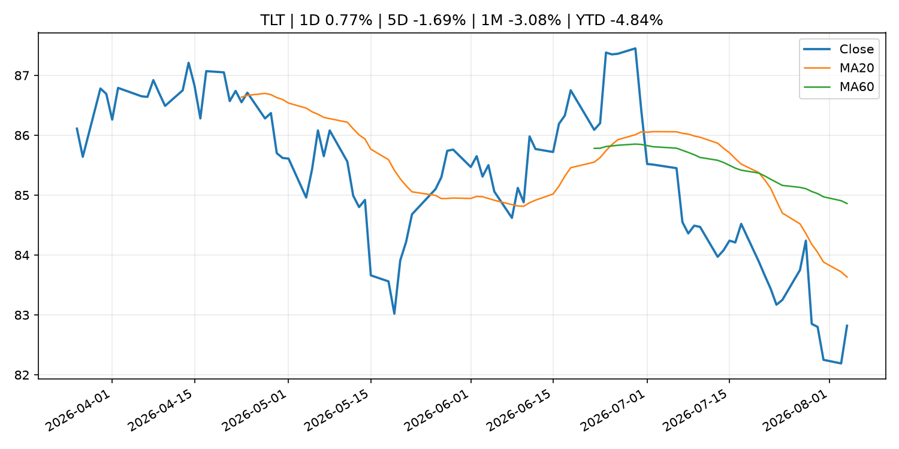
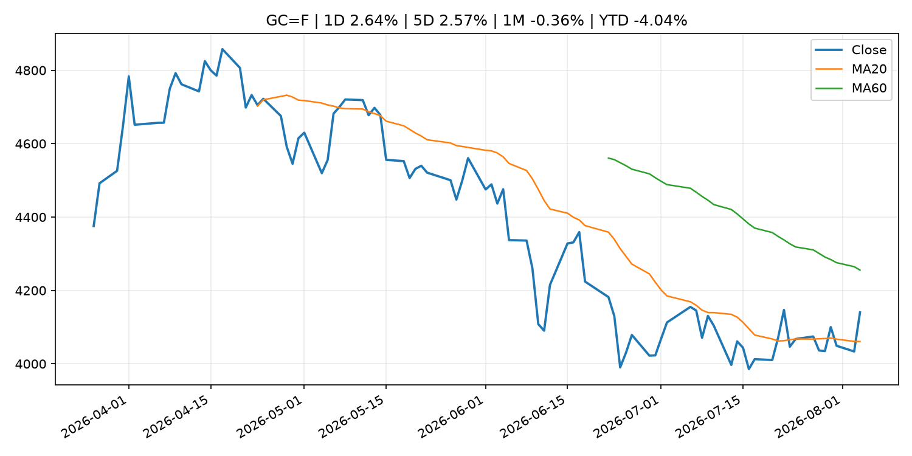
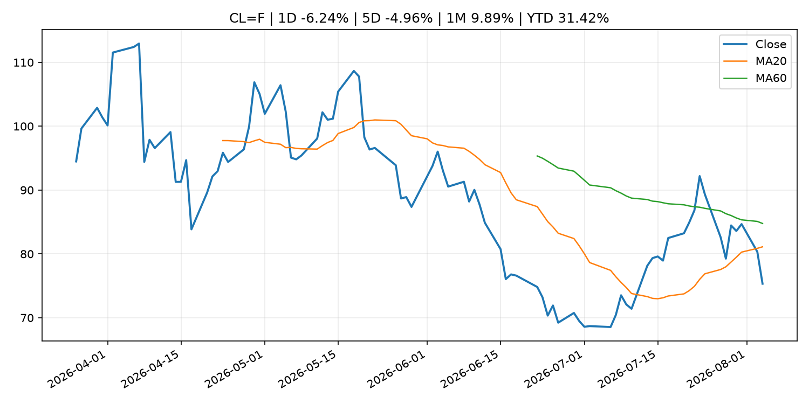
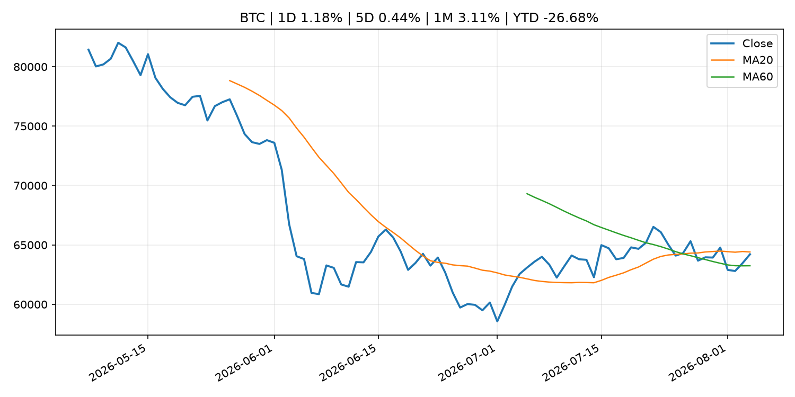
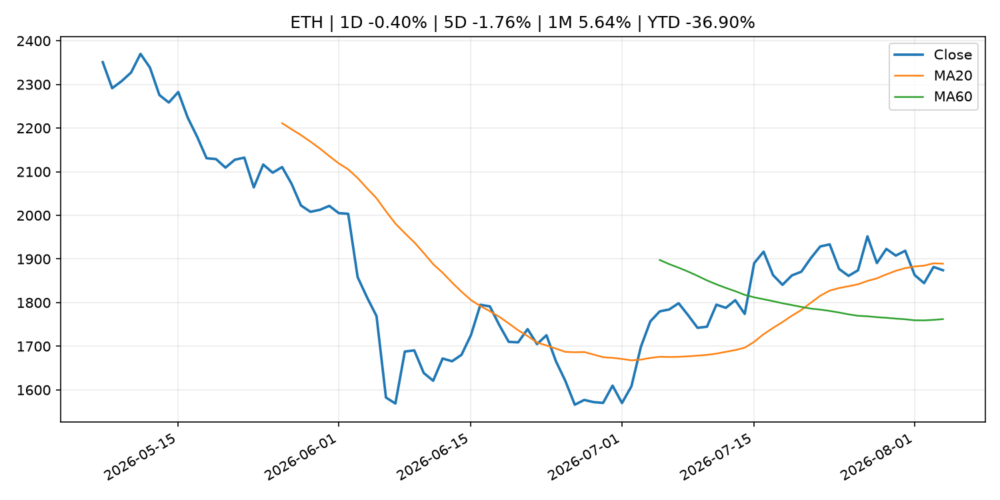
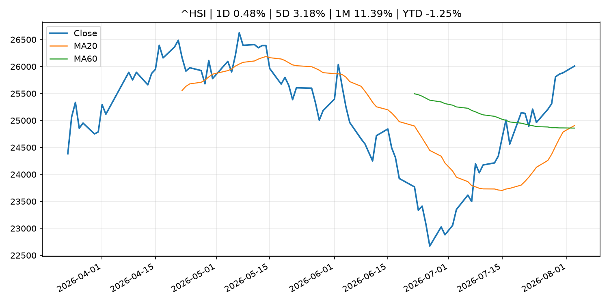

# Global Macro Morning Briefing - 2026-08-05

> Not financial advice / 非投资建议。

## 0. 今日总览
- 市场状态：mixed。股指上涨、波动率或美元回落，市场更接近风险偏好改善。 但存在信号冲突，需要降低单一叙事置信度。
- 今日三大主线：
  1. central_bank_speech: So what’s the plan to bring down inflation? The new Fed chair and his White House allies say you shouldn’t ask.
  2. crypto_market_structure: Samsung is poised to become a dominant stablecoin distributor, analysts say
  3. regulation: Clarity Act sits idle over Trump ethics question as Warren asks SEC to investigate him
- 一句话结论：今日晨报重点关注：央行官员表态可能影响市场对下一次会议的定价。；加密市场结构和监管变化会影响 BTC、ETH 及相关股票的风险溢价。。跨资产方面，SPY 1D 1.80%；QQQ 1D 3.40%；^VIX 1D 4.04%；TLT 1D 0.77%；GC=F 1D 2.64%；CL=F 1D -6.24%；BTC 1D 1.18%；ETH 1D -0.40%；股指上涨、波动率或美元回落，市场更接近风险偏好改善。 但存在信号冲突，需要降低单一叙事置信度。政策、通胀、利率、美元、美债、能源和加密监管仍是主要观察线索。所有结论仅基于公开数据与短摘要整理，不构成投资建议。

## 1. 隔夜跨资产市场
- 美股：SPY 1D 1.80%，QQQ 1D 3.40%，整体趋势需结合 VIX 和利率确认。
- 美债/美元：TLT 1D 0.77%，美元指数 1D -0.08%，是判断折现率压力的核心线索。
- 黄金/原油：黄金 1D 2.64%，原油 1D -6.24%，用于观察避险、通胀和地缘风险。
- 加密：BTC 1D 1.18%，ETH 1D -0.40%，关注是否独立于纳指走出加密自身行情。
- 港股/A股：恒生 1D 0.48%，沪深300/上证 1D n/a，重点看中国政策预期与人民币线索。
- 风险观察：确认风险偏好是否扩散到小盘股、信用利差和周期品。

### US_EQUITY

| symbol | latest close | 1D | 5D | 1M | YTD | trend |
|---|---:|---:|---:|---:|---:|---|
| SPY | 771.33 | 1.80% | 4.11% | 2.67% | 12.90% | uptrend |
| QQQ | 723.85 | 3.40% | 7.16% | 0.14% | 18.06% | range_bound |
| DIA | 540.43 | 1.73% | 2.57% | 1.95% | 11.74% | uptrend |
| IWM | 301.71 | 1.85% | 2.84% | 0.94% | 21.28% | uptrend |
| VTI | 380.82 | 1.87% | 4.05% | 2.46% | 13.23% | uptrend |

### US_MACRO_MARKET

| symbol | latest close | 1D | 5D | 1M | YTD | trend |
|---|---:|---:|---:|---:|---:|---|
| ^VIX | 16.50 | 4.04% | -9.39% | 5.97% | 13.71% | downtrend |
| DX-Y.NYB | 99.88 | -0.08% | -1.48% | -0.96% | 1.49% | range_bound |
| TLT | 82.82 | 0.77% | -1.69% | -3.08% | -4.84% | strong_downtrend |
| IEF | 93.25 | 0.46% | -0.33% | -0.99% | -2.95% | downtrend |

### COMMODITIES

| symbol | latest close | 1D | 5D | 1M | YTD | trend |
|---|---:|---:|---:|---:|---:|---|
| GC=F | 4,140.10 | 2.64% | 2.57% | -0.36% | -4.04% | range_bound |
| SI=F | 59.76 | 3.62% | 4.29% | -3.50% | -15.31% | range_bound |
| CL=F | 75.33 | -6.24% | -4.96% | 9.89% | 31.42% | downtrend |
| BZ=F | 78.87 | -5.85% | -6.21% | 9.56% | 29.83% | downtrend |
| NG=F | 2.69 | -3.38% | 0.94% | -17.20% | -25.73% | strong_downtrend |
| HG=F | 6.63 | 1.81% | 4.90% | 7.35% | 17.59% | strong_uptrend |

### HK_MARKET

| symbol | latest close | 1D | 5D | 1M | YTD | trend |
|---|---:|---:|---:|---:|---:|---|
| ^HSI | 26,009.40 | 0.48% | 3.18% | 11.39% | -1.25% | strong_uptrend |
| 0700.HK | 487.60 | -0.57% | 9.03% | 7.88% | -21.73% | uptrend |
| 9988.HK | 125.80 | 0.48% | 12.32% | 31.11% | -15.57% | range_bound |
| 3690.HK | 92.70 | -0.80% | 2.66% | 23.68% | -11.38% | strong_uptrend |
| 1810.HK | 27.96 | 0.00% | -4.44% | 20.10% | -30.59% | strong_uptrend |
| 1211.HK | 93.45 | -1.53% | 4.06% | 11.52% | -5.37% | strong_uptrend |

### CRYPTO

| symbol | latest close | 1D | 5D | 1M | YTD | trend |
|---|---:|---:|---:|---:|---:|---|
| BTC | 64,213.95 | 1.18% | 0.44% | 3.11% | -26.68% | range_bound |
| ETH | 1,874.12 | -0.40% | -1.76% | 5.64% | -36.90% | range_bound |
| SOLANA | 74.04 | 0.75% | 0.59% | -1.19% | -40.54% | range_bound |
| BINANCECOIN | 593.36 | 1.08% | 3.85% | 4.68% | -31.22% | range_bound |
| RIPPLE | 1.08 | -0.93% | 0.27% | 0.83% | -41.58% | downtrend |

## 2. 今日最重要的 10 条新闻
### 1. So what’s the plan to bring down inflation? The new Fed chair and his White House allies say you shouldn’t ask.
- 来源：MarketWatch Top Stories
- 时间：2026-08-04T20:26:00+00:00
- 地区：US
- 事件类型：central_bank_speech
- 重要性层级：Tier 2
- 一句话摘要：Critics say Kevin Warsh’s determination to cool prices gains isn’t sufficient.
- 为什么重要：央行官员表态可能影响市场对下一次会议的定价。
- 可能影响：主要影响 DXY，方向为 positive，强度 high；通胀压力可能推高政策利率预期并支撑美元。
  - 资产：DXY
    方向：positive
    强度：high
    原因：通胀压力可能推高政策利率预期并支撑美元。
  - 资产：TLT
    方向：negative
    强度：high
    原因：通胀上行通常推升收益率、压低长债价格。
  - 资产：QQQ
    方向：negative
    强度：high
    原因：更高利率对成长股估值折现率不利。
  - 资产：SPY
    方向：mixed
    强度：medium
    原因：名义增长可能支撑收入，但更高利率压制估值。
  - 资产：GC=F
    方向：mixed
    强度：medium
    原因：通胀对黄金是支撑，但实际利率上行会形成压力。
  - 资产：BTC
    方向：mixed
    强度：medium
    原因：抗通胀叙事和流动性收紧可能相互抵消。
- 原文链接：[https://www.marketwatch.com/story/bessent-defends-warsh-saying-markets-are-going-through-detox-from-too-much-fed-guidance-39dfc765?mod=mw_rss_topstories](https://www.marketwatch.com/story/bessent-defends-warsh-saying-markets-are-going-through-detox-from-too-much-fed-guidance-39dfc765?mod=mw_rss_topstories)

### 2. Samsung is poised to become a dominant stablecoin distributor, analysts say
- 来源：CoinDesk
- 时间：2026-08-04T17:14:13+00:00
- 地区：global
- 事件类型：crypto_market_structure
- 重要性层级：Tier 2
- 一句话摘要：Samsung is poised to become a dominant stablecoin distributor, analysts say
- 为什么重要：加密市场结构和监管变化会影响 BTC、ETH 及相关股票的风险溢价。
- 可能影响：主要影响 BTC，方向为 mixed，强度 high；加密监管或 ETF 进展会改变 BTC 的资金流和风险溢价。
  - 资产：BTC
    方向：mixed
    强度：high
    原因：加密监管或 ETF 进展会改变 BTC 的资金流和风险溢价。
  - 资产：ETH
    方向：mixed
    强度：high
    原因：监管框架会影响 ETH 产品化和机构参与度。
  - 资产：COIN
    方向：mixed
    强度：medium
    原因：监管清晰度和执法风险会影响交易平台估值。
  - 资产：crypto market
    方向：mixed
    强度：high
    原因：信息影响整个加密市场结构，但方向取决于细节。
- 原文链接：[https://www.coindesk.com/business/2026/08/04/samsung-is-poised-to-become-a-dominant-stablecoin-distributor-analysts-say](https://www.coindesk.com/business/2026/08/04/samsung-is-poised-to-become-a-dominant-stablecoin-distributor-analysts-say)

### 3. Clarity Act sits idle over Trump ethics question as Warren asks SEC to investigate him
- 来源：CoinDesk
- 时间：2026-08-04T16:21:59+00:00
- 地区：global
- 事件类型：regulation
- 重要性层级：Tier 2
- 一句话摘要：Clarity Act sits idle over Trump ethics question as Warren asks SEC to investigate him
- 为什么重要：监管变化会改变行业盈利预期和资产风险溢价。
- 可能影响：主要影响 BTC，方向为 mixed，强度 high；加密监管或 ETF 进展会改变 BTC 的资金流和风险溢价。
  - 资产：BTC
    方向：mixed
    强度：high
    原因：加密监管或 ETF 进展会改变 BTC 的资金流和风险溢价。
  - 资产：ETH
    方向：mixed
    强度：high
    原因：监管框架会影响 ETH 产品化和机构参与度。
  - 资产：COIN
    方向：mixed
    强度：medium
    原因：监管清晰度和执法风险会影响交易平台估值。
  - 资产：crypto market
    方向：mixed
    强度：high
    原因：信息影响整个加密市场结构，但方向取决于细节。
- 原文链接：[https://www.coindesk.com/policy/2026/08/04/clarity-act-sits-idle-over-trump-ethics-question-as-warren-asks-sec-to-investigate-him](https://www.coindesk.com/policy/2026/08/04/clarity-act-sits-idle-over-trump-ethics-question-as-warren-asks-sec-to-investigate-him)

### 4. Intesa Sanpaolo slashed IBIT stake by 94% in 2Q, tripled ether ETF holding as crypto prices slumped
- 来源：CoinDesk
- 时间：2026-08-04T14:25:50+00:00
- 地区：global
- 事件类型：other
- 重要性层级：Tier 3
- 一句话摘要：Intesa Sanpaolo slashed IBIT stake by 94% in 2Q, tripled ether ETF holding as crypto prices slumped
- 为什么重要：这条信息暂未匹配到重大宏观、政策或市场事件，更适合作为背景跟踪。
- 可能影响：主要影响 BTC，方向为 mixed，强度 high；加密监管或 ETF 进展会改变 BTC 的资金流和风险溢价。
  - 资产：BTC
    方向：mixed
    强度：high
    原因：加密监管或 ETF 进展会改变 BTC 的资金流和风险溢价。
  - 资产：ETH
    方向：mixed
    强度：high
    原因：监管框架会影响 ETH 产品化和机构参与度。
  - 资产：COIN
    方向：mixed
    强度：medium
    原因：监管清晰度和执法风险会影响交易平台估值。
  - 资产：crypto market
    方向：mixed
    强度：high
    原因：信息影响整个加密市场结构，但方向取决于细节。
- 原文链接：[https://www.coindesk.com/business/2026/08/04/intesa-sanpaolo-slashed-ibit-stake-by-94-in-2q-tripled-ether-etf-holding-as-crypto-prices-slumped](https://www.coindesk.com/business/2026/08/04/intesa-sanpaolo-slashed-ibit-stake-by-94-in-2q-tripled-ether-etf-holding-as-crypto-prices-slumped)

### 5. First U.S. spot bitcoin ETF to close as inflows dwindle, investors chase AI returns
- 来源：CoinDesk
- 时间：2026-08-04T09:54:02+00:00
- 地区：global
- 事件类型：other
- 重要性层级：Tier 3
- 一句话摘要：First U.S. spot bitcoin ETF to close as inflows dwindle, investors chase AI returns
- 为什么重要：这条信息暂未匹配到重大宏观、政策或市场事件，更适合作为背景跟踪。
- 可能影响：主要影响 BTC，方向为 mixed，强度 high；加密监管或 ETF 进展会改变 BTC 的资金流和风险溢价。
  - 资产：BTC
    方向：mixed
    强度：high
    原因：加密监管或 ETF 进展会改变 BTC 的资金流和风险溢价。
  - 资产：ETH
    方向：mixed
    强度：high
    原因：监管框架会影响 ETH 产品化和机构参与度。
  - 资产：COIN
    方向：mixed
    强度：medium
    原因：监管清晰度和执法风险会影响交易平台估值。
  - 资产：crypto market
    方向：mixed
    强度：high
    原因：信息影响整个加密市场结构，但方向取决于细节。
- 原文链接：[https://www.coindesk.com/business/2026/08/04/first-u-s-spot-bitcoin-etf-to-close-as-inflows-dwindle-investors-chase-ai-returns](https://www.coindesk.com/business/2026/08/04/first-u-s-spot-bitcoin-etf-to-close-as-inflows-dwindle-investors-chase-ai-returns)

## 3. 政策与央行观察
### 1. So what’s the plan to bring down inflation? The new Fed chair and his White House allies say you shouldn’t ask.
- 来源：MarketWatch Top Stories
- 时间：2026-08-04T20:26:00+00:00
- 地区：US
- 事件类型：central_bank_speech
- 重要性层级：Tier 2
- 一句话摘要：Critics say Kevin Warsh’s determination to cool prices gains isn’t sufficient.
- 为什么重要：央行官员表态可能影响市场对下一次会议的定价。
- 可能影响：主要影响 DXY，方向为 positive，强度 high；通胀压力可能推高政策利率预期并支撑美元。
  - 资产：DXY
    方向：positive
    强度：high
    原因：通胀压力可能推高政策利率预期并支撑美元。
  - 资产：TLT
    方向：negative
    强度：high
    原因：通胀上行通常推升收益率、压低长债价格。
  - 资产：QQQ
    方向：negative
    强度：high
    原因：更高利率对成长股估值折现率不利。
  - 资产：SPY
    方向：mixed
    强度：medium
    原因：名义增长可能支撑收入，但更高利率压制估值。
  - 资产：GC=F
    方向：mixed
    强度：medium
    原因：通胀对黄金是支撑，但实际利率上行会形成压力。
  - 资产：BTC
    方向：mixed
    强度：medium
    原因：抗通胀叙事和流动性收紧可能相互抵消。
- 原文链接：[https://www.marketwatch.com/story/bessent-defends-warsh-saying-markets-are-going-through-detox-from-too-much-fed-guidance-39dfc765?mod=mw_rss_topstories](https://www.marketwatch.com/story/bessent-defends-warsh-saying-markets-are-going-through-detox-from-too-much-fed-guidance-39dfc765?mod=mw_rss_topstories)

### 2. Samsung is poised to become a dominant stablecoin distributor, analysts say
- 来源：CoinDesk
- 时间：2026-08-04T17:14:13+00:00
- 地区：global
- 事件类型：crypto_market_structure
- 重要性层级：Tier 2
- 一句话摘要：Samsung is poised to become a dominant stablecoin distributor, analysts say
- 为什么重要：加密市场结构和监管变化会影响 BTC、ETH 及相关股票的风险溢价。
- 可能影响：主要影响 BTC，方向为 mixed，强度 high；加密监管或 ETF 进展会改变 BTC 的资金流和风险溢价。
  - 资产：BTC
    方向：mixed
    强度：high
    原因：加密监管或 ETF 进展会改变 BTC 的资金流和风险溢价。
  - 资产：ETH
    方向：mixed
    强度：high
    原因：监管框架会影响 ETH 产品化和机构参与度。
  - 资产：COIN
    方向：mixed
    强度：medium
    原因：监管清晰度和执法风险会影响交易平台估值。
  - 资产：crypto market
    方向：mixed
    强度：high
    原因：信息影响整个加密市场结构，但方向取决于细节。
- 原文链接：[https://www.coindesk.com/business/2026/08/04/samsung-is-poised-to-become-a-dominant-stablecoin-distributor-analysts-say](https://www.coindesk.com/business/2026/08/04/samsung-is-poised-to-become-a-dominant-stablecoin-distributor-analysts-say)

### 3. Clarity Act sits idle over Trump ethics question as Warren asks SEC to investigate him
- 来源：CoinDesk
- 时间：2026-08-04T16:21:59+00:00
- 地区：global
- 事件类型：regulation
- 重要性层级：Tier 2
- 一句话摘要：Clarity Act sits idle over Trump ethics question as Warren asks SEC to investigate him
- 为什么重要：监管变化会改变行业盈利预期和资产风险溢价。
- 可能影响：主要影响 BTC，方向为 mixed，强度 high；加密监管或 ETF 进展会改变 BTC 的资金流和风险溢价。
  - 资产：BTC
    方向：mixed
    强度：high
    原因：加密监管或 ETF 进展会改变 BTC 的资金流和风险溢价。
  - 资产：ETH
    方向：mixed
    强度：high
    原因：监管框架会影响 ETH 产品化和机构参与度。
  - 资产：COIN
    方向：mixed
    强度：medium
    原因：监管清晰度和执法风险会影响交易平台估值。
  - 资产：crypto market
    方向：mixed
    强度：high
    原因：信息影响整个加密市场结构，但方向取决于细节。
- 原文链接：[https://www.coindesk.com/policy/2026/08/04/clarity-act-sits-idle-over-trump-ethics-question-as-warren-asks-sec-to-investigate-him](https://www.coindesk.com/policy/2026/08/04/clarity-act-sits-idle-over-trump-ethics-question-as-warren-asks-sec-to-investigate-him)

## 4. 市场异动与图表
- SPY 上涨 1.80%
- QQQ 上涨 3.40%
- VIX 上涨 4.04%
- TLT 上涨 0.77%
- Gold 上涨 2.64%
- Oil 下跌 -6.24%

### 信号矛盾
- 股指上涨但 VIX 同时走高，风险偏好信号不一致。

### SPY

### QQQ

### ^VIX

### TLT

### GC=F

### CL=F

### BTC

### ETH

### ^HSI

## 5. 华尔街与机构公开观点
- 暂无可靠公开观点。

## 6. 今日重点关注
- 经济数据：经济数据：暂无可靠公开日历数据；如配置经济日历源后可自动填充。
- 央行讲话：央行讲话：暂无可靠公开日历数据；重点跟踪 Fed、ECB、BoJ、PBOC 官网 RSS。
- 财报：财报：暂无可靠数据。
- 政策事件：政策事件：暂无可靠数据。
- 风险提醒：风险提醒：关注数据源失败项、突发地缘风险、利率和美元的二阶反应。

## 7. 英文金融表达与宏观概念
- **inflation expectations**：通胀预期，指家庭、企业或市场对未来通胀的预估。 例句：Inflation expectations can shape wage bargaining and bond yields.
- **real yield**：实际收益率，名义利率扣除通胀预期后的收益率。 例句：Gold often reacts more to real yields than nominal yields.
- **risk-off**：避险模式，资金偏向美元、国债、黄金等防御资产。 例句：A geopolitical shock can push markets into risk-off mode.
- **market structure**：市场结构，指交易、托管、清算、ETF、监管等制度安排。 例句：Crypto market structure rules can affect institutional participation.
- **terminal rate**：终端利率，市场预期本轮加息周期的最高政策利率。 例句：A higher terminal rate can pressure growth stocks.
- **soft landing**：软着陆，指通胀回落而经济避免明显衰退。 例句：Markets often rally when data support a soft landing.

## 8. 背景材料
- [If I marry my girlfriend, 67, will she lose her Supplemental Security Income and divorced spouse benefits?](https://www.marketwatch.com/story/if-i-marry-my-girlfriend-67-will-she-lose-her-supplemental-security-income-and-divorced-spouse-benefits-9340bab9?mod=mw_rss_topstories)（MarketWatch Top Stories，other）：“She has been living with me for four years.”
- [Federal Reserve Board announces approval of the application by Coastal Bend Bancshares, Inc.](https://www.federalreserve.gov/newsevents/pressreleases/orders20260804c.htm)（Federal Reserve Press Releases，other）：Federal Reserve Board announces approval of the application by Coastal Bend Bancshares, Inc.
- [Federal Reserve Board announces approval of the application by FS Bancorp, Inc.](https://www.federalreserve.gov/newsevents/pressreleases/orders20260804b.htm)（Federal Reserve Press Releases，other）：Federal Reserve Board announces approval of the application by FS Bancorp, Inc.
- [Federal Reserve Board announces approval of the application by Banco Santander, S.A. and Santander Holdings USA, Inc.](https://www.federalreserve.gov/newsevents/pressreleases/orders20260804a.htm)（Federal Reserve Press Releases，other）：Federal Reserve Board announces approval of the application by Banco Santander, S.A. and Santander Holdings USA, Inc.
- [SpaceX tops Wall Street revenue forecast, posts $540 million loss on bitcoin holdings](https://www.coindesk.com/business/2026/08/04/spacex-tops-wall-street-revenue-forecast-posts-usd540-million-decline-on-bitcoin-holding-value)（CoinDesk，other）：SpaceX tops Wall Street revenue forecast, posts $540 million loss on bitcoin holdings
- [Bitcoin’s $63,000 zone emerges as key battleground for buyers: Glassnode](https://www.coindesk.com/markets/2026/08/04/bitcoin-s-usd63-000-zone-emerges-as-key-battleground-for-buyers-glassnode)（CoinDesk，other）：Bitcoin’s $63,000 zone emerges as key battleground for buyers: Glassnode
- [Polymarket targets $20 billion valuation as competition heats up in prediction market sector](https://www.coindesk.com/markets/2026/08/04/polymarket-targets-usd20-billion-valuation-as-competition-heats-up-in-prediction-markets)（CoinDesk，other）：Polymarket targets $20 billion valuation as competition heats up in prediction market sector
- [Intesa Sanpaolo slashed IBIT stake by 94% in 2Q, tripled ether ETF holding as crypto prices slumped](https://www.coindesk.com/business/2026/08/04/intesa-sanpaolo-slashed-ibit-stake-by-94-in-2q-tripled-ether-etf-holding-as-crypto-prices-slumped)（CoinDesk，other）：Intesa Sanpaolo slashed IBIT stake by 94% in 2Q, tripled ether ETF holding as crypto prices slumped
- [Coldcard urges users to move bitcoin as exploit is still in progress](https://www.coindesk.com/tech/2026/08/04/coldcard-urges-users-to-move-bitcoin-as-active-wallet-exploit-continues)（CoinDesk，other）：Coldcard urges users to move bitcoin as exploit is still in progress
- [The bitcoin market has plenty of reasons to freak out, yet calm pervades](https://www.coindesk.com/daybook-us/2026/08/04/the-bitcoin-market-has-plenty-of-reasons-to-freak-out-yet-calm-pervades)（CoinDesk，other）：The bitcoin market has plenty of reasons to freak out, yet calm pervades
- [Bitcoin rises toward $64,000 as Coldcard exploit, Strategy sales recede. ADA advances](https://www.coindesk.com/markets/2026/08/04/bitcoin-rises-toward-usd64-000-as-coldcard-exploit-strategy-sales-recede-ada-advances)（CoinDesk，other）：Bitcoin rises toward $64,000 as Coldcard exploit, Strategy sales recede. ADA advances
- [First U.S. spot bitcoin ETF to close as inflows dwindle, investors chase AI returns](https://www.coindesk.com/business/2026/08/04/first-u-s-spot-bitcoin-etf-to-close-as-inflows-dwindle-investors-chase-ai-returns)（CoinDesk，other）：First U.S. spot bitcoin ETF to close as inflows dwindle, investors chase AI returns
- [Live updates: Bitcoin stuck in tight range as risk assets soar on Iran deal hopes](https://www.coindesk.com/business/2026/08/04/live-updates-bitcoin-at-usd63-600-as-rare-us-japan-yen-action-tests-carry-trade-fears)（CoinDesk，other）：Live updates: Bitcoin stuck in tight range as risk assets soar on Iran deal hopes
- [Japanese Government Bonds Held by the Bank of Japan](http://www.boj.or.jp/en/statistics/boj/other/mei/release/2026/mei260731.xlsx)（Bank of Japan Announcements，other）：Japanese Government Bonds Held by the Bank of Japan
- [Collateral Accepted by the Bank of Japan (End of July)](http://www.boj.or.jp/en/statistics/boj/other/col/col2607.xlsx)（Bank of Japan Announcements，other）：Collateral Accepted by the Bank of Japan (End of July)
- [Bhutan's GMC puts part of its bitcoin treasury to work after 10,000 BTC pledge](https://www.coindesk.com/markets/2026/08/04/bhutan-s-gmc-puts-part-of-its-bitcoin-treasury-to-work-after-10-000-btc-pledge)（CoinDesk，other）：Bhutan's GMC puts part of its bitcoin treasury to work after 10,000 BTC pledge
- [Why Jim Cramer’s quantum panic isn’t rattling bitcoin as price holds steady around $64,000](https://www.coindesk.com/markets/2026/08/04/why-jim-cramer-s-quantum-panic-isn-t-rattling-bitcoin-as-price-holds-steady-around-usd64-000)（CoinDesk，other）：Why Jim Cramer’s quantum panic isn’t rattling bitcoin as price holds steady around $64,000
- [(BOJ Review) Impact of the Bank of Japan's Reductions in JGB Purchases on the JGB Markets](http://www.boj.or.jp/en/research/wps_rev/rev_2026/rev26e10.htm)（Bank of Japan Announcements，other）：(BOJ Review) Impact of the Bank of Japan's Reductions in JGB Purchases on the JGB Markets
- [Bitcoin nears $64,000 as traders look past Strategy's BTC sales and Coldcard sweeps](https://www.coindesk.com/markets/2026/08/04/bitcoin-nears-usd64-000-as-traders-look-past-the-fourth-coldcard-sweep)（CoinDesk，other）：Bitcoin nears $64,000 as traders look past Strategy's BTC sales and Coldcard sweeps
- [A bitcoin wallet dormant since 2013 moved $31 million, and it's not the only one](https://www.coindesk.com/markets/2026/08/04/a-bitcoin-wallet-dormant-since-2013-moved-usd31-million-and-it-s-not-the-only-one)（CoinDesk，other）：A bitcoin wallet dormant since 2013 moved $31 million, and it's not the only one

## 9. 数据源、失败项与免责声明
- 采集时间：2026-08-04T23:01:43
- 数据源：公开 RSS、Yahoo Finance、CoinGecko、AKShare、FRED、SEC data.sec.gov，以及用户自有 inputs/reports 文件。
- 合规说明：不绕过 WSJ、Bloomberg、FT、Reuters 等付费墙；对付费媒体只使用公开 RSS 标题、摘要、链接和发布时间。
- 免责声明：Not financial advice / 非投资建议。本项目仅供个人学习、研究和信息整理，不构成投资建议、交易建议或任何收益承诺。
- 失败或跳过的数据源：
  - crypto data failed coin=dogecoin
  - China market data failed symbol=上证指数: empty dataframe
  - China market data failed symbol=深证成指: empty dataframe
  - China market data failed symbol=创业板指: empty dataframe
  - China market data failed symbol=沪深300: empty dataframe
  - China market data failed symbol=中证500: empty dataframe
  - China market data failed symbol=科创50: empty dataframe
  - FRED_API_KEY not set; skipping FRED macro series
  - SEC failed cik=0000320193
  - SEC failed cik=0000789019
  - SEC failed cik=0001045810
  - SEC failed cik=0001318605
  - SEC failed cik=0001577552
