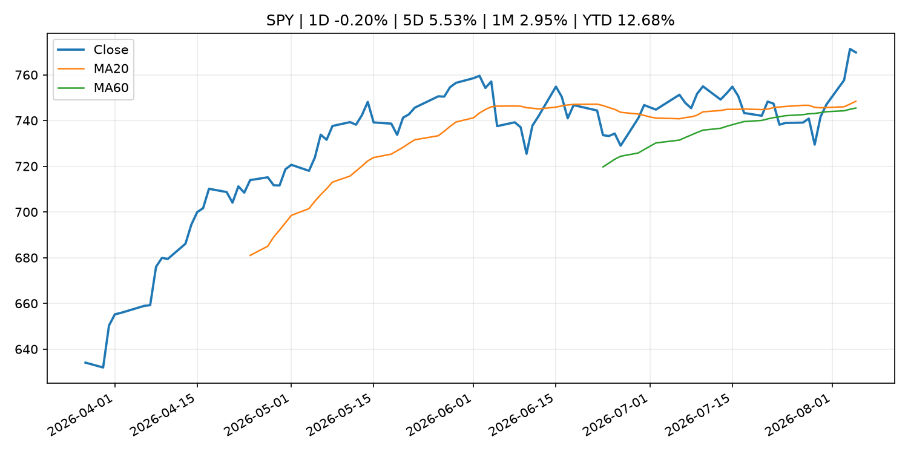
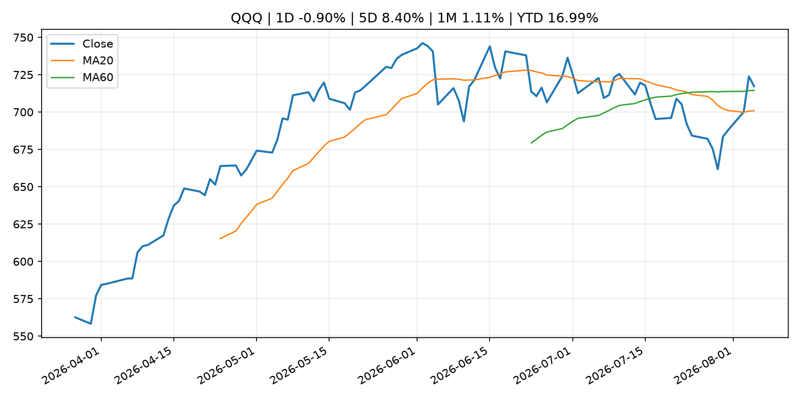
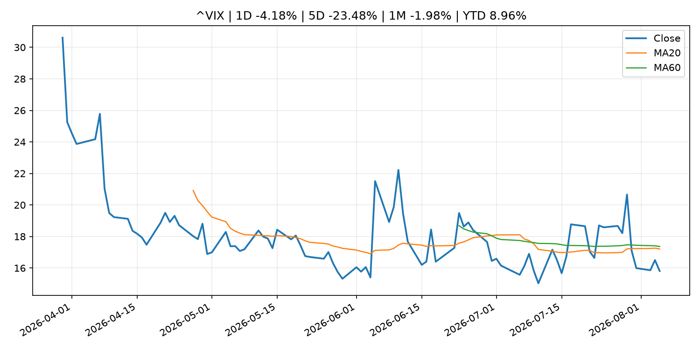
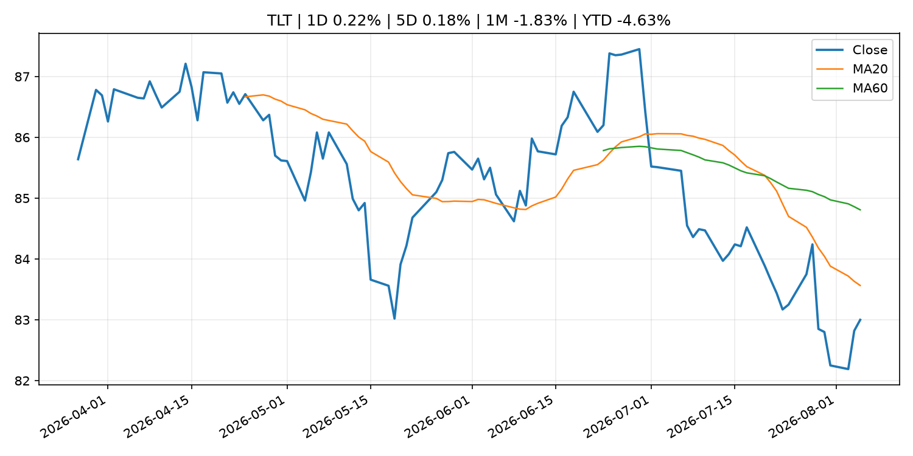
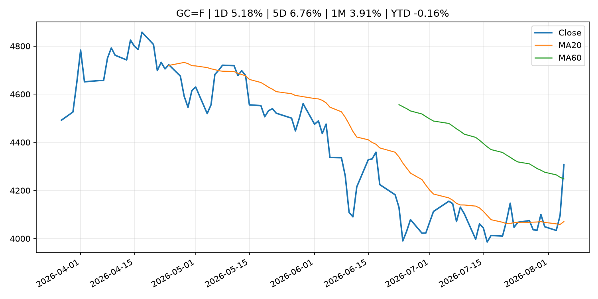
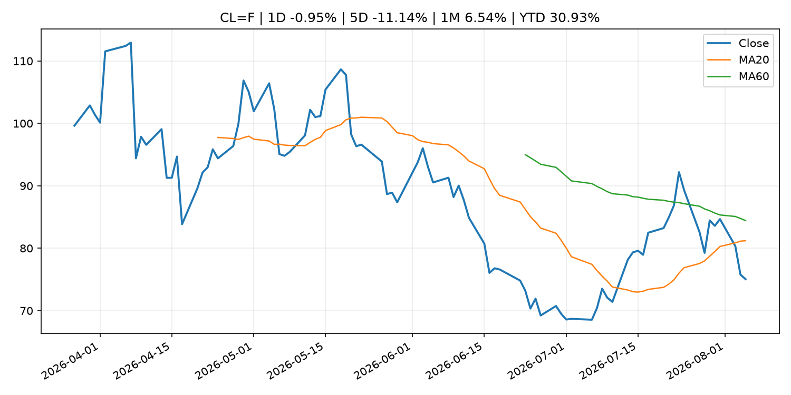
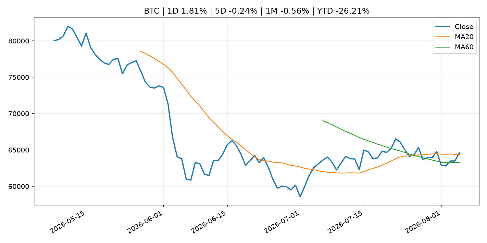
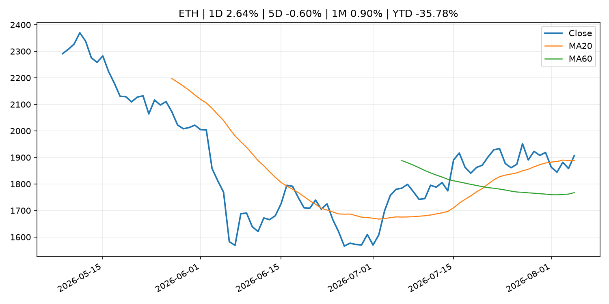
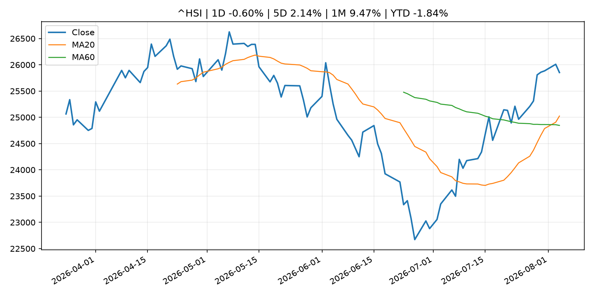

# Global Macro Morning Briefing - 2026-08-06

> Not financial advice / 非投资建议。

## 0. 今日总览
- 市场状态：unknown。市场信号不足，暂不判断明确状态。
- 今日三大主线：
  1. central_bank_decision: Fed Governor Cook says she's 'prepared to act' on rate hike to address inflation
  2. regulation: SEC Establishes Financial Reporting and Accounting Unit in Enforcement Division
  3. crypto_market_structure: Yellow Card raises $40 million to link banks to stablecoin processing
- 一句话结论：今日晨报重点关注：央行决策会重定价利率、汇率、久期资产和风险资产。；监管变化会改变行业盈利预期和资产风险溢价。。跨资产方面，SPY 1D -0.20%；QQQ 1D -0.90%；^VIX 1D -4.18%；TLT 1D 0.22%；GC=F 1D 5.18%；CL=F 1D -0.95%；BTC 1D 1.81%；ETH 1D 2.64%；市场信号不足，暂不判断明确状态。政策、通胀、利率、美元、美债、能源和加密监管仍是主要观察线索。所有结论仅基于公开数据与短摘要整理，不构成投资建议。

## 1. 隔夜跨资产市场
- 美股：SPY 1D -0.20%，QQQ 1D -0.90%，整体趋势需结合 VIX 和利率确认。
- 美债/美元：TLT 1D 0.22%，美元指数 1D -0.20%，是判断折现率压力的核心线索。
- 黄金/原油：黄金 1D 5.18%，原油 1D -0.95%，用于观察避险、通胀和地缘风险。
- 加密：BTC 1D 1.81%，ETH 1D 2.64%，关注是否独立于纳指走出加密自身行情。
- 港股/A股：恒生 1D -0.60%，沪深300/上证 1D n/a，重点看中国政策预期与人民币线索。
- 风险观察：关注后续数据是否确认当前跨资产信号。

### US_EQUITY

| symbol | latest close | 1D | 5D | 1M | YTD | trend |
|---|---:|---:|---:|---:|---:|---|
| SPY | 769.79 | -0.20% | 5.53% | 2.95% | 12.68% | uptrend |
| QQQ | 717.30 | -0.90% | 8.40% | 1.11% | 16.99% | range_bound |
| DIA | 542.81 | 0.44% | 5.32% | 2.72% | 12.24% | uptrend |
| IWM | 299.77 | -0.64% | 3.88% | 1.21% | 20.50% | uptrend |
| VTI | 379.65 | -0.31% | 5.34% | 2.72% | 12.89% | uptrend |

### US_MACRO_MARKET

| symbol | latest close | 1D | 5D | 1M | YTD | trend |
|---|---:|---:|---:|---:|---:|---|
| ^VIX | 15.81 | -4.18% | -23.48% | -1.98% | 8.96% | downtrend |
| DX-Y.NYB | 99.69 | -0.20% | -1.10% | -1.43% | 1.29% | range_bound |
| TLT | 83.00 | 0.22% | 0.18% | -1.83% | -4.63% | downtrend |
| IEF | 93.31 | 0.06% | 0.15% | -0.42% | -2.88% | downtrend |

### COMMODITIES

| symbol | latest close | 1D | 5D | 1M | YTD | trend |
|---|---:|---:|---:|---:|---:|---|
| GC=F | 4,307.50 | 5.18% | 6.76% | 3.91% | -0.16% | range_bound |
| SI=F | 62.26 | 3.68% | 7.61% | 2.19% | -11.75% | range_bound |
| CL=F | 75.05 | -0.95% | -11.14% | 6.54% | 30.93% | downtrend |
| BZ=F | 79.49 | 0.16% | -12.40% | 7.19% | 30.85% | downtrend |
| NG=F | 2.67 | -0.48% | -2.06% | -18.25% | -26.23% | strong_downtrend |
| HG=F | 6.75 | 2.04% | 7.65% | 9.43% | 19.74% | strong_uptrend |

### HK_MARKET

| symbol | latest close | 1D | 5D | 1M | YTD | trend |
|---|---:|---:|---:|---:|---:|---|
| ^HSI | 25,852.92 | -0.60% | 2.14% | 9.47% | -1.84% | strong_uptrend |
| 0700.HK | 492.20 | 0.94% | 5.53% | 6.72% | -21.00% | uptrend |
| 9988.HK | 128.10 | 1.83% | 12.76% | 33.72% | -14.03% | strong_uptrend |
| 3690.HK | 93.05 | 0.38% | 0.81% | 18.76% | -11.04% | strong_uptrend |
| 1810.HK | 27.64 | -1.14% | -13.30% | 19.65% | -31.38% | uptrend |
| 1211.HK | 93.80 | 0.37% | 0.21% | 12.40% | -5.01% | strong_uptrend |

### CRYPTO

| symbol | latest close | 1D | 5D | 1M | YTD | trend |
|---|---:|---:|---:|---:|---:|---|
| BTC | 64,622.12 | 1.81% | -0.24% | -0.56% | -26.21% | uptrend |
| ETH | 1,907.26 | 2.64% | -0.60% | 0.90% | -35.78% | uptrend |
| SOLANA | 74.00 | 0.70% | -0.70% | -4.89% | -40.57% | range_bound |
| BINANCECOIN | 592.96 | 0.75% | 0.24% | 2.00% | -31.27% | range_bound |
| RIPPLE | 1.06 | -1.11% | -1.90% | -4.36% | -42.27% | strong_downtrend |

## 2. 今日最重要的 10 条新闻
### 1. Fed Governor Cook says she's 'prepared to act' on rate hike to address inflation
- 来源：CNBC Economy
- 时间：2026-08-05T20:36:16+00:00
- 地区：US
- 事件类型：central_bank_decision
- 重要性层级：Tier 1
- 一句话摘要：Cook was part of a 9-3 majority that voted last week to keep the central bank's benchmark borrowing rate in a range between 3.5%-3.75%.
- 为什么重要：央行决策会重定价利率、汇率、久期资产和风险资产。
- 可能影响：主要影响 DXY，方向为 positive，强度 high；通胀压力可能推高政策利率预期并支撑美元。
  - 资产：DXY
    方向：positive
    强度：high
    原因：通胀压力可能推高政策利率预期并支撑美元。
  - 资产：TLT
    方向：negative
    强度：high
    原因：通胀上行通常推升收益率、压低长债价格。
  - 资产：QQQ
    方向：negative
    强度：high
    原因：更高利率对成长股估值折现率不利。
  - 资产：SPY
    方向：mixed
    强度：medium
    原因：名义增长可能支撑收入，但更高利率压制估值。
  - 资产：GC=F
    方向：mixed
    强度：medium
    原因：通胀对黄金是支撑，但实际利率上行会形成压力。
  - 资产：BTC
    方向：negative
    强度：high
    原因：流动性收紧通常压制高 beta 加密资产。
- 原文链接：[https://www.cnbc.com/2026/08/05/fed-governor-cook-says-shes-prepared-to-act-on-rate-hike-to-address-inflation.html](https://www.cnbc.com/2026/08/05/fed-governor-cook-says-shes-prepared-to-act-on-rate-hike-to-address-inflation.html)

### 2. SEC Establishes Financial Reporting and Accounting Unit in Enforcement Division
- 来源：SEC Press Releases
- 时间：2026-08-05T14:30:00-04:00
- 地区：US
- 事件类型：regulation
- 重要性层级：Tier 2
- 一句话摘要：The Securities and Exchange Commission today announced it is establishing a new specialized unit within the Division of Enforcement to provide the dedicated expertise, focus, and capacity to pursue accounting and financial reporting fraud cases as well…
- 为什么重要：监管变化会改变行业盈利预期和资产风险溢价。
- 可能影响：主要影响 BTC，方向为 mixed，强度 high；加密监管或 ETF 进展会改变 BTC 的资金流和风险溢价。
  - 资产：BTC
    方向：mixed
    强度：high
    原因：加密监管或 ETF 进展会改变 BTC 的资金流和风险溢价。
  - 资产：ETH
    方向：mixed
    强度：high
    原因：监管框架会影响 ETH 产品化和机构参与度。
  - 资产：COIN
    方向：mixed
    强度：medium
    原因：监管清晰度和执法风险会影响交易平台估值。
  - 资产：crypto market
    方向：mixed
    强度：high
    原因：信息影响整个加密市场结构，但方向取决于细节。
- 原文链接：[https://www.sec.gov/newsroom/press-releases/2026-72-sec-establishes-financial-reporting-accounting-unit-enforcement-division](https://www.sec.gov/newsroom/press-releases/2026-72-sec-establishes-financial-reporting-accounting-unit-enforcement-division)

### 3. Yellow Card raises $40 million to link banks to stablecoin processing
- 来源：CoinDesk
- 时间：2026-08-05T12:09:05+00:00
- 地区：global
- 事件类型：crypto_market_structure
- 重要性层级：Tier 2
- 一句话摘要：Yellow Card raises $40 million to link banks to stablecoin processing
- 为什么重要：加密市场结构和监管变化会影响 BTC、ETH 及相关股票的风险溢价。
- 可能影响：主要影响 BTC，方向为 mixed，强度 high；加密监管或 ETF 进展会改变 BTC 的资金流和风险溢价。
  - 资产：BTC
    方向：mixed
    强度：high
    原因：加密监管或 ETF 进展会改变 BTC 的资金流和风险溢价。
  - 资产：ETH
    方向：mixed
    强度：high
    原因：监管框架会影响 ETH 产品化和机构参与度。
  - 资产：COIN
    方向：mixed
    强度：medium
    原因：监管清晰度和执法风险会影响交易平台估值。
  - 资产：crypto market
    方向：mixed
    强度：high
    原因：信息影响整个加密市场结构，但方向取决于细节。
- 原文链接：[https://www.coindesk.com/business/2026/08/05/yellow-card-raises-usd40-million-to-link-banks-to-stablecoin-processing](https://www.coindesk.com/business/2026/08/05/yellow-card-raises-usd40-million-to-link-banks-to-stablecoin-processing)

### 4. Circle shares fall 3% despite earnings beat as stablecoin issuer misses on revenue
- 来源：CoinDesk
- 时间：2026-08-05T11:13:17+00:00
- 地区：global
- 事件类型：crypto_market_structure
- 重要性层级：Tier 2
- 一句话摘要：Circle shares fall 3% despite earnings beat as stablecoin issuer misses on revenue
- 为什么重要：加密市场结构和监管变化会影响 BTC、ETH 及相关股票的风险溢价。
- 可能影响：主要影响 BTC，方向为 mixed，强度 high；加密监管或 ETF 进展会改变 BTC 的资金流和风险溢价。
  - 资产：BTC
    方向：mixed
    强度：high
    原因：加密监管或 ETF 进展会改变 BTC 的资金流和风险溢价。
  - 资产：ETH
    方向：mixed
    强度：high
    原因：监管框架会影响 ETH 产品化和机构参与度。
  - 资产：COIN
    方向：mixed
    强度：medium
    原因：监管清晰度和执法风险会影响交易平台估值。
  - 资产：crypto market
    方向：mixed
    强度：high
    原因：信息影响整个加密市场结构，但方向取决于细节。
- 原文链接：[https://www.coindesk.com/markets/2026/08/05/circle-shares-jump-as-earnings-beat-offsets-revenue-miss-arc-blockchain-gains-wall-street-backing](https://www.coindesk.com/markets/2026/08/05/circle-shares-jump-as-earnings-beat-offsets-revenue-miss-arc-blockchain-gains-wall-street-backing)

### 5. Coldcard hack sparks a self-custody security overhaul: Cory Klippsten
- 来源：CoinDesk
- 时间：2026-08-05T09:55:32+00:00
- 地区：global
- 事件类型：crypto_market_structure
- 重要性层级：Tier 2
- 一句话摘要：Coldcard hack sparks a self-custody security overhaul: Cory Klippsten
- 为什么重要：加密市场结构和监管变化会影响 BTC、ETH 及相关股票的风险溢价。
- 可能影响：主要影响 BTC，方向为 mixed，强度 high；加密监管或 ETF 进展会改变 BTC 的资金流和风险溢价。
  - 资产：BTC
    方向：mixed
    强度：high
    原因：加密监管或 ETF 进展会改变 BTC 的资金流和风险溢价。
  - 资产：ETH
    方向：mixed
    强度：high
    原因：监管框架会影响 ETH 产品化和机构参与度。
  - 资产：COIN
    方向：mixed
    强度：medium
    原因：监管清晰度和执法风险会影响交易平台估值。
  - 资产：crypto market
    方向：mixed
    强度：high
    原因：信息影响整个加密市场结构，但方向取决于细节。
- 原文链接：[https://www.coindesk.com/markets/2026/08/05/coldcard-hack-sparks-a-self-custody-security-overhaul-cory-klippsten](https://www.coindesk.com/markets/2026/08/05/coldcard-hack-sparks-a-self-custody-security-overhaul-cory-klippsten)

### 6. Samsung is poised to become a dominant stablecoin distributor, analysts say
- 来源：CoinDesk
- 时间：2026-08-04T17:14:13+00:00
- 地区：global
- 事件类型：crypto_market_structure
- 重要性层级：Tier 2
- 一句话摘要：Samsung is poised to become a dominant stablecoin distributor, analysts say
- 为什么重要：加密市场结构和监管变化会影响 BTC、ETH 及相关股票的风险溢价。
- 可能影响：主要影响 BTC，方向为 mixed，强度 high；加密监管或 ETF 进展会改变 BTC 的资金流和风险溢价。
  - 资产：BTC
    方向：mixed
    强度：high
    原因：加密监管或 ETF 进展会改变 BTC 的资金流和风险溢价。
  - 资产：ETH
    方向：mixed
    强度：high
    原因：监管框架会影响 ETH 产品化和机构参与度。
  - 资产：COIN
    方向：mixed
    强度：medium
    原因：监管清晰度和执法风险会影响交易平台估值。
  - 资产：crypto market
    方向：mixed
    强度：high
    原因：信息影响整个加密市场结构，但方向取决于细节。
- 原文链接：[https://www.coindesk.com/business/2026/08/04/samsung-is-poised-to-become-a-dominant-stablecoin-distributor-analysts-say](https://www.coindesk.com/business/2026/08/04/samsung-is-poised-to-become-a-dominant-stablecoin-distributor-analysts-say)

### 7. Block slashed 40% of its workforce for AI — and its earnings suggest that’s paying off
- 来源：MarketWatch Top Stories
- 时间：2026-08-05T22:19:00+00:00
- 地区：US
- 事件类型：earnings
- 重要性层级：Tier 2
- 一句话摘要：“We can ship higher-quality products much, much more quickly,” an executive said in the wake of the company’s better-than-expected earnings report
- 为什么重要：大型科技股盈利和资本开支会影响纳指、半导体和 AI 交易主线。
- 可能影响：可能影响利率、汇率、风险资产或大宗商品预期，但当前公开信息不足以判断明确方向。
  - 资产：暂无明确资产映射
  - 方向：unknown
  - 强度：low
  - 原因：公开信息不足以判断方向。
- 原文链接：[https://www.marketwatch.com/story/block-slashed-40-of-its-workforce-for-ai-and-earnings-suggest-thats-paying-off-852b7c54?mod=mw_rss_topstories](https://www.marketwatch.com/story/block-slashed-40-of-its-workforce-for-ai-and-earnings-suggest-thats-paying-off-852b7c54?mod=mw_rss_topstories)

### 8. Why AT&T, Verizon and T-Mobile shares are down after SpaceX’s earnings
- 来源：MarketWatch Top Stories
- 时间：2026-08-05T21:28:00+00:00
- 地区：US
- 事件类型：earnings
- 重要性层级：Tier 2
- 一句话摘要：SpaceX thinks it will be able to build wireless capabilities without massive network investments.
- 为什么重要：大型科技股盈利和资本开支会影响纳指、半导体和 AI 交易主线。
- 可能影响：可能影响利率、汇率、风险资产或大宗商品预期，但当前公开信息不足以判断明确方向。
  - 资产：暂无明确资产映射
  - 方向：unknown
  - 强度：low
  - 原因：公开信息不足以判断方向。
- 原文链接：[https://www.marketwatch.com/story/why-at-t-verizon-and-t-mobile-shares-are-down-after-spacexs-earnings-033a07ce?mod=mw_rss_topstories](https://www.marketwatch.com/story/why-at-t-verizon-and-t-mobile-shares-are-down-after-spacexs-earnings-033a07ce?mod=mw_rss_topstories)

### 9. Retail investors are buying the dip on SpaceX’s stock before more shares flood the market
- 来源：MarketWatch Top Stories
- 时间：2026-08-05T21:17:00+00:00
- 地区：US
- 事件类型：earnings
- 重要性层级：Tier 2
- 一句话摘要：Retail investors were doing what they do best on Wednesday: Buying the dip in SpaceX shares aggressively, even as the company’s stock sank after it released its first earnings report.
- 为什么重要：大型科技股盈利和资本开支会影响纳指、半导体和 AI 交易主线。
- 可能影响：可能影响利率、汇率、风险资产或大宗商品预期，但当前公开信息不足以判断明确方向。
  - 资产：暂无明确资产映射
  - 方向：unknown
  - 强度：low
  - 原因：公开信息不足以判断方向。
- 原文链接：[https://www.marketwatch.com/story/retail-investors-are-buying-the-dip-on-spacexs-stock-before-more-shares-flood-the-market-9f83e00f?mod=mw_rss_topstories](https://www.marketwatch.com/story/retail-investors-are-buying-the-dip-on-spacexs-stock-before-more-shares-flood-the-market-9f83e00f?mod=mw_rss_topstories)

### 10. Coldcard exploit could boost demand for regulated bitcoin exposure, analysts say
- 来源：CoinDesk
- 时间：2026-08-05T15:44:08+00:00
- 地区：global
- 事件类型：other
- 重要性层级：Tier 3
- 一句话摘要：Coldcard exploit could boost demand for regulated bitcoin exposure, analysts say
- 为什么重要：这条信息暂未匹配到重大宏观、政策或市场事件，更适合作为背景跟踪。
- 可能影响：更偏背景信息，短期市场影响可能有限。
  - 资产：暂无明确资产映射
  - 方向：unknown
  - 强度：low
  - 原因：公开信息不足以判断方向。
- 原文链接：[https://www.coindesk.com/tech/2026/08/05/coldcard-exploit-could-boost-demand-for-regulated-bitcoin-exposure-analysts-say](https://www.coindesk.com/tech/2026/08/05/coldcard-exploit-could-boost-demand-for-regulated-bitcoin-exposure-analysts-say)

## 3. 政策与央行观察
### 1. Fed Governor Cook says she's 'prepared to act' on rate hike to address inflation
- 来源：CNBC Economy
- 时间：2026-08-05T20:36:16+00:00
- 地区：US
- 事件类型：central_bank_decision
- 重要性层级：Tier 1
- 一句话摘要：Cook was part of a 9-3 majority that voted last week to keep the central bank's benchmark borrowing rate in a range between 3.5%-3.75%.
- 为什么重要：央行决策会重定价利率、汇率、久期资产和风险资产。
- 可能影响：主要影响 DXY，方向为 positive，强度 high；通胀压力可能推高政策利率预期并支撑美元。
  - 资产：DXY
    方向：positive
    强度：high
    原因：通胀压力可能推高政策利率预期并支撑美元。
  - 资产：TLT
    方向：negative
    强度：high
    原因：通胀上行通常推升收益率、压低长债价格。
  - 资产：QQQ
    方向：negative
    强度：high
    原因：更高利率对成长股估值折现率不利。
  - 资产：SPY
    方向：mixed
    强度：medium
    原因：名义增长可能支撑收入，但更高利率压制估值。
  - 资产：GC=F
    方向：mixed
    强度：medium
    原因：通胀对黄金是支撑，但实际利率上行会形成压力。
  - 资产：BTC
    方向：negative
    强度：high
    原因：流动性收紧通常压制高 beta 加密资产。
- 原文链接：[https://www.cnbc.com/2026/08/05/fed-governor-cook-says-shes-prepared-to-act-on-rate-hike-to-address-inflation.html](https://www.cnbc.com/2026/08/05/fed-governor-cook-says-shes-prepared-to-act-on-rate-hike-to-address-inflation.html)

### 2. SEC Establishes Financial Reporting and Accounting Unit in Enforcement Division
- 来源：SEC Press Releases
- 时间：2026-08-05T14:30:00-04:00
- 地区：US
- 事件类型：regulation
- 重要性层级：Tier 2
- 一句话摘要：The Securities and Exchange Commission today announced it is establishing a new specialized unit within the Division of Enforcement to provide the dedicated expertise, focus, and capacity to pursue accounting and financial reporting fraud cases as well…
- 为什么重要：监管变化会改变行业盈利预期和资产风险溢价。
- 可能影响：主要影响 BTC，方向为 mixed，强度 high；加密监管或 ETF 进展会改变 BTC 的资金流和风险溢价。
  - 资产：BTC
    方向：mixed
    强度：high
    原因：加密监管或 ETF 进展会改变 BTC 的资金流和风险溢价。
  - 资产：ETH
    方向：mixed
    强度：high
    原因：监管框架会影响 ETH 产品化和机构参与度。
  - 资产：COIN
    方向：mixed
    强度：medium
    原因：监管清晰度和执法风险会影响交易平台估值。
  - 资产：crypto market
    方向：mixed
    强度：high
    原因：信息影响整个加密市场结构，但方向取决于细节。
- 原文链接：[https://www.sec.gov/newsroom/press-releases/2026-72-sec-establishes-financial-reporting-accounting-unit-enforcement-division](https://www.sec.gov/newsroom/press-releases/2026-72-sec-establishes-financial-reporting-accounting-unit-enforcement-division)

### 3. Yellow Card raises $40 million to link banks to stablecoin processing
- 来源：CoinDesk
- 时间：2026-08-05T12:09:05+00:00
- 地区：global
- 事件类型：crypto_market_structure
- 重要性层级：Tier 2
- 一句话摘要：Yellow Card raises $40 million to link banks to stablecoin processing
- 为什么重要：加密市场结构和监管变化会影响 BTC、ETH 及相关股票的风险溢价。
- 可能影响：主要影响 BTC，方向为 mixed，强度 high；加密监管或 ETF 进展会改变 BTC 的资金流和风险溢价。
  - 资产：BTC
    方向：mixed
    强度：high
    原因：加密监管或 ETF 进展会改变 BTC 的资金流和风险溢价。
  - 资产：ETH
    方向：mixed
    强度：high
    原因：监管框架会影响 ETH 产品化和机构参与度。
  - 资产：COIN
    方向：mixed
    强度：medium
    原因：监管清晰度和执法风险会影响交易平台估值。
  - 资产：crypto market
    方向：mixed
    强度：high
    原因：信息影响整个加密市场结构，但方向取决于细节。
- 原文链接：[https://www.coindesk.com/business/2026/08/05/yellow-card-raises-usd40-million-to-link-banks-to-stablecoin-processing](https://www.coindesk.com/business/2026/08/05/yellow-card-raises-usd40-million-to-link-banks-to-stablecoin-processing)

### 4. Circle shares fall 3% despite earnings beat as stablecoin issuer misses on revenue
- 来源：CoinDesk
- 时间：2026-08-05T11:13:17+00:00
- 地区：global
- 事件类型：crypto_market_structure
- 重要性层级：Tier 2
- 一句话摘要：Circle shares fall 3% despite earnings beat as stablecoin issuer misses on revenue
- 为什么重要：加密市场结构和监管变化会影响 BTC、ETH 及相关股票的风险溢价。
- 可能影响：主要影响 BTC，方向为 mixed，强度 high；加密监管或 ETF 进展会改变 BTC 的资金流和风险溢价。
  - 资产：BTC
    方向：mixed
    强度：high
    原因：加密监管或 ETF 进展会改变 BTC 的资金流和风险溢价。
  - 资产：ETH
    方向：mixed
    强度：high
    原因：监管框架会影响 ETH 产品化和机构参与度。
  - 资产：COIN
    方向：mixed
    强度：medium
    原因：监管清晰度和执法风险会影响交易平台估值。
  - 资产：crypto market
    方向：mixed
    强度：high
    原因：信息影响整个加密市场结构，但方向取决于细节。
- 原文链接：[https://www.coindesk.com/markets/2026/08/05/circle-shares-jump-as-earnings-beat-offsets-revenue-miss-arc-blockchain-gains-wall-street-backing](https://www.coindesk.com/markets/2026/08/05/circle-shares-jump-as-earnings-beat-offsets-revenue-miss-arc-blockchain-gains-wall-street-backing)

### 5. Coldcard hack sparks a self-custody security overhaul: Cory Klippsten
- 来源：CoinDesk
- 时间：2026-08-05T09:55:32+00:00
- 地区：global
- 事件类型：crypto_market_structure
- 重要性层级：Tier 2
- 一句话摘要：Coldcard hack sparks a self-custody security overhaul: Cory Klippsten
- 为什么重要：加密市场结构和监管变化会影响 BTC、ETH 及相关股票的风险溢价。
- 可能影响：主要影响 BTC，方向为 mixed，强度 high；加密监管或 ETF 进展会改变 BTC 的资金流和风险溢价。
  - 资产：BTC
    方向：mixed
    强度：high
    原因：加密监管或 ETF 进展会改变 BTC 的资金流和风险溢价。
  - 资产：ETH
    方向：mixed
    强度：high
    原因：监管框架会影响 ETH 产品化和机构参与度。
  - 资产：COIN
    方向：mixed
    强度：medium
    原因：监管清晰度和执法风险会影响交易平台估值。
  - 资产：crypto market
    方向：mixed
    强度：high
    原因：信息影响整个加密市场结构，但方向取决于细节。
- 原文链接：[https://www.coindesk.com/markets/2026/08/05/coldcard-hack-sparks-a-self-custody-security-overhaul-cory-klippsten](https://www.coindesk.com/markets/2026/08/05/coldcard-hack-sparks-a-self-custody-security-overhaul-cory-klippsten)

### 6. Samsung is poised to become a dominant stablecoin distributor, analysts say
- 来源：CoinDesk
- 时间：2026-08-04T17:14:13+00:00
- 地区：global
- 事件类型：crypto_market_structure
- 重要性层级：Tier 2
- 一句话摘要：Samsung is poised to become a dominant stablecoin distributor, analysts say
- 为什么重要：加密市场结构和监管变化会影响 BTC、ETH 及相关股票的风险溢价。
- 可能影响：主要影响 BTC，方向为 mixed，强度 high；加密监管或 ETF 进展会改变 BTC 的资金流和风险溢价。
  - 资产：BTC
    方向：mixed
    强度：high
    原因：加密监管或 ETF 进展会改变 BTC 的资金流和风险溢价。
  - 资产：ETH
    方向：mixed
    强度：high
    原因：监管框架会影响 ETH 产品化和机构参与度。
  - 资产：COIN
    方向：mixed
    强度：medium
    原因：监管清晰度和执法风险会影响交易平台估值。
  - 资产：crypto market
    方向：mixed
    强度：high
    原因：信息影响整个加密市场结构，但方向取决于细节。
- 原文链接：[https://www.coindesk.com/business/2026/08/04/samsung-is-poised-to-become-a-dominant-stablecoin-distributor-analysts-say](https://www.coindesk.com/business/2026/08/04/samsung-is-poised-to-become-a-dominant-stablecoin-distributor-analysts-say)

## 4. 市场异动与图表
- QQQ 下跌 -0.90%
- VIX 下跌 -4.18%
- Gold 上涨 5.18%
- ETH 上涨 2.64%

### SPY

### QQQ

### ^VIX

### TLT

### GC=F

### CL=F

### BTC

### ETH

### ^HSI

## 5. 华尔街与机构公开观点
- 暂无可靠公开观点。

## 6. 今日重点关注
- 经济数据：经济数据：暂无可靠公开日历数据；如配置经济日历源后可自动填充。
- 央行讲话：央行讲话：暂无可靠公开日历数据；重点跟踪 Fed、ECB、BoJ、PBOC 官网 RSS。
- 财报：财报：暂无可靠数据。
- 政策事件：政策事件：暂无可靠数据。
- 风险提醒：风险提醒：关注数据源失败项、突发地缘风险、利率和美元的二阶反应。

## 7. 英文金融表达与宏观概念
- **inflation expectations**：通胀预期，指家庭、企业或市场对未来通胀的预估。 例句：Inflation expectations can shape wage bargaining and bond yields.
- **real yield**：实际收益率，名义利率扣除通胀预期后的收益率。 例句：Gold often reacts more to real yields than nominal yields.
- **terminal rate**：终端利率，市场预期本轮加息周期的最高政策利率。 例句：A higher terminal rate can pressure growth stocks.
- **market structure**：市场结构，指交易、托管、清算、ETF、监管等制度安排。 例句：Crypto market structure rules can affect institutional participation.
- **soft landing**：软着陆，指通胀回落而经济避免明显衰退。 例句：Markets often rally when data support a soft landing.
- **risk-off**：避险模式，资金偏向美元、国债、黄金等防御资产。 例句：A geopolitical shock can push markets into risk-off mode.

## 8. 背景材料
- [Coldcard exploit could boost demand for regulated bitcoin exposure, analysts say](https://www.coindesk.com/tech/2026/08/05/coldcard-exploit-could-boost-demand-for-regulated-bitcoin-exposure-analysts-say)（CoinDesk，other）：Coldcard exploit could boost demand for regulated bitcoin exposure, analysts say
- [Crypto Long & Short: Putting the bitcoin sizing question to the test](https://www.coindesk.com/coindesk-indices/2026/08/05/crypto-long-and-short-putting-the-bitcoin-sizing-question-to-the-test)（CoinDesk，other）：Crypto Long & Short: Putting the bitcoin sizing question to the test
- [Strategy’s STRC rebounds 30% as company builds cash reserve, bitcoin price stabilizes](https://www.coindesk.com/markets/2026/08/05/strategy-s-strc-rebounds-30-as-company-builds-cash-reserve-bitcoin-price-stabilizes)（CoinDesk，other）：Strategy’s STRC rebounds 30% as company builds cash reserve, bitcoin price stabilizes
- [Galaxy Digital shares slip 5% after second-quarter results](https://www.coindesk.com/business/2026/08/05/galaxy-digital-shares-slip-5-after-second-quarter-results)（CoinDesk，other）：Galaxy Digital shares slip 5% after second-quarter results
- [The $120 million Coldcard hack lights up Bitcoin's memory pool](https://www.coindesk.com/daybook-us/2026/08/05/the-usd120-million-coldcard-hack-lights-up-bitcoin-s-memory-pool)（CoinDesk，other）：The $120 million Coldcard hack lights up Bitcoin's memory pool
- [Bitcoin, broader market fail to keep pace as global equities hit record highs](https://www.coindesk.com/markets/2026/08/05/bitcoin-broader-market-fail-to-keep-pace-as-global-equities-hit-record-highs)（CoinDesk，other）：Bitcoin, broader market fail to keep pace as global equities hit record highs
- [Why bitcoin’s ‘500-day rule’ faces its biggest test yet](https://www.coindesk.com/markets/2026/08/05/why-bitcoin-s-500-day-rule-faces-its-biggest-test-yet)（CoinDesk，other）：Why bitcoin’s ‘500-day rule’ faces its biggest test yet
- [Live updates: An AI credit bubble could set up bitcoin’s path to $1 million, says Arthur Hayes](https://www.coindesk.com/markets/2026/08/05/live-updates-an-ai-credit-bubble-could-set-up-bitcoin-s-path-to-usd1-million)（CoinDesk，other）：Live updates: An AI credit bubble could set up bitcoin’s path to $1 million, says Arthur Hayes
- [The worst chart for bitcoin bulls right now](https://www.coindesk.com/markets/2026/08/05/the-worst-chart-for-bitcoin-bulls-right-now)（CoinDesk，other）：The worst chart for bitcoin bulls right now
- [Bitcoin flat at $64,000 as stocks print records and Hormuz deal nears](https://www.coindesk.com/markets/2026/08/05/bitcoin-flat-at-usd64-000-as-stocks-print-records-and-hormuz-deal-nears)（CoinDesk，other）：Bitcoin flat at $64,000 as stocks print records and Hormuz deal nears
- [Sources of Changes in Current Account Balances (Projections for Aug.)](http://www.boj.or.jp/en/statistics/boj/fm/juqp/juqp2608.xlsx)（Bank of Japan Announcements，other）：Sources of Changes in Current Account Balances (Projections for Aug.)
- [Minutes of the Monetary Policy Meeting on June 15 and 16, 2026](http://www.boj.or.jp/en/mopo/mpmsche_minu/minu_2026/g260616.pdf)（Bank of Japan Announcements，other）：Minutes of the Monetary Policy Meeting on June 15 and 16, 2026
- [Federal Reserve Board announces approval of the application by Coastal Bend Bancshares, Inc.](https://www.federalreserve.gov/newsevents/pressreleases/orders20260804c.htm)（Federal Reserve Press Releases，other）：Federal Reserve Board announces approval of the application by Coastal Bend Bancshares, Inc.
- [Federal Reserve Board announces approval of the application by FS Bancorp, Inc.](https://www.federalreserve.gov/newsevents/pressreleases/orders20260804b.htm)（Federal Reserve Press Releases，other）：Federal Reserve Board announces approval of the application by FS Bancorp, Inc.
- [Federal Reserve Board announces approval of the application by Banco Santander, S.A. and Santander Holdings USA, Inc.](https://www.federalreserve.gov/newsevents/pressreleases/orders20260804a.htm)（Federal Reserve Press Releases，other）：Federal Reserve Board announces approval of the application by Banco Santander, S.A. and Santander Holdings USA, Inc.
- [SpaceX tops Wall Street revenue forecast, posts $540 million loss on bitcoin holdings](https://www.coindesk.com/business/2026/08/04/spacex-tops-wall-street-revenue-forecast-posts-usd540-million-decline-on-bitcoin-holding-value)（CoinDesk，other）：SpaceX tops Wall Street revenue forecast, posts $540 million loss on bitcoin holdings
- [Japanese Government Bonds Held by the Bank of Japan](http://www.boj.or.jp/en/statistics/boj/other/mei/release/2026/mei260731.xlsx)（Bank of Japan Announcements，other）：Japanese Government Bonds Held by the Bank of Japan
- [Collateral Accepted by the Bank of Japan (End of July)](http://www.boj.or.jp/en/statistics/boj/other/col/col2607.xlsx)（Bank of Japan Announcements，other）：Collateral Accepted by the Bank of Japan (End of July)
- [(BOJ Review) Impact of the Bank of Japan's Reductions in JGB Purchases on the JGB Markets](http://www.boj.or.jp/en/research/wps_rev/rev_2026/rev26e10.htm)（Bank of Japan Announcements，other）：(BOJ Review) Impact of the Bank of Japan's Reductions in JGB Purchases on the JGB Markets
- [(Research Paper) IMES DPS: Distance and Loan Pricing Revisited: A Structural Estimation Approach](http://www.boj.or.jp/en/research/imes/dps/dpse260804b.htm)（Bank of Japan Announcements，research_publication）：(Research Paper) IMES DPS: Distance and Loan Pricing Revisited: A Structural Estimation Approach

## 9. 数据源、失败项与免责声明
- 采集时间：2026-08-05T22:57:13
- 数据源：公开 RSS、Yahoo Finance、CoinGecko、AKShare、FRED、SEC data.sec.gov，以及用户自有 inputs/reports 文件。
- 合规说明：不绕过 WSJ、Bloomberg、FT、Reuters 等付费墙；对付费媒体只使用公开 RSS 标题、摘要、链接和发布时间。
- 免责声明：Not financial advice / 非投资建议。本项目仅供个人学习、研究和信息整理，不构成投资建议、交易建议或任何收益承诺。
- 失败或跳过的数据源：
  - crypto data failed coin=dogecoin
  - China market data failed symbol=上证指数: empty dataframe
  - China market data failed symbol=深证成指: empty dataframe
  - China market data failed symbol=创业板指: empty dataframe
  - China market data failed symbol=沪深300: empty dataframe
  - China market data failed symbol=中证500: empty dataframe
  - China market data failed symbol=科创50: empty dataframe
  - FRED_API_KEY not set; skipping FRED macro series
  - SEC failed cik=0000320193
  - SEC failed cik=0000789019
  - SEC failed cik=0001045810
  - SEC failed cik=0001318605
  - SEC failed cik=0001577552
