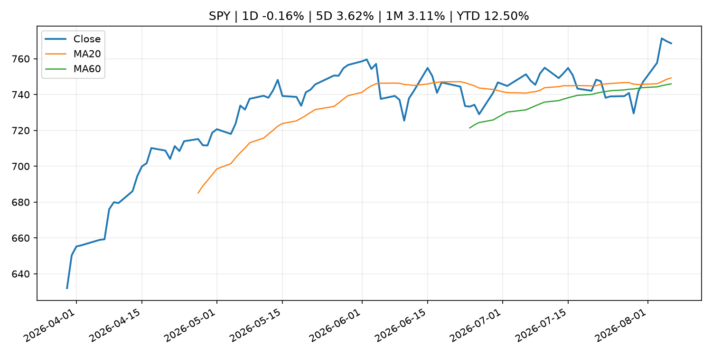
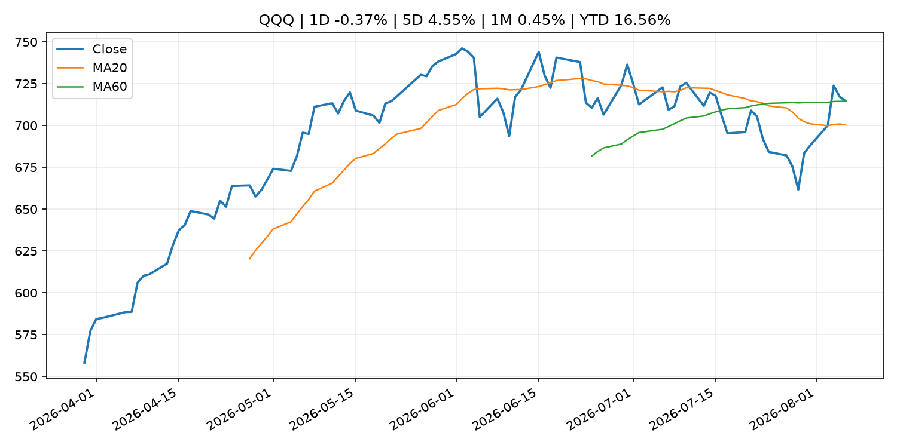
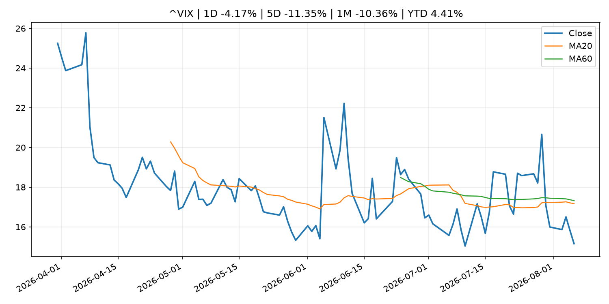
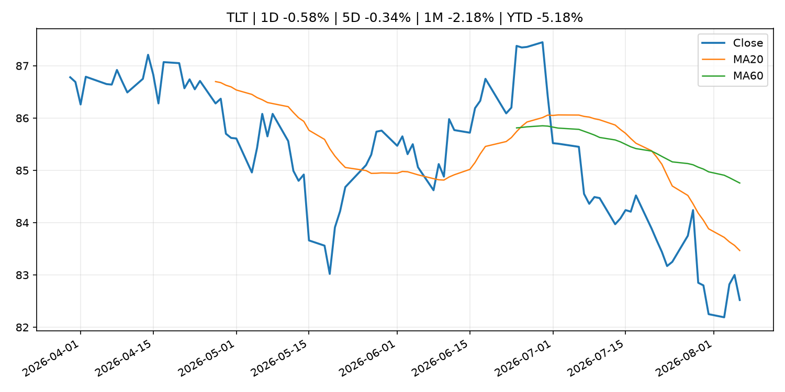
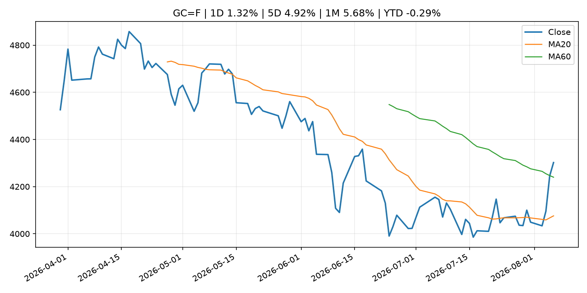
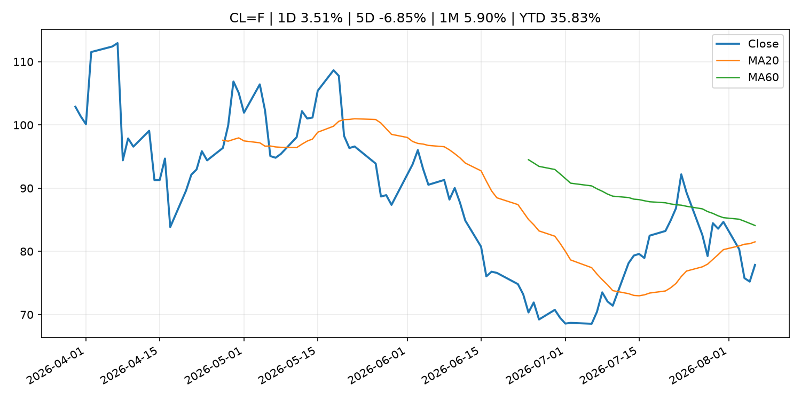
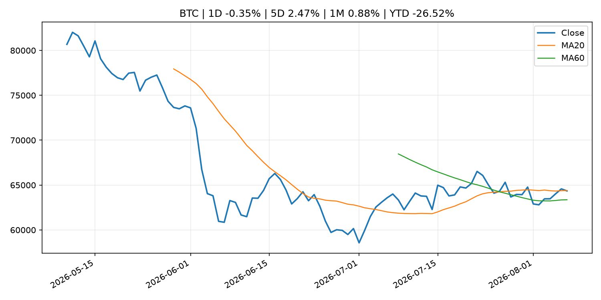
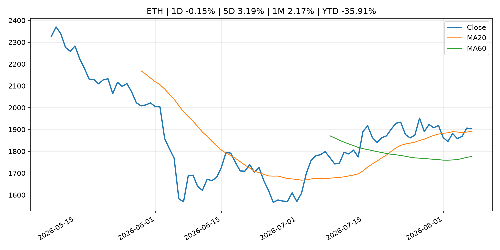
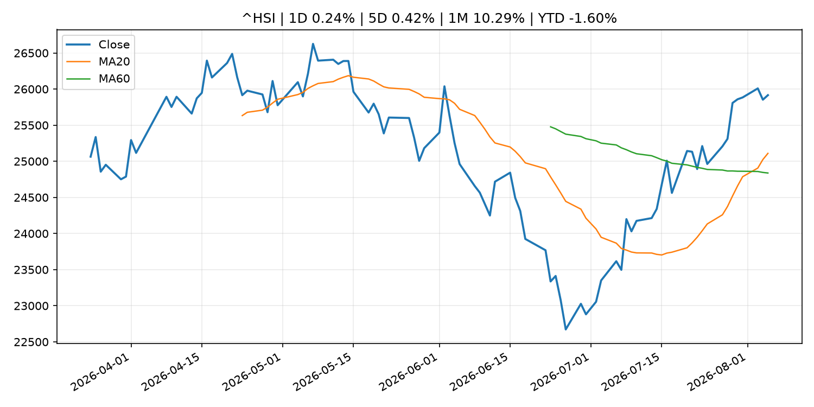

# Global Macro Morning Briefing - 2026-08-07

> Not financial advice / 非投资建议。

## 0. 今日总览
- 市场状态：unknown。市场信号不足，暂不判断明确状态。
- 今日三大主线：
  1. central_bank_decision: Fed Governor Cook says she's 'prepared to act' on rate hike to address inflation
  2. regulation: SEC Establishes Financial Reporting and Accounting Unit in Enforcement Division
  3. earnings: Trade Desk shares tumble on earnings miss and weak outlook
- 一句话结论：今日晨报重点关注：央行决策会重定价利率、汇率、久期资产和风险资产。；监管变化会改变行业盈利预期和资产风险溢价。。跨资产方面，SPY 1D -0.16%；QQQ 1D -0.37%；^VIX 1D -4.17%；TLT 1D -0.58%；GC=F 1D 1.32%；CL=F 1D 3.51%；BTC 1D -0.35%；ETH 1D -0.15%；市场信号不足，暂不判断明确状态。政策、通胀、利率、美元、美债、能源和加密监管仍是主要观察线索。所有结论仅基于公开数据与短摘要整理，不构成投资建议。

## 1. 隔夜跨资产市场
- 美股：SPY 1D -0.16%，QQQ 1D -0.37%，整体趋势需结合 VIX 和利率确认。
- 美债/美元：TLT 1D -0.58%，美元指数 1D 0.27%，是判断折现率压力的核心线索。
- 黄金/原油：黄金 1D 1.32%，原油 1D 3.51%，用于观察避险、通胀和地缘风险。
- 加密：BTC 1D -0.35%，ETH 1D -0.15%，关注是否独立于纳指走出加密自身行情。
- 港股/A股：恒生 1D 0.24%，沪深300/上证 1D n/a，重点看中国政策预期与人民币线索。
- 风险观察：关注后续数据是否确认当前跨资产信号。

### US_EQUITY

| symbol | latest close | 1D | 5D | 1M | YTD | trend |
|---|---:|---:|---:|---:|---:|---|
| SPY | 768.56 | -0.16% | 3.62% | 3.11% | 12.50% | strong_uptrend |
| QQQ | 714.65 | -0.37% | 4.55% | 0.45% | 16.56% | range_bound |
| DIA | 538.19 | -0.85% | 3.20% | 2.95% | 11.28% | uptrend |
| IWM | 298.25 | -0.51% | 1.93% | 1.63% | 19.89% | uptrend |
| VTI | 379.07 | -0.15% | 3.49% | 2.94% | 12.71% | uptrend |

### US_MACRO_MARKET

| symbol | latest close | 1D | 5D | 1M | YTD | trend |
|---|---:|---:|---:|---:|---:|---|
| ^VIX | 15.15 | -4.17% | -11.35% | -10.36% | 4.41% | strong_downtrend |
| DX-Y.NYB | 99.96 | 0.27% | -0.05% | -1.08% | 1.57% | range_bound |
| TLT | 82.52 | -0.58% | -0.34% | -2.18% | -5.18% | downtrend |
| IEF | 92.95 | -0.39% | -0.28% | -0.60% | -3.26% | downtrend |

### COMMODITIES

| symbol | latest close | 1D | 5D | 1M | YTD | trend |
|---|---:|---:|---:|---:|---:|---|
| GC=F | 4,302.00 | 1.32% | 4.92% | 5.68% | -0.29% | range_bound |
| SI=F | 61.87 | -0.38% | 5.19% | 6.36% | -12.32% | range_bound |
| CL=F | 77.86 | 3.51% | -6.85% | 5.90% | 35.83% | downtrend |
| BZ=F | 83.20 | n/a | n/a | n/a | n/a | range_bound |
| NG=F | 2.62 | -2.46% | -4.93% | -18.37% | -27.53% | strong_downtrend |
| HG=F | 6.72 | 0.22% | 4.24% | 10.95% | 19.10% | strong_uptrend |

### HK_MARKET

| symbol | latest close | 1D | 5D | 1M | YTD | trend |
|---|---:|---:|---:|---:|---:|---|
| ^HSI | 25,915.82 | 0.24% | 0.42% | 10.29% | -1.60% | strong_uptrend |
| 0700.HK | 479.20 | -2.64% | 1.57% | 0.08% | -23.08% | uptrend |
| 9988.HK | 124.40 | -2.89% | 11.27% | 15.72% | -16.51% | strong_uptrend |
| 3690.HK | 92.20 | -0.91% | -0.49% | 13.97% | -11.85% | strong_uptrend |
| 1810.HK | 26.86 | -2.82% | -13.47% | 6.17% | -33.32% | range_bound |
| 1211.HK | 89.85 | -4.21% | -5.22% | 4.66% | -9.01% | range_bound |

### CRYPTO

| symbol | latest close | 1D | 5D | 1M | YTD | trend |
|---|---:|---:|---:|---:|---:|---|
| BTC | 64,351.10 | -0.35% | 2.47% | 0.88% | -26.52% | range_bound |
| ETH | 1,903.44 | -0.15% | 3.19% | 2.17% | -35.91% | uptrend |
| SOLANA | 72.66 | -1.82% | 1.06% | -3.47% | -41.65% | range_bound |
| BINANCECOIN | 593.13 | -0.08% | 3.18% | 3.67% | -31.25% | range_bound |
| RIPPLE | 1.04 | -2.23% | -2.23% | -4.53% | -43.65% | strong_downtrend |

## 2. 今日最重要的 10 条新闻
### 1. Fed Governor Cook says she's 'prepared to act' on rate hike to address inflation
- 来源：CNBC Economy
- 时间：2026-08-05T20:36:16+00:00
- 地区：US
- 事件类型：central_bank_decision
- 重要性层级：Tier 1
- 一句话摘要：Cook was part of a 9-3 majority that voted last week to keep the central bank's benchmark borrowing rate in a range between 3.5%-3.75%.
- 为什么重要：央行决策会重定价利率、汇率、久期资产和风险资产。
- 可能影响：主要影响 DXY，方向为 positive，强度 high；通胀压力可能推高政策利率预期并支撑美元。
  - 资产：DXY
    方向：positive
    强度：high
    原因：通胀压力可能推高政策利率预期并支撑美元。
  - 资产：TLT
    方向：negative
    强度：high
    原因：通胀上行通常推升收益率、压低长债价格。
  - 资产：QQQ
    方向：negative
    强度：high
    原因：更高利率对成长股估值折现率不利。
  - 资产：SPY
    方向：mixed
    强度：medium
    原因：名义增长可能支撑收入，但更高利率压制估值。
  - 资产：GC=F
    方向：mixed
    强度：medium
    原因：通胀对黄金是支撑，但实际利率上行会形成压力。
  - 资产：BTC
    方向：negative
    强度：high
    原因：流动性收紧通常压制高 beta 加密资产。
- 原文链接：[https://www.cnbc.com/2026/08/05/fed-governor-cook-says-shes-prepared-to-act-on-rate-hike-to-address-inflation.html](https://www.cnbc.com/2026/08/05/fed-governor-cook-says-shes-prepared-to-act-on-rate-hike-to-address-inflation.html)

### 2. SEC Establishes Financial Reporting and Accounting Unit in Enforcement Division
- 来源：SEC Press Releases
- 时间：2026-08-05T14:30:00-04:00
- 地区：US
- 事件类型：regulation
- 重要性层级：Tier 2
- 一句话摘要：The Securities and Exchange Commission today announced it is establishing a new specialized unit within the Division of Enforcement to provide the dedicated expertise, focus, and capacity to pursue accounting and financial reporting fraud cases as well…
- 为什么重要：监管变化会改变行业盈利预期和资产风险溢价。
- 可能影响：主要影响 BTC，方向为 mixed，强度 high；加密监管或 ETF 进展会改变 BTC 的资金流和风险溢价。
  - 资产：BTC
    方向：mixed
    强度：high
    原因：加密监管或 ETF 进展会改变 BTC 的资金流和风险溢价。
  - 资产：ETH
    方向：mixed
    强度：high
    原因：监管框架会影响 ETH 产品化和机构参与度。
  - 资产：COIN
    方向：mixed
    强度：medium
    原因：监管清晰度和执法风险会影响交易平台估值。
  - 资产：crypto market
    方向：mixed
    强度：high
    原因：信息影响整个加密市场结构，但方向取决于细节。
- 原文链接：[https://www.sec.gov/newsroom/press-releases/2026-72-sec-establishes-financial-reporting-accounting-unit-enforcement-division](https://www.sec.gov/newsroom/press-releases/2026-72-sec-establishes-financial-reporting-accounting-unit-enforcement-division)

### 3. Trade Desk shares tumble on earnings miss and weak outlook
- 来源：MarketWatch Top Stories
- 时间：2026-08-06T22:59:00+00:00
- 地区：US
- 事件类型：earnings
- 重要性层级：Tier 2
- 一句话摘要：Trade Desk’s growth struggles deepened in the second quarter, as the company posted an earnings and revenue miss combined with disappointing guidance.
- 为什么重要：大型科技股盈利和资本开支会影响纳指、半导体和 AI 交易主线。
- 可能影响：可能影响利率、汇率、风险资产或大宗商品预期，但当前公开信息不足以判断明确方向。
  - 资产：暂无明确资产映射
  - 方向：unknown
  - 强度：low
  - 原因：公开信息不足以判断方向。
- 原文链接：[https://www.marketwatch.com/story/trade-desk-shares-tumble-on-earnings-miss-and-weak-outlook-9f4640e9?mod=mw_rss_topstories](https://www.marketwatch.com/story/trade-desk-shares-tumble-on-earnings-miss-and-weak-outlook-9f4640e9?mod=mw_rss_topstories)

### 4. Honeywell Aerospace lands in Wall Street’s ‘penalty box’ after gloomy guidance triggers 23% stock selloff
- 来源：MarketWatch Top Stories
- 时间：2026-08-06T20:41:00+00:00
- 地区：US
- 事件类型：earnings
- 重要性层级：Tier 2
- 一句话摘要：The newly minted Honeywell Aerospace stunned Wall Street only weeks into its life as a standalone company.
- 为什么重要：大型科技股盈利和资本开支会影响纳指、半导体和 AI 交易主线。
- 可能影响：可能影响利率、汇率、风险资产或大宗商品预期，但当前公开信息不足以判断明确方向。
  - 资产：暂无明确资产映射
  - 方向：unknown
  - 强度：low
  - 原因：公开信息不足以判断方向。
- 原文链接：[https://www.marketwatch.com/story/honeywell-aerospace-lands-in-wall-streets-penalty-box-after-gloomy-guidance-triggers-21-stock-selloff-ea8b032c?mod=mw_rss_topstories](https://www.marketwatch.com/story/honeywell-aerospace-lands-in-wall-streets-penalty-box-after-gloomy-guidance-triggers-21-stock-selloff-ea8b032c?mod=mw_rss_topstories)

### 5. How to use options to trade stocks around an earnings announcement
- 来源：MarketWatch Top Stories
- 时间：2026-08-06T20:37:00+00:00
- 地区：US
- 事件类型：earnings
- 重要性层级：Tier 2
- 一句话摘要：What volatility measures are saying about the S&P 500’s rally to record highs.
- 为什么重要：大型科技股盈利和资本开支会影响纳指、半导体和 AI 交易主线。
- 可能影响：可能影响利率、汇率、风险资产或大宗商品预期，但当前公开信息不足以判断明确方向。
  - 资产：暂无明确资产映射
  - 方向：unknown
  - 强度：low
  - 原因：公开信息不足以判断方向。
- 原文链接：[https://www.marketwatch.com/story/how-to-use-options-to-trade-stocks-around-an-earnings-announcement-e1ba7920?mod=mw_rss_topstories](https://www.marketwatch.com/story/how-to-use-options-to-trade-stocks-around-an-earnings-announcement-e1ba7920?mod=mw_rss_topstories)

### 6. Gold prices are breaking higher after a tough stretch. Could fresh records be within reach?
- 来源：MarketWatch Top Stories
- 时间：2026-08-06T20:57:00+00:00
- 地区：US
- 事件类型：other
- 重要性层级：Tier 3
- 一句话摘要：Gold miners’ stocks can offer a high-quality play for investors worried about inflation and the Fed.
- 为什么重要：这条信息暂未匹配到重大宏观、政策或市场事件，更适合作为背景跟踪。
- 可能影响：主要影响 DXY，方向为 positive，强度 high；通胀压力可能推高政策利率预期并支撑美元。
  - 资产：DXY
    方向：positive
    强度：high
    原因：通胀压力可能推高政策利率预期并支撑美元。
  - 资产：TLT
    方向：negative
    强度：high
    原因：通胀上行通常推升收益率、压低长债价格。
  - 资产：QQQ
    方向：negative
    强度：high
    原因：更高利率对成长股估值折现率不利。
  - 资产：SPY
    方向：mixed
    强度：medium
    原因：名义增长可能支撑收入，但更高利率压制估值。
  - 资产：GC=F
    方向：mixed
    强度：medium
    原因：通胀对黄金是支撑，但实际利率上行会形成压力。
  - 资产：BTC
    方向：mixed
    强度：medium
    原因：抗通胀叙事和流动性收紧可能相互抵消。
- 原文链接：[https://www.marketwatch.com/story/gold-prices-are-breaking-higher-after-a-tough-stretch-could-fresh-records-be-within-reach-1e1a872f?mod=mw_rss_topstories](https://www.marketwatch.com/story/gold-prices-are-breaking-higher-after-a-tough-stretch-could-fresh-records-be-within-reach-1e1a872f?mod=mw_rss_topstories)

### 7. JPMorgan says Hyperliquid ETF inflows have stalled as competition mounts
- 来源：CoinDesk
- 时间：2026-08-06T12:46:42+00:00
- 地区：global
- 事件类型：other
- 重要性层级：Tier 3
- 一句话摘要：JPMorgan says Hyperliquid ETF inflows have stalled as competition mounts
- 为什么重要：这条信息暂未匹配到重大宏观、政策或市场事件，更适合作为背景跟踪。
- 可能影响：主要影响 BTC，方向为 mixed，强度 high；加密监管或 ETF 进展会改变 BTC 的资金流和风险溢价。
  - 资产：BTC
    方向：mixed
    强度：high
    原因：加密监管或 ETF 进展会改变 BTC 的资金流和风险溢价。
  - 资产：ETH
    方向：mixed
    强度：high
    原因：监管框架会影响 ETH 产品化和机构参与度。
  - 资产：COIN
    方向：mixed
    强度：medium
    原因：监管清晰度和执法风险会影响交易平台估值。
  - 资产：crypto market
    方向：mixed
    强度：high
    原因：信息影响整个加密市场结构，但方向取决于细节。
- 原文链接：[https://www.coindesk.com/markets/2026/08/06/jpmorgan-says-hyperliquid-etf-inflows-have-stalled-as-competition-mounts](https://www.coindesk.com/markets/2026/08/06/jpmorgan-says-hyperliquid-etf-inflows-have-stalled-as-competition-mounts)

## 3. 政策与央行观察
### 1. Fed Governor Cook says she's 'prepared to act' on rate hike to address inflation
- 来源：CNBC Economy
- 时间：2026-08-05T20:36:16+00:00
- 地区：US
- 事件类型：central_bank_decision
- 重要性层级：Tier 1
- 一句话摘要：Cook was part of a 9-3 majority that voted last week to keep the central bank's benchmark borrowing rate in a range between 3.5%-3.75%.
- 为什么重要：央行决策会重定价利率、汇率、久期资产和风险资产。
- 可能影响：主要影响 DXY，方向为 positive，强度 high；通胀压力可能推高政策利率预期并支撑美元。
  - 资产：DXY
    方向：positive
    强度：high
    原因：通胀压力可能推高政策利率预期并支撑美元。
  - 资产：TLT
    方向：negative
    强度：high
    原因：通胀上行通常推升收益率、压低长债价格。
  - 资产：QQQ
    方向：negative
    强度：high
    原因：更高利率对成长股估值折现率不利。
  - 资产：SPY
    方向：mixed
    强度：medium
    原因：名义增长可能支撑收入，但更高利率压制估值。
  - 资产：GC=F
    方向：mixed
    强度：medium
    原因：通胀对黄金是支撑，但实际利率上行会形成压力。
  - 资产：BTC
    方向：negative
    强度：high
    原因：流动性收紧通常压制高 beta 加密资产。
- 原文链接：[https://www.cnbc.com/2026/08/05/fed-governor-cook-says-shes-prepared-to-act-on-rate-hike-to-address-inflation.html](https://www.cnbc.com/2026/08/05/fed-governor-cook-says-shes-prepared-to-act-on-rate-hike-to-address-inflation.html)

### 2. SEC Establishes Financial Reporting and Accounting Unit in Enforcement Division
- 来源：SEC Press Releases
- 时间：2026-08-05T14:30:00-04:00
- 地区：US
- 事件类型：regulation
- 重要性层级：Tier 2
- 一句话摘要：The Securities and Exchange Commission today announced it is establishing a new specialized unit within the Division of Enforcement to provide the dedicated expertise, focus, and capacity to pursue accounting and financial reporting fraud cases as well…
- 为什么重要：监管变化会改变行业盈利预期和资产风险溢价。
- 可能影响：主要影响 BTC，方向为 mixed，强度 high；加密监管或 ETF 进展会改变 BTC 的资金流和风险溢价。
  - 资产：BTC
    方向：mixed
    强度：high
    原因：加密监管或 ETF 进展会改变 BTC 的资金流和风险溢价。
  - 资产：ETH
    方向：mixed
    强度：high
    原因：监管框架会影响 ETH 产品化和机构参与度。
  - 资产：COIN
    方向：mixed
    强度：medium
    原因：监管清晰度和执法风险会影响交易平台估值。
  - 资产：crypto market
    方向：mixed
    强度：high
    原因：信息影响整个加密市场结构，但方向取决于细节。
- 原文链接：[https://www.sec.gov/newsroom/press-releases/2026-72-sec-establishes-financial-reporting-accounting-unit-enforcement-division](https://www.sec.gov/newsroom/press-releases/2026-72-sec-establishes-financial-reporting-accounting-unit-enforcement-division)

## 4. 市场异动与图表
- VIX 下跌 -4.17%
- TLT 下跌 -0.58%
- Gold 上涨 1.32%
- Oil 上涨 3.51%

### SPY

### QQQ

### ^VIX

### TLT

### GC=F

### CL=F

### BTC

### ETH

### ^HSI

## 5. 华尔街与机构公开观点
- 暂无可靠公开观点。

## 6. 今日重点关注
- 经济数据：经济数据：暂无可靠公开日历数据；如配置经济日历源后可自动填充。
- 央行讲话：央行讲话：暂无可靠公开日历数据；重点跟踪 Fed、ECB、BoJ、PBOC 官网 RSS。
- 财报：财报：暂无可靠数据。
- 政策事件：政策事件：暂无可靠数据。
- 风险提醒：风险提醒：关注数据源失败项、突发地缘风险、利率和美元的二阶反应。

## 7. 英文金融表达与宏观概念
- **inflation expectations**：通胀预期，指家庭、企业或市场对未来通胀的预估。 例句：Inflation expectations can shape wage bargaining and bond yields.
- **real yield**：实际收益率，名义利率扣除通胀预期后的收益率。 例句：Gold often reacts more to real yields than nominal yields.
- **terminal rate**：终端利率，市场预期本轮加息周期的最高政策利率。 例句：A higher terminal rate can pressure growth stocks.
- **market structure**：市场结构，指交易、托管、清算、ETF、监管等制度安排。 例句：Crypto market structure rules can affect institutional participation.
- **soft landing**：软着陆，指通胀回落而经济避免明显衰退。 例句：Markets often rally when data support a soft landing.
- **risk-off**：避险模式，资金偏向美元、国债、黄金等防御资产。 例句：A geopolitical shock can push markets into risk-off mode.

## 8. 背景材料
- [Social Security’s funding crisis is the elephant in the room. But don’t ignore the mouse.](https://www.marketwatch.com/story/if-social-securitys-funding-crisis-is-the-elephant-in-the-room-this-is-the-mouse-everyone-has-overlooked-you-have-been-warned-b95c450d?mod=mw_rss_topstories)（MarketWatch Top Stories，other）：No one knows what Congress will do if Social Security’s trust fund were actually to be depleted.
- [Market Operations by the Bank of Japan (July)](http://www.boj.or.jp/en/statistics/boj/fm/ope/m_release/2026/ope2607.xlsx)（Bank of Japan Announcements，other）：Market Operations by the Bank of Japan (July)
- [Monetary Base and the Bank of Japan's Transactions (July)](http://www.boj.or.jp/en/statistics/boj/other/mbt/mbt2607.pdf)（Bank of Japan Announcements，other）：Monetary Base and the Bank of Japan's Transactions (July)
- [Bank of Japan's Transactions with the Government (July)](http://www.boj.or.jp/en/statistics/boj/other/tseifu/release/2026/seifu2607.pdf)（Bank of Japan Announcements，other）：Bank of Japan's Transactions with the Government (July)
- [Gold prices are breaking higher after a tough stretch. Could fresh records be within reach?](https://www.marketwatch.com/story/gold-prices-are-breaking-higher-after-a-tough-stretch-could-fresh-records-be-within-reach-1e1a872f?mod=mw_rss_topstories)（MarketWatch Top Stories，other）：Gold miners’ stocks can offer a high-quality play for investors worried about inflation and the Fed.
- [How to wish Social Security a happy 91st birthday](https://www.marketwatch.com/story/how-to-wish-social-security-a-happy-91st-birthday-865d71a8?mod=mw_rss_topstories)（MarketWatch Top Stories，other）：Let’s all agree that, going forward, we’ll stop saying that Social Security will “run out of money” in 2032.
- [Tether expands tokenization business into Saudi Arabia, starting with real estate](https://www.coindesk.com/business/2026/08/06/tether-expands-tokenization-business-into-saudi-arabia-starting-with-real-estate)（CoinDesk，other）：Tether expands tokenization business into Saudi Arabia, starting with real estate
- [JPMorgan says Hyperliquid ETF inflows have stalled as competition mounts](https://www.coindesk.com/markets/2026/08/06/jpmorgan-says-hyperliquid-etf-inflows-have-stalled-as-competition-mounts)（CoinDesk，other）：JPMorgan says Hyperliquid ETF inflows have stalled as competition mounts
- [Bitcoin’s low volatility doesn’t necessarily mean low risk](https://www.coindesk.com/daybook-us/2026/08/06/bitcoin-s-low-volatility-doesn-t-necessarily-mean-low-risk)（CoinDesk，other）：Bitcoin’s low volatility doesn’t necessarily mean low risk
- [Why Sandisk and Western Digital crashed 10% and what it means for bitcoin](https://www.coindesk.com/markets/2026/08/06/why-sandisk-and-western-digital-crashed-10-and-what-it-means-for-bitcoin)（CoinDesk，other）：Why Sandisk and Western Digital crashed 10% and what it means for bitcoin
- [Bitcoin, ether benefit as traders seek safety of largest tokens](https://www.coindesk.com/markets/2026/08/06/bitcoin-ether-benefit-as-traders-seek-safety-of-largest-tokens)（CoinDesk，other）：Bitcoin, ether benefit as traders seek safety of largest tokens
- [Live updates: Bitcoin flatlines near $64,000 ahead of Friday's jobs report](https://www.coindesk.com/tech/2026/08/06/live-updates-bitcoin-nears-usd65-000-as-oil-inflation-hopes-keep-macro-bid-alive)（CoinDesk，other）：Live updates: Bitcoin flatlines near $64,000 ahead of Friday's jobs report
- [Bitcoin developers flag 85 critical bugs in an "extremely bad" situation](https://www.coindesk.com/tech/2026/08/06/bitcoin-developers-flag-85-critical-bugs-in-an-extremely-bad-situation)（CoinDesk，other）：Bitcoin developers flag 85 critical bugs in an "extremely bad" situation
- [S&P 500 added all of crypto's $2 trillion market cap in a month while bitcoin barely moved. Here's why](https://www.coindesk.com/markets/2026/08/06/s-and-p-500-has-added-crypto-s-usd2-trillion-market-cap-this-month-bitcoin-is-not-impressed-here-s-why)（CoinDesk，other）：S&P 500 added all of crypto's $2 trillion market cap in a month while bitcoin barely moved. Here's why
- [Bitcoin steadies above $64,000 as traders watch $100 billion SpaceX unlock](https://www.coindesk.com/markets/2026/08/06/bitcoin-steadies-above-usd64-000-as-traders-watch-usd100-billion-spacex-unlock)（CoinDesk，other）：Bitcoin steadies above $64,000 as traders watch $100 billion SpaceX unlock
- [Coldcard exploit could boost demand for regulated bitcoin exposure, analysts say](https://www.coindesk.com/tech/2026/08/05/coldcard-exploit-could-boost-demand-for-regulated-bitcoin-exposure-analysts-say)（CoinDesk，other）：Coldcard exploit could boost demand for regulated bitcoin exposure, analysts say
- [Crypto Long & Short: Putting the bitcoin sizing question to the test](https://www.coindesk.com/coindesk-indices/2026/08/05/crypto-long-and-short-putting-the-bitcoin-sizing-question-to-the-test)（CoinDesk，other）：Crypto Long & Short: Putting the bitcoin sizing question to the test
- [Strategy’s STRC rebounds 30% as company builds cash reserve, bitcoin price stabilizes](https://www.coindesk.com/markets/2026/08/05/strategy-s-strc-rebounds-30-as-company-builds-cash-reserve-bitcoin-price-stabilizes)（CoinDesk，other）：Strategy’s STRC rebounds 30% as company builds cash reserve, bitcoin price stabilizes

## 9. 数据源、失败项与免责声明
- 采集时间：2026-08-07T01:32:10
- 数据源：公开 RSS、Yahoo Finance、CoinGecko、AKShare、FRED、SEC data.sec.gov，以及用户自有 inputs/reports 文件。
- 合规说明：不绕过 WSJ、Bloomberg、FT、Reuters 等付费墙；对付费媒体只使用公开 RSS 标题、摘要、链接和发布时间。
- 免责声明：Not financial advice / 非投资建议。本项目仅供个人学习、研究和信息整理，不构成投资建议、交易建议或任何收益承诺。
- 失败或跳过的数据源：
  - crypto data failed coin=dogecoin
  - China market data failed symbol=上证指数: empty dataframe
  - China market data failed symbol=深证成指: empty dataframe
  - China market data failed symbol=创业板指: empty dataframe
  - China market data failed symbol=沪深300: empty dataframe
  - China market data failed symbol=中证500: empty dataframe
  - China market data failed symbol=科创50: empty dataframe
  - FRED_API_KEY not set; skipping FRED macro series
  - SEC failed cik=0000320193
  - SEC failed cik=0000789019
  - SEC failed cik=0001045810
  - SEC failed cik=0001318605
  - SEC failed cik=0001577552
