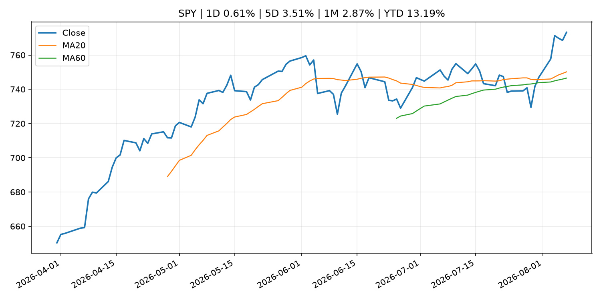
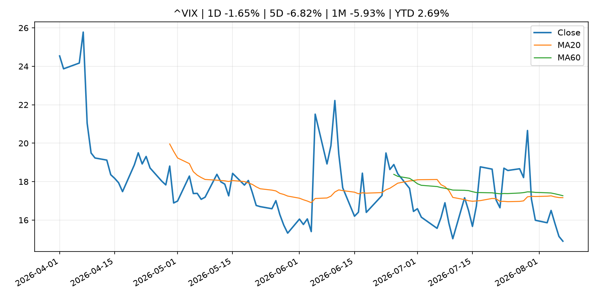
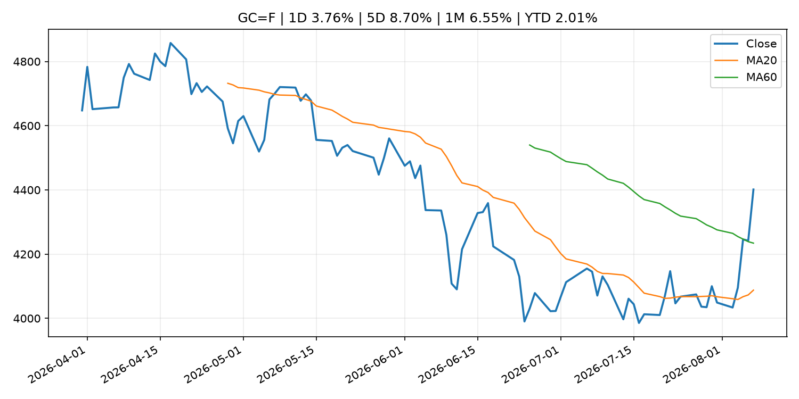
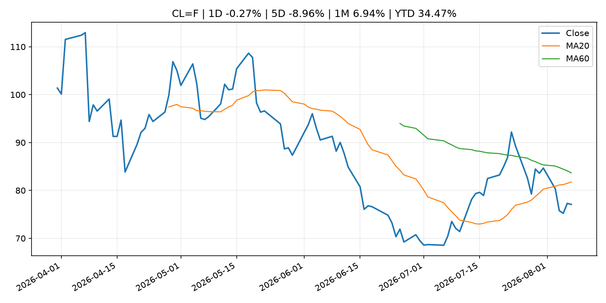
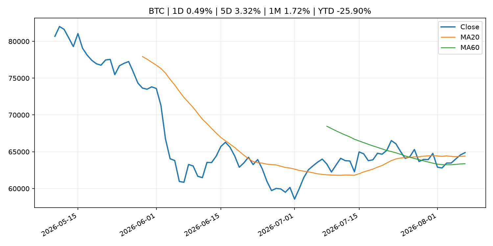
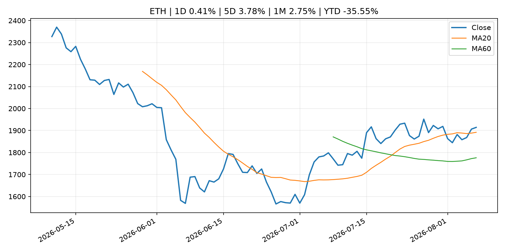
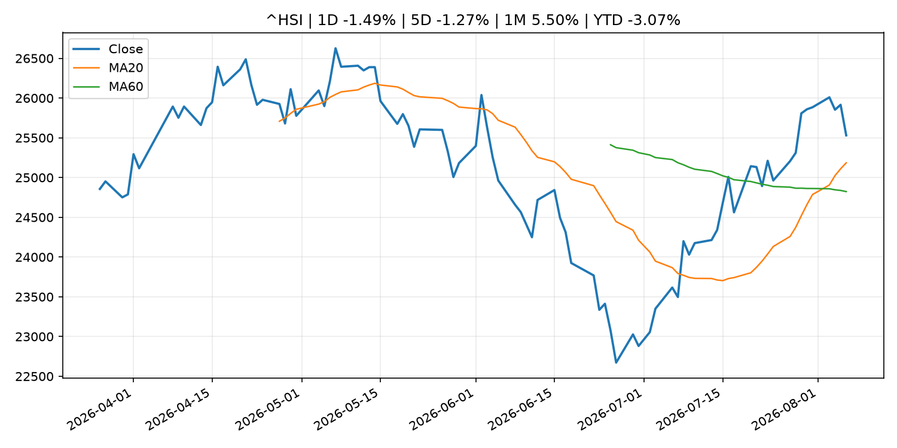

# Global Macro Morning Briefing - 2026-08-08

> Not financial advice / 非投资建议。

## 0. 今日总览
- 市场状态：risk_on。股指上涨、波动率或美元回落，市场更接近风险偏好改善。
- 今日三大主线：
  1. geopolitical_risk: Bitcoin hovers below $65,000 as Middle East tensions escalate further
  2. fiscal_policy: U.S. widens Iran crypto crackdown with sanctions on two exchanges
  3. regulation: Crypto market maker Wintermute lands SEC approval to trade equities and ETF blocks
- 一句话结论：今日晨报重点关注：地缘风险可能推升避险需求、能源价格和市场波动率。；财政和贸易政策会影响增长、通胀、企业利润和跨境资本流。。跨资产方面，SPY 1D 0.61%；QQQ 1D 1.17%；^VIX 1D -1.65%；TLT 1D 0.29%；GC=F 1D 3.76%；CL=F 1D -0.27%；BTC 1D 0.49%；ETH 1D 0.41%；股指上涨、波动率或美元回落，市场更接近风险偏好改善。政策、通胀、利率、美元、美债、能源和加密监管仍是主要观察线索。所有结论仅基于公开数据与短摘要整理，不构成投资建议。

## 1. 隔夜跨资产市场
- 美股：SPY 1D 0.61%，QQQ 1D 1.17%，整体趋势需结合 VIX 和利率确认。
- 美债/美元：TLT 1D 0.29%，美元指数 1D -0.37%，是判断折现率压力的核心线索。
- 黄金/原油：黄金 1D 3.76%，原油 1D -0.27%，用于观察避险、通胀和地缘风险。
- 加密：BTC 1D 0.49%，ETH 1D 0.41%，关注是否独立于纳指走出加密自身行情。
- 港股/A股：恒生 1D -1.49%，沪深300/上证 1D n/a，重点看中国政策预期与人民币线索。
- 风险观察：确认风险偏好是否扩散到小盘股、信用利差和周期品。

### US_EQUITY

| symbol | latest close | 1D | 5D | 1M | YTD | trend |
|---|---:|---:|---:|---:|---:|---|
| SPY | 773.26 | 0.61% | 3.51% | 2.87% | 13.19% | uptrend |
| QQQ | 723.03 | 1.17% | 5.09% | -0.03% | 17.93% | range_bound |
| DIA | 539.62 | 0.27% | 2.92% | 2.94% | 11.58% | uptrend |
| IWM | 301.56 | 1.11% | 3.56% | 1.45% | 21.22% | uptrend |
| VTI | 381.78 | 0.71% | 3.69% | 2.78% | 13.52% | uptrend |

### US_MACRO_MARKET

| symbol | latest close | 1D | 5D | 1M | YTD | trend |
|---|---:|---:|---:|---:|---:|---|
| ^VIX | 14.90 | -1.65% | -6.82% | -5.93% | 2.69% | strong_downtrend |
| DX-Y.NYB | 99.60 | -0.37% | -0.20% | -1.32% | 1.20% | range_bound |
| TLT | 82.76 | 0.29% | 0.62% | -2.05% | -4.91% | downtrend |
| IEF | 93.17 | 0.24% | 0.24% | -0.58% | -3.03% | downtrend |

### COMMODITIES

| symbol | latest close | 1D | 5D | 1M | YTD | trend |
|---|---:|---:|---:|---:|---:|---|
| GC=F | 4,401.30 | 3.76% | 8.70% | 6.55% | 2.01% | range_bound |
| SI=F | 63.80 | 3.84% | 10.78% | 5.67% | -9.58% | range_bound |
| CL=F | 77.08 | -0.27% | -8.96% | 6.94% | 34.47% | downtrend |
| BZ=F | 82.27 | -0.27% | -8.71% | 7.82% | 35.42% | downtrend |
| NG=F | 2.67 | 1.17% | -2.77% | -11.32% | -26.17% | strong_downtrend |
| HG=F | 6.59 | -1.53% | 2.32% | 5.95% | 16.76% | strong_uptrend |

### HK_MARKET

| symbol | latest close | 1D | 5D | 1M | YTD | trend |
|---|---:|---:|---:|---:|---:|---|
| ^HSI | 25,530.28 | -1.49% | -1.27% | 5.50% | -3.07% | strong_uptrend |
| 0700.HK | 478.80 | -0.08% | 0.76% | 1.96% | -23.15% | uptrend |
| 9988.HK | 123.80 | -0.48% | 5.81% | 14.63% | -16.91% | strong_uptrend |
| 3690.HK | 92.20 | 0.00% | -0.32% | 17.45% | -11.85% | strong_uptrend |
| 1810.HK | 27.06 | 0.74% | -5.98% | 8.24% | -32.82% | range_bound |
| 1211.HK | 90.15 | 0.33% | -4.25% | 9.07% | -8.71% | range_bound |

### CRYPTO

| symbol | latest close | 1D | 5D | 1M | YTD | trend |
|---|---:|---:|---:|---:|---:|---|
| BTC | 64,890.26 | 0.49% | 3.32% | 1.72% | -25.90% | uptrend |
| ETH | 1,914.27 | 0.41% | 3.78% | 2.75% | -35.55% | uptrend |
| SOLANA | 73.66 | -0.47% | 2.45% | -2.14% | -40.85% | range_bound |
| BINANCECOIN | 592.22 | -0.23% | 3.02% | 3.51% | -31.35% | range_bound |
| RIPPLE | 1.02 | -3.84% | -3.84% | -6.10% | -44.58% | strong_downtrend |
| DOGECOIN | 0.07 | -0.38% | 0.88% | -3.62% | -40.64% | downtrend |

## 2. 今日最重要的 10 条新闻
### 1. Bitcoin hovers below $65,000 as Middle East tensions escalate further
- 来源：CoinDesk
- 时间：2026-08-07T10:36:14+00:00
- 地区：global
- 事件类型：geopolitical_risk
- 重要性层级：Tier 1
- 一句话摘要：Bitcoin hovers below $65,000 as Middle East tensions escalate further
- 为什么重要：地缘风险可能推升避险需求、能源价格和市场波动率。
- 可能影响：主要影响 CL=F，方向为 positive，强度 high；供给扰动或 OPEC 减产通常推升 WTI 原油。
  - 资产：CL=F
    方向：positive
    强度：high
    原因：供给扰动或 OPEC 减产通常推升 WTI 原油。
  - 资产：BZ=F
    方向：positive
    强度：high
    原因：全球供给风险通常直接影响 Brent 原油。
  - 资产：SPY
    方向：mixed
    强度：medium
    原因：能源股可能受益，但通胀和成本压力不利于宽基风险资产。
- 原文链接：[https://www.coindesk.com/markets/2026/08/07/cmt](https://www.coindesk.com/markets/2026/08/07/cmt)

### 2. U.S. widens Iran crypto crackdown with sanctions on two exchanges
- 来源：CoinDesk
- 时间：2026-08-07T18:42:44+00:00
- 地区：global
- 事件类型：fiscal_policy
- 重要性层级：Tier 1
- 一句话摘要：U.S. widens Iran crypto crackdown with sanctions on two exchanges
- 为什么重要：财政和贸易政策会影响增长、通胀、企业利润和跨境资本流。
- 可能影响：可能影响利率、汇率、风险资产或大宗商品预期，但当前公开信息不足以判断明确方向。
  - 资产：暂无明确资产映射
  - 方向：unknown
  - 强度：low
  - 原因：公开信息不足以判断方向。
- 原文链接：[https://www.coindesk.com/policy/2026/08/07/u-s-widens-iran-crypto-crackdown-with-sanctions-on-two-exchanges](https://www.coindesk.com/policy/2026/08/07/u-s-widens-iran-crypto-crackdown-with-sanctions-on-two-exchanges)

### 3. Crypto market maker Wintermute lands SEC approval to trade equities and ETF blocks
- 来源：CoinDesk
- 时间：2026-08-07T08:46:17+00:00
- 地区：global
- 事件类型：regulation
- 重要性层级：Tier 2
- 一句话摘要：Crypto market maker Wintermute lands SEC approval to trade equities and ETF blocks
- 为什么重要：监管变化会改变行业盈利预期和资产风险溢价。
- 可能影响：主要影响 BTC，方向为 mixed，强度 high；加密监管或 ETF 进展会改变 BTC 的资金流和风险溢价。
  - 资产：BTC
    方向：mixed
    强度：high
    原因：加密监管或 ETF 进展会改变 BTC 的资金流和风险溢价。
  - 资产：ETH
    方向：mixed
    强度：high
    原因：监管框架会影响 ETH 产品化和机构参与度。
  - 资产：COIN
    方向：mixed
    强度：medium
    原因：监管清晰度和执法风险会影响交易平台估值。
  - 资产：crypto market
    方向：mixed
    强度：high
    原因：信息影响整个加密市场结构，但方向取决于细节。
- 原文链接：[https://www.coindesk.com/business/2026/08/07/wintermute-gains-u-s-broker-dealer-status-in-wall-street-push](https://www.coindesk.com/business/2026/08/07/wintermute-gains-u-s-broker-dealer-status-in-wall-street-push)

### 4. Trump is trying to fire Lisa Cook again. He still wants to stack the Fed with his allies.
- 来源：MarketWatch Top Stories
- 时间：2026-08-07T22:05:00+00:00
- 地区：US
- 事件类型：central_bank_speech
- 重要性层级：Tier 2
- 一句话摘要：Two months after he was blocked by the Supreme Court, President Donald Trump has resumed his effort to oust Federal Reserve governor Lisa Cook as part of an effort to stack the central bank’s board with more allies.
- 为什么重要：央行官员表态可能影响市场对下一次会议的定价。
- 可能影响：可能影响利率、汇率、风险资产或大宗商品预期，但当前公开信息不足以判断明确方向。
  - 资产：暂无明确资产映射
  - 方向：unknown
  - 强度：low
  - 原因：公开信息不足以判断方向。
- 原文链接：[https://www.marketwatch.com/story/trump-is-trying-to-fire-lisa-cook-again-he-still-wants-to-stack-the-fed-with-allies-e6f40aa5?mod=mw_rss_topstories](https://www.marketwatch.com/story/trump-is-trying-to-fire-lisa-cook-again-he-still-wants-to-stack-the-fed-with-allies-e6f40aa5?mod=mw_rss_topstories)

### 5. The smart way to invest in gold right now as the dollar slips
- 来源：MarketWatch Top Stories
- 时间：2026-08-07T21:58:00+00:00
- 地区：US
- 事件类型：other
- 重要性层级：Tier 3
- 一句话摘要：Also in Weekend Reads: Kevin O’Leary’s investing strategy, a 9% dividend paired with lower stock-market risk and advice from the Moneyist.
- 为什么重要：这条信息暂未匹配到重大宏观、政策或市场事件，更适合作为背景跟踪。
- 可能影响：更偏背景信息，短期市场影响可能有限。
  - 资产：暂无明确资产映射
  - 方向：unknown
  - 强度：low
  - 原因：公开信息不足以判断方向。
- 原文链接：[https://www.marketwatch.com/story/the-smart-way-to-invest-in-gold-right-now-as-the-dollar-slips-22fdf3b2?mod=mw_rss_topstories](https://www.marketwatch.com/story/the-smart-way-to-invest-in-gold-right-now-as-the-dollar-slips-22fdf3b2?mod=mw_rss_topstories)

### 6. Trump Media pulls back from crypto, scraps Crypto.com's CRO token treasury deal
- 来源：CoinDesk
- 时间：2026-08-07T21:13:21+00:00
- 地区：global
- 事件类型：other
- 重要性层级：Tier 3
- 一句话摘要：Trump Media pulls back from crypto, scraps Crypto.com's CRO token treasury deal
- 为什么重要：这条信息暂未匹配到重大宏观、政策或市场事件，更适合作为背景跟踪。
- 可能影响：更偏背景信息，短期市场影响可能有限。
  - 资产：暂无明确资产映射
  - 方向：unknown
  - 强度：low
  - 原因：公开信息不足以判断方向。
- 原文链接：[https://www.coindesk.com/business/2026/08/07/trump-media-pulls-back-from-crypto-scraps-crypto-com-cro-treasury-deal](https://www.coindesk.com/business/2026/08/07/trump-media-pulls-back-from-crypto-scraps-crypto-com-cro-treasury-deal)

## 3. 政策与央行观察
### 1. U.S. widens Iran crypto crackdown with sanctions on two exchanges
- 来源：CoinDesk
- 时间：2026-08-07T18:42:44+00:00
- 地区：global
- 事件类型：fiscal_policy
- 重要性层级：Tier 1
- 一句话摘要：U.S. widens Iran crypto crackdown with sanctions on two exchanges
- 为什么重要：财政和贸易政策会影响增长、通胀、企业利润和跨境资本流。
- 可能影响：可能影响利率、汇率、风险资产或大宗商品预期，但当前公开信息不足以判断明确方向。
  - 资产：暂无明确资产映射
  - 方向：unknown
  - 强度：low
  - 原因：公开信息不足以判断方向。
- 原文链接：[https://www.coindesk.com/policy/2026/08/07/u-s-widens-iran-crypto-crackdown-with-sanctions-on-two-exchanges](https://www.coindesk.com/policy/2026/08/07/u-s-widens-iran-crypto-crackdown-with-sanctions-on-two-exchanges)

### 2. Crypto market maker Wintermute lands SEC approval to trade equities and ETF blocks
- 来源：CoinDesk
- 时间：2026-08-07T08:46:17+00:00
- 地区：global
- 事件类型：regulation
- 重要性层级：Tier 2
- 一句话摘要：Crypto market maker Wintermute lands SEC approval to trade equities and ETF blocks
- 为什么重要：监管变化会改变行业盈利预期和资产风险溢价。
- 可能影响：主要影响 BTC，方向为 mixed，强度 high；加密监管或 ETF 进展会改变 BTC 的资金流和风险溢价。
  - 资产：BTC
    方向：mixed
    强度：high
    原因：加密监管或 ETF 进展会改变 BTC 的资金流和风险溢价。
  - 资产：ETH
    方向：mixed
    强度：high
    原因：监管框架会影响 ETH 产品化和机构参与度。
  - 资产：COIN
    方向：mixed
    强度：medium
    原因：监管清晰度和执法风险会影响交易平台估值。
  - 资产：crypto market
    方向：mixed
    强度：high
    原因：信息影响整个加密市场结构，但方向取决于细节。
- 原文链接：[https://www.coindesk.com/business/2026/08/07/wintermute-gains-u-s-broker-dealer-status-in-wall-street-push](https://www.coindesk.com/business/2026/08/07/wintermute-gains-u-s-broker-dealer-status-in-wall-street-push)

### 3. Trump is trying to fire Lisa Cook again. He still wants to stack the Fed with his allies.
- 来源：MarketWatch Top Stories
- 时间：2026-08-07T22:05:00+00:00
- 地区：US
- 事件类型：central_bank_speech
- 重要性层级：Tier 2
- 一句话摘要：Two months after he was blocked by the Supreme Court, President Donald Trump has resumed his effort to oust Federal Reserve governor Lisa Cook as part of an effort to stack the central bank’s board with more allies.
- 为什么重要：央行官员表态可能影响市场对下一次会议的定价。
- 可能影响：可能影响利率、汇率、风险资产或大宗商品预期，但当前公开信息不足以判断明确方向。
  - 资产：暂无明确资产映射
  - 方向：unknown
  - 强度：low
  - 原因：公开信息不足以判断方向。
- 原文链接：[https://www.marketwatch.com/story/trump-is-trying-to-fire-lisa-cook-again-he-still-wants-to-stack-the-fed-with-allies-e6f40aa5?mod=mw_rss_topstories](https://www.marketwatch.com/story/trump-is-trying-to-fire-lisa-cook-again-he-still-wants-to-stack-the-fed-with-allies-e6f40aa5?mod=mw_rss_topstories)

## 4. 市场异动与图表
- SPY 上涨 0.61%
- QQQ 上涨 1.17%
- DXY 下跌 -0.37%
- Gold 上涨 3.76%

### SPY

### QQQ

### ^VIX

### TLT

### GC=F

### CL=F

### BTC

### ETH

### ^HSI

## 5. 华尔街与机构公开观点
- 暂无可靠公开观点。

## 6. 今日重点关注
- 经济数据：经济数据：暂无可靠公开日历数据；如配置经济日历源后可自动填充。
- 央行讲话：央行讲话：暂无可靠公开日历数据；重点跟踪 Fed、ECB、BoJ、PBOC 官网 RSS。
- 财报：财报：暂无可靠数据。
- 政策事件：政策事件：暂无可靠数据。
- 风险提醒：风险提醒：关注数据源失败项、突发地缘风险、利率和美元的二阶反应。

## 7. 英文金融表达与宏观概念
- **real yield**：实际收益率，名义利率扣除通胀预期后的收益率。 例句：Gold often reacts more to real yields than nominal yields.
- **risk-off**：避险模式，资金偏向美元、国债、黄金等防御资产。 例句：A geopolitical shock can push markets into risk-off mode.
- **supply disruption**：供给扰动，通常指能源或商品供应受冲突、减产或天气影响。 例句：Supply disruption can lift oil prices and inflation expectations.
- **market structure**：市场结构，指交易、托管、清算、ETF、监管等制度安排。 例句：Crypto market structure rules can affect institutional participation.
- **inflation expectations**：通胀预期，指家庭、企业或市场对未来通胀的预估。 例句：Inflation expectations can shape wage bargaining and bond yields.
- **terminal rate**：终端利率，市场预期本轮加息周期的最高政策利率。 例句：A higher terminal rate can pressure growth stocks.

## 8. 背景材料
- [The smart way to invest in gold right now as the dollar slips](https://www.marketwatch.com/story/the-smart-way-to-invest-in-gold-right-now-as-the-dollar-slips-22fdf3b2?mod=mw_rss_topstories)（MarketWatch Top Stories，other）：Also in Weekend Reads: Kevin O’Leary’s investing strategy, a 9% dividend paired with lower stock-market risk and advice from the Moneyist.
- [Trump Media pulls back from crypto, scraps Crypto.com's CRO token treasury deal](https://www.coindesk.com/business/2026/08/07/trump-media-pulls-back-from-crypto-scraps-crypto-com-cro-treasury-deal)（CoinDesk，other）：Trump Media pulls back from crypto, scraps Crypto.com's CRO token treasury deal
- [Should wealthier Americans forgo their Social Security benefits as a charitable gesture?](https://www.marketwatch.com/story/should-wealthier-americans-forgo-their-social-security-benefits-as-a-charitable-gesture-2c7b6801?mod=mw_rss_topstories)（MarketWatch Top Stories，other）：A reader writes: “I will likely be in a position to decline my benefits.”
- [Trump-Backed American Bitcoin director Justin Mateen buys nearly $2 million of ABTC stock](https://www.coindesk.com/business/2026/08/07/trump-backed-american-bitcoin-director-justin-mateen-buys-nearly-usd2-million-of-abtc-stock)（CoinDesk，other）：Trump-Backed American Bitcoin director Justin Mateen buys nearly $2 million of ABTC stock
- [Bybit sues North Korea and Lazarus Group over $1.5 billion hack, secures asset freeze](https://www.coindesk.com/policy/2026/08/07/bybit-sues-north-korea-and-lazarus-group-over-usd1-5-billion-hack-secures-asset-freeze)（CoinDesk，other）：Bybit sues North Korea and Lazarus Group over $1.5 billion hack, secures asset freeze
- [OKX's Rafique doubts Clarity Act will pass, warns optimism is already priced into bitcoin](https://www.coindesk.com/policy/2026/08/04/okx-s-rafique-doubts-clarity-act-will-pass-warns-optimism-is-already-priced-into-bitcoin)（CoinDesk，other）：OKX's Rafique doubts Clarity Act will pass, warns optimism is already priced into bitcoin
- [How a five-second trick let traders drain millions from Polymarket](https://www.coindesk.com/business/2026/08/07/how-a-five-second-trick-let-traders-drain-millions-from-polymarket)（CoinDesk，other）：How a five-second trick let traders drain millions from Polymarket
- [U.S. unexpectedly shed 23,000 jobs in July, putting Fed rate hikes in question](https://www.coindesk.com/markets/2026/08/07/the-u-s-lost-23-000-jobs-in-july-far-shy-of-forecasts-for-a-gain-of-80-000)（CoinDesk，other）：U.S. unexpectedly shed 23,000 jobs in July, putting Fed rate hikes in question
- [Why Bitcoin's BIP-110 refuses to die despite near-zero miner support](https://www.coindesk.com/tech/2026/08/06/why-bitcoin-s-bip-110-refuses-to-die-despite-near-zero-miner-support)（CoinDesk，other）：Why Bitcoin's BIP-110 refuses to die despite near-zero miner support
- [Bitcoin’s volatility has nearly disappeared. The risk hasn’t.](https://www.coindesk.com/daybook-us/2026/08/07/bitcoin-s-volatility-has-nearly-disappeared-the-risk-hasn-t)（CoinDesk，other）：Bitcoin’s volatility has nearly disappeared. The risk hasn’t.
- [Coldcard fallout shows up onchain as 210,000 bitcoin leaves old wallets](https://www.coindesk.com/markets/2026/08/07/coldcard-fallout-shows-up-onchain-as-210-000-bitcoin-leaves-old-wallets)（CoinDesk，other）：Coldcard fallout shows up onchain as 210,000 bitcoin leaves old wallets
- [ECB publishes consolidated banking data for end-March 2026](https://www.ecb.europa.eu//press/pr/date/2026/html/ecb.pr260807~58eb5109ce.en.html)（ECB Press Releases，other）：ECB publishes consolidated banking data for end-March 2026
- [Live updates: 'This can't last forever': Mulling bitcoin's lame price action as risk markets rally](https://www.coindesk.com/markets/2026/08/07/live-updates-bitcoin-flat-at-usd64-300-before-us-jobs-report-with-oil-back-as-a-headwind)（CoinDesk，other）：Live updates: 'This can't last forever': Mulling bitcoin's lame price action as risk markets rally
- [Amounts Outstanding in the Call Money Market (July)](http://www.boj.or.jp/en/statistics/market/short/call/call.xlsx)（Bank of Japan Announcements，other）：Amounts Outstanding in the Call Money Market (July)
- [Bitcoin whales load up on $1.2 billion in BTC as ETFs attract $750 million](https://www.coindesk.com/markets/2026/08/07/bitcoin-whales-load-up-on-usd1-2-billion-in-btc-as-etfs-attract-usd750-million)（CoinDesk，other）：Bitcoin whales load up on $1.2 billion in BTC as ETFs attract $750 million
- [Consumption Activity Index](http://www.boj.or.jp/en/research/research_data/cai/index.htm)（Bank of Japan Announcements，other）：Consumption Activity Index
- [Bitcoin wallet dormant since 2011 moves $3.2 million toward FalconX-linked address](https://www.coindesk.com/markets/2026/08/07/bitcoin-wallet-dormant-since-2011-moves-usd3-2-million-toward-falconx-linked-address)（CoinDesk，other）：Bitcoin wallet dormant since 2011 moves $3.2 million toward FalconX-linked address
- [A bitcoin pattern taking shape right now could send prices soaring to $76,000](https://www.coindesk.com/markets/2026/08/07/a-case-for-a-bitcoin-surge-to-usd76-000-may-be-building-beneath-the-boring-price-action-but-there-s-a-caveat)（CoinDesk，other）：A bitcoin pattern taking shape right now could send prices soaring to $76,000
- [Market Operations by the Bank of Japan (July)](http://www.boj.or.jp/en/statistics/boj/fm/ope/m_release/2026/ope2607.xlsx)（Bank of Japan Announcements，other）：Market Operations by the Bank of Japan (July)
- [Monetary Base and the Bank of Japan's Transactions (July)](http://www.boj.or.jp/en/statistics/boj/other/mbt/mbt2607.pdf)（Bank of Japan Announcements，other）：Monetary Base and the Bank of Japan's Transactions (July)

## 9. 数据源、失败项与免责声明
- 采集时间：2026-08-07T22:32:31
- 数据源：公开 RSS、Yahoo Finance、CoinGecko、AKShare、FRED、SEC data.sec.gov，以及用户自有 inputs/reports 文件。
- 合规说明：不绕过 WSJ、Bloomberg、FT、Reuters 等付费墙；对付费媒体只使用公开 RSS 标题、摘要、链接和发布时间。
- 免责声明：Not financial advice / 非投资建议。本项目仅供个人学习、研究和信息整理，不构成投资建议、交易建议或任何收益承诺。
- 失败或跳过的数据源：
  - China market data failed symbol=上证指数: empty dataframe
  - China market data failed symbol=深证成指: empty dataframe
  - China market data failed symbol=创业板指: empty dataframe
  - China market data failed symbol=沪深300: empty dataframe
  - China market data failed symbol=中证500: empty dataframe
  - China market data failed symbol=科创50: empty dataframe
  - FRED_API_KEY not set; skipping FRED macro series
  - SEC failed cik=0000320193
  - SEC failed cik=0000789019
  - SEC failed cik=0001045810
  - SEC failed cik=0001318605
  - SEC failed cik=0001577552
