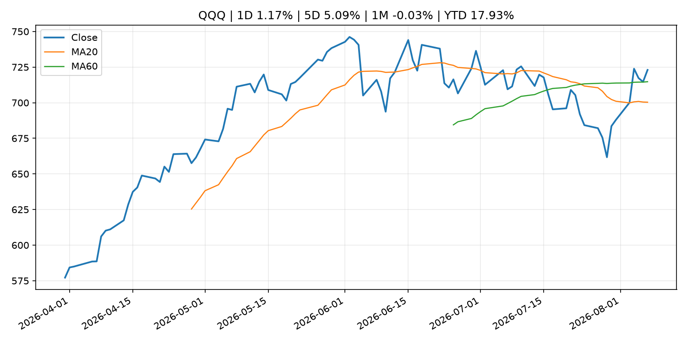
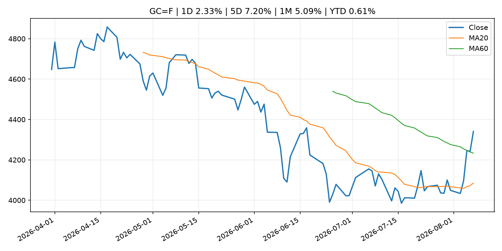
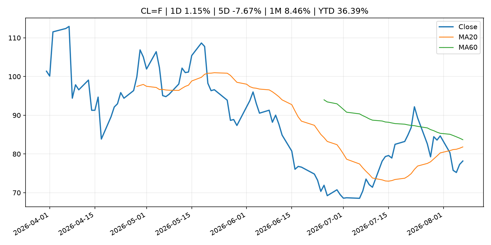
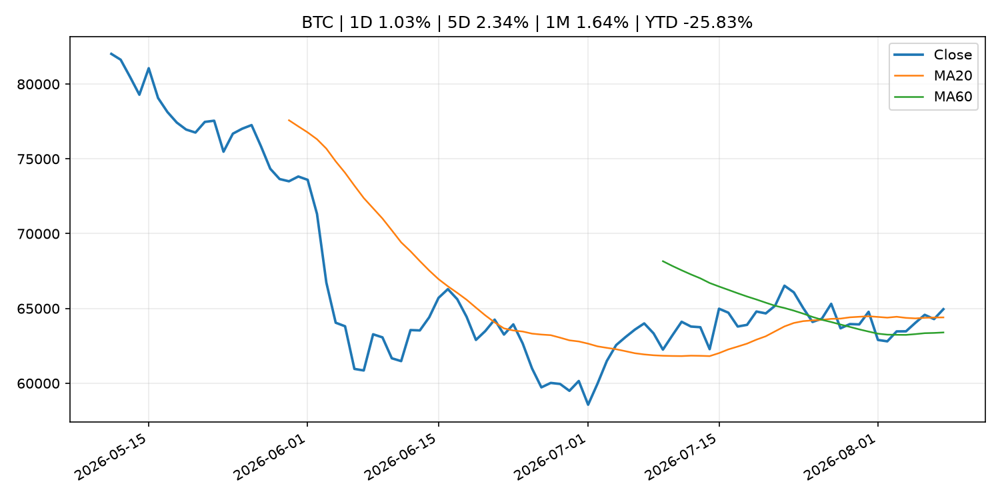
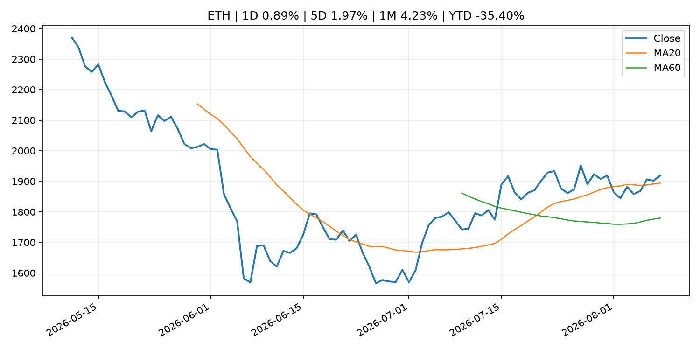

# Global Macro Morning Briefing - 2026-08-09

> Not financial advice / 非投资建议。

## 0. 今日总览
- 市场状态：risk_on。股指上涨、波动率或美元回落，市场更接近风险偏好改善。
- 今日三大主线：
  1. geopolitical_risk: Bitcoin hovers below $65,000 as Middle East tensions escalate further
  2. fiscal_policy: U.S. widens Iran crypto crackdown with sanctions on two exchanges
  3. regulation: Crypto market maker Wintermute lands SEC approval to trade equities and ETF blocks
- 一句话结论：今日晨报重点关注：地缘风险可能推升避险需求、能源价格和市场波动率。；财政和贸易政策会影响增长、通胀、企业利润和跨境资本流。。跨资产方面，SPY 1D 0.61%；QQQ 1D 1.17%；^VIX 1D -1.65%；TLT 1D 0.29%；GC=F 1D 2.33%；CL=F 1D 1.15%；BTC 1D 1.03%；ETH 1D 0.89%；股指上涨、波动率或美元回落，市场更接近风险偏好改善。政策、通胀、利率、美元、美债、能源和加密监管仍是主要观察线索。所有结论仅基于公开数据与短摘要整理，不构成投资建议。

## 1. 隔夜跨资产市场
- 美股：SPY 1D 0.61%，QQQ 1D 1.17%，整体趋势需结合 VIX 和利率确认。
- 美债/美元：TLT 1D 0.29%，美元指数 1D -0.37%，是判断折现率压力的核心线索。
- 黄金/原油：黄金 1D 2.33%，原油 1D 1.15%，用于观察避险、通胀和地缘风险。
- 加密：BTC 1D 1.03%，ETH 1D 0.89%，关注是否独立于纳指走出加密自身行情。
- 港股/A股：恒生 1D 0.54%，沪深300/上证 1D n/a，重点看中国政策预期与人民币线索。
- 风险观察：确认风险偏好是否扩散到小盘股、信用利差和周期品。

### US_EQUITY

| symbol | latest close | 1D | 5D | 1M | YTD | trend |
|---|---:|---:|---:|---:|---:|---|
| SPY | 773.26 | 0.61% | 3.51% | 2.87% | 13.19% | uptrend |
| QQQ | 723.03 | 1.17% | 5.09% | -0.03% | 17.93% | range_bound |
| DIA | 539.62 | 0.27% | 2.92% | 2.94% | 11.58% | uptrend |
| IWM | 301.56 | 1.11% | 3.56% | 1.45% | 21.22% | uptrend |
| VTI | 381.78 | 0.71% | 3.69% | 2.78% | 13.52% | uptrend |

### US_MACRO_MARKET

| symbol | latest close | 1D | 5D | 1M | YTD | trend |
|---|---:|---:|---:|---:|---:|---|
| ^VIX | 14.90 | -1.65% | -6.82% | -5.93% | 2.69% | strong_downtrend |
| DX-Y.NYB | 99.60 | -0.37% | -0.20% | -1.33% | 1.20% | range_bound |
| TLT | 82.76 | 0.29% | 0.62% | -2.05% | -4.91% | downtrend |
| IEF | 93.17 | 0.24% | 0.24% | -0.58% | -3.03% | downtrend |

### COMMODITIES

| symbol | latest close | 1D | 5D | 1M | YTD | trend |
|---|---:|---:|---:|---:|---:|---|
| GC=F | 4,340.70 | 2.33% | 7.20% | 5.09% | 0.61% | range_bound |
| SI=F | 63.33 | 3.08% | 9.97% | 4.89% | -10.24% | range_bound |
| CL=F | 78.18 | 1.15% | -7.67% | 8.46% | 36.39% | downtrend |
| BZ=F | 83.55 | 1.29% | -7.29% | 9.50% | 37.53% | downtrend |
| NG=F | 2.66 | 0.83% | -3.09% | -11.62% | -26.42% | strong_downtrend |
| HG=F | 6.57 | -1.74% | 2.09% | 5.72% | 16.50% | strong_uptrend |

### HK_MARKET

| symbol | latest close | 1D | 5D | 1M | YTD | trend |
|---|---:|---:|---:|---:|---:|---|
| ^HSI | 25,668.03 | 0.54% | -0.84% | 6.82% | -2.55% | strong_uptrend |
| 0700.HK | 478.80 | -0.08% | 0.76% | 1.96% | -23.15% | uptrend |
| 9988.HK | 123.80 | -0.48% | 5.81% | 14.63% | -16.91% | strong_uptrend |
| 3690.HK | 92.20 | 0.00% | -0.32% | 17.45% | -11.85% | strong_uptrend |
| 1810.HK | 27.06 | 0.74% | -5.98% | 8.24% | -32.82% | range_bound |
| 1211.HK | 90.15 | 0.33% | -4.25% | 9.07% | -8.71% | range_bound |

### CRYPTO

| symbol | latest close | 1D | 5D | 1M | YTD | trend |
|---|---:|---:|---:|---:|---:|---|
| BTC | 64,952.54 | 1.03% | 2.34% | 1.64% | -25.83% | uptrend |
| ETH | 1,918.71 | 0.89% | 1.97% | 4.23% | -35.40% | strong_uptrend |
| SOLANA | 76.18 | 4.84% | 3.66% | 1.58% | -38.82% | uptrend |
| BINANCECOIN | 599.24 | 1.14% | 2.08% | 5.54% | -30.54% | strong_uptrend |
| RIPPLE | 1.04 | 0.66% | -4.09% | -4.37% | -43.44% | strong_downtrend |

## 2. 今日最重要的 10 条新闻
### 1. Bitcoin hovers below $65,000 as Middle East tensions escalate further
- 来源：CoinDesk
- 时间：2026-08-07T10:36:14+00:00
- 地区：global
- 事件类型：geopolitical_risk
- 重要性层级：Tier 1
- 一句话摘要：Bitcoin hovers below $65,000 as Middle East tensions escalate further
- 为什么重要：地缘风险可能推升避险需求、能源价格和市场波动率。
- 可能影响：主要影响 CL=F，方向为 positive，强度 high；供给扰动或 OPEC 减产通常推升 WTI 原油。
  - 资产：CL=F
    方向：positive
    强度：high
    原因：供给扰动或 OPEC 减产通常推升 WTI 原油。
  - 资产：BZ=F
    方向：positive
    强度：high
    原因：全球供给风险通常直接影响 Brent 原油。
  - 资产：SPY
    方向：mixed
    强度：medium
    原因：能源股可能受益，但通胀和成本压力不利于宽基风险资产。
- 原文链接：[https://www.coindesk.com/markets/2026/08/07/cmt](https://www.coindesk.com/markets/2026/08/07/cmt)

### 2. U.S. widens Iran crypto crackdown with sanctions on two exchanges
- 来源：CoinDesk
- 时间：2026-08-07T18:42:44+00:00
- 地区：global
- 事件类型：fiscal_policy
- 重要性层级：Tier 1
- 一句话摘要：U.S. widens Iran crypto crackdown with sanctions on two exchanges
- 为什么重要：财政和贸易政策会影响增长、通胀、企业利润和跨境资本流。
- 可能影响：可能影响利率、汇率、风险资产或大宗商品预期，但当前公开信息不足以判断明确方向。
  - 资产：暂无明确资产映射
  - 方向：unknown
  - 强度：low
  - 原因：公开信息不足以判断方向。
- 原文链接：[https://www.coindesk.com/policy/2026/08/07/u-s-widens-iran-crypto-crackdown-with-sanctions-on-two-exchanges](https://www.coindesk.com/policy/2026/08/07/u-s-widens-iran-crypto-crackdown-with-sanctions-on-two-exchanges)

### 3. Crypto market maker Wintermute lands SEC approval to trade equities and ETF blocks
- 来源：CoinDesk
- 时间：2026-08-07T08:46:17+00:00
- 地区：global
- 事件类型：regulation
- 重要性层级：Tier 2
- 一句话摘要：Crypto market maker Wintermute lands SEC approval to trade equities and ETF blocks
- 为什么重要：监管变化会改变行业盈利预期和资产风险溢价。
- 可能影响：主要影响 BTC，方向为 mixed，强度 high；加密监管或 ETF 进展会改变 BTC 的资金流和风险溢价。
  - 资产：BTC
    方向：mixed
    强度：high
    原因：加密监管或 ETF 进展会改变 BTC 的资金流和风险溢价。
  - 资产：ETH
    方向：mixed
    强度：high
    原因：监管框架会影响 ETH 产品化和机构参与度。
  - 资产：COIN
    方向：mixed
    强度：medium
    原因：监管清晰度和执法风险会影响交易平台估值。
  - 资产：crypto market
    方向：mixed
    强度：high
    原因：信息影响整个加密市场结构，但方向取决于细节。
- 原文链接：[https://www.coindesk.com/business/2026/08/07/wintermute-gains-u-s-broker-dealer-status-in-wall-street-push](https://www.coindesk.com/business/2026/08/07/wintermute-gains-u-s-broker-dealer-status-in-wall-street-push)

### 4. Berkshire earnings rose last quarter and CEO Greg Abel is starting to deploy Buffett's massive cash hoard
- 来源：CNBC Economy
- 时间：2026-08-08T13:28:00+00:00
- 地区：US
- 事件类型：earnings
- 重要性层级：Tier 2
- 一句话摘要：Strength across its energy, railroad and manufacturing businesses more than offset weaker insurance results.
- 为什么重要：大型科技股盈利和资本开支会影响纳指、半导体和 AI 交易主线。
- 可能影响：可能影响利率、汇率、风险资产或大宗商品预期，但当前公开信息不足以判断明确方向。
  - 资产：暂无明确资产映射
  - 方向：unknown
  - 强度：low
  - 原因：公开信息不足以判断方向。
- 原文链接：[https://www.cnbc.com/2026/08/08/berkshire-hathaway-earnings-q2-2026.html](https://www.cnbc.com/2026/08/08/berkshire-hathaway-earnings-q2-2026.html)

### 5. Next big push in ETF industry? Why these risk assets are gaining traction as interest rate uncertainty persists
- 来源：CNBC Economy
- 时间：2026-08-08T15:00:01+00:00
- 地区：US
- 事件类型：other
- 重要性层级：Tier 3
- 一句话摘要：Collateralized loan obligations may become the next big push in the exchange-traded fund industry.
- 为什么重要：这条信息暂未匹配到重大宏观、政策或市场事件，更适合作为背景跟踪。
- 可能影响：主要影响 BTC，方向为 mixed，强度 high；加密监管或 ETF 进展会改变 BTC 的资金流和风险溢价。
  - 资产：BTC
    方向：mixed
    强度：high
    原因：加密监管或 ETF 进展会改变 BTC 的资金流和风险溢价。
  - 资产：ETH
    方向：mixed
    强度：high
    原因：监管框架会影响 ETH 产品化和机构参与度。
  - 资产：COIN
    方向：mixed
    强度：medium
    原因：监管清晰度和执法风险会影响交易平台估值。
  - 资产：crypto market
    方向：mixed
    强度：high
    原因：信息影响整个加密市场结构，但方向取决于细节。
- 原文链接：[https://www.cnbc.com/2026/08/08/rate-uncertainty-sparking-demand-for-clo-exposure-among-etfs-vettafi.html](https://www.cnbc.com/2026/08/08/rate-uncertainty-sparking-demand-for-clo-exposure-among-etfs-vettafi.html)

### 6. Why trillion-dollar asset manager T. Rowe Price put memecoins in its crypto ETF
- 来源：CoinDesk
- 时间：2026-08-08T13:00:00+00:00
- 地区：global
- 事件类型：other
- 重要性层级：Tier 3
- 一句话摘要：Why trillion-dollar asset manager T. Rowe Price put memecoins in its crypto ETF
- 为什么重要：这条信息暂未匹配到重大宏观、政策或市场事件，更适合作为背景跟踪。
- 可能影响：主要影响 BTC，方向为 mixed，强度 high；加密监管或 ETF 进展会改变 BTC 的资金流和风险溢价。
  - 资产：BTC
    方向：mixed
    强度：high
    原因：加密监管或 ETF 进展会改变 BTC 的资金流和风险溢价。
  - 资产：ETH
    方向：mixed
    强度：high
    原因：监管框架会影响 ETH 产品化和机构参与度。
  - 资产：COIN
    方向：mixed
    强度：medium
    原因：监管清晰度和执法风险会影响交易平台估值。
  - 资产：crypto market
    方向：mixed
    强度：high
    原因：信息影响整个加密市场结构，但方向取决于细节。
- 原文链接：[https://www.coindesk.com/markets/2026/08/06/why-trillion-dollar-asset-manager-t-rowe-price-put-memecoins-in-its-crypto-etf](https://www.coindesk.com/markets/2026/08/06/why-trillion-dollar-asset-manager-t-rowe-price-put-memecoins-in-its-crypto-etf)

## 3. 政策与央行观察
### 1. U.S. widens Iran crypto crackdown with sanctions on two exchanges
- 来源：CoinDesk
- 时间：2026-08-07T18:42:44+00:00
- 地区：global
- 事件类型：fiscal_policy
- 重要性层级：Tier 1
- 一句话摘要：U.S. widens Iran crypto crackdown with sanctions on two exchanges
- 为什么重要：财政和贸易政策会影响增长、通胀、企业利润和跨境资本流。
- 可能影响：可能影响利率、汇率、风险资产或大宗商品预期，但当前公开信息不足以判断明确方向。
  - 资产：暂无明确资产映射
  - 方向：unknown
  - 强度：low
  - 原因：公开信息不足以判断方向。
- 原文链接：[https://www.coindesk.com/policy/2026/08/07/u-s-widens-iran-crypto-crackdown-with-sanctions-on-two-exchanges](https://www.coindesk.com/policy/2026/08/07/u-s-widens-iran-crypto-crackdown-with-sanctions-on-two-exchanges)

### 2. Crypto market maker Wintermute lands SEC approval to trade equities and ETF blocks
- 来源：CoinDesk
- 时间：2026-08-07T08:46:17+00:00
- 地区：global
- 事件类型：regulation
- 重要性层级：Tier 2
- 一句话摘要：Crypto market maker Wintermute lands SEC approval to trade equities and ETF blocks
- 为什么重要：监管变化会改变行业盈利预期和资产风险溢价。
- 可能影响：主要影响 BTC，方向为 mixed，强度 high；加密监管或 ETF 进展会改变 BTC 的资金流和风险溢价。
  - 资产：BTC
    方向：mixed
    强度：high
    原因：加密监管或 ETF 进展会改变 BTC 的资金流和风险溢价。
  - 资产：ETH
    方向：mixed
    强度：high
    原因：监管框架会影响 ETH 产品化和机构参与度。
  - 资产：COIN
    方向：mixed
    强度：medium
    原因：监管清晰度和执法风险会影响交易平台估值。
  - 资产：crypto market
    方向：mixed
    强度：high
    原因：信息影响整个加密市场结构，但方向取决于细节。
- 原文链接：[https://www.coindesk.com/business/2026/08/07/wintermute-gains-u-s-broker-dealer-status-in-wall-street-push](https://www.coindesk.com/business/2026/08/07/wintermute-gains-u-s-broker-dealer-status-in-wall-street-push)

## 4. 市场异动与图表
- SPY 上涨 0.61%
- QQQ 上涨 1.17%
- DXY 下跌 -0.37%
- Gold 上涨 2.33%
- Oil 上涨 1.15%

### SPY

### QQQ

### ^VIX

### TLT

### GC=F

### CL=F

### BTC

### ETH

### ^HSI

## 5. 华尔街与机构公开观点
- 暂无可靠公开观点。

## 6. 今日重点关注
- 经济数据：经济数据：暂无可靠公开日历数据；如配置经济日历源后可自动填充。
- 央行讲话：央行讲话：暂无可靠公开日历数据；重点跟踪 Fed、ECB、BoJ、PBOC 官网 RSS。
- 财报：财报：暂无可靠数据。
- 政策事件：政策事件：暂无可靠数据。
- 风险提醒：风险提醒：关注数据源失败项、突发地缘风险、利率和美元的二阶反应。

## 7. 英文金融表达与宏观概念
- **risk-off**：避险模式，资金偏向美元、国债、黄金等防御资产。 例句：A geopolitical shock can push markets into risk-off mode.
- **supply disruption**：供给扰动，通常指能源或商品供应受冲突、减产或天气影响。 例句：Supply disruption can lift oil prices and inflation expectations.
- **market structure**：市场结构，指交易、托管、清算、ETF、监管等制度安排。 例句：Crypto market structure rules can affect institutional participation.
- **inflation expectations**：通胀预期，指家庭、企业或市场对未来通胀的预估。 例句：Inflation expectations can shape wage bargaining and bond yields.
- **real yield**：实际收益率，名义利率扣除通胀预期后的收益率。 例句：Gold often reacts more to real yields than nominal yields.
- **terminal rate**：终端利率，市场预期本轮加息周期的最高政策利率。 例句：A higher terminal rate can pressure growth stocks.

## 8. 背景材料
- [Bitcoin hits block 961,632 as the controversial BIP-110 soft fork attempt begins](https://www.coindesk.com/tech/2026/08/07/frame-bitcoin-s-bip-110-enters-mandatory-signaling-with-less-than-3-miner-support)（CoinDesk，other）：Bitcoin hits block 961,632 as the controversial BIP-110 soft fork attempt begins
- [‘I’m in my peak earning years’: I’m working beyond 70. Will that help increase my Social Security?](https://www.marketwatch.com/story/im-in-my-peak-earning-years-im-working-beyond-70-will-that-help-increase-my-social-security-b0fd84da?mod=mw_rss_topstories)（MarketWatch Top Stories，other）：“I plan to retire at the end of my 70th year and transition to Medicare.”
- [Social Security’s funding crisis is the elephant in the room. But don’t ignore the mouse.](https://www.marketwatch.com/story/if-social-securitys-funding-crisis-is-the-elephant-in-the-room-this-is-the-mouse-everyone-has-overlooked-you-have-been-warned-b95c450d?mod=mw_rss_topstories)（MarketWatch Top Stories，other）：No one knows what Congress will do if Social Security’s trust fund were actually to be depleted.
- [Next big push in ETF industry? Why these risk assets are gaining traction as interest rate uncertainty persists](https://www.cnbc.com/2026/08/08/rate-uncertainty-sparking-demand-for-clo-exposure-among-etfs-vettafi.html)（CNBC Economy，other）：Collateralized loan obligations may become the next big push in the exchange-traded fund industry.
- [Trillions in institutional money to flow into bitcoin, says Bitwise's Matt Hougan](https://www.coindesk.com/business/2026/08/08/trillions-in-institutional-money-to-flow-into-bitcoin-says-bitwise-s-matt-hougan)（CoinDesk，other）：Trillions in institutional money to flow into bitcoin, says Bitwise's Matt Hougan
- [Why trillion-dollar asset manager T. Rowe Price put memecoins in its crypto ETF](https://www.coindesk.com/markets/2026/08/06/why-trillion-dollar-asset-manager-t-rowe-price-put-memecoins-in-its-crypto-etf)（CoinDesk，other）：Why trillion-dollar asset manager T. Rowe Price put memecoins in its crypto ETF
- [Another Bitcoin infrastructure exploit hits, this time draining Lightning payment servers](https://www.coindesk.com/tech/2026/08/08/another-bitcoin-infrastructure-exploit-hits-this-time-draining-merchant-lightning-nodes)（CoinDesk，other）：Another Bitcoin infrastructure exploit hits, this time draining Lightning payment servers
- [Bitcoin holders risk losing real BTC if they sell coins from BIP-110 fork, says developer](https://www.coindesk.com/tech/2026/08/08/bitcoin-holders-risk-losing-real-btc-if-they-sell-coins-from-bip-110-fork-says-developer)（CoinDesk，other）：Bitcoin holders risk losing real BTC if they sell coins from BIP-110 fork, says developer
- [Trump Media pulls back from crypto, scraps Crypto.com's CRO token treasury deal](https://www.coindesk.com/business/2026/08/07/trump-media-pulls-back-from-crypto-scraps-crypto-com-cro-treasury-deal)（CoinDesk，other）：Trump Media pulls back from crypto, scraps Crypto.com's CRO token treasury deal
- [Trump-Backed American Bitcoin director Justin Mateen buys nearly $2 million of ABTC stock](https://www.coindesk.com/business/2026/08/07/trump-backed-american-bitcoin-director-justin-mateen-buys-nearly-usd2-million-of-abtc-stock)（CoinDesk，other）：Trump-Backed American Bitcoin director Justin Mateen buys nearly $2 million of ABTC stock
- [Bybit sues North Korea and Lazarus Group over $1.5 billion hack, secures asset freeze](https://www.coindesk.com/policy/2026/08/07/bybit-sues-north-korea-and-lazarus-group-over-usd1-5-billion-hack-secures-asset-freeze)（CoinDesk，other）：Bybit sues North Korea and Lazarus Group over $1.5 billion hack, secures asset freeze
- [OKX's Rafique doubts Clarity Act will pass, warns optimism is already priced into bitcoin](https://www.coindesk.com/policy/2026/08/04/okx-s-rafique-doubts-clarity-act-will-pass-warns-optimism-is-already-priced-into-bitcoin)（CoinDesk，other）：OKX's Rafique doubts Clarity Act will pass, warns optimism is already priced into bitcoin
- [How a five-second trick let traders drain millions from Polymarket](https://www.coindesk.com/business/2026/08/07/how-a-five-second-trick-let-traders-drain-millions-from-polymarket)（CoinDesk，other）：How a five-second trick let traders drain millions from Polymarket
- [U.S. unexpectedly shed 23,000 jobs in July, putting Fed rate hikes in question](https://www.coindesk.com/markets/2026/08/07/the-u-s-lost-23-000-jobs-in-july-far-shy-of-forecasts-for-a-gain-of-80-000)（CoinDesk，other）：U.S. unexpectedly shed 23,000 jobs in July, putting Fed rate hikes in question
- [Why Bitcoin's BIP-110 refuses to die despite near-zero miner support](https://www.coindesk.com/tech/2026/08/06/why-bitcoin-s-bip-110-refuses-to-die-despite-near-zero-miner-support)（CoinDesk，other）：Why Bitcoin's BIP-110 refuses to die despite near-zero miner support
- [Bitcoin’s volatility has nearly disappeared. The risk hasn’t.](https://www.coindesk.com/daybook-us/2026/08/07/bitcoin-s-volatility-has-nearly-disappeared-the-risk-hasn-t)（CoinDesk，other）：Bitcoin’s volatility has nearly disappeared. The risk hasn’t.
- [Coldcard fallout shows up onchain as 210,000 bitcoin leaves old wallets](https://www.coindesk.com/markets/2026/08/07/coldcard-fallout-shows-up-onchain-as-210-000-bitcoin-leaves-old-wallets)（CoinDesk，other）：Coldcard fallout shows up onchain as 210,000 bitcoin leaves old wallets
- [ECB publishes consolidated banking data for end-March 2026](https://www.ecb.europa.eu//press/pr/date/2026/html/ecb.pr260807~58eb5109ce.en.html)（ECB Press Releases，other）：ECB publishes consolidated banking data for end-March 2026
- [Amounts Outstanding in the Call Money Market (July)](http://www.boj.or.jp/en/statistics/market/short/call/call.xlsx)（Bank of Japan Announcements，other）：Amounts Outstanding in the Call Money Market (July)
- [Consumption Activity Index](http://www.boj.or.jp/en/research/research_data/cai/index.htm)（Bank of Japan Announcements，other）：Consumption Activity Index

## 9. 数据源、失败项与免责声明
- 采集时间：2026-08-08T22:26:39
- 数据源：公开 RSS、Yahoo Finance、CoinGecko、AKShare、FRED、SEC data.sec.gov，以及用户自有 inputs/reports 文件。
- 合规说明：不绕过 WSJ、Bloomberg、FT、Reuters 等付费墙；对付费媒体只使用公开 RSS 标题、摘要、链接和发布时间。
- 免责声明：Not financial advice / 非投资建议。本项目仅供个人学习、研究和信息整理，不构成投资建议、交易建议或任何收益承诺。
- 失败或跳过的数据源：
  - crypto data failed coin=dogecoin
  - China market data failed symbol=上证指数: empty dataframe
  - China market data failed symbol=深证成指: empty dataframe
  - China market data failed symbol=创业板指: empty dataframe
  - China market data failed symbol=沪深300: empty dataframe
  - China market data failed symbol=中证500: empty dataframe
  - China market data failed symbol=科创50: empty dataframe
  - FRED_API_KEY not set; skipping FRED macro series
  - SEC failed cik=0000320193
  - SEC failed cik=0000789019
  - SEC failed cik=0001045810
  - SEC failed cik=0001318605
  - SEC failed cik=0001577552
