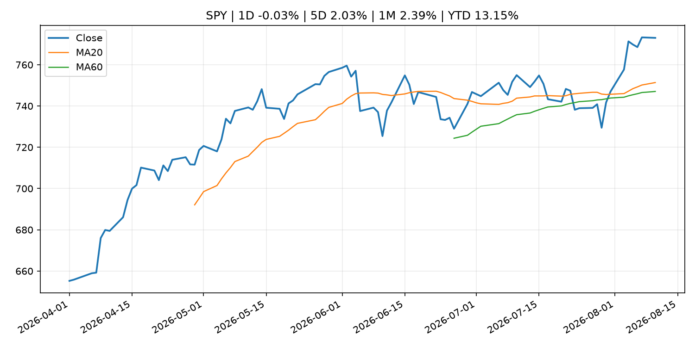
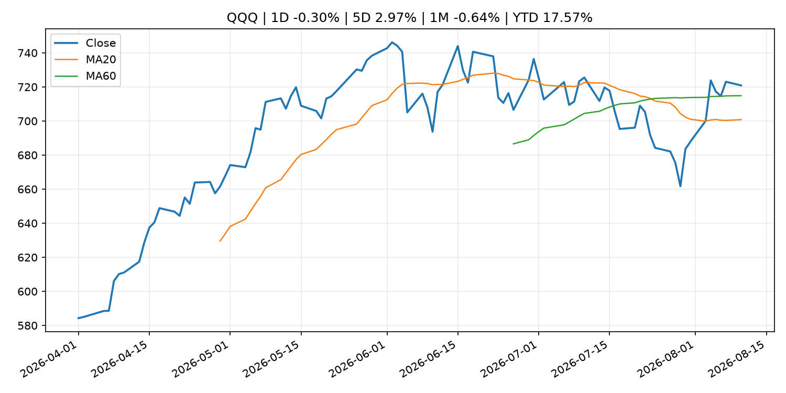
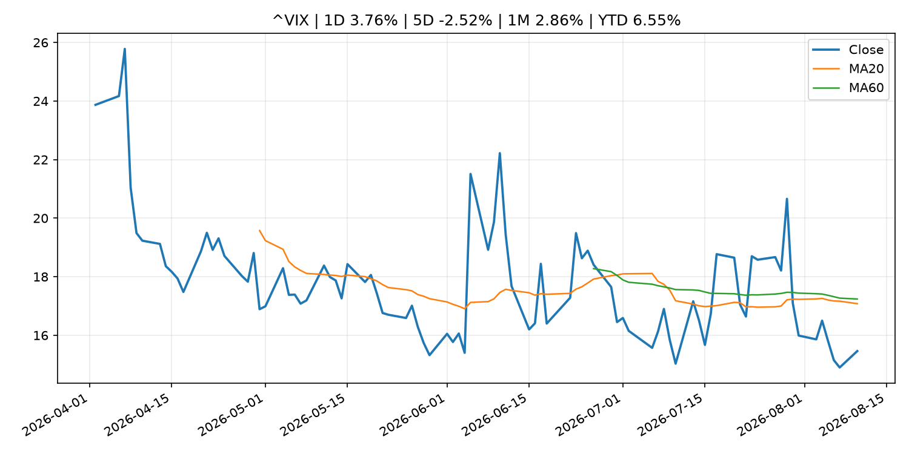
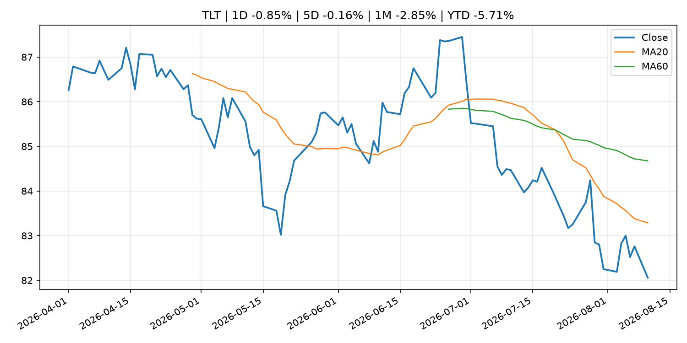
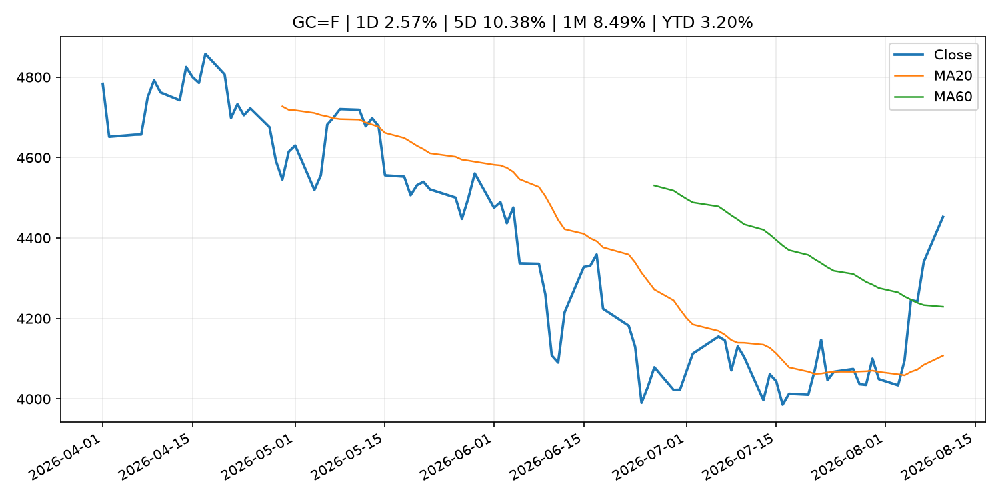
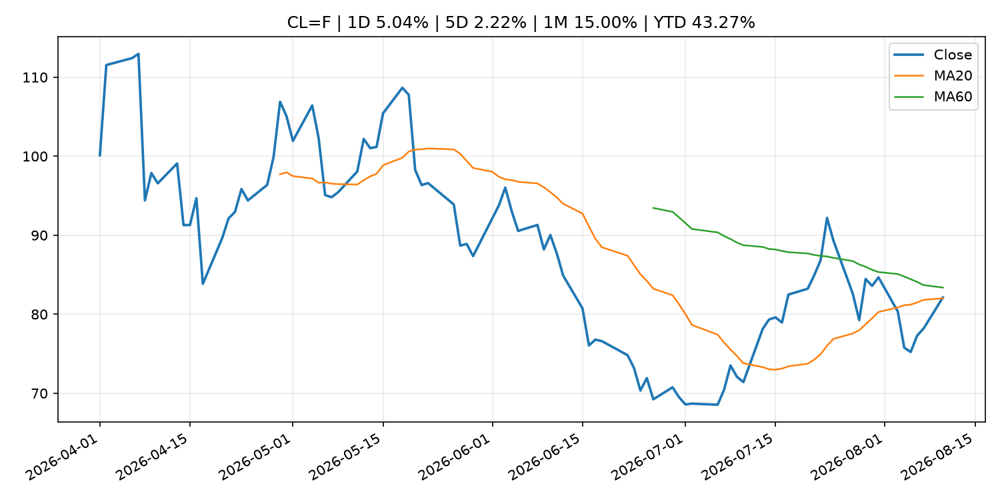
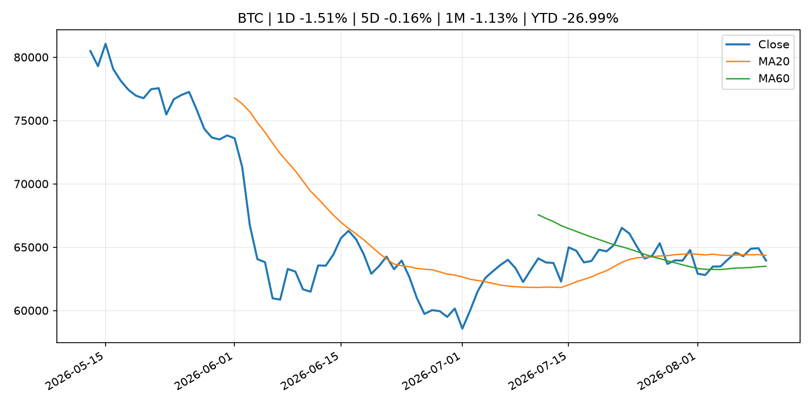
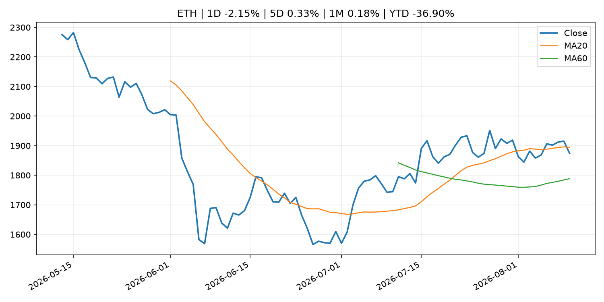
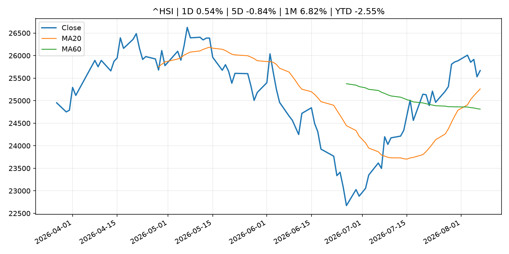

# Global Macro Morning Briefing - 2026-08-11

> Not financial advice / 非投资建议。

## 0. 今日总览
- 市场状态：unknown。市场信号不足，暂不判断明确状态。
- 今日三大主线：
  1. macro_data: U.S. CPI inflation, Securitize, Gemini among earnings reports: Crypto Week Ahead
  2. regulation: SEC Charges Private Fund Adviser Adit Ventures Management, Its CEO and Affiliated General Partners in Alleged Fraud
  3. crypto_market_structure: Inside stablecoin firm BVNK’s journey to a $1.8B acquisition by Mastercard
- 一句话结论：今日晨报重点关注：这类宏观数据会直接改变市场对通胀、增长和政策路径的预期。；监管变化会改变行业盈利预期和资产风险溢价。。跨资产方面，SPY 1D -0.03%；QQQ 1D -0.30%；^VIX 1D 3.76%；TLT 1D -0.85%；GC=F 1D 2.57%；CL=F 1D 5.04%；BTC 1D -1.51%；ETH 1D -2.15%；市场信号不足，暂不判断明确状态。政策、通胀、利率、美元、美债、能源和加密监管仍是主要观察线索。所有结论仅基于公开数据与短摘要整理，不构成投资建议。

## 1. 隔夜跨资产市场
- 美股：SPY 1D -0.03%，QQQ 1D -0.30%，整体趋势需结合 VIX 和利率确认。
- 美债/美元：TLT 1D -0.85%，美元指数 1D 0.21%，是判断折现率压力的核心线索。
- 黄金/原油：黄金 1D 2.57%，原油 1D 5.04%，用于观察避险、通胀和地缘风险。
- 加密：BTC 1D -1.51%，ETH 1D -2.15%，关注是否独立于纳指走出加密自身行情。
- 港股/A股：恒生 1D 0.54%，沪深300/上证 1D n/a，重点看中国政策预期与人民币线索。
- 风险观察：关注后续数据是否确认当前跨资产信号。

### US_EQUITY

| symbol | latest close | 1D | 5D | 1M | YTD | trend |
|---|---:|---:|---:|---:|---:|---|
| SPY | 773.03 | -0.03% | 2.03% | 2.39% | 13.15% | uptrend |
| QQQ | 720.87 | -0.30% | 2.97% | -0.64% | 17.57% | range_bound |
| DIA | 538.99 | -0.12% | 1.46% | 2.51% | 11.45% | uptrend |
| IWM | 299.98 | -0.52% | 1.27% | 1.35% | 20.58% | uptrend |
| VTI | 381.63 | -0.04% | 2.08% | 2.40% | 13.48% | uptrend |

### US_MACRO_MARKET

| symbol | latest close | 1D | 5D | 1M | YTD | trend |
|---|---:|---:|---:|---:|---:|---|
| ^VIX | 15.46 | 3.76% | -2.52% | 2.86% | 6.55% | downtrend |
| DX-Y.NYB | 99.81 | 0.21% | -0.15% | -1.15% | 1.41% | range_bound |
| TLT | 82.06 | -0.85% | -0.16% | -2.85% | -5.71% | downtrend |
| IEF | 92.76 | -0.44% | -0.06% | -0.93% | -3.46% | downtrend |

### COMMODITIES

| symbol | latest close | 1D | 5D | 1M | YTD | trend |
|---|---:|---:|---:|---:|---:|---|
| GC=F | 4,452.40 | 2.57% | 10.38% | 8.49% | 3.20% | range_bound |
| SI=F | 65.93 | 4.11% | 14.34% | 10.24% | -6.55% | range_bound |
| CL=F | 82.12 | 5.04% | 2.22% | 15.00% | 43.27% | range_bound |
| BZ=F | 87.70 | 4.97% | 4.69% | 15.38% | 44.36% | range_bound |
| NG=F | 2.78 | 4.32% | -0.14% | -5.54% | -23.24% | strong_downtrend |
| HG=F | 6.63 | 0.92% | 1.80% | 6.38% | 17.57% | strong_uptrend |

### HK_MARKET

| symbol | latest close | 1D | 5D | 1M | YTD | trend |
|---|---:|---:|---:|---:|---:|---|
| ^HSI | 25,668.03 | 0.54% | -0.84% | 6.82% | -2.55% | strong_uptrend |
| 0700.HK | 481.40 | 0.54% | -1.84% | 4.61% | -22.73% | uptrend |
| 9988.HK | 126.70 | 2.34% | 1.20% | 14.97% | -14.97% | strong_uptrend |
| 3690.HK | 93.90 | 1.84% | 0.48% | 19.31% | -10.23% | strong_uptrend |
| 1810.HK | 27.62 | 2.07% | -1.22% | 6.89% | -31.43% | range_bound |
| 1211.HK | 92.30 | 2.38% | -2.74% | 8.72% | -6.53% | strong_uptrend |

### CRYPTO

| symbol | latest close | 1D | 5D | 1M | YTD | trend |
|---|---:|---:|---:|---:|---:|---|
| BTC | 63,936.96 | -1.51% | -0.16% | -1.13% | -26.99% | range_bound |
| ETH | 1,874.22 | -2.15% | 0.33% | 0.18% | -36.90% | range_bound |
| SOLANA | 76.10 | 0.17% | 3.27% | -0.27% | -38.88% | uptrend |
| BINANCECOIN | 598.70 | -0.30% | 1.01% | 4.94% | -30.60% | strong_uptrend |
| RIPPLE | 1.01 | -2.75% | -5.76% | -7.84% | -45.08% | strong_downtrend |

## 2. 今日最重要的 10 条新闻
### 1. U.S. CPI inflation, Securitize, Gemini among earnings reports: Crypto Week Ahead
- 来源：CoinDesk
- 时间：2026-08-10T08:57:04+00:00
- 地区：global
- 事件类型：macro_data
- 重要性层级：Tier 1
- 一句话摘要：U.S. CPI inflation, Securitize, Gemini among earnings reports: Crypto Week Ahead
- 为什么重要：这类宏观数据会直接改变市场对通胀、增长和政策路径的预期。
- 可能影响：主要影响 DXY，方向为 positive，强度 high；通胀压力可能推高政策利率预期并支撑美元。
  - 资产：DXY
    方向：positive
    强度：high
    原因：通胀压力可能推高政策利率预期并支撑美元。
  - 资产：TLT
    方向：negative
    强度：high
    原因：通胀上行通常推升收益率、压低长债价格。
  - 资产：QQQ
    方向：negative
    强度：high
    原因：更高利率对成长股估值折现率不利。
  - 资产：SPY
    方向：mixed
    强度：medium
    原因：名义增长可能支撑收入，但更高利率压制估值。
  - 资产：GC=F
    方向：mixed
    强度：medium
    原因：通胀对黄金是支撑，但实际利率上行会形成压力。
  - 资产：BTC
    方向：mixed
    强度：medium
    原因：抗通胀叙事和流动性收紧可能相互抵消。
- 原文链接：[https://www.coindesk.com/markets/2026/08/10/u-s-cpi-inflation-securitize-gemini-among-earnings-reports-crypto-week-ahead](https://www.coindesk.com/markets/2026/08/10/u-s-cpi-inflation-securitize-gemini-among-earnings-reports-crypto-week-ahead)

### 2. SEC Charges Private Fund Adviser Adit Ventures Management, Its CEO and Affiliated General Partners in Alleged Fraud
- 来源：SEC Press Releases
- 时间：2026-08-10T14:00:00-04:00
- 地区：US
- 事件类型：regulation
- 重要性层级：Tier 2
- 一句话摘要：The Securities and Exchange Commission today charged New York-based investment adviser Adit Ventures Management LLC, its CEO Eric Munson, and three affiliated general partners, Adit Ventures LLC; Adit Ventures II LLC; and Adit Ventures III LLC (the…
- 为什么重要：监管变化会改变行业盈利预期和资产风险溢价。
- 可能影响：主要影响 BTC，方向为 mixed，强度 high；加密监管或 ETF 进展会改变 BTC 的资金流和风险溢价。
  - 资产：BTC
    方向：mixed
    强度：high
    原因：加密监管或 ETF 进展会改变 BTC 的资金流和风险溢价。
  - 资产：ETH
    方向：mixed
    强度：high
    原因：监管框架会影响 ETH 产品化和机构参与度。
  - 资产：COIN
    方向：mixed
    强度：medium
    原因：监管清晰度和执法风险会影响交易平台估值。
  - 资产：crypto market
    方向：mixed
    强度：high
    原因：信息影响整个加密市场结构，但方向取决于细节。
- 原文链接：[https://www.sec.gov/newsroom/press-releases/2026-73-sec-charges-private-fund-adviser-adit-ventures-management-its-ceo-affiliated-general-partners](https://www.sec.gov/newsroom/press-releases/2026-73-sec-charges-private-fund-adviser-adit-ventures-management-its-ceo-affiliated-general-partners)

### 3. Inside stablecoin firm BVNK’s journey to a $1.8B acquisition by Mastercard
- 来源：CoinDesk
- 时间：2026-08-10T07:52:00+00:00
- 地区：global
- 事件类型：crypto_market_structure
- 重要性层级：Tier 2
- 一句话摘要：Inside stablecoin firm BVNK’s journey to a $1.8B acquisition by Mastercard
- 为什么重要：加密市场结构和监管变化会影响 BTC、ETH 及相关股票的风险溢价。
- 可能影响：主要影响 BTC，方向为 mixed，强度 high；加密监管或 ETF 进展会改变 BTC 的资金流和风险溢价。
  - 资产：BTC
    方向：mixed
    强度：high
    原因：加密监管或 ETF 进展会改变 BTC 的资金流和风险溢价。
  - 资产：ETH
    方向：mixed
    强度：high
    原因：监管框架会影响 ETH 产品化和机构参与度。
  - 资产：COIN
    方向：mixed
    强度：medium
    原因：监管清晰度和执法风险会影响交易平台估值。
  - 资产：crypto market
    方向：mixed
    强度：high
    原因：信息影响整个加密市场结构，但方向取决于细节。
- 原文链接：[https://www.coindesk.com/business/2026/08/10/inside-stablecoin-firm-bvnk-s-journey-to-a-usd1-8b-acquisition-by-mastercard](https://www.coindesk.com/business/2026/08/10/inside-stablecoin-firm-bvnk-s-journey-to-a-usd1-8b-acquisition-by-mastercard)

### 4. Live updates: WTI crude oil up 5% and back to $80, as bitcoin drops below $64,000
- 来源：CoinDesk
- 时间：2026-08-10T06:56:50+00:00
- 地区：global
- 事件类型：commodity_supply
- 重要性层级：Tier 2
- 一句话摘要：Live updates: WTI crude oil up 5% and back to $80, as bitcoin drops below $64,000
- 为什么重要：大宗商品供给变化会影响能源价格、通胀预期和资源股。
- 可能影响：主要影响 CL=F，方向为 positive，强度 high；供给扰动或 OPEC 减产通常推升 WTI 原油。
  - 资产：CL=F
    方向：positive
    强度：high
    原因：供给扰动或 OPEC 减产通常推升 WTI 原油。
  - 资产：BZ=F
    方向：positive
    强度：high
    原因：全球供给风险通常直接影响 Brent 原油。
  - 资产：SPY
    方向：mixed
    强度：medium
    原因：能源股可能受益，但通胀和成本压力不利于宽基风险资产。
- 原文链接：[https://www.coindesk.com/markets/2026/08/10/live-updates-btc-above-usd65-000-even-as-the-senate-punts-the-clarity-act-to-the-fall](https://www.coindesk.com/markets/2026/08/10/live-updates-btc-above-usd65-000-even-as-the-senate-punts-the-clarity-act-to-the-fall)

### 5. Rocket Lab reveals some big plans, but its stock is dropping on mixed earnings
- 来源：MarketWatch Top Stories
- 时间：2026-08-10T21:37:00+00:00
- 地区：US
- 事件类型：earnings
- 重要性层级：Tier 2
- 一句话摘要：The company is looking to expand its reach in Europe and building up its backlog.
- 为什么重要：大型科技股盈利和资本开支会影响纳指、半导体和 AI 交易主线。
- 可能影响：可能影响利率、汇率、风险资产或大宗商品预期，但当前公开信息不足以判断明确方向。
  - 资产：暂无明确资产映射
  - 方向：unknown
  - 强度：low
  - 原因：公开信息不足以判断方向。
- 原文链接：[https://www.marketwatch.com/story/rocket-lab-reveals-some-big-plans-but-its-stock-is-dropping-on-mixed-earnings-4012ba2b?mod=mw_rss_topstories](https://www.marketwatch.com/story/rocket-lab-reveals-some-big-plans-but-its-stock-is-dropping-on-mixed-earnings-4012ba2b?mod=mw_rss_topstories)

### 6. Good news for stock-market bulls: Corporate earnings growth is no longer being driven just by tech
- 来源：MarketWatch Top Stories
- 时间：2026-08-10T20:00:00+00:00
- 地区：US
- 事件类型：earnings
- 重要性层级：Tier 2
- 一句话摘要：For years, the S&P 500’s earnings engine had only one driver: the “Magnificent Seven.” This quarter, the rest of the market has started pulling its weight.
- 为什么重要：大型科技股盈利和资本开支会影响纳指、半导体和 AI 交易主线。
- 可能影响：可能影响利率、汇率、风险资产或大宗商品预期，但当前公开信息不足以判断明确方向。
  - 资产：暂无明确资产映射
  - 方向：unknown
  - 强度：low
  - 原因：公开信息不足以判断方向。
- 原文链接：[https://www.marketwatch.com/story/good-news-for-stock-market-bulls-corporate-earnings-growth-is-no-longer-being-driven-just-by-tech-ddac973b?mod=mw_rss_topstories](https://www.marketwatch.com/story/good-news-for-stock-market-bulls-corporate-earnings-growth-is-no-longer-being-driven-just-by-tech-ddac973b?mod=mw_rss_topstories)

### 7. Wall Street thinks inflation is under control. Here’s why investors shouldn’t buy it.
- 来源：MarketWatch Top Stories
- 时间：2026-08-10T21:32:00+00:00
- 地区：US
- 事件类型：other
- 重要性层级：Tier 3
- 一句话摘要：Uncle Sam needs inflation, not just economic growth, to escape today’s debt crisis.
- 为什么重要：这条信息暂未匹配到重大宏观、政策或市场事件，更适合作为背景跟踪。
- 可能影响：主要影响 DXY，方向为 positive，强度 high；通胀压力可能推高政策利率预期并支撑美元。
  - 资产：DXY
    方向：positive
    强度：high
    原因：通胀压力可能推高政策利率预期并支撑美元。
  - 资产：TLT
    方向：negative
    强度：high
    原因：通胀上行通常推升收益率、压低长债价格。
  - 资产：QQQ
    方向：negative
    强度：high
    原因：更高利率对成长股估值折现率不利。
  - 资产：SPY
    方向：mixed
    强度：medium
    原因：名义增长可能支撑收入，但更高利率压制估值。
  - 资产：GC=F
    方向：mixed
    强度：medium
    原因：通胀对黄金是支撑，但实际利率上行会形成压力。
  - 资产：BTC
    方向：mixed
    强度：medium
    原因：抗通胀叙事和流动性收紧可能相互抵消。
- 原文链接：[https://www.marketwatch.com/story/fed-chair-kevin-warsh-promises-2-inflation-but-skyrocketing-u-s-debt-makes-that-a-pipe-dream-ba448651?mod=mw_rss_topstories](https://www.marketwatch.com/story/fed-chair-kevin-warsh-promises-2-inflation-but-skyrocketing-u-s-debt-makes-that-a-pipe-dream-ba448651?mod=mw_rss_topstories)

### 8. Bitcoin tops $65,000 with U.S. inflation data due this week
- 来源：CoinDesk
- 时间：2026-08-10T04:39:37+00:00
- 地区：global
- 事件类型：other
- 重要性层级：Tier 3
- 一句话摘要：Bitcoin tops $65,000 with U.S. inflation data due this week
- 为什么重要：这条信息暂未匹配到重大宏观、政策或市场事件，更适合作为背景跟踪。
- 可能影响：主要影响 DXY，方向为 positive，强度 high；通胀压力可能推高政策利率预期并支撑美元。
  - 资产：DXY
    方向：positive
    强度：high
    原因：通胀压力可能推高政策利率预期并支撑美元。
  - 资产：TLT
    方向：negative
    强度：high
    原因：通胀上行通常推升收益率、压低长债价格。
  - 资产：QQQ
    方向：negative
    强度：high
    原因：更高利率对成长股估值折现率不利。
  - 资产：SPY
    方向：mixed
    强度：medium
    原因：名义增长可能支撑收入，但更高利率压制估值。
  - 资产：GC=F
    方向：mixed
    强度：medium
    原因：通胀对黄金是支撑，但实际利率上行会形成压力。
  - 资产：BTC
    方向：mixed
    强度：medium
    原因：抗通胀叙事和流动性收紧可能相互抵消。
- 原文链接：[https://www.coindesk.com/markets/2026/08/10/bitcoin-tops-usd65-000-with-us-inflation-data-due-this-week](https://www.coindesk.com/markets/2026/08/10/bitcoin-tops-usd65-000-with-us-inflation-data-due-this-week)

## 3. 政策与央行观察
### 1. SEC Charges Private Fund Adviser Adit Ventures Management, Its CEO and Affiliated General Partners in Alleged Fraud
- 来源：SEC Press Releases
- 时间：2026-08-10T14:00:00-04:00
- 地区：US
- 事件类型：regulation
- 重要性层级：Tier 2
- 一句话摘要：The Securities and Exchange Commission today charged New York-based investment adviser Adit Ventures Management LLC, its CEO Eric Munson, and three affiliated general partners, Adit Ventures LLC; Adit Ventures II LLC; and Adit Ventures III LLC (the…
- 为什么重要：监管变化会改变行业盈利预期和资产风险溢价。
- 可能影响：主要影响 BTC，方向为 mixed，强度 high；加密监管或 ETF 进展会改变 BTC 的资金流和风险溢价。
  - 资产：BTC
    方向：mixed
    强度：high
    原因：加密监管或 ETF 进展会改变 BTC 的资金流和风险溢价。
  - 资产：ETH
    方向：mixed
    强度：high
    原因：监管框架会影响 ETH 产品化和机构参与度。
  - 资产：COIN
    方向：mixed
    强度：medium
    原因：监管清晰度和执法风险会影响交易平台估值。
  - 资产：crypto market
    方向：mixed
    强度：high
    原因：信息影响整个加密市场结构，但方向取决于细节。
- 原文链接：[https://www.sec.gov/newsroom/press-releases/2026-73-sec-charges-private-fund-adviser-adit-ventures-management-its-ceo-affiliated-general-partners](https://www.sec.gov/newsroom/press-releases/2026-73-sec-charges-private-fund-adviser-adit-ventures-management-its-ceo-affiliated-general-partners)

### 2. Inside stablecoin firm BVNK’s journey to a $1.8B acquisition by Mastercard
- 来源：CoinDesk
- 时间：2026-08-10T07:52:00+00:00
- 地区：global
- 事件类型：crypto_market_structure
- 重要性层级：Tier 2
- 一句话摘要：Inside stablecoin firm BVNK’s journey to a $1.8B acquisition by Mastercard
- 为什么重要：加密市场结构和监管变化会影响 BTC、ETH 及相关股票的风险溢价。
- 可能影响：主要影响 BTC，方向为 mixed，强度 high；加密监管或 ETF 进展会改变 BTC 的资金流和风险溢价。
  - 资产：BTC
    方向：mixed
    强度：high
    原因：加密监管或 ETF 进展会改变 BTC 的资金流和风险溢价。
  - 资产：ETH
    方向：mixed
    强度：high
    原因：监管框架会影响 ETH 产品化和机构参与度。
  - 资产：COIN
    方向：mixed
    强度：medium
    原因：监管清晰度和执法风险会影响交易平台估值。
  - 资产：crypto market
    方向：mixed
    强度：high
    原因：信息影响整个加密市场结构，但方向取决于细节。
- 原文链接：[https://www.coindesk.com/business/2026/08/10/inside-stablecoin-firm-bvnk-s-journey-to-a-usd1-8b-acquisition-by-mastercard](https://www.coindesk.com/business/2026/08/10/inside-stablecoin-firm-bvnk-s-journey-to-a-usd1-8b-acquisition-by-mastercard)

## 4. 市场异动与图表
- VIX 上涨 3.76%
- TLT 下跌 -0.85%
- Gold 上涨 2.57%
- Oil 上涨 5.04%
- ETH 下跌 -2.15%

### SPY

### QQQ

### ^VIX

### TLT

### GC=F

### CL=F

### BTC

### ETH

### ^HSI

## 5. 华尔街与机构公开观点
- 暂无可靠公开观点。

## 6. 今日重点关注
- 经济数据：经济数据：暂无可靠公开日历数据；如配置经济日历源后可自动填充。
- 央行讲话：央行讲话：暂无可靠公开日历数据；重点跟踪 Fed、ECB、BoJ、PBOC 官网 RSS。
- 财报：财报：暂无可靠数据。
- 政策事件：政策事件：暂无可靠数据。
- 风险提醒：风险提醒：关注数据源失败项、突发地缘风险、利率和美元的二阶反应。

## 7. 英文金融表达与宏观概念
- **inflation expectations**：通胀预期，指家庭、企业或市场对未来通胀的预估。 例句：Inflation expectations can shape wage bargaining and bond yields.
- **real yield**：实际收益率，名义利率扣除通胀预期后的收益率。 例句：Gold often reacts more to real yields than nominal yields.
- **supply disruption**：供给扰动，通常指能源或商品供应受冲突、减产或天气影响。 例句：Supply disruption can lift oil prices and inflation expectations.
- **market structure**：市场结构，指交易、托管、清算、ETF、监管等制度安排。 例句：Crypto market structure rules can affect institutional participation.
- **terminal rate**：终端利率，市场预期本轮加息周期的最高政策利率。 例句：A higher terminal rate can pressure growth stocks.
- **soft landing**：软着陆，指通胀回落而经济避免明显衰退。 例句：Markets often rally when data support a soft landing.

## 8. 背景材料
- [Wall Street thinks inflation is under control. Here’s why investors shouldn’t buy it.](https://www.marketwatch.com/story/fed-chair-kevin-warsh-promises-2-inflation-but-skyrocketing-u-s-debt-makes-that-a-pipe-dream-ba448651?mod=mw_rss_topstories)（MarketWatch Top Stories，other）：Uncle Sam needs inflation, not just economic growth, to escape today’s debt crisis.
- [Trump Media’s bitcoin holdings shrink as crypto losses hit $361 million](https://www.coindesk.com/business/2026/08/10/trump-media-s-bitcoin-holdings-shrink-as-crypto-losses-hit-usd361-million)（CoinDesk，other）：Trump Media’s bitcoin holdings shrink as crypto losses hit $361 million
- [Bitwise's Rasmussen: Circle is mispriced as stablecoins head toward trillions](https://www.coindesk.com/coindesk-news/2026/08/10/bitwise-s-rasmussen-circle-is-mispriced-as-stablecoins-head-toward-trillions)（CoinDesk，other）：Bitwise's Rasmussen: Circle is mispriced as stablecoins head toward trillions
- [Strategy builds $4.75 billion cash cushion as only bitcoin isn’t enough for investors](https://www.coindesk.com/coindesk-news/2026/08/10/strategy-builds-usd4-75-billion-cash-cushion-as-only-bitcoin-isn-t-enough-for-investors)（CoinDesk，other）：Strategy builds $4.75 billion cash cushion as only bitcoin isn’t enough for investors
- [Should wealthier Americans forgo their Social Security benefits as a charitable gesture?](https://www.marketwatch.com/story/should-wealthier-americans-forgo-their-social-security-benefits-as-a-charitable-gesture-2c7b6801?mod=mw_rss_topstories)（MarketWatch Top Stories，other）：A reader writes: “I will likely be in a position to decline my benefits.”
- [Three reasons Goldman's co-head of global banking and markets says to stay invested](https://www.cnbc.com/2026/08/10/three-reasons-goldmans-co-head-of-global-banking-and-markets-says-to-stay-invested.html)（CNBC Economy，other）：Goldman Sachs' Ashok Varadhan pointed to three reasons for his constructive outlook.
- [Grayscale quietly drops Cardano, Polkadot and Hedera ETF plans](https://www.coindesk.com/business/2026/08/10/grayscale-quietly-drops-cardano-polkadot-and-hedera-etf-plans)（CoinDesk，other）：Grayscale quietly drops Cardano, Polkadot and Hedera ETF plans
- [Strategy sells 1,690 bitcoin, raises $653 million from MSTR shares](https://www.coindesk.com/markets/2026/08/10/strategy-sells-1-690-bitcoin-raises-usd653-million-from-mstr-shares)（CoinDesk，other）：Strategy sells 1,690 bitcoin, raises $653 million from MSTR shares
- [UK’s FCA to regulate tokenized gold to preserve London’s place as the top hub for bullion](https://www.coindesk.com/business/2026/08/10/why-the-uk-financial-watchdog-is-drafting-new-rules-for-tokenized-gold)（CoinDesk，other）：UK’s FCA to regulate tokenized gold to preserve London’s place as the top hub for bullion
- [Bitcoin's BIP-110 episode is free-market capitalism in purest form](https://www.coindesk.com/daybook-us/2026/08/10/bitcoin-s-bip-110-episode-is-free-market-capitalism-in-purest-form)（CoinDesk，other）：Bitcoin's BIP-110 episode is free-market capitalism in purest form
- [Bitcoin steadies above $65,000 as Iran-Oman deal talk eases Hormuz concerns, lifts risk assets](https://www.coindesk.com/markets/2026/08/10/bitcoin-steadies-above-usd65-000-as-iran-oman-deal-talk-eases-hormuz-concerns-lifts-risk-assets)（CoinDesk，other）：Bitcoin steadies above $65,000 as Iran-Oman deal talk eases Hormuz concerns, lifts risk assets
- [Bitcoin volatility is in meltdown, but downside protection still commands a premium](https://www.coindesk.com/markets/2026/08/10/bitcoin-volatility-is-in-meltdown-but-downside-protection-still-commands-a-premium)（CoinDesk，other）：Bitcoin volatility is in meltdown, but downside protection still commands a premium
- [A rare CME shift: Hedge funds abandon structural shorts to bet on a bitcoin rally](https://www.coindesk.com/markets/2026/08/10/a-rare-cme-shift-hedge-funds-abandon-structural-shorts-to-bet-on-a-bitcoin-rally)（CoinDesk，other）：A rare CME shift: Hedge funds abandon structural shorts to bet on a bitcoin rally
- [This bitcoin miner rejected BIP-110 despite mining through a pool that supported it](https://www.coindesk.com/markets/2026/08/10/bitcoin-miner-rejects-bip-110-despite-mining-through-a-pool-that-supported-it)（CoinDesk，other）：This bitcoin miner rejected BIP-110 despite mining through a pool that supported it
- [Bitcoin tops $65,000 with U.S. inflation data due this week](https://www.coindesk.com/markets/2026/08/10/bitcoin-tops-usd65-000-with-us-inflation-data-due-this-week)（CoinDesk，other）：Bitcoin tops $65,000 with U.S. inflation data due this week
- [XRP is getting left behind in the crypto bounce even as ETFs keep attracting investor money](https://www.coindesk.com/markets/2026/08/10/xrp-is-getting-left-behind-in-the-crypto-bounce-even-as-etfs-keep-attracting-investor-money)（CoinDesk，other）：XRP is getting left behind in the crypto bounce even as ETFs keep attracting investor money
- [Summary of Opinions at the Monetary Policy Meeting on July 30 and 31, 2026](http://www.boj.or.jp/en/mopo/mpmsche_minu/opinion_2026/opi260731.pdf)（Bank of Japan Announcements，other）：Summary of Opinions at the Monetary Policy Meeting on July 30 and 31, 2026
- [Principal Figures of Financial Institutions (July)](http://www.boj.or.jp/en/statistics/dl/depo/kashi/kasi2607.pdf)（Bank of Japan Announcements，other）：Principal Figures of Financial Institutions (July)
- [Release of Latest "Loans and Bills Discounted by Sector" and "Loans to Households" Data](http://www.boj.or.jp/en/statistics/outline/notice_2026/not260810a.htm)（Bank of Japan Announcements，other）：Release of Latest "Loans and Bills Discounted by Sector" and "Loans to Households" Data
- [Bitcoin investors pour $853 million into spot ETFs. BlackRock’s IBIT claims the bulk](https://www.coindesk.com/markets/2026/08/09/bitcoin-investors-pour-usd853-million-into-spot-etfs-blackrock-s-ibit-claims-the-bulk)（CoinDesk，other）：Bitcoin investors pour $853 million into spot ETFs. BlackRock’s IBIT claims the bulk

## 9. 数据源、失败项与免责声明
- 采集时间：2026-08-10T22:35:21
- 数据源：公开 RSS、Yahoo Finance、CoinGecko、AKShare、FRED、SEC data.sec.gov，以及用户自有 inputs/reports 文件。
- 合规说明：不绕过 WSJ、Bloomberg、FT、Reuters 等付费墙；对付费媒体只使用公开 RSS 标题、摘要、链接和发布时间。
- 免责声明：Not financial advice / 非投资建议。本项目仅供个人学习、研究和信息整理，不构成投资建议、交易建议或任何收益承诺。
- 失败或跳过的数据源：
  - crypto data failed coin=dogecoin
  - China market data failed symbol=上证指数: empty dataframe
  - China market data failed symbol=深证成指: empty dataframe
  - China market data failed symbol=创业板指: empty dataframe
  - China market data failed symbol=沪深300: empty dataframe
  - China market data failed symbol=中证500: empty dataframe
  - China market data failed symbol=科创50: empty dataframe
  - FRED_API_KEY not set; skipping FRED macro series
  - SEC failed cik=0000320193
  - SEC failed cik=0000789019
  - SEC failed cik=0001045810
  - SEC failed cik=0001318605
  - SEC failed cik=0001577552
