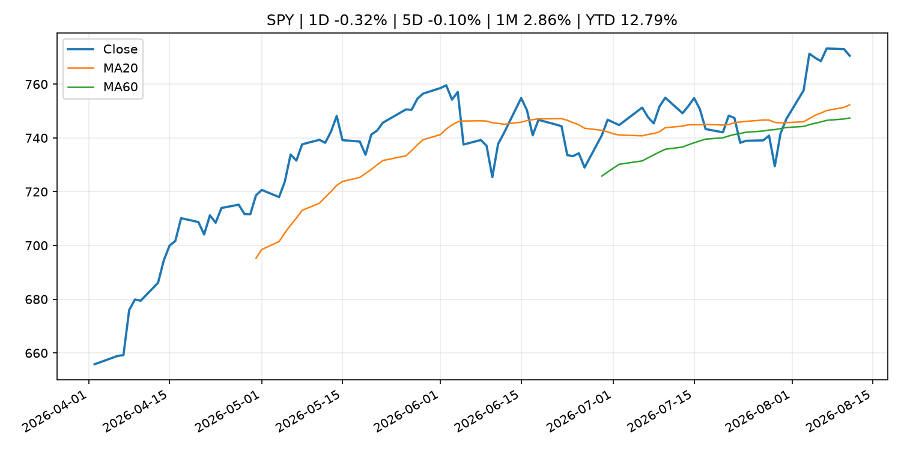
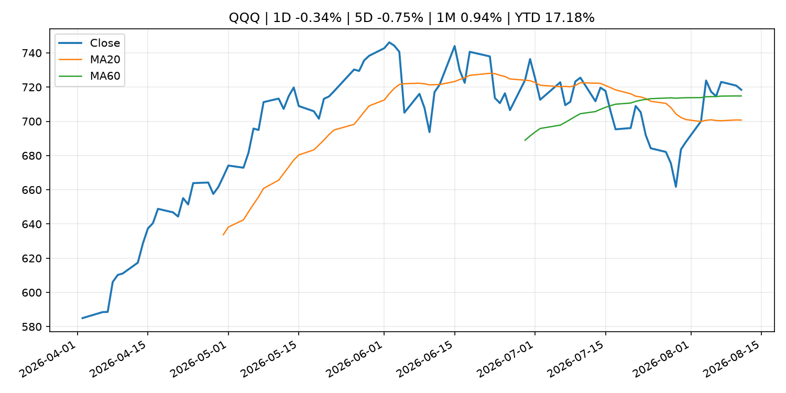
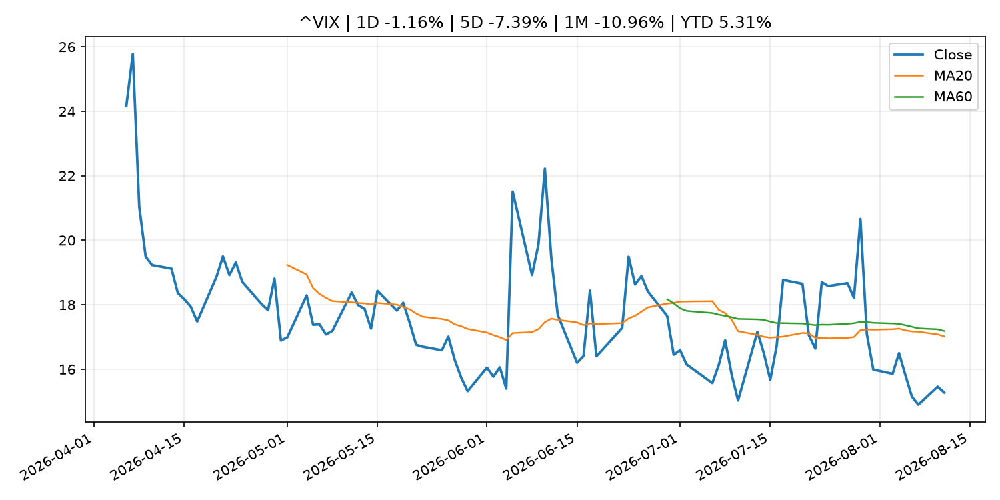
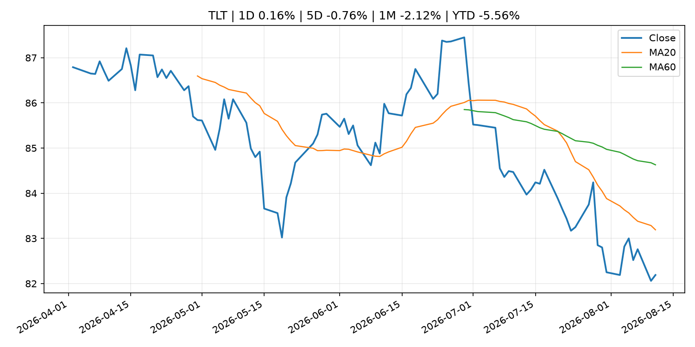
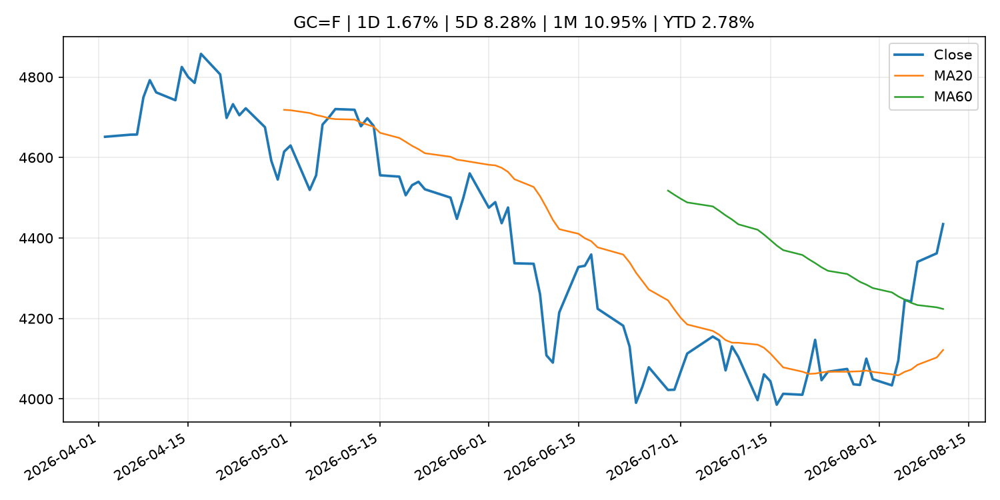
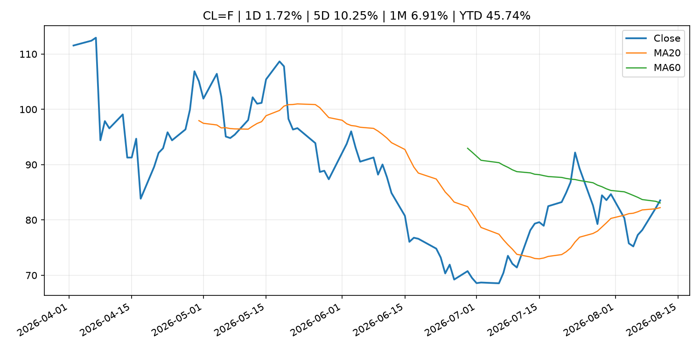
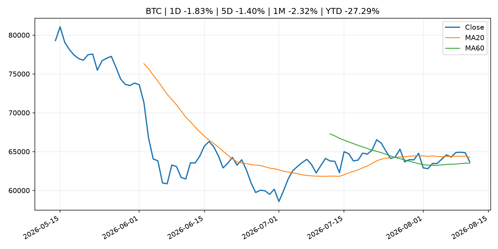
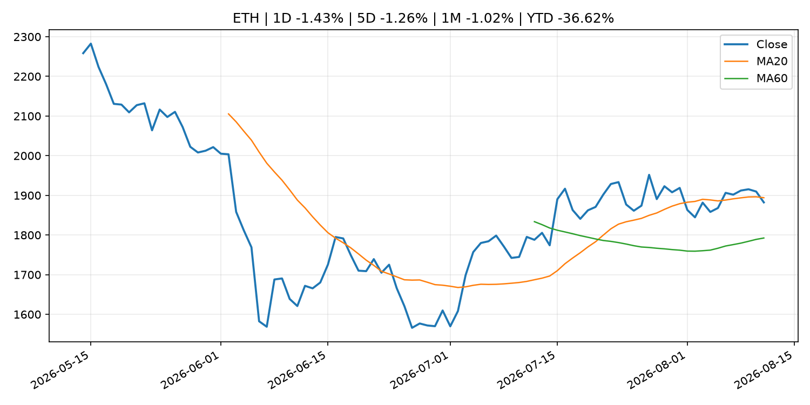
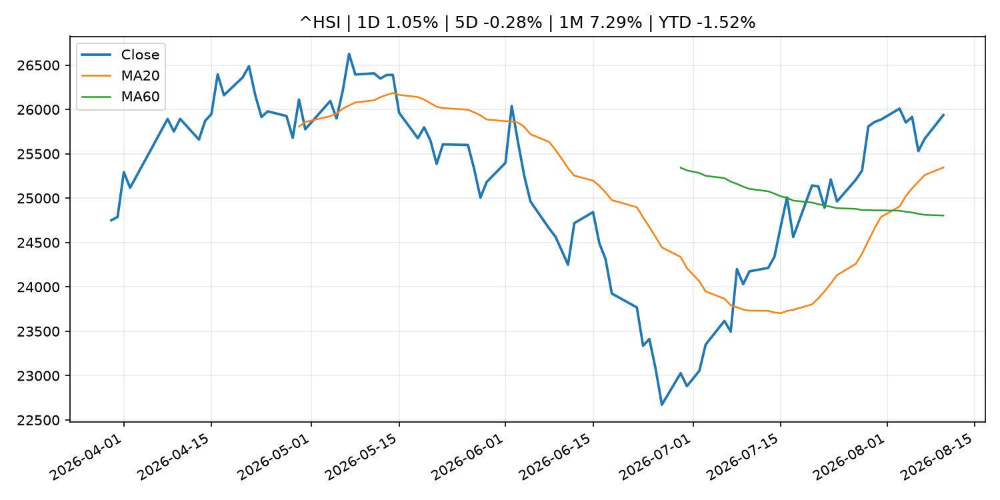

# Global Macro Morning Briefing - 2026-08-12

> Not financial advice / 非投资建议。

## 0. 今日总览
- 市场状态：inflation_shock。原油和黄金走强、股指承压，市场可能在交易通胀或地缘风险冲击。
- 今日三大主线：
  1. regulation: SEC Charges Private Fund Adviser Adit Ventures Management, Its CEO and Affiliated General Partners in Alleged Fraud
  2. earnings: Lumentum sees sales more than double as AI demand swells
  3. earnings: Super Micro’s earnings report brings more good news, and the stock is climbing
- 一句话结论：今日晨报重点关注：监管变化会改变行业盈利预期和资产风险溢价。；大型科技股盈利和资本开支会影响纳指、半导体和 AI 交易主线。。跨资产方面，SPY 1D -0.32%；QQQ 1D -0.34%；^VIX 1D -1.16%；TLT 1D 0.16%；GC=F 1D 1.67%；CL=F 1D 1.72%；BTC 1D -1.83%；ETH 1D -1.43%；原油和黄金走强、股指承压，市场可能在交易通胀或地缘风险冲击。政策、通胀、利率、美元、美债、能源和加密监管仍是主要观察线索。所有结论仅基于公开数据与短摘要整理，不构成投资建议。

## 1. 隔夜跨资产市场
- 美股：SPY 1D -0.32%，QQQ 1D -0.34%，整体趋势需结合 VIX 和利率确认。
- 美债/美元：TLT 1D 0.16%，美元指数 1D 0.00%，是判断折现率压力的核心线索。
- 黄金/原油：黄金 1D 1.67%，原油 1D 1.72%，用于观察避险、通胀和地缘风险。
- 加密：BTC 1D -1.83%，ETH 1D -1.43%，关注是否独立于纳指走出加密自身行情。
- 港股/A股：恒生 1D 1.05%，沪深300/上证 1D n/a，重点看中国政策预期与人民币线索。
- 风险观察：关注能源价格是否传导到通胀预期和央行沟通。

### US_EQUITY

| symbol | latest close | 1D | 5D | 1M | YTD | trend |
|---|---:|---:|---:|---:|---:|---|
| SPY | 770.56 | -0.32% | -0.10% | 2.86% | 12.79% | uptrend |
| QQQ | 718.45 | -0.34% | -0.75% | 0.94% | 17.18% | range_bound |
| DIA | 537.28 | -0.32% | -0.58% | 2.44% | 11.09% | uptrend |
| IWM | 300.99 | 0.34% | -0.24% | 2.56% | 20.99% | uptrend |
| VTI | 380.65 | -0.26% | -0.04% | 2.94% | 13.18% | uptrend |

### US_MACRO_MARKET

| symbol | latest close | 1D | 5D | 1M | YTD | trend |
|---|---:|---:|---:|---:|---:|---|
| ^VIX | 15.28 | -1.16% | -7.39% | -10.96% | 5.31% | strong_downtrend |
| DX-Y.NYB | 99.81 | 0.00% | -0.08% | -1.45% | 1.41% | range_bound |
| TLT | 82.19 | 0.16% | -0.76% | -2.12% | -5.56% | downtrend |
| IEF | 92.87 | 0.12% | -0.41% | -0.45% | -3.34% | downtrend |

### COMMODITIES

| symbol | latest close | 1D | 5D | 1M | YTD | trend |
|---|---:|---:|---:|---:|---:|---|
| GC=F | 4,434.50 | 1.67% | 8.28% | 10.95% | 2.78% | range_bound |
| SI=F | 65.04 | -0.11% | 8.29% | 12.84% | -7.82% | range_bound |
| CL=F | 83.54 | 1.72% | 10.25% | 6.91% | 45.74% | range_bound |
| BZ=F | 89.29 | 1.79% | 12.51% | 7.19% | 46.98% | uptrend |
| NG=F | 2.75 | -1.50% | 2.61% | -5.01% | -23.94% | strong_downtrend |
| HG=F | 6.64 | 0.63% | 0.26% | 6.47% | 17.66% | strong_uptrend |

### HK_MARKET

| symbol | latest close | 1D | 5D | 1M | YTD | trend |
|---|---:|---:|---:|---:|---:|---|
| ^HSI | 25,937.49 | 1.05% | -0.28% | 7.29% | -1.52% | strong_uptrend |
| 0700.HK | 470.80 | -2.20% | -3.45% | 2.88% | -24.43% | uptrend |
| 9988.HK | 126.40 | -0.24% | 0.48% | 14.18% | -15.17% | strong_uptrend |
| 3690.HK | 93.05 | -0.91% | 0.38% | 19.37% | -11.04% | strong_uptrend |
| 1810.HK | 26.66 | -3.48% | -4.65% | 3.17% | -33.81% | range_bound |
| 1211.HK | 89.70 | -2.82% | -4.01% | 6.85% | -9.16% | range_bound |

### CRYPTO

| symbol | latest close | 1D | 5D | 1M | YTD | trend |
|---|---:|---:|---:|---:|---:|---|
| BTC | 63,671.68 | -1.83% | -1.40% | -2.32% | -27.29% | range_bound |
| ETH | 1,882.31 | -1.43% | -1.26% | -1.02% | -36.62% | range_bound |
| SOLANA | 76.35 | 0.11% | 3.17% | -1.79% | -38.68% | range_bound |
| BINANCECOIN | 612.54 | 1.62% | 3.19% | 7.35% | -29.00% | strong_uptrend |
| RIPPLE | 1.02 | -0.86% | -3.82% | -8.19% | -44.57% | strong_downtrend |

## 2. 今日最重要的 10 条新闻
### 1. SEC Charges Private Fund Adviser Adit Ventures Management, Its CEO and Affiliated General Partners in Alleged Fraud
- 来源：SEC Press Releases
- 时间：2026-08-10T14:00:00-04:00
- 地区：US
- 事件类型：regulation
- 重要性层级：Tier 2
- 一句话摘要：The Securities and Exchange Commission today charged New York-based investment adviser Adit Ventures Management LLC, its CEO Eric Munson, and three affiliated general partners, Adit Ventures LLC; Adit Ventures II LLC; and Adit Ventures III LLC (the…
- 为什么重要：监管变化会改变行业盈利预期和资产风险溢价。
- 可能影响：主要影响 BTC，方向为 mixed，强度 high；加密监管或 ETF 进展会改变 BTC 的资金流和风险溢价。
  - 资产：BTC
    方向：mixed
    强度：high
    原因：加密监管或 ETF 进展会改变 BTC 的资金流和风险溢价。
  - 资产：ETH
    方向：mixed
    强度：high
    原因：监管框架会影响 ETH 产品化和机构参与度。
  - 资产：COIN
    方向：mixed
    强度：medium
    原因：监管清晰度和执法风险会影响交易平台估值。
  - 资产：crypto market
    方向：mixed
    强度：high
    原因：信息影响整个加密市场结构，但方向取决于细节。
- 原文链接：[https://www.sec.gov/newsroom/press-releases/2026-73-sec-charges-private-fund-adviser-adit-ventures-management-its-ceo-affiliated-general-partners](https://www.sec.gov/newsroom/press-releases/2026-73-sec-charges-private-fund-adviser-adit-ventures-management-its-ceo-affiliated-general-partners)

### 2. Lumentum sees sales more than double as AI demand swells
- 来源：MarketWatch Top Stories
- 时间：2026-08-11T22:22:00+00:00
- 地区：US
- 事件类型：earnings
- 重要性层级：Tier 2
- 一句话摘要：Though Lumentum posted blowout earnings and an upbeat forecast, its stock was largely flat after hours.
- 为什么重要：大型科技股盈利和资本开支会影响纳指、半导体和 AI 交易主线。
- 可能影响：可能影响利率、汇率、风险资产或大宗商品预期，但当前公开信息不足以判断明确方向。
  - 资产：暂无明确资产映射
  - 方向：unknown
  - 强度：low
  - 原因：公开信息不足以判断方向。
- 原文链接：[https://www.marketwatch.com/story/lumentum-sees-sales-more-than-double-as-ai-demand-swells-6ebe6ef1?mod=mw_rss_topstories](https://www.marketwatch.com/story/lumentum-sees-sales-more-than-double-as-ai-demand-swells-6ebe6ef1?mod=mw_rss_topstories)

### 3. Super Micro’s earnings report brings more good news, and the stock is climbing
- 来源：MarketWatch Top Stories
- 时间：2026-08-11T21:49:00+00:00
- 地区：US
- 事件类型：earnings
- 重要性层级：Tier 2
- 一句话摘要：The company impressed Wall Street several weeks ago by teasing an improved profitability trajectory. Super Micro’s latest forecast has exceeded expectations as well.
- 为什么重要：大型科技股盈利和资本开支会影响纳指、半导体和 AI 交易主线。
- 可能影响：可能影响利率、汇率、风险资产或大宗商品预期，但当前公开信息不足以判断明确方向。
  - 资产：暂无明确资产映射
  - 方向：unknown
  - 强度：low
  - 原因：公开信息不足以判断方向。
- 原文链接：[https://www.marketwatch.com/story/super-micros-earnings-report-brings-more-good-news-and-the-stock-is-climbing-30e5ca89?mod=mw_rss_topstories](https://www.marketwatch.com/story/super-micros-earnings-report-brings-more-good-news-and-the-stock-is-climbing-30e5ca89?mod=mw_rss_topstories)

### 4. CoreWeave’s stock soars as earnings show major AI momentum
- 来源：MarketWatch Top Stories
- 时间：2026-08-11T21:17:00+00:00
- 地区：US
- 事件类型：earnings
- 重要性层级：Tier 2
- 一句话摘要：The AI cloud provider topped revenue and earnings expectations, with its CEO cheering “an important inflection point.”
- 为什么重要：大型科技股盈利和资本开支会影响纳指、半导体和 AI 交易主线。
- 可能影响：可能影响利率、汇率、风险资产或大宗商品预期，但当前公开信息不足以判断明确方向。
  - 资产：暂无明确资产映射
  - 方向：unknown
  - 强度：low
  - 原因：公开信息不足以判断方向。
- 原文链接：[https://www.marketwatch.com/story/coreweaves-stock-soars-as-earnings-show-major-ai-momentum-d3a5bede?mod=mw_rss_topstories](https://www.marketwatch.com/story/coreweaves-stock-soars-as-earnings-show-major-ai-momentum-d3a5bede?mod=mw_rss_topstories)

### 5. Bitcoin stuck as ETF inflows offset selling, but inflation data could spark a move
- 来源：CoinDesk
- 时间：2026-08-11T21:38:13+00:00
- 地区：global
- 事件类型：other
- 重要性层级：Tier 3
- 一句话摘要：Bitcoin stuck as ETF inflows offset selling, but inflation data could spark a move
- 为什么重要：这条信息暂未匹配到重大宏观、政策或市场事件，更适合作为背景跟踪。
- 可能影响：主要影响 DXY，方向为 positive，强度 high；通胀压力可能推高政策利率预期并支撑美元。
  - 资产：DXY
    方向：positive
    强度：high
    原因：通胀压力可能推高政策利率预期并支撑美元。
  - 资产：TLT
    方向：negative
    强度：high
    原因：通胀上行通常推升收益率、压低长债价格。
  - 资产：QQQ
    方向：negative
    强度：high
    原因：更高利率对成长股估值折现率不利。
  - 资产：SPY
    方向：mixed
    强度：medium
    原因：名义增长可能支撑收入，但更高利率压制估值。
  - 资产：GC=F
    方向：mixed
    强度：medium
    原因：通胀对黄金是支撑，但实际利率上行会形成压力。
  - 资产：BTC
    方向：mixed
    强度：high
    原因：加密监管或 ETF 进展会改变 BTC 的资金流和风险溢价。
- 原文链接：[https://www.coindesk.com/markets/2026/08/11/bitcoin-stuck-as-etf-inflows-offset-selling-but-inflation-data-could-spark-a-move](https://www.coindesk.com/markets/2026/08/11/bitcoin-stuck-as-etf-inflows-offset-selling-but-inflation-data-could-spark-a-move)

### 6. EToro reports second quarter crypto loss even as total profit beats estimates
- 来源：CoinDesk
- 时间：2026-08-11T17:12:11+00:00
- 地区：global
- 事件类型：other
- 重要性层级：Tier 3
- 一句话摘要：EToro reports second quarter crypto loss even as total profit beats estimates
- 为什么重要：这条信息暂未匹配到重大宏观、政策或市场事件，更适合作为背景跟踪。
- 可能影响：更偏背景信息，短期市场影响可能有限。
  - 资产：暂无明确资产映射
  - 方向：unknown
  - 强度：low
  - 原因：公开信息不足以判断方向。
- 原文链接：[https://www.coindesk.com/business/2026/08/11/digital-broker-etoro-reports-q2-crypto-revenue-dropped-120-compared-to-2025](https://www.coindesk.com/business/2026/08/11/digital-broker-etoro-reports-q2-crypto-revenue-dropped-120-compared-to-2025)

## 3. 政策与央行观察
### 1. SEC Charges Private Fund Adviser Adit Ventures Management, Its CEO and Affiliated General Partners in Alleged Fraud
- 来源：SEC Press Releases
- 时间：2026-08-10T14:00:00-04:00
- 地区：US
- 事件类型：regulation
- 重要性层级：Tier 2
- 一句话摘要：The Securities and Exchange Commission today charged New York-based investment adviser Adit Ventures Management LLC, its CEO Eric Munson, and three affiliated general partners, Adit Ventures LLC; Adit Ventures II LLC; and Adit Ventures III LLC (the…
- 为什么重要：监管变化会改变行业盈利预期和资产风险溢价。
- 可能影响：主要影响 BTC，方向为 mixed，强度 high；加密监管或 ETF 进展会改变 BTC 的资金流和风险溢价。
  - 资产：BTC
    方向：mixed
    强度：high
    原因：加密监管或 ETF 进展会改变 BTC 的资金流和风险溢价。
  - 资产：ETH
    方向：mixed
    强度：high
    原因：监管框架会影响 ETH 产品化和机构参与度。
  - 资产：COIN
    方向：mixed
    强度：medium
    原因：监管清晰度和执法风险会影响交易平台估值。
  - 资产：crypto market
    方向：mixed
    强度：high
    原因：信息影响整个加密市场结构，但方向取决于细节。
- 原文链接：[https://www.sec.gov/newsroom/press-releases/2026-73-sec-charges-private-fund-adviser-adit-ventures-management-its-ceo-affiliated-general-partners](https://www.sec.gov/newsroom/press-releases/2026-73-sec-charges-private-fund-adviser-adit-ventures-management-its-ceo-affiliated-general-partners)

## 4. 市场异动与图表
- Gold 上涨 1.67%
- Oil 上涨 1.72%

### SPY

### QQQ

### ^VIX

### TLT

### GC=F

### CL=F

### BTC

### ETH

### ^HSI

## 5. 华尔街与机构公开观点
- 暂无可靠公开观点。

## 6. 今日重点关注
- 经济数据：经济数据：暂无可靠公开日历数据；如配置经济日历源后可自动填充。
- 央行讲话：央行讲话：暂无可靠公开日历数据；重点跟踪 Fed、ECB、BoJ、PBOC 官网 RSS。
- 财报：财报：暂无可靠数据。
- 政策事件：政策事件：暂无可靠数据。
- 风险提醒：风险提醒：关注数据源失败项、突发地缘风险、利率和美元的二阶反应。

## 7. 英文金融表达与宏观概念
- **inflation expectations**：通胀预期，指家庭、企业或市场对未来通胀的预估。 例句：Inflation expectations can shape wage bargaining and bond yields.
- **real yield**：实际收益率，名义利率扣除通胀预期后的收益率。 例句：Gold often reacts more to real yields than nominal yields.
- **market structure**：市场结构，指交易、托管、清算、ETF、监管等制度安排。 例句：Crypto market structure rules can affect institutional participation.
- **terminal rate**：终端利率，市场预期本轮加息周期的最高政策利率。 例句：A higher terminal rate can pressure growth stocks.
- **soft landing**：软着陆，指通胀回落而经济避免明显衰退。 例句：Markets often rally when data support a soft landing.
- **risk-off**：避险模式，资金偏向美元、国债、黄金等防御资产。 例句：A geopolitical shock can push markets into risk-off mode.

## 8. 背景材料
- [Bitcoin stuck as ETF inflows offset selling, but inflation data could spark a move](https://www.coindesk.com/markets/2026/08/11/bitcoin-stuck-as-etf-inflows-offset-selling-but-inflation-data-could-spark-a-move)（CoinDesk，other）：Bitcoin stuck as ETF inflows offset selling, but inflation data could spark a move
- [EToro reports second quarter crypto loss even as total profit beats estimates](https://www.coindesk.com/business/2026/08/11/digital-broker-etoro-reports-q2-crypto-revenue-dropped-120-compared-to-2025)（CoinDesk，other）：EToro reports second quarter crypto loss even as total profit beats estimates
- [Ravencoin, a blockchain built from Bitcoin’s code, could roll back four days of transactions](https://www.coindesk.com/tech/2026/08/11/ravencoin-could-roll-back-four-days-of-transactions-after-critical-block-flaw)（CoinDesk，other）：Ravencoin, a blockchain built from Bitcoin’s code, could roll back four days of transactions
- [When safe assets compete with risk. Lessons from the 1960s–90s for bitcoin and stocks.](https://www.coindesk.com/daybook-us/2026/08/11/when-safe-assets-compete-with-risk-lessons-from-the-1960s-90s-for-bitcoin-and-stocks)（CoinDesk，other）：When safe assets compete with risk. Lessons from the 1960s–90s for bitcoin and stocks.
- [Bitcoin-backed lending is entering its institutional era: Two Prime](https://www.coindesk.com/markets/2026/08/11/bitcoin-backed-lending-is-entering-its-institutional-era-two-prime)（CoinDesk，other）：Bitcoin-backed lending is entering its institutional era: Two Prime
- [Bitcoin stuck below $65,000 as Hormuz hopes evaporate, XRP close to dropping below $1](https://www.coindesk.com/markets/2026/08/11/bitcoin-stuck-below-usd65-000-as-the-strait-of-hormuz-stalemate-and-strategy-s-selling-squeeze-the-market)（CoinDesk，other）：Bitcoin stuck below $65,000 as Hormuz hopes evaporate, XRP close to dropping below $1
- [Live updates: Bitcoin falls to $63,500; CoreWeave jumps 9% as AI demand pushes backlog over $100 billion](https://www.coindesk.com/tech/2026/08/11/live-updates-bitcoin-slips-as-corporate-btc-enthusiasm-moves-to-ai)（CoinDesk，other）：Live updates: Bitcoin falls to $63,500; CoreWeave jumps 9% as AI demand pushes backlog over $100 billion
- [Software stocks break away from bitcoin: What the rare divergence means for crypto](https://www.coindesk.com/markets/2026/08/11/software-stocks-break-away-from-bitcoin-what-the-rare-divergence-means-for-crypto)（CoinDesk，other）：Software stocks break away from bitcoin: What the rare divergence means for crypto
- [Luke Dashjr removed as Bitcoin BIP editor after controversial BIP-110 fork stalls](https://www.coindesk.com/tech/2026/08/11/luke-dashjr-removed-as-bitcoin-bip-editor-after-controversial-bip-110-fork-stalls)（CoinDesk，other）：Luke Dashjr removed as Bitcoin BIP editor after controversial BIP-110 fork stalls
- [ECB and Frankfurt Radio Symphony invite the public to Europa Open Air concert on 20 August 2026](https://www.ecb.europa.eu//press/pr/date/2026/html/ecb.pr260811~47cd3ee040.en.html)（ECB Press Releases，other）：ECB and Frankfurt Radio Symphony invite the public to Europa Open Air concert on 20 August 2026
- [BTCPay offers $190,000 bounty after bitcoin payment servers drained in exploit](https://www.coindesk.com/markets/2026/08/11/btcpay-offers-usd190-000-bounty-after-bitcoin-payment-servers-drained-in-exploit)（CoinDesk，other）：BTCPay offers $190,000 bounty after bitcoin payment servers drained in exploit
- [Bitcoin’s BIP-110 fork is 300 blocks behind BTC and six years from fixing itself](https://www.coindesk.com/tech/2026/08/11/bitcoin-s-bip-110-fork-is-300-blocks-behind-btc-and-six-years-from-fixing-itself)（CoinDesk，other）：Bitcoin’s BIP-110 fork is 300 blocks behind BTC and six years from fixing itself
- [XRP, ether lead crypto losses as traders eye $70,000 bitcoin next](https://www.coindesk.com/markets/2026/08/11/xrp-ether-lead-crypto-losses-as-traders-eye-usd70-000-bitcoin-next)（CoinDesk，other）：XRP, ether lead crypto losses as traders eye $70,000 bitcoin next
- [Three reasons Goldman's co-head of global banking and markets says to stay invested](https://www.cnbc.com/2026/08/10/three-reasons-goldmans-co-head-of-global-banking-and-markets-says-to-stay-invested.html)（CNBC Economy，other）：Goldman Sachs' Ashok Varadhan pointed to three reasons for his constructive outlook.
- [Summary of Opinions at the Monetary Policy Meeting on July 30 and 31, 2026](http://www.boj.or.jp/en/mopo/mpmsche_minu/opinion_2026/opi260731.pdf)（Bank of Japan Announcements，other）：Summary of Opinions at the Monetary Policy Meeting on July 30 and 31, 2026
- [Principal Figures of Financial Institutions (July)](http://www.boj.or.jp/en/statistics/dl/depo/kashi/kasi2607.pdf)（Bank of Japan Announcements，other）：Principal Figures of Financial Institutions (July)
- [Release of Latest "Loans and Bills Discounted by Sector" and "Loans to Households" Data](http://www.boj.or.jp/en/statistics/outline/notice_2026/not260810a.htm)（Bank of Japan Announcements，other）：Release of Latest "Loans and Bills Discounted by Sector" and "Loans to Households" Data

## 9. 数据源、失败项与免责声明
- 采集时间：2026-08-11T22:39:23
- 数据源：公开 RSS、Yahoo Finance、CoinGecko、AKShare、FRED、SEC data.sec.gov，以及用户自有 inputs/reports 文件。
- 合规说明：不绕过 WSJ、Bloomberg、FT、Reuters 等付费墙；对付费媒体只使用公开 RSS 标题、摘要、链接和发布时间。
- 免责声明：Not financial advice / 非投资建议。本项目仅供个人学习、研究和信息整理，不构成投资建议、交易建议或任何收益承诺。
- 失败或跳过的数据源：
  - crypto data failed coin=dogecoin
  - China market data failed symbol=上证指数: empty dataframe
  - China market data failed symbol=深证成指: empty dataframe
  - China market data failed symbol=创业板指: empty dataframe
  - China market data failed symbol=沪深300: empty dataframe
  - China market data failed symbol=中证500: empty dataframe
  - China market data failed symbol=科创50: empty dataframe
  - FRED_API_KEY not set; skipping FRED macro series
  - SEC failed cik=0000320193
  - SEC failed cik=0000789019
  - SEC failed cik=0001045810
  - SEC failed cik=0001318605
  - SEC failed cik=0001577552
