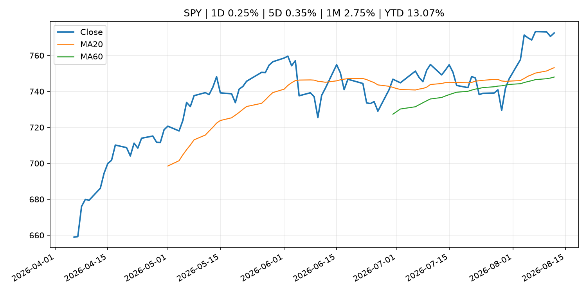
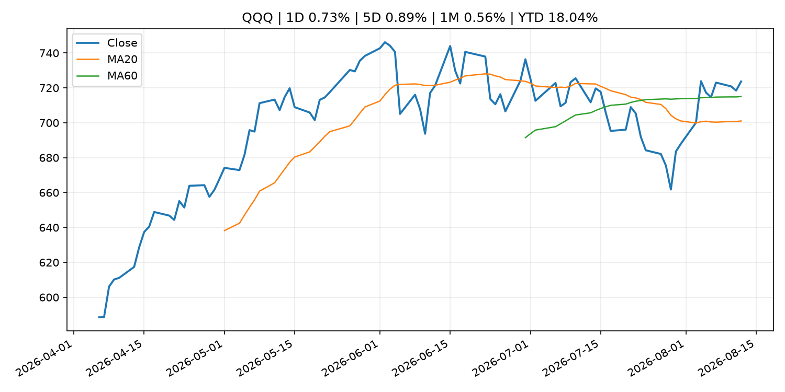
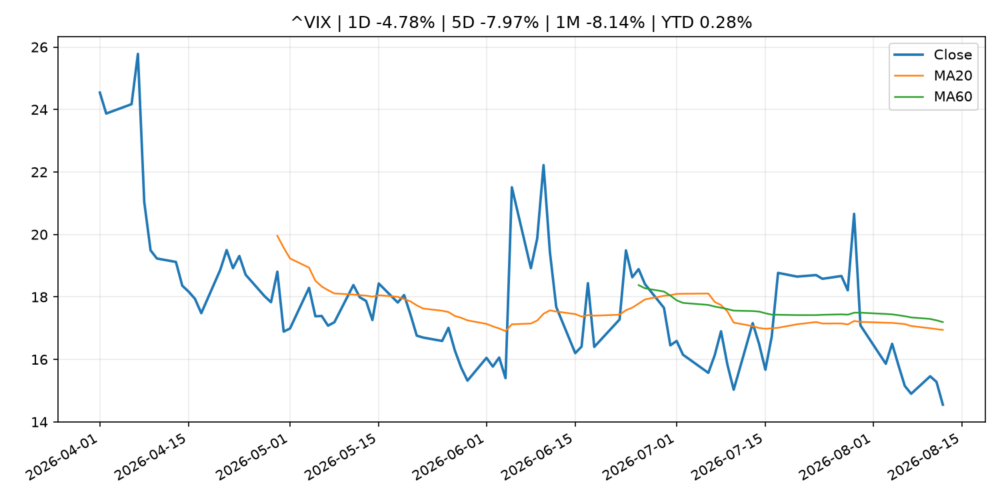
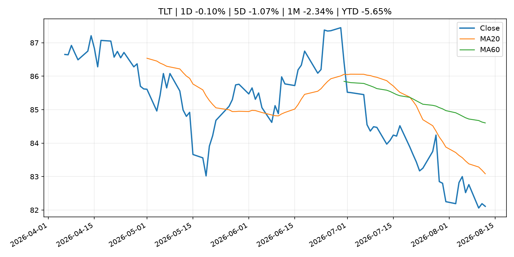
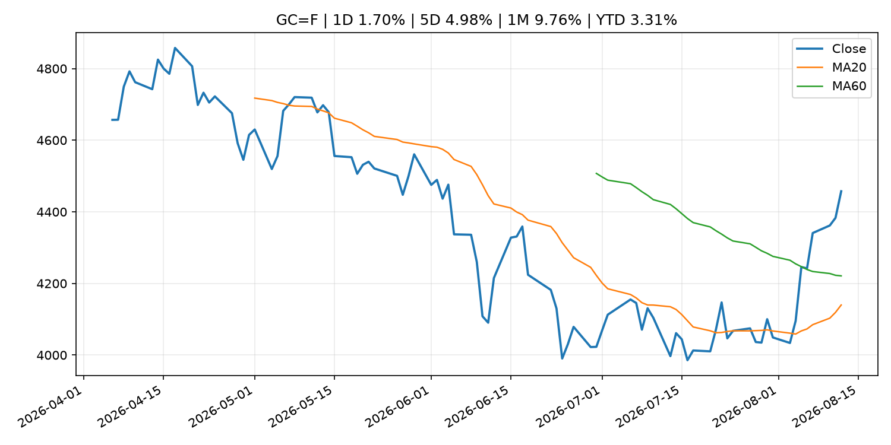
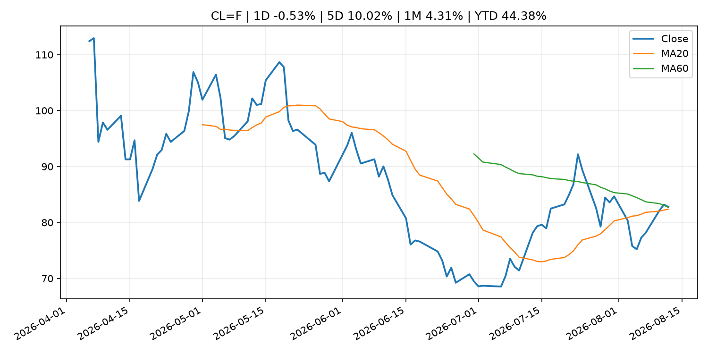
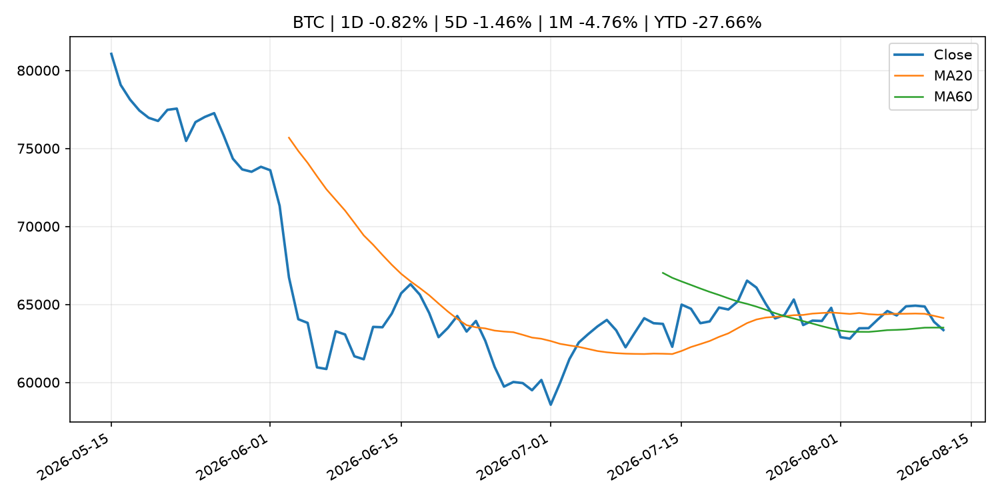
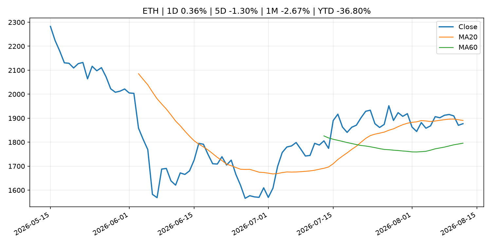
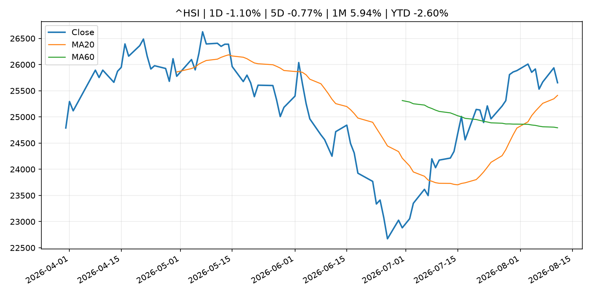

# Global Macro Morning Briefing - 2026-08-13

> Not financial advice / 非投资建议。

## 0. 今日总览
- 市场状态：unknown。市场信号不足，暂不判断明确状态。
- 今日三大主线：
  1. macro_data: U.S. CPI inflation slows to 3.4% as expected, bitcoin holds near $64,000
  2. macro_data: XRP trading could get spicy after CPI report as futures bets hit highest since October
  3. macro_data: Here's what bitcoin and ether traders are doing ahead of the binary U.S. CPI print
- 一句话结论：今日晨报重点关注：这类宏观数据会直接改变市场对通胀、增长和政策路径的预期。；这类宏观数据会直接改变市场对通胀、增长和政策路径的预期。。跨资产方面，SPY 1D 0.25%；QQQ 1D 0.73%；^VIX 1D -4.78%；TLT 1D -0.10%；GC=F 1D 1.70%；CL=F 1D -0.53%；BTC 1D -0.82%；ETH 1D 0.36%；市场信号不足，暂不判断明确状态。政策、通胀、利率、美元、美债、能源和加密监管仍是主要观察线索。所有结论仅基于公开数据与短摘要整理，不构成投资建议。

## 1. 隔夜跨资产市场
- 美股：SPY 1D 0.25%，QQQ 1D 0.73%，整体趋势需结合 VIX 和利率确认。
- 美债/美元：TLT 1D -0.10%，美元指数 1D 0.17%，是判断折现率压力的核心线索。
- 黄金/原油：黄金 1D 1.70%，原油 1D -0.53%，用于观察避险、通胀和地缘风险。
- 加密：BTC 1D -0.82%，ETH 1D 0.36%，关注是否独立于纳指走出加密自身行情。
- 港股/A股：恒生 1D -1.10%，沪深300/上证 1D n/a，重点看中国政策预期与人民币线索。
- 风险观察：关注后续数据是否确认当前跨资产信号。

### US_EQUITY

| symbol | latest close | 1D | 5D | 1M | YTD | trend |
|---|---:|---:|---:|---:|---:|---|
| SPY | 772.49 | 0.25% | 0.35% | 2.75% | 13.07% | uptrend |
| QQQ | 723.70 | 0.73% | 0.89% | 0.56% | 18.04% | range_bound |
| DIA | 537.15 | -0.02% | -1.04% | 2.37% | 11.07% | uptrend |
| IWM | 302.71 | 0.57% | 0.98% | 2.78% | 21.68% | uptrend |
| VTI | 381.83 | 0.31% | 0.57% | 2.87% | 13.54% | uptrend |

### US_MACRO_MARKET

| symbol | latest close | 1D | 5D | 1M | YTD | trend |
|---|---:|---:|---:|---:|---:|---|
| ^VIX | 14.55 | -4.78% | -7.97% | -8.14% | 0.28% | strong_downtrend |
| DX-Y.NYB | 99.99 | 0.17% | 0.30% | -0.95% | 1.59% | range_bound |
| TLT | 82.11 | -0.10% | -1.07% | -2.34% | -5.65% | downtrend |
| IEF | 92.96 | 0.10% | -0.38% | -0.35% | -3.25% | downtrend |

### COMMODITIES

| symbol | latest close | 1D | 5D | 1M | YTD | trend |
|---|---:|---:|---:|---:|---:|---|
| GC=F | 4,457.40 | 1.70% | 4.98% | 9.76% | 3.31% | range_bound |
| SI=F | 65.26 | 0.77% | 5.10% | 11.05% | -7.50% | range_bound |
| CL=F | 82.76 | -0.53% | 10.02% | 4.31% | 44.38% | range_bound |
| BZ=F | 88.58 | -0.37% | 11.49% | 4.54% | 45.81% | uptrend |
| NG=F | 2.79 | 0.87% | 3.83% | -3.89% | -22.86% | range_bound |
| HG=F | 6.61 | -0.04% | -1.39% | 4.42% | 17.19% | strong_uptrend |

### HK_MARKET

| symbol | latest close | 1D | 5D | 1M | YTD | trend |
|---|---:|---:|---:|---:|---:|---|
| ^HSI | 25,652.82 | -1.10% | -0.77% | 5.94% | -2.60% | strong_uptrend |
| 0700.HK | 461.60 | -1.95% | -6.22% | 1.18% | -25.91% | range_bound |
| 9988.HK | 122.60 | -3.01% | -4.29% | 10.65% | -17.72% | strong_uptrend |
| 3690.HK | 91.65 | -1.50% | -1.50% | 15.72% | -12.38% | strong_uptrend |
| 1810.HK | 26.36 | -1.13% | -4.63% | 1.23% | -34.56% | range_bound |
| 1211.HK | 89.60 | -0.11% | -4.48% | 4.00% | -9.27% | range_bound |

### CRYPTO

| symbol | latest close | 1D | 5D | 1M | YTD | trend |
|---|---:|---:|---:|---:|---:|---|
| BTC | 63,352.07 | -0.82% | -1.46% | -4.76% | -27.66% | range_bound |
| ETH | 1,877.10 | 0.36% | -1.30% | -2.67% | -36.80% | range_bound |
| SOLANA | 75.44 | -0.58% | 3.81% | -3.39% | -39.42% | range_bound |
| BINANCECOIN | 609.81 | 1.86% | 2.92% | 6.32% | -29.31% | strong_uptrend |
| RIPPLE | 1.01 | -0.47% | -2.76% | -11.98% | -45.37% | strong_downtrend |

## 2. 今日最重要的 10 条新闻
### 1. U.S. CPI inflation slows to 3.4% as expected, bitcoin holds near $64,000
- 来源：CoinDesk
- 时间：2026-08-12T12:44:39+00:00
- 地区：global
- 事件类型：macro_data
- 重要性层级：Tier 1
- 一句话摘要：U.S. CPI inflation slows to 3.4% as expected, bitcoin holds near $64,000
- 为什么重要：这类宏观数据会直接改变市场对通胀、增长和政策路径的预期。
- 可能影响：主要影响 DXY，方向为 positive，强度 high；通胀压力可能推高政策利率预期并支撑美元。
  - 资产：DXY
    方向：positive
    强度：high
    原因：通胀压力可能推高政策利率预期并支撑美元。
  - 资产：TLT
    方向：negative
    强度：high
    原因：通胀上行通常推升收益率、压低长债价格。
  - 资产：QQQ
    方向：negative
    强度：high
    原因：更高利率对成长股估值折现率不利。
  - 资产：SPY
    方向：mixed
    强度：medium
    原因：名义增长可能支撑收入，但更高利率压制估值。
  - 资产：GC=F
    方向：mixed
    强度：medium
    原因：通胀对黄金是支撑，但实际利率上行会形成压力。
  - 资产：BTC
    方向：mixed
    强度：medium
    原因：抗通胀叙事和流动性收紧可能相互抵消。
- 原文链接：[https://www.coindesk.com/markets/2026/08/12/u-s-cpi-inflation-edges-lower-to-3-4-as-expected](https://www.coindesk.com/markets/2026/08/12/u-s-cpi-inflation-edges-lower-to-3-4-as-expected)

### 2. XRP trading could get spicy after CPI report as futures bets hit highest since October
- 来源：CoinDesk
- 时间：2026-08-12T11:15:00+00:00
- 地区：global
- 事件类型：macro_data
- 重要性层级：Tier 1
- 一句话摘要：XRP trading could get spicy after CPI report as futures bets hit highest since October
- 为什么重要：这类宏观数据会直接改变市场对通胀、增长和政策路径的预期。
- 可能影响：主要影响 DXY，方向为 positive，强度 high；通胀压力可能推高政策利率预期并支撑美元。
  - 资产：DXY
    方向：positive
    强度：high
    原因：通胀压力可能推高政策利率预期并支撑美元。
  - 资产：TLT
    方向：negative
    强度：high
    原因：通胀上行通常推升收益率、压低长债价格。
  - 资产：QQQ
    方向：negative
    强度：high
    原因：更高利率对成长股估值折现率不利。
  - 资产：SPY
    方向：mixed
    强度：medium
    原因：名义增长可能支撑收入，但更高利率压制估值。
  - 资产：GC=F
    方向：mixed
    强度：medium
    原因：通胀对黄金是支撑，但实际利率上行会形成压力。
  - 资产：BTC
    方向：mixed
    强度：medium
    原因：抗通胀叙事和流动性收紧可能相互抵消。
- 原文链接：[https://www.coindesk.com/daybook-us/2026/08/12/xrp-trading-could-get-spicy-after-cpi-report-as-futures-bets-hit-highest-since-october](https://www.coindesk.com/daybook-us/2026/08/12/xrp-trading-could-get-spicy-after-cpi-report-as-futures-bets-hit-highest-since-october)

### 3. Here's what bitcoin and ether traders are doing ahead of the binary U.S. CPI print
- 来源：CoinDesk
- 时间：2026-08-12T05:26:55+00:00
- 地区：global
- 事件类型：macro_data
- 重要性层级：Tier 1
- 一句话摘要：Here's what bitcoin and ether traders are doing ahead of the binary U.S. CPI print
- 为什么重要：这类宏观数据会直接改变市场对通胀、增长和政策路径的预期。
- 可能影响：主要影响 DXY，方向为 positive，强度 high；通胀压力可能推高政策利率预期并支撑美元。
  - 资产：DXY
    方向：positive
    强度：high
    原因：通胀压力可能推高政策利率预期并支撑美元。
  - 资产：TLT
    方向：negative
    强度：high
    原因：通胀上行通常推升收益率、压低长债价格。
  - 资产：QQQ
    方向：negative
    强度：high
    原因：更高利率对成长股估值折现率不利。
  - 资产：SPY
    方向：mixed
    强度：medium
    原因：名义增长可能支撑收入，但更高利率压制估值。
  - 资产：GC=F
    方向：mixed
    强度：medium
    原因：通胀对黄金是支撑，但实际利率上行会形成压力。
  - 资产：BTC
    方向：mixed
    强度：medium
    原因：抗通胀叙事和流动性收紧可能相互抵消。
- 原文链接：[https://www.coindesk.com/business/2026/08/12/here-s-what-bitcoin-and-ether-traders-are-doing-ahead-of-the-binary-u-s-cpi-print](https://www.coindesk.com/business/2026/08/12/here-s-what-bitcoin-and-ether-traders-are-doing-ahead-of-the-binary-u-s-cpi-print)

### 4. (Research Paper) Market Operations in Fiscal 2025
- 来源：Bank of Japan Announcements
- 时间：2026-08-12T16:00:00+09:00
- 地区：Japan
- 事件类型：fiscal_policy
- 重要性层级：Tier 1
- 一句话摘要：(Research Paper) Market Operations in Fiscal 2025
- 为什么重要：财政和贸易政策会影响增长、通胀、企业利润和跨境资本流。
- 可能影响：可能影响利率、汇率、风险资产或大宗商品预期，但当前公开信息不足以判断明确方向。
  - 资产：暂无明确资产映射
  - 方向：unknown
  - 强度：low
  - 原因：公开信息不足以判断方向。
- 原文链接：[http://www.boj.or.jp/en/research/brp/mor/mor260812.htm](http://www.boj.or.jp/en/research/brp/mor/mor260812.htm)

### 5. Standard Chartered-led Anchorpoint launches Hong Kong dollar stablecoin
- 来源：CoinDesk
- 时间：2026-08-12T13:13:49+00:00
- 地区：global
- 事件类型：crypto_market_structure
- 重要性层级：Tier 2
- 一句话摘要：Standard Chartered-led Anchorpoint launches Hong Kong dollar stablecoin
- 为什么重要：加密市场结构和监管变化会影响 BTC、ETH 及相关股票的风险溢价。
- 可能影响：主要影响 BTC，方向为 mixed，强度 high；加密监管或 ETF 进展会改变 BTC 的资金流和风险溢价。
  - 资产：BTC
    方向：mixed
    强度：high
    原因：加密监管或 ETF 进展会改变 BTC 的资金流和风险溢价。
  - 资产：ETH
    方向：mixed
    强度：high
    原因：监管框架会影响 ETH 产品化和机构参与度。
  - 资产：COIN
    方向：mixed
    强度：medium
    原因：监管清晰度和执法风险会影响交易平台估值。
  - 资产：crypto market
    方向：mixed
    强度：high
    原因：信息影响整个加密市场结构，但方向取决于细节。
- 原文链接：[https://www.coindesk.com/business/2026/08/12/standard-chartered-led-anchorpoint-launches-hong-kong-dollar-stablecoin](https://www.coindesk.com/business/2026/08/12/standard-chartered-led-anchorpoint-launches-hong-kong-dollar-stablecoin)

### 6. Bank of England to test stablecoin, digital currency use in cross-border finance
- 来源：CoinDesk
- 时间：2026-08-12T10:17:05+00:00
- 地区：global
- 事件类型：crypto_market_structure
- 重要性层级：Tier 2
- 一句话摘要：Bank of England to test stablecoin, digital currency use in cross-border finance
- 为什么重要：加密市场结构和监管变化会影响 BTC、ETH 及相关股票的风险溢价。
- 可能影响：主要影响 BTC，方向为 mixed，强度 high；加密监管或 ETF 进展会改变 BTC 的资金流和风险溢价。
  - 资产：BTC
    方向：mixed
    强度：high
    原因：加密监管或 ETF 进展会改变 BTC 的资金流和风险溢价。
  - 资产：ETH
    方向：mixed
    强度：high
    原因：监管框架会影响 ETH 产品化和机构参与度。
  - 资产：COIN
    方向：mixed
    强度：medium
    原因：监管清晰度和执法风险会影响交易平台估值。
  - 资产：crypto market
    方向：mixed
    强度：high
    原因：信息影响整个加密市场结构，但方向取决于细节。
- 原文链接：[https://www.coindesk.com/business/2026/08/12/bank-of-england-to-test-stablecoin-digital-currency-use-in-cross-border-finance](https://www.coindesk.com/business/2026/08/12/bank-of-england-to-test-stablecoin-digital-currency-use-in-cross-border-finance)

### 7. Nebius adds to the excitement around neocloud stocks with upbeat earnings of its own
- 来源：MarketWatch Top Stories
- 时间：2026-08-12T22:34:00+00:00
- 地区：US
- 事件类型：earnings
- 重要性层级：Tier 2
- 一句话摘要：Investors are reacting positively to earnings results and demand signals from neocloud companies CoreWeave and Nebius.
- 为什么重要：大型科技股盈利和资本开支会影响纳指、半导体和 AI 交易主线。
- 可能影响：可能影响利率、汇率、风险资产或大宗商品预期，但当前公开信息不足以判断明确方向。
  - 资产：暂无明确资产映射
  - 方向：unknown
  - 强度：low
  - 原因：公开信息不足以判断方向。
- 原文链接：[https://www.marketwatch.com/story/nebius-adds-to-the-excitement-around-neocloud-stocks-with-upbeat-earnings-of-its-own-cd2aa36e?mod=mw_rss_topstories](https://www.marketwatch.com/story/nebius-adds-to-the-excitement-around-neocloud-stocks-with-upbeat-earnings-of-its-own-cd2aa36e?mod=mw_rss_topstories)

### 8. Lumentum’s stock surges, giving a further boost to the optical-networking trade
- 来源：MarketWatch Top Stories
- 时间：2026-08-12T22:31:00+00:00
- 地区：US
- 事件类型：earnings
- 重要性层级：Tier 2
- 一句话摘要：Excitement is building for Coherent’s earnings report after upbeat results from Lumentum.
- 为什么重要：大型科技股盈利和资本开支会影响纳指、半导体和 AI 交易主线。
- 可能影响：可能影响利率、汇率、风险资产或大宗商品预期，但当前公开信息不足以判断明确方向。
  - 资产：暂无明确资产映射
  - 方向：unknown
  - 强度：low
  - 原因：公开信息不足以判断方向。
- 原文链接：[https://www.marketwatch.com/story/lumentums-stock-surges-giving-a-further-boost-to-the-optical-networking-trade-0ee46339?mod=mw_rss_topstories](https://www.marketwatch.com/story/lumentums-stock-surges-giving-a-further-boost-to-the-optical-networking-trade-0ee46339?mod=mw_rss_topstories)

### 9. Securitize falls 20% after earnings miss as tokenization revenue falls short
- 来源：CoinDesk
- 时间：2026-08-12T22:26:24+00:00
- 地区：global
- 事件类型：earnings
- 重要性层级：Tier 2
- 一句话摘要：Securitize falls 20% after earnings miss as tokenization revenue falls short
- 为什么重要：大型科技股盈利和资本开支会影响纳指、半导体和 AI 交易主线。
- 可能影响：可能影响利率、汇率、风险资产或大宗商品预期，但当前公开信息不足以判断明确方向。
  - 资产：暂无明确资产映射
  - 方向：unknown
  - 强度：low
  - 原因：公开信息不足以判断方向。
- 原文链接：[https://www.coindesk.com/markets/2026/08/12/securitize-falls-20-after-earnings-miss-as-tokenization-revenue-falls-short](https://www.coindesk.com/markets/2026/08/12/securitize-falls-20-after-earnings-miss-as-tokenization-revenue-falls-short)

### 10. Bitcoin holds near $64,000 as U.S. inflation data looms, Harmony exploit rattles altcoins
- 来源：CoinDesk
- 时间：2026-08-12T10:30:10+00:00
- 地区：global
- 事件类型：other
- 重要性层级：Tier 3
- 一句话摘要：Bitcoin holds near $64,000 as U.S. inflation data looms, Harmony exploit rattles altcoins
- 为什么重要：这条信息暂未匹配到重大宏观、政策或市场事件，更适合作为背景跟踪。
- 可能影响：主要影响 DXY，方向为 positive，强度 high；通胀压力可能推高政策利率预期并支撑美元。
  - 资产：DXY
    方向：positive
    强度：high
    原因：通胀压力可能推高政策利率预期并支撑美元。
  - 资产：TLT
    方向：negative
    强度：high
    原因：通胀上行通常推升收益率、压低长债价格。
  - 资产：QQQ
    方向：negative
    强度：high
    原因：更高利率对成长股估值折现率不利。
  - 资产：SPY
    方向：mixed
    强度：medium
    原因：名义增长可能支撑收入，但更高利率压制估值。
  - 资产：GC=F
    方向：mixed
    强度：medium
    原因：通胀对黄金是支撑，但实际利率上行会形成压力。
  - 资产：BTC
    方向：mixed
    强度：medium
    原因：抗通胀叙事和流动性收紧可能相互抵消。
- 原文链接：[https://www.coindesk.com/markets/2026/08/12/bitcoin-holds-near-usd64-000-as-u-s-inflation-data-looms-harmony-exploit-rattles-altcoins](https://www.coindesk.com/markets/2026/08/12/bitcoin-holds-near-usd64-000-as-u-s-inflation-data-looms-harmony-exploit-rattles-altcoins)

## 3. 政策与央行观察
### 1. (Research Paper) Market Operations in Fiscal 2025
- 来源：Bank of Japan Announcements
- 时间：2026-08-12T16:00:00+09:00
- 地区：Japan
- 事件类型：fiscal_policy
- 重要性层级：Tier 1
- 一句话摘要：(Research Paper) Market Operations in Fiscal 2025
- 为什么重要：财政和贸易政策会影响增长、通胀、企业利润和跨境资本流。
- 可能影响：可能影响利率、汇率、风险资产或大宗商品预期，但当前公开信息不足以判断明确方向。
  - 资产：暂无明确资产映射
  - 方向：unknown
  - 强度：low
  - 原因：公开信息不足以判断方向。
- 原文链接：[http://www.boj.or.jp/en/research/brp/mor/mor260812.htm](http://www.boj.or.jp/en/research/brp/mor/mor260812.htm)

### 2. Standard Chartered-led Anchorpoint launches Hong Kong dollar stablecoin
- 来源：CoinDesk
- 时间：2026-08-12T13:13:49+00:00
- 地区：global
- 事件类型：crypto_market_structure
- 重要性层级：Tier 2
- 一句话摘要：Standard Chartered-led Anchorpoint launches Hong Kong dollar stablecoin
- 为什么重要：加密市场结构和监管变化会影响 BTC、ETH 及相关股票的风险溢价。
- 可能影响：主要影响 BTC，方向为 mixed，强度 high；加密监管或 ETF 进展会改变 BTC 的资金流和风险溢价。
  - 资产：BTC
    方向：mixed
    强度：high
    原因：加密监管或 ETF 进展会改变 BTC 的资金流和风险溢价。
  - 资产：ETH
    方向：mixed
    强度：high
    原因：监管框架会影响 ETH 产品化和机构参与度。
  - 资产：COIN
    方向：mixed
    强度：medium
    原因：监管清晰度和执法风险会影响交易平台估值。
  - 资产：crypto market
    方向：mixed
    强度：high
    原因：信息影响整个加密市场结构，但方向取决于细节。
- 原文链接：[https://www.coindesk.com/business/2026/08/12/standard-chartered-led-anchorpoint-launches-hong-kong-dollar-stablecoin](https://www.coindesk.com/business/2026/08/12/standard-chartered-led-anchorpoint-launches-hong-kong-dollar-stablecoin)

### 3. Bank of England to test stablecoin, digital currency use in cross-border finance
- 来源：CoinDesk
- 时间：2026-08-12T10:17:05+00:00
- 地区：global
- 事件类型：crypto_market_structure
- 重要性层级：Tier 2
- 一句话摘要：Bank of England to test stablecoin, digital currency use in cross-border finance
- 为什么重要：加密市场结构和监管变化会影响 BTC、ETH 及相关股票的风险溢价。
- 可能影响：主要影响 BTC，方向为 mixed，强度 high；加密监管或 ETF 进展会改变 BTC 的资金流和风险溢价。
  - 资产：BTC
    方向：mixed
    强度：high
    原因：加密监管或 ETF 进展会改变 BTC 的资金流和风险溢价。
  - 资产：ETH
    方向：mixed
    强度：high
    原因：监管框架会影响 ETH 产品化和机构参与度。
  - 资产：COIN
    方向：mixed
    强度：medium
    原因：监管清晰度和执法风险会影响交易平台估值。
  - 资产：crypto market
    方向：mixed
    强度：high
    原因：信息影响整个加密市场结构，但方向取决于细节。
- 原文链接：[https://www.coindesk.com/business/2026/08/12/bank-of-england-to-test-stablecoin-digital-currency-use-in-cross-border-finance](https://www.coindesk.com/business/2026/08/12/bank-of-england-to-test-stablecoin-digital-currency-use-in-cross-border-finance)

## 4. 市场异动与图表
- QQQ 上涨 0.73%
- VIX 下跌 -4.78%
- Gold 上涨 1.70%

### SPY

### QQQ

### ^VIX

### TLT

### GC=F

### CL=F

### BTC

### ETH

### ^HSI

## 5. 华尔街与机构公开观点
- 暂无可靠公开观点。

## 6. 今日重点关注
- 经济数据：经济数据：暂无可靠公开日历数据；如配置经济日历源后可自动填充。
- 央行讲话：央行讲话：暂无可靠公开日历数据；重点跟踪 Fed、ECB、BoJ、PBOC 官网 RSS。
- 财报：财报：暂无可靠数据。
- 政策事件：政策事件：暂无可靠数据。
- 风险提醒：风险提醒：关注数据源失败项、突发地缘风险、利率和美元的二阶反应。

## 7. 英文金融表达与宏观概念
- **inflation expectations**：通胀预期，指家庭、企业或市场对未来通胀的预估。 例句：Inflation expectations can shape wage bargaining and bond yields.
- **real yield**：实际收益率，名义利率扣除通胀预期后的收益率。 例句：Gold often reacts more to real yields than nominal yields.
- **market structure**：市场结构，指交易、托管、清算、ETF、监管等制度安排。 例句：Crypto market structure rules can affect institutional participation.
- **terminal rate**：终端利率，市场预期本轮加息周期的最高政策利率。 例句：A higher terminal rate can pressure growth stocks.
- **soft landing**：软着陆，指通胀回落而经济避免明显衰退。 例句：Markets often rally when data support a soft landing.
- **risk-off**：避险模式，资金偏向美元、国债、黄金等防御资产。 例句：A geopolitical shock can push markets into risk-off mode.

## 8. 背景材料
- [Can I claim 50% of my husband’s Social Security now — and switch to my higher benefit at 70?](https://www.marketwatch.com/story/can-i-claim-50-of-my-husbands-social-security-now-and-switch-to-my-higher-benefit-at-70-5518700b?mod=mw_rss_topstories)（MarketWatch Top Stories，other）：“I would like to offer a piece of advice for women who are or have been married.”
- [Goldman’s latest deal underscores how ‘boomer candy’ ETFs are now big business on Wall Street](https://www.marketwatch.com/story/goldmans-latest-deal-underscores-how-boomer-candy-etfs-are-now-big-business-on-wall-street-5520109d?mod=mw_rss_topstories)（MarketWatch Top Stories，other）：Goldman Sachs announced Wednesday that it has agreed to buy Neos Investments, adding yet another ETF shop to its fast-growing asset-management business.
- [Goldman Sachs leaps into bitcoin income ETFs with $2.25 billion NEOS buyout](https://www.coindesk.com/business/2026/08/12/goldman-sachs-leaps-into-bitcoin-income-etfs-with-usd2-25-billion-neos-buyout)（CoinDesk，other）：Goldman Sachs leaps into bitcoin income ETFs with $2.25 billion NEOS buyout
- [Miden bets on privacy stablecoins with introduction of USDCx](https://www.coindesk.com/tech/2026/08/12/miden-bets-on-privacy-stablecoins-with-introduction-of-usdcx)（CoinDesk，other）：Miden bets on privacy stablecoins with introduction of USDCx
- [America doesn’t need a second-class payments system](https://www.coindesk.com/opinion/2026/08/12/america-doesn-t-need-a-second-class-payments-system)（CoinDesk，other）：America doesn’t need a second-class payments system
- [Russia moves to restrict retail crypto trading to bitcoin, ether and USDT](https://www.coindesk.com/policy/2026/08/12/russia-moves-to-restrict-retail-crypto-trading-to-bitcoin-ether-and-usdt)（CoinDesk，other）：Russia moves to restrict retail crypto trading to bitcoin, ether and USDT
- [Bitcoin holds near $64,000 as U.S. inflation data looms, Harmony exploit rattles altcoins](https://www.coindesk.com/markets/2026/08/12/bitcoin-holds-near-usd64-000-as-u-s-inflation-data-looms-harmony-exploit-rattles-altcoins)（CoinDesk，other）：Bitcoin holds near $64,000 as U.S. inflation data looms, Harmony exploit rattles altcoins
- [Fidelity moves to add staking, quarterly payouts to near $900 million ether ETF](https://www.coindesk.com/business/2026/08/12/fidelity-moves-to-add-staking-quarterly-payouts-to-near-usd900-million-ether-etf)（CoinDesk，other）：Fidelity moves to add staking, quarterly payouts to near $900 million ether ETF
- [One overlooked group has added $1.78 billion of selling pressure to bitcoin market](https://www.coindesk.com/markets/2026/08/12/one-overlooked-group-has-added-usd1-78-billion-of-selling-pressure-to-bitcoin-market)（CoinDesk，other）：One overlooked group has added $1.78 billion of selling pressure to bitcoin market
- [Live updates: AI stocks surge on Q2 beats, bitcoin falls below $64,000 as inflation hits estimates](https://www.coindesk.com/tech/2026/08/12/live-updates-bitcoin-at-usd63-600-as-japan-s-metaplanet-moves-3-881-btc-between-wallets)（CoinDesk，other）：Live updates: AI stocks surge on Q2 beats, bitcoin falls below $64,000 as inflation hits estimates
- [(Research Paper) Linkages of Firm Spending Behavior through Supply Chains](http://www.boj.or.jp/en/research/wps_rev/wps_2026/wp26e14.htm)（Bank of Japan Announcements，research_publication）：(Research Paper) Linkages of Firm Spending Behavior through Supply Chains
- [(Research Paper) Mapping Japan's Manufacturing Supply Chains Through Firm-to-Firm Transaction Data](http://www.boj.or.jp/en/research/wps_rev/wps_2026/wp26e13.htm)（Bank of Japan Announcements，research_publication）：(Research Paper) Mapping Japan's Manufacturing Supply Chains Through Firm-to-Firm Transaction Data
- [Dogecoin and BNB lead majors higher as bitcoin slips near $63,700](https://www.coindesk.com/markets/2026/08/12/dogecoin-and-bnb-lead-majors-higher-as-bitcoin-slips-near-usd63-700)（CoinDesk，other）：Dogecoin and BNB lead majors higher as bitcoin slips near $63,700
- [Money Stock (July)](http://www.boj.or.jp/en/statistics/money/ms/ms2607.pdf)（Bank of Japan Announcements，other）：Money Stock (July)
- [ECB and Frankfurt Radio Symphony invite the public to Europa Open Air concert on 20 August 2026](https://www.ecb.europa.eu//press/pr/date/2026/html/ecb.pr260811~47cd3ee040.en.html)（ECB Press Releases，other）：ECB and Frankfurt Radio Symphony invite the public to Europa Open Air concert on 20 August 2026

## 9. 数据源、失败项与免责声明
- 采集时间：2026-08-12T22:38:46
- 数据源：公开 RSS、Yahoo Finance、CoinGecko、AKShare、FRED、SEC data.sec.gov，以及用户自有 inputs/reports 文件。
- 合规说明：不绕过 WSJ、Bloomberg、FT、Reuters 等付费墙；对付费媒体只使用公开 RSS 标题、摘要、链接和发布时间。
- 免责声明：Not financial advice / 非投资建议。本项目仅供个人学习、研究和信息整理，不构成投资建议、交易建议或任何收益承诺。
- 失败或跳过的数据源：
  - crypto data failed coin=dogecoin
  - China market data failed symbol=上证指数: empty dataframe
  - China market data failed symbol=深证成指: empty dataframe
  - China market data failed symbol=创业板指: empty dataframe
  - China market data failed symbol=沪深300: empty dataframe
  - China market data failed symbol=中证500: empty dataframe
  - China market data failed symbol=科创50: empty dataframe
  - FRED_API_KEY not set; skipping FRED macro series
  - SEC failed cik=0000320193
  - SEC failed cik=0000789019
  - SEC failed cik=0001045810
  - SEC failed cik=0001318605
  - SEC failed cik=0001577552
