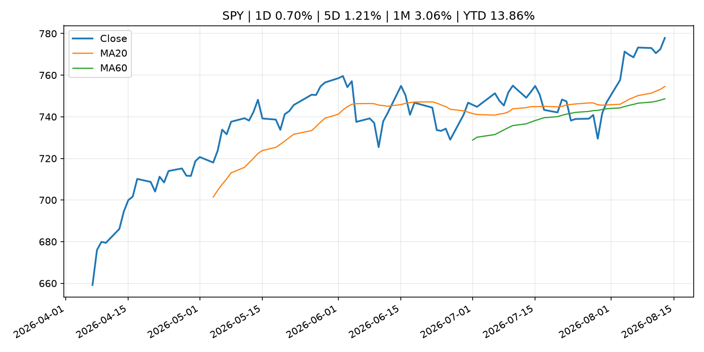
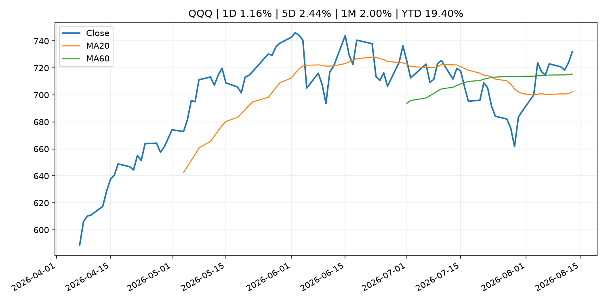
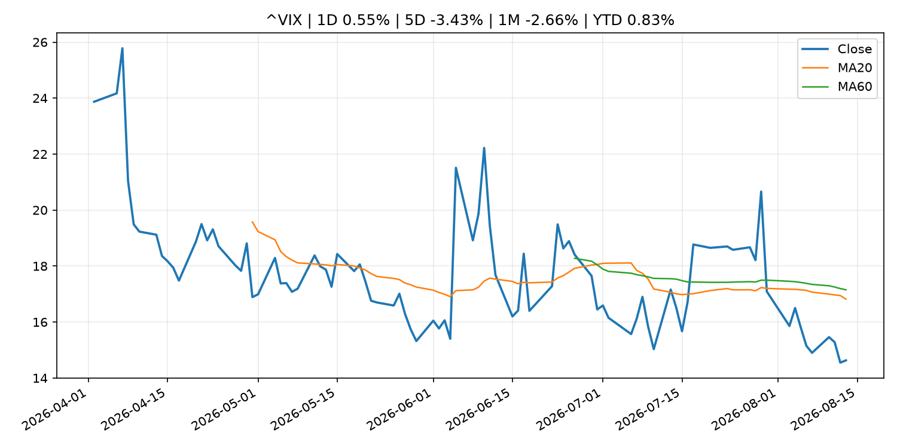
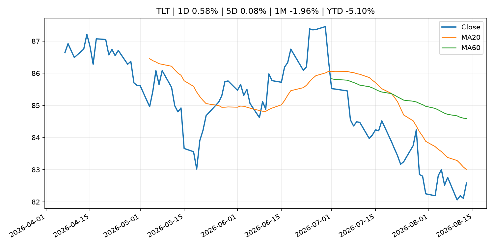
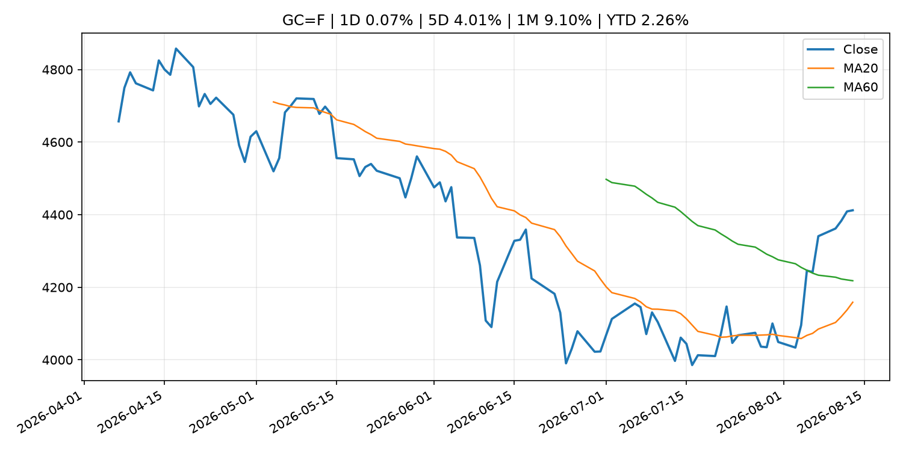
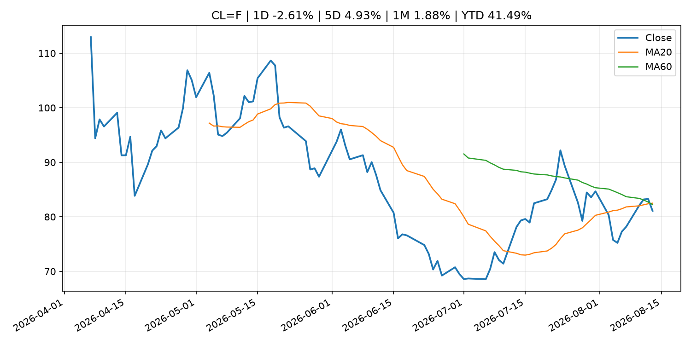
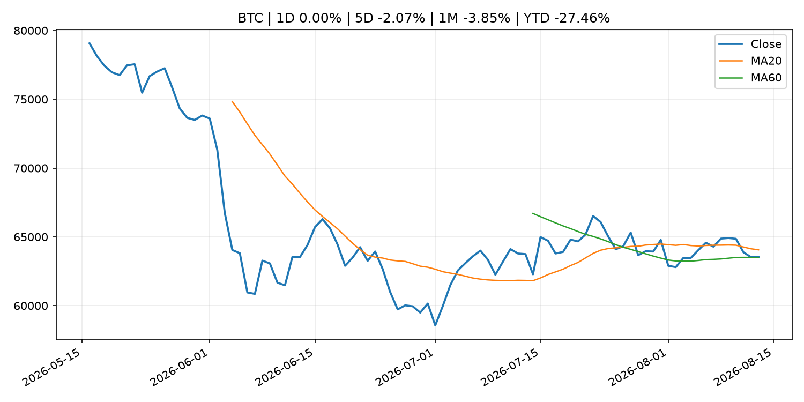
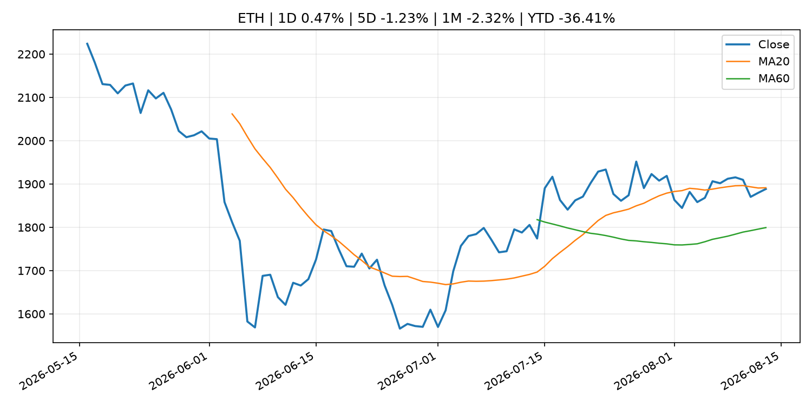
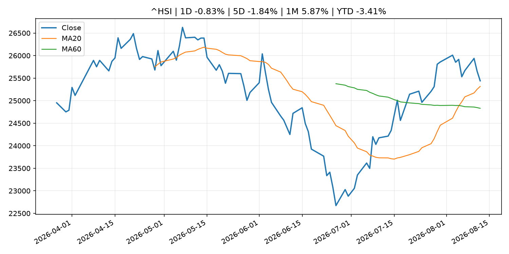

# Global Macro Morning Briefing - 2026-08-14

> Not financial advice / 非投资建议。

## 0. 今日总览
- 市场状态：risk_on。股指上涨、波动率或美元回落，市场更接近风险偏好改善。
- 今日三大主线：
  1. macro_data: Bitcoin slips near $63,500 as traders look past CPI to Fed’s next tests
  2. central_bank_decision: Live updates: Bitcoin slips back even as Fed rate hike expectations dwindle
  3. fiscal_policy: (Research Paper) Market Operations in Fiscal 2025
- 一句话结论：今日晨报重点关注：这类宏观数据会直接改变市场对通胀、增长和政策路径的预期。；央行决策会重定价利率、汇率、久期资产和风险资产。。跨资产方面，SPY 1D 0.70%；QQQ 1D 1.16%；^VIX 1D 0.55%；TLT 1D 0.58%；GC=F 1D 0.07%；CL=F 1D -2.61%；BTC 1D 0.00%；ETH 1D 0.47%；股指上涨、波动率或美元回落，市场更接近风险偏好改善。政策、通胀、利率、美元、美债、能源和加密监管仍是主要观察线索。所有结论仅基于公开数据与短摘要整理，不构成投资建议。

## 1. 隔夜跨资产市场
- 美股：SPY 1D 0.70%，QQQ 1D 1.16%，整体趋势需结合 VIX 和利率确认。
- 美债/美元：TLT 1D 0.58%，美元指数 1D -0.06%，是判断折现率压力的核心线索。
- 黄金/原油：黄金 1D 0.07%，原油 1D -2.61%，用于观察避险、通胀和地缘风险。
- 加密：BTC 1D 0.00%，ETH 1D 0.47%，关注是否独立于纳指走出加密自身行情。
- 港股/A股：恒生 1D -0.83%，沪深300/上证 1D n/a，重点看中国政策预期与人民币线索。
- 风险观察：确认风险偏好是否扩散到小盘股、信用利差和周期品。

### US_EQUITY

| symbol | latest close | 1D | 5D | 1M | YTD | trend |
|---|---:|---:|---:|---:|---:|---|
| SPY | 777.88 | 0.70% | 1.21% | 3.06% | 13.86% | strong_uptrend |
| QQQ | 732.07 | 1.16% | 2.44% | 2.00% | 19.40% | range_bound |
| DIA | 537.91 | 0.14% | -0.05% | 2.27% | 11.22% | uptrend |
| IWM | 303.50 | 0.26% | 1.76% | 2.61% | 22.00% | uptrend |
| VTI | 384.30 | 0.65% | 1.38% | 3.19% | 14.27% | strong_uptrend |

### US_MACRO_MARKET

| symbol | latest close | 1D | 5D | 1M | YTD | trend |
|---|---:|---:|---:|---:|---:|---|
| ^VIX | 14.63 | 0.55% | -3.43% | -2.66% | 0.83% | downtrend |
| DX-Y.NYB | 99.95 | -0.06% | -0.02% | -1.01% | 1.55% | range_bound |
| TLT | 82.59 | 0.58% | 0.08% | -1.96% | -5.10% | downtrend |
| IEF | 93.30 | 0.37% | 0.38% | -0.27% | -2.89% | range_bound |

### COMMODITIES

| symbol | latest close | 1D | 5D | 1M | YTD | trend |
|---|---:|---:|---:|---:|---:|---|
| GC=F | 4,412.10 | 0.07% | 4.01% | 9.10% | 2.26% | range_bound |
| SI=F | 64.61 | -1.43% | 5.17% | 13.14% | -8.42% | range_bound |
| CL=F | 81.10 | -2.61% | 4.93% | 1.88% | 41.49% | range_bound |
| BZ=F | 86.94 | -2.29% | 5.39% | 2.34% | 43.11% | range_bound |
| NG=F | 2.73 | -2.57% | 3.48% | -6.57% | -24.49% | strong_downtrend |
| HG=F | 6.59 | -0.17% | -1.51% | 4.65% | 16.77% | strong_uptrend |

### HK_MARKET

| symbol | latest close | 1D | 5D | 1M | YTD | trend |
|---|---:|---:|---:|---:|---:|---|
| ^HSI | 25,440.17 | -0.83% | -1.84% | 5.87% | -3.41% | strong_uptrend |
| 0700.HK | 441.00 | -4.46% | -7.97% | -6.96% | -29.21% | range_bound |
| 9988.HK | 121.90 | -0.57% | -2.01% | 7.50% | -18.19% | strong_uptrend |
| 3690.HK | 91.25 | -0.44% | -1.03% | 9.41% | -12.76% | strong_uptrend |
| 1810.HK | 25.88 | -1.82% | -3.65% | 0.08% | -35.75% | range_bound |
| 1211.HK | 88.40 | -1.34% | -1.61% | 1.67% | -10.48% | range_bound |

### CRYPTO

| symbol | latest close | 1D | 5D | 1M | YTD | trend |
|---|---:|---:|---:|---:|---:|---|
| BTC | 63,529.99 | 0.00% | -2.07% | -3.85% | -27.46% | range_bound |
| ETH | 1,888.55 | 0.47% | -1.23% | -2.32% | -36.41% | range_bound |
| SOLANA | 76.32 | 0.18% | 3.72% | -2.07% | -38.71% | range_bound |
| BINANCECOIN | 610.66 | -0.98% | 3.19% | 7.00% | -29.21% | strong_uptrend |
| RIPPLE | 1.01 | -1.21% | -1.01% | -11.55% | -45.15% | strong_downtrend |

## 2. 今日最重要的 10 条新闻
### 1. Bitcoin slips near $63,500 as traders look past CPI to Fed’s next tests
- 来源：CoinDesk
- 时间：2026-08-13T03:39:06+00:00
- 地区：global
- 事件类型：macro_data
- 重要性层级：Tier 1
- 一句话摘要：Bitcoin slips near $63,500 as traders look past CPI to Fed’s next tests
- 为什么重要：这类宏观数据会直接改变市场对通胀、增长和政策路径的预期。
- 可能影响：主要影响 DXY，方向为 positive，强度 high；通胀压力可能推高政策利率预期并支撑美元。
  - 资产：DXY
    方向：positive
    强度：high
    原因：通胀压力可能推高政策利率预期并支撑美元。
  - 资产：TLT
    方向：negative
    强度：high
    原因：通胀上行通常推升收益率、压低长债价格。
  - 资产：QQQ
    方向：negative
    强度：high
    原因：更高利率对成长股估值折现率不利。
  - 资产：SPY
    方向：mixed
    强度：medium
    原因：名义增长可能支撑收入，但更高利率压制估值。
  - 资产：GC=F
    方向：mixed
    强度：medium
    原因：通胀对黄金是支撑，但实际利率上行会形成压力。
  - 资产：BTC
    方向：mixed
    强度：medium
    原因：抗通胀叙事和流动性收紧可能相互抵消。
- 原文链接：[https://www.coindesk.com/markets/2026/08/13/bitcoin-slips-near-usd63-500-as-traders-look-past-cpi-to-fed-s-next-tests](https://www.coindesk.com/markets/2026/08/13/bitcoin-slips-near-usd63-500-as-traders-look-past-cpi-to-fed-s-next-tests)

### 2. Live updates: Bitcoin slips back even as Fed rate hike expectations dwindle
- 来源：CoinDesk
- 时间：2026-08-13T09:18:19+00:00
- 地区：global
- 事件类型：central_bank_decision
- 重要性层级：Tier 1
- 一句话摘要：Live updates: Bitcoin slips back even as Fed rate hike expectations dwindle
- 为什么重要：央行决策会重定价利率、汇率、久期资产和风险资产。
- 可能影响：主要影响 QQQ，方向为 negative，强度 high；鹰派政策提高折现率，压制成长股估值。
  - 资产：QQQ
    方向：negative
    强度：high
    原因：鹰派政策提高折现率，压制成长股估值。
  - 资产：SPY
    方向：negative
    强度：medium
    原因：更紧政策通常削弱风险偏好。
  - 资产：TLT
    方向：negative
    强度：high
    原因：利率上行通常压低长债价格。
  - 资产：DXY
    方向：positive
    强度：high
    原因：更高利率预期通常支撑美元。
  - 资产：BTC
    方向：negative
    强度：high
    原因：流动性收紧通常压制高 beta 加密资产。
- 原文链接：[https://www.coindesk.com/tech/2026/08/13/live-markets-u-s-inflation-is-stickier-than-july-s-mild-cpi-suggests](https://www.coindesk.com/tech/2026/08/13/live-markets-u-s-inflation-is-stickier-than-july-s-mild-cpi-suggests)

### 3. (Research Paper) Market Operations in Fiscal 2025
- 来源：Bank of Japan Announcements
- 时间：2026-08-12T16:00:00+09:00
- 地区：Japan
- 事件类型：fiscal_policy
- 重要性层级：Tier 1
- 一句话摘要：(Research Paper) Market Operations in Fiscal 2025
- 为什么重要：财政和贸易政策会影响增长、通胀、企业利润和跨境资本流。
- 可能影响：可能影响利率、汇率、风险资产或大宗商品预期，但当前公开信息不足以判断明确方向。
  - 资产：暂无明确资产映射
  - 方向：unknown
  - 强度：low
  - 原因：公开信息不足以判断方向。
- 原文链接：[http://www.boj.or.jp/en/research/brp/mor/mor260812.htm](http://www.boj.or.jp/en/research/brp/mor/mor260812.htm)

### 4. SEC Charges Toms River Trio in Connection with Alleged $47 Million Fraud Targeting Orthodox Jewish Communities
- 来源：SEC Press Releases
- 时间：2026-08-13T16:32:19-04:00
- 地区：US
- 事件类型：regulation
- 重要性层级：Tier 2
- 一句话摘要：The Securities and Exchange Commission today charged three Toms River, New Jersey residents for their roles in an affinity investment fraud that raised approximately $47 million from more than 87 investors, who were primarily members of Orthodox Jewish…
- 为什么重要：监管变化会改变行业盈利预期和资产风险溢价。
- 可能影响：主要影响 BTC，方向为 mixed，强度 high；加密监管或 ETF 进展会改变 BTC 的资金流和风险溢价。
  - 资产：BTC
    方向：mixed
    强度：high
    原因：加密监管或 ETF 进展会改变 BTC 的资金流和风险溢价。
  - 资产：ETH
    方向：mixed
    强度：high
    原因：监管框架会影响 ETH 产品化和机构参与度。
  - 资产：COIN
    方向：mixed
    强度：medium
    原因：监管清晰度和执法风险会影响交易平台估值。
  - 资产：crypto market
    方向：mixed
    强度：high
    原因：信息影响整个加密市场结构，但方向取决于细节。
- 原文链接：[https://www.sec.gov/newsroom/press-releases/2026-74-sec-charges-toms-river-trio-connection-alleged-47-million-fraud-targeting-orthodox-jewish](https://www.sec.gov/newsroom/press-releases/2026-74-sec-charges-toms-river-trio-connection-alleged-47-million-fraud-targeting-orthodox-jewish)

### 5. SEC cancels long-awaited proposal of Reg Crypto, postponing meeting without new date
- 来源：CoinDesk
- 时间：2026-08-13T22:18:07+00:00
- 地区：global
- 事件类型：regulation
- 重要性层级：Tier 2
- 一句话摘要：SEC cancels long-awaited proposal of Reg Crypto, postponing meeting without new date
- 为什么重要：监管变化会改变行业盈利预期和资产风险溢价。
- 可能影响：主要影响 BTC，方向为 mixed，强度 high；加密监管或 ETF 进展会改变 BTC 的资金流和风险溢价。
  - 资产：BTC
    方向：mixed
    强度：high
    原因：加密监管或 ETF 进展会改变 BTC 的资金流和风险溢价。
  - 资产：ETH
    方向：mixed
    强度：high
    原因：监管框架会影响 ETH 产品化和机构参与度。
  - 资产：COIN
    方向：mixed
    强度：medium
    原因：监管清晰度和执法风险会影响交易平台估值。
  - 资产：crypto market
    方向：mixed
    强度：high
    原因：信息影响整个加密市场结构，但方向取决于细节。
- 原文链接：[https://www.coindesk.com/policy/2026/08/13/sec-cancels-long-awaited-proposal-of-reg-crypto-postponing-meeting-without-new-date](https://www.coindesk.com/policy/2026/08/13/sec-cancels-long-awaited-proposal-of-reg-crypto-postponing-meeting-without-new-date)

### 6. Tether says it completed long-promised 'Big Four' audit of finances behind $180 billion USDT stablecoin
- 来源：CoinDesk
- 时间：2026-08-13T18:26:21+00:00
- 地区：global
- 事件类型：crypto_market_structure
- 重要性层级：Tier 2
- 一句话摘要：Tether says it completed long-promised 'Big Four' audit of finances behind $180 billion USDT stablecoin
- 为什么重要：加密市场结构和监管变化会影响 BTC、ETH 及相关股票的风险溢价。
- 可能影响：主要影响 BTC，方向为 mixed，强度 high；加密监管或 ETF 进展会改变 BTC 的资金流和风险溢价。
  - 资产：BTC
    方向：mixed
    强度：high
    原因：加密监管或 ETF 进展会改变 BTC 的资金流和风险溢价。
  - 资产：ETH
    方向：mixed
    强度：high
    原因：监管框架会影响 ETH 产品化和机构参与度。
  - 资产：COIN
    方向：mixed
    强度：medium
    原因：监管清晰度和执法风险会影响交易平台估值。
  - 资产：crypto market
    方向：mixed
    强度：high
    原因：信息影响整个加密市场结构，但方向取决于细节。
- 原文链接：[https://www.coindesk.com/business/2026/08/13/tether-says-it-completed-long-promised-big-four-audit-of-finances-behind-usd180-billion-usdt-stablecoin](https://www.coindesk.com/business/2026/08/13/tether-says-it-completed-long-promised-big-four-audit-of-finances-behind-usd180-billion-usdt-stablecoin)

### 7. Federal Reserve Board issues enforcement action with former employee of Regions Bank
- 来源：Federal Reserve Press Releases
- 时间：2026-08-13T15:00:00+00:00
- 地区：US
- 事件类型：regulation
- 重要性层级：Tier 2
- 一句话摘要：Federal Reserve Board issues enforcement action with former employee of Regions Bank
- 为什么重要：监管变化会改变行业盈利预期和资产风险溢价。
- 可能影响：可能影响利率、汇率、风险资产或大宗商品预期，但当前公开信息不足以判断明确方向。
  - 资产：暂无明确资产映射
  - 方向：unknown
  - 强度：low
  - 原因：公开信息不足以判断方向。
- 原文链接：[https://www.federalreserve.gov/newsevents/pressreleases/enforcement20260813a.htm](https://www.federalreserve.gov/newsevents/pressreleases/enforcement20260813a.htm)

### 8. Dell’s stock has beaten Micron and AMD this year — and now it’s adding to its gains
- 来源：MarketWatch Top Stories
- 时间：2026-08-13T22:09:00+00:00
- 地区：US
- 事件类型：earnings
- 重要性层级：Tier 2
- 一句话摘要：Shares of Dell have roughly quadrupled in price this year, with Lenovo’s earnings report helping to drive the latest bout of momentum for the PC and server maker.
- 为什么重要：大型科技股盈利和资本开支会影响纳指、半导体和 AI 交易主线。
- 可能影响：可能影响利率、汇率、风险资产或大宗商品预期，但当前公开信息不足以判断明确方向。
  - 资产：暂无明确资产映射
  - 方向：unknown
  - 强度：low
  - 原因：公开信息不足以判断方向。
- 原文链接：[https://www.marketwatch.com/story/dells-stock-has-beaten-micron-and-amd-this-year-and-now-its-adding-to-its-gains-11c00117?mod=mw_rss_topstories](https://www.marketwatch.com/story/dells-stock-has-beaten-micron-and-amd-this-year-and-now-its-adding-to-its-gains-11c00117?mod=mw_rss_topstories)

### 9. These charts show why stocks keep rallying. Profit margins are the highest on record
- 来源：CNBC Economy
- 时间：2026-08-13T20:21:51+00:00
- 地区：US
- 事件类型：earnings
- 重要性层级：Tier 2
- 一句话摘要：Recent FactSet data show that the rise in earnings is not coming from sales growth alone.
- 为什么重要：大型科技股盈利和资本开支会影响纳指、半导体和 AI 交易主线。
- 可能影响：可能影响利率、汇率、风险资产或大宗商品预期，但当前公开信息不足以判断明确方向。
  - 资产：暂无明确资产映射
  - 方向：unknown
  - 强度：low
  - 原因：公开信息不足以判断方向。
- 原文链接：[https://www.cnbc.com/2026/08/13/these-charts-show-why-stocks-keep-rallying-profit-margins-are-highest-on-record.html](https://www.cnbc.com/2026/08/13/these-charts-show-why-stocks-keep-rallying-profit-margins-are-highest-on-record.html)

### 10. Swissquote cuts full-year guidance as 1H crypto income plunges, shares slide
- 来源：CoinDesk
- 时间：2026-08-13T13:41:32+00:00
- 地区：global
- 事件类型：earnings
- 重要性层级：Tier 2
- 一句话摘要：Swissquote cuts full-year guidance as 1H crypto income plunges, shares slide
- 为什么重要：大型科技股盈利和资本开支会影响纳指、半导体和 AI 交易主线。
- 可能影响：可能影响利率、汇率、风险资产或大宗商品预期，但当前公开信息不足以判断明确方向。
  - 资产：暂无明确资产映射
  - 方向：unknown
  - 强度：low
  - 原因：公开信息不足以判断方向。
- 原文链接：[https://www.coindesk.com/business/2026/08/13/swissquote-cuts-full-year-guidance-as-1h-crypto-income-plunges-shares-slide](https://www.coindesk.com/business/2026/08/13/swissquote-cuts-full-year-guidance-as-1h-crypto-income-plunges-shares-slide)

## 3. 政策与央行观察
### 1. Live updates: Bitcoin slips back even as Fed rate hike expectations dwindle
- 来源：CoinDesk
- 时间：2026-08-13T09:18:19+00:00
- 地区：global
- 事件类型：central_bank_decision
- 重要性层级：Tier 1
- 一句话摘要：Live updates: Bitcoin slips back even as Fed rate hike expectations dwindle
- 为什么重要：央行决策会重定价利率、汇率、久期资产和风险资产。
- 可能影响：主要影响 QQQ，方向为 negative，强度 high；鹰派政策提高折现率，压制成长股估值。
  - 资产：QQQ
    方向：negative
    强度：high
    原因：鹰派政策提高折现率，压制成长股估值。
  - 资产：SPY
    方向：negative
    强度：medium
    原因：更紧政策通常削弱风险偏好。
  - 资产：TLT
    方向：negative
    强度：high
    原因：利率上行通常压低长债价格。
  - 资产：DXY
    方向：positive
    强度：high
    原因：更高利率预期通常支撑美元。
  - 资产：BTC
    方向：negative
    强度：high
    原因：流动性收紧通常压制高 beta 加密资产。
- 原文链接：[https://www.coindesk.com/tech/2026/08/13/live-markets-u-s-inflation-is-stickier-than-july-s-mild-cpi-suggests](https://www.coindesk.com/tech/2026/08/13/live-markets-u-s-inflation-is-stickier-than-july-s-mild-cpi-suggests)

### 2. (Research Paper) Market Operations in Fiscal 2025
- 来源：Bank of Japan Announcements
- 时间：2026-08-12T16:00:00+09:00
- 地区：Japan
- 事件类型：fiscal_policy
- 重要性层级：Tier 1
- 一句话摘要：(Research Paper) Market Operations in Fiscal 2025
- 为什么重要：财政和贸易政策会影响增长、通胀、企业利润和跨境资本流。
- 可能影响：可能影响利率、汇率、风险资产或大宗商品预期，但当前公开信息不足以判断明确方向。
  - 资产：暂无明确资产映射
  - 方向：unknown
  - 强度：low
  - 原因：公开信息不足以判断方向。
- 原文链接：[http://www.boj.or.jp/en/research/brp/mor/mor260812.htm](http://www.boj.or.jp/en/research/brp/mor/mor260812.htm)

### 3. SEC Charges Toms River Trio in Connection with Alleged $47 Million Fraud Targeting Orthodox Jewish Communities
- 来源：SEC Press Releases
- 时间：2026-08-13T16:32:19-04:00
- 地区：US
- 事件类型：regulation
- 重要性层级：Tier 2
- 一句话摘要：The Securities and Exchange Commission today charged three Toms River, New Jersey residents for their roles in an affinity investment fraud that raised approximately $47 million from more than 87 investors, who were primarily members of Orthodox Jewish…
- 为什么重要：监管变化会改变行业盈利预期和资产风险溢价。
- 可能影响：主要影响 BTC，方向为 mixed，强度 high；加密监管或 ETF 进展会改变 BTC 的资金流和风险溢价。
  - 资产：BTC
    方向：mixed
    强度：high
    原因：加密监管或 ETF 进展会改变 BTC 的资金流和风险溢价。
  - 资产：ETH
    方向：mixed
    强度：high
    原因：监管框架会影响 ETH 产品化和机构参与度。
  - 资产：COIN
    方向：mixed
    强度：medium
    原因：监管清晰度和执法风险会影响交易平台估值。
  - 资产：crypto market
    方向：mixed
    强度：high
    原因：信息影响整个加密市场结构，但方向取决于细节。
- 原文链接：[https://www.sec.gov/newsroom/press-releases/2026-74-sec-charges-toms-river-trio-connection-alleged-47-million-fraud-targeting-orthodox-jewish](https://www.sec.gov/newsroom/press-releases/2026-74-sec-charges-toms-river-trio-connection-alleged-47-million-fraud-targeting-orthodox-jewish)

### 4. SEC cancels long-awaited proposal of Reg Crypto, postponing meeting without new date
- 来源：CoinDesk
- 时间：2026-08-13T22:18:07+00:00
- 地区：global
- 事件类型：regulation
- 重要性层级：Tier 2
- 一句话摘要：SEC cancels long-awaited proposal of Reg Crypto, postponing meeting without new date
- 为什么重要：监管变化会改变行业盈利预期和资产风险溢价。
- 可能影响：主要影响 BTC，方向为 mixed，强度 high；加密监管或 ETF 进展会改变 BTC 的资金流和风险溢价。
  - 资产：BTC
    方向：mixed
    强度：high
    原因：加密监管或 ETF 进展会改变 BTC 的资金流和风险溢价。
  - 资产：ETH
    方向：mixed
    强度：high
    原因：监管框架会影响 ETH 产品化和机构参与度。
  - 资产：COIN
    方向：mixed
    强度：medium
    原因：监管清晰度和执法风险会影响交易平台估值。
  - 资产：crypto market
    方向：mixed
    强度：high
    原因：信息影响整个加密市场结构，但方向取决于细节。
- 原文链接：[https://www.coindesk.com/policy/2026/08/13/sec-cancels-long-awaited-proposal-of-reg-crypto-postponing-meeting-without-new-date](https://www.coindesk.com/policy/2026/08/13/sec-cancels-long-awaited-proposal-of-reg-crypto-postponing-meeting-without-new-date)

### 5. Tether says it completed long-promised 'Big Four' audit of finances behind $180 billion USDT stablecoin
- 来源：CoinDesk
- 时间：2026-08-13T18:26:21+00:00
- 地区：global
- 事件类型：crypto_market_structure
- 重要性层级：Tier 2
- 一句话摘要：Tether says it completed long-promised 'Big Four' audit of finances behind $180 billion USDT stablecoin
- 为什么重要：加密市场结构和监管变化会影响 BTC、ETH 及相关股票的风险溢价。
- 可能影响：主要影响 BTC，方向为 mixed，强度 high；加密监管或 ETF 进展会改变 BTC 的资金流和风险溢价。
  - 资产：BTC
    方向：mixed
    强度：high
    原因：加密监管或 ETF 进展会改变 BTC 的资金流和风险溢价。
  - 资产：ETH
    方向：mixed
    强度：high
    原因：监管框架会影响 ETH 产品化和机构参与度。
  - 资产：COIN
    方向：mixed
    强度：medium
    原因：监管清晰度和执法风险会影响交易平台估值。
  - 资产：crypto market
    方向：mixed
    强度：high
    原因：信息影响整个加密市场结构，但方向取决于细节。
- 原文链接：[https://www.coindesk.com/business/2026/08/13/tether-says-it-completed-long-promised-big-four-audit-of-finances-behind-usd180-billion-usdt-stablecoin](https://www.coindesk.com/business/2026/08/13/tether-says-it-completed-long-promised-big-four-audit-of-finances-behind-usd180-billion-usdt-stablecoin)

### 6. Federal Reserve Board issues enforcement action with former employee of Regions Bank
- 来源：Federal Reserve Press Releases
- 时间：2026-08-13T15:00:00+00:00
- 地区：US
- 事件类型：regulation
- 重要性层级：Tier 2
- 一句话摘要：Federal Reserve Board issues enforcement action with former employee of Regions Bank
- 为什么重要：监管变化会改变行业盈利预期和资产风险溢价。
- 可能影响：可能影响利率、汇率、风险资产或大宗商品预期，但当前公开信息不足以判断明确方向。
  - 资产：暂无明确资产映射
  - 方向：unknown
  - 强度：low
  - 原因：公开信息不足以判断方向。
- 原文链接：[https://www.federalreserve.gov/newsevents/pressreleases/enforcement20260813a.htm](https://www.federalreserve.gov/newsevents/pressreleases/enforcement20260813a.htm)

## 4. 市场异动与图表
- SPY 上涨 0.70%
- QQQ 上涨 1.16%
- TLT 上涨 0.58%
- Oil 下跌 -2.61%

### SPY

### QQQ

### ^VIX

### TLT

### GC=F

### CL=F

### BTC

### ETH

### ^HSI

## 5. 华尔街与机构公开观点
- 暂无可靠公开观点。

## 6. 今日重点关注
- 经济数据：经济数据：暂无可靠公开日历数据；如配置经济日历源后可自动填充。
- 央行讲话：央行讲话：暂无可靠公开日历数据；重点跟踪 Fed、ECB、BoJ、PBOC 官网 RSS。
- 财报：财报：暂无可靠数据。
- 政策事件：政策事件：暂无可靠数据。
- 风险提醒：风险提醒：关注数据源失败项、突发地缘风险、利率和美元的二阶反应。

## 7. 英文金融表达与宏观概念
- **inflation expectations**：通胀预期，指家庭、企业或市场对未来通胀的预估。 例句：Inflation expectations can shape wage bargaining and bond yields.
- **terminal rate**：终端利率，市场预期本轮加息周期的最高政策利率。 例句：A higher terminal rate can pressure growth stocks.
- **market structure**：市场结构，指交易、托管、清算、ETF、监管等制度安排。 例句：Crypto market structure rules can affect institutional participation.
- **real yield**：实际收益率，名义利率扣除通胀预期后的收益率。 例句：Gold often reacts more to real yields than nominal yields.
- **soft landing**：软着陆，指通胀回落而经济避免明显衰退。 例句：Markets often rally when data support a soft landing.
- **risk-off**：避险模式，资金偏向美元、国债、黄金等防御资产。 例句：A geopolitical shock can push markets into risk-off mode.

## 8. 背景材料
- [Can I claim 50% of my husband’s Social Security now — and switch to my higher benefit at 70?](https://www.marketwatch.com/story/can-i-claim-50-of-my-husbands-social-security-now-and-switch-to-my-higher-benefit-at-70-5518700b?mod=mw_rss_topstories)（MarketWatch Top Stories，other）：“I would like to offer a piece of advice for women who are or have been married.”
- [Forecasts for $1 million bitcoin price likely look too ambitious, key ratio suggests](https://www.coindesk.com/markets/2026/08/13/forecasts-for-usd1-million-bitcoin-price-likely-look-too-ambitious-key-ratio-suggests)（CoinDesk，other）：Forecasts for $1 million bitcoin price likely look too ambitious, key ratio suggests
- [Strategy, Metaplanet unrealized bitcoin losses highlight risk of concentrating on just one token](https://www.coindesk.com/daybook-us/2026/08/13/strategy-metaplanet-unrealized-bitcoin-losses-highlight-risk-of-concentrating-on-just-one-token)（CoinDesk，other）：Strategy, Metaplanet unrealized bitcoin losses highlight risk of concentrating on just one token
- [Bitcoin holds steady near $64,000 as monero, hyperliquid outperform](https://www.coindesk.com/markets/2026/08/13/bitcoin-holds-steady-near-usd64-000-as-monero-hyperliquid-outperform)（CoinDesk，other）：Bitcoin holds steady near $64,000 as monero, hyperliquid outperform
- [Brazil’s largest bitcoin treasury firm plans ETF with 95% allocation to Strategy's STRC](https://www.coindesk.com/business/2026/08/13/brazil-s-largest-bitcoin-treasury-firm-plans-etf-with-95-allocation-to-strategy-s-strc)（CoinDesk，other）：Brazil’s largest bitcoin treasury firm plans ETF with 95% allocation to Strategy's STRC
- [Bitcoin treasury company Metaplanet unveils BitBonds with $1.3 million private debt sale](https://www.coindesk.com/markets/2026/08/13/bitcoin-treasury-company-metaplanet-unveils-bitbonds-with-usd1-3-million-private-debt-sale)（CoinDesk，other）：Bitcoin treasury company Metaplanet unveils BitBonds with $1.3 million private debt sale
- [Cash remains most widely accepted payment method in euro area](https://www.ecb.europa.eu//press/pr/date/2026/html/ecb.pr260813~389729d6a9.en.html)（ECB Press Releases，other）：Cash remains most widely accepted payment method in euro area
- [Japanese Government Bonds Held by the Bank of Japan](http://www.boj.or.jp/en/statistics/boj/other/mei/release/2026/mei260810.xlsx)（Bank of Japan Announcements，other）：Japanese Government Bonds Held by the Bank of Japan
- [Basic Figures on Fails (July)](http://www.boj.or.jp/en/statistics/set/bffail/sjgb2607.pdf)（Bank of Japan Announcements，other）：Basic Figures on Fails (July)
- [Metaplanet denies selling bitcoin worth $320 million](https://www.coindesk.com/markets/2026/08/13/metaplanet-denies-selling-bitcoin-worth-usd320-million)（CoinDesk，other）：Metaplanet denies selling bitcoin worth $320 million
- [Bitcoin firms ask AI labs for same tools attackers already have](https://www.coindesk.com/tech/2026/08/13/bitcoin-firms-ask-ai-labs-for-same-tools-attackers-already-have)（CoinDesk，other）：Bitcoin firms ask AI labs for same tools attackers already have
- [Bank of Japan Accounts (August 10)](http://www.boj.or.jp/en/statistics/boj/other/acmai/release/2026/ac260810.htm)（Bank of Japan Announcements，routine_announcement）：Bank of Japan Accounts (August 10)
- [Corporate Goods Price Index (July)](http://www.boj.or.jp/en/statistics/pi/cgpi_release/cgpi2607.pdf)（Bank of Japan Announcements，other）：Corporate Goods Price Index (July)
- [Goldman Sachs leaps into bitcoin income ETFs with $2.25 billion NEOS buyout](https://www.coindesk.com/business/2026/08/12/goldman-sachs-leaps-into-bitcoin-income-etfs-with-usd2-25-billion-neos-buyout)（CoinDesk，other）：Goldman Sachs leaps into bitcoin income ETFs with $2.25 billion NEOS buyout
- [(Research Paper) Linkages of Firm Spending Behavior through Supply Chains](http://www.boj.or.jp/en/research/wps_rev/wps_2026/wp26e14.htm)（Bank of Japan Announcements，research_publication）：(Research Paper) Linkages of Firm Spending Behavior through Supply Chains
- [(Research Paper) Mapping Japan's Manufacturing Supply Chains Through Firm-to-Firm Transaction Data](http://www.boj.or.jp/en/research/wps_rev/wps_2026/wp26e13.htm)（Bank of Japan Announcements，research_publication）：(Research Paper) Mapping Japan's Manufacturing Supply Chains Through Firm-to-Firm Transaction Data
- [Money Stock (July)](http://www.boj.or.jp/en/statistics/money/ms/ms2607.pdf)（Bank of Japan Announcements，other）：Money Stock (July)

## 9. 数据源、失败项与免责声明
- 采集时间：2026-08-13T22:39:11
- 数据源：公开 RSS、Yahoo Finance、CoinGecko、AKShare、FRED、SEC data.sec.gov，以及用户自有 inputs/reports 文件。
- 合规说明：不绕过 WSJ、Bloomberg、FT、Reuters 等付费墙；对付费媒体只使用公开 RSS 标题、摘要、链接和发布时间。
- 免责声明：Not financial advice / 非投资建议。本项目仅供个人学习、研究和信息整理，不构成投资建议、交易建议或任何收益承诺。
- 失败或跳过的数据源：
  - crypto data failed coin=dogecoin
  - China market data failed symbol=上证指数: empty dataframe
  - China market data failed symbol=深证成指: empty dataframe
  - China market data failed symbol=创业板指: empty dataframe
  - China market data failed symbol=沪深300: empty dataframe
  - China market data failed symbol=中证500: empty dataframe
  - China market data failed symbol=科创50: empty dataframe
  - FRED_API_KEY not set; skipping FRED macro series
  - SEC failed cik=0000320193
  - SEC failed cik=0000789019
  - SEC failed cik=0001045810
  - SEC failed cik=0001318605
  - SEC failed cik=0001577552
