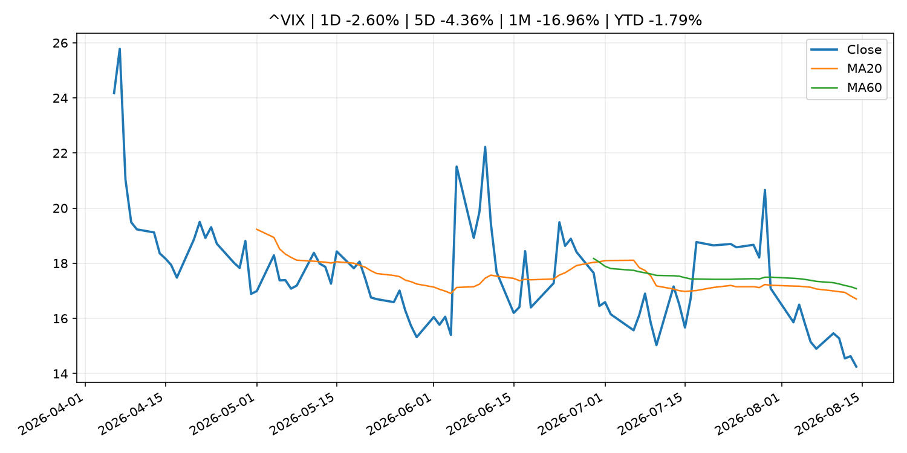
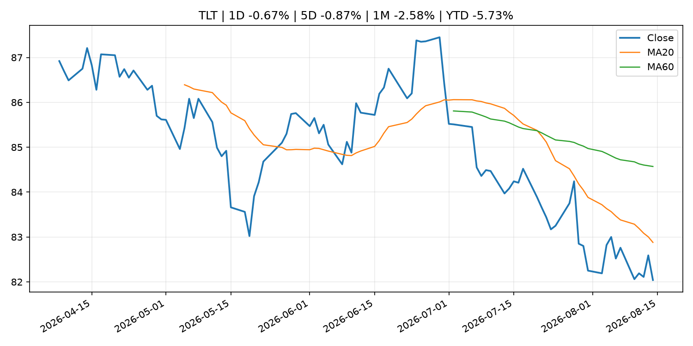
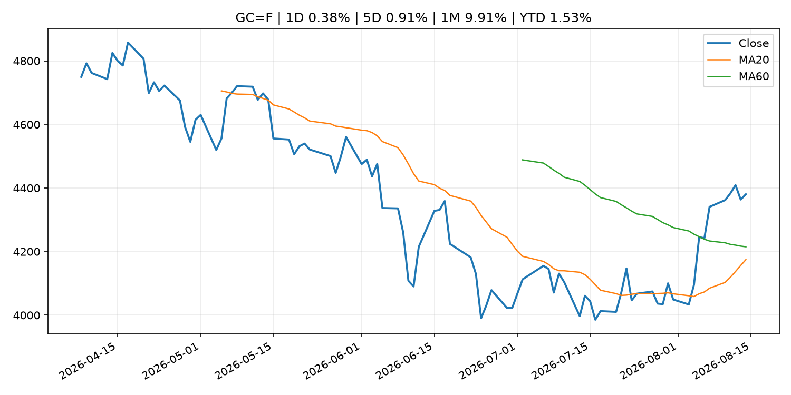
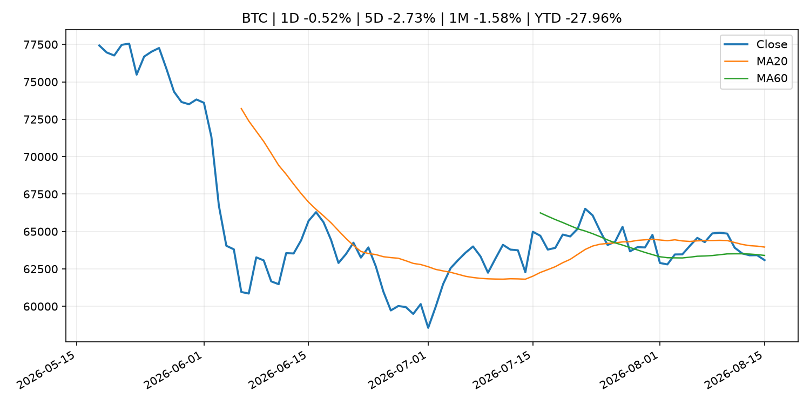
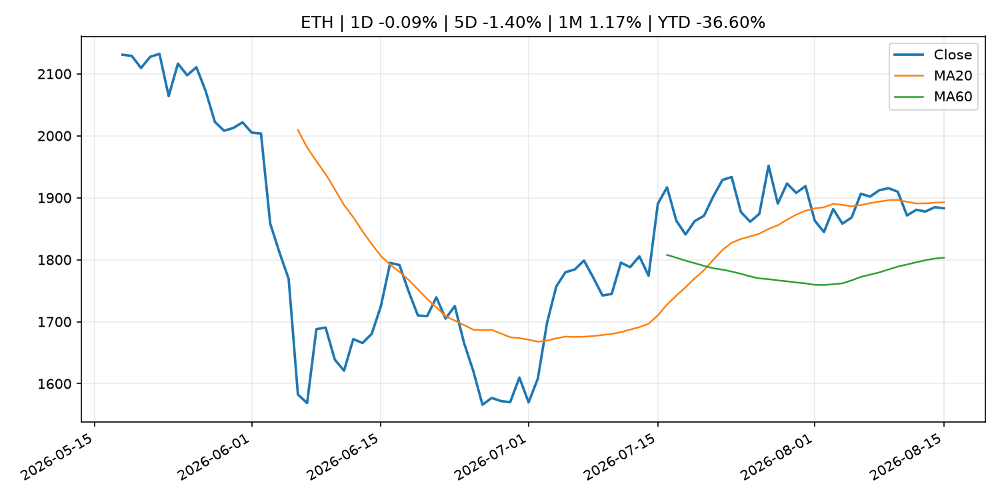

# Global Macro Morning Briefing - 2026-08-16

> Not financial advice / 非投资建议。

## 0. 今日总览
- 市场状态：unknown。市场信号不足，暂不判断明确状态。
- 今日三大主线：
  1. earnings: Goldman’s latest cash cow is all about funding the AI infrastructure boom
  2. regulation: SEC Charges Boiler Room Operator and Three Entities with Defrauding Retail Investors in $74 Million Pre-IPO Investment Scam
  3. regulation: Tokenization stocks slip as SEC delay puts 'speed bump' in crypto’s Wall Street push
- 一句话结论：今日晨报重点关注：大型科技股盈利和资本开支会影响纳指、半导体和 AI 交易主线。；监管变化会改变行业盈利预期和资产风险溢价。。跨资产方面，SPY 1D -0.20%；QQQ 1D -0.14%；^VIX 1D -2.60%；TLT 1D -0.67%；GC=F 1D 0.38%；CL=F 1D 1.42%；BTC 1D -0.52%；ETH 1D -0.09%；市场信号不足，暂不判断明确状态。政策、通胀、利率、美元、美债、能源和加密监管仍是主要观察线索。所有结论仅基于公开数据与短摘要整理，不构成投资建议。

## 1. 隔夜跨资产市场
- 美股：SPY 1D -0.20%，QQQ 1D -0.14%，整体趋势需结合 VIX 和利率确认。
- 美债/美元：TLT 1D -0.67%，美元指数 1D -0.29%，是判断折现率压力的核心线索。
- 黄金/原油：黄金 1D 0.38%，原油 1D 1.42%，用于观察避险、通胀和地缘风险。
- 加密：BTC 1D -0.52%，ETH 1D -0.09%，关注是否独立于纳指走出加密自身行情。
- 港股/A股：恒生 1D -1.10%，沪深300/上证 1D n/a，重点看中国政策预期与人民币线索。
- 风险观察：关注后续数据是否确认当前跨资产信号。

### US_EQUITY

| symbol | latest close | 1D | 5D | 1M | YTD | trend |
|---|---:|---:|---:|---:|---:|---|
| SPY | 776.34 | -0.20% | 0.40% | 3.41% | 13.64% | strong_uptrend |
| QQQ | 731.07 | -0.14% | 1.11% | 3.56% | 19.24% | range_bound |
| DIA | 536.80 | -0.21% | -0.52% | 2.28% | 10.99% | uptrend |
| IWM | 305.09 | 0.52% | 1.17% | 3.21% | 22.63% | strong_uptrend |
| VTI | 383.85 | -0.12% | 0.54% | 3.58% | 14.14% | strong_uptrend |

### US_MACRO_MARKET

| symbol | latest close | 1D | 5D | 1M | YTD | trend |
|---|---:|---:|---:|---:|---:|---|
| ^VIX | 14.25 | -2.60% | -4.36% | -16.96% | -1.79% | strong_downtrend |
| DX-Y.NYB | 99.67 | -0.29% | 0.07% | -1.59% | 1.27% | range_bound |
| TLT | 82.04 | -0.67% | -0.87% | -2.58% | -5.73% | downtrend |
| IEF | 93.04 | -0.28% | -0.14% | -0.73% | -3.16% | downtrend |

### COMMODITIES

| symbol | latest close | 1D | 5D | 1M | YTD | trend |
|---|---:|---:|---:|---:|---:|---|
| GC=F | 4,380.40 | 0.38% | 0.91% | 9.91% | 1.53% | range_bound |
| SI=F | 64.99 | 0.18% | 2.61% | 16.26% | -7.89% | range_bound |
| CL=F | 82.40 | 1.42% | 5.40% | 4.37% | 43.75% | range_bound |
| BZ=F | 88.52 | 1.67% | 5.95% | 5.09% | 45.71% | uptrend |
| NG=F | 2.73 | 0.22% | 2.67% | -4.37% | -24.46% | downtrend |
| HG=F | 6.60 | 0.11% | 0.44% | 4.82% | 17.01% | strong_uptrend |

### HK_MARKET

| symbol | latest close | 1D | 5D | 1M | YTD | trend |
|---|---:|---:|---:|---:|---:|---|
| ^HSI | 25,116.85 | -1.10% | -2.15% | 0.43% | -4.64% | range_bound |
| 0700.HK | 440.00 | -0.23% | -8.10% | -9.09% | -29.37% | range_bound |
| 9988.HK | 119.90 | -1.64% | -3.15% | 2.57% | -19.53% | uptrend |
| 3690.HK | 87.20 | -4.44% | -5.42% | 0.00% | -16.63% | range_bound |
| 1810.HK | 25.62 | -1.00% | -5.32% | -6.84% | -36.40% | range_bound |
| 1211.HK | 88.25 | -0.17% | -2.11% | -2.97% | -10.63% | range_bound |

### CRYPTO

| symbol | latest close | 1D | 5D | 1M | YTD | trend |
|---|---:|---:|---:|---:|---:|---|
| BTC | 63,087.20 | -0.52% | -2.73% | -1.58% | -27.96% | range_bound |
| ETH | 1,882.95 | -0.09% | -1.40% | 1.17% | -36.60% | range_bound |
| SOLANA | 75.55 | -0.88% | -0.94% | 2.20% | -39.33% | range_bound |
| BINANCECOIN | 608.94 | -0.24% | 1.02% | 7.91% | -29.41% | strong_uptrend |
| RIPPLE | 1.00 | -0.49% | -2.47% | -8.04% | -45.47% | strong_downtrend |

## 2. 今日最重要的 10 条新闻
### 1. Goldman’s latest cash cow is all about funding the AI infrastructure boom
- 来源：CNBC Economy
- 时间：2026-08-14T20:05:57+00:00
- 地区：US
- 事件类型：earnings
- 重要性层级：Tier 2
- 一句话摘要：Nvidia and Intel recently tapped the bank to help them meeting soaring demand for compute.
- 为什么重要：大型科技股盈利和资本开支会影响纳指、半导体和 AI 交易主线。
- 可能影响：主要影响 QQQ，方向为 mixed，强度 high；AI 资本开支会影响大型科技股盈利和估值预期。
  - 资产：QQQ
    方向：mixed
    强度：high
    原因：AI 资本开支会影响大型科技股盈利和估值预期。
  - 资产：SMH
    方向：mixed
    强度：high
    原因：AI 投资周期直接影响半导体需求。
  - 资产：NVDA
    方向：mixed
    强度：high
    原因：AI 训练和推理需求是英伟达收入预期核心变量。
  - 资产：MSFT
    方向：mixed
    强度：medium
    原因：云和 AI 资本开支影响利润率与增长叙事。
  - 资产：GOOGL
    方向：mixed
    强度：medium
    原因：AI 投资和搜索商业化影响估值。
  - 资产：META
    方向：mixed
    强度：medium
    原因：AI 基建支出与广告效率共同影响市场预期。
- 原文链接：[https://www.cnbc.com/2026/08/14/goldmans-latest-cash-cow-is-all-about-funding-the-ai-infrastructure-boom.html](https://www.cnbc.com/2026/08/14/goldmans-latest-cash-cow-is-all-about-funding-the-ai-infrastructure-boom.html)

### 2. SEC Charges Boiler Room Operator and Three Entities with Defrauding Retail Investors in $74 Million Pre-IPO Investment Scam
- 来源：SEC Press Releases
- 时间：2026-08-14T16:16:34-04:00
- 地区：US
- 事件类型：regulation
- 重要性层级：Tier 2
- 一句话摘要：The Securities and Exchange Commission today charged New York resident Andrew Spaventa and three entities he owned and controlled with fraud and other violations in connection with unregistered securities offerings of private funds that purportedly…
- 为什么重要：监管变化会改变行业盈利预期和资产风险溢价。
- 可能影响：主要影响 BTC，方向为 mixed，强度 high；加密监管或 ETF 进展会改变 BTC 的资金流和风险溢价。
  - 资产：BTC
    方向：mixed
    强度：high
    原因：加密监管或 ETF 进展会改变 BTC 的资金流和风险溢价。
  - 资产：ETH
    方向：mixed
    强度：high
    原因：监管框架会影响 ETH 产品化和机构参与度。
  - 资产：COIN
    方向：mixed
    强度：medium
    原因：监管清晰度和执法风险会影响交易平台估值。
  - 资产：crypto market
    方向：mixed
    强度：high
    原因：信息影响整个加密市场结构，但方向取决于细节。
- 原文链接：[https://www.sec.gov/newsroom/press-releases/2026-75-sec-charges-boiler-room-operator-three-entities-defrauding-retail-investors-74-million-pre-ipo](https://www.sec.gov/newsroom/press-releases/2026-75-sec-charges-boiler-room-operator-three-entities-defrauding-retail-investors-74-million-pre-ipo)

### 3. Tokenization stocks slip as SEC delay puts 'speed bump' in crypto’s Wall Street push
- 来源：CoinDesk
- 时间：2026-08-14T17:48:04+00:00
- 地区：global
- 事件类型：regulation
- 重要性层级：Tier 2
- 一句话摘要：Tokenization stocks slip as SEC delay puts 'speed bump' in crypto’s Wall Street push
- 为什么重要：监管变化会改变行业盈利预期和资产风险溢价。
- 可能影响：主要影响 BTC，方向为 mixed，强度 high；加密监管或 ETF 进展会改变 BTC 的资金流和风险溢价。
  - 资产：BTC
    方向：mixed
    强度：high
    原因：加密监管或 ETF 进展会改变 BTC 的资金流和风险溢价。
  - 资产：ETH
    方向：mixed
    强度：high
    原因：监管框架会影响 ETH 产品化和机构参与度。
  - 资产：COIN
    方向：mixed
    强度：medium
    原因：监管清晰度和执法风险会影响交易平台估值。
  - 资产：crypto market
    方向：mixed
    强度：high
    原因：信息影响整个加密市场结构，但方向取决于细节。
- 原文链接：[https://www.coindesk.com/markets/2026/08/14/tokenization-stocks-slip-as-sec-delay-puts-speed-bump-in-crypto-s-wall-street-push](https://www.coindesk.com/markets/2026/08/14/tokenization-stocks-slip-as-sec-delay-puts-speed-bump-in-crypto-s-wall-street-push)

### 4. U.S. SEC to again delay 'innovation exemption' for tokenization amid Wall Street, White House concerns
- 来源：CoinDesk
- 时间：2026-08-13T23:09:14+00:00
- 地区：global
- 事件类型：regulation
- 重要性层级：Tier 2
- 一句话摘要：U.S. SEC to again delay 'innovation exemption' for tokenization amid Wall Street, White House concerns
- 为什么重要：监管变化会改变行业盈利预期和资产风险溢价。
- 可能影响：主要影响 BTC，方向为 mixed，强度 high；加密监管或 ETF 进展会改变 BTC 的资金流和风险溢价。
  - 资产：BTC
    方向：mixed
    强度：high
    原因：加密监管或 ETF 进展会改变 BTC 的资金流和风险溢价。
  - 资产：ETH
    方向：mixed
    强度：high
    原因：监管框架会影响 ETH 产品化和机构参与度。
  - 资产：COIN
    方向：mixed
    强度：medium
    原因：监管清晰度和执法风险会影响交易平台估值。
  - 资产：crypto market
    方向：mixed
    强度：high
    原因：信息影响整个加密市场结构，但方向取决于细节。
- 原文链接：[https://www.coindesk.com/policy/2026/08/13/u-s-sec-to-again-delay-innovation-exemption-for-tokenization-amid-wall-street-white-house-concerns](https://www.coindesk.com/policy/2026/08/13/u-s-sec-to-again-delay-innovation-exemption-for-tokenization-amid-wall-street-white-house-concerns)

### 5. SEC cancels long-awaited proposal of Reg Crypto, postponing meeting without new date
- 来源：CoinDesk
- 时间：2026-08-13T22:18:07+00:00
- 地区：global
- 事件类型：regulation
- 重要性层级：Tier 2
- 一句话摘要：SEC cancels long-awaited proposal of Reg Crypto, postponing meeting without new date
- 为什么重要：监管变化会改变行业盈利预期和资产风险溢价。
- 可能影响：主要影响 BTC，方向为 mixed，强度 high；加密监管或 ETF 进展会改变 BTC 的资金流和风险溢价。
  - 资产：BTC
    方向：mixed
    强度：high
    原因：加密监管或 ETF 进展会改变 BTC 的资金流和风险溢价。
  - 资产：ETH
    方向：mixed
    强度：high
    原因：监管框架会影响 ETH 产品化和机构参与度。
  - 资产：COIN
    方向：mixed
    强度：medium
    原因：监管清晰度和执法风险会影响交易平台估值。
  - 资产：crypto market
    方向：mixed
    强度：high
    原因：信息影响整个加密市场结构，但方向取决于细节。
- 原文链接：[https://www.coindesk.com/policy/2026/08/13/sec-cancels-long-awaited-proposal-of-reg-crypto-postponing-meeting-without-new-date](https://www.coindesk.com/policy/2026/08/13/sec-cancels-long-awaited-proposal-of-reg-crypto-postponing-meeting-without-new-date)

### 6. Bitcoin slips as U.S. inflation fails to spark gains, ETFs see August's first two-day drawdown
- 来源：CoinDesk
- 时间：2026-08-14T11:06:12+00:00
- 地区：global
- 事件类型：other
- 重要性层级：Tier 3
- 一句话摘要：Bitcoin slips as U.S. inflation fails to spark gains, ETFs see August's first two-day drawdown
- 为什么重要：这条信息暂未匹配到重大宏观、政策或市场事件，更适合作为背景跟踪。
- 可能影响：主要影响 DXY，方向为 positive，强度 high；通胀压力可能推高政策利率预期并支撑美元。
  - 资产：DXY
    方向：positive
    强度：high
    原因：通胀压力可能推高政策利率预期并支撑美元。
  - 资产：TLT
    方向：negative
    强度：high
    原因：通胀上行通常推升收益率、压低长债价格。
  - 资产：QQQ
    方向：negative
    强度：high
    原因：更高利率对成长股估值折现率不利。
  - 资产：SPY
    方向：mixed
    强度：medium
    原因：名义增长可能支撑收入，但更高利率压制估值。
  - 资产：GC=F
    方向：mixed
    强度：medium
    原因：通胀对黄金是支撑，但实际利率上行会形成压力。
  - 资产：BTC
    方向：mixed
    强度：medium
    原因：抗通胀叙事和流动性收紧可能相互抵消。
- 原文链接：[https://www.coindesk.com/markets/2026/08/14/bitcoin-slips-as-u-s-inflation-fails-to-spark-gains-etfs-see-august-s-first-two-day-drawdown](https://www.coindesk.com/markets/2026/08/14/bitcoin-slips-as-u-s-inflation-fails-to-spark-gains-etfs-see-august-s-first-two-day-drawdown)

### 7. Swiss mega-bank UBS ramps up its Bitcoin exposure with a massive 24-fold surge in ETF call options
- 来源：CoinDesk
- 时间：2026-08-15T15:56:05+00:00
- 地区：global
- 事件类型：other
- 重要性层级：Tier 3
- 一句话摘要：Swiss mega-bank UBS ramps up its Bitcoin exposure with a massive 24-fold surge in ETF call options
- 为什么重要：这条信息暂未匹配到重大宏观、政策或市场事件，更适合作为背景跟踪。
- 可能影响：主要影响 BTC，方向为 mixed，强度 high；加密监管或 ETF 进展会改变 BTC 的资金流和风险溢价。
  - 资产：BTC
    方向：mixed
    强度：high
    原因：加密监管或 ETF 进展会改变 BTC 的资金流和风险溢价。
  - 资产：ETH
    方向：mixed
    强度：high
    原因：监管框架会影响 ETH 产品化和机构参与度。
  - 资产：COIN
    方向：mixed
    强度：medium
    原因：监管清晰度和执法风险会影响交易平台估值。
  - 资产：crypto market
    方向：mixed
    强度：high
    原因：信息影响整个加密市场结构，但方向取决于细节。
- 原文链接：[https://www.coindesk.com/business/2026/08/15/swiss-mega-bank-ubs-ramps-up-its-bitcoin-exposure-with-a-massive-24-fold-surge-in-etf-call-options](https://www.coindesk.com/business/2026/08/15/swiss-mega-bank-ubs-ramps-up-its-bitcoin-exposure-with-a-massive-24-fold-surge-in-etf-call-options)

## 3. 政策与央行观察
### 1. SEC Charges Boiler Room Operator and Three Entities with Defrauding Retail Investors in $74 Million Pre-IPO Investment Scam
- 来源：SEC Press Releases
- 时间：2026-08-14T16:16:34-04:00
- 地区：US
- 事件类型：regulation
- 重要性层级：Tier 2
- 一句话摘要：The Securities and Exchange Commission today charged New York resident Andrew Spaventa and three entities he owned and controlled with fraud and other violations in connection with unregistered securities offerings of private funds that purportedly…
- 为什么重要：监管变化会改变行业盈利预期和资产风险溢价。
- 可能影响：主要影响 BTC，方向为 mixed，强度 high；加密监管或 ETF 进展会改变 BTC 的资金流和风险溢价。
  - 资产：BTC
    方向：mixed
    强度：high
    原因：加密监管或 ETF 进展会改变 BTC 的资金流和风险溢价。
  - 资产：ETH
    方向：mixed
    强度：high
    原因：监管框架会影响 ETH 产品化和机构参与度。
  - 资产：COIN
    方向：mixed
    强度：medium
    原因：监管清晰度和执法风险会影响交易平台估值。
  - 资产：crypto market
    方向：mixed
    强度：high
    原因：信息影响整个加密市场结构，但方向取决于细节。
- 原文链接：[https://www.sec.gov/newsroom/press-releases/2026-75-sec-charges-boiler-room-operator-three-entities-defrauding-retail-investors-74-million-pre-ipo](https://www.sec.gov/newsroom/press-releases/2026-75-sec-charges-boiler-room-operator-three-entities-defrauding-retail-investors-74-million-pre-ipo)

### 2. Tokenization stocks slip as SEC delay puts 'speed bump' in crypto’s Wall Street push
- 来源：CoinDesk
- 时间：2026-08-14T17:48:04+00:00
- 地区：global
- 事件类型：regulation
- 重要性层级：Tier 2
- 一句话摘要：Tokenization stocks slip as SEC delay puts 'speed bump' in crypto’s Wall Street push
- 为什么重要：监管变化会改变行业盈利预期和资产风险溢价。
- 可能影响：主要影响 BTC，方向为 mixed，强度 high；加密监管或 ETF 进展会改变 BTC 的资金流和风险溢价。
  - 资产：BTC
    方向：mixed
    强度：high
    原因：加密监管或 ETF 进展会改变 BTC 的资金流和风险溢价。
  - 资产：ETH
    方向：mixed
    强度：high
    原因：监管框架会影响 ETH 产品化和机构参与度。
  - 资产：COIN
    方向：mixed
    强度：medium
    原因：监管清晰度和执法风险会影响交易平台估值。
  - 资产：crypto market
    方向：mixed
    强度：high
    原因：信息影响整个加密市场结构，但方向取决于细节。
- 原文链接：[https://www.coindesk.com/markets/2026/08/14/tokenization-stocks-slip-as-sec-delay-puts-speed-bump-in-crypto-s-wall-street-push](https://www.coindesk.com/markets/2026/08/14/tokenization-stocks-slip-as-sec-delay-puts-speed-bump-in-crypto-s-wall-street-push)

### 3. U.S. SEC to again delay 'innovation exemption' for tokenization amid Wall Street, White House concerns
- 来源：CoinDesk
- 时间：2026-08-13T23:09:14+00:00
- 地区：global
- 事件类型：regulation
- 重要性层级：Tier 2
- 一句话摘要：U.S. SEC to again delay 'innovation exemption' for tokenization amid Wall Street, White House concerns
- 为什么重要：监管变化会改变行业盈利预期和资产风险溢价。
- 可能影响：主要影响 BTC，方向为 mixed，强度 high；加密监管或 ETF 进展会改变 BTC 的资金流和风险溢价。
  - 资产：BTC
    方向：mixed
    强度：high
    原因：加密监管或 ETF 进展会改变 BTC 的资金流和风险溢价。
  - 资产：ETH
    方向：mixed
    强度：high
    原因：监管框架会影响 ETH 产品化和机构参与度。
  - 资产：COIN
    方向：mixed
    强度：medium
    原因：监管清晰度和执法风险会影响交易平台估值。
  - 资产：crypto market
    方向：mixed
    强度：high
    原因：信息影响整个加密市场结构，但方向取决于细节。
- 原文链接：[https://www.coindesk.com/policy/2026/08/13/u-s-sec-to-again-delay-innovation-exemption-for-tokenization-amid-wall-street-white-house-concerns](https://www.coindesk.com/policy/2026/08/13/u-s-sec-to-again-delay-innovation-exemption-for-tokenization-amid-wall-street-white-house-concerns)

### 4. SEC cancels long-awaited proposal of Reg Crypto, postponing meeting without new date
- 来源：CoinDesk
- 时间：2026-08-13T22:18:07+00:00
- 地区：global
- 事件类型：regulation
- 重要性层级：Tier 2
- 一句话摘要：SEC cancels long-awaited proposal of Reg Crypto, postponing meeting without new date
- 为什么重要：监管变化会改变行业盈利预期和资产风险溢价。
- 可能影响：主要影响 BTC，方向为 mixed，强度 high；加密监管或 ETF 进展会改变 BTC 的资金流和风险溢价。
  - 资产：BTC
    方向：mixed
    强度：high
    原因：加密监管或 ETF 进展会改变 BTC 的资金流和风险溢价。
  - 资产：ETH
    方向：mixed
    强度：high
    原因：监管框架会影响 ETH 产品化和机构参与度。
  - 资产：COIN
    方向：mixed
    强度：medium
    原因：监管清晰度和执法风险会影响交易平台估值。
  - 资产：crypto market
    方向：mixed
    强度：high
    原因：信息影响整个加密市场结构，但方向取决于细节。
- 原文链接：[https://www.coindesk.com/policy/2026/08/13/sec-cancels-long-awaited-proposal-of-reg-crypto-postponing-meeting-without-new-date](https://www.coindesk.com/policy/2026/08/13/sec-cancels-long-awaited-proposal-of-reg-crypto-postponing-meeting-without-new-date)

## 4. 市场异动与图表
- TLT 下跌 -0.67%
- Oil 上涨 1.42%

### SPY

### QQQ

### ^VIX

### TLT

### GC=F

### CL=F

### BTC

### ETH

### ^HSI

## 5. 华尔街与机构公开观点
- 暂无可靠公开观点。

## 6. 今日重点关注
- 经济数据：经济数据：暂无可靠公开日历数据；如配置经济日历源后可自动填充。
- 央行讲话：央行讲话：暂无可靠公开日历数据；重点跟踪 Fed、ECB、BoJ、PBOC 官网 RSS。
- 财报：财报：暂无可靠数据。
- 政策事件：政策事件：暂无可靠数据。
- 风险提醒：风险提醒：关注数据源失败项、突发地缘风险、利率和美元的二阶反应。

## 7. 英文金融表达与宏观概念
- **inflation expectations**：通胀预期，指家庭、企业或市场对未来通胀的预估。 例句：Inflation expectations can shape wage bargaining and bond yields.
- **real yield**：实际收益率，名义利率扣除通胀预期后的收益率。 例句：Gold often reacts more to real yields than nominal yields.
- **supply disruption**：供给扰动，通常指能源或商品供应受冲突、减产或天气影响。 例句：Supply disruption can lift oil prices and inflation expectations.
- **market structure**：市场结构，指交易、托管、清算、ETF、监管等制度安排。 例句：Crypto market structure rules can affect institutional participation.
- **AI capex**：AI 资本开支，指云厂商和科技公司投入 AI 基建的支出。 例句：AI capex guidance can move semiconductor stocks.
- **terminal rate**：终端利率，市场预期本轮加息周期的最高政策利率。 例句：A higher terminal rate can pressure growth stocks.

## 8. 背景材料
- [Swiss mega-bank UBS ramps up its Bitcoin exposure with a massive 24-fold surge in ETF call options](https://www.coindesk.com/business/2026/08/15/swiss-mega-bank-ubs-ramps-up-its-bitcoin-exposure-with-a-massive-24-fold-surge-in-etf-call-options)（CoinDesk，other）：Swiss mega-bank UBS ramps up its Bitcoin exposure with a massive 24-fold surge in ETF call options
- [Social Security recipients will get more money next year. Here’s how much the COLA may boost benefits.](https://www.marketwatch.com/story/social-security-recipients-will-get-more-money-next-year-heres-how-much-benefits-may-rise-dfa50c98?mod=mw_rss_topstories)（MarketWatch Top Stories，other）：Social Security’s cost-of-living adjustment could be as much as 3.6% in 2027.
- [Why the world’s second-largest Bitcoin mining power is shutting down rigs in its capital city](https://www.coindesk.com/policy/2026/08/15/why-the-world-s-second-largest-bitcoin-mining-power-is-shutting-down-rigs-in-its-capital-city)（CoinDesk，other）：Why the world’s second-largest Bitcoin mining power is shutting down rigs in its capital city
- [Paul Tudor Jones’ investment firm increases stake in BlackRock's bitcoin ETF after year of selling](https://www.coindesk.com/business/2026/08/15/paul-tudor-jones-investment-firm-increases-blackrock-s-bitcoin-etf-stake-after-year-of-selling)（CoinDesk，other）：Paul Tudor Jones’ investment firm increases stake in BlackRock's bitcoin ETF after year of selling
- [Fear is fading across markets, be it bitcoin, stocks, gold or bonds](https://www.coindesk.com/daybook-us/2026/08/14/volatility-exits-crypto-tradfi-markets-even-as-u-s-iran-risks-linger-sovereign-debt-rises)（CoinDesk，other）：Fear is fading across markets, be it bitcoin, stocks, gold or bonds
- [Bitcoin slips as U.S. inflation fails to spark gains, ETFs see August's first two-day drawdown](https://www.coindesk.com/markets/2026/08/14/bitcoin-slips-as-u-s-inflation-fails-to-spark-gains-etfs-see-august-s-first-two-day-drawdown)（CoinDesk，other）：Bitcoin slips as U.S. inflation fails to spark gains, ETFs see August's first two-day drawdown
- [Live updates: Bitcoin slips back to $63,000; MSCI threatens to exclude Strategy from indices](https://www.coindesk.com/tech/2026/08/14/live-updates-bitcoin-slips-below-usd63-000-as-oil-yields-climb)（CoinDesk，other）：Live updates: Bitcoin slips back to $63,000; MSCI threatens to exclude Strategy from indices
- [Cluster of headwinds weigh on bitcoin. XRP teeters near $1](https://www.coindesk.com/markets/2026/08/14/cluster-of-headwinds-weigh-on-bitcoin-xrp-teeters-near-usd1)（CoinDesk，other）：Cluster of headwinds weigh on bitcoin. XRP teeters near $1
- [(Research Paper) What Prevents Productivity Gains from Translating into Wages: Lessons from Japan's Deflationary Period](http://www.boj.or.jp/en/research/wps_rev/wps_2026/wp26e12.htm)（Bank of Japan Announcements，research_publication）：(Research Paper) What Prevents Productivity Gains from Translating into Wages: Lessons from Japan's Deflationary Period
- [Bitcoin holders Strategy and Metaplanet face stock-index exclusion under MSCI’s new proposal](https://www.coindesk.com/markets/2026/08/14/bitcoin-holders-strategy-and-metaplanet-face-stock-index-exclusion-under-msci-s-new-proposal)（CoinDesk，other）：Bitcoin holders Strategy and Metaplanet face stock-index exclusion under MSCI’s new proposal

## 9. 数据源、失败项与免责声明
- 采集时间：2026-08-15T22:18:52
- 数据源：公开 RSS、Yahoo Finance、CoinGecko、AKShare、FRED、SEC data.sec.gov，以及用户自有 inputs/reports 文件。
- 合规说明：不绕过 WSJ、Bloomberg、FT、Reuters 等付费墙；对付费媒体只使用公开 RSS 标题、摘要、链接和发布时间。
- 免责声明：Not financial advice / 非投资建议。本项目仅供个人学习、研究和信息整理，不构成投资建议、交易建议或任何收益承诺。
- 失败或跳过的数据源：
  - crypto data failed coin=dogecoin
  - China market data failed symbol=上证指数: empty dataframe
  - China market data failed symbol=深证成指: empty dataframe
  - China market data failed symbol=创业板指: empty dataframe
  - China market data failed symbol=沪深300: empty dataframe
  - China market data failed symbol=中证500: empty dataframe
  - China market data failed symbol=科创50: empty dataframe
  - FRED_API_KEY not set; skipping FRED macro series
  - SEC failed cik=0000320193
  - SEC failed cik=0000789019
  - SEC failed cik=0001045810
  - SEC failed cik=0001318605
  - SEC failed cik=0001577552
