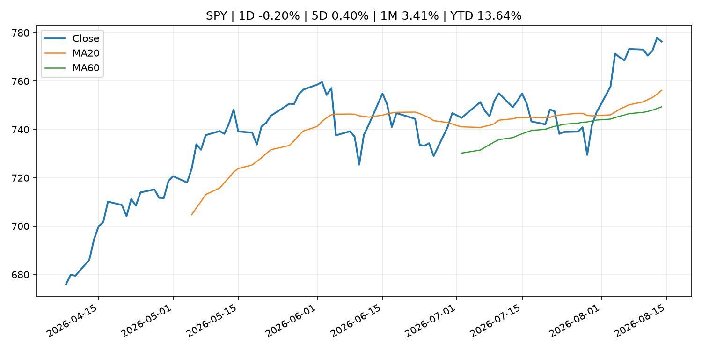
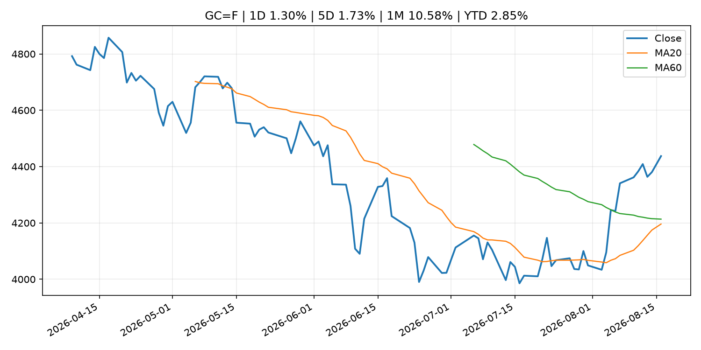
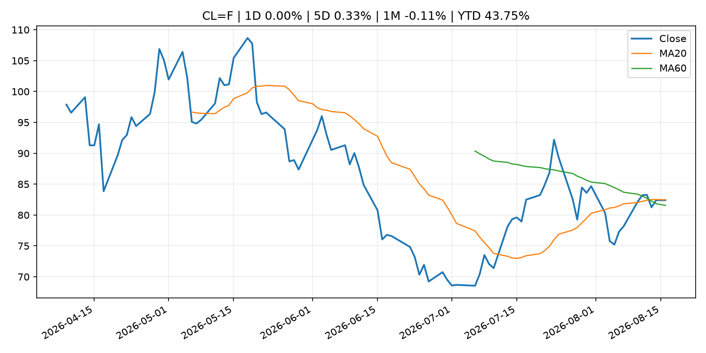
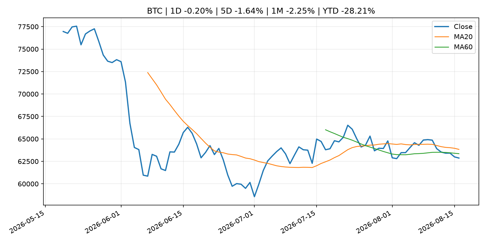
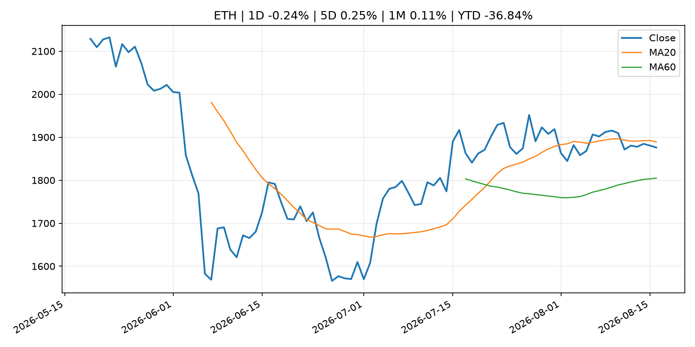
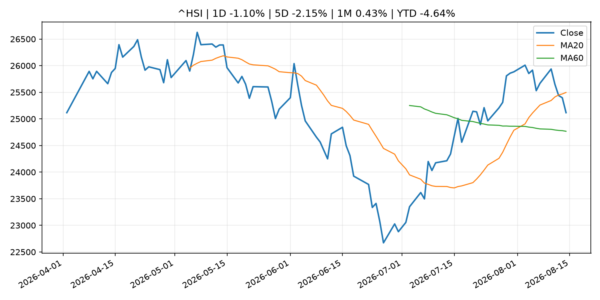

# Global Macro Morning Briefing - 2026-08-17

> Not financial advice / 非投资建议。

## 0. 今日总览
- 市场状态：unknown。市场信号不足，暂不判断明确状态。
- 今日三大主线：
  1. earnings: Walmart and Target are about to reveal the health of the U.S. consumer
  2. regulation: The SEC meeting that wasn't: State of Crypto
  3. crypto_market_structure: The stablecoin yield clash that won't go away has banks, crypto battling over tradition
- 一句话结论：今日晨报重点关注：大型科技股盈利和资本开支会影响纳指、半导体和 AI 交易主线。；监管变化会改变行业盈利预期和资产风险溢价。。跨资产方面，SPY 1D -0.20%；QQQ 1D -0.14%；^VIX 1D -2.60%；TLT 1D -0.67%；GC=F 1D 1.30%；CL=F 1D 0.00%；BTC 1D -0.20%；ETH 1D -0.24%；市场信号不足，暂不判断明确状态。政策、通胀、利率、美元、美债、能源和加密监管仍是主要观察线索。所有结论仅基于公开数据与短摘要整理，不构成投资建议。

## 1. 隔夜跨资产市场
- 美股：SPY 1D -0.20%，QQQ 1D -0.14%，整体趋势需结合 VIX 和利率确认。
- 美债/美元：TLT 1D -0.67%，美元指数 1D -0.00%，是判断折现率压力的核心线索。
- 黄金/原油：黄金 1D 1.30%，原油 1D 0.00%，用于观察避险、通胀和地缘风险。
- 加密：BTC 1D -0.20%，ETH 1D -0.24%，关注是否独立于纳指走出加密自身行情。
- 港股/A股：恒生 1D -1.10%，沪深300/上证 1D n/a，重点看中国政策预期与人民币线索。
- 风险观察：关注后续数据是否确认当前跨资产信号。

### US_EQUITY

| symbol | latest close | 1D | 5D | 1M | YTD | trend |
|---|---:|---:|---:|---:|---:|---|
| SPY | 776.34 | -0.20% | 0.40% | 3.41% | 13.64% | strong_uptrend |
| QQQ | 731.07 | -0.14% | 1.11% | 3.56% | 19.24% | range_bound |
| DIA | 536.80 | -0.21% | -0.52% | 2.28% | 10.99% | uptrend |
| IWM | 305.09 | 0.52% | 1.17% | 3.21% | 22.63% | strong_uptrend |
| VTI | 383.85 | -0.12% | 0.54% | 3.58% | 14.14% | strong_uptrend |

### US_MACRO_MARKET

| symbol | latest close | 1D | 5D | 1M | YTD | trend |
|---|---:|---:|---:|---:|---:|---|
| ^VIX | 14.25 | -2.60% | -4.36% | -14.82% | -1.79% | strong_downtrend |
| DX-Y.NYB | 99.67 | -0.00% | -0.14% | -1.07% | 1.27% | range_bound |
| TLT | 82.04 | -0.67% | -0.87% | -2.58% | -5.73% | downtrend |
| IEF | 93.04 | -0.28% | -0.14% | -0.73% | -3.16% | downtrend |

### COMMODITIES

| symbol | latest close | 1D | 5D | 1M | YTD | trend |
|---|---:|---:|---:|---:|---:|---|
| GC=F | 4,437.30 | 1.30% | 1.73% | 10.58% | 2.85% | range_bound |
| SI=F | 65.11 | 0.18% | 0.00% | 16.19% | -7.72% | range_bound |
| CL=F | 82.40 | 0.00% | 0.33% | -0.11% | 43.75% | range_bound |
| BZ=F | 88.52 | 0.00% | 0.91% | 0.48% | 45.71% | uptrend |
| NG=F | 2.73 | 0.00% | -2.18% | -6.11% | -24.46% | downtrend |
| HG=F | 6.61 | 0.20% | 0.28% | 6.32% | 17.25% | strong_uptrend |

### HK_MARKET

| symbol | latest close | 1D | 5D | 1M | YTD | trend |
|---|---:|---:|---:|---:|---:|---|
| ^HSI | 25,116.85 | -1.10% | -2.15% | 0.43% | -4.64% | range_bound |
| 0700.HK | 440.00 | -0.23% | -8.10% | -9.09% | -29.37% | range_bound |
| 9988.HK | 119.90 | -1.64% | -3.15% | 2.57% | -19.53% | uptrend |
| 3690.HK | 87.20 | -4.44% | -5.42% | 0.00% | -16.63% | range_bound |
| 1810.HK | 25.62 | -1.00% | -5.32% | -6.84% | -36.40% | range_bound |
| 1211.HK | 88.25 | -0.17% | -2.11% | -2.97% | -10.63% | range_bound |

### CRYPTO

| symbol | latest close | 1D | 5D | 1M | YTD | trend |
|---|---:|---:|---:|---:|---:|---|
| BTC | 62,868.34 | -0.20% | -1.64% | -2.25% | -28.21% | range_bound |
| ETH | 1,876.01 | -0.24% | 0.25% | 0.11% | -36.84% | range_bound |
| SOLANA | 74.39 | -1.26% | -2.03% | -0.11% | -40.26% | downtrend |
| BINANCECOIN | 603.61 | -0.57% | 0.83% | 6.11% | -30.03% | strong_uptrend |
| RIPPLE | 1.00 | -0.35% | -1.58% | -9.30% | -45.92% | strong_downtrend |

## 2. 今日最重要的 10 条新闻
### 1. Walmart and Target are about to reveal the health of the U.S. consumer
- 来源：MarketWatch Top Stories
- 时间：2026-08-16T11:00:00+00:00
- 地区：US
- 事件类型：earnings
- 重要性层级：Tier 2
- 一句话摘要：Earnings reports from the two major retailers will show how shoppers are holding up in an era of persistent inflation.
- 为什么重要：大型科技股盈利和资本开支会影响纳指、半导体和 AI 交易主线。
- 可能影响：主要影响 DXY，方向为 positive，强度 high；通胀压力可能推高政策利率预期并支撑美元。
  - 资产：DXY
    方向：positive
    强度：high
    原因：通胀压力可能推高政策利率预期并支撑美元。
  - 资产：TLT
    方向：negative
    强度：high
    原因：通胀上行通常推升收益率、压低长债价格。
  - 资产：QQQ
    方向：negative
    强度：high
    原因：更高利率对成长股估值折现率不利。
  - 资产：SPY
    方向：mixed
    强度：medium
    原因：名义增长可能支撑收入，但更高利率压制估值。
  - 资产：GC=F
    方向：mixed
    强度：medium
    原因：通胀对黄金是支撑，但实际利率上行会形成压力。
  - 资产：BTC
    方向：mixed
    强度：medium
    原因：抗通胀叙事和流动性收紧可能相互抵消。
- 原文链接：[https://www.marketwatch.com/story/walmart-and-target-are-about-to-reveal-the-health-of-the-u-s-consumer-d5b89491?mod=mw_rss_topstories](https://www.marketwatch.com/story/walmart-and-target-are-about-to-reveal-the-health-of-the-u-s-consumer-d5b89491?mod=mw_rss_topstories)

### 2. The SEC meeting that wasn't: State of Crypto
- 来源：CoinDesk
- 时间：2026-08-16T18:30:00+00:00
- 地区：global
- 事件类型：regulation
- 重要性层级：Tier 2
- 一句话摘要：The SEC meeting that wasn't: State of Crypto
- 为什么重要：监管变化会改变行业盈利预期和资产风险溢价。
- 可能影响：主要影响 BTC，方向为 mixed，强度 high；加密监管或 ETF 进展会改变 BTC 的资金流和风险溢价。
  - 资产：BTC
    方向：mixed
    强度：high
    原因：加密监管或 ETF 进展会改变 BTC 的资金流和风险溢价。
  - 资产：ETH
    方向：mixed
    强度：high
    原因：监管框架会影响 ETH 产品化和机构参与度。
  - 资产：COIN
    方向：mixed
    强度：medium
    原因：监管清晰度和执法风险会影响交易平台估值。
  - 资产：crypto market
    方向：mixed
    强度：high
    原因：信息影响整个加密市场结构，但方向取决于细节。
- 原文链接：[https://www.coindesk.com/policy/2026/08/16/the-sec-meeting-that-wasn-t-state-of-crypto](https://www.coindesk.com/policy/2026/08/16/the-sec-meeting-that-wasn-t-state-of-crypto)

### 3. The stablecoin yield clash that won't go away has banks, crypto battling over tradition
- 来源：CoinDesk
- 时间：2026-08-16T13:00:00+00:00
- 地区：global
- 事件类型：crypto_market_structure
- 重要性层级：Tier 2
- 一句话摘要：The stablecoin yield clash that won't go away has banks, crypto battling over tradition
- 为什么重要：加密市场结构和监管变化会影响 BTC、ETH 及相关股票的风险溢价。
- 可能影响：主要影响 BTC，方向为 mixed，强度 high；加密监管或 ETF 进展会改变 BTC 的资金流和风险溢价。
  - 资产：BTC
    方向：mixed
    强度：high
    原因：加密监管或 ETF 进展会改变 BTC 的资金流和风险溢价。
  - 资产：ETH
    方向：mixed
    强度：high
    原因：监管框架会影响 ETH 产品化和机构参与度。
  - 资产：COIN
    方向：mixed
    强度：medium
    原因：监管清晰度和执法风险会影响交易平台估值。
  - 资产：crypto market
    方向：mixed
    强度：high
    原因：信息影响整个加密市场结构，但方向取决于细节。
- 原文链接：[https://www.coindesk.com/news-analysis/2026/08/14/the-stablecoin-yield-clash-that-won-t-go-away-has-banks-crypto-battling-over-tradition](https://www.coindesk.com/news-analysis/2026/08/14/the-stablecoin-yield-clash-that-won-t-go-away-has-banks-crypto-battling-over-tradition)

### 4. Swiss mega-bank UBS ramps up its Bitcoin exposure with a massive 24-fold surge in ETF call options
- 来源：CoinDesk
- 时间：2026-08-15T15:56:05+00:00
- 地区：global
- 事件类型：other
- 重要性层级：Tier 3
- 一句话摘要：Swiss mega-bank UBS ramps up its Bitcoin exposure with a massive 24-fold surge in ETF call options
- 为什么重要：这条信息暂未匹配到重大宏观、政策或市场事件，更适合作为背景跟踪。
- 可能影响：主要影响 BTC，方向为 mixed，强度 high；加密监管或 ETF 进展会改变 BTC 的资金流和风险溢价。
  - 资产：BTC
    方向：mixed
    强度：high
    原因：加密监管或 ETF 进展会改变 BTC 的资金流和风险溢价。
  - 资产：ETH
    方向：mixed
    强度：high
    原因：监管框架会影响 ETH 产品化和机构参与度。
  - 资产：COIN
    方向：mixed
    强度：medium
    原因：监管清晰度和执法风险会影响交易平台估值。
  - 资产：crypto market
    方向：mixed
    强度：high
    原因：信息影响整个加密市场结构，但方向取决于细节。
- 原文链接：[https://www.coindesk.com/business/2026/08/15/swiss-mega-bank-ubs-ramps-up-its-bitcoin-exposure-with-a-massive-24-fold-surge-in-etf-call-options](https://www.coindesk.com/business/2026/08/15/swiss-mega-bank-ubs-ramps-up-its-bitcoin-exposure-with-a-massive-24-fold-surge-in-etf-call-options)

### 5. Paul Tudor Jones’ investment firm increases stake in BlackRock's bitcoin ETF after year of selling
- 来源：CoinDesk
- 时间：2026-08-15T15:12:29+00:00
- 地区：global
- 事件类型：other
- 重要性层级：Tier 3
- 一句话摘要：Paul Tudor Jones’ investment firm increases stake in BlackRock's bitcoin ETF after year of selling
- 为什么重要：这条信息暂未匹配到重大宏观、政策或市场事件，更适合作为背景跟踪。
- 可能影响：主要影响 BTC，方向为 mixed，强度 high；加密监管或 ETF 进展会改变 BTC 的资金流和风险溢价。
  - 资产：BTC
    方向：mixed
    强度：high
    原因：加密监管或 ETF 进展会改变 BTC 的资金流和风险溢价。
  - 资产：ETH
    方向：mixed
    强度：high
    原因：监管框架会影响 ETH 产品化和机构参与度。
  - 资产：COIN
    方向：mixed
    强度：medium
    原因：监管清晰度和执法风险会影响交易平台估值。
  - 资产：crypto market
    方向：mixed
    强度：high
    原因：信息影响整个加密市场结构，但方向取决于细节。
- 原文链接：[https://www.coindesk.com/business/2026/08/15/paul-tudor-jones-investment-firm-increases-blackrock-s-bitcoin-etf-stake-after-year-of-selling](https://www.coindesk.com/business/2026/08/15/paul-tudor-jones-investment-firm-increases-blackrock-s-bitcoin-etf-stake-after-year-of-selling)

## 3. 政策与央行观察
### 1. The SEC meeting that wasn't: State of Crypto
- 来源：CoinDesk
- 时间：2026-08-16T18:30:00+00:00
- 地区：global
- 事件类型：regulation
- 重要性层级：Tier 2
- 一句话摘要：The SEC meeting that wasn't: State of Crypto
- 为什么重要：监管变化会改变行业盈利预期和资产风险溢价。
- 可能影响：主要影响 BTC，方向为 mixed，强度 high；加密监管或 ETF 进展会改变 BTC 的资金流和风险溢价。
  - 资产：BTC
    方向：mixed
    强度：high
    原因：加密监管或 ETF 进展会改变 BTC 的资金流和风险溢价。
  - 资产：ETH
    方向：mixed
    强度：high
    原因：监管框架会影响 ETH 产品化和机构参与度。
  - 资产：COIN
    方向：mixed
    强度：medium
    原因：监管清晰度和执法风险会影响交易平台估值。
  - 资产：crypto market
    方向：mixed
    强度：high
    原因：信息影响整个加密市场结构，但方向取决于细节。
- 原文链接：[https://www.coindesk.com/policy/2026/08/16/the-sec-meeting-that-wasn-t-state-of-crypto](https://www.coindesk.com/policy/2026/08/16/the-sec-meeting-that-wasn-t-state-of-crypto)

### 2. The stablecoin yield clash that won't go away has banks, crypto battling over tradition
- 来源：CoinDesk
- 时间：2026-08-16T13:00:00+00:00
- 地区：global
- 事件类型：crypto_market_structure
- 重要性层级：Tier 2
- 一句话摘要：The stablecoin yield clash that won't go away has banks, crypto battling over tradition
- 为什么重要：加密市场结构和监管变化会影响 BTC、ETH 及相关股票的风险溢价。
- 可能影响：主要影响 BTC，方向为 mixed，强度 high；加密监管或 ETF 进展会改变 BTC 的资金流和风险溢价。
  - 资产：BTC
    方向：mixed
    强度：high
    原因：加密监管或 ETF 进展会改变 BTC 的资金流和风险溢价。
  - 资产：ETH
    方向：mixed
    强度：high
    原因：监管框架会影响 ETH 产品化和机构参与度。
  - 资产：COIN
    方向：mixed
    强度：medium
    原因：监管清晰度和执法风险会影响交易平台估值。
  - 资产：crypto market
    方向：mixed
    强度：high
    原因：信息影响整个加密市场结构，但方向取决于细节。
- 原文链接：[https://www.coindesk.com/news-analysis/2026/08/14/the-stablecoin-yield-clash-that-won-t-go-away-has-banks-crypto-battling-over-tradition](https://www.coindesk.com/news-analysis/2026/08/14/the-stablecoin-yield-clash-that-won-t-go-away-has-banks-crypto-battling-over-tradition)

## 4. 市场异动与图表
- TLT 下跌 -0.67%
- Gold 上涨 1.30%

### SPY

### QQQ

### ^VIX

### TLT

### GC=F

### CL=F

### BTC

### ETH

### ^HSI

## 5. 华尔街与机构公开观点
- 暂无可靠公开观点。

## 6. 今日重点关注
- 经济数据：经济数据：暂无可靠公开日历数据；如配置经济日历源后可自动填充。
- 央行讲话：央行讲话：暂无可靠公开日历数据；重点跟踪 Fed、ECB、BoJ、PBOC 官网 RSS。
- 财报：财报：暂无可靠数据。
- 政策事件：政策事件：暂无可靠数据。
- 风险提醒：风险提醒：关注数据源失败项、突发地缘风险、利率和美元的二阶反应。

## 7. 英文金融表达与宏观概念
- **inflation expectations**：通胀预期，指家庭、企业或市场对未来通胀的预估。 例句：Inflation expectations can shape wage bargaining and bond yields.
- **real yield**：实际收益率，名义利率扣除通胀预期后的收益率。 例句：Gold often reacts more to real yields than nominal yields.
- **market structure**：市场结构，指交易、托管、清算、ETF、监管等制度安排。 例句：Crypto market structure rules can affect institutional participation.
- **terminal rate**：终端利率，市场预期本轮加息周期的最高政策利率。 例句：A higher terminal rate can pressure growth stocks.
- **soft landing**：软着陆，指通胀回落而经济避免明显衰退。 例句：Markets often rally when data support a soft landing.
- **risk-off**：避险模式，资金偏向美元、国债、黄金等防御资产。 例句：A geopolitical shock can push markets into risk-off mode.

## 8. 背景材料
- [Can I claim 50% of my husband’s Social Security now — and switch to my higher benefit at 70?](https://www.marketwatch.com/story/can-i-claim-50-of-my-husbands-social-security-now-and-switch-to-my-higher-benefit-at-70-5518700b?mod=mw_rss_topstories)（MarketWatch Top Stories，other）：“I would like to offer a piece of advice for women who are or have been married.”
- [The 'long bitcoin, short the bankers' era is officially over as TradFi giants embrace digital assets](https://www.coindesk.com/business/2026/08/13/the-long-bitcoin-short-the-bankers-era-is-officially-over-as-tradfi-giants-embrace-digital-assets)（CoinDesk，other）：The 'long bitcoin, short the bankers' era is officially over as TradFi giants embrace digital assets
- [Swiss mega-bank UBS ramps up its Bitcoin exposure with a massive 24-fold surge in ETF call options](https://www.coindesk.com/business/2026/08/15/swiss-mega-bank-ubs-ramps-up-its-bitcoin-exposure-with-a-massive-24-fold-surge-in-etf-call-options)（CoinDesk，other）：Swiss mega-bank UBS ramps up its Bitcoin exposure with a massive 24-fold surge in ETF call options
- [Why the world’s second-largest Bitcoin mining power is shutting down rigs in its capital city](https://www.coindesk.com/policy/2026/08/15/why-the-world-s-second-largest-bitcoin-mining-power-is-shutting-down-rigs-in-its-capital-city)（CoinDesk，other）：Why the world’s second-largest Bitcoin mining power is shutting down rigs in its capital city
- [Paul Tudor Jones’ investment firm increases stake in BlackRock's bitcoin ETF after year of selling](https://www.coindesk.com/business/2026/08/15/paul-tudor-jones-investment-firm-increases-blackrock-s-bitcoin-etf-stake-after-year-of-selling)（CoinDesk，other）：Paul Tudor Jones’ investment firm increases stake in BlackRock's bitcoin ETF after year of selling

## 9. 数据源、失败项与免责声明
- 采集时间：2026-08-16T22:18:28
- 数据源：公开 RSS、Yahoo Finance、CoinGecko、AKShare、FRED、SEC data.sec.gov，以及用户自有 inputs/reports 文件。
- 合规说明：不绕过 WSJ、Bloomberg、FT、Reuters 等付费墙；对付费媒体只使用公开 RSS 标题、摘要、链接和发布时间。
- 免责声明：Not financial advice / 非投资建议。本项目仅供个人学习、研究和信息整理，不构成投资建议、交易建议或任何收益承诺。
- 失败或跳过的数据源：
  - crypto data failed coin=dogecoin
  - China market data failed symbol=上证指数: empty dataframe
  - China market data failed symbol=深证成指: empty dataframe
  - China market data failed symbol=创业板指: empty dataframe
  - China market data failed symbol=沪深300: empty dataframe
  - China market data failed symbol=中证500: empty dataframe
  - China market data failed symbol=科创50: empty dataframe
  - FRED_API_KEY not set; skipping FRED macro series
  - SEC failed cik=0000320193
  - SEC failed cik=0000789019
  - SEC failed cik=0001045810
  - SEC failed cik=0001318605
  - SEC failed cik=0001577552
