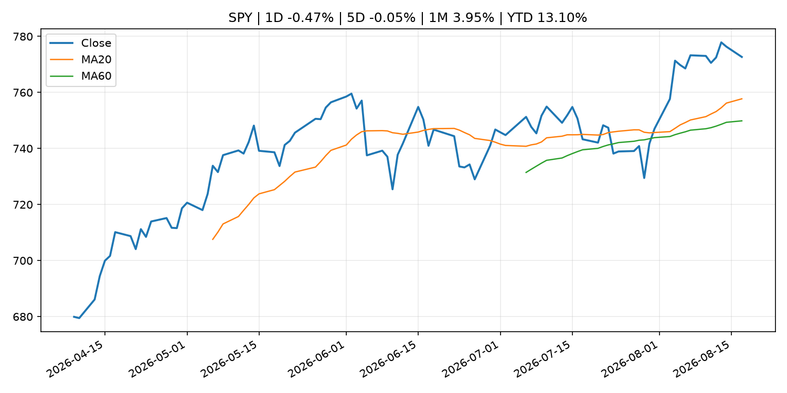
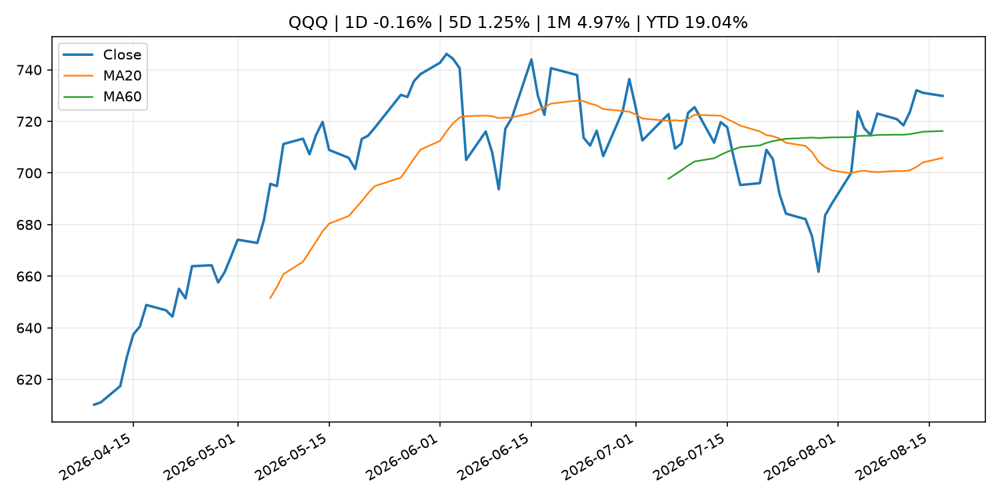
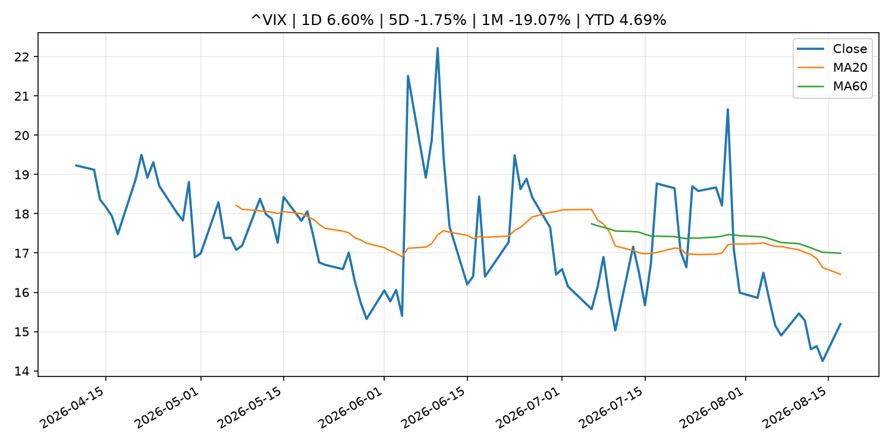
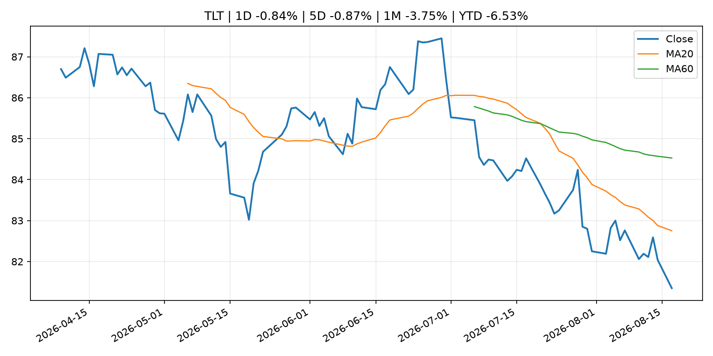
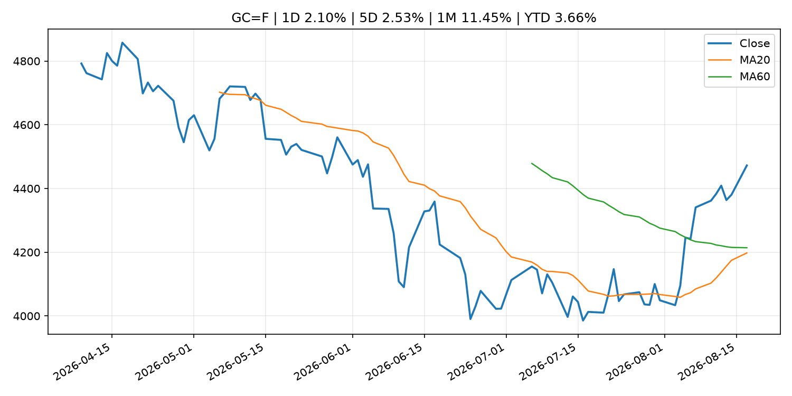
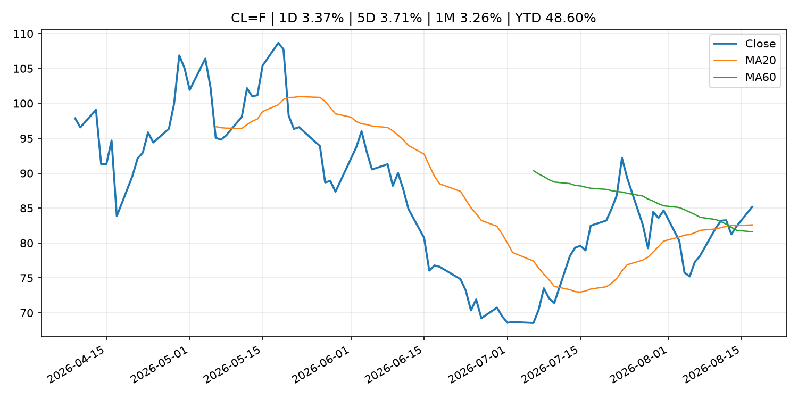
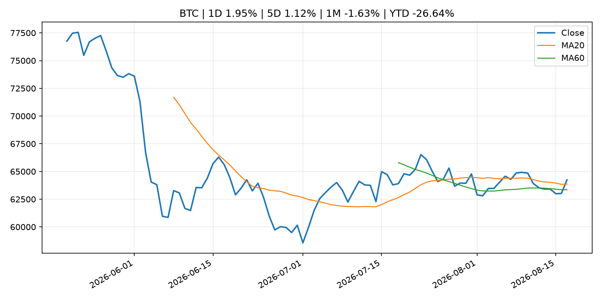
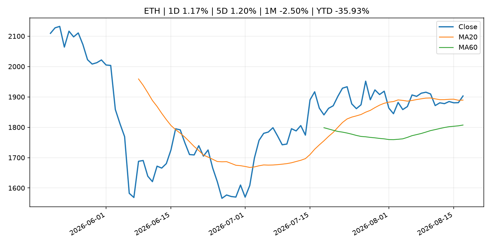
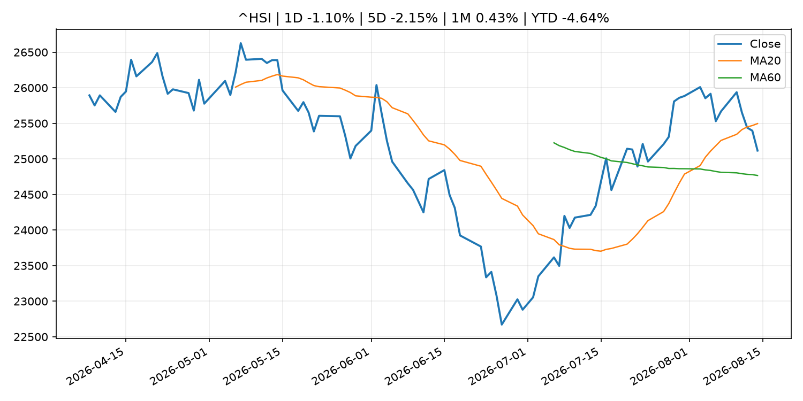

# Global Macro Morning Briefing - 2026-08-18

> Not financial advice / 非投资建议。

## 0. 今日总览
- 市场状态：unknown。市场信号不足，暂不判断明确状态。
- 今日三大主线：
  1. central_bank_decision: Coinbase-Circle USDC collaboration, FOMC minutes, oil price: Crypto Week Ahead
  2. crypto_market_structure: U.S. Treasury Department proposes GENIUS Act stablecoin rule
  3. regulation: The SEC meeting that wasn't: State of Crypto
- 一句话结论：今日晨报重点关注：央行决策会重定价利率、汇率、久期资产和风险资产。；加密市场结构和监管变化会影响 BTC、ETH 及相关股票的风险溢价。。跨资产方面，SPY 1D -0.47%；QQQ 1D -0.16%；^VIX 1D 6.60%；TLT 1D -0.84%；GC=F 1D 2.10%；CL=F 1D 3.37%；BTC 1D 1.95%；ETH 1D 1.17%；市场信号不足，暂不判断明确状态。政策、通胀、利率、美元、美债、能源和加密监管仍是主要观察线索。所有结论仅基于公开数据与短摘要整理，不构成投资建议。

## 1. 隔夜跨资产市场
- 美股：SPY 1D -0.47%，QQQ 1D -0.16%，整体趋势需结合 VIX 和利率确认。
- 美债/美元：TLT 1D -0.84%，美元指数 1D -0.09%，是判断折现率压力的核心线索。
- 黄金/原油：黄金 1D 2.10%，原油 1D 3.37%，用于观察避险、通胀和地缘风险。
- 加密：BTC 1D 1.95%，ETH 1D 1.17%，关注是否独立于纳指走出加密自身行情。
- 港股/A股：恒生 1D -1.10%，沪深300/上证 1D n/a，重点看中国政策预期与人民币线索。
- 风险观察：关注后续数据是否确认当前跨资产信号。

### US_EQUITY

| symbol | latest close | 1D | 5D | 1M | YTD | trend |
|---|---:|---:|---:|---:|---:|---|
| SPY | 772.67 | -0.47% | -0.05% | 3.95% | 13.10% | strong_uptrend |
| QQQ | 729.87 | -0.16% | 1.25% | 4.97% | 19.04% | range_bound |
| DIA | 534.19 | -0.49% | -0.89% | 2.57% | 10.45% | uptrend |
| IWM | 304.06 | -0.34% | 1.36% | 3.41% | 22.22% | strong_uptrend |
| VTI | 382.13 | -0.45% | 0.13% | 4.12% | 13.62% | strong_uptrend |

### US_MACRO_MARKET

| symbol | latest close | 1D | 5D | 1M | YTD | trend |
|---|---:|---:|---:|---:|---:|---|
| ^VIX | 15.19 | 6.60% | -1.75% | -19.07% | 4.69% | strong_downtrend |
| DX-Y.NYB | 99.58 | -0.09% | -0.23% | -1.16% | 1.18% | downtrend |
| TLT | 81.35 | -0.84% | -0.87% | -3.75% | -6.53% | strong_downtrend |
| IEF | 92.84 | -0.21% | 0.09% | -1.07% | -3.37% | downtrend |

### COMMODITIES

| symbol | latest close | 1D | 5D | 1M | YTD | trend |
|---|---:|---:|---:|---:|---:|---|
| GC=F | 4,472.30 | 2.10% | 2.53% | 11.45% | 3.66% | range_bound |
| SI=F | 65.90 | 1.40% | 1.22% | 17.60% | -6.60% | range_bound |
| CL=F | 85.18 | 3.37% | 3.71% | 3.26% | 48.60% | strong_uptrend |
| BZ=F | 91.37 | 3.22% | 4.16% | 3.71% | 50.40% | strong_uptrend |
| NG=F | 2.70 | -1.17% | -3.33% | -7.21% | -25.35% | downtrend |
| HG=F | 6.61 | 0.12% | 0.20% | 6.23% | 17.15% | strong_uptrend |

### HK_MARKET

| symbol | latest close | 1D | 5D | 1M | YTD | trend |
|---|---:|---:|---:|---:|---:|---|
| ^HSI | 25,116.85 | -1.10% | -2.15% | 0.43% | -4.64% | range_bound |
| 0700.HK | 446.40 | 1.45% | -7.27% | -3.29% | -28.35% | range_bound |
| 9988.HK | 122.20 | 1.92% | -3.55% | 8.53% | -17.99% | strong_uptrend |
| 3690.HK | 87.65 | 0.52% | -6.66% | 4.78% | -16.20% | range_bound |
| 1810.HK | 25.88 | 1.01% | -6.30% | -3.72% | -35.75% | range_bound |
| 1211.HK | 90.05 | 2.04% | -2.44% | 1.52% | -8.81% | range_bound |

### CRYPTO

| symbol | latest close | 1D | 5D | 1M | YTD | trend |
|---|---:|---:|---:|---:|---:|---|
| BTC | 64,246.05 | 1.95% | 1.12% | -1.63% | -26.64% | uptrend |
| ETH | 1,902.98 | 1.17% | 1.20% | -2.50% | -35.93% | uptrend |
| SOLANA | 75.78 | 0.67% | -0.58% | -1.08% | -39.14% | range_bound |
| BINANCECOIN | 604.36 | -0.48% | -1.93% | 5.09% | -29.94% | strong_uptrend |
| RIPPLE | 1.00 | -0.18% | -2.13% | -10.03% | -45.66% | strong_downtrend |

## 2. 今日最重要的 10 条新闻
### 1. Coinbase-Circle USDC collaboration, FOMC minutes, oil price: Crypto Week Ahead
- 来源：CoinDesk
- 时间：2026-08-17T09:13:02+00:00
- 地区：global
- 事件类型：central_bank_decision
- 重要性层级：Tier 1
- 一句话摘要：Coinbase-Circle USDC collaboration, FOMC minutes, oil price: Crypto Week Ahead
- 为什么重要：央行决策会重定价利率、汇率、久期资产和风险资产。
- 可能影响：主要影响 CL=F，方向为 positive，强度 high；供给扰动或 OPEC 减产通常推升 WTI 原油。
  - 资产：CL=F
    方向：positive
    强度：high
    原因：供给扰动或 OPEC 减产通常推升 WTI 原油。
  - 资产：BZ=F
    方向：positive
    强度：high
    原因：全球供给风险通常直接影响 Brent 原油。
  - 资产：SPY
    方向：mixed
    强度：medium
    原因：能源股可能受益，但通胀和成本压力不利于宽基风险资产。
- 原文链接：[https://www.coindesk.com/markets/2026/08/17/coinbase-circle-usdc-collaboration-fomc-minutes-oil-price-crypto-week-ahead](https://www.coindesk.com/markets/2026/08/17/coinbase-circle-usdc-collaboration-fomc-minutes-oil-price-crypto-week-ahead)

### 2. U.S. Treasury Department proposes GENIUS Act stablecoin rule
- 来源：CoinDesk
- 时间：2026-08-17T14:44:29+00:00
- 地区：global
- 事件类型：crypto_market_structure
- 重要性层级：Tier 2
- 一句话摘要：U.S. Treasury Department proposes GENIUS Act stablecoin rule
- 为什么重要：加密市场结构和监管变化会影响 BTC、ETH 及相关股票的风险溢价。
- 可能影响：主要影响 BTC，方向为 mixed，强度 high；加密监管或 ETF 进展会改变 BTC 的资金流和风险溢价。
  - 资产：BTC
    方向：mixed
    强度：high
    原因：加密监管或 ETF 进展会改变 BTC 的资金流和风险溢价。
  - 资产：ETH
    方向：mixed
    强度：high
    原因：监管框架会影响 ETH 产品化和机构参与度。
  - 资产：COIN
    方向：mixed
    强度：medium
    原因：监管清晰度和执法风险会影响交易平台估值。
  - 资产：crypto market
    方向：mixed
    强度：high
    原因：信息影响整个加密市场结构，但方向取决于细节。
- 原文链接：[https://www.coindesk.com/policy/2026/08/17/u-s-treasury-department-proposes-genius-act-stablecoin-rule](https://www.coindesk.com/policy/2026/08/17/u-s-treasury-department-proposes-genius-act-stablecoin-rule)

### 3. The SEC meeting that wasn't: State of Crypto
- 来源：CoinDesk
- 时间：2026-08-16T18:30:00+00:00
- 地区：global
- 事件类型：regulation
- 重要性层级：Tier 2
- 一句话摘要：The SEC meeting that wasn't: State of Crypto
- 为什么重要：监管变化会改变行业盈利预期和资产风险溢价。
- 可能影响：主要影响 BTC，方向为 mixed，强度 high；加密监管或 ETF 进展会改变 BTC 的资金流和风险溢价。
  - 资产：BTC
    方向：mixed
    强度：high
    原因：加密监管或 ETF 进展会改变 BTC 的资金流和风险溢价。
  - 资产：ETH
    方向：mixed
    强度：high
    原因：监管框架会影响 ETH 产品化和机构参与度。
  - 资产：COIN
    方向：mixed
    强度：medium
    原因：监管清晰度和执法风险会影响交易平台估值。
  - 资产：crypto market
    方向：mixed
    强度：high
    原因：信息影响整个加密市场结构，但方向取决于细节。
- 原文链接：[https://www.coindesk.com/policy/2026/08/16/the-sec-meeting-that-wasn-t-state-of-crypto](https://www.coindesk.com/policy/2026/08/16/the-sec-meeting-that-wasn-t-state-of-crypto)

### 4. Bitcoin tracks equity bounce, but $390 million ETF outflow week keeps bulls on back foot
- 来源：CoinDesk
- 时间：2026-08-17T09:59:55+00:00
- 地区：global
- 事件类型：other
- 重要性层级：Tier 3
- 一句话摘要：Bitcoin tracks equity bounce, but $390 million ETF outflow week keeps bulls on back foot
- 为什么重要：这条信息暂未匹配到重大宏观、政策或市场事件，更适合作为背景跟踪。
- 可能影响：主要影响 BTC，方向为 mixed，强度 high；加密监管或 ETF 进展会改变 BTC 的资金流和风险溢价。
  - 资产：BTC
    方向：mixed
    强度：high
    原因：加密监管或 ETF 进展会改变 BTC 的资金流和风险溢价。
  - 资产：ETH
    方向：mixed
    强度：high
    原因：监管框架会影响 ETH 产品化和机构参与度。
  - 资产：COIN
    方向：mixed
    强度：medium
    原因：监管清晰度和执法风险会影响交易平台估值。
  - 资产：crypto market
    方向：mixed
    强度：high
    原因：信息影响整个加密市场结构，但方向取决于细节。
- 原文链接：[https://www.coindesk.com/markets/2026/08/17/bitcoin-tracks-equity-bounce-but-usd390-million-etf-outflow-week-keeps-bulls-on-back-foot](https://www.coindesk.com/markets/2026/08/17/bitcoin-tracks-equity-bounce-but-usd390-million-etf-outflow-week-keeps-bulls-on-back-foot)

### 5. Kraken parent Payward joins Anthropic’s Project Glasswing for AI security push
- 来源：CoinDesk
- 时间：2026-08-17T22:12:00+00:00
- 地区：global
- 事件类型：other
- 重要性层级：Tier 3
- 一句话摘要：Kraken parent Payward joins Anthropic’s Project Glasswing for AI security push
- 为什么重要：这条信息暂未匹配到重大宏观、政策或市场事件，更适合作为背景跟踪。
- 可能影响：更偏背景信息，短期市场影响可能有限。
  - 资产：暂无明确资产映射
  - 方向：unknown
  - 强度：low
  - 原因：公开信息不足以判断方向。
- 原文链接：[https://www.coindesk.com/tech/2026/08/17/kraken-parent-payward-joins-anthropic-s-project-glasswing-for-ai-security-push](https://www.coindesk.com/tech/2026/08/17/kraken-parent-payward-joins-anthropic-s-project-glasswing-for-ai-security-push)

## 3. 政策与央行观察
### 1. Coinbase-Circle USDC collaboration, FOMC minutes, oil price: Crypto Week Ahead
- 来源：CoinDesk
- 时间：2026-08-17T09:13:02+00:00
- 地区：global
- 事件类型：central_bank_decision
- 重要性层级：Tier 1
- 一句话摘要：Coinbase-Circle USDC collaboration, FOMC minutes, oil price: Crypto Week Ahead
- 为什么重要：央行决策会重定价利率、汇率、久期资产和风险资产。
- 可能影响：主要影响 CL=F，方向为 positive，强度 high；供给扰动或 OPEC 减产通常推升 WTI 原油。
  - 资产：CL=F
    方向：positive
    强度：high
    原因：供给扰动或 OPEC 减产通常推升 WTI 原油。
  - 资产：BZ=F
    方向：positive
    强度：high
    原因：全球供给风险通常直接影响 Brent 原油。
  - 资产：SPY
    方向：mixed
    强度：medium
    原因：能源股可能受益，但通胀和成本压力不利于宽基风险资产。
- 原文链接：[https://www.coindesk.com/markets/2026/08/17/coinbase-circle-usdc-collaboration-fomc-minutes-oil-price-crypto-week-ahead](https://www.coindesk.com/markets/2026/08/17/coinbase-circle-usdc-collaboration-fomc-minutes-oil-price-crypto-week-ahead)

### 2. U.S. Treasury Department proposes GENIUS Act stablecoin rule
- 来源：CoinDesk
- 时间：2026-08-17T14:44:29+00:00
- 地区：global
- 事件类型：crypto_market_structure
- 重要性层级：Tier 2
- 一句话摘要：U.S. Treasury Department proposes GENIUS Act stablecoin rule
- 为什么重要：加密市场结构和监管变化会影响 BTC、ETH 及相关股票的风险溢价。
- 可能影响：主要影响 BTC，方向为 mixed，强度 high；加密监管或 ETF 进展会改变 BTC 的资金流和风险溢价。
  - 资产：BTC
    方向：mixed
    强度：high
    原因：加密监管或 ETF 进展会改变 BTC 的资金流和风险溢价。
  - 资产：ETH
    方向：mixed
    强度：high
    原因：监管框架会影响 ETH 产品化和机构参与度。
  - 资产：COIN
    方向：mixed
    强度：medium
    原因：监管清晰度和执法风险会影响交易平台估值。
  - 资产：crypto market
    方向：mixed
    强度：high
    原因：信息影响整个加密市场结构，但方向取决于细节。
- 原文链接：[https://www.coindesk.com/policy/2026/08/17/u-s-treasury-department-proposes-genius-act-stablecoin-rule](https://www.coindesk.com/policy/2026/08/17/u-s-treasury-department-proposes-genius-act-stablecoin-rule)

### 3. The SEC meeting that wasn't: State of Crypto
- 来源：CoinDesk
- 时间：2026-08-16T18:30:00+00:00
- 地区：global
- 事件类型：regulation
- 重要性层级：Tier 2
- 一句话摘要：The SEC meeting that wasn't: State of Crypto
- 为什么重要：监管变化会改变行业盈利预期和资产风险溢价。
- 可能影响：主要影响 BTC，方向为 mixed，强度 high；加密监管或 ETF 进展会改变 BTC 的资金流和风险溢价。
  - 资产：BTC
    方向：mixed
    强度：high
    原因：加密监管或 ETF 进展会改变 BTC 的资金流和风险溢价。
  - 资产：ETH
    方向：mixed
    强度：high
    原因：监管框架会影响 ETH 产品化和机构参与度。
  - 资产：COIN
    方向：mixed
    强度：medium
    原因：监管清晰度和执法风险会影响交易平台估值。
  - 资产：crypto market
    方向：mixed
    强度：high
    原因：信息影响整个加密市场结构，但方向取决于细节。
- 原文链接：[https://www.coindesk.com/policy/2026/08/16/the-sec-meeting-that-wasn-t-state-of-crypto](https://www.coindesk.com/policy/2026/08/16/the-sec-meeting-that-wasn-t-state-of-crypto)

## 4. 市场异动与图表
- SPY 下跌 -0.47%
- VIX 上涨 6.60%
- TLT 下跌 -0.84%
- Gold 上涨 2.10%
- Oil 上涨 3.37%

### SPY

### QQQ

### ^VIX

### TLT

### GC=F

### CL=F

### BTC

### ETH

### ^HSI

## 5. 华尔街与机构公开观点
- 暂无可靠公开观点。

## 6. 今日重点关注
- 经济数据：经济数据：暂无可靠公开日历数据；如配置经济日历源后可自动填充。
- 央行讲话：央行讲话：暂无可靠公开日历数据；重点跟踪 Fed、ECB、BoJ、PBOC 官网 RSS。
- 财报：财报：暂无可靠数据。
- 政策事件：政策事件：暂无可靠数据。
- 风险提醒：风险提醒：关注数据源失败项、突发地缘风险、利率和美元的二阶反应。

## 7. 英文金融表达与宏观概念
- **real yield**：实际收益率，名义利率扣除通胀预期后的收益率。 例句：Gold often reacts more to real yields than nominal yields.
- **terminal rate**：终端利率，市场预期本轮加息周期的最高政策利率。 例句：A higher terminal rate can pressure growth stocks.
- **risk-off**：避险模式，资金偏向美元、国债、黄金等防御资产。 例句：A geopolitical shock can push markets into risk-off mode.
- **supply disruption**：供给扰动，通常指能源或商品供应受冲突、减产或天气影响。 例句：Supply disruption can lift oil prices and inflation expectations.
- **market structure**：市场结构，指交易、托管、清算、ETF、监管等制度安排。 例句：Crypto market structure rules can affect institutional participation.
- **inflation expectations**：通胀预期，指家庭、企业或市场对未来通胀的预估。 例句：Inflation expectations can shape wage bargaining and bond yields.

## 8. 背景材料
- [Kraken parent Payward joins Anthropic’s Project Glasswing for AI security push](https://www.coindesk.com/tech/2026/08/17/kraken-parent-payward-joins-anthropic-s-project-glasswing-for-ai-security-push)（CoinDesk，other）：Kraken parent Payward joins Anthropic’s Project Glasswing for AI security push
- [A new set of Trump tariffs for Canada could take effect Wednesday. Here’s what’s at stake.](https://www.marketwatch.com/story/a-new-set-of-trump-tariffs-for-canada-could-take-effect-wednesday-heres-whats-at-stake-8aa0eeb8?mod=mw_rss_topstories)（MarketWatch Top Stories，other）：New 50% import taxes could hit liquor, hockey gear and wood products like particle board.
- [The Coldcard hack proves reputation is not a security model](https://www.coindesk.com/opinion/2026/08/17/the-coldcard-hack-proves-reputation-is-not-a-security-model)（CoinDesk，other）：The Coldcard hack proves reputation is not a security model
- [No change in bitcoin holdings as Strategy boosted dollar reserve, bought back more STRC last week](https://www.coindesk.com/markets/2026/08/17/no-change-in-bitcoin-holdings-as-strategy-lifted-dollar-reserve-and-bought-back-more-strc-last-week)（CoinDesk，other）：No change in bitcoin holdings as Strategy boosted dollar reserve, bought back more STRC last week
- [Israel’s largest crypto broker Bits of Gold hit by data breach affecting 200,000 customers](https://www.coindesk.com/tech/2026/08/17/israel-s-largest-crypto-broker-bits-of-gold-hit-by-data-breach-affecting-200-000-customers)（CoinDesk，other）：Israel’s largest crypto broker Bits of Gold hit by data breach affecting 200,000 customers
- [Bitcoin options remain expensive despite summer calm. Here's why it matters](https://www.coindesk.com/markets/2026/08/17/bitcoin-options-remain-expensive-despite-summer-calm-here-s-why-it-matters)（CoinDesk，other）：Bitcoin options remain expensive despite summer calm. Here's why it matters
- [Bitcoin's biggest holders, Strategy and Metaplanet, are betting on math, not price](https://www.coindesk.com/daybook-us/2026/08/17/bitcoin-s-biggest-holders-strategy-and-metaplanet-are-betting-on-math-not-price)（CoinDesk，other）：Bitcoin's biggest holders, Strategy and Metaplanet, are betting on math, not price
- [Bitcoin tracks equity bounce, but $390 million ETF outflow week keeps bulls on back foot](https://www.coindesk.com/markets/2026/08/17/bitcoin-tracks-equity-bounce-but-usd390-million-etf-outflow-week-keeps-bulls-on-back-foot)（CoinDesk，other）：Bitcoin tracks equity bounce, but $390 million ETF outflow week keeps bulls on back foot
- [Philip R. Lane: The rise in defence spending and the euro area economy](https://www.ecb.europa.eu//press/key/date/2026/html/ecb.sp260817~1f9f7149c9.en.pdf)（ECB Press Releases，other）：Philip R. Lane: The rise in defence spending and the euro area economy
- [Live updates: Bitcoin rises above $64,000 as big AI compute deals continue to roll in](https://www.coindesk.com/markets/2026/08/17/live-updates-bitcoin-flat-near-usd63-500-but-the-flows-have-quietly-turned)（CoinDesk，other）：Live updates: Bitcoin rises above $64,000 as big AI compute deals continue to roll in
- [September Fed interest-rate increase is 'very unlikely,' Goldman Sachs says](https://www.coindesk.com/markets/2026/08/17/september-fed-interest-rate-increase-is-very-unlikely-goldman-sachs-says)（CoinDesk，other）：September Fed interest-rate increase is 'very unlikely,' Goldman Sachs says
- [Highlights of the Outlook for Economic Activity and Prices (July 2026)](http://www.boj.or.jp/en/mopo/outlook/highlight/ten202607.htm)（Bank of Japan Announcements，other）：Highlights of the Outlook for Economic Activity and Prices (July 2026)
- [BOJ Current Account Balances by Sector (July)](http://www.boj.or.jp/en/statistics/boj/other/cabs/cabs.xlsx)（Bank of Japan Announcements，other）：BOJ Current Account Balances by Sector (July)
- [Results of the Fifth Market Functioning Survey concerning Climate Change](http://www.boj.or.jp/en/paym/m-climate/mcli260817a.htm)（Bank of Japan Announcements，other）：Results of the Fifth Market Functioning Survey concerning Climate Change
- [The bitcoin futures market looks like a crowded club with a tiny exit – and it could cause pain](https://www.coindesk.com/markets/2026/08/17/the-bitcoin-futures-market-has-a-crowded-club-tiny-exit-problem-and-it-could-cause-pain)（CoinDesk，other）：The bitcoin futures market looks like a crowded club with a tiny exit – and it could cause pain
- [Bitcoin nears $64,000 in Asia morning hours as HYPE jumps 8% on the week](https://www.coindesk.com/markets/2026/08/17/bitcoin-tops-usd64-000-in-asia-morning-hours-as-hype-jumps-8-on-the-week)（CoinDesk，other）：Bitcoin nears $64,000 in Asia morning hours as HYPE jumps 8% on the week

## 9. 数据源、失败项与免责声明
- 采集时间：2026-08-17T22:22:21
- 数据源：公开 RSS、Yahoo Finance、CoinGecko、AKShare、FRED、SEC data.sec.gov，以及用户自有 inputs/reports 文件。
- 合规说明：不绕过 WSJ、Bloomberg、FT、Reuters 等付费墙；对付费媒体只使用公开 RSS 标题、摘要、链接和发布时间。
- 免责声明：Not financial advice / 非投资建议。本项目仅供个人学习、研究和信息整理，不构成投资建议、交易建议或任何收益承诺。
- 失败或跳过的数据源：
  - crypto data failed coin=dogecoin
  - China market data failed symbol=上证指数: empty dataframe
  - China market data failed symbol=深证成指: empty dataframe
  - China market data failed symbol=创业板指: empty dataframe
  - China market data failed symbol=沪深300: empty dataframe
  - China market data failed symbol=中证500: empty dataframe
  - China market data failed symbol=科创50: empty dataframe
  - FRED_API_KEY not set; skipping FRED macro series
  - SEC failed cik=0000320193
  - SEC failed cik=0000789019
  - SEC failed cik=0001045810
  - SEC failed cik=0001318605
  - SEC failed cik=0001577552
