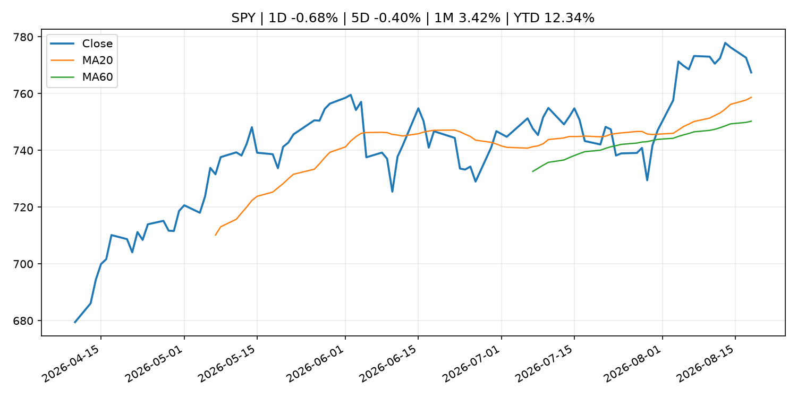
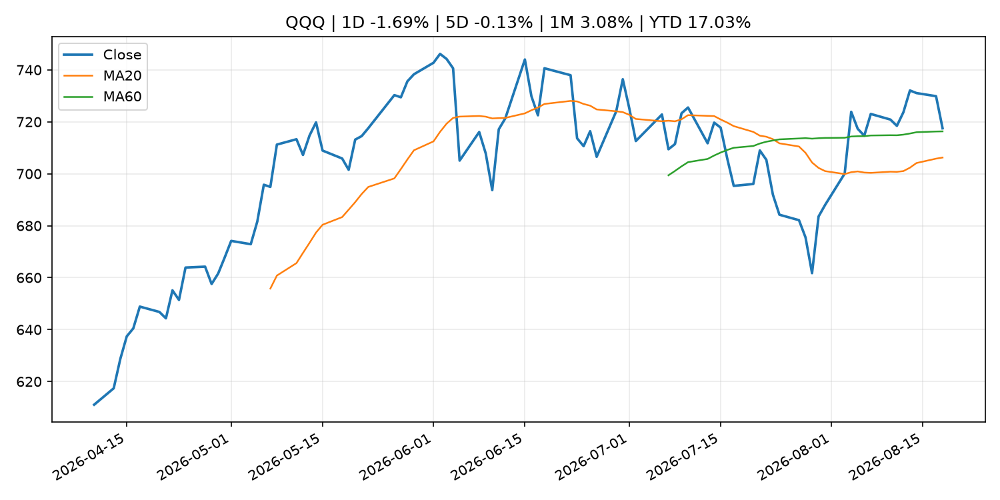
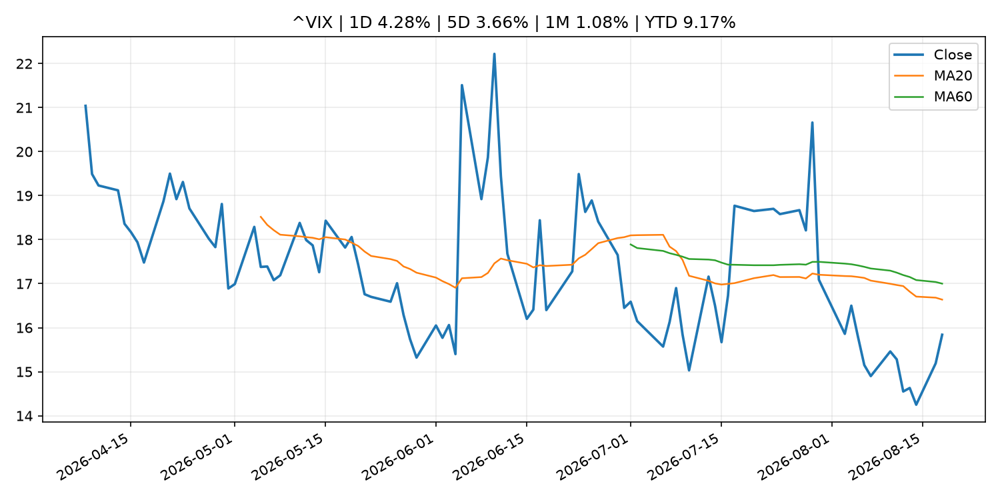
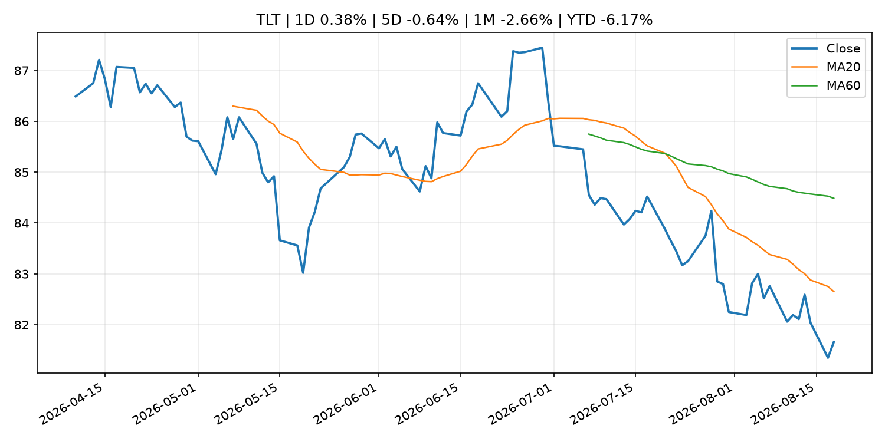
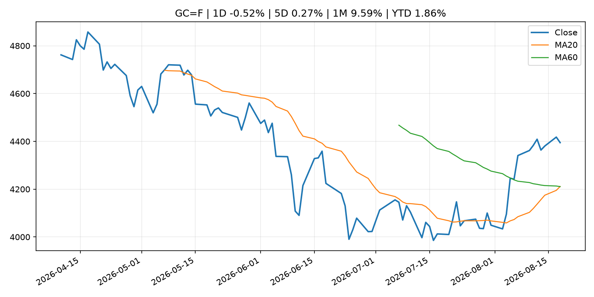
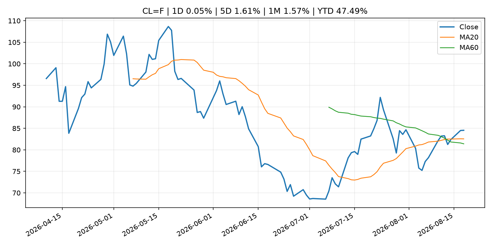
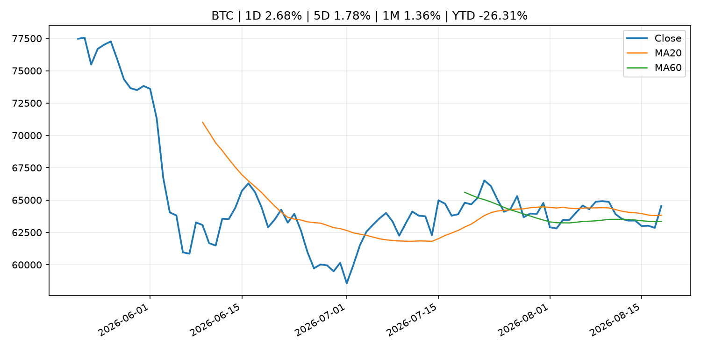
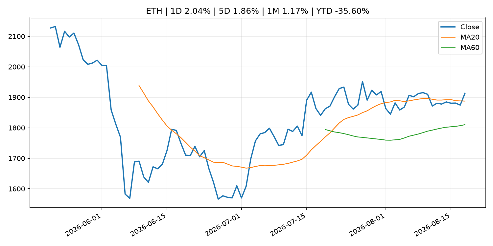
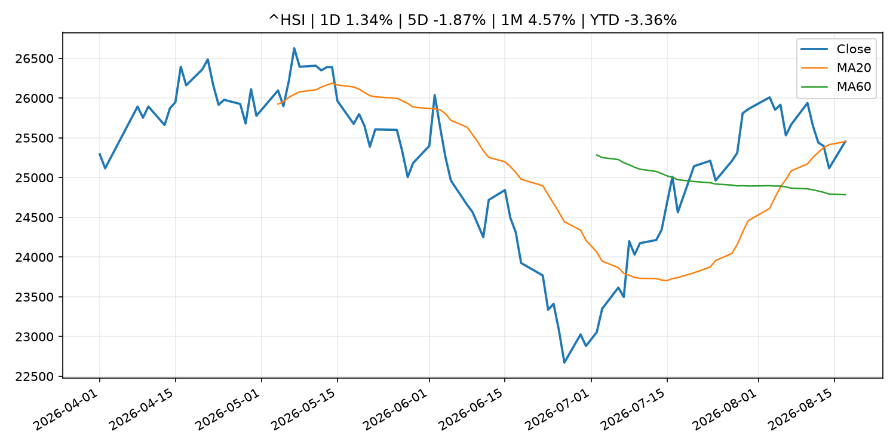

# Global Macro Morning Briefing - 2026-08-19

> Not financial advice / 非投资建议。

## 0. 今日总览
- 市场状态：mixed。股指回落、VIX 抬升且避险资产走强，市场偏风险规避。 但存在信号冲突，需要降低单一叙事置信度。
- 今日三大主线：
  1. regulation: SEC Charges Former Executives With Fraud in Connection With $1.9 Billion Collapse of Subprime Auto Lender Tricolor
  2. regulation: SEC Proposes New Regulation Crypto Assets
  3. regulation: U.S. SEC proposes first major crypto rule in surprise announcement
- 一句话结论：今日晨报重点关注：监管变化会改变行业盈利预期和资产风险溢价。；监管变化会改变行业盈利预期和资产风险溢价。。跨资产方面，SPY 1D -0.68%；QQQ 1D -1.69%；^VIX 1D 4.28%；TLT 1D 0.38%；GC=F 1D -0.52%；CL=F 1D 0.05%；BTC 1D 2.68%；ETH 1D 2.04%；股指回落、VIX 抬升且避险资产走强，市场偏风险规避。 但存在信号冲突，需要降低单一叙事置信度。政策、通胀、利率、美元、美债、能源和加密监管仍是主要观察线索。所有结论仅基于公开数据与短摘要整理，不构成投资建议。

## 1. 隔夜跨资产市场
- 美股：SPY 1D -0.68%，QQQ 1D -1.69%，整体趋势需结合 VIX 和利率确认。
- 美债/美元：TLT 1D 0.38%，美元指数 1D 0.00%，是判断折现率压力的核心线索。
- 黄金/原油：黄金 1D -0.52%，原油 1D 0.05%，用于观察避险、通胀和地缘风险。
- 加密：BTC 1D 2.68%，ETH 1D 2.04%，关注是否独立于纳指走出加密自身行情。
- 港股/A股：恒生 1D 1.34%，沪深300/上证 1D n/a，重点看中国政策预期与人民币线索。
- 风险观察：关注避险是否演变为信用或流动性压力。

### US_EQUITY

| symbol | latest close | 1D | 5D | 1M | YTD | trend |
|---|---:|---:|---:|---:|---:|---|
| SPY | 767.45 | -0.68% | -0.40% | 3.42% | 12.34% | strong_uptrend |
| QQQ | 717.51 | -1.69% | -0.13% | 3.08% | 17.03% | range_bound |
| DIA | 532.91 | -0.24% | -0.81% | 2.89% | 10.19% | uptrend |
| IWM | 300.23 | -1.26% | -0.25% | 2.71% | 20.68% | uptrend |
| VTI | 379.04 | -0.81% | -0.42% | 3.49% | 12.71% | strong_uptrend |

### US_MACRO_MARKET

| symbol | latest close | 1D | 5D | 1M | YTD | trend |
|---|---:|---:|---:|---:|---:|---|
| ^VIX | 15.84 | 4.28% | 3.66% | 1.08% | 9.17% | downtrend |
| DX-Y.NYB | 99.64 | 0.00% | -0.18% | -1.33% | 1.24% | downtrend |
| TLT | 81.66 | 0.38% | -0.64% | -2.66% | -6.17% | downtrend |
| IEF | 92.93 | 0.10% | 0.06% | -0.97% | -3.28% | downtrend |

### COMMODITIES

| symbol | latest close | 1D | 5D | 1M | YTD | trend |
|---|---:|---:|---:|---:|---:|---|
| GC=F | 4,394.70 | -0.52% | 0.27% | 9.59% | 1.86% | strong_uptrend |
| SI=F | 63.42 | -4.08% | -2.08% | 11.65% | -10.11% | range_bound |
| CL=F | 84.54 | 0.05% | 1.61% | 1.57% | 47.49% | uptrend |
| BZ=F | 91.37 | 0.55% | 2.77% | 2.41% | 50.40% | uptrend |
| NG=F | 2.79 | 3.72% | 0.83% | -2.45% | -22.89% | range_bound |
| HG=F | 6.46 | -2.21% | -2.33% | 2.52% | 14.50% | range_bound |

### HK_MARKET

| symbol | latest close | 1D | 5D | 1M | YTD | trend |
|---|---:|---:|---:|---:|---:|---|
| ^HSI | 25,453.23 | 1.34% | -1.87% | 4.57% | -3.36% | uptrend |
| 0700.HK | 442.40 | -0.90% | -6.03% | -7.41% | -28.99% | range_bound |
| 9988.HK | 126.70 | 3.68% | 0.24% | 8.48% | -14.97% | strong_uptrend |
| 3690.HK | 85.55 | -2.40% | -8.06% | -0.87% | -18.21% | range_bound |
| 1810.HK | 26.18 | 1.16% | -1.80% | -5.62% | -35.00% | range_bound |
| 1211.HK | 90.00 | -0.06% | 0.33% | -0.17% | -8.86% | range_bound |

### CRYPTO

| symbol | latest close | 1D | 5D | 1M | YTD | trend |
|---|---:|---:|---:|---:|---:|---|
| BTC | 64,537.39 | 2.68% | 1.78% | 1.36% | -26.31% | uptrend |
| ETH | 1,912.67 | 2.04% | 1.86% | 1.17% | -35.60% | uptrend |
| SOLANA | 77.06 | 3.36% | 1.98% | 3.85% | -38.12% | range_bound |
| BINANCECOIN | 602.60 | 0.06% | -1.17% | 6.54% | -30.15% | strong_uptrend |
| RIPPLE | 1.00 | 0.83% | -0.34% | -5.97% | -45.61% | strong_downtrend |

## 2. 今日最重要的 10 条新闻
### 1. SEC Charges Former Executives With Fraud in Connection With $1.9 Billion Collapse of Subprime Auto Lender Tricolor
- 来源：SEC Press Releases
- 时间：2026-08-18T15:55:10-04:00
- 地区：US
- 事件类型：regulation
- 重要性层级：Tier 2
- 一句话摘要：The Securities and Exchange Commission today charged Daniel Chu, Jerome Kollar, and Ameryn Seibold, the former CEO, CFO, and Senior Director of Finance, respectively, at Texas-based Tricolor Holdings, LLC, for their roles in an alleged multi-year scheme…
- 为什么重要：监管变化会改变行业盈利预期和资产风险溢价。
- 可能影响：主要影响 BTC，方向为 mixed，强度 high；加密监管或 ETF 进展会改变 BTC 的资金流和风险溢价。
  - 资产：BTC
    方向：mixed
    强度：high
    原因：加密监管或 ETF 进展会改变 BTC 的资金流和风险溢价。
  - 资产：ETH
    方向：mixed
    强度：high
    原因：监管框架会影响 ETH 产品化和机构参与度。
  - 资产：COIN
    方向：mixed
    强度：medium
    原因：监管清晰度和执法风险会影响交易平台估值。
  - 资产：crypto market
    方向：mixed
    强度：high
    原因：信息影响整个加密市场结构，但方向取决于细节。
- 原文链接：[https://www.sec.gov/newsroom/press-releases/2026-77-sec-charges-former-executives-fraud-connection-19-billion-collapse-subprime-auto-lender-tricolor](https://www.sec.gov/newsroom/press-releases/2026-77-sec-charges-former-executives-fraud-connection-19-billion-collapse-subprime-auto-lender-tricolor)

### 2. SEC Proposes New Regulation Crypto Assets
- 来源：SEC Press Releases
- 时间：2026-08-18T13:15:48-04:00
- 地区：US
- 事件类型：regulation
- 重要性层级：Tier 2
- 一句话摘要：The Securities and Exchange Commission today announced that it proposed new rules, titled “Regulation Crypto Assets,” that would create a clear and fit-for-purpose framework for certain investment contracts involving crypto assets. This proposal follows…
- 为什么重要：监管变化会改变行业盈利预期和资产风险溢价。
- 可能影响：主要影响 BTC，方向为 mixed，强度 high；加密监管或 ETF 进展会改变 BTC 的资金流和风险溢价。
  - 资产：BTC
    方向：mixed
    强度：high
    原因：加密监管或 ETF 进展会改变 BTC 的资金流和风险溢价。
  - 资产：ETH
    方向：mixed
    强度：high
    原因：监管框架会影响 ETH 产品化和机构参与度。
  - 资产：COIN
    方向：mixed
    强度：medium
    原因：监管清晰度和执法风险会影响交易平台估值。
  - 资产：crypto market
    方向：mixed
    强度：high
    原因：信息影响整个加密市场结构，但方向取决于细节。
- 原文链接：[https://www.sec.gov/newsroom/press-releases/2026-76-sec-proposes-new-regulation-crypto-assets](https://www.sec.gov/newsroom/press-releases/2026-76-sec-proposes-new-regulation-crypto-assets)

### 3. U.S. SEC proposes first major crypto rule in surprise announcement
- 来源：CoinDesk
- 时间：2026-08-18T19:09:33+00:00
- 地区：global
- 事件类型：regulation
- 重要性层级：Tier 2
- 一句话摘要：U.S. SEC proposes first major crypto rule in surprise announcement
- 为什么重要：监管变化会改变行业盈利预期和资产风险溢价。
- 可能影响：主要影响 BTC，方向为 mixed，强度 high；加密监管或 ETF 进展会改变 BTC 的资金流和风险溢价。
  - 资产：BTC
    方向：mixed
    强度：high
    原因：加密监管或 ETF 进展会改变 BTC 的资金流和风险溢价。
  - 资产：ETH
    方向：mixed
    强度：high
    原因：监管框架会影响 ETH 产品化和机构参与度。
  - 资产：COIN
    方向：mixed
    强度：medium
    原因：监管清晰度和执法风险会影响交易平台估值。
  - 资产：crypto market
    方向：mixed
    强度：high
    原因：信息影响整个加密市场结构，但方向取决于细节。
- 原文链接：[https://www.coindesk.com/policy/2026/08/18/r](https://www.coindesk.com/policy/2026/08/18/r)

### 4. Wyoming joins $15 billion LayerZero exodus with state stablecoin move
- 来源：CoinDesk
- 时间：2026-08-18T18:57:00+00:00
- 地区：global
- 事件类型：crypto_market_structure
- 重要性层级：Tier 2
- 一句话摘要：Wyoming joins $15 billion LayerZero exodus with state stablecoin move
- 为什么重要：加密市场结构和监管变化会影响 BTC、ETH 及相关股票的风险溢价。
- 可能影响：主要影响 BTC，方向为 mixed，强度 high；加密监管或 ETF 进展会改变 BTC 的资金流和风险溢价。
  - 资产：BTC
    方向：mixed
    强度：high
    原因：加密监管或 ETF 进展会改变 BTC 的资金流和风险溢价。
  - 资产：ETH
    方向：mixed
    强度：high
    原因：监管框架会影响 ETH 产品化和机构参与度。
  - 资产：COIN
    方向：mixed
    强度：medium
    原因：监管清晰度和执法风险会影响交易平台估值。
  - 资产：crypto market
    方向：mixed
    强度：high
    原因：信息影响整个加密市场结构，但方向取决于细节。
- 原文链接：[https://www.coindesk.com/business/2026/08/18/wyoming-joins-usd15-billion-layerzero-exodus-with-state-stablecoin-move](https://www.coindesk.com/business/2026/08/18/wyoming-joins-usd15-billion-layerzero-exodus-with-state-stablecoin-move)

### 5. HashKey taps Hong Kong's first regulated stablecoin to settle insurance and trade deals
- 来源：CoinDesk
- 时间：2026-08-18T14:03:27+00:00
- 地区：global
- 事件类型：crypto_market_structure
- 重要性层级：Tier 2
- 一句话摘要：HashKey taps Hong Kong's first regulated stablecoin to settle insurance and trade deals
- 为什么重要：加密市场结构和监管变化会影响 BTC、ETH 及相关股票的风险溢价。
- 可能影响：主要影响 BTC，方向为 mixed，强度 high；加密监管或 ETF 进展会改变 BTC 的资金流和风险溢价。
  - 资产：BTC
    方向：mixed
    强度：high
    原因：加密监管或 ETF 进展会改变 BTC 的资金流和风险溢价。
  - 资产：ETH
    方向：mixed
    强度：high
    原因：监管框架会影响 ETH 产品化和机构参与度。
  - 资产：COIN
    方向：mixed
    强度：medium
    原因：监管清晰度和执法风险会影响交易平台估值。
  - 资产：crypto market
    方向：mixed
    强度：high
    原因：信息影响整个加密市场结构，但方向取决于细节。
- 原文链接：[https://www.coindesk.com/business/2026/08/18/hashkey-taps-hong-kong-s-first-regulated-stablecoin-to-settle-insurance-and-trade-deals](https://www.coindesk.com/business/2026/08/18/hashkey-taps-hong-kong-s-first-regulated-stablecoin-to-settle-insurance-and-trade-deals)

### 6. Citi plans to launch bitcoin custody for institutional clients later this year
- 来源：CoinDesk
- 时间：2026-08-18T13:25:13+00:00
- 地区：global
- 事件类型：crypto_market_structure
- 重要性层级：Tier 2
- 一句话摘要：Citi plans to launch bitcoin custody for institutional clients later this year
- 为什么重要：加密市场结构和监管变化会影响 BTC、ETH 及相关股票的风险溢价。
- 可能影响：主要影响 BTC，方向为 mixed，强度 high；加密监管或 ETF 进展会改变 BTC 的资金流和风险溢价。
  - 资产：BTC
    方向：mixed
    强度：high
    原因：加密监管或 ETF 进展会改变 BTC 的资金流和风险溢价。
  - 资产：ETH
    方向：mixed
    强度：high
    原因：监管框架会影响 ETH 产品化和机构参与度。
  - 资产：COIN
    方向：mixed
    强度：medium
    原因：监管清晰度和执法风险会影响交易平台估值。
  - 资产：crypto market
    方向：mixed
    强度：high
    原因：信息影响整个加密市场结构，但方向取决于细节。
- 原文链接：[https://www.coindesk.com/markets/2026/08/18/citi-plans-to-launch-bitcoin-custody-for-institutional-clients-later-this-year](https://www.coindesk.com/markets/2026/08/18/citi-plans-to-launch-bitcoin-custody-for-institutional-clients-later-this-year)

### 7. Visa looking for new stablecoin settlement partner after BVNK sale to Mastercard
- 来源：CoinDesk
- 时间：2026-08-18T12:20:48+00:00
- 地区：global
- 事件类型：crypto_market_structure
- 重要性层级：Tier 2
- 一句话摘要：Visa looking for new stablecoin settlement partner after BVNK sale to Mastercard
- 为什么重要：加密市场结构和监管变化会影响 BTC、ETH 及相关股票的风险溢价。
- 可能影响：主要影响 BTC，方向为 mixed，强度 high；加密监管或 ETF 进展会改变 BTC 的资金流和风险溢价。
  - 资产：BTC
    方向：mixed
    强度：high
    原因：加密监管或 ETF 进展会改变 BTC 的资金流和风险溢价。
  - 资产：ETH
    方向：mixed
    强度：high
    原因：监管框架会影响 ETH 产品化和机构参与度。
  - 资产：COIN
    方向：mixed
    强度：medium
    原因：监管清晰度和执法风险会影响交易平台估值。
  - 资产：crypto market
    方向：mixed
    强度：high
    原因：信息影响整个加密市场结构，但方向取决于细节。
- 原文链接：[https://www.coindesk.com/business/2026/08/18/visa-is-looking-for-a-new-stablecoin-settlement-partner-now-that-bvnk-is-owned-by-mastercard](https://www.coindesk.com/business/2026/08/18/visa-is-looking-for-a-new-stablecoin-settlement-partner-now-that-bvnk-is-owned-by-mastercard)

### 8. Bitcoin pauses at $64,000 as rising yields, oil drag equities lower
- 来源：CoinDesk
- 时间：2026-08-18T10:38:56+00:00
- 地区：global
- 事件类型：other
- 重要性层级：Tier 3
- 一句话摘要：Bitcoin pauses at $64,000 as rising yields, oil drag equities lower
- 为什么重要：这条信息暂未匹配到重大宏观、政策或市场事件，更适合作为背景跟踪。
- 可能影响：主要影响 CL=F，方向为 positive，强度 high；供给扰动或 OPEC 减产通常推升 WTI 原油。
  - 资产：CL=F
    方向：positive
    强度：high
    原因：供给扰动或 OPEC 减产通常推升 WTI 原油。
  - 资产：BZ=F
    方向：positive
    强度：high
    原因：全球供给风险通常直接影响 Brent 原油。
  - 资产：SPY
    方向：mixed
    强度：medium
    原因：能源股可能受益，但通胀和成本压力不利于宽基风险资产。
- 原文链接：[https://www.coindesk.com/markets/2026/08/18/bitcoin-pauses-at-usd64-000-as-rising-yields-oil-drag-equities-lower](https://www.coindesk.com/markets/2026/08/18/bitcoin-pauses-at-usd64-000-as-rising-yields-oil-drag-equities-lower)

### 9. U.S. accounting-standards group proposes way to see stablecoins as 'cash equivalent'
- 来源：CoinDesk
- 时间：2026-08-18T21:25:42+00:00
- 地区：global
- 事件类型：other
- 重要性层级：Tier 3
- 一句话摘要：U.S. accounting-standards group proposes way to see stablecoins as 'cash equivalent'
- 为什么重要：这条信息暂未匹配到重大宏观、政策或市场事件，更适合作为背景跟踪。
- 可能影响：更偏背景信息，短期市场影响可能有限。
  - 资产：暂无明确资产映射
  - 方向：unknown
  - 强度：low
  - 原因：公开信息不足以判断方向。
- 原文链接：[https://www.coindesk.com/policy/2026/08/18/u-s-accounting-standards-group-proposes-way-to-see-stablecoins-as-cash-equivalent](https://www.coindesk.com/policy/2026/08/18/u-s-accounting-standards-group-proposes-way-to-see-stablecoins-as-cash-equivalent)

## 3. 政策与央行观察
### 1. SEC Charges Former Executives With Fraud in Connection With $1.9 Billion Collapse of Subprime Auto Lender Tricolor
- 来源：SEC Press Releases
- 时间：2026-08-18T15:55:10-04:00
- 地区：US
- 事件类型：regulation
- 重要性层级：Tier 2
- 一句话摘要：The Securities and Exchange Commission today charged Daniel Chu, Jerome Kollar, and Ameryn Seibold, the former CEO, CFO, and Senior Director of Finance, respectively, at Texas-based Tricolor Holdings, LLC, for their roles in an alleged multi-year scheme…
- 为什么重要：监管变化会改变行业盈利预期和资产风险溢价。
- 可能影响：主要影响 BTC，方向为 mixed，强度 high；加密监管或 ETF 进展会改变 BTC 的资金流和风险溢价。
  - 资产：BTC
    方向：mixed
    强度：high
    原因：加密监管或 ETF 进展会改变 BTC 的资金流和风险溢价。
  - 资产：ETH
    方向：mixed
    强度：high
    原因：监管框架会影响 ETH 产品化和机构参与度。
  - 资产：COIN
    方向：mixed
    强度：medium
    原因：监管清晰度和执法风险会影响交易平台估值。
  - 资产：crypto market
    方向：mixed
    强度：high
    原因：信息影响整个加密市场结构，但方向取决于细节。
- 原文链接：[https://www.sec.gov/newsroom/press-releases/2026-77-sec-charges-former-executives-fraud-connection-19-billion-collapse-subprime-auto-lender-tricolor](https://www.sec.gov/newsroom/press-releases/2026-77-sec-charges-former-executives-fraud-connection-19-billion-collapse-subprime-auto-lender-tricolor)

### 2. SEC Proposes New Regulation Crypto Assets
- 来源：SEC Press Releases
- 时间：2026-08-18T13:15:48-04:00
- 地区：US
- 事件类型：regulation
- 重要性层级：Tier 2
- 一句话摘要：The Securities and Exchange Commission today announced that it proposed new rules, titled “Regulation Crypto Assets,” that would create a clear and fit-for-purpose framework for certain investment contracts involving crypto assets. This proposal follows…
- 为什么重要：监管变化会改变行业盈利预期和资产风险溢价。
- 可能影响：主要影响 BTC，方向为 mixed，强度 high；加密监管或 ETF 进展会改变 BTC 的资金流和风险溢价。
  - 资产：BTC
    方向：mixed
    强度：high
    原因：加密监管或 ETF 进展会改变 BTC 的资金流和风险溢价。
  - 资产：ETH
    方向：mixed
    强度：high
    原因：监管框架会影响 ETH 产品化和机构参与度。
  - 资产：COIN
    方向：mixed
    强度：medium
    原因：监管清晰度和执法风险会影响交易平台估值。
  - 资产：crypto market
    方向：mixed
    强度：high
    原因：信息影响整个加密市场结构，但方向取决于细节。
- 原文链接：[https://www.sec.gov/newsroom/press-releases/2026-76-sec-proposes-new-regulation-crypto-assets](https://www.sec.gov/newsroom/press-releases/2026-76-sec-proposes-new-regulation-crypto-assets)

### 3. U.S. SEC proposes first major crypto rule in surprise announcement
- 来源：CoinDesk
- 时间：2026-08-18T19:09:33+00:00
- 地区：global
- 事件类型：regulation
- 重要性层级：Tier 2
- 一句话摘要：U.S. SEC proposes first major crypto rule in surprise announcement
- 为什么重要：监管变化会改变行业盈利预期和资产风险溢价。
- 可能影响：主要影响 BTC，方向为 mixed，强度 high；加密监管或 ETF 进展会改变 BTC 的资金流和风险溢价。
  - 资产：BTC
    方向：mixed
    强度：high
    原因：加密监管或 ETF 进展会改变 BTC 的资金流和风险溢价。
  - 资产：ETH
    方向：mixed
    强度：high
    原因：监管框架会影响 ETH 产品化和机构参与度。
  - 资产：COIN
    方向：mixed
    强度：medium
    原因：监管清晰度和执法风险会影响交易平台估值。
  - 资产：crypto market
    方向：mixed
    强度：high
    原因：信息影响整个加密市场结构，但方向取决于细节。
- 原文链接：[https://www.coindesk.com/policy/2026/08/18/r](https://www.coindesk.com/policy/2026/08/18/r)

### 4. Wyoming joins $15 billion LayerZero exodus with state stablecoin move
- 来源：CoinDesk
- 时间：2026-08-18T18:57:00+00:00
- 地区：global
- 事件类型：crypto_market_structure
- 重要性层级：Tier 2
- 一句话摘要：Wyoming joins $15 billion LayerZero exodus with state stablecoin move
- 为什么重要：加密市场结构和监管变化会影响 BTC、ETH 及相关股票的风险溢价。
- 可能影响：主要影响 BTC，方向为 mixed，强度 high；加密监管或 ETF 进展会改变 BTC 的资金流和风险溢价。
  - 资产：BTC
    方向：mixed
    强度：high
    原因：加密监管或 ETF 进展会改变 BTC 的资金流和风险溢价。
  - 资产：ETH
    方向：mixed
    强度：high
    原因：监管框架会影响 ETH 产品化和机构参与度。
  - 资产：COIN
    方向：mixed
    强度：medium
    原因：监管清晰度和执法风险会影响交易平台估值。
  - 资产：crypto market
    方向：mixed
    强度：high
    原因：信息影响整个加密市场结构，但方向取决于细节。
- 原文链接：[https://www.coindesk.com/business/2026/08/18/wyoming-joins-usd15-billion-layerzero-exodus-with-state-stablecoin-move](https://www.coindesk.com/business/2026/08/18/wyoming-joins-usd15-billion-layerzero-exodus-with-state-stablecoin-move)

### 5. HashKey taps Hong Kong's first regulated stablecoin to settle insurance and trade deals
- 来源：CoinDesk
- 时间：2026-08-18T14:03:27+00:00
- 地区：global
- 事件类型：crypto_market_structure
- 重要性层级：Tier 2
- 一句话摘要：HashKey taps Hong Kong's first regulated stablecoin to settle insurance and trade deals
- 为什么重要：加密市场结构和监管变化会影响 BTC、ETH 及相关股票的风险溢价。
- 可能影响：主要影响 BTC，方向为 mixed，强度 high；加密监管或 ETF 进展会改变 BTC 的资金流和风险溢价。
  - 资产：BTC
    方向：mixed
    强度：high
    原因：加密监管或 ETF 进展会改变 BTC 的资金流和风险溢价。
  - 资产：ETH
    方向：mixed
    强度：high
    原因：监管框架会影响 ETH 产品化和机构参与度。
  - 资产：COIN
    方向：mixed
    强度：medium
    原因：监管清晰度和执法风险会影响交易平台估值。
  - 资产：crypto market
    方向：mixed
    强度：high
    原因：信息影响整个加密市场结构，但方向取决于细节。
- 原文链接：[https://www.coindesk.com/business/2026/08/18/hashkey-taps-hong-kong-s-first-regulated-stablecoin-to-settle-insurance-and-trade-deals](https://www.coindesk.com/business/2026/08/18/hashkey-taps-hong-kong-s-first-regulated-stablecoin-to-settle-insurance-and-trade-deals)

### 6. Citi plans to launch bitcoin custody for institutional clients later this year
- 来源：CoinDesk
- 时间：2026-08-18T13:25:13+00:00
- 地区：global
- 事件类型：crypto_market_structure
- 重要性层级：Tier 2
- 一句话摘要：Citi plans to launch bitcoin custody for institutional clients later this year
- 为什么重要：加密市场结构和监管变化会影响 BTC、ETH 及相关股票的风险溢价。
- 可能影响：主要影响 BTC，方向为 mixed，强度 high；加密监管或 ETF 进展会改变 BTC 的资金流和风险溢价。
  - 资产：BTC
    方向：mixed
    强度：high
    原因：加密监管或 ETF 进展会改变 BTC 的资金流和风险溢价。
  - 资产：ETH
    方向：mixed
    强度：high
    原因：监管框架会影响 ETH 产品化和机构参与度。
  - 资产：COIN
    方向：mixed
    强度：medium
    原因：监管清晰度和执法风险会影响交易平台估值。
  - 资产：crypto market
    方向：mixed
    强度：high
    原因：信息影响整个加密市场结构，但方向取决于细节。
- 原文链接：[https://www.coindesk.com/markets/2026/08/18/citi-plans-to-launch-bitcoin-custody-for-institutional-clients-later-this-year](https://www.coindesk.com/markets/2026/08/18/citi-plans-to-launch-bitcoin-custody-for-institutional-clients-later-this-year)

### 7. Visa looking for new stablecoin settlement partner after BVNK sale to Mastercard
- 来源：CoinDesk
- 时间：2026-08-18T12:20:48+00:00
- 地区：global
- 事件类型：crypto_market_structure
- 重要性层级：Tier 2
- 一句话摘要：Visa looking for new stablecoin settlement partner after BVNK sale to Mastercard
- 为什么重要：加密市场结构和监管变化会影响 BTC、ETH 及相关股票的风险溢价。
- 可能影响：主要影响 BTC，方向为 mixed，强度 high；加密监管或 ETF 进展会改变 BTC 的资金流和风险溢价。
  - 资产：BTC
    方向：mixed
    强度：high
    原因：加密监管或 ETF 进展会改变 BTC 的资金流和风险溢价。
  - 资产：ETH
    方向：mixed
    强度：high
    原因：监管框架会影响 ETH 产品化和机构参与度。
  - 资产：COIN
    方向：mixed
    强度：medium
    原因：监管清晰度和执法风险会影响交易平台估值。
  - 资产：crypto market
    方向：mixed
    强度：high
    原因：信息影响整个加密市场结构，但方向取决于细节。
- 原文链接：[https://www.coindesk.com/business/2026/08/18/visa-is-looking-for-a-new-stablecoin-settlement-partner-now-that-bvnk-is-owned-by-mastercard](https://www.coindesk.com/business/2026/08/18/visa-is-looking-for-a-new-stablecoin-settlement-partner-now-that-bvnk-is-owned-by-mastercard)

## 4. 市场异动与图表
- SPY 下跌 -0.68%
- QQQ 下跌 -1.69%
- VIX 上涨 4.28%
- Gold 下跌 -0.52%
- BTC 上涨 2.68%
- ETH 上涨 2.04%

### 信号矛盾
- 加密资产走强但美股走弱，可能是加密市场自身事件驱动。

### SPY

### QQQ

### ^VIX

### TLT

### GC=F

### CL=F

### BTC

### ETH

### ^HSI

## 5. 华尔街与机构公开观点
- 暂无可靠公开观点。

## 6. 今日重点关注
- 经济数据：经济数据：暂无可靠公开日历数据；如配置经济日历源后可自动填充。
- 央行讲话：央行讲话：暂无可靠公开日历数据；重点跟踪 Fed、ECB、BoJ、PBOC 官网 RSS。
- 财报：财报：暂无可靠数据。
- 政策事件：政策事件：暂无可靠数据。
- 风险提醒：风险提醒：关注数据源失败项、突发地缘风险、利率和美元的二阶反应。

## 7. 英文金融表达与宏观概念
- **supply disruption**：供给扰动，通常指能源或商品供应受冲突、减产或天气影响。 例句：Supply disruption can lift oil prices and inflation expectations.
- **market structure**：市场结构，指交易、托管、清算、ETF、监管等制度安排。 例句：Crypto market structure rules can affect institutional participation.
- **inflation expectations**：通胀预期，指家庭、企业或市场对未来通胀的预估。 例句：Inflation expectations can shape wage bargaining and bond yields.
- **real yield**：实际收益率，名义利率扣除通胀预期后的收益率。 例句：Gold often reacts more to real yields than nominal yields.
- **terminal rate**：终端利率，市场预期本轮加息周期的最高政策利率。 例句：A higher terminal rate can pressure growth stocks.
- **soft landing**：软着陆，指通胀回落而经济避免明显衰退。 例句：Markets often rally when data support a soft landing.

## 8. 背景材料
- [U.S. accounting-standards group proposes way to see stablecoins as 'cash equivalent'](https://www.coindesk.com/policy/2026/08/18/u-s-accounting-standards-group-proposes-way-to-see-stablecoins-as-cash-equivalent)（CoinDesk，other）：U.S. accounting-standards group proposes way to see stablecoins as 'cash equivalent'
- [AI chip stocks were riding high. Here’s why Micron and others are now pulling back.](https://www.marketwatch.com/story/ai-chip-stocks-were-riding-high-heres-why-micron-and-others-are-now-pulling-back-cb4fd5af?mod=mw_rss_topstories)（MarketWatch Top Stories，other）：Analysts note high expectations, concerns about elevated Treasury yields and a potential letdown surrounding Anthropic’s financial progress,
- [Bitcoin has gone quiet as traders chase ‘5x or 10x’ payoffs elsewhere](https://www.coindesk.com/markets/2026/08/18/bitcoin-has-gone-quiet-as-traders-chase-5x-or-10x-payoffs-elsewhere)（CoinDesk，other）：Bitcoin has gone quiet as traders chase ‘5x or 10x’ payoffs elsewhere
- [Analysis: Bond market pressure is squeezing Main Street as Wall Street waits on Warsh](https://www.cnbc.com/2026/08/18/bond-market-treasury-yields-warsh-main-street.html)（CNBC Economy，other）：A sell-off in long-term Treasurys is raising borrowing costs, exposing how debt, AI spending and energy are turning the bond market into a political problem.
- [Why the Trump-backed crypto venture is distancing itself from Hong Kong AI aggregator WorldClaw](https://www.coindesk.com/markets/2026/08/18/trump-linked-world-liberty-says-worldclaw-is-independent-after-questions-over-ai-model-access)（CoinDesk，other）：Why the Trump-backed crypto venture is distancing itself from Hong Kong AI aggregator WorldClaw
- [Bitcoin miners’ AI pivot pays off, but mining could revive with one twist](https://www.coindesk.com/business/2026/08/18/bitcoin-miners-ai-pivot-pays-off-but-mining-could-revive-with-one-twist)（CoinDesk，other）：Bitcoin miners’ AI pivot pays off, but mining could revive with one twist
- [Global bond yields surge as debt fears test bitcoin’s hedge narrative](https://www.coindesk.com/markets/2026/08/18/global-bond-yields-surge-as-debt-fears-test-bitcoin-s-hedge-narrative)（CoinDesk，other）：Global bond yields surge as debt fears test bitcoin’s hedge narrative
- [Japan's Metaplanet launching U.S. bitcoin treasury company through $135 million nanocap deal](https://www.coindesk.com/business/2026/08/18/japan-s-metaplanet-launching-u-s-bitcoin-treasury-company-through-usd135-million-nanocap-deal)（CoinDesk，other）：Japan's Metaplanet launching U.S. bitcoin treasury company through $135 million nanocap deal
- [Cash App's crypto support expands beyond bitcoin and USDC via MoonPay](https://www.coindesk.com/business/2026/08/18/cash-app-s-crypto-support-expands-beyond-bitcoin-and-usdc-via-moonpay)（CoinDesk，other）：Cash App's crypto support expands beyond bitcoin and USDC via MoonPay
- [The 'crack' in the energy market is wider than ever. Bitcoin might feel it.](https://www.coindesk.com/daybook-us/2026/08/18/the-crack-in-the-energy-market-is-wider-than-ever-bitcoin-might-feel-it)（CoinDesk，other）：The 'crack' in the energy market is wider than ever. Bitcoin might feel it.
- [Bitcoin pauses at $64,000 as rising yields, oil drag equities lower](https://www.coindesk.com/markets/2026/08/18/bitcoin-pauses-at-usd64-000-as-rising-yields-oil-drag-equities-lower)（CoinDesk，other）：Bitcoin pauses at $64,000 as rising yields, oil drag equities lower
- [Bitcoin scores a rare win over S&P 500 with 2.6% rise versus 0.5% fall](https://www.coindesk.com/markets/2026/08/18/bitcoin-scored-a-rare-win-over-s-and-p-500-on-monday)（CoinDesk，other）：Bitcoin scores a rare win over S&P 500 with 2.6% rise versus 0.5% fall
- [Live updates: Bitcoin tepidly on the rise as stocks slip](https://www.coindesk.com/tech/2026/08/18/live-updates-bitcoin-holds-usd64-000-as-surging-yields-and-oil-drain-risk-appetite)（CoinDesk，other）：Live updates: Bitcoin tepidly on the rise as stocks slip
- [The bitcoin price level where leveraged bulls could get whacked](https://www.coindesk.com/markets/2026/08/18/the-bitcoin-price-level-where-leveraged-bulls-could-get-whacked)（CoinDesk，other）：The bitcoin price level where leveraged bulls could get whacked
- [Bitcoin climbs above $64,000 while most majors slip](https://www.coindesk.com/markets/2026/08/18/bitcoin-climbs-above-usd64-000-while-most-majors-slip)（CoinDesk，other）：Bitcoin climbs above $64,000 while most majors slip
- [Kraken parent Payward joins Anthropic’s Project Glasswing for AI security push](https://www.coindesk.com/tech/2026/08/17/kraken-parent-payward-joins-anthropic-s-project-glasswing-for-ai-security-push)（CoinDesk，other）：Kraken parent Payward joins Anthropic’s Project Glasswing for AI security push
- [Philip R. Lane: The rise in defence spending and the euro area economy](https://www.ecb.europa.eu//press/key/date/2026/html/ecb.sp260817~1f9f7149c9.en.pdf)（ECB Press Releases，other）：Philip R. Lane: The rise in defence spending and the euro area economy
- [Highlights of the Outlook for Economic Activity and Prices (July 2026)](http://www.boj.or.jp/en/mopo/outlook/highlight/ten202607.htm)（Bank of Japan Announcements，other）：Highlights of the Outlook for Economic Activity and Prices (July 2026)
- [BOJ Current Account Balances by Sector (July)](http://www.boj.or.jp/en/statistics/boj/other/cabs/cabs.xlsx)（Bank of Japan Announcements，other）：BOJ Current Account Balances by Sector (July)
- [Results of the Fifth Market Functioning Survey concerning Climate Change](http://www.boj.or.jp/en/paym/m-climate/mcli260817a.htm)（Bank of Japan Announcements，other）：Results of the Fifth Market Functioning Survey concerning Climate Change

## 9. 数据源、失败项与免责声明
- 采集时间：2026-08-18T22:20:45
- 数据源：公开 RSS、Yahoo Finance、CoinGecko、AKShare、FRED、SEC data.sec.gov，以及用户自有 inputs/reports 文件。
- 合规说明：不绕过 WSJ、Bloomberg、FT、Reuters 等付费墙；对付费媒体只使用公开 RSS 标题、摘要、链接和发布时间。
- 免责声明：Not financial advice / 非投资建议。本项目仅供个人学习、研究和信息整理，不构成投资建议、交易建议或任何收益承诺。
- 失败或跳过的数据源：
  - crypto data failed coin=dogecoin
  - China market data failed symbol=上证指数: empty dataframe
  - China market data failed symbol=深证成指: empty dataframe
  - China market data failed symbol=创业板指: empty dataframe
  - China market data failed symbol=沪深300: empty dataframe
  - China market data failed symbol=中证500: empty dataframe
  - China market data failed symbol=科创50: empty dataframe
  - FRED_API_KEY not set; skipping FRED macro series
  - SEC failed cik=0000320193
  - SEC failed cik=0000789019
  - SEC failed cik=0001045810
  - SEC failed cik=0001318605
  - SEC failed cik=0001577552
