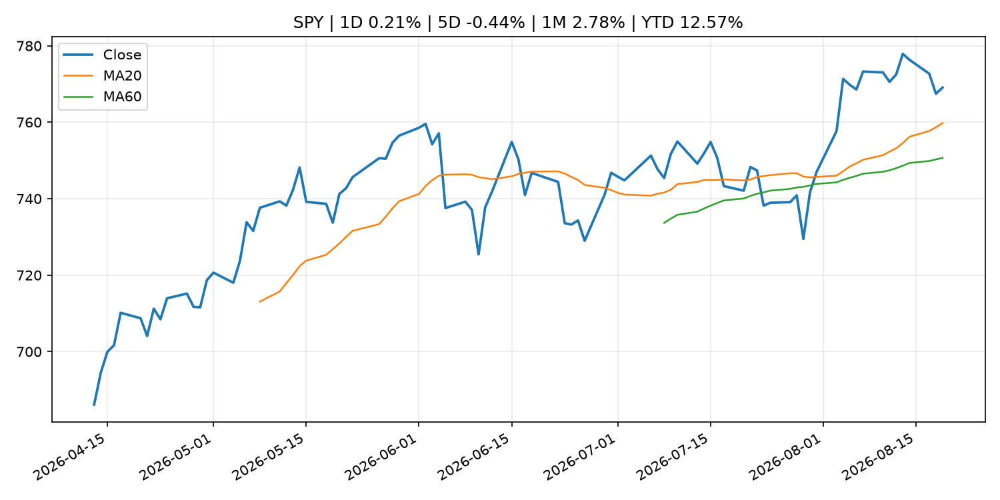
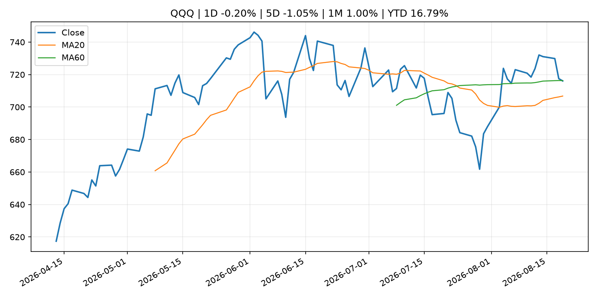
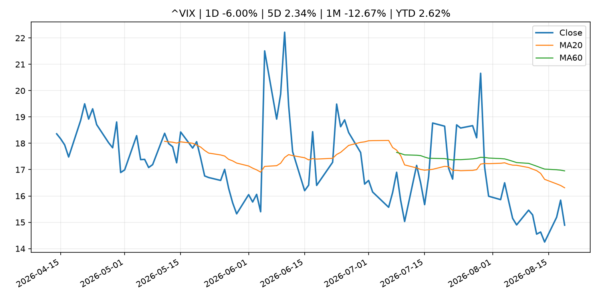
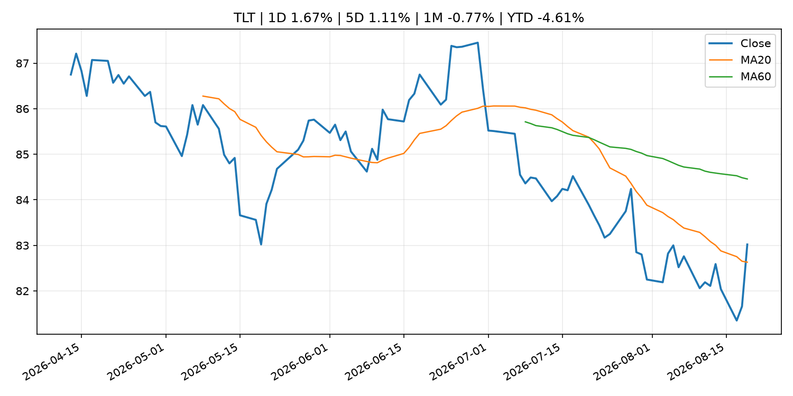
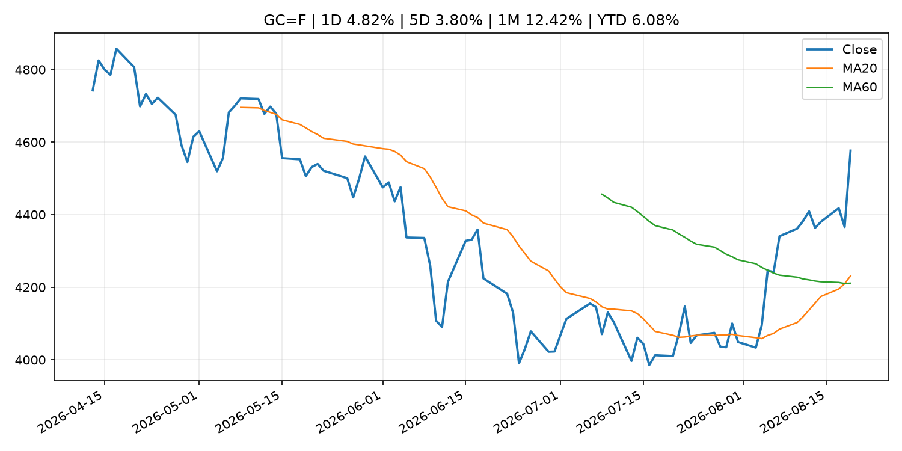
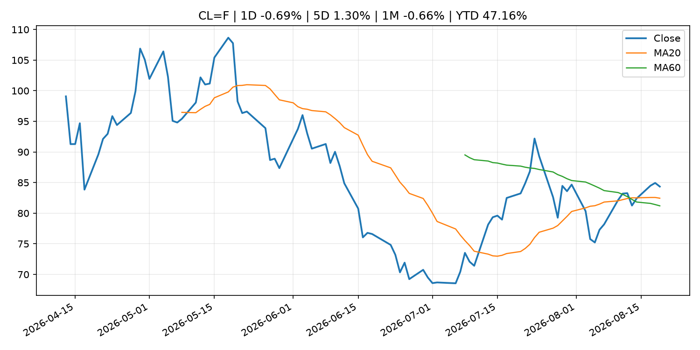
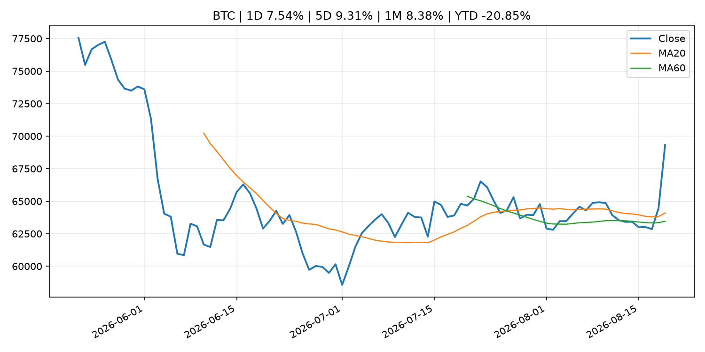
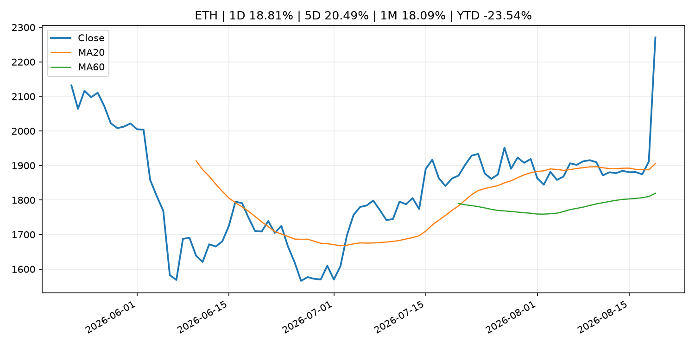
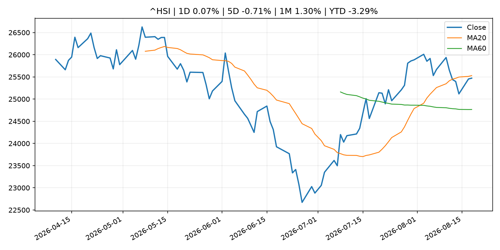

# Global Macro Morning Briefing - 2026-08-20

> Not financial advice / 非投资建议。

## 0. 今日总览
- 市场状态：crypto_specific。BTC/ETH 明显走强但美股平淡，行情更像加密自身事件驱动。
- 今日三大主线：
  1. central_bank_decision: Fed officials saw need for rate hike if inflation doesn't cool, minutes show
  2. regulation: SEC Charges Former Executives With Fraud in Connection With $1.9 Billion Collapse of Subprime Auto Lender Tricolor
  3. regulation: SEC Proposes New Regulation Crypto Assets
- 一句话结论：今日晨报重点关注：央行决策会重定价利率、汇率、久期资产和风险资产。；监管变化会改变行业盈利预期和资产风险溢价。。跨资产方面，SPY 1D 0.21%；QQQ 1D -0.20%；^VIX 1D -6.00%；TLT 1D 1.67%；GC=F 1D 4.82%；CL=F 1D -0.69%；BTC 1D 7.54%；ETH 1D 18.81%；BTC/ETH 明显走强但美股平淡，行情更像加密自身事件驱动。政策、通胀、利率、美元、美债、能源和加密监管仍是主要观察线索。所有结论仅基于公开数据与短摘要整理，不构成投资建议。

## 1. 隔夜跨资产市场
- 美股：SPY 1D 0.21%，QQQ 1D -0.20%，整体趋势需结合 VIX 和利率确认。
- 美债/美元：TLT 1D 1.67%，美元指数 1D -0.89%，是判断折现率压力的核心线索。
- 黄金/原油：黄金 1D 4.82%，原油 1D -0.69%，用于观察避险、通胀和地缘风险。
- 加密：BTC 1D 7.54%，ETH 1D 18.81%，关注是否独立于纳指走出加密自身行情。
- 港股/A股：恒生 1D 0.07%，沪深300/上证 1D n/a，重点看中国政策预期与人民币线索。
- 风险观察：关注 ETF、监管、稳定币或链上流动性新闻。

### US_EQUITY

| symbol | latest close | 1D | 5D | 1M | YTD | trend |
|---|---:|---:|---:|---:|---:|---|
| SPY | 769.06 | 0.21% | -0.44% | 2.78% | 12.57% | uptrend |
| QQQ | 716.08 | -0.20% | -1.05% | 1.00% | 16.79% | range_bound |
| DIA | 534.27 | 0.26% | -0.54% | 2.45% | 10.47% | uptrend |
| IWM | 301.72 | 0.50% | -0.33% | 1.75% | 21.28% | uptrend |
| VTI | 379.99 | 0.25% | -0.48% | 2.85% | 12.99% | uptrend |

### US_MACRO_MARKET

| symbol | latest close | 1D | 5D | 1M | YTD | trend |
|---|---:|---:|---:|---:|---:|---|
| ^VIX | 14.89 | -6.00% | 2.34% | -12.67% | 2.62% | strong_downtrend |
| DX-Y.NYB | 98.77 | -0.89% | -1.24% | -2.38% | 0.35% | downtrend |
| TLT | 83.02 | 1.67% | 1.11% | -0.77% | -4.61% | range_bound |
| IEF | 93.38 | 0.48% | 0.45% | 0.08% | -2.81% | range_bound |

### COMMODITIES

| symbol | latest close | 1D | 5D | 1M | YTD | trend |
|---|---:|---:|---:|---:|---:|---|
| GC=F | 4,576.60 | 4.82% | 3.80% | 12.42% | 6.08% | strong_uptrend |
| SI=F | 67.10 | 4.93% | 2.35% | 14.04% | -4.91% | range_bound |
| CL=F | 84.35 | -0.69% | 1.30% | -0.66% | 47.16% | uptrend |
| BZ=F | 91.58 | 0.62% | 2.92% | 0.63% | 50.75% | uptrend |
| NG=F | 2.78 | 0.04% | -0.96% | -3.07% | -23.24% | range_bound |
| HG=F | 6.51 | 0.39% | -1.36% | -0.05% | 15.38% | uptrend |

### HK_MARKET

| symbol | latest close | 1D | 5D | 1M | YTD | trend |
|---|---:|---:|---:|---:|---:|---|
| ^HSI | 25,471.15 | 0.07% | -0.71% | 1.30% | -3.29% | range_bound |
| 0700.HK | 447.20 | 1.08% | -3.12% | -5.65% | -28.22% | range_bound |
| 9988.HK | 124.20 | -1.97% | 1.31% | 6.15% | -16.64% | strong_uptrend |
| 3690.HK | 87.05 | 1.75% | -5.02% | 2.17% | -16.78% | range_bound |
| 1810.HK | 27.44 | 4.81% | 4.10% | 0.07% | -31.88% | range_bound |
| 1211.HK | 89.40 | -0.67% | -0.22% | -0.45% | -9.47% | range_bound |

### CRYPTO

| symbol | latest close | 1D | 5D | 1M | YTD | trend |
|---|---:|---:|---:|---:|---:|---|
| BTC | 69,318.43 | 7.54% | 9.31% | 8.38% | -20.85% | strong_uptrend |
| ETH | 2,270.89 | 18.81% | 20.49% | 18.09% | -23.54% | strong_uptrend |
| SOLANA | 85.96 | 13.21% | 12.78% | 16.33% | -30.97% | range_bound |
| BINANCECOIN | 632.12 | 4.43% | 3.56% | 10.65% | -26.73% | strong_uptrend |
| RIPPLE | 1.13 | 12.86% | 12.16% | 5.78% | -38.54% | range_bound |

## 2. 今日最重要的 10 条新闻
### 1. Fed officials saw need for rate hike if inflation doesn't cool, minutes show
- 来源：CNBC Economy
- 时间：2026-08-19T18:54:50+00:00
- 地区：US
- 事件类型：central_bank_decision
- 重要性层级：Tier 1
- 一句话摘要：The Federal Reserve on Wednesday released minutes from its July 28-29 policy meeting.
- 为什么重要：央行决策会重定价利率、汇率、久期资产和风险资产。
- 可能影响：主要影响 DXY，方向为 positive，强度 high；通胀压力可能推高政策利率预期并支撑美元。
  - 资产：DXY
    方向：positive
    强度：high
    原因：通胀压力可能推高政策利率预期并支撑美元。
  - 资产：TLT
    方向：negative
    强度：high
    原因：通胀上行通常推升收益率、压低长债价格。
  - 资产：QQQ
    方向：negative
    强度：high
    原因：更高利率对成长股估值折现率不利。
  - 资产：SPY
    方向：mixed
    强度：medium
    原因：名义增长可能支撑收入，但更高利率压制估值。
  - 资产：GC=F
    方向：mixed
    强度：medium
    原因：通胀对黄金是支撑，但实际利率上行会形成压力。
  - 资产：BTC
    方向：negative
    强度：high
    原因：流动性收紧通常压制高 beta 加密资产。
- 原文链接：[https://www.cnbc.com/2026/08/19/fed-minutes-july-2026-officials-saw-need-for-rate-hike-if-inflation-doesnt-cool.html](https://www.cnbc.com/2026/08/19/fed-minutes-july-2026-officials-saw-need-for-rate-hike-if-inflation-doesnt-cool.html)

### 2. SEC Charges Former Executives With Fraud in Connection With $1.9 Billion Collapse of Subprime Auto Lender Tricolor
- 来源：SEC Press Releases
- 时间：2026-08-18T15:55:10-04:00
- 地区：US
- 事件类型：regulation
- 重要性层级：Tier 2
- 一句话摘要：The Securities and Exchange Commission today charged Daniel Chu, Jerome Kollar, and Ameryn Seibold, the former CEO, CFO, and Senior Director of Finance, respectively, at Texas-based Tricolor Holdings, LLC, for their roles in an alleged multi-year scheme…
- 为什么重要：监管变化会改变行业盈利预期和资产风险溢价。
- 可能影响：主要影响 BTC，方向为 mixed，强度 high；加密监管或 ETF 进展会改变 BTC 的资金流和风险溢价。
  - 资产：BTC
    方向：mixed
    强度：high
    原因：加密监管或 ETF 进展会改变 BTC 的资金流和风险溢价。
  - 资产：ETH
    方向：mixed
    强度：high
    原因：监管框架会影响 ETH 产品化和机构参与度。
  - 资产：COIN
    方向：mixed
    强度：medium
    原因：监管清晰度和执法风险会影响交易平台估值。
  - 资产：crypto market
    方向：mixed
    强度：high
    原因：信息影响整个加密市场结构，但方向取决于细节。
- 原文链接：[https://www.sec.gov/newsroom/press-releases/2026-77-sec-charges-former-executives-fraud-connection-19-billion-collapse-subprime-auto-lender-tricolor](https://www.sec.gov/newsroom/press-releases/2026-77-sec-charges-former-executives-fraud-connection-19-billion-collapse-subprime-auto-lender-tricolor)

### 3. SEC Proposes New Regulation Crypto Assets
- 来源：SEC Press Releases
- 时间：2026-08-18T13:15:48-04:00
- 地区：US
- 事件类型：regulation
- 重要性层级：Tier 2
- 一句话摘要：The Securities and Exchange Commission today announced that it proposed new rules, titled “Regulation Crypto Assets,” that would create a clear and fit-for-purpose framework for certain investment contracts involving crypto assets. This proposal follows…
- 为什么重要：监管变化会改变行业盈利预期和资产风险溢价。
- 可能影响：主要影响 BTC，方向为 mixed，强度 high；加密监管或 ETF 进展会改变 BTC 的资金流和风险溢价。
  - 资产：BTC
    方向：mixed
    强度：high
    原因：加密监管或 ETF 进展会改变 BTC 的资金流和风险溢价。
  - 资产：ETH
    方向：mixed
    强度：high
    原因：监管框架会影响 ETH 产品化和机构参与度。
  - 资产：COIN
    方向：mixed
    强度：medium
    原因：监管清晰度和执法风险会影响交易平台估值。
  - 资产：crypto market
    方向：mixed
    强度：high
    原因：信息影响整个加密市场结构，但方向取决于细节。
- 原文链接：[https://www.sec.gov/newsroom/press-releases/2026-76-sec-proposes-new-regulation-crypto-assets](https://www.sec.gov/newsroom/press-releases/2026-76-sec-proposes-new-regulation-crypto-assets)

### 4. Christine Lagarde: Panel remarks about the European economy during a discussion on the global economic outlook at the World Economic Forum
- 来源：ECB Press Releases
- 时间：2026-08-19T09:10:00+02:00
- 地区：EU
- 事件类型：central_bank_speech
- 重要性层级：Tier 2
- 一句话摘要：Christine Lagarde: Panel remarks about the European economy during a discussion on the global economic outlook at the World Economic Forum
- 为什么重要：央行官员表态可能影响市场对下一次会议的定价。
- 可能影响：可能影响利率、汇率、风险资产或大宗商品预期，但当前公开信息不足以判断明确方向。
  - 资产：暂无明确资产映射
  - 方向：unknown
  - 强度：low
  - 原因：公开信息不足以判断方向。
- 原文链接：[https://www.ecb.europa.eu//press/key/date/2026/html/ecb.sp260819~98ddf24b7b.en.html](https://www.ecb.europa.eu//press/key/date/2026/html/ecb.sp260819~98ddf24b7b.en.html)

### 5. Minutes of the Federal Open Market Committee, July 28–29, 2026
- 来源：Federal Reserve Press Releases
- 时间：2026-08-19T18:00:00+00:00
- 地区：US
- 事件类型：other
- 重要性层级：Tier 3
- 一句话摘要：Minutes of the Federal Open Market Committee, July 28–29, 2026
- 为什么重要：这条信息暂未匹配到重大宏观、政策或市场事件，更适合作为背景跟踪。
- 可能影响：更偏背景信息，短期市场影响可能有限。
  - 资产：暂无明确资产映射
  - 方向：unknown
  - 强度：low
  - 原因：公开信息不足以判断方向。
- 原文链接：[https://www.federalreserve.gov/newsevents/pressreleases/monetary20260819a.htm](https://www.federalreserve.gov/newsevents/pressreleases/monetary20260819a.htm)

### 6. Why the Treasury market’s newfound calm could break down in September
- 来源：MarketWatch Top Stories
- 时间：2026-08-19T21:10:00+00:00
- 地区：US
- 事件类型：other
- 重要性层级：Tier 3
- 一句话摘要：A brutal summer stretch for the U.S. Treasury market risks getting worse come September, right as many of the world’s largest companies plan to unleash a new wave of bond issuance.
- 为什么重要：这条信息暂未匹配到重大宏观、政策或市场事件，更适合作为背景跟踪。
- 可能影响：更偏背景信息，短期市场影响可能有限。
  - 资产：暂无明确资产映射
  - 方向：unknown
  - 强度：low
  - 原因：公开信息不足以判断方向。
- 原文链接：[https://www.marketwatch.com/story/treasury-market-reprieve-could-be-fleeting-with-deluge-of-corporate-bond-issuance-due-in-september-33cfaacd?mod=mw_rss_topstories](https://www.marketwatch.com/story/treasury-market-reprieve-could-be-fleeting-with-deluge-of-corporate-bond-issuance-due-in-september-33cfaacd?mod=mw_rss_topstories)

## 3. 政策与央行观察
### 1. Fed officials saw need for rate hike if inflation doesn't cool, minutes show
- 来源：CNBC Economy
- 时间：2026-08-19T18:54:50+00:00
- 地区：US
- 事件类型：central_bank_decision
- 重要性层级：Tier 1
- 一句话摘要：The Federal Reserve on Wednesday released minutes from its July 28-29 policy meeting.
- 为什么重要：央行决策会重定价利率、汇率、久期资产和风险资产。
- 可能影响：主要影响 DXY，方向为 positive，强度 high；通胀压力可能推高政策利率预期并支撑美元。
  - 资产：DXY
    方向：positive
    强度：high
    原因：通胀压力可能推高政策利率预期并支撑美元。
  - 资产：TLT
    方向：negative
    强度：high
    原因：通胀上行通常推升收益率、压低长债价格。
  - 资产：QQQ
    方向：negative
    强度：high
    原因：更高利率对成长股估值折现率不利。
  - 资产：SPY
    方向：mixed
    强度：medium
    原因：名义增长可能支撑收入，但更高利率压制估值。
  - 资产：GC=F
    方向：mixed
    强度：medium
    原因：通胀对黄金是支撑，但实际利率上行会形成压力。
  - 资产：BTC
    方向：negative
    强度：high
    原因：流动性收紧通常压制高 beta 加密资产。
- 原文链接：[https://www.cnbc.com/2026/08/19/fed-minutes-july-2026-officials-saw-need-for-rate-hike-if-inflation-doesnt-cool.html](https://www.cnbc.com/2026/08/19/fed-minutes-july-2026-officials-saw-need-for-rate-hike-if-inflation-doesnt-cool.html)

### 2. SEC Charges Former Executives With Fraud in Connection With $1.9 Billion Collapse of Subprime Auto Lender Tricolor
- 来源：SEC Press Releases
- 时间：2026-08-18T15:55:10-04:00
- 地区：US
- 事件类型：regulation
- 重要性层级：Tier 2
- 一句话摘要：The Securities and Exchange Commission today charged Daniel Chu, Jerome Kollar, and Ameryn Seibold, the former CEO, CFO, and Senior Director of Finance, respectively, at Texas-based Tricolor Holdings, LLC, for their roles in an alleged multi-year scheme…
- 为什么重要：监管变化会改变行业盈利预期和资产风险溢价。
- 可能影响：主要影响 BTC，方向为 mixed，强度 high；加密监管或 ETF 进展会改变 BTC 的资金流和风险溢价。
  - 资产：BTC
    方向：mixed
    强度：high
    原因：加密监管或 ETF 进展会改变 BTC 的资金流和风险溢价。
  - 资产：ETH
    方向：mixed
    强度：high
    原因：监管框架会影响 ETH 产品化和机构参与度。
  - 资产：COIN
    方向：mixed
    强度：medium
    原因：监管清晰度和执法风险会影响交易平台估值。
  - 资产：crypto market
    方向：mixed
    强度：high
    原因：信息影响整个加密市场结构，但方向取决于细节。
- 原文链接：[https://www.sec.gov/newsroom/press-releases/2026-77-sec-charges-former-executives-fraud-connection-19-billion-collapse-subprime-auto-lender-tricolor](https://www.sec.gov/newsroom/press-releases/2026-77-sec-charges-former-executives-fraud-connection-19-billion-collapse-subprime-auto-lender-tricolor)

### 3. SEC Proposes New Regulation Crypto Assets
- 来源：SEC Press Releases
- 时间：2026-08-18T13:15:48-04:00
- 地区：US
- 事件类型：regulation
- 重要性层级：Tier 2
- 一句话摘要：The Securities and Exchange Commission today announced that it proposed new rules, titled “Regulation Crypto Assets,” that would create a clear and fit-for-purpose framework for certain investment contracts involving crypto assets. This proposal follows…
- 为什么重要：监管变化会改变行业盈利预期和资产风险溢价。
- 可能影响：主要影响 BTC，方向为 mixed，强度 high；加密监管或 ETF 进展会改变 BTC 的资金流和风险溢价。
  - 资产：BTC
    方向：mixed
    强度：high
    原因：加密监管或 ETF 进展会改变 BTC 的资金流和风险溢价。
  - 资产：ETH
    方向：mixed
    强度：high
    原因：监管框架会影响 ETH 产品化和机构参与度。
  - 资产：COIN
    方向：mixed
    强度：medium
    原因：监管清晰度和执法风险会影响交易平台估值。
  - 资产：crypto market
    方向：mixed
    强度：high
    原因：信息影响整个加密市场结构，但方向取决于细节。
- 原文链接：[https://www.sec.gov/newsroom/press-releases/2026-76-sec-proposes-new-regulation-crypto-assets](https://www.sec.gov/newsroom/press-releases/2026-76-sec-proposes-new-regulation-crypto-assets)

### 4. Christine Lagarde: Panel remarks about the European economy during a discussion on the global economic outlook at the World Economic Forum
- 来源：ECB Press Releases
- 时间：2026-08-19T09:10:00+02:00
- 地区：EU
- 事件类型：central_bank_speech
- 重要性层级：Tier 2
- 一句话摘要：Christine Lagarde: Panel remarks about the European economy during a discussion on the global economic outlook at the World Economic Forum
- 为什么重要：央行官员表态可能影响市场对下一次会议的定价。
- 可能影响：可能影响利率、汇率、风险资产或大宗商品预期，但当前公开信息不足以判断明确方向。
  - 资产：暂无明确资产映射
  - 方向：unknown
  - 强度：low
  - 原因：公开信息不足以判断方向。
- 原文链接：[https://www.ecb.europa.eu//press/key/date/2026/html/ecb.sp260819~98ddf24b7b.en.html](https://www.ecb.europa.eu//press/key/date/2026/html/ecb.sp260819~98ddf24b7b.en.html)

## 4. 市场异动与图表
- VIX 下跌 -6.00%
- TLT 上涨 1.67%
- DXY 下跌 -0.89%
- Gold 上涨 4.82%
- BTC 上涨 7.54%
- ETH 上涨 18.81%

### SPY

### QQQ

### ^VIX

### TLT

### GC=F

### CL=F

### BTC

### ETH

### ^HSI

## 5. 华尔街与机构公开观点
- 暂无可靠公开观点。

## 6. 今日重点关注
- 经济数据：经济数据：暂无可靠公开日历数据；如配置经济日历源后可自动填充。
- 央行讲话：央行讲话：暂无可靠公开日历数据；重点跟踪 Fed、ECB、BoJ、PBOC 官网 RSS。
- 财报：财报：暂无可靠数据。
- 政策事件：政策事件：暂无可靠数据。
- 风险提醒：风险提醒：关注数据源失败项、突发地缘风险、利率和美元的二阶反应。

## 7. 英文金融表达与宏观概念
- **inflation expectations**：通胀预期，指家庭、企业或市场对未来通胀的预估。 例句：Inflation expectations can shape wage bargaining and bond yields.
- **real yield**：实际收益率，名义利率扣除通胀预期后的收益率。 例句：Gold often reacts more to real yields than nominal yields.
- **terminal rate**：终端利率，市场预期本轮加息周期的最高政策利率。 例句：A higher terminal rate can pressure growth stocks.
- **market structure**：市场结构，指交易、托管、清算、ETF、监管等制度安排。 例句：Crypto market structure rules can affect institutional participation.
- **soft landing**：软着陆，指通胀回落而经济避免明显衰退。 例句：Markets often rally when data support a soft landing.
- **risk-off**：避险模式，资金偏向美元、国债、黄金等防御资产。 例句：A geopolitical shock can push markets into risk-off mode.

## 8. 背景材料
- [Why the Treasury market’s newfound calm could break down in September](https://www.marketwatch.com/story/treasury-market-reprieve-could-be-fleeting-with-deluge-of-corporate-bond-issuance-due-in-september-33cfaacd?mod=mw_rss_topstories)（MarketWatch Top Stories，other）：A brutal summer stretch for the U.S. Treasury market risks getting worse come September, right as many of the world’s largest companies plan to unleash a new wave of bond issuance.
- [The national debt just hit $40 trillion. Here’s how it can hurt Americans.](https://www.marketwatch.com/story/the-national-debt-is-about-to-hit-40-trillion-heres-how-it-can-hurt-americans-b4f252b9?mod=mw_rss_topstories)（MarketWatch Top Stories，other）：A research group looked at the consequences for a student financing college, a family buying a home and a Social Security recipient.
- [Moderna’s cancer-vaccine breakthrough drives broad biopharma stock rally](https://www.marketwatch.com/story/modernas-cancer-vaccine-breakthrough-drives-broad-biopharma-stock-rally-ff2816aa?mod=mw_rss_topstories)（MarketWatch Top Stories，other）：The biopharmaceutical sector has struggled with a prolonged downturn in recent years but has been on an upswing of late.
- [Can I claim 50% of my husband’s Social Security now — and switch to my higher benefit at 70?](https://www.marketwatch.com/story/can-i-claim-50-of-my-husbands-social-security-now-and-switch-to-my-higher-benefit-at-70-5518700b?mod=mw_rss_topstories)（MarketWatch Top Stories，other）：“I would like to offer a piece of advice for women who are or have been married.”
- [Minutes of the Federal Open Market Committee, July 28–29, 2026](https://www.federalreserve.gov/newsevents/pressreleases/monetary20260819a.htm)（Federal Reserve Press Releases，other）：Minutes of the Federal Open Market Committee, July 28–29, 2026
- [Bitcoin surges above $68,000, liquidating $1.4 billion shorts as Treasury buybacks boost risk appetite](https://www.coindesk.com/markets/2026/08/19/bitcoin-surges-above-usd68-000-liquidating-usd1-4-billion-shorts-as-treasury-buybacks-boost-risk-appetite)（CoinDesk，other）：Bitcoin surges above $68,000, liquidating $1.4 billion shorts as Treasury buybacks boost risk appetite
- [Bitcoin nears key technical breakout that could propel prices to $76,000](https://www.coindesk.com/markets/2026/08/19/bitcoin-nears-key-technical-breakout-that-could-propel-prices-to-usd76-000)（CoinDesk，other）：Bitcoin nears key technical breakout that could propel prices to $76,000
- [Bitcoin is flashing 8 of 12 capitulation signals, but bottom's not yet in, says VanEck](https://www.coindesk.com/markets/2026/08/19/bitcoin-is-flashing-8-of-12-capitulation-signals-but-its-not-a-bottom-yet)（CoinDesk，other）：Bitcoin is flashing 8 of 12 capitulation signals, but bottom's not yet in, says VanEck
- [Fed decision making comes into focus as bitcoin holds steady, bond yields surge](https://www.coindesk.com/daybook-us/2026/08/19/fed-decision-making-comes-into-focus-as-bitcoin-holds-steady-bond-yields-surge)（CoinDesk，other）：Fed decision making comes into focus as bitcoin holds steady, bond yields surge
- [Bitcoin stuck in a six-week range as global bond yields hit highest levels for decades](https://www.coindesk.com/markets/2026/08/19/bitcoin-stuck-in-a-six-week-range-as-global-bond-yields-hit-highest-levels-for-decades)（CoinDesk，other）：Bitcoin stuck in a six-week range as global bond yields hit highest levels for decades
- [Live updates: Bitcoin and gold jump but rejected at key level as Treasury move pushes yields lower](https://www.coindesk.com/markets/2026/08/19/live-updates-bitcoin-holds-firm-above-usd64-000-as-south-korea-s-kospi-sinks-5-8)（CoinDesk，other）：Live updates: Bitcoin and gold jump but rejected at key level as Treasury move pushes yields lower
- [Goldman studied where AI is squeezing labor markets. Here's what it found](https://www.cnbc.com/2026/08/19/goldman-ai-impact-employment-jobs.html)（CNBC Economy，other）：Goldman Sachs found that AI is starting to weigh on employment across developed economies.
- [Maya Protocol exploit drains bitcoin and other assets as pool value drops by $11 million](https://www.coindesk.com/markets/2026/08/19/maya-protocol-exploit-drains-bitcoin-and-other-assets-as-pool-value-drops-usd11-million)（CoinDesk，other）：Maya Protocol exploit drains bitcoin and other assets as pool value drops by $11 million
- [Bitcoin holds $64,000 and solana leads gains amid 7% Korean chip stock slide](https://www.coindesk.com/markets/2026/08/19/solana-leads-bitcoin-and-ether-higher-while-korean-chip-stocks-slide-7)（CoinDesk，other）：Bitcoin holds $64,000 and solana leads gains amid 7% Korean chip stock slide
- [Analysis: Bond market pressure is squeezing Main Street as Wall Street waits on Warsh](https://www.cnbc.com/2026/08/18/bond-market-treasury-yields-warsh-main-street.html)（CNBC Economy，other）：A sell-off in long-term Treasurys is raising borrowing costs, exposing how debt, AI spending and energy are turning the bond market into a political problem.

## 9. 数据源、失败项与免责声明
- 采集时间：2026-08-19T22:22:32
- 数据源：公开 RSS、Yahoo Finance、CoinGecko、AKShare、FRED、SEC data.sec.gov，以及用户自有 inputs/reports 文件。
- 合规说明：不绕过 WSJ、Bloomberg、FT、Reuters 等付费墙；对付费媒体只使用公开 RSS 标题、摘要、链接和发布时间。
- 免责声明：Not financial advice / 非投资建议。本项目仅供个人学习、研究和信息整理，不构成投资建议、交易建议或任何收益承诺。
- 失败或跳过的数据源：
  - crypto data failed coin=dogecoin
  - China market data failed symbol=上证指数: empty dataframe
  - China market data failed symbol=深证成指: empty dataframe
  - China market data failed symbol=创业板指: empty dataframe
  - China market data failed symbol=沪深300: empty dataframe
  - China market data failed symbol=中证500: empty dataframe
  - China market data failed symbol=科创50: empty dataframe
  - FRED_API_KEY not set; skipping FRED macro series
  - SEC failed cik=0000320193
  - SEC failed cik=0000789019
  - SEC failed cik=0001045810
  - SEC failed cik=0001318605
  - SEC failed cik=0001577552
