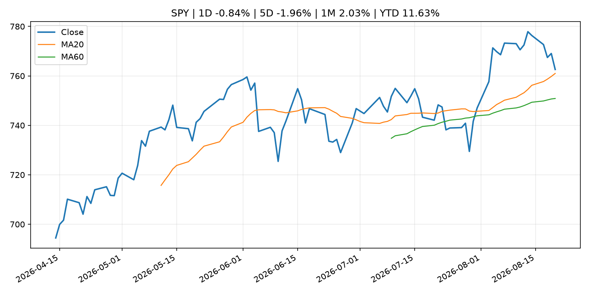
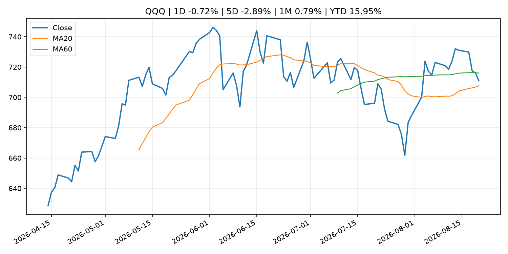
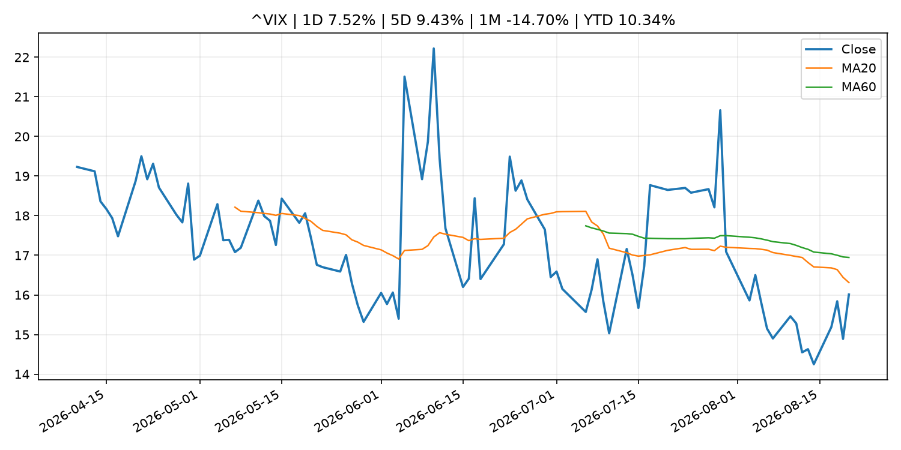
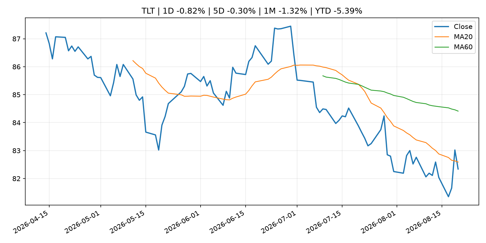
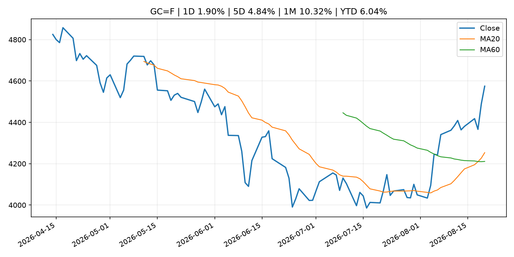
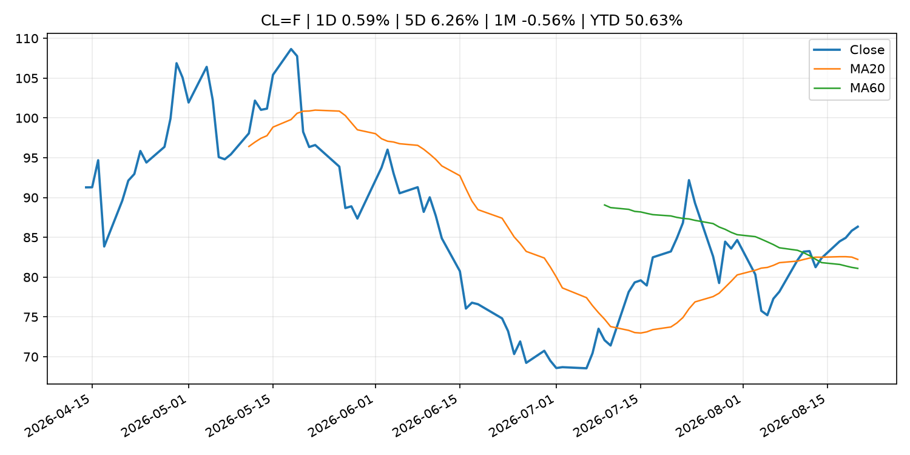
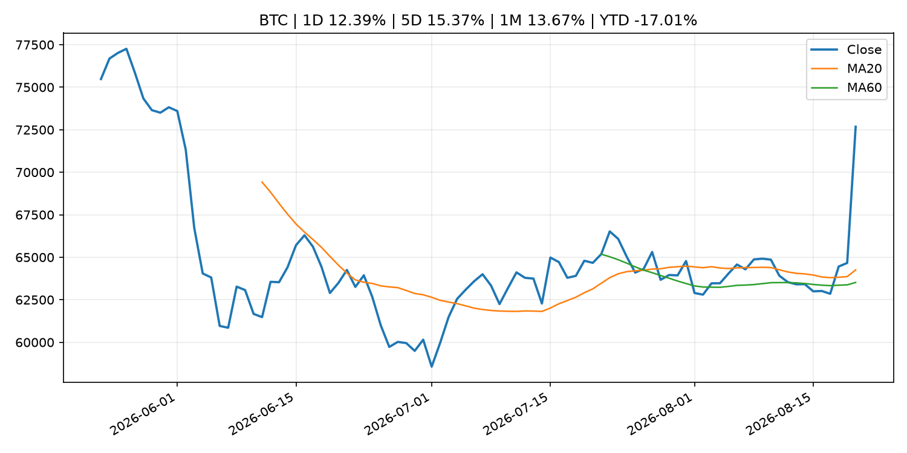
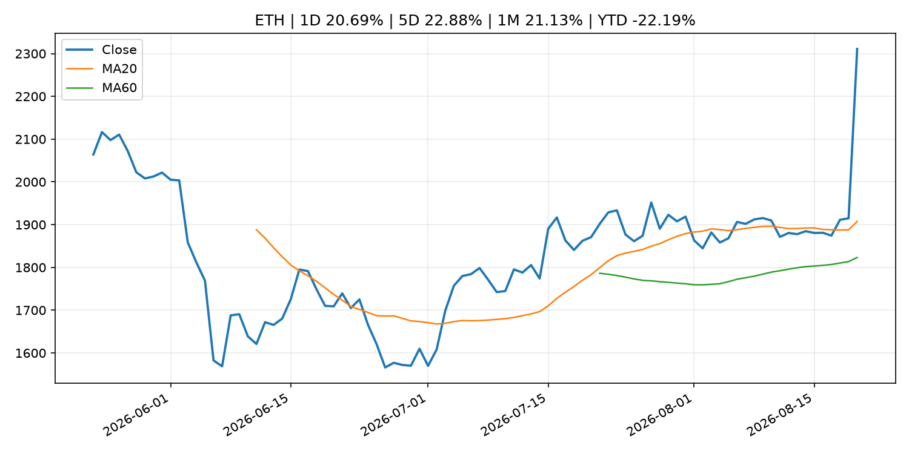
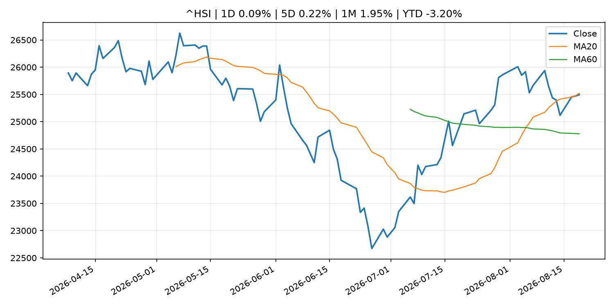

# Global Macro Morning Briefing - 2026-08-21

> Not financial advice / 非投资建议。

## 0. 今日总览
- 市场状态：mixed。股指回落、VIX 抬升且避险资产走强，市场偏风险规避。 但存在信号冲突，需要降低单一叙事置信度。
- 今日三大主线：
  1. central_bank_decision: Fed officials saw need for rate hike if inflation doesn't cool, minutes show
  2. financial_stability: Fed liquidity promises, dollar weakness could determine bitcoin's next move
  3. regulation: Federal Reserve Board issues enforcement action with SouthPoint Bancshares, Inc. and announces termination of enforcement action with Deutsche Bank AG, DB USA Corporation, and Deutsche Bank AG New York Branch
- 一句话结论：今日晨报重点关注：央行决策会重定价利率、汇率、久期资产和风险资产。；金融稳定信号可能放大跨资产波动，并影响央行反应函数。。跨资产方面，SPY 1D -0.84%；QQQ 1D -0.72%；^VIX 1D 7.52%；TLT 1D -0.82%；GC=F 1D 1.90%；CL=F 1D 0.59%；BTC 1D 12.39%；ETH 1D 20.69%；股指回落、VIX 抬升且避险资产走强，市场偏风险规避。 但存在信号冲突，需要降低单一叙事置信度。政策、通胀、利率、美元、美债、能源和加密监管仍是主要观察线索。所有结论仅基于公开数据与短摘要整理，不构成投资建议。

## 1. 隔夜跨资产市场
- 美股：SPY 1D -0.84%，QQQ 1D -0.72%，整体趋势需结合 VIX 和利率确认。
- 美债/美元：TLT 1D -0.82%，美元指数 1D 0.01%，是判断折现率压力的核心线索。
- 黄金/原油：黄金 1D 1.90%，原油 1D 0.59%，用于观察避险、通胀和地缘风险。
- 加密：BTC 1D 12.39%，ETH 1D 20.69%，关注是否独立于纳指走出加密自身行情。
- 港股/A股：恒生 1D 0.09%，沪深300/上证 1D n/a，重点看中国政策预期与人民币线索。
- 风险观察：关注避险是否演变为信用或流动性压力。

### US_EQUITY

| symbol | latest close | 1D | 5D | 1M | YTD | trend |
|---|---:|---:|---:|---:|---:|---|
| SPY | 762.60 | -0.84% | -1.96% | 2.03% | 11.63% | uptrend |
| QQQ | 710.93 | -0.72% | -2.89% | 0.79% | 15.95% | range_bound |
| DIA | 527.51 | -1.27% | -1.93% | 1.16% | 9.07% | range_bound |
| IWM | 297.67 | -1.34% | -1.92% | 1.32% | 19.65% | range_bound |
| VTI | 376.58 | -0.90% | -2.01% | 2.09% | 11.97% | uptrend |

### US_MACRO_MARKET

| symbol | latest close | 1D | 5D | 1M | YTD | trend |
|---|---:|---:|---:|---:|---:|---|
| ^VIX | 16.01 | 7.52% | 9.43% | -14.70% | 10.34% | strong_downtrend |
| DX-Y.NYB | 98.84 | 0.01% | -1.12% | -1.89% | 0.43% | downtrend |
| TLT | 82.34 | -0.82% | -0.30% | -1.32% | -5.39% | downtrend |
| IEF | 93.00 | -0.41% | -0.32% | -0.33% | -3.21% | downtrend |

### COMMODITIES

| symbol | latest close | 1D | 5D | 1M | YTD | trend |
|---|---:|---:|---:|---:|---:|---|
| GC=F | 4,574.80 | 1.90% | 4.84% | 10.32% | 6.04% | strong_uptrend |
| SI=F | 68.18 | 3.72% | 5.10% | 13.60% | -3.37% | range_bound |
| CL=F | 86.34 | 0.59% | 6.26% | -0.56% | 50.63% | uptrend |
| BZ=F | 93.34 | 1.88% | 7.20% | -0.78% | 53.65% | uptrend |
| NG=F | 2.76 | -1.85% | 1.28% | -5.57% | -23.66% | range_bound |
| HG=F | 6.48 | -0.12% | -1.71% | 0.45% | 14.89% | range_bound |

### HK_MARKET

| symbol | latest close | 1D | 5D | 1M | YTD | trend |
|---|---:|---:|---:|---:|---:|---|
| ^HSI | 25,495.07 | 0.09% | 0.22% | 1.95% | -3.20% | range_bound |
| 0700.HK | 451.40 | 0.94% | 2.36% | 2.45% | -27.54% | range_bound |
| 9988.HK | 126.20 | 1.61% | 3.53% | 11.09% | -15.30% | strong_uptrend |
| 3690.HK | 85.85 | -1.38% | -5.92% | 2.63% | -17.93% | range_bound |
| 1810.HK | 27.76 | 1.17% | 7.26% | 4.05% | -31.08% | uptrend |
| 1211.HK | 91.80 | 2.68% | 3.85% | 4.50% | -7.04% | uptrend |

### CRYPTO

| symbol | latest close | 1D | 5D | 1M | YTD | trend |
|---|---:|---:|---:|---:|---:|---|
| BTC | 72,676.80 | 12.39% | 15.37% | 13.67% | -17.01% | strong_uptrend |
| ETH | 2,310.92 | 20.69% | 22.88% | 21.13% | -22.19% | strong_uptrend |
| SOLANA | 87.42 | 13.54% | 16.03% | 18.77% | -29.80% | range_bound |
| BINANCECOIN | 653.96 | 8.45% | 7.73% | 14.46% | -24.20% | strong_uptrend |
| RIPPLE | 1.26 | 25.95% | 26.13% | 17.48% | -31.55% | range_bound |

## 2. 今日最重要的 10 条新闻
### 1. Fed officials saw need for rate hike if inflation doesn't cool, minutes show
- 来源：CNBC Economy
- 时间：2026-08-19T18:54:50+00:00
- 地区：US
- 事件类型：central_bank_decision
- 重要性层级：Tier 1
- 一句话摘要：The Federal Reserve on Wednesday released minutes from its July 28-29 policy meeting.
- 为什么重要：央行决策会重定价利率、汇率、久期资产和风险资产。
- 可能影响：主要影响 DXY，方向为 positive，强度 high；通胀压力可能推高政策利率预期并支撑美元。
  - 资产：DXY
    方向：positive
    强度：high
    原因：通胀压力可能推高政策利率预期并支撑美元。
  - 资产：TLT
    方向：negative
    强度：high
    原因：通胀上行通常推升收益率、压低长债价格。
  - 资产：QQQ
    方向：negative
    强度：high
    原因：更高利率对成长股估值折现率不利。
  - 资产：SPY
    方向：mixed
    强度：medium
    原因：名义增长可能支撑收入，但更高利率压制估值。
  - 资产：GC=F
    方向：mixed
    强度：medium
    原因：通胀对黄金是支撑，但实际利率上行会形成压力。
  - 资产：BTC
    方向：negative
    强度：high
    原因：流动性收紧通常压制高 beta 加密资产。
- 原文链接：[https://www.cnbc.com/2026/08/19/fed-minutes-july-2026-officials-saw-need-for-rate-hike-if-inflation-doesnt-cool.html](https://www.cnbc.com/2026/08/19/fed-minutes-july-2026-officials-saw-need-for-rate-hike-if-inflation-doesnt-cool.html)

### 2. Fed liquidity promises, dollar weakness could determine bitcoin's next move
- 来源：CoinDesk
- 时间：2026-08-20T11:31:10+00:00
- 地区：global
- 事件类型：financial_stability
- 重要性层级：Tier 1
- 一句话摘要：Fed liquidity promises, dollar weakness could determine bitcoin's next move
- 为什么重要：金融稳定信号可能放大跨资产波动，并影响央行反应函数。
- 可能影响：可能影响利率、汇率、风险资产或大宗商品预期，但当前公开信息不足以判断明确方向。
  - 资产：暂无明确资产映射
  - 方向：unknown
  - 强度：low
  - 原因：公开信息不足以判断方向。
- 原文链接：[https://www.coindesk.com/daybook-us/2026/08/20/fed-liquidity-promises-dollar-weakness-could-determine-bitcoin-s-next-move](https://www.coindesk.com/daybook-us/2026/08/20/fed-liquidity-promises-dollar-weakness-could-determine-bitcoin-s-next-move)

### 3. Federal Reserve Board issues enforcement action with SouthPoint Bancshares, Inc. and announces termination of enforcement action with Deutsche Bank AG, DB USA Corporation, and Deutsche Bank AG New York Branch
- 来源：Federal Reserve Press Releases
- 时间：2026-08-20T15:00:00+00:00
- 地区：US
- 事件类型：regulation
- 重要性层级：Tier 2
- 一句话摘要：Federal Reserve Board issues enforcement action with SouthPoint Bancshares, Inc. and announces termination of enforcement action with Deutsche Bank AG, DB USA Corporation, and Deutsche Bank AG New York Branch
- 为什么重要：监管变化会改变行业盈利预期和资产风险溢价。
- 可能影响：可能影响利率、汇率、风险资产或大宗商品预期，但当前公开信息不足以判断明确方向。
  - 资产：暂无明确资产映射
  - 方向：unknown
  - 强度：low
  - 原因：公开信息不足以判断方向。
- 原文链接：[https://www.federalreserve.gov/newsevents/pressreleases/enforcement20260820b.htm](https://www.federalreserve.gov/newsevents/pressreleases/enforcement20260820b.htm)

### 4. Federal Reserve Board issues enforcement actions with former employee of Regions Bank and former employee of United Community Bank
- 来源：Federal Reserve Press Releases
- 时间：2026-08-20T15:00:00+00:00
- 地区：US
- 事件类型：regulation
- 重要性层级：Tier 2
- 一句话摘要：Federal Reserve Board issues enforcement actions with former employee of Regions Bank and former employee of United Community Bank
- 为什么重要：监管变化会改变行业盈利预期和资产风险溢价。
- 可能影响：可能影响利率、汇率、风险资产或大宗商品预期，但当前公开信息不足以判断明确方向。
  - 资产：暂无明确资产映射
  - 方向：unknown
  - 强度：low
  - 原因：公开信息不足以判断方向。
- 原文链接：[https://www.federalreserve.gov/newsevents/pressreleases/enforcement20260820a.htm](https://www.federalreserve.gov/newsevents/pressreleases/enforcement20260820a.htm)

### 5. Christine Lagarde: Panel remarks about the European economy during a discussion on the global economic outlook at the World Economic Forum
- 来源：ECB Press Releases
- 时间：2026-08-19T09:10:00+02:00
- 地区：EU
- 事件类型：central_bank_speech
- 重要性层级：Tier 2
- 一句话摘要：Christine Lagarde: Panel remarks about the European economy during a discussion on the global economic outlook at the World Economic Forum
- 为什么重要：央行官员表态可能影响市场对下一次会议的定价。
- 可能影响：可能影响利率、汇率、风险资产或大宗商品预期，但当前公开信息不足以判断明确方向。
  - 资产：暂无明确资产映射
  - 方向：unknown
  - 强度：low
  - 原因：公开信息不足以判断方向。
- 原文链接：[https://www.ecb.europa.eu//press/key/date/2026/html/ecb.sp260819~98ddf24b7b.en.html](https://www.ecb.europa.eu//press/key/date/2026/html/ecb.sp260819~98ddf24b7b.en.html)

### 6. Federal Reserve Board announces approval of application by National Westminster Bank Plc
- 来源：Federal Reserve Press Releases
- 时间：2026-08-20T20:00:00+00:00
- 地区：US
- 事件类型：other
- 重要性层级：Tier 3
- 一句话摘要：Federal Reserve Board announces approval of application by National Westminster Bank Plc
- 为什么重要：这条信息暂未匹配到重大宏观、政策或市场事件，更适合作为背景跟踪。
- 可能影响：更偏背景信息，短期市场影响可能有限。
  - 资产：暂无明确资产映射
  - 方向：unknown
  - 强度：low
  - 原因：公开信息不足以判断方向。
- 原文链接：[https://www.federalreserve.gov/newsevents/pressreleases/orders20260820a.htm](https://www.federalreserve.gov/newsevents/pressreleases/orders20260820a.htm)

### 7. Anxious bond market sends troubling message to investors: There’s no easy fix for U.S. debt
- 来源：MarketWatch Top Stories
- 时间：2026-08-20T19:40:00+00:00
- 地区：US
- 事件类型：other
- 重要性层级：Tier 3
- 一句话摘要：Treasury Secretary Scott Bessent’s plan to calm markets is being short-circuited.
- 为什么重要：这条信息暂未匹配到重大宏观、政策或市场事件，更适合作为背景跟踪。
- 可能影响：更偏背景信息，短期市场影响可能有限。
  - 资产：暂无明确资产映射
  - 方向：unknown
  - 强度：low
  - 原因：公开信息不足以判断方向。
- 原文链接：[https://www.marketwatch.com/story/treasury-rout-restarts-one-day-after-bessents-beefed-up-buyback-plan-972766a1?mod=mw_rss_topstories](https://www.marketwatch.com/story/treasury-rout-restarts-one-day-after-bessents-beefed-up-buyback-plan-972766a1?mod=mw_rss_topstories)

## 3. 政策与央行观察
### 1. Fed officials saw need for rate hike if inflation doesn't cool, minutes show
- 来源：CNBC Economy
- 时间：2026-08-19T18:54:50+00:00
- 地区：US
- 事件类型：central_bank_decision
- 重要性层级：Tier 1
- 一句话摘要：The Federal Reserve on Wednesday released minutes from its July 28-29 policy meeting.
- 为什么重要：央行决策会重定价利率、汇率、久期资产和风险资产。
- 可能影响：主要影响 DXY，方向为 positive，强度 high；通胀压力可能推高政策利率预期并支撑美元。
  - 资产：DXY
    方向：positive
    强度：high
    原因：通胀压力可能推高政策利率预期并支撑美元。
  - 资产：TLT
    方向：negative
    强度：high
    原因：通胀上行通常推升收益率、压低长债价格。
  - 资产：QQQ
    方向：negative
    强度：high
    原因：更高利率对成长股估值折现率不利。
  - 资产：SPY
    方向：mixed
    强度：medium
    原因：名义增长可能支撑收入，但更高利率压制估值。
  - 资产：GC=F
    方向：mixed
    强度：medium
    原因：通胀对黄金是支撑，但实际利率上行会形成压力。
  - 资产：BTC
    方向：negative
    强度：high
    原因：流动性收紧通常压制高 beta 加密资产。
- 原文链接：[https://www.cnbc.com/2026/08/19/fed-minutes-july-2026-officials-saw-need-for-rate-hike-if-inflation-doesnt-cool.html](https://www.cnbc.com/2026/08/19/fed-minutes-july-2026-officials-saw-need-for-rate-hike-if-inflation-doesnt-cool.html)

### 2. Fed liquidity promises, dollar weakness could determine bitcoin's next move
- 来源：CoinDesk
- 时间：2026-08-20T11:31:10+00:00
- 地区：global
- 事件类型：financial_stability
- 重要性层级：Tier 1
- 一句话摘要：Fed liquidity promises, dollar weakness could determine bitcoin's next move
- 为什么重要：金融稳定信号可能放大跨资产波动，并影响央行反应函数。
- 可能影响：可能影响利率、汇率、风险资产或大宗商品预期，但当前公开信息不足以判断明确方向。
  - 资产：暂无明确资产映射
  - 方向：unknown
  - 强度：low
  - 原因：公开信息不足以判断方向。
- 原文链接：[https://www.coindesk.com/daybook-us/2026/08/20/fed-liquidity-promises-dollar-weakness-could-determine-bitcoin-s-next-move](https://www.coindesk.com/daybook-us/2026/08/20/fed-liquidity-promises-dollar-weakness-could-determine-bitcoin-s-next-move)

### 3. Federal Reserve Board issues enforcement action with SouthPoint Bancshares, Inc. and announces termination of enforcement action with Deutsche Bank AG, DB USA Corporation, and Deutsche Bank AG New York Branch
- 来源：Federal Reserve Press Releases
- 时间：2026-08-20T15:00:00+00:00
- 地区：US
- 事件类型：regulation
- 重要性层级：Tier 2
- 一句话摘要：Federal Reserve Board issues enforcement action with SouthPoint Bancshares, Inc. and announces termination of enforcement action with Deutsche Bank AG, DB USA Corporation, and Deutsche Bank AG New York Branch
- 为什么重要：监管变化会改变行业盈利预期和资产风险溢价。
- 可能影响：可能影响利率、汇率、风险资产或大宗商品预期，但当前公开信息不足以判断明确方向。
  - 资产：暂无明确资产映射
  - 方向：unknown
  - 强度：low
  - 原因：公开信息不足以判断方向。
- 原文链接：[https://www.federalreserve.gov/newsevents/pressreleases/enforcement20260820b.htm](https://www.federalreserve.gov/newsevents/pressreleases/enforcement20260820b.htm)

### 4. Federal Reserve Board issues enforcement actions with former employee of Regions Bank and former employee of United Community Bank
- 来源：Federal Reserve Press Releases
- 时间：2026-08-20T15:00:00+00:00
- 地区：US
- 事件类型：regulation
- 重要性层级：Tier 2
- 一句话摘要：Federal Reserve Board issues enforcement actions with former employee of Regions Bank and former employee of United Community Bank
- 为什么重要：监管变化会改变行业盈利预期和资产风险溢价。
- 可能影响：可能影响利率、汇率、风险资产或大宗商品预期，但当前公开信息不足以判断明确方向。
  - 资产：暂无明确资产映射
  - 方向：unknown
  - 强度：low
  - 原因：公开信息不足以判断方向。
- 原文链接：[https://www.federalreserve.gov/newsevents/pressreleases/enforcement20260820a.htm](https://www.federalreserve.gov/newsevents/pressreleases/enforcement20260820a.htm)

### 5. Christine Lagarde: Panel remarks about the European economy during a discussion on the global economic outlook at the World Economic Forum
- 来源：ECB Press Releases
- 时间：2026-08-19T09:10:00+02:00
- 地区：EU
- 事件类型：central_bank_speech
- 重要性层级：Tier 2
- 一句话摘要：Christine Lagarde: Panel remarks about the European economy during a discussion on the global economic outlook at the World Economic Forum
- 为什么重要：央行官员表态可能影响市场对下一次会议的定价。
- 可能影响：可能影响利率、汇率、风险资产或大宗商品预期，但当前公开信息不足以判断明确方向。
  - 资产：暂无明确资产映射
  - 方向：unknown
  - 强度：low
  - 原因：公开信息不足以判断方向。
- 原文链接：[https://www.ecb.europa.eu//press/key/date/2026/html/ecb.sp260819~98ddf24b7b.en.html](https://www.ecb.europa.eu//press/key/date/2026/html/ecb.sp260819~98ddf24b7b.en.html)

## 4. 市场异动与图表
- SPY 下跌 -0.84%
- QQQ 下跌 -0.72%
- VIX 上涨 7.52%
- TLT 下跌 -0.82%
- Gold 上涨 1.90%
- BTC 上涨 12.39%
- ETH 上涨 20.69%

### 信号矛盾
- 股债同时承压，可能是利率或流动性冲击而非传统避险。
- 加密资产走强但美股走弱，可能是加密市场自身事件驱动。

### SPY

### QQQ

### ^VIX

### TLT

### GC=F

### CL=F

### BTC

### ETH

### ^HSI

## 5. 华尔街与机构公开观点
- 暂无可靠公开观点。

## 6. 今日重点关注
- 经济数据：经济数据：暂无可靠公开日历数据；如配置经济日历源后可自动填充。
- 央行讲话：央行讲话：暂无可靠公开日历数据；重点跟踪 Fed、ECB、BoJ、PBOC 官网 RSS。
- 财报：财报：暂无可靠数据。
- 政策事件：政策事件：暂无可靠数据。
- 风险提醒：风险提醒：关注数据源失败项、突发地缘风险、利率和美元的二阶反应。

## 7. 英文金融表达与宏观概念
- **inflation expectations**：通胀预期，指家庭、企业或市场对未来通胀的预估。 例句：Inflation expectations can shape wage bargaining and bond yields.
- **real yield**：实际收益率，名义利率扣除通胀预期后的收益率。 例句：Gold often reacts more to real yields than nominal yields.
- **terminal rate**：终端利率，市场预期本轮加息周期的最高政策利率。 例句：A higher terminal rate can pressure growth stocks.
- **market structure**：市场结构，指交易、托管、清算、ETF、监管等制度安排。 例句：Crypto market structure rules can affect institutional participation.
- **soft landing**：软着陆，指通胀回落而经济避免明显衰退。 例句：Markets often rally when data support a soft landing.
- **risk-off**：避险模式，资金偏向美元、国债、黄金等防御资产。 例句：A geopolitical shock can push markets into risk-off mode.

## 8. 背景材料
- [Federal Reserve Board announces approval of application by National Westminster Bank Plc](https://www.federalreserve.gov/newsevents/pressreleases/orders20260820a.htm)（Federal Reserve Press Releases，other）：Federal Reserve Board announces approval of application by National Westminster Bank Plc
- [Anxious bond market sends troubling message to investors: There’s no easy fix for U.S. debt](https://www.marketwatch.com/story/treasury-rout-restarts-one-day-after-bessents-beefed-up-buyback-plan-972766a1?mod=mw_rss_topstories)（MarketWatch Top Stories，other）：Treasury Secretary Scott Bessent’s plan to calm markets is being short-circuited.
- [The rise in interest rates hit a ‘raw nerve’ at the White House. Bessent’s plan has analysts on edge.](https://www.marketwatch.com/story/bessent-suggests-treasury-could-intervene-again-in-bond-market-we-have-a-big-tool-kit-358829e1?mod=mw_rss_topstories)（MarketWatch Top Stories，other）：U.S. Treasury Secretary Scott Bessent doubled down on his department’s intervention in the bond market, saying the Treasury could make additional moves and that its buybacks may be bigger than what was initially announced.
- [Treasury buybacks could set up Bitcoin’s next move toward $180,000, says strategist](https://www.coindesk.com/markets/2026/08/20/treasury-buybacks-could-set-up-bitcoin-s-next-move-toward-usd180-000)（CoinDesk，other）：Treasury buybacks could set up Bitcoin’s next move toward $180,000, says strategist
- [Bitcoin's jump above $71,000 sets up bullish golden cross pattern](https://www.coindesk.com/markets/2026/08/20/bitcoin-s-jump-above-usd71-000-sets-up-bullish-golden-cross-pattern)（CoinDesk，other）：Bitcoin's jump above $71,000 sets up bullish golden cross pattern
- [Bitcoin rally sparks debate whether Clarity Act is already priced in](https://www.coindesk.com/markets/2026/08/20/crypto-s-bottom-is-near-as-ai-hype-fades-okx-europe-ceo-says)（CoinDesk，other）：Bitcoin rally sparks debate whether Clarity Act is already priced in
- [Bitcoin breaks out of six-week range, tops $71,000 as $3 billion in shorts get wiped out](https://www.coindesk.com/markets/2026/08/20/bitcoin-breaks-out-of-six-week-range-tops-usd71-000-as-usd3-billion-in-shorts-get-wiped-out)（CoinDesk，other）：Bitcoin breaks out of six-week range, tops $71,000 as $3 billion in shorts get wiped out
- [Elon Musk's X is exploring stablecoins to pay influencers and content providers](https://www.coindesk.com/business/2026/08/20/elon-musk-s-x-is-exploring-stablecoins-to-pay-influencers-and-content-providers)（CoinDesk，other）：Elon Musk's X is exploring stablecoins to pay influencers and content providers
- [BitGo secures South Korea virtual asset license, says it's the first global crypto company to do so](https://www.coindesk.com/business/2026/08/20/bitgo-secures-south-korea-virtual-asset-license-says-it-s-the-first-global-crypto-company-to-do-so)（CoinDesk，other）：BitGo secures South Korea virtual asset license, says it's the first global crypto company to do so
- [Bitcoin hits $72,000 as Strategy and Coinbase continue rally](https://www.coindesk.com/markets/2026/08/20/bitcoin-approaches-usd72-000-as-strategy-and-coinbase-continue-rally)（CoinDesk，other）：Bitcoin hits $72,000 as Strategy and Coinbase continue rally
- [Live updates: Bitcoin extends gains as Bessent suggests more Treasury intervention](https://www.coindesk.com/tech/2026/08/20/live-updates-bitcoin-etfs-draw-usd517-million-ether-pulls-usd189-million-in-biggest-inflows-in-months)（CoinDesk，other）：Live updates: Bitcoin extends gains as Bessent suggests more Treasury intervention
- [Trader who made $49 million shorting crypto lost $24 million on ether in 12 seconds](https://www.coindesk.com/markets/2026/08/20/trader-who-made-usd49-million-shorting-crypto-lost-usd24-million-on-ether-in-12-seconds)（CoinDesk，other）：Trader who made $49 million shorting crypto lost $24 million on ether in 12 seconds
- [Bearish crypto bets lose record $3 billion as bitcoin tops $71,000](https://www.coindesk.com/markets/2026/08/20/bearish-crypto-bets-lose-record-usd2-7-billion-as-bitcoin-surges-toward-usd70-000)（CoinDesk，other）：Bearish crypto bets lose record $3 billion as bitcoin tops $71,000
- [Ether jumps 18% to $2,250 as bitcoin tops $69,000 in broad crypto rally](https://www.coindesk.com/markets/2026/08/20/ether-jumps-18-to-usd2-250-as-bitcoin-tops-usd69-000-in-broad-crypto-rally)（CoinDesk，other）：Ether jumps 18% to $2,250 as bitcoin tops $69,000 in broad crypto rally
- [Bitcoin briefly hits $70,000 for the first time since June. Here is why](https://www.coindesk.com/markets/2026/08/19/bitcoin-briefly-hits-usd70-000-for-the-first-time-since-june-here-is-why)（CoinDesk，other）：Bitcoin briefly hits $70,000 for the first time since June. Here is why
- [Minutes of the Federal Open Market Committee, July 28–29, 2026](https://www.federalreserve.gov/newsevents/pressreleases/monetary20260819a.htm)（Federal Reserve Press Releases，other）：Minutes of the Federal Open Market Committee, July 28–29, 2026
- [Bitcoin surges above $68,000, liquidating $1.4 billion shorts as Treasury buybacks boost risk appetite](https://www.coindesk.com/markets/2026/08/19/bitcoin-surges-above-usd68-000-liquidating-usd1-4-billion-shorts-as-treasury-buybacks-boost-risk-appetite)（CoinDesk，other）：Bitcoin surges above $68,000, liquidating $1.4 billion shorts as Treasury buybacks boost risk appetite
- [Bitcoin nears key technical breakout that could propel prices to $76,000](https://www.coindesk.com/markets/2026/08/19/bitcoin-nears-key-technical-breakout-that-could-propel-prices-to-usd76-000)（CoinDesk，other）：Bitcoin nears key technical breakout that could propel prices to $76,000
- [Goldman studied where AI is squeezing labor markets. Here's what it found](https://www.cnbc.com/2026/08/19/goldman-ai-impact-employment-jobs.html)（CNBC Economy，other）：Goldman Sachs found that AI is starting to weigh on employment across developed economies.

## 9. 数据源、失败项与免责声明
- 采集时间：2026-08-20T22:24:59
- 数据源：公开 RSS、Yahoo Finance、CoinGecko、AKShare、FRED、SEC data.sec.gov，以及用户自有 inputs/reports 文件。
- 合规说明：不绕过 WSJ、Bloomberg、FT、Reuters 等付费墙；对付费媒体只使用公开 RSS 标题、摘要、链接和发布时间。
- 免责声明：Not financial advice / 非投资建议。本项目仅供个人学习、研究和信息整理，不构成投资建议、交易建议或任何收益承诺。
- 失败或跳过的数据源：
  - crypto data failed coin=dogecoin
  - China market data failed symbol=上证指数: empty dataframe
  - China market data failed symbol=深证成指: empty dataframe
  - China market data failed symbol=创业板指: empty dataframe
  - China market data failed symbol=沪深300: empty dataframe
  - China market data failed symbol=中证500: empty dataframe
  - China market data failed symbol=科创50: empty dataframe
  - FRED_API_KEY not set; skipping FRED macro series
  - SEC failed cik=0000320193
  - SEC failed cik=0000789019
  - SEC failed cik=0001045810
  - SEC failed cik=0001318605
  - SEC failed cik=0001577552
