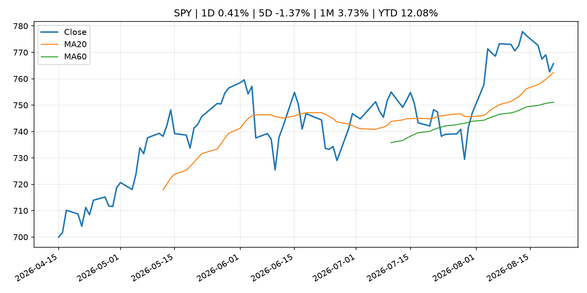
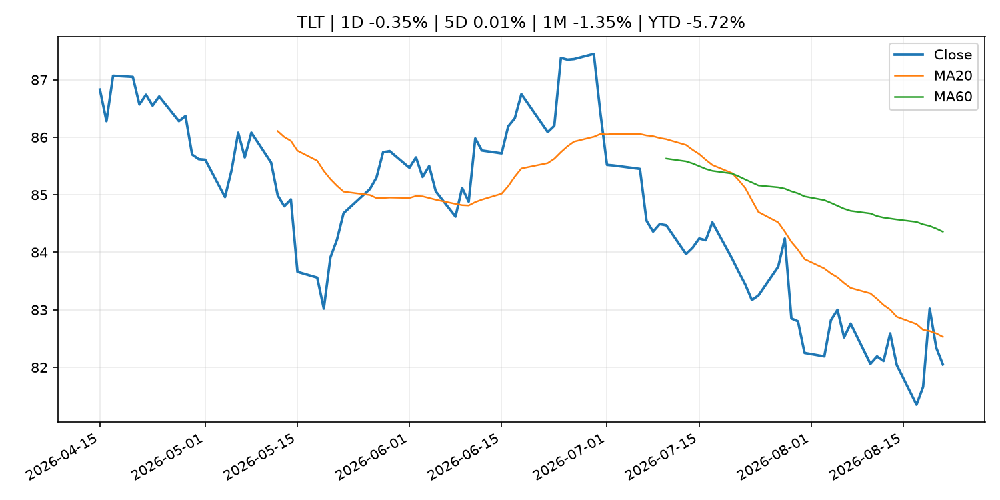
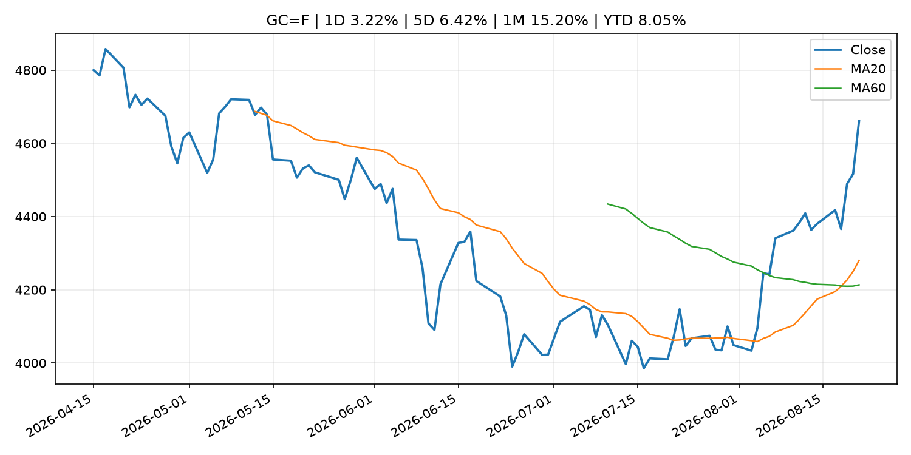
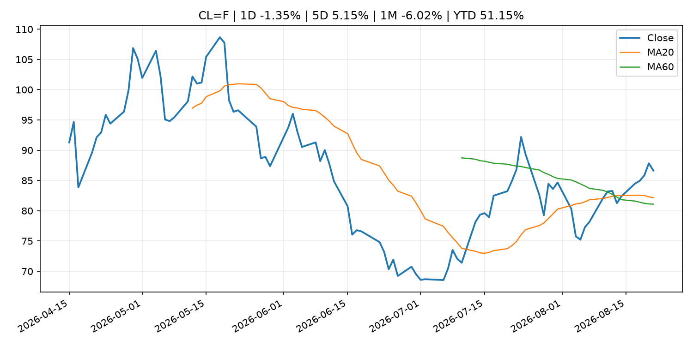
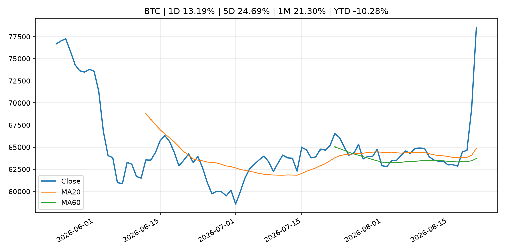
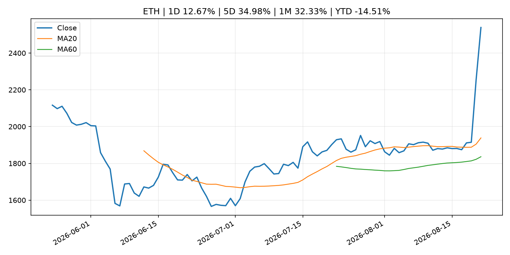
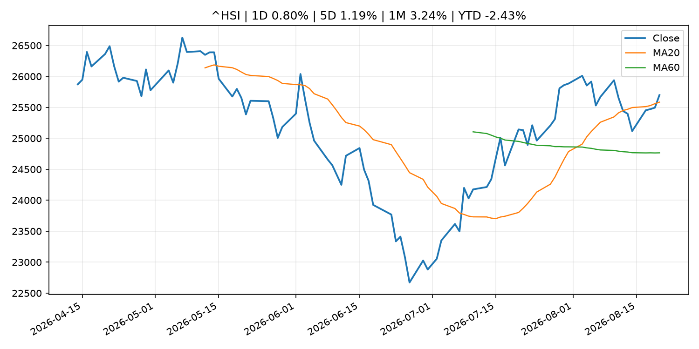

# Global Macro Morning Briefing - 2026-08-22

> Not financial advice / 非投资建议。

## 0. 今日总览
- 市场状态：risk_on。股指上涨、波动率或美元回落，市场更接近风险偏好改善。
- 今日三大主线：
  1. central_bank_decision: Treasury's latest measure isn't QE or YCC. Still, bitcoin is skyrocketing. Here's why.
  2. financial_stability: Bitcoin faces $80,000 test as thinner weekend liquidity looms
  3. financial_stability: Fed liquidity promises, dollar weakness could determine bitcoin's next move
- 一句话结论：今日晨报重点关注：央行决策会重定价利率、汇率、久期资产和风险资产。；金融稳定信号可能放大跨资产波动，并影响央行反应函数。。跨资产方面，SPY 1D 0.41%；QQQ 1D 0.35%；^VIX 1D -5.50%；TLT 1D -0.35%；GC=F 1D 3.22%；CL=F 1D -1.35%；BTC 1D 13.19%；ETH 1D 12.67%；股指上涨、波动率或美元回落，市场更接近风险偏好改善。政策、通胀、利率、美元、美债、能源和加密监管仍是主要观察线索。所有结论仅基于公开数据与短摘要整理，不构成投资建议。

## 1. 隔夜跨资产市场
- 美股：SPY 1D 0.41%，QQQ 1D 0.35%，整体趋势需结合 VIX 和利率确认。
- 美债/美元：TLT 1D -0.35%，美元指数 1D -0.06%，是判断折现率压力的核心线索。
- 黄金/原油：黄金 1D 3.22%，原油 1D -1.35%，用于观察避险、通胀和地缘风险。
- 加密：BTC 1D 13.19%，ETH 1D 12.67%，关注是否独立于纳指走出加密自身行情。
- 港股/A股：恒生 1D 0.80%，沪深300/上证 1D n/a，重点看中国政策预期与人民币线索。
- 风险观察：确认风险偏好是否扩散到小盘股、信用利差和周期品。

### US_EQUITY

| symbol | latest close | 1D | 5D | 1M | YTD | trend |
|---|---:|---:|---:|---:|---:|---|
| SPY | 765.72 | 0.41% | -1.37% | 3.73% | 12.08% | strong_uptrend |
| QQQ | 713.44 | 0.35% | -2.41% | 3.10% | 16.36% | range_bound |
| DIA | 532.22 | 0.89% | -0.85% | 3.09% | 10.05% | range_bound |
| IWM | 299.96 | 0.77% | -1.68% | 2.69% | 20.57% | uptrend |
| VTI | 378.24 | 0.44% | -1.46% | 3.72% | 12.47% | strong_uptrend |

### US_MACRO_MARKET

| symbol | latest close | 1D | 5D | 1M | YTD | trend |
|---|---:|---:|---:|---:|---:|---|
| ^VIX | 15.13 | -5.50% | 6.18% | -19.09% | 4.27% | downtrend |
| DX-Y.NYB | 98.84 | -0.06% | -0.83% | -2.55% | 0.43% | downtrend |
| TLT | 82.05 | -0.35% | 0.01% | -1.35% | -5.72% | downtrend |
| IEF | 92.82 | -0.19% | -0.24% | -0.03% | -3.39% | downtrend |

### COMMODITIES

| symbol | latest close | 1D | 5D | 1M | YTD | trend |
|---|---:|---:|---:|---:|---:|---|
| GC=F | 4,661.60 | 3.22% | 6.42% | 15.20% | 8.05% | strong_uptrend |
| SI=F | 69.01 | 1.45% | 6.19% | 19.40% | -2.19% | range_bound |
| CL=F | 86.64 | -1.35% | 5.15% | -6.02% | 51.15% | uptrend |
| BZ=F | 93.87 | 0.10% | 6.04% | -6.77% | 54.52% | uptrend |
| NG=F | 2.80 | 2.38% | 2.38% | -4.05% | -22.66% | range_bound |
| HG=F | 6.58 | 1.86% | -0.30% | 4.36% | 16.67% | uptrend |

### HK_MARKET

| symbol | latest close | 1D | 5D | 1M | YTD | trend |
|---|---:|---:|---:|---:|---:|---|
| ^HSI | 25,698.49 | 0.80% | 1.19% | 3.24% | -2.43% | uptrend |
| 0700.HK | 457.00 | 1.24% | 3.86% | 2.65% | -26.65% | range_bound |
| 9988.HK | 123.00 | -2.54% | 2.59% | 7.05% | -17.45% | uptrend |
| 3690.HK | 85.00 | -0.99% | -2.52% | -2.63% | -18.74% | range_bound |
| 1810.HK | 29.02 | 4.54% | 13.27% | 6.93% | -27.95% | strong_uptrend |
| 1211.HK | 93.15 | 1.47% | 5.55% | 5.08% | -5.67% | uptrend |

### CRYPTO

| symbol | latest close | 1D | 5D | 1M | YTD | trend |
|---|---:|---:|---:|---:|---:|---|
| BTC | 78,574.07 | 13.19% | 24.69% | 21.30% | -10.28% | strong_uptrend |
| ETH | 2,539.06 | 12.67% | 34.98% | 32.33% | -14.51% | strong_uptrend |
| SOLANA | 93.76 | 9.70% | 24.55% | 25.81% | -24.70% | strong_uptrend |
| BINANCECOIN | 688.70 | 9.69% | 13.41% | 16.43% | -20.17% | strong_uptrend |
| RIPPLE | 1.44 | 29.75% | 43.28% | 32.52% | -22.01% | range_bound |

## 2. 今日最重要的 10 条新闻
### 1. Treasury's latest measure isn't QE or YCC. Still, bitcoin is skyrocketing. Here's why.
- 来源：CoinDesk
- 时间：2026-08-21T09:17:15+00:00
- 地区：global
- 事件类型：central_bank_decision
- 重要性层级：Tier 1
- 一句话摘要：Treasury's latest measure isn't QE or YCC. Still, bitcoin is skyrocketing. Here's why.
- 为什么重要：央行决策会重定价利率、汇率、久期资产和风险资产。
- 可能影响：主要影响 QQQ，方向为 positive，强度 high；宽松预期降低折现率，有利于成长股。
  - 资产：QQQ
    方向：positive
    强度：high
    原因：宽松预期降低折现率，有利于成长股。
  - 资产：SPY
    方向：positive
    强度：high
    原因：宽松政策通常改善风险偏好。
  - 资产：TLT
    方向：positive
    强度：high
    原因：降息预期通常推升长债价格。
  - 资产：DXY
    方向：negative
    强度：medium
    原因：利差预期回落通常压制美元。
  - 资产：GC=F
    方向：positive
    强度：medium
    原因：实际利率下降通常利好黄金。
  - 资产：BTC
    方向：positive
    强度：high
    原因：流动性改善通常支持加密资产。
- 原文链接：[https://www.coindesk.com/markets/2026/08/21/treasury-s-latest-measure-isn-t-qe-or-ycc-still-bitcoin-is-skyrocketing-here-s-why](https://www.coindesk.com/markets/2026/08/21/treasury-s-latest-measure-isn-t-qe-or-ycc-still-bitcoin-is-skyrocketing-here-s-why)

### 2. Bitcoin faces $80,000 test as thinner weekend liquidity looms
- 来源：CoinDesk
- 时间：2026-08-21T11:26:27+00:00
- 地区：global
- 事件类型：financial_stability
- 重要性层级：Tier 1
- 一句话摘要：Bitcoin faces $80,000 test as thinner weekend liquidity looms
- 为什么重要：金融稳定信号可能放大跨资产波动，并影响央行反应函数。
- 可能影响：可能影响利率、汇率、风险资产或大宗商品预期，但当前公开信息不足以判断明确方向。
  - 资产：暂无明确资产映射
  - 方向：unknown
  - 强度：low
  - 原因：公开信息不足以判断方向。
- 原文链接：[https://www.coindesk.com/daybook-us/2026/08/21/bitcoin-faces-usd80-000-test-as-thinner-weekend-liquidity-looms](https://www.coindesk.com/daybook-us/2026/08/21/bitcoin-faces-usd80-000-test-as-thinner-weekend-liquidity-looms)

### 3. Fed liquidity promises, dollar weakness could determine bitcoin's next move
- 来源：CoinDesk
- 时间：2026-08-20T11:31:10+00:00
- 地区：global
- 事件类型：financial_stability
- 重要性层级：Tier 1
- 一句话摘要：Fed liquidity promises, dollar weakness could determine bitcoin's next move
- 为什么重要：金融稳定信号可能放大跨资产波动，并影响央行反应函数。
- 可能影响：可能影响利率、汇率、风险资产或大宗商品预期，但当前公开信息不足以判断明确方向。
  - 资产：暂无明确资产映射
  - 方向：unknown
  - 强度：low
  - 原因：公开信息不足以判断方向。
- 原文链接：[https://www.coindesk.com/daybook-us/2026/08/20/fed-liquidity-promises-dollar-weakness-could-determine-bitcoin-s-next-move](https://www.coindesk.com/daybook-us/2026/08/20/fed-liquidity-promises-dollar-weakness-could-determine-bitcoin-s-next-move)

### 4. Labubu maker Pop Mart shares fall as key ex-China sales data drop, Citi cuts price target
- 来源：CNBC Economy
- 时间：2026-08-21T07:18:33+00:00
- 地区：US
- 事件类型：earnings
- 重要性层级：Tier 2
- 一句话摘要：Pop Mart shares fall after announcing first-half earnings.
- 为什么重要：大型科技股盈利和资本开支会影响纳指、半导体和 AI 交易主线。
- 可能影响：可能影响利率、汇率、风险资产或大宗商品预期，但当前公开信息不足以判断明确方向。
  - 资产：暂无明确资产映射
  - 方向：unknown
  - 强度：low
  - 原因：公开信息不足以判断方向。
- 原文链接：[https://www.cnbc.com/2026/08/21/labubu-maker-pop-mart-shares-fall-after-sales-drop-in-asia-americas-.html](https://www.cnbc.com/2026/08/21/labubu-maker-pop-mart-shares-fall-after-sales-drop-in-asia-americas-.html)

### 5. Federal Reserve Board issues enforcement action with SouthPoint Bancshares, Inc. and announces termination of enforcement action with Deutsche Bank AG, DB USA Corporation, and Deutsche Bank AG New York Branch
- 来源：Federal Reserve Press Releases
- 时间：2026-08-20T15:00:00+00:00
- 地区：US
- 事件类型：regulation
- 重要性层级：Tier 2
- 一句话摘要：Federal Reserve Board issues enforcement action with SouthPoint Bancshares, Inc. and announces termination of enforcement action with Deutsche Bank AG, DB USA Corporation, and Deutsche Bank AG New York Branch
- 为什么重要：监管变化会改变行业盈利预期和资产风险溢价。
- 可能影响：可能影响利率、汇率、风险资产或大宗商品预期，但当前公开信息不足以判断明确方向。
  - 资产：暂无明确资产映射
  - 方向：unknown
  - 强度：low
  - 原因：公开信息不足以判断方向。
- 原文链接：[https://www.federalreserve.gov/newsevents/pressreleases/enforcement20260820b.htm](https://www.federalreserve.gov/newsevents/pressreleases/enforcement20260820b.htm)

### 6. Federal Reserve Board issues enforcement actions with former employee of Regions Bank and former employee of United Community Bank
- 来源：Federal Reserve Press Releases
- 时间：2026-08-20T15:00:00+00:00
- 地区：US
- 事件类型：regulation
- 重要性层级：Tier 2
- 一句话摘要：Federal Reserve Board issues enforcement actions with former employee of Regions Bank and former employee of United Community Bank
- 为什么重要：监管变化会改变行业盈利预期和资产风险溢价。
- 可能影响：可能影响利率、汇率、风险资产或大宗商品预期，但当前公开信息不足以判断明确方向。
  - 资产：暂无明确资产映射
  - 方向：unknown
  - 强度：low
  - 原因：公开信息不足以判断方向。
- 原文链接：[https://www.federalreserve.gov/newsevents/pressreleases/enforcement20260820a.htm](https://www.federalreserve.gov/newsevents/pressreleases/enforcement20260820a.htm)

### 7. Here’s how Bessent’s newly activist Treasury Department is undercutting the Fed’s Warsh
- 来源：MarketWatch Top Stories
- 时间：2026-08-21T20:11:00+00:00
- 地区：US
- 事件类型：other
- 重要性层级：Tier 3
- 一句话摘要：The surprising move this week by Treasury Secretary Scott Bessent to intervene in Treasury markets to lower the cost of government debt undercuts the credibility of Federal Reserve Chairman Kevin Warsh to make interest-rate policy, experts said.
- 为什么重要：这条信息暂未匹配到重大宏观、政策或市场事件，更适合作为背景跟踪。
- 可能影响：更偏背景信息，短期市场影响可能有限。
  - 资产：暂无明确资产映射
  - 方向：unknown
  - 强度：low
  - 原因：公开信息不足以判断方向。
- 原文链接：[https://www.marketwatch.com/story/heres-how-bessents-newly-activist-treasury-department-is-undercutting-the-feds-warsh-480455c2?mod=mw_rss_topstories](https://www.marketwatch.com/story/heres-how-bessents-newly-activist-treasury-department-is-undercutting-the-feds-warsh-480455c2?mod=mw_rss_topstories)

### 8. Former JPMorgan exec takes on Social Security advisory role
- 来源：MarketWatch Top Stories
- 时间：2026-08-21T19:11:00+00:00
- 地区：US
- 事件类型：other
- 重要性层级：Tier 3
- 一句话摘要：Matt Zames will take on an unpaid adviser position at the Social Security Administration, according to reports.
- 为什么重要：这条信息暂未匹配到重大宏观、政策或市场事件，更适合作为背景跟踪。
- 可能影响：更偏背景信息，短期市场影响可能有限。
  - 资产：暂无明确资产映射
  - 方向：unknown
  - 强度：low
  - 原因：公开信息不足以判断方向。
- 原文链接：[https://www.marketwatch.com/story/former-jpmorgan-exec-takes-on-social-security-advisory-role-d0cf6e4f?mod=mw_rss_topstories](https://www.marketwatch.com/story/former-jpmorgan-exec-takes-on-social-security-advisory-role-d0cf6e4f?mod=mw_rss_topstories)

## 3. 政策与央行观察
### 1. Treasury's latest measure isn't QE or YCC. Still, bitcoin is skyrocketing. Here's why.
- 来源：CoinDesk
- 时间：2026-08-21T09:17:15+00:00
- 地区：global
- 事件类型：central_bank_decision
- 重要性层级：Tier 1
- 一句话摘要：Treasury's latest measure isn't QE or YCC. Still, bitcoin is skyrocketing. Here's why.
- 为什么重要：央行决策会重定价利率、汇率、久期资产和风险资产。
- 可能影响：主要影响 QQQ，方向为 positive，强度 high；宽松预期降低折现率，有利于成长股。
  - 资产：QQQ
    方向：positive
    强度：high
    原因：宽松预期降低折现率，有利于成长股。
  - 资产：SPY
    方向：positive
    强度：high
    原因：宽松政策通常改善风险偏好。
  - 资产：TLT
    方向：positive
    强度：high
    原因：降息预期通常推升长债价格。
  - 资产：DXY
    方向：negative
    强度：medium
    原因：利差预期回落通常压制美元。
  - 资产：GC=F
    方向：positive
    强度：medium
    原因：实际利率下降通常利好黄金。
  - 资产：BTC
    方向：positive
    强度：high
    原因：流动性改善通常支持加密资产。
- 原文链接：[https://www.coindesk.com/markets/2026/08/21/treasury-s-latest-measure-isn-t-qe-or-ycc-still-bitcoin-is-skyrocketing-here-s-why](https://www.coindesk.com/markets/2026/08/21/treasury-s-latest-measure-isn-t-qe-or-ycc-still-bitcoin-is-skyrocketing-here-s-why)

### 2. Bitcoin faces $80,000 test as thinner weekend liquidity looms
- 来源：CoinDesk
- 时间：2026-08-21T11:26:27+00:00
- 地区：global
- 事件类型：financial_stability
- 重要性层级：Tier 1
- 一句话摘要：Bitcoin faces $80,000 test as thinner weekend liquidity looms
- 为什么重要：金融稳定信号可能放大跨资产波动，并影响央行反应函数。
- 可能影响：可能影响利率、汇率、风险资产或大宗商品预期，但当前公开信息不足以判断明确方向。
  - 资产：暂无明确资产映射
  - 方向：unknown
  - 强度：low
  - 原因：公开信息不足以判断方向。
- 原文链接：[https://www.coindesk.com/daybook-us/2026/08/21/bitcoin-faces-usd80-000-test-as-thinner-weekend-liquidity-looms](https://www.coindesk.com/daybook-us/2026/08/21/bitcoin-faces-usd80-000-test-as-thinner-weekend-liquidity-looms)

### 3. Fed liquidity promises, dollar weakness could determine bitcoin's next move
- 来源：CoinDesk
- 时间：2026-08-20T11:31:10+00:00
- 地区：global
- 事件类型：financial_stability
- 重要性层级：Tier 1
- 一句话摘要：Fed liquidity promises, dollar weakness could determine bitcoin's next move
- 为什么重要：金融稳定信号可能放大跨资产波动，并影响央行反应函数。
- 可能影响：可能影响利率、汇率、风险资产或大宗商品预期，但当前公开信息不足以判断明确方向。
  - 资产：暂无明确资产映射
  - 方向：unknown
  - 强度：low
  - 原因：公开信息不足以判断方向。
- 原文链接：[https://www.coindesk.com/daybook-us/2026/08/20/fed-liquidity-promises-dollar-weakness-could-determine-bitcoin-s-next-move](https://www.coindesk.com/daybook-us/2026/08/20/fed-liquidity-promises-dollar-weakness-could-determine-bitcoin-s-next-move)

### 4. Federal Reserve Board issues enforcement action with SouthPoint Bancshares, Inc. and announces termination of enforcement action with Deutsche Bank AG, DB USA Corporation, and Deutsche Bank AG New York Branch
- 来源：Federal Reserve Press Releases
- 时间：2026-08-20T15:00:00+00:00
- 地区：US
- 事件类型：regulation
- 重要性层级：Tier 2
- 一句话摘要：Federal Reserve Board issues enforcement action with SouthPoint Bancshares, Inc. and announces termination of enforcement action with Deutsche Bank AG, DB USA Corporation, and Deutsche Bank AG New York Branch
- 为什么重要：监管变化会改变行业盈利预期和资产风险溢价。
- 可能影响：可能影响利率、汇率、风险资产或大宗商品预期，但当前公开信息不足以判断明确方向。
  - 资产：暂无明确资产映射
  - 方向：unknown
  - 强度：low
  - 原因：公开信息不足以判断方向。
- 原文链接：[https://www.federalreserve.gov/newsevents/pressreleases/enforcement20260820b.htm](https://www.federalreserve.gov/newsevents/pressreleases/enforcement20260820b.htm)

### 5. Federal Reserve Board issues enforcement actions with former employee of Regions Bank and former employee of United Community Bank
- 来源：Federal Reserve Press Releases
- 时间：2026-08-20T15:00:00+00:00
- 地区：US
- 事件类型：regulation
- 重要性层级：Tier 2
- 一句话摘要：Federal Reserve Board issues enforcement actions with former employee of Regions Bank and former employee of United Community Bank
- 为什么重要：监管变化会改变行业盈利预期和资产风险溢价。
- 可能影响：可能影响利率、汇率、风险资产或大宗商品预期，但当前公开信息不足以判断明确方向。
  - 资产：暂无明确资产映射
  - 方向：unknown
  - 强度：low
  - 原因：公开信息不足以判断方向。
- 原文链接：[https://www.federalreserve.gov/newsevents/pressreleases/enforcement20260820a.htm](https://www.federalreserve.gov/newsevents/pressreleases/enforcement20260820a.htm)

## 4. 市场异动与图表
- SPY 上涨 0.41%
- VIX 下跌 -5.50%
- Gold 上涨 3.22%
- Oil 下跌 -1.35%
- BTC 上涨 13.19%
- ETH 上涨 12.67%

### SPY

### QQQ

### ^VIX

### TLT

### GC=F

### CL=F

### BTC

### ETH

### ^HSI

## 5. 华尔街与机构公开观点
- 暂无可靠公开观点。

## 6. 今日重点关注
- 经济数据：经济数据：暂无可靠公开日历数据；如配置经济日历源后可自动填充。
- 央行讲话：央行讲话：暂无可靠公开日历数据；重点跟踪 Fed、ECB、BoJ、PBOC 官网 RSS。
- 财报：财报：暂无可靠数据。
- 政策事件：政策事件：暂无可靠数据。
- 风险提醒：风险提醒：关注数据源失败项、突发地缘风险、利率和美元的二阶反应。

## 7. 英文金融表达与宏观概念
- **real yield**：实际收益率，名义利率扣除通胀预期后的收益率。 例句：Gold often reacts more to real yields than nominal yields.
- **risk-off**：避险模式，资金偏向美元、国债、黄金等防御资产。 例句：A geopolitical shock can push markets into risk-off mode.
- **market structure**：市场结构，指交易、托管、清算、ETF、监管等制度安排。 例句：Crypto market structure rules can affect institutional participation.
- **inflation expectations**：通胀预期，指家庭、企业或市场对未来通胀的预估。 例句：Inflation expectations can shape wage bargaining and bond yields.
- **terminal rate**：终端利率，市场预期本轮加息周期的最高政策利率。 例句：A higher terminal rate can pressure growth stocks.
- **soft landing**：软着陆，指通胀回落而经济避免明显衰退。 例句：Markets often rally when data support a soft landing.

## 8. 背景材料
- [Here’s how Bessent’s newly activist Treasury Department is undercutting the Fed’s Warsh](https://www.marketwatch.com/story/heres-how-bessents-newly-activist-treasury-department-is-undercutting-the-feds-warsh-480455c2?mod=mw_rss_topstories)（MarketWatch Top Stories，other）：The surprising move this week by Treasury Secretary Scott Bessent to intervene in Treasury markets to lower the cost of government debt undercuts the credibility of Federal Reserve Chairman Kevin Warsh to make interest-rate policy, experts said.
- [Former JPMorgan exec takes on Social Security advisory role](https://www.marketwatch.com/story/former-jpmorgan-exec-takes-on-social-security-advisory-role-d0cf6e4f?mod=mw_rss_topstories)（MarketWatch Top Stories，other）：Matt Zames will take on an unpaid adviser position at the Social Security Administration, according to reports.
- [Kalshi traders think the bitcoin rally could end the year near current levels](https://www.cnbc.com/2026/08/21/kalshi-traders-say-bitcoin-rally-wont-go-much-higher-by-end-of-2026.html)（CNBC Economy，other）：Speculators on the prediction market platform think it's most likely that the cryptocurrency will end 2026 close to where it's now trading.
- [Trump admin taps former JPMorgan Chase exec Matt Zames to advise Social Security agency](https://www.cnbc.com/2026/08/21/jpmorgan-matt-zames-social-security-administration.html)（CNBC Economy，other）：Matt Zames is taking an unpaid position to help his former JPMorgan colleague Frank Bisignano tackle modernization of the SSA, CNBC has learned.
- [Coldcard ships firmware after $114 million bitcoin theft; says AI helped catch more bugs](https://www.coindesk.com/tech/2026/08/21/coldcard-ships-firmware-after-usd114-million-bitcoin-theft-says-ai-helped-catch-more-bugs)（CoinDesk，other）：Coldcard ships firmware after $114 million bitcoin theft; says AI helped catch more bugs
- [Analysts split on whether Bitcoin's surge past key levels signals a new bull run](https://www.coindesk.com/markets/2026/08/21/analysts-split-on-whether-bitcoin-s-surge-past-key-levels-signals-a-new-bull-run)（CoinDesk，other）：Analysts split on whether Bitcoin's surge past key levels signals a new bull run
- [Bitcoin tops $77,000 as best week since 2023 pulls altcoins along for the ride](https://www.coindesk.com/markets/2026/08/21/bitcoin-tops-usd77-000-as-best-week-since-2023-pulls-altcoins-along-for-the-ride)（CoinDesk，other）：Bitcoin tops $77,000 as best week since 2023 pulls altcoins along for the ride
- [Strategy sits on $1.4 billion profit on bitcoin holdings as price surges](https://www.coindesk.com/markets/2026/08/21/strategy-sits-on-usd1-4-billion-profit-on-bitcoin-holdings-as-price-surges)（CoinDesk，other）：Strategy sits on $1.4 billion profit on bitcoin holdings as price surges
- [ECB Consumer Expectations Survey results – July 2026](https://www.ecb.europa.eu//press/pr/date/2026/html/ecb.pr260821~a044fdddd9.en.html)（ECB Press Releases，other）：ECB Consumer Expectations Survey results – July 2026
- [Developments in Real Exports and Real Imports](https://www.boj.or.jp/en/research/research_data/reri/index.htm)（Bank of Japan Announcements，other）：Developments in Real Exports and Real Imports
- [Live updates: Bitcoin slips back to $77,000 after challenging $80,000 overnight](https://www.coindesk.com/tech/2026/08/21/live-updates-bitcoin-ether-etfs-pull-in-usd800-million-as-inflows-surge-for-a-second-day)（CoinDesk，other）：Live updates: Bitcoin slips back to $77,000 after challenging $80,000 overnight
- [Bitcoin, ether and solana climb as another $1 billion shorts get wiped out](https://www.coindesk.com/markets/2026/08/21/bitcoin-ether-and-solana-climb-as-another-usd1-billion-shorts-get-wiped-out)（CoinDesk，other）：Bitcoin, ether and solana climb as another $1 billion shorts get wiped out
- [Bitcoin pushes past $75,000 as rally continues.](https://www.coindesk.com/markets/2026/08/20/bitcoin-pushes-past-usd75-000-as-rally-continues)（CoinDesk，other）：Bitcoin pushes past $75,000 as rally continues.
- [Federal Reserve Board announces approval of application by National Westminster Bank Plc](https://www.federalreserve.gov/newsevents/pressreleases/orders20260820a.htm)（Federal Reserve Press Releases，other）：Federal Reserve Board announces approval of application by National Westminster Bank Plc
- [Treasury buybacks could set up bitcoin’s next move toward $180,000, says strategist](https://www.coindesk.com/markets/2026/08/20/treasury-buybacks-could-set-up-bitcoin-s-next-move-toward-usd180-000)（CoinDesk，other）：Treasury buybacks could set up bitcoin’s next move toward $180,000, says strategist
- [Bitcoin's jump above $71,000 sets up bullish golden cross pattern](https://www.coindesk.com/markets/2026/08/20/bitcoin-s-jump-above-usd71-000-sets-up-bullish-golden-cross-pattern)（CoinDesk，other）：Bitcoin's jump above $71,000 sets up bullish golden cross pattern
- [Bitcoin rally sparks debate whether Clarity Act is already priced in](https://www.coindesk.com/markets/2026/08/20/crypto-s-bottom-is-near-as-ai-hype-fades-okx-europe-ceo-says)（CoinDesk，other）：Bitcoin rally sparks debate whether Clarity Act is already priced in

## 9. 数据源、失败项与免责声明
- 采集时间：2026-08-21T22:22:26
- 数据源：公开 RSS、Yahoo Finance、CoinGecko、AKShare、FRED、SEC data.sec.gov，以及用户自有 inputs/reports 文件。
- 合规说明：不绕过 WSJ、Bloomberg、FT、Reuters 等付费墙；对付费媒体只使用公开 RSS 标题、摘要、链接和发布时间。
- 免责声明：Not financial advice / 非投资建议。本项目仅供个人学习、研究和信息整理，不构成投资建议、交易建议或任何收益承诺。
- 失败或跳过的数据源：
  - crypto data failed coin=dogecoin
  - China market data failed symbol=上证指数: empty dataframe
  - China market data failed symbol=深证成指: empty dataframe
  - China market data failed symbol=创业板指: empty dataframe
  - China market data failed symbol=沪深300: empty dataframe
  - China market data failed symbol=中证500: empty dataframe
  - China market data failed symbol=科创50: empty dataframe
  - FRED_API_KEY not set; skipping FRED macro series
  - SEC failed cik=0000320193
  - SEC failed cik=0000789019
  - SEC failed cik=0001045810
  - SEC failed cik=0001318605
  - SEC failed cik=0001577552
