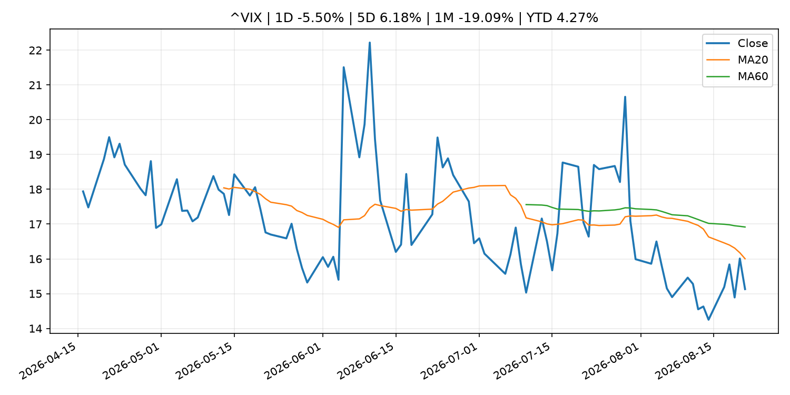
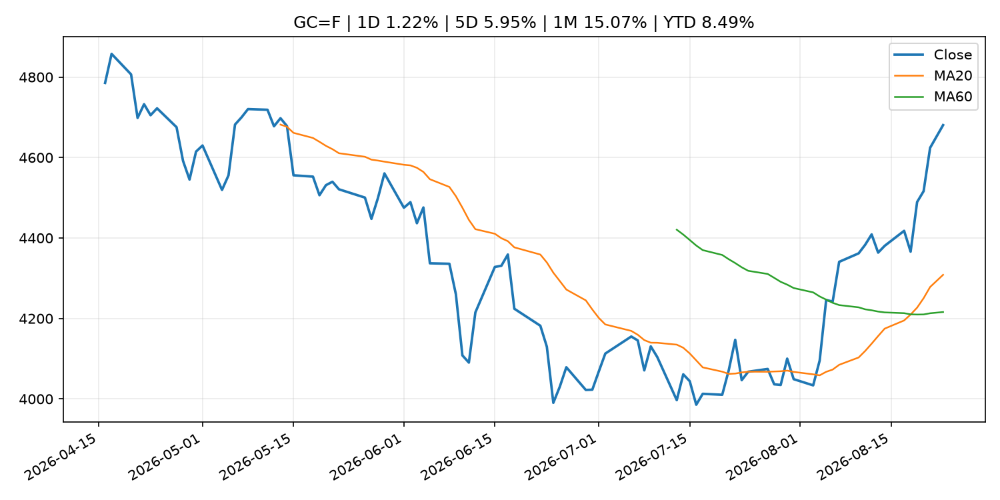
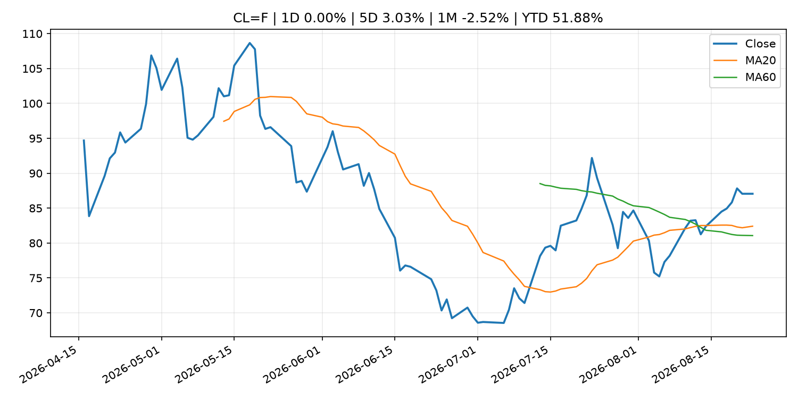
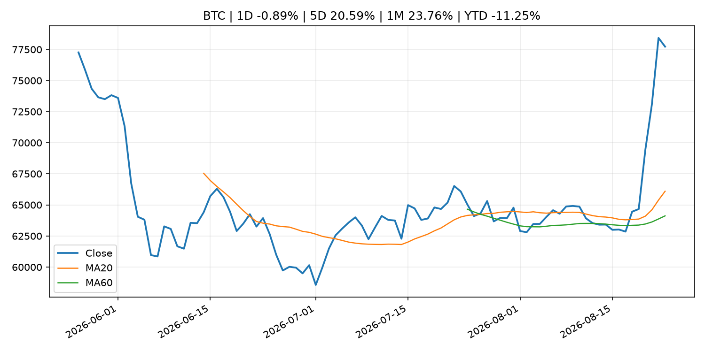
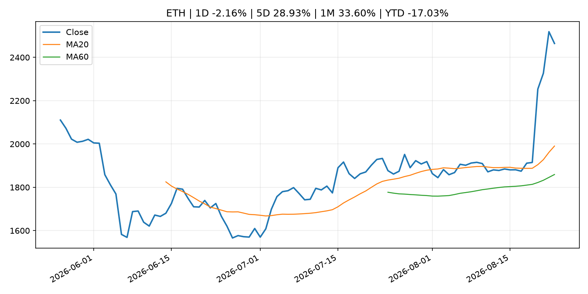

# Global Macro Morning Briefing - 2026-08-24

> Not financial advice / 非投资建议。

## 0. 今日总览
- 市场状态：risk_on。股指上涨、波动率或美元回落，市场更接近风险偏好改善。
- 今日三大主线：
  1. earnings: Nvidia is the beating heart of the AI boom and the stock market — which sets up a big test
  2. crypto_market_structure: Zcash jumps 48% to over $800 as Grayscale spot ETF push adds to ‘next bitcoin’ buzz
- 一句话结论：今日晨报重点关注：大型科技股盈利和资本开支会影响纳指、半导体和 AI 交易主线。；加密市场结构和监管变化会影响 BTC、ETH 及相关股票的风险溢价。。跨资产方面，SPY 1D 0.41%；QQQ 1D 0.35%；^VIX 1D -5.50%；TLT 1D -0.35%；GC=F 1D 1.22%；CL=F 1D 0.00%；BTC 1D -0.89%；ETH 1D -2.16%；股指上涨、波动率或美元回落，市场更接近风险偏好改善。政策、通胀、利率、美元、美债、能源和加密监管仍是主要观察线索。所有结论仅基于公开数据与短摘要整理，不构成投资建议。

## 1. 隔夜跨资产市场
- 美股：SPY 1D 0.41%，QQQ 1D 0.35%，整体趋势需结合 VIX 和利率确认。
- 美债/美元：TLT 1D -0.35%，美元指数 1D 0.04%，是判断折现率压力的核心线索。
- 黄金/原油：黄金 1D 1.22%，原油 1D 0.00%，用于观察避险、通胀和地缘风险。
- 加密：BTC 1D -0.89%，ETH 1D -2.16%，关注是否独立于纳指走出加密自身行情。
- 港股/A股：恒生 1D 1.21%，沪深300/上证 1D n/a，重点看中国政策预期与人民币线索。
- 风险观察：确认风险偏好是否扩散到小盘股、信用利差和周期品。

### US_EQUITY

| symbol | latest close | 1D | 5D | 1M | YTD | trend |
|---|---:|---:|---:|---:|---:|---|
| SPY | 765.72 | 0.41% | -1.37% | 3.73% | 12.08% | strong_uptrend |
| QQQ | 713.44 | 0.35% | -2.41% | 3.10% | 16.36% | range_bound |
| DIA | 532.22 | 0.89% | -0.85% | 3.09% | 10.05% | range_bound |
| IWM | 299.96 | 0.77% | -1.68% | 2.69% | 20.57% | uptrend |
| VTI | 378.24 | 0.44% | -1.46% | 3.72% | 12.47% | strong_uptrend |

### US_MACRO_MARKET

| symbol | latest close | 1D | 5D | 1M | YTD | trend |
|---|---:|---:|---:|---:|---:|---|
| ^VIX | 15.13 | -5.50% | 6.18% | -19.09% | 4.27% | downtrend |
| DX-Y.NYB | 98.84 | 0.04% | -0.80% | -2.59% | 0.43% | downtrend |
| TLT | 82.05 | -0.35% | 0.01% | -1.35% | -5.72% | downtrend |
| IEF | 92.82 | -0.19% | -0.24% | -0.03% | -3.39% | downtrend |

### COMMODITIES

| symbol | latest close | 1D | 5D | 1M | YTD | trend |
|---|---:|---:|---:|---:|---:|---|
| GC=F | 4,680.60 | 1.22% | 5.95% | 15.07% | 8.49% | strong_uptrend |
| SI=F | 69.53 | 0.09% | 5.16% | 18.54% | -1.45% | strong_uptrend |
| CL=F | 87.06 | 0.00% | 3.03% | -2.52% | 51.88% | uptrend |
| BZ=F | 94.39 | 0.00% | 3.87% | -2.47% | 55.37% | uptrend |
| NG=F | 2.81 | 1.37% | 4.50% | -2.09% | -22.31% | range_bound |
| HG=F | 6.59 | 0.11% | -0.26% | 4.22% | 16.79% | uptrend |

### HK_MARKET

| symbol | latest close | 1D | 5D | 1M | YTD | trend |
|---|---:|---:|---:|---:|---:|---|
| ^HSI | 26,009.46 | 1.21% | 3.55% | 3.17% | -1.25% | uptrend |
| 0700.HK | 457.00 | 1.24% | 3.86% | 2.65% | -26.65% | range_bound |
| 9988.HK | 123.00 | -2.54% | 2.59% | 7.05% | -17.45% | uptrend |
| 3690.HK | 85.00 | -0.99% | -2.52% | -2.63% | -18.74% | range_bound |
| 1810.HK | 29.02 | 4.54% | 13.27% | 6.93% | -27.95% | strong_uptrend |
| 1211.HK | 93.15 | 1.47% | 5.55% | 5.08% | -5.67% | uptrend |

### CRYPTO

| symbol | latest close | 1D | 5D | 1M | YTD | trend |
|---|---:|---:|---:|---:|---:|---|
| BTC | 77,723.79 | -0.89% | 20.59% | 23.76% | -11.25% | strong_uptrend |
| ETH | 2,464.37 | -2.16% | 28.93% | 33.60% | -17.03% | strong_uptrend |
| SOLANA | 95.36 | 1.60% | 25.59% | 32.64% | -23.42% | strong_uptrend |
| BINANCECOIN | 702.62 | 2.16% | 16.08% | 22.23% | -18.55% | strong_uptrend |
| RIPPLE | 1.52 | 4.22% | 51.52% | 43.16% | -17.48% | range_bound |

## 2. 今日最重要的 10 条新闻
### 1. Nvidia is the beating heart of the AI boom and the stock market — which sets up a big test
- 来源：MarketWatch Top Stories
- 时间：2026-08-23T13:00:00+00:00
- 地区：US
- 事件类型：earnings
- 重要性层级：Tier 2
- 一句话摘要：Nvidia is due to report earnings on Wednesday, and “a very broad universe of companies” is tied to the themes that the chip giant represents.
- 为什么重要：大型科技股盈利和资本开支会影响纳指、半导体和 AI 交易主线。
- 可能影响：主要影响 QQQ，方向为 mixed，强度 high；AI 资本开支会影响大型科技股盈利和估值预期。
  - 资产：QQQ
    方向：mixed
    强度：high
    原因：AI 资本开支会影响大型科技股盈利和估值预期。
  - 资产：SMH
    方向：mixed
    强度：high
    原因：AI 投资周期直接影响半导体需求。
  - 资产：NVDA
    方向：mixed
    强度：high
    原因：AI 训练和推理需求是英伟达收入预期核心变量。
  - 资产：MSFT
    方向：mixed
    强度：medium
    原因：云和 AI 资本开支影响利润率与增长叙事。
  - 资产：GOOGL
    方向：mixed
    强度：medium
    原因：AI 投资和搜索商业化影响估值。
  - 资产：META
    方向：mixed
    强度：medium
    原因：AI 基建支出与广告效率共同影响市场预期。
- 原文链接：[https://www.marketwatch.com/story/nvidia-is-the-beating-heart-of-the-ai-boom-and-the-stock-market-which-sets-up-a-big-test-bed36f98?mod=mw_rss_topstories](https://www.marketwatch.com/story/nvidia-is-the-beating-heart-of-the-ai-boom-and-the-stock-market-which-sets-up-a-big-test-bed36f98?mod=mw_rss_topstories)

### 2. Zcash jumps 48% to over $800 as Grayscale spot ETF push adds to ‘next bitcoin’ buzz
- 来源：CoinDesk
- 时间：2026-08-22T05:37:43+00:00
- 地区：global
- 事件类型：crypto_market_structure
- 重要性层级：Tier 2
- 一句话摘要：Zcash jumps 48% to over $800 as Grayscale spot ETF push adds to ‘next bitcoin’ buzz
- 为什么重要：加密市场结构和监管变化会影响 BTC、ETH 及相关股票的风险溢价。
- 可能影响：主要影响 BTC，方向为 mixed，强度 high；加密监管或 ETF 进展会改变 BTC 的资金流和风险溢价。
  - 资产：BTC
    方向：mixed
    强度：high
    原因：加密监管或 ETF 进展会改变 BTC 的资金流和风险溢价。
  - 资产：ETH
    方向：mixed
    强度：high
    原因：监管框架会影响 ETH 产品化和机构参与度。
  - 资产：COIN
    方向：mixed
    强度：medium
    原因：监管清晰度和执法风险会影响交易平台估值。
  - 资产：crypto market
    方向：mixed
    强度：high
    原因：信息影响整个加密市场结构，但方向取决于细节。
- 原文链接：[https://www.coindesk.com/markets/2026/08/22/zcash-tops-usd800-for-first-time-since-2016](https://www.coindesk.com/markets/2026/08/22/zcash-tops-usd800-for-first-time-since-2016)

### 3. XRP on track for biggest weekly gain in 21 months as Treasury buyback spurs 'curve control' hopes
- 来源：CoinDesk
- 时间：2026-08-23T15:52:21+00:00
- 地区：global
- 事件类型：other
- 重要性层级：Tier 3
- 一句话摘要：XRP on track for biggest weekly gain in 21 months as Treasury buyback spurs 'curve control' hopes
- 为什么重要：这条信息暂未匹配到重大宏观、政策或市场事件，更适合作为背景跟踪。
- 可能影响：更偏背景信息，短期市场影响可能有限。
  - 资产：暂无明确资产映射
  - 方向：unknown
  - 强度：low
  - 原因：公开信息不足以判断方向。
- 原文链接：[https://www.coindesk.com/markets/2026/08/23/xrp-on-track-for-biggest-weekly-gain-in-21-months-as-treasury-buyback-spurs-curve-control-hopes](https://www.coindesk.com/markets/2026/08/23/xrp-on-track-for-biggest-weekly-gain-in-21-months-as-treasury-buyback-spurs-curve-control-hopes)

### 4. Crypto card spending tops $1 billion as stablecoins move into everyday purchases
- 来源：CoinDesk
- 时间：2026-08-23T15:00:00+00:00
- 地区：global
- 事件类型：other
- 重要性层级：Tier 3
- 一句话摘要：Crypto card spending tops $1 billion as stablecoins move into everyday purchases
- 为什么重要：这条信息暂未匹配到重大宏观、政策或市场事件，更适合作为背景跟踪。
- 可能影响：更偏背景信息，短期市场影响可能有限。
  - 资产：暂无明确资产映射
  - 方向：unknown
  - 强度：low
  - 原因：公开信息不足以判断方向。
- 原文链接：[https://www.coindesk.com/business/2026/08/23/crypto-card-spending-tops-usd1-billion-as-stablecoins-move-into-everyday-purchases](https://www.coindesk.com/business/2026/08/23/crypto-card-spending-tops-usd1-billion-as-stablecoins-move-into-everyday-purchases)

## 3. 政策与央行观察
### 1. Zcash jumps 48% to over $800 as Grayscale spot ETF push adds to ‘next bitcoin’ buzz
- 来源：CoinDesk
- 时间：2026-08-22T05:37:43+00:00
- 地区：global
- 事件类型：crypto_market_structure
- 重要性层级：Tier 2
- 一句话摘要：Zcash jumps 48% to over $800 as Grayscale spot ETF push adds to ‘next bitcoin’ buzz
- 为什么重要：加密市场结构和监管变化会影响 BTC、ETH 及相关股票的风险溢价。
- 可能影响：主要影响 BTC，方向为 mixed，强度 high；加密监管或 ETF 进展会改变 BTC 的资金流和风险溢价。
  - 资产：BTC
    方向：mixed
    强度：high
    原因：加密监管或 ETF 进展会改变 BTC 的资金流和风险溢价。
  - 资产：ETH
    方向：mixed
    强度：high
    原因：监管框架会影响 ETH 产品化和机构参与度。
  - 资产：COIN
    方向：mixed
    强度：medium
    原因：监管清晰度和执法风险会影响交易平台估值。
  - 资产：crypto market
    方向：mixed
    强度：high
    原因：信息影响整个加密市场结构，但方向取决于细节。
- 原文链接：[https://www.coindesk.com/markets/2026/08/22/zcash-tops-usd800-for-first-time-since-2016](https://www.coindesk.com/markets/2026/08/22/zcash-tops-usd800-for-first-time-since-2016)

## 4. 市场异动与图表
- SPY 上涨 0.41%
- VIX 下跌 -5.50%
- Gold 上涨 1.22%
- ETH 下跌 -2.16%

### SPY

### QQQ

### ^VIX

### TLT

### GC=F

### CL=F

### BTC

### ETH

### ^HSI

## 5. 华尔街与机构公开观点
- 暂无可靠公开观点。

## 6. 今日重点关注
- 经济数据：经济数据：暂无可靠公开日历数据；如配置经济日历源后可自动填充。
- 央行讲话：央行讲话：暂无可靠公开日历数据；重点跟踪 Fed、ECB、BoJ、PBOC 官网 RSS。
- 财报：财报：暂无可靠数据。
- 政策事件：政策事件：暂无可靠数据。
- 风险提醒：风险提醒：关注数据源失败项、突发地缘风险、利率和美元的二阶反应。

## 7. 英文金融表达与宏观概念
- **real yield**：实际收益率，名义利率扣除通胀预期后的收益率。 例句：Gold often reacts more to real yields than nominal yields.
- **market structure**：市场结构，指交易、托管、清算、ETF、监管等制度安排。 例句：Crypto market structure rules can affect institutional participation.
- **AI capex**：AI 资本开支，指云厂商和科技公司投入 AI 基建的支出。 例句：AI capex guidance can move semiconductor stocks.
- **inflation expectations**：通胀预期，指家庭、企业或市场对未来通胀的预估。 例句：Inflation expectations can shape wage bargaining and bond yields.
- **terminal rate**：终端利率，市场预期本轮加息周期的最高政策利率。 例句：A higher terminal rate can pressure growth stocks.
- **soft landing**：软着陆，指通胀回落而经济避免明显衰退。 例句：Markets often rally when data support a soft landing.

## 8. 背景材料
- [XRP on track for biggest weekly gain in 21 months as Treasury buyback spurs 'curve control' hopes](https://www.coindesk.com/markets/2026/08/23/xrp-on-track-for-biggest-weekly-gain-in-21-months-as-treasury-buyback-spurs-curve-control-hopes)（CoinDesk，other）：XRP on track for biggest weekly gain in 21 months as Treasury buyback spurs 'curve control' hopes
- [Crypto card spending tops $1 billion as stablecoins move into everyday purchases](https://www.coindesk.com/business/2026/08/23/crypto-card-spending-tops-usd1-billion-as-stablecoins-move-into-everyday-purchases)（CoinDesk，other）：Crypto card spending tops $1 billion as stablecoins move into everyday purchases
- [Crypto’s next billion users might be AI agents, and they’re paying with stablecoins](https://www.coindesk.com/business/2026/08/23/crypto-s-next-billion-users-might-be-ai-agents-and-they-re-paying-with-stablecoins)（CoinDesk，other）：Crypto’s next billion users might be AI agents, and they’re paying with stablecoins
- [The Treasury’s bond-market intervention isn’t working. So what comes next?](https://www.marketwatch.com/story/the-treasurys-bond-market-intervention-isnt-working-so-what-comes-next-ba5e132a?mod=mw_rss_topstories)（MarketWatch Top Stories，other）：You can’t just sweep $40 trillion in U.S. national debt under a rug and forget about it — or so the bond market appears to be telling Treasury Secretary Scott Bessent.
- [Canada announces retaliatory tariffs on U.S. goods after trade talks break down](https://www.marketwatch.com/story/canada-announces-retaliatory-tariffs-on-u-s-goods-after-trade-talks-break-down-45081c2f?mod=mw_rss_topstories)（MarketWatch Top Stories，other）：Canadian Prime Minister Mark Carney on Saturday announced his country would impose “dollar-for-dollar” tariffs on U.S. goods — a retaliatory measure after trade talks between the two nations broke down.
- [Bitcoin and Ether bears get decimated amid 'squeeze-led' rally and Musk's X wants to pay creators in stablecoins: Crypto's week in 5 stories](https://www.coindesk.com/business/2026/08/22/bitcoin-and-ether-bears-get-decimated-amid-squeeze-led-rally-and-musk-s-x-wants-to-pay-creators-in-stablecoins-crypto-week-in-5-stories)（CoinDesk，other）：Bitcoin and Ether bears get decimated amid 'squeeze-led' rally and Musk's X wants to pay creators in stablecoins: Crypto's week in 5 stories
- [How a Treasury buyback tweak helped bitcoin surge 25% to nearly $80,000 in days](https://www.coindesk.com/markets/2026/08/22/how-a-treasury-buyback-tweak-helped-bitcoin-surge-nearly-25-in-days)（CoinDesk，other）：How a Treasury buyback tweak helped bitcoin surge 25% to nearly $80,000 in days

## 9. 数据源、失败项与免责声明
- 采集时间：2026-08-23T22:20:10
- 数据源：公开 RSS、Yahoo Finance、CoinGecko、AKShare、FRED、SEC data.sec.gov，以及用户自有 inputs/reports 文件。
- 合规说明：不绕过 WSJ、Bloomberg、FT、Reuters 等付费墙；对付费媒体只使用公开 RSS 标题、摘要、链接和发布时间。
- 免责声明：Not financial advice / 非投资建议。本项目仅供个人学习、研究和信息整理，不构成投资建议、交易建议或任何收益承诺。
- 失败或跳过的数据源：
  - crypto data failed coin=dogecoin
  - China market data failed symbol=上证指数: empty dataframe
  - China market data failed symbol=深证成指: empty dataframe
  - China market data failed symbol=创业板指: empty dataframe
  - China market data failed symbol=沪深300: empty dataframe
  - China market data failed symbol=中证500: empty dataframe
  - China market data failed symbol=科创50: empty dataframe
  - FRED_API_KEY not set; skipping FRED macro series
  - SEC failed cik=0000320193
  - SEC failed cik=0000789019
  - SEC failed cik=0001045810
  - SEC failed cik=0001318605
  - SEC failed cik=0001577552
