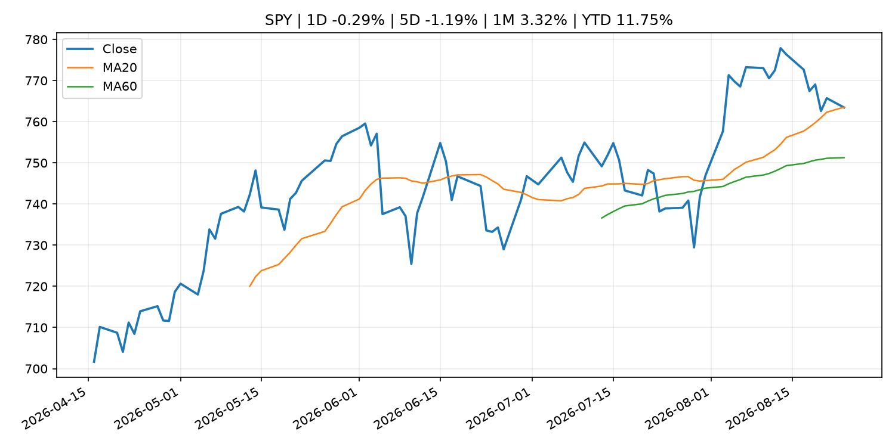
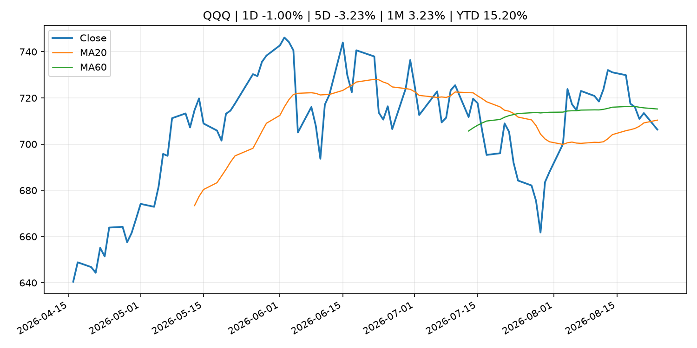
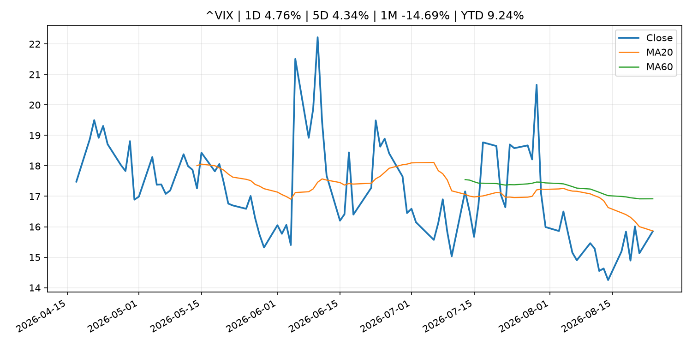
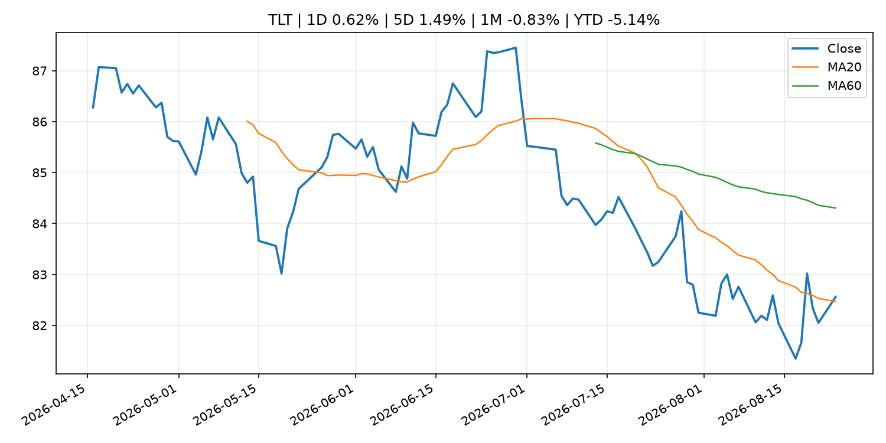
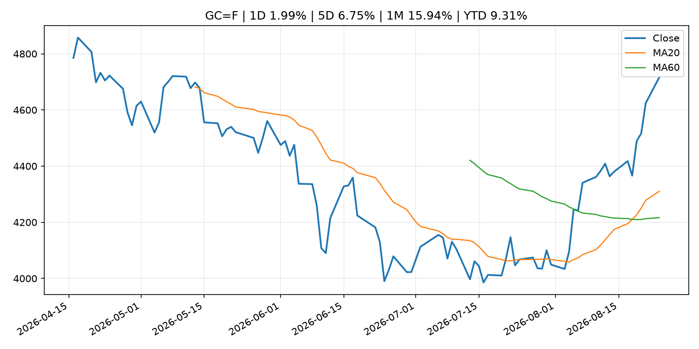
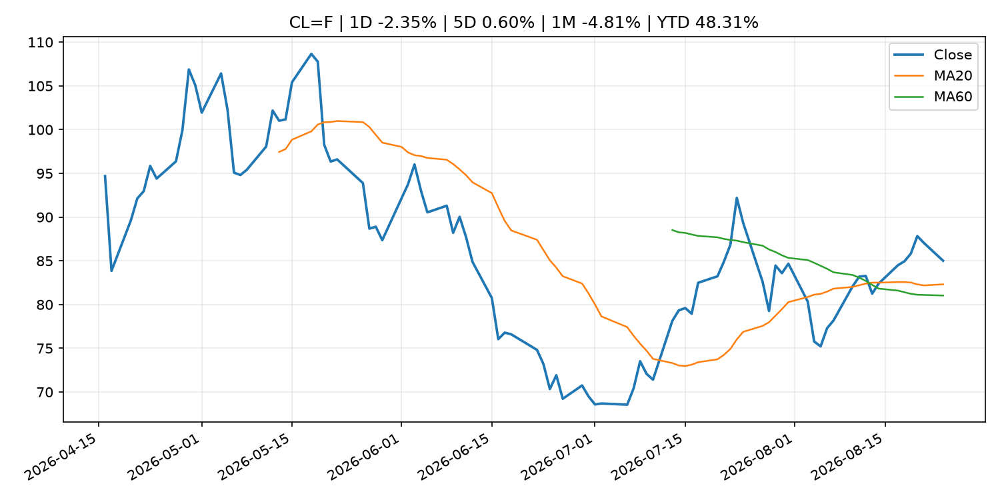
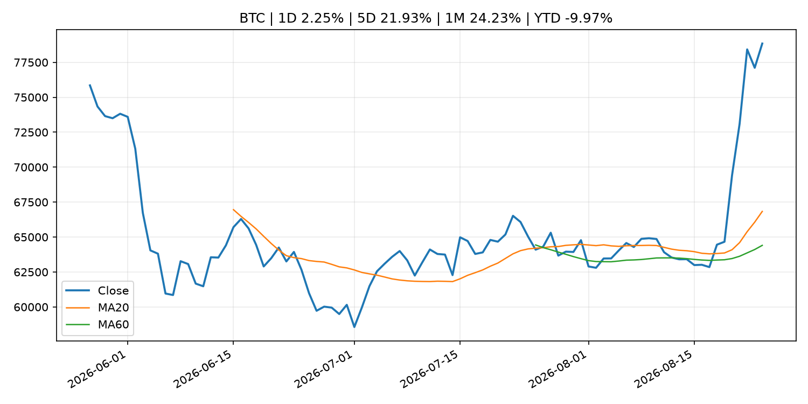
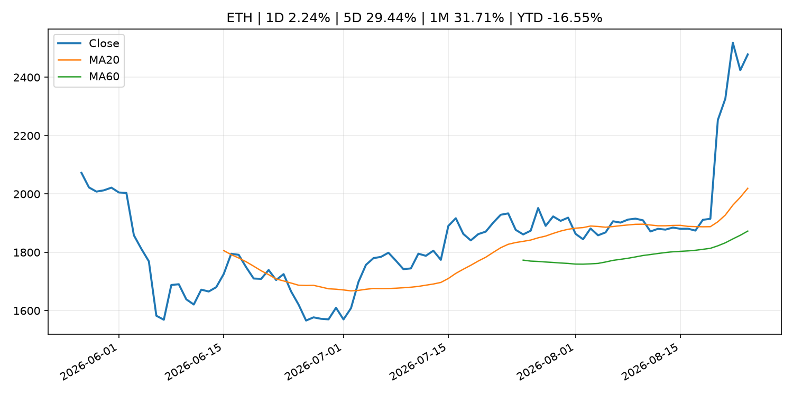
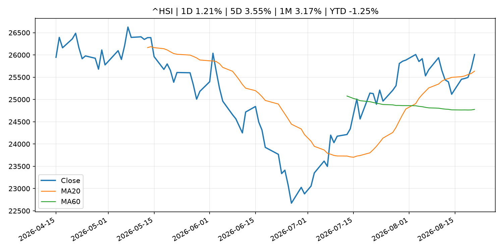

# Global Macro Morning Briefing - 2026-08-25

> Not financial advice / 非投资建议。

## 0. 今日总览
- 市场状态：unknown。市场信号不足，暂不判断明确状态。
- 今日三大主线：
  1. geopolitical_risk: Trump’s trade war with Canada could lead the U.S. back to quantitative easing
  2. macro_data: Jackson  Hole Symposium, U.S. PCE prices, IREN earnings: Crypto Week Ahead
  3. fiscal_policy: Bessent’s sweeping sanctions against Iran send oil prices to their biggest drop in 3 weeks, while fueling hopes of de-escalation
- 一句话结论：今日晨报重点关注：地缘风险可能推升避险需求、能源价格和市场波动率。；这类宏观数据会直接改变市场对通胀、增长和政策路径的预期。。跨资产方面，SPY 1D -0.29%；QQQ 1D -1.00%；^VIX 1D 4.76%；TLT 1D 0.62%；GC=F 1D 1.99%；CL=F 1D -2.35%；BTC 1D 2.25%；ETH 1D 2.24%；市场信号不足，暂不判断明确状态。政策、通胀、利率、美元、美债、能源和加密监管仍是主要观察线索。所有结论仅基于公开数据与短摘要整理，不构成投资建议。

## 1. 隔夜跨资产市场
- 美股：SPY 1D -0.29%，QQQ 1D -1.00%，整体趋势需结合 VIX 和利率确认。
- 美债/美元：TLT 1D 0.62%，美元指数 1D 0.19%，是判断折现率压力的核心线索。
- 黄金/原油：黄金 1D 1.99%，原油 1D -2.35%，用于观察避险、通胀和地缘风险。
- 加密：BTC 1D 2.25%，ETH 1D 2.24%，关注是否独立于纳指走出加密自身行情。
- 港股/A股：恒生 1D 1.21%，沪深300/上证 1D n/a，重点看中国政策预期与人民币线索。
- 风险观察：关注后续数据是否确认当前跨资产信号。

### US_EQUITY

| symbol | latest close | 1D | 5D | 1M | YTD | trend |
|---|---:|---:|---:|---:|---:|---|
| SPY | 763.47 | -0.29% | -1.19% | 3.32% | 11.75% | range_bound |
| QQQ | 706.32 | -1.00% | -3.23% | 3.23% | 15.20% | downtrend |
| DIA | 533.65 | 0.27% | -0.10% | 2.87% | 10.34% | uptrend |
| IWM | 297.97 | -0.66% | -2.00% | 2.34% | 19.77% | range_bound |
| VTI | 377.07 | -0.31% | -1.32% | 3.36% | 12.12% | uptrend |

### US_MACRO_MARKET

| symbol | latest close | 1D | 5D | 1M | YTD | trend |
|---|---:|---:|---:|---:|---:|---|
| ^VIX | 15.85 | 4.76% | 4.34% | -14.69% | 9.24% | downtrend |
| DX-Y.NYB | 98.98 | 0.19% | -0.66% | -2.45% | 0.57% | downtrend |
| TLT | 82.56 | 0.62% | 1.49% | -0.83% | -5.14% | range_bound |
| IEF | 93.01 | 0.20% | 0.18% | -0.02% | -3.20% | downtrend |

### COMMODITIES

| symbol | latest close | 1D | 5D | 1M | YTD | trend |
|---|---:|---:|---:|---:|---:|---|
| GC=F | 4,715.90 | 1.99% | 6.75% | 15.94% | 9.31% | strong_uptrend |
| SI=F | 69.10 | -0.53% | 4.50% | 17.80% | -2.07% | range_bound |
| CL=F | 85.01 | -2.35% | 0.60% | -4.81% | 48.31% | uptrend |
| BZ=F | 92.05 | -2.48% | 1.30% | -4.89% | 51.52% | uptrend |
| NG=F | 2.81 | 1.15% | 4.28% | -2.30% | -22.47% | range_bound |
| HG=F | 6.61 | 0.39% | 0.02% | 4.51% | 17.11% | uptrend |

### HK_MARKET

| symbol | latest close | 1D | 5D | 1M | YTD | trend |
|---|---:|---:|---:|---:|---:|---|
| ^HSI | 26,009.46 | 1.21% | 3.55% | 3.17% | -1.25% | uptrend |
| 0700.HK | 440.00 | -3.72% | -1.43% | 1.24% | -29.37% | range_bound |
| 9988.HK | 112.50 | -8.54% | -7.94% | 2.27% | -24.50% | range_bound |
| 3690.HK | 82.70 | -2.71% | -5.65% | -4.61% | -20.94% | range_bound |
| 1810.HK | 27.82 | -4.14% | 7.50% | 4.12% | -30.93% | uptrend |
| 1211.HK | 92.80 | -0.38% | 3.05% | 4.68% | -6.03% | uptrend |

### CRYPTO

| symbol | latest close | 1D | 5D | 1M | YTD | trend |
|---|---:|---:|---:|---:|---:|---|
| BTC | 78,844.55 | 2.25% | 21.93% | 24.23% | -9.97% | strong_uptrend |
| ETH | 2,478.48 | 2.24% | 29.44% | 31.71% | -16.55% | strong_uptrend |
| SOLANA | 97.47 | 3.79% | 26.59% | 32.62% | -21.73% | strong_uptrend |
| BINANCECOIN | 702.17 | 0.94% | 16.44% | 19.62% | -18.61% | strong_uptrend |
| RIPPLE | 1.48 | 1.08% | 48.04% | 36.43% | -19.55% | strong_uptrend |

## 2. 今日最重要的 10 条新闻
### 1. Trump’s trade war with Canada could lead the U.S. back to quantitative easing
- 来源：MarketWatch Top Stories
- 时间：2026-08-24T19:03:00+00:00
- 地区：US
- 事件类型：geopolitical_risk
- 重要性层级：Tier 1
- 一句话摘要：That’s good for gold, stocks and long bonds. Eventually.
- 为什么重要：地缘风险可能推升避险需求、能源价格和市场波动率。
- 可能影响：主要影响 QQQ，方向为 positive，强度 high；宽松预期降低折现率，有利于成长股。
  - 资产：QQQ
    方向：positive
    强度：high
    原因：宽松预期降低折现率，有利于成长股。
  - 资产：SPY
    方向：positive
    强度：high
    原因：宽松政策通常改善风险偏好。
  - 资产：TLT
    方向：positive
    强度：high
    原因：降息预期通常推升长债价格。
  - 资产：DXY
    方向：negative
    强度：medium
    原因：利差预期回落通常压制美元。
  - 资产：GC=F
    方向：positive
    强度：medium
    原因：实际利率下降通常利好黄金。
  - 资产：BTC
    方向：positive
    强度：high
    原因：流动性改善通常支持加密资产。
- 原文链接：[https://www.marketwatch.com/story/trumps-canada-trade-war-could-lead-the-u-s-back-to-quantitative-easing-eef9be8b?mod=mw_rss_topstories](https://www.marketwatch.com/story/trumps-canada-trade-war-could-lead-the-u-s-back-to-quantitative-easing-eef9be8b?mod=mw_rss_topstories)

### 2. Jackson  Hole Symposium, U.S. PCE prices, IREN earnings: Crypto Week Ahead
- 来源：CoinDesk
- 时间：2026-08-24T08:16:29+00:00
- 地区：global
- 事件类型：macro_data
- 重要性层级：Tier 1
- 一句话摘要：Jackson  Hole Symposium, U.S. PCE prices, IREN earnings: Crypto Week Ahead
- 为什么重要：这类宏观数据会直接改变市场对通胀、增长和政策路径的预期。
- 可能影响：主要影响 DXY，方向为 positive，强度 high；通胀压力可能推高政策利率预期并支撑美元。
  - 资产：DXY
    方向：positive
    强度：high
    原因：通胀压力可能推高政策利率预期并支撑美元。
  - 资产：TLT
    方向：negative
    强度：high
    原因：通胀上行通常推升收益率、压低长债价格。
  - 资产：QQQ
    方向：negative
    强度：high
    原因：更高利率对成长股估值折现率不利。
  - 资产：SPY
    方向：mixed
    强度：medium
    原因：名义增长可能支撑收入，但更高利率压制估值。
  - 资产：GC=F
    方向：mixed
    强度：medium
    原因：通胀对黄金是支撑，但实际利率上行会形成压力。
  - 资产：BTC
    方向：mixed
    强度：medium
    原因：抗通胀叙事和流动性收紧可能相互抵消。
- 原文链接：[https://www.coindesk.com/markets/2026/08/24/jackson-hole-symposium-u-s-pce-prices-iren-earnings-crypto-week-ahead](https://www.coindesk.com/markets/2026/08/24/jackson-hole-symposium-u-s-pce-prices-iren-earnings-crypto-week-ahead)

### 3. Bessent’s sweeping sanctions against Iran send oil prices to their biggest drop in 3 weeks, while fueling hopes of de-escalation
- 来源：MarketWatch Top Stories
- 时间：2026-08-24T19:40:00+00:00
- 地区：US
- 事件类型：fiscal_policy
- 重要性层级：Tier 1
- 一句话摘要：What matters more for oil prices is how hard U.S. sanctions hit China, Iran’s biggest oil buyer, and whether Beijing pushes back.
- 为什么重要：财政和贸易政策会影响增长、通胀、企业利润和跨境资本流。
- 可能影响：主要影响 CL=F，方向为 positive，强度 high；供给扰动或 OPEC 减产通常推升 WTI 原油。
  - 资产：CL=F
    方向：positive
    强度：high
    原因：供给扰动或 OPEC 减产通常推升 WTI 原油。
  - 资产：BZ=F
    方向：positive
    强度：high
    原因：全球供给风险通常直接影响 Brent 原油。
  - 资产：SPY
    方向：mixed
    强度：medium
    原因：能源股可能受益，但通胀和成本压力不利于宽基风险资产。
- 原文链接：[https://www.marketwatch.com/story/oil-trades-lower-even-as-bessent-promises-economic-d-day-announcement-on-iran-a90d862e?mod=mw_rss_topstories](https://www.marketwatch.com/story/oil-trades-lower-even-as-bessent-promises-economic-d-day-announcement-on-iran-a90d862e?mod=mw_rss_topstories)

### 4. Ford’s $3 billion Canadian bet is getting caught in trade-war crosshairs
- 来源：MarketWatch Top Stories
- 时间：2026-08-24T20:22:00+00:00
- 地区：US
- 事件类型：geopolitical_risk
- 重要性层级：Tier 1
- 一句话摘要：While certain U.S. sectors are facing headwinds from the new tariffs on Canadian goods, analysts have said the broad economic effects of the new 50% U.S. levies could be modest for the U.S. overall.
- 为什么重要：地缘风险可能推升避险需求、能源价格和市场波动率。
- 可能影响：可能影响利率、汇率、风险资产或大宗商品预期，但当前公开信息不足以判断明确方向。
  - 资产：暂无明确资产映射
  - 方向：unknown
  - 强度：low
  - 原因：公开信息不足以判断方向。
- 原文链接：[https://www.marketwatch.com/story/u-s-automakers-and-home-builders-are-among-the-big-losers-as-trump-launches-a-trade-war-against-canada-063c1d4c?mod=mw_rss_topstories](https://www.marketwatch.com/story/u-s-automakers-and-home-builders-are-among-the-big-losers-as-trump-launches-a-trade-war-against-canada-063c1d4c?mod=mw_rss_topstories)

### 5. Standard Chartered becomes first bank to distribute Hong Kong dollar stablecoin
- 来源：CoinDesk
- 时间：2026-08-24T11:36:55+00:00
- 地区：global
- 事件类型：crypto_market_structure
- 重要性层级：Tier 2
- 一句话摘要：Standard Chartered becomes first bank to distribute Hong Kong dollar stablecoin
- 为什么重要：加密市场结构和监管变化会影响 BTC、ETH 及相关股票的风险溢价。
- 可能影响：主要影响 BTC，方向为 mixed，强度 high；加密监管或 ETF 进展会改变 BTC 的资金流和风险溢价。
  - 资产：BTC
    方向：mixed
    强度：high
    原因：加密监管或 ETF 进展会改变 BTC 的资金流和风险溢价。
  - 资产：ETH
    方向：mixed
    强度：high
    原因：监管框架会影响 ETH 产品化和机构参与度。
  - 资产：COIN
    方向：mixed
    强度：medium
    原因：监管清晰度和执法风险会影响交易平台估值。
  - 资产：crypto market
    方向：mixed
    强度：high
    原因：信息影响整个加密市场结构，但方向取决于细节。
- 原文链接：[https://www.coindesk.com/business/2026/08/24/standard-chartered-first-bank-to-distribute-anchorpoint-s-hong-kong-dollar-stablecoin](https://www.coindesk.com/business/2026/08/24/standard-chartered-first-bank-to-distribute-anchorpoint-s-hong-kong-dollar-stablecoin)

### 6. Stablecoin neobank Fasset lands $1 billion valuation as SBI backs its payments push
- 来源：CoinDesk
- 时间：2026-08-24T04:45:00+00:00
- 地区：global
- 事件类型：crypto_market_structure
- 重要性层级：Tier 2
- 一句话摘要：Stablecoin neobank Fasset lands $1 billion valuation as SBI backs its payments push
- 为什么重要：加密市场结构和监管变化会影响 BTC、ETH 及相关股票的风险溢价。
- 可能影响：主要影响 BTC，方向为 mixed，强度 high；加密监管或 ETF 进展会改变 BTC 的资金流和风险溢价。
  - 资产：BTC
    方向：mixed
    强度：high
    原因：加密监管或 ETF 进展会改变 BTC 的资金流和风险溢价。
  - 资产：ETH
    方向：mixed
    强度：high
    原因：监管框架会影响 ETH 产品化和机构参与度。
  - 资产：COIN
    方向：mixed
    强度：medium
    原因：监管清晰度和执法风险会影响交易平台估值。
  - 资产：crypto market
    方向：mixed
    强度：high
    原因：信息影响整个加密市场结构，但方向取决于细节。
- 原文链接：[https://www.coindesk.com/business/2026/08/22/stablecoin-neobank-fasset-lands-usd1-billion-valuation-as-sbi-backs-its-payments-push](https://www.coindesk.com/business/2026/08/22/stablecoin-neobank-fasset-lands-usd1-billion-valuation-as-sbi-backs-its-payments-push)

### 7. Crypto extends gains after biggest 3-day rally since 2023
- 来源：CNBC Economy
- 时间：2026-08-24T20:02:22+00:00
- 地区：US
- 事件类型：other
- 重要性层级：Tier 3
- 一句话摘要：Bitcoin and crypto stocks extended their rally after the flagship cryptocurrency broke out of its trading range.
- 为什么重要：这条信息暂未匹配到重大宏观、政策或市场事件，更适合作为背景跟踪。
- 可能影响：更偏背景信息，短期市场影响可能有限。
  - 资产：暂无明确资产映射
  - 方向：unknown
  - 强度：low
  - 原因：公开信息不足以判断方向。
- 原文链接：[https://www.cnbc.com/2026/08/24/crypto-extends-gains-after-biggest-3-day-rally-since-2023.html](https://www.cnbc.com/2026/08/24/crypto-extends-gains-after-biggest-3-day-rally-since-2023.html)

### 8. Bitcoin has beaten stocks and gold over six months. Now it’s closing in on $80,000.
- 来源：MarketWatch Top Stories
- 时间：2026-08-24T20:53:00+00:00
- 地区：US
- 事件类型：other
- 重要性层级：Tier 3
- 一句话摘要：Bitcoin was rising Monday near the $80,000 level that it last touched in May, after the cryptocurrency surged last week on the Treasury Department’s plans to buy back longer-dated Treasurys.
- 为什么重要：这条信息暂未匹配到重大宏观、政策或市场事件，更适合作为背景跟踪。
- 可能影响：更偏背景信息，短期市场影响可能有限。
  - 资产：暂无明确资产映射
  - 方向：unknown
  - 强度：low
  - 原因：公开信息不足以判断方向。
- 原文链接：[https://www.marketwatch.com/story/bitcoin-has-beaten-stocks-and-gold-over-six-months-now-its-closing-in-on-80-000-b8aa48f9?mod=mw_rss_topstories](https://www.marketwatch.com/story/bitcoin-has-beaten-stocks-and-gold-over-six-months-now-its-closing-in-on-80-000-b8aa48f9?mod=mw_rss_topstories)

## 3. 政策与央行观察
### 1. Bessent’s sweeping sanctions against Iran send oil prices to their biggest drop in 3 weeks, while fueling hopes of de-escalation
- 来源：MarketWatch Top Stories
- 时间：2026-08-24T19:40:00+00:00
- 地区：US
- 事件类型：fiscal_policy
- 重要性层级：Tier 1
- 一句话摘要：What matters more for oil prices is how hard U.S. sanctions hit China, Iran’s biggest oil buyer, and whether Beijing pushes back.
- 为什么重要：财政和贸易政策会影响增长、通胀、企业利润和跨境资本流。
- 可能影响：主要影响 CL=F，方向为 positive，强度 high；供给扰动或 OPEC 减产通常推升 WTI 原油。
  - 资产：CL=F
    方向：positive
    强度：high
    原因：供给扰动或 OPEC 减产通常推升 WTI 原油。
  - 资产：BZ=F
    方向：positive
    强度：high
    原因：全球供给风险通常直接影响 Brent 原油。
  - 资产：SPY
    方向：mixed
    强度：medium
    原因：能源股可能受益，但通胀和成本压力不利于宽基风险资产。
- 原文链接：[https://www.marketwatch.com/story/oil-trades-lower-even-as-bessent-promises-economic-d-day-announcement-on-iran-a90d862e?mod=mw_rss_topstories](https://www.marketwatch.com/story/oil-trades-lower-even-as-bessent-promises-economic-d-day-announcement-on-iran-a90d862e?mod=mw_rss_topstories)

### 2. Standard Chartered becomes first bank to distribute Hong Kong dollar stablecoin
- 来源：CoinDesk
- 时间：2026-08-24T11:36:55+00:00
- 地区：global
- 事件类型：crypto_market_structure
- 重要性层级：Tier 2
- 一句话摘要：Standard Chartered becomes first bank to distribute Hong Kong dollar stablecoin
- 为什么重要：加密市场结构和监管变化会影响 BTC、ETH 及相关股票的风险溢价。
- 可能影响：主要影响 BTC，方向为 mixed，强度 high；加密监管或 ETF 进展会改变 BTC 的资金流和风险溢价。
  - 资产：BTC
    方向：mixed
    强度：high
    原因：加密监管或 ETF 进展会改变 BTC 的资金流和风险溢价。
  - 资产：ETH
    方向：mixed
    强度：high
    原因：监管框架会影响 ETH 产品化和机构参与度。
  - 资产：COIN
    方向：mixed
    强度：medium
    原因：监管清晰度和执法风险会影响交易平台估值。
  - 资产：crypto market
    方向：mixed
    强度：high
    原因：信息影响整个加密市场结构，但方向取决于细节。
- 原文链接：[https://www.coindesk.com/business/2026/08/24/standard-chartered-first-bank-to-distribute-anchorpoint-s-hong-kong-dollar-stablecoin](https://www.coindesk.com/business/2026/08/24/standard-chartered-first-bank-to-distribute-anchorpoint-s-hong-kong-dollar-stablecoin)

### 3. Stablecoin neobank Fasset lands $1 billion valuation as SBI backs its payments push
- 来源：CoinDesk
- 时间：2026-08-24T04:45:00+00:00
- 地区：global
- 事件类型：crypto_market_structure
- 重要性层级：Tier 2
- 一句话摘要：Stablecoin neobank Fasset lands $1 billion valuation as SBI backs its payments push
- 为什么重要：加密市场结构和监管变化会影响 BTC、ETH 及相关股票的风险溢价。
- 可能影响：主要影响 BTC，方向为 mixed，强度 high；加密监管或 ETF 进展会改变 BTC 的资金流和风险溢价。
  - 资产：BTC
    方向：mixed
    强度：high
    原因：加密监管或 ETF 进展会改变 BTC 的资金流和风险溢价。
  - 资产：ETH
    方向：mixed
    强度：high
    原因：监管框架会影响 ETH 产品化和机构参与度。
  - 资产：COIN
    方向：mixed
    强度：medium
    原因：监管清晰度和执法风险会影响交易平台估值。
  - 资产：crypto market
    方向：mixed
    强度：high
    原因：信息影响整个加密市场结构，但方向取决于细节。
- 原文链接：[https://www.coindesk.com/business/2026/08/22/stablecoin-neobank-fasset-lands-usd1-billion-valuation-as-sbi-backs-its-payments-push](https://www.coindesk.com/business/2026/08/22/stablecoin-neobank-fasset-lands-usd1-billion-valuation-as-sbi-backs-its-payments-push)

## 4. 市场异动与图表
- QQQ 下跌 -1.00%
- VIX 上涨 4.76%
- TLT 上涨 0.62%
- Gold 上涨 1.99%
- Oil 下跌 -2.35%
- BTC 上涨 2.25%
- ETH 上涨 2.24%

### SPY

### QQQ

### ^VIX

### TLT

### GC=F

### CL=F

### BTC

### ETH

### ^HSI

## 5. 华尔街与机构公开观点
- 暂无可靠公开观点。

## 6. 今日重点关注
- 经济数据：经济数据：暂无可靠公开日历数据；如配置经济日历源后可自动填充。
- 央行讲话：央行讲话：暂无可靠公开日历数据；重点跟踪 Fed、ECB、BoJ、PBOC 官网 RSS。
- 财报：财报：暂无可靠数据。
- 政策事件：政策事件：暂无可靠数据。
- 风险提醒：风险提醒：关注数据源失败项、突发地缘风险、利率和美元的二阶反应。

## 7. 英文金融表达与宏观概念
- **inflation expectations**：通胀预期，指家庭、企业或市场对未来通胀的预估。 例句：Inflation expectations can shape wage bargaining and bond yields.
- **real yield**：实际收益率，名义利率扣除通胀预期后的收益率。 例句：Gold often reacts more to real yields than nominal yields.
- **risk-off**：避险模式，资金偏向美元、国债、黄金等防御资产。 例句：A geopolitical shock can push markets into risk-off mode.
- **supply disruption**：供给扰动，通常指能源或商品供应受冲突、减产或天气影响。 例句：Supply disruption can lift oil prices and inflation expectations.
- **market structure**：市场结构，指交易、托管、清算、ETF、监管等制度安排。 例句：Crypto market structure rules can affect institutional participation.
- **terminal rate**：终端利率，市场预期本轮加息周期的最高政策利率。 例句：A higher terminal rate can pressure growth stocks.

## 8. 背景材料
- [Bitcoin has beaten stocks and gold over six months. Now it’s closing in on $80,000.](https://www.marketwatch.com/story/bitcoin-has-beaten-stocks-and-gold-over-six-months-now-its-closing-in-on-80-000-b8aa48f9?mod=mw_rss_topstories)（MarketWatch Top Stories，other）：Bitcoin was rising Monday near the $80,000 level that it last touched in May, after the cryptocurrency surged last week on the Treasury Department’s plans to buy back longer-dated Treasurys.
- [Crypto extends gains after biggest 3-day rally since 2023](https://www.cnbc.com/2026/08/24/crypto-extends-gains-after-biggest-3-day-rally-since-2023.html)（CNBC Economy，other）：Bitcoin and crypto stocks extended their rally after the flagship cryptocurrency broke out of its trading range.
- [Bitcoin nears $80,000, but analysts say the next pullback will be key](https://www.coindesk.com/markets/2026/08/24/bitcoin-nears-usd80-000-but-analysts-say-the-next-pullback-will-be-key)（CoinDesk，other）：Bitcoin nears $80,000, but analysts say the next pullback will be key
- [Goldman Sachs partner warns of 'huge danger' in letting AI replace bankers' reasoning skills](https://www.cnbc.com/2026/08/24/goldman-sachs-ai-partner-danger-skills.html)（CNBC Economy，other）：Goldman Sachs is embracing AI, but one of its senior tech leaders warns that it comes with an unintended risk: weakening the reasoning skills of future bankers.
- [Financial repression: The new buzzword for bitcoin bulls](https://www.coindesk.com/daybook-us/2026/08/24/financial-repression-the-new-buzzword-for-bitcoin-bulls)（CoinDesk，other）：Financial repression: The new buzzword for bitcoin bulls
- [Bitcoin steadies near $78,000 as gold rallies, altcoins consolidate after best week in 3 years](https://www.coindesk.com/markets/2026/08/24/bitcoin-steadies-near-usd78-000-as-gold-rallies-altcoins-consolidate-after-best-week-in-3-years)（CoinDesk，other）：Bitcoin steadies near $78,000 as gold rallies, altcoins consolidate after best week in 3 years
- [Fed experiment shows how bitcoin rallies attract new crypto buyers](https://www.coindesk.com/markets/2026/08/24/fed-experiment-shows-how-bitcoin-rallies-attract-new-crypto-buyers)（CoinDesk，other）：Fed experiment shows how bitcoin rallies attract new crypto buyers
- [Crypto roars back as bitcoin posts its second-best week since early 2021](https://www.coindesk.com/markets/2026/08/24/crypto-roars-back-as-bitcoin-posts-its-second-best-week-since-early-2021)（CoinDesk，other）：Crypto roars back as bitcoin posts its second-best week since early 2021
- [Live updates: Bitcoin retreats after nearing $80,000, with analysts eyeing breather after big run](https://www.coindesk.com/business/2026/08/24/live-updates-bitcoin-holds-usd77-000-as-xrp-zcash-pull-back-after-a-big-weekly-rally)（CoinDesk，other）：Live updates: Bitcoin retreats after nearing $80,000, with analysts eyeing breather after big run
- [Japanese Government Bonds Held by the Bank of Japan](http://www.boj.or.jp/en/statistics/boj/other/mei/release/2026/mei260820.xlsx)（Bank of Japan Announcements，other）：Japanese Government Bonds Held by the Bank of Japan
- [Ether is crushing bitcoin and the 'golden cross' says it may not be done yet](https://www.coindesk.com/markets/2026/08/24/ether-is-crushing-bitcoin-and-the-golden-cross-says-it-may-not-be-done-yet)（CoinDesk，other）：Ether is crushing bitcoin and the 'golden cross' says it may not be done yet
- [Piero Cipollone: Interview with ilsussidiario.net](https://www.ecb.europa.eu//press/inter/date/2026/html/ecb.in260824~fa5acbddea.en.html)（ECB Press Releases，other）：Piero Cipollone: Interview with ilsussidiario.net
- [Ray Dalio says investors should own ‘a bit of Bitcoin’ as U.S. debt risks rise](https://www.coindesk.com/markets/2026/08/24/ray-dalio-says-investors-should-own-a-bit-of-bitcoin-as-u-s-debt-risks-rise)（CoinDesk，other）：Ray Dalio says investors should own ‘a bit of Bitcoin’ as U.S. debt risks rise
- [Bessent's $4 billion bond buyback wanted lower yields. It got a bitcoin surge instead.](https://www.coindesk.com/markets/2026/08/24/bessent-s-usd4-billion-bond-buyback-wanted-lower-yields-it-got-a-bitcoin-surge-instead)（CoinDesk，other）：Bessent's $4 billion bond buyback wanted lower yields. It got a bitcoin surge instead.
- [Financial System Report Annex "Use and Risk Management of Generative AI by Japanese Financial Institutions"](http://www.boj.or.jp/en/research/brp/fsr/fsrb260824.htm)（Bank of Japan Announcements，other）：Financial System Report Annex "Use and Risk Management of Generative AI by Japanese Financial Institutions"
- [Bank of Japan Accounts (August 20)](http://www.boj.or.jp/en/statistics/boj/other/acmai/release/2026/ac260820.htm)（Bank of Japan Announcements，routine_announcement）：Bank of Japan Accounts (August 20)
- [Statistics on Securities Financing Transactions in Japan](http://www.boj.or.jp/en/statistics/bis/repo/index.htm)（Bank of Japan Announcements，other）：Statistics on Securities Financing Transactions in Japan
- [XRP on track for biggest weekly gain in 21 months as Treasury buyback spurs 'curve control' hopes](https://www.coindesk.com/markets/2026/08/23/xrp-on-track-for-biggest-weekly-gain-in-21-months-as-treasury-buyback-spurs-curve-control-hopes)（CoinDesk，other）：XRP on track for biggest weekly gain in 21 months as Treasury buyback spurs 'curve control' hopes
- [Crypto card spending tops $1 billion as stablecoins move into everyday purchases](https://www.coindesk.com/business/2026/08/23/crypto-card-spending-tops-usd1-billion-as-stablecoins-move-into-everyday-purchases)（CoinDesk，other）：Crypto card spending tops $1 billion as stablecoins move into everyday purchases
- [Crypto’s next billion users might be AI agents, and they’re paying with stablecoins](https://www.coindesk.com/business/2026/08/23/crypto-s-next-billion-users-might-be-ai-agents-and-they-re-paying-with-stablecoins)（CoinDesk，other）：Crypto’s next billion users might be AI agents, and they’re paying with stablecoins

## 9. 数据源、失败项与免责声明
- 采集时间：2026-08-24T22:23:58
- 数据源：公开 RSS、Yahoo Finance、CoinGecko、AKShare、FRED、SEC data.sec.gov，以及用户自有 inputs/reports 文件。
- 合规说明：不绕过 WSJ、Bloomberg、FT、Reuters 等付费墙；对付费媒体只使用公开 RSS 标题、摘要、链接和发布时间。
- 免责声明：Not financial advice / 非投资建议。本项目仅供个人学习、研究和信息整理，不构成投资建议、交易建议或任何收益承诺。
- 失败或跳过的数据源：
  - crypto data failed coin=dogecoin
  - China market data failed symbol=上证指数: empty dataframe
  - China market data failed symbol=深证成指: empty dataframe
  - China market data failed symbol=创业板指: empty dataframe
  - China market data failed symbol=沪深300: empty dataframe
  - China market data failed symbol=中证500: empty dataframe
  - China market data failed symbol=科创50: empty dataframe
  - FRED_API_KEY not set; skipping FRED macro series
  - SEC failed cik=0000320193
  - SEC failed cik=0000789019
  - SEC failed cik=0001045810
  - SEC failed cik=0001318605
  - SEC failed cik=0001577552
