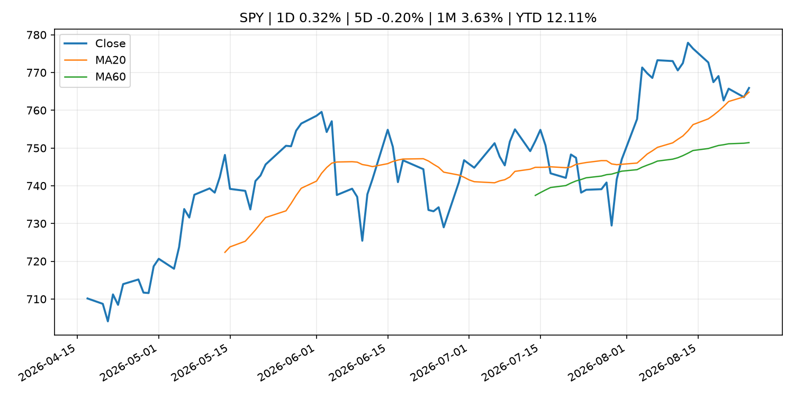
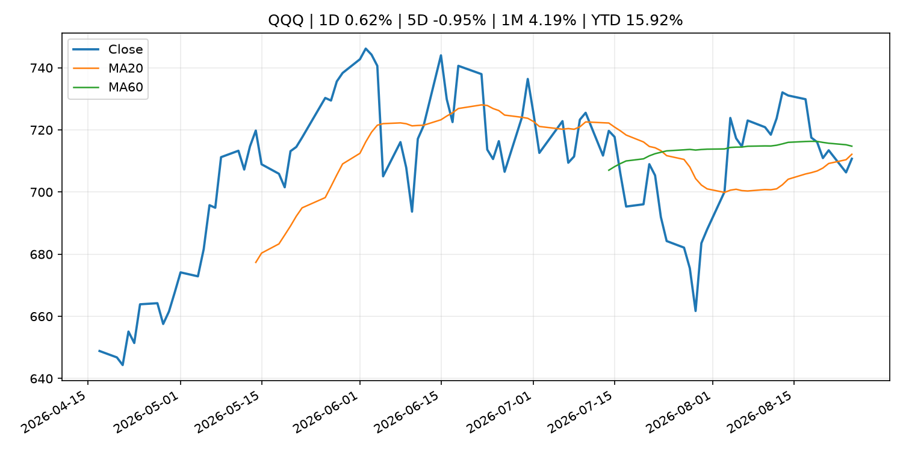
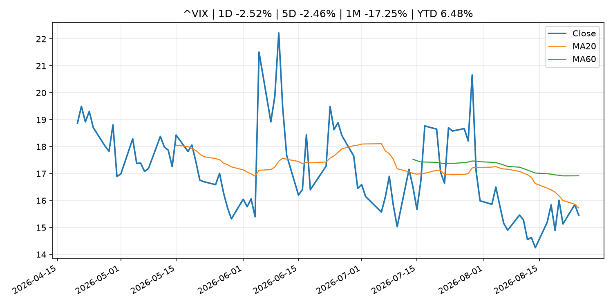
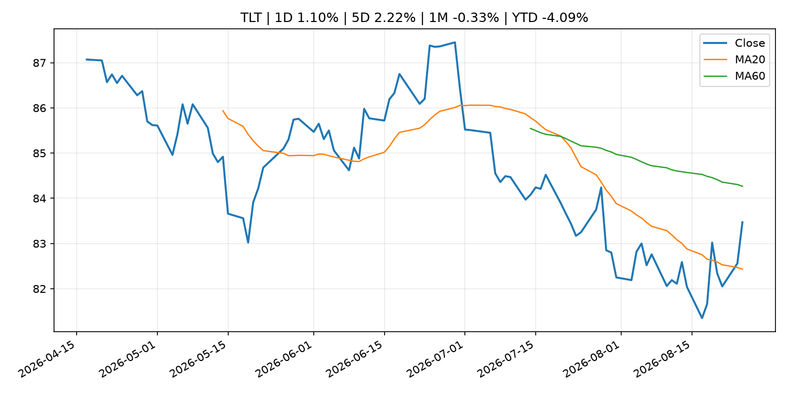
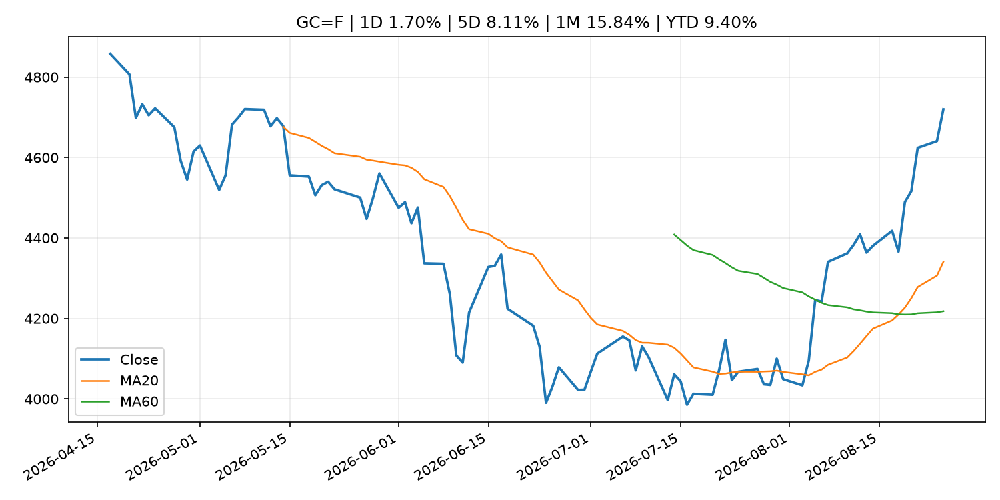
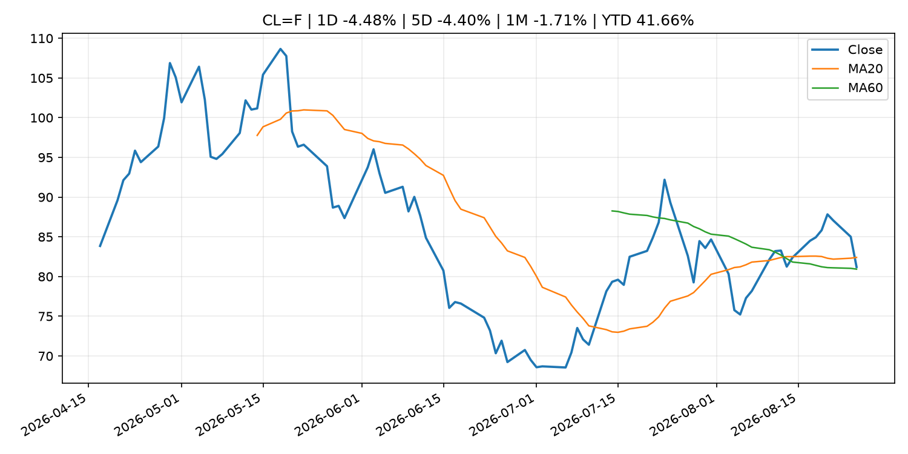
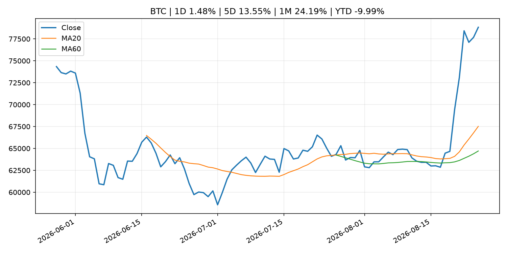
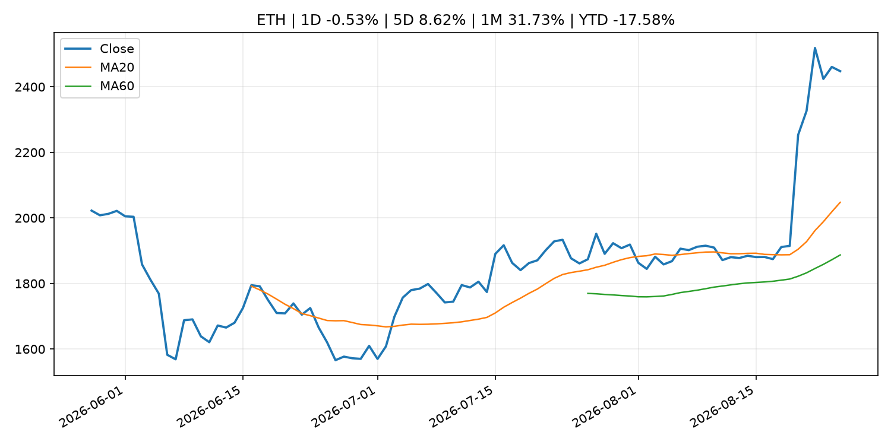
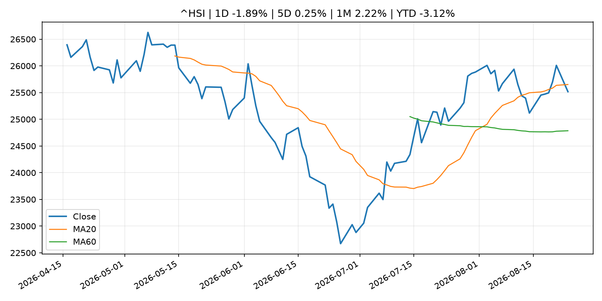

# Global Macro Morning Briefing - 2026-08-26

> Not financial advice / 非投资建议。

## 0. 今日总览
- 市场状态：risk_on。股指上涨、波动率或美元回落，市场更接近风险偏好改善。
- 今日三大主线：
  1. macro_data: Indicators for Core CPI
  2. fiscal_policy: China needs U.S. dollars but is building a hedge against Washington’s sanctions
  3. earnings: Options traders are betting on the quietest Nvidia earnings reaction in years. It could be an opportunity for AI bulls.
- 一句话结论：今日晨报重点关注：这类宏观数据会直接改变市场对通胀、增长和政策路径的预期。；财政和贸易政策会影响增长、通胀、企业利润和跨境资本流。。跨资产方面，SPY 1D 0.32%；QQQ 1D 0.62%；^VIX 1D -2.52%；TLT 1D 1.10%；GC=F 1D 1.70%；CL=F 1D -4.48%；BTC 1D 1.48%；ETH 1D -0.53%；股指上涨、波动率或美元回落，市场更接近风险偏好改善。政策、通胀、利率、美元、美债、能源和加密监管仍是主要观察线索。所有结论仅基于公开数据与短摘要整理，不构成投资建议。

## 1. 隔夜跨资产市场
- 美股：SPY 1D 0.32%，QQQ 1D 0.62%，整体趋势需结合 VIX 和利率确认。
- 美债/美元：TLT 1D 1.10%，美元指数 1D -0.10%，是判断折现率压力的核心线索。
- 黄金/原油：黄金 1D 1.70%，原油 1D -4.48%，用于观察避险、通胀和地缘风险。
- 加密：BTC 1D 1.48%，ETH 1D -0.53%，关注是否独立于纳指走出加密自身行情。
- 港股/A股：恒生 1D -1.89%，沪深300/上证 1D n/a，重点看中国政策预期与人民币线索。
- 风险观察：确认风险偏好是否扩散到小盘股、信用利差和周期品。

### US_EQUITY

| symbol | latest close | 1D | 5D | 1M | YTD | trend |
|---|---:|---:|---:|---:|---:|---|
| SPY | 765.91 | 0.32% | -0.20% | 3.63% | 12.11% | uptrend |
| QQQ | 710.72 | 0.62% | -0.95% | 4.19% | 15.92% | downtrend |
| DIA | 535.24 | 0.30% | 0.44% | 2.68% | 10.67% | uptrend |
| IWM | 299.23 | 0.42% | -0.33% | 2.16% | 20.28% | uptrend |
| VTI | 378.15 | 0.29% | -0.23% | 3.55% | 12.44% | uptrend |

### US_MACRO_MARKET

| symbol | latest close | 1D | 5D | 1M | YTD | trend |
|---|---:|---:|---:|---:|---:|---|
| ^VIX | 15.45 | -2.52% | -2.46% | -17.25% | 6.48% | downtrend |
| DX-Y.NYB | 98.90 | -0.10% | -0.75% | -2.57% | 0.49% | downtrend |
| TLT | 83.47 | 1.10% | 2.22% | -0.33% | -4.09% | range_bound |
| IEF | 93.51 | 0.54% | 0.62% | 0.25% | -2.67% | range_bound |

### COMMODITIES

| symbol | latest close | 1D | 5D | 1M | YTD | trend |
|---|---:|---:|---:|---:|---:|---|
| GC=F | 4,719.90 | 1.70% | 8.11% | 15.84% | 9.40% | strong_uptrend |
| SI=F | 68.82 | 0.41% | 7.63% | 17.70% | -2.46% | strong_uptrend |
| CL=F | 81.20 | -4.48% | -4.40% | -1.71% | 41.66% | range_bound |
| BZ=F | 86.15 | -6.53% | -5.35% | -2.50% | 41.81% | range_bound |
| NG=F | 2.84 | 2.16% | 2.38% | 2.71% | -21.45% | range_bound |
| HG=F | 6.71 | 1.62% | 3.45% | 5.79% | 18.90% | uptrend |

### HK_MARKET

| symbol | latest close | 1D | 5D | 1M | YTD | trend |
|---|---:|---:|---:|---:|---:|---|
| ^HSI | 25,517.33 | -1.89% | 0.25% | 2.22% | -3.12% | range_bound |
| 0700.HK | 442.00 | 0.45% | -0.09% | -0.23% | -29.05% | range_bound |
| 9988.HK | 114.20 | 1.51% | -9.87% | 2.88% | -23.36% | range_bound |
| 3690.HK | 77.20 | -6.65% | -9.76% | -13.55% | -26.20% | range_bound |
| 1810.HK | 27.76 | -0.22% | 6.04% | -3.21% | -31.08% | uptrend |
| 1211.HK | 93.60 | 0.86% | 4.00% | 5.70% | -5.22% | uptrend |

### CRYPTO

| symbol | latest close | 1D | 5D | 1M | YTD | trend |
|---|---:|---:|---:|---:|---:|---|
| BTC | 78,828.07 | 1.48% | 13.55% | 24.19% | -9.99% | strong_uptrend |
| ETH | 2,447.90 | -0.53% | 8.62% | 31.73% | -17.58% | strong_uptrend |
| SOLANA | 97.59 | 2.38% | 14.18% | 32.80% | -21.63% | strong_uptrend |
| BINANCECOIN | 696.14 | -0.86% | 10.88% | 18.28% | -19.31% | strong_uptrend |
| RIPPLE | 1.45 | -4.51% | 31.06% | 34.93% | -21.22% | strong_uptrend |

## 2. 今日最重要的 10 条新闻
### 1. Indicators for Core CPI
- 来源：Bank of Japan Announcements
- 时间：2026-08-25T14:00:00+09:00
- 地区：Japan
- 事件类型：macro_data
- 重要性层级：Tier 1
- 一句话摘要：Indicators for Core CPI
- 为什么重要：这类宏观数据会直接改变市场对通胀、增长和政策路径的预期。
- 可能影响：主要影响 DXY，方向为 positive，强度 high；通胀压力可能推高政策利率预期并支撑美元。
  - 资产：DXY
    方向：positive
    强度：high
    原因：通胀压力可能推高政策利率预期并支撑美元。
  - 资产：TLT
    方向：negative
    强度：high
    原因：通胀上行通常推升收益率、压低长债价格。
  - 资产：QQQ
    方向：negative
    强度：high
    原因：更高利率对成长股估值折现率不利。
  - 资产：SPY
    方向：mixed
    强度：medium
    原因：名义增长可能支撑收入，但更高利率压制估值。
  - 资产：GC=F
    方向：mixed
    强度：medium
    原因：通胀对黄金是支撑，但实际利率上行会形成压力。
  - 资产：BTC
    方向：mixed
    强度：medium
    原因：抗通胀叙事和流动性收紧可能相互抵消。
- 原文链接：[http://www.boj.or.jp/en/research/research_data/cpi/index.htm](http://www.boj.or.jp/en/research/research_data/cpi/index.htm)

### 2. China needs U.S. dollars but is building a hedge against Washington’s sanctions
- 来源：CNBC Economy
- 时间：2026-08-25T16:00:40+00:00
- 地区：US
- 事件类型：fiscal_policy
- 重要性层级：Tier 1
- 一句话摘要：The U.S. can pressure Chinese banks over Iran through access to its financial system, while Beijing is building alternatives such as CIPS.
- 为什么重要：财政和贸易政策会影响增长、通胀、企业利润和跨境资本流。
- 可能影响：可能影响利率、汇率、风险资产或大宗商品预期，但当前公开信息不足以判断明确方向。
  - 资产：暂无明确资产映射
  - 方向：unknown
  - 强度：low
  - 原因：公开信息不足以判断方向。
- 原文链接：[https://www.cnbc.com/2026/08/25/china-iran-us-sanctions-banks-cips.html](https://www.cnbc.com/2026/08/25/china-iran-us-sanctions-banks-cips.html)

### 3. Options traders are betting on the quietest Nvidia earnings reaction in years. It could be an opportunity for AI bulls.
- 来源：MarketWatch Top Stories
- 时间：2026-08-25T20:07:00+00:00
- 地区：US
- 事件类型：earnings
- 重要性层级：Tier 2
- 一句话摘要：Nvidia’s quarterly earnings announcement has been a major stock-market event ever since the AI boom began in earnest with the introduction of ChatGPT in late 2022.
- 为什么重要：大型科技股盈利和资本开支会影响纳指、半导体和 AI 交易主线。
- 可能影响：主要影响 QQQ，方向为 mixed，强度 high；AI 资本开支会影响大型科技股盈利和估值预期。
  - 资产：QQQ
    方向：mixed
    强度：high
    原因：AI 资本开支会影响大型科技股盈利和估值预期。
  - 资产：SMH
    方向：mixed
    强度：high
    原因：AI 投资周期直接影响半导体需求。
  - 资产：NVDA
    方向：mixed
    强度：high
    原因：AI 训练和推理需求是英伟达收入预期核心变量。
  - 资产：MSFT
    方向：mixed
    强度：medium
    原因：云和 AI 资本开支影响利润率与增长叙事。
  - 资产：GOOGL
    方向：mixed
    强度：medium
    原因：AI 投资和搜索商业化影响估值。
  - 资产：META
    方向：mixed
    强度：medium
    原因：AI 基建支出与广告效率共同影响市场预期。
- 原文链接：[https://www.marketwatch.com/story/options-traders-are-betting-on-the-quietest-nvidia-earnings-reaction-in-years-it-could-be-an-opportunity-for-ai-bulls-91955793?mod=mw_rss_topstories](https://www.marketwatch.com/story/options-traders-are-betting-on-the-quietest-nvidia-earnings-reaction-in-years-it-could-be-an-opportunity-for-ai-bulls-91955793?mod=mw_rss_topstories)

### 4. Minutes of the Board's discount rate meetings on July 20 and July 29, 2026
- 来源：Federal Reserve Press Releases
- 时间：2026-08-25T18:00:00+00:00
- 地区：US
- 事件类型：other
- 重要性层级：Tier 3
- 一句话摘要：Minutes of the Board's discount rate meetings on July 20 and July 29, 2026
- 为什么重要：这条信息暂未匹配到重大宏观、政策或市场事件，更适合作为背景跟踪。
- 可能影响：更偏背景信息，短期市场影响可能有限。
  - 资产：暂无明确资产映射
  - 方向：unknown
  - 强度：low
  - 原因：公开信息不足以判断方向。
- 原文链接：[https://www.federalreserve.gov/newsevents/pressreleases/monetary20260825a.htm](https://www.federalreserve.gov/newsevents/pressreleases/monetary20260825a.htm)

### 5. Zerohash back for second effort at OCC trust bank charter
- 来源：CoinDesk
- 时间：2026-08-25T21:38:28+00:00
- 地区：global
- 事件类型：other
- 重要性层级：Tier 3
- 一句话摘要：Zerohash back for second effort at OCC trust bank charter
- 为什么重要：这条信息暂未匹配到重大宏观、政策或市场事件，更适合作为背景跟踪。
- 可能影响：更偏背景信息，短期市场影响可能有限。
  - 资产：暂无明确资产映射
  - 方向：unknown
  - 强度：low
  - 原因：公开信息不足以判断方向。
- 原文链接：[https://www.coindesk.com/policy/2026/08/25/zerohash-back-for-second-effort-at-occ-trust-bank-charter](https://www.coindesk.com/policy/2026/08/25/zerohash-back-for-second-effort-at-occ-trust-bank-charter)

## 3. 政策与央行观察
### 1. China needs U.S. dollars but is building a hedge against Washington’s sanctions
- 来源：CNBC Economy
- 时间：2026-08-25T16:00:40+00:00
- 地区：US
- 事件类型：fiscal_policy
- 重要性层级：Tier 1
- 一句话摘要：The U.S. can pressure Chinese banks over Iran through access to its financial system, while Beijing is building alternatives such as CIPS.
- 为什么重要：财政和贸易政策会影响增长、通胀、企业利润和跨境资本流。
- 可能影响：可能影响利率、汇率、风险资产或大宗商品预期，但当前公开信息不足以判断明确方向。
  - 资产：暂无明确资产映射
  - 方向：unknown
  - 强度：low
  - 原因：公开信息不足以判断方向。
- 原文链接：[https://www.cnbc.com/2026/08/25/china-iran-us-sanctions-banks-cips.html](https://www.cnbc.com/2026/08/25/china-iran-us-sanctions-banks-cips.html)

## 4. 市场异动与图表
- QQQ 上涨 0.62%
- TLT 上涨 1.10%
- Gold 上涨 1.70%
- Oil 下跌 -4.48%

### SPY

### QQQ

### ^VIX

### TLT

### GC=F

### CL=F

### BTC

### ETH

### ^HSI

## 5. 华尔街与机构公开观点
- 暂无可靠公开观点。

## 6. 今日重点关注
- 经济数据：经济数据：暂无可靠公开日历数据；如配置经济日历源后可自动填充。
- 央行讲话：央行讲话：暂无可靠公开日历数据；重点跟踪 Fed、ECB、BoJ、PBOC 官网 RSS。
- 财报：财报：暂无可靠数据。
- 政策事件：政策事件：暂无可靠数据。
- 风险提醒：风险提醒：关注数据源失败项、突发地缘风险、利率和美元的二阶反应。

## 7. 英文金融表达与宏观概念
- **inflation expectations**：通胀预期，指家庭、企业或市场对未来通胀的预估。 例句：Inflation expectations can shape wage bargaining and bond yields.
- **risk-off**：避险模式，资金偏向美元、国债、黄金等防御资产。 例句：A geopolitical shock can push markets into risk-off mode.
- **market structure**：市场结构，指交易、托管、清算、ETF、监管等制度安排。 例句：Crypto market structure rules can affect institutional participation.
- **AI capex**：AI 资本开支，指云厂商和科技公司投入 AI 基建的支出。 例句：AI capex guidance can move semiconductor stocks.
- **real yield**：实际收益率，名义利率扣除通胀预期后的收益率。 例句：Gold often reacts more to real yields than nominal yields.
- **terminal rate**：终端利率，市场预期本轮加息周期的最高政策利率。 例句：A higher terminal rate can pressure growth stocks.

## 8. 背景材料
- [Zerohash back for second effort at OCC trust bank charter](https://www.coindesk.com/policy/2026/08/25/zerohash-back-for-second-effort-at-occ-trust-bank-charter)（CoinDesk，other）：Zerohash back for second effort at OCC trust bank charter
- [This driverless-truck company could be a ‘long-term winner’ in a market Tesla plans to enter soon](https://www.marketwatch.com/story/this-driverless-truck-company-could-be-a-long-term-winner-in-a-market-tesla-plans-to-enter-soon-193bc8fe?mod=mw_rss_topstories)（MarketWatch Top Stories，other）：Kodiak AI logged more than 40,000 paid driverless hours through the second quarter and is pushing to offer driverless highway operations by the end of 2026.
- [Minutes of the Board's discount rate meetings on July 20 and July 29, 2026](https://www.federalreserve.gov/newsevents/pressreleases/monetary20260825a.htm)（Federal Reserve Press Releases，other）：Minutes of the Board's discount rate meetings on July 20 and July 29, 2026
- [Crypto extends gains after biggest 3-day rally since 2023](https://www.cnbc.com/2026/08/24/crypto-extends-gains-after-biggest-3-day-rally-since-2023.html)（CNBC Economy，other）：Bitcoin and crypto stocks extended their rally after the flagship cryptocurrency broke out of its trading range.
- [Bitcoin's surging price faces 1 key level that could signal if the bear market is really over](https://www.coindesk.com/daybook-us/2026/08/25/bitcoin-s-surging-price-faces-1-key-level-that-could-signal-if-the-bear-market-is-really-over)（CoinDesk，other）：Bitcoin's surging price faces 1 key level that could signal if the bear market is really over
- [A bitcoin short squeeze for the ages as futures open interest collapses](https://www.coindesk.com/markets/2026/08/25/a-bitcoin-short-squeeze-for-the-ages-as-futures-open-interest-collapses)（CoinDesk，other）：A bitcoin short squeeze for the ages as futures open interest collapses
- [Bitcoin extends 7-day advance to roughly 25%](https://www.coindesk.com/markets/2026/08/25/bitcoin-extends-7-day-advance-to-roughly-25)（CoinDesk，other）：Bitcoin extends 7-day advance to roughly 25%
- [Solana ETFs extend growth streak to 5 days after year's biggest inflows](https://www.coindesk.com/markets/2026/08/25/solana-etfs-extend-growth-streak-to-5-days-after-year-s-biggest-inflows)（CoinDesk，other）：Solana ETFs extend growth streak to 5 days after year's biggest inflows
- [U.S. widens Iran crackdown to encompass crypto, gold, shipping and technology](https://www.coindesk.com/policy/2026/08/25/u-s-widens-iran-crackdown-to-encompass-crypto-gold-shipping-and-technology)（CoinDesk，other）：U.S. widens Iran crackdown to encompass crypto, gold, shipping and technology
- [Live updates: Bitcoin settles in under $80,000, with interest rates headed lower on Tuesday](https://www.coindesk.com/business/2026/08/25/live-updates-bitcoin-etfs-draw-a-seventh-straight-day-of-inflows-as-the-rally-holds-above-usd80-000)（CoinDesk，other）：Live updates: Bitcoin settles in under $80,000, with interest rates headed lower on Tuesday
- [Treasury’s bond buyback plan fights the market and heightens the danger, billionaire Druckenmiller says](https://www.coindesk.com/markets/2026/08/25/governments-defending-prices-against-fundamentals-always-lose-billionaire-investor-druckenmiller-says)（CoinDesk，other）：Treasury’s bond buyback plan fights the market and heightens the danger, billionaire Druckenmiller says
- [Bitcoin traders place $2.9 million bet on a rapid price jump above $82,000](https://www.coindesk.com/markets/2026/08/25/bitcoin-traders-place-usd2-9-million-bet-on-a-rapid-price-jump-above-usd82-000)（CoinDesk，other）：Bitcoin traders place $2.9 million bet on a rapid price jump above $82,000
- [Bitcoin tops $80,000, solana jumps 8% but rally now runs into overbought warning](https://www.coindesk.com/markets/2026/08/25/bitcoin-tops-usd80-000-solana-jumps-8-but-rally-now-runs-into-overbought-warning)（CoinDesk，other）：Bitcoin tops $80,000, solana jumps 8% but rally now runs into overbought warning
- [Bitcoin hits $80,000 for the first time since May as crypto recovery accelerates](https://www.coindesk.com/markets/2026/08/24/bitcoin-hits-usd80-000-for-the-first-time-since-may-as-crypto-recovery-accelerates)（CoinDesk，other）：Bitcoin hits $80,000 for the first time since May as crypto recovery accelerates
- [Bitcoin nears $80,000, but analysts say the next pullback will be key](https://www.coindesk.com/markets/2026/08/24/bitcoin-nears-usd80-000-but-analysts-say-the-next-pullback-will-be-key)（CoinDesk，other）：Bitcoin nears $80,000, but analysts say the next pullback will be key
- [Goldman Sachs partner warns of 'huge danger' in letting AI replace bankers' reasoning skills](https://www.cnbc.com/2026/08/24/goldman-sachs-ai-partner-danger-skills.html)（CNBC Economy，other）：Goldman Sachs is embracing AI, but one of its senior tech leaders warns that it comes with an unintended risk: weakening the reasoning skills of future bankers.
- [Japanese Government Bonds Held by the Bank of Japan](http://www.boj.or.jp/en/statistics/boj/other/mei/release/2026/mei260820.xlsx)（Bank of Japan Announcements，other）：Japanese Government Bonds Held by the Bank of Japan
- [Piero Cipollone: Interview with ilsussidiario.net](https://www.ecb.europa.eu//press/inter/date/2026/html/ecb.in260824~fa5acbddea.en.html)（ECB Press Releases，other）：Piero Cipollone: Interview with ilsussidiario.net
- [Financial System Report Annex "Use and Risk Management of Generative AI by Japanese Financial Institutions"](http://www.boj.or.jp/en/research/brp/fsr/fsrb260824.htm)（Bank of Japan Announcements，other）：Financial System Report Annex "Use and Risk Management of Generative AI by Japanese Financial Institutions"
- [Bank of Japan Accounts (August 20)](http://www.boj.or.jp/en/statistics/boj/other/acmai/release/2026/ac260820.htm)（Bank of Japan Announcements，routine_announcement）：Bank of Japan Accounts (August 20)

## 9. 数据源、失败项与免责声明
- 采集时间：2026-08-25T22:24:57
- 数据源：公开 RSS、Yahoo Finance、CoinGecko、AKShare、FRED、SEC data.sec.gov，以及用户自有 inputs/reports 文件。
- 合规说明：不绕过 WSJ、Bloomberg、FT、Reuters 等付费墙；对付费媒体只使用公开 RSS 标题、摘要、链接和发布时间。
- 免责声明：Not financial advice / 非投资建议。本项目仅供个人学习、研究和信息整理，不构成投资建议、交易建议或任何收益承诺。
- 失败或跳过的数据源：
  - crypto data failed coin=dogecoin
  - China market data failed symbol=上证指数: empty dataframe
  - China market data failed symbol=深证成指: empty dataframe
  - China market data failed symbol=创业板指: empty dataframe
  - China market data failed symbol=沪深300: empty dataframe
  - China market data failed symbol=中证500: empty dataframe
  - China market data failed symbol=科创50: empty dataframe
  - FRED_API_KEY not set; skipping FRED macro series
  - SEC failed cik=0000320193
  - SEC failed cik=0000789019
  - SEC failed cik=0001045810
  - SEC failed cik=0001318605
  - SEC failed cik=0001577552
