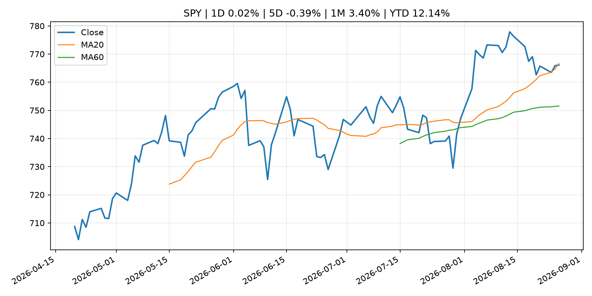
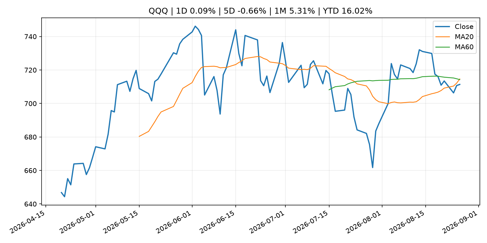
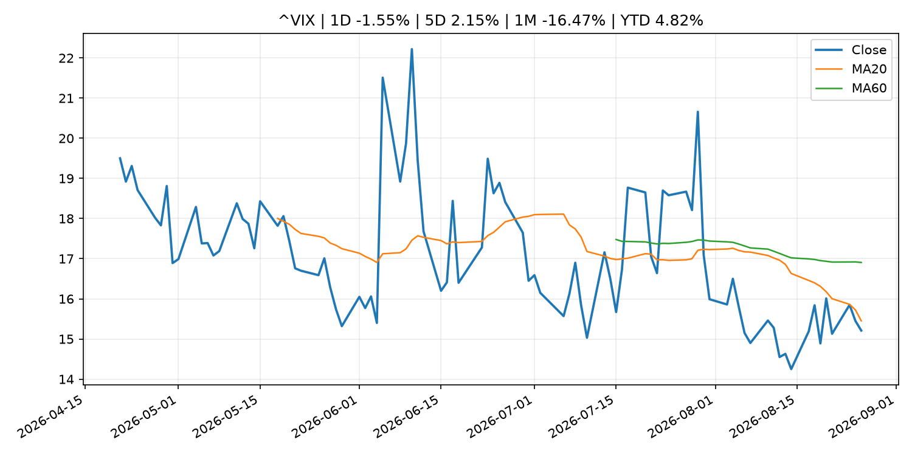
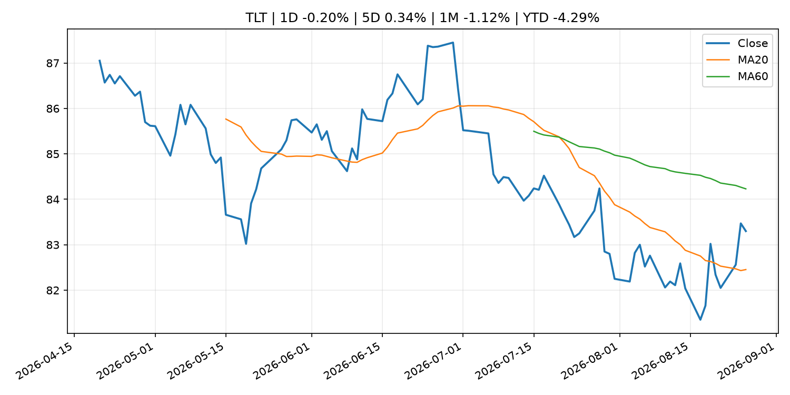
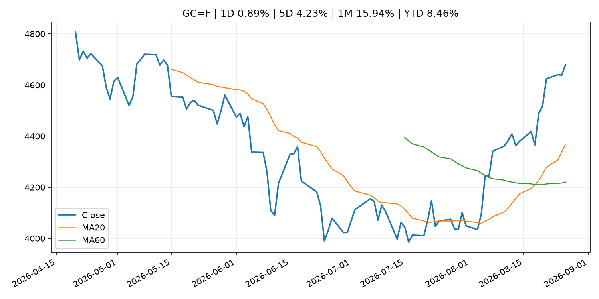
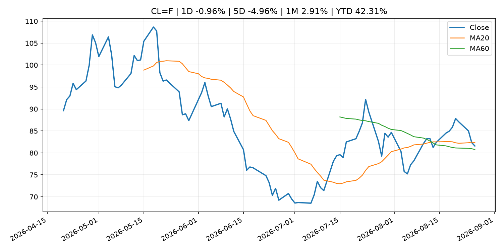
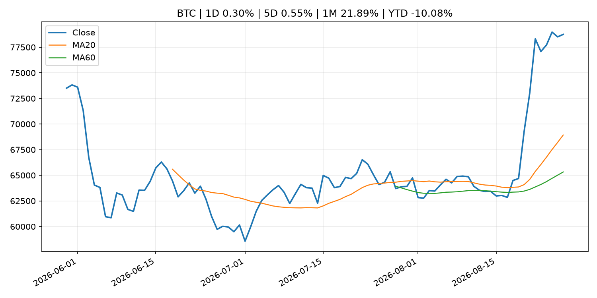
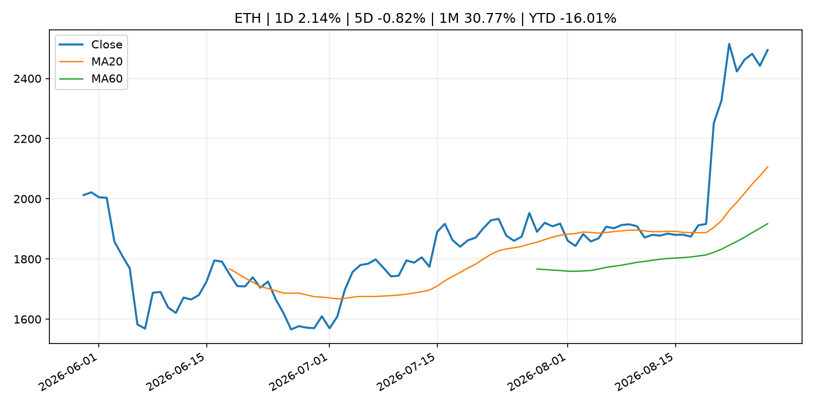
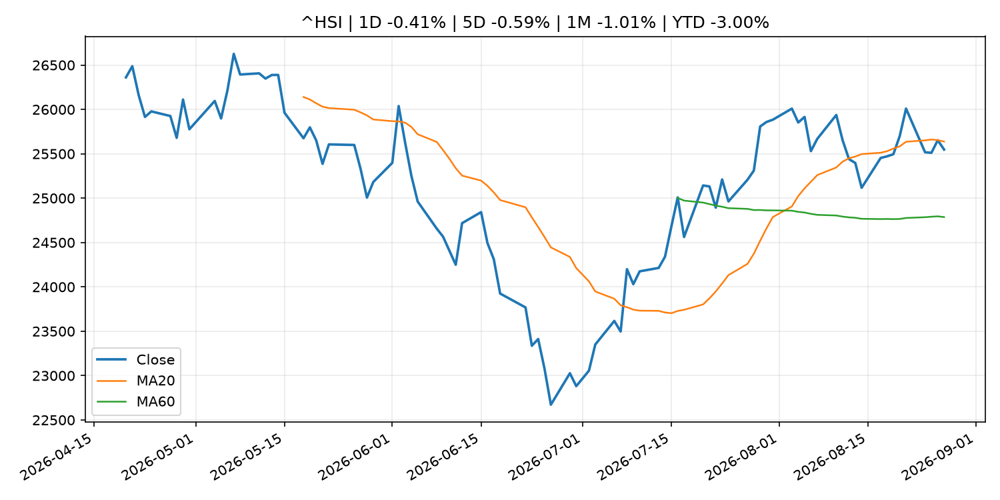

# Global Macro Morning Briefing - 2026-08-27

> Not financial advice / 非投资建议。

## 0. 今日总览
- 市场状态：crypto_specific。BTC/ETH 明显走强但美股平淡，行情更像加密自身事件驱动。
- 今日三大主线：
  1. macro_data: Indicators for Core CPI
  2. fiscal_policy: China needs U.S. dollars but is building a hedge against Washington’s sanctions
  3. earnings: Nvidia shares rise after earnings top estimates, guides to $108 billion in revenue next quarter
- 一句话结论：今日晨报重点关注：这类宏观数据会直接改变市场对通胀、增长和政策路径的预期。；财政和贸易政策会影响增长、通胀、企业利润和跨境资本流。。跨资产方面，SPY 1D 0.02%；QQQ 1D 0.09%；^VIX 1D -1.55%；TLT 1D -0.20%；GC=F 1D 0.89%；CL=F 1D -0.96%；BTC 1D 0.30%；ETH 1D 2.14%；BTC/ETH 明显走强但美股平淡，行情更像加密自身事件驱动。政策、通胀、利率、美元、美债、能源和加密监管仍是主要观察线索。所有结论仅基于公开数据与短摘要整理，不构成投资建议。

## 1. 隔夜跨资产市场
- 美股：SPY 1D 0.02%，QQQ 1D 0.09%，整体趋势需结合 VIX 和利率确认。
- 美债/美元：TLT 1D -0.20%，美元指数 1D 0.22%，是判断折现率压力的核心线索。
- 黄金/原油：黄金 1D 0.89%，原油 1D -0.96%，用于观察避险、通胀和地缘风险。
- 加密：BTC 1D 0.30%，ETH 1D 2.14%，关注是否独立于纳指走出加密自身行情。
- 港股/A股：恒生 1D -0.41%，沪深300/上证 1D n/a，重点看中国政策预期与人民币线索。
- 风险观察：关注 ETF、监管、稳定币或链上流动性新闻。

### US_EQUITY

| symbol | latest close | 1D | 5D | 1M | YTD | trend |
|---|---:|---:|---:|---:|---:|---|
| SPY | 766.08 | 0.02% | -0.39% | 3.40% | 12.14% | range_bound |
| QQQ | 711.37 | 0.09% | -0.66% | 5.31% | 16.02% | range_bound |
| DIA | 534.23 | -0.19% | -0.01% | 1.39% | 10.46% | range_bound |
| IWM | 298.93 | -0.10% | -0.92% | 1.90% | 20.16% | range_bound |
| VTI | 378.23 | 0.02% | -0.46% | 3.34% | 12.46% | range_bound |

### US_MACRO_MARKET

| symbol | latest close | 1D | 5D | 1M | YTD | trend |
|---|---:|---:|---:|---:|---:|---|
| ^VIX | 15.21 | -1.55% | 2.15% | -16.47% | 4.82% | downtrend |
| DX-Y.NYB | 99.14 | 0.22% | 0.31% | -2.21% | 0.73% | downtrend |
| TLT | 83.30 | -0.20% | 0.34% | -1.12% | -4.29% | range_bound |
| IEF | 93.32 | -0.20% | -0.06% | -0.26% | -2.87% | range_bound |

### COMMODITIES

| symbol | latest close | 1D | 5D | 1M | YTD | trend |
|---|---:|---:|---:|---:|---:|---|
| GC=F | 4,679.50 | 0.89% | 4.23% | 15.94% | 8.46% | strong_uptrend |
| SI=F | 69.04 | 0.58% | 5.02% | 20.49% | -2.16% | strong_uptrend |
| CL=F | 81.57 | -0.96% | -4.96% | 2.91% | 42.31% | range_bound |
| BZ=F | 86.28 | -2.60% | -5.83% | 2.60% | 42.02% | range_bound |
| NG=F | 2.92 | 5.42% | 3.77% | 9.69% | -19.29% | range_bound |
| HG=F | 6.72 | 0.11% | 3.54% | 6.25% | 19.10% | uptrend |

### HK_MARKET

| symbol | latest close | 1D | 5D | 1M | YTD | trend |
|---|---:|---:|---:|---:|---:|---|
| ^HSI | 25,547.78 | -0.41% | -0.59% | -1.01% | -3.00% | range_bound |
| 0700.HK | 447.80 | 0.54% | -0.80% | -3.99% | -28.12% | range_bound |
| 9988.HK | 115.60 | -0.86% | -8.40% | 1.76% | -22.42% | range_bound |
| 3690.HK | 77.25 | -1.02% | -10.02% | -16.31% | -26.15% | range_bound |
| 1810.HK | 27.94 | -1.83% | 0.65% | -12.36% | -30.64% | uptrend |
| 1211.HK | 91.95 | -0.70% | 0.16% | -1.76% | -6.89% | uptrend |

### CRYPTO

| symbol | latest close | 1D | 5D | 1M | YTD | trend |
|---|---:|---:|---:|---:|---:|---|
| BTC | 78,749.76 | 0.30% | 0.55% | 21.89% | -10.08% | strong_uptrend |
| ETH | 2,494.38 | 2.14% | -0.82% | 30.77% | -16.01% | strong_uptrend |
| SOLANA | 101.27 | 4.86% | 8.08% | 36.88% | -18.67% | strong_uptrend |
| BINANCECOIN | 703.18 | 1.30% | 2.39% | 18.51% | -18.49% | strong_uptrend |
| RIPPLE | 1.41 | -2.01% | -3.38% | 32.41% | -23.65% | strong_uptrend |

## 2. 今日最重要的 10 条新闻
### 1. Indicators for Core CPI
- 来源：Bank of Japan Announcements
- 时间：2026-08-25T14:00:00+09:00
- 地区：Japan
- 事件类型：macro_data
- 重要性层级：Tier 1
- 一句话摘要：Indicators for Core CPI
- 为什么重要：这类宏观数据会直接改变市场对通胀、增长和政策路径的预期。
- 可能影响：主要影响 DXY，方向为 positive，强度 high；通胀压力可能推高政策利率预期并支撑美元。
  - 资产：DXY
    方向：positive
    强度：high
    原因：通胀压力可能推高政策利率预期并支撑美元。
  - 资产：TLT
    方向：negative
    强度：high
    原因：通胀上行通常推升收益率、压低长债价格。
  - 资产：QQQ
    方向：negative
    强度：high
    原因：更高利率对成长股估值折现率不利。
  - 资产：SPY
    方向：mixed
    强度：medium
    原因：名义增长可能支撑收入，但更高利率压制估值。
  - 资产：GC=F
    方向：mixed
    强度：medium
    原因：通胀对黄金是支撑，但实际利率上行会形成压力。
  - 资产：BTC
    方向：mixed
    强度：medium
    原因：抗通胀叙事和流动性收紧可能相互抵消。
- 原文链接：[http://www.boj.or.jp/en/research/research_data/cpi/index.htm](http://www.boj.or.jp/en/research/research_data/cpi/index.htm)

### 2. China needs U.S. dollars but is building a hedge against Washington’s sanctions
- 来源：CNBC Economy
- 时间：2026-08-25T16:00:40+00:00
- 地区：US
- 事件类型：fiscal_policy
- 重要性层级：Tier 1
- 一句话摘要：The U.S. can pressure Chinese banks over Iran through access to its financial system, while Beijing is building alternatives such as CIPS.
- 为什么重要：财政和贸易政策会影响增长、通胀、企业利润和跨境资本流。
- 可能影响：可能影响利率、汇率、风险资产或大宗商品预期，但当前公开信息不足以判断明确方向。
  - 资产：暂无明确资产映射
  - 方向：unknown
  - 强度：low
  - 原因：公开信息不足以判断方向。
- 原文链接：[https://www.cnbc.com/2026/08/25/china-iran-us-sanctions-banks-cips.html](https://www.cnbc.com/2026/08/25/china-iran-us-sanctions-banks-cips.html)

### 3. Nvidia shares rise after earnings top estimates, guides to $108 billion in revenue next quarter
- 来源：CoinDesk
- 时间：2026-08-26T20:24:31+00:00
- 地区：global
- 事件类型：earnings
- 重要性层级：Tier 2
- 一句话摘要：Nvidia shares rise after earnings top estimates, guides to $108 billion in revenue next quarter
- 为什么重要：大型科技股盈利和资本开支会影响纳指、半导体和 AI 交易主线。
- 可能影响：主要影响 QQQ，方向为 mixed，强度 high；AI 资本开支会影响大型科技股盈利和估值预期。
  - 资产：QQQ
    方向：mixed
    强度：high
    原因：AI 资本开支会影响大型科技股盈利和估值预期。
  - 资产：SMH
    方向：mixed
    强度：high
    原因：AI 投资周期直接影响半导体需求。
  - 资产：NVDA
    方向：mixed
    强度：high
    原因：AI 训练和推理需求是英伟达收入预期核心变量。
  - 资产：MSFT
    方向：mixed
    强度：medium
    原因：云和 AI 资本开支影响利润率与增长叙事。
  - 资产：GOOGL
    方向：mixed
    强度：medium
    原因：AI 投资和搜索商业化影响估值。
  - 资产：META
    方向：mixed
    强度：medium
    原因：AI 基建支出与广告效率共同影响市场预期。
- 原文链接：[https://www.coindesk.com/markets/2026/08/26/nvidia-tops-earnings-estimates-guides-to-usd108-billion-in-revenue-next-quarter](https://www.coindesk.com/markets/2026/08/26/nvidia-tops-earnings-estimates-guides-to-usd108-billion-in-revenue-next-quarter)

### 4. Live updates: Bitcoin trades in tight range above $78,000 as Nvidia tops estimates
- 来源：CoinDesk
- 时间：2026-08-26T08:51:18+00:00
- 地区：global
- 事件类型：earnings
- 重要性层级：Tier 2
- 一句话摘要：Live updates: Bitcoin trades in tight range above $78,000 as Nvidia tops estimates
- 为什么重要：大型科技股盈利和资本开支会影响纳指、半导体和 AI 交易主线。
- 可能影响：主要影响 QQQ，方向为 mixed，强度 high；AI 资本开支会影响大型科技股盈利和估值预期。
  - 资产：QQQ
    方向：mixed
    强度：high
    原因：AI 资本开支会影响大型科技股盈利和估值预期。
  - 资产：SMH
    方向：mixed
    强度：high
    原因：AI 投资周期直接影响半导体需求。
  - 资产：NVDA
    方向：mixed
    强度：high
    原因：AI 训练和推理需求是英伟达收入预期核心变量。
  - 资产：MSFT
    方向：mixed
    强度：medium
    原因：云和 AI 资本开支影响利润率与增长叙事。
  - 资产：GOOGL
    方向：mixed
    强度：medium
    原因：AI 投资和搜索商业化影响估值。
  - 资产：META
    方向：mixed
    强度：medium
    原因：AI 基建支出与广告效率共同影响市场预期。
- 原文链接：[https://www.coindesk.com/business/2026/08/26/live-updates-zcash-pulls-back-8-as-its-grayscale-etf-goes-live-capping-a-60-rally](https://www.coindesk.com/business/2026/08/26/live-updates-zcash-pulls-back-8-as-its-grayscale-etf-goes-live-capping-a-60-rally)

### 5. SEC resurrecting U.S. crypto custody rule the previous administration failed to land
- 来源：CoinDesk
- 时间：2026-08-26T23:01:44+00:00
- 地区：global
- 事件类型：crypto_market_structure
- 重要性层级：Tier 2
- 一句话摘要：SEC resurrecting U.S. crypto custody rule the previous administration failed to land
- 为什么重要：加密市场结构和监管变化会影响 BTC、ETH 及相关股票的风险溢价。
- 可能影响：主要影响 BTC，方向为 mixed，强度 high；加密监管或 ETF 进展会改变 BTC 的资金流和风险溢价。
  - 资产：BTC
    方向：mixed
    强度：high
    原因：加密监管或 ETF 进展会改变 BTC 的资金流和风险溢价。
  - 资产：ETH
    方向：mixed
    强度：high
    原因：监管框架会影响 ETH 产品化和机构参与度。
  - 资产：COIN
    方向：mixed
    强度：medium
    原因：监管清晰度和执法风险会影响交易平台估值。
  - 资产：crypto market
    方向：mixed
    强度：high
    原因：信息影响整个加密市场结构，但方向取决于细节。
- 原文链接：[https://www.coindesk.com/news-analysis/2026/08/26/sec-resurrecting-u-s-crypto-custody-rule-the-previous-administration-failed-to-land](https://www.coindesk.com/news-analysis/2026/08/26/sec-resurrecting-u-s-crypto-custody-rule-the-previous-administration-failed-to-land)

### 6. South Korea’s top financial conglomerate team up with Visa to test stablecoin issuance and B2B settlements
- 来源：CoinDesk
- 时间：2026-08-26T15:15:13+00:00
- 地区：global
- 事件类型：crypto_market_structure
- 重要性层级：Tier 2
- 一句话摘要：South Korea’s top financial conglomerate team up with Visa to test stablecoin issuance and B2B settlements
- 为什么重要：加密市场结构和监管变化会影响 BTC、ETH 及相关股票的风险溢价。
- 可能影响：主要影响 BTC，方向为 mixed，强度 high；加密监管或 ETF 进展会改变 BTC 的资金流和风险溢价。
  - 资产：BTC
    方向：mixed
    强度：high
    原因：加密监管或 ETF 进展会改变 BTC 的资金流和风险溢价。
  - 资产：ETH
    方向：mixed
    强度：high
    原因：监管框架会影响 ETH 产品化和机构参与度。
  - 资产：COIN
    方向：mixed
    强度：medium
    原因：监管清晰度和执法风险会影响交易平台估值。
  - 资产：crypto market
    方向：mixed
    强度：high
    原因：信息影响整个加密市场结构，但方向取决于细节。
- 原文链接：[https://www.coindesk.com/business/2026/08/26/south-korea-s-shinhan-financial-joins-visa-to-build-stablecoin-infrastructure](https://www.coindesk.com/business/2026/08/26/south-korea-s-shinhan-financial-joins-visa-to-build-stablecoin-infrastructure)

### 7. The evidence doesn't support the banks' case against stablecoin rewards
- 来源：CoinDesk
- 时间：2026-08-26T13:00:00+00:00
- 地区：global
- 事件类型：crypto_market_structure
- 重要性层级：Tier 2
- 一句话摘要：The evidence doesn't support the banks' case against stablecoin rewards
- 为什么重要：加密市场结构和监管变化会影响 BTC、ETH 及相关股票的风险溢价。
- 可能影响：主要影响 BTC，方向为 mixed，强度 high；加密监管或 ETF 进展会改变 BTC 的资金流和风险溢价。
  - 资产：BTC
    方向：mixed
    强度：high
    原因：加密监管或 ETF 进展会改变 BTC 的资金流和风险溢价。
  - 资产：ETH
    方向：mixed
    强度：high
    原因：监管框架会影响 ETH 产品化和机构参与度。
  - 资产：COIN
    方向：mixed
    强度：medium
    原因：监管清晰度和执法风险会影响交易平台估值。
  - 资产：crypto market
    方向：mixed
    强度：high
    原因：信息影响整个加密市场结构，但方向取决于细节。
- 原文链接：[https://www.coindesk.com/opinion/2026/08/25/the-evidence-doesn-t-support-the-banks-case-against-stablecoin-rewards](https://www.coindesk.com/opinion/2026/08/25/the-evidence-doesn-t-support-the-banks-case-against-stablecoin-rewards)

### 8. Speech by Deputy Governor HIMINO in Saitama (Japan's Economy and Monetary Policy)
- 来源：Bank of Japan Announcements
- 时间：2026-08-27T10:35:00+09:00
- 地区：Japan
- 事件类型：central_bank_speech
- 重要性层级：Tier 2
- 一句话摘要：Speech by Deputy Governor HIMINO in Saitama (Japan's Economy and Monetary Policy)
- 为什么重要：央行官员表态可能影响市场对下一次会议的定价。
- 可能影响：可能影响利率、汇率、风险资产或大宗商品预期，但当前公开信息不足以判断明确方向。
  - 资产：暂无明确资产映射
  - 方向：unknown
  - 强度：low
  - 原因：公开信息不足以判断方向。
- 原文链接：[http://www.boj.or.jp/en/about/press/koen_2026/ko260827a.htm](http://www.boj.or.jp/en/about/press/koen_2026/ko260827a.htm)

### 9. Salesforce’s stock gets an Anthropic boost — and more highlights from earnings
- 来源：MarketWatch Top Stories
- 时间：2026-08-26T22:50:00+00:00
- 地区：US
- 事件类型：earnings
- 重要性层级：Tier 2
- 一句话摘要：Salesforce cleared Wall Street’s second-quarter expectations and deepened its ties with AI lab Anthropic.
- 为什么重要：大型科技股盈利和资本开支会影响纳指、半导体和 AI 交易主线。
- 可能影响：可能影响利率、汇率、风险资产或大宗商品预期，但当前公开信息不足以判断明确方向。
  - 资产：暂无明确资产映射
  - 方向：unknown
  - 强度：low
  - 原因：公开信息不足以判断方向。
- 原文链接：[https://www.marketwatch.com/story/salesforces-stock-surges-as-ai-momentums-fuel-revenue-growth-8c96eef3?mod=mw_rss_topstories](https://www.marketwatch.com/story/salesforces-stock-surges-as-ai-momentums-fuel-revenue-growth-8c96eef3?mod=mw_rss_topstories)

### 10. Bitcoin takes a breather after adding 23% in 7 days as ETF demand holds steady
- 来源：CoinDesk
- 时间：2026-08-26T10:45:29+00:00
- 地区：global
- 事件类型：other
- 重要性层级：Tier 3
- 一句话摘要：Bitcoin takes a breather after adding 23% in 7 days as ETF demand holds steady
- 为什么重要：这条信息暂未匹配到重大宏观、政策或市场事件，更适合作为背景跟踪。
- 可能影响：主要影响 BTC，方向为 mixed，强度 high；加密监管或 ETF 进展会改变 BTC 的资金流和风险溢价。
  - 资产：BTC
    方向：mixed
    强度：high
    原因：加密监管或 ETF 进展会改变 BTC 的资金流和风险溢价。
  - 资产：ETH
    方向：mixed
    强度：high
    原因：监管框架会影响 ETH 产品化和机构参与度。
  - 资产：COIN
    方向：mixed
    强度：medium
    原因：监管清晰度和执法风险会影响交易平台估值。
  - 资产：crypto market
    方向：mixed
    强度：high
    原因：信息影响整个加密市场结构，但方向取决于细节。
- 原文链接：[https://www.coindesk.com/markets/2026/08/26/bitcoin-takes-a-breather-after-adding-23-in-7-days-as-etf-demand-holds-steady](https://www.coindesk.com/markets/2026/08/26/bitcoin-takes-a-breather-after-adding-23-in-7-days-as-etf-demand-holds-steady)

## 3. 政策与央行观察
### 1. China needs U.S. dollars but is building a hedge against Washington’s sanctions
- 来源：CNBC Economy
- 时间：2026-08-25T16:00:40+00:00
- 地区：US
- 事件类型：fiscal_policy
- 重要性层级：Tier 1
- 一句话摘要：The U.S. can pressure Chinese banks over Iran through access to its financial system, while Beijing is building alternatives such as CIPS.
- 为什么重要：财政和贸易政策会影响增长、通胀、企业利润和跨境资本流。
- 可能影响：可能影响利率、汇率、风险资产或大宗商品预期，但当前公开信息不足以判断明确方向。
  - 资产：暂无明确资产映射
  - 方向：unknown
  - 强度：low
  - 原因：公开信息不足以判断方向。
- 原文链接：[https://www.cnbc.com/2026/08/25/china-iran-us-sanctions-banks-cips.html](https://www.cnbc.com/2026/08/25/china-iran-us-sanctions-banks-cips.html)

### 2. SEC resurrecting U.S. crypto custody rule the previous administration failed to land
- 来源：CoinDesk
- 时间：2026-08-26T23:01:44+00:00
- 地区：global
- 事件类型：crypto_market_structure
- 重要性层级：Tier 2
- 一句话摘要：SEC resurrecting U.S. crypto custody rule the previous administration failed to land
- 为什么重要：加密市场结构和监管变化会影响 BTC、ETH 及相关股票的风险溢价。
- 可能影响：主要影响 BTC，方向为 mixed，强度 high；加密监管或 ETF 进展会改变 BTC 的资金流和风险溢价。
  - 资产：BTC
    方向：mixed
    强度：high
    原因：加密监管或 ETF 进展会改变 BTC 的资金流和风险溢价。
  - 资产：ETH
    方向：mixed
    强度：high
    原因：监管框架会影响 ETH 产品化和机构参与度。
  - 资产：COIN
    方向：mixed
    强度：medium
    原因：监管清晰度和执法风险会影响交易平台估值。
  - 资产：crypto market
    方向：mixed
    强度：high
    原因：信息影响整个加密市场结构，但方向取决于细节。
- 原文链接：[https://www.coindesk.com/news-analysis/2026/08/26/sec-resurrecting-u-s-crypto-custody-rule-the-previous-administration-failed-to-land](https://www.coindesk.com/news-analysis/2026/08/26/sec-resurrecting-u-s-crypto-custody-rule-the-previous-administration-failed-to-land)

### 3. South Korea’s top financial conglomerate team up with Visa to test stablecoin issuance and B2B settlements
- 来源：CoinDesk
- 时间：2026-08-26T15:15:13+00:00
- 地区：global
- 事件类型：crypto_market_structure
- 重要性层级：Tier 2
- 一句话摘要：South Korea’s top financial conglomerate team up with Visa to test stablecoin issuance and B2B settlements
- 为什么重要：加密市场结构和监管变化会影响 BTC、ETH 及相关股票的风险溢价。
- 可能影响：主要影响 BTC，方向为 mixed，强度 high；加密监管或 ETF 进展会改变 BTC 的资金流和风险溢价。
  - 资产：BTC
    方向：mixed
    强度：high
    原因：加密监管或 ETF 进展会改变 BTC 的资金流和风险溢价。
  - 资产：ETH
    方向：mixed
    强度：high
    原因：监管框架会影响 ETH 产品化和机构参与度。
  - 资产：COIN
    方向：mixed
    强度：medium
    原因：监管清晰度和执法风险会影响交易平台估值。
  - 资产：crypto market
    方向：mixed
    强度：high
    原因：信息影响整个加密市场结构，但方向取决于细节。
- 原文链接：[https://www.coindesk.com/business/2026/08/26/south-korea-s-shinhan-financial-joins-visa-to-build-stablecoin-infrastructure](https://www.coindesk.com/business/2026/08/26/south-korea-s-shinhan-financial-joins-visa-to-build-stablecoin-infrastructure)

### 4. The evidence doesn't support the banks' case against stablecoin rewards
- 来源：CoinDesk
- 时间：2026-08-26T13:00:00+00:00
- 地区：global
- 事件类型：crypto_market_structure
- 重要性层级：Tier 2
- 一句话摘要：The evidence doesn't support the banks' case against stablecoin rewards
- 为什么重要：加密市场结构和监管变化会影响 BTC、ETH 及相关股票的风险溢价。
- 可能影响：主要影响 BTC，方向为 mixed，强度 high；加密监管或 ETF 进展会改变 BTC 的资金流和风险溢价。
  - 资产：BTC
    方向：mixed
    强度：high
    原因：加密监管或 ETF 进展会改变 BTC 的资金流和风险溢价。
  - 资产：ETH
    方向：mixed
    强度：high
    原因：监管框架会影响 ETH 产品化和机构参与度。
  - 资产：COIN
    方向：mixed
    强度：medium
    原因：监管清晰度和执法风险会影响交易平台估值。
  - 资产：crypto market
    方向：mixed
    强度：high
    原因：信息影响整个加密市场结构，但方向取决于细节。
- 原文链接：[https://www.coindesk.com/opinion/2026/08/25/the-evidence-doesn-t-support-the-banks-case-against-stablecoin-rewards](https://www.coindesk.com/opinion/2026/08/25/the-evidence-doesn-t-support-the-banks-case-against-stablecoin-rewards)

### 5. Speech by Deputy Governor HIMINO in Saitama (Japan's Economy and Monetary Policy)
- 来源：Bank of Japan Announcements
- 时间：2026-08-27T10:35:00+09:00
- 地区：Japan
- 事件类型：central_bank_speech
- 重要性层级：Tier 2
- 一句话摘要：Speech by Deputy Governor HIMINO in Saitama (Japan's Economy and Monetary Policy)
- 为什么重要：央行官员表态可能影响市场对下一次会议的定价。
- 可能影响：可能影响利率、汇率、风险资产或大宗商品预期，但当前公开信息不足以判断明确方向。
  - 资产：暂无明确资产映射
  - 方向：unknown
  - 强度：low
  - 原因：公开信息不足以判断方向。
- 原文链接：[http://www.boj.or.jp/en/about/press/koen_2026/ko260827a.htm](http://www.boj.or.jp/en/about/press/koen_2026/ko260827a.htm)

## 4. 市场异动与图表
- Gold 上涨 0.89%
- ETH 上涨 2.14%

### SPY

### QQQ

### ^VIX

### TLT

### GC=F

### CL=F

### BTC

### ETH

### ^HSI

## 5. 华尔街与机构公开观点
- 暂无可靠公开观点。

## 6. 今日重点关注
- 经济数据：经济数据：暂无可靠公开日历数据；如配置经济日历源后可自动填充。
- 央行讲话：央行讲话：暂无可靠公开日历数据；重点跟踪 Fed、ECB、BoJ、PBOC 官网 RSS。
- 财报：财报：暂无可靠数据。
- 政策事件：政策事件：暂无可靠数据。
- 风险提醒：风险提醒：关注数据源失败项、突发地缘风险、利率和美元的二阶反应。

## 7. 英文金融表达与宏观概念
- **inflation expectations**：通胀预期，指家庭、企业或市场对未来通胀的预估。 例句：Inflation expectations can shape wage bargaining and bond yields.
- **risk-off**：避险模式，资金偏向美元、国债、黄金等防御资产。 例句：A geopolitical shock can push markets into risk-off mode.
- **market structure**：市场结构，指交易、托管、清算、ETF、监管等制度安排。 例句：Crypto market structure rules can affect institutional participation.
- **AI capex**：AI 资本开支，指云厂商和科技公司投入 AI 基建的支出。 例句：AI capex guidance can move semiconductor stocks.
- **real yield**：实际收益率，名义利率扣除通胀预期后的收益率。 例句：Gold often reacts more to real yields than nominal yields.
- **terminal rate**：终端利率，市场预期本轮加息周期的最高政策利率。 例句：A higher terminal rate can pressure growth stocks.

## 8. 背景材料
- [CrowdStrike’s stock soars after AI fuels the cybersecurity company’s ‘best quarter in history’](https://www.marketwatch.com/story/crowdstrikes-stock-soars-after-ai-fuels-the-cybersecurity-companys-best-quarter-ever-6aeae1d5?mod=mw_rss_topstories)（MarketWatch Top Stories，other）：Shares of CrowdStrike Holdings were roaring after the cybersecurity company revealed a record-breaking quarter, one partially boosted by fears about the power of artificial intelligence.
- [The 3 catalysts that could define bitcoin's next move](https://www.coindesk.com/daybook-us/2026/08/26/the-3-catalysts-that-could-define-bitcoin-s-next-move)（CoinDesk，other）：The 3 catalysts that could define bitcoin's next move
- [Bitcoin takes a breather after adding 23% in 7 days as ETF demand holds steady](https://www.coindesk.com/markets/2026/08/26/bitcoin-takes-a-breather-after-adding-23-in-7-days-as-etf-demand-holds-steady)（CoinDesk，other）：Bitcoin takes a breather after adding 23% in 7 days as ETF demand holds steady
- [Piero Cipollone: From vision to delivery: building Europe’s tokenised financial market](https://www.ecb.europa.eu//press/key/date/2026/html/ecb.sp260826~3641116314.en.html)（ECB Press Releases，other）：Piero Cipollone: From vision to delivery: building Europe’s tokenised financial market
- [Euro stablecoins get a mainstream push as Revolut begins rolling out EURR in Europe](https://www.coindesk.com/business/2026/08/26/euro-stablecoins-get-a-mainstream-push-as-revolut-begins-rolling-out-eurr-in-europe)（CoinDesk，other）：Euro stablecoins get a mainstream push as Revolut begins rolling out EURR in Europe
- [A massive $6.4 billion bitcoin options expiry on Friday could amplify volatility](https://www.coindesk.com/markets/2026/08/25/a-massive-usd6-4-billion-bitcoin-options-expiry-on-friday-could-amplify-volatility)（CoinDesk，other）：A massive $6.4 billion bitcoin options expiry on Friday could amplify volatility
- [BlackRock cuts bitcoin ETF swap minimum to $1 million: Report](https://www.coindesk.com/markets/2026/08/26/E)（CoinDesk，other）：BlackRock cuts bitcoin ETF swap minimum to $1 million: Report
- [Bitcoin holds $79,000, ether, solana slip as traders bank a week of gains](https://www.coindesk.com/markets/2026/08/26/bitcoin-holds-usd79-000-ether-solana-slip-4-as-traders-bank-a-week-of-gains)（CoinDesk，other）：Bitcoin holds $79,000, ether, solana slip as traders bank a week of gains
- [Services Producer Price Index (July)](http://www.boj.or.jp/en/statistics/pi/cspi_release/sppi2607.pdf)（Bank of Japan Announcements，other）：Services Producer Price Index (July)
- [Zerohash back for second effort at OCC trust bank charter](https://www.coindesk.com/policy/2026/08/25/zerohash-back-for-second-effort-at-occ-trust-bank-charter)（CoinDesk，other）：Zerohash back for second effort at OCC trust bank charter
- [Minutes of the Board's discount rate meetings on July 20 and July 29, 2026](https://www.federalreserve.gov/newsevents/pressreleases/monetary20260825a.htm)（Federal Reserve Press Releases，other）：Minutes of the Board's discount rate meetings on July 20 and July 29, 2026
- [Crypto extends gains after biggest 3-day rally since 2023](https://www.cnbc.com/2026/08/24/crypto-extends-gains-after-biggest-3-day-rally-since-2023.html)（CNBC Economy，other）：Bitcoin and crypto stocks extended their rally after the flagship cryptocurrency broke out of its trading range.

## 9. 数据源、失败项与免责声明
- 采集时间：2026-08-27T02:54:21
- 数据源：公开 RSS、Yahoo Finance、CoinGecko、AKShare、FRED、SEC data.sec.gov，以及用户自有 inputs/reports 文件。
- 合规说明：不绕过 WSJ、Bloomberg、FT、Reuters 等付费墙；对付费媒体只使用公开 RSS 标题、摘要、链接和发布时间。
- 免责声明：Not financial advice / 非投资建议。本项目仅供个人学习、研究和信息整理，不构成投资建议、交易建议或任何收益承诺。
- 失败或跳过的数据源：
  - crypto data failed coin=dogecoin
  - China market data failed symbol=上证指数: empty dataframe
  - China market data failed symbol=深证成指: empty dataframe
  - China market data failed symbol=创业板指: empty dataframe
  - China market data failed symbol=沪深300: empty dataframe
  - China market data failed symbol=中证500: empty dataframe
  - China market data failed symbol=科创50: empty dataframe
  - FRED_API_KEY not set; skipping FRED macro series
  - SEC failed cik=0000320193
  - SEC failed cik=0000789019
  - SEC failed cik=0001045810
  - SEC failed cik=0001318605
  - SEC failed cik=0001577552
