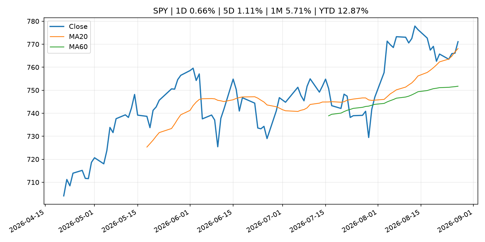
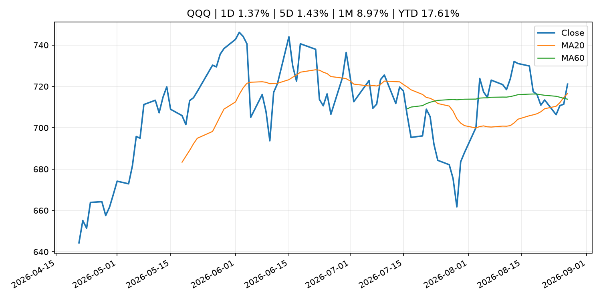
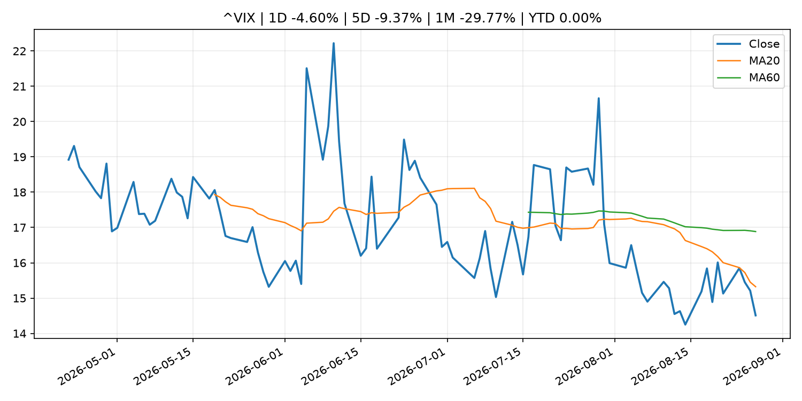
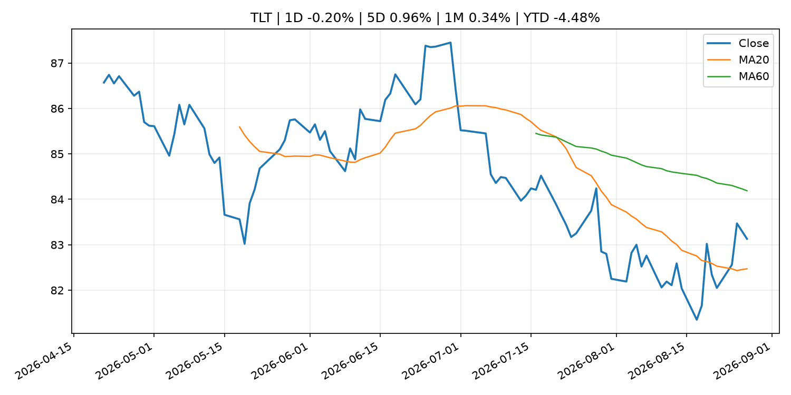
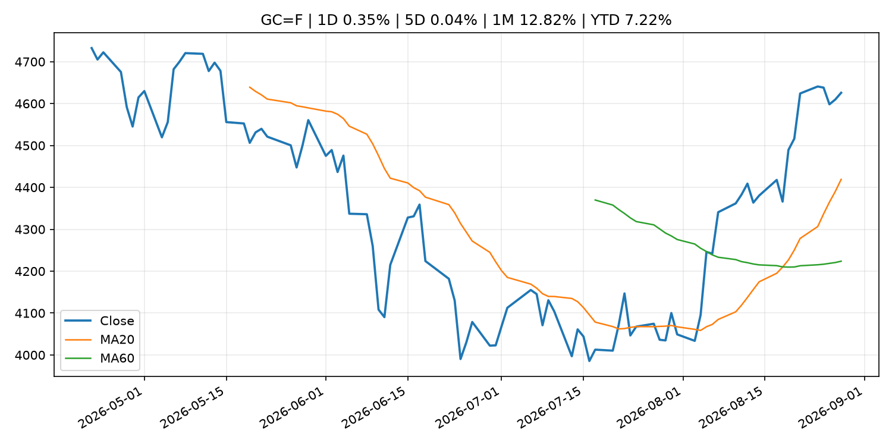
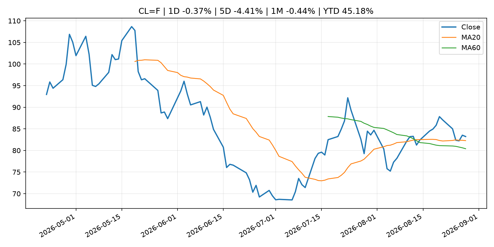
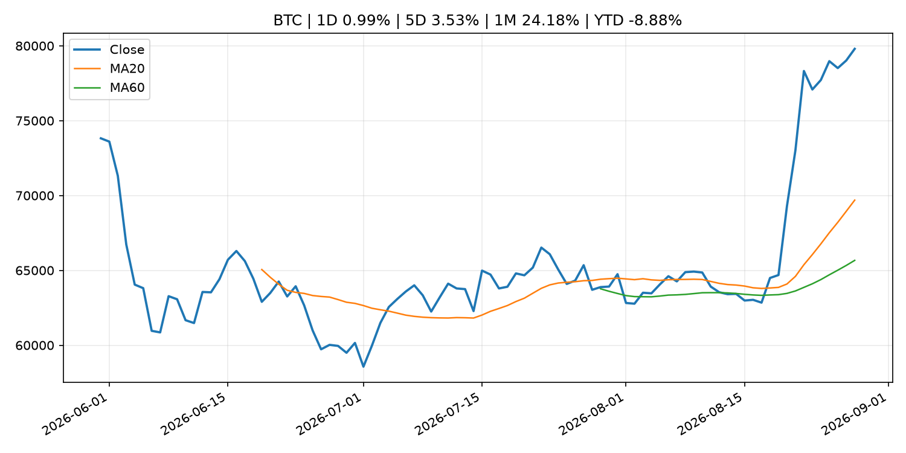
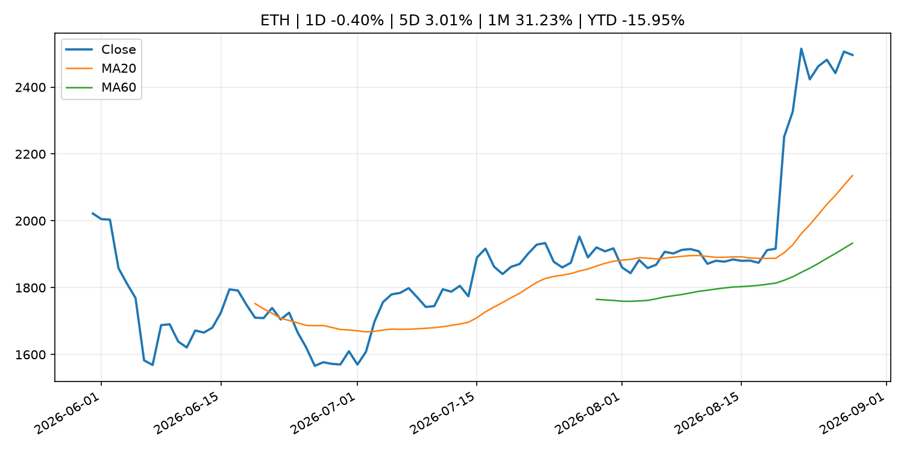
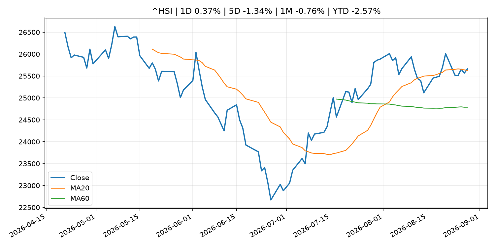

# Global Macro Morning Briefing - 2026-08-28

> Not financial advice / 非投资建议。

## 0. 今日总览
- 市场状态：risk_on。股指上涨、波动率或美元回落，市场更接近风险偏好改善。
- 今日三大主线：
  1. central_bank_decision: Kansas City Fed's Schmid says inflation 'stubborn' and 'sticky,' policy rate not restrictive
  2. earnings: Is Nvidia heading for $1 trillion in annual revenue? One analyst now thinks that’s possible.
  3. earnings: Nvidia shares surge 8% on earnings beat, lifting technology stocks and bitcoin
- 一句话结论：今日晨报重点关注：央行决策会重定价利率、汇率、久期资产和风险资产。；大型科技股盈利和资本开支会影响纳指、半导体和 AI 交易主线。。跨资产方面，SPY 1D 0.66%；QQQ 1D 1.37%；^VIX 1D -4.60%；TLT 1D -0.20%；GC=F 1D 0.35%；CL=F 1D -0.37%；BTC 1D 0.99%；ETH 1D -0.40%；股指上涨、波动率或美元回落，市场更接近风险偏好改善。政策、通胀、利率、美元、美债、能源和加密监管仍是主要观察线索。所有结论仅基于公开数据与短摘要整理，不构成投资建议。

## 1. 隔夜跨资产市场
- 美股：SPY 1D 0.66%，QQQ 1D 1.37%，整体趋势需结合 VIX 和利率确认。
- 美债/美元：TLT 1D -0.20%，美元指数 1D 0.04%，是判断折现率压力的核心线索。
- 黄金/原油：黄金 1D 0.35%，原油 1D -0.37%，用于观察避险、通胀和地缘风险。
- 加密：BTC 1D 0.99%，ETH 1D -0.40%，关注是否独立于纳指走出加密自身行情。
- 港股/A股：恒生 1D 0.37%，沪深300/上证 1D n/a，重点看中国政策预期与人民币线索。
- 风险观察：确认风险偏好是否扩散到小盘股、信用利差和周期品。

### US_EQUITY

| symbol | latest close | 1D | 5D | 1M | YTD | trend |
|---|---:|---:|---:|---:|---:|---|
| SPY | 771.10 | 0.66% | 1.11% | 5.71% | 12.87% | uptrend |
| QQQ | 721.11 | 1.37% | 1.43% | 8.97% | 17.61% | uptrend |
| DIA | 535.22 | 0.19% | 1.46% | 3.84% | 10.67% | uptrend |
| IWM | 299.81 | 0.29% | 0.72% | 3.90% | 20.51% | range_bound |
| VTI | 380.63 | 0.63% | 1.08% | 5.61% | 13.18% | uptrend |

### US_MACRO_MARKET

| symbol | latest close | 1D | 5D | 1M | YTD | trend |
|---|---:|---:|---:|---:|---:|---|
| ^VIX | 14.51 | -4.60% | -9.37% | -29.77% | 0.00% | downtrend |
| DX-Y.NYB | 99.20 | 0.04% | 0.40% | -0.81% | 0.79% | downtrend |
| TLT | 83.13 | -0.20% | 0.96% | 0.34% | -4.48% | range_bound |
| IEF | 93.23 | -0.10% | 0.25% | 0.06% | -2.97% | range_bound |

### COMMODITIES

| symbol | latest close | 1D | 5D | 1M | YTD | trend |
|---|---:|---:|---:|---:|---:|---|
| GC=F | 4,625.80 | 0.35% | 0.04% | 12.82% | 7.22% | strong_uptrend |
| SI=F | 69.49 | 0.08% | 0.03% | 18.14% | -1.52% | strong_uptrend |
| CL=F | 83.22 | -0.37% | -4.41% | -0.44% | 45.18% | uptrend |
| BZ=F | 88.33 | -1.53% | -6.42% | -0.79% | 45.40% | uptrend |
| NG=F | 2.92 | 0.34% | 5.19% | 5.77% | -19.38% | range_bound |
| HG=F | 6.68 | 1.48% | 1.60% | 3.72% | 18.52% | strong_uptrend |

### HK_MARKET

| symbol | latest close | 1D | 5D | 1M | YTD | trend |
|---|---:|---:|---:|---:|---:|---|
| ^HSI | 25,661.28 | 0.37% | -1.34% | -0.76% | -2.57% | uptrend |
| 0700.HK | 457.00 | 2.05% | 0.00% | -3.14% | -26.65% | range_bound |
| 9988.HK | 114.10 | -1.21% | -7.24% | 2.06% | -23.42% | range_bound |
| 3690.HK | 77.75 | 0.32% | -8.53% | -16.08% | -25.67% | range_bound |
| 1810.HK | 28.02 | 1.97% | -3.45% | -9.73% | -30.44% | uptrend |
| 1211.HK | 92.55 | 1.42% | -0.64% | -2.37% | -6.28% | uptrend |

### CRYPTO

| symbol | latest close | 1D | 5D | 1M | YTD | trend |
|---|---:|---:|---:|---:|---:|---|
| BTC | 79,798.81 | 0.99% | 3.53% | 24.18% | -8.88% | strong_uptrend |
| ETH | 2,496.25 | -0.40% | 3.01% | 31.23% | -15.95% | strong_uptrend |
| SOLANA | 107.24 | 5.08% | 14.22% | 47.65% | -13.88% | strong_uptrend |
| BINANCECOIN | 712.35 | 0.69% | 2.44% | 20.39% | -17.43% | strong_uptrend |
| RIPPLE | 1.42 | 0.04% | -2.78% | 37.65% | -22.68% | strong_uptrend |
| DOGECOIN | 0.09 | 0.16% | -4.50% | 27.24% | -25.24% | strong_uptrend |

## 2. 今日最重要的 10 条新闻
### 1. Kansas City Fed's Schmid says inflation 'stubborn' and 'sticky,' policy rate not restrictive
- 来源：CNBC Economy
- 时间：2026-08-27T14:11:29+00:00
- 地区：US
- 事件类型：central_bank_decision
- 重要性层级：Tier 1
- 一句话摘要：The policymaker stopped just short of calling for an interest rate hike.
- 为什么重要：央行决策会重定价利率、汇率、久期资产和风险资产。
- 可能影响：主要影响 DXY，方向为 positive，强度 high；通胀压力可能推高政策利率预期并支撑美元。
  - 资产：DXY
    方向：positive
    强度：high
    原因：通胀压力可能推高政策利率预期并支撑美元。
  - 资产：TLT
    方向：negative
    强度：high
    原因：通胀上行通常推升收益率、压低长债价格。
  - 资产：QQQ
    方向：negative
    强度：high
    原因：更高利率对成长股估值折现率不利。
  - 资产：SPY
    方向：mixed
    强度：medium
    原因：名义增长可能支撑收入，但更高利率压制估值。
  - 资产：GC=F
    方向：mixed
    强度：medium
    原因：通胀对黄金是支撑，但实际利率上行会形成压力。
  - 资产：BTC
    方向：negative
    强度：high
    原因：流动性收紧通常压制高 beta 加密资产。
- 原文链接：[https://www.cnbc.com/2026/08/27/kansas-city-feds-schmid-says-inflation-stubborn-and-sticky-policy-rate-not-restrictive.html](https://www.cnbc.com/2026/08/27/kansas-city-feds-schmid-says-inflation-stubborn-and-sticky-policy-rate-not-restrictive.html)

### 2. Is Nvidia heading for $1 trillion in annual revenue? One analyst now thinks that’s possible.
- 来源：MarketWatch Top Stories
- 时间：2026-08-27T23:05:00+00:00
- 地区：US
- 事件类型：earnings
- 重要性层级：Tier 2
- 一句话摘要：Nvidia’s stock soars higher after earnings.
- 为什么重要：大型科技股盈利和资本开支会影响纳指、半导体和 AI 交易主线。
- 可能影响：主要影响 QQQ，方向为 mixed，强度 high；AI 资本开支会影响大型科技股盈利和估值预期。
  - 资产：QQQ
    方向：mixed
    强度：high
    原因：AI 资本开支会影响大型科技股盈利和估值预期。
  - 资产：SMH
    方向：mixed
    强度：high
    原因：AI 投资周期直接影响半导体需求。
  - 资产：NVDA
    方向：mixed
    强度：high
    原因：AI 训练和推理需求是英伟达收入预期核心变量。
  - 资产：MSFT
    方向：mixed
    强度：medium
    原因：云和 AI 资本开支影响利润率与增长叙事。
  - 资产：GOOGL
    方向：mixed
    强度：medium
    原因：AI 投资和搜索商业化影响估值。
  - 资产：META
    方向：mixed
    强度：medium
    原因：AI 基建支出与广告效率共同影响市场预期。
- 原文链接：[https://www.marketwatch.com/story/nvidia-stock-is-climbing-after-another-set-of-blockbuster-results-heres-what-wall-street-is-saying-a2260a62?mod=mw_rss_topstories](https://www.marketwatch.com/story/nvidia-stock-is-climbing-after-another-set-of-blockbuster-results-heres-what-wall-street-is-saying-a2260a62?mod=mw_rss_topstories)

### 3. Nvidia shares surge 8% on earnings beat, lifting technology stocks and bitcoin
- 来源：CoinDesk
- 时间：2026-08-27T09:19:26+00:00
- 地区：global
- 事件类型：earnings
- 重要性层级：Tier 2
- 一句话摘要：Nvidia shares surge 8% on earnings beat, lifting technology stocks and bitcoin
- 为什么重要：大型科技股盈利和资本开支会影响纳指、半导体和 AI 交易主线。
- 可能影响：主要影响 QQQ，方向为 mixed，强度 high；AI 资本开支会影响大型科技股盈利和估值预期。
  - 资产：QQQ
    方向：mixed
    强度：high
    原因：AI 资本开支会影响大型科技股盈利和估值预期。
  - 资产：SMH
    方向：mixed
    强度：high
    原因：AI 投资周期直接影响半导体需求。
  - 资产：NVDA
    方向：mixed
    强度：high
    原因：AI 训练和推理需求是英伟达收入预期核心变量。
  - 资产：MSFT
    方向：mixed
    强度：medium
    原因：云和 AI 资本开支影响利润率与增长叙事。
  - 资产：GOOGL
    方向：mixed
    强度：medium
    原因：AI 投资和搜索商业化影响估值。
  - 资产：META
    方向：mixed
    强度：medium
    原因：AI 基建支出与广告效率共同影响市场预期。
- 原文链接：[https://www.coindesk.com/markets/2026/08/27/nvidia-shares-surge-8-on-earnings-beat-lifting-technology-stocks-and-bitcoin](https://www.coindesk.com/markets/2026/08/27/nvidia-shares-surge-8-on-earnings-beat-lifting-technology-stocks-and-bitcoin)

### 4. SEC: 38 Entities Feigned Legitimacy as U.S. Advisers Through False Filings to Lure Retail Investors
- 来源：SEC Press Releases
- 时间：2026-08-27T17:30:00-04:00
- 地区：US
- 事件类型：regulation
- 重要性层级：Tier 2
- 一句话摘要：The Securities and Exchange Commission today charged 38 entities alleging that they made material misrepresentations in Forms ADV filed with the Commission between 2025 and 2026 to falsely portray themselves as legitimate advisory firms to U.S. investors…
- 为什么重要：监管变化会改变行业盈利预期和资产风险溢价。
- 可能影响：主要影响 BTC，方向为 mixed，强度 high；加密监管或 ETF 进展会改变 BTC 的资金流和风险溢价。
  - 资产：BTC
    方向：mixed
    强度：high
    原因：加密监管或 ETF 进展会改变 BTC 的资金流和风险溢价。
  - 资产：ETH
    方向：mixed
    强度：high
    原因：监管框架会影响 ETH 产品化和机构参与度。
  - 资产：COIN
    方向：mixed
    强度：medium
    原因：监管清晰度和执法风险会影响交易平台估值。
  - 资产：crypto market
    方向：mixed
    强度：high
    原因：信息影响整个加密市场结构，但方向取决于细节。
- 原文链接：[https://www.sec.gov/newsroom/press-releases/2026-78-sec-38-entities-feigned-legitimacy-us-advisers-through-false-filings-lure-retail-investors](https://www.sec.gov/newsroom/press-releases/2026-78-sec-38-entities-feigned-legitimacy-us-advisers-through-false-filings-lure-retail-investors)

### 5. Federal Reserve Board issues enforcement action with former employee of Banco Popular de Puerto Rico
- 来源：Federal Reserve Press Releases
- 时间：2026-08-27T15:00:00+00:00
- 地区：US
- 事件类型：regulation
- 重要性层级：Tier 2
- 一句话摘要：Federal Reserve Board issues enforcement action with former employee of Banco Popular de Puerto Rico
- 为什么重要：监管变化会改变行业盈利预期和资产风险溢价。
- 可能影响：可能影响利率、汇率、风险资产或大宗商品预期，但当前公开信息不足以判断明确方向。
  - 资产：暂无明确资产映射
  - 方向：unknown
  - 强度：low
  - 原因：公开信息不足以判断方向。
- 原文链接：[https://www.federalreserve.gov/newsevents/pressreleases/enforcement20260827a.htm](https://www.federalreserve.gov/newsevents/pressreleases/enforcement20260827a.htm)

### 6. CrowdStrike’s stock jumps after record-breaking earnings. Wall Street is lapping it up.
- 来源：MarketWatch Top Stories
- 时间：2026-08-27T22:53:00+00:00
- 地区：US
- 事件类型：earnings
- 重要性层级：Tier 2
- 一句话摘要：A number of Wall Street banks, including Jefferies, raised their price targets for the cybersecurity’s stock following its record-breaking results.
- 为什么重要：大型科技股盈利和资本开支会影响纳指、半导体和 AI 交易主线。
- 可能影响：可能影响利率、汇率、风险资产或大宗商品预期，但当前公开信息不足以判断明确方向。
  - 资产：暂无明确资产映射
  - 方向：unknown
  - 强度：low
  - 原因：公开信息不足以判断方向。
- 原文链接：[https://www.marketwatch.com/story/crowdstrikes-stock-has-jumped-after-record-breaking-earnings-wall-street-is-lapping-it-up-dbdaca83?mod=mw_rss_topstories](https://www.marketwatch.com/story/crowdstrikes-stock-has-jumped-after-record-breaking-earnings-wall-street-is-lapping-it-up-dbdaca83?mod=mw_rss_topstories)

### 7. Salesforce’s stock rockets 20% and gives the software sector a major lift
- 来源：MarketWatch Top Stories
- 时间：2026-08-27T22:51:00+00:00
- 地区：US
- 事件类型：earnings
- 重要性层级：Tier 2
- 一句话摘要：Salesforce’s earnings showed that AI isn’t killing traditional software, and that the operators of major AI models are willing to strike partnerships with legacy vendors.
- 为什么重要：大型科技股盈利和资本开支会影响纳指、半导体和 AI 交易主线。
- 可能影响：可能影响利率、汇率、风险资产或大宗商品预期，但当前公开信息不足以判断明确方向。
  - 资产：暂无明确资产映射
  - 方向：unknown
  - 强度：low
  - 原因：公开信息不足以判断方向。
- 原文链接：[https://www.marketwatch.com/story/salesforce-stock-is-jumping-what-wall-street-is-saying-about-its-earnings-and-its-anthropic-relationship-853ada85?mod=mw_rss_topstories](https://www.marketwatch.com/story/salesforce-stock-is-jumping-what-wall-street-is-saying-about-its-earnings-and-its-anthropic-relationship-853ada85?mod=mw_rss_topstories)

### 8. Speech by Deputy Governor HIMINO in Saitama (Japan's Economy and Monetary Policy)
- 来源：Bank of Japan Announcements
- 时间：2026-08-27T10:35:00+09:00
- 地区：Japan
- 事件类型：central_bank_speech
- 重要性层级：Tier 2
- 一句话摘要：Speech by Deputy Governor HIMINO in Saitama (Japan's Economy and Monetary Policy)
- 为什么重要：央行官员表态可能影响市场对下一次会议的定价。
- 可能影响：可能影响利率、汇率、风险资产或大宗商品预期，但当前公开信息不足以判断明确方向。
  - 资产：暂无明确资产映射
  - 方向：unknown
  - 强度：low
  - 原因：公开信息不足以判断方向。
- 原文链接：[http://www.boj.or.jp/en/about/press/koen_2026/ko260827a.htm](http://www.boj.or.jp/en/about/press/koen_2026/ko260827a.htm)

### 9. Bitcoin tests its largest supply wall at $80,000, near ETF holders’ average price
- 来源：CoinDesk
- 时间：2026-08-27T10:54:24+00:00
- 地区：global
- 事件类型：other
- 重要性层级：Tier 3
- 一句话摘要：Bitcoin tests its largest supply wall at $80,000, near ETF holders’ average price
- 为什么重要：这条信息暂未匹配到重大宏观、政策或市场事件，更适合作为背景跟踪。
- 可能影响：主要影响 BTC，方向为 mixed，强度 high；加密监管或 ETF 进展会改变 BTC 的资金流和风险溢价。
  - 资产：BTC
    方向：mixed
    强度：high
    原因：加密监管或 ETF 进展会改变 BTC 的资金流和风险溢价。
  - 资产：ETH
    方向：mixed
    强度：high
    原因：监管框架会影响 ETH 产品化和机构参与度。
  - 资产：COIN
    方向：mixed
    强度：medium
    原因：监管清晰度和执法风险会影响交易平台估值。
  - 资产：crypto market
    方向：mixed
    强度：high
    原因：信息影响整个加密市场结构，但方向取决于细节。
- 原文链接：[https://www.coindesk.com/markets/2026/08/27/bitcoin-tests-its-largest-supply-wall-at-usd80-000-near-etf-holders-average-price](https://www.coindesk.com/markets/2026/08/27/bitcoin-tests-its-largest-supply-wall-at-usd80-000-near-etf-holders-average-price)

### 10. Bitcoin steadies above $79,000 as ETF inflows hit longest streak since April
- 来源：CoinDesk
- 时间：2026-08-27T10:31:21+00:00
- 地区：global
- 事件类型：other
- 重要性层级：Tier 3
- 一句话摘要：Bitcoin steadies above $79,000 as ETF inflows hit longest streak since April
- 为什么重要：这条信息暂未匹配到重大宏观、政策或市场事件，更适合作为背景跟踪。
- 可能影响：主要影响 BTC，方向为 mixed，强度 high；加密监管或 ETF 进展会改变 BTC 的资金流和风险溢价。
  - 资产：BTC
    方向：mixed
    强度：high
    原因：加密监管或 ETF 进展会改变 BTC 的资金流和风险溢价。
  - 资产：ETH
    方向：mixed
    强度：high
    原因：监管框架会影响 ETH 产品化和机构参与度。
  - 资产：COIN
    方向：mixed
    强度：medium
    原因：监管清晰度和执法风险会影响交易平台估值。
  - 资产：crypto market
    方向：mixed
    强度：high
    原因：信息影响整个加密市场结构，但方向取决于细节。
- 原文链接：[https://www.coindesk.com/markets/2026/08/27/bitcoin-steadies-above-usd79-000-as-etf-inflows-hit-longest-streak-since-april](https://www.coindesk.com/markets/2026/08/27/bitcoin-steadies-above-usd79-000-as-etf-inflows-hit-longest-streak-since-april)

## 3. 政策与央行观察
### 1. Kansas City Fed's Schmid says inflation 'stubborn' and 'sticky,' policy rate not restrictive
- 来源：CNBC Economy
- 时间：2026-08-27T14:11:29+00:00
- 地区：US
- 事件类型：central_bank_decision
- 重要性层级：Tier 1
- 一句话摘要：The policymaker stopped just short of calling for an interest rate hike.
- 为什么重要：央行决策会重定价利率、汇率、久期资产和风险资产。
- 可能影响：主要影响 DXY，方向为 positive，强度 high；通胀压力可能推高政策利率预期并支撑美元。
  - 资产：DXY
    方向：positive
    强度：high
    原因：通胀压力可能推高政策利率预期并支撑美元。
  - 资产：TLT
    方向：negative
    强度：high
    原因：通胀上行通常推升收益率、压低长债价格。
  - 资产：QQQ
    方向：negative
    强度：high
    原因：更高利率对成长股估值折现率不利。
  - 资产：SPY
    方向：mixed
    强度：medium
    原因：名义增长可能支撑收入，但更高利率压制估值。
  - 资产：GC=F
    方向：mixed
    强度：medium
    原因：通胀对黄金是支撑，但实际利率上行会形成压力。
  - 资产：BTC
    方向：negative
    强度：high
    原因：流动性收紧通常压制高 beta 加密资产。
- 原文链接：[https://www.cnbc.com/2026/08/27/kansas-city-feds-schmid-says-inflation-stubborn-and-sticky-policy-rate-not-restrictive.html](https://www.cnbc.com/2026/08/27/kansas-city-feds-schmid-says-inflation-stubborn-and-sticky-policy-rate-not-restrictive.html)

### 2. SEC: 38 Entities Feigned Legitimacy as U.S. Advisers Through False Filings to Lure Retail Investors
- 来源：SEC Press Releases
- 时间：2026-08-27T17:30:00-04:00
- 地区：US
- 事件类型：regulation
- 重要性层级：Tier 2
- 一句话摘要：The Securities and Exchange Commission today charged 38 entities alleging that they made material misrepresentations in Forms ADV filed with the Commission between 2025 and 2026 to falsely portray themselves as legitimate advisory firms to U.S. investors…
- 为什么重要：监管变化会改变行业盈利预期和资产风险溢价。
- 可能影响：主要影响 BTC，方向为 mixed，强度 high；加密监管或 ETF 进展会改变 BTC 的资金流和风险溢价。
  - 资产：BTC
    方向：mixed
    强度：high
    原因：加密监管或 ETF 进展会改变 BTC 的资金流和风险溢价。
  - 资产：ETH
    方向：mixed
    强度：high
    原因：监管框架会影响 ETH 产品化和机构参与度。
  - 资产：COIN
    方向：mixed
    强度：medium
    原因：监管清晰度和执法风险会影响交易平台估值。
  - 资产：crypto market
    方向：mixed
    强度：high
    原因：信息影响整个加密市场结构，但方向取决于细节。
- 原文链接：[https://www.sec.gov/newsroom/press-releases/2026-78-sec-38-entities-feigned-legitimacy-us-advisers-through-false-filings-lure-retail-investors](https://www.sec.gov/newsroom/press-releases/2026-78-sec-38-entities-feigned-legitimacy-us-advisers-through-false-filings-lure-retail-investors)

### 3. Federal Reserve Board issues enforcement action with former employee of Banco Popular de Puerto Rico
- 来源：Federal Reserve Press Releases
- 时间：2026-08-27T15:00:00+00:00
- 地区：US
- 事件类型：regulation
- 重要性层级：Tier 2
- 一句话摘要：Federal Reserve Board issues enforcement action with former employee of Banco Popular de Puerto Rico
- 为什么重要：监管变化会改变行业盈利预期和资产风险溢价。
- 可能影响：可能影响利率、汇率、风险资产或大宗商品预期，但当前公开信息不足以判断明确方向。
  - 资产：暂无明确资产映射
  - 方向：unknown
  - 强度：low
  - 原因：公开信息不足以判断方向。
- 原文链接：[https://www.federalreserve.gov/newsevents/pressreleases/enforcement20260827a.htm](https://www.federalreserve.gov/newsevents/pressreleases/enforcement20260827a.htm)

### 4. Speech by Deputy Governor HIMINO in Saitama (Japan's Economy and Monetary Policy)
- 来源：Bank of Japan Announcements
- 时间：2026-08-27T10:35:00+09:00
- 地区：Japan
- 事件类型：central_bank_speech
- 重要性层级：Tier 2
- 一句话摘要：Speech by Deputy Governor HIMINO in Saitama (Japan's Economy and Monetary Policy)
- 为什么重要：央行官员表态可能影响市场对下一次会议的定价。
- 可能影响：可能影响利率、汇率、风险资产或大宗商品预期，但当前公开信息不足以判断明确方向。
  - 资产：暂无明确资产映射
  - 方向：unknown
  - 强度：low
  - 原因：公开信息不足以判断方向。
- 原文链接：[http://www.boj.or.jp/en/about/press/koen_2026/ko260827a.htm](http://www.boj.or.jp/en/about/press/koen_2026/ko260827a.htm)

## 4. 市场异动与图表
- SPY 上涨 0.66%
- QQQ 上涨 1.37%
- VIX 下跌 -4.60%

### SPY

### QQQ

### ^VIX

### TLT

### GC=F

### CL=F

### BTC

### ETH

### ^HSI

## 5. 华尔街与机构公开观点
- 暂无可靠公开观点。

## 6. 今日重点关注
- 经济数据：经济数据：暂无可靠公开日历数据；如配置经济日历源后可自动填充。
- 央行讲话：央行讲话：暂无可靠公开日历数据；重点跟踪 Fed、ECB、BoJ、PBOC 官网 RSS。
- 财报：财报：暂无可靠数据。
- 政策事件：政策事件：暂无可靠数据。
- 风险提醒：风险提醒：关注数据源失败项、突发地缘风险、利率和美元的二阶反应。

## 7. 英文金融表达与宏观概念
- **inflation expectations**：通胀预期，指家庭、企业或市场对未来通胀的预估。 例句：Inflation expectations can shape wage bargaining and bond yields.
- **real yield**：实际收益率，名义利率扣除通胀预期后的收益率。 例句：Gold often reacts more to real yields than nominal yields.
- **terminal rate**：终端利率，市场预期本轮加息周期的最高政策利率。 例句：A higher terminal rate can pressure growth stocks.
- **risk-off**：避险模式，资金偏向美元、国债、黄金等防御资产。 例句：A geopolitical shock can push markets into risk-off mode.
- **market structure**：市场结构，指交易、托管、清算、ETF、监管等制度安排。 例句：Crypto market structure rules can affect institutional participation.
- **AI capex**：AI 资本开支，指云厂商和科技公司投入 AI 基建的支出。 例句：AI capex guidance can move semiconductor stocks.

## 8. 背景材料
- [Bitcoin is trading at a premium on Coinbase after a long time. Here's what it means](https://www.coindesk.com/markets/2026/08/28/bitcoin-is-trading-at-a-premium-on-coinbase-after-a-long-time)（CoinDesk，other）：Bitcoin is trading at a premium on Coinbase after a long time. Here's what it means
- [(BOJ Review) Expanding and Revising the Application of Hedonic Quality Adjustment in the Corporate Goods Price Index](http://www.boj.or.jp/en/research/wps_rev/rev_2026/rev26e11.htm)（Bank of Japan Announcements，other）：(BOJ Review) Expanding and Revising the Application of Hedonic Quality Adjustment in the Corporate Goods Price Index
- [Bitcoin under $80,000, solana leads majors higher before Warsh's Jackson Hole debut](https://www.coindesk.com/markets/2026/08/28/bitcoin-holds-usd80-000-solana-leads-majors-higher-before-warsh-s-jackson-hole-debut)（CoinDesk，other）：Bitcoin under $80,000, solana leads majors higher before Warsh's Jackson Hole debut
- [An XRP treasury company backed by Ripple is a shareholder vote away from Nasdaq](https://www.coindesk.com/markets/2026/08/28/an-xrp-treasury-company-backed-by-ripple-is-a-shareholder-vote-away-from-nasdaq)（CoinDesk，other）：An XRP treasury company backed by Ripple is a shareholder vote away from Nasdaq
- [Polish Olympic chief arrested as prosecutors probe suspected crypto-linked bribe](https://www.coindesk.com/business/2026/08/27/polish-olympic-chief-arrested-as-prosecutors-probe-suspected-crypto-linked-bribe)（CoinDesk，other）：Polish Olympic chief arrested as prosecutors probe suspected crypto-linked bribe
- [AI bug reports trigger emergency warning for Bitcoin Lightning node operators](https://www.coindesk.com/tech/2026/08/27/ai-bug-reports-trigger-emergency-warning-for-bitcoin-lightning-node-operators)（CoinDesk，other）：AI bug reports trigger emergency warning for Bitcoin Lightning node operators
- [Meeting of 22-23 July 2026](https://www.ecb.europa.eu//press/accounts/2026/html/ecb.mg260827~f06c21fd54.en.html)（ECB Press Releases，other）：Meeting of 22-23 July 2026
- [Bitcoin experts prefer this defined-risk strategy for the next leg higher in prices](https://www.coindesk.com/daybook-us/2026/08/27/bitcoin-experts-prefer-this-defined-risk-strategy-for-the-next-leg-higher-in-prices)（CoinDesk，other）：Bitcoin experts prefer this defined-risk strategy for the next leg higher in prices
- [Bitcoin tests its largest supply wall at $80,000, near ETF holders’ average price](https://www.coindesk.com/markets/2026/08/27/bitcoin-tests-its-largest-supply-wall-at-usd80-000-near-etf-holders-average-price)（CoinDesk，other）：Bitcoin tests its largest supply wall at $80,000, near ETF holders’ average price
- [Unstoppable Domains drops $2 million plan to bring .crypto and .bitcoin to standard internet](https://www.coindesk.com/web3/2026/08/27/unstoppable-domains-drops-usd2-million-plan-to-bring-crypto-and-bitcoin-to-standard-internet)（CoinDesk，other）：Unstoppable Domains drops $2 million plan to bring .crypto and .bitcoin to standard internet
- [Bitcoin steadies above $79,000 as ETF inflows hit longest streak since April](https://www.coindesk.com/markets/2026/08/27/bitcoin-steadies-above-usd79-000-as-etf-inflows-hit-longest-streak-since-april)（CoinDesk，other）：Bitcoin steadies above $79,000 as ETF inflows hit longest streak since April
- [Bitfinex Securities raises $50 million in push to offer tokenized nickel trading](https://www.coindesk.com/business/2026/08/27/bitfinex-securities-raises-usd50-million-in-push-to-offer-tokenized-nickel-trading)（CoinDesk，other）：Bitfinex Securities raises $50 million in push to offer tokenized nickel trading
- [BlackRock's Mitchnick says macro case for bitcoin is strengthening after record trading in positive week](https://www.coindesk.com/markets/2026/08/27/blackrock-s-mitchnick-says-macro-case-for-bitcoin-is-strengthening-after-record-trading-in-positive-week)（CoinDesk，other）：BlackRock's Mitchnick says macro case for bitcoin is strengthening after record trading in positive week
- [Britain plans new Bank of England objective for stablecoins](https://www.coindesk.com/policy/2026/08/27/britain-plans-new-bank-of-england-objective-for-stablecoins)（CoinDesk，other）：Britain plans new Bank of England objective for stablecoins
- [Live updates: Bitcoin trades near $80,000 as stocks close with gains](https://www.coindesk.com/business/2026/08/27/live-updates-bitcoin-etf-inflows-hit-eight-straight-days-as-august-tops-usd3-billion)（CoinDesk，other）：Live updates: Bitcoin trades near $80,000 as stocks close with gains
- [Bitcoin researchers propose quantum fix that would not crowd out transactions](https://www.coindesk.com/tech/2026/08/27/bitcoin-researchers-propose-quantum-fix-that-would-not-crowd-out-transactions)（CoinDesk，other）：Bitcoin researchers propose quantum fix that would not crowd out transactions
- [Piero Cipollone: From vision to delivery: building Europe’s tokenised financial market](https://www.ecb.europa.eu//press/key/date/2026/html/ecb.sp260826~3641116314.en.html)（ECB Press Releases，other）：Piero Cipollone: From vision to delivery: building Europe’s tokenised financial market

## 9. 数据源、失败项与免责声明
- 采集时间：2026-08-28T05:58:29
- 数据源：公开 RSS、Yahoo Finance、CoinGecko、AKShare、FRED、SEC data.sec.gov，以及用户自有 inputs/reports 文件。
- 合规说明：不绕过 WSJ、Bloomberg、FT、Reuters 等付费墙；对付费媒体只使用公开 RSS 标题、摘要、链接和发布时间。
- 免责声明：Not financial advice / 非投资建议。本项目仅供个人学习、研究和信息整理，不构成投资建议、交易建议或任何收益承诺。
- 失败或跳过的数据源：
  - China market data failed symbol=上证指数: empty dataframe
  - China market data failed symbol=深证成指: empty dataframe
  - China market data failed symbol=创业板指: empty dataframe
  - China market data failed symbol=沪深300: empty dataframe
  - China market data failed symbol=中证500: empty dataframe
  - China market data failed symbol=科创50: empty dataframe
  - FRED_API_KEY not set; skipping FRED macro series
  - SEC failed cik=0000320193
  - SEC failed cik=0000789019
  - SEC failed cik=0001045810
  - SEC failed cik=0001318605
  - SEC failed cik=0001577552
