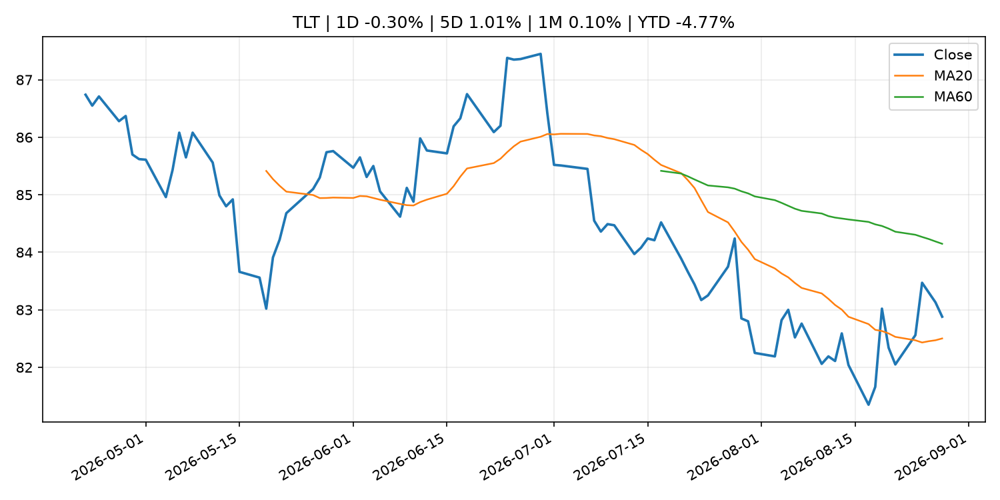
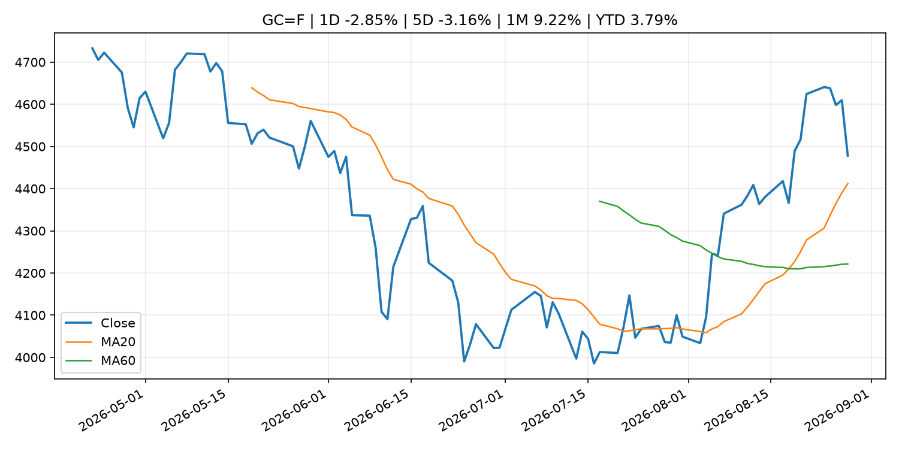
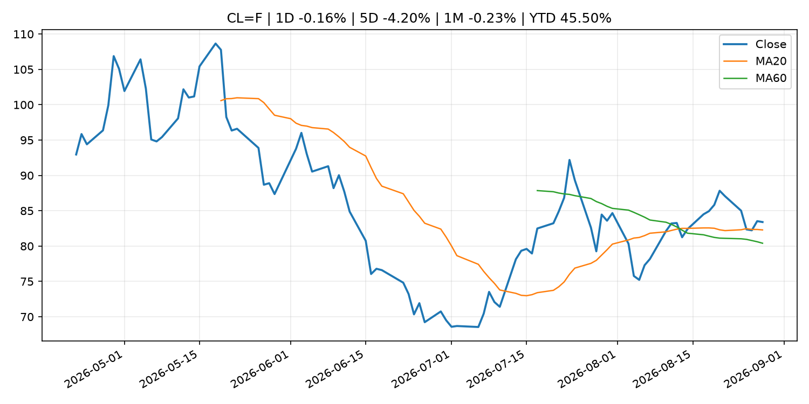
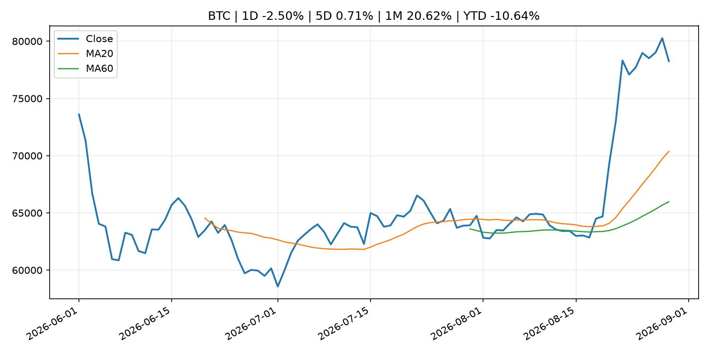
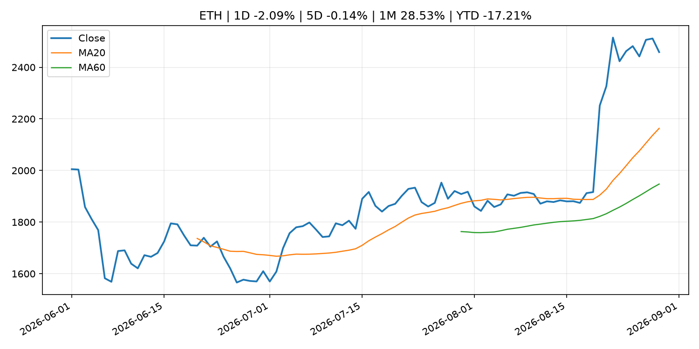
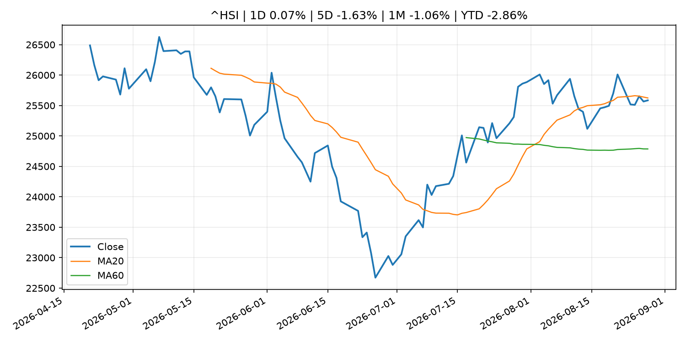

# Global Macro Morning Briefing - 2026-08-30

> Not financial advice / 非投资建议。

## 0. 今日总览
- 市场状态：rates_shock。长债下跌、美元走强且成长股承压，市场像是在交易利率冲击。
- 今日三大主线：
  1. central_bank_decision: September Fed decision is now a coin flip as rate hike odds increase post Warsh
  2. central_bank_speech: Fed Chair Kevin Warsh at Jackson Hole: 'We have work to do' on inflation
  3. crypto_market_structure: The next trillion-dollar currency may not be a stablecoin — it might not even have a name yet
- 一句话结论：今日晨报重点关注：央行决策会重定价利率、汇率、久期资产和风险资产。；央行官员表态可能影响市场对下一次会议的定价。。跨资产方面，SPY 1D -0.23%；QQQ 1D -0.65%；^VIX 1D -0.55%；TLT 1D -0.30%；GC=F 1D -2.85%；CL=F 1D -0.16%；BTC 1D -2.50%；ETH 1D -2.09%；长债下跌、美元走强且成长股承压，市场像是在交易利率冲击。政策、通胀、利率、美元、美债、能源和加密监管仍是主要观察线索。所有结论仅基于公开数据与短摘要整理，不构成投资建议。

## 1. 隔夜跨资产市场
- 美股：SPY 1D -0.23%，QQQ 1D -0.65%，整体趋势需结合 VIX 和利率确认。
- 美债/美元：TLT 1D -0.30%，美元指数 1D 0.54%，是判断折现率压力的核心线索。
- 黄金/原油：黄金 1D -2.85%，原油 1D -0.16%，用于观察避险、通胀和地缘风险。
- 加密：BTC 1D -2.50%，ETH 1D -2.09%，关注是否独立于纳指走出加密自身行情。
- 港股/A股：恒生 1D 0.07%，沪深300/上证 1D n/a，重点看中国政策预期与人民币线索。
- 风险观察：关注美债收益率、实际利率和成长股估值压力。

### US_EQUITY

| symbol | latest close | 1D | 5D | 1M | YTD | trend |
|---|---:|---:|---:|---:|---:|---|
| SPY | 769.35 | -0.23% | 0.47% | 3.73% | 12.61% | uptrend |
| QQQ | 716.43 | -0.65% | 0.42% | 4.81% | 16.85% | range_bound |
| DIA | 535.06 | -0.03% | 0.53% | 2.60% | 10.63% | range_bound |
| IWM | 295.75 | -1.35% | -1.40% | 1.08% | 18.88% | range_bound |
| VTI | 379.36 | -0.33% | 0.30% | 3.57% | 12.80% | range_bound |

### US_MACRO_MARKET

| symbol | latest close | 1D | 5D | 1M | YTD | trend |
|---|---:|---:|---:|---:|---:|---|
| ^VIX | 14.43 | -0.55% | -4.63% | -15.56% | -0.55% | strong_downtrend |
| DX-Y.NYB | 99.70 | 0.54% | 0.91% | -0.31% | 1.30% | range_bound |
| TLT | 82.88 | -0.30% | 1.01% | 0.10% | -4.77% | range_bound |
| IEF | 92.85 | -0.41% | 0.03% | -0.39% | -3.36% | downtrend |

### COMMODITIES

| symbol | latest close | 1D | 5D | 1M | YTD | trend |
|---|---:|---:|---:|---:|---:|---|
| GC=F | 4,478.10 | -2.85% | -3.16% | 9.22% | 3.79% | strong_uptrend |
| SI=F | 67.00 | -3.51% | -3.56% | 13.91% | -5.05% | strong_uptrend |
| CL=F | 83.40 | -0.16% | -4.20% | -0.23% | 45.50% | uptrend |
| BZ=F | 89.31 | -0.43% | -5.38% | 0.31% | 47.01% | uptrend |
| NG=F | 2.91 | 2.29% | 6.37% | 6.68% | -19.65% | range_bound |
| HG=F | 6.56 | -0.38% | -0.27% | 1.82% | 16.35% | range_bound |

### HK_MARKET

| symbol | latest close | 1D | 5D | 1M | YTD | trend |
|---|---:|---:|---:|---:|---:|---|
| ^HSI | 25,584.79 | 0.07% | -1.63% | -1.06% | -2.86% | range_bound |
| 0700.HK | 455.20 | 1.65% | -0.39% | -3.52% | -26.93% | range_bound |
| 9988.HK | 113.90 | -1.39% | -7.40% | 1.88% | -23.56% | range_bound |
| 3690.HK | 77.50 | 0.00% | -8.82% | -16.35% | -25.91% | range_bound |
| 1810.HK | 27.82 | 1.24% | -4.14% | -10.37% | -30.93% | uptrend |
| 1211.HK | 91.95 | 0.77% | -1.29% | -3.01% | -6.89% | uptrend |

### CRYPTO

| symbol | latest close | 1D | 5D | 1M | YTD | trend |
|---|---:|---:|---:|---:|---:|---|
| BTC | 78,261.01 | -2.50% | 0.71% | 20.62% | -10.64% | strong_uptrend |
| ETH | 2,458.85 | -2.09% | -0.14% | 28.53% | -17.21% | strong_uptrend |
| SOLANA | 105.73 | -3.16% | 10.82% | 43.62% | -15.09% | strong_uptrend |
| BINANCECOIN | 692.61 | -2.73% | -1.37% | 16.96% | -19.72% | strong_uptrend |
| RIPPLE | 1.40 | -3.94% | -8.16% | 36.82% | -24.13% | strong_uptrend |

## 2. 今日最重要的 10 条新闻
### 1. September Fed decision is now a coin flip as rate hike odds increase post Warsh
- 来源：CNBC Economy
- 时间：2026-08-28T15:22:10+00:00
- 地区：US
- 事件类型：central_bank_decision
- 重要性层级：Tier 1
- 一句话摘要：Odds rose after Warsh's speech in Jackson Hole, Wyo., where he discussed that he still is frustrated with the overall inflation trend.
- 为什么重要：央行决策会重定价利率、汇率、久期资产和风险资产。
- 可能影响：主要影响 DXY，方向为 positive，强度 high；通胀压力可能推高政策利率预期并支撑美元。
  - 资产：DXY
    方向：positive
    强度：high
    原因：通胀压力可能推高政策利率预期并支撑美元。
  - 资产：TLT
    方向：negative
    强度：high
    原因：通胀上行通常推升收益率、压低长债价格。
  - 资产：QQQ
    方向：negative
    强度：high
    原因：更高利率对成长股估值折现率不利。
  - 资产：SPY
    方向：mixed
    强度：medium
    原因：名义增长可能支撑收入，但更高利率压制估值。
  - 资产：GC=F
    方向：mixed
    强度：medium
    原因：通胀对黄金是支撑，但实际利率上行会形成压力。
  - 资产：BTC
    方向：negative
    强度：high
    原因：流动性收紧通常压制高 beta 加密资产。
- 原文链接：[https://www.cnbc.com/2026/08/28/-september-fed-decision-now-a-coin-flip-as-rate-hike-odds-increase.html](https://www.cnbc.com/2026/08/28/-september-fed-decision-now-a-coin-flip-as-rate-hike-odds-increase.html)

### 2. Fed Chair Kevin Warsh at Jackson Hole: 'We have work to do' on inflation
- 来源：CoinDesk
- 时间：2026-08-28T14:05:12+00:00
- 地区：global
- 事件类型：central_bank_speech
- 重要性层级：Tier 2
- 一句话摘要：Fed Chair Kevin Warsh at Jackson Hole: 'We have work to do' on inflation
- 为什么重要：央行官员表态可能影响市场对下一次会议的定价。
- 可能影响：主要影响 DXY，方向为 positive，强度 high；通胀压力可能推高政策利率预期并支撑美元。
  - 资产：DXY
    方向：positive
    强度：high
    原因：通胀压力可能推高政策利率预期并支撑美元。
  - 资产：TLT
    方向：negative
    强度：high
    原因：通胀上行通常推升收益率、压低长债价格。
  - 资产：QQQ
    方向：negative
    强度：high
    原因：更高利率对成长股估值折现率不利。
  - 资产：SPY
    方向：mixed
    强度：medium
    原因：名义增长可能支撑收入，但更高利率压制估值。
  - 资产：GC=F
    方向：mixed
    强度：medium
    原因：通胀对黄金是支撑，但实际利率上行会形成压力。
  - 资产：BTC
    方向：mixed
    强度：medium
    原因：抗通胀叙事和流动性收紧可能相互抵消。
- 原文链接：[https://www.coindesk.com/markets/2026/08/28/warsh-at-jackson-hole-we-have-work-to-do-on-inflaiton](https://www.coindesk.com/markets/2026/08/28/warsh-at-jackson-hole-we-have-work-to-do-on-inflaiton)

### 3. The next trillion-dollar currency may not be a stablecoin — it might not even have a name yet
- 来源：CoinDesk
- 时间：2026-08-29T15:00:00+00:00
- 地区：global
- 事件类型：crypto_market_structure
- 重要性层级：Tier 2
- 一句话摘要：The next trillion-dollar currency may not be a stablecoin — it might not even have a name yet
- 为什么重要：加密市场结构和监管变化会影响 BTC、ETH 及相关股票的风险溢价。
- 可能影响：主要影响 BTC，方向为 mixed，强度 high；加密监管或 ETF 进展会改变 BTC 的资金流和风险溢价。
  - 资产：BTC
    方向：mixed
    强度：high
    原因：加密监管或 ETF 进展会改变 BTC 的资金流和风险溢价。
  - 资产：ETH
    方向：mixed
    强度：high
    原因：监管框架会影响 ETH 产品化和机构参与度。
  - 资产：COIN
    方向：mixed
    强度：medium
    原因：监管清晰度和执法风险会影响交易平台估值。
  - 资产：crypto market
    方向：mixed
    强度：high
    原因：信息影响整个加密市场结构，但方向取决于细节。
- 原文链接：[https://www.coindesk.com/business/2026/08/29/the-next-trillion-dollar-currency-may-not-be-a-stablecoin-it-might-not-even-have-a-name-yet](https://www.coindesk.com/business/2026/08/29/the-next-trillion-dollar-currency-may-not-be-a-stablecoin-it-might-not-even-have-a-name-yet)

### 4. Live updates: Bitcoin slides below $78,000 as markets digest Warsh's hawkish remarks
- 来源：CoinDesk
- 时间：2026-08-28T09:09:07+00:00
- 地区：global
- 事件类型：central_bank_speech
- 重要性层级：Tier 2
- 一句话摘要：Live updates: Bitcoin slides below $78,000 as markets digest Warsh's hawkish remarks
- 为什么重要：央行官员表态可能影响市场对下一次会议的定价。
- 可能影响：主要影响 QQQ，方向为 negative，强度 high；鹰派政策提高折现率，压制成长股估值。
  - 资产：QQQ
    方向：negative
    强度：high
    原因：鹰派政策提高折现率，压制成长股估值。
  - 资产：SPY
    方向：negative
    强度：medium
    原因：更紧政策通常削弱风险偏好。
  - 资产：TLT
    方向：negative
    强度：high
    原因：利率上行通常压低长债价格。
  - 资产：DXY
    方向：positive
    强度：high
    原因：更高利率预期通常支撑美元。
  - 资产：BTC
    方向：negative
    强度：high
    原因：流动性收紧通常压制高 beta 加密资产。
- 原文链接：[https://www.coindesk.com/business/2026/08/28/live-updates-bitcoin-options-worth-usd6-4-billion-just-expired-as-prices-hover-near-usd80-000](https://www.coindesk.com/business/2026/08/28/live-updates-bitcoin-options-worth-usd6-4-billion-just-expired-as-prices-hover-near-usd80-000)

### 5. SEC Proposes Amendments to Exchange Act Rule 3a12-8 to Add European Union Debt Obligations
- 来源：SEC Press Releases
- 时间：2026-08-28T13:33:00-04:00
- 地区：US
- 事件类型：regulation
- 重要性层级：Tier 2
- 一句话摘要：The Securities and Exchange Commission today proposed amendments to Rule 3a12-8 under the Securities Exchange Act of 1934 to add the debt obligations of the European Union (EU) to the list of foreign government debt obligations designated as "exempted…
- 为什么重要：监管变化会改变行业盈利预期和资产风险溢价。
- 可能影响：主要影响 BTC，方向为 mixed，强度 high；加密监管或 ETF 进展会改变 BTC 的资金流和风险溢价。
  - 资产：BTC
    方向：mixed
    强度：high
    原因：加密监管或 ETF 进展会改变 BTC 的资金流和风险溢价。
  - 资产：ETH
    方向：mixed
    强度：high
    原因：监管框架会影响 ETH 产品化和机构参与度。
  - 资产：COIN
    方向：mixed
    强度：medium
    原因：监管清晰度和执法风险会影响交易平台估值。
  - 资产：crypto market
    方向：mixed
    强度：high
    原因：信息影响整个加密市场结构，但方向取决于细节。
- 原文链接：[https://www.sec.gov/newsroom/press-releases/2026-79-sec-proposes-amendments-exchange-act-rule-3a12-8-add-european-union-debt-obligations](https://www.sec.gov/newsroom/press-releases/2026-79-sec-proposes-amendments-exchange-act-rule-3a12-8-add-european-union-debt-obligations)

### 6. SBI buys 20% stake in Indonesia's Ajaib for $270 million to expand yen stablecoin in Southeast Asia
- 来源：CoinDesk
- 时间：2026-08-28T12:18:31+00:00
- 地区：global
- 事件类型：crypto_market_structure
- 重要性层级：Tier 2
- 一句话摘要：SBI buys 20% stake in Indonesia's Ajaib for $270 million to expand yen stablecoin in Southeast Asia
- 为什么重要：加密市场结构和监管变化会影响 BTC、ETH 及相关股票的风险溢价。
- 可能影响：主要影响 BTC，方向为 mixed，强度 high；加密监管或 ETF 进展会改变 BTC 的资金流和风险溢价。
  - 资产：BTC
    方向：mixed
    强度：high
    原因：加密监管或 ETF 进展会改变 BTC 的资金流和风险溢价。
  - 资产：ETH
    方向：mixed
    强度：high
    原因：监管框架会影响 ETH 产品化和机构参与度。
  - 资产：COIN
    方向：mixed
    强度：medium
    原因：监管清晰度和执法风险会影响交易平台估值。
  - 资产：crypto market
    方向：mixed
    强度：high
    原因：信息影响整个加密市场结构，但方向取决于细节。
- 原文链接：[https://www.coindesk.com/business/2026/08/28/sbi-stakes-usd270-million-in-ajaib-to-expand-yen-stablecoin-in-southeast-asia](https://www.coindesk.com/business/2026/08/28/sbi-stakes-usd270-million-in-ajaib-to-expand-yen-stablecoin-in-southeast-asia)

### 7. Visa doubles down on South Korea with Upbit operator Dunamu on stablecoin payments
- 来源：CoinDesk
- 时间：2026-08-28T10:21:47+00:00
- 地区：global
- 事件类型：crypto_market_structure
- 重要性层级：Tier 2
- 一句话摘要：Visa doubles down on South Korea with Upbit operator Dunamu on stablecoin payments
- 为什么重要：加密市场结构和监管变化会影响 BTC、ETH 及相关股票的风险溢价。
- 可能影响：主要影响 BTC，方向为 mixed，强度 high；加密监管或 ETF 进展会改变 BTC 的资金流和风险溢价。
  - 资产：BTC
    方向：mixed
    强度：high
    原因：加密监管或 ETF 进展会改变 BTC 的资金流和风险溢价。
  - 资产：ETH
    方向：mixed
    强度：high
    原因：监管框架会影响 ETH 产品化和机构参与度。
  - 资产：COIN
    方向：mixed
    强度：medium
    原因：监管清晰度和执法风险会影响交易平台估值。
  - 资产：crypto market
    方向：mixed
    强度：high
    原因：信息影响整个加密市场结构，但方向取决于细节。
- 原文链接：[https://www.coindesk.com/business/2026/08/28/visa-doubles-down-on-south-korea-with-upbit-operator-dunamu-on-stablecoin-payments](https://www.coindesk.com/business/2026/08/28/visa-doubles-down-on-south-korea-with-upbit-operator-dunamu-on-stablecoin-payments)

### 8. Corporate earnings have been growing at a blistering pace. Here’s why that’s not likely to last.
- 来源：MarketWatch Top Stories
- 时间：2026-08-29T11:30:00+00:00
- 地区：US
- 事件类型：earnings
- 重要性层级：Tier 2
- 一句话摘要：The recent blistering pace of earnings growth is unsustainable.
- 为什么重要：大型科技股盈利和资本开支会影响纳指、半导体和 AI 交易主线。
- 可能影响：可能影响利率、汇率、风险资产或大宗商品预期，但当前公开信息不足以判断明确方向。
  - 资产：暂无明确资产映射
  - 方向：unknown
  - 强度：low
  - 原因：公开信息不足以判断方向。
- 原文链接：[https://www.marketwatch.com/story/corporate-earnings-have-been-growing-at-a-blistering-pace-heres-why-thats-not-likely-to-last-28810eac?mod=mw_rss_topstories](https://www.marketwatch.com/story/corporate-earnings-have-been-growing-at-a-blistering-pace-heres-why-thats-not-likely-to-last-28810eac?mod=mw_rss_topstories)

### 9. IREN shares fall 8% as costly AI transition weighs on earnings
- 来源：CoinDesk
- 时间：2026-08-28T09:07:00+00:00
- 地区：global
- 事件类型：earnings
- 重要性层级：Tier 2
- 一句话摘要：IREN shares fall 8% as costly AI transition weighs on earnings
- 为什么重要：大型科技股盈利和资本开支会影响纳指、半导体和 AI 交易主线。
- 可能影响：可能影响利率、汇率、风险资产或大宗商品预期，但当前公开信息不足以判断明确方向。
  - 资产：暂无明确资产映射
  - 方向：unknown
  - 强度：low
  - 原因：公开信息不足以判断方向。
- 原文链接：[https://www.coindesk.com/markets/2026/08/28/iren-shares-fall-8-as-costly-ai-transition-weighs-on-earnings](https://www.coindesk.com/markets/2026/08/28/iren-shares-fall-8-as-costly-ai-transition-weighs-on-earnings)

### 10. Here’s why Warsh’s Jackson Hole speech is a major event for bitcoin and gold
- 来源：CoinDesk
- 时间：2026-08-28T06:30:10+00:00
- 地区：global
- 事件类型：central_bank_speech
- 重要性层级：Tier 2
- 一句话摘要：Here’s why Warsh’s Jackson Hole speech is a major event for bitcoin and gold
- 为什么重要：央行官员表态可能影响市场对下一次会议的定价。
- 可能影响：可能影响利率、汇率、风险资产或大宗商品预期，但当前公开信息不足以判断明确方向。
  - 资产：暂无明确资产映射
  - 方向：unknown
  - 强度：low
  - 原因：公开信息不足以判断方向。
- 原文链接：[https://www.coindesk.com/markets/2026/08/28/here-s-why-warsh-s-jackson-hole-speech-is-a-major-event-for-bitcoin-and-gold](https://www.coindesk.com/markets/2026/08/28/here-s-why-warsh-s-jackson-hole-speech-is-a-major-event-for-bitcoin-and-gold)

## 3. 政策与央行观察
### 1. September Fed decision is now a coin flip as rate hike odds increase post Warsh
- 来源：CNBC Economy
- 时间：2026-08-28T15:22:10+00:00
- 地区：US
- 事件类型：central_bank_decision
- 重要性层级：Tier 1
- 一句话摘要：Odds rose after Warsh's speech in Jackson Hole, Wyo., where he discussed that he still is frustrated with the overall inflation trend.
- 为什么重要：央行决策会重定价利率、汇率、久期资产和风险资产。
- 可能影响：主要影响 DXY，方向为 positive，强度 high；通胀压力可能推高政策利率预期并支撑美元。
  - 资产：DXY
    方向：positive
    强度：high
    原因：通胀压力可能推高政策利率预期并支撑美元。
  - 资产：TLT
    方向：negative
    强度：high
    原因：通胀上行通常推升收益率、压低长债价格。
  - 资产：QQQ
    方向：negative
    强度：high
    原因：更高利率对成长股估值折现率不利。
  - 资产：SPY
    方向：mixed
    强度：medium
    原因：名义增长可能支撑收入，但更高利率压制估值。
  - 资产：GC=F
    方向：mixed
    强度：medium
    原因：通胀对黄金是支撑，但实际利率上行会形成压力。
  - 资产：BTC
    方向：negative
    强度：high
    原因：流动性收紧通常压制高 beta 加密资产。
- 原文链接：[https://www.cnbc.com/2026/08/28/-september-fed-decision-now-a-coin-flip-as-rate-hike-odds-increase.html](https://www.cnbc.com/2026/08/28/-september-fed-decision-now-a-coin-flip-as-rate-hike-odds-increase.html)

### 2. Fed Chair Kevin Warsh at Jackson Hole: 'We have work to do' on inflation
- 来源：CoinDesk
- 时间：2026-08-28T14:05:12+00:00
- 地区：global
- 事件类型：central_bank_speech
- 重要性层级：Tier 2
- 一句话摘要：Fed Chair Kevin Warsh at Jackson Hole: 'We have work to do' on inflation
- 为什么重要：央行官员表态可能影响市场对下一次会议的定价。
- 可能影响：主要影响 DXY，方向为 positive，强度 high；通胀压力可能推高政策利率预期并支撑美元。
  - 资产：DXY
    方向：positive
    强度：high
    原因：通胀压力可能推高政策利率预期并支撑美元。
  - 资产：TLT
    方向：negative
    强度：high
    原因：通胀上行通常推升收益率、压低长债价格。
  - 资产：QQQ
    方向：negative
    强度：high
    原因：更高利率对成长股估值折现率不利。
  - 资产：SPY
    方向：mixed
    强度：medium
    原因：名义增长可能支撑收入，但更高利率压制估值。
  - 资产：GC=F
    方向：mixed
    强度：medium
    原因：通胀对黄金是支撑，但实际利率上行会形成压力。
  - 资产：BTC
    方向：mixed
    强度：medium
    原因：抗通胀叙事和流动性收紧可能相互抵消。
- 原文链接：[https://www.coindesk.com/markets/2026/08/28/warsh-at-jackson-hole-we-have-work-to-do-on-inflaiton](https://www.coindesk.com/markets/2026/08/28/warsh-at-jackson-hole-we-have-work-to-do-on-inflaiton)

### 3. The next trillion-dollar currency may not be a stablecoin — it might not even have a name yet
- 来源：CoinDesk
- 时间：2026-08-29T15:00:00+00:00
- 地区：global
- 事件类型：crypto_market_structure
- 重要性层级：Tier 2
- 一句话摘要：The next trillion-dollar currency may not be a stablecoin — it might not even have a name yet
- 为什么重要：加密市场结构和监管变化会影响 BTC、ETH 及相关股票的风险溢价。
- 可能影响：主要影响 BTC，方向为 mixed，强度 high；加密监管或 ETF 进展会改变 BTC 的资金流和风险溢价。
  - 资产：BTC
    方向：mixed
    强度：high
    原因：加密监管或 ETF 进展会改变 BTC 的资金流和风险溢价。
  - 资产：ETH
    方向：mixed
    强度：high
    原因：监管框架会影响 ETH 产品化和机构参与度。
  - 资产：COIN
    方向：mixed
    强度：medium
    原因：监管清晰度和执法风险会影响交易平台估值。
  - 资产：crypto market
    方向：mixed
    强度：high
    原因：信息影响整个加密市场结构，但方向取决于细节。
- 原文链接：[https://www.coindesk.com/business/2026/08/29/the-next-trillion-dollar-currency-may-not-be-a-stablecoin-it-might-not-even-have-a-name-yet](https://www.coindesk.com/business/2026/08/29/the-next-trillion-dollar-currency-may-not-be-a-stablecoin-it-might-not-even-have-a-name-yet)

### 4. Live updates: Bitcoin slides below $78,000 as markets digest Warsh's hawkish remarks
- 来源：CoinDesk
- 时间：2026-08-28T09:09:07+00:00
- 地区：global
- 事件类型：central_bank_speech
- 重要性层级：Tier 2
- 一句话摘要：Live updates: Bitcoin slides below $78,000 as markets digest Warsh's hawkish remarks
- 为什么重要：央行官员表态可能影响市场对下一次会议的定价。
- 可能影响：主要影响 QQQ，方向为 negative，强度 high；鹰派政策提高折现率，压制成长股估值。
  - 资产：QQQ
    方向：negative
    强度：high
    原因：鹰派政策提高折现率，压制成长股估值。
  - 资产：SPY
    方向：negative
    强度：medium
    原因：更紧政策通常削弱风险偏好。
  - 资产：TLT
    方向：negative
    强度：high
    原因：利率上行通常压低长债价格。
  - 资产：DXY
    方向：positive
    强度：high
    原因：更高利率预期通常支撑美元。
  - 资产：BTC
    方向：negative
    强度：high
    原因：流动性收紧通常压制高 beta 加密资产。
- 原文链接：[https://www.coindesk.com/business/2026/08/28/live-updates-bitcoin-options-worth-usd6-4-billion-just-expired-as-prices-hover-near-usd80-000](https://www.coindesk.com/business/2026/08/28/live-updates-bitcoin-options-worth-usd6-4-billion-just-expired-as-prices-hover-near-usd80-000)

### 5. SEC Proposes Amendments to Exchange Act Rule 3a12-8 to Add European Union Debt Obligations
- 来源：SEC Press Releases
- 时间：2026-08-28T13:33:00-04:00
- 地区：US
- 事件类型：regulation
- 重要性层级：Tier 2
- 一句话摘要：The Securities and Exchange Commission today proposed amendments to Rule 3a12-8 under the Securities Exchange Act of 1934 to add the debt obligations of the European Union (EU) to the list of foreign government debt obligations designated as "exempted…
- 为什么重要：监管变化会改变行业盈利预期和资产风险溢价。
- 可能影响：主要影响 BTC，方向为 mixed，强度 high；加密监管或 ETF 进展会改变 BTC 的资金流和风险溢价。
  - 资产：BTC
    方向：mixed
    强度：high
    原因：加密监管或 ETF 进展会改变 BTC 的资金流和风险溢价。
  - 资产：ETH
    方向：mixed
    强度：high
    原因：监管框架会影响 ETH 产品化和机构参与度。
  - 资产：COIN
    方向：mixed
    强度：medium
    原因：监管清晰度和执法风险会影响交易平台估值。
  - 资产：crypto market
    方向：mixed
    强度：high
    原因：信息影响整个加密市场结构，但方向取决于细节。
- 原文链接：[https://www.sec.gov/newsroom/press-releases/2026-79-sec-proposes-amendments-exchange-act-rule-3a12-8-add-european-union-debt-obligations](https://www.sec.gov/newsroom/press-releases/2026-79-sec-proposes-amendments-exchange-act-rule-3a12-8-add-european-union-debt-obligations)

### 6. SBI buys 20% stake in Indonesia's Ajaib for $270 million to expand yen stablecoin in Southeast Asia
- 来源：CoinDesk
- 时间：2026-08-28T12:18:31+00:00
- 地区：global
- 事件类型：crypto_market_structure
- 重要性层级：Tier 2
- 一句话摘要：SBI buys 20% stake in Indonesia's Ajaib for $270 million to expand yen stablecoin in Southeast Asia
- 为什么重要：加密市场结构和监管变化会影响 BTC、ETH 及相关股票的风险溢价。
- 可能影响：主要影响 BTC，方向为 mixed，强度 high；加密监管或 ETF 进展会改变 BTC 的资金流和风险溢价。
  - 资产：BTC
    方向：mixed
    强度：high
    原因：加密监管或 ETF 进展会改变 BTC 的资金流和风险溢价。
  - 资产：ETH
    方向：mixed
    强度：high
    原因：监管框架会影响 ETH 产品化和机构参与度。
  - 资产：COIN
    方向：mixed
    强度：medium
    原因：监管清晰度和执法风险会影响交易平台估值。
  - 资产：crypto market
    方向：mixed
    强度：high
    原因：信息影响整个加密市场结构，但方向取决于细节。
- 原文链接：[https://www.coindesk.com/business/2026/08/28/sbi-stakes-usd270-million-in-ajaib-to-expand-yen-stablecoin-in-southeast-asia](https://www.coindesk.com/business/2026/08/28/sbi-stakes-usd270-million-in-ajaib-to-expand-yen-stablecoin-in-southeast-asia)

### 7. Visa doubles down on South Korea with Upbit operator Dunamu on stablecoin payments
- 来源：CoinDesk
- 时间：2026-08-28T10:21:47+00:00
- 地区：global
- 事件类型：crypto_market_structure
- 重要性层级：Tier 2
- 一句话摘要：Visa doubles down on South Korea with Upbit operator Dunamu on stablecoin payments
- 为什么重要：加密市场结构和监管变化会影响 BTC、ETH 及相关股票的风险溢价。
- 可能影响：主要影响 BTC，方向为 mixed，强度 high；加密监管或 ETF 进展会改变 BTC 的资金流和风险溢价。
  - 资产：BTC
    方向：mixed
    强度：high
    原因：加密监管或 ETF 进展会改变 BTC 的资金流和风险溢价。
  - 资产：ETH
    方向：mixed
    强度：high
    原因：监管框架会影响 ETH 产品化和机构参与度。
  - 资产：COIN
    方向：mixed
    强度：medium
    原因：监管清晰度和执法风险会影响交易平台估值。
  - 资产：crypto market
    方向：mixed
    强度：high
    原因：信息影响整个加密市场结构，但方向取决于细节。
- 原文链接：[https://www.coindesk.com/business/2026/08/28/visa-doubles-down-on-south-korea-with-upbit-operator-dunamu-on-stablecoin-payments](https://www.coindesk.com/business/2026/08/28/visa-doubles-down-on-south-korea-with-upbit-operator-dunamu-on-stablecoin-payments)

### 8. Here’s why Warsh’s Jackson Hole speech is a major event for bitcoin and gold
- 来源：CoinDesk
- 时间：2026-08-28T06:30:10+00:00
- 地区：global
- 事件类型：central_bank_speech
- 重要性层级：Tier 2
- 一句话摘要：Here’s why Warsh’s Jackson Hole speech is a major event for bitcoin and gold
- 为什么重要：央行官员表态可能影响市场对下一次会议的定价。
- 可能影响：可能影响利率、汇率、风险资产或大宗商品预期，但当前公开信息不足以判断明确方向。
  - 资产：暂无明确资产映射
  - 方向：unknown
  - 强度：low
  - 原因：公开信息不足以判断方向。
- 原文链接：[https://www.coindesk.com/markets/2026/08/28/here-s-why-warsh-s-jackson-hole-speech-is-a-major-event-for-bitcoin-and-gold](https://www.coindesk.com/markets/2026/08/28/here-s-why-warsh-s-jackson-hole-speech-is-a-major-event-for-bitcoin-and-gold)

## 4. 市场异动与图表
- QQQ 下跌 -0.65%
- DXY 上涨 0.54%
- Gold 下跌 -2.85%
- BTC 下跌 -2.50%
- ETH 下跌 -2.09%

### SPY

### QQQ

### ^VIX

### TLT

### GC=F

### CL=F

### BTC

### ETH

### ^HSI

## 5. 华尔街与机构公开观点
- 暂无可靠公开观点。

## 6. 今日重点关注
- 经济数据：经济数据：暂无可靠公开日历数据；如配置经济日历源后可自动填充。
- 央行讲话：央行讲话：暂无可靠公开日历数据；重点跟踪 Fed、ECB、BoJ、PBOC 官网 RSS。
- 财报：财报：暂无可靠数据。
- 政策事件：政策事件：暂无可靠数据。
- 风险提醒：风险提醒：关注数据源失败项、突发地缘风险、利率和美元的二阶反应。

## 7. 英文金融表达与宏观概念
- **inflation expectations**：通胀预期，指家庭、企业或市场对未来通胀的预估。 例句：Inflation expectations can shape wage bargaining and bond yields.
- **real yield**：实际收益率，名义利率扣除通胀预期后的收益率。 例句：Gold often reacts more to real yields than nominal yields.
- **terminal rate**：终端利率，市场预期本轮加息周期的最高政策利率。 例句：A higher terminal rate can pressure growth stocks.
- **risk-off**：避险模式，资金偏向美元、国债、黄金等防御资产。 例句：A geopolitical shock can push markets into risk-off mode.
- **market structure**：市场结构，指交易、托管、清算、ETF、监管等制度安排。 例句：Crypto market structure rules can affect institutional participation.
- **soft landing**：软着陆，指通胀回落而经济避免明显衰退。 例句：Markets often rally when data support a soft landing.

## 8. 背景材料
- [Ditching 'digital gold': BPI study suggests everyday Americans prefer control and micro-investing](https://www.coindesk.com/business/2026/08/28/ditch-digital-gold-bpi-study-suggests-everyday-americans-prefer-control-and-micro-investing)（CoinDesk，other）：Ditching 'digital gold': BPI study suggests everyday Americans prefer control and micro-investing
- [Bitcoin wallets untouched for 10 years moved $40 million worth of coins](https://www.coindesk.com/markets/2026/08/28/bitcoin-wallets-untouched-for-10-years-moved-usd40-million-most-avoided-exchanges)（CoinDesk，other）：Bitcoin wallets untouched for 10 years moved $40 million worth of coins
- [Solana vote to double disinflation passes by a hair in dramatic finish](https://www.coindesk.com/tech/2026/08/28/solana-vote-to-double-disinflation-passes-by-a-hair-in-dramatic-finish)（CoinDesk，other）：Solana vote to double disinflation passes by a hair in dramatic finish
- [Isabel Schnabel: Central banks on-chain](https://www.ecb.europa.eu//press/key/date/2026/html/ecb.sp260828~fe9afc86e8.en.html)（ECB Press Releases，other）：Isabel Schnabel: Central banks on-chain
- [Bitcoin is outperforming stocks and correlating with gold just when it matters most](https://www.coindesk.com/daybook-us/2026/08/28/bitcoin-is-outperforming-stocks-and-correlating-with-gold-just-when-it-matters-most)（CoinDesk，other）：Bitcoin is outperforming stocks and correlating with gold just when it matters most
- [Bitcoin hits highest level in 3 months before pulling back as altcoins consolidate](https://www.coindesk.com/markets/2026/08/28/bitcoin-hits-highest-level-in-3-months-before-pulling-back-as-altcoins-consolidate)（CoinDesk，other）：Bitcoin hits highest level in 3 months before pulling back as altcoins consolidate
- [Solana’s faster disinflation plan leads vote as $800K burn proposal trails](https://www.coindesk.com/tech/2026/08/28/solana-s-faster-supply-cuts-lead-vote-while-usd800-000-daily-burn-plan-trails)（CoinDesk，other）：Solana’s faster disinflation plan leads vote as $800K burn proposal trails
- [Bitcoin is trading at a premium on Coinbase after a long time. Here's what it means](https://www.coindesk.com/markets/2026/08/28/bitcoin-is-trading-at-a-premium-on-coinbase-after-a-long-time)（CoinDesk，other）：Bitcoin is trading at a premium on Coinbase after a long time. Here's what it means
- [(BOJ Review) Expanding and Revising the Application of Hedonic Quality Adjustment in the Corporate Goods Price Index](http://www.boj.or.jp/en/research/wps_rev/rev_2026/rev26e11.htm)（Bank of Japan Announcements，other）：(BOJ Review) Expanding and Revising the Application of Hedonic Quality Adjustment in the Corporate Goods Price Index

## 9. 数据源、失败项与免责声明
- 采集时间：2026-08-29T23:54:14
- 数据源：公开 RSS、Yahoo Finance、CoinGecko、AKShare、FRED、SEC data.sec.gov，以及用户自有 inputs/reports 文件。
- 合规说明：不绕过 WSJ、Bloomberg、FT、Reuters 等付费墙；对付费媒体只使用公开 RSS 标题、摘要、链接和发布时间。
- 免责声明：Not financial advice / 非投资建议。本项目仅供个人学习、研究和信息整理，不构成投资建议、交易建议或任何收益承诺。
- 失败或跳过的数据源：
  - crypto data failed coin=dogecoin
  - China market data failed symbol=上证指数: empty dataframe
  - China market data failed symbol=深证成指: empty dataframe
  - China market data failed symbol=创业板指: empty dataframe
  - China market data failed symbol=沪深300: empty dataframe
  - China market data failed symbol=中证500: empty dataframe
  - China market data failed symbol=科创50: empty dataframe
  - FRED_API_KEY not set; skipping FRED macro series
  - SEC failed cik=0000320193
  - SEC failed cik=0000789019
  - SEC failed cik=0001045810
  - SEC failed cik=0001318605
  - SEC failed cik=0001577552
