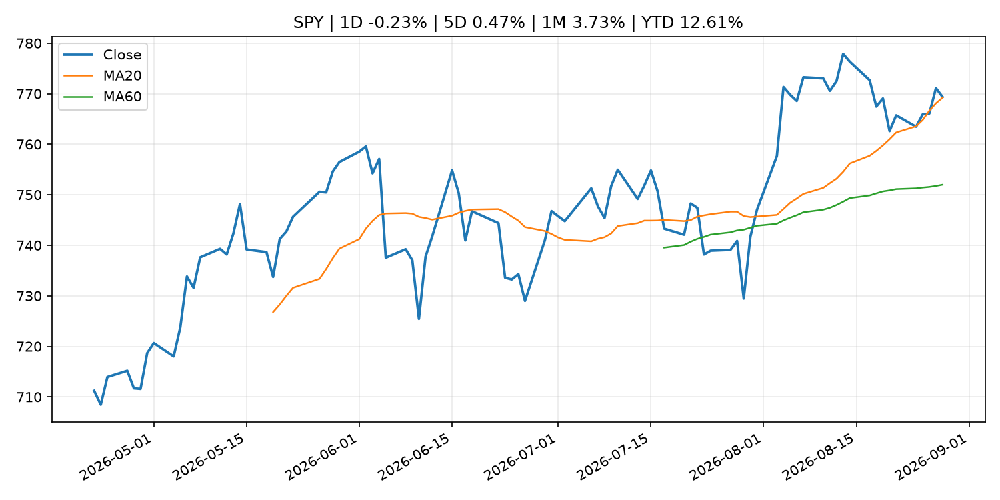
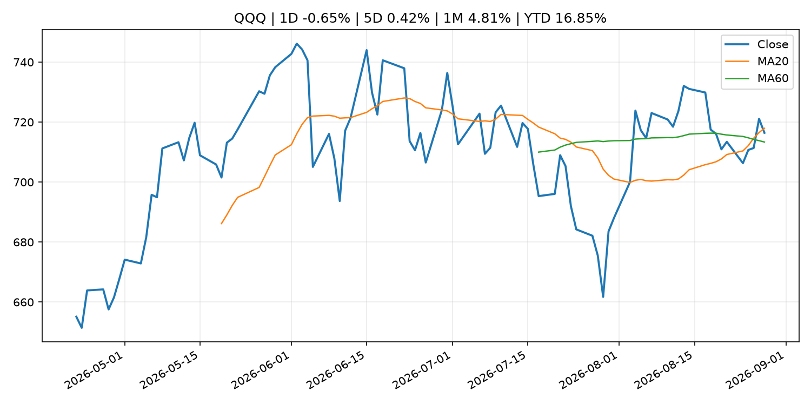
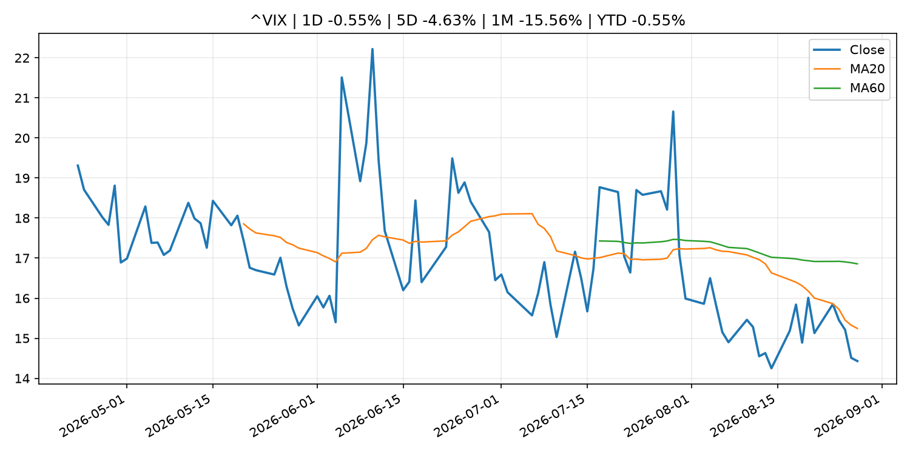
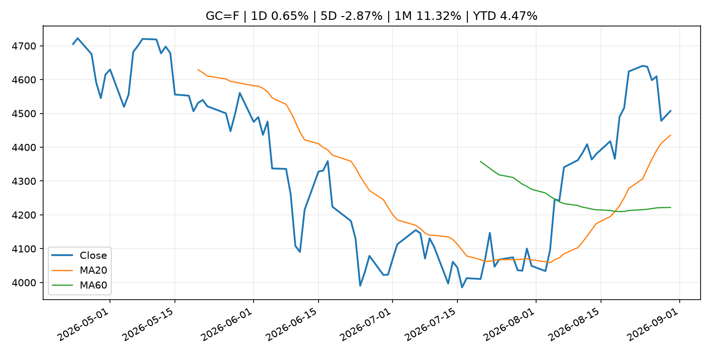
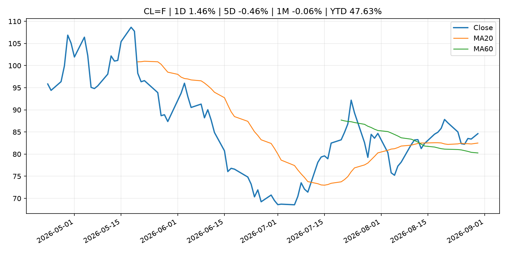
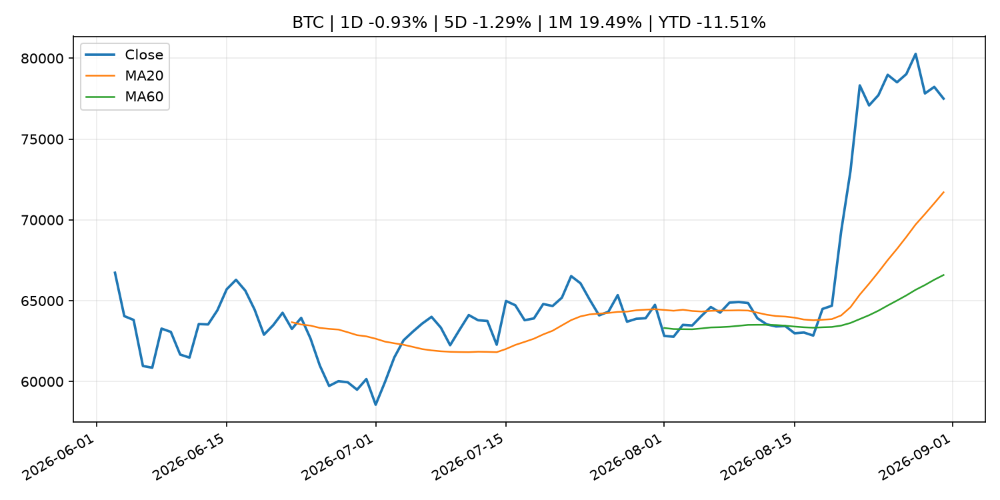
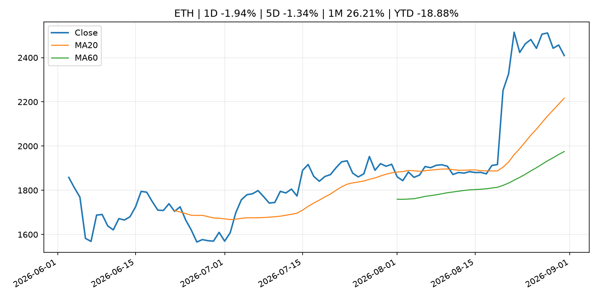

# Global Macro Morning Briefing - 2026-08-31

> Not financial advice / 非投资建议。

## 0. 今日总览
- 市场状态：unknown。市场信号不足，暂不判断明确状态。
- 今日三大主线：
  1. central_bank_decision: U.S. stock futures slip as chances of rate hike rise after Warsh’s Jackson Hole comments
  2. crypto_market_structure: The next trillion-dollar currency may not be a stablecoin — it might not even have a name yet
- 一句话结论：今日晨报重点关注：央行决策会重定价利率、汇率、久期资产和风险资产。；加密市场结构和监管变化会影响 BTC、ETH 及相关股票的风险溢价。。跨资产方面，SPY 1D -0.23%；QQQ 1D -0.65%；^VIX 1D -0.55%；TLT 1D -0.30%；GC=F 1D 0.65%；CL=F 1D 1.46%；BTC 1D -0.93%；ETH 1D -1.94%；市场信号不足，暂不判断明确状态。政策、通胀、利率、美元、美债、能源和加密监管仍是主要观察线索。所有结论仅基于公开数据与短摘要整理，不构成投资建议。

## 1. 隔夜跨资产市场
- 美股：SPY 1D -0.23%，QQQ 1D -0.65%，整体趋势需结合 VIX 和利率确认。
- 美债/美元：TLT 1D -0.30%，美元指数 1D -0.08%，是判断折现率压力的核心线索。
- 黄金/原油：黄金 1D 0.65%，原油 1D 1.46%，用于观察避险、通胀和地缘风险。
- 加密：BTC 1D -0.93%，ETH 1D -1.94%，关注是否独立于纳指走出加密自身行情。
- 港股/A股：恒生 1D 0.07%，沪深300/上证 1D n/a，重点看中国政策预期与人民币线索。
- 风险观察：关注后续数据是否确认当前跨资产信号。

### US_EQUITY

| symbol | latest close | 1D | 5D | 1M | YTD | trend |
|---|---:|---:|---:|---:|---:|---|
| SPY | 769.35 | -0.23% | 0.47% | 3.73% | 12.61% | uptrend |
| QQQ | 716.43 | -0.65% | 0.42% | 4.81% | 16.85% | range_bound |
| DIA | 535.06 | -0.03% | 0.53% | 2.60% | 10.63% | range_bound |
| IWM | 295.75 | -1.35% | -1.40% | 1.08% | 18.88% | range_bound |
| VTI | 379.36 | -0.33% | 0.30% | 3.57% | 12.80% | range_bound |

### US_MACRO_MARKET

| symbol | latest close | 1D | 5D | 1M | YTD | trend |
|---|---:|---:|---:|---:|---:|---|
| ^VIX | 14.43 | -0.55% | -4.63% | -15.56% | -0.55% | strong_downtrend |
| DX-Y.NYB | 99.62 | -0.08% | 0.63% | -0.18% | 1.22% | range_bound |
| TLT | 82.88 | -0.30% | 1.01% | 0.10% | -4.77% | range_bound |
| IEF | 92.85 | -0.41% | 0.03% | -0.39% | -3.36% | downtrend |

### COMMODITIES

| symbol | latest close | 1D | 5D | 1M | YTD | trend |
|---|---:|---:|---:|---:|---:|---|
| GC=F | 4,507.40 | 0.65% | -2.87% | 11.32% | 4.47% | strong_uptrend |
| SI=F | 67.10 | 0.15% | -2.11% | 16.50% | -4.91% | strong_uptrend |
| CL=F | 84.62 | 1.46% | -0.46% | -0.06% | 47.63% | uptrend |
| BZ=F | 89.46 | 0.17% | -2.94% | -0.73% | 47.26% | uptrend |
| NG=F | 2.86 | -1.14% | 2.62% | 3.93% | -21.09% | range_bound |
| HG=F | 6.62 | 0.87% | 0.30% | 2.84% | 17.36% | uptrend |

### HK_MARKET

| symbol | latest close | 1D | 5D | 1M | YTD | trend |
|---|---:|---:|---:|---:|---:|---|
| ^HSI | 25,584.79 | 0.07% | -1.63% | -1.06% | -2.86% | range_bound |
| 0700.HK | 455.20 | 1.65% | -0.39% | -3.52% | -26.93% | range_bound |
| 9988.HK | 113.90 | -1.39% | -7.40% | 1.88% | -23.56% | range_bound |
| 3690.HK | 77.50 | 0.00% | -8.82% | -16.35% | -25.91% | range_bound |
| 1810.HK | 27.82 | 1.24% | -4.14% | -10.37% | -30.93% | uptrend |
| 1211.HK | 91.95 | 0.77% | -1.29% | -3.01% | -6.89% | uptrend |

### CRYPTO

| symbol | latest close | 1D | 5D | 1M | YTD | trend |
|---|---:|---:|---:|---:|---:|---|
| BTC | 77,498.36 | -0.93% | -1.29% | 19.49% | -11.51% | strong_uptrend |
| ETH | 2,409.34 | -1.94% | -1.34% | 26.21% | -18.88% | strong_uptrend |
| SOLANA | 101.42 | -3.96% | 5.01% | 33.07% | -18.55% | strong_uptrend |
| BINANCECOIN | 682.70 | -1.42% | -1.65% | 13.44% | -20.86% | strong_uptrend |
| RIPPLE | 1.35 | -3.08% | -5.63% | 31.51% | -26.47% | strong_uptrend |

## 2. 今日最重要的 10 条新闻
### 1. U.S. stock futures slip as chances of rate hike rise after Warsh’s Jackson Hole comments
- 来源：MarketWatch Top Stories
- 时间：2026-08-30T23:52:00+00:00
- 地区：US
- 事件类型：central_bank_decision
- 重要性层级：Tier 1
- 一句话摘要：U.S. stock-index futures declined on Sunday, as investors ponder the likelihood of a fresh interest-rate hike and look ahead to fresh labor data and tech earnings this week.
- 为什么重要：央行决策会重定价利率、汇率、久期资产和风险资产。
- 可能影响：主要影响 QQQ，方向为 negative，强度 high；鹰派政策提高折现率，压制成长股估值。
  - 资产：QQQ
    方向：negative
    强度：high
    原因：鹰派政策提高折现率，压制成长股估值。
  - 资产：SPY
    方向：negative
    强度：medium
    原因：更紧政策通常削弱风险偏好。
  - 资产：TLT
    方向：negative
    强度：high
    原因：利率上行通常压低长债价格。
  - 资产：DXY
    方向：positive
    强度：high
    原因：更高利率预期通常支撑美元。
  - 资产：BTC
    方向：negative
    强度：high
    原因：流动性收紧通常压制高 beta 加密资产。
- 原文链接：[https://www.marketwatch.com/story/u-s-stock-futures-flat-as-chances-of-rate-hike-rise-after-warshs-jackson-hole-comments-1f5287f2?mod=mw_rss_topstories](https://www.marketwatch.com/story/u-s-stock-futures-flat-as-chances-of-rate-hike-rise-after-warshs-jackson-hole-comments-1f5287f2?mod=mw_rss_topstories)

### 2. The next trillion-dollar currency may not be a stablecoin — it might not even have a name yet
- 来源：CoinDesk
- 时间：2026-08-29T15:00:00+00:00
- 地区：global
- 事件类型：crypto_market_structure
- 重要性层级：Tier 2
- 一句话摘要：The next trillion-dollar currency may not be a stablecoin — it might not even have a name yet
- 为什么重要：加密市场结构和监管变化会影响 BTC、ETH 及相关股票的风险溢价。
- 可能影响：主要影响 BTC，方向为 mixed，强度 high；加密监管或 ETF 进展会改变 BTC 的资金流和风险溢价。
  - 资产：BTC
    方向：mixed
    强度：high
    原因：加密监管或 ETF 进展会改变 BTC 的资金流和风险溢价。
  - 资产：ETH
    方向：mixed
    强度：high
    原因：监管框架会影响 ETH 产品化和机构参与度。
  - 资产：COIN
    方向：mixed
    强度：medium
    原因：监管清晰度和执法风险会影响交易平台估值。
  - 资产：crypto market
    方向：mixed
    强度：high
    原因：信息影响整个加密市场结构，但方向取决于细节。
- 原文链接：[https://www.coindesk.com/business/2026/08/29/the-next-trillion-dollar-currency-may-not-be-a-stablecoin-it-might-not-even-have-a-name-yet](https://www.coindesk.com/business/2026/08/29/the-next-trillion-dollar-currency-may-not-be-a-stablecoin-it-might-not-even-have-a-name-yet)

### 3. Average Contract Interest Rates on Loans and Discounts (July)
- 来源：Bank of Japan Announcements
- 时间：2026-08-31T08:50:00+09:00
- 地区：Japan
- 事件类型：other
- 重要性层级：Tier 3
- 一句话摘要：Average Contract Interest Rates on Loans and Discounts (July)
- 为什么重要：这条信息暂未匹配到重大宏观、政策或市场事件，更适合作为背景跟踪。
- 可能影响：更偏背景信息，短期市场影响可能有限。
  - 资产：暂无明确资产映射
  - 方向：unknown
  - 强度：low
  - 原因：公开信息不足以判断方向。
- 原文链接：[http://www.boj.or.jp/en/statistics/dl/loan/yaku/yaku2607.pdf](http://www.boj.or.jp/en/statistics/dl/loan/yaku/yaku2607.pdf)

### 4. Michael Saylor hints at first bitcoin purchase in two months
- 来源：CoinDesk
- 时间：2026-08-30T15:39:55+00:00
- 地区：global
- 事件类型：other
- 重要性层级：Tier 3
- 一句话摘要：Michael Saylor hints at first bitcoin purchase in two months
- 为什么重要：这条信息暂未匹配到重大宏观、政策或市场事件，更适合作为背景跟踪。
- 可能影响：更偏背景信息，短期市场影响可能有限。
  - 资产：暂无明确资产映射
  - 方向：unknown
  - 强度：low
  - 原因：公开信息不足以判断方向。
- 原文链接：[https://www.coindesk.com/markets/2026/08/30/bitcoin-nears-usd79-000-as-michael-saylor-hints-at-first-bitcoin-purchase-in-two-months](https://www.coindesk.com/markets/2026/08/30/bitcoin-nears-usd79-000-as-michael-saylor-hints-at-first-bitcoin-purchase-in-two-months)

## 3. 政策与央行观察
### 1. U.S. stock futures slip as chances of rate hike rise after Warsh’s Jackson Hole comments
- 来源：MarketWatch Top Stories
- 时间：2026-08-30T23:52:00+00:00
- 地区：US
- 事件类型：central_bank_decision
- 重要性层级：Tier 1
- 一句话摘要：U.S. stock-index futures declined on Sunday, as investors ponder the likelihood of a fresh interest-rate hike and look ahead to fresh labor data and tech earnings this week.
- 为什么重要：央行决策会重定价利率、汇率、久期资产和风险资产。
- 可能影响：主要影响 QQQ，方向为 negative，强度 high；鹰派政策提高折现率，压制成长股估值。
  - 资产：QQQ
    方向：negative
    强度：high
    原因：鹰派政策提高折现率，压制成长股估值。
  - 资产：SPY
    方向：negative
    强度：medium
    原因：更紧政策通常削弱风险偏好。
  - 资产：TLT
    方向：negative
    强度：high
    原因：利率上行通常压低长债价格。
  - 资产：DXY
    方向：positive
    强度：high
    原因：更高利率预期通常支撑美元。
  - 资产：BTC
    方向：negative
    强度：high
    原因：流动性收紧通常压制高 beta 加密资产。
- 原文链接：[https://www.marketwatch.com/story/u-s-stock-futures-flat-as-chances-of-rate-hike-rise-after-warshs-jackson-hole-comments-1f5287f2?mod=mw_rss_topstories](https://www.marketwatch.com/story/u-s-stock-futures-flat-as-chances-of-rate-hike-rise-after-warshs-jackson-hole-comments-1f5287f2?mod=mw_rss_topstories)

### 2. The next trillion-dollar currency may not be a stablecoin — it might not even have a name yet
- 来源：CoinDesk
- 时间：2026-08-29T15:00:00+00:00
- 地区：global
- 事件类型：crypto_market_structure
- 重要性层级：Tier 2
- 一句话摘要：The next trillion-dollar currency may not be a stablecoin — it might not even have a name yet
- 为什么重要：加密市场结构和监管变化会影响 BTC、ETH 及相关股票的风险溢价。
- 可能影响：主要影响 BTC，方向为 mixed，强度 high；加密监管或 ETF 进展会改变 BTC 的资金流和风险溢价。
  - 资产：BTC
    方向：mixed
    强度：high
    原因：加密监管或 ETF 进展会改变 BTC 的资金流和风险溢价。
  - 资产：ETH
    方向：mixed
    强度：high
    原因：监管框架会影响 ETH 产品化和机构参与度。
  - 资产：COIN
    方向：mixed
    强度：medium
    原因：监管清晰度和执法风险会影响交易平台估值。
  - 资产：crypto market
    方向：mixed
    强度：high
    原因：信息影响整个加密市场结构，但方向取决于细节。
- 原文链接：[https://www.coindesk.com/business/2026/08/29/the-next-trillion-dollar-currency-may-not-be-a-stablecoin-it-might-not-even-have-a-name-yet](https://www.coindesk.com/business/2026/08/29/the-next-trillion-dollar-currency-may-not-be-a-stablecoin-it-might-not-even-have-a-name-yet)

## 4. 市场异动与图表
- QQQ 下跌 -0.65%
- Gold 上涨 0.65%
- Oil 上涨 1.46%

### SPY

### QQQ

### ^VIX

### TLT

### GC=F

### CL=F

### BTC

### ETH

### ^HSI

## 5. 华尔街与机构公开观点
- 暂无可靠公开观点。

## 6. 今日重点关注
- 经济数据：经济数据：暂无可靠公开日历数据；如配置经济日历源后可自动填充。
- 央行讲话：央行讲话：暂无可靠公开日历数据；重点跟踪 Fed、ECB、BoJ、PBOC 官网 RSS。
- 财报：财报：暂无可靠数据。
- 政策事件：政策事件：暂无可靠数据。
- 风险提醒：风险提醒：关注数据源失败项、突发地缘风险、利率和美元的二阶反应。

## 7. 英文金融表达与宏观概念
- **terminal rate**：终端利率，市场预期本轮加息周期的最高政策利率。 例句：A higher terminal rate can pressure growth stocks.
- **risk-off**：避险模式，资金偏向美元、国债、黄金等防御资产。 例句：A geopolitical shock can push markets into risk-off mode.
- **market structure**：市场结构，指交易、托管、清算、ETF、监管等制度安排。 例句：Crypto market structure rules can affect institutional participation.
- **inflation expectations**：通胀预期，指家庭、企业或市场对未来通胀的预估。 例句：Inflation expectations can shape wage bargaining and bond yields.
- **real yield**：实际收益率，名义利率扣除通胀预期后的收益率。 例句：Gold often reacts more to real yields than nominal yields.
- **soft landing**：软着陆，指通胀回落而经济避免明显衰退。 例句：Markets often rally when data support a soft landing.

## 8. 背景材料
- [Average Contract Interest Rates on Loans and Discounts (July)](http://www.boj.or.jp/en/statistics/dl/loan/yaku/yaku2607.pdf)（Bank of Japan Announcements，other）：Average Contract Interest Rates on Loans and Discounts (July)
- [Michael Saylor hints at first bitcoin purchase in two months](https://www.coindesk.com/markets/2026/08/30/bitcoin-nears-usd79-000-as-michael-saylor-hints-at-first-bitcoin-purchase-in-two-months)（CoinDesk，other）：Michael Saylor hints at first bitcoin purchase in two months
- [Crypto market makers are cashing in on bitcoin's rally - without betting on direction](https://www.coindesk.com/markets/2026/08/28/crypto-market-makers-are-cashing-in-on-bitcoin-s-rally-without-betting-on-direction)（CoinDesk，other）：Crypto market makers are cashing in on bitcoin's rally - without betting on direction
- [Ditching 'digital gold': BPI study suggests everyday Americans prefer control and micro-investing](https://www.coindesk.com/business/2026/08/28/ditch-digital-gold-bpi-study-suggests-everyday-americans-prefer-control-and-micro-investing)（CoinDesk，other）：Ditching 'digital gold': BPI study suggests everyday Americans prefer control and micro-investing
- [Bitcoin wallets untouched for 10 years moved $40 million worth of coins](https://www.coindesk.com/markets/2026/08/28/bitcoin-wallets-untouched-for-10-years-moved-usd40-million-most-avoided-exchanges)（CoinDesk，other）：Bitcoin wallets untouched for 10 years moved $40 million worth of coins

## 9. 数据源、失败项与免责声明
- 采集时间：2026-08-31T00:13:04
- 数据源：公开 RSS、Yahoo Finance、CoinGecko、AKShare、FRED、SEC data.sec.gov，以及用户自有 inputs/reports 文件。
- 合规说明：不绕过 WSJ、Bloomberg、FT、Reuters 等付费墙；对付费媒体只使用公开 RSS 标题、摘要、链接和发布时间。
- 免责声明：Not financial advice / 非投资建议。本项目仅供个人学习、研究和信息整理，不构成投资建议、交易建议或任何收益承诺。
- 失败或跳过的数据源：
  - crypto data failed coin=dogecoin
  - China market data failed symbol=上证指数: empty dataframe
  - China market data failed symbol=深证成指: empty dataframe
  - China market data failed symbol=创业板指: empty dataframe
  - China market data failed symbol=沪深300: empty dataframe
  - China market data failed symbol=中证500: empty dataframe
  - China market data failed symbol=科创50: empty dataframe
  - FRED_API_KEY not set; skipping FRED macro series
  - SEC failed cik=0000320193
  - SEC failed cik=0000789019
  - SEC failed cik=0001045810
  - SEC failed cik=0001318605
  - SEC failed cik=0001577552
