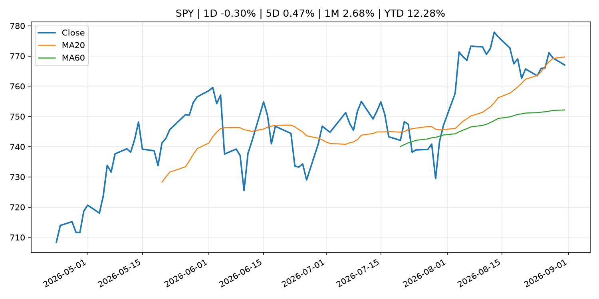
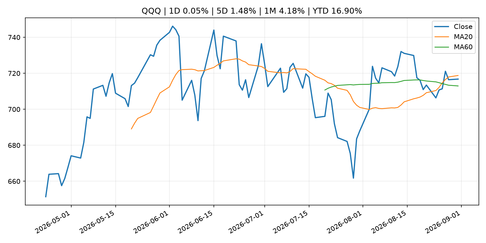
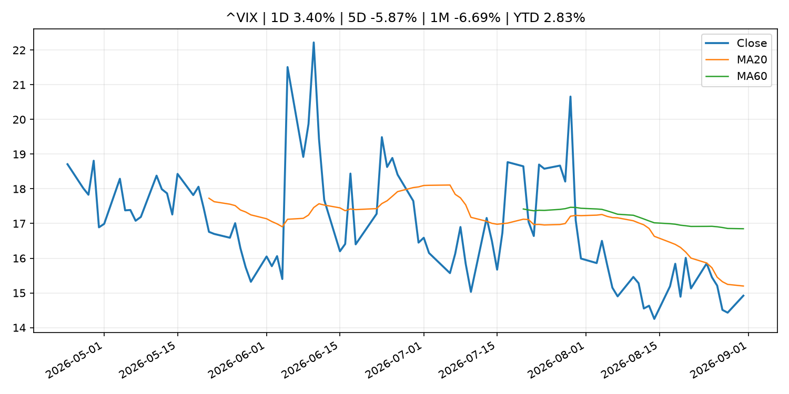
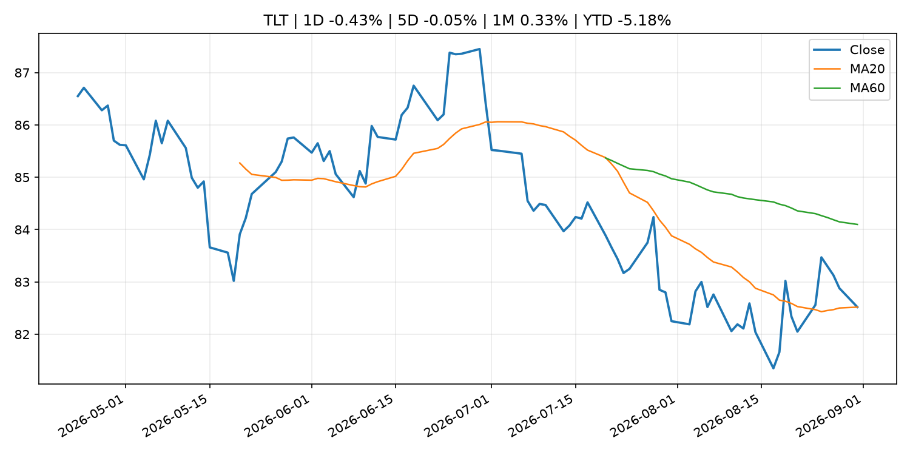
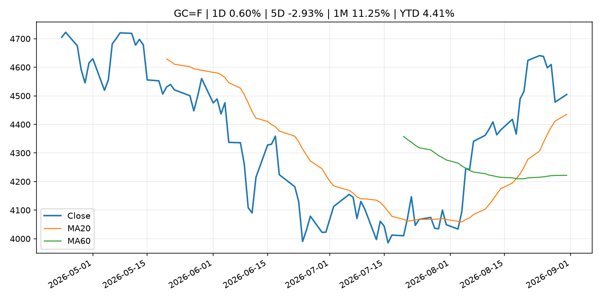
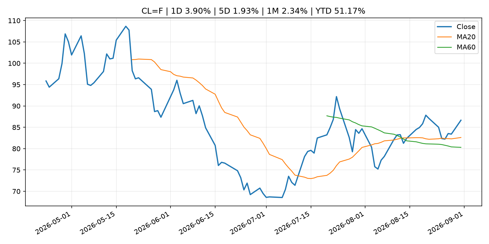
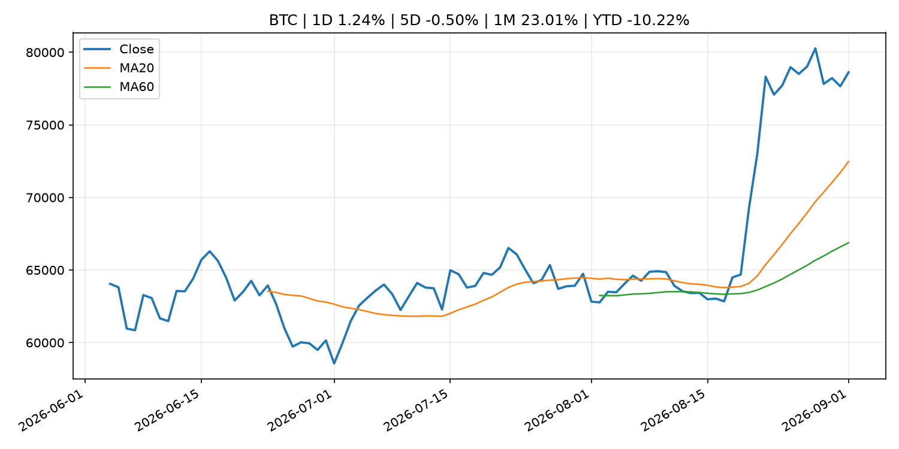
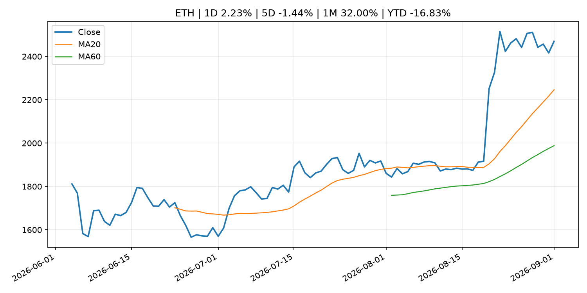
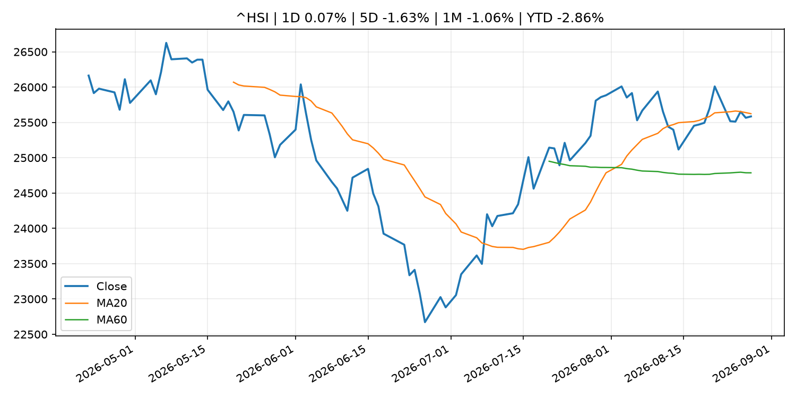

# Global Macro Morning Briefing - 2026-09-01

> Not financial advice / 非投资建议。

## 0. 今日总览
- 市场状态：crypto_specific。BTC/ETH 明显走强但美股平淡，行情更像加密自身事件驱动。
- 今日三大主线：
  1. central_bank_decision: Markets see Warsh endorsing a rate hike in September. Not everyone is convinced
  2. central_bank_decision: September Fed rate hike fears look overblown as the probability stands at just 58%, not 90%
  3. central_bank_speech: Jackson Hole analyst roundup: Warsh's speech sends hike chances higher, may put Fed 'at odds' with Treasury
- 一句话结论：今日晨报重点关注：央行决策会重定价利率、汇率、久期资产和风险资产。；央行决策会重定价利率、汇率、久期资产和风险资产。。跨资产方面，SPY 1D -0.30%；QQQ 1D 0.05%；^VIX 1D 3.40%；TLT 1D -0.43%；GC=F 1D 0.60%；CL=F 1D 3.90%；BTC 1D 1.24%；ETH 1D 2.23%；BTC/ETH 明显走强但美股平淡，行情更像加密自身事件驱动。政策、通胀、利率、美元、美债、能源和加密监管仍是主要观察线索。所有结论仅基于公开数据与短摘要整理，不构成投资建议。

## 1. 隔夜跨资产市场
- 美股：SPY 1D -0.30%，QQQ 1D 0.05%，整体趋势需结合 VIX 和利率确认。
- 美债/美元：TLT 1D -0.43%，美元指数 1D -0.31%，是判断折现率压力的核心线索。
- 黄金/原油：黄金 1D 0.60%，原油 1D 3.90%，用于观察避险、通胀和地缘风险。
- 加密：BTC 1D 1.24%，ETH 1D 2.23%，关注是否独立于纳指走出加密自身行情。
- 港股/A股：恒生 1D 0.07%，沪深300/上证 1D n/a，重点看中国政策预期与人民币线索。
- 风险观察：关注 ETF、监管、稳定币或链上流动性新闻。

### US_EQUITY

| symbol | latest close | 1D | 5D | 1M | YTD | trend |
|---|---:|---:|---:|---:|---:|---|
| SPY | 767.05 | -0.30% | 0.47% | 2.68% | 12.28% | range_bound |
| QQQ | 716.76 | 0.05% | 1.48% | 4.18% | 16.90% | range_bound |
| DIA | 531.57 | -0.65% | -0.39% | 1.38% | 9.91% | range_bound |
| IWM | 293.93 | -0.62% | -1.36% | 0.94% | 18.15% | range_bound |
| VTI | 378.15 | -0.32% | 0.29% | 2.70% | 12.44% | range_bound |

### US_MACRO_MARKET

| symbol | latest close | 1D | 5D | 1M | YTD | trend |
|---|---:|---:|---:|---:|---:|---|
| ^VIX | 14.92 | 3.40% | -5.87% | -6.69% | 2.83% | downtrend |
| DX-Y.NYB | 99.39 | -0.31% | 0.40% | -0.41% | 0.99% | downtrend |
| TLT | 82.52 | -0.43% | -0.05% | 0.33% | -5.18% | range_bound |
| IEF | 92.74 | -0.12% | -0.29% | -0.23% | -3.48% | downtrend |

### COMMODITIES

| symbol | latest close | 1D | 5D | 1M | YTD | trend |
|---|---:|---:|---:|---:|---:|---|
| GC=F | 4,504.80 | 0.60% | -2.93% | 11.25% | 4.41% | strong_uptrend |
| SI=F | 67.49 | 0.73% | -1.54% | 17.18% | -4.35% | strong_uptrend |
| CL=F | 86.65 | 3.90% | 1.93% | 2.34% | 51.17% | uptrend |
| BZ=F | 88.80 | -0.57% | -3.66% | -1.46% | 46.17% | uptrend |
| NG=F | 2.93 | 1.35% | 5.21% | 6.55% | -19.10% | range_bound |
| HG=F | 6.72 | 2.48% | 1.90% | 4.48% | 19.23% | strong_uptrend |

### HK_MARKET

| symbol | latest close | 1D | 5D | 1M | YTD | trend |
|---|---:|---:|---:|---:|---:|---|
| ^HSI | 25,584.79 | 0.07% | -1.63% | -1.06% | -2.86% | range_bound |
| 0700.HK | 455.20 | 1.65% | -0.39% | -3.52% | -26.93% | range_bound |
| 9988.HK | 113.90 | -1.39% | -7.40% | 1.88% | -23.56% | range_bound |
| 3690.HK | 77.50 | 0.00% | -8.82% | -16.35% | -25.91% | range_bound |
| 1810.HK | 27.82 | 1.24% | -4.14% | -10.37% | -30.93% | uptrend |
| 1211.HK | 91.95 | 0.77% | -1.29% | -3.01% | -6.89% | uptrend |

### CRYPTO

| symbol | latest close | 1D | 5D | 1M | YTD | trend |
|---|---:|---:|---:|---:|---:|---|
| BTC | 78,624.90 | 1.24% | -0.50% | 23.01% | -10.22% | strong_uptrend |
| ETH | 2,470.24 | 2.23% | -1.44% | 32.00% | -16.83% | strong_uptrend |
| SOLANA | 103.12 | 1.41% | 1.05% | 35.82% | -17.19% | strong_uptrend |
| BINANCECOIN | 693.06 | 1.25% | -2.04% | 15.78% | -19.66% | strong_uptrend |
| RIPPLE | 1.38 | 1.87% | -2.75% | 36.79% | -24.84% | strong_uptrend |

## 2. 今日最重要的 10 条新闻
### 1. Markets see Warsh endorsing a rate hike in September. Not everyone is convinced
- 来源：CNBC Economy
- 时间：2026-08-31T19:38:38+00:00
- 地区：US
- 事件类型：central_bank_decision
- 重要性层级：Tier 1
- 一句话摘要：The path toward the move still looks cluttered.
- 为什么重要：央行决策会重定价利率、汇率、久期资产和风险资产。
- 可能影响：主要影响 QQQ，方向为 negative，强度 high；鹰派政策提高折现率，压制成长股估值。
  - 资产：QQQ
    方向：negative
    强度：high
    原因：鹰派政策提高折现率，压制成长股估值。
  - 资产：SPY
    方向：negative
    强度：medium
    原因：更紧政策通常削弱风险偏好。
  - 资产：TLT
    方向：negative
    强度：high
    原因：利率上行通常压低长债价格。
  - 资产：DXY
    方向：positive
    强度：high
    原因：更高利率预期通常支撑美元。
  - 资产：BTC
    方向：negative
    强度：high
    原因：流动性收紧通常压制高 beta 加密资产。
- 原文链接：[https://www.cnbc.com/2026/08/31/markets-see-warsh-endorsing-a-rate-hike-in-september-not-everyone-is-convinced.html](https://www.cnbc.com/2026/08/31/markets-see-warsh-endorsing-a-rate-hike-in-september-not-everyone-is-convinced.html)

### 2. September Fed rate hike fears look overblown as the probability stands at just 58%, not 90%
- 来源：CoinDesk
- 时间：2026-08-31T06:42:45+00:00
- 地区：global
- 事件类型：central_bank_decision
- 重要性层级：Tier 1
- 一句话摘要：September Fed rate hike fears look overblown as the probability stands at just 58%, not 90%
- 为什么重要：央行决策会重定价利率、汇率、久期资产和风险资产。
- 可能影响：主要影响 QQQ，方向为 negative，强度 high；鹰派政策提高折现率，压制成长股估值。
  - 资产：QQQ
    方向：negative
    强度：high
    原因：鹰派政策提高折现率，压制成长股估值。
  - 资产：SPY
    方向：negative
    强度：medium
    原因：更紧政策通常削弱风险偏好。
  - 资产：TLT
    方向：negative
    强度：high
    原因：利率上行通常压低长债价格。
  - 资产：DXY
    方向：positive
    强度：high
    原因：更高利率预期通常支撑美元。
  - 资产：BTC
    方向：negative
    强度：high
    原因：流动性收紧通常压制高 beta 加密资产。
- 原文链接：[https://www.coindesk.com/markets/2026/08/31/september-fed-rate-hike-fears-appear-overblown-as-the-probability-is-just-58-not-90](https://www.coindesk.com/markets/2026/08/31/september-fed-rate-hike-fears-appear-overblown-as-the-probability-is-just-58-not-90)

### 3. Jackson Hole analyst roundup: Warsh's speech sends hike chances higher, may put Fed 'at odds' with Treasury
- 来源：CNBC Economy
- 时间：2026-08-31T11:28:03+00:00
- 地区：US
- 事件类型：central_bank_speech
- 重要性层级：Tier 2
- 一句话摘要：Fed Chair Kevin Warsh's hawkish stance reinforced expectations of a relatively tighter stance at the Federal Open Market Committee meeting in September.
- 为什么重要：央行官员表态可能影响市场对下一次会议的定价。
- 可能影响：主要影响 QQQ，方向为 negative，强度 high；鹰派政策提高折现率，压制成长股估值。
  - 资产：QQQ
    方向：negative
    强度：high
    原因：鹰派政策提高折现率，压制成长股估值。
  - 资产：SPY
    方向：negative
    强度：medium
    原因：更紧政策通常削弱风险偏好。
  - 资产：TLT
    方向：negative
    强度：high
    原因：利率上行通常压低长债价格。
  - 资产：DXY
    方向：positive
    强度：high
    原因：更高利率预期通常支撑美元。
  - 资产：BTC
    方向：negative
    强度：high
    原因：流动性收紧通常压制高 beta 加密资产。
- 原文链接：[https://www.cnbc.com/2026/08/31/jackson-hole-fed-chair-kevin-warsh-hawkish-rate-hikes-analysts.html](https://www.cnbc.com/2026/08/31/jackson-hole-fed-chair-kevin-warsh-hawkish-rate-hikes-analysts.html)

### 4. SEC and FDA Announce MOU to Bolster Cooperation and Ensure Market Integrity
- 来源：SEC Press Releases
- 时间：2026-08-31T14:24:32-04:00
- 地区：US
- 事件类型：regulation
- 重要性层级：Tier 2
- 一句话摘要：The Securities and Exchange Commission and the Food and Drug Administration today announced that they have entered into a Memorandum of Understanding (MOU) designed to assist the agencies in carrying out their respective missions of ensuring the…
- 为什么重要：监管变化会改变行业盈利预期和资产风险溢价。
- 可能影响：主要影响 BTC，方向为 mixed，强度 high；加密监管或 ETF 进展会改变 BTC 的资金流和风险溢价。
  - 资产：BTC
    方向：mixed
    强度：high
    原因：加密监管或 ETF 进展会改变 BTC 的资金流和风险溢价。
  - 资产：ETH
    方向：mixed
    强度：high
    原因：监管框架会影响 ETH 产品化和机构参与度。
  - 资产：COIN
    方向：mixed
    强度：medium
    原因：监管清晰度和执法风险会影响交易平台估值。
  - 资产：crypto market
    方向：mixed
    强度：high
    原因：信息影响整个加密市场结构，但方向取决于细节。
- 原文链接：[https://www.sec.gov/newsroom/press-releases/2026-80-sec-fda-announce-mou-bolster-cooperation-ensure-market-integrity](https://www.sec.gov/newsroom/press-releases/2026-80-sec-fda-announce-mou-bolster-cooperation-ensure-market-integrity)

### 5. Bitcoin barely blinks as U.S. hits Iran, sending oil higher and stocks lower
- 来源：CoinDesk
- 时间：2026-08-31T04:29:10+00:00
- 地区：global
- 事件类型：other
- 重要性层级：Tier 3
- 一句话摘要：Bitcoin barely blinks as U.S. hits Iran, sending oil higher and stocks lower
- 为什么重要：这条信息暂未匹配到重大宏观、政策或市场事件，更适合作为背景跟踪。
- 可能影响：主要影响 CL=F，方向为 positive，强度 high；供给扰动或 OPEC 减产通常推升 WTI 原油。
  - 资产：CL=F
    方向：positive
    强度：high
    原因：供给扰动或 OPEC 减产通常推升 WTI 原油。
  - 资产：BZ=F
    方向：positive
    强度：high
    原因：全球供给风险通常直接影响 Brent 原油。
  - 资产：SPY
    方向：mixed
    强度：medium
    原因：能源股可能受益，但通胀和成本压力不利于宽基风险资产。
- 原文链接：[https://www.coindesk.com/markets/2026/08/31/bitcoin-barely-blinks-as-u-s-hits-iran-sending-oil-higher-and-stocks-lower](https://www.coindesk.com/markets/2026/08/31/bitcoin-barely-blinks-as-u-s-hits-iran-sending-oil-higher-and-stocks-lower)

### 6. ‘I’m leaving money on the table’: I’m 64 and my husband is 70. Should I take spousal benefits or wait for my own?
- 来源：MarketWatch Top Stories
- 时间：2026-08-31T22:00:00+00:00
- 地区：US
- 事件类型：other
- 重要性层级：Tier 3
- 一句话摘要：“I paid a significant amount into Social Security.”
- 为什么重要：这条信息暂未匹配到重大宏观、政策或市场事件，更适合作为背景跟踪。
- 可能影响：更偏背景信息，短期市场影响可能有限。
  - 资产：暂无明确资产映射
  - 方向：unknown
  - 强度：low
  - 原因：公开信息不足以判断方向。
- 原文链接：[https://www.marketwatch.com/story/im-leaving-money-on-the-table-im-64-and-my-husband-is-70-should-i-take-spousal-benefits-or-wait-for-my-own-2490f5cd?mod=mw_rss_topstories](https://www.marketwatch.com/story/im-leaving-money-on-the-table-im-64-and-my-husband-is-70-should-i-take-spousal-benefits-or-wait-for-my-own-2490f5cd?mod=mw_rss_topstories)

## 3. 政策与央行观察
### 1. Markets see Warsh endorsing a rate hike in September. Not everyone is convinced
- 来源：CNBC Economy
- 时间：2026-08-31T19:38:38+00:00
- 地区：US
- 事件类型：central_bank_decision
- 重要性层级：Tier 1
- 一句话摘要：The path toward the move still looks cluttered.
- 为什么重要：央行决策会重定价利率、汇率、久期资产和风险资产。
- 可能影响：主要影响 QQQ，方向为 negative，强度 high；鹰派政策提高折现率，压制成长股估值。
  - 资产：QQQ
    方向：negative
    强度：high
    原因：鹰派政策提高折现率，压制成长股估值。
  - 资产：SPY
    方向：negative
    强度：medium
    原因：更紧政策通常削弱风险偏好。
  - 资产：TLT
    方向：negative
    强度：high
    原因：利率上行通常压低长债价格。
  - 资产：DXY
    方向：positive
    强度：high
    原因：更高利率预期通常支撑美元。
  - 资产：BTC
    方向：negative
    强度：high
    原因：流动性收紧通常压制高 beta 加密资产。
- 原文链接：[https://www.cnbc.com/2026/08/31/markets-see-warsh-endorsing-a-rate-hike-in-september-not-everyone-is-convinced.html](https://www.cnbc.com/2026/08/31/markets-see-warsh-endorsing-a-rate-hike-in-september-not-everyone-is-convinced.html)

### 2. September Fed rate hike fears look overblown as the probability stands at just 58%, not 90%
- 来源：CoinDesk
- 时间：2026-08-31T06:42:45+00:00
- 地区：global
- 事件类型：central_bank_decision
- 重要性层级：Tier 1
- 一句话摘要：September Fed rate hike fears look overblown as the probability stands at just 58%, not 90%
- 为什么重要：央行决策会重定价利率、汇率、久期资产和风险资产。
- 可能影响：主要影响 QQQ，方向为 negative，强度 high；鹰派政策提高折现率，压制成长股估值。
  - 资产：QQQ
    方向：negative
    强度：high
    原因：鹰派政策提高折现率，压制成长股估值。
  - 资产：SPY
    方向：negative
    强度：medium
    原因：更紧政策通常削弱风险偏好。
  - 资产：TLT
    方向：negative
    强度：high
    原因：利率上行通常压低长债价格。
  - 资产：DXY
    方向：positive
    强度：high
    原因：更高利率预期通常支撑美元。
  - 资产：BTC
    方向：negative
    强度：high
    原因：流动性收紧通常压制高 beta 加密资产。
- 原文链接：[https://www.coindesk.com/markets/2026/08/31/september-fed-rate-hike-fears-appear-overblown-as-the-probability-is-just-58-not-90](https://www.coindesk.com/markets/2026/08/31/september-fed-rate-hike-fears-appear-overblown-as-the-probability-is-just-58-not-90)

### 3. Jackson Hole analyst roundup: Warsh's speech sends hike chances higher, may put Fed 'at odds' with Treasury
- 来源：CNBC Economy
- 时间：2026-08-31T11:28:03+00:00
- 地区：US
- 事件类型：central_bank_speech
- 重要性层级：Tier 2
- 一句话摘要：Fed Chair Kevin Warsh's hawkish stance reinforced expectations of a relatively tighter stance at the Federal Open Market Committee meeting in September.
- 为什么重要：央行官员表态可能影响市场对下一次会议的定价。
- 可能影响：主要影响 QQQ，方向为 negative，强度 high；鹰派政策提高折现率，压制成长股估值。
  - 资产：QQQ
    方向：negative
    强度：high
    原因：鹰派政策提高折现率，压制成长股估值。
  - 资产：SPY
    方向：negative
    强度：medium
    原因：更紧政策通常削弱风险偏好。
  - 资产：TLT
    方向：negative
    强度：high
    原因：利率上行通常压低长债价格。
  - 资产：DXY
    方向：positive
    强度：high
    原因：更高利率预期通常支撑美元。
  - 资产：BTC
    方向：negative
    强度：high
    原因：流动性收紧通常压制高 beta 加密资产。
- 原文链接：[https://www.cnbc.com/2026/08/31/jackson-hole-fed-chair-kevin-warsh-hawkish-rate-hikes-analysts.html](https://www.cnbc.com/2026/08/31/jackson-hole-fed-chair-kevin-warsh-hawkish-rate-hikes-analysts.html)

### 4. SEC and FDA Announce MOU to Bolster Cooperation and Ensure Market Integrity
- 来源：SEC Press Releases
- 时间：2026-08-31T14:24:32-04:00
- 地区：US
- 事件类型：regulation
- 重要性层级：Tier 2
- 一句话摘要：The Securities and Exchange Commission and the Food and Drug Administration today announced that they have entered into a Memorandum of Understanding (MOU) designed to assist the agencies in carrying out their respective missions of ensuring the…
- 为什么重要：监管变化会改变行业盈利预期和资产风险溢价。
- 可能影响：主要影响 BTC，方向为 mixed，强度 high；加密监管或 ETF 进展会改变 BTC 的资金流和风险溢价。
  - 资产：BTC
    方向：mixed
    强度：high
    原因：加密监管或 ETF 进展会改变 BTC 的资金流和风险溢价。
  - 资产：ETH
    方向：mixed
    强度：high
    原因：监管框架会影响 ETH 产品化和机构参与度。
  - 资产：COIN
    方向：mixed
    强度：medium
    原因：监管清晰度和执法风险会影响交易平台估值。
  - 资产：crypto market
    方向：mixed
    强度：high
    原因：信息影响整个加密市场结构，但方向取决于细节。
- 原文链接：[https://www.sec.gov/newsroom/press-releases/2026-80-sec-fda-announce-mou-bolster-cooperation-ensure-market-integrity](https://www.sec.gov/newsroom/press-releases/2026-80-sec-fda-announce-mou-bolster-cooperation-ensure-market-integrity)

## 4. 市场异动与图表
- VIX 上涨 3.40%
- TLT 下跌 -0.43%
- DXY 下跌 -0.31%
- Gold 上涨 0.60%
- Oil 上涨 3.90%
- ETH 上涨 2.23%

### SPY

### QQQ

### ^VIX

### TLT

### GC=F

### CL=F

### BTC

### ETH

### ^HSI

## 5. 华尔街与机构公开观点
- 暂无可靠公开观点。

## 6. 今日重点关注
- 经济数据：经济数据：暂无可靠公开日历数据；如配置经济日历源后可自动填充。
- 央行讲话：央行讲话：暂无可靠公开日历数据；重点跟踪 Fed、ECB、BoJ、PBOC 官网 RSS。
- 财报：财报：暂无可靠数据。
- 政策事件：政策事件：暂无可靠数据。
- 风险提醒：风险提醒：关注数据源失败项、突发地缘风险、利率和美元的二阶反应。

## 7. 英文金融表达与宏观概念
- **real yield**：实际收益率，名义利率扣除通胀预期后的收益率。 例句：Gold often reacts more to real yields than nominal yields.
- **terminal rate**：终端利率，市场预期本轮加息周期的最高政策利率。 例句：A higher terminal rate can pressure growth stocks.
- **risk-off**：避险模式，资金偏向美元、国债、黄金等防御资产。 例句：A geopolitical shock can push markets into risk-off mode.
- **supply disruption**：供给扰动，通常指能源或商品供应受冲突、减产或天气影响。 例句：Supply disruption can lift oil prices and inflation expectations.
- **market structure**：市场结构，指交易、托管、清算、ETF、监管等制度安排。 例句：Crypto market structure rules can affect institutional participation.
- **inflation expectations**：通胀预期，指家庭、企业或市场对未来通胀的预估。 例句：Inflation expectations can shape wage bargaining and bond yields.

## 8. 背景材料
- [‘I’m leaving money on the table’: I’m 64 and my husband is 70. Should I take spousal benefits or wait for my own?](https://www.marketwatch.com/story/im-leaving-money-on-the-table-im-64-and-my-husband-is-70-should-i-take-spousal-benefits-or-wait-for-my-own-2490f5cd?mod=mw_rss_topstories)（MarketWatch Top Stories，other）：“I paid a significant amount into Social Security.”
- [23 best-performing stocks of August, as the software industry continues its recovery](https://www.marketwatch.com/story/22-best-performing-stocks-of-august-as-the-software-industry-continues-its-recovery-88e432bf?mod=mw_rss_topstories)（MarketWatch Top Stories，other）：The energy and technology sectors did well in August, while Moderna’s stock was the best performer by a wide margin.
- [NYSE owner ICE taps tZERO for tokenized securities push, takes stake in firm](https://www.coindesk.com/business/2026/08/31/nyse-owner-ice-taps-tzero-for-tokenized-securities-push-takes-stake-in-firm)（CoinDesk，other）：NYSE owner ICE taps tZERO for tokenized securities push, takes stake in firm
- [Strategy returns to bitcoin buys, adding $370 million of BTC last week](https://www.coindesk.com/markets/2026/08/31/strategy-returns-to-bitcoin-buys-adding-usd370-million-worth-last-week)（CoinDesk，other）：Strategy returns to bitcoin buys, adding $370 million of BTC last week
- [Here's 1 metric on U.S. debt that makes bitcoin's bull case look stronger than ever](https://www.coindesk.com/daybook-us/2026/08/31/here-s-1-metric-on-u-s-debt-that-makes-bitcoin-s-bull-case-look-stronger-than-ever)（CoinDesk，other）：Here's 1 metric on U.S. debt that makes bitcoin's bull case look stronger than ever
- [U.S. strikes on Iran fail to stir bitcoin, on track for best month since November 2024](https://www.coindesk.com/markets/2026/08/31/u-s-strikes-on-iran-fail-to-stir-bitcoin-on-track-for-best-month-since-november-2024)（CoinDesk，other）：U.S. strikes on Iran fail to stir bitcoin, on track for best month since November 2024
- [Live updates: Bitcoin eyes 25% gain in August, best month since November 2024](https://www.coindesk.com/tech/2026/08/31/live-updates-bitcoin-holds-usd78-000-as-yen-breaks-160-and-rate-hike-bets-lift-the-dollar)（CoinDesk，other）：Live updates: Bitcoin eyes 25% gain in August, best month since November 2024
- [Luke Dashjr exits mining pool Ocean after split over Bitcoin mining’s future](https://www.coindesk.com/business/2026/08/31/luke-dashjr-exits-mining-pool-ocean-after-split-over-bitcoin-mining-s-future)（CoinDesk，other）：Luke Dashjr exits mining pool Ocean after split over Bitcoin mining’s future
- [Quarterly Schedule of Outright Purchases of Japanese Government Bonds (Competitive Auction Method) (July-September 2026) (Schedule Updates)](http://www.boj.or.jp/en/mopo/mpmdeci/mpr_2026/mpr260831a.pdf)（Bank of Japan Announcements，other）：Quarterly Schedule of Outright Purchases of Japanese Government Bonds (Competitive Auction Method) (July-September 2026) (Schedule Updates)
- [Zcash private transactions could go from three-second waits to under 200 milliseconds](https://www.coindesk.com/tech/2026/08/31/zcash-private-transactions-could-go-from-three-second-waits-to-under-200-milliseconds)（CoinDesk，other）：Zcash private transactions could go from three-second waits to under 200 milliseconds
- [Bitcoin barely blinks as U.S. hits Iran, sending oil higher and stocks lower](https://www.coindesk.com/markets/2026/08/31/bitcoin-barely-blinks-as-u-s-hits-iran-sending-oil-higher-and-stocks-lower)（CoinDesk，other）：Bitcoin barely blinks as U.S. hits Iran, sending oil higher and stocks lower
- [Payment and Settlement Statistics (July)](http://www.boj.or.jp/en/statistics/set/kess/release/2026/kess2607.pdf)（Bank of Japan Announcements，other）：Payment and Settlement Statistics (July)
- [Flow of Funds (Overview of Japan, US, and the Euro area)(1st Quarter 2026)](http://www.boj.or.jp/en/statistics/sj/sjhiq.pdf)（Bank of Japan Announcements，other）：Flow of Funds (Overview of Japan, US, and the Euro area)(1st Quarter 2026)
- [Average Contract Interest Rates on Loans and Discounts (July)](http://www.boj.or.jp/en/statistics/dl/loan/yaku/yaku2607.pdf)（Bank of Japan Announcements，other）：Average Contract Interest Rates on Loans and Discounts (July)
- [Michael Saylor hints at first bitcoin purchase in two months](https://www.coindesk.com/markets/2026/08/30/bitcoin-nears-usd79-000-as-michael-saylor-hints-at-first-bitcoin-purchase-in-two-months)（CoinDesk，other）：Michael Saylor hints at first bitcoin purchase in two months
- [Crypto market makers are cashing in on bitcoin's rally - without betting on direction](https://www.coindesk.com/markets/2026/08/28/crypto-market-makers-are-cashing-in-on-bitcoin-s-rally-without-betting-on-direction)（CoinDesk，other）：Crypto market makers are cashing in on bitcoin's rally - without betting on direction

## 9. 数据源、失败项与免责声明
- 采集时间：2026-09-01T01:00:32
- 数据源：公开 RSS、Yahoo Finance、CoinGecko、AKShare、FRED、SEC data.sec.gov，以及用户自有 inputs/reports 文件。
- 合规说明：不绕过 WSJ、Bloomberg、FT、Reuters 等付费墙；对付费媒体只使用公开 RSS 标题、摘要、链接和发布时间。
- 免责声明：Not financial advice / 非投资建议。本项目仅供个人学习、研究和信息整理，不构成投资建议、交易建议或任何收益承诺。
- 失败或跳过的数据源：
  - crypto data failed coin=dogecoin
  - China market data failed symbol=上证指数: empty dataframe
  - China market data failed symbol=深证成指: empty dataframe
  - China market data failed symbol=创业板指: empty dataframe
  - China market data failed symbol=沪深300: empty dataframe
  - China market data failed symbol=中证500: empty dataframe
  - China market data failed symbol=科创50: empty dataframe
  - FRED_API_KEY not set; skipping FRED macro series
  - SEC failed cik=0000320193
  - SEC failed cik=0000789019
  - SEC failed cik=0001045810
  - SEC failed cik=0001318605
  - SEC failed cik=0001577552
