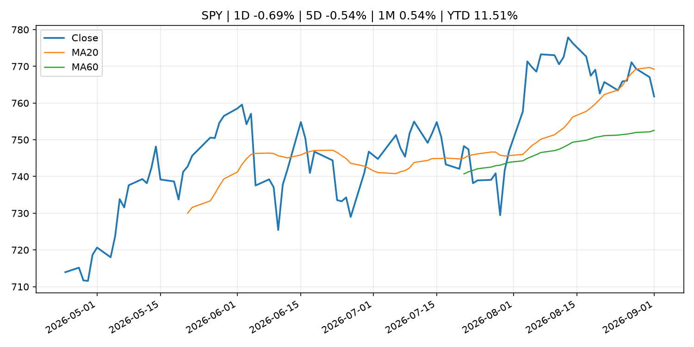
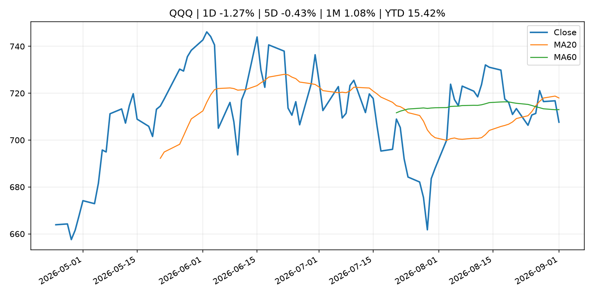
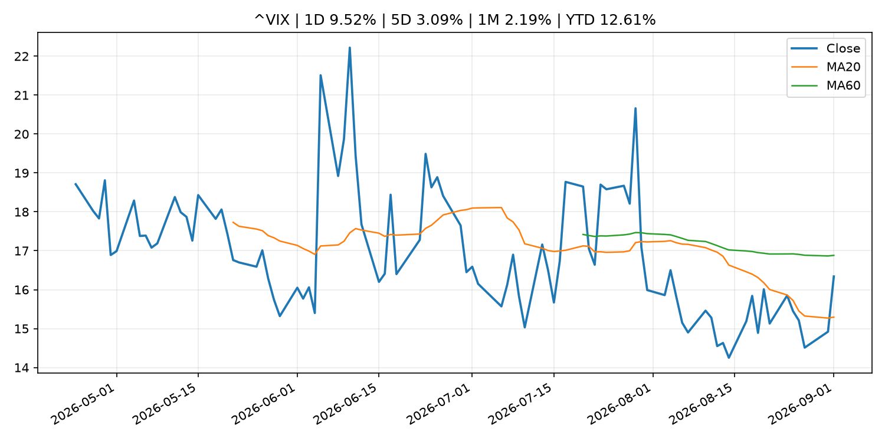
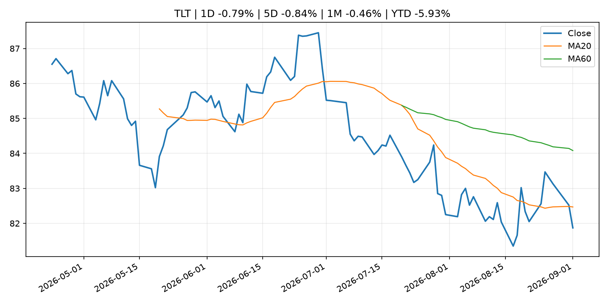
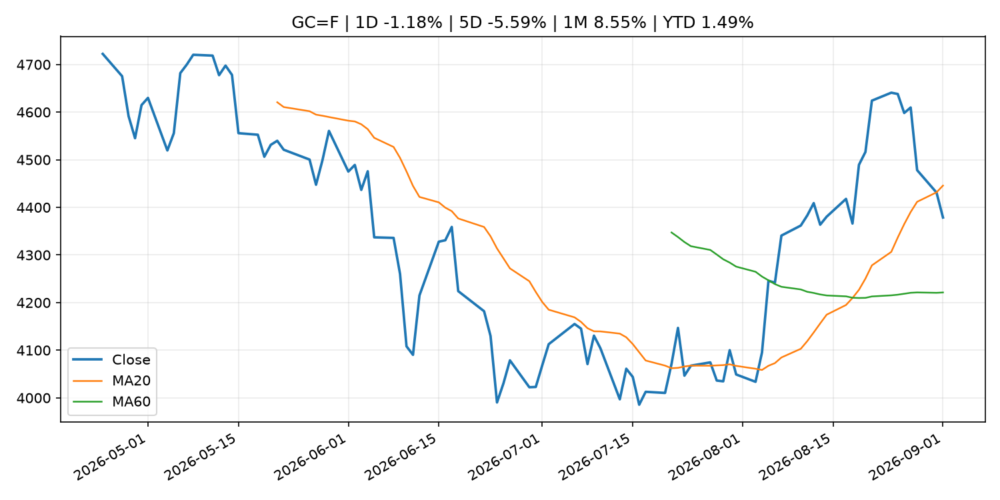
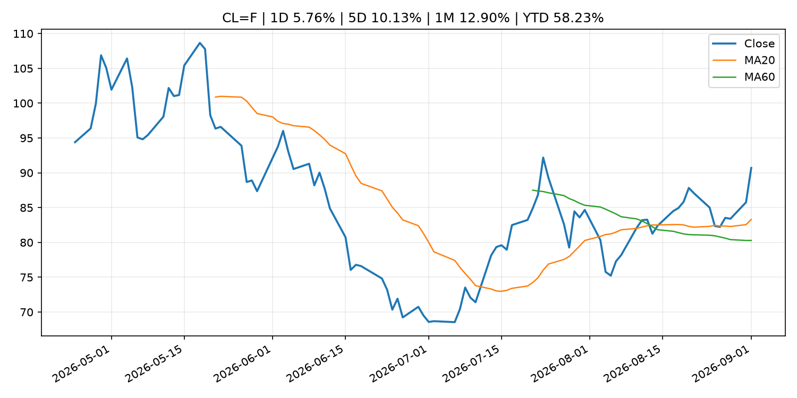
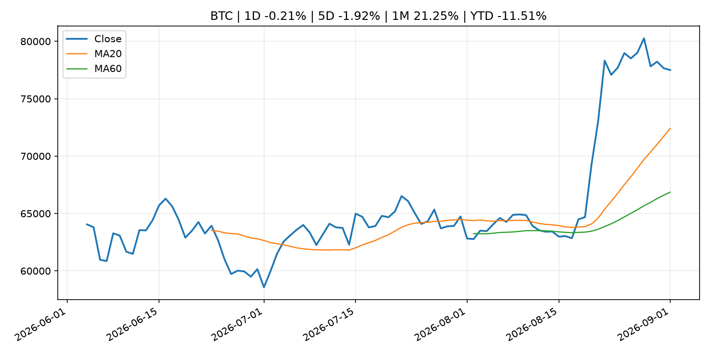
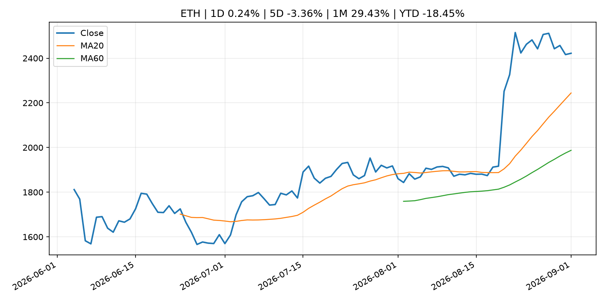
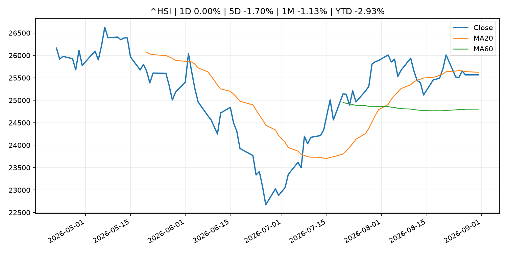

# Global Macro Morning Briefing - 2026-09-02

> Not financial advice / 非投资建议。

## 0. 今日总览
- 市场状态：mixed。市场信号不足，暂不判断明确状态。 但存在信号冲突，需要降低单一叙事置信度。
- 今日三大主线：
  1. central_bank_decision: Fed Governor Barr says he'll support rate hike if inflation doesn't ease
  2. central_bank_decision: Markets see Warsh endorsing a rate hike in September. Not everyone is convinced
  3. regulation: SEC Announces Agenda and Panelists for Roundtable on Preparations for 24-Hour Trading
- 一句话结论：今日晨报重点关注：央行决策会重定价利率、汇率、久期资产和风险资产。；央行决策会重定价利率、汇率、久期资产和风险资产。。跨资产方面，SPY 1D -0.69%；QQQ 1D -1.27%；^VIX 1D 9.52%；TLT 1D -0.79%；GC=F 1D -1.18%；CL=F 1D 5.76%；BTC 1D -0.21%；ETH 1D 0.24%；市场信号不足，暂不判断明确状态。 但存在信号冲突，需要降低单一叙事置信度。政策、通胀、利率、美元、美债、能源和加密监管仍是主要观察线索。所有结论仅基于公开数据与短摘要整理，不构成投资建议。

## 1. 隔夜跨资产市场
- 美股：SPY 1D -0.69%，QQQ 1D -1.27%，整体趋势需结合 VIX 和利率确认。
- 美债/美元：TLT 1D -0.79%，美元指数 1D 0.24%，是判断折现率压力的核心线索。
- 黄金/原油：黄金 1D -1.18%，原油 1D 5.76%，用于观察避险、通胀和地缘风险。
- 加密：BTC 1D -0.21%，ETH 1D 0.24%，关注是否独立于纳指走出加密自身行情。
- 港股/A股：恒生 1D 0.00%，沪深300/上证 1D n/a，重点看中国政策预期与人民币线索。
- 风险观察：关注后续数据是否确认当前跨资产信号。

### US_EQUITY

| symbol | latest close | 1D | 5D | 1M | YTD | trend |
|---|---:|---:|---:|---:|---:|---|
| SPY | 761.78 | -0.69% | -0.54% | 0.54% | 11.51% | range_bound |
| QQQ | 707.64 | -1.27% | -0.43% | 1.08% | 15.42% | range_bound |
| DIA | 527.75 | -0.72% | -1.11% | 0.65% | 9.12% | range_bound |
| IWM | 290.57 | -1.14% | -2.48% | -0.22% | 16.80% | range_bound |
| VTI | 375.17 | -0.79% | -0.50% | 1.89% | 11.55% | range_bound |

### US_MACRO_MARKET

| symbol | latest close | 1D | 5D | 1M | YTD | trend |
|---|---:|---:|---:|---:|---:|---|
| ^VIX | 16.34 | 9.52% | 3.09% | 2.19% | 12.61% | range_bound |
| DX-Y.NYB | 99.67 | 0.24% | 0.67% | -0.14% | 1.26% | range_bound |
| TLT | 81.87 | -0.79% | -0.84% | -0.46% | -5.93% | downtrend |
| IEF | 92.10 | -0.69% | -0.98% | -0.91% | -4.14% | downtrend |

### COMMODITIES

| symbol | latest close | 1D | 5D | 1M | YTD | trend |
|---|---:|---:|---:|---:|---:|---|
| GC=F | 4,378.70 | -1.18% | -5.59% | 8.55% | 1.49% | range_bound |
| SI=F | 64.72 | -2.26% | -5.70% | 12.24% | -8.26% | range_bound |
| CL=F | 90.70 | 5.76% | 10.13% | 12.90% | 58.23% | strong_uptrend |
| BZ=F | 95.17 | 5.17% | 7.44% | 13.61% | 56.66% | strong_uptrend |
| NG=F | 2.95 | 0.58% | 6.57% | 6.15% | -18.41% | range_bound |
| HG=F | 6.54 | -0.81% | -2.53% | 0.40% | 15.96% | range_bound |

### HK_MARKET

| symbol | latest close | 1D | 5D | 1M | YTD | trend |
|---|---:|---:|---:|---:|---:|---|
| ^HSI | 25,566.99 | 0.00% | -1.70% | -1.13% | -2.93% | range_bound |
| 0700.HK | 441.40 | -2.56% | -0.14% | -9.99% | -29.15% | range_bound |
| 9988.HK | 110.40 | -3.33% | -3.33% | -11.82% | -25.91% | range_bound |
| 3690.HK | 76.65 | -2.85% | -0.71% | -17.98% | -26.72% | range_bound |
| 1810.HK | 27.56 | -0.22% | -0.72% | -1.43% | -31.58% | uptrend |
| 1211.HK | 88.25 | 1.20% | -5.72% | -7.01% | -10.63% | range_bound |

### CRYPTO

| symbol | latest close | 1D | 5D | 1M | YTD | trend |
|---|---:|---:|---:|---:|---:|---|
| BTC | 77,498.22 | -0.21% | -1.92% | 21.25% | -11.51% | strong_uptrend |
| ETH | 2,422.09 | 0.24% | -3.36% | 29.43% | -18.45% | strong_uptrend |
| SOLANA | 100.09 | -1.56% | -1.92% | 31.83% | -19.62% | strong_uptrend |
| BINANCECOIN | 682.85 | -0.24% | -3.48% | 14.07% | -20.85% | strong_uptrend |
| RIPPLE | 1.35 | -0.38% | -4.90% | 33.77% | -26.50% | strong_uptrend |

## 2. 今日最重要的 10 条新闻
### 1. Fed Governor Barr says he'll support rate hike if inflation doesn't ease
- 来源：CNBC Economy
- 时间：2026-09-01T14:01:27+00:00
- 地区：US
- 事件类型：central_bank_decision
- 重要性层级：Tier 1
- 一句话摘要：The policymaker said he's concerned about "broader price pressures taking hold" as inflation has prevailed above the Fed's 2% target.
- 为什么重要：央行决策会重定价利率、汇率、久期资产和风险资产。
- 可能影响：主要影响 DXY，方向为 positive，强度 high；通胀压力可能推高政策利率预期并支撑美元。
  - 资产：DXY
    方向：positive
    强度：high
    原因：通胀压力可能推高政策利率预期并支撑美元。
  - 资产：TLT
    方向：negative
    强度：high
    原因：通胀上行通常推升收益率、压低长债价格。
  - 资产：QQQ
    方向：negative
    强度：high
    原因：更高利率对成长股估值折现率不利。
  - 资产：SPY
    方向：mixed
    强度：medium
    原因：名义增长可能支撑收入，但更高利率压制估值。
  - 资产：GC=F
    方向：mixed
    强度：medium
    原因：通胀对黄金是支撑，但实际利率上行会形成压力。
  - 资产：BTC
    方向：negative
    强度：high
    原因：流动性收紧通常压制高 beta 加密资产。
- 原文链接：[https://www.cnbc.com/2026/09/01/fed-governor-barr-says-hell-support-rate-hike-if-inflation-doesnt-ease.html](https://www.cnbc.com/2026/09/01/fed-governor-barr-says-hell-support-rate-hike-if-inflation-doesnt-ease.html)

### 2. Markets see Warsh endorsing a rate hike in September. Not everyone is convinced
- 来源：CNBC Economy
- 时间：2026-08-31T19:38:38+00:00
- 地区：US
- 事件类型：central_bank_decision
- 重要性层级：Tier 1
- 一句话摘要：The path toward the move still looks cluttered.
- 为什么重要：央行决策会重定价利率、汇率、久期资产和风险资产。
- 可能影响：主要影响 QQQ，方向为 negative，强度 high；鹰派政策提高折现率，压制成长股估值。
  - 资产：QQQ
    方向：negative
    强度：high
    原因：鹰派政策提高折现率，压制成长股估值。
  - 资产：SPY
    方向：negative
    强度：medium
    原因：更紧政策通常削弱风险偏好。
  - 资产：TLT
    方向：negative
    强度：high
    原因：利率上行通常压低长债价格。
  - 资产：DXY
    方向：positive
    强度：high
    原因：更高利率预期通常支撑美元。
  - 资产：BTC
    方向：negative
    强度：high
    原因：流动性收紧通常压制高 beta 加密资产。
- 原文链接：[https://www.cnbc.com/2026/08/31/markets-see-warsh-endorsing-a-rate-hike-in-september-not-everyone-is-convinced.html](https://www.cnbc.com/2026/08/31/markets-see-warsh-endorsing-a-rate-hike-in-september-not-everyone-is-convinced.html)

### 3. SEC Announces Agenda and Panelists for Roundtable on Preparations for 24-Hour Trading
- 来源：SEC Press Releases
- 时间：2026-09-01T15:17:39-04:00
- 地区：US
- 事件类型：regulation
- 重要性层级：Tier 2
- 一句话摘要：The Securities and Exchange Commission today announced the agenda and panelists for its Sept. 17, 2026, roundtable on preparations for 24-hour trading.The roundtable will be held at the SEC’s headquarters at 100 F Street, N.E., Washington, D.C., from 10…
- 为什么重要：监管变化会改变行业盈利预期和资产风险溢价。
- 可能影响：主要影响 BTC，方向为 mixed，强度 high；加密监管或 ETF 进展会改变 BTC 的资金流和风险溢价。
  - 资产：BTC
    方向：mixed
    强度：high
    原因：加密监管或 ETF 进展会改变 BTC 的资金流和风险溢价。
  - 资产：ETH
    方向：mixed
    强度：high
    原因：监管框架会影响 ETH 产品化和机构参与度。
  - 资产：COIN
    方向：mixed
    强度：medium
    原因：监管清晰度和执法风险会影响交易平台估值。
  - 资产：crypto market
    方向：mixed
    强度：high
    原因：信息影响整个加密市场结构，但方向取决于细节。
- 原文链接：[https://www.sec.gov/newsroom/press-releases/2026-83-sec-announces-agenda-panelists-roundtable-preparations-24-hour-trading](https://www.sec.gov/newsroom/press-releases/2026-83-sec-announces-agenda-panelists-roundtable-preparations-24-hour-trading)

### 4. SEC Charges San Francisco Bay Area Private Fund Executives with Multimillion Dollar Ponzi-Like Scheme
- 来源：SEC Press Releases
- 时间：2026-09-01T13:52:32-04:00
- 地区：US
- 事件类型：regulation
- 重要性层级：Tier 2
- 一句话摘要：The Securities and Exchange Commission today charged Mark D. Hanf, the former CEO of Novato, California-based Pacific Private Money Group LLC (PPMG), and Hoai-Nam Chu Phan, the former COO of a PPMG subsidiary, with orchestrating an offering fraud that…
- 为什么重要：监管变化会改变行业盈利预期和资产风险溢价。
- 可能影响：主要影响 BTC，方向为 mixed，强度 high；加密监管或 ETF 进展会改变 BTC 的资金流和风险溢价。
  - 资产：BTC
    方向：mixed
    强度：high
    原因：加密监管或 ETF 进展会改变 BTC 的资金流和风险溢价。
  - 资产：ETH
    方向：mixed
    强度：high
    原因：监管框架会影响 ETH 产品化和机构参与度。
  - 资产：COIN
    方向：mixed
    强度：medium
    原因：监管清晰度和执法风险会影响交易平台估值。
  - 资产：crypto market
    方向：mixed
    强度：high
    原因：信息影响整个加密市场结构，但方向取决于细节。
- 原文链接：[https://www.sec.gov/newsroom/press-releases/2026-82-sec-charges-san-francisco-bay-area-private-fund-executives-multimillion-dollar-ponzi-scheme](https://www.sec.gov/newsroom/press-releases/2026-82-sec-charges-san-francisco-bay-area-private-fund-executives-multimillion-dollar-ponzi-scheme)

### 5. Bitcoin steady above $78,000, HYPE leads as majors slip on hawkish Fed bets
- 来源：CoinDesk
- 时间：2026-09-01T04:30:28+00:00
- 地区：global
- 事件类型：central_bank_speech
- 重要性层级：Tier 2
- 一句话摘要：Bitcoin steady above $78,000, HYPE leads as majors slip on hawkish Fed bets
- 为什么重要：央行官员表态可能影响市场对下一次会议的定价。
- 可能影响：主要影响 QQQ，方向为 negative，强度 high；鹰派政策提高折现率，压制成长股估值。
  - 资产：QQQ
    方向：negative
    强度：high
    原因：鹰派政策提高折现率，压制成长股估值。
  - 资产：SPY
    方向：negative
    强度：medium
    原因：更紧政策通常削弱风险偏好。
  - 资产：TLT
    方向：negative
    强度：high
    原因：利率上行通常压低长债价格。
  - 资产：DXY
    方向：positive
    强度：high
    原因：更高利率预期通常支撑美元。
  - 资产：BTC
    方向：negative
    强度：high
    原因：流动性收紧通常压制高 beta 加密资产。
- 原文链接：[https://www.coindesk.com/markets/2026/09/01/bitcoin-steady-above-usd78-000-hype-leads-as-majors-slip-on-hawkish-fed-bets](https://www.coindesk.com/markets/2026/09/01/bitcoin-steady-above-usd78-000-hype-leads-as-majors-slip-on-hawkish-fed-bets)

### 6. SEC Proposes to Modernize Rules for Registered Transfer Agents
- 来源：SEC Press Releases
- 时间：2026-09-01T10:57:00-04:00
- 地区：US
- 事件类型：regulation
- 重要性层级：Tier 2
- 一句话摘要：The Securities and Exchange Commission today proposed to update the rules and forms that apply to registered transfer agents.Transfer agents are a key component of the national clearance and settlement system. Transfer agents now perform a more diverse…
- 为什么重要：监管变化会改变行业盈利预期和资产风险溢价。
- 可能影响：主要影响 BTC，方向为 mixed，强度 high；加密监管或 ETF 进展会改变 BTC 的资金流和风险溢价。
  - 资产：BTC
    方向：mixed
    强度：high
    原因：加密监管或 ETF 进展会改变 BTC 的资金流和风险溢价。
  - 资产：ETH
    方向：mixed
    强度：high
    原因：监管框架会影响 ETH 产品化和机构参与度。
  - 资产：COIN
    方向：mixed
    强度：medium
    原因：监管清晰度和执法风险会影响交易平台估值。
  - 资产：crypto market
    方向：mixed
    强度：high
    原因：信息影响整个加密市场结构，但方向取决于细节。
- 原文链接：[https://www.sec.gov/newsroom/press-releases/2026-81-sec-proposes-modernize-rules-registered-transfer-agents](https://www.sec.gov/newsroom/press-releases/2026-81-sec-proposes-modernize-rules-registered-transfer-agents)

### 7. Citi, Goldman, other global banks and asset managers team up on stablecoin venture
- 来源：CoinDesk
- 时间：2026-09-01T15:36:27+00:00
- 地区：global
- 事件类型：crypto_market_structure
- 重要性层级：Tier 2
- 一句话摘要：Citi, Goldman, other global banks and asset managers team up on stablecoin venture
- 为什么重要：加密市场结构和监管变化会影响 BTC、ETH 及相关股票的风险溢价。
- 可能影响：主要影响 BTC，方向为 mixed，强度 high；加密监管或 ETF 进展会改变 BTC 的资金流和风险溢价。
  - 资产：BTC
    方向：mixed
    强度：high
    原因：加密监管或 ETF 进展会改变 BTC 的资金流和风险溢价。
  - 资产：ETH
    方向：mixed
    强度：high
    原因：监管框架会影响 ETH 产品化和机构参与度。
  - 资产：COIN
    方向：mixed
    强度：medium
    原因：监管清晰度和执法风险会影响交易平台估值。
  - 资产：crypto market
    方向：mixed
    强度：high
    原因：信息影响整个加密市场结构，但方向取决于细节。
- 原文链接：[https://www.coindesk.com/business/2026/09/01/citi-goldman-other-global-banks-and-asset-managers-team-up-on-stablecoin-venture](https://www.coindesk.com/business/2026/09/01/citi-goldman-other-global-banks-and-asset-managers-team-up-on-stablecoin-venture)

### 8. Singapore proposes 100% reserves and a ban on yields for stablecoin issuers
- 来源：CoinDesk
- 时间：2026-09-01T10:35:21+00:00
- 地区：global
- 事件类型：crypto_market_structure
- 重要性层级：Tier 2
- 一句话摘要：Singapore proposes 100% reserves and a ban on yields for stablecoin issuers
- 为什么重要：加密市场结构和监管变化会影响 BTC、ETH 及相关股票的风险溢价。
- 可能影响：主要影响 BTC，方向为 mixed，强度 high；加密监管或 ETF 进展会改变 BTC 的资金流和风险溢价。
  - 资产：BTC
    方向：mixed
    强度：high
    原因：加密监管或 ETF 进展会改变 BTC 的资金流和风险溢价。
  - 资产：ETH
    方向：mixed
    强度：high
    原因：监管框架会影响 ETH 产品化和机构参与度。
  - 资产：COIN
    方向：mixed
    强度：medium
    原因：监管清晰度和执法风险会影响交易平台估值。
  - 资产：crypto market
    方向：mixed
    强度：high
    原因：信息影响整个加密市场结构，但方向取决于细节。
- 原文链接：[https://www.coindesk.com/policy/2026/09/01/singapore-proposes-100-reserves-and-a-ban-on-yields-for-stablecoin-issuers](https://www.coindesk.com/policy/2026/09/01/singapore-proposes-100-reserves-and-a-ban-on-yields-for-stablecoin-issuers)

### 9. Jackson Hole analyst roundup: Warsh's speech sends hike chances higher, may put Fed 'at odds' with Treasury
- 来源：CNBC Economy
- 时间：2026-08-31T11:28:03+00:00
- 地区：US
- 事件类型：central_bank_speech
- 重要性层级：Tier 2
- 一句话摘要：Fed Chair Kevin Warsh's hawkish stance reinforced expectations of a relatively tighter stance at the Federal Open Market Committee meeting in September.
- 为什么重要：央行官员表态可能影响市场对下一次会议的定价。
- 可能影响：主要影响 QQQ，方向为 negative，强度 high；鹰派政策提高折现率，压制成长股估值。
  - 资产：QQQ
    方向：negative
    强度：high
    原因：鹰派政策提高折现率，压制成长股估值。
  - 资产：SPY
    方向：negative
    强度：medium
    原因：更紧政策通常削弱风险偏好。
  - 资产：TLT
    方向：negative
    强度：high
    原因：利率上行通常压低长债价格。
  - 资产：DXY
    方向：positive
    强度：high
    原因：更高利率预期通常支撑美元。
  - 资产：BTC
    方向：negative
    强度：high
    原因：流动性收紧通常压制高 beta 加密资产。
- 原文链接：[https://www.cnbc.com/2026/08/31/jackson-hole-fed-chair-kevin-warsh-hawkish-rate-hikes-analysts.html](https://www.cnbc.com/2026/08/31/jackson-hole-fed-chair-kevin-warsh-hawkish-rate-hikes-analysts.html)

### 10. SEC and FDA Announce MOU to Bolster Cooperation and Ensure Market Integrity
- 来源：SEC Press Releases
- 时间：2026-08-31T14:24:32-04:00
- 地区：US
- 事件类型：regulation
- 重要性层级：Tier 2
- 一句话摘要：The Securities and Exchange Commission and the Food and Drug Administration today announced that they have entered into a Memorandum of Understanding (MOU) designed to assist the agencies in carrying out their respective missions of ensuring the…
- 为什么重要：监管变化会改变行业盈利预期和资产风险溢价。
- 可能影响：主要影响 BTC，方向为 mixed，强度 high；加密监管或 ETF 进展会改变 BTC 的资金流和风险溢价。
  - 资产：BTC
    方向：mixed
    强度：high
    原因：加密监管或 ETF 进展会改变 BTC 的资金流和风险溢价。
  - 资产：ETH
    方向：mixed
    强度：high
    原因：监管框架会影响 ETH 产品化和机构参与度。
  - 资产：COIN
    方向：mixed
    强度：medium
    原因：监管清晰度和执法风险会影响交易平台估值。
  - 资产：crypto market
    方向：mixed
    强度：high
    原因：信息影响整个加密市场结构，但方向取决于细节。
- 原文链接：[https://www.sec.gov/newsroom/press-releases/2026-80-sec-fda-announce-mou-bolster-cooperation-ensure-market-integrity](https://www.sec.gov/newsroom/press-releases/2026-80-sec-fda-announce-mou-bolster-cooperation-ensure-market-integrity)

## 3. 政策与央行观察
### 1. Fed Governor Barr says he'll support rate hike if inflation doesn't ease
- 来源：CNBC Economy
- 时间：2026-09-01T14:01:27+00:00
- 地区：US
- 事件类型：central_bank_decision
- 重要性层级：Tier 1
- 一句话摘要：The policymaker said he's concerned about "broader price pressures taking hold" as inflation has prevailed above the Fed's 2% target.
- 为什么重要：央行决策会重定价利率、汇率、久期资产和风险资产。
- 可能影响：主要影响 DXY，方向为 positive，强度 high；通胀压力可能推高政策利率预期并支撑美元。
  - 资产：DXY
    方向：positive
    强度：high
    原因：通胀压力可能推高政策利率预期并支撑美元。
  - 资产：TLT
    方向：negative
    强度：high
    原因：通胀上行通常推升收益率、压低长债价格。
  - 资产：QQQ
    方向：negative
    强度：high
    原因：更高利率对成长股估值折现率不利。
  - 资产：SPY
    方向：mixed
    强度：medium
    原因：名义增长可能支撑收入，但更高利率压制估值。
  - 资产：GC=F
    方向：mixed
    强度：medium
    原因：通胀对黄金是支撑，但实际利率上行会形成压力。
  - 资产：BTC
    方向：negative
    强度：high
    原因：流动性收紧通常压制高 beta 加密资产。
- 原文链接：[https://www.cnbc.com/2026/09/01/fed-governor-barr-says-hell-support-rate-hike-if-inflation-doesnt-ease.html](https://www.cnbc.com/2026/09/01/fed-governor-barr-says-hell-support-rate-hike-if-inflation-doesnt-ease.html)

### 2. Markets see Warsh endorsing a rate hike in September. Not everyone is convinced
- 来源：CNBC Economy
- 时间：2026-08-31T19:38:38+00:00
- 地区：US
- 事件类型：central_bank_decision
- 重要性层级：Tier 1
- 一句话摘要：The path toward the move still looks cluttered.
- 为什么重要：央行决策会重定价利率、汇率、久期资产和风险资产。
- 可能影响：主要影响 QQQ，方向为 negative，强度 high；鹰派政策提高折现率，压制成长股估值。
  - 资产：QQQ
    方向：negative
    强度：high
    原因：鹰派政策提高折现率，压制成长股估值。
  - 资产：SPY
    方向：negative
    强度：medium
    原因：更紧政策通常削弱风险偏好。
  - 资产：TLT
    方向：negative
    强度：high
    原因：利率上行通常压低长债价格。
  - 资产：DXY
    方向：positive
    强度：high
    原因：更高利率预期通常支撑美元。
  - 资产：BTC
    方向：negative
    强度：high
    原因：流动性收紧通常压制高 beta 加密资产。
- 原文链接：[https://www.cnbc.com/2026/08/31/markets-see-warsh-endorsing-a-rate-hike-in-september-not-everyone-is-convinced.html](https://www.cnbc.com/2026/08/31/markets-see-warsh-endorsing-a-rate-hike-in-september-not-everyone-is-convinced.html)

### 3. SEC Announces Agenda and Panelists for Roundtable on Preparations for 24-Hour Trading
- 来源：SEC Press Releases
- 时间：2026-09-01T15:17:39-04:00
- 地区：US
- 事件类型：regulation
- 重要性层级：Tier 2
- 一句话摘要：The Securities and Exchange Commission today announced the agenda and panelists for its Sept. 17, 2026, roundtable on preparations for 24-hour trading.The roundtable will be held at the SEC’s headquarters at 100 F Street, N.E., Washington, D.C., from 10…
- 为什么重要：监管变化会改变行业盈利预期和资产风险溢价。
- 可能影响：主要影响 BTC，方向为 mixed，强度 high；加密监管或 ETF 进展会改变 BTC 的资金流和风险溢价。
  - 资产：BTC
    方向：mixed
    强度：high
    原因：加密监管或 ETF 进展会改变 BTC 的资金流和风险溢价。
  - 资产：ETH
    方向：mixed
    强度：high
    原因：监管框架会影响 ETH 产品化和机构参与度。
  - 资产：COIN
    方向：mixed
    强度：medium
    原因：监管清晰度和执法风险会影响交易平台估值。
  - 资产：crypto market
    方向：mixed
    强度：high
    原因：信息影响整个加密市场结构，但方向取决于细节。
- 原文链接：[https://www.sec.gov/newsroom/press-releases/2026-83-sec-announces-agenda-panelists-roundtable-preparations-24-hour-trading](https://www.sec.gov/newsroom/press-releases/2026-83-sec-announces-agenda-panelists-roundtable-preparations-24-hour-trading)

### 4. SEC Charges San Francisco Bay Area Private Fund Executives with Multimillion Dollar Ponzi-Like Scheme
- 来源：SEC Press Releases
- 时间：2026-09-01T13:52:32-04:00
- 地区：US
- 事件类型：regulation
- 重要性层级：Tier 2
- 一句话摘要：The Securities and Exchange Commission today charged Mark D. Hanf, the former CEO of Novato, California-based Pacific Private Money Group LLC (PPMG), and Hoai-Nam Chu Phan, the former COO of a PPMG subsidiary, with orchestrating an offering fraud that…
- 为什么重要：监管变化会改变行业盈利预期和资产风险溢价。
- 可能影响：主要影响 BTC，方向为 mixed，强度 high；加密监管或 ETF 进展会改变 BTC 的资金流和风险溢价。
  - 资产：BTC
    方向：mixed
    强度：high
    原因：加密监管或 ETF 进展会改变 BTC 的资金流和风险溢价。
  - 资产：ETH
    方向：mixed
    强度：high
    原因：监管框架会影响 ETH 产品化和机构参与度。
  - 资产：COIN
    方向：mixed
    强度：medium
    原因：监管清晰度和执法风险会影响交易平台估值。
  - 资产：crypto market
    方向：mixed
    强度：high
    原因：信息影响整个加密市场结构，但方向取决于细节。
- 原文链接：[https://www.sec.gov/newsroom/press-releases/2026-82-sec-charges-san-francisco-bay-area-private-fund-executives-multimillion-dollar-ponzi-scheme](https://www.sec.gov/newsroom/press-releases/2026-82-sec-charges-san-francisco-bay-area-private-fund-executives-multimillion-dollar-ponzi-scheme)

### 5. Bitcoin steady above $78,000, HYPE leads as majors slip on hawkish Fed bets
- 来源：CoinDesk
- 时间：2026-09-01T04:30:28+00:00
- 地区：global
- 事件类型：central_bank_speech
- 重要性层级：Tier 2
- 一句话摘要：Bitcoin steady above $78,000, HYPE leads as majors slip on hawkish Fed bets
- 为什么重要：央行官员表态可能影响市场对下一次会议的定价。
- 可能影响：主要影响 QQQ，方向为 negative，强度 high；鹰派政策提高折现率，压制成长股估值。
  - 资产：QQQ
    方向：negative
    强度：high
    原因：鹰派政策提高折现率，压制成长股估值。
  - 资产：SPY
    方向：negative
    强度：medium
    原因：更紧政策通常削弱风险偏好。
  - 资产：TLT
    方向：negative
    强度：high
    原因：利率上行通常压低长债价格。
  - 资产：DXY
    方向：positive
    强度：high
    原因：更高利率预期通常支撑美元。
  - 资产：BTC
    方向：negative
    强度：high
    原因：流动性收紧通常压制高 beta 加密资产。
- 原文链接：[https://www.coindesk.com/markets/2026/09/01/bitcoin-steady-above-usd78-000-hype-leads-as-majors-slip-on-hawkish-fed-bets](https://www.coindesk.com/markets/2026/09/01/bitcoin-steady-above-usd78-000-hype-leads-as-majors-slip-on-hawkish-fed-bets)

### 6. SEC Proposes to Modernize Rules for Registered Transfer Agents
- 来源：SEC Press Releases
- 时间：2026-09-01T10:57:00-04:00
- 地区：US
- 事件类型：regulation
- 重要性层级：Tier 2
- 一句话摘要：The Securities and Exchange Commission today proposed to update the rules and forms that apply to registered transfer agents.Transfer agents are a key component of the national clearance and settlement system. Transfer agents now perform a more diverse…
- 为什么重要：监管变化会改变行业盈利预期和资产风险溢价。
- 可能影响：主要影响 BTC，方向为 mixed，强度 high；加密监管或 ETF 进展会改变 BTC 的资金流和风险溢价。
  - 资产：BTC
    方向：mixed
    强度：high
    原因：加密监管或 ETF 进展会改变 BTC 的资金流和风险溢价。
  - 资产：ETH
    方向：mixed
    强度：high
    原因：监管框架会影响 ETH 产品化和机构参与度。
  - 资产：COIN
    方向：mixed
    强度：medium
    原因：监管清晰度和执法风险会影响交易平台估值。
  - 资产：crypto market
    方向：mixed
    强度：high
    原因：信息影响整个加密市场结构，但方向取决于细节。
- 原文链接：[https://www.sec.gov/newsroom/press-releases/2026-81-sec-proposes-modernize-rules-registered-transfer-agents](https://www.sec.gov/newsroom/press-releases/2026-81-sec-proposes-modernize-rules-registered-transfer-agents)

### 7. Citi, Goldman, other global banks and asset managers team up on stablecoin venture
- 来源：CoinDesk
- 时间：2026-09-01T15:36:27+00:00
- 地区：global
- 事件类型：crypto_market_structure
- 重要性层级：Tier 2
- 一句话摘要：Citi, Goldman, other global banks and asset managers team up on stablecoin venture
- 为什么重要：加密市场结构和监管变化会影响 BTC、ETH 及相关股票的风险溢价。
- 可能影响：主要影响 BTC，方向为 mixed，强度 high；加密监管或 ETF 进展会改变 BTC 的资金流和风险溢价。
  - 资产：BTC
    方向：mixed
    强度：high
    原因：加密监管或 ETF 进展会改变 BTC 的资金流和风险溢价。
  - 资产：ETH
    方向：mixed
    强度：high
    原因：监管框架会影响 ETH 产品化和机构参与度。
  - 资产：COIN
    方向：mixed
    强度：medium
    原因：监管清晰度和执法风险会影响交易平台估值。
  - 资产：crypto market
    方向：mixed
    强度：high
    原因：信息影响整个加密市场结构，但方向取决于细节。
- 原文链接：[https://www.coindesk.com/business/2026/09/01/citi-goldman-other-global-banks-and-asset-managers-team-up-on-stablecoin-venture](https://www.coindesk.com/business/2026/09/01/citi-goldman-other-global-banks-and-asset-managers-team-up-on-stablecoin-venture)

### 8. Singapore proposes 100% reserves and a ban on yields for stablecoin issuers
- 来源：CoinDesk
- 时间：2026-09-01T10:35:21+00:00
- 地区：global
- 事件类型：crypto_market_structure
- 重要性层级：Tier 2
- 一句话摘要：Singapore proposes 100% reserves and a ban on yields for stablecoin issuers
- 为什么重要：加密市场结构和监管变化会影响 BTC、ETH 及相关股票的风险溢价。
- 可能影响：主要影响 BTC，方向为 mixed，强度 high；加密监管或 ETF 进展会改变 BTC 的资金流和风险溢价。
  - 资产：BTC
    方向：mixed
    强度：high
    原因：加密监管或 ETF 进展会改变 BTC 的资金流和风险溢价。
  - 资产：ETH
    方向：mixed
    强度：high
    原因：监管框架会影响 ETH 产品化和机构参与度。
  - 资产：COIN
    方向：mixed
    强度：medium
    原因：监管清晰度和执法风险会影响交易平台估值。
  - 资产：crypto market
    方向：mixed
    强度：high
    原因：信息影响整个加密市场结构，但方向取决于细节。
- 原文链接：[https://www.coindesk.com/policy/2026/09/01/singapore-proposes-100-reserves-and-a-ban-on-yields-for-stablecoin-issuers](https://www.coindesk.com/policy/2026/09/01/singapore-proposes-100-reserves-and-a-ban-on-yields-for-stablecoin-issuers)

### 9. Jackson Hole analyst roundup: Warsh's speech sends hike chances higher, may put Fed 'at odds' with Treasury
- 来源：CNBC Economy
- 时间：2026-08-31T11:28:03+00:00
- 地区：US
- 事件类型：central_bank_speech
- 重要性层级：Tier 2
- 一句话摘要：Fed Chair Kevin Warsh's hawkish stance reinforced expectations of a relatively tighter stance at the Federal Open Market Committee meeting in September.
- 为什么重要：央行官员表态可能影响市场对下一次会议的定价。
- 可能影响：主要影响 QQQ，方向为 negative，强度 high；鹰派政策提高折现率，压制成长股估值。
  - 资产：QQQ
    方向：negative
    强度：high
    原因：鹰派政策提高折现率，压制成长股估值。
  - 资产：SPY
    方向：negative
    强度：medium
    原因：更紧政策通常削弱风险偏好。
  - 资产：TLT
    方向：negative
    强度：high
    原因：利率上行通常压低长债价格。
  - 资产：DXY
    方向：positive
    强度：high
    原因：更高利率预期通常支撑美元。
  - 资产：BTC
    方向：negative
    强度：high
    原因：流动性收紧通常压制高 beta 加密资产。
- 原文链接：[https://www.cnbc.com/2026/08/31/jackson-hole-fed-chair-kevin-warsh-hawkish-rate-hikes-analysts.html](https://www.cnbc.com/2026/08/31/jackson-hole-fed-chair-kevin-warsh-hawkish-rate-hikes-analysts.html)

### 10. SEC and FDA Announce MOU to Bolster Cooperation and Ensure Market Integrity
- 来源：SEC Press Releases
- 时间：2026-08-31T14:24:32-04:00
- 地区：US
- 事件类型：regulation
- 重要性层级：Tier 2
- 一句话摘要：The Securities and Exchange Commission and the Food and Drug Administration today announced that they have entered into a Memorandum of Understanding (MOU) designed to assist the agencies in carrying out their respective missions of ensuring the…
- 为什么重要：监管变化会改变行业盈利预期和资产风险溢价。
- 可能影响：主要影响 BTC，方向为 mixed，强度 high；加密监管或 ETF 进展会改变 BTC 的资金流和风险溢价。
  - 资产：BTC
    方向：mixed
    强度：high
    原因：加密监管或 ETF 进展会改变 BTC 的资金流和风险溢价。
  - 资产：ETH
    方向：mixed
    强度：high
    原因：监管框架会影响 ETH 产品化和机构参与度。
  - 资产：COIN
    方向：mixed
    强度：medium
    原因：监管清晰度和执法风险会影响交易平台估值。
  - 资产：crypto market
    方向：mixed
    强度：high
    原因：信息影响整个加密市场结构，但方向取决于细节。
- 原文链接：[https://www.sec.gov/newsroom/press-releases/2026-80-sec-fda-announce-mou-bolster-cooperation-ensure-market-integrity](https://www.sec.gov/newsroom/press-releases/2026-80-sec-fda-announce-mou-bolster-cooperation-ensure-market-integrity)

## 4. 市场异动与图表
- SPY 下跌 -0.69%
- QQQ 下跌 -1.27%
- VIX 上涨 9.52%
- TLT 下跌 -0.79%
- Gold 下跌 -1.18%
- Oil 上涨 5.76%

### 信号矛盾
- 股债同时承压，可能是利率或流动性冲击而非传统避险。

### SPY

### QQQ

### ^VIX

### TLT

### GC=F

### CL=F

### BTC

### ETH

### ^HSI

## 5. 华尔街与机构公开观点
- 暂无可靠公开观点。

## 6. 今日重点关注
- 经济数据：经济数据：暂无可靠公开日历数据；如配置经济日历源后可自动填充。
- 央行讲话：央行讲话：暂无可靠公开日历数据；重点跟踪 Fed、ECB、BoJ、PBOC 官网 RSS。
- 财报：财报：暂无可靠数据。
- 政策事件：政策事件：暂无可靠数据。
- 风险提醒：风险提醒：关注数据源失败项、突发地缘风险、利率和美元的二阶反应。

## 7. 英文金融表达与宏观概念
- **inflation expectations**：通胀预期，指家庭、企业或市场对未来通胀的预估。 例句：Inflation expectations can shape wage bargaining and bond yields.
- **real yield**：实际收益率，名义利率扣除通胀预期后的收益率。 例句：Gold often reacts more to real yields than nominal yields.
- **terminal rate**：终端利率，市场预期本轮加息周期的最高政策利率。 例句：A higher terminal rate can pressure growth stocks.
- **risk-off**：避险模式，资金偏向美元、国债、黄金等防御资产。 例句：A geopolitical shock can push markets into risk-off mode.
- **market structure**：市场结构，指交易、托管、清算、ETF、监管等制度安排。 例句：Crypto market structure rules can affect institutional participation.
- **soft landing**：软着陆，指通胀回落而经济避免明显衰退。 例句：Markets often rally when data support a soft landing.

## 8. 背景材料
- [This could be the 10-year Treasury’s tipping point into the danger zone](https://www.marketwatch.com/story/this-could-be-the-10-year-treasurys-tipping-point-into-the-danger-zone-891cd45d?mod=mw_rss_topstories)（MarketWatch Top Stories，other）：An unrelenting rout has global bond yields touching their highest levels since 2008, driving up borrowing costs for households, businesses and world governments.
- [Boris Vujčić: Listening to households: expectations, behaviour and monetary policy](https://www.ecb.europa.eu//press/key/date/2026/html/ecb.sp260901~bb28f33f54.en.html)（ECB Press Releases，other）：Boris Vujčić: Listening to households: expectations, behaviour and monetary policy
- [Bitcoin enters ‘Rektember’ as rate-hike risk combines with seasonality to threaten rally](https://www.coindesk.com/markets/2026/09/01/bitcoin-enters-rektember-as-rate-hike-risks-threaten-its-august-rally)（CoinDesk，other）：Bitcoin enters ‘Rektember’ as rate-hike risk combines with seasonality to threaten rally
- [Ethena pushes stablecoins into everyday banking with high-yield savings, cards and payments](https://www.coindesk.com/business/2026/09/01/ethena-pushes-stablecoins-into-everyday-banking-with-high-yield-savings-cards-and-payments)（CoinDesk，other）：Ethena pushes stablecoins into everyday banking with high-yield savings, cards and payments
- [U.S. looks to influence Japan's monetary policy. It couldn't do that with bitcoin](https://www.coindesk.com/daybook-us/2026/09/01/u-s-looks-to-influence-japan-s-monetary-policy-it-couldn-t-do-that-with-bitcoin)（CoinDesk，other）：U.S. looks to influence Japan's monetary policy. It couldn't do that with bitcoin
- [Bitcoin consolidates near $78,000 as Arbitrum surges 30% on Robinhood Chain revenue](https://www.coindesk.com/markets/2026/09/01/bitcoin-consolidates-near-usd78-000-as-arbitrum-surges-30-on-robinhood-chain-revenue)（CoinDesk，other）：Bitcoin consolidates near $78,000 as Arbitrum surges 30% on Robinhood Chain revenue
- [Live updates: Bitcoin slumps as oil surges to three-month high on new Iran strikes](https://www.coindesk.com/business/2026/09/01/live-updates-bitcoin-etfs-resume-buying-as-ether-funds-stretch-streak-to-11-days)（CoinDesk，other）：Live updates: Bitcoin slumps as oil surges to three-month high on new Iran strikes
- [Bond Market Survey (August 2026)](http://www.boj.or.jp/en/paym/bond/bond_list/bond2608.pdf)（Bank of Japan Announcements，other）：Bond Market Survey (August 2026)
- [Sources of Changes in Current Account Balances and Market Operations (Aug.)](http://www.boj.or.jp/en/statistics/boj/fm/juqf/juqf08.xlsx)（Bank of Japan Announcements，other）：Sources of Changes in Current Account Balances and Market Operations (Aug.)
- [NYSE owner ICE taps tZERO for tokenized securities push, takes stake in firm](https://www.coindesk.com/business/2026/08/31/nyse-owner-ice-taps-tzero-for-tokenized-securities-push-takes-stake-in-firm)（CoinDesk，other）：NYSE owner ICE taps tZERO for tokenized securities push, takes stake in firm
- [Strategy returns to bitcoin buys, adding $370 million of BTC last week](https://www.coindesk.com/markets/2026/08/31/strategy-returns-to-bitcoin-buys-adding-usd370-million-worth-last-week)（CoinDesk，other）：Strategy returns to bitcoin buys, adding $370 million of BTC last week
- [Quarterly Schedule of Outright Purchases of Japanese Government Bonds (Competitive Auction Method) (July-September 2026) (Schedule Updates)](http://www.boj.or.jp/en/mopo/mpmdeci/mpr_2026/mpr260831a.pdf)（Bank of Japan Announcements，other）：Quarterly Schedule of Outright Purchases of Japanese Government Bonds (Competitive Auction Method) (July-September 2026) (Schedule Updates)
- [Payment and Settlement Statistics (July)](http://www.boj.or.jp/en/statistics/set/kess/release/2026/kess2607.pdf)（Bank of Japan Announcements，other）：Payment and Settlement Statistics (July)
- [Flow of Funds (Overview of Japan, US, and the Euro area)(1st Quarter 2026)](http://www.boj.or.jp/en/statistics/sj/sjhiq.pdf)（Bank of Japan Announcements，other）：Flow of Funds (Overview of Japan, US, and the Euro area)(1st Quarter 2026)
- [Average Contract Interest Rates on Loans and Discounts (July)](http://www.boj.or.jp/en/statistics/dl/loan/yaku/yaku2607.pdf)（Bank of Japan Announcements，other）：Average Contract Interest Rates on Loans and Discounts (July)

## 9. 数据源、失败项与免责声明
- 采集时间：2026-09-01T23:48:25
- 数据源：公开 RSS、Yahoo Finance、CoinGecko、AKShare、FRED、SEC data.sec.gov，以及用户自有 inputs/reports 文件。
- 合规说明：不绕过 WSJ、Bloomberg、FT、Reuters 等付费墙；对付费媒体只使用公开 RSS 标题、摘要、链接和发布时间。
- 免责声明：Not financial advice / 非投资建议。本项目仅供个人学习、研究和信息整理，不构成投资建议、交易建议或任何收益承诺。
- 失败或跳过的数据源：
  - crypto data failed coin=dogecoin
  - China market data failed symbol=上证指数: empty dataframe
  - China market data failed symbol=深证成指: empty dataframe
  - China market data failed symbol=创业板指: empty dataframe
  - China market data failed symbol=沪深300: empty dataframe
  - China market data failed symbol=中证500: empty dataframe
  - China market data failed symbol=科创50: empty dataframe
  - FRED_API_KEY not set; skipping FRED macro series
  - SEC failed cik=0000320193
  - SEC failed cik=0000789019
  - SEC failed cik=0001045810
  - SEC failed cik=0001318605
  - SEC failed cik=0001577552
