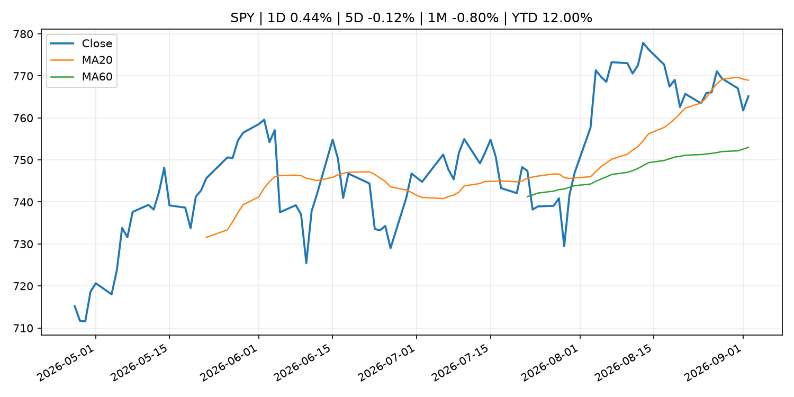
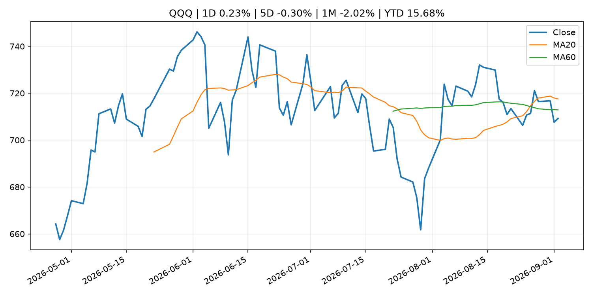
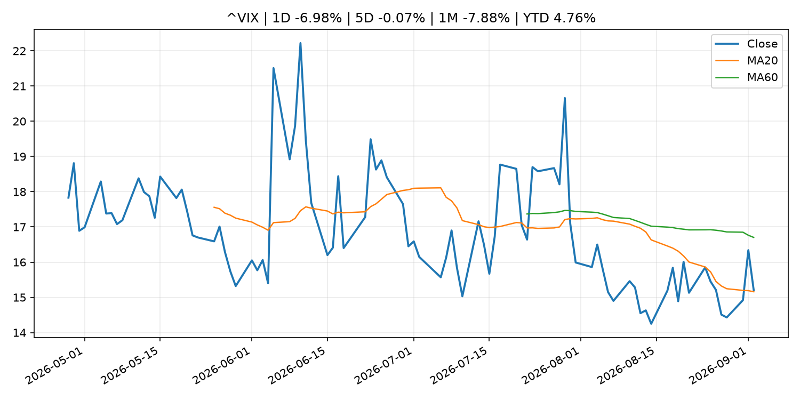
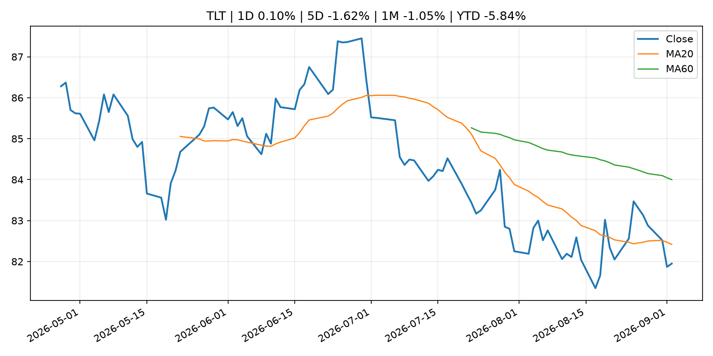
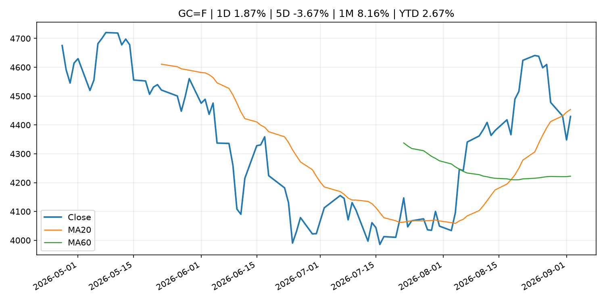
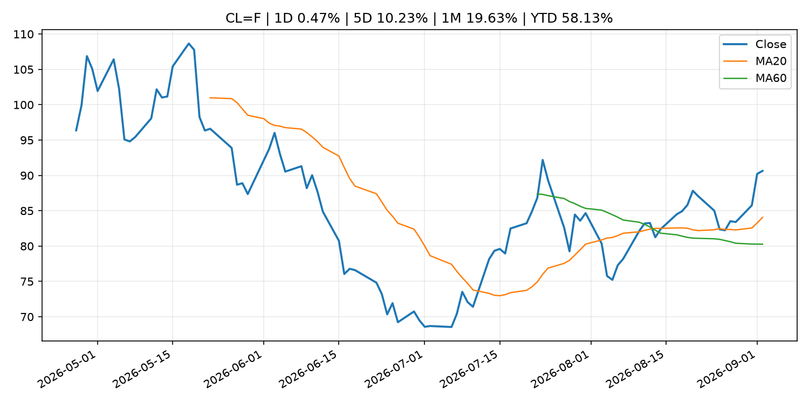
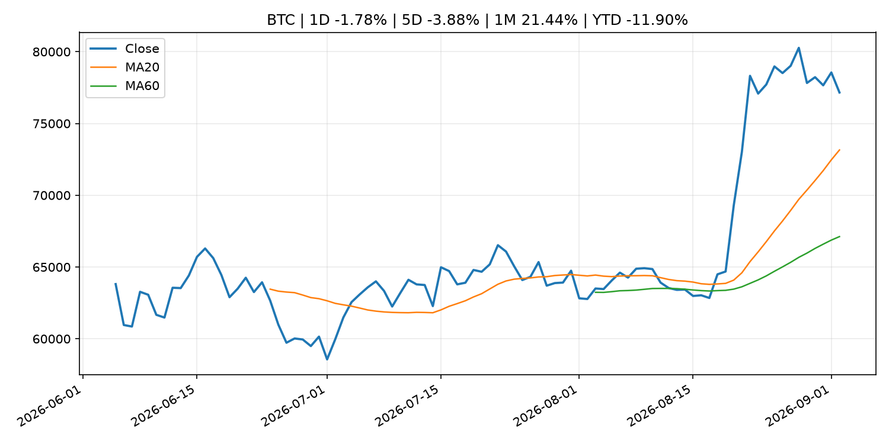
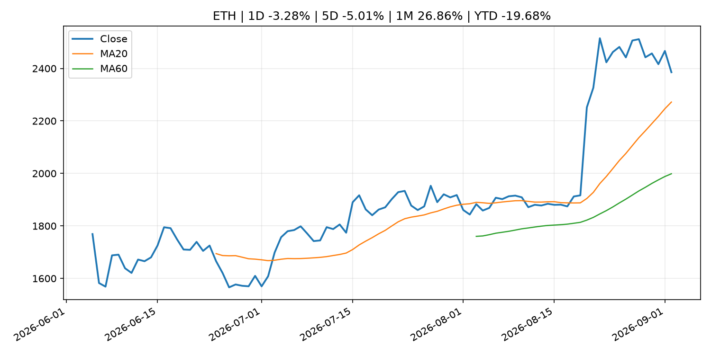
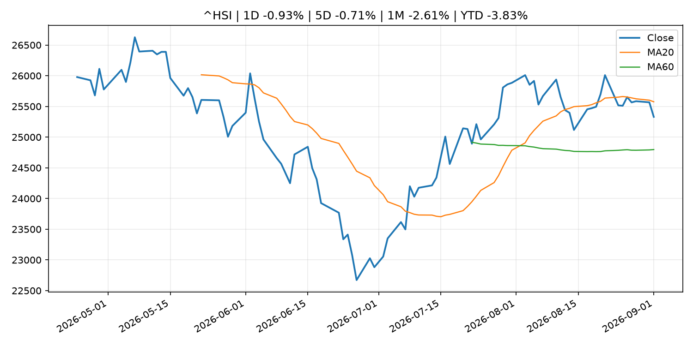

# Global Macro Morning Briefing - 2026-09-03

> Not financial advice / 非投资建议。

## 0. 今日总览
- 市场状态：unknown。市场信号不足，暂不判断明确状态。
- 今日三大主线：
  1. central_bank_decision: New York Fed's Williams says yield surge due to strong economic prospects
  2. central_bank_decision: Fed Governor Barr says he'll support rate hike if inflation doesn't ease
  3. earnings: Nvidia’s stock is climbing as investors get more confidence in an expanding base of AI customers
- 一句话结论：今日晨报重点关注：央行决策会重定价利率、汇率、久期资产和风险资产。；央行决策会重定价利率、汇率、久期资产和风险资产。。跨资产方面，SPY 1D 0.44%；QQQ 1D 0.23%；^VIX 1D -6.98%；TLT 1D 0.10%；GC=F 1D 1.87%；CL=F 1D 0.47%；BTC 1D -1.78%；ETH 1D -3.28%；市场信号不足，暂不判断明确状态。政策、通胀、利率、美元、美债、能源和加密监管仍是主要观察线索。所有结论仅基于公开数据与短摘要整理，不构成投资建议。

## 1. 隔夜跨资产市场
- 美股：SPY 1D 0.44%，QQQ 1D 0.23%，整体趋势需结合 VIX 和利率确认。
- 美债/美元：TLT 1D 0.10%，美元指数 1D -0.07%，是判断折现率压力的核心线索。
- 黄金/原油：黄金 1D 1.87%，原油 1D 0.47%，用于观察避险、通胀和地缘风险。
- 加密：BTC 1D -1.78%，ETH 1D -3.28%，关注是否独立于纳指走出加密自身行情。
- 港股/A股：恒生 1D -0.93%，沪深300/上证 1D n/a，重点看中国政策预期与人民币线索。
- 风险观察：关注后续数据是否确认当前跨资产信号。

### US_EQUITY

| symbol | latest close | 1D | 5D | 1M | YTD | trend |
|---|---:|---:|---:|---:|---:|---|
| SPY | 765.16 | 0.44% | -0.12% | -0.80% | 12.00% | range_bound |
| QQQ | 709.24 | 0.23% | -0.30% | -2.02% | 15.68% | range_bound |
| DIA | 530.62 | 0.54% | -0.68% | -1.82% | 9.72% | range_bound |
| IWM | 294.01 | 1.18% | -1.65% | -2.55% | 18.18% | range_bound |
| VTI | 376.88 | 0.46% | -0.36% | -1.03% | 12.06% | range_bound |

### US_MACRO_MARKET

| symbol | latest close | 1D | 5D | 1M | YTD | trend |
|---|---:|---:|---:|---:|---:|---|
| ^VIX | 15.20 | -6.98% | -0.07% | -7.88% | 4.76% | range_bound |
| DX-Y.NYB | 99.60 | -0.07% | 0.43% | -0.29% | 1.19% | range_bound |
| TLT | 81.95 | 0.10% | -1.62% | -1.05% | -5.84% | downtrend |
| IEF | 92.18 | 0.09% | -1.22% | -1.15% | -4.06% | downtrend |

### COMMODITIES

| symbol | latest close | 1D | 5D | 1M | YTD | trend |
|---|---:|---:|---:|---:|---:|---|
| GC=F | 4,429.50 | 1.87% | -3.67% | 8.16% | 2.67% | range_bound |
| SI=F | 65.90 | 1.99% | -3.07% | 9.74% | -6.59% | range_bound |
| CL=F | 90.64 | 0.47% | 10.23% | 19.63% | 58.13% | strong_uptrend |
| BZ=F | 95.25 | 0.63% | 8.44% | 20.02% | 56.79% | strong_uptrend |
| NG=F | 3.01 | 3.58% | 5.84% | 12.16% | -16.86% | range_bound |
| HG=F | 6.61 | 1.51% | 0.16% | -0.20% | 17.11% | uptrend |

### HK_MARKET

| symbol | latest close | 1D | 5D | 1M | YTD | trend |
|---|---:|---:|---:|---:|---:|---|
| ^HSI | 25,329.73 | -0.93% | -0.71% | -2.61% | -3.83% | range_bound |
| 0700.HK | 438.20 | -0.72% | -1.62% | -10.13% | -29.66% | downtrend |
| 9988.HK | 109.90 | -0.45% | -5.75% | -12.64% | -26.24% | range_bound |
| 3690.HK | 78.75 | 2.74% | 0.90% | -15.05% | -24.71% | range_bound |
| 1810.HK | 28.06 | 1.81% | -1.41% | 0.36% | -30.34% | uptrend |
| 1211.HK | 85.25 | -3.40% | -7.94% | -8.77% | -13.67% | range_bound |

### CRYPTO

| symbol | latest close | 1D | 5D | 1M | YTD | trend |
|---|---:|---:|---:|---:|---:|---|
| BTC | 77,157.91 | -1.78% | -3.88% | 21.44% | -11.90% | strong_uptrend |
| ETH | 2,385.55 | -3.28% | -5.01% | 26.86% | -19.68% | strong_uptrend |
| SOLANA | 99.97 | -2.96% | -8.44% | 31.16% | -19.72% | strong_uptrend |
| BINANCECOIN | 687.11 | -0.58% | -3.50% | 11.49% | -20.35% | strong_uptrend |
| RIPPLE | 1.35 | -2.22% | -7.22% | 31.99% | -26.73% | strong_uptrend |

## 2. 今日最重要的 10 条新闻
### 1. New York Fed's Williams says yield surge due to strong economic prospects
- 来源：CNBC Economy
- 时间：2026-09-02T17:21:59+00:00
- 地区：US
- 事件类型：central_bank_decision
- 重要性层级：Tier 1
- 一句话摘要：New York Fed President John Williams said higher Treasury yields reflect a strong economy as he weighs whether another interest rate hike is needed.
- 为什么重要：央行决策会重定价利率、汇率、久期资产和风险资产。
- 可能影响：主要影响 QQQ，方向为 negative，强度 high；鹰派政策提高折现率，压制成长股估值。
  - 资产：QQQ
    方向：negative
    强度：high
    原因：鹰派政策提高折现率，压制成长股估值。
  - 资产：SPY
    方向：negative
    强度：medium
    原因：更紧政策通常削弱风险偏好。
  - 资产：TLT
    方向：negative
    强度：high
    原因：利率上行通常压低长债价格。
  - 资产：DXY
    方向：positive
    强度：high
    原因：更高利率预期通常支撑美元。
  - 资产：BTC
    方向：negative
    强度：high
    原因：流动性收紧通常压制高 beta 加密资产。
- 原文链接：[https://www.cnbc.com/2026/09/02/new-york-feds-williams-says-yield-surge-due-to-strong-economic-prospects.html](https://www.cnbc.com/2026/09/02/new-york-feds-williams-says-yield-surge-due-to-strong-economic-prospects.html)

### 2. Fed Governor Barr says he'll support rate hike if inflation doesn't ease
- 来源：CNBC Economy
- 时间：2026-09-01T14:01:27+00:00
- 地区：US
- 事件类型：central_bank_decision
- 重要性层级：Tier 1
- 一句话摘要：The policymaker said he's concerned about "broader price pressures taking hold" as inflation has prevailed above the Fed's 2% target.
- 为什么重要：央行决策会重定价利率、汇率、久期资产和风险资产。
- 可能影响：主要影响 DXY，方向为 positive，强度 high；通胀压力可能推高政策利率预期并支撑美元。
  - 资产：DXY
    方向：positive
    强度：high
    原因：通胀压力可能推高政策利率预期并支撑美元。
  - 资产：TLT
    方向：negative
    强度：high
    原因：通胀上行通常推升收益率、压低长债价格。
  - 资产：QQQ
    方向：negative
    强度：high
    原因：更高利率对成长股估值折现率不利。
  - 资产：SPY
    方向：mixed
    强度：medium
    原因：名义增长可能支撑收入，但更高利率压制估值。
  - 资产：GC=F
    方向：mixed
    强度：medium
    原因：通胀对黄金是支撑，但实际利率上行会形成压力。
  - 资产：BTC
    方向：negative
    强度：high
    原因：流动性收紧通常压制高 beta 加密资产。
- 原文链接：[https://www.cnbc.com/2026/09/01/fed-governor-barr-says-hell-support-rate-hike-if-inflation-doesnt-ease.html](https://www.cnbc.com/2026/09/01/fed-governor-barr-says-hell-support-rate-hike-if-inflation-doesnt-ease.html)

### 3. Nvidia’s stock is climbing as investors get more confidence in an expanding base of AI customers
- 来源：MarketWatch Top Stories
- 时间：2026-09-02T21:38:00+00:00
- 地区：US
- 事件类型：earnings
- 重要性层级：Tier 2
- 一句话摘要：Dell’s earnings showed that demand for AI hardware extends beyond major cloud providers.
- 为什么重要：大型科技股盈利和资本开支会影响纳指、半导体和 AI 交易主线。
- 可能影响：主要影响 QQQ，方向为 mixed，强度 high；AI 资本开支会影响大型科技股盈利和估值预期。
  - 资产：QQQ
    方向：mixed
    强度：high
    原因：AI 资本开支会影响大型科技股盈利和估值预期。
  - 资产：SMH
    方向：mixed
    强度：high
    原因：AI 投资周期直接影响半导体需求。
  - 资产：NVDA
    方向：mixed
    强度：high
    原因：AI 训练和推理需求是英伟达收入预期核心变量。
  - 资产：MSFT
    方向：mixed
    强度：medium
    原因：云和 AI 资本开支影响利润率与增长叙事。
  - 资产：GOOGL
    方向：mixed
    强度：medium
    原因：AI 投资和搜索商业化影响估值。
  - 资产：META
    方向：mixed
    强度：medium
    原因：AI 基建支出与广告效率共同影响市场预期。
- 原文链接：[https://www.marketwatch.com/story/nvidias-stock-is-climbing-as-investors-get-more-confidence-in-an-expanding-base-of-ai-customers-a6e297f1?mod=mw_rss_topstories](https://www.marketwatch.com/story/nvidias-stock-is-climbing-as-investors-get-more-confidence-in-an-expanding-base-of-ai-customers-a6e297f1?mod=mw_rss_topstories)

### 4. Palantir’s stock is slumping. Why bond yields and Google may be to blame.
- 来源：MarketWatch Top Stories
- 时间：2026-09-02T21:12:00+00:00
- 地区：US
- 事件类型：earnings
- 重要性层级：Tier 2
- 一句话摘要：After a strong postearnings rally in August, Palantir’s rich valuation multiple is under pressure once again.
- 为什么重要：大型科技股盈利和资本开支会影响纳指、半导体和 AI 交易主线。
- 可能影响：主要影响 QQQ，方向为 mixed，强度 high；AI 资本开支会影响大型科技股盈利和估值预期。
  - 资产：QQQ
    方向：mixed
    强度：high
    原因：AI 资本开支会影响大型科技股盈利和估值预期。
  - 资产：SMH
    方向：mixed
    强度：high
    原因：AI 投资周期直接影响半导体需求。
  - 资产：NVDA
    方向：mixed
    强度：high
    原因：AI 训练和推理需求是英伟达收入预期核心变量。
  - 资产：MSFT
    方向：mixed
    强度：medium
    原因：云和 AI 资本开支影响利润率与增长叙事。
  - 资产：GOOGL
    方向：mixed
    强度：medium
    原因：AI 投资和搜索商业化影响估值。
  - 资产：META
    方向：mixed
    强度：medium
    原因：AI 基建支出与广告效率共同影响市场预期。
- 原文链接：[https://www.marketwatch.com/story/why-palantirs-stock-is-suffering-its-worst-slump-since-february-7fb3b289?mod=mw_rss_topstories](https://www.marketwatch.com/story/why-palantirs-stock-is-suffering-its-worst-slump-since-february-7fb3b289?mod=mw_rss_topstories)

### 5. SEC Announces Agenda and Panelists for Roundtable on Preparations for 24-Hour Trading
- 来源：SEC Press Releases
- 时间：2026-09-01T15:17:39-04:00
- 地区：US
- 事件类型：regulation
- 重要性层级：Tier 2
- 一句话摘要：The Securities and Exchange Commission today announced the agenda and panelists for its Sept. 17, 2026, roundtable on preparations for 24-hour trading.The roundtable will be held at the SEC’s headquarters at 100 F Street, N.E., Washington, D.C., from 10…
- 为什么重要：监管变化会改变行业盈利预期和资产风险溢价。
- 可能影响：主要影响 BTC，方向为 mixed，强度 high；加密监管或 ETF 进展会改变 BTC 的资金流和风险溢价。
  - 资产：BTC
    方向：mixed
    强度：high
    原因：加密监管或 ETF 进展会改变 BTC 的资金流和风险溢价。
  - 资产：ETH
    方向：mixed
    强度：high
    原因：监管框架会影响 ETH 产品化和机构参与度。
  - 资产：COIN
    方向：mixed
    强度：medium
    原因：监管清晰度和执法风险会影响交易平台估值。
  - 资产：crypto market
    方向：mixed
    强度：high
    原因：信息影响整个加密市场结构，但方向取决于细节。
- 原文链接：[https://www.sec.gov/newsroom/press-releases/2026-83-sec-announces-agenda-panelists-roundtable-preparations-24-hour-trading](https://www.sec.gov/newsroom/press-releases/2026-83-sec-announces-agenda-panelists-roundtable-preparations-24-hour-trading)

### 6. SEC Charges San Francisco Bay Area Private Fund Executives with Multimillion Dollar Ponzi-Like Scheme
- 来源：SEC Press Releases
- 时间：2026-09-01T13:52:32-04:00
- 地区：US
- 事件类型：regulation
- 重要性层级：Tier 2
- 一句话摘要：The Securities and Exchange Commission today charged Mark D. Hanf, the former CEO of Novato, California-based Pacific Private Money Group LLC (PPMG), and Hoai-Nam Chu Phan, the former COO of a PPMG subsidiary, with orchestrating an offering fraud that…
- 为什么重要：监管变化会改变行业盈利预期和资产风险溢价。
- 可能影响：主要影响 BTC，方向为 mixed，强度 high；加密监管或 ETF 进展会改变 BTC 的资金流和风险溢价。
  - 资产：BTC
    方向：mixed
    强度：high
    原因：加密监管或 ETF 进展会改变 BTC 的资金流和风险溢价。
  - 资产：ETH
    方向：mixed
    强度：high
    原因：监管框架会影响 ETH 产品化和机构参与度。
  - 资产：COIN
    方向：mixed
    强度：medium
    原因：监管清晰度和执法风险会影响交易平台估值。
  - 资产：crypto market
    方向：mixed
    强度：high
    原因：信息影响整个加密市场结构，但方向取决于细节。
- 原文链接：[https://www.sec.gov/newsroom/press-releases/2026-82-sec-charges-san-francisco-bay-area-private-fund-executives-multimillion-dollar-ponzi-scheme](https://www.sec.gov/newsroom/press-releases/2026-82-sec-charges-san-francisco-bay-area-private-fund-executives-multimillion-dollar-ponzi-scheme)

### 7. SEC proposes transfer agent rule, sets event to figure out round-the-clock U.S. trading
- 来源：CoinDesk
- 时间：2026-09-01T23:55:46+00:00
- 地区：global
- 事件类型：regulation
- 重要性层级：Tier 2
- 一句话摘要：SEC proposes transfer agent rule, sets event to figure out round-the-clock U.S. trading
- 为什么重要：监管变化会改变行业盈利预期和资产风险溢价。
- 可能影响：主要影响 BTC，方向为 mixed，强度 high；加密监管或 ETF 进展会改变 BTC 的资金流和风险溢价。
  - 资产：BTC
    方向：mixed
    强度：high
    原因：加密监管或 ETF 进展会改变 BTC 的资金流和风险溢价。
  - 资产：ETH
    方向：mixed
    强度：high
    原因：监管框架会影响 ETH 产品化和机构参与度。
  - 资产：COIN
    方向：mixed
    强度：medium
    原因：监管清晰度和执法风险会影响交易平台估值。
  - 资产：crypto market
    方向：mixed
    强度：high
    原因：信息影响整个加密市场结构，但方向取决于细节。
- 原文链接：[https://www.coindesk.com/policy/2026/09/01/sec-proposes-transfer-agent-rule-sets-event-to-figure-out-round-the-clock-u-s-trading](https://www.coindesk.com/policy/2026/09/01/sec-proposes-transfer-agent-rule-sets-event-to-figure-out-round-the-clock-u-s-trading)

### 8. SEC Proposes to Modernize Rules for Registered Transfer Agents
- 来源：SEC Press Releases
- 时间：2026-09-01T10:57:00-04:00
- 地区：US
- 事件类型：regulation
- 重要性层级：Tier 2
- 一句话摘要：The Securities and Exchange Commission today proposed to update the rules and forms that apply to registered transfer agents.Transfer agents are a key component of the national clearance and settlement system. Transfer agents now perform a more diverse…
- 为什么重要：监管变化会改变行业盈利预期和资产风险溢价。
- 可能影响：主要影响 BTC，方向为 mixed，强度 high；加密监管或 ETF 进展会改变 BTC 的资金流和风险溢价。
  - 资产：BTC
    方向：mixed
    强度：high
    原因：加密监管或 ETF 进展会改变 BTC 的资金流和风险溢价。
  - 资产：ETH
    方向：mixed
    强度：high
    原因：监管框架会影响 ETH 产品化和机构参与度。
  - 资产：COIN
    方向：mixed
    强度：medium
    原因：监管清晰度和执法风险会影响交易平台估值。
  - 资产：crypto market
    方向：mixed
    强度：high
    原因：信息影响整个加密市场结构，但方向取决于细节。
- 原文链接：[https://www.sec.gov/newsroom/press-releases/2026-81-sec-proposes-modernize-rules-registered-transfer-agents](https://www.sec.gov/newsroom/press-releases/2026-81-sec-proposes-modernize-rules-registered-transfer-agents)

### 9. Citi, Goldman, other global banks and asset managers team up on stablecoin venture
- 来源：CoinDesk
- 时间：2026-09-01T15:36:27+00:00
- 地区：global
- 事件类型：crypto_market_structure
- 重要性层级：Tier 2
- 一句话摘要：Citi, Goldman, other global banks and asset managers team up on stablecoin venture
- 为什么重要：加密市场结构和监管变化会影响 BTC、ETH 及相关股票的风险溢价。
- 可能影响：主要影响 BTC，方向为 mixed，强度 high；加密监管或 ETF 进展会改变 BTC 的资金流和风险溢价。
  - 资产：BTC
    方向：mixed
    强度：high
    原因：加密监管或 ETF 进展会改变 BTC 的资金流和风险溢价。
  - 资产：ETH
    方向：mixed
    强度：high
    原因：监管框架会影响 ETH 产品化和机构参与度。
  - 资产：COIN
    方向：mixed
    强度：medium
    原因：监管清晰度和执法风险会影响交易平台估值。
  - 资产：crypto market
    方向：mixed
    强度：high
    原因：信息影响整个加密市场结构，但方向取决于细节。
- 原文链接：[https://www.coindesk.com/business/2026/09/01/citi-goldman-other-global-banks-and-asset-managers-team-up-on-stablecoin-venture](https://www.coindesk.com/business/2026/09/01/citi-goldman-other-global-banks-and-asset-managers-team-up-on-stablecoin-venture)

### 10. Broadcom’s stock falls despite upbeat earnings, extending a frustrating stretch for investors
- 来源：MarketWatch Top Stories
- 时间：2026-09-02T22:28:00+00:00
- 地区：US
- 事件类型：earnings
- 重要性层级：Tier 2
- 一句话摘要：Broadcom topped expectations with its latest quarterly financial results, but that wasn’t enough to send its stock higher.
- 为什么重要：大型科技股盈利和资本开支会影响纳指、半导体和 AI 交易主线。
- 可能影响：可能影响利率、汇率、风险资产或大宗商品预期，但当前公开信息不足以判断明确方向。
  - 资产：暂无明确资产映射
  - 方向：unknown
  - 强度：low
  - 原因：公开信息不足以判断方向。
- 原文链接：[https://www.marketwatch.com/story/broadcoms-stock-falls-despite-upbeat-earnings-extending-a-frustrating-stretch-for-investors-81de3f53?mod=mw_rss_topstories](https://www.marketwatch.com/story/broadcoms-stock-falls-despite-upbeat-earnings-extending-a-frustrating-stretch-for-investors-81de3f53?mod=mw_rss_topstories)

## 3. 政策与央行观察
### 1. New York Fed's Williams says yield surge due to strong economic prospects
- 来源：CNBC Economy
- 时间：2026-09-02T17:21:59+00:00
- 地区：US
- 事件类型：central_bank_decision
- 重要性层级：Tier 1
- 一句话摘要：New York Fed President John Williams said higher Treasury yields reflect a strong economy as he weighs whether another interest rate hike is needed.
- 为什么重要：央行决策会重定价利率、汇率、久期资产和风险资产。
- 可能影响：主要影响 QQQ，方向为 negative，强度 high；鹰派政策提高折现率，压制成长股估值。
  - 资产：QQQ
    方向：negative
    强度：high
    原因：鹰派政策提高折现率，压制成长股估值。
  - 资产：SPY
    方向：negative
    强度：medium
    原因：更紧政策通常削弱风险偏好。
  - 资产：TLT
    方向：negative
    强度：high
    原因：利率上行通常压低长债价格。
  - 资产：DXY
    方向：positive
    强度：high
    原因：更高利率预期通常支撑美元。
  - 资产：BTC
    方向：negative
    强度：high
    原因：流动性收紧通常压制高 beta 加密资产。
- 原文链接：[https://www.cnbc.com/2026/09/02/new-york-feds-williams-says-yield-surge-due-to-strong-economic-prospects.html](https://www.cnbc.com/2026/09/02/new-york-feds-williams-says-yield-surge-due-to-strong-economic-prospects.html)

### 2. Fed Governor Barr says he'll support rate hike if inflation doesn't ease
- 来源：CNBC Economy
- 时间：2026-09-01T14:01:27+00:00
- 地区：US
- 事件类型：central_bank_decision
- 重要性层级：Tier 1
- 一句话摘要：The policymaker said he's concerned about "broader price pressures taking hold" as inflation has prevailed above the Fed's 2% target.
- 为什么重要：央行决策会重定价利率、汇率、久期资产和风险资产。
- 可能影响：主要影响 DXY，方向为 positive，强度 high；通胀压力可能推高政策利率预期并支撑美元。
  - 资产：DXY
    方向：positive
    强度：high
    原因：通胀压力可能推高政策利率预期并支撑美元。
  - 资产：TLT
    方向：negative
    强度：high
    原因：通胀上行通常推升收益率、压低长债价格。
  - 资产：QQQ
    方向：negative
    强度：high
    原因：更高利率对成长股估值折现率不利。
  - 资产：SPY
    方向：mixed
    强度：medium
    原因：名义增长可能支撑收入，但更高利率压制估值。
  - 资产：GC=F
    方向：mixed
    强度：medium
    原因：通胀对黄金是支撑，但实际利率上行会形成压力。
  - 资产：BTC
    方向：negative
    强度：high
    原因：流动性收紧通常压制高 beta 加密资产。
- 原文链接：[https://www.cnbc.com/2026/09/01/fed-governor-barr-says-hell-support-rate-hike-if-inflation-doesnt-ease.html](https://www.cnbc.com/2026/09/01/fed-governor-barr-says-hell-support-rate-hike-if-inflation-doesnt-ease.html)

### 3. SEC Announces Agenda and Panelists for Roundtable on Preparations for 24-Hour Trading
- 来源：SEC Press Releases
- 时间：2026-09-01T15:17:39-04:00
- 地区：US
- 事件类型：regulation
- 重要性层级：Tier 2
- 一句话摘要：The Securities and Exchange Commission today announced the agenda and panelists for its Sept. 17, 2026, roundtable on preparations for 24-hour trading.The roundtable will be held at the SEC’s headquarters at 100 F Street, N.E., Washington, D.C., from 10…
- 为什么重要：监管变化会改变行业盈利预期和资产风险溢价。
- 可能影响：主要影响 BTC，方向为 mixed，强度 high；加密监管或 ETF 进展会改变 BTC 的资金流和风险溢价。
  - 资产：BTC
    方向：mixed
    强度：high
    原因：加密监管或 ETF 进展会改变 BTC 的资金流和风险溢价。
  - 资产：ETH
    方向：mixed
    强度：high
    原因：监管框架会影响 ETH 产品化和机构参与度。
  - 资产：COIN
    方向：mixed
    强度：medium
    原因：监管清晰度和执法风险会影响交易平台估值。
  - 资产：crypto market
    方向：mixed
    强度：high
    原因：信息影响整个加密市场结构，但方向取决于细节。
- 原文链接：[https://www.sec.gov/newsroom/press-releases/2026-83-sec-announces-agenda-panelists-roundtable-preparations-24-hour-trading](https://www.sec.gov/newsroom/press-releases/2026-83-sec-announces-agenda-panelists-roundtable-preparations-24-hour-trading)

### 4. SEC Charges San Francisco Bay Area Private Fund Executives with Multimillion Dollar Ponzi-Like Scheme
- 来源：SEC Press Releases
- 时间：2026-09-01T13:52:32-04:00
- 地区：US
- 事件类型：regulation
- 重要性层级：Tier 2
- 一句话摘要：The Securities and Exchange Commission today charged Mark D. Hanf, the former CEO of Novato, California-based Pacific Private Money Group LLC (PPMG), and Hoai-Nam Chu Phan, the former COO of a PPMG subsidiary, with orchestrating an offering fraud that…
- 为什么重要：监管变化会改变行业盈利预期和资产风险溢价。
- 可能影响：主要影响 BTC，方向为 mixed，强度 high；加密监管或 ETF 进展会改变 BTC 的资金流和风险溢价。
  - 资产：BTC
    方向：mixed
    强度：high
    原因：加密监管或 ETF 进展会改变 BTC 的资金流和风险溢价。
  - 资产：ETH
    方向：mixed
    强度：high
    原因：监管框架会影响 ETH 产品化和机构参与度。
  - 资产：COIN
    方向：mixed
    强度：medium
    原因：监管清晰度和执法风险会影响交易平台估值。
  - 资产：crypto market
    方向：mixed
    强度：high
    原因：信息影响整个加密市场结构，但方向取决于细节。
- 原文链接：[https://www.sec.gov/newsroom/press-releases/2026-82-sec-charges-san-francisco-bay-area-private-fund-executives-multimillion-dollar-ponzi-scheme](https://www.sec.gov/newsroom/press-releases/2026-82-sec-charges-san-francisco-bay-area-private-fund-executives-multimillion-dollar-ponzi-scheme)

### 5. SEC proposes transfer agent rule, sets event to figure out round-the-clock U.S. trading
- 来源：CoinDesk
- 时间：2026-09-01T23:55:46+00:00
- 地区：global
- 事件类型：regulation
- 重要性层级：Tier 2
- 一句话摘要：SEC proposes transfer agent rule, sets event to figure out round-the-clock U.S. trading
- 为什么重要：监管变化会改变行业盈利预期和资产风险溢价。
- 可能影响：主要影响 BTC，方向为 mixed，强度 high；加密监管或 ETF 进展会改变 BTC 的资金流和风险溢价。
  - 资产：BTC
    方向：mixed
    强度：high
    原因：加密监管或 ETF 进展会改变 BTC 的资金流和风险溢价。
  - 资产：ETH
    方向：mixed
    强度：high
    原因：监管框架会影响 ETH 产品化和机构参与度。
  - 资产：COIN
    方向：mixed
    强度：medium
    原因：监管清晰度和执法风险会影响交易平台估值。
  - 资产：crypto market
    方向：mixed
    强度：high
    原因：信息影响整个加密市场结构，但方向取决于细节。
- 原文链接：[https://www.coindesk.com/policy/2026/09/01/sec-proposes-transfer-agent-rule-sets-event-to-figure-out-round-the-clock-u-s-trading](https://www.coindesk.com/policy/2026/09/01/sec-proposes-transfer-agent-rule-sets-event-to-figure-out-round-the-clock-u-s-trading)

### 6. SEC Proposes to Modernize Rules for Registered Transfer Agents
- 来源：SEC Press Releases
- 时间：2026-09-01T10:57:00-04:00
- 地区：US
- 事件类型：regulation
- 重要性层级：Tier 2
- 一句话摘要：The Securities and Exchange Commission today proposed to update the rules and forms that apply to registered transfer agents.Transfer agents are a key component of the national clearance and settlement system. Transfer agents now perform a more diverse…
- 为什么重要：监管变化会改变行业盈利预期和资产风险溢价。
- 可能影响：主要影响 BTC，方向为 mixed，强度 high；加密监管或 ETF 进展会改变 BTC 的资金流和风险溢价。
  - 资产：BTC
    方向：mixed
    强度：high
    原因：加密监管或 ETF 进展会改变 BTC 的资金流和风险溢价。
  - 资产：ETH
    方向：mixed
    强度：high
    原因：监管框架会影响 ETH 产品化和机构参与度。
  - 资产：COIN
    方向：mixed
    强度：medium
    原因：监管清晰度和执法风险会影响交易平台估值。
  - 资产：crypto market
    方向：mixed
    强度：high
    原因：信息影响整个加密市场结构，但方向取决于细节。
- 原文链接：[https://www.sec.gov/newsroom/press-releases/2026-81-sec-proposes-modernize-rules-registered-transfer-agents](https://www.sec.gov/newsroom/press-releases/2026-81-sec-proposes-modernize-rules-registered-transfer-agents)

### 7. Citi, Goldman, other global banks and asset managers team up on stablecoin venture
- 来源：CoinDesk
- 时间：2026-09-01T15:36:27+00:00
- 地区：global
- 事件类型：crypto_market_structure
- 重要性层级：Tier 2
- 一句话摘要：Citi, Goldman, other global banks and asset managers team up on stablecoin venture
- 为什么重要：加密市场结构和监管变化会影响 BTC、ETH 及相关股票的风险溢价。
- 可能影响：主要影响 BTC，方向为 mixed，强度 high；加密监管或 ETF 进展会改变 BTC 的资金流和风险溢价。
  - 资产：BTC
    方向：mixed
    强度：high
    原因：加密监管或 ETF 进展会改变 BTC 的资金流和风险溢价。
  - 资产：ETH
    方向：mixed
    强度：high
    原因：监管框架会影响 ETH 产品化和机构参与度。
  - 资产：COIN
    方向：mixed
    强度：medium
    原因：监管清晰度和执法风险会影响交易平台估值。
  - 资产：crypto market
    方向：mixed
    强度：high
    原因：信息影响整个加密市场结构，但方向取决于细节。
- 原文链接：[https://www.coindesk.com/business/2026/09/01/citi-goldman-other-global-banks-and-asset-managers-team-up-on-stablecoin-venture](https://www.coindesk.com/business/2026/09/01/citi-goldman-other-global-banks-and-asset-managers-team-up-on-stablecoin-venture)

### 8. Speech by Board Member TAKATA in Sapporo (Economic Activity, Prices, and Monetary Policy in Japan)
- 来源：Bank of Japan Announcements
- 时间：2026-09-02T10:30:00+09:00
- 地区：Japan
- 事件类型：central_bank_speech
- 重要性层级：Tier 2
- 一句话摘要：Speech by Board Member TAKATA in Sapporo (Economic Activity, Prices, and Monetary Policy in Japan)
- 为什么重要：央行官员表态可能影响市场对下一次会议的定价。
- 可能影响：可能影响利率、汇率、风险资产或大宗商品预期，但当前公开信息不足以判断明确方向。
  - 资产：暂无明确资产映射
  - 方向：unknown
  - 强度：low
  - 原因：公开信息不足以判断方向。
- 原文链接：[http://www.boj.or.jp/en/about/press/koen_2026/ko260902a.htm](http://www.boj.or.jp/en/about/press/koen_2026/ko260902a.htm)

## 4. 市场异动与图表
- SPY 上涨 0.44%
- VIX 下跌 -6.98%
- Gold 上涨 1.87%
- ETH 下跌 -3.28%

### SPY

### QQQ

### ^VIX

### TLT

### GC=F

### CL=F

### BTC

### ETH

### ^HSI

## 5. 华尔街与机构公开观点
- 暂无可靠公开观点。

## 6. 今日重点关注
- 经济数据：经济数据：暂无可靠公开日历数据；如配置经济日历源后可自动填充。
- 央行讲话：央行讲话：暂无可靠公开日历数据；重点跟踪 Fed、ECB、BoJ、PBOC 官网 RSS。
- 财报：财报：暂无可靠数据。
- 政策事件：政策事件：暂无可靠数据。
- 风险提醒：风险提醒：关注数据源失败项、突发地缘风险、利率和美元的二阶反应。

## 7. 英文金融表达与宏观概念
- **inflation expectations**：通胀预期，指家庭、企业或市场对未来通胀的预估。 例句：Inflation expectations can shape wage bargaining and bond yields.
- **real yield**：实际收益率，名义利率扣除通胀预期后的收益率。 例句：Gold often reacts more to real yields than nominal yields.
- **terminal rate**：终端利率，市场预期本轮加息周期的最高政策利率。 例句：A higher terminal rate can pressure growth stocks.
- **risk-off**：避险模式，资金偏向美元、国债、黄金等防御资产。 例句：A geopolitical shock can push markets into risk-off mode.
- **market structure**：市场结构，指交易、托管、清算、ETF、监管等制度安排。 例句：Crypto market structure rules can affect institutional participation.
- **AI capex**：AI 资本开支，指云厂商和科技公司投入 AI 基建的支出。 例句：AI capex guidance can move semiconductor stocks.

## 8. 背景材料
- [Sources of Changes in Current Account Balances (Projections for Sept.)](http://www.boj.or.jp/en/statistics/boj/fm/juqp/juqp2609.xlsx)（Bank of Japan Announcements，other）：Sources of Changes in Current Account Balances (Projections for Sept.)
- [Kraken parent Payward delays IPO to second quarter of 2027 at earliest](https://www.coindesk.com/business/2026/09/02/kraken-parent-payward-pushes-ipo-back-to-mid-2027-at-earliest)（CoinDesk，other）：Kraken parent Payward delays IPO to second quarter of 2027 at earliest
- [CrowdStrike and federal authorities dismantle Russian malware that secretly stole crypto for 8 years](https://www.coindesk.com/tech/2026/09/02/crowdstrike-and-federal-authorities-dismantle-russian-malware-that-secretly-stole-crypto-for-8-years)（CoinDesk，other）：CrowdStrike and federal authorities dismantle Russian malware that secretly stole crypto for 8 years
- [The bearish 'Bart Simpson' pattern is back as bitcoin and XRP prices pull back](https://www.coindesk.com/markets/2026/09/02/bitcoin-flashes-the-bart-simpsom-pattern-analyst-debate-whether-it-will-actually-form)（CoinDesk，other）：The bearish 'Bart Simpson' pattern is back as bitcoin and XRP prices pull back
- [Capital B aims to add 376 BTC to bitcoin treasury following $8.8 million Adam Back investment](https://www.coindesk.com/business/2026/08/29/capital-b-aims-to-add-376-btc-to-bitcoin-treasury-following-usd8-8-million-adam-back-investment)（CoinDesk，other）：Capital B aims to add 376 BTC to bitcoin treasury following $8.8 million Adam Back investment
- [A Fed rate increase would be a mistake, some observers say as bitcoin, gold, stocks fall](https://www.coindesk.com/daybook-us/2026/09/02/a-fed-rate-increase-would-be-a-mistake-some-observers-say-as-bitcoin-gold-stocks-fall)（CoinDesk，other）：A Fed rate increase would be a mistake, some observers say as bitcoin, gold, stocks fall
- [Bitcoin slips below $76,500 as U.S. strikes on Iran send oil above $93](https://www.coindesk.com/markets/2026/09/02/bitcoin-slips-below-usd77-000-as-u-s-strikes-on-iran-send-oil-above-usd93)（CoinDesk，other）：Bitcoin slips below $76,500 as U.S. strikes on Iran send oil above $93
- [Live updates: Bitcoin trades near $77,000, with central bank policy rate decisions taking center stage](https://www.coindesk.com/business/2026/09/02/live-updates-blackrock-s-ibit-drives-usd236-million-bitcoin-etf-outflow)（CoinDesk，other）：Live updates: Bitcoin trades near $77,000, with central bank policy rate decisions taking center stage
- [Japanese Government Bonds Held by the Bank of Japan](http://www.boj.or.jp/en/statistics/boj/other/mei/release/2026/mei260831.xlsx)（Bank of Japan Announcements，other）：Japanese Government Bonds Held by the Bank of Japan
- [Collateral Accepted by the Bank of Japan (End of Aug.)](http://www.boj.or.jp/en/statistics/boj/other/col/col2608.xlsx)（Bank of Japan Announcements，other）：Collateral Accepted by the Bank of Japan (End of Aug.)
- [XRP ETFs pull in $170 million over 11 days. Goldman tops institutional holders](https://www.coindesk.com/markets/2026/09/02/xrp-etfs-pull-in-usd160-million-over-nine-days-as-goldman-tops-institutional-holders)（CoinDesk，other）：XRP ETFs pull in $170 million over 11 days. Goldman tops institutional holders
- [A China indicator that supports risk-taking in stocks and bitcoin is flashing red](https://www.coindesk.com/markets/2026/09/02/a-china-indicator-that-greases-risk-taking-in-stocks-and-bitcoin-is-flashing-red)（CoinDesk，other）：A China indicator that supports risk-taking in stocks and bitcoin is flashing red
- [Bitcoin withstands $90 oil and rising yields while gold slides. A firm dollar is the catch](https://www.coindesk.com/markets/2026/09/02/bitcoin-withstands-usd90-oil-and-rising-yields-as-gold-slides-a-firm-dollar-is-the-catch)（CoinDesk，other）：Bitcoin withstands $90 oil and rising yields while gold slides. A firm dollar is the catch
- [Bank of Japan Accounts (August 31)](http://www.boj.or.jp/en/statistics/boj/other/acmai/release/2026/ac260831.htm)（Bank of Japan Announcements，routine_announcement）：Bank of Japan Accounts (August 31)
- [Monetary Base (Aug.)](http://www.boj.or.jp/en/statistics/boj/other/mb/mb.htm)（Bank of Japan Announcements，other）：Monetary Base (Aug.)
- [Boris Vujčić: Listening to households: expectations, behaviour and monetary policy](https://www.ecb.europa.eu//press/key/date/2026/html/ecb.sp260901~bb28f33f54.en.html)（ECB Press Releases，other）：Boris Vujčić: Listening to households: expectations, behaviour and monetary policy
- [Bitcoin enters ‘Rektember’ as rate-hike risk combines with seasonality to threaten rally](https://www.coindesk.com/markets/2026/09/01/bitcoin-enters-rektember-as-rate-hike-risks-threaten-its-august-rally)（CoinDesk，other）：Bitcoin enters ‘Rektember’ as rate-hike risk combines with seasonality to threaten rally
- [Bond Market Survey (August 2026)](http://www.boj.or.jp/en/paym/bond/bond_list/bond2608.pdf)（Bank of Japan Announcements，other）：Bond Market Survey (August 2026)
- [Sources of Changes in Current Account Balances and Market Operations (Aug.)](http://www.boj.or.jp/en/statistics/boj/fm/juqf/juqf08.xlsx)（Bank of Japan Announcements，other）：Sources of Changes in Current Account Balances and Market Operations (Aug.)

## 9. 数据源、失败项与免责声明
- 采集时间：2026-09-02T23:52:20
- 数据源：公开 RSS、Yahoo Finance、CoinGecko、AKShare、FRED、SEC data.sec.gov，以及用户自有 inputs/reports 文件。
- 合规说明：不绕过 WSJ、Bloomberg、FT、Reuters 等付费墙；对付费媒体只使用公开 RSS 标题、摘要、链接和发布时间。
- 免责声明：Not financial advice / 非投资建议。本项目仅供个人学习、研究和信息整理，不构成投资建议、交易建议或任何收益承诺。
- 失败或跳过的数据源：
  - crypto data failed coin=dogecoin
  - China market data failed symbol=上证指数: empty dataframe
  - China market data failed symbol=深证成指: empty dataframe
  - China market data failed symbol=创业板指: empty dataframe
  - China market data failed symbol=沪深300: empty dataframe
  - China market data failed symbol=中证500: empty dataframe
  - China market data failed symbol=科创50: empty dataframe
  - FRED_API_KEY not set; skipping FRED macro series
  - SEC failed cik=0000320193
  - SEC failed cik=0000789019
  - SEC failed cik=0001045810
  - SEC failed cik=0001318605
  - SEC failed cik=0001577552
