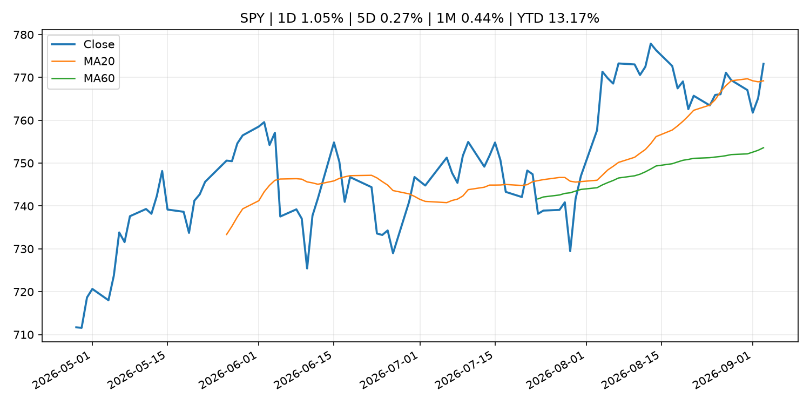
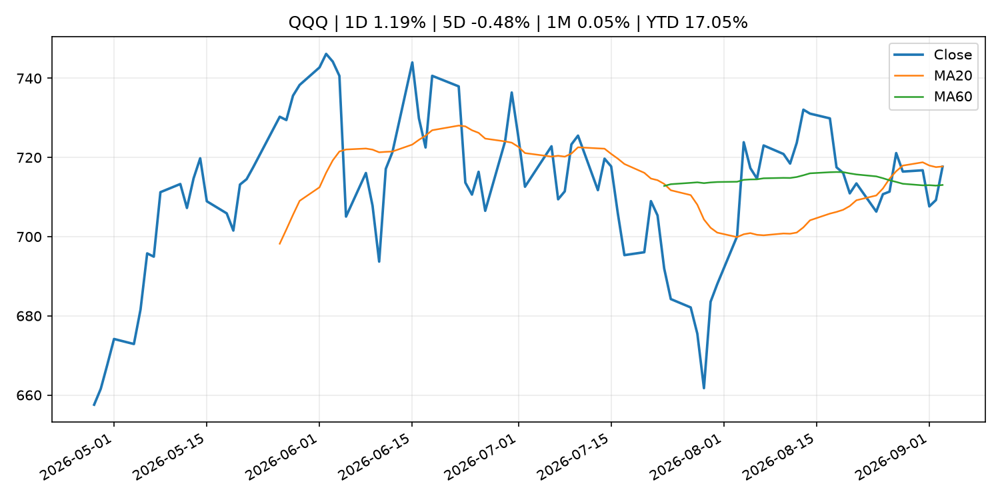
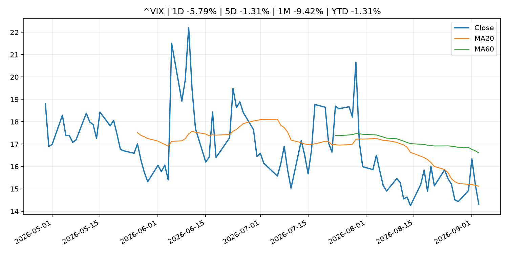
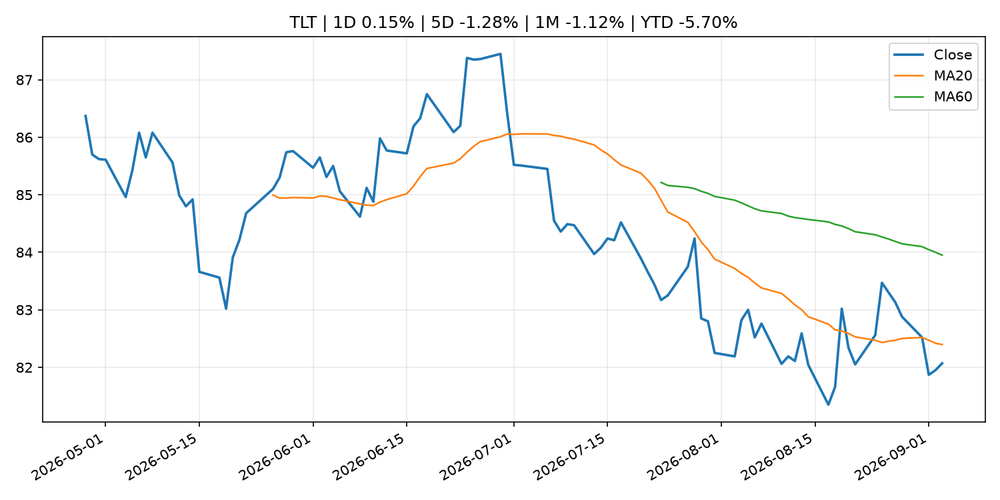
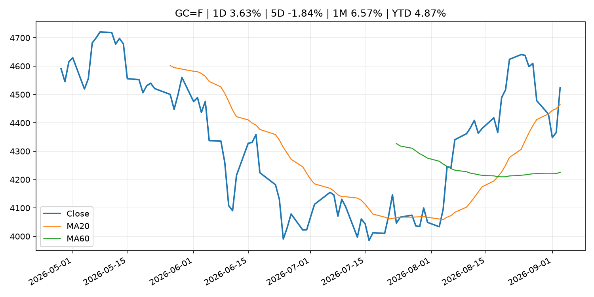
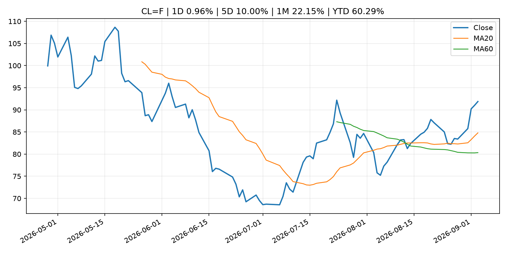
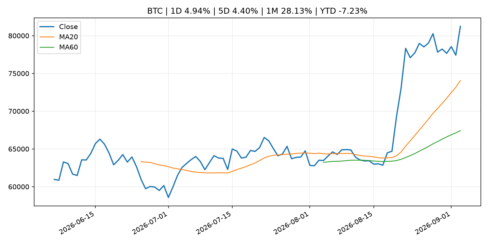
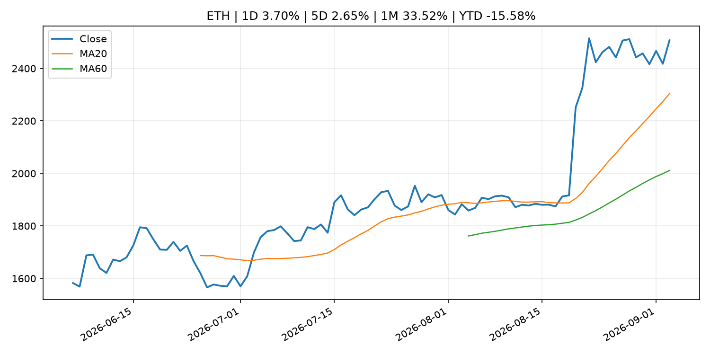
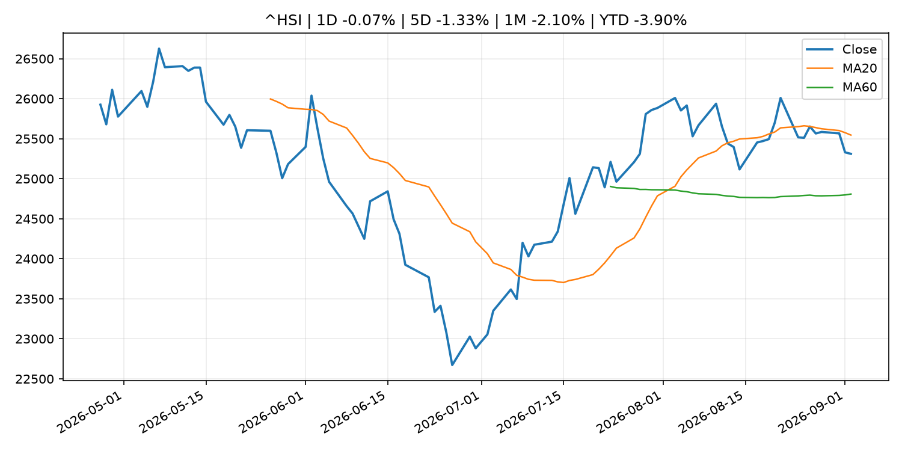

# Global Macro Morning Briefing - 2026-09-04

> Not financial advice / 非投资建议。

## 0. 今日总览
- 市场状态：risk_on。股指上涨、波动率或美元回落，市场更接近风险偏好改善。
- 今日三大主线：
  1. central_bank_decision: New York Fed's Williams says yield surge due to strong economic prospects
  2. fiscal_policy: China hits back at G20 statement on its reliance on exports, accusing them of 'promoting protectionism'
  3. earnings: Here’s what Nvidia’s $13 billion Hugging Face deal means for the world of AI
- 一句话结论：今日晨报重点关注：央行决策会重定价利率、汇率、久期资产和风险资产。；财政和贸易政策会影响增长、通胀、企业利润和跨境资本流。。跨资产方面，SPY 1D 1.05%；QQQ 1D 1.19%；^VIX 1D -5.79%；TLT 1D 0.15%；GC=F 1D 3.63%；CL=F 1D 0.96%；BTC 1D 4.94%；ETH 1D 3.70%；股指上涨、波动率或美元回落，市场更接近风险偏好改善。政策、通胀、利率、美元、美债、能源和加密监管仍是主要观察线索。所有结论仅基于公开数据与短摘要整理，不构成投资建议。

## 1. 隔夜跨资产市场
- 美股：SPY 1D 1.05%，QQQ 1D 1.19%，整体趋势需结合 VIX 和利率确认。
- 美债/美元：TLT 1D 0.15%，美元指数 1D -0.53%，是判断折现率压力的核心线索。
- 黄金/原油：黄金 1D 3.63%，原油 1D 0.96%，用于观察避险、通胀和地缘风险。
- 加密：BTC 1D 4.94%，ETH 1D 3.70%，关注是否独立于纳指走出加密自身行情。
- 港股/A股：恒生 1D -0.07%，沪深300/上证 1D n/a，重点看中国政策预期与人民币线索。
- 风险观察：确认风险偏好是否扩散到小盘股、信用利差和周期品。

### US_EQUITY

| symbol | latest close | 1D | 5D | 1M | YTD | trend |
|---|---:|---:|---:|---:|---:|---|
| SPY | 773.17 | 1.05% | 0.27% | 0.44% | 13.17% | uptrend |
| QQQ | 717.67 | 1.19% | -0.48% | 0.05% | 17.05% | range_bound |
| DIA | 536.93 | 1.19% | 0.32% | -1.08% | 11.02% | uptrend |
| IWM | 295.19 | 0.40% | -1.54% | -1.53% | 18.66% | range_bound |
| VTI | 380.93 | 1.07% | 0.08% | 0.34% | 13.27% | uptrend |

### US_MACRO_MARKET

| symbol | latest close | 1D | 5D | 1M | YTD | trend |
|---|---:|---:|---:|---:|---:|---|
| ^VIX | 14.32 | -5.79% | -1.31% | -9.42% | -1.31% | downtrend |
| DX-Y.NYB | 99.03 | -0.53% | -0.13% | -0.66% | 0.62% | downtrend |
| TLT | 82.07 | 0.15% | -1.28% | -1.12% | -5.70% | downtrend |
| IEF | 92.28 | 0.11% | -1.02% | -1.10% | -3.96% | downtrend |

### COMMODITIES

| symbol | latest close | 1D | 5D | 1M | YTD | trend |
|---|---:|---:|---:|---:|---:|---|
| GC=F | 4,524.70 | 3.63% | -1.84% | 6.57% | 4.87% | strong_uptrend |
| SI=F | 67.59 | 4.43% | -2.65% | 8.84% | -4.20% | strong_uptrend |
| CL=F | 91.88 | 0.96% | 10.00% | 22.15% | 60.29% | strong_uptrend |
| BZ=F | 95.91 | 0.29% | 6.92% | 20.72% | 57.88% | strong_uptrend |
| NG=F | 2.93 | -1.01% | 0.65% | 8.85% | -19.13% | range_bound |
| HG=F | 6.68 | 2.69% | 1.35% | -0.40% | 18.37% | uptrend |

### HK_MARKET

| symbol | latest close | 1D | 5D | 1M | YTD | trend |
|---|---:|---:|---:|---:|---:|---|
| ^HSI | 25,311.21 | -0.07% | -1.33% | -2.10% | -3.90% | range_bound |
| 0700.HK | 433.00 | -1.19% | -3.31% | -12.03% | -30.50% | downtrend |
| 9988.HK | 107.50 | -2.18% | -6.93% | -16.08% | -27.85% | range_bound |
| 3690.HK | 77.65 | -1.40% | 0.19% | -16.55% | -25.76% | range_bound |
| 1810.HK | 27.44 | -2.21% | -0.15% | -0.72% | -31.88% | uptrend |
| 1211.HK | 85.70 | 0.53% | -6.08% | -8.64% | -13.22% | range_bound |

### CRYPTO

| symbol | latest close | 1D | 5D | 1M | YTD | trend |
|---|---:|---:|---:|---:|---:|---|
| BTC | 81,242.50 | 4.94% | 4.40% | 28.13% | -7.23% | strong_uptrend |
| ETH | 2,507.23 | 3.70% | 2.65% | 33.52% | -15.58% | strong_uptrend |
| SOLANA | 103.96 | 4.00% | -0.14% | 37.59% | -16.51% | strong_uptrend |
| BINANCECOIN | 724.49 | 6.13% | 4.80% | 18.82% | -16.02% | strong_uptrend |
| RIPPLE | 1.45 | 7.22% | 4.74% | 44.25% | -21.27% | strong_uptrend |

## 2. 今日最重要的 10 条新闻
### 1. New York Fed's Williams says yield surge due to strong economic prospects
- 来源：CNBC Economy
- 时间：2026-09-02T17:21:59+00:00
- 地区：US
- 事件类型：central_bank_decision
- 重要性层级：Tier 1
- 一句话摘要：New York Fed President John Williams said higher Treasury yields reflect a strong economy as he weighs whether another interest rate hike is needed.
- 为什么重要：央行决策会重定价利率、汇率、久期资产和风险资产。
- 可能影响：主要影响 QQQ，方向为 negative，强度 high；鹰派政策提高折现率，压制成长股估值。
  - 资产：QQQ
    方向：negative
    强度：high
    原因：鹰派政策提高折现率，压制成长股估值。
  - 资产：SPY
    方向：negative
    强度：medium
    原因：更紧政策通常削弱风险偏好。
  - 资产：TLT
    方向：negative
    强度：high
    原因：利率上行通常压低长债价格。
  - 资产：DXY
    方向：positive
    强度：high
    原因：更高利率预期通常支撑美元。
  - 资产：BTC
    方向：negative
    强度：high
    原因：流动性收紧通常压制高 beta 加密资产。
- 原文链接：[https://www.cnbc.com/2026/09/02/new-york-feds-williams-says-yield-surge-due-to-strong-economic-prospects.html](https://www.cnbc.com/2026/09/02/new-york-feds-williams-says-yield-surge-due-to-strong-economic-prospects.html)

### 2. China hits back at G20 statement on its reliance on exports, accusing them of 'promoting protectionism'
- 来源：CNBC Economy
- 时间：2026-09-03T11:12:54+00:00
- 地区：US
- 事件类型：fiscal_policy
- 重要性层级：Tier 1
- 一句话摘要：China rejected G20 pressure over export-driven growth while also challenging U.S. Iran sanctions and European trade measures.
- 为什么重要：财政和贸易政策会影响增长、通胀、企业利润和跨境资本流。
- 可能影响：可能影响利率、汇率、风险资产或大宗商品预期，但当前公开信息不足以判断明确方向。
  - 资产：暂无明确资产映射
  - 方向：unknown
  - 强度：low
  - 原因：公开信息不足以判断方向。
- 原文链接：[https://www.cnbc.com/2026/09/03/china-g20-exports-trade.html](https://www.cnbc.com/2026/09/03/china-g20-exports-trade.html)

### 3. Here’s what Nvidia’s $13 billion Hugging Face deal means for the world of AI
- 来源：MarketWatch Top Stories
- 时间：2026-09-03T21:34:00+00:00
- 地区：US
- 事件类型：earnings
- 重要性层级：Tier 2
- 一句话摘要：The acquisition will give Nvidia access to “one of the most important parcels of real estate in the AI market” and promote open-source technology.
- 为什么重要：大型科技股盈利和资本开支会影响纳指、半导体和 AI 交易主线。
- 可能影响：主要影响 QQQ，方向为 mixed，强度 high；AI 资本开支会影响大型科技股盈利和估值预期。
  - 资产：QQQ
    方向：mixed
    强度：high
    原因：AI 资本开支会影响大型科技股盈利和估值预期。
  - 资产：SMH
    方向：mixed
    强度：high
    原因：AI 投资周期直接影响半导体需求。
  - 资产：NVDA
    方向：mixed
    强度：high
    原因：AI 训练和推理需求是英伟达收入预期核心变量。
  - 资产：MSFT
    方向：mixed
    强度：medium
    原因：云和 AI 资本开支影响利润率与增长叙事。
  - 资产：GOOGL
    方向：mixed
    强度：medium
    原因：AI 投资和搜索商业化影响估值。
  - 资产：META
    方向：mixed
    强度：medium
    原因：AI 基建支出与广告效率共同影响市场预期。
- 原文链接：[https://www.marketwatch.com/story/heres-what-nvidias-13-billion-hugging-face-deal-means-for-the-world-of-ai-360e9fd1?mod=mw_rss_topstories](https://www.marketwatch.com/story/heres-what-nvidias-13-billion-hugging-face-deal-means-for-the-world-of-ai-360e9fd1?mod=mw_rss_topstories)

### 4. Nvidia takes back control of the AI trade as Big Tech nears record highs
- 来源：MarketWatch Top Stories
- 时间：2026-09-03T21:12:00+00:00
- 地区：US
- 事件类型：earnings
- 重要性层级：Tier 2
- 一句话摘要：The Roundhill Magnificent Seven ETF is closing in on its May peak — this time thanks to Nvidia.
- 为什么重要：大型科技股盈利和资本开支会影响纳指、半导体和 AI 交易主线。
- 可能影响：主要影响 BTC，方向为 mixed，强度 high；加密监管或 ETF 进展会改变 BTC 的资金流和风险溢价。
  - 资产：BTC
    方向：mixed
    强度：high
    原因：加密监管或 ETF 进展会改变 BTC 的资金流和风险溢价。
  - 资产：ETH
    方向：mixed
    强度：high
    原因：监管框架会影响 ETH 产品化和机构参与度。
  - 资产：COIN
    方向：mixed
    强度：medium
    原因：监管清晰度和执法风险会影响交易平台估值。
  - 资产：crypto market
    方向：mixed
    强度：high
    原因：信息影响整个加密市场结构，但方向取决于细节。
  - 资产：QQQ
    方向：mixed
    强度：high
    原因：AI 资本开支会影响大型科技股盈利和估值预期。
  - 资产：SMH
    方向：mixed
    强度：high
    原因：AI 投资周期直接影响半导体需求。
- 原文链接：[https://www.marketwatch.com/story/nvidia-takes-back-control-of-the-ai-trade-as-big-tech-nears-record-highs-c0dfed9d?mod=mw_rss_topstories](https://www.marketwatch.com/story/nvidia-takes-back-control-of-the-ai-trade-as-big-tech-nears-record-highs-c0dfed9d?mod=mw_rss_topstories)

### 5. SEC Proposes Rescission of Political Contribution Rule for Investment Advisers
- 来源：SEC Press Releases
- 时间：2026-09-03T16:30:00-04:00
- 地区：US
- 事件类型：regulation
- 重要性层级：Tier 2
- 一句话摘要：The Securities and Exchange Commission today issued a proposal to rescind its “pay-to-play” rule that prohibits investment advisers from providing compensated investment advisory services to a government client for two years…
- 为什么重要：监管变化会改变行业盈利预期和资产风险溢价。
- 可能影响：主要影响 BTC，方向为 mixed，强度 high；加密监管或 ETF 进展会改变 BTC 的资金流和风险溢价。
  - 资产：BTC
    方向：mixed
    强度：high
    原因：加密监管或 ETF 进展会改变 BTC 的资金流和风险溢价。
  - 资产：ETH
    方向：mixed
    强度：high
    原因：监管框架会影响 ETH 产品化和机构参与度。
  - 资产：COIN
    方向：mixed
    强度：medium
    原因：监管清晰度和执法风险会影响交易平台估值。
  - 资产：crypto market
    方向：mixed
    强度：high
    原因：信息影响整个加密市场结构，但方向取决于细节。
- 原文链接：[https://www.sec.gov/newsroom/press-releases/2026-85-sec-proposes-rescission-political-contribution-rule-investment-advisers](https://www.sec.gov/newsroom/press-releases/2026-85-sec-proposes-rescission-political-contribution-rule-investment-advisers)

### 6. SEC Investor Advisory Committee to Host Sept. 10 Meeting
- 来源：SEC Press Releases
- 时间：2026-09-03T10:27:49-04:00
- 地区：US
- 事件类型：regulation
- 重要性层级：Tier 2
- 一句话摘要：The Securities and Exchange Commission’s Investor Advisory Committee will host a public meeting at the SEC Headquarters in Washington D.C. on Sept. 10 at 10 a.m. ET to discuss artificial intelligence technologies in the public markets and the SEC’s…
- 为什么重要：监管变化会改变行业盈利预期和资产风险溢价。
- 可能影响：主要影响 BTC，方向为 mixed，强度 high；加密监管或 ETF 进展会改变 BTC 的资金流和风险溢价。
  - 资产：BTC
    方向：mixed
    强度：high
    原因：加密监管或 ETF 进展会改变 BTC 的资金流和风险溢价。
  - 资产：ETH
    方向：mixed
    强度：high
    原因：监管框架会影响 ETH 产品化和机构参与度。
  - 资产：COIN
    方向：mixed
    强度：medium
    原因：监管清晰度和执法风险会影响交易平台估值。
  - 资产：crypto market
    方向：mixed
    强度：high
    原因：信息影响整个加密市场结构，但方向取决于细节。
- 原文链接：[https://www.sec.gov/newsroom/press-releases/2026-84-sec-investor-advisory-committee-host-sept-10-meeting](https://www.sec.gov/newsroom/press-releases/2026-84-sec-investor-advisory-committee-host-sept-10-meeting)

### 7. Crypto for Advisors: Why crypto earnings reports can be misleading
- 来源：CoinDesk
- 时间：2026-09-03T15:00:00+00:00
- 地区：global
- 事件类型：earnings
- 重要性层级：Tier 2
- 一句话摘要：Crypto for Advisors: Why crypto earnings reports can be misleading
- 为什么重要：大型科技股盈利和资本开支会影响纳指、半导体和 AI 交易主线。
- 可能影响：可能影响利率、汇率、风险资产或大宗商品预期，但当前公开信息不足以判断明确方向。
  - 资产：暂无明确资产映射
  - 方向：unknown
  - 强度：low
  - 原因：公开信息不足以判断方向。
- 原文链接：[https://www.coindesk.com/coindesk-indices/2026/09/03/crypto-for-advisors-why-crypto-earnings-reports-can-be-misleading](https://www.coindesk.com/coindesk-indices/2026/09/03/crypto-for-advisors-why-crypto-earnings-reports-can-be-misleading)

### 8. Speech by Board Member TAKATA in Sapporo (Economic Activity, Prices, and Monetary Policy in Japan)
- 来源：Bank of Japan Announcements
- 时间：2026-09-02T10:30:00+09:00
- 地区：Japan
- 事件类型：central_bank_speech
- 重要性层级：Tier 2
- 一句话摘要：Speech by Board Member TAKATA in Sapporo (Economic Activity, Prices, and Monetary Policy in Japan)
- 为什么重要：央行官员表态可能影响市场对下一次会议的定价。
- 可能影响：可能影响利率、汇率、风险资产或大宗商品预期，但当前公开信息不足以判断明确方向。
  - 资产：暂无明确资产映射
  - 方向：unknown
  - 强度：low
  - 原因：公开信息不足以判断方向。
- 原文链接：[http://www.boj.or.jp/en/about/press/koen_2026/ko260902a.htm](http://www.boj.or.jp/en/about/press/koen_2026/ko260902a.htm)

### 9. Goldfish crackers are getting a makeover as new health trends reshape the snack aisle
- 来源：MarketWatch Top Stories
- 时间：2026-09-03T21:54:00+00:00
- 地区：US
- 事件类型：other
- 重要性层级：Tier 3
- 一句话摘要：Campbell’s plans to introduce gluten-free, whole-grain and protein-packed versions of Goldfish to meet growing demand for healthy alternatives and combat rising competition.
- 为什么重要：这条信息暂未匹配到重大宏观、政策或市场事件，更适合作为背景跟踪。
- 可能影响：更偏背景信息，短期市场影响可能有限。
  - 资产：暂无明确资产映射
  - 方向：unknown
  - 强度：low
  - 原因：公开信息不足以判断方向。
- 原文链接：[https://www.marketwatch.com/story/goldfish-crackers-are-getting-a-makeover-as-new-health-trends-reshape-the-snack-aisle-32e89644?mod=mw_rss_topstories](https://www.marketwatch.com/story/goldfish-crackers-are-getting-a-makeover-as-new-health-trends-reshape-the-snack-aisle-32e89644?mod=mw_rss_topstories)

### 10. Victoria’s Secret sees strong sales for bras and Pink line, but not enough to satisfy investors
- 来源：MarketWatch Top Stories
- 时间：2026-09-03T21:52:00+00:00
- 地区：US
- 事件类型：other
- 重要性层级：Tier 3
- 一句话摘要：The company delivered sales near the high end of its forecasted range, but Wall Street was expecting more, and the stock had its worst day in more than a year.
- 为什么重要：这条信息暂未匹配到重大宏观、政策或市场事件，更适合作为背景跟踪。
- 可能影响：更偏背景信息，短期市场影响可能有限。
  - 资产：暂无明确资产映射
  - 方向：unknown
  - 强度：low
  - 原因：公开信息不足以判断方向。
- 原文链接：[https://www.marketwatch.com/story/victorias-secret-sees-strong-bras-and-pink-sales-but-not-enough-to-satisfy-investors-48bfe36c?mod=mw_rss_topstories](https://www.marketwatch.com/story/victorias-secret-sees-strong-bras-and-pink-sales-but-not-enough-to-satisfy-investors-48bfe36c?mod=mw_rss_topstories)

## 3. 政策与央行观察
### 1. New York Fed's Williams says yield surge due to strong economic prospects
- 来源：CNBC Economy
- 时间：2026-09-02T17:21:59+00:00
- 地区：US
- 事件类型：central_bank_decision
- 重要性层级：Tier 1
- 一句话摘要：New York Fed President John Williams said higher Treasury yields reflect a strong economy as he weighs whether another interest rate hike is needed.
- 为什么重要：央行决策会重定价利率、汇率、久期资产和风险资产。
- 可能影响：主要影响 QQQ，方向为 negative，强度 high；鹰派政策提高折现率，压制成长股估值。
  - 资产：QQQ
    方向：negative
    强度：high
    原因：鹰派政策提高折现率，压制成长股估值。
  - 资产：SPY
    方向：negative
    强度：medium
    原因：更紧政策通常削弱风险偏好。
  - 资产：TLT
    方向：negative
    强度：high
    原因：利率上行通常压低长债价格。
  - 资产：DXY
    方向：positive
    强度：high
    原因：更高利率预期通常支撑美元。
  - 资产：BTC
    方向：negative
    强度：high
    原因：流动性收紧通常压制高 beta 加密资产。
- 原文链接：[https://www.cnbc.com/2026/09/02/new-york-feds-williams-says-yield-surge-due-to-strong-economic-prospects.html](https://www.cnbc.com/2026/09/02/new-york-feds-williams-says-yield-surge-due-to-strong-economic-prospects.html)

### 2. China hits back at G20 statement on its reliance on exports, accusing them of 'promoting protectionism'
- 来源：CNBC Economy
- 时间：2026-09-03T11:12:54+00:00
- 地区：US
- 事件类型：fiscal_policy
- 重要性层级：Tier 1
- 一句话摘要：China rejected G20 pressure over export-driven growth while also challenging U.S. Iran sanctions and European trade measures.
- 为什么重要：财政和贸易政策会影响增长、通胀、企业利润和跨境资本流。
- 可能影响：可能影响利率、汇率、风险资产或大宗商品预期，但当前公开信息不足以判断明确方向。
  - 资产：暂无明确资产映射
  - 方向：unknown
  - 强度：low
  - 原因：公开信息不足以判断方向。
- 原文链接：[https://www.cnbc.com/2026/09/03/china-g20-exports-trade.html](https://www.cnbc.com/2026/09/03/china-g20-exports-trade.html)

### 3. SEC Proposes Rescission of Political Contribution Rule for Investment Advisers
- 来源：SEC Press Releases
- 时间：2026-09-03T16:30:00-04:00
- 地区：US
- 事件类型：regulation
- 重要性层级：Tier 2
- 一句话摘要：The Securities and Exchange Commission today issued a proposal to rescind its “pay-to-play” rule that prohibits investment advisers from providing compensated investment advisory services to a government client for two years…
- 为什么重要：监管变化会改变行业盈利预期和资产风险溢价。
- 可能影响：主要影响 BTC，方向为 mixed，强度 high；加密监管或 ETF 进展会改变 BTC 的资金流和风险溢价。
  - 资产：BTC
    方向：mixed
    强度：high
    原因：加密监管或 ETF 进展会改变 BTC 的资金流和风险溢价。
  - 资产：ETH
    方向：mixed
    强度：high
    原因：监管框架会影响 ETH 产品化和机构参与度。
  - 资产：COIN
    方向：mixed
    强度：medium
    原因：监管清晰度和执法风险会影响交易平台估值。
  - 资产：crypto market
    方向：mixed
    强度：high
    原因：信息影响整个加密市场结构，但方向取决于细节。
- 原文链接：[https://www.sec.gov/newsroom/press-releases/2026-85-sec-proposes-rescission-political-contribution-rule-investment-advisers](https://www.sec.gov/newsroom/press-releases/2026-85-sec-proposes-rescission-political-contribution-rule-investment-advisers)

### 4. SEC Investor Advisory Committee to Host Sept. 10 Meeting
- 来源：SEC Press Releases
- 时间：2026-09-03T10:27:49-04:00
- 地区：US
- 事件类型：regulation
- 重要性层级：Tier 2
- 一句话摘要：The Securities and Exchange Commission’s Investor Advisory Committee will host a public meeting at the SEC Headquarters in Washington D.C. on Sept. 10 at 10 a.m. ET to discuss artificial intelligence technologies in the public markets and the SEC’s…
- 为什么重要：监管变化会改变行业盈利预期和资产风险溢价。
- 可能影响：主要影响 BTC，方向为 mixed，强度 high；加密监管或 ETF 进展会改变 BTC 的资金流和风险溢价。
  - 资产：BTC
    方向：mixed
    强度：high
    原因：加密监管或 ETF 进展会改变 BTC 的资金流和风险溢价。
  - 资产：ETH
    方向：mixed
    强度：high
    原因：监管框架会影响 ETH 产品化和机构参与度。
  - 资产：COIN
    方向：mixed
    强度：medium
    原因：监管清晰度和执法风险会影响交易平台估值。
  - 资产：crypto market
    方向：mixed
    强度：high
    原因：信息影响整个加密市场结构，但方向取决于细节。
- 原文链接：[https://www.sec.gov/newsroom/press-releases/2026-84-sec-investor-advisory-committee-host-sept-10-meeting](https://www.sec.gov/newsroom/press-releases/2026-84-sec-investor-advisory-committee-host-sept-10-meeting)

### 5. Speech by Board Member TAKATA in Sapporo (Economic Activity, Prices, and Monetary Policy in Japan)
- 来源：Bank of Japan Announcements
- 时间：2026-09-02T10:30:00+09:00
- 地区：Japan
- 事件类型：central_bank_speech
- 重要性层级：Tier 2
- 一句话摘要：Speech by Board Member TAKATA in Sapporo (Economic Activity, Prices, and Monetary Policy in Japan)
- 为什么重要：央行官员表态可能影响市场对下一次会议的定价。
- 可能影响：可能影响利率、汇率、风险资产或大宗商品预期，但当前公开信息不足以判断明确方向。
  - 资产：暂无明确资产映射
  - 方向：unknown
  - 强度：low
  - 原因：公开信息不足以判断方向。
- 原文链接：[http://www.boj.or.jp/en/about/press/koen_2026/ko260902a.htm](http://www.boj.or.jp/en/about/press/koen_2026/ko260902a.htm)

## 4. 市场异动与图表
- SPY 上涨 1.05%
- QQQ 上涨 1.19%
- VIX 下跌 -5.79%
- DXY 下跌 -0.53%
- Gold 上涨 3.63%
- BTC 上涨 4.94%
- ETH 上涨 3.70%

### SPY

### QQQ

### ^VIX

### TLT

### GC=F

### CL=F

### BTC

### ETH

### ^HSI

## 5. 华尔街与机构公开观点
- 暂无可靠公开观点。

## 6. 今日重点关注
- 经济数据：经济数据：暂无可靠公开日历数据；如配置经济日历源后可自动填充。
- 央行讲话：央行讲话：暂无可靠公开日历数据；重点跟踪 Fed、ECB、BoJ、PBOC 官网 RSS。
- 财报：财报：暂无可靠数据。
- 政策事件：政策事件：暂无可靠数据。
- 风险提醒：风险提醒：关注数据源失败项、突发地缘风险、利率和美元的二阶反应。

## 7. 英文金融表达与宏观概念
- **real yield**：实际收益率，名义利率扣除通胀预期后的收益率。 例句：Gold often reacts more to real yields than nominal yields.
- **terminal rate**：终端利率，市场预期本轮加息周期的最高政策利率。 例句：A higher terminal rate can pressure growth stocks.
- **risk-off**：避险模式，资金偏向美元、国债、黄金等防御资产。 例句：A geopolitical shock can push markets into risk-off mode.
- **market structure**：市场结构，指交易、托管、清算、ETF、监管等制度安排。 例句：Crypto market structure rules can affect institutional participation.
- **AI capex**：AI 资本开支，指云厂商和科技公司投入 AI 基建的支出。 例句：AI capex guidance can move semiconductor stocks.
- **inflation expectations**：通胀预期，指家庭、企业或市场对未来通胀的预估。 例句：Inflation expectations can shape wage bargaining and bond yields.

## 8. 背景材料
- [Goldfish crackers are getting a makeover as new health trends reshape the snack aisle](https://www.marketwatch.com/story/goldfish-crackers-are-getting-a-makeover-as-new-health-trends-reshape-the-snack-aisle-32e89644?mod=mw_rss_topstories)（MarketWatch Top Stories，other）：Campbell’s plans to introduce gluten-free, whole-grain and protein-packed versions of Goldfish to meet growing demand for healthy alternatives and combat rising competition.
- [Victoria’s Secret sees strong sales for bras and Pink line, but not enough to satisfy investors](https://www.marketwatch.com/story/victorias-secret-sees-strong-bras-and-pink-sales-but-not-enough-to-satisfy-investors-48bfe36c?mod=mw_rss_topstories)（MarketWatch Top Stories，other）：The company delivered sales near the high end of its forecasted range, but Wall Street was expecting more, and the stock had its worst day in more than a year.
- [SpaceX is back in the $2 trillion club after nearly two months](https://www.marketwatch.com/story/spacex-is-back-in-the-2-trillion-club-after-nearly-two-months-25632255?mod=mw_rss_topstories)（MarketWatch Top Stories，other）：Elon Musk’s company has won praise from analysts and benefited from a general bounce in the tech sector.
- [FX has stopped reading bond yields the old way. Bitcoin should too.](https://www.coindesk.com/daybook-us/2026/09/03/fx-has-stopped-reading-bond-yields-the-old-way-bitcoin-should-too)（CoinDesk，other）：FX has stopped reading bond yields the old way. Bitcoin should too.
- [The yen is surging and it’s helping bitcoin, for now](https://www.coindesk.com/markets/2026/09/03/the-yen-is-surging-and-it-s-helping-bitcoin-for-now)（CoinDesk，other）：The yen is surging and it’s helping bitcoin, for now
- [Live updates: Bitcoin jumps above $81,000 as rates fall, dollar weakens](https://www.coindesk.com/business/2026/09/03/live-updates-crypto-majors-bounce-while-global-funds-run-their-lowest-dollar-hedges-since-2015)（CoinDesk，other）：Live updates: Bitcoin jumps above $81,000 as rates fall, dollar weakens
- [Bitcoin recovers toward $78,000 as pons and arbitrum extend Robinhood Chain rally](https://www.coindesk.com/markets/2026/09/03/bitcoin-recovers-toward-usd78-000-as-pons-and-arbitrum-extend-robinhood-chain-rally)（CoinDesk，other）：Bitcoin recovers toward $78,000 as pons and arbitrum extend Robinhood Chain rally
- [Bitcoin’s fabled golden cross is coming. And USDT may be the real signal this time](https://www.coindesk.com/markets/2026/09/03/bitcoin-s-fabled-golden-cross-is-coming-and-usdt-may-be-the-real-signal-this-time)（CoinDesk，other）：Bitcoin’s fabled golden cross is coming. And USDT may be the real signal this time
- [Dogecoin becomes only losing bet for Japan-listed firm as it sells altcoins for bitcoin](https://www.coindesk.com/markets/2026/09/03/dogecoin-becomes-losing-bet-for-japan-listed-firm-remixpoint-as-it-sells-altcoins-for-bitcoin)（CoinDesk，other）：Dogecoin becomes only losing bet for Japan-listed firm as it sells altcoins for bitcoin
- [Bitcoin back above $77,500, XRP leads majors as Fed hike odds slide to 62%](https://www.coindesk.com/markets/2026/09/03/bitcoin-back-above-usd77-500-xrp-leads-majors-as-fed-hike-odds-near-66)（CoinDesk，other）：Bitcoin back above $77,500, XRP leads majors as Fed hike odds slide to 62%
- [Notice of the "Meeting on Market Operations"](http://www.boj.or.jp/en/paym/market/mkt260903a.pdf)（Bank of Japan Announcements，other）：Notice of the "Meeting on Market Operations"
- [Sources of Changes in Current Account Balances (Projections for Sept.)](http://www.boj.or.jp/en/statistics/boj/fm/juqp/juqp2609.xlsx)（Bank of Japan Announcements，other）：Sources of Changes in Current Account Balances (Projections for Sept.)
- [Kraken parent Payward delays IPO to second quarter of 2027 at earliest](https://www.coindesk.com/business/2026/09/02/kraken-parent-payward-pushes-ipo-back-to-mid-2027-at-earliest)（CoinDesk，other）：Kraken parent Payward delays IPO to second quarter of 2027 at earliest
- [CrowdStrike and federal authorities dismantle Russian malware that secretly stole crypto for 8 years](https://www.coindesk.com/tech/2026/09/02/crowdstrike-and-federal-authorities-dismantle-russian-malware-that-secretly-stole-crypto-for-8-years)（CoinDesk，other）：CrowdStrike and federal authorities dismantle Russian malware that secretly stole crypto for 8 years
- [The bearish 'Bart Simpson' pattern is back as bitcoin and XRP prices pull back](https://www.coindesk.com/markets/2026/09/02/bitcoin-flashes-the-bart-simpsom-pattern-analyst-debate-whether-it-will-actually-form)（CoinDesk，other）：The bearish 'Bart Simpson' pattern is back as bitcoin and XRP prices pull back
- [Capital B aims to add 376 BTC to bitcoin treasury following $8.8 million Adam Back investment](https://www.coindesk.com/business/2026/08/29/capital-b-aims-to-add-376-btc-to-bitcoin-treasury-following-usd8-8-million-adam-back-investment)（CoinDesk，other）：Capital B aims to add 376 BTC to bitcoin treasury following $8.8 million Adam Back investment
- [A Fed rate increase would be a mistake, some observers say as bitcoin, gold, stocks fall](https://www.coindesk.com/daybook-us/2026/09/02/a-fed-rate-increase-would-be-a-mistake-some-observers-say-as-bitcoin-gold-stocks-fall)（CoinDesk，other）：A Fed rate increase would be a mistake, some observers say as bitcoin, gold, stocks fall
- [Japanese Government Bonds Held by the Bank of Japan](http://www.boj.or.jp/en/statistics/boj/other/mei/release/2026/mei260831.xlsx)（Bank of Japan Announcements，other）：Japanese Government Bonds Held by the Bank of Japan
- [Collateral Accepted by the Bank of Japan (End of Aug.)](http://www.boj.or.jp/en/statistics/boj/other/col/col2608.xlsx)（Bank of Japan Announcements，other）：Collateral Accepted by the Bank of Japan (End of Aug.)
- [Bank of Japan Accounts (August 31)](http://www.boj.or.jp/en/statistics/boj/other/acmai/release/2026/ac260831.htm)（Bank of Japan Announcements，routine_announcement）：Bank of Japan Accounts (August 31)

## 9. 数据源、失败项与免责声明
- 采集时间：2026-09-03T23:48:24
- 数据源：公开 RSS、Yahoo Finance、CoinGecko、AKShare、FRED、SEC data.sec.gov，以及用户自有 inputs/reports 文件。
- 合规说明：不绕过 WSJ、Bloomberg、FT、Reuters 等付费墙；对付费媒体只使用公开 RSS 标题、摘要、链接和发布时间。
- 免责声明：Not financial advice / 非投资建议。本项目仅供个人学习、研究和信息整理，不构成投资建议、交易建议或任何收益承诺。
- 失败或跳过的数据源：
  - crypto data failed coin=dogecoin
  - China market data failed symbol=上证指数: empty dataframe
  - China market data failed symbol=深证成指: empty dataframe
  - China market data failed symbol=创业板指: empty dataframe
  - China market data failed symbol=沪深300: empty dataframe
  - China market data failed symbol=中证500: empty dataframe
  - China market data failed symbol=科创50: empty dataframe
  - FRED_API_KEY not set; skipping FRED macro series
  - SEC failed cik=0000320193
  - SEC failed cik=0000789019
  - SEC failed cik=0001045810
  - SEC failed cik=0001318605
  - SEC failed cik=0001577552
