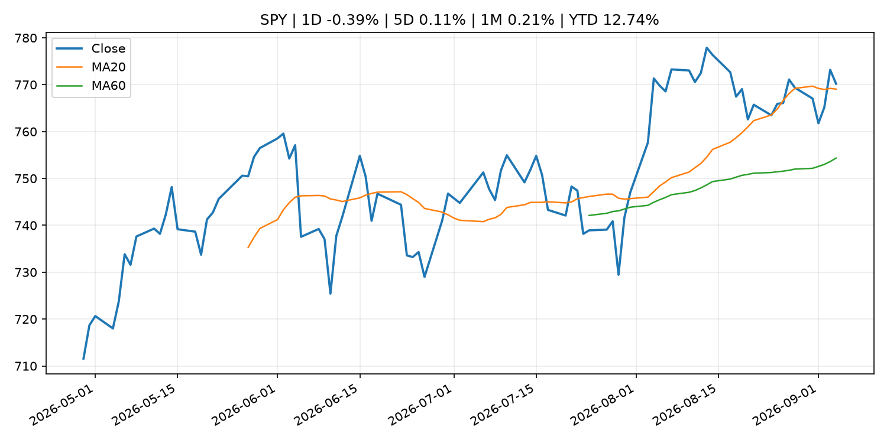
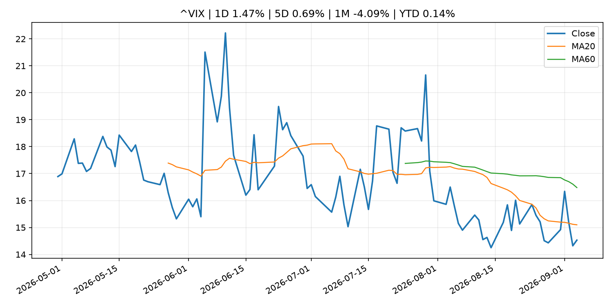
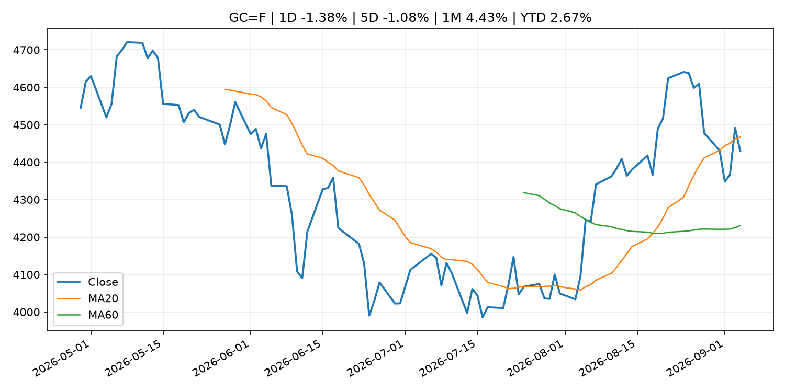
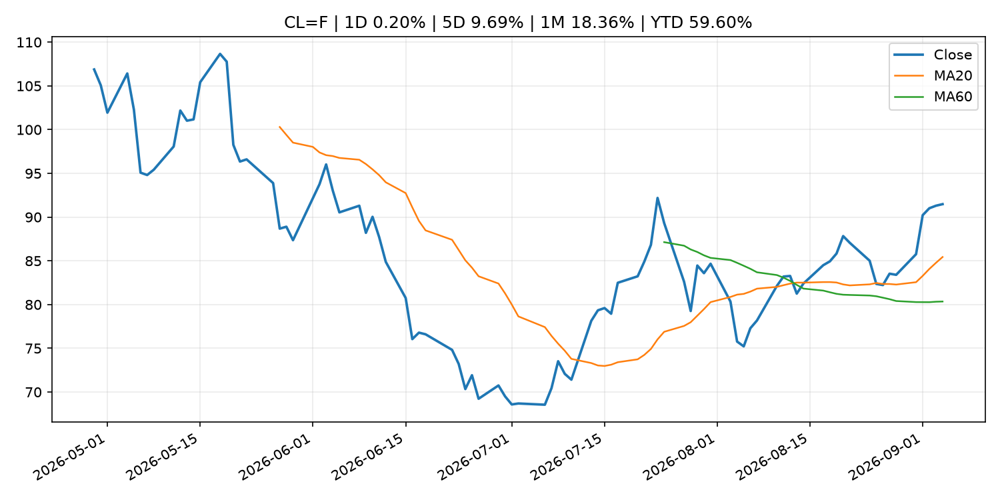
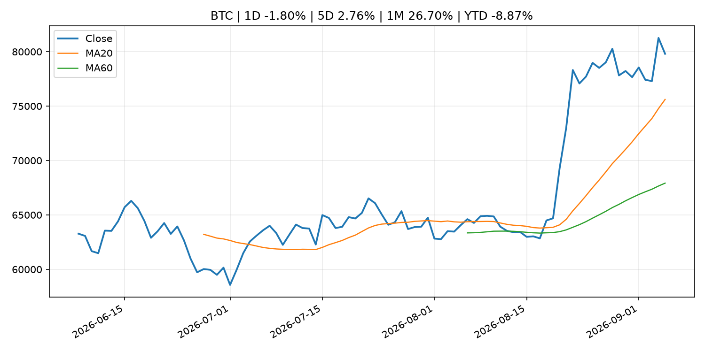
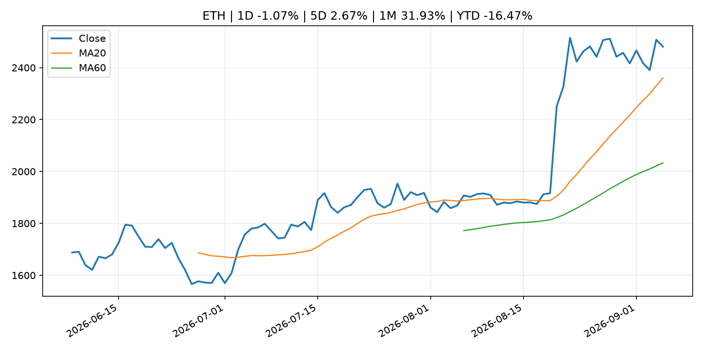

# Global Macro Morning Briefing - 2026-09-06

> Not financial advice / 非投资建议。

## 0. 今日总览
- 市场状态：unknown。市场信号不足，暂不判断明确状态。
- 今日三大主线：
  1. fiscal_policy: Financial Results of Japan's Banks for Fiscal 2025
  2. macro_data: We checked 6 years of bitcoin data. The NFP report isn't big price mover
  3. regulation: Federal Reserve Board announces termination of enforcement actions with United Texas Bank, Quontic Bank Acquisition Corp., and Quontic Bank Holdings Corp.
- 一句话结论：今日晨报重点关注：财政和贸易政策会影响增长、通胀、企业利润和跨境资本流。；这类宏观数据会直接改变市场对通胀、增长和政策路径的预期。。跨资产方面，SPY 1D -0.39%；QQQ 1D 0.18%；^VIX 1D 1.47%；TLT 1D 0.17%；GC=F 1D -1.38%；CL=F 1D 0.20%；BTC 1D -1.80%；ETH 1D -1.07%；市场信号不足，暂不判断明确状态。政策、通胀、利率、美元、美债、能源和加密监管仍是主要观察线索。所有结论仅基于公开数据与短摘要整理，不构成投资建议。

## 1. 隔夜跨资产市场
- 美股：SPY 1D -0.39%，QQQ 1D 0.18%，整体趋势需结合 VIX 和利率确认。
- 美债/美元：TLT 1D 0.17%，美元指数 1D 0.16%，是判断折现率压力的核心线索。
- 黄金/原油：黄金 1D -1.38%，原油 1D 0.20%，用于观察避险、通胀和地缘风险。
- 加密：BTC 1D -1.80%，ETH 1D -1.07%，关注是否独立于纳指走出加密自身行情。
- 港股/A股：恒生 1D 1.74%，沪深300/上证 1D n/a，重点看中国政策预期与人民币线索。
- 风险观察：关注后续数据是否确认当前跨资产信号。

### US_EQUITY

| symbol | latest close | 1D | 5D | 1M | YTD | trend |
|---|---:|---:|---:|---:|---:|---|
| SPY | 770.19 | -0.39% | 0.11% | 0.21% | 12.74% | uptrend |
| QQQ | 718.96 | 0.18% | 0.35% | 0.60% | 17.26% | uptrend |
| DIA | 534.08 | -0.53% | -0.18% | -0.76% | 10.43% | range_bound |
| IWM | 296.01 | 0.28% | 0.09% | -0.75% | 18.98% | range_bound |
| VTI | 379.73 | -0.32% | 0.10% | 0.17% | 12.91% | uptrend |

### US_MACRO_MARKET

| symbol | latest close | 1D | 5D | 1M | YTD | trend |
|---|---:|---:|---:|---:|---:|---|
| ^VIX | 14.53 | 1.47% | 0.69% | -4.09% | 0.14% | downtrend |
| DX-Y.NYB | 99.16 | 0.16% | -0.54% | -0.81% | 0.75% | downtrend |
| TLT | 82.21 | 0.17% | -0.81% | -0.38% | -5.54% | downtrend |
| IEF | 92.25 | -0.03% | -0.65% | -0.75% | -3.99% | downtrend |

### COMMODITIES

| symbol | latest close | 1D | 5D | 1M | YTD | trend |
|---|---:|---:|---:|---:|---:|---|
| GC=F | 4,429.80 | -1.38% | -1.08% | 4.43% | 2.67% | range_bound |
| SI=F | 66.05 | -1.38% | -1.42% | 7.50% | -6.39% | range_bound |
| CL=F | 91.48 | 0.20% | 9.69% | 18.36% | 59.60% | strong_uptrend |
| BZ=F | 96.28 | 0.80% | 7.80% | 16.72% | 58.49% | strong_uptrend |
| NG=F | 2.97 | 2.13% | 3.01% | 12.69% | -17.77% | range_bound |
| HG=F | 6.60 | 0.30% | 0.53% | -1.35% | 16.97% | uptrend |

### HK_MARKET

| symbol | latest close | 1D | 5D | 1M | YTD | trend |
|---|---:|---:|---:|---:|---:|---|
| ^HSI | 25,650.87 | 1.74% | 0.26% | 0.47% | -2.61% | uptrend |
| 0700.HK | 442.80 | 2.26% | -2.72% | -7.60% | -28.92% | downtrend |
| 9988.HK | 110.10 | 2.42% | -3.34% | -11.50% | -26.11% | range_bound |
| 3690.HK | 81.75 | 5.28% | 5.48% | -11.33% | -21.85% | range_bound |
| 1810.HK | 28.44 | 3.64% | 2.23% | 5.88% | -29.39% | strong_uptrend |
| 1211.HK | 86.15 | 0.53% | -6.31% | -4.12% | -12.76% | range_bound |

### CRYPTO

| symbol | latest close | 1D | 5D | 1M | YTD | trend |
|---|---:|---:|---:|---:|---:|---|
| BTC | 79,802.81 | -1.80% | 2.76% | 26.70% | -8.87% | uptrend |
| ETH | 2,480.76 | -1.07% | 2.67% | 31.93% | -16.47% | uptrend |
| SOLANA | 103.26 | -0.68% | 1.55% | 37.06% | -17.08% | strong_uptrend |
| BINANCECOIN | 765.80 | 5.62% | 11.88% | 26.08% | -11.23% | strong_uptrend |
| RIPPLE | 1.41 | -2.52% | 4.18% | 41.66% | -23.14% | uptrend |

## 2. 今日最重要的 10 条新闻
### 1. Financial Results of Japan's Banks for Fiscal 2025
- 来源：Bank of Japan Announcements
- 时间：2026-09-04T16:00:00+09:00
- 地区：Japan
- 事件类型：fiscal_policy
- 重要性层级：Tier 1
- 一句话摘要：Financial Results of Japan's Banks for Fiscal 2025
- 为什么重要：财政和贸易政策会影响增长、通胀、企业利润和跨境资本流。
- 可能影响：可能影响利率、汇率、风险资产或大宗商品预期，但当前公开信息不足以判断明确方向。
  - 资产：暂无明确资产映射
  - 方向：unknown
  - 强度：low
  - 原因：公开信息不足以判断方向。
- 原文链接：[http://www.boj.or.jp/en/research/brp/fsr/fsrb260904.htm](http://www.boj.or.jp/en/research/brp/fsr/fsrb260904.htm)

### 2. We checked 6 years of bitcoin data. The NFP report isn't big price mover
- 来源：CoinDesk
- 时间：2026-09-04T11:29:05+00:00
- 地区：global
- 事件类型：macro_data
- 重要性层级：Tier 1
- 一句话摘要：We checked 6 years of bitcoin data. The NFP report isn't big price mover
- 为什么重要：这类宏观数据会直接改变市场对通胀、增长和政策路径的预期。
- 可能影响：可能影响利率、汇率、风险资产或大宗商品预期，但当前公开信息不足以判断明确方向。
  - 资产：暂无明确资产映射
  - 方向：unknown
  - 强度：low
  - 原因：公开信息不足以判断方向。
- 原文链接：[https://www.coindesk.com/daybook-us/2026/09/04/we-checked-6-years-of-bitcoin-data-the-nfp-report-isn-t-big-price-mover](https://www.coindesk.com/daybook-us/2026/09/04/we-checked-6-years-of-bitcoin-data-the-nfp-report-isn-t-big-price-mover)

### 3. Federal Reserve Board announces termination of enforcement actions with United Texas Bank, Quontic Bank Acquisition Corp., and Quontic Bank Holdings Corp.
- 来源：Federal Reserve Press Releases
- 时间：2026-09-04T15:00:00+00:00
- 地区：US
- 事件类型：regulation
- 重要性层级：Tier 2
- 一句话摘要：Federal Reserve Board announces termination of enforcement actions with United Texas Bank, Quontic Bank Acquisition Corp., and Quontic Bank Holdings Corp.
- 为什么重要：监管变化会改变行业盈利预期和资产风险溢价。
- 可能影响：可能影响利率、汇率、风险资产或大宗商品预期，但当前公开信息不足以判断明确方向。
  - 资产：暂无明确资产映射
  - 方向：unknown
  - 强度：low
  - 原因：公开信息不足以判断方向。
- 原文链接：[https://www.federalreserve.gov/newsevents/pressreleases/enforcement20260904a.htm](https://www.federalreserve.gov/newsevents/pressreleases/enforcement20260904a.htm)

### 4. Why crypto experts say buying and holding bitcoin easily beats trying to time the market
- 来源：CoinDesk
- 时间：2026-09-05T18:05:11+00:00
- 地区：global
- 事件类型：other
- 重要性层级：Tier 3
- 一句话摘要：Why crypto experts say buying and holding bitcoin easily beats trying to time the market
- 为什么重要：这条信息暂未匹配到重大宏观、政策或市场事件，更适合作为背景跟踪。
- 可能影响：更偏背景信息，短期市场影响可能有限。
  - 资产：暂无明确资产映射
  - 方向：unknown
  - 强度：low
  - 原因：公开信息不足以判断方向。
- 原文链接：[https://www.coindesk.com/markets/2026/09/05/why-crypto-experts-say-buying-and-holding-bitcoin-easily-beats-trying-to-time-the-market](https://www.coindesk.com/markets/2026/09/05/why-crypto-experts-say-buying-and-holding-bitcoin-easily-beats-trying-to-time-the-market)

### 5. There’s a new record number of 401(k) millionaires as retirement savings hold at all-time highs
- 来源：MarketWatch Top Stories
- 时间：2026-09-05T17:01:00+00:00
- 地区：US
- 事件类型：other
- 重要性层级：Tier 3
- 一句话摘要：Retirement savings hovered at record highs in the second quarter, pushing the number of 401(k) millionaires to a record as investors focused on their long-term goals despite persistent anxiety about the broader economy, Fidelity Investments said Thursday.
- 为什么重要：这条信息暂未匹配到重大宏观、政策或市场事件，更适合作为背景跟踪。
- 可能影响：更偏背景信息，短期市场影响可能有限。
  - 资产：暂无明确资产映射
  - 方向：unknown
  - 强度：low
  - 原因：公开信息不足以判断方向。
- 原文链接：[https://www.marketwatch.com/story/theres-a-new-record-number-of-401-k-millionaires-as-retirement-savings-hold-at-all-time-highs-94f2c520?mod=mw_rss_topstories](https://www.marketwatch.com/story/theres-a-new-record-number-of-401-k-millionaires-as-retirement-savings-hold-at-all-time-highs-94f2c520?mod=mw_rss_topstories)

## 3. 政策与央行观察
### 1. Financial Results of Japan's Banks for Fiscal 2025
- 来源：Bank of Japan Announcements
- 时间：2026-09-04T16:00:00+09:00
- 地区：Japan
- 事件类型：fiscal_policy
- 重要性层级：Tier 1
- 一句话摘要：Financial Results of Japan's Banks for Fiscal 2025
- 为什么重要：财政和贸易政策会影响增长、通胀、企业利润和跨境资本流。
- 可能影响：可能影响利率、汇率、风险资产或大宗商品预期，但当前公开信息不足以判断明确方向。
  - 资产：暂无明确资产映射
  - 方向：unknown
  - 强度：low
  - 原因：公开信息不足以判断方向。
- 原文链接：[http://www.boj.or.jp/en/research/brp/fsr/fsrb260904.htm](http://www.boj.or.jp/en/research/brp/fsr/fsrb260904.htm)

### 2. Federal Reserve Board announces termination of enforcement actions with United Texas Bank, Quontic Bank Acquisition Corp., and Quontic Bank Holdings Corp.
- 来源：Federal Reserve Press Releases
- 时间：2026-09-04T15:00:00+00:00
- 地区：US
- 事件类型：regulation
- 重要性层级：Tier 2
- 一句话摘要：Federal Reserve Board announces termination of enforcement actions with United Texas Bank, Quontic Bank Acquisition Corp., and Quontic Bank Holdings Corp.
- 为什么重要：监管变化会改变行业盈利预期和资产风险溢价。
- 可能影响：可能影响利率、汇率、风险资产或大宗商品预期，但当前公开信息不足以判断明确方向。
  - 资产：暂无明确资产映射
  - 方向：unknown
  - 强度：low
  - 原因：公开信息不足以判断方向。
- 原文链接：[https://www.federalreserve.gov/newsevents/pressreleases/enforcement20260904a.htm](https://www.federalreserve.gov/newsevents/pressreleases/enforcement20260904a.htm)

## 4. 市场异动与图表
- Gold 下跌 -1.38%

### SPY

### QQQ

### ^VIX

### TLT

### GC=F

### CL=F

### BTC

### ETH

### ^HSI

## 5. 华尔街与机构公开观点
- 暂无可靠公开观点。

## 6. 今日重点关注
- 经济数据：经济数据：暂无可靠公开日历数据；如配置经济日历源后可自动填充。
- 央行讲话：央行讲话：暂无可靠公开日历数据；重点跟踪 Fed、ECB、BoJ、PBOC 官网 RSS。
- 财报：财报：暂无可靠数据。
- 政策事件：政策事件：暂无可靠数据。
- 风险提醒：风险提醒：关注数据源失败项、突发地缘风险、利率和美元的二阶反应。

## 7. 英文金融表达与宏观概念
- **market structure**：市场结构，指交易、托管、清算、ETF、监管等制度安排。 例句：Crypto market structure rules can affect institutional participation.
- **inflation expectations**：通胀预期，指家庭、企业或市场对未来通胀的预估。 例句：Inflation expectations can shape wage bargaining and bond yields.
- **real yield**：实际收益率，名义利率扣除通胀预期后的收益率。 例句：Gold often reacts more to real yields than nominal yields.
- **terminal rate**：终端利率，市场预期本轮加息周期的最高政策利率。 例句：A higher terminal rate can pressure growth stocks.
- **soft landing**：软着陆，指通胀回落而经济避免明显衰退。 例句：Markets often rally when data support a soft landing.
- **risk-off**：避险模式，资金偏向美元、国债、黄金等防御资产。 例句：A geopolitical shock can push markets into risk-off mode.

## 8. 背景材料
- [Why crypto experts say buying and holding bitcoin easily beats trying to time the market](https://www.coindesk.com/markets/2026/09/05/why-crypto-experts-say-buying-and-holding-bitcoin-easily-beats-trying-to-time-the-market)（CoinDesk，other）：Why crypto experts say buying and holding bitcoin easily beats trying to time the market
- [There’s a new record number of 401(k) millionaires as retirement savings hold at all-time highs](https://www.marketwatch.com/story/theres-a-new-record-number-of-401-k-millionaires-as-retirement-savings-hold-at-all-time-highs-94f2c520?mod=mw_rss_topstories)（MarketWatch Top Stories，other）：Retirement savings hovered at record highs in the second quarter, pushing the number of 401(k) millionaires to a record as investors focused on their long-term goals despite persistent anxiety about the broader economy, Fidelity Investments said Thursday.
- [Dollar-backed stablecoins can push local currencies lower, Bank of Korea study finds](https://www.coindesk.com/business/2026/09/05/dollar-backed-stablecoins-can-push-local-currencies-lower-bank-of-korea-study-finds)（CoinDesk，other）：Dollar-backed stablecoins can push local currencies lower, Bank of Korea study finds
- [British investor thought he lost $2,000 in bitcoin in 2012. He just recovered $4.5 million](https://www.coindesk.com/business/2026/09/02/british-investor-thought-he-lost-usd2-000-in-bitcoin-in-2012-he-just-recovered-usd4-5-million)（CoinDesk，other）：British investor thought he lost $2,000 in bitcoin in 2012. He just recovered $4.5 million
- [Bitcoin heads for third winning week in a row as macro pressures mount](https://www.cnbc.com/2026/09/04/bitcoin-heads-for-third-winning-week-in-a-row-as-macro-pressures-mount.html)（CNBC Economy，other）：Bitcoin headed for its third straight winning week, as traders searched for refuge amid volatile moves in equities, currencies and bond markets.
- [Bitcoin clears $81,000 as privacy coins lead a broad crypto rally](https://www.coindesk.com/markets/2026/09/04/bitcoin-clears-usd81-000-as-privacy-coins-lead-a-broad-crypto-rally)（CoinDesk，other）：Bitcoin clears $81,000 as privacy coins lead a broad crypto rally
- [IMF confirms El Salvador’s bitcoin growth was funded by private donations, not public money](https://www.coindesk.com/business/2026/09/04/imf-confirms-el-salvador-s-bitcoin-growth-was-funded-by-private-donations-not-public-money)（CoinDesk，other）：IMF confirms El Salvador’s bitcoin growth was funded by private donations, not public money
- [South Korea targets February 2027 rollout for full tokenized securities market](https://www.coindesk.com/business/2026/09/04/south-korea-targets-february-2027-rollout-for-full-tokenized-securities-market)（CoinDesk，other）：South Korea targets February 2027 rollout for full tokenized securities market
- [Philip R. Lane: Diversity at the European Central Bank](https://www.ecb.europa.eu//press/key/date/2026/html/ecb.sp260904~7b9257099b.en.pdf)（ECB Press Releases，other）：Philip R. Lane: Diversity at the European Central Bank
- [Live updates: Bitcoin tumbles after blowout August jobs print](https://www.coindesk.com/business/2026/09/04/live-updates-bitcoin-etfs-take-usd731-million-their-biggest-day-since-january)（CoinDesk，other）：Live updates: Bitcoin tumbles after blowout August jobs print
- [One full bitcoin now buys a little more than 18 ounces of gold, the most since January](https://www.coindesk.com/markets/2026/09/04/one-full-bitcoin-now-buys-a-little-more-than-18-ounces-of-gold-the-most-since-january)（CoinDesk，other）：One full bitcoin now buys a little more than 18 ounces of gold, the most since January
- [Bitcoin back above $81,000 as hike odds fade, Zcash leads with 15% jump](https://www.coindesk.com/markets/2026/09/04/bitcoin-back-above-usd81-000-as-hike-odds-fade-zcash-leads-with-15-jump)（CoinDesk，other）：Bitcoin back above $81,000 as hike odds fade, Zcash leads with 15% jump

## 9. 数据源、失败项与免责声明
- 采集时间：2026-09-05T23:34:01
- 数据源：公开 RSS、Yahoo Finance、CoinGecko、AKShare、FRED、SEC data.sec.gov，以及用户自有 inputs/reports 文件。
- 合规说明：不绕过 WSJ、Bloomberg、FT、Reuters 等付费墙；对付费媒体只使用公开 RSS 标题、摘要、链接和发布时间。
- 免责声明：Not financial advice / 非投资建议。本项目仅供个人学习、研究和信息整理，不构成投资建议、交易建议或任何收益承诺。
- 失败或跳过的数据源：
  - crypto data failed coin=dogecoin
  - China market data failed symbol=上证指数: empty dataframe
  - China market data failed symbol=深证成指: empty dataframe
  - China market data failed symbol=创业板指: empty dataframe
  - China market data failed symbol=沪深300: empty dataframe
  - China market data failed symbol=中证500: empty dataframe
  - China market data failed symbol=科创50: empty dataframe
  - FRED_API_KEY not set; skipping FRED macro series
  - SEC failed cik=0000320193
  - SEC failed cik=0000789019
  - SEC failed cik=0001045810
  - SEC failed cik=0001318605
  - SEC failed cik=0001577552
