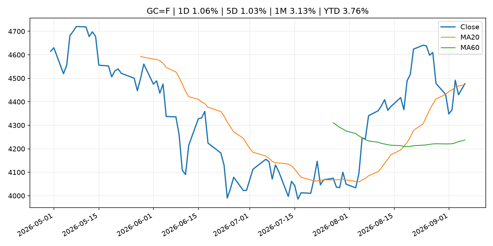
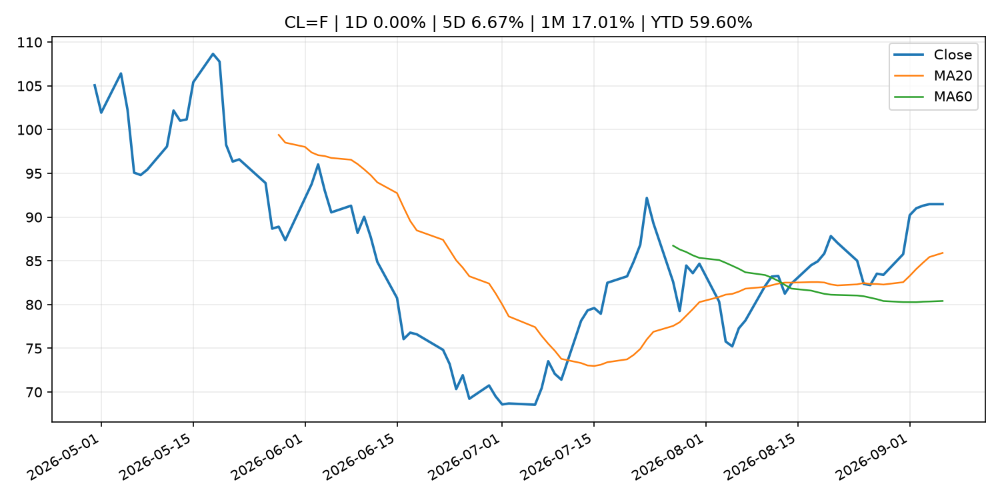
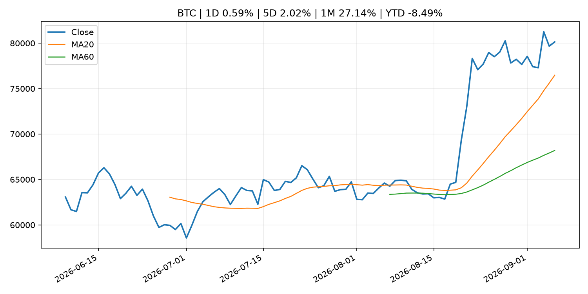
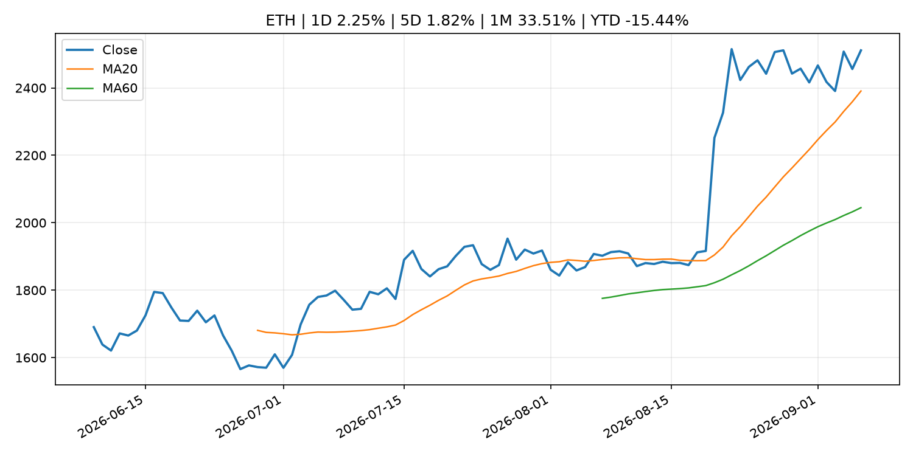
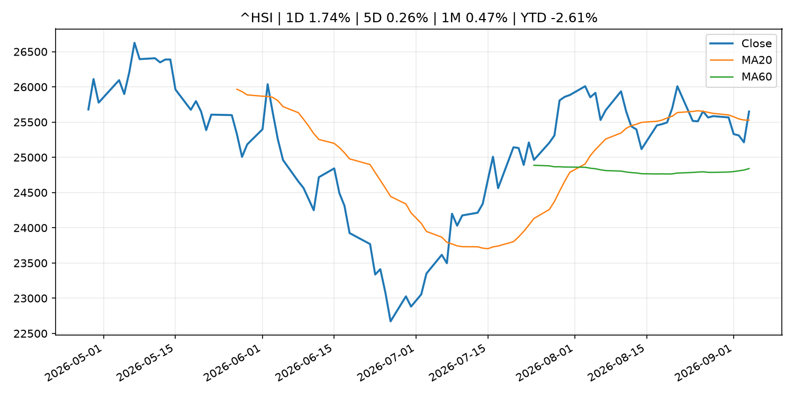

# Global Macro Morning Briefing - 2026-09-07

> Not financial advice / 非投资建议。

## 0. 今日总览
- 市场状态：crypto_specific。BTC/ETH 明显走强但美股平淡，行情更像加密自身事件驱动。
- 今日三大主线：
  1. ‘Poverty doesn’t have to be my reality’: I thought I’d have to rely on Social Security. Then I taught myself how to invest.
  2. Better and Coinbase’s bitcoin-backed mortgages can reuse borrowers’ collateral
- 一句话结论：今日晨报重点关注：这条信息暂未匹配到重大宏观、政策或市场事件，更适合作为背景跟踪。；这条信息暂未匹配到重大宏观、政策或市场事件，更适合作为背景跟踪。。跨资产方面，SPY 1D -0.39%；QQQ 1D 0.18%；^VIX 1D 1.47%；TLT 1D 0.17%；GC=F 1D 1.06%；CL=F 1D 0.00%；BTC 1D 0.59%；ETH 1D 2.25%；BTC/ETH 明显走强但美股平淡，行情更像加密自身事件驱动。政策、通胀、利率、美元、美债、能源和加密监管仍是主要观察线索。所有结论仅基于公开数据与短摘要整理，不构成投资建议。

## 1. 隔夜跨资产市场
- 美股：SPY 1D -0.39%，QQQ 1D 0.18%，整体趋势需结合 VIX 和利率确认。
- 美债/美元：TLT 1D 0.17%，美元指数 1D -0.03%，是判断折现率压力的核心线索。
- 黄金/原油：黄金 1D 1.06%，原油 1D 0.00%，用于观察避险、通胀和地缘风险。
- 加密：BTC 1D 0.59%，ETH 1D 2.25%，关注是否独立于纳指走出加密自身行情。
- 港股/A股：恒生 1D 1.74%，沪深300/上证 1D n/a，重点看中国政策预期与人民币线索。
- 风险观察：关注 ETF、监管、稳定币或链上流动性新闻。

### US_EQUITY

| symbol | latest close | 1D | 5D | 1M | YTD | trend |
|---|---:|---:|---:|---:|---:|---|
| SPY | 770.19 | -0.39% | 0.11% | 0.21% | 12.74% | uptrend |
| QQQ | 718.96 | 0.18% | 0.35% | 0.60% | 17.26% | uptrend |
| DIA | 534.08 | -0.53% | -0.18% | -0.76% | 10.43% | range_bound |
| IWM | 296.01 | 0.28% | 0.09% | -0.75% | 18.98% | range_bound |
| VTI | 379.73 | -0.32% | 0.10% | 0.17% | 12.91% | uptrend |

### US_MACRO_MARKET

| symbol | latest close | 1D | 5D | 1M | YTD | trend |
|---|---:|---:|---:|---:|---:|---|
| ^VIX | 14.53 | 1.47% | 0.69% | -4.09% | 0.14% | downtrend |
| DX-Y.NYB | 99.13 | -0.03% | -0.30% | -0.47% | 0.72% | downtrend |
| TLT | 82.21 | 0.17% | -0.81% | -0.38% | -5.54% | downtrend |
| IEF | 92.25 | -0.03% | -0.65% | -0.75% | -3.99% | downtrend |

### COMMODITIES

| symbol | latest close | 1D | 5D | 1M | YTD | trend |
|---|---:|---:|---:|---:|---:|---|
| GC=F | 4,476.60 | 1.06% | 1.03% | 3.13% | 3.76% | strong_uptrend |
| SI=F | 66.75 | 1.06% | 0.80% | 5.39% | -5.40% | strong_uptrend |
| CL=F | 91.48 | 0.00% | 6.67% | 17.01% | 59.60% | strong_uptrend |
| BZ=F | 96.28 | 0.00% | 6.40% | 15.24% | 58.49% | strong_uptrend |
| NG=F | 2.97 | 0.00% | 1.36% | 11.76% | -17.77% | range_bound |
| HG=F | 6.68 | 1.30% | 1.35% | 1.70% | 18.48% | uptrend |

### HK_MARKET

| symbol | latest close | 1D | 5D | 1M | YTD | trend |
|---|---:|---:|---:|---:|---:|---|
| ^HSI | 25,650.87 | 1.74% | 0.26% | 0.47% | -2.61% | uptrend |
| 0700.HK | 442.80 | 2.26% | -2.72% | -7.60% | -28.92% | downtrend |
| 9988.HK | 110.10 | 2.42% | -3.34% | -11.50% | -26.11% | range_bound |
| 3690.HK | 81.75 | 5.28% | 5.48% | -11.33% | -21.85% | range_bound |
| 1810.HK | 28.44 | 3.64% | 2.23% | 5.88% | -29.39% | strong_uptrend |
| 1211.HK | 86.15 | 0.53% | -6.31% | -4.12% | -12.76% | range_bound |

### CRYPTO

| symbol | latest close | 1D | 5D | 1M | YTD | trend |
|---|---:|---:|---:|---:|---:|---|
| BTC | 80,138.63 | 0.59% | 2.02% | 27.14% | -8.49% | strong_uptrend |
| ETH | 2,511.35 | 2.25% | 1.82% | 33.51% | -15.44% | strong_uptrend |
| SOLANA | 106.36 | 4.35% | 3.25% | 41.29% | -14.58% | strong_uptrend |
| BINANCECOIN | 752.05 | 4.24% | 8.81% | 23.85% | -12.82% | strong_uptrend |
| RIPPLE | 1.42 | 1.58% | 3.01% | 41.82% | -22.81% | uptrend |

## 2. 今日最重要的 10 条新闻
### 1. ‘Poverty doesn’t have to be my reality’: I thought I’d have to rely on Social Security. Then I taught myself how to invest.
- 来源：MarketWatch Top Stories
- 时间：2026-09-06T20:00:00+00:00
- 地区：US
- 事件类型：other
- 重要性层级：Tier 3
- 一句话摘要：“It always baffled me how some people managed to retire with significant wealth.”
- 为什么重要：这条信息暂未匹配到重大宏观、政策或市场事件，更适合作为背景跟踪。
- 可能影响：更偏背景信息，短期市场影响可能有限。
  - 资产：暂无明确资产映射
  - 方向：unknown
  - 强度：low
  - 原因：公开信息不足以判断方向。
- 原文链接：[https://www.marketwatch.com/story/i-didnt-know-what-i-didnt-know-i-thought-id-have-to-depend-on-social-security-then-i-taught-myself-how-to-invest-0129870b?mod=mw_rss_topstories](https://www.marketwatch.com/story/i-didnt-know-what-i-didnt-know-i-thought-id-have-to-depend-on-social-security-then-i-taught-myself-how-to-invest-0129870b?mod=mw_rss_topstories)

### 2. Better and Coinbase’s bitcoin-backed mortgages can reuse borrowers’ collateral
- 来源：CoinDesk
- 时间：2026-09-06T14:00:00+00:00
- 地区：global
- 事件类型：other
- 重要性层级：Tier 3
- 一句话摘要：Better and Coinbase’s bitcoin-backed mortgages can reuse borrowers’ collateral
- 为什么重要：这条信息暂未匹配到重大宏观、政策或市场事件，更适合作为背景跟踪。
- 可能影响：更偏背景信息，短期市场影响可能有限。
  - 资产：暂无明确资产映射
  - 方向：unknown
  - 强度：low
  - 原因：公开信息不足以判断方向。
- 原文链接：[https://www.coindesk.com/business/2026/09/06/better-and-coinbase-s-bitcoin-backed-mortgages-can-reuse-borrowers-collateral](https://www.coindesk.com/business/2026/09/06/better-and-coinbase-s-bitcoin-backed-mortgages-can-reuse-borrowers-collateral)

## 3. 政策与央行观察
暂无可靠数据。

- 为什么重要：没有可靠新闻时，不应为了填充版面编造市场解释。

## 4. 市场异动与图表
- Gold 上涨 1.06%
- ETH 上涨 2.25%

### SPY

### QQQ

### ^VIX

### TLT

### GC=F

### CL=F

### BTC

### ETH

### ^HSI

## 5. 华尔街与机构公开观点
- 暂无可靠公开观点。

## 6. 今日重点关注
- 经济数据：经济数据：暂无可靠公开日历数据；如配置经济日历源后可自动填充。
- 央行讲话：央行讲话：暂无可靠公开日历数据；重点跟踪 Fed、ECB、BoJ、PBOC 官网 RSS。
- 财报：财报：暂无可靠数据。
- 政策事件：政策事件：暂无可靠数据。
- 风险提醒：风险提醒：关注数据源失败项、突发地缘风险、利率和美元的二阶反应。

## 7. 英文金融表达与宏观概念
- **market structure**：市场结构，指交易、托管、清算、ETF、监管等制度安排。 例句：Crypto market structure rules can affect institutional participation.
- **inflation expectations**：通胀预期，指家庭、企业或市场对未来通胀的预估。 例句：Inflation expectations can shape wage bargaining and bond yields.
- **real yield**：实际收益率，名义利率扣除通胀预期后的收益率。 例句：Gold often reacts more to real yields than nominal yields.
- **terminal rate**：终端利率，市场预期本轮加息周期的最高政策利率。 例句：A higher terminal rate can pressure growth stocks.
- **soft landing**：软着陆，指通胀回落而经济避免明显衰退。 例句：Markets often rally when data support a soft landing.
- **risk-off**：避险模式，资金偏向美元、国债、黄金等防御资产。 例句：A geopolitical shock can push markets into risk-off mode.

## 8. 背景材料
- [‘Poverty doesn’t have to be my reality’: I thought I’d have to rely on Social Security. Then I taught myself how to invest.](https://www.marketwatch.com/story/i-didnt-know-what-i-didnt-know-i-thought-id-have-to-depend-on-social-security-then-i-taught-myself-how-to-invest-0129870b?mod=mw_rss_topstories)（MarketWatch Top Stories，other）：“It always baffled me how some people managed to retire with significant wealth.”
- [Better and Coinbase’s bitcoin-backed mortgages can reuse borrowers’ collateral](https://www.coindesk.com/business/2026/09/06/better-and-coinbase-s-bitcoin-backed-mortgages-can-reuse-borrowers-collateral)（CoinDesk，other）：Better and Coinbase’s bitcoin-backed mortgages can reuse borrowers’ collateral
- [‘I’m leaving money on the table’: I’m 64 and my husband is 70. Should I take spousal benefits or wait for my own?](https://www.marketwatch.com/story/im-leaving-money-on-the-table-im-64-and-my-husband-is-70-should-i-take-spousal-benefits-or-wait-for-my-own-2490f5cd?mod=mw_rss_topstories)（MarketWatch Top Stories，other）：“I paid a significant amount into Social Security.”
- [Is the U.S. losing its safe-haven status? Why global central banks are pulling gold out of New York.](https://www.marketwatch.com/story/is-the-u-s-losing-its-safe-haven-status-why-global-central-banks-are-pulling-gold-out-of-new-york-3e24d510?mod=mw_rss_topstories)（MarketWatch Top Stories，other）：What to know about safe havens and the U.S., as the Netherlands’ central bank follows France in pulling gold out of New York.
- [Timing the bitcoin market is exciting but nearly impossible. Here's why](https://www.coindesk.com/markets/2026/09/05/why-crypto-experts-say-buying-and-holding-bitcoin-easily-beats-trying-to-time-the-market)（CoinDesk，other）：Timing the bitcoin market is exciting but nearly impossible. Here's why
- [Dollar-backed stablecoins can push local currencies lower, Bank of Korea study finds](https://www.coindesk.com/business/2026/09/05/dollar-backed-stablecoins-can-push-local-currencies-lower-bank-of-korea-study-finds)（CoinDesk，other）：Dollar-backed stablecoins can push local currencies lower, Bank of Korea study finds
- [British investor thought he lost $2,000 in bitcoin in 2012. He just recovered $4.5 million](https://www.coindesk.com/business/2026/09/02/british-investor-thought-he-lost-usd2-000-in-bitcoin-in-2012-he-just-recovered-usd4-5-million)（CoinDesk，other）：British investor thought he lost $2,000 in bitcoin in 2012. He just recovered $4.5 million

## 9. 数据源、失败项与免责声明
- 采集时间：2026-09-06T23:29:41
- 数据源：公开 RSS、Yahoo Finance、CoinGecko、AKShare、FRED、SEC data.sec.gov，以及用户自有 inputs/reports 文件。
- 合规说明：不绕过 WSJ、Bloomberg、FT、Reuters 等付费墙；对付费媒体只使用公开 RSS 标题、摘要、链接和发布时间。
- 免责声明：Not financial advice / 非投资建议。本项目仅供个人学习、研究和信息整理，不构成投资建议、交易建议或任何收益承诺。
- 失败或跳过的数据源：
  - crypto data failed coin=dogecoin
  - China market data failed symbol=上证指数: empty dataframe
  - China market data failed symbol=深证成指: empty dataframe
  - China market data failed symbol=创业板指: empty dataframe
  - China market data failed symbol=沪深300: empty dataframe
  - China market data failed symbol=中证500: empty dataframe
  - China market data failed symbol=科创50: empty dataframe
  - FRED_API_KEY not set; skipping FRED macro series
  - SEC failed cik=0000320193
  - SEC failed cik=0000789019
  - SEC failed cik=0001045810
  - SEC failed cik=0001318605
  - SEC failed cik=0001577552
