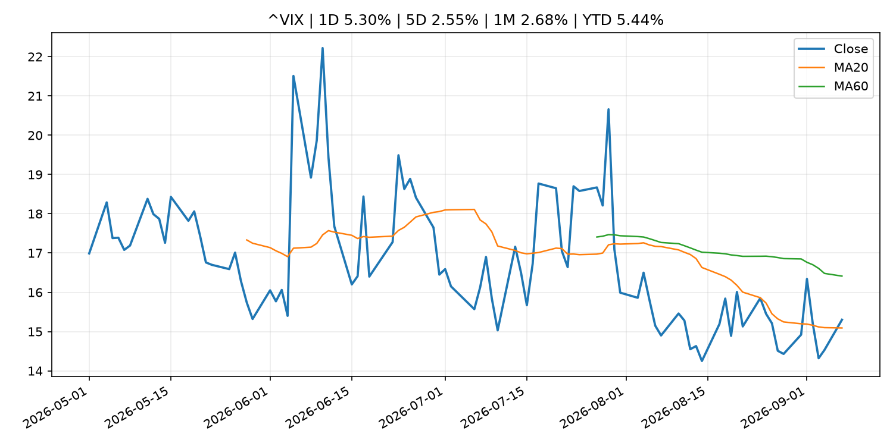
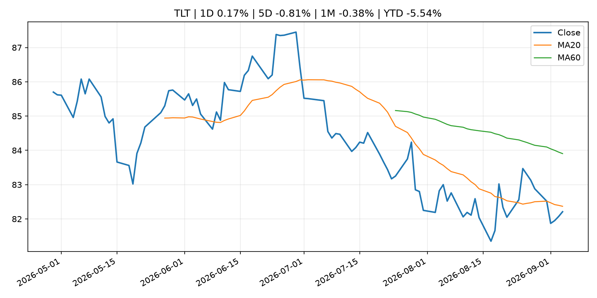
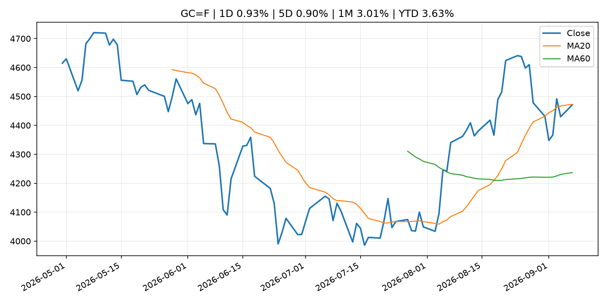
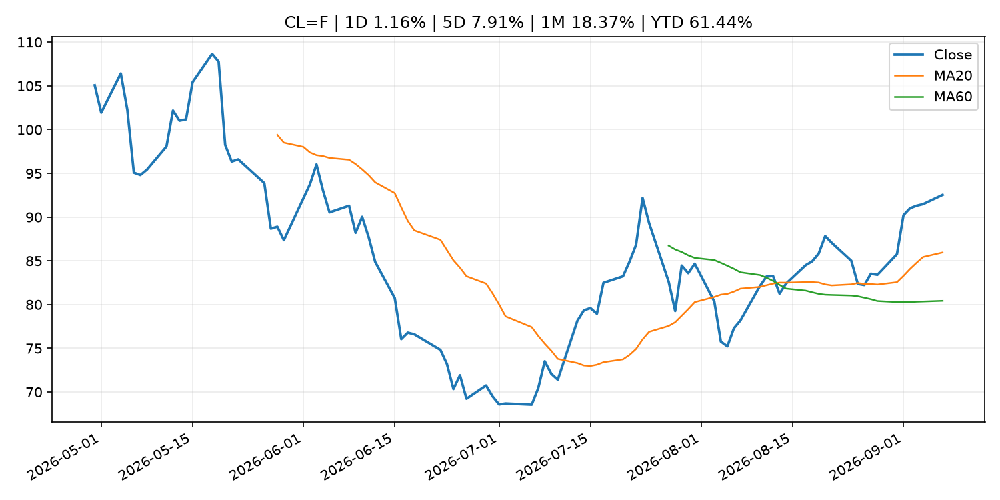
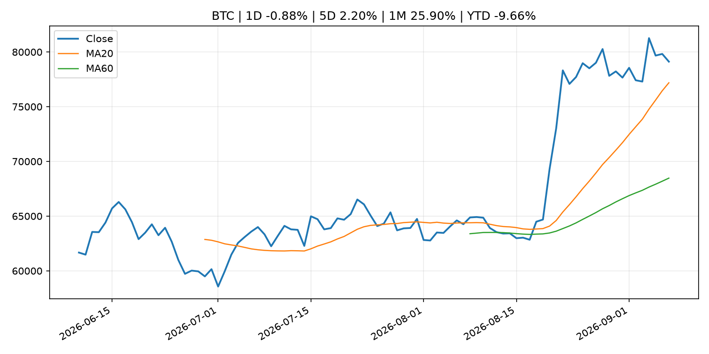
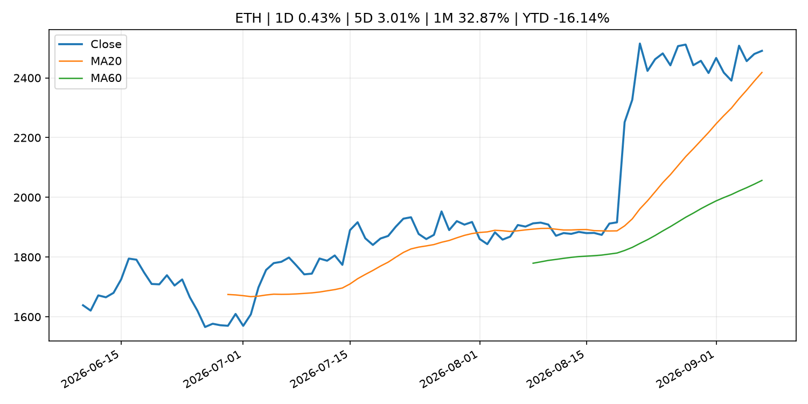
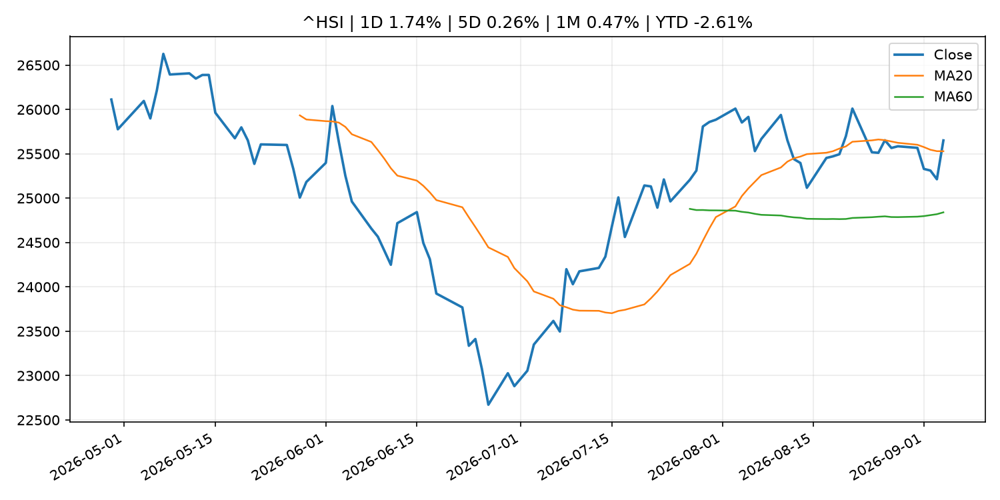

# Global Macro Morning Briefing - 2026-09-08

> Not financial advice / 非投资建议。

## 0. 今日总览
- 市场状态：unknown。市场信号不足，暂不判断明确状态。
- 今日三大主线：
  1. central_bank_decision: No, Friday's jobs report hasn't materially boosted Fed rate hike odds
  2. geopolitical_risk: Coldcard hacker moves $7.7 million in BTC, 45% of bitcoin stolen in third attack wave
  3. crypto_market_structure: Stablecoin wallets challenge traditional bank accounts as main consumer money hub
- 一句话结论：今日晨报重点关注：央行决策会重定价利率、汇率、久期资产和风险资产。；地缘风险可能推升避险需求、能源价格和市场波动率。。跨资产方面，SPY 1D -0.39%；QQQ 1D 0.18%；^VIX 1D 5.30%；TLT 1D 0.17%；GC=F 1D 0.93%；CL=F 1D 1.16%；BTC 1D -0.88%；ETH 1D 0.43%；市场信号不足，暂不判断明确状态。政策、通胀、利率、美元、美债、能源和加密监管仍是主要观察线索。所有结论仅基于公开数据与短摘要整理，不构成投资建议。

## 1. 隔夜跨资产市场
- 美股：SPY 1D -0.39%，QQQ 1D 0.18%，整体趋势需结合 VIX 和利率确认。
- 美债/美元：TLT 1D 0.17%，美元指数 1D 0.02%，是判断折现率压力的核心线索。
- 黄金/原油：黄金 1D 0.93%，原油 1D 1.16%，用于观察避险、通胀和地缘风险。
- 加密：BTC 1D -0.88%，ETH 1D 0.43%，关注是否独立于纳指走出加密自身行情。
- 港股/A股：恒生 1D 1.74%，沪深300/上证 1D n/a，重点看中国政策预期与人民币线索。
- 风险观察：关注后续数据是否确认当前跨资产信号。

### US_EQUITY

| symbol | latest close | 1D | 5D | 1M | YTD | trend |
|---|---:|---:|---:|---:|---:|---|
| SPY | 770.19 | -0.39% | 0.11% | 0.21% | 12.74% | uptrend |
| QQQ | 718.96 | 0.18% | 0.35% | 0.60% | 17.26% | uptrend |
| DIA | 534.08 | -0.53% | -0.18% | -0.76% | 10.43% | range_bound |
| IWM | 296.01 | 0.28% | 0.09% | -0.75% | 18.98% | range_bound |
| VTI | 379.73 | -0.32% | 0.10% | 0.17% | 12.91% | uptrend |

### US_MACRO_MARKET

| symbol | latest close | 1D | 5D | 1M | YTD | trend |
|---|---:|---:|---:|---:|---:|---|
| ^VIX | 15.30 | 5.30% | 2.55% | 2.68% | 5.44% | range_bound |
| DX-Y.NYB | 99.18 | 0.02% | -0.26% | -0.43% | 0.77% | downtrend |
| TLT | 82.21 | 0.17% | -0.81% | -0.38% | -5.54% | downtrend |
| IEF | 92.25 | -0.03% | -0.65% | -0.75% | -3.99% | downtrend |

### COMMODITIES

| symbol | latest close | 1D | 5D | 1M | YTD | trend |
|---|---:|---:|---:|---:|---:|---|
| GC=F | 4,471.20 | 0.93% | 0.90% | 3.01% | 3.63% | range_bound |
| SI=F | 67.24 | 1.81% | 1.54% | 6.17% | -4.70% | strong_uptrend |
| CL=F | 92.54 | 1.16% | 7.91% | 18.37% | 61.44% | strong_uptrend |
| BZ=F | 97.18 | 0.93% | 7.39% | 16.31% | 59.97% | strong_uptrend |
| NG=F | 2.98 | 0.03% | 1.40% | 11.80% | -17.74% | range_bound |
| HG=F | 6.73 | 2.05% | 2.10% | 2.46% | 19.36% | uptrend |

### HK_MARKET

| symbol | latest close | 1D | 5D | 1M | YTD | trend |
|---|---:|---:|---:|---:|---:|---|
| ^HSI | 25,650.87 | 1.74% | 0.26% | 0.47% | -2.61% | uptrend |
| 0700.HK | 438.40 | -0.99% | -3.22% | -8.44% | -29.63% | downtrend |
| 9988.HK | 109.60 | -0.45% | -4.03% | -11.47% | -26.44% | range_bound |
| 3690.HK | 80.05 | -2.08% | 1.46% | -13.18% | -23.47% | range_bound |
| 1810.HK | 27.50 | -3.31% | -0.43% | 1.63% | -31.73% | uptrend |
| 1211.HK | 84.50 | -1.92% | -3.10% | -6.27% | -14.43% | range_bound |

### CRYPTO

| symbol | latest close | 1D | 5D | 1M | YTD | trend |
|---|---:|---:|---:|---:|---:|---|
| BTC | 79,117.57 | -0.88% | 2.20% | 25.90% | -9.66% | uptrend |
| ETH | 2,490.55 | 0.43% | 3.01% | 32.87% | -16.14% | uptrend |
| SOLANA | 103.89 | 0.70% | 3.92% | 39.36% | -16.57% | strong_uptrend |
| BINANCECOIN | 739.95 | -3.45% | 8.39% | 22.82% | -14.23% | strong_uptrend |
| RIPPLE | 1.40 | -1.04% | 3.42% | 40.79% | -24.06% | uptrend |

## 2. 今日最重要的 10 条新闻
### 1. No, Friday's jobs report hasn't materially boosted Fed rate hike odds
- 来源：CoinDesk
- 时间：2026-09-07T08:38:17+00:00
- 地区：global
- 事件类型：central_bank_decision
- 重要性层级：Tier 1
- 一句话摘要：No, Friday's jobs report hasn't materially boosted Fed rate hike odds
- 为什么重要：央行决策会重定价利率、汇率、久期资产和风险资产。
- 可能影响：主要影响 QQQ，方向为 negative，强度 high；鹰派政策提高折现率，压制成长股估值。
  - 资产：QQQ
    方向：negative
    强度：high
    原因：鹰派政策提高折现率，压制成长股估值。
  - 资产：SPY
    方向：negative
    强度：medium
    原因：更紧政策通常削弱风险偏好。
  - 资产：TLT
    方向：negative
    强度：high
    原因：利率上行通常压低长债价格。
  - 资产：DXY
    方向：positive
    强度：high
    原因：更高利率预期通常支撑美元。
  - 资产：BTC
    方向：negative
    强度：high
    原因：流动性收紧通常压制高 beta 加密资产。
- 原文链接：[https://www.coindesk.com/markets/2026/09/07/no-friday-s-jobs-report-hasn-t-materially-boost-fed-rate-hike-odds](https://www.coindesk.com/markets/2026/09/07/no-friday-s-jobs-report-hasn-t-materially-boost-fed-rate-hike-odds)

### 2. Coldcard hacker moves $7.7 million in BTC, 45% of bitcoin stolen in third attack wave
- 来源：CoinDesk
- 时间：2026-09-07T09:32:05+00:00
- 地区：global
- 事件类型：geopolitical_risk
- 重要性层级：Tier 1
- 一句话摘要：Coldcard hacker moves $7.7 million in BTC, 45% of bitcoin stolen in third attack wave
- 为什么重要：地缘风险可能推升避险需求、能源价格和市场波动率。
- 可能影响：可能影响利率、汇率、风险资产或大宗商品预期，但当前公开信息不足以判断明确方向。
  - 资产：暂无明确资产映射
  - 方向：unknown
  - 强度：low
  - 原因：公开信息不足以判断方向。
- 原文链接：[https://www.coindesk.com/business/2026/09/07/coldcard-hacker-moves-45-of-bitcoin-stolen-in-third-attack-wave](https://www.coindesk.com/business/2026/09/07/coldcard-hacker-moves-45-of-bitcoin-stolen-in-third-attack-wave)

### 3. Stablecoin wallets challenge traditional bank accounts as main consumer money hub
- 来源：CoinDesk
- 时间：2026-09-07T14:12:15+00:00
- 地区：global
- 事件类型：crypto_market_structure
- 重要性层级：Tier 2
- 一句话摘要：Stablecoin wallets challenge traditional bank accounts as main consumer money hub
- 为什么重要：加密市场结构和监管变化会影响 BTC、ETH 及相关股票的风险溢价。
- 可能影响：主要影响 BTC，方向为 mixed，强度 high；加密监管或 ETF 进展会改变 BTC 的资金流和风险溢价。
  - 资产：BTC
    方向：mixed
    强度：high
    原因：加密监管或 ETF 进展会改变 BTC 的资金流和风险溢价。
  - 资产：ETH
    方向：mixed
    强度：high
    原因：监管框架会影响 ETH 产品化和机构参与度。
  - 资产：COIN
    方向：mixed
    强度：medium
    原因：监管清晰度和执法风险会影响交易平台估值。
  - 资产：crypto market
    方向：mixed
    强度：high
    原因：信息影响整个加密市场结构，但方向取决于细节。
- 原文链接：[https://www.coindesk.com/business/2026/09/07/stablecoin-wallets-challenge-traditional-bank-accounts-as-main-consumer-money-hub](https://www.coindesk.com/business/2026/09/07/stablecoin-wallets-challenge-traditional-bank-accounts-as-main-consumer-money-hub)

### 4. Oil up, bitcoin down as U.S. strikes Iranian crude carriers
- 来源：CoinDesk
- 时间：2026-09-07T04:44:16+00:00
- 地区：global
- 事件类型：commodity_supply
- 重要性层级：Tier 2
- 一句话摘要：Oil up, bitcoin down as U.S. strikes Iranian crude carriers
- 为什么重要：大宗商品供给变化会影响能源价格、通胀预期和资源股。
- 可能影响：主要影响 CL=F，方向为 positive，强度 high；供给扰动或 OPEC 减产通常推升 WTI 原油。
  - 资产：CL=F
    方向：positive
    强度：high
    原因：供给扰动或 OPEC 减产通常推升 WTI 原油。
  - 资产：BZ=F
    方向：positive
    强度：high
    原因：全球供给风险通常直接影响 Brent 原油。
  - 资产：SPY
    方向：mixed
    强度：medium
    原因：能源股可能受益，但通胀和成本压力不利于宽基风险资产。
- 原文链接：[https://www.coindesk.com/markets/2026/09/07/oil-up-bitcoin-down-as-u-s-strikes-iranian-crude-carriers](https://www.coindesk.com/markets/2026/09/07/oil-up-bitcoin-down-as-u-s-strikes-iranian-crude-carriers)

### 5. U.S. inflation, Coinbase’s Deribit switch: Crypto Week Ahead
- 来源：CoinDesk
- 时间：2026-09-07T08:07:05+00:00
- 地区：global
- 事件类型：other
- 重要性层级：Tier 3
- 一句话摘要：U.S. inflation, Coinbase’s Deribit switch: Crypto Week Ahead
- 为什么重要：这条信息暂未匹配到重大宏观、政策或市场事件，更适合作为背景跟踪。
- 可能影响：主要影响 DXY，方向为 positive，强度 high；通胀压力可能推高政策利率预期并支撑美元。
  - 资产：DXY
    方向：positive
    强度：high
    原因：通胀压力可能推高政策利率预期并支撑美元。
  - 资产：TLT
    方向：negative
    强度：high
    原因：通胀上行通常推升收益率、压低长债价格。
  - 资产：QQQ
    方向：negative
    强度：high
    原因：更高利率对成长股估值折现率不利。
  - 资产：SPY
    方向：mixed
    强度：medium
    原因：名义增长可能支撑收入，但更高利率压制估值。
  - 资产：GC=F
    方向：mixed
    强度：medium
    原因：通胀对黄金是支撑，但实际利率上行会形成压力。
  - 资产：BTC
    方向：mixed
    强度：medium
    原因：抗通胀叙事和流动性收紧可能相互抵消。
- 原文链接：[https://www.coindesk.com/markets/2026/09/07/u-s-inflation-coinbase-s-deribit-switch-crypto-week-ahead](https://www.coindesk.com/markets/2026/09/07/u-s-inflation-coinbase-s-deribit-switch-crypto-week-ahead)

### 6. Principal Figures of Financial Institutions (Aug.)
- 来源：Bank of Japan Announcements
- 时间：2026-09-08T08:50:00+09:00
- 地区：Japan
- 事件类型：other
- 重要性层级：Tier 3
- 一句话摘要：Principal Figures of Financial Institutions (Aug.)
- 为什么重要：这条信息暂未匹配到重大宏观、政策或市场事件，更适合作为背景跟踪。
- 可能影响：更偏背景信息，短期市场影响可能有限。
  - 资产：暂无明确资产映射
  - 方向：unknown
  - 强度：low
  - 原因：公开信息不足以判断方向。
- 原文链接：[http://www.boj.or.jp/en/statistics/dl/depo/kashi/kasi2608.pdf](http://www.boj.or.jp/en/statistics/dl/depo/kashi/kasi2608.pdf)

## 3. 政策与央行观察
### 1. No, Friday's jobs report hasn't materially boosted Fed rate hike odds
- 来源：CoinDesk
- 时间：2026-09-07T08:38:17+00:00
- 地区：global
- 事件类型：central_bank_decision
- 重要性层级：Tier 1
- 一句话摘要：No, Friday's jobs report hasn't materially boosted Fed rate hike odds
- 为什么重要：央行决策会重定价利率、汇率、久期资产和风险资产。
- 可能影响：主要影响 QQQ，方向为 negative，强度 high；鹰派政策提高折现率，压制成长股估值。
  - 资产：QQQ
    方向：negative
    强度：high
    原因：鹰派政策提高折现率，压制成长股估值。
  - 资产：SPY
    方向：negative
    强度：medium
    原因：更紧政策通常削弱风险偏好。
  - 资产：TLT
    方向：negative
    强度：high
    原因：利率上行通常压低长债价格。
  - 资产：DXY
    方向：positive
    强度：high
    原因：更高利率预期通常支撑美元。
  - 资产：BTC
    方向：negative
    强度：high
    原因：流动性收紧通常压制高 beta 加密资产。
- 原文链接：[https://www.coindesk.com/markets/2026/09/07/no-friday-s-jobs-report-hasn-t-materially-boost-fed-rate-hike-odds](https://www.coindesk.com/markets/2026/09/07/no-friday-s-jobs-report-hasn-t-materially-boost-fed-rate-hike-odds)

### 2. Stablecoin wallets challenge traditional bank accounts as main consumer money hub
- 来源：CoinDesk
- 时间：2026-09-07T14:12:15+00:00
- 地区：global
- 事件类型：crypto_market_structure
- 重要性层级：Tier 2
- 一句话摘要：Stablecoin wallets challenge traditional bank accounts as main consumer money hub
- 为什么重要：加密市场结构和监管变化会影响 BTC、ETH 及相关股票的风险溢价。
- 可能影响：主要影响 BTC，方向为 mixed，强度 high；加密监管或 ETF 进展会改变 BTC 的资金流和风险溢价。
  - 资产：BTC
    方向：mixed
    强度：high
    原因：加密监管或 ETF 进展会改变 BTC 的资金流和风险溢价。
  - 资产：ETH
    方向：mixed
    强度：high
    原因：监管框架会影响 ETH 产品化和机构参与度。
  - 资产：COIN
    方向：mixed
    强度：medium
    原因：监管清晰度和执法风险会影响交易平台估值。
  - 资产：crypto market
    方向：mixed
    强度：high
    原因：信息影响整个加密市场结构，但方向取决于细节。
- 原文链接：[https://www.coindesk.com/business/2026/09/07/stablecoin-wallets-challenge-traditional-bank-accounts-as-main-consumer-money-hub](https://www.coindesk.com/business/2026/09/07/stablecoin-wallets-challenge-traditional-bank-accounts-as-main-consumer-money-hub)

## 4. 市场异动与图表
- VIX 上涨 5.30%
- Gold 上涨 0.93%
- Oil 上涨 1.16%

### SPY

### QQQ

### ^VIX

### TLT

### GC=F

### CL=F

### BTC

### ETH

### ^HSI

## 5. 华尔街与机构公开观点
- 暂无可靠公开观点。

## 6. 今日重点关注
- 经济数据：经济数据：暂无可靠公开日历数据；如配置经济日历源后可自动填充。
- 央行讲话：央行讲话：暂无可靠公开日历数据；重点跟踪 Fed、ECB、BoJ、PBOC 官网 RSS。
- 财报：财报：暂无可靠数据。
- 政策事件：政策事件：暂无可靠数据。
- 风险提醒：风险提醒：关注数据源失败项、突发地缘风险、利率和美元的二阶反应。

## 7. 英文金融表达与宏观概念
- **inflation expectations**：通胀预期，指家庭、企业或市场对未来通胀的预估。 例句：Inflation expectations can shape wage bargaining and bond yields.
- **real yield**：实际收益率，名义利率扣除通胀预期后的收益率。 例句：Gold often reacts more to real yields than nominal yields.
- **terminal rate**：终端利率，市场预期本轮加息周期的最高政策利率。 例句：A higher terminal rate can pressure growth stocks.
- **supply disruption**：供给扰动，通常指能源或商品供应受冲突、减产或天气影响。 例句：Supply disruption can lift oil prices and inflation expectations.
- **market structure**：市场结构，指交易、托管、清算、ETF、监管等制度安排。 例句：Crypto market structure rules can affect institutional participation.
- **soft landing**：软着陆，指通胀回落而经济避免明显衰退。 例句：Markets often rally when data support a soft landing.

## 8. 背景材料
- [Principal Figures of Financial Institutions (Aug.)](http://www.boj.or.jp/en/statistics/dl/depo/kashi/kasi2608.pdf)（Bank of Japan Announcements，other）：Principal Figures of Financial Institutions (Aug.)
- [‘Poverty doesn’t have to be my reality’: I thought I’d have to rely on Social Security. Then I taught myself how to invest.](https://www.marketwatch.com/story/i-didnt-know-what-i-didnt-know-i-thought-id-have-to-depend-on-social-security-then-i-taught-myself-how-to-invest-0129870b?mod=mw_rss_topstories)（MarketWatch Top Stories，other）：“It always baffled me how some people managed to retire with significant wealth.”
- [Polish prosecutors charge fifth suspect in a massive crypto probe](https://www.coindesk.com/policy/2026/09/07/polish-prosecutors-charge-fifth-suspect-in-a-massive-crypto-probe)（CoinDesk，other）：Polish prosecutors charge fifth suspect in a massive crypto probe
- [Why the launch of OpenAI’s latest Astra model reignited the memory-chip trade](https://www.marketwatch.com/story/why-the-launch-of-openais-latest-astra-model-reignited-the-memory-chip-trade-809e2edb?mod=mw_rss_topstories)（MarketWatch Top Stories，other）：Since troughing on July 29, the semiconductor sector has been recovering steadily with the OpenAI ChatGPT-6 Astra release bolstering sentiment further
- [Bitcoin blinks less than gold when Treasury yields move](https://www.coindesk.com/daybook-us/2026/09/07/bitcoin-blinks-less-than-gold-when-treasury-yields-move)（CoinDesk，other）：Bitcoin blinks less than gold when Treasury yields move
- [Weekend altcoin rally runs out of road as bitcoin slips](https://www.coindesk.com/markets/2026/09/07/weekend-altcoin-rally-runs-out-of-road-as-bitcoin-slips)（CoinDesk，other）：Weekend altcoin rally runs out of road as bitcoin slips
- [Bitcoin struggles at $83,000 'wall' as whales flip into net selling](https://www.coindesk.com/markets/2026/09/07/bitcoin-investors-turn-to-selling-as-usd83-000-resistance-holds)（CoinDesk，other）：Bitcoin struggles at $83,000 'wall' as whales flip into net selling
- [Live updates: Bitcoin holds $79,000 as hike odds climb, zcash runs 45% in a week](https://www.coindesk.com/business/2026/09/07/live-updates-bitcoin-holds-usd79-000-as-hike-odds-climb-zcash-runs-45-in-a-week)（CoinDesk，other）：Live updates: Bitcoin holds $79,000 as hike odds climb, zcash runs 45% in a week
- [U.S. inflation, Coinbase’s Deribit switch: Crypto Week Ahead](https://www.coindesk.com/markets/2026/09/07/u-s-inflation-coinbase-s-deribit-switch-crypto-week-ahead)（CoinDesk，other）：U.S. inflation, Coinbase’s Deribit switch: Crypto Week Ahead
- [Amounts Outstanding in the Call Money Market (Aug.)](http://www.boj.or.jp/en/statistics/market/short/call/call.xlsx)（Bank of Japan Announcements，other）：Amounts Outstanding in the Call Money Market (Aug.)
- [Consumption Activity Index](http://www.boj.or.jp/en/research/research_data/cai/index.htm)（Bank of Japan Announcements，other）：Consumption Activity Index
- [Bitcoin network used by exchanges hit by $320 million exploit. Hackers claim they're the 'good guys'](https://www.coindesk.com/markets/2026/09/07/bitcoin-network-used-by-exchanges-hit-by-usd320-million-exploit-hackers-claim-they-re-the-good-guys)（CoinDesk，other）：Bitcoin network used by exchanges hit by $320 million exploit. Hackers claim they're the 'good guys'
- [Monetary Base and the Bank of Japan's Transactions (Aug.)](http://www.boj.or.jp/en/statistics/boj/other/mbt/mbt2608.pdf)（Bank of Japan Announcements，other）：Monetary Base and the Bank of Japan's Transactions (Aug.)
- [Bank of Japan's Transactions with the Government (Aug.)](http://www.boj.or.jp/en/statistics/boj/other/tseifu/release/2026/seifu2608.pdf)（Bank of Japan Announcements，other）：Bank of Japan's Transactions with the Government (Aug.)
- [Market Operations by the Bank of Japan (Aug.)](http://www.boj.or.jp/en/statistics/boj/fm/ope/m_release/2026/ope2608.xlsx)（Bank of Japan Announcements，other）：Market Operations by the Bank of Japan (Aug.)
- [Better and Coinbase’s bitcoin-backed mortgages can reuse borrowers’ collateral](https://www.coindesk.com/business/2026/09/06/better-and-coinbase-s-bitcoin-backed-mortgages-can-reuse-borrowers-collateral)（CoinDesk，other）：Better and Coinbase’s bitcoin-backed mortgages can reuse borrowers’ collateral

## 9. 数据源、失败项与免责声明
- 采集时间：2026-09-07T23:59:39
- 数据源：公开 RSS、Yahoo Finance、CoinGecko、AKShare、FRED、SEC data.sec.gov，以及用户自有 inputs/reports 文件。
- 合规说明：不绕过 WSJ、Bloomberg、FT、Reuters 等付费墙；对付费媒体只使用公开 RSS 标题、摘要、链接和发布时间。
- 免责声明：Not financial advice / 非投资建议。本项目仅供个人学习、研究和信息整理，不构成投资建议、交易建议或任何收益承诺。
- 失败或跳过的数据源：
  - crypto data failed coin=dogecoin
  - China market data failed symbol=上证指数: empty dataframe
  - China market data failed symbol=深证成指: empty dataframe
  - China market data failed symbol=创业板指: empty dataframe
  - China market data failed symbol=沪深300: empty dataframe
  - China market data failed symbol=中证500: empty dataframe
  - China market data failed symbol=科创50: empty dataframe
  - FRED_API_KEY not set; skipping FRED macro series
  - SEC failed cik=0000320193
  - SEC failed cik=0000789019
  - SEC failed cik=0001045810
  - SEC failed cik=0001318605
  - SEC failed cik=0001577552
