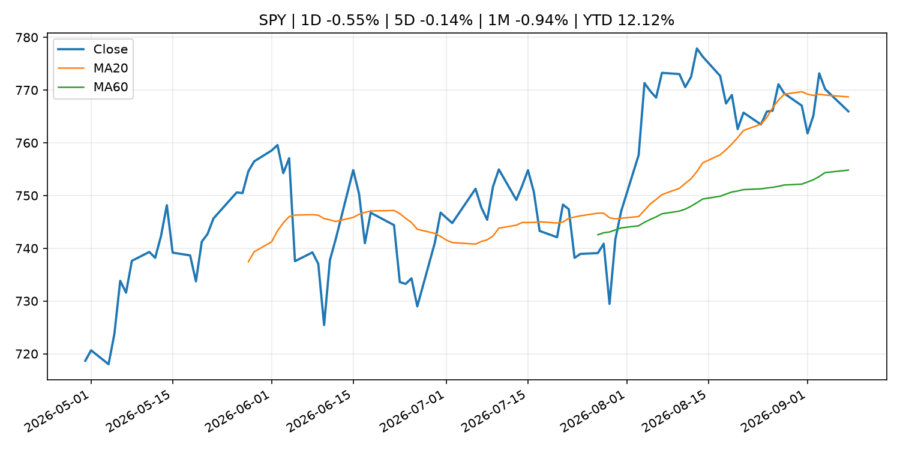
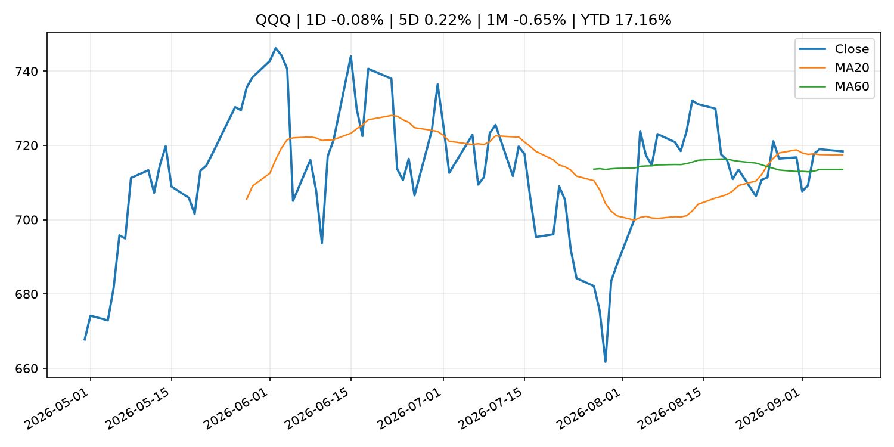
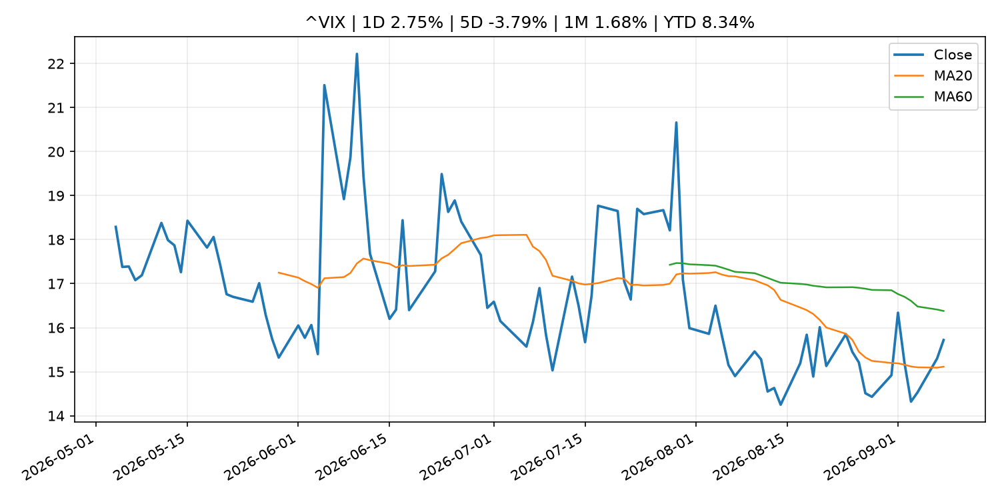
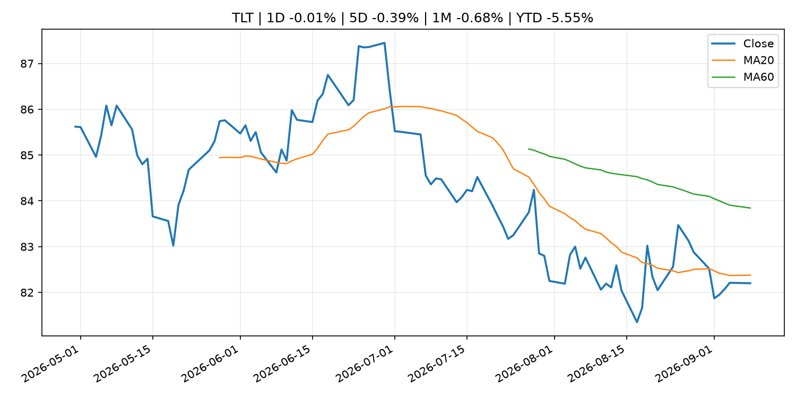
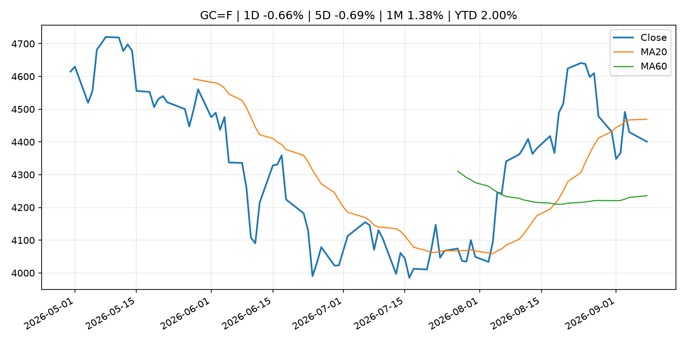
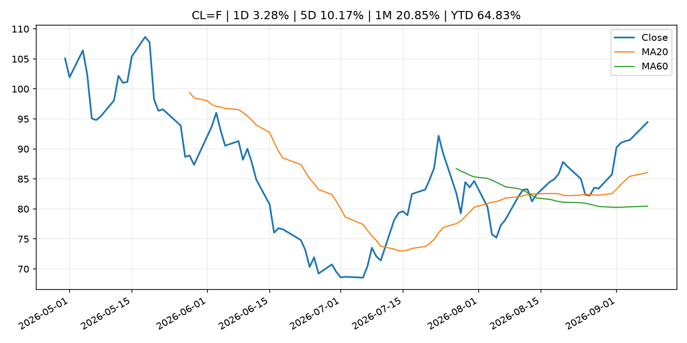
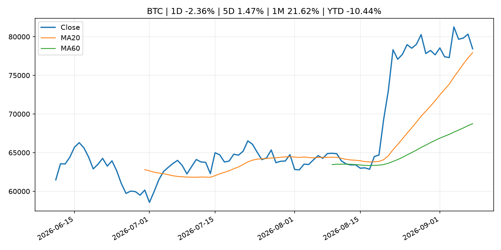
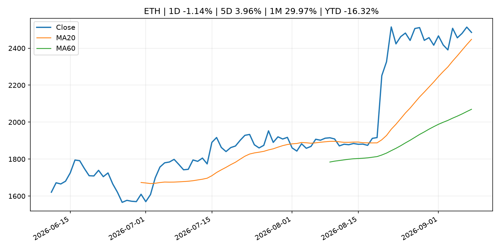
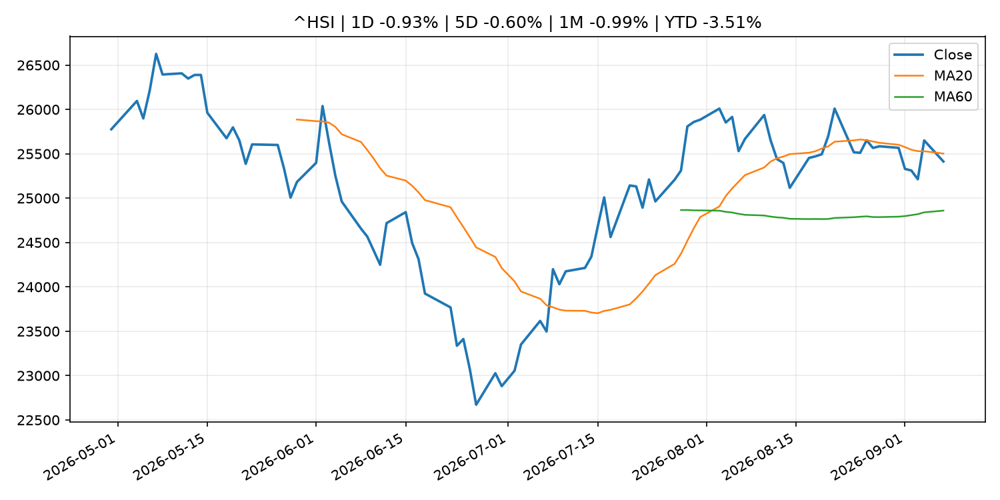

# Global Macro Morning Briefing - 2026-09-09

> Not financial advice / 非投资建议。

## 0. 今日总览
- 市场状态：unknown。市场信号不足，暂不判断明确状态。
- 今日三大主线：
  1. fiscal_policy: Stablecoins could save South Korean merchants up to $3.8 billion a year, budget office says
  2. earnings: Qualcomm’s stock climbs as Amazon chip deal offers investors much-needed good news
  3. crypto_market_structure: Visa combines VisaNet data with onchain lending to power stablecoin card working capital
- 一句话结论：今日晨报重点关注：财政和贸易政策会影响增长、通胀、企业利润和跨境资本流。；大型科技股盈利和资本开支会影响纳指、半导体和 AI 交易主线。。跨资产方面，SPY 1D -0.55%；QQQ 1D -0.08%；^VIX 1D 2.75%；TLT 1D -0.01%；GC=F 1D -0.66%；CL=F 1D 3.28%；BTC 1D -2.36%；ETH 1D -1.14%；市场信号不足，暂不判断明确状态。政策、通胀、利率、美元、美债、能源和加密监管仍是主要观察线索。所有结论仅基于公开数据与短摘要整理，不构成投资建议。

## 1. 隔夜跨资产市场
- 美股：SPY 1D -0.55%，QQQ 1D -0.08%，整体趋势需结合 VIX 和利率确认。
- 美债/美元：TLT 1D -0.01%，美元指数 1D -0.35%，是判断折现率压力的核心线索。
- 黄金/原油：黄金 1D -0.66%，原油 1D 3.28%，用于观察避险、通胀和地缘风险。
- 加密：BTC 1D -2.36%，ETH 1D -1.14%，关注是否独立于纳指走出加密自身行情。
- 港股/A股：恒生 1D -0.93%，沪深300/上证 1D n/a，重点看中国政策预期与人民币线索。
- 风险观察：关注后续数据是否确认当前跨资产信号。

### US_EQUITY

| symbol | latest close | 1D | 5D | 1M | YTD | trend |
|---|---:|---:|---:|---:|---:|---|
| SPY | 765.96 | -0.55% | -0.14% | -0.94% | 12.12% | range_bound |
| QQQ | 718.36 | -0.08% | 0.22% | -0.65% | 17.16% | uptrend |
| DIA | 528.03 | -1.13% | -0.67% | -2.15% | 9.18% | range_bound |
| IWM | 294.67 | -0.45% | 0.25% | -2.28% | 18.45% | range_bound |
| VTI | 377.60 | -0.56% | -0.15% | -1.09% | 12.28% | range_bound |

### US_MACRO_MARKET

| symbol | latest close | 1D | 5D | 1M | YTD | trend |
|---|---:|---:|---:|---:|---:|---|
| ^VIX | 15.72 | 2.75% | -3.79% | 1.68% | 8.34% | range_bound |
| DX-Y.NYB | 98.81 | -0.35% | -0.63% | -0.80% | 0.39% | downtrend |
| TLT | 82.20 | -0.01% | -0.39% | -0.68% | -5.55% | downtrend |
| IEF | 92.16 | -0.10% | -0.63% | -1.08% | -4.08% | downtrend |

### COMMODITIES

| symbol | latest close | 1D | 5D | 1M | YTD | trend |
|---|---:|---:|---:|---:|---:|---|
| GC=F | 4,400.70 | -0.66% | -0.69% | 1.38% | 2.00% | range_bound |
| SI=F | 66.35 | 0.45% | 0.19% | 4.76% | -5.97% | range_bound |
| CL=F | 94.48 | 3.28% | 10.17% | 20.85% | 64.83% | strong_uptrend |
| BZ=F | 99.52 | 3.37% | 9.98% | 19.11% | 63.82% | strong_uptrend |
| NG=F | 2.90 | -2.59% | -1.26% | 8.87% | -19.90% | range_bound |
| HG=F | 6.77 | 2.65% | 2.71% | 3.07% | 20.07% | strong_uptrend |

### HK_MARKET

| symbol | latest close | 1D | 5D | 1M | YTD | trend |
|---|---:|---:|---:|---:|---:|---|
| ^HSI | 25,413.12 | -0.93% | -0.60% | -0.99% | -3.51% | range_bound |
| 0700.HK | 435.40 | -0.68% | -1.36% | -9.56% | -30.11% | strong_downtrend |
| 9988.HK | 109.50 | -0.09% | -0.82% | -13.58% | -26.51% | range_bound |
| 3690.HK | 80.60 | 0.69% | 5.15% | -14.16% | -22.94% | range_bound |
| 1810.HK | 26.92 | -2.11% | -2.32% | -2.53% | -33.17% | range_bound |
| 1211.HK | 83.85 | -0.77% | -4.99% | -9.15% | -15.09% | range_bound |

### CRYPTO

| symbol | latest close | 1D | 5D | 1M | YTD | trend |
|---|---:|---:|---:|---:|---:|---|
| BTC | 78,434.45 | -2.36% | 1.47% | 21.62% | -10.44% | uptrend |
| ETH | 2,485.36 | -1.14% | 3.96% | 29.97% | -16.32% | uptrend |
| SOLANA | 103.34 | -2.96% | 2.94% | 36.02% | -17.01% | strong_uptrend |
| BINANCECOIN | 752.34 | -0.05% | 9.32% | 24.30% | -12.79% | strong_uptrend |
| RIPPLE | 1.42 | -0.46% | 4.87% | 41.27% | -23.06% | uptrend |

## 2. 今日最重要的 10 条新闻
### 1. Stablecoins could save South Korean merchants up to $3.8 billion a year, budget office says
- 来源：CoinDesk
- 时间：2026-09-08T09:51:01+00:00
- 地区：global
- 事件类型：fiscal_policy
- 重要性层级：Tier 1
- 一句话摘要：Stablecoins could save South Korean merchants up to $3.8 billion a year, budget office says
- 为什么重要：财政和贸易政策会影响增长、通胀、企业利润和跨境资本流。
- 可能影响：可能影响利率、汇率、风险资产或大宗商品预期，但当前公开信息不足以判断明确方向。
  - 资产：暂无明确资产映射
  - 方向：unknown
  - 强度：low
  - 原因：公开信息不足以判断方向。
- 原文链接：[https://www.coindesk.com/business/2026/09/08/stablecoins-could-save-south-korean-merchants-up-to-usd3-8-billion-a-year-budget-office-says](https://www.coindesk.com/business/2026/09/08/stablecoins-could-save-south-korean-merchants-up-to-usd3-8-billion-a-year-budget-office-says)

### 2. Qualcomm’s stock climbs as Amazon chip deal offers investors much-needed good news
- 来源：MarketWatch Top Stories
- 时间：2026-09-08T21:32:00+00:00
- 地区：US
- 事件类型：earnings
- 重要性层级：Tier 2
- 一句话摘要：Qualcomm shares have missed out on the chip sector’s rally this year — but the company is now working on various chip projects with Amazon.
- 为什么重要：大型科技股盈利和资本开支会影响纳指、半导体和 AI 交易主线。
- 可能影响：主要影响 QQQ，方向为 mixed，强度 high；AI 资本开支会影响大型科技股盈利和估值预期。
  - 资产：QQQ
    方向：mixed
    强度：high
    原因：AI 资本开支会影响大型科技股盈利和估值预期。
  - 资产：SMH
    方向：mixed
    强度：high
    原因：AI 投资周期直接影响半导体需求。
  - 资产：NVDA
    方向：mixed
    强度：high
    原因：AI 训练和推理需求是英伟达收入预期核心变量。
  - 资产：MSFT
    方向：mixed
    强度：medium
    原因：云和 AI 资本开支影响利润率与增长叙事。
  - 资产：GOOGL
    方向：mixed
    强度：medium
    原因：AI 投资和搜索商业化影响估值。
  - 资产：META
    方向：mixed
    强度：medium
    原因：AI 基建支出与广告效率共同影响市场预期。
- 原文链接：[https://www.marketwatch.com/story/qualcomms-stock-climbs-as-amazon-chip-deal-offers-investors-some-much-needed-good-news-5b6a95ca?mod=mw_rss_topstories](https://www.marketwatch.com/story/qualcomms-stock-climbs-as-amazon-chip-deal-offers-investors-some-much-needed-good-news-5b6a95ca?mod=mw_rss_topstories)

### 3. Visa combines VisaNet data with onchain lending to power stablecoin card working capital
- 来源：CoinDesk
- 时间：2026-09-08T14:29:14+00:00
- 地区：global
- 事件类型：crypto_market_structure
- 重要性层级：Tier 2
- 一句话摘要：Visa combines VisaNet data with onchain lending to power stablecoin card working capital
- 为什么重要：加密市场结构和监管变化会影响 BTC、ETH 及相关股票的风险溢价。
- 可能影响：主要影响 BTC，方向为 mixed，强度 high；加密监管或 ETF 进展会改变 BTC 的资金流和风险溢价。
  - 资产：BTC
    方向：mixed
    强度：high
    原因：加密监管或 ETF 进展会改变 BTC 的资金流和风险溢价。
  - 资产：ETH
    方向：mixed
    强度：high
    原因：监管框架会影响 ETH 产品化和机构参与度。
  - 资产：COIN
    方向：mixed
    强度：medium
    原因：监管清晰度和执法风险会影响交易平台估值。
  - 资产：crypto market
    方向：mixed
    强度：high
    原因：信息影响整个加密市场结构，但方向取决于细节。
- 原文链接：[https://www.coindesk.com/business/2026/09/08/visa-opens-settlement-data-to-help-blockchain-lenders-finance-crypto-cards-as-volume-surges](https://www.coindesk.com/business/2026/09/08/visa-opens-settlement-data-to-help-blockchain-lenders-finance-crypto-cards-as-volume-surges)

### 4. Visa tells CNBC it is expanding data offering for blockchain lenders as demand for stablecoin-linked cards surges
- 来源：CNBC Economy
- 时间：2026-09-08T11:30:01+00:00
- 地区：US
- 事件类型：crypto_market_structure
- 重要性层级：Tier 2
- 一句话摘要：Visa is doubling down on blockchain-powered financial services with a new program to help issuers of stablecoin-linked cards access loans.
- 为什么重要：加密市场结构和监管变化会影响 BTC、ETH 及相关股票的风险溢价。
- 可能影响：主要影响 BTC，方向为 mixed，强度 high；加密监管或 ETF 进展会改变 BTC 的资金流和风险溢价。
  - 资产：BTC
    方向：mixed
    强度：high
    原因：加密监管或 ETF 进展会改变 BTC 的资金流和风险溢价。
  - 资产：ETH
    方向：mixed
    强度：high
    原因：监管框架会影响 ETH 产品化和机构参与度。
  - 资产：COIN
    方向：mixed
    强度：medium
    原因：监管清晰度和执法风险会影响交易平台估值。
  - 资产：crypto market
    方向：mixed
    强度：high
    原因：信息影响整个加密市场结构，但方向取决于细节。
- 原文链接：[https://www.cnbc.com/2026/09/08/visa-blockchain-lender-stablecoin-cards.html](https://www.cnbc.com/2026/09/08/visa-blockchain-lender-stablecoin-cards.html)

### 5. Stablecoin wallets challenge traditional bank accounts as main consumer money hub
- 来源：CoinDesk
- 时间：2026-09-07T14:12:15+00:00
- 地区：global
- 事件类型：crypto_market_structure
- 重要性层级：Tier 2
- 一句话摘要：Stablecoin wallets challenge traditional bank accounts as main consumer money hub
- 为什么重要：加密市场结构和监管变化会影响 BTC、ETH 及相关股票的风险溢价。
- 可能影响：主要影响 BTC，方向为 mixed，强度 high；加密监管或 ETF 进展会改变 BTC 的资金流和风险溢价。
  - 资产：BTC
    方向：mixed
    强度：high
    原因：加密监管或 ETF 进展会改变 BTC 的资金流和风险溢价。
  - 资产：ETH
    方向：mixed
    强度：high
    原因：监管框架会影响 ETH 产品化和机构参与度。
  - 资产：COIN
    方向：mixed
    强度：medium
    原因：监管清晰度和执法风险会影响交易平台估值。
  - 资产：crypto market
    方向：mixed
    强度：high
    原因：信息影响整个加密市场结构，但方向取决于细节。
- 原文链接：[https://www.coindesk.com/business/2026/09/07/stablecoin-wallets-challenge-traditional-bank-accounts-as-main-consumer-money-hub](https://www.coindesk.com/business/2026/09/07/stablecoin-wallets-challenge-traditional-bank-accounts-as-main-consumer-money-hub)

### 6. Frank Elderson: Fireside chat
- 来源：ECB Press Releases
- 时间：2026-09-08T17:00:00+02:00
- 地区：EU
- 事件类型：other
- 重要性层级：Tier 3
- 一句话摘要：Frank Elderson: Fireside chat
- 为什么重要：这条信息暂未匹配到重大宏观、政策或市场事件，更适合作为背景跟踪。
- 可能影响：更偏背景信息，短期市场影响可能有限。
  - 资产：暂无明确资产映射
  - 方向：unknown
  - 强度：low
  - 原因：公开信息不足以判断方向。
- 原文链接：[https://www.ecb.europa.eu//press/key/date/2026/html/ecb.sp260908~3652aa828f.en.html](https://www.ecb.europa.eu//press/key/date/2026/html/ecb.sp260908~3652aa828f.en.html)

### 7. Bitcoin rally has more room as volatility shorts unwind, Two Prime CEO says
- 来源：CoinDesk
- 时间：2026-09-08T13:18:21+00:00
- 地区：global
- 事件类型：other
- 重要性层级：Tier 3
- 一句话摘要：Bitcoin rally has more room as volatility shorts unwind, Two Prime CEO says
- 为什么重要：这条信息暂未匹配到重大宏观、政策或市场事件，更适合作为背景跟踪。
- 可能影响：更偏背景信息，短期市场影响可能有限。
  - 资产：暂无明确资产映射
  - 方向：unknown
  - 强度：low
  - 原因：公开信息不足以判断方向。
- 原文链接：[https://www.coindesk.com/markets/2026/09/03/bitcoin-rally-has-more-room-as-volatility-shorts-unwind-two-prime-ceo-says](https://www.coindesk.com/markets/2026/09/03/bitcoin-rally-has-more-room-as-volatility-shorts-unwind-two-prime-ceo-says)

## 3. 政策与央行观察
### 1. Stablecoins could save South Korean merchants up to $3.8 billion a year, budget office says
- 来源：CoinDesk
- 时间：2026-09-08T09:51:01+00:00
- 地区：global
- 事件类型：fiscal_policy
- 重要性层级：Tier 1
- 一句话摘要：Stablecoins could save South Korean merchants up to $3.8 billion a year, budget office says
- 为什么重要：财政和贸易政策会影响增长、通胀、企业利润和跨境资本流。
- 可能影响：可能影响利率、汇率、风险资产或大宗商品预期，但当前公开信息不足以判断明确方向。
  - 资产：暂无明确资产映射
  - 方向：unknown
  - 强度：low
  - 原因：公开信息不足以判断方向。
- 原文链接：[https://www.coindesk.com/business/2026/09/08/stablecoins-could-save-south-korean-merchants-up-to-usd3-8-billion-a-year-budget-office-says](https://www.coindesk.com/business/2026/09/08/stablecoins-could-save-south-korean-merchants-up-to-usd3-8-billion-a-year-budget-office-says)

### 2. Visa combines VisaNet data with onchain lending to power stablecoin card working capital
- 来源：CoinDesk
- 时间：2026-09-08T14:29:14+00:00
- 地区：global
- 事件类型：crypto_market_structure
- 重要性层级：Tier 2
- 一句话摘要：Visa combines VisaNet data with onchain lending to power stablecoin card working capital
- 为什么重要：加密市场结构和监管变化会影响 BTC、ETH 及相关股票的风险溢价。
- 可能影响：主要影响 BTC，方向为 mixed，强度 high；加密监管或 ETF 进展会改变 BTC 的资金流和风险溢价。
  - 资产：BTC
    方向：mixed
    强度：high
    原因：加密监管或 ETF 进展会改变 BTC 的资金流和风险溢价。
  - 资产：ETH
    方向：mixed
    强度：high
    原因：监管框架会影响 ETH 产品化和机构参与度。
  - 资产：COIN
    方向：mixed
    强度：medium
    原因：监管清晰度和执法风险会影响交易平台估值。
  - 资产：crypto market
    方向：mixed
    强度：high
    原因：信息影响整个加密市场结构，但方向取决于细节。
- 原文链接：[https://www.coindesk.com/business/2026/09/08/visa-opens-settlement-data-to-help-blockchain-lenders-finance-crypto-cards-as-volume-surges](https://www.coindesk.com/business/2026/09/08/visa-opens-settlement-data-to-help-blockchain-lenders-finance-crypto-cards-as-volume-surges)

### 3. Visa tells CNBC it is expanding data offering for blockchain lenders as demand for stablecoin-linked cards surges
- 来源：CNBC Economy
- 时间：2026-09-08T11:30:01+00:00
- 地区：US
- 事件类型：crypto_market_structure
- 重要性层级：Tier 2
- 一句话摘要：Visa is doubling down on blockchain-powered financial services with a new program to help issuers of stablecoin-linked cards access loans.
- 为什么重要：加密市场结构和监管变化会影响 BTC、ETH 及相关股票的风险溢价。
- 可能影响：主要影响 BTC，方向为 mixed，强度 high；加密监管或 ETF 进展会改变 BTC 的资金流和风险溢价。
  - 资产：BTC
    方向：mixed
    强度：high
    原因：加密监管或 ETF 进展会改变 BTC 的资金流和风险溢价。
  - 资产：ETH
    方向：mixed
    强度：high
    原因：监管框架会影响 ETH 产品化和机构参与度。
  - 资产：COIN
    方向：mixed
    强度：medium
    原因：监管清晰度和执法风险会影响交易平台估值。
  - 资产：crypto market
    方向：mixed
    强度：high
    原因：信息影响整个加密市场结构，但方向取决于细节。
- 原文链接：[https://www.cnbc.com/2026/09/08/visa-blockchain-lender-stablecoin-cards.html](https://www.cnbc.com/2026/09/08/visa-blockchain-lender-stablecoin-cards.html)

### 4. Stablecoin wallets challenge traditional bank accounts as main consumer money hub
- 来源：CoinDesk
- 时间：2026-09-07T14:12:15+00:00
- 地区：global
- 事件类型：crypto_market_structure
- 重要性层级：Tier 2
- 一句话摘要：Stablecoin wallets challenge traditional bank accounts as main consumer money hub
- 为什么重要：加密市场结构和监管变化会影响 BTC、ETH 及相关股票的风险溢价。
- 可能影响：主要影响 BTC，方向为 mixed，强度 high；加密监管或 ETF 进展会改变 BTC 的资金流和风险溢价。
  - 资产：BTC
    方向：mixed
    强度：high
    原因：加密监管或 ETF 进展会改变 BTC 的资金流和风险溢价。
  - 资产：ETH
    方向：mixed
    强度：high
    原因：监管框架会影响 ETH 产品化和机构参与度。
  - 资产：COIN
    方向：mixed
    强度：medium
    原因：监管清晰度和执法风险会影响交易平台估值。
  - 资产：crypto market
    方向：mixed
    强度：high
    原因：信息影响整个加密市场结构，但方向取决于细节。
- 原文链接：[https://www.coindesk.com/business/2026/09/07/stablecoin-wallets-challenge-traditional-bank-accounts-as-main-consumer-money-hub](https://www.coindesk.com/business/2026/09/07/stablecoin-wallets-challenge-traditional-bank-accounts-as-main-consumer-money-hub)

## 4. 市场异动与图表
- SPY 下跌 -0.55%
- DXY 下跌 -0.35%
- Gold 下跌 -0.66%
- Oil 上涨 3.28%
- BTC 下跌 -2.36%

### SPY

### QQQ

### ^VIX

### TLT

### GC=F

### CL=F

### BTC

### ETH

### ^HSI

## 5. 华尔街与机构公开观点
- 暂无可靠公开观点。

## 6. 今日重点关注
- 经济数据：经济数据：暂无可靠公开日历数据；如配置经济日历源后可自动填充。
- 央行讲话：央行讲话：暂无可靠公开日历数据；重点跟踪 Fed、ECB、BoJ、PBOC 官网 RSS。
- 财报：财报：暂无可靠数据。
- 政策事件：政策事件：暂无可靠数据。
- 风险提醒：风险提醒：关注数据源失败项、突发地缘风险、利率和美元的二阶反应。

## 7. 英文金融表达与宏观概念
- **market structure**：市场结构，指交易、托管、清算、ETF、监管等制度安排。 例句：Crypto market structure rules can affect institutional participation.
- **inflation expectations**：通胀预期，指家庭、企业或市场对未来通胀的预估。 例句：Inflation expectations can shape wage bargaining and bond yields.
- **real yield**：实际收益率，名义利率扣除通胀预期后的收益率。 例句：Gold often reacts more to real yields than nominal yields.
- **terminal rate**：终端利率，市场预期本轮加息周期的最高政策利率。 例句：A higher terminal rate can pressure growth stocks.
- **soft landing**：软着陆，指通胀回落而经济避免明显衰退。 例句：Markets often rally when data support a soft landing.
- **risk-off**：避险模式，资金偏向美元、国债、黄金等防御资产。 例句：A geopolitical shock can push markets into risk-off mode.

## 8. 背景材料
- [Frank Elderson: Fireside chat](https://www.ecb.europa.eu//press/key/date/2026/html/ecb.sp260908~3652aa828f.en.html)（ECB Press Releases，other）：Frank Elderson: Fireside chat
- [Bitcoin rally has more room as volatility shorts unwind, Two Prime CEO says](https://www.coindesk.com/markets/2026/09/03/bitcoin-rally-has-more-room-as-volatility-shorts-unwind-two-prime-ceo-says)（CoinDesk，other）：Bitcoin rally has more room as volatility shorts unwind, Two Prime CEO says
- [Bitcoin’s complexity paradox: How layer-2 scalers became AI's main target](https://www.coindesk.com/markets/2026/09/08/bitcoin-security-risks-grow-as-ai-uncovers-hidden-vulnerabilities)（CoinDesk，other）：Bitcoin’s complexity paradox: How layer-2 scalers became AI's main target
- [Bitcoin ETFs are still $1 billion shy of breaking even in 2026](https://www.coindesk.com/daybook-us/2026/09/08/bitcoin-etfs-are-still-usd1-billion-shy-of-breaking-even-in-2026)（CoinDesk，other）：Bitcoin ETFs are still $1 billion shy of breaking even in 2026
- [Bitcoin slips to $78,800 as BNB and DeFi tokens buck the selloff](https://www.coindesk.com/markets/2026/09/08/bitcoin-slips-to-usd78-800-as-bnb-and-defi-tokens-buck-the-selloff)（CoinDesk，other）：Bitcoin slips to $78,800 as BNB and DeFi tokens buck the selloff
- [Live updates: Bitcoin slips below $78,500 as stocks close lower](https://www.coindesk.com/tech/2026/09/08/live-updates)（CoinDesk，other）：Live updates: Bitcoin slips below $78,500 as stocks close lower
- [Crypto platforms have lost over $3.63 billion to cyberattacks — even though most of them did security checks](https://www.cnbc.com/2026/09/08/crypto-platforms-lost-billions-to-cyberattacks-many-even-after-audits.html)（CNBC Economy，other）：More than 60% of cryptocurrency platforms that lost money due to cyberattacks had undergone independent security audits, CoinGecko said.
- [Bitcoin’s golden cross is here](https://www.coindesk.com/markets/2026/09/08/bitcoin-s-golden-cross-is-here)（CoinDesk，other）：Bitcoin’s golden cross is here
- [Liquid Network gets back 3,400 bitcoin from whitehat hackers; talks underway for the rest](https://www.coindesk.com/markets/2026/09/08/white-hat-hackers-return-most-of-usd320m-bitcoin-taken-from-liquid-network)（CoinDesk，other）：Liquid Network gets back 3,400 bitcoin from whitehat hackers; talks underway for the rest
- [Bitcoin slips under $79,000, Zcash leads losses as Fed hike odds hold near 60%](https://www.coindesk.com/markets/2026/09/08/bitcoin-slips-under-usd79-000-zcash-leads-losses-as-fed-hike-odds-hold-near-60)（CoinDesk，other）：Bitcoin slips under $79,000, Zcash leads losses as Fed hike odds hold near 60%
- [Principal Figures of Financial Institutions (Aug.)](http://www.boj.or.jp/en/statistics/dl/depo/kashi/kasi2608.pdf)（Bank of Japan Announcements，other）：Principal Figures of Financial Institutions (Aug.)
- [Polish prosecutors charge fifth suspect in a massive crypto probe](https://www.coindesk.com/policy/2026/09/07/polish-prosecutors-charge-fifth-suspect-in-a-massive-crypto-probe)（CoinDesk，other）：Polish prosecutors charge fifth suspect in a massive crypto probe
- [Amounts Outstanding in the Call Money Market (Aug.)](http://www.boj.or.jp/en/statistics/market/short/call/call.xlsx)（Bank of Japan Announcements，other）：Amounts Outstanding in the Call Money Market (Aug.)
- [Consumption Activity Index](http://www.boj.or.jp/en/research/research_data/cai/index.htm)（Bank of Japan Announcements，other）：Consumption Activity Index
- [Monetary Base and the Bank of Japan's Transactions (Aug.)](http://www.boj.or.jp/en/statistics/boj/other/mbt/mbt2608.pdf)（Bank of Japan Announcements，other）：Monetary Base and the Bank of Japan's Transactions (Aug.)
- [Bank of Japan's Transactions with the Government (Aug.)](http://www.boj.or.jp/en/statistics/boj/other/tseifu/release/2026/seifu2608.pdf)（Bank of Japan Announcements，other）：Bank of Japan's Transactions with the Government (Aug.)
- [Market Operations by the Bank of Japan (Aug.)](http://www.boj.or.jp/en/statistics/boj/fm/ope/m_release/2026/ope2608.xlsx)（Bank of Japan Announcements，other）：Market Operations by the Bank of Japan (Aug.)

## 9. 数据源、失败项与免责声明
- 采集时间：2026-09-08T23:50:54
- 数据源：公开 RSS、Yahoo Finance、CoinGecko、AKShare、FRED、SEC data.sec.gov，以及用户自有 inputs/reports 文件。
- 合规说明：不绕过 WSJ、Bloomberg、FT、Reuters 等付费墙；对付费媒体只使用公开 RSS 标题、摘要、链接和发布时间。
- 免责声明：Not financial advice / 非投资建议。本项目仅供个人学习、研究和信息整理，不构成投资建议、交易建议或任何收益承诺。
- 失败或跳过的数据源：
  - crypto data failed coin=dogecoin
  - China market data failed symbol=上证指数: empty dataframe
  - China market data failed symbol=深证成指: empty dataframe
  - China market data failed symbol=创业板指: empty dataframe
  - China market data failed symbol=沪深300: empty dataframe
  - China market data failed symbol=中证500: empty dataframe
  - China market data failed symbol=科创50: empty dataframe
  - FRED_API_KEY not set; skipping FRED macro series
  - SEC failed cik=0000320193
  - SEC failed cik=0000789019
  - SEC failed cik=0001045810
  - SEC failed cik=0001318605
  - SEC failed cik=0001577552
