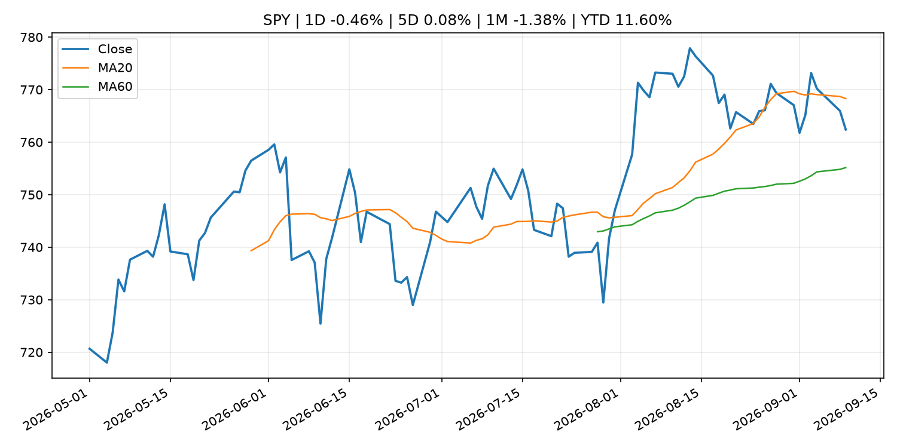
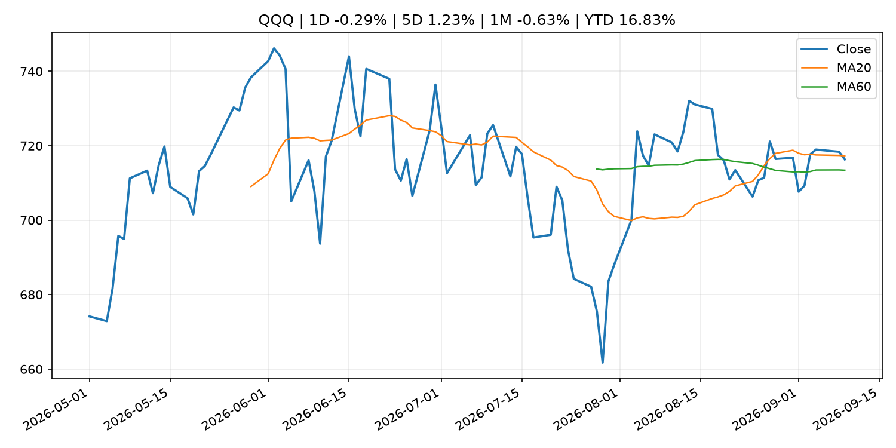
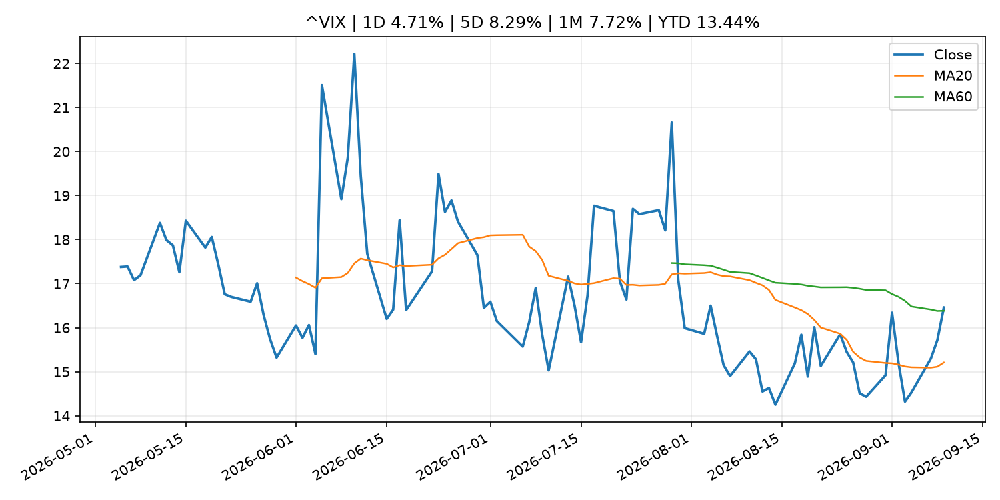
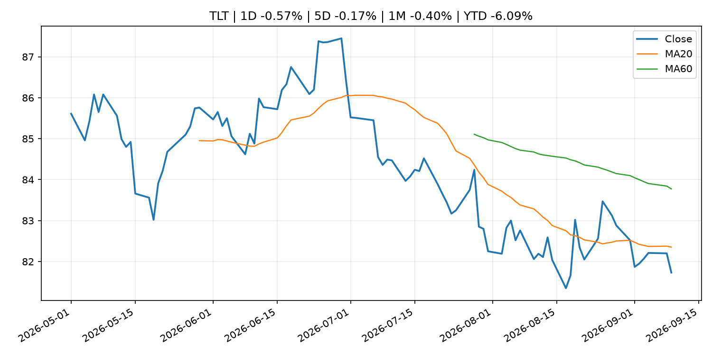
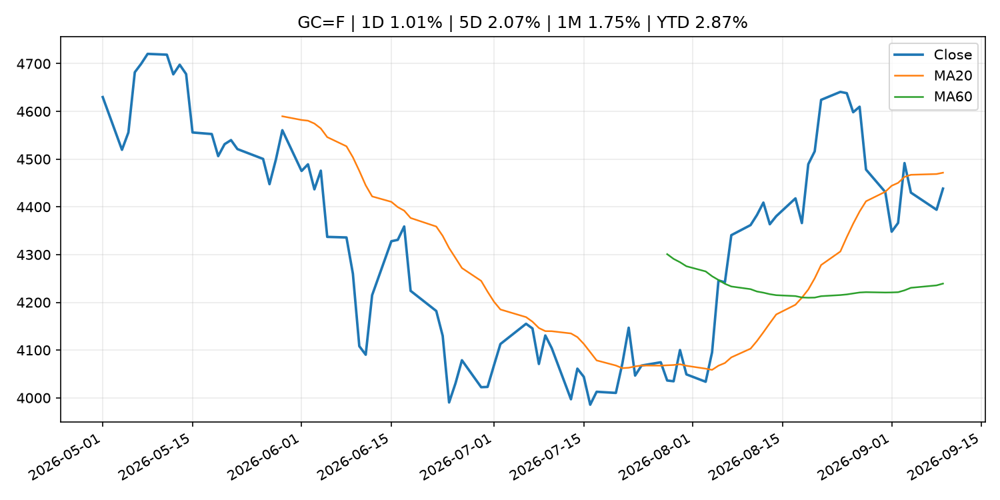
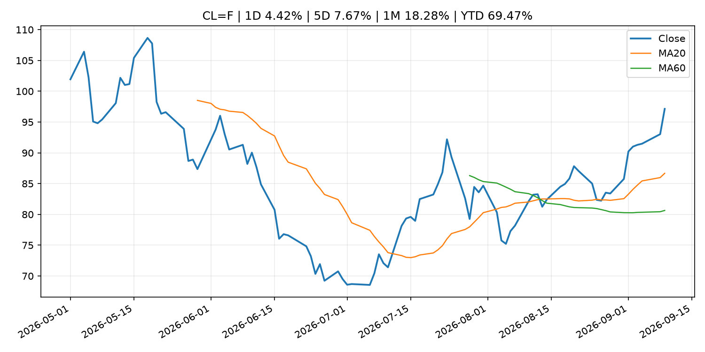
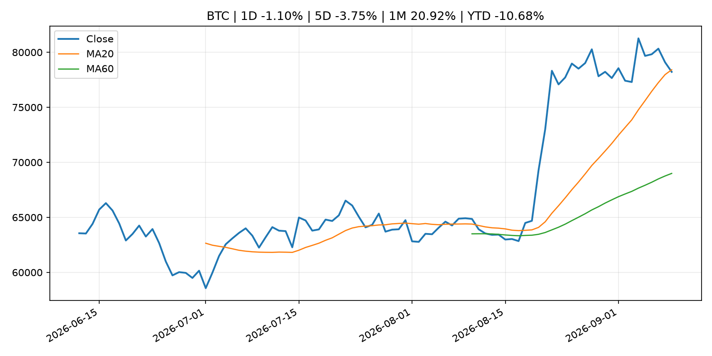
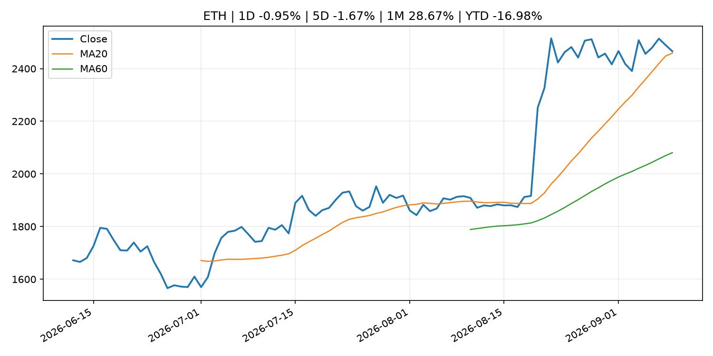
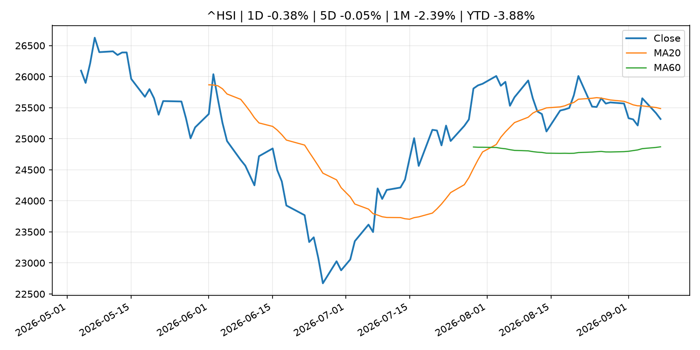

# Global Macro Morning Briefing - 2026-09-10

> Not financial advice / 非投资建议。

## 0. 今日总览
- 市场状态：unknown。市场信号不足，暂不判断明确状态。
- 今日三大主线：
  1. macro_data: Diesel prices hit another record high. If you’re shocked, wait until you see your grocery bill.
  2. fiscal_policy: U.S. Treasury sanctions another widespread cyber-scam hub, Xinbi Guarantee
  3. fiscal_policy: Germany moves to tax bitcoin like stocks as new draft bill targets tax-free gains
- 一句话结论：今日晨报重点关注：这类宏观数据会直接改变市场对通胀、增长和政策路径的预期。；财政和贸易政策会影响增长、通胀、企业利润和跨境资本流。。跨资产方面，SPY 1D -0.46%；QQQ 1D -0.29%；^VIX 1D 4.71%；TLT 1D -0.57%；GC=F 1D 1.01%；CL=F 1D 4.42%；BTC 1D -1.10%；ETH 1D -0.95%；市场信号不足，暂不判断明确状态。政策、通胀、利率、美元、美债、能源和加密监管仍是主要观察线索。所有结论仅基于公开数据与短摘要整理，不构成投资建议。

## 1. 隔夜跨资产市场
- 美股：SPY 1D -0.46%，QQQ 1D -0.29%，整体趋势需结合 VIX 和利率确认。
- 美债/美元：TLT 1D -0.57%，美元指数 1D -0.06%，是判断折现率压力的核心线索。
- 黄金/原油：黄金 1D 1.01%，原油 1D 4.42%，用于观察避险、通胀和地缘风险。
- 加密：BTC 1D -1.10%，ETH 1D -0.95%，关注是否独立于纳指走出加密自身行情。
- 港股/A股：恒生 1D -0.38%，沪深300/上证 1D n/a，重点看中国政策预期与人民币线索。
- 风险观察：关注后续数据是否确认当前跨资产信号。

### US_EQUITY

| symbol | latest close | 1D | 5D | 1M | YTD | trend |
|---|---:|---:|---:|---:|---:|---|
| SPY | 762.40 | -0.46% | 0.08% | -1.38% | 11.60% | range_bound |
| QQQ | 716.31 | -0.29% | 1.23% | -0.63% | 16.83% | range_bound |
| DIA | 524.07 | -0.75% | -0.70% | -2.77% | 8.36% | range_bound |
| IWM | 290.64 | -1.37% | 0.02% | -3.11% | 16.83% | range_bound |
| VTI | 375.56 | -0.54% | 0.10% | -1.59% | 11.67% | range_bound |

### US_MACRO_MARKET

| symbol | latest close | 1D | 5D | 1M | YTD | trend |
|---|---:|---:|---:|---:|---:|---|
| ^VIX | 16.46 | 4.71% | 8.29% | 7.72% | 13.44% | range_bound |
| DX-Y.NYB | 98.78 | -0.06% | -0.89% | -1.03% | 0.37% | downtrend |
| TLT | 81.73 | -0.57% | -0.17% | -0.40% | -6.09% | downtrend |
| IEF | 91.89 | -0.29% | -0.22% | -0.93% | -4.36% | downtrend |

### COMMODITIES

| symbol | latest close | 1D | 5D | 1M | YTD | trend |
|---|---:|---:|---:|---:|---:|---|
| GC=F | 4,438.20 | 1.01% | 2.07% | 1.75% | 2.87% | range_bound |
| SI=F | 67.82 | 2.29% | 4.95% | 4.16% | -3.88% | strong_uptrend |
| CL=F | 97.14 | 4.42% | 7.67% | 18.28% | 69.47% | strong_uptrend |
| BZ=F | 102.08 | 4.25% | 7.85% | 16.37% | 68.03% | strong_uptrend |
| NG=F | 2.81 | -3.74% | -3.34% | 0.47% | -22.42% | downtrend |
| HG=F | 6.85 | 1.69% | 5.33% | 3.92% | 21.51% | strong_uptrend |

### HK_MARKET

| symbol | latest close | 1D | 5D | 1M | YTD | trend |
|---|---:|---:|---:|---:|---:|---|
| ^HSI | 25,317.18 | -0.38% | -0.05% | -2.39% | -3.88% | range_bound |
| 0700.HK | 434.00 | -0.32% | -0.96% | -7.82% | -30.34% | strong_downtrend |
| 9988.HK | 109.80 | 0.27% | -0.09% | -13.13% | -26.31% | range_bound |
| 3690.HK | 77.80 | -3.47% | -1.21% | -16.39% | -25.62% | strong_downtrend |
| 1810.HK | 26.38 | -2.01% | -5.99% | -1.05% | -34.51% | range_bound |
| 1211.HK | 81.80 | -2.44% | -4.05% | -8.81% | -17.16% | range_bound |

### CRYPTO

| symbol | latest close | 1D | 5D | 1M | YTD | trend |
|---|---:|---:|---:|---:|---:|---|
| BTC | 78,219.84 | -1.10% | -3.75% | 20.92% | -10.68% | range_bound |
| ETH | 2,465.84 | -0.95% | -1.67% | 28.67% | -16.98% | uptrend |
| SOLANA | 101.68 | -2.02% | -2.20% | 32.05% | -18.35% | strong_uptrend |
| BINANCECOIN | 722.75 | -2.29% | -0.32% | 19.76% | -16.22% | strong_uptrend |
| RIPPLE | 1.39 | -0.12% | -3.92% | 39.28% | -24.24% | range_bound |

## 2. 今日最重要的 10 条新闻
### 1. Diesel prices hit another record high. If you’re shocked, wait until you see your grocery bill.
- 来源：MarketWatch Top Stories
- 时间：2026-09-09T22:51:00+00:00
- 地区：US
- 事件类型：macro_data
- 重要性层级：Tier 1
- 一句话摘要：The most important price in America is one most drivers never pay — and it reaches the CPI, the Fed and the European Central Bank in the same week.
- 为什么重要：这类宏观数据会直接改变市场对通胀、增长和政策路径的预期。
- 可能影响：主要影响 DXY，方向为 positive，强度 high；通胀压力可能推高政策利率预期并支撑美元。
  - 资产：DXY
    方向：positive
    强度：high
    原因：通胀压力可能推高政策利率预期并支撑美元。
  - 资产：TLT
    方向：negative
    强度：high
    原因：通胀上行通常推升收益率、压低长债价格。
  - 资产：QQQ
    方向：negative
    强度：high
    原因：更高利率对成长股估值折现率不利。
  - 资产：SPY
    方向：mixed
    强度：medium
    原因：名义增长可能支撑收入，但更高利率压制估值。
  - 资产：GC=F
    方向：mixed
    强度：medium
    原因：通胀对黄金是支撑，但实际利率上行会形成压力。
  - 资产：BTC
    方向：mixed
    强度：medium
    原因：抗通胀叙事和流动性收紧可能相互抵消。
- 原文链接：[https://www.marketwatch.com/story/diesel-prices-hit-another-record-high-if-youre-shocked-wait-until-you-see-your-grocery-bill-afee7076?mod=mw_rss_topstories](https://www.marketwatch.com/story/diesel-prices-hit-another-record-high-if-youre-shocked-wait-until-you-see-your-grocery-bill-afee7076?mod=mw_rss_topstories)

### 2. U.S. Treasury sanctions another widespread cyber-scam hub, Xinbi Guarantee
- 来源：CoinDesk
- 时间：2026-09-09T16:05:11+00:00
- 地区：global
- 事件类型：fiscal_policy
- 重要性层级：Tier 1
- 一句话摘要：U.S. Treasury sanctions another widespread cyber-scam hub, Xinbi Guarantee
- 为什么重要：财政和贸易政策会影响增长、通胀、企业利润和跨境资本流。
- 可能影响：可能影响利率、汇率、风险资产或大宗商品预期，但当前公开信息不足以判断明确方向。
  - 资产：暂无明确资产映射
  - 方向：unknown
  - 强度：low
  - 原因：公开信息不足以判断方向。
- 原文链接：[https://www.coindesk.com/policy/2026/09/09/u-s-treasury-sanctions-another-widespread-cyber-scam-hub-xinbi-guarantee](https://www.coindesk.com/policy/2026/09/09/u-s-treasury-sanctions-another-widespread-cyber-scam-hub-xinbi-guarantee)

### 3. Germany moves to tax bitcoin like stocks as new draft bill targets tax-free gains
- 来源：CoinDesk
- 时间：2026-09-09T12:13:59+00:00
- 地区：global
- 事件类型：fiscal_policy
- 重要性层级：Tier 1
- 一句话摘要：Germany moves to tax bitcoin like stocks as new draft bill targets tax-free gains
- 为什么重要：财政和贸易政策会影响增长、通胀、企业利润和跨境资本流。
- 可能影响：可能影响利率、汇率、风险资产或大宗商品预期，但当前公开信息不足以判断明确方向。
  - 资产：暂无明确资产映射
  - 方向：unknown
  - 强度：low
  - 原因：公开信息不足以判断方向。
- 原文链接：[https://www.coindesk.com/business/2026/09/09/germany-moves-to-tax-bitcoin-like-stocks-as-new-draft-bill-targets-tax-free-gains](https://www.coindesk.com/business/2026/09/09/germany-moves-to-tax-bitcoin-like-stocks-as-new-draft-bill-targets-tax-free-gains)

### 4. PayPal expands stablecoin rails with custom token issuance platform
- 来源：CoinDesk
- 时间：2026-09-09T14:00:00+00:00
- 地区：global
- 事件类型：crypto_market_structure
- 重要性层级：Tier 2
- 一句话摘要：PayPal expands stablecoin rails with custom token issuance platform
- 为什么重要：加密市场结构和监管变化会影响 BTC、ETH 及相关股票的风险溢价。
- 可能影响：主要影响 BTC，方向为 mixed，强度 high；加密监管或 ETF 进展会改变 BTC 的资金流和风险溢价。
  - 资产：BTC
    方向：mixed
    强度：high
    原因：加密监管或 ETF 进展会改变 BTC 的资金流和风险溢价。
  - 资产：ETH
    方向：mixed
    强度：high
    原因：监管框架会影响 ETH 产品化和机构参与度。
  - 资产：COIN
    方向：mixed
    强度：medium
    原因：监管清晰度和执法风险会影响交易平台估值。
  - 资产：crypto market
    方向：mixed
    强度：high
    原因：信息影响整个加密市场结构，但方向取决于细节。
- 原文链接：[https://www.coindesk.com/business/2026/09/09/paypal-expands-stablecoin-rails-with-launch-of-custom-token-issuance-platform](https://www.coindesk.com/business/2026/09/09/paypal-expands-stablecoin-rails-with-launch-of-custom-token-issuance-platform)

### 5. U.S. Bank takes next step towards launching its stablecoin with cross-border payment test
- 来源：CoinDesk
- 时间：2026-09-09T11:40:44+00:00
- 地区：global
- 事件类型：crypto_market_structure
- 重要性层级：Tier 2
- 一句话摘要：U.S. Bank takes next step towards launching its stablecoin with cross-border payment test
- 为什么重要：加密市场结构和监管变化会影响 BTC、ETH 及相关股票的风险溢价。
- 可能影响：主要影响 BTC，方向为 mixed，强度 high；加密监管或 ETF 进展会改变 BTC 的资金流和风险溢价。
  - 资产：BTC
    方向：mixed
    强度：high
    原因：加密监管或 ETF 进展会改变 BTC 的资金流和风险溢价。
  - 资产：ETH
    方向：mixed
    强度：high
    原因：监管框架会影响 ETH 产品化和机构参与度。
  - 资产：COIN
    方向：mixed
    强度：medium
    原因：监管清晰度和执法风险会影响交易平台估值。
  - 资产：crypto market
    方向：mixed
    强度：high
    原因：信息影响整个加密市场结构，但方向取决于细节。
- 原文链接：[https://www.coindesk.com/business/2026/09/08/u-s-bank-takes-next-step-towards-launching-its-stablecoin-with-cross-border-payment-test](https://www.coindesk.com/business/2026/09/08/u-s-bank-takes-next-step-towards-launching-its-stablecoin-with-cross-border-payment-test)

### 6. Visa tells CNBC it is expanding data offering for blockchain lenders as demand for stablecoin-linked cards surges
- 来源：CNBC Economy
- 时间：2026-09-08T11:30:01+00:00
- 地区：US
- 事件类型：crypto_market_structure
- 重要性层级：Tier 2
- 一句话摘要：Visa is doubling down on blockchain-powered financial services with a new program to help issuers of stablecoin-linked cards access loans.
- 为什么重要：加密市场结构和监管变化会影响 BTC、ETH 及相关股票的风险溢价。
- 可能影响：主要影响 BTC，方向为 mixed，强度 high；加密监管或 ETF 进展会改变 BTC 的资金流和风险溢价。
  - 资产：BTC
    方向：mixed
    强度：high
    原因：加密监管或 ETF 进展会改变 BTC 的资金流和风险溢价。
  - 资产：ETH
    方向：mixed
    强度：high
    原因：监管框架会影响 ETH 产品化和机构参与度。
  - 资产：COIN
    方向：mixed
    强度：medium
    原因：监管清晰度和执法风险会影响交易平台估值。
  - 资产：crypto market
    方向：mixed
    强度：high
    原因：信息影响整个加密市场结构，但方向取决于细节。
- 原文链接：[https://www.cnbc.com/2026/09/08/visa-blockchain-lender-stablecoin-cards.html](https://www.cnbc.com/2026/09/08/visa-blockchain-lender-stablecoin-cards.html)

### 7. Iran eases currency controls to let traders bring earnings home in crypto: FT
- 来源：CoinDesk
- 时间：2026-09-09T09:59:39+00:00
- 地区：global
- 事件类型：earnings
- 重要性层级：Tier 2
- 一句话摘要：Iran eases currency controls to let traders bring earnings home in crypto: FT
- 为什么重要：大型科技股盈利和资本开支会影响纳指、半导体和 AI 交易主线。
- 可能影响：可能影响利率、汇率、风险资产或大宗商品预期，但当前公开信息不足以判断明确方向。
  - 资产：暂无明确资产映射
  - 方向：unknown
  - 强度：low
  - 原因：公开信息不足以判断方向。
- 原文链接：[https://www.coindesk.com/business/2026/09/09/iran-eases-currency-controls-to-let-traders-bring-earnings-home-in-crypto-ft](https://www.coindesk.com/business/2026/09/09/iran-eases-currency-controls-to-let-traders-bring-earnings-home-in-crypto-ft)

### 8. Oil’s surge back above $100 fuels fresh inflation fears at a crucial time for interest rates
- 来源：MarketWatch Top Stories
- 时间：2026-09-09T20:36:00+00:00
- 地区：US
- 事件类型：other
- 重要性层级：Tier 3
- 一句话摘要：A prolonged oil shock could keep consumer prices elevated and complicate the path for central banks already navigating a difficult policy environment.
- 为什么重要：这条信息暂未匹配到重大宏观、政策或市场事件，更适合作为背景跟踪。
- 可能影响：主要影响 DXY，方向为 positive，强度 high；通胀压力可能推高政策利率预期并支撑美元。
  - 资产：DXY
    方向：positive
    强度：high
    原因：通胀压力可能推高政策利率预期并支撑美元。
  - 资产：TLT
    方向：negative
    强度：high
    原因：通胀上行通常推升收益率、压低长债价格。
  - 资产：QQQ
    方向：negative
    强度：high
    原因：更高利率对成长股估值折现率不利。
  - 资产：SPY
    方向：mixed
    强度：medium
    原因：名义增长可能支撑收入，但更高利率压制估值。
  - 资产：GC=F
    方向：mixed
    强度：medium
    原因：通胀对黄金是支撑，但实际利率上行会形成压力。
  - 资产：BTC
    方向：mixed
    强度：medium
    原因：抗通胀叙事和流动性收紧可能相互抵消。
- 原文链接：[https://www.marketwatch.com/story/brent-crude-reaches-100-as-war-in-iran-intensifies-b73832e2?mod=mw_rss_topstories](https://www.marketwatch.com/story/brent-crude-reaches-100-as-war-in-iran-intensifies-b73832e2?mod=mw_rss_topstories)

### 9. Bitcoin recovers toward $79,000 as Zcash records a $500 million ETF haul
- 来源：CoinDesk
- 时间：2026-09-09T04:35:55+00:00
- 地区：global
- 事件类型：other
- 重要性层级：Tier 3
- 一句话摘要：Bitcoin recovers toward $79,000 as Zcash records a $500 million ETF haul
- 为什么重要：这条信息暂未匹配到重大宏观、政策或市场事件，更适合作为背景跟踪。
- 可能影响：主要影响 BTC，方向为 mixed，强度 high；加密监管或 ETF 进展会改变 BTC 的资金流和风险溢价。
  - 资产：BTC
    方向：mixed
    强度：high
    原因：加密监管或 ETF 进展会改变 BTC 的资金流和风险溢价。
  - 资产：ETH
    方向：mixed
    强度：high
    原因：监管框架会影响 ETH 产品化和机构参与度。
  - 资产：COIN
    方向：mixed
    强度：medium
    原因：监管清晰度和执法风险会影响交易平台估值。
  - 资产：crypto market
    方向：mixed
    强度：high
    原因：信息影响整个加密市场结构，但方向取决于细节。
- 原文链接：[https://www.coindesk.com/markets/2026/09/09/bitcoin-recovers-toward-usd79-000-as-zcash-records-a-usd500-million-etf-haul](https://www.coindesk.com/markets/2026/09/09/bitcoin-recovers-toward-usd79-000-as-zcash-records-a-usd500-million-etf-haul)

## 3. 政策与央行观察
### 1. U.S. Treasury sanctions another widespread cyber-scam hub, Xinbi Guarantee
- 来源：CoinDesk
- 时间：2026-09-09T16:05:11+00:00
- 地区：global
- 事件类型：fiscal_policy
- 重要性层级：Tier 1
- 一句话摘要：U.S. Treasury sanctions another widespread cyber-scam hub, Xinbi Guarantee
- 为什么重要：财政和贸易政策会影响增长、通胀、企业利润和跨境资本流。
- 可能影响：可能影响利率、汇率、风险资产或大宗商品预期，但当前公开信息不足以判断明确方向。
  - 资产：暂无明确资产映射
  - 方向：unknown
  - 强度：low
  - 原因：公开信息不足以判断方向。
- 原文链接：[https://www.coindesk.com/policy/2026/09/09/u-s-treasury-sanctions-another-widespread-cyber-scam-hub-xinbi-guarantee](https://www.coindesk.com/policy/2026/09/09/u-s-treasury-sanctions-another-widespread-cyber-scam-hub-xinbi-guarantee)

### 2. Germany moves to tax bitcoin like stocks as new draft bill targets tax-free gains
- 来源：CoinDesk
- 时间：2026-09-09T12:13:59+00:00
- 地区：global
- 事件类型：fiscal_policy
- 重要性层级：Tier 1
- 一句话摘要：Germany moves to tax bitcoin like stocks as new draft bill targets tax-free gains
- 为什么重要：财政和贸易政策会影响增长、通胀、企业利润和跨境资本流。
- 可能影响：可能影响利率、汇率、风险资产或大宗商品预期，但当前公开信息不足以判断明确方向。
  - 资产：暂无明确资产映射
  - 方向：unknown
  - 强度：low
  - 原因：公开信息不足以判断方向。
- 原文链接：[https://www.coindesk.com/business/2026/09/09/germany-moves-to-tax-bitcoin-like-stocks-as-new-draft-bill-targets-tax-free-gains](https://www.coindesk.com/business/2026/09/09/germany-moves-to-tax-bitcoin-like-stocks-as-new-draft-bill-targets-tax-free-gains)

### 3. PayPal expands stablecoin rails with custom token issuance platform
- 来源：CoinDesk
- 时间：2026-09-09T14:00:00+00:00
- 地区：global
- 事件类型：crypto_market_structure
- 重要性层级：Tier 2
- 一句话摘要：PayPal expands stablecoin rails with custom token issuance platform
- 为什么重要：加密市场结构和监管变化会影响 BTC、ETH 及相关股票的风险溢价。
- 可能影响：主要影响 BTC，方向为 mixed，强度 high；加密监管或 ETF 进展会改变 BTC 的资金流和风险溢价。
  - 资产：BTC
    方向：mixed
    强度：high
    原因：加密监管或 ETF 进展会改变 BTC 的资金流和风险溢价。
  - 资产：ETH
    方向：mixed
    强度：high
    原因：监管框架会影响 ETH 产品化和机构参与度。
  - 资产：COIN
    方向：mixed
    强度：medium
    原因：监管清晰度和执法风险会影响交易平台估值。
  - 资产：crypto market
    方向：mixed
    强度：high
    原因：信息影响整个加密市场结构，但方向取决于细节。
- 原文链接：[https://www.coindesk.com/business/2026/09/09/paypal-expands-stablecoin-rails-with-launch-of-custom-token-issuance-platform](https://www.coindesk.com/business/2026/09/09/paypal-expands-stablecoin-rails-with-launch-of-custom-token-issuance-platform)

### 4. U.S. Bank takes next step towards launching its stablecoin with cross-border payment test
- 来源：CoinDesk
- 时间：2026-09-09T11:40:44+00:00
- 地区：global
- 事件类型：crypto_market_structure
- 重要性层级：Tier 2
- 一句话摘要：U.S. Bank takes next step towards launching its stablecoin with cross-border payment test
- 为什么重要：加密市场结构和监管变化会影响 BTC、ETH 及相关股票的风险溢价。
- 可能影响：主要影响 BTC，方向为 mixed，强度 high；加密监管或 ETF 进展会改变 BTC 的资金流和风险溢价。
  - 资产：BTC
    方向：mixed
    强度：high
    原因：加密监管或 ETF 进展会改变 BTC 的资金流和风险溢价。
  - 资产：ETH
    方向：mixed
    强度：high
    原因：监管框架会影响 ETH 产品化和机构参与度。
  - 资产：COIN
    方向：mixed
    强度：medium
    原因：监管清晰度和执法风险会影响交易平台估值。
  - 资产：crypto market
    方向：mixed
    强度：high
    原因：信息影响整个加密市场结构，但方向取决于细节。
- 原文链接：[https://www.coindesk.com/business/2026/09/08/u-s-bank-takes-next-step-towards-launching-its-stablecoin-with-cross-border-payment-test](https://www.coindesk.com/business/2026/09/08/u-s-bank-takes-next-step-towards-launching-its-stablecoin-with-cross-border-payment-test)

### 5. Visa tells CNBC it is expanding data offering for blockchain lenders as demand for stablecoin-linked cards surges
- 来源：CNBC Economy
- 时间：2026-09-08T11:30:01+00:00
- 地区：US
- 事件类型：crypto_market_structure
- 重要性层级：Tier 2
- 一句话摘要：Visa is doubling down on blockchain-powered financial services with a new program to help issuers of stablecoin-linked cards access loans.
- 为什么重要：加密市场结构和监管变化会影响 BTC、ETH 及相关股票的风险溢价。
- 可能影响：主要影响 BTC，方向为 mixed，强度 high；加密监管或 ETF 进展会改变 BTC 的资金流和风险溢价。
  - 资产：BTC
    方向：mixed
    强度：high
    原因：加密监管或 ETF 进展会改变 BTC 的资金流和风险溢价。
  - 资产：ETH
    方向：mixed
    强度：high
    原因：监管框架会影响 ETH 产品化和机构参与度。
  - 资产：COIN
    方向：mixed
    强度：medium
    原因：监管清晰度和执法风险会影响交易平台估值。
  - 资产：crypto market
    方向：mixed
    强度：high
    原因：信息影响整个加密市场结构，但方向取决于细节。
- 原文链接：[https://www.cnbc.com/2026/09/08/visa-blockchain-lender-stablecoin-cards.html](https://www.cnbc.com/2026/09/08/visa-blockchain-lender-stablecoin-cards.html)

## 4. 市场异动与图表
- SPY 下跌 -0.46%
- VIX 上涨 4.71%
- TLT 下跌 -0.57%
- Gold 上涨 1.01%
- Oil 上涨 4.42%

### SPY

### QQQ

### ^VIX

### TLT

### GC=F

### CL=F

### BTC

### ETH

### ^HSI

## 5. 华尔街与机构公开观点
- 暂无可靠公开观点。

## 6. 今日重点关注
- 经济数据：经济数据：暂无可靠公开日历数据；如配置经济日历源后可自动填充。
- 央行讲话：央行讲话：暂无可靠公开日历数据；重点跟踪 Fed、ECB、BoJ、PBOC 官网 RSS。
- 财报：财报：暂无可靠数据。
- 政策事件：政策事件：暂无可靠数据。
- 风险提醒：风险提醒：关注数据源失败项、突发地缘风险、利率和美元的二阶反应。

## 7. 英文金融表达与宏观概念
- **inflation expectations**：通胀预期，指家庭、企业或市场对未来通胀的预估。 例句：Inflation expectations can shape wage bargaining and bond yields.
- **real yield**：实际收益率，名义利率扣除通胀预期后的收益率。 例句：Gold often reacts more to real yields than nominal yields.
- **risk-off**：避险模式，资金偏向美元、国债、黄金等防御资产。 例句：A geopolitical shock can push markets into risk-off mode.
- **supply disruption**：供给扰动，通常指能源或商品供应受冲突、减产或天气影响。 例句：Supply disruption can lift oil prices and inflation expectations.
- **market structure**：市场结构，指交易、托管、清算、ETF、监管等制度安排。 例句：Crypto market structure rules can affect institutional participation.
- **terminal rate**：终端利率，市场预期本轮加息周期的最高政策利率。 例句：A higher terminal rate can pressure growth stocks.

## 8. 背景材料
- [Hunter Biden’s memecoin flops, falling 95% just hours after launch](https://www.marketwatch.com/story/hunter-bidens-memecoin-flops-falling-95-just-hours-after-launch-3e9307d0?mod=mw_rss_topstories)（MarketWatch Top Stories，other）：Investor appetite for memecoins has clearly not recovered, even as bitcoin prices have crept higher.
- [The bull market’s biggest enemy right now could be Bessent’s interventions](https://www.marketwatch.com/story/the-bull-markets-biggest-enemy-right-now-could-be-bessents-interventions-134bbe78?mod=mw_rss_topstories)（MarketWatch Top Stories，other）：A stronger yen and higher Treasury yields could become a toxic combination for the bull market in stocks.
- [Oil’s surge back above $100 fuels fresh inflation fears at a crucial time for interest rates](https://www.marketwatch.com/story/brent-crude-reaches-100-as-war-in-iran-intensifies-b73832e2?mod=mw_rss_topstories)（MarketWatch Top Stories，other）：A prolonged oil shock could keep consumer prices elevated and complicate the path for central banks already navigating a difficult policy environment.
- [Christine Lagarde: The choice facing Europeans](https://www.ecb.europa.eu//press/key/date/2026/html/ecb.sp260909~59a07e6f05.en.html)（ECB Press Releases，other）：Christine Lagarde: The choice facing Europeans
- [Bitcoin and Ethereum race quantum clock as U.S. backs $300 million hardware push](https://www.coindesk.com/tech/2026/09/09/bitcoin-and-ethereum-race-quantum-clock-as-u-s-backs-usd300-million-hardware-push)（CoinDesk，other）：Bitcoin and Ethereum race quantum clock as U.S. backs $300 million hardware push
- [Bitcoin climbs as oil tops $100, equities drop after Iran strikes](https://www.coindesk.com/markets/2026/09/09/bitcoin-climbs-as-oil-tops-usd100-equities-drop-after-iran-strikes)（CoinDesk，other）：Bitcoin climbs as oil tops $100, equities drop after Iran strikes
- [Live updates: Bitcoin slips as yields head higher following Treasury buyback announcement](https://www.coindesk.com/business/2026/09/09/live-updates-xrp-funds-stand-out-among-u-s-etfs-as-bitcoin-ether-solana-funds-see-outflows)（CoinDesk，other）：Live updates: Bitcoin slips as yields head higher following Treasury buyback announcement
- [Bitcoin recovers toward $79,000 as Zcash records a $500 million ETF haul](https://www.coindesk.com/markets/2026/09/09/bitcoin-recovers-toward-usd79-000-as-zcash-records-a-usd500-million-etf-haul)（CoinDesk，other）：Bitcoin recovers toward $79,000 as Zcash records a $500 million ETF haul
- [Warning against Scams Using the Bank of Japan's Name](http://www.boj.or.jp/en/about/organization/notice/index.htm)（Bank of Japan Announcements，other）：Warning against Scams Using the Bank of Japan's Name
- [Money Stock (Aug.)](http://www.boj.or.jp/en/statistics/money/ms/ms2608.pdf)（Bank of Japan Announcements，other）：Money Stock (Aug.)
- [Frank Elderson: Fireside chat](https://www.ecb.europa.eu//press/key/date/2026/html/ecb.sp260908~3652aa828f.en.html)（ECB Press Releases，other）：Frank Elderson: Fireside chat
- [Crypto platforms have lost over $3.63 billion to cyberattacks — even though most of them did security checks](https://www.cnbc.com/2026/09/08/crypto-platforms-lost-billions-to-cyberattacks-many-even-after-audits.html)（CNBC Economy，other）：More than 60% of cryptocurrency platforms that lost money due to cyberattacks had undergone independent security audits, CoinGecko said.
- [Principal Figures of Financial Institutions (Aug.)](http://www.boj.or.jp/en/statistics/dl/depo/kashi/kasi2608.pdf)（Bank of Japan Announcements，other）：Principal Figures of Financial Institutions (Aug.)

## 9. 数据源、失败项与免责声明
- 采集时间：2026-09-09T23:50:36
- 数据源：公开 RSS、Yahoo Finance、CoinGecko、AKShare、FRED、SEC data.sec.gov，以及用户自有 inputs/reports 文件。
- 合规说明：不绕过 WSJ、Bloomberg、FT、Reuters 等付费墙；对付费媒体只使用公开 RSS 标题、摘要、链接和发布时间。
- 免责声明：Not financial advice / 非投资建议。本项目仅供个人学习、研究和信息整理，不构成投资建议、交易建议或任何收益承诺。
- 失败或跳过的数据源：
  - crypto data failed coin=dogecoin
  - China market data failed symbol=上证指数: empty dataframe
  - China market data failed symbol=深证成指: empty dataframe
  - China market data failed symbol=创业板指: empty dataframe
  - China market data failed symbol=沪深300: empty dataframe
  - China market data failed symbol=中证500: empty dataframe
  - China market data failed symbol=科创50: empty dataframe
  - FRED_API_KEY not set; skipping FRED macro series
  - SEC failed cik=0000320193
  - SEC failed cik=0000789019
  - SEC failed cik=0001045810
  - SEC failed cik=0001318605
  - SEC failed cik=0001577552
