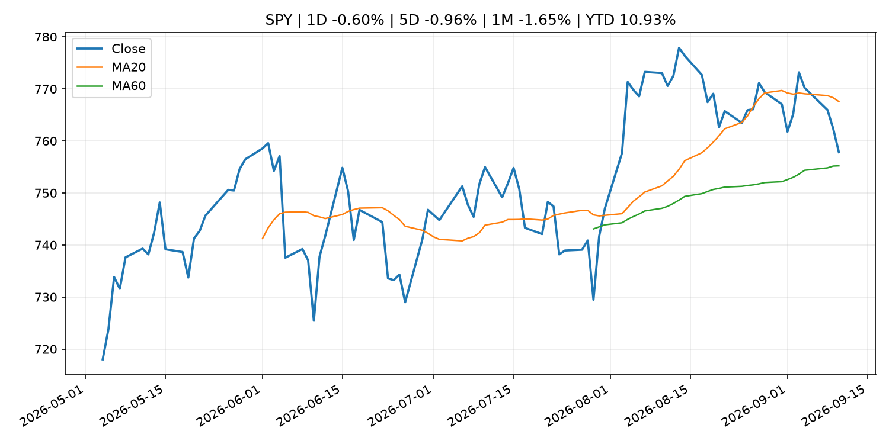
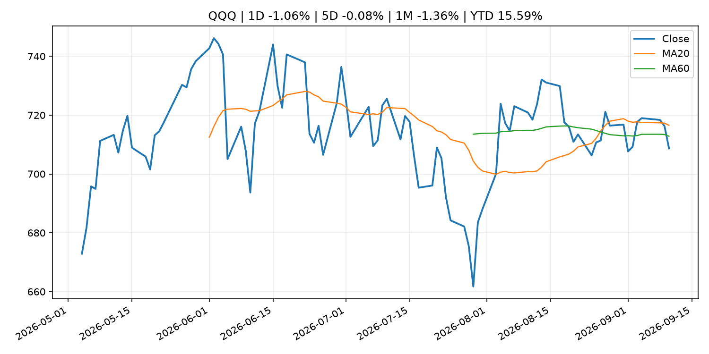
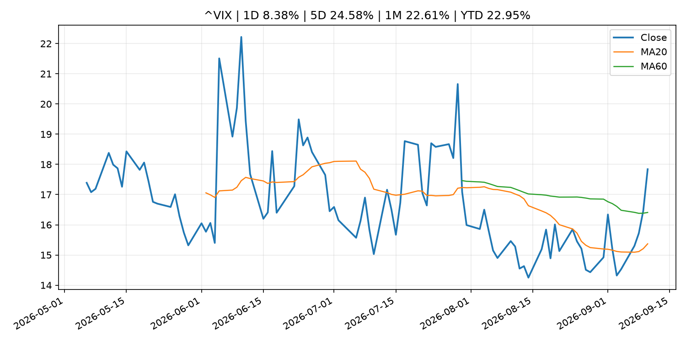
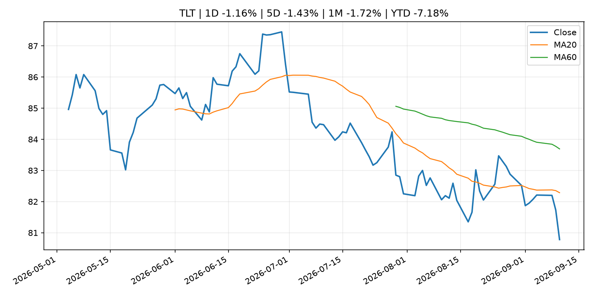
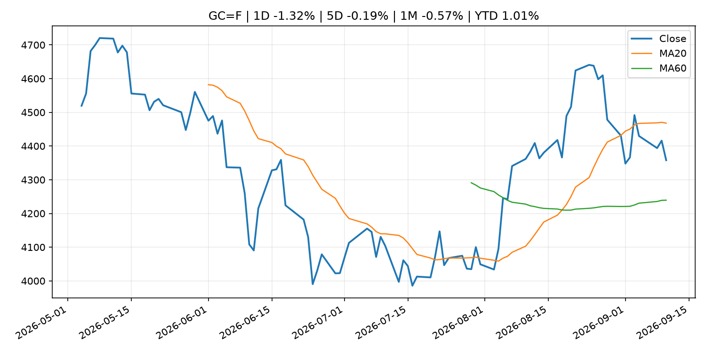
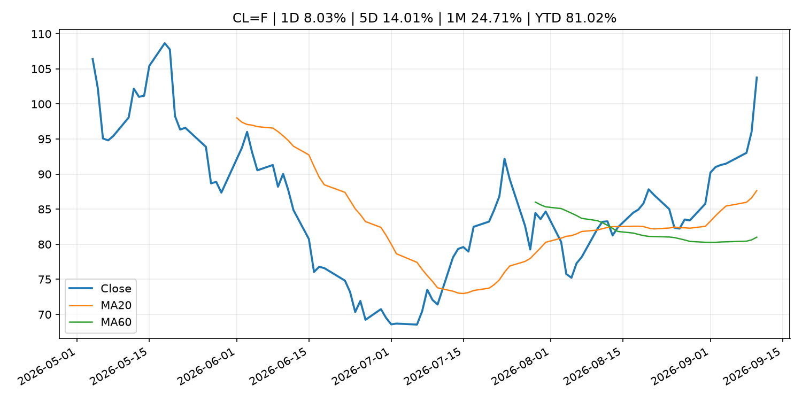
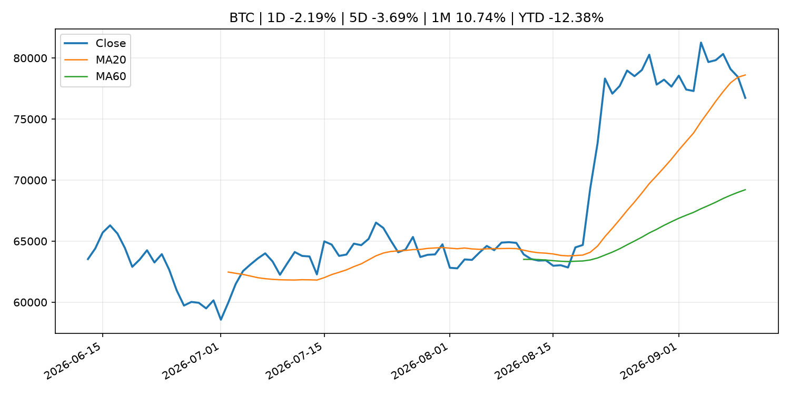
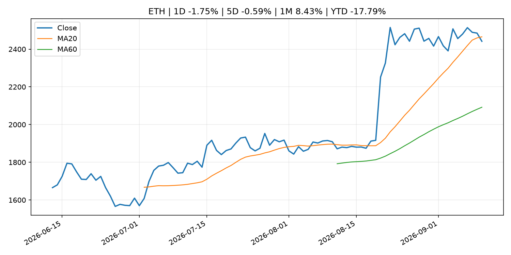
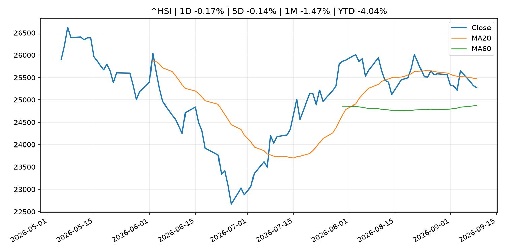

# Global Macro Morning Briefing - 2026-09-11

> Not financial advice / 非投资建议。

## 0. 今日总览
- 市场状态：mixed。长债下跌、美元走强且成长股承压，市场像是在交易利率冲击。 但存在信号冲突，需要降低单一叙事置信度。
- 今日三大主线：
  1. geopolitical_risk: Crypto researchers cut Bitcoin and Ethereum quantum attack estimate by 50%
  2. earnings: BIS chief warns AI capex arms race relies on opaque debt, posing systemic risks
  3. regulation: SEC Charges Founder and His Two New Jersey-Based Companies in Alleged $16 Million Ponzi Scheme
- 一句话结论：今日晨报重点关注：地缘风险可能推升避险需求、能源价格和市场波动率。；大型科技股盈利和资本开支会影响纳指、半导体和 AI 交易主线。。跨资产方面，SPY 1D -0.60%；QQQ 1D -1.06%；^VIX 1D 8.38%；TLT 1D -1.16%；GC=F 1D -1.32%；CL=F 1D 8.03%；BTC 1D -2.19%；ETH 1D -1.75%；长债下跌、美元走强且成长股承压，市场像是在交易利率冲击。 但存在信号冲突，需要降低单一叙事置信度。政策、通胀、利率、美元、美债、能源和加密监管仍是主要观察线索。所有结论仅基于公开数据与短摘要整理，不构成投资建议。

## 1. 隔夜跨资产市场
- 美股：SPY 1D -0.60%，QQQ 1D -1.06%，整体趋势需结合 VIX 和利率确认。
- 美债/美元：TLT 1D -1.16%，美元指数 1D 0.32%，是判断折现率压力的核心线索。
- 黄金/原油：黄金 1D -1.32%，原油 1D 8.03%，用于观察避险、通胀和地缘风险。
- 加密：BTC 1D -2.19%，ETH 1D -1.75%，关注是否独立于纳指走出加密自身行情。
- 港股/A股：恒生 1D -0.17%，沪深300/上证 1D n/a，重点看中国政策预期与人民币线索。
- 风险观察：关注美债收益率、实际利率和成长股估值压力。

### US_EQUITY

| symbol | latest close | 1D | 5D | 1M | YTD | trend |
|---|---:|---:|---:|---:|---:|---|
| SPY | 757.83 | -0.60% | -0.96% | -1.65% | 10.93% | range_bound |
| QQQ | 708.69 | -1.06% | -0.08% | -1.36% | 15.59% | range_bound |
| DIA | 520.75 | -0.63% | -1.86% | -3.08% | 7.68% | range_bound |
| IWM | 287.70 | -1.01% | -2.15% | -4.42% | 15.64% | range_bound |
| VTI | 373.24 | -0.62% | -0.97% | -1.95% | 10.98% | range_bound |

### US_MACRO_MARKET

| symbol | latest close | 1D | 5D | 1M | YTD | trend |
|---|---:|---:|---:|---:|---:|---|
| ^VIX | 17.84 | 8.38% | 24.58% | 22.61% | 22.95% | range_bound |
| DX-Y.NYB | 99.09 | 0.32% | -0.47% | -0.73% | 0.68% | downtrend |
| TLT | 80.78 | -1.16% | -1.43% | -1.72% | -7.18% | downtrend |
| IEF | 91.18 | -0.78% | -1.08% | -1.82% | -5.10% | downtrend |

### COMMODITIES

| symbol | latest close | 1D | 5D | 1M | YTD | trend |
|---|---:|---:|---:|---:|---:|---|
| GC=F | 4,357.90 | -1.32% | -0.19% | -0.57% | 1.01% | range_bound |
| SI=F | 64.03 | -5.76% | -1.07% | -1.14% | -9.25% | range_bound |
| CL=F | 103.76 | 8.03% | 14.01% | 24.71% | 81.02% | strong_uptrend |
| BZ=F | 108.88 | 7.58% | 13.86% | 22.46% | 79.23% | strong_uptrend |
| NG=F | 2.84 | 0.64% | -3.92% | 2.64% | -21.50% | range_bound |
| HG=F | 6.53 | -4.04% | 0.42% | -1.26% | 15.75% | range_bound |

### HK_MARKET

| symbol | latest close | 1D | 5D | 1M | YTD | trend |
|---|---:|---:|---:|---:|---:|---|
| ^HSI | 25,274.96 | -0.17% | -0.14% | -1.47% | -4.04% | range_bound |
| 0700.HK | 425.60 | -1.94% | -1.71% | -7.80% | -31.69% | strong_downtrend |
| 9988.HK | 106.90 | -2.64% | -0.56% | -12.81% | -28.26% | range_bound |
| 3690.HK | 74.75 | -3.92% | -3.73% | -18.44% | -28.54% | strong_downtrend |
| 1810.HK | 25.92 | -1.74% | -5.54% | -1.67% | -35.65% | range_bound |
| 1211.HK | 79.55 | -2.75% | -7.18% | -11.22% | -19.44% | range_bound |

### CRYPTO

| symbol | latest close | 1D | 5D | 1M | YTD | trend |
|---|---:|---:|---:|---:|---:|---|
| BTC | 76,733.82 | -2.19% | -3.69% | 10.74% | -12.38% | range_bound |
| ETH | 2,441.65 | -1.75% | -0.59% | 8.43% | -17.79% | range_bound |
| SOLANA | 99.12 | -4.10% | -2.75% | 16.16% | -20.40% | range_bound |
| BINANCECOIN | 710.10 | -5.59% | -1.57% | 13.24% | -17.69% | uptrend |
| RIPPLE | 1.34 | -5.58% | -4.32% | 21.09% | -27.29% | range_bound |

## 2. 今日最重要的 10 条新闻
### 1. Crypto researchers cut Bitcoin and Ethereum quantum attack estimate by 50%
- 来源：CoinDesk
- 时间：2026-09-10T13:00:00+00:00
- 地区：global
- 事件类型：geopolitical_risk
- 重要性层级：Tier 1
- 一句话摘要：Crypto researchers cut Bitcoin and Ethereum quantum attack estimate by 50%
- 为什么重要：地缘风险可能推升避险需求、能源价格和市场波动率。
- 可能影响：可能影响利率、汇率、风险资产或大宗商品预期，但当前公开信息不足以判断明确方向。
  - 资产：暂无明确资产映射
  - 方向：unknown
  - 强度：low
  - 原因：公开信息不足以判断方向。
- 原文链接：[https://www.coindesk.com/tech/2026/09/10/crypto-researchers-cut-bitcoin-and-ethereum-quantum-attack-estimate-by-50](https://www.coindesk.com/tech/2026/09/10/crypto-researchers-cut-bitcoin-and-ethereum-quantum-attack-estimate-by-50)

### 2. BIS chief warns AI capex arms race relies on opaque debt, posing systemic risks
- 来源：CoinDesk
- 时间：2026-09-10T12:00:36+00:00
- 地区：global
- 事件类型：earnings
- 重要性层级：Tier 2
- 一句话摘要：BIS chief warns AI capex arms race relies on opaque debt, posing systemic risks
- 为什么重要：大型科技股盈利和资本开支会影响纳指、半导体和 AI 交易主线。
- 可能影响：主要影响 QQQ，方向为 mixed，强度 high；AI 资本开支会影响大型科技股盈利和估值预期。
  - 资产：QQQ
    方向：mixed
    强度：high
    原因：AI 资本开支会影响大型科技股盈利和估值预期。
  - 资产：SMH
    方向：mixed
    强度：high
    原因：AI 投资周期直接影响半导体需求。
  - 资产：NVDA
    方向：mixed
    强度：high
    原因：AI 训练和推理需求是英伟达收入预期核心变量。
  - 资产：MSFT
    方向：mixed
    强度：medium
    原因：云和 AI 资本开支影响利润率与增长叙事。
  - 资产：GOOGL
    方向：mixed
    强度：medium
    原因：AI 投资和搜索商业化影响估值。
  - 资产：META
    方向：mixed
    强度：medium
    原因：AI 基建支出与广告效率共同影响市场预期。
- 原文链接：[https://www.coindesk.com/business/2026/09/10/ai-s-rapid-rise-poses-global-financial-stability-risks-says-head-of-the-bis](https://www.coindesk.com/business/2026/09/10/ai-s-rapid-rise-poses-global-financial-stability-risks-says-head-of-the-bis)

### 3. SEC Charges Founder and His Two New Jersey-Based Companies in Alleged $16 Million Ponzi Scheme
- 来源：SEC Press Releases
- 时间：2026-09-10T13:45:22-04:00
- 地区：US
- 事件类型：regulation
- 重要性层级：Tier 2
- 一句话摘要：The Securities and Exchange Commission today charged Ernest Ossei Boateng and two New Jersey-based companies he controls, Intercontinental Wealth Network LLC and I Wealth Network LP, for allegedly raising approximately $16 million from more than 200…
- 为什么重要：监管变化会改变行业盈利预期和资产风险溢价。
- 可能影响：主要影响 BTC，方向为 mixed，强度 high；加密监管或 ETF 进展会改变 BTC 的资金流和风险溢价。
  - 资产：BTC
    方向：mixed
    强度：high
    原因：加密监管或 ETF 进展会改变 BTC 的资金流和风险溢价。
  - 资产：ETH
    方向：mixed
    强度：high
    原因：监管框架会影响 ETH 产品化和机构参与度。
  - 资产：COIN
    方向：mixed
    强度：medium
    原因：监管清晰度和执法风险会影响交易平台估值。
  - 资产：crypto market
    方向：mixed
    强度：high
    原因：信息影响整个加密市场结构，但方向取决于细节。
- 原文链接：[https://www.sec.gov/newsroom/press-releases/2026-86-sec-charges-founder-his-two-new-jersey-based-companies-alleged-16-million-ponzi-scheme](https://www.sec.gov/newsroom/press-releases/2026-86-sec-charges-founder-his-two-new-jersey-based-companies-alleged-16-million-ponzi-scheme)

### 4. Why a new SEC plan could ease a legal headache for tokenized securities
- 来源：CoinDesk
- 时间：2026-09-10T19:01:30+00:00
- 地区：global
- 事件类型：regulation
- 重要性层级：Tier 2
- 一句话摘要：Why a new SEC plan could ease a legal headache for tokenized securities
- 为什么重要：监管变化会改变行业盈利预期和资产风险溢价。
- 可能影响：主要影响 BTC，方向为 mixed，强度 high；加密监管或 ETF 进展会改变 BTC 的资金流和风险溢价。
  - 资产：BTC
    方向：mixed
    强度：high
    原因：加密监管或 ETF 进展会改变 BTC 的资金流和风险溢价。
  - 资产：ETH
    方向：mixed
    强度：high
    原因：监管框架会影响 ETH 产品化和机构参与度。
  - 资产：COIN
    方向：mixed
    强度：medium
    原因：监管清晰度和执法风险会影响交易平台估值。
  - 资产：crypto market
    方向：mixed
    强度：high
    原因：信息影响整个加密市场结构，但方向取决于细节。
- 原文链接：[https://www.coindesk.com/business/2026/09/10/why-a-new-sec-plan-could-end-the-legal-headaches-of-holding-tokenized-securities](https://www.coindesk.com/business/2026/09/10/why-a-new-sec-plan-could-end-the-legal-headaches-of-holding-tokenized-securities)

### 5. MoneyGram unveils stablecoin-backed card as digital dollars move into everyday spending
- 来源：CoinDesk
- 时间：2026-09-10T14:30:00+00:00
- 地区：global
- 事件类型：crypto_market_structure
- 重要性层级：Tier 2
- 一句话摘要：MoneyGram unveils stablecoin-backed card as digital dollars move into everyday spending
- 为什么重要：加密市场结构和监管变化会影响 BTC、ETH 及相关股票的风险溢价。
- 可能影响：主要影响 BTC，方向为 mixed，强度 high；加密监管或 ETF 进展会改变 BTC 的资金流和风险溢价。
  - 资产：BTC
    方向：mixed
    强度：high
    原因：加密监管或 ETF 进展会改变 BTC 的资金流和风险溢价。
  - 资产：ETH
    方向：mixed
    强度：high
    原因：监管框架会影响 ETH 产品化和机构参与度。
  - 资产：COIN
    方向：mixed
    强度：medium
    原因：监管清晰度和执法风险会影响交易平台估值。
  - 资产：crypto market
    方向：mixed
    强度：high
    原因：信息影响整个加密市场结构，但方向取决于细节。
- 原文链接：[https://www.coindesk.com/business/2026/09/08/moneygram-unveils-stablecoin-backed-card-as-digital-dollars-move-into-everyday-spending](https://www.coindesk.com/business/2026/09/08/moneygram-unveils-stablecoin-backed-card-as-digital-dollars-move-into-everyday-spending)

### 6. Adobe’s latest earnings leave Wall Street wanting more
- 来源：MarketWatch Top Stories
- 时间：2026-09-10T20:53:00+00:00
- 地区：US
- 事件类型：earnings
- 重要性层级：Tier 2
- 一句话摘要：“In this environment you can’t just meet” expectations, an analyst says
- 为什么重要：大型科技股盈利和资本开支会影响纳指、半导体和 AI 交易主线。
- 可能影响：可能影响利率、汇率、风险资产或大宗商品预期，但当前公开信息不足以判断明确方向。
  - 资产：暂无明确资产映射
  - 方向：unknown
  - 强度：low
  - 原因：公开信息不足以判断方向。
- 原文链接：[https://www.marketwatch.com/story/adobes-latest-earnings-leave-wall-street-wanting-more-137ea782?mod=mw_rss_topstories](https://www.marketwatch.com/story/adobes-latest-earnings-leave-wall-street-wanting-more-137ea782?mod=mw_rss_topstories)

### 7. Kalshi launches ‘perps’ for gold and silver following CFTC approval, expanding futures offerings
- 来源：CNBC Economy
- 时间：2026-09-10T14:00:11+00:00
- 地区：US
- 事件类型：regulation
- 重要性层级：Tier 2
- 一句话摘要：Its the latest move by the prediction market company to diversify its assets users can trade.
- 为什么重要：监管变化会改变行业盈利预期和资产风险溢价。
- 可能影响：可能影响利率、汇率、风险资产或大宗商品预期，但当前公开信息不足以判断明确方向。
  - 资产：暂无明确资产映射
  - 方向：unknown
  - 强度：low
  - 原因：公开信息不足以判断方向。
- 原文链接：[https://www.cnbc.com/2026/09/10/kalshi-launches-perps-for-gold-and-silver-following-cftc-approval-expanding-futures-offerings.html](https://www.cnbc.com/2026/09/10/kalshi-launches-perps-for-gold-and-silver-following-cftc-approval-expanding-futures-offerings.html)

### 8. Speech by Board Member MASU in Fukui (Economic Activity, Prices, and Monetary Policy in Japan)
- 来源：Bank of Japan Announcements
- 时间：2026-09-10T10:30:00+09:00
- 地区：Japan
- 事件类型：central_bank_speech
- 重要性层级：Tier 2
- 一句话摘要：Speech by Board Member MASU in Fukui (Economic Activity, Prices, and Monetary Policy in Japan)
- 为什么重要：央行官员表态可能影响市场对下一次会议的定价。
- 可能影响：可能影响利率、汇率、风险资产或大宗商品预期，但当前公开信息不足以判断明确方向。
  - 资产：暂无明确资产映射
  - 方向：unknown
  - 强度：low
  - 原因：公开信息不足以判断方向。
- 原文链接：[http://www.boj.or.jp/en/about/press/koen_2026/ko260910a.htm](http://www.boj.or.jp/en/about/press/koen_2026/ko260910a.htm)

### 9. Bitcoin traders dial down bullish plays ahead of U.S. inflation data
- 来源：CoinDesk
- 时间：2026-09-10T11:15:00+00:00
- 地区：global
- 事件类型：other
- 重要性层级：Tier 3
- 一句话摘要：Bitcoin traders dial down bullish plays ahead of U.S. inflation data
- 为什么重要：这条信息暂未匹配到重大宏观、政策或市场事件，更适合作为背景跟踪。
- 可能影响：主要影响 DXY，方向为 positive，强度 high；通胀压力可能推高政策利率预期并支撑美元。
  - 资产：DXY
    方向：positive
    强度：high
    原因：通胀压力可能推高政策利率预期并支撑美元。
  - 资产：TLT
    方向：negative
    强度：high
    原因：通胀上行通常推升收益率、压低长债价格。
  - 资产：QQQ
    方向：negative
    强度：high
    原因：更高利率对成长股估值折现率不利。
  - 资产：SPY
    方向：mixed
    强度：medium
    原因：名义增长可能支撑收入，但更高利率压制估值。
  - 资产：GC=F
    方向：mixed
    强度：medium
    原因：通胀对黄金是支撑，但实际利率上行会形成压力。
  - 资产：BTC
    方向：mixed
    强度：medium
    原因：抗通胀叙事和流动性收紧可能相互抵消。
- 原文链接：[https://www.coindesk.com/daybook-us/2026/09/10/bitcoin-traders-dial-down-bullish-plays-ahead-of-u-s-inflation-data](https://www.coindesk.com/daybook-us/2026/09/10/bitcoin-traders-dial-down-bullish-plays-ahead-of-u-s-inflation-data)

### 10. Live updates: Bitcoin slumps as oil and bond yields surge to new highs
- 来源：CoinDesk
- 时间：2026-09-10T07:45:46+00:00
- 地区：global
- 事件类型：other
- 重要性层级：Tier 3
- 一句话摘要：Live updates: Bitcoin slumps as oil and bond yields surge to new highs
- 为什么重要：这条信息暂未匹配到重大宏观、政策或市场事件，更适合作为背景跟踪。
- 可能影响：主要影响 CL=F，方向为 positive，强度 high；供给扰动或 OPEC 减产通常推升 WTI 原油。
  - 资产：CL=F
    方向：positive
    强度：high
    原因：供给扰动或 OPEC 减产通常推升 WTI 原油。
  - 资产：BZ=F
    方向：positive
    强度：high
    原因：全球供给风险通常直接影响 Brent 原油。
  - 资产：SPY
    方向：mixed
    强度：medium
    原因：能源股可能受益，但通胀和成本压力不利于宽基风险资产。
- 原文链接：[https://www.coindesk.com/business/2026/09/10/live-updates-bitcoin-etfs-post-a-second-straight-outflow-while-every-other-fund-turns-green](https://www.coindesk.com/business/2026/09/10/live-updates-bitcoin-etfs-post-a-second-straight-outflow-while-every-other-fund-turns-green)

## 3. 政策与央行观察
### 1. SEC Charges Founder and His Two New Jersey-Based Companies in Alleged $16 Million Ponzi Scheme
- 来源：SEC Press Releases
- 时间：2026-09-10T13:45:22-04:00
- 地区：US
- 事件类型：regulation
- 重要性层级：Tier 2
- 一句话摘要：The Securities and Exchange Commission today charged Ernest Ossei Boateng and two New Jersey-based companies he controls, Intercontinental Wealth Network LLC and I Wealth Network LP, for allegedly raising approximately $16 million from more than 200…
- 为什么重要：监管变化会改变行业盈利预期和资产风险溢价。
- 可能影响：主要影响 BTC，方向为 mixed，强度 high；加密监管或 ETF 进展会改变 BTC 的资金流和风险溢价。
  - 资产：BTC
    方向：mixed
    强度：high
    原因：加密监管或 ETF 进展会改变 BTC 的资金流和风险溢价。
  - 资产：ETH
    方向：mixed
    强度：high
    原因：监管框架会影响 ETH 产品化和机构参与度。
  - 资产：COIN
    方向：mixed
    强度：medium
    原因：监管清晰度和执法风险会影响交易平台估值。
  - 资产：crypto market
    方向：mixed
    强度：high
    原因：信息影响整个加密市场结构，但方向取决于细节。
- 原文链接：[https://www.sec.gov/newsroom/press-releases/2026-86-sec-charges-founder-his-two-new-jersey-based-companies-alleged-16-million-ponzi-scheme](https://www.sec.gov/newsroom/press-releases/2026-86-sec-charges-founder-his-two-new-jersey-based-companies-alleged-16-million-ponzi-scheme)

### 2. Why a new SEC plan could ease a legal headache for tokenized securities
- 来源：CoinDesk
- 时间：2026-09-10T19:01:30+00:00
- 地区：global
- 事件类型：regulation
- 重要性层级：Tier 2
- 一句话摘要：Why a new SEC plan could ease a legal headache for tokenized securities
- 为什么重要：监管变化会改变行业盈利预期和资产风险溢价。
- 可能影响：主要影响 BTC，方向为 mixed，强度 high；加密监管或 ETF 进展会改变 BTC 的资金流和风险溢价。
  - 资产：BTC
    方向：mixed
    强度：high
    原因：加密监管或 ETF 进展会改变 BTC 的资金流和风险溢价。
  - 资产：ETH
    方向：mixed
    强度：high
    原因：监管框架会影响 ETH 产品化和机构参与度。
  - 资产：COIN
    方向：mixed
    强度：medium
    原因：监管清晰度和执法风险会影响交易平台估值。
  - 资产：crypto market
    方向：mixed
    强度：high
    原因：信息影响整个加密市场结构，但方向取决于细节。
- 原文链接：[https://www.coindesk.com/business/2026/09/10/why-a-new-sec-plan-could-end-the-legal-headaches-of-holding-tokenized-securities](https://www.coindesk.com/business/2026/09/10/why-a-new-sec-plan-could-end-the-legal-headaches-of-holding-tokenized-securities)

### 3. MoneyGram unveils stablecoin-backed card as digital dollars move into everyday spending
- 来源：CoinDesk
- 时间：2026-09-10T14:30:00+00:00
- 地区：global
- 事件类型：crypto_market_structure
- 重要性层级：Tier 2
- 一句话摘要：MoneyGram unveils stablecoin-backed card as digital dollars move into everyday spending
- 为什么重要：加密市场结构和监管变化会影响 BTC、ETH 及相关股票的风险溢价。
- 可能影响：主要影响 BTC，方向为 mixed，强度 high；加密监管或 ETF 进展会改变 BTC 的资金流和风险溢价。
  - 资产：BTC
    方向：mixed
    强度：high
    原因：加密监管或 ETF 进展会改变 BTC 的资金流和风险溢价。
  - 资产：ETH
    方向：mixed
    强度：high
    原因：监管框架会影响 ETH 产品化和机构参与度。
  - 资产：COIN
    方向：mixed
    强度：medium
    原因：监管清晰度和执法风险会影响交易平台估值。
  - 资产：crypto market
    方向：mixed
    强度：high
    原因：信息影响整个加密市场结构，但方向取决于细节。
- 原文链接：[https://www.coindesk.com/business/2026/09/08/moneygram-unveils-stablecoin-backed-card-as-digital-dollars-move-into-everyday-spending](https://www.coindesk.com/business/2026/09/08/moneygram-unveils-stablecoin-backed-card-as-digital-dollars-move-into-everyday-spending)

### 4. Kalshi launches ‘perps’ for gold and silver following CFTC approval, expanding futures offerings
- 来源：CNBC Economy
- 时间：2026-09-10T14:00:11+00:00
- 地区：US
- 事件类型：regulation
- 重要性层级：Tier 2
- 一句话摘要：Its the latest move by the prediction market company to diversify its assets users can trade.
- 为什么重要：监管变化会改变行业盈利预期和资产风险溢价。
- 可能影响：可能影响利率、汇率、风险资产或大宗商品预期，但当前公开信息不足以判断明确方向。
  - 资产：暂无明确资产映射
  - 方向：unknown
  - 强度：low
  - 原因：公开信息不足以判断方向。
- 原文链接：[https://www.cnbc.com/2026/09/10/kalshi-launches-perps-for-gold-and-silver-following-cftc-approval-expanding-futures-offerings.html](https://www.cnbc.com/2026/09/10/kalshi-launches-perps-for-gold-and-silver-following-cftc-approval-expanding-futures-offerings.html)

### 5. Speech by Board Member MASU in Fukui (Economic Activity, Prices, and Monetary Policy in Japan)
- 来源：Bank of Japan Announcements
- 时间：2026-09-10T10:30:00+09:00
- 地区：Japan
- 事件类型：central_bank_speech
- 重要性层级：Tier 2
- 一句话摘要：Speech by Board Member MASU in Fukui (Economic Activity, Prices, and Monetary Policy in Japan)
- 为什么重要：央行官员表态可能影响市场对下一次会议的定价。
- 可能影响：可能影响利率、汇率、风险资产或大宗商品预期，但当前公开信息不足以判断明确方向。
  - 资产：暂无明确资产映射
  - 方向：unknown
  - 强度：low
  - 原因：公开信息不足以判断方向。
- 原文链接：[http://www.boj.or.jp/en/about/press/koen_2026/ko260910a.htm](http://www.boj.or.jp/en/about/press/koen_2026/ko260910a.htm)

## 4. 市场异动与图表
- SPY 下跌 -0.60%
- QQQ 下跌 -1.06%
- VIX 上涨 8.38%
- TLT 下跌 -1.16%
- DXY 上涨 0.32%
- Gold 下跌 -1.32%
- Oil 上涨 8.03%
- BTC 下跌 -2.19%

### 信号矛盾
- 股债同时承压，可能是利率或流动性冲击而非传统避险。

### SPY

### QQQ

### ^VIX

### TLT

### GC=F

### CL=F

### BTC

### ETH

### ^HSI

## 5. 华尔街与机构公开观点
- 暂无可靠公开观点。

## 6. 今日重点关注
- 经济数据：经济数据：暂无可靠公开日历数据；如配置经济日历源后可自动填充。
- 央行讲话：央行讲话：暂无可靠公开日历数据；重点跟踪 Fed、ECB、BoJ、PBOC 官网 RSS。
- 财报：财报：暂无可靠数据。
- 政策事件：政策事件：暂无可靠数据。
- 风险提醒：风险提醒：关注数据源失败项、突发地缘风险、利率和美元的二阶反应。

## 7. 英文金融表达与宏观概念
- **inflation expectations**：通胀预期，指家庭、企业或市场对未来通胀的预估。 例句：Inflation expectations can shape wage bargaining and bond yields.
- **real yield**：实际收益率，名义利率扣除通胀预期后的收益率。 例句：Gold often reacts more to real yields than nominal yields.
- **risk-off**：避险模式，资金偏向美元、国债、黄金等防御资产。 例句：A geopolitical shock can push markets into risk-off mode.
- **supply disruption**：供给扰动，通常指能源或商品供应受冲突、减产或天气影响。 例句：Supply disruption can lift oil prices and inflation expectations.
- **market structure**：市场结构，指交易、托管、清算、ETF、监管等制度安排。 例句：Crypto market structure rules can affect institutional participation.
- **AI capex**：AI 资本开支，指云厂商和科技公司投入 AI 基建的支出。 例句：AI capex guidance can move semiconductor stocks.

## 8. 背景材料
- [Treasury yields surge after Bessent’s beefed-up buyback operation fails to calm market](https://www.marketwatch.com/story/treasury-yields-surge-toward-the-danger-zone-for-stocks-as-inflation-pressures-heat-up-fe0f9aa6?mod=mw_rss_topstories)（MarketWatch Top Stories，other）：The Treasury market’s painful rout intensified Thursday, after an underwhelming auction of 30-year U.S. government debt and Treasury Secretary Scott Bessent’s first beefed-up buyback operation.
- [Agencies reduce regulatory burden for community banks, increase eligibility for 18-month exam cycle](https://www.federalreserve.gov/newsevents/pressreleases/bcreg20260910a.htm)（Federal Reserve Press Releases，other）：Agencies reduce regulatory burden for community banks, increase eligibility for 18-month exam cycle
- [Bitcoin Bancorp snaps up thousands of defunct Bitcoin Depot ATMs for $620,000](https://www.coindesk.com/business/2026/09/10/a-quarter-of-bankrupt-bitcoin-depot-s-atms-snapped-up-for-less-than-usd1-million)（CoinDesk，other）：Bitcoin Bancorp snaps up thousands of defunct Bitcoin Depot ATMs for $620,000
- [Christine Lagarde, Boris Vujčić: Monetary policy statement (with Q&A)](https://www.ecb.europa.eu//press/press_conference/monetary-policy-statement/2026/html/ecb.is260910~6a45359cfc.en.html)（ECB Press Releases，other）：Christine Lagarde, Boris Vujčić: Monetary policy statement (with Q&A)
- [Monetary policy decisions](https://www.ecb.europa.eu//press/pr/date/2026/html/ecb.mp260910~314e508016.en.html)（ECB Press Releases，other）：Monetary policy decisions
- [Treasury yields continue to rise even as Bessent doubles down on bond buybacks](https://www.coindesk.com/markets/2026/09/10/scott-bessent-doubles-down-on-bond-buybacks-as-treasury-yields-continue-to-surge)（CoinDesk，other）：Treasury yields continue to rise even as Bessent doubles down on bond buybacks
- [Bitcoin traders dial down bullish plays ahead of U.S. inflation data](https://www.coindesk.com/daybook-us/2026/09/10/bitcoin-traders-dial-down-bullish-plays-ahead-of-u-s-inflation-data)（CoinDesk，other）：Bitcoin traders dial down bullish plays ahead of U.S. inflation data
- [Bitcoin trades near $78,000 as memecoins, small caps lead a broad crypto retreat](https://www.coindesk.com/markets/2026/09/10/bitcoin-trades-near-usd78-000-as-memecoins-small-caps-lead-a-broad-crypto-retreat)（CoinDesk，other）：Bitcoin trades near $78,000 as memecoins, small caps lead a broad crypto retreat
- [Live updates: Bitcoin slumps as oil and bond yields surge to new highs](https://www.coindesk.com/business/2026/09/10/live-updates-bitcoin-etfs-post-a-second-straight-outflow-while-every-other-fund-turns-green)（CoinDesk，other）：Live updates: Bitcoin slumps as oil and bond yields surge to new highs
- [Basic Figures on Fails (Aug.)](http://www.boj.or.jp/en/statistics/set/bffail/sjgb2608.pdf)（Bank of Japan Announcements，other）：Basic Figures on Fails (Aug.)
- [SGX's bitcoin and ether perpetual futures are now open to U.S. institutions](https://www.coindesk.com/markets/2026/09/10/sgx-s-bitcoin-and-ether-perpetual-futures-are-now-open-to-u-s-institutions)（CoinDesk，other）：SGX's bitcoin and ether perpetual futures are now open to U.S. institutions
- [Dogecoin sinks 5% to lead majors' losses, with bitcoin holding $78,000 level](https://www.coindesk.com/markets/2026/09/10/dogecoin-sinks-5-to-lead-majors-losses-with-bitcoin-holding-usd78-000-level)（CoinDesk，other）：Dogecoin sinks 5% to lead majors' losses, with bitcoin holding $78,000 level
- [Regular Derivatives Market Statistics in Japan](http://www.boj.or.jp/en/statistics/bis/yoshi/index.htm)（Bank of Japan Announcements，other）：Regular Derivatives Market Statistics in Japan
- [Christine Lagarde: The choice facing Europeans](https://www.ecb.europa.eu//press/key/date/2026/html/ecb.sp260909~59a07e6f05.en.html)（ECB Press Releases，other）：Christine Lagarde: The choice facing Europeans
- [Warning against Scams Using the Bank of Japan's Name](http://www.boj.or.jp/en/about/organization/notice/index.htm)（Bank of Japan Announcements，other）：Warning against Scams Using the Bank of Japan's Name
- [Money Stock (Aug.)](http://www.boj.or.jp/en/statistics/money/ms/ms2608.pdf)（Bank of Japan Announcements，other）：Money Stock (Aug.)

## 9. 数据源、失败项与免责声明
- 采集时间：2026-09-10T23:43:24
- 数据源：公开 RSS、Yahoo Finance、CoinGecko、AKShare、FRED、SEC data.sec.gov，以及用户自有 inputs/reports 文件。
- 合规说明：不绕过 WSJ、Bloomberg、FT、Reuters 等付费墙；对付费媒体只使用公开 RSS 标题、摘要、链接和发布时间。
- 免责声明：Not financial advice / 非投资建议。本项目仅供个人学习、研究和信息整理，不构成投资建议、交易建议或任何收益承诺。
- 失败或跳过的数据源：
  - crypto data failed coin=dogecoin
  - China market data failed symbol=上证指数: empty dataframe
  - China market data failed symbol=深证成指: empty dataframe
  - China market data failed symbol=创业板指: empty dataframe
  - China market data failed symbol=沪深300: empty dataframe
  - China market data failed symbol=中证500: empty dataframe
  - China market data failed symbol=科创50: empty dataframe
  - FRED_API_KEY not set; skipping FRED macro series
  - SEC failed cik=0000320193
  - SEC failed cik=0000789019
  - SEC failed cik=0001045810
  - SEC failed cik=0001318605
  - SEC failed cik=0001577552
