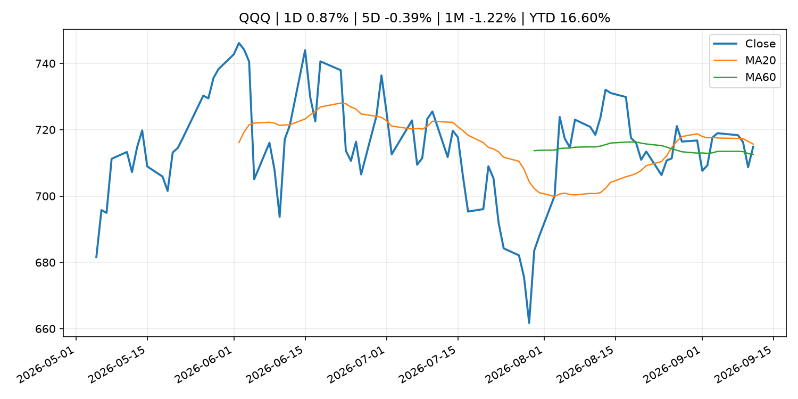
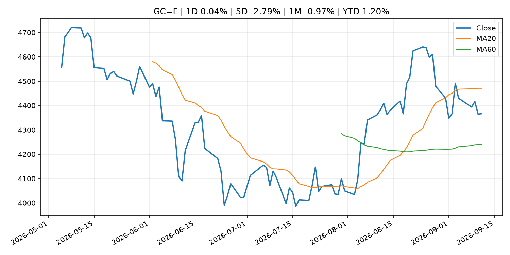
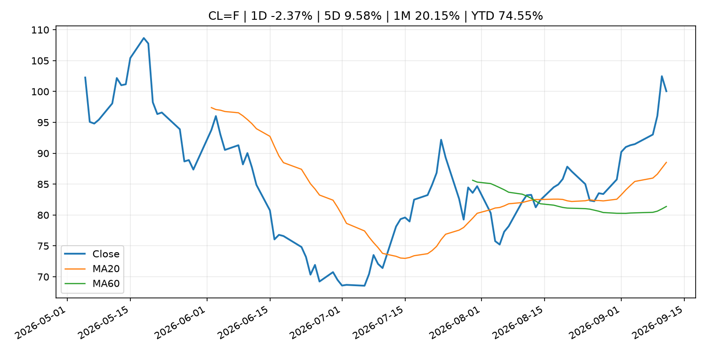
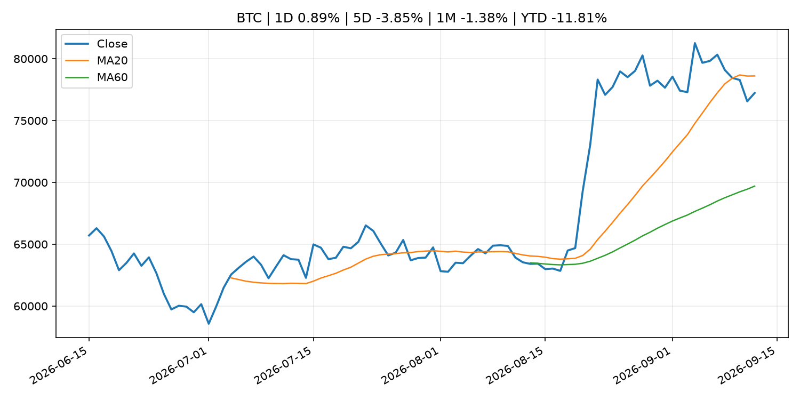
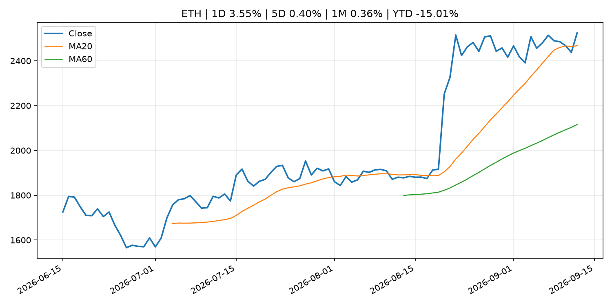

# Global Macro Morning Briefing - 2026-09-13

> Not financial advice / 非投资建议。

## 0. 今日总览
- 市场状态：risk_on。股指上涨、波动率或美元回落，市场更接近风险偏好改善。
- 今日三大主线：
  1. macro_data: Core CPI rose a faster-than-forecast 0.3% in August, setting up possible Fed rate hike
  2. central_bank_decision: With Fed rate hike all but assured, here's how markets might react
  3. central_bank_decision: Bitcoin below $77,000, Zcash leads losses as traders bet on a Fed rate hike
- 一句话结论：今日晨报重点关注：这类宏观数据会直接改变市场对通胀、增长和政策路径的预期。；央行决策会重定价利率、汇率、久期资产和风险资产。。跨资产方面，SPY 1D 0.85%；QQQ 1D 0.87%；^VIX 1D -11.21%；TLT 1D 0.11%；GC=F 1D 0.04%；CL=F 1D -2.37%；BTC 1D 0.89%；ETH 1D 3.55%；股指上涨、波动率或美元回落，市场更接近风险偏好改善。政策、通胀、利率、美元、美债、能源和加密监管仍是主要观察线索。所有结论仅基于公开数据与短摘要整理，不构成投资建议。

## 1. 隔夜跨资产市场
- 美股：SPY 1D 0.85%，QQQ 1D 0.87%，整体趋势需结合 VIX 和利率确认。
- 美债/美元：TLT 1D 0.11%，美元指数 1D 0.03%，是判断折现率压力的核心线索。
- 黄金/原油：黄金 1D 0.04%，原油 1D -2.37%，用于观察避险、通胀和地缘风险。
- 加密：BTC 1D 0.89%，ETH 1D 3.55%，关注是否独立于纳指走出加密自身行情。
- 港股/A股：恒生 1D -0.60%，沪深300/上证 1D n/a，重点看中国政策预期与人民币线索。
- 风险观察：确认风险偏好是否扩散到小盘股、信用利差和周期品。

### US_EQUITY

| symbol | latest close | 1D | 5D | 1M | YTD | trend |
|---|---:|---:|---:|---:|---:|---|
| SPY | 764.29 | 0.85% | -1.15% | -1.06% | 11.87% | range_bound |
| QQQ | 714.88 | 0.87% | -0.39% | -1.22% | 16.60% | range_bound |
| DIA | 525.79 | 0.97% | -2.07% | -2.11% | 8.72% | range_bound |
| IWM | 288.89 | 0.41% | -2.13% | -4.57% | 16.12% | range_bound |
| VTI | 376.31 | 0.82% | -1.21% | -1.45% | 11.89% | range_bound |

### US_MACRO_MARKET

| symbol | latest close | 1D | 5D | 1M | YTD | trend |
|---|---:|---:|---:|---:|---:|---|
| ^VIX | 15.84 | -11.21% | 9.02% | 8.27% | 9.17% | range_bound |
| DX-Y.NYB | 99.12 | 0.03% | 0.12% | -0.89% | 0.71% | downtrend |
| TLT | 80.87 | 0.11% | -1.46% | -1.51% | -7.08% | downtrend |
| IEF | 91.01 | -0.19% | -1.38% | -2.10% | -5.28% | downtrend |

### COMMODITIES

| symbol | latest close | 1D | 5D | 1M | YTD | trend |
|---|---:|---:|---:|---:|---:|---|
| GC=F | 4,366.20 | 0.04% | -2.79% | -0.97% | 1.20% | range_bound |
| SI=F | 64.55 | 0.42% | -3.61% | -1.53% | -8.51% | range_bound |
| CL=F | 100.05 | -2.37% | 9.58% | 20.15% | 74.55% | strong_uptrend |
| BZ=F | 104.61 | -2.81% | 9.52% | 17.57% | 72.20% | strong_uptrend |
| NG=F | 2.83 | -0.11% | -2.81% | 0.96% | -21.75% | downtrend |
| HG=F | 6.47 | 0.04% | -1.63% | -1.93% | 14.71% | range_bound |

### HK_MARKET

| symbol | latest close | 1D | 5D | 1M | YTD | trend |
|---|---:|---:|---:|---:|---:|---|
| ^HSI | 24,805.63 | -0.60% | -3.30% | -2.33% | -5.82% | range_bound |
| 0700.HK | 428.40 | 0.66% | -3.25% | -2.86% | -31.24% | downtrend |
| 9988.HK | 107.50 | 0.56% | -2.36% | -11.81% | -27.85% | range_bound |
| 3690.HK | 75.10 | 0.47% | -8.13% | -17.70% | -28.20% | strong_downtrend |
| 1810.HK | 26.36 | 1.70% | -7.31% | 1.85% | -34.56% | range_bound |
| 1211.HK | 79.85 | 0.38% | -7.31% | -9.67% | -19.14% | range_bound |

### CRYPTO

| symbol | latest close | 1D | 5D | 1M | YTD | trend |
|---|---:|---:|---:|---:|---:|---|
| BTC | 77,234.29 | 0.89% | -3.85% | -1.38% | -11.81% | range_bound |
| ETH | 2,524.14 | 3.55% | 0.40% | 0.36% | -15.01% | uptrend |
| SOLANA | 101.71 | 3.12% | -4.49% | 8.56% | -18.32% | range_bound |
| BINANCECOIN | 726.82 | 2.60% | -3.44% | 5.83% | -15.75% | strong_uptrend |
| RIPPLE | 1.37 | 2.37% | -4.01% | -6.10% | -25.81% | range_bound |

## 2. 今日最重要的 10 条新闻
### 1. Core CPI rose a faster-than-forecast 0.3% in August, setting up possible Fed rate hike
- 来源：CoinDesk
- 时间：2026-09-11T12:32:25+00:00
- 地区：global
- 事件类型：macro_data
- 重要性层级：Tier 1
- 一句话摘要：Core CPI rose a faster-than-forecast 0.3% in August, setting up possible Fed rate hike
- 为什么重要：这类宏观数据会直接改变市场对通胀、增长和政策路径的预期。
- 可能影响：主要影响 DXY，方向为 positive，强度 high；通胀压力可能推高政策利率预期并支撑美元。
  - 资产：DXY
    方向：positive
    强度：high
    原因：通胀压力可能推高政策利率预期并支撑美元。
  - 资产：TLT
    方向：negative
    强度：high
    原因：通胀上行通常推升收益率、压低长债价格。
  - 资产：QQQ
    方向：negative
    强度：high
    原因：更高利率对成长股估值折现率不利。
  - 资产：SPY
    方向：mixed
    强度：medium
    原因：名义增长可能支撑收入，但更高利率压制估值。
  - 资产：GC=F
    方向：mixed
    强度：medium
    原因：通胀对黄金是支撑，但实际利率上行会形成压力。
  - 资产：BTC
    方向：negative
    强度：high
    原因：流动性收紧通常压制高 beta 加密资产。
- 原文链接：[https://www.coindesk.com/markets/2026/09/11/core-cpi-rose-a-faster-than-forecast-0-3-in-august-setting-up-fed-rate-hike](https://www.coindesk.com/markets/2026/09/11/core-cpi-rose-a-faster-than-forecast-0-3-in-august-setting-up-fed-rate-hike)

### 2. With Fed rate hike all but assured, here's how markets might react
- 来源：CoinDesk
- 时间：2026-09-11T15:45:56+00:00
- 地区：global
- 事件类型：central_bank_decision
- 重要性层级：Tier 1
- 一句话摘要：With Fed rate hike all but assured, here's how markets might react
- 为什么重要：央行决策会重定价利率、汇率、久期资产和风险资产。
- 可能影响：主要影响 QQQ，方向为 negative，强度 high；鹰派政策提高折现率，压制成长股估值。
  - 资产：QQQ
    方向：negative
    强度：high
    原因：鹰派政策提高折现率，压制成长股估值。
  - 资产：SPY
    方向：negative
    强度：medium
    原因：更紧政策通常削弱风险偏好。
  - 资产：TLT
    方向：negative
    强度：high
    原因：利率上行通常压低长债价格。
  - 资产：DXY
    方向：positive
    强度：high
    原因：更高利率预期通常支撑美元。
  - 资产：BTC
    方向：negative
    强度：high
    原因：流动性收紧通常压制高 beta 加密资产。
- 原文链接：[https://www.coindesk.com/markets/2026/09/11/hotter-cpi-complicates-fed-hold-as-warsh-s-preferred-inflation-gauge-tells-different-story](https://www.coindesk.com/markets/2026/09/11/hotter-cpi-complicates-fed-hold-as-warsh-s-preferred-inflation-gauge-tells-different-story)

### 3. Bitcoin below $77,000, Zcash leads losses as traders bet on a Fed rate hike
- 来源：CoinDesk
- 时间：2026-09-11T04:46:15+00:00
- 地区：global
- 事件类型：central_bank_decision
- 重要性层级：Tier 1
- 一句话摘要：Bitcoin below $77,000, Zcash leads losses as traders bet on a Fed rate hike
- 为什么重要：央行决策会重定价利率、汇率、久期资产和风险资产。
- 可能影响：主要影响 QQQ，方向为 negative，强度 high；鹰派政策提高折现率，压制成长股估值。
  - 资产：QQQ
    方向：negative
    强度：high
    原因：鹰派政策提高折现率，压制成长股估值。
  - 资产：SPY
    方向：negative
    强度：medium
    原因：更紧政策通常削弱风险偏好。
  - 资产：TLT
    方向：negative
    强度：high
    原因：利率上行通常压低长债价格。
  - 资产：DXY
    方向：positive
    强度：high
    原因：更高利率预期通常支撑美元。
  - 资产：BTC
    方向：negative
    强度：high
    原因：流动性收紧通常压制高 beta 加密资产。
- 原文链接：[https://www.coindesk.com/markets/2026/09/11/bitcoin-below-usd77-000-zcash-leads-losses-as-traders-bet-on-a-fed-rate-hike](https://www.coindesk.com/markets/2026/09/11/bitcoin-below-usd77-000-zcash-leads-losses-as-traders-bet-on-a-fed-rate-hike)

### 4. Ripple stablecoin chief sees $13 trillion corporate treasury opportunity for RLUSD
- 来源：CoinDesk
- 时间：2026-09-12T16:00:00+00:00
- 地区：global
- 事件类型：crypto_market_structure
- 重要性层级：Tier 2
- 一句话摘要：Ripple stablecoin chief sees $13 trillion corporate treasury opportunity for RLUSD
- 为什么重要：加密市场结构和监管变化会影响 BTC、ETH 及相关股票的风险溢价。
- 可能影响：主要影响 BTC，方向为 mixed，强度 high；加密监管或 ETF 进展会改变 BTC 的资金流和风险溢价。
  - 资产：BTC
    方向：mixed
    强度：high
    原因：加密监管或 ETF 进展会改变 BTC 的资金流和风险溢价。
  - 资产：ETH
    方向：mixed
    强度：high
    原因：监管框架会影响 ETH 产品化和机构参与度。
  - 资产：COIN
    方向：mixed
    强度：medium
    原因：监管清晰度和执法风险会影响交易平台估值。
  - 资产：crypto market
    方向：mixed
    强度：high
    原因：信息影响整个加密市场结构，但方向取决于细节。
- 原文链接：[https://www.coindesk.com/business/2026/09/12/ripple-stablecoin-chief-sees-usd13-trillion-corporate-treasury-opportunity-for-rlusd](https://www.coindesk.com/business/2026/09/12/ripple-stablecoin-chief-sees-usd13-trillion-corporate-treasury-opportunity-for-rlusd)

### 5. Agencies seek comment on proposed third-party risk management guidance and issue statement on community bank engagement with core service providers
- 来源：Federal Reserve Press Releases
- 时间：2026-09-11T14:00:00+00:00
- 地区：US
- 事件类型：earnings
- 重要性层级：Tier 2
- 一句话摘要：Agencies seek comment on proposed third-party risk management guidance and issue statement on community bank engagement with core service providers
- 为什么重要：大型科技股盈利和资本开支会影响纳指、半导体和 AI 交易主线。
- 可能影响：可能影响利率、汇率、风险资产或大宗商品预期，但当前公开信息不足以判断明确方向。
  - 资产：暂无明确资产映射
  - 方向：unknown
  - 强度：low
  - 原因：公开信息不足以判断方向。
- 原文链接：[https://www.federalreserve.gov/newsevents/pressreleases/bcreg20260911a.htm](https://www.federalreserve.gov/newsevents/pressreleases/bcreg20260911a.htm)

### 6. Inflation is outpacing wage growth again, squeezing Americans’ paychecks
- 来源：CNBC Economy
- 时间：2026-09-12T12:49:15+00:00
- 地区：US
- 事件类型：other
- 重要性层级：Tier 3
- 一句话摘要：In August, consumer prices rose 3.4% over the past year while wages increased just 3.1%.
- 为什么重要：这条信息暂未匹配到重大宏观、政策或市场事件，更适合作为背景跟踪。
- 可能影响：主要影响 DXY，方向为 positive，强度 high；通胀压力可能推高政策利率预期并支撑美元。
  - 资产：DXY
    方向：positive
    强度：high
    原因：通胀压力可能推高政策利率预期并支撑美元。
  - 资产：TLT
    方向：negative
    强度：high
    原因：通胀上行通常推升收益率、压低长债价格。
  - 资产：QQQ
    方向：negative
    强度：high
    原因：更高利率对成长股估值折现率不利。
  - 资产：SPY
    方向：mixed
    强度：medium
    原因：名义增长可能支撑收入，但更高利率压制估值。
  - 资产：GC=F
    方向：mixed
    强度：medium
    原因：通胀对黄金是支撑，但实际利率上行会形成压力。
  - 资产：BTC
    方向：mixed
    强度：medium
    原因：抗通胀叙事和流动性收紧可能相互抵消。
- 原文链接：[https://www.cnbc.com/2026/09/12/inflation-is-outpacing-wage-growth-again-squeezing-americans-paychecks.html](https://www.cnbc.com/2026/09/12/inflation-is-outpacing-wage-growth-again-squeezing-americans-paychecks.html)

### 7. Rising yields, oil prices leave bitcoin vulnerable ahead of U.S. inflation report
- 来源：CoinDesk
- 时间：2026-09-11T11:20:26+00:00
- 地区：global
- 事件类型：other
- 重要性层级：Tier 3
- 一句话摘要：Rising yields, oil prices leave bitcoin vulnerable ahead of U.S. inflation report
- 为什么重要：这条信息暂未匹配到重大宏观、政策或市场事件，更适合作为背景跟踪。
- 可能影响：主要影响 DXY，方向为 positive，强度 high；通胀压力可能推高政策利率预期并支撑美元。
  - 资产：DXY
    方向：positive
    强度：high
    原因：通胀压力可能推高政策利率预期并支撑美元。
  - 资产：TLT
    方向：negative
    强度：high
    原因：通胀上行通常推升收益率、压低长债价格。
  - 资产：QQQ
    方向：negative
    强度：high
    原因：更高利率对成长股估值折现率不利。
  - 资产：SPY
    方向：mixed
    强度：medium
    原因：名义增长可能支撑收入，但更高利率压制估值。
  - 资产：GC=F
    方向：mixed
    强度：medium
    原因：通胀对黄金是支撑，但实际利率上行会形成压力。
  - 资产：BTC
    方向：mixed
    强度：medium
    原因：抗通胀叙事和流动性收紧可能相互抵消。
- 原文链接：[https://www.coindesk.com/daybook-us/2026/09/11/rising-yields-oil-prices-leave-bitcoin-vulnerable-ahead-of-u-s-inflation-report](https://www.coindesk.com/daybook-us/2026/09/11/rising-yields-oil-prices-leave-bitcoin-vulnerable-ahead-of-u-s-inflation-report)

## 3. 政策与央行观察
### 1. With Fed rate hike all but assured, here's how markets might react
- 来源：CoinDesk
- 时间：2026-09-11T15:45:56+00:00
- 地区：global
- 事件类型：central_bank_decision
- 重要性层级：Tier 1
- 一句话摘要：With Fed rate hike all but assured, here's how markets might react
- 为什么重要：央行决策会重定价利率、汇率、久期资产和风险资产。
- 可能影响：主要影响 QQQ，方向为 negative，强度 high；鹰派政策提高折现率，压制成长股估值。
  - 资产：QQQ
    方向：negative
    强度：high
    原因：鹰派政策提高折现率，压制成长股估值。
  - 资产：SPY
    方向：negative
    强度：medium
    原因：更紧政策通常削弱风险偏好。
  - 资产：TLT
    方向：negative
    强度：high
    原因：利率上行通常压低长债价格。
  - 资产：DXY
    方向：positive
    强度：high
    原因：更高利率预期通常支撑美元。
  - 资产：BTC
    方向：negative
    强度：high
    原因：流动性收紧通常压制高 beta 加密资产。
- 原文链接：[https://www.coindesk.com/markets/2026/09/11/hotter-cpi-complicates-fed-hold-as-warsh-s-preferred-inflation-gauge-tells-different-story](https://www.coindesk.com/markets/2026/09/11/hotter-cpi-complicates-fed-hold-as-warsh-s-preferred-inflation-gauge-tells-different-story)

### 2. Bitcoin below $77,000, Zcash leads losses as traders bet on a Fed rate hike
- 来源：CoinDesk
- 时间：2026-09-11T04:46:15+00:00
- 地区：global
- 事件类型：central_bank_decision
- 重要性层级：Tier 1
- 一句话摘要：Bitcoin below $77,000, Zcash leads losses as traders bet on a Fed rate hike
- 为什么重要：央行决策会重定价利率、汇率、久期资产和风险资产。
- 可能影响：主要影响 QQQ，方向为 negative，强度 high；鹰派政策提高折现率，压制成长股估值。
  - 资产：QQQ
    方向：negative
    强度：high
    原因：鹰派政策提高折现率，压制成长股估值。
  - 资产：SPY
    方向：negative
    强度：medium
    原因：更紧政策通常削弱风险偏好。
  - 资产：TLT
    方向：negative
    强度：high
    原因：利率上行通常压低长债价格。
  - 资产：DXY
    方向：positive
    强度：high
    原因：更高利率预期通常支撑美元。
  - 资产：BTC
    方向：negative
    强度：high
    原因：流动性收紧通常压制高 beta 加密资产。
- 原文链接：[https://www.coindesk.com/markets/2026/09/11/bitcoin-below-usd77-000-zcash-leads-losses-as-traders-bet-on-a-fed-rate-hike](https://www.coindesk.com/markets/2026/09/11/bitcoin-below-usd77-000-zcash-leads-losses-as-traders-bet-on-a-fed-rate-hike)

### 3. Ripple stablecoin chief sees $13 trillion corporate treasury opportunity for RLUSD
- 来源：CoinDesk
- 时间：2026-09-12T16:00:00+00:00
- 地区：global
- 事件类型：crypto_market_structure
- 重要性层级：Tier 2
- 一句话摘要：Ripple stablecoin chief sees $13 trillion corporate treasury opportunity for RLUSD
- 为什么重要：加密市场结构和监管变化会影响 BTC、ETH 及相关股票的风险溢价。
- 可能影响：主要影响 BTC，方向为 mixed，强度 high；加密监管或 ETF 进展会改变 BTC 的资金流和风险溢价。
  - 资产：BTC
    方向：mixed
    强度：high
    原因：加密监管或 ETF 进展会改变 BTC 的资金流和风险溢价。
  - 资产：ETH
    方向：mixed
    强度：high
    原因：监管框架会影响 ETH 产品化和机构参与度。
  - 资产：COIN
    方向：mixed
    强度：medium
    原因：监管清晰度和执法风险会影响交易平台估值。
  - 资产：crypto market
    方向：mixed
    强度：high
    原因：信息影响整个加密市场结构，但方向取决于细节。
- 原文链接：[https://www.coindesk.com/business/2026/09/12/ripple-stablecoin-chief-sees-usd13-trillion-corporate-treasury-opportunity-for-rlusd](https://www.coindesk.com/business/2026/09/12/ripple-stablecoin-chief-sees-usd13-trillion-corporate-treasury-opportunity-for-rlusd)

## 4. 市场异动与图表
- SPY 上涨 0.85%
- QQQ 上涨 0.87%
- VIX 下跌 -11.21%
- Oil 下跌 -2.37%
- ETH 上涨 3.55%

### SPY

### QQQ

### ^VIX

### TLT

### GC=F

### CL=F

### BTC

### ETH

### ^HSI

## 5. 华尔街与机构公开观点
- 暂无可靠公开观点。

## 6. 今日重点关注
- 经济数据：经济数据：暂无可靠公开日历数据；如配置经济日历源后可自动填充。
- 央行讲话：央行讲话：暂无可靠公开日历数据；重点跟踪 Fed、ECB、BoJ、PBOC 官网 RSS。
- 财报：财报：暂无可靠数据。
- 政策事件：政策事件：暂无可靠数据。
- 风险提醒：风险提醒：关注数据源失败项、突发地缘风险、利率和美元的二阶反应。

## 7. 英文金融表达与宏观概念
- **inflation expectations**：通胀预期，指家庭、企业或市场对未来通胀的预估。 例句：Inflation expectations can shape wage bargaining and bond yields.
- **real yield**：实际收益率，名义利率扣除通胀预期后的收益率。 例句：Gold often reacts more to real yields than nominal yields.
- **terminal rate**：终端利率，市场预期本轮加息周期的最高政策利率。 例句：A higher terminal rate can pressure growth stocks.
- **supply disruption**：供给扰动，通常指能源或商品供应受冲突、减产或天气影响。 例句：Supply disruption can lift oil prices and inflation expectations.
- **market structure**：市场结构，指交易、托管、清算、ETF、监管等制度安排。 例句：Crypto market structure rules can affect institutional participation.
- **soft landing**：软着陆，指通胀回落而经济避免明显衰退。 例句：Markets often rally when data support a soft landing.

## 8. 背景材料
- [Bitcoin Suisse plans to cut up to half its Swiss jobs as it shifts work abroad](https://www.coindesk.com/business/2026/09/12/bitcoin-suisse-plans-to-cut-up-to-half-its-swiss-jobs-as-it-shifts-work-abroad)（CoinDesk，other）：Bitcoin Suisse plans to cut up to half its Swiss jobs as it shifts work abroad
- [Christine Lagarde: Interview with Ouest-France](https://www.ecb.europa.eu//press/inter/date/2026/html/ecb.in260912~3cc706f4d6.en.html)（ECB Press Releases，other）：Christine Lagarde: Interview with Ouest-France
- [Ditching bonds for bitcoin: How crypto can tackle the AI-heavy portfolio dilemma](https://www.coindesk.com/business/2026/09/12/ditching-bonds-for-bitcoin-how-crypto-can-tackle-the-ai-heavy-portfolio-dilemma)（CoinDesk，other）：Ditching bonds for bitcoin: How crypto can tackle the AI-heavy portfolio dilemma
- [Inflation is outpacing wage growth again, squeezing Americans’ paychecks](https://www.cnbc.com/2026/09/12/inflation-is-outpacing-wage-growth-again-squeezing-americans-paychecks.html)（CNBC Economy，other）：In August, consumer prices rose 3.4% over the past year while wages increased just 3.1%.
- [Christine Lagarde: Europe seen from Normandy](https://www.ecb.europa.eu//press/key/date/2026/html/ecb.sp260912~fafa4b35b0.en.html)（ECB Press Releases，other）：Christine Lagarde: Europe seen from Normandy
- [Bitcoin activity, passports exposed after Revolut falls for fake government request](https://www.coindesk.com/tech/2026/09/12/bitcoin-activity-passports-exposed-after-revolut-falls-for-fake-government-request)（CoinDesk，other）：Bitcoin activity, passports exposed after Revolut falls for fake government request
- [Philip R. Lane: Outlook for the euro area economy](https://www.ecb.europa.eu//press/key/date/2026/html/ecb.sp260911~a4d6526f00.en.pdf)（ECB Press Releases，other）：Philip R. Lane: Outlook for the euro area economy
- [Joint Readout of Principals’ Meeting of U.S. and UK Authorities Regarding Central Counterparty Resolution](https://www.sec.gov/newsroom/press-releases/2026-87-joint-readout-principals-meeting-us-uk-authorities-regarding-central-counterparty-resolution)（SEC Press Releases，other）：Senior officials from the Securities and Exchange Commission, Federal Deposit Insurance Corporation, Commodity Futures Trading Commission, Federal Reserve Board, and Bank of England convened for a tabletop exercise on Sept. 3, 2026, to discuss certain…
- [Rising yields, oil prices leave bitcoin vulnerable ahead of U.S. inflation report](https://www.coindesk.com/daybook-us/2026/09/11/rising-yields-oil-prices-leave-bitcoin-vulnerable-ahead-of-u-s-inflation-report)（CoinDesk，other）：Rising yields, oil prices leave bitcoin vulnerable ahead of U.S. inflation report
- [Live updates: Bitcoin gives up early gains, with markets moving to price in multiple rate hikes](https://www.coindesk.com/business/2026/09/11/live-updates-bitcoin-sinks-to-usd77-000-as-cpi-lands-with-hike-odds-near-70)（CoinDesk，other）：Live updates: Bitcoin gives up early gains, with markets moving to price in multiple rate hikes
- [Bitcoin recovers toward $77,300 as zcash leverage unwinds](https://www.coindesk.com/markets/2026/09/11/bitcoin-recovers-toward-usd77-300-as-zcash-leverage-unwinds)（CoinDesk，other）：Bitcoin recovers toward $77,300 as zcash leverage unwinds
- [Bitcoin pulls back as another golden cross fails to deliver](https://www.coindesk.com/markets/2026/09/11/bitcoin-pulls-back-as-another-golden-cross-fails-to-deliver)（CoinDesk，other）：Bitcoin pulls back as another golden cross fails to deliver
- [Ripple puts AI agents inside its $1 billion corporate treasury bet](https://www.coindesk.com/markets/2026/09/11/ripple-puts-ai-agents-inside-its-usd1-billion-corporate-treasury-bet)（CoinDesk，other）：Ripple puts AI agents inside its $1 billion corporate treasury bet
- [Central Bank Digital Currency Experiments: Progress Report on the Pilot Program (June 2026)](http://www.boj.or.jp/en/paym/digital/dig260911a.pdf)（Bank of Japan Announcements，other）：Central Bank Digital Currency Experiments: Progress Report on the Pilot Program (June 2026)
- [Sixth General Meeting of the CBDC Forum](http://www.boj.or.jp/en/paym/digital/d_forum/dfo260911a.pdf)（Bank of Japan Announcements，other）：Sixth General Meeting of the CBDC Forum
- [Corporate Goods Price Index (Aug.)](http://www.boj.or.jp/en/statistics/pi/cgpi_release/cgpi2608.pdf)（Bank of Japan Announcements，other）：Corporate Goods Price Index (Aug.)

## 9. 数据源、失败项与免责声明
- 采集时间：2026-09-12T23:44:31
- 数据源：公开 RSS、Yahoo Finance、CoinGecko、AKShare、FRED、SEC data.sec.gov，以及用户自有 inputs/reports 文件。
- 合规说明：不绕过 WSJ、Bloomberg、FT、Reuters 等付费墙；对付费媒体只使用公开 RSS 标题、摘要、链接和发布时间。
- 免责声明：Not financial advice / 非投资建议。本项目仅供个人学习、研究和信息整理，不构成投资建议、交易建议或任何收益承诺。
- 失败或跳过的数据源：
  - crypto data failed coin=dogecoin
  - China market data failed symbol=上证指数: empty dataframe
  - China market data failed symbol=深证成指: empty dataframe
  - China market data failed symbol=创业板指: empty dataframe
  - China market data failed symbol=沪深300: empty dataframe
  - China market data failed symbol=中证500: empty dataframe
  - China market data failed symbol=科创50: empty dataframe
  - FRED_API_KEY not set; skipping FRED macro series
  - SEC failed cik=0000320193
  - SEC failed cik=0000789019
  - SEC failed cik=0001045810
  - SEC failed cik=0001318605
  - SEC failed cik=0001577552
