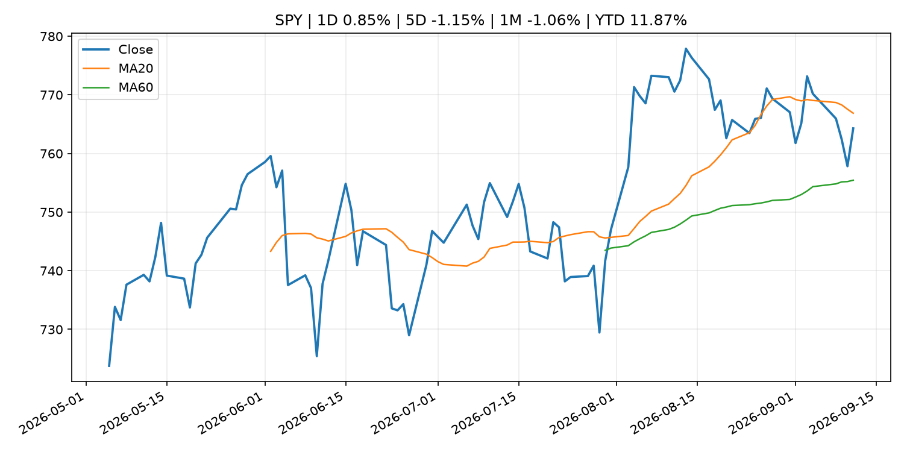
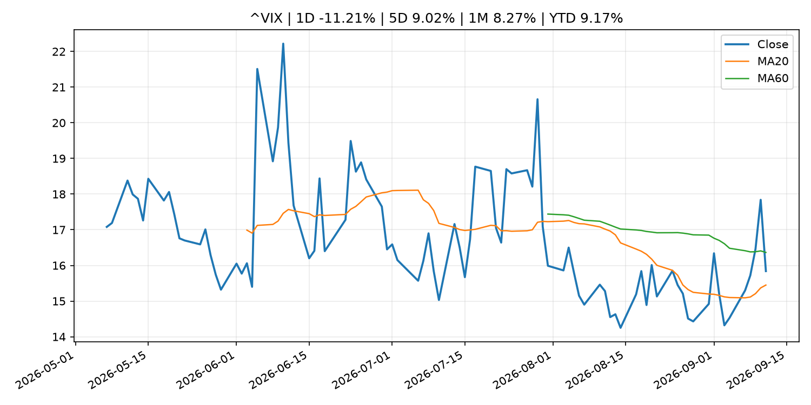
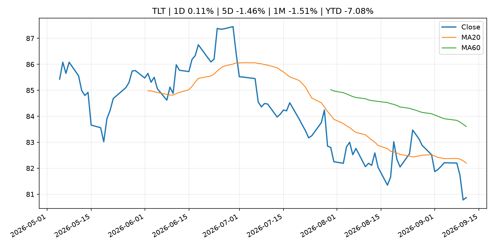
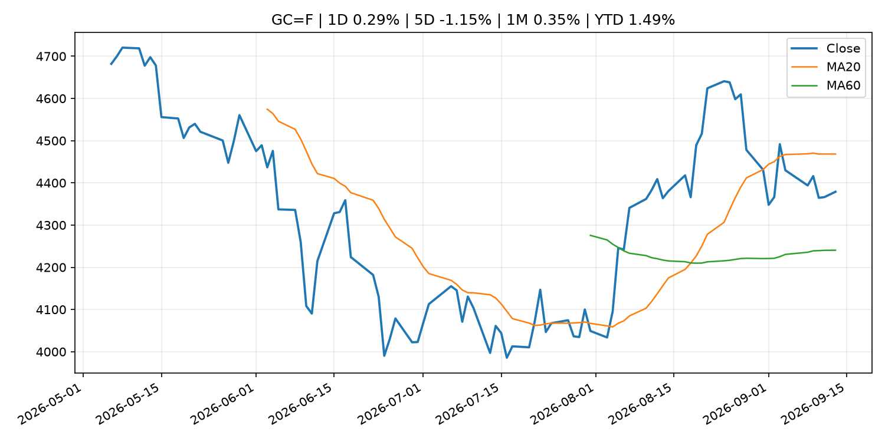
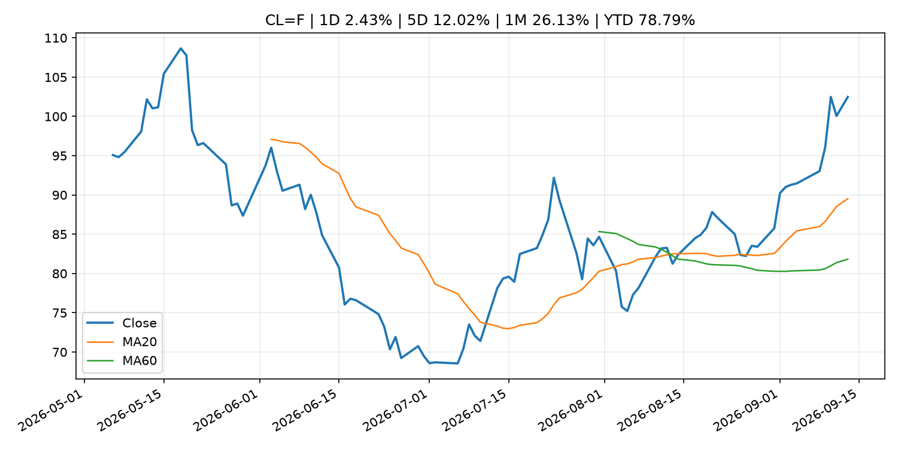
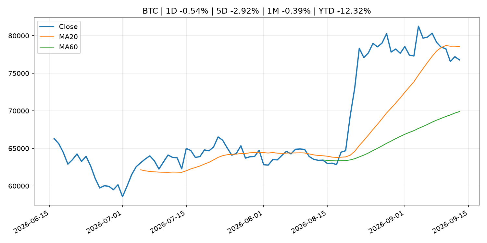
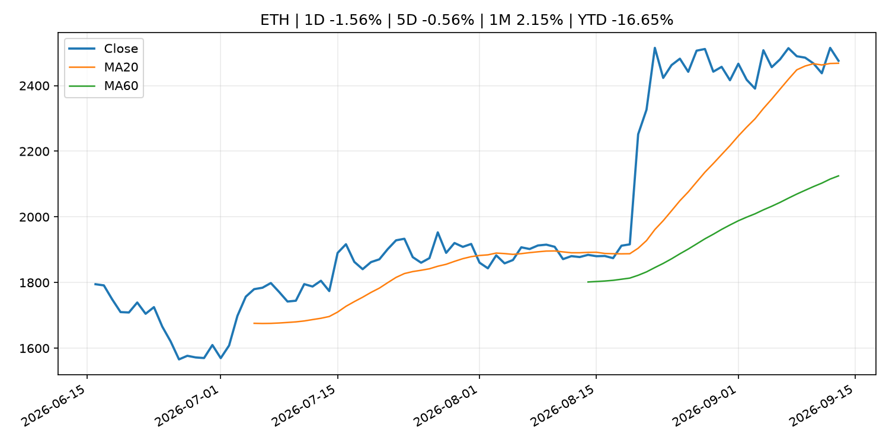
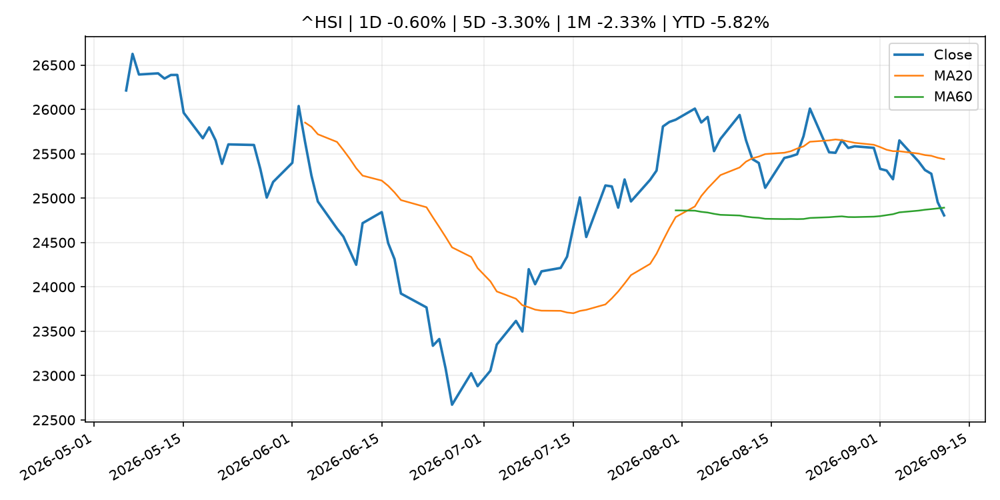

# Global Macro Morning Briefing - 2026-09-14

> Not financial advice / 非投资建议。

## 0. 今日总览
- 市场状态：risk_on。股指上涨、波动率或美元回落，市场更接近风险偏好改善。
- 今日三大主线：
  1. central_bank_decision: Fed rate hike is about Wall Street, not inflation, says economist
  2. crypto_market_structure: Ripple stablecoin chief sees $13 trillion corporate treasury opportunity for RLUSD
- 一句话结论：今日晨报重点关注：央行决策会重定价利率、汇率、久期资产和风险资产。；加密市场结构和监管变化会影响 BTC、ETH 及相关股票的风险溢价。。跨资产方面，SPY 1D 0.85%；QQQ 1D 0.87%；^VIX 1D -11.21%；TLT 1D 0.11%；GC=F 1D 0.29%；CL=F 1D 2.43%；BTC 1D -0.54%；ETH 1D -1.56%；股指上涨、波动率或美元回落，市场更接近风险偏好改善。政策、通胀、利率、美元、美债、能源和加密监管仍是主要观察线索。所有结论仅基于公开数据与短摘要整理，不构成投资建议。

## 1. 隔夜跨资产市场
- 美股：SPY 1D 0.85%，QQQ 1D 0.87%，整体趋势需结合 VIX 和利率确认。
- 美债/美元：TLT 1D 0.11%，美元指数 1D 0.02%，是判断折现率压力的核心线索。
- 黄金/原油：黄金 1D 0.29%，原油 1D 2.43%，用于观察避险、通胀和地缘风险。
- 加密：BTC 1D -0.54%，ETH 1D -1.56%，关注是否独立于纳指走出加密自身行情。
- 港股/A股：恒生 1D -0.60%，沪深300/上证 1D n/a，重点看中国政策预期与人民币线索。
- 风险观察：确认风险偏好是否扩散到小盘股、信用利差和周期品。

### US_EQUITY

| symbol | latest close | 1D | 5D | 1M | YTD | trend |
|---|---:|---:|---:|---:|---:|---|
| SPY | 764.29 | 0.85% | -1.15% | -1.06% | 11.87% | range_bound |
| QQQ | 714.88 | 0.87% | -0.39% | -1.22% | 16.60% | range_bound |
| DIA | 525.79 | 0.97% | -2.07% | -2.11% | 8.72% | range_bound |
| IWM | 288.89 | 0.41% | -2.13% | -4.57% | 16.12% | range_bound |
| VTI | 376.31 | 0.82% | -1.21% | -1.45% | 11.89% | range_bound |

### US_MACRO_MARKET

| symbol | latest close | 1D | 5D | 1M | YTD | trend |
|---|---:|---:|---:|---:|---:|---|
| ^VIX | 15.84 | -11.21% | 9.02% | 8.27% | 9.17% | range_bound |
| DX-Y.NYB | 99.14 | 0.02% | -0.02% | -0.82% | 0.73% | downtrend |
| TLT | 80.87 | 0.11% | -1.46% | -1.51% | -7.08% | downtrend |
| IEF | 91.01 | -0.19% | -1.38% | -2.10% | -5.28% | downtrend |

### COMMODITIES

| symbol | latest close | 1D | 5D | 1M | YTD | trend |
|---|---:|---:|---:|---:|---:|---|
| GC=F | 4,378.90 | 0.29% | -1.15% | 0.35% | 1.49% | range_bound |
| SI=F | 64.49 | -0.10% | -2.36% | -0.59% | -8.60% | range_bound |
| CL=F | 102.48 | 2.43% | 12.02% | 26.13% | 78.79% | strong_uptrend |
| BZ=F | 107.65 | 2.91% | 11.81% | 23.64% | 77.20% | strong_uptrend |
| NG=F | 2.86 | 1.17% | -3.73% | 5.02% | -20.84% | range_bound |
| HG=F | 6.53 | 0.88% | -1.07% | -1.00% | 15.72% | range_bound |

### HK_MARKET

| symbol | latest close | 1D | 5D | 1M | YTD | trend |
|---|---:|---:|---:|---:|---:|---|
| ^HSI | 24,805.63 | -0.60% | -3.30% | -2.33% | -5.82% | range_bound |
| 0700.HK | 428.40 | 0.66% | -3.25% | -2.86% | -31.24% | downtrend |
| 9988.HK | 107.50 | 0.56% | -2.36% | -11.81% | -27.85% | range_bound |
| 3690.HK | 75.10 | 0.47% | -8.13% | -17.70% | -28.20% | strong_downtrend |
| 1810.HK | 26.36 | 1.70% | -7.31% | 1.85% | -34.56% | range_bound |
| 1211.HK | 79.85 | 0.38% | -7.31% | -9.67% | -19.14% | range_bound |

### CRYPTO

| symbol | latest close | 1D | 5D | 1M | YTD | trend |
|---|---:|---:|---:|---:|---:|---|
| BTC | 76,782.78 | -0.54% | -2.92% | -0.39% | -12.32% | range_bound |
| ETH | 2,475.55 | -1.56% | -0.56% | 2.15% | -16.65% | uptrend |
| SOLANA | 99.44 | -2.89% | -4.18% | 5.91% | -20.15% | range_bound |
| BINANCECOIN | 716.54 | -1.37% | -3.13% | 3.04% | -16.94% | strong_uptrend |
| RIPPLE | 1.34 | -1.10% | -3.95% | -8.39% | -27.15% | range_bound |

## 2. 今日最重要的 10 条新闻
### 1. Fed rate hike is about Wall Street, not inflation, says economist
- 来源：CoinDesk
- 时间：2026-09-13T13:00:00+00:00
- 地区：global
- 事件类型：central_bank_decision
- 重要性层级：Tier 1
- 一句话摘要：Fed rate hike is about Wall Street, not inflation, says economist
- 为什么重要：央行决策会重定价利率、汇率、久期资产和风险资产。
- 可能影响：主要影响 DXY，方向为 positive，强度 high；通胀压力可能推高政策利率预期并支撑美元。
  - 资产：DXY
    方向：positive
    强度：high
    原因：通胀压力可能推高政策利率预期并支撑美元。
  - 资产：TLT
    方向：negative
    强度：high
    原因：通胀上行通常推升收益率、压低长债价格。
  - 资产：QQQ
    方向：negative
    强度：high
    原因：更高利率对成长股估值折现率不利。
  - 资产：SPY
    方向：mixed
    强度：medium
    原因：名义增长可能支撑收入，但更高利率压制估值。
  - 资产：GC=F
    方向：mixed
    强度：medium
    原因：通胀对黄金是支撑，但实际利率上行会形成压力。
  - 资产：BTC
    方向：negative
    强度：high
    原因：流动性收紧通常压制高 beta 加密资产。
- 原文链接：[https://www.coindesk.com/markets/2026/09/13/fed-rate-hike-is-about-wall-street-not-inflation-says-economist](https://www.coindesk.com/markets/2026/09/13/fed-rate-hike-is-about-wall-street-not-inflation-says-economist)

### 2. Ripple stablecoin chief sees $13 trillion corporate treasury opportunity for RLUSD
- 来源：CoinDesk
- 时间：2026-09-12T16:00:00+00:00
- 地区：global
- 事件类型：crypto_market_structure
- 重要性层级：Tier 2
- 一句话摘要：Ripple stablecoin chief sees $13 trillion corporate treasury opportunity for RLUSD
- 为什么重要：加密市场结构和监管变化会影响 BTC、ETH 及相关股票的风险溢价。
- 可能影响：主要影响 BTC，方向为 mixed，强度 high；加密监管或 ETF 进展会改变 BTC 的资金流和风险溢价。
  - 资产：BTC
    方向：mixed
    强度：high
    原因：加密监管或 ETF 进展会改变 BTC 的资金流和风险溢价。
  - 资产：ETH
    方向：mixed
    强度：high
    原因：监管框架会影响 ETH 产品化和机构参与度。
  - 资产：COIN
    方向：mixed
    强度：medium
    原因：监管清晰度和执法风险会影响交易平台估值。
  - 资产：crypto market
    方向：mixed
    强度：high
    原因：信息影响整个加密市场结构，但方向取决于细节。
- 原文链接：[https://www.coindesk.com/business/2026/09/12/ripple-stablecoin-chief-sees-usd13-trillion-corporate-treasury-opportunity-for-rlusd](https://www.coindesk.com/business/2026/09/12/ripple-stablecoin-chief-sees-usd13-trillion-corporate-treasury-opportunity-for-rlusd)

### 3. Your Social Security COLA could go up another $71 per month in 2027. That’s not necessarily good news.
- 来源：MarketWatch Top Stories
- 时间：2026-09-13T20:40:00+00:00
- 地区：US
- 事件类型：other
- 重要性层级：Tier 3
- 一句话摘要：A higher COLA is a sign that persistent inflation isn’t going anywhere.
- 为什么重要：这条信息暂未匹配到重大宏观、政策或市场事件，更适合作为背景跟踪。
- 可能影响：主要影响 DXY，方向为 positive，强度 high；通胀压力可能推高政策利率预期并支撑美元。
  - 资产：DXY
    方向：positive
    强度：high
    原因：通胀压力可能推高政策利率预期并支撑美元。
  - 资产：TLT
    方向：negative
    强度：high
    原因：通胀上行通常推升收益率、压低长债价格。
  - 资产：QQQ
    方向：negative
    强度：high
    原因：更高利率对成长股估值折现率不利。
  - 资产：SPY
    方向：mixed
    强度：medium
    原因：名义增长可能支撑收入，但更高利率压制估值。
  - 资产：GC=F
    方向：mixed
    强度：medium
    原因：通胀对黄金是支撑，但实际利率上行会形成压力。
  - 资产：BTC
    方向：mixed
    强度：medium
    原因：抗通胀叙事和流动性收紧可能相互抵消。
- 原文链接：[https://www.marketwatch.com/story/your-social-security-check-could-go-up-another-71-next-year-thats-not-necessarily-good-news-f952c08a?mod=mw_rss_topstories](https://www.marketwatch.com/story/your-social-security-check-could-go-up-another-71-next-year-thats-not-necessarily-good-news-f952c08a?mod=mw_rss_topstories)

### 4. Inflation is outpacing wage growth again, squeezing Americans’ paychecks
- 来源：CNBC Economy
- 时间：2026-09-12T12:49:15+00:00
- 地区：US
- 事件类型：other
- 重要性层级：Tier 3
- 一句话摘要：In August, consumer prices rose 3.4% over the past year while wages increased just 3.1%.
- 为什么重要：这条信息暂未匹配到重大宏观、政策或市场事件，更适合作为背景跟踪。
- 可能影响：主要影响 DXY，方向为 positive，强度 high；通胀压力可能推高政策利率预期并支撑美元。
  - 资产：DXY
    方向：positive
    强度：high
    原因：通胀压力可能推高政策利率预期并支撑美元。
  - 资产：TLT
    方向：negative
    强度：high
    原因：通胀上行通常推升收益率、压低长债价格。
  - 资产：QQQ
    方向：negative
    强度：high
    原因：更高利率对成长股估值折现率不利。
  - 资产：SPY
    方向：mixed
    强度：medium
    原因：名义增长可能支撑收入，但更高利率压制估值。
  - 资产：GC=F
    方向：mixed
    强度：medium
    原因：通胀对黄金是支撑，但实际利率上行会形成压力。
  - 资产：BTC
    方向：mixed
    强度：medium
    原因：抗通胀叙事和流动性收紧可能相互抵消。
- 原文链接：[https://www.cnbc.com/2026/09/12/inflation-is-outpacing-wage-growth-again-squeezing-americans-paychecks.html](https://www.cnbc.com/2026/09/12/inflation-is-outpacing-wage-growth-again-squeezing-americans-paychecks.html)

## 3. 政策与央行观察
### 1. Fed rate hike is about Wall Street, not inflation, says economist
- 来源：CoinDesk
- 时间：2026-09-13T13:00:00+00:00
- 地区：global
- 事件类型：central_bank_decision
- 重要性层级：Tier 1
- 一句话摘要：Fed rate hike is about Wall Street, not inflation, says economist
- 为什么重要：央行决策会重定价利率、汇率、久期资产和风险资产。
- 可能影响：主要影响 DXY，方向为 positive，强度 high；通胀压力可能推高政策利率预期并支撑美元。
  - 资产：DXY
    方向：positive
    强度：high
    原因：通胀压力可能推高政策利率预期并支撑美元。
  - 资产：TLT
    方向：negative
    强度：high
    原因：通胀上行通常推升收益率、压低长债价格。
  - 资产：QQQ
    方向：negative
    强度：high
    原因：更高利率对成长股估值折现率不利。
  - 资产：SPY
    方向：mixed
    强度：medium
    原因：名义增长可能支撑收入，但更高利率压制估值。
  - 资产：GC=F
    方向：mixed
    强度：medium
    原因：通胀对黄金是支撑，但实际利率上行会形成压力。
  - 资产：BTC
    方向：negative
    强度：high
    原因：流动性收紧通常压制高 beta 加密资产。
- 原文链接：[https://www.coindesk.com/markets/2026/09/13/fed-rate-hike-is-about-wall-street-not-inflation-says-economist](https://www.coindesk.com/markets/2026/09/13/fed-rate-hike-is-about-wall-street-not-inflation-says-economist)

### 2. Ripple stablecoin chief sees $13 trillion corporate treasury opportunity for RLUSD
- 来源：CoinDesk
- 时间：2026-09-12T16:00:00+00:00
- 地区：global
- 事件类型：crypto_market_structure
- 重要性层级：Tier 2
- 一句话摘要：Ripple stablecoin chief sees $13 trillion corporate treasury opportunity for RLUSD
- 为什么重要：加密市场结构和监管变化会影响 BTC、ETH 及相关股票的风险溢价。
- 可能影响：主要影响 BTC，方向为 mixed，强度 high；加密监管或 ETF 进展会改变 BTC 的资金流和风险溢价。
  - 资产：BTC
    方向：mixed
    强度：high
    原因：加密监管或 ETF 进展会改变 BTC 的资金流和风险溢价。
  - 资产：ETH
    方向：mixed
    强度：high
    原因：监管框架会影响 ETH 产品化和机构参与度。
  - 资产：COIN
    方向：mixed
    强度：medium
    原因：监管清晰度和执法风险会影响交易平台估值。
  - 资产：crypto market
    方向：mixed
    强度：high
    原因：信息影响整个加密市场结构，但方向取决于细节。
- 原文链接：[https://www.coindesk.com/business/2026/09/12/ripple-stablecoin-chief-sees-usd13-trillion-corporate-treasury-opportunity-for-rlusd](https://www.coindesk.com/business/2026/09/12/ripple-stablecoin-chief-sees-usd13-trillion-corporate-treasury-opportunity-for-rlusd)

## 4. 市场异动与图表
- SPY 上涨 0.85%
- QQQ 上涨 0.87%
- VIX 下跌 -11.21%
- Oil 上涨 2.43%

### SPY

### QQQ

### ^VIX

### TLT

### GC=F

### CL=F

### BTC

### ETH

### ^HSI

## 5. 华尔街与机构公开观点
- 暂无可靠公开观点。

## 6. 今日重点关注
- 经济数据：经济数据：暂无可靠公开日历数据；如配置经济日历源后可自动填充。
- 央行讲话：央行讲话：暂无可靠公开日历数据；重点跟踪 Fed、ECB、BoJ、PBOC 官网 RSS。
- 财报：财报：暂无可靠数据。
- 政策事件：政策事件：暂无可靠数据。
- 风险提醒：风险提醒：关注数据源失败项、突发地缘风险、利率和美元的二阶反应。

## 7. 英文金融表达与宏观概念
- **inflation expectations**：通胀预期，指家庭、企业或市场对未来通胀的预估。 例句：Inflation expectations can shape wage bargaining and bond yields.
- **real yield**：实际收益率，名义利率扣除通胀预期后的收益率。 例句：Gold often reacts more to real yields than nominal yields.
- **terminal rate**：终端利率，市场预期本轮加息周期的最高政策利率。 例句：A higher terminal rate can pressure growth stocks.
- **market structure**：市场结构，指交易、托管、清算、ETF、监管等制度安排。 例句：Crypto market structure rules can affect institutional participation.
- **soft landing**：软着陆，指通胀回落而经济避免明显衰退。 例句：Markets often rally when data support a soft landing.
- **risk-off**：避险模式，资金偏向美元、国债、黄金等防御资产。 例句：A geopolitical shock can push markets into risk-off mode.

## 8. 背景材料
- [Your Social Security COLA could go up another $71 per month in 2027. That’s not necessarily good news.](https://www.marketwatch.com/story/your-social-security-check-could-go-up-another-71-next-year-thats-not-necessarily-good-news-f952c08a?mod=mw_rss_topstories)（MarketWatch Top Stories，other）：A higher COLA is a sign that persistent inflation isn’t going anywhere.
- [The future of retirement? Work until you die.](https://www.marketwatch.com/story/the-future-of-retirement-work-until-you-die-6d0e5341?mod=mw_rss_topstories)（MarketWatch Top Stories，other）：Social Security, once seen as “old-age insurance,” will eventually disappear, this author predicts.
- [Fed rate hikes won’t bring down gas prices. Why the bond market is pushing for them anyway.](https://www.marketwatch.com/story/fed-rate-hikes-wont-bring-down-gas-prices-why-the-bond-market-is-pushing-for-them-anyway-98f2c7e3?mod=mw_rss_topstories)（MarketWatch Top Stories，other）：The 10-year Treasury yield is sitting on the doorstep of 5%, and that’s a warning sign for stocks.
- [Bitcoin Suisse plans to cut up to half its Swiss jobs as it shifts work abroad](https://www.coindesk.com/business/2026/09/12/bitcoin-suisse-plans-to-cut-up-to-half-its-swiss-jobs-as-it-shifts-work-abroad)（CoinDesk，other）：Bitcoin Suisse plans to cut up to half its Swiss jobs as it shifts work abroad
- [Christine Lagarde: Interview with Ouest-France](https://www.ecb.europa.eu//press/inter/date/2026/html/ecb.in260912~3cc706f4d6.en.html)（ECB Press Releases，other）：Christine Lagarde: Interview with Ouest-France
- [Ditching bonds for bitcoin: How crypto can tackle the AI-heavy portfolio dilemma](https://www.coindesk.com/business/2026/09/12/ditching-bonds-for-bitcoin-how-crypto-can-tackle-the-ai-heavy-portfolio-dilemma)（CoinDesk，other）：Ditching bonds for bitcoin: How crypto can tackle the AI-heavy portfolio dilemma
- [Inflation is outpacing wage growth again, squeezing Americans’ paychecks](https://www.cnbc.com/2026/09/12/inflation-is-outpacing-wage-growth-again-squeezing-americans-paychecks.html)（CNBC Economy，other）：In August, consumer prices rose 3.4% over the past year while wages increased just 3.1%.
- [Christine Lagarde: Europe seen from Normandy](https://www.ecb.europa.eu//press/key/date/2026/html/ecb.sp260912~fafa4b35b0.en.html)（ECB Press Releases，other）：Christine Lagarde: Europe seen from Normandy
- [Bitcoin activity, passports exposed after Revolut falls for fake government request](https://www.coindesk.com/tech/2026/09/12/bitcoin-activity-passports-exposed-after-revolut-falls-for-fake-government-request)（CoinDesk，other）：Bitcoin activity, passports exposed after Revolut falls for fake government request

## 9. 数据源、失败项与免责声明
- 采集时间：2026-09-13T23:54:24
- 数据源：公开 RSS、Yahoo Finance、CoinGecko、AKShare、FRED、SEC data.sec.gov，以及用户自有 inputs/reports 文件。
- 合规说明：不绕过 WSJ、Bloomberg、FT、Reuters 等付费墙；对付费媒体只使用公开 RSS 标题、摘要、链接和发布时间。
- 免责声明：Not financial advice / 非投资建议。本项目仅供个人学习、研究和信息整理，不构成投资建议、交易建议或任何收益承诺。
- 失败或跳过的数据源：
  - crypto data failed coin=dogecoin
  - China market data failed symbol=上证指数: empty dataframe
  - China market data failed symbol=深证成指: empty dataframe
  - China market data failed symbol=创业板指: empty dataframe
  - China market data failed symbol=沪深300: empty dataframe
  - China market data failed symbol=中证500: empty dataframe
  - China market data failed symbol=科创50: empty dataframe
  - FRED_API_KEY not set; skipping FRED macro series
  - SEC failed cik=0000320193
  - SEC failed cik=0000789019
  - SEC failed cik=0001045810
  - SEC failed cik=0001318605
  - SEC failed cik=0001577552
