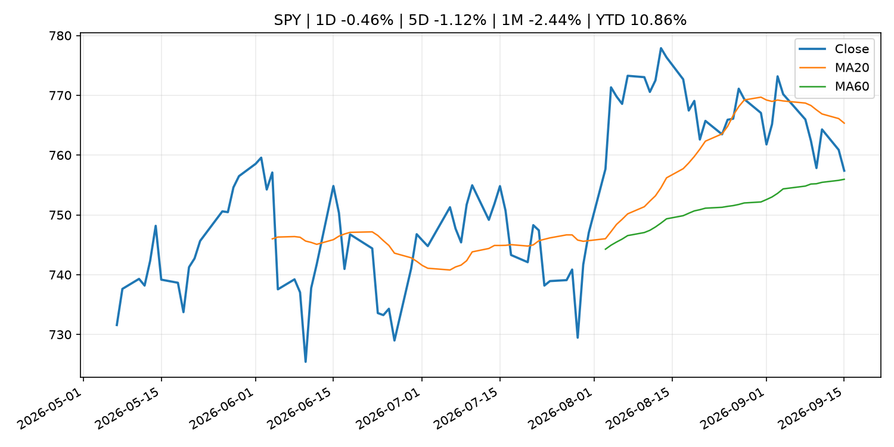
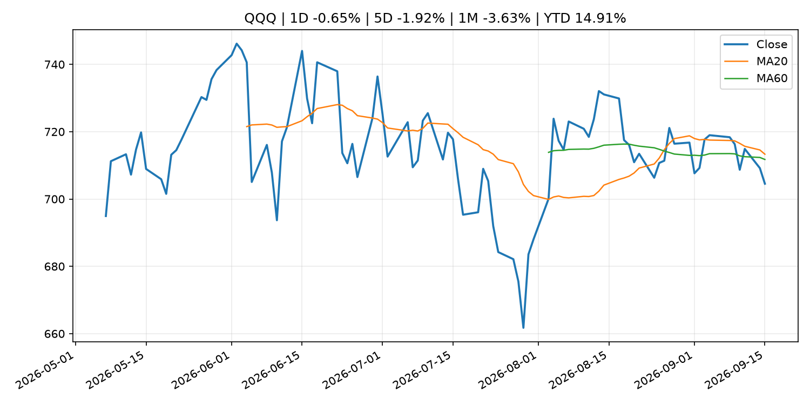
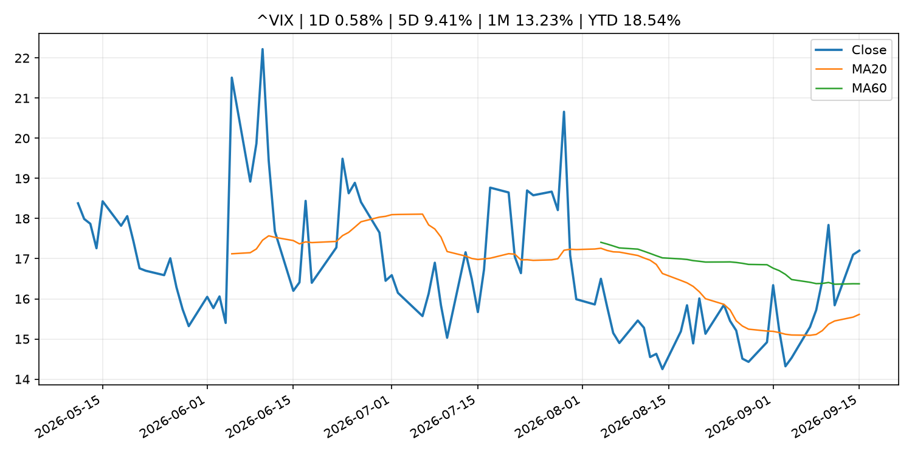
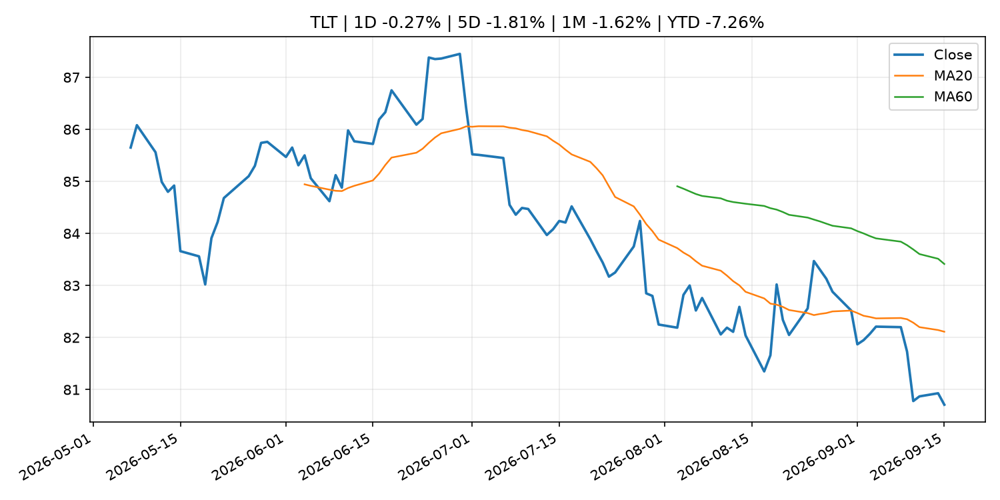
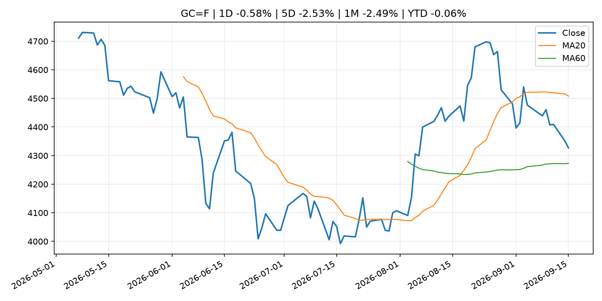
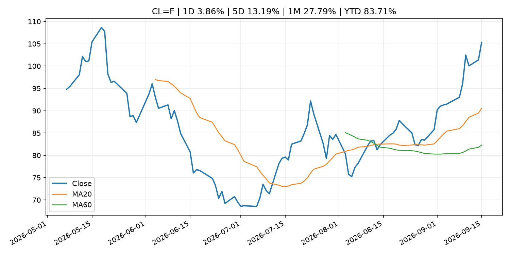
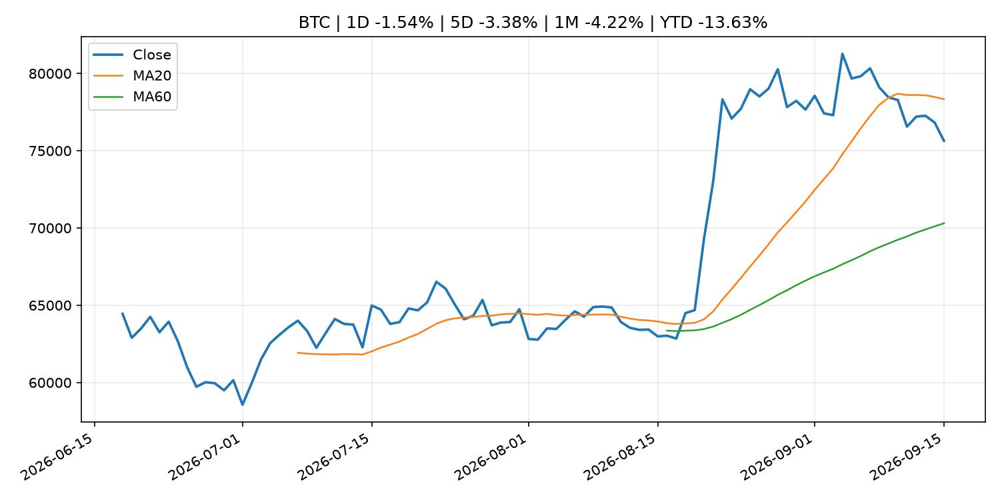
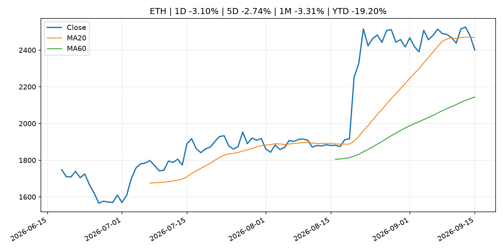
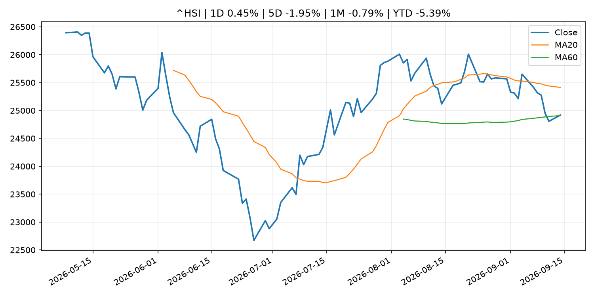

# Global Macro Morning Briefing - 2026-09-16

> Not financial advice / 非投资建议。

## 0. 今日总览
- 市场状态：unknown。市场信号不足，暂不判断明确状态。
- 今日三大主线：
  1. central_bank_decision: Why a Federal Reserve rate hike could be a ‘rare win’ for your retirement money
  2. fiscal_policy: Isabel Schnabel: Macroeconomic, fiscal and financial stability in a shock-prone world
  3. regulation: SEC Grants Exemptive Relief from Certain Inline XBRL Filing or Submission Requirements
- 一句话结论：今日晨报重点关注：央行决策会重定价利率、汇率、久期资产和风险资产。；财政和贸易政策会影响增长、通胀、企业利润和跨境资本流。。跨资产方面，SPY 1D -0.46%；QQQ 1D -0.65%；^VIX 1D 0.58%；TLT 1D -0.27%；GC=F 1D -0.58%；CL=F 1D 3.86%；BTC 1D -1.54%；ETH 1D -3.10%；市场信号不足，暂不判断明确状态。政策、通胀、利率、美元、美债、能源和加密监管仍是主要观察线索。所有结论仅基于公开数据与短摘要整理，不构成投资建议。

## 1. 隔夜跨资产市场
- 美股：SPY 1D -0.46%，QQQ 1D -0.65%，整体趋势需结合 VIX 和利率确认。
- 美债/美元：TLT 1D -0.27%，美元指数 1D 0.22%，是判断折现率压力的核心线索。
- 黄金/原油：黄金 1D -0.58%，原油 1D 3.86%，用于观察避险、通胀和地缘风险。
- 加密：BTC 1D -1.54%，ETH 1D -3.10%，关注是否独立于纳指走出加密自身行情。
- 港股/A股：恒生 1D 0.45%，沪深300/上证 1D n/a，重点看中国政策预期与人民币线索。
- 风险观察：关注后续数据是否确认当前跨资产信号。

### US_EQUITY

| symbol | latest close | 1D | 5D | 1M | YTD | trend |
|---|---:|---:|---:|---:|---:|---|
| SPY | 757.39 | -0.46% | -1.12% | -2.44% | 10.86% | range_bound |
| QQQ | 704.54 | -0.65% | -1.92% | -3.63% | 14.91% | range_bound |
| DIA | 521.23 | -0.62% | -1.29% | -2.90% | 7.77% | range_bound |
| IWM | 285.14 | -0.96% | -3.23% | -6.54% | 14.62% | strong_downtrend |
| VTI | 372.84 | -0.49% | -1.26% | -2.87% | 10.86% | range_bound |

### US_MACRO_MARKET

| symbol | latest close | 1D | 5D | 1M | YTD | trend |
|---|---:|---:|---:|---:|---:|---|
| ^VIX | 17.20 | 0.58% | 9.41% | 13.23% | 18.54% | range_bound |
| DX-Y.NYB | 99.68 | 0.22% | 0.85% | 0.01% | 1.28% | range_bound |
| TLT | 80.71 | -0.27% | -1.81% | -1.62% | -7.26% | downtrend |
| IEF | 90.82 | -0.12% | -1.45% | -2.39% | -5.47% | downtrend |

### COMMODITIES

| symbol | latest close | 1D | 5D | 1M | YTD | trend |
|---|---:|---:|---:|---:|---:|---|
| GC=F | 4,326.80 | -0.58% | -2.53% | -2.49% | -0.06% | range_bound |
| SI=F | 64.23 | 1.13% | -3.12% | -1.17% | -8.97% | range_bound |
| CL=F | 105.30 | 3.86% | 13.19% | 27.79% | 83.71% | strong_uptrend |
| BZ=F | 108.46 | 2.63% | 10.76% | 22.53% | 78.53% | strong_uptrend |
| NG=F | 2.94 | 1.69% | 0.99% | 7.76% | -18.60% | range_bound |
| HG=F | 6.46 | 2.08% | -4.12% | -2.09% | 14.57% | range_bound |

### HK_MARKET

| symbol | latest close | 1D | 5D | 1M | YTD | trend |
|---|---:|---:|---:|---:|---:|---|
| ^HSI | 24,917.60 | 0.45% | -1.95% | -0.79% | -5.39% | range_bound |
| 0700.HK | 438.80 | 1.90% | 0.78% | -1.70% | -29.57% | downtrend |
| 9988.HK | 107.20 | 1.23% | -2.10% | -12.27% | -28.05% | range_bound |
| 3690.HK | 74.75 | -0.40% | -7.26% | -14.72% | -28.54% | strong_downtrend |
| 1810.HK | 26.50 | -2.43% | -1.56% | 2.40% | -34.21% | range_bound |
| 1211.HK | 79.05 | -1.43% | -5.72% | -12.22% | -19.95% | range_bound |

### CRYPTO

| symbol | latest close | 1D | 5D | 1M | YTD | trend |
|---|---:|---:|---:|---:|---:|---|
| BTC | 75,639.24 | -1.54% | -3.38% | -4.22% | -13.63% | range_bound |
| ETH | 2,399.83 | -3.10% | -2.74% | -3.31% | -19.20% | range_bound |
| SOLANA | 96.92 | -2.42% | -4.58% | -1.97% | -22.17% | range_bound |
| BINANCECOIN | 712.16 | -0.57% | -1.45% | 1.15% | -17.45% | range_bound |
| RIPPLE | 1.29 | -4.16% | -7.81% | -13.15% | -30.14% | range_bound |

## 2. 今日最重要的 10 条新闻
### 1. Why a Federal Reserve rate hike could be a ‘rare win’ for your retirement money
- 来源：MarketWatch Top Stories
- 时间：2026-09-15T20:47:00+00:00
- 地区：US
- 事件类型：central_bank_decision
- 重要性层级：Tier 1
- 一句话摘要：There may be better savings yields, but beware rising credit-card rates
- 为什么重要：央行决策会重定价利率、汇率、久期资产和风险资产。
- 可能影响：主要影响 QQQ，方向为 negative，强度 high；鹰派政策提高折现率，压制成长股估值。
  - 资产：QQQ
    方向：negative
    强度：high
    原因：鹰派政策提高折现率，压制成长股估值。
  - 资产：SPY
    方向：negative
    强度：medium
    原因：更紧政策通常削弱风险偏好。
  - 资产：TLT
    方向：negative
    强度：high
    原因：利率上行通常压低长债价格。
  - 资产：DXY
    方向：positive
    强度：high
    原因：更高利率预期通常支撑美元。
  - 资产：BTC
    方向：negative
    强度：high
    原因：流动性收紧通常压制高 beta 加密资产。
- 原文链接：[https://www.marketwatch.com/story/why-a-federal-reserve-rate-hike-could-be-a-rare-win-for-your-retirement-money-3ae337df?mod=mw_rss_topstories](https://www.marketwatch.com/story/why-a-federal-reserve-rate-hike-could-be-a-rare-win-for-your-retirement-money-3ae337df?mod=mw_rss_topstories)

### 2. Isabel Schnabel: Macroeconomic, fiscal and financial stability in a shock-prone world
- 来源：ECB Press Releases
- 时间：2026-09-14T11:15:00+02:00
- 地区：EU
- 事件类型：fiscal_policy
- 重要性层级：Tier 1
- 一句话摘要：Isabel Schnabel: Macroeconomic, fiscal and financial stability in a shock-prone world
- 为什么重要：财政和贸易政策会影响增长、通胀、企业利润和跨境资本流。
- 可能影响：可能影响利率、汇率、风险资产或大宗商品预期，但当前公开信息不足以判断明确方向。
  - 资产：暂无明确资产映射
  - 方向：unknown
  - 强度：low
  - 原因：公开信息不足以判断方向。
- 原文链接：[https://www.ecb.europa.eu//press/key/date/2026/html/ecb.sp260914~0ffd556bc8.en.pdf](https://www.ecb.europa.eu//press/key/date/2026/html/ecb.sp260914~0ffd556bc8.en.pdf)

### 3. SEC Grants Exemptive Relief from Certain Inline XBRL Filing or Submission Requirements
- 来源：SEC Press Releases
- 时间：2026-09-14T12:47:00-04:00
- 地区：US
- 事件类型：regulation
- 重要性层级：Tier 2
- 一句话摘要：The Securities and Exchange Commission issued an order granting exemptive relief from certain Inline XBRL requirements adopted on Dec. 16, 2024. More specifically, the Commission is granting exemptive relief from filing or submitting the following in…
- 为什么重要：监管变化会改变行业盈利预期和资产风险溢价。
- 可能影响：主要影响 BTC，方向为 mixed，强度 high；加密监管或 ETF 进展会改变 BTC 的资金流和风险溢价。
  - 资产：BTC
    方向：mixed
    强度：high
    原因：加密监管或 ETF 进展会改变 BTC 的资金流和风险溢价。
  - 资产：ETH
    方向：mixed
    强度：high
    原因：监管框架会影响 ETH 产品化和机构参与度。
  - 资产：COIN
    方向：mixed
    强度：medium
    原因：监管清晰度和执法风险会影响交易平台估值。
  - 资产：crypto market
    方向：mixed
    强度：high
    原因：信息影响整个加密市场结构，但方向取决于细节。
- 原文链接：[https://www.sec.gov/newsroom/press-releases/2026-88-sec-grants-exemptive-relief-certain-inline-xbrl-filing-or-submission-requirements](https://www.sec.gov/newsroom/press-releases/2026-88-sec-grants-exemptive-relief-certain-inline-xbrl-filing-or-submission-requirements)

### 4. Inflation killed the penny. Now it’s coming for your dollar.
- 来源：MarketWatch Top Stories
- 时间：2026-09-15T21:00:00+00:00
- 地区：US
- 事件类型：other
- 重要性层级：Tier 3
- 一句话摘要：Congress congratulated itself for solving the penny problem, but what about the source of the problem — inflation?
- 为什么重要：这条信息暂未匹配到重大宏观、政策或市场事件，更适合作为背景跟踪。
- 可能影响：主要影响 DXY，方向为 positive，强度 high；通胀压力可能推高政策利率预期并支撑美元。
  - 资产：DXY
    方向：positive
    强度：high
    原因：通胀压力可能推高政策利率预期并支撑美元。
  - 资产：TLT
    方向：negative
    强度：high
    原因：通胀上行通常推升收益率、压低长债价格。
  - 资产：QQQ
    方向：negative
    强度：high
    原因：更高利率对成长股估值折现率不利。
  - 资产：SPY
    方向：mixed
    强度：medium
    原因：名义增长可能支撑收入，但更高利率压制估值。
  - 资产：GC=F
    方向：mixed
    强度：medium
    原因：通胀对黄金是支撑，但实际利率上行会形成压力。
  - 资产：BTC
    方向：mixed
    强度：medium
    原因：抗通胀叙事和流动性收紧可能相互抵消。
- 原文链接：[https://www.marketwatch.com/story/inflation-killed-the-penny-now-its-coming-for-your-dollar-78336cd8?mod=mw_rss_topstories](https://www.marketwatch.com/story/inflation-killed-the-penny-now-its-coming-for-your-dollar-78336cd8?mod=mw_rss_topstories)

### 5. Warsh's credibility is on the line this week as Trump policies put pressure on Fed to hike
- 来源：CNBC Economy
- 时间：2026-09-14T20:49:03+00:00
- 地区：US
- 事件类型：other
- 重要性层级：Tier 3
- 一句话摘要：With inflation above target and no visibility on lower oil prices or stability of tariffs, the Fed chairman needs to pass the test that has faced his predecessors
- 为什么重要：这条信息暂未匹配到重大宏观、政策或市场事件，更适合作为背景跟踪。
- 可能影响：主要影响 DXY，方向为 positive，强度 high；通胀压力可能推高政策利率预期并支撑美元。
  - 资产：DXY
    方向：positive
    强度：high
    原因：通胀压力可能推高政策利率预期并支撑美元。
  - 资产：TLT
    方向：negative
    强度：high
    原因：通胀上行通常推升收益率、压低长债价格。
  - 资产：QQQ
    方向：negative
    强度：high
    原因：更高利率对成长股估值折现率不利。
  - 资产：SPY
    方向：mixed
    强度：medium
    原因：名义增长可能支撑收入，但更高利率压制估值。
  - 资产：GC=F
    方向：mixed
    强度：medium
    原因：通胀对黄金是支撑，但实际利率上行会形成压力。
  - 资产：BTC
    方向：mixed
    强度：medium
    原因：抗通胀叙事和流动性收紧可能相互抵消。
- 原文链接：[https://www.cnbc.com/2026/09/14/warshs-credibility-is-on-the-line-this-week-as-trump-policies-put-pressure-on-fed-to-hike.html](https://www.cnbc.com/2026/09/14/warshs-credibility-is-on-the-line-this-week-as-trump-policies-put-pressure-on-fed-to-hike.html)

## 3. 政策与央行观察
### 1. Why a Federal Reserve rate hike could be a ‘rare win’ for your retirement money
- 来源：MarketWatch Top Stories
- 时间：2026-09-15T20:47:00+00:00
- 地区：US
- 事件类型：central_bank_decision
- 重要性层级：Tier 1
- 一句话摘要：There may be better savings yields, but beware rising credit-card rates
- 为什么重要：央行决策会重定价利率、汇率、久期资产和风险资产。
- 可能影响：主要影响 QQQ，方向为 negative，强度 high；鹰派政策提高折现率，压制成长股估值。
  - 资产：QQQ
    方向：negative
    强度：high
    原因：鹰派政策提高折现率，压制成长股估值。
  - 资产：SPY
    方向：negative
    强度：medium
    原因：更紧政策通常削弱风险偏好。
  - 资产：TLT
    方向：negative
    强度：high
    原因：利率上行通常压低长债价格。
  - 资产：DXY
    方向：positive
    强度：high
    原因：更高利率预期通常支撑美元。
  - 资产：BTC
    方向：negative
    强度：high
    原因：流动性收紧通常压制高 beta 加密资产。
- 原文链接：[https://www.marketwatch.com/story/why-a-federal-reserve-rate-hike-could-be-a-rare-win-for-your-retirement-money-3ae337df?mod=mw_rss_topstories](https://www.marketwatch.com/story/why-a-federal-reserve-rate-hike-could-be-a-rare-win-for-your-retirement-money-3ae337df?mod=mw_rss_topstories)

### 2. Isabel Schnabel: Macroeconomic, fiscal and financial stability in a shock-prone world
- 来源：ECB Press Releases
- 时间：2026-09-14T11:15:00+02:00
- 地区：EU
- 事件类型：fiscal_policy
- 重要性层级：Tier 1
- 一句话摘要：Isabel Schnabel: Macroeconomic, fiscal and financial stability in a shock-prone world
- 为什么重要：财政和贸易政策会影响增长、通胀、企业利润和跨境资本流。
- 可能影响：可能影响利率、汇率、风险资产或大宗商品预期，但当前公开信息不足以判断明确方向。
  - 资产：暂无明确资产映射
  - 方向：unknown
  - 强度：low
  - 原因：公开信息不足以判断方向。
- 原文链接：[https://www.ecb.europa.eu//press/key/date/2026/html/ecb.sp260914~0ffd556bc8.en.pdf](https://www.ecb.europa.eu//press/key/date/2026/html/ecb.sp260914~0ffd556bc8.en.pdf)

### 3. SEC Grants Exemptive Relief from Certain Inline XBRL Filing or Submission Requirements
- 来源：SEC Press Releases
- 时间：2026-09-14T12:47:00-04:00
- 地区：US
- 事件类型：regulation
- 重要性层级：Tier 2
- 一句话摘要：The Securities and Exchange Commission issued an order granting exemptive relief from certain Inline XBRL requirements adopted on Dec. 16, 2024. More specifically, the Commission is granting exemptive relief from filing or submitting the following in…
- 为什么重要：监管变化会改变行业盈利预期和资产风险溢价。
- 可能影响：主要影响 BTC，方向为 mixed，强度 high；加密监管或 ETF 进展会改变 BTC 的资金流和风险溢价。
  - 资产：BTC
    方向：mixed
    强度：high
    原因：加密监管或 ETF 进展会改变 BTC 的资金流和风险溢价。
  - 资产：ETH
    方向：mixed
    强度：high
    原因：监管框架会影响 ETH 产品化和机构参与度。
  - 资产：COIN
    方向：mixed
    强度：medium
    原因：监管清晰度和执法风险会影响交易平台估值。
  - 资产：crypto market
    方向：mixed
    强度：high
    原因：信息影响整个加密市场结构，但方向取决于细节。
- 原文链接：[https://www.sec.gov/newsroom/press-releases/2026-88-sec-grants-exemptive-relief-certain-inline-xbrl-filing-or-submission-requirements](https://www.sec.gov/newsroom/press-releases/2026-88-sec-grants-exemptive-relief-certain-inline-xbrl-filing-or-submission-requirements)

## 4. 市场异动与图表
- SPY 下跌 -0.46%
- QQQ 下跌 -0.65%
- Gold 下跌 -0.58%
- Oil 上涨 3.86%
- ETH 下跌 -3.10%

### SPY

### QQQ

### ^VIX

### TLT

### GC=F

### CL=F

### BTC

### ETH

### ^HSI

## 5. 华尔街与机构公开观点
- 暂无可靠公开观点。

## 6. 今日重点关注
- 经济数据：经济数据：暂无可靠公开日历数据；如配置经济日历源后可自动填充。
- 央行讲话：央行讲话：暂无可靠公开日历数据；重点跟踪 Fed、ECB、BoJ、PBOC 官网 RSS。
- 财报：财报：暂无可靠数据。
- 政策事件：政策事件：暂无可靠数据。
- 风险提醒：风险提醒：关注数据源失败项、突发地缘风险、利率和美元的二阶反应。

## 7. 英文金融表达与宏观概念
- **inflation expectations**：通胀预期，指家庭、企业或市场对未来通胀的预估。 例句：Inflation expectations can shape wage bargaining and bond yields.
- **real yield**：实际收益率，名义利率扣除通胀预期后的收益率。 例句：Gold often reacts more to real yields than nominal yields.
- **terminal rate**：终端利率，市场预期本轮加息周期的最高政策利率。 例句：A higher terminal rate can pressure growth stocks.
- **risk-off**：避险模式，资金偏向美元、国债、黄金等防御资产。 例句：A geopolitical shock can push markets into risk-off mode.
- **supply disruption**：供给扰动，通常指能源或商品供应受冲突、减产或天气影响。 例句：Supply disruption can lift oil prices and inflation expectations.
- **market structure**：市场结构，指交易、托管、清算、ETF、监管等制度安排。 例句：Crypto market structure rules can affect institutional participation.

## 8. 背景材料
- [‘There might be a silver lining’: My friend’s wife died at 60 after a high-earning career. Can he claim her Social Security?](https://www.marketwatch.com/story/there-might-be-a-silver-lining-my-friends-wife-died-at-60-after-a-high-earning-career-can-he-claim-her-social-security-eb95210a?mod=mw_rss_topstories)（MarketWatch Top Stories，other）：“They had been married for over 30 years when she passed.”
- [Inflation killed the penny. Now it’s coming for your dollar.](https://www.marketwatch.com/story/inflation-killed-the-penny-now-its-coming-for-your-dollar-78336cd8?mod=mw_rss_topstories)（MarketWatch Top Stories，other）：Congress congratulated itself for solving the penny problem, but what about the source of the problem — inflation?
- [A hacker turned 25 cents of bitcoin into 46 billion fake BTC tokens on a DeFi bridge](https://www.coindesk.com/tech/2026/09/15/a-hacker-turned-25-cents-of-bitcoin-into-46-billion-fake-btc-tokens-on-a-defi-bridge)（CoinDesk，other）：A hacker turned 25 cents of bitcoin into 46 billion fake BTC tokens on a DeFi bridge
- [Bitcoin gives back Monday's gain as Clarity Act odds fade on Polymarket](https://www.coindesk.com/markets/2026/09/15/bitcoin-gives-back-monday-s-gain-as-clarity-act-odds-fade-on-polymarket)（CoinDesk，other）：Bitcoin gives back Monday's gain as Clarity Act odds fade on Polymarket
- [Nigel Farage-backed Stack BTC plans to acquire a gold dealer for $16 million to fund bitcoin buy](https://www.coindesk.com/business/2026/09/15/nigel-farage-backed-stack-btc-eyes-usd16-million-gold-dealer-deal-to-fund-bitcoin-buy)（CoinDesk，other）：Nigel Farage-backed Stack BTC plans to acquire a gold dealer for $16 million to fund bitcoin buy
- [Hong Kong crypto exchange CoinEx to cease operations after 9 years in business](https://www.coindesk.com/business/2026/09/15/hong-kong-crypto-exchange-coinex-to-cease-operations-after-9-years-in-business)（CoinDesk，other）：Hong Kong crypto exchange CoinEx to cease operations after 9 years in business
- [Signing of the Third Bilateral Swap Arrangement between Japan and Malaysia](http://www.boj.or.jp/en/intl_finance/cooperate/coop260915a.pdf)（Bank of Japan Announcements，other）：Signing of the Third Bilateral Swap Arrangement between Japan and Malaysia
- [Bitcoin slips to $77,800 as Senate Clarity Act vote nears and oil prices climb](https://www.coindesk.com/markets/2026/09/15/bitcoin-slips-to-usd77-800-as-senate-clarity-act-vote-nears-and-oil-prices-climb)（CoinDesk，other）：Bitcoin slips to $77,800 as Senate Clarity Act vote nears and oil prices climb
- [Warsh's credibility is on the line this week as Trump policies put pressure on Fed to hike](https://www.cnbc.com/2026/09/14/warshs-credibility-is-on-the-line-this-week-as-trump-policies-put-pressure-on-fed-to-hike.html)（CNBC Economy，other）：With inflation above target and no visibility on lower oil prices or stability of tariffs, the Fed chairman needs to pass the test that has faced his predecessors
- [Bank of America expects third-quarter investment banking fees to fall more than 10%; shares slide](https://www.cnbc.com/2026/09/14/bank-of-america-bac-q3-investment-banking-fees.html)（CNBC Economy，other）：The muted outlook from the country's second-largest bank by assets could be an early signal that Wall Street's AI boom might have hit turbulence.
- [Christine Lagarde: A new age of capital: growth, sovereignty and AI](https://www.ecb.europa.eu//press/key/date/2026/html/ecb.sp260914_2~a3f0efbee4.en.html)（ECB Press Releases，other）：Christine Lagarde: A new age of capital: growth, sovereignty and AI
- [Piero Cipollone: The future of euro cash: trusted today, designed for tomorrow](https://www.ecb.europa.eu//press/key/date/2026/html/ecb.sp260914_1~91d3436449.en.html)（ECB Press Releases，other）：Piero Cipollone: The future of euro cash: trusted today, designed for tomorrow
- [Japanese Government Bonds Held by the Bank of Japan](http://www.boj.or.jp/en/statistics/boj/other/mei/release/2026/mei260910.xlsx)（Bank of Japan Announcements，other）：Japanese Government Bonds Held by the Bank of Japan
- [IMES Discussion Paper Series (2026)](http://www.boj.or.jp/en/research/imes/dps/dps26.htm)（Bank of Japan Announcements，research_publication）：IMES Discussion Paper Series (2026)
- [Bank of Japan Accounts (September 10)](http://www.boj.or.jp/en/statistics/boj/other/acmai/release/2026/ac260910.htm)（Bank of Japan Announcements，routine_announcement）：Bank of Japan Accounts (September 10)

## 9. 数据源、失败项与免责声明
- 采集时间：2026-09-15T23:59:03
- 数据源：公开 RSS、Yahoo Finance、CoinGecko、AKShare、FRED、SEC data.sec.gov，以及用户自有 inputs/reports 文件。
- 合规说明：不绕过 WSJ、Bloomberg、FT、Reuters 等付费墙；对付费媒体只使用公开 RSS 标题、摘要、链接和发布时间。
- 免责声明：Not financial advice / 非投资建议。本项目仅供个人学习、研究和信息整理，不构成投资建议、交易建议或任何收益承诺。
- 失败或跳过的数据源：
  - crypto data failed coin=dogecoin
  - China market data failed symbol=上证指数: empty dataframe
  - China market data failed symbol=深证成指: empty dataframe
  - China market data failed symbol=创业板指: empty dataframe
  - China market data failed symbol=沪深300: empty dataframe
  - China market data failed symbol=中证500: empty dataframe
  - China market data failed symbol=科创50: empty dataframe
  - FRED_API_KEY not set; skipping FRED macro series
  - SEC failed cik=0000320193
  - SEC failed cik=0000789019
  - SEC failed cik=0001045810
  - SEC failed cik=0001318605
  - SEC failed cik=0001577552
