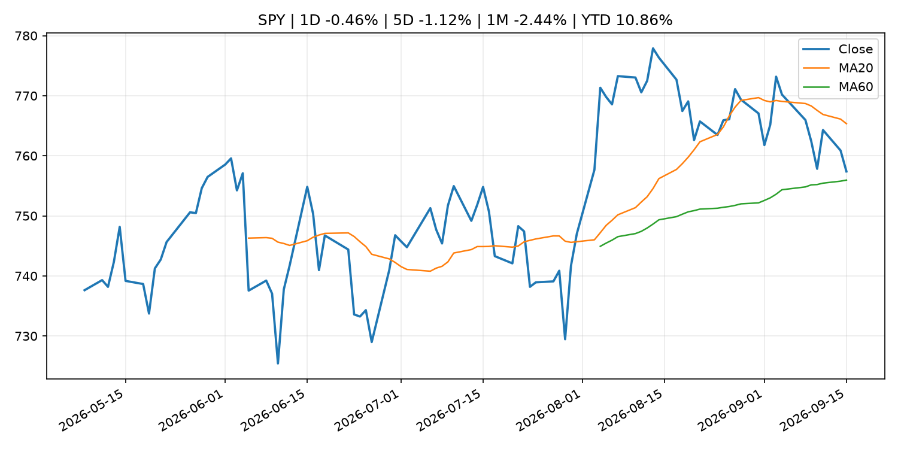
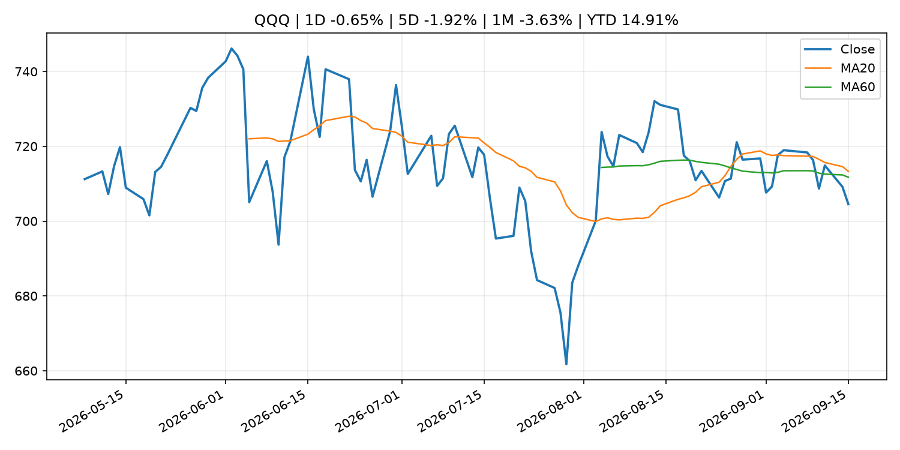
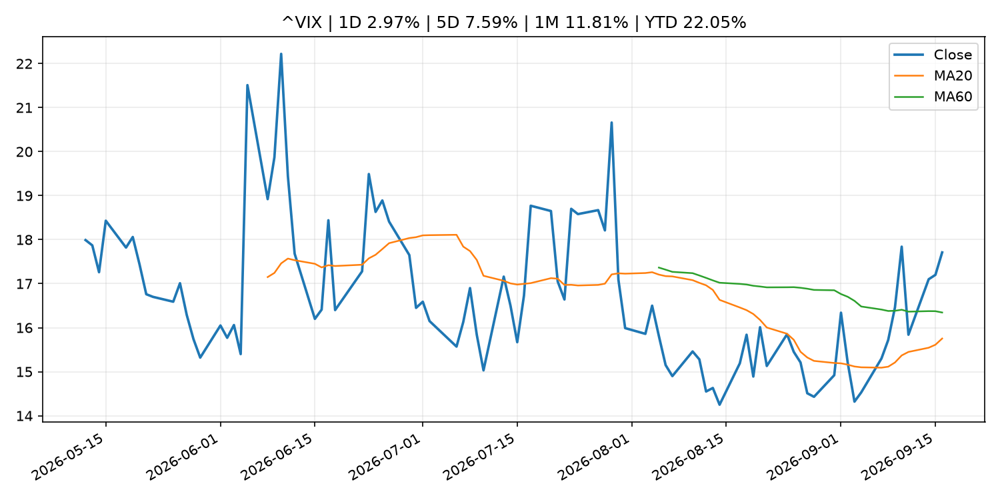
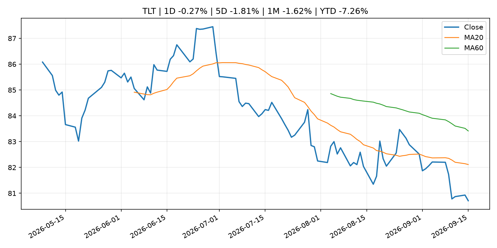
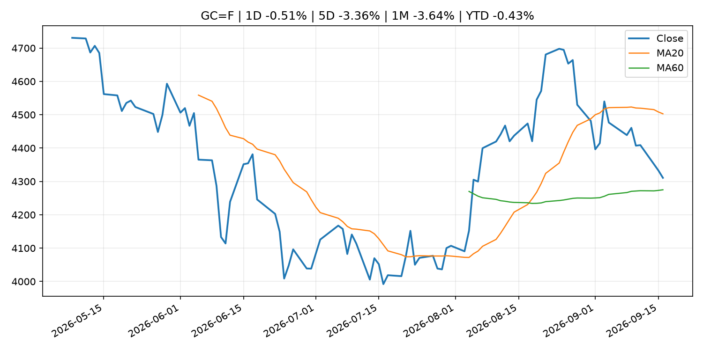
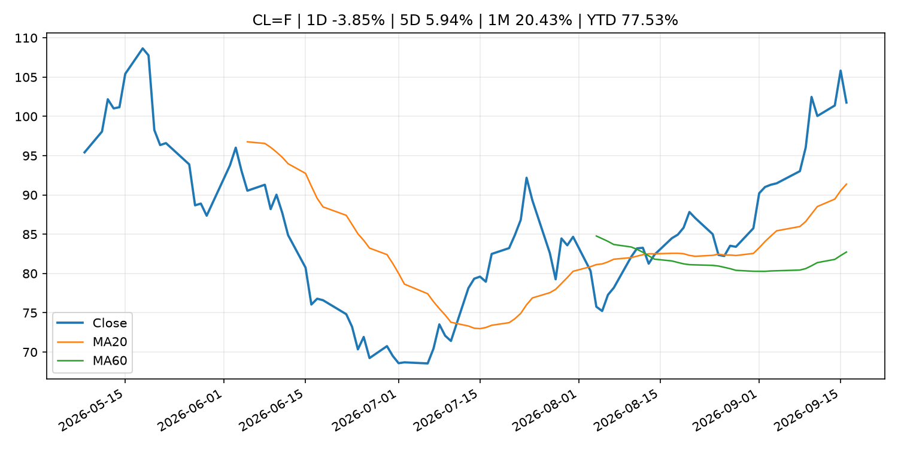
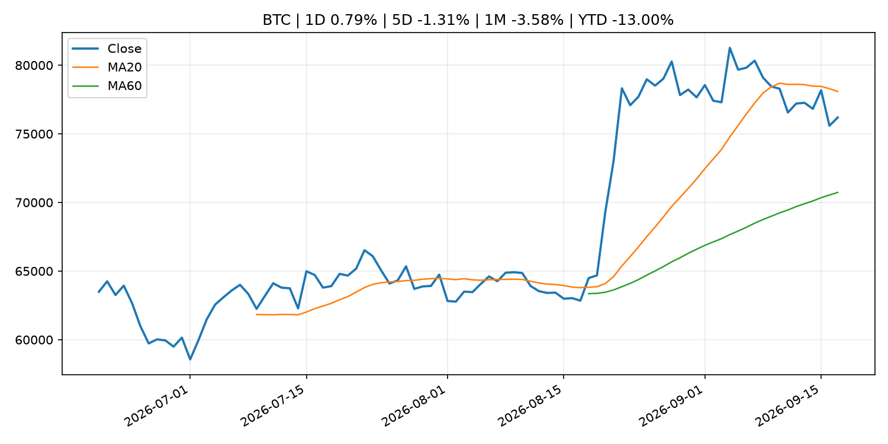
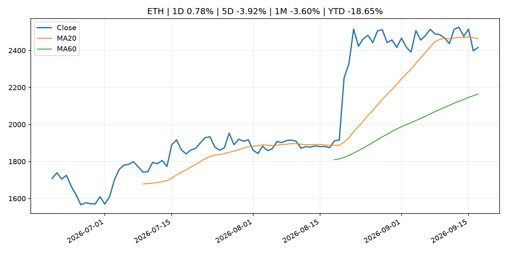
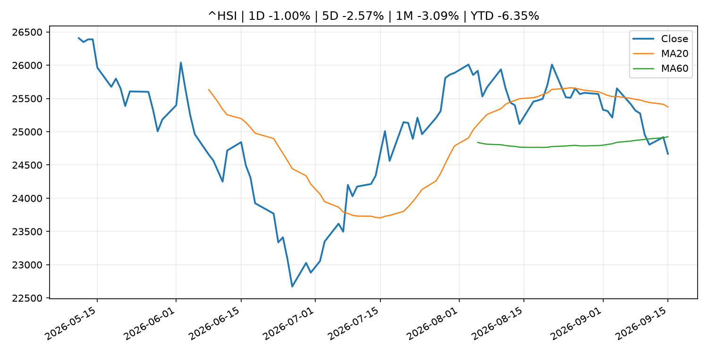

# Global Macro Morning Briefing - 2026-09-17

> Not financial advice / 非投资建议。

## 0. 今日总览
- 市场状态：dollar_liquidity_tightening。美元走强并压制风险资产，市场可能在交易美元流动性收紧。
- 今日三大主线：
  1. central_bank_decision: Fed rate hike fails to calm troubled markets as Dow falls 600 points. Expect more sharp swings in stocks and bonds.
  2. central_bank_decision: Here are five key takeaways from Wednesday's Fed rate hike
  3. central_bank_decision: Fed approves interest rate hike, signals one more to come this year
- 一句话结论：今日晨报重点关注：央行决策会重定价利率、汇率、久期资产和风险资产。；央行决策会重定价利率、汇率、久期资产和风险资产。。跨资产方面，SPY 1D -0.46%；QQQ 1D -0.65%；^VIX 1D 2.97%；TLT 1D -0.27%；GC=F 1D -0.51%；CL=F 1D -3.85%；BTC 1D 0.79%；ETH 1D 0.78%；美元走强并压制风险资产，市场可能在交易美元流动性收紧。政策、通胀、利率、美元、美债、能源和加密监管仍是主要观察线索。所有结论仅基于公开数据与短摘要整理，不构成投资建议。

## 1. 隔夜跨资产市场
- 美股：SPY 1D -0.46%，QQQ 1D -0.65%，整体趋势需结合 VIX 和利率确认。
- 美债/美元：TLT 1D -0.27%，美元指数 1D 0.61%，是判断折现率压力的核心线索。
- 黄金/原油：黄金 1D -0.51%，原油 1D -3.85%，用于观察避险、通胀和地缘风险。
- 加密：BTC 1D 0.79%，ETH 1D 0.78%，关注是否独立于纳指走出加密自身行情。
- 港股/A股：恒生 1D -1.00%，沪深300/上证 1D n/a，重点看中国政策预期与人民币线索。
- 风险观察：关注离岸美元、亚洲货币和新兴市场资产反应。

### US_EQUITY

| symbol | latest close | 1D | 5D | 1M | YTD | trend |
|---|---:|---:|---:|---:|---:|---|
| SPY | 757.39 | -0.46% | -1.12% | -2.44% | 10.86% | range_bound |
| QQQ | 704.54 | -0.65% | -1.92% | -3.63% | 14.91% | range_bound |
| DIA | 521.23 | -0.62% | -1.29% | -2.90% | 7.77% | range_bound |
| IWM | 285.14 | -0.96% | -3.23% | -6.54% | 14.62% | strong_downtrend |
| VTI | 372.84 | -0.49% | -1.26% | -2.87% | 10.86% | range_bound |

### US_MACRO_MARKET

| symbol | latest close | 1D | 5D | 1M | YTD | trend |
|---|---:|---:|---:|---:|---:|---|
| ^VIX | 17.71 | 2.97% | 7.59% | 11.81% | 22.05% | range_bound |
| DX-Y.NYB | 100.26 | 0.61% | 1.51% | 0.62% | 1.87% | range_bound |
| TLT | 80.71 | -0.27% | -1.81% | -1.62% | -7.26% | downtrend |
| IEF | 90.82 | -0.12% | -1.45% | -2.39% | -5.47% | downtrend |

### COMMODITIES

| symbol | latest close | 1D | 5D | 1M | YTD | trend |
|---|---:|---:|---:|---:|---:|---|
| GC=F | 4,310.80 | -0.51% | -3.36% | -3.64% | -0.43% | range_bound |
| SI=F | 63.70 | 0.73% | -6.24% | -3.66% | -9.72% | range_bound |
| CL=F | 101.76 | -3.85% | 5.94% | 20.43% | 77.53% | strong_uptrend |
| BZ=F | 105.20 | -3.26% | 3.94% | 15.77% | 73.17% | strong_uptrend |
| NG=F | 2.89 | -0.92% | 2.48% | 7.51% | -20.07% | range_bound |
| HG=F | 6.46 | 1.44% | -5.05% | -2.18% | 14.54% | range_bound |

### HK_MARKET

| symbol | latest close | 1D | 5D | 1M | YTD | trend |
|---|---:|---:|---:|---:|---:|---|
| ^HSI | 24,667.24 | -1.00% | -2.57% | -3.09% | -6.35% | range_bound |
| 0700.HK | 433.40 | -1.23% | -0.14% | -2.03% | -30.43% | downtrend |
| 9988.HK | 106.20 | -0.93% | -3.28% | -16.18% | -28.72% | strong_downtrend |
| 3690.HK | 74.45 | -0.40% | -4.31% | -12.97% | -28.82% | strong_downtrend |
| 1810.HK | 26.18 | -1.21% | -0.76% | 0.00% | -35.00% | range_bound |
| 1211.HK | 79.20 | 0.19% | -3.18% | -12.00% | -19.80% | strong_downtrend |

### CRYPTO

| symbol | latest close | 1D | 5D | 1M | YTD | trend |
|---|---:|---:|---:|---:|---:|---|
| BTC | 76,190.67 | 0.79% | -1.31% | -3.58% | -13.00% | range_bound |
| ETH | 2,416.20 | 0.78% | -3.92% | -3.60% | -18.65% | range_bound |
| SOLANA | 98.50 | 1.68% | -3.81% | -3.48% | -20.90% | range_bound |
| BINANCECOIN | 725.34 | 1.91% | -0.16% | 2.52% | -15.92% | uptrend |
| RIPPLE | 1.30 | 1.17% | -4.24% | -8.73% | -29.46% | range_bound |

## 2. 今日最重要的 10 条新闻
### 1. Fed rate hike fails to calm troubled markets as Dow falls 600 points. Expect more sharp swings in stocks and bonds.
- 来源：MarketWatch Top Stories
- 时间：2026-09-16T21:40:00+00:00
- 地区：US
- 事件类型：central_bank_decision
- 重要性层级：Tier 1
- 一句话摘要：Fed Chair Kevin Warsh has sent investors a message: When it comes to tamping down inflation, he means business.
- 为什么重要：央行决策会重定价利率、汇率、久期资产和风险资产。
- 可能影响：主要影响 DXY，方向为 positive，强度 high；通胀压力可能推高政策利率预期并支撑美元。
  - 资产：DXY
    方向：positive
    强度：high
    原因：通胀压力可能推高政策利率预期并支撑美元。
  - 资产：TLT
    方向：negative
    强度：high
    原因：通胀上行通常推升收益率、压低长债价格。
  - 资产：QQQ
    方向：negative
    强度：high
    原因：更高利率对成长股估值折现率不利。
  - 资产：SPY
    方向：mixed
    强度：medium
    原因：名义增长可能支撑收入，但更高利率压制估值。
  - 资产：GC=F
    方向：mixed
    强度：medium
    原因：通胀对黄金是支撑，但实际利率上行会形成压力。
  - 资产：BTC
    方向：negative
    强度：high
    原因：流动性收紧通常压制高 beta 加密资产。
- 原文链接：[https://www.marketwatch.com/story/fed-rate-hike-fails-to-calm-troubled-markets-as-dow-falls-600-points-expect-more-sharp-swings-in-stocks-and-bonds-5ffb55fe?mod=mw_rss_topstories](https://www.marketwatch.com/story/fed-rate-hike-fails-to-calm-troubled-markets-as-dow-falls-600-points-expect-more-sharp-swings-in-stocks-and-bonds-5ffb55fe?mod=mw_rss_topstories)

### 2. Here are five key takeaways from Wednesday's Fed rate hike
- 来源：CNBC Economy
- 时间：2026-09-16T21:23:51+00:00
- 地区：US
- 事件类型：central_bank_decision
- 重要性层级：Tier 1
- 一句话摘要：The Fed on Wednesday delivered a much-expected interest rate hike.
- 为什么重要：央行决策会重定价利率、汇率、久期资产和风险资产。
- 可能影响：主要影响 QQQ，方向为 negative，强度 high；鹰派政策提高折现率，压制成长股估值。
  - 资产：QQQ
    方向：negative
    强度：high
    原因：鹰派政策提高折现率，压制成长股估值。
  - 资产：SPY
    方向：negative
    强度：medium
    原因：更紧政策通常削弱风险偏好。
  - 资产：TLT
    方向：negative
    强度：high
    原因：利率上行通常压低长债价格。
  - 资产：DXY
    方向：positive
    强度：high
    原因：更高利率预期通常支撑美元。
  - 资产：BTC
    方向：negative
    强度：high
    原因：流动性收紧通常压制高 beta 加密资产。
- 原文链接：[https://www.cnbc.com/2026/09/16/here-are-five-key-takeaways-from-wednesdays-fed-rate-hike.html](https://www.cnbc.com/2026/09/16/here-are-five-key-takeaways-from-wednesdays-fed-rate-hike.html)

### 3. Fed approves interest rate hike, signals one more to come this year
- 来源：CNBC Economy
- 时间：2026-09-16T21:07:51+00:00
- 地区：US
- 事件类型：central_bank_decision
- 重要性层级：Tier 1
- 一句话摘要：The Federal Reserve on Wednesday approved its first interest rate hike since 2023 and indicated another to come.
- 为什么重要：央行决策会重定价利率、汇率、久期资产和风险资产。
- 可能影响：主要影响 QQQ，方向为 negative，强度 high；鹰派政策提高折现率，压制成长股估值。
  - 资产：QQQ
    方向：negative
    强度：high
    原因：鹰派政策提高折现率，压制成长股估值。
  - 资产：SPY
    方向：negative
    强度：medium
    原因：更紧政策通常削弱风险偏好。
  - 资产：TLT
    方向：negative
    强度：high
    原因：利率上行通常压低长债价格。
  - 资产：DXY
    方向：positive
    强度：high
    原因：更高利率预期通常支撑美元。
  - 资产：BTC
    方向：negative
    强度：high
    原因：流动性收紧通常压制高 beta 加密资产。
- 原文链接：[https://www.cnbc.com/2026/09/16/fed-rate-decision-september-2026.html](https://www.cnbc.com/2026/09/16/fed-rate-decision-september-2026.html)

### 4. As Fed rolls out its first interest-rate hike in 3 years, market braces for more increases
- 来源：MarketWatch Top Stories
- 时间：2026-09-16T22:25:00+00:00
- 地区：US
- 事件类型：central_bank_decision
- 重要性层级：Tier 1
- 一句话摘要：The Fed’s policy-making committee was unanimous in its decision to hike, but forward guidance was split.
- 为什么重要：央行决策会重定价利率、汇率、久期资产和风险资产。
- 可能影响：主要影响 QQQ，方向为 negative，强度 high；鹰派政策提高折现率，压制成长股估值。
  - 资产：QQQ
    方向：negative
    强度：high
    原因：鹰派政策提高折现率，压制成长股估值。
  - 资产：SPY
    方向：negative
    强度：medium
    原因：更紧政策通常削弱风险偏好。
  - 资产：TLT
    方向：negative
    强度：high
    原因：利率上行通常压低长债价格。
  - 资产：DXY
    方向：positive
    强度：high
    原因：更高利率预期通常支撑美元。
  - 资产：BTC
    方向：negative
    强度：high
    原因：流动性收紧通常压制高 beta 加密资产。
- 原文链接：[https://www.marketwatch.com/story/warshs-fed-rolls-out-first-interest-rate-hike-in-3-years-with-one-more-increase-expected-cde3060d?mod=mw_rss_topstories](https://www.marketwatch.com/story/warshs-fed-rolls-out-first-interest-rate-hike-in-3-years-with-one-more-increase-expected-cde3060d?mod=mw_rss_topstories)

### 5. My rental property is paid off, but I need cash. Is this a bad time to take out a $50,000 HELOC?
- 来源：MarketWatch Top Stories
- 时间：2026-09-16T22:16:00+00:00
- 地区：US
- 事件类型：central_bank_decision
- 重要性层级：Tier 1
- 一句话摘要：The Federal Reserve announced a quarter-percentage-point interest-rate hike Wednesday, to a range of 3.75%-4.0%.
- 为什么重要：央行决策会重定价利率、汇率、久期资产和风险资产。
- 可能影响：主要影响 QQQ，方向为 negative，强度 high；鹰派政策提高折现率，压制成长股估值。
  - 资产：QQQ
    方向：negative
    强度：high
    原因：鹰派政策提高折现率，压制成长股估值。
  - 资产：SPY
    方向：negative
    强度：medium
    原因：更紧政策通常削弱风险偏好。
  - 资产：TLT
    方向：negative
    强度：high
    原因：利率上行通常压低长债价格。
  - 资产：DXY
    方向：positive
    强度：high
    原因：更高利率预期通常支撑美元。
  - 资产：BTC
    方向：negative
    强度：high
    原因：流动性收紧通常压制高 beta 加密资产。
- 原文链接：[https://www.marketwatch.com/story/my-rental-property-is-paid-off-but-i-need-cash-is-this-a-bad-time-to-take-out-a-50-000-heloc-d094bbc5?mod=mw_rss_topstories](https://www.marketwatch.com/story/my-rental-property-is-paid-off-but-i-need-cash-is-this-a-bad-time-to-take-out-a-50-000-heloc-d094bbc5?mod=mw_rss_topstories)

### 6. Live updates: Bitcoin steady as stocks slide following Fed rate hike, Warsh press conference
- 来源：CoinDesk
- 时间：2026-09-16T10:37:46+00:00
- 地区：global
- 事件类型：central_bank_decision
- 重要性层级：Tier 1
- 一句话摘要：Live updates: Bitcoin steady as stocks slide following Fed rate hike, Warsh press conference
- 为什么重要：央行决策会重定价利率、汇率、久期资产和风险资产。
- 可能影响：主要影响 QQQ，方向为 negative，强度 high；鹰派政策提高折现率，压制成长股估值。
  - 资产：QQQ
    方向：negative
    强度：high
    原因：鹰派政策提高折现率，压制成长股估值。
  - 资产：SPY
    方向：negative
    强度：medium
    原因：更紧政策通常削弱风险偏好。
  - 资产：TLT
    方向：negative
    强度：high
    原因：利率上行通常压低长债价格。
  - 资产：DXY
    方向：positive
    强度：high
    原因：更高利率预期通常支撑美元。
  - 资产：BTC
    方向：negative
    强度：high
    原因：流动性收紧通常压制高 beta 加密资产。
- 原文链接：[https://www.coindesk.com/business/2026/09/16/live-updates-zcash-climbs-6-as-majors-slide-ahead-of-fed-rate-decision](https://www.coindesk.com/business/2026/09/16/live-updates-zcash-climbs-6-as-majors-slide-ahead-of-fed-rate-decision)

### 7. Federal Reserve issues FOMC statement
- 来源：Federal Reserve Press Releases
- 时间：2026-09-16T18:00:00+00:00
- 地区：US
- 事件类型：central_bank_decision
- 重要性层级：Tier 1
- 一句话摘要：Federal Reserve issues FOMC statement
- 为什么重要：央行决策会重定价利率、汇率、久期资产和风险资产。
- 可能影响：可能影响利率、汇率、风险资产或大宗商品预期，但当前公开信息不足以判断明确方向。
  - 资产：暂无明确资产映射
  - 方向：unknown
  - 强度：low
  - 原因：公开信息不足以判断方向。
- 原文链接：[https://www.federalreserve.gov/newsevents/pressreleases/monetary20260916a.htm](https://www.federalreserve.gov/newsevents/pressreleases/monetary20260916a.htm)

### 8. Federal Reserve Board and Federal Open Market Committee release economic projections from the September 15-16 FOMC meeting
- 来源：Federal Reserve Press Releases
- 时间：2026-09-16T18:00:00+00:00
- 地区：US
- 事件类型：central_bank_decision
- 重要性层级：Tier 1
- 一句话摘要：Federal Reserve Board and Federal Open Market Committee release economic projections from the September 15-16 FOMC meeting
- 为什么重要：央行决策会重定价利率、汇率、久期资产和风险资产。
- 可能影响：可能影响利率、汇率、风险资产或大宗商品预期，但当前公开信息不足以判断明确方向。
  - 资产：暂无明确资产映射
  - 方向：unknown
  - 强度：low
  - 原因：公开信息不足以判断方向。
- 原文链接：[https://www.federalreserve.gov/newsevents/pressreleases/monetary20260916b.htm](https://www.federalreserve.gov/newsevents/pressreleases/monetary20260916b.htm)

### 9. SEC Proposes Rescission of Shareholder Proposal Rule and Reforms to Proxy Solicitation Process
- 来源：SEC Press Releases
- 时间：2026-09-16T10:00:00-04:00
- 地区：US
- 事件类型：regulation
- 重要性层级：Tier 2
- 一句话摘要：The Securities and Exchange Commission today proposed to rescind Rule 14a-8 under the Securities Exchange Act of 1934, which exceeds the scope of the Commission's statutory authority and intrudes into matters of state law.The Commission outlined…
- 为什么重要：监管变化会改变行业盈利预期和资产风险溢价。
- 可能影响：主要影响 BTC，方向为 mixed，强度 high；加密监管或 ETF 进展会改变 BTC 的资金流和风险溢价。
  - 资产：BTC
    方向：mixed
    强度：high
    原因：加密监管或 ETF 进展会改变 BTC 的资金流和风险溢价。
  - 资产：ETH
    方向：mixed
    强度：high
    原因：监管框架会影响 ETH 产品化和机构参与度。
  - 资产：COIN
    方向：mixed
    强度：medium
    原因：监管清晰度和执法风险会影响交易平台估值。
  - 资产：crypto market
    方向：mixed
    强度：high
    原因：信息影响整个加密市场结构，但方向取决于细节。
- 原文链接：[https://www.sec.gov/newsroom/press-releases/2026-89-sec-proposes-rescission-shareholder-proposal-rule-reforms-proxy-solicitation-process](https://www.sec.gov/newsroom/press-releases/2026-89-sec-proposes-rescission-shareholder-proposal-rule-reforms-proxy-solicitation-process)

### 10. ‘There might be a silver lining’: My friend’s wife died at 60 after a high-earning career. Can he claim her Social Security?
- 来源：MarketWatch Top Stories
- 时间：2026-09-16T22:15:00+00:00
- 地区：US
- 事件类型：other
- 重要性层级：Tier 3
- 一句话摘要：“They had been married for over 30 years when she passed.”
- 为什么重要：这条信息暂未匹配到重大宏观、政策或市场事件，更适合作为背景跟踪。
- 可能影响：更偏背景信息，短期市场影响可能有限。
  - 资产：暂无明确资产映射
  - 方向：unknown
  - 强度：low
  - 原因：公开信息不足以判断方向。
- 原文链接：[https://www.marketwatch.com/story/there-might-be-a-silver-lining-my-friends-wife-died-at-60-after-a-high-earning-career-can-he-claim-her-social-security-eb95210a?mod=mw_rss_topstories](https://www.marketwatch.com/story/there-might-be-a-silver-lining-my-friends-wife-died-at-60-after-a-high-earning-career-can-he-claim-her-social-security-eb95210a?mod=mw_rss_topstories)

## 3. 政策与央行观察
### 1. Fed rate hike fails to calm troubled markets as Dow falls 600 points. Expect more sharp swings in stocks and bonds.
- 来源：MarketWatch Top Stories
- 时间：2026-09-16T21:40:00+00:00
- 地区：US
- 事件类型：central_bank_decision
- 重要性层级：Tier 1
- 一句话摘要：Fed Chair Kevin Warsh has sent investors a message: When it comes to tamping down inflation, he means business.
- 为什么重要：央行决策会重定价利率、汇率、久期资产和风险资产。
- 可能影响：主要影响 DXY，方向为 positive，强度 high；通胀压力可能推高政策利率预期并支撑美元。
  - 资产：DXY
    方向：positive
    强度：high
    原因：通胀压力可能推高政策利率预期并支撑美元。
  - 资产：TLT
    方向：negative
    强度：high
    原因：通胀上行通常推升收益率、压低长债价格。
  - 资产：QQQ
    方向：negative
    强度：high
    原因：更高利率对成长股估值折现率不利。
  - 资产：SPY
    方向：mixed
    强度：medium
    原因：名义增长可能支撑收入，但更高利率压制估值。
  - 资产：GC=F
    方向：mixed
    强度：medium
    原因：通胀对黄金是支撑，但实际利率上行会形成压力。
  - 资产：BTC
    方向：negative
    强度：high
    原因：流动性收紧通常压制高 beta 加密资产。
- 原文链接：[https://www.marketwatch.com/story/fed-rate-hike-fails-to-calm-troubled-markets-as-dow-falls-600-points-expect-more-sharp-swings-in-stocks-and-bonds-5ffb55fe?mod=mw_rss_topstories](https://www.marketwatch.com/story/fed-rate-hike-fails-to-calm-troubled-markets-as-dow-falls-600-points-expect-more-sharp-swings-in-stocks-and-bonds-5ffb55fe?mod=mw_rss_topstories)

### 2. Here are five key takeaways from Wednesday's Fed rate hike
- 来源：CNBC Economy
- 时间：2026-09-16T21:23:51+00:00
- 地区：US
- 事件类型：central_bank_decision
- 重要性层级：Tier 1
- 一句话摘要：The Fed on Wednesday delivered a much-expected interest rate hike.
- 为什么重要：央行决策会重定价利率、汇率、久期资产和风险资产。
- 可能影响：主要影响 QQQ，方向为 negative，强度 high；鹰派政策提高折现率，压制成长股估值。
  - 资产：QQQ
    方向：negative
    强度：high
    原因：鹰派政策提高折现率，压制成长股估值。
  - 资产：SPY
    方向：negative
    强度：medium
    原因：更紧政策通常削弱风险偏好。
  - 资产：TLT
    方向：negative
    强度：high
    原因：利率上行通常压低长债价格。
  - 资产：DXY
    方向：positive
    强度：high
    原因：更高利率预期通常支撑美元。
  - 资产：BTC
    方向：negative
    强度：high
    原因：流动性收紧通常压制高 beta 加密资产。
- 原文链接：[https://www.cnbc.com/2026/09/16/here-are-five-key-takeaways-from-wednesdays-fed-rate-hike.html](https://www.cnbc.com/2026/09/16/here-are-five-key-takeaways-from-wednesdays-fed-rate-hike.html)

### 3. Fed approves interest rate hike, signals one more to come this year
- 来源：CNBC Economy
- 时间：2026-09-16T21:07:51+00:00
- 地区：US
- 事件类型：central_bank_decision
- 重要性层级：Tier 1
- 一句话摘要：The Federal Reserve on Wednesday approved its first interest rate hike since 2023 and indicated another to come.
- 为什么重要：央行决策会重定价利率、汇率、久期资产和风险资产。
- 可能影响：主要影响 QQQ，方向为 negative，强度 high；鹰派政策提高折现率，压制成长股估值。
  - 资产：QQQ
    方向：negative
    强度：high
    原因：鹰派政策提高折现率，压制成长股估值。
  - 资产：SPY
    方向：negative
    强度：medium
    原因：更紧政策通常削弱风险偏好。
  - 资产：TLT
    方向：negative
    强度：high
    原因：利率上行通常压低长债价格。
  - 资产：DXY
    方向：positive
    强度：high
    原因：更高利率预期通常支撑美元。
  - 资产：BTC
    方向：negative
    强度：high
    原因：流动性收紧通常压制高 beta 加密资产。
- 原文链接：[https://www.cnbc.com/2026/09/16/fed-rate-decision-september-2026.html](https://www.cnbc.com/2026/09/16/fed-rate-decision-september-2026.html)

### 4. As Fed rolls out its first interest-rate hike in 3 years, market braces for more increases
- 来源：MarketWatch Top Stories
- 时间：2026-09-16T22:25:00+00:00
- 地区：US
- 事件类型：central_bank_decision
- 重要性层级：Tier 1
- 一句话摘要：The Fed’s policy-making committee was unanimous in its decision to hike, but forward guidance was split.
- 为什么重要：央行决策会重定价利率、汇率、久期资产和风险资产。
- 可能影响：主要影响 QQQ，方向为 negative，强度 high；鹰派政策提高折现率，压制成长股估值。
  - 资产：QQQ
    方向：negative
    强度：high
    原因：鹰派政策提高折现率，压制成长股估值。
  - 资产：SPY
    方向：negative
    强度：medium
    原因：更紧政策通常削弱风险偏好。
  - 资产：TLT
    方向：negative
    强度：high
    原因：利率上行通常压低长债价格。
  - 资产：DXY
    方向：positive
    强度：high
    原因：更高利率预期通常支撑美元。
  - 资产：BTC
    方向：negative
    强度：high
    原因：流动性收紧通常压制高 beta 加密资产。
- 原文链接：[https://www.marketwatch.com/story/warshs-fed-rolls-out-first-interest-rate-hike-in-3-years-with-one-more-increase-expected-cde3060d?mod=mw_rss_topstories](https://www.marketwatch.com/story/warshs-fed-rolls-out-first-interest-rate-hike-in-3-years-with-one-more-increase-expected-cde3060d?mod=mw_rss_topstories)

### 5. My rental property is paid off, but I need cash. Is this a bad time to take out a $50,000 HELOC?
- 来源：MarketWatch Top Stories
- 时间：2026-09-16T22:16:00+00:00
- 地区：US
- 事件类型：central_bank_decision
- 重要性层级：Tier 1
- 一句话摘要：The Federal Reserve announced a quarter-percentage-point interest-rate hike Wednesday, to a range of 3.75%-4.0%.
- 为什么重要：央行决策会重定价利率、汇率、久期资产和风险资产。
- 可能影响：主要影响 QQQ，方向为 negative，强度 high；鹰派政策提高折现率，压制成长股估值。
  - 资产：QQQ
    方向：negative
    强度：high
    原因：鹰派政策提高折现率，压制成长股估值。
  - 资产：SPY
    方向：negative
    强度：medium
    原因：更紧政策通常削弱风险偏好。
  - 资产：TLT
    方向：negative
    强度：high
    原因：利率上行通常压低长债价格。
  - 资产：DXY
    方向：positive
    强度：high
    原因：更高利率预期通常支撑美元。
  - 资产：BTC
    方向：negative
    强度：high
    原因：流动性收紧通常压制高 beta 加密资产。
- 原文链接：[https://www.marketwatch.com/story/my-rental-property-is-paid-off-but-i-need-cash-is-this-a-bad-time-to-take-out-a-50-000-heloc-d094bbc5?mod=mw_rss_topstories](https://www.marketwatch.com/story/my-rental-property-is-paid-off-but-i-need-cash-is-this-a-bad-time-to-take-out-a-50-000-heloc-d094bbc5?mod=mw_rss_topstories)

### 6. Live updates: Bitcoin steady as stocks slide following Fed rate hike, Warsh press conference
- 来源：CoinDesk
- 时间：2026-09-16T10:37:46+00:00
- 地区：global
- 事件类型：central_bank_decision
- 重要性层级：Tier 1
- 一句话摘要：Live updates: Bitcoin steady as stocks slide following Fed rate hike, Warsh press conference
- 为什么重要：央行决策会重定价利率、汇率、久期资产和风险资产。
- 可能影响：主要影响 QQQ，方向为 negative，强度 high；鹰派政策提高折现率，压制成长股估值。
  - 资产：QQQ
    方向：negative
    强度：high
    原因：鹰派政策提高折现率，压制成长股估值。
  - 资产：SPY
    方向：negative
    强度：medium
    原因：更紧政策通常削弱风险偏好。
  - 资产：TLT
    方向：negative
    强度：high
    原因：利率上行通常压低长债价格。
  - 资产：DXY
    方向：positive
    强度：high
    原因：更高利率预期通常支撑美元。
  - 资产：BTC
    方向：negative
    强度：high
    原因：流动性收紧通常压制高 beta 加密资产。
- 原文链接：[https://www.coindesk.com/business/2026/09/16/live-updates-zcash-climbs-6-as-majors-slide-ahead-of-fed-rate-decision](https://www.coindesk.com/business/2026/09/16/live-updates-zcash-climbs-6-as-majors-slide-ahead-of-fed-rate-decision)

### 7. Federal Reserve issues FOMC statement
- 来源：Federal Reserve Press Releases
- 时间：2026-09-16T18:00:00+00:00
- 地区：US
- 事件类型：central_bank_decision
- 重要性层级：Tier 1
- 一句话摘要：Federal Reserve issues FOMC statement
- 为什么重要：央行决策会重定价利率、汇率、久期资产和风险资产。
- 可能影响：可能影响利率、汇率、风险资产或大宗商品预期，但当前公开信息不足以判断明确方向。
  - 资产：暂无明确资产映射
  - 方向：unknown
  - 强度：low
  - 原因：公开信息不足以判断方向。
- 原文链接：[https://www.federalreserve.gov/newsevents/pressreleases/monetary20260916a.htm](https://www.federalreserve.gov/newsevents/pressreleases/monetary20260916a.htm)

### 8. Federal Reserve Board and Federal Open Market Committee release economic projections from the September 15-16 FOMC meeting
- 来源：Federal Reserve Press Releases
- 时间：2026-09-16T18:00:00+00:00
- 地区：US
- 事件类型：central_bank_decision
- 重要性层级：Tier 1
- 一句话摘要：Federal Reserve Board and Federal Open Market Committee release economic projections from the September 15-16 FOMC meeting
- 为什么重要：央行决策会重定价利率、汇率、久期资产和风险资产。
- 可能影响：可能影响利率、汇率、风险资产或大宗商品预期，但当前公开信息不足以判断明确方向。
  - 资产：暂无明确资产映射
  - 方向：unknown
  - 强度：low
  - 原因：公开信息不足以判断方向。
- 原文链接：[https://www.federalreserve.gov/newsevents/pressreleases/monetary20260916b.htm](https://www.federalreserve.gov/newsevents/pressreleases/monetary20260916b.htm)

### 9. SEC Proposes Rescission of Shareholder Proposal Rule and Reforms to Proxy Solicitation Process
- 来源：SEC Press Releases
- 时间：2026-09-16T10:00:00-04:00
- 地区：US
- 事件类型：regulation
- 重要性层级：Tier 2
- 一句话摘要：The Securities and Exchange Commission today proposed to rescind Rule 14a-8 under the Securities Exchange Act of 1934, which exceeds the scope of the Commission's statutory authority and intrudes into matters of state law.The Commission outlined…
- 为什么重要：监管变化会改变行业盈利预期和资产风险溢价。
- 可能影响：主要影响 BTC，方向为 mixed，强度 high；加密监管或 ETF 进展会改变 BTC 的资金流和风险溢价。
  - 资产：BTC
    方向：mixed
    强度：high
    原因：加密监管或 ETF 进展会改变 BTC 的资金流和风险溢价。
  - 资产：ETH
    方向：mixed
    强度：high
    原因：监管框架会影响 ETH 产品化和机构参与度。
  - 资产：COIN
    方向：mixed
    强度：medium
    原因：监管清晰度和执法风险会影响交易平台估值。
  - 资产：crypto market
    方向：mixed
    强度：high
    原因：信息影响整个加密市场结构，但方向取决于细节。
- 原文链接：[https://www.sec.gov/newsroom/press-releases/2026-89-sec-proposes-rescission-shareholder-proposal-rule-reforms-proxy-solicitation-process](https://www.sec.gov/newsroom/press-releases/2026-89-sec-proposes-rescission-shareholder-proposal-rule-reforms-proxy-solicitation-process)

## 4. 市场异动与图表
- SPY 下跌 -0.46%
- QQQ 下跌 -0.65%
- DXY 上涨 0.61%
- Gold 下跌 -0.51%
- Oil 下跌 -3.85%

### SPY

### QQQ

### ^VIX

### TLT

### GC=F

### CL=F

### BTC

### ETH

### ^HSI

## 5. 华尔街与机构公开观点
- 暂无可靠公开观点。

## 6. 今日重点关注
- 经济数据：经济数据：暂无可靠公开日历数据；如配置经济日历源后可自动填充。
- 央行讲话：央行讲话：暂无可靠公开日历数据；重点跟踪 Fed、ECB、BoJ、PBOC 官网 RSS。
- 财报：财报：暂无可靠数据。
- 政策事件：政策事件：暂无可靠数据。
- 风险提醒：风险提醒：关注数据源失败项、突发地缘风险、利率和美元的二阶反应。

## 7. 英文金融表达与宏观概念
- **inflation expectations**：通胀预期，指家庭、企业或市场对未来通胀的预估。 例句：Inflation expectations can shape wage bargaining and bond yields.
- **real yield**：实际收益率，名义利率扣除通胀预期后的收益率。 例句：Gold often reacts more to real yields than nominal yields.
- **terminal rate**：终端利率，市场预期本轮加息周期的最高政策利率。 例句：A higher terminal rate can pressure growth stocks.
- **risk-off**：避险模式，资金偏向美元、国债、黄金等防御资产。 例句：A geopolitical shock can push markets into risk-off mode.
- **market structure**：市场结构，指交易、托管、清算、ETF、监管等制度安排。 例句：Crypto market structure rules can affect institutional participation.
- **soft landing**：软着陆，指通胀回落而经济避免明显衰退。 例句：Markets often rally when data support a soft landing.

## 8. 背景材料
- [Flow of Funds Accounts (2nd Quarter 2026, Preliminary Figures)](http://www.boj.or.jp/en/statistics/sj/sj.htm)（Bank of Japan Announcements，routine_announcement）：Flow of Funds Accounts (2nd Quarter 2026, Preliminary Figures)
- [‘There might be a silver lining’: My friend’s wife died at 60 after a high-earning career. Can he claim her Social Security?](https://www.marketwatch.com/story/there-might-be-a-silver-lining-my-friends-wife-died-at-60-after-a-high-earning-career-can-he-claim-her-social-security-eb95210a?mod=mw_rss_topstories)（MarketWatch Top Stories，other）：“They had been married for over 30 years when she passed.”
- [Bitcoin Core 32 enters final testing with faster validation, fee changes and security fixes](https://www.coindesk.com/tech/2026/09/16/bitcoin-core-32-enters-final-testing-with-faster-validation-fee-changes-and-security-fixes)（CoinDesk，other）：Bitcoin Core 32 enters final testing with faster validation, fee changes and security fixes
- [Bitcoin loses touch with the Dollar Index, U.S. stocks ahead of the Fed](https://www.coindesk.com/daybook-us/2026/09/16/bitcoin-loses-touch-with-the-dollar-index-u-s-stocks-ahead-of-the-fed)（CoinDesk，other）：Bitcoin loses touch with the Dollar Index, U.S. stocks ahead of the Fed
- [Bitcoin traders brace for Fed hike, but a surprise hold could pose bigger risk](https://www.coindesk.com/markets/2026/09/15/bitcoin-traders-brace-for-fed-hike-but-a-surprise-hold-could-pose-bigger-risk)（CoinDesk，other）：Bitcoin traders brace for Fed hike, but a surprise hold could pose bigger risk
- [Two Prime makes onchain finance push with $10 million-backed bitcoin yield vault](https://www.coindesk.com/markets/2026/09/15/two-prime-makes-onchain-finance-push-with-usd10-million-backed-bitcoin-yield-vault)（CoinDesk，other）：Two Prime makes onchain finance push with $10 million-backed bitcoin yield vault
- [Bitcoin ETFs shed $450 million as Clarity Act fails](https://www.coindesk.com/markets/2026/09/16/bitcoin-etfs-shed-usd450-million-as-clarity-act-fails)（CoinDesk，other）：Bitcoin ETFs shed $450 million as Clarity Act fails
- [Bitcoin's Coinbase premium sinks to one-month low, here’s why](https://www.coindesk.com/markets/2026/09/16/bitcoin-s-coinbase-premium-sinks-to-one-month-low-here-s-why)（CoinDesk，other）：Bitcoin's Coinbase premium sinks to one-month low, here’s why
- [ECB wage tracker at 2.7% in H1 2027, pointing to a modest uptick in negotiated wage growth](https://www.ecb.europa.eu//press/pr/date/2026/html/ecb.pr260916~7bc58ebef4.en.html)（ECB Press Releases，other）：ECB wage tracker at 2.7% in H1 2027, pointing to a modest uptick in negotiated wage growth
- [BOJ Current Account Balances by Sector (Aug.)](http://www.boj.or.jp/en/statistics/boj/other/cabs/cabs.xlsx)（Bank of Japan Announcements，other）：BOJ Current Account Balances by Sector (Aug.)
- [Fed meeting is shaping up to be a nightmare for Warsh. Bitcoin might still shine](https://www.coindesk.com/markets/2026/09/16/fed-meeting-is-shaping-up-to-be-a-nightmare-for-warsh-bitcoin-might-still-shine)（CoinDesk，other）：Fed meeting is shaping up to be a nightmare for Warsh. Bitcoin might still shine
- [Zcash holders overwhelmingly back faster transactions and bitcoin-style halvings](https://www.coindesk.com/tech/2026/09/16/zcash-holders-overwhelmingly-back-faster-transactions-and-bitcoin-style-halvings)（CoinDesk，other）：Zcash holders overwhelmingly back faster transactions and bitcoin-style halvings
- [XRP sinks 10% as the Clarity Act fails and bitcoin slides toward $76,000](https://www.coindesk.com/markets/2026/09/16/xrp-sinks-10-as-the-clarity-act-fails-and-bitcoin-slides-toward-usd76-000)（CoinDesk，other）：XRP sinks 10% as the Clarity Act fails and bitcoin slides toward $76,000
- [Signing of the Third Bilateral Swap Arrangement between Japan and Malaysia](http://www.boj.or.jp/en/intl_finance/cooperate/coop260915a.pdf)（Bank of Japan Announcements，other）：Signing of the Third Bilateral Swap Arrangement between Japan and Malaysia

## 9. 数据源、失败项与免责声明
- 采集时间：2026-09-17T00:05:41
- 数据源：公开 RSS、Yahoo Finance、CoinGecko、AKShare、FRED、SEC data.sec.gov，以及用户自有 inputs/reports 文件。
- 合规说明：不绕过 WSJ、Bloomberg、FT、Reuters 等付费墙；对付费媒体只使用公开 RSS 标题、摘要、链接和发布时间。
- 免责声明：Not financial advice / 非投资建议。本项目仅供个人学习、研究和信息整理，不构成投资建议、交易建议或任何收益承诺。
- 失败或跳过的数据源：
  - crypto data failed coin=dogecoin
  - China market data failed symbol=上证指数: empty dataframe
  - China market data failed symbol=深证成指: empty dataframe
  - China market data failed symbol=创业板指: empty dataframe
  - China market data failed symbol=沪深300: empty dataframe
  - China market data failed symbol=中证500: empty dataframe
  - China market data failed symbol=科创50: empty dataframe
  - FRED_API_KEY not set; skipping FRED macro series
  - SEC failed cik=0000320193
  - SEC failed cik=0000789019
  - SEC failed cik=0001045810
  - SEC failed cik=0001318605
  - SEC failed cik=0001577552
