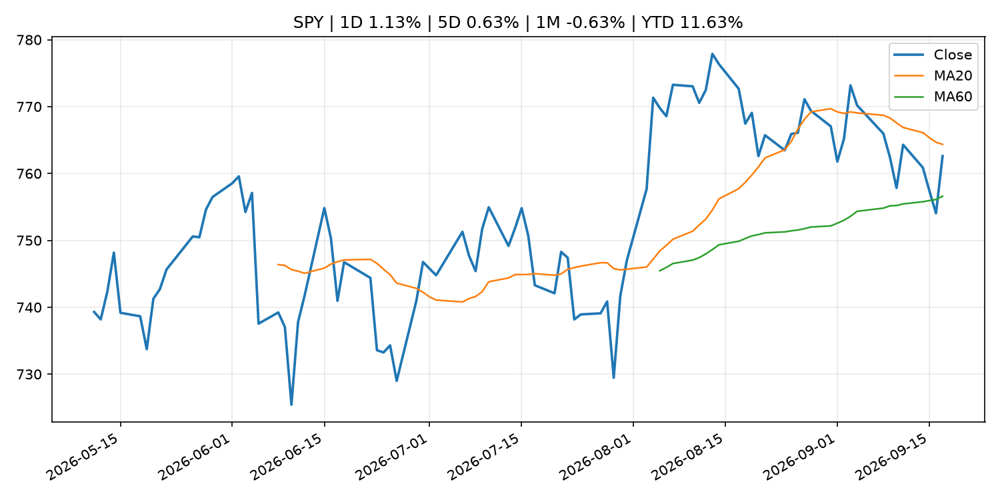
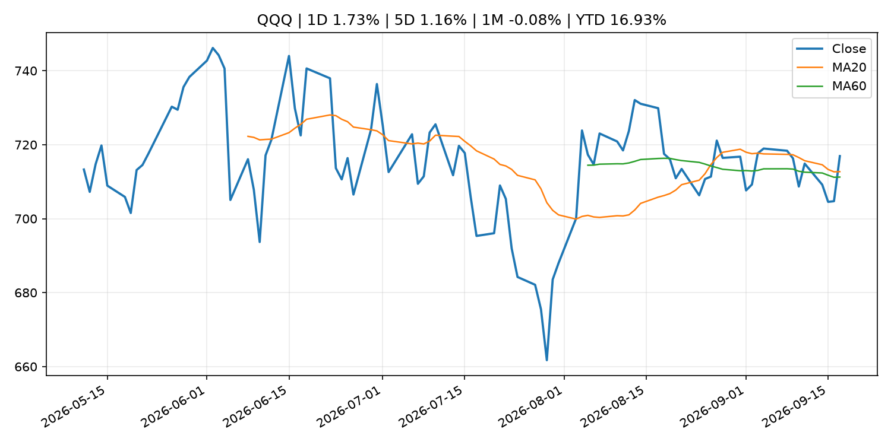
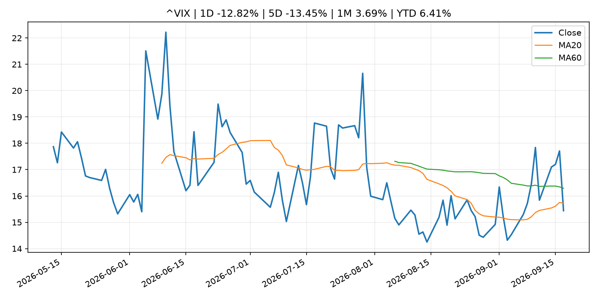
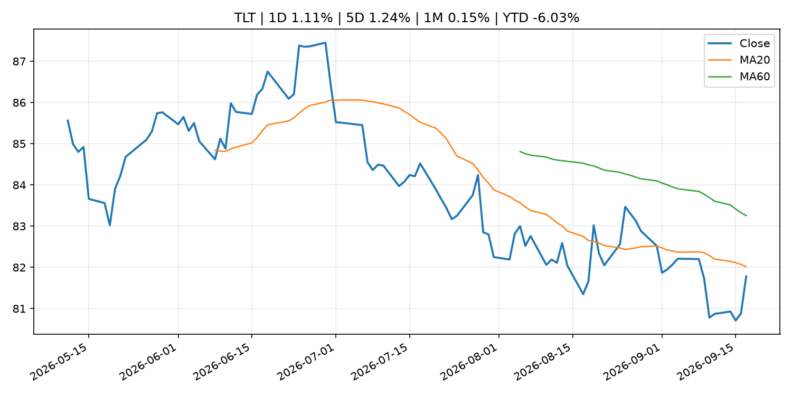
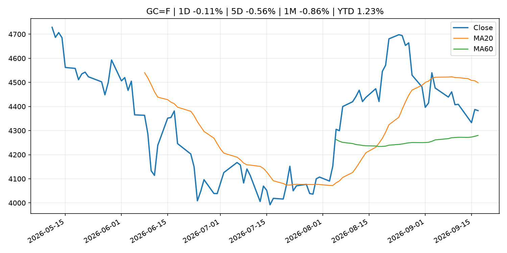
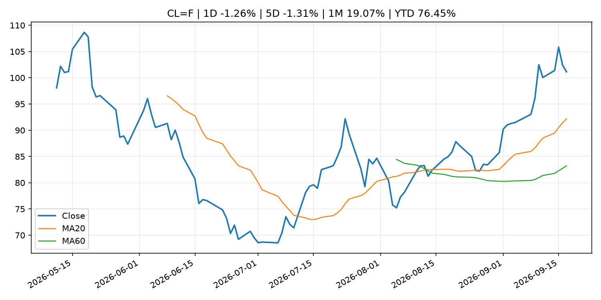
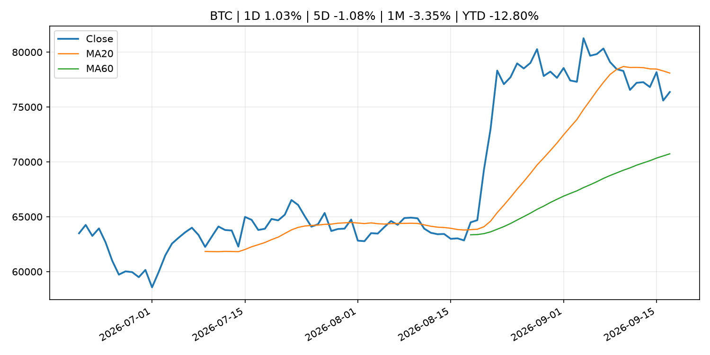
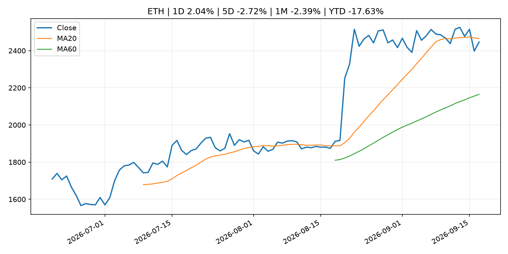
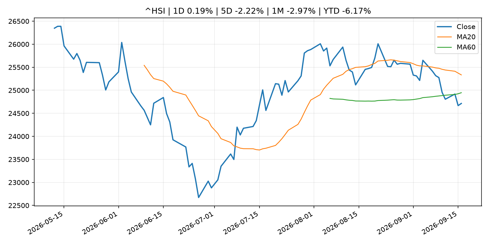

# Global Macro Morning Briefing - 2026-09-18

> Not financial advice / 非投资建议。

## 0. 今日总览
- 市场状态：risk_on。股指上涨、波动率或美元回落，市场更接近风险偏好改善。
- 今日三大主线：
  1. central_bank_decision: Live updates: Bitcoin edges higher as Nasdaq climbs 1.7% in wake of Fed rate hike
  2. central_bank_decision: Goldman pivots, now forecasts Fed rate hike in October
  3. central_bank_decision: Here are five key takeaways from Wednesday's Fed rate hike
- 一句话结论：今日晨报重点关注：央行决策会重定价利率、汇率、久期资产和风险资产。；央行决策会重定价利率、汇率、久期资产和风险资产。。跨资产方面，SPY 1D 1.13%；QQQ 1D 1.73%；^VIX 1D -12.82%；TLT 1D 1.11%；GC=F 1D -0.11%；CL=F 1D -1.26%；BTC 1D 1.03%；ETH 1D 2.04%；股指上涨、波动率或美元回落，市场更接近风险偏好改善。政策、通胀、利率、美元、美债、能源和加密监管仍是主要观察线索。所有结论仅基于公开数据与短摘要整理，不构成投资建议。

## 1. 隔夜跨资产市场
- 美股：SPY 1D 1.13%，QQQ 1D 1.73%，整体趋势需结合 VIX 和利率确认。
- 美债/美元：TLT 1D 1.11%，美元指数 1D -0.07%，是判断折现率压力的核心线索。
- 黄金/原油：黄金 1D -0.11%，原油 1D -1.26%，用于观察避险、通胀和地缘风险。
- 加密：BTC 1D 1.03%，ETH 1D 2.04%，关注是否独立于纳指走出加密自身行情。
- 港股/A股：恒生 1D 0.19%，沪深300/上证 1D n/a，重点看中国政策预期与人民币线索。
- 风险观察：确认风险偏好是否扩散到小盘股、信用利差和周期品。

### US_EQUITY

| symbol | latest close | 1D | 5D | 1M | YTD | trend |
|---|---:|---:|---:|---:|---:|---|
| SPY | 762.60 | 1.13% | 0.63% | -0.63% | 11.63% | range_bound |
| QQQ | 716.92 | 1.73% | 1.16% | -0.08% | 16.93% | uptrend |
| DIA | 518.35 | 0.61% | -0.46% | -2.73% | 7.18% | range_bound |
| IWM | 285.43 | 0.53% | -0.79% | -4.93% | 14.73% | strong_downtrend |
| VTI | 375.34 | 1.10% | 0.56% | -0.98% | 11.61% | range_bound |

### US_MACRO_MARKET

| symbol | latest close | 1D | 5D | 1M | YTD | trend |
|---|---:|---:|---:|---:|---:|---|
| ^VIX | 15.44 | -12.82% | -13.45% | 3.69% | 6.41% | downtrend |
| DX-Y.NYB | 100.24 | -0.07% | 1.16% | 0.59% | 1.85% | range_bound |
| TLT | 81.78 | 1.11% | 1.24% | 0.15% | -6.03% | downtrend |
| IEF | 91.25 | 0.57% | 0.08% | -1.81% | -5.03% | downtrend |

### COMMODITIES

| symbol | latest close | 1D | 5D | 1M | YTD | trend |
|---|---:|---:|---:|---:|---:|---|
| GC=F | 4,382.80 | -0.11% | -0.56% | -0.86% | 1.23% | range_bound |
| SI=F | 65.86 | 2.45% | 2.46% | 3.01% | -6.65% | range_bound |
| CL=F | 101.14 | -1.26% | -1.31% | 19.07% | 76.45% | strong_uptrend |
| BZ=F | 104.07 | -1.66% | -3.31% | 14.34% | 71.31% | strong_uptrend |
| NG=F | 2.86 | -1.00% | 0.99% | 3.10% | -20.90% | downtrend |
| HG=F | 6.62 | 2.92% | 2.36% | 2.11% | 17.37% | uptrend |

### HK_MARKET

| symbol | latest close | 1D | 5D | 1M | YTD | trend |
|---|---:|---:|---:|---:|---:|---|
| ^HSI | 24,713.78 | 0.19% | -2.22% | -2.97% | -6.17% | range_bound |
| 0700.HK | 426.00 | -1.71% | 0.09% | -4.74% | -31.62% | strong_downtrend |
| 9988.HK | 105.10 | -1.04% | -1.68% | -15.38% | -29.46% | strong_downtrend |
| 3690.HK | 72.90 | -2.08% | -2.47% | -16.26% | -30.31% | strong_downtrend |
| 1810.HK | 26.14 | -0.15% | 0.85% | -4.74% | -35.10% | range_bound |
| 1211.HK | 81.15 | 2.46% | 2.01% | -9.23% | -17.82% | strong_downtrend |

### CRYPTO

| symbol | latest close | 1D | 5D | 1M | YTD | trend |
|---|---:|---:|---:|---:|---:|---|
| BTC | 76,368.50 | 1.03% | -1.08% | -3.35% | -12.80% | range_bound |
| ETH | 2,446.51 | 2.04% | -2.72% | -2.39% | -17.63% | range_bound |
| SOLANA | 101.57 | 4.85% | -0.81% | -0.47% | -18.43% | range_bound |
| BINANCECOIN | 738.05 | 3.70% | 1.59% | 4.32% | -14.45% | strong_uptrend |
| RIPPLE | 1.30 | 1.00% | -4.40% | -8.89% | -29.58% | range_bound |

## 2. 今日最重要的 10 条新闻
### 1. Live updates: Bitcoin edges higher as Nasdaq climbs 1.7% in wake of Fed rate hike
- 来源：CoinDesk
- 时间：2026-09-17T10:41:15+00:00
- 地区：global
- 事件类型：central_bank_decision
- 重要性层级：Tier 1
- 一句话摘要：Live updates: Bitcoin edges higher as Nasdaq climbs 1.7% in wake of Fed rate hike
- 为什么重要：央行决策会重定价利率、汇率、久期资产和风险资产。
- 可能影响：主要影响 QQQ，方向为 negative，强度 high；鹰派政策提高折现率，压制成长股估值。
  - 资产：QQQ
    方向：negative
    强度：high
    原因：鹰派政策提高折现率，压制成长股估值。
  - 资产：SPY
    方向：negative
    强度：medium
    原因：更紧政策通常削弱风险偏好。
  - 资产：TLT
    方向：negative
    强度：high
    原因：利率上行通常压低长债价格。
  - 资产：DXY
    方向：positive
    强度：high
    原因：更高利率预期通常支撑美元。
  - 资产：BTC
    方向：negative
    强度：high
    原因：流动性收紧通常压制高 beta 加密资产。
- 原文链接：[https://www.coindesk.com/tech/2026/09/17/live-updates-zcash-jumps-17-as-usd345-million-of-liquidations-hit-crypto-traders](https://www.coindesk.com/tech/2026/09/17/live-updates-zcash-jumps-17-as-usd345-million-of-liquidations-hit-crypto-traders)

### 2. Goldman pivots, now forecasts Fed rate hike in October
- 来源：CoinDesk
- 时间：2026-09-17T04:17:55+00:00
- 地区：global
- 事件类型：central_bank_decision
- 重要性层级：Tier 1
- 一句话摘要：Goldman pivots, now forecasts Fed rate hike in October
- 为什么重要：央行决策会重定价利率、汇率、久期资产和风险资产。
- 可能影响：主要影响 QQQ，方向为 negative，强度 high；鹰派政策提高折现率，压制成长股估值。
  - 资产：QQQ
    方向：negative
    强度：high
    原因：鹰派政策提高折现率，压制成长股估值。
  - 资产：SPY
    方向：negative
    强度：medium
    原因：更紧政策通常削弱风险偏好。
  - 资产：TLT
    方向：negative
    强度：high
    原因：利率上行通常压低长债价格。
  - 资产：DXY
    方向：positive
    强度：high
    原因：更高利率预期通常支撑美元。
  - 资产：BTC
    方向：negative
    强度：high
    原因：流动性收紧通常压制高 beta 加密资产。
- 原文链接：[https://www.coindesk.com/markets/2026/09/17/goldman-expects-another-fed-rate-hike-in-october](https://www.coindesk.com/markets/2026/09/17/goldman-expects-another-fed-rate-hike-in-october)

### 3. Here are five key takeaways from Wednesday's Fed rate hike
- 来源：CNBC Economy
- 时间：2026-09-16T21:23:51+00:00
- 地区：US
- 事件类型：central_bank_decision
- 重要性层级：Tier 1
- 一句话摘要：The Fed on Wednesday delivered a much-expected interest rate hike.
- 为什么重要：央行决策会重定价利率、汇率、久期资产和风险资产。
- 可能影响：主要影响 QQQ，方向为 negative，强度 high；鹰派政策提高折现率，压制成长股估值。
  - 资产：QQQ
    方向：negative
    强度：high
    原因：鹰派政策提高折现率，压制成长股估值。
  - 资产：SPY
    方向：negative
    强度：medium
    原因：更紧政策通常削弱风险偏好。
  - 资产：TLT
    方向：negative
    强度：high
    原因：利率上行通常压低长债价格。
  - 资产：DXY
    方向：positive
    强度：high
    原因：更高利率预期通常支撑美元。
  - 资产：BTC
    方向：negative
    强度：high
    原因：流动性收紧通常压制高 beta 加密资产。
- 原文链接：[https://www.cnbc.com/2026/09/16/here-are-five-key-takeaways-from-wednesdays-fed-rate-hike.html](https://www.cnbc.com/2026/09/16/here-are-five-key-takeaways-from-wednesdays-fed-rate-hike.html)

### 4. Fed approves interest rate hike, signals one more to come this year
- 来源：CNBC Economy
- 时间：2026-09-16T21:07:51+00:00
- 地区：US
- 事件类型：central_bank_decision
- 重要性层级：Tier 1
- 一句话摘要：The Federal Reserve on Wednesday approved its first interest rate hike since 2023 and indicated another to come.
- 为什么重要：央行决策会重定价利率、汇率、久期资产和风险资产。
- 可能影响：主要影响 QQQ，方向为 negative，强度 high；鹰派政策提高折现率，压制成长股估值。
  - 资产：QQQ
    方向：negative
    强度：high
    原因：鹰派政策提高折现率，压制成长股估值。
  - 资产：SPY
    方向：negative
    强度：medium
    原因：更紧政策通常削弱风险偏好。
  - 资产：TLT
    方向：negative
    强度：high
    原因：利率上行通常压低长债价格。
  - 资产：DXY
    方向：positive
    强度：high
    原因：更高利率预期通常支撑美元。
  - 资产：BTC
    方向：negative
    强度：high
    原因：流动性收紧通常压制高 beta 加密资产。
- 原文链接：[https://www.cnbc.com/2026/09/16/fed-rate-decision-september-2026.html](https://www.cnbc.com/2026/09/16/fed-rate-decision-september-2026.html)

### 5. Federal Reserve issues FOMC statement
- 来源：Federal Reserve Press Releases
- 时间：2026-09-16T18:00:00+00:00
- 地区：US
- 事件类型：central_bank_decision
- 重要性层级：Tier 1
- 一句话摘要：Federal Reserve issues FOMC statement
- 为什么重要：央行决策会重定价利率、汇率、久期资产和风险资产。
- 可能影响：可能影响利率、汇率、风险资产或大宗商品预期，但当前公开信息不足以判断明确方向。
  - 资产：暂无明确资产映射
  - 方向：unknown
  - 强度：low
  - 原因：公开信息不足以判断方向。
- 原文链接：[https://www.federalreserve.gov/newsevents/pressreleases/monetary20260916a.htm](https://www.federalreserve.gov/newsevents/pressreleases/monetary20260916a.htm)

### 6. Federal Reserve Board and Federal Open Market Committee release economic projections from the September 15-16 FOMC meeting
- 来源：Federal Reserve Press Releases
- 时间：2026-09-16T18:00:00+00:00
- 地区：US
- 事件类型：central_bank_decision
- 重要性层级：Tier 1
- 一句话摘要：Federal Reserve Board and Federal Open Market Committee release economic projections from the September 15-16 FOMC meeting
- 为什么重要：央行决策会重定价利率、汇率、久期资产和风险资产。
- 可能影响：可能影响利率、汇率、风险资产或大宗商品预期，但当前公开信息不足以判断明确方向。
  - 资产：暂无明确资产映射
  - 方向：unknown
  - 强度：low
  - 原因：公开信息不足以判断方向。
- 原文链接：[https://www.federalreserve.gov/newsevents/pressreleases/monetary20260916b.htm](https://www.federalreserve.gov/newsevents/pressreleases/monetary20260916b.htm)

### 7. Amazon’s secret weapon against Walmart could be a massive blitz in same-day delivery
- 来源：MarketWatch Top Stories
- 时间：2026-09-17T17:42:00+00:00
- 地区：US
- 事件类型：earnings
- 重要性层级：Tier 2
- 一句话摘要：BofA analysts say Amazon’s reported plans to expand same-day fulfillment centers represent an effort to make basic goods “immediately accessible.”
- 为什么重要：大型科技股盈利和资本开支会影响纳指、半导体和 AI 交易主线。
- 可能影响：主要影响 QQQ，方向为 mixed，强度 high；AI 资本开支会影响大型科技股盈利和估值预期。
  - 资产：QQQ
    方向：mixed
    强度：high
    原因：AI 资本开支会影响大型科技股盈利和估值预期。
  - 资产：SMH
    方向：mixed
    强度：high
    原因：AI 投资周期直接影响半导体需求。
  - 资产：NVDA
    方向：mixed
    强度：high
    原因：AI 训练和推理需求是英伟达收入预期核心变量。
  - 资产：MSFT
    方向：mixed
    强度：medium
    原因：云和 AI 资本开支影响利润率与增长叙事。
  - 资产：GOOGL
    方向：mixed
    强度：medium
    原因：AI 投资和搜索商业化影响估值。
  - 资产：META
    方向：mixed
    强度：medium
    原因：AI 基建支出与广告效率共同影响市场预期。
- 原文链接：[https://www.marketwatch.com/story/amazons-secret-weapon-against-walmart-could-be-a-massive-blitz-in-same-day-delivery-a0ddf8d6?mod=mw_rss_topstories](https://www.marketwatch.com/story/amazons-secret-weapon-against-walmart-could-be-a-massive-blitz-in-same-day-delivery-a0ddf8d6?mod=mw_rss_topstories)

### 8. Real stocks are finally coming on blockchain. Here’s how the SEC wants it to work
- 来源：CoinDesk
- 时间：2026-09-17T21:47:22+00:00
- 地区：global
- 事件类型：regulation
- 重要性层级：Tier 2
- 一句话摘要：Real stocks are finally coming on blockchain. Here’s how the SEC wants it to work
- 为什么重要：监管变化会改变行业盈利预期和资产风险溢价。
- 可能影响：主要影响 BTC，方向为 mixed，强度 high；加密监管或 ETF 进展会改变 BTC 的资金流和风险溢价。
  - 资产：BTC
    方向：mixed
    强度：high
    原因：加密监管或 ETF 进展会改变 BTC 的资金流和风险溢价。
  - 资产：ETH
    方向：mixed
    强度：high
    原因：监管框架会影响 ETH 产品化和机构参与度。
  - 资产：COIN
    方向：mixed
    强度：medium
    原因：监管清晰度和执法风险会影响交易平台估值。
  - 资产：crypto market
    方向：mixed
    强度：high
    原因：信息影响整个加密市场结构，但方向取决于细节。
- 原文链接：[https://www.coindesk.com/business/2026/09/17/real-stocks-are-finally-coming-on-blockchain-here-s-how-the-sec-wants-it-to-work](https://www.coindesk.com/business/2026/09/17/real-stocks-are-finally-coming-on-blockchain-here-s-how-the-sec-wants-it-to-work)

### 9. SEC Issues “Innovation Exemption” to Facilitate the Trading of Tokenized NMS Stock and Request for Comment
- 来源：SEC Press Releases
- 时间：2026-09-17T08:55:00-04:00
- 地区：US
- 事件类型：regulation
- 重要性层级：Tier 2
- 一句话摘要：The Securities and Exchange Commission today issued an order granting temporary, conditional exemptive relief to Tokenized Securities Venues each a “TSV” from the definition of “exchange” in the Securities Exchange Act of 1934 (Exchange Act) to trade…
- 为什么重要：监管变化会改变行业盈利预期和资产风险溢价。
- 可能影响：主要影响 BTC，方向为 mixed，强度 high；加密监管或 ETF 进展会改变 BTC 的资金流和风险溢价。
  - 资产：BTC
    方向：mixed
    强度：high
    原因：加密监管或 ETF 进展会改变 BTC 的资金流和风险溢价。
  - 资产：ETH
    方向：mixed
    强度：high
    原因：监管框架会影响 ETH 产品化和机构参与度。
  - 资产：COIN
    方向：mixed
    强度：medium
    原因：监管清晰度和执法风险会影响交易平台估值。
  - 资产：crypto market
    方向：mixed
    强度：high
    原因：信息影响整个加密市场结构，但方向取决于细节。
- 原文链接：[https://www.sec.gov/newsroom/press-releases/2026-90-sec-issues-innovation-exemption-facilitate-trading-tokenized-nms-stock-request-comment](https://www.sec.gov/newsroom/press-releases/2026-90-sec-issues-innovation-exemption-facilitate-trading-tokenized-nms-stock-request-comment)

### 10. SEC opens door to tokenized U.S. stock trading. Here’s who could benefit
- 来源：CoinDesk
- 时间：2026-09-17T18:38:10+00:00
- 地区：global
- 事件类型：regulation
- 重要性层级：Tier 2
- 一句话摘要：SEC opens door to tokenized U.S. stock trading. Here’s who could benefit
- 为什么重要：监管变化会改变行业盈利预期和资产风险溢价。
- 可能影响：主要影响 BTC，方向为 mixed，强度 high；加密监管或 ETF 进展会改变 BTC 的资金流和风险溢价。
  - 资产：BTC
    方向：mixed
    强度：high
    原因：加密监管或 ETF 进展会改变 BTC 的资金流和风险溢价。
  - 资产：ETH
    方向：mixed
    强度：high
    原因：监管框架会影响 ETH 产品化和机构参与度。
  - 资产：COIN
    方向：mixed
    强度：medium
    原因：监管清晰度和执法风险会影响交易平台估值。
  - 资产：crypto market
    方向：mixed
    强度：high
    原因：信息影响整个加密市场结构，但方向取决于细节。
- 原文链接：[https://www.coindesk.com/business/2026/09/17/sec-opens-door-to-tokenized-u-s-stock-trading-here-s-who-could-benefit](https://www.coindesk.com/business/2026/09/17/sec-opens-door-to-tokenized-u-s-stock-trading-here-s-who-could-benefit)

## 3. 政策与央行观察
### 1. Live updates: Bitcoin edges higher as Nasdaq climbs 1.7% in wake of Fed rate hike
- 来源：CoinDesk
- 时间：2026-09-17T10:41:15+00:00
- 地区：global
- 事件类型：central_bank_decision
- 重要性层级：Tier 1
- 一句话摘要：Live updates: Bitcoin edges higher as Nasdaq climbs 1.7% in wake of Fed rate hike
- 为什么重要：央行决策会重定价利率、汇率、久期资产和风险资产。
- 可能影响：主要影响 QQQ，方向为 negative，强度 high；鹰派政策提高折现率，压制成长股估值。
  - 资产：QQQ
    方向：negative
    强度：high
    原因：鹰派政策提高折现率，压制成长股估值。
  - 资产：SPY
    方向：negative
    强度：medium
    原因：更紧政策通常削弱风险偏好。
  - 资产：TLT
    方向：negative
    强度：high
    原因：利率上行通常压低长债价格。
  - 资产：DXY
    方向：positive
    强度：high
    原因：更高利率预期通常支撑美元。
  - 资产：BTC
    方向：negative
    强度：high
    原因：流动性收紧通常压制高 beta 加密资产。
- 原文链接：[https://www.coindesk.com/tech/2026/09/17/live-updates-zcash-jumps-17-as-usd345-million-of-liquidations-hit-crypto-traders](https://www.coindesk.com/tech/2026/09/17/live-updates-zcash-jumps-17-as-usd345-million-of-liquidations-hit-crypto-traders)

### 2. Goldman pivots, now forecasts Fed rate hike in October
- 来源：CoinDesk
- 时间：2026-09-17T04:17:55+00:00
- 地区：global
- 事件类型：central_bank_decision
- 重要性层级：Tier 1
- 一句话摘要：Goldman pivots, now forecasts Fed rate hike in October
- 为什么重要：央行决策会重定价利率、汇率、久期资产和风险资产。
- 可能影响：主要影响 QQQ，方向为 negative，强度 high；鹰派政策提高折现率，压制成长股估值。
  - 资产：QQQ
    方向：negative
    强度：high
    原因：鹰派政策提高折现率，压制成长股估值。
  - 资产：SPY
    方向：negative
    强度：medium
    原因：更紧政策通常削弱风险偏好。
  - 资产：TLT
    方向：negative
    强度：high
    原因：利率上行通常压低长债价格。
  - 资产：DXY
    方向：positive
    强度：high
    原因：更高利率预期通常支撑美元。
  - 资产：BTC
    方向：negative
    强度：high
    原因：流动性收紧通常压制高 beta 加密资产。
- 原文链接：[https://www.coindesk.com/markets/2026/09/17/goldman-expects-another-fed-rate-hike-in-october](https://www.coindesk.com/markets/2026/09/17/goldman-expects-another-fed-rate-hike-in-october)

### 3. Here are five key takeaways from Wednesday's Fed rate hike
- 来源：CNBC Economy
- 时间：2026-09-16T21:23:51+00:00
- 地区：US
- 事件类型：central_bank_decision
- 重要性层级：Tier 1
- 一句话摘要：The Fed on Wednesday delivered a much-expected interest rate hike.
- 为什么重要：央行决策会重定价利率、汇率、久期资产和风险资产。
- 可能影响：主要影响 QQQ，方向为 negative，强度 high；鹰派政策提高折现率，压制成长股估值。
  - 资产：QQQ
    方向：negative
    强度：high
    原因：鹰派政策提高折现率，压制成长股估值。
  - 资产：SPY
    方向：negative
    强度：medium
    原因：更紧政策通常削弱风险偏好。
  - 资产：TLT
    方向：negative
    强度：high
    原因：利率上行通常压低长债价格。
  - 资产：DXY
    方向：positive
    强度：high
    原因：更高利率预期通常支撑美元。
  - 资产：BTC
    方向：negative
    强度：high
    原因：流动性收紧通常压制高 beta 加密资产。
- 原文链接：[https://www.cnbc.com/2026/09/16/here-are-five-key-takeaways-from-wednesdays-fed-rate-hike.html](https://www.cnbc.com/2026/09/16/here-are-five-key-takeaways-from-wednesdays-fed-rate-hike.html)

### 4. Fed approves interest rate hike, signals one more to come this year
- 来源：CNBC Economy
- 时间：2026-09-16T21:07:51+00:00
- 地区：US
- 事件类型：central_bank_decision
- 重要性层级：Tier 1
- 一句话摘要：The Federal Reserve on Wednesday approved its first interest rate hike since 2023 and indicated another to come.
- 为什么重要：央行决策会重定价利率、汇率、久期资产和风险资产。
- 可能影响：主要影响 QQQ，方向为 negative，强度 high；鹰派政策提高折现率，压制成长股估值。
  - 资产：QQQ
    方向：negative
    强度：high
    原因：鹰派政策提高折现率，压制成长股估值。
  - 资产：SPY
    方向：negative
    强度：medium
    原因：更紧政策通常削弱风险偏好。
  - 资产：TLT
    方向：negative
    强度：high
    原因：利率上行通常压低长债价格。
  - 资产：DXY
    方向：positive
    强度：high
    原因：更高利率预期通常支撑美元。
  - 资产：BTC
    方向：negative
    强度：high
    原因：流动性收紧通常压制高 beta 加密资产。
- 原文链接：[https://www.cnbc.com/2026/09/16/fed-rate-decision-september-2026.html](https://www.cnbc.com/2026/09/16/fed-rate-decision-september-2026.html)

### 5. Federal Reserve issues FOMC statement
- 来源：Federal Reserve Press Releases
- 时间：2026-09-16T18:00:00+00:00
- 地区：US
- 事件类型：central_bank_decision
- 重要性层级：Tier 1
- 一句话摘要：Federal Reserve issues FOMC statement
- 为什么重要：央行决策会重定价利率、汇率、久期资产和风险资产。
- 可能影响：可能影响利率、汇率、风险资产或大宗商品预期，但当前公开信息不足以判断明确方向。
  - 资产：暂无明确资产映射
  - 方向：unknown
  - 强度：low
  - 原因：公开信息不足以判断方向。
- 原文链接：[https://www.federalreserve.gov/newsevents/pressreleases/monetary20260916a.htm](https://www.federalreserve.gov/newsevents/pressreleases/monetary20260916a.htm)

### 6. Federal Reserve Board and Federal Open Market Committee release economic projections from the September 15-16 FOMC meeting
- 来源：Federal Reserve Press Releases
- 时间：2026-09-16T18:00:00+00:00
- 地区：US
- 事件类型：central_bank_decision
- 重要性层级：Tier 1
- 一句话摘要：Federal Reserve Board and Federal Open Market Committee release economic projections from the September 15-16 FOMC meeting
- 为什么重要：央行决策会重定价利率、汇率、久期资产和风险资产。
- 可能影响：可能影响利率、汇率、风险资产或大宗商品预期，但当前公开信息不足以判断明确方向。
  - 资产：暂无明确资产映射
  - 方向：unknown
  - 强度：low
  - 原因：公开信息不足以判断方向。
- 原文链接：[https://www.federalreserve.gov/newsevents/pressreleases/monetary20260916b.htm](https://www.federalreserve.gov/newsevents/pressreleases/monetary20260916b.htm)

### 7. Real stocks are finally coming on blockchain. Here’s how the SEC wants it to work
- 来源：CoinDesk
- 时间：2026-09-17T21:47:22+00:00
- 地区：global
- 事件类型：regulation
- 重要性层级：Tier 2
- 一句话摘要：Real stocks are finally coming on blockchain. Here’s how the SEC wants it to work
- 为什么重要：监管变化会改变行业盈利预期和资产风险溢价。
- 可能影响：主要影响 BTC，方向为 mixed，强度 high；加密监管或 ETF 进展会改变 BTC 的资金流和风险溢价。
  - 资产：BTC
    方向：mixed
    强度：high
    原因：加密监管或 ETF 进展会改变 BTC 的资金流和风险溢价。
  - 资产：ETH
    方向：mixed
    强度：high
    原因：监管框架会影响 ETH 产品化和机构参与度。
  - 资产：COIN
    方向：mixed
    强度：medium
    原因：监管清晰度和执法风险会影响交易平台估值。
  - 资产：crypto market
    方向：mixed
    强度：high
    原因：信息影响整个加密市场结构，但方向取决于细节。
- 原文链接：[https://www.coindesk.com/business/2026/09/17/real-stocks-are-finally-coming-on-blockchain-here-s-how-the-sec-wants-it-to-work](https://www.coindesk.com/business/2026/09/17/real-stocks-are-finally-coming-on-blockchain-here-s-how-the-sec-wants-it-to-work)

### 8. SEC Issues “Innovation Exemption” to Facilitate the Trading of Tokenized NMS Stock and Request for Comment
- 来源：SEC Press Releases
- 时间：2026-09-17T08:55:00-04:00
- 地区：US
- 事件类型：regulation
- 重要性层级：Tier 2
- 一句话摘要：The Securities and Exchange Commission today issued an order granting temporary, conditional exemptive relief to Tokenized Securities Venues each a “TSV” from the definition of “exchange” in the Securities Exchange Act of 1934 (Exchange Act) to trade…
- 为什么重要：监管变化会改变行业盈利预期和资产风险溢价。
- 可能影响：主要影响 BTC，方向为 mixed，强度 high；加密监管或 ETF 进展会改变 BTC 的资金流和风险溢价。
  - 资产：BTC
    方向：mixed
    强度：high
    原因：加密监管或 ETF 进展会改变 BTC 的资金流和风险溢价。
  - 资产：ETH
    方向：mixed
    强度：high
    原因：监管框架会影响 ETH 产品化和机构参与度。
  - 资产：COIN
    方向：mixed
    强度：medium
    原因：监管清晰度和执法风险会影响交易平台估值。
  - 资产：crypto market
    方向：mixed
    强度：high
    原因：信息影响整个加密市场结构，但方向取决于细节。
- 原文链接：[https://www.sec.gov/newsroom/press-releases/2026-90-sec-issues-innovation-exemption-facilitate-trading-tokenized-nms-stock-request-comment](https://www.sec.gov/newsroom/press-releases/2026-90-sec-issues-innovation-exemption-facilitate-trading-tokenized-nms-stock-request-comment)

### 9. SEC opens door to tokenized U.S. stock trading. Here’s who could benefit
- 来源：CoinDesk
- 时间：2026-09-17T18:38:10+00:00
- 地区：global
- 事件类型：regulation
- 重要性层级：Tier 2
- 一句话摘要：SEC opens door to tokenized U.S. stock trading. Here’s who could benefit
- 为什么重要：监管变化会改变行业盈利预期和资产风险溢价。
- 可能影响：主要影响 BTC，方向为 mixed，强度 high；加密监管或 ETF 进展会改变 BTC 的资金流和风险溢价。
  - 资产：BTC
    方向：mixed
    强度：high
    原因：加密监管或 ETF 进展会改变 BTC 的资金流和风险溢价。
  - 资产：ETH
    方向：mixed
    强度：high
    原因：监管框架会影响 ETH 产品化和机构参与度。
  - 资产：COIN
    方向：mixed
    强度：medium
    原因：监管清晰度和执法风险会影响交易平台估值。
  - 资产：crypto market
    方向：mixed
    强度：high
    原因：信息影响整个加密市场结构，但方向取决于细节。
- 原文链接：[https://www.coindesk.com/business/2026/09/17/sec-opens-door-to-tokenized-u-s-stock-trading-here-s-who-could-benefit](https://www.coindesk.com/business/2026/09/17/sec-opens-door-to-tokenized-u-s-stock-trading-here-s-who-could-benefit)

### 10. U.S. SEC begins prepping for around-the-clock trading that crypto treats as the norm
- 来源：CoinDesk
- 时间：2026-09-17T15:03:19+00:00
- 地区：global
- 事件类型：regulation
- 重要性层级：Tier 2
- 一句话摘要：U.S. SEC begins prepping for around-the-clock trading that crypto treats as the norm
- 为什么重要：监管变化会改变行业盈利预期和资产风险溢价。
- 可能影响：主要影响 BTC，方向为 mixed，强度 high；加密监管或 ETF 进展会改变 BTC 的资金流和风险溢价。
  - 资产：BTC
    方向：mixed
    强度：high
    原因：加密监管或 ETF 进展会改变 BTC 的资金流和风险溢价。
  - 资产：ETH
    方向：mixed
    强度：high
    原因：监管框架会影响 ETH 产品化和机构参与度。
  - 资产：COIN
    方向：mixed
    强度：medium
    原因：监管清晰度和执法风险会影响交易平台估值。
  - 资产：crypto market
    方向：mixed
    强度：high
    原因：信息影响整个加密市场结构，但方向取决于细节。
- 原文链接：[https://www.coindesk.com/policy/2026/09/17/u-s-sec-begins-prepping-for-round-the-clock-trading-that-crypto-treats-as-the-norm](https://www.coindesk.com/policy/2026/09/17/u-s-sec-begins-prepping-for-round-the-clock-trading-that-crypto-treats-as-the-norm)

## 4. 市场异动与图表
- SPY 上涨 1.13%
- QQQ 上涨 1.73%
- VIX 下跌 -12.82%
- TLT 上涨 1.11%
- Oil 下跌 -1.26%
- ETH 上涨 2.04%

### SPY

### QQQ

### ^VIX

### TLT

### GC=F

### CL=F

### BTC

### ETH

### ^HSI

## 5. 华尔街与机构公开观点
- 暂无可靠公开观点。

## 6. 今日重点关注
- 经济数据：经济数据：暂无可靠公开日历数据；如配置经济日历源后可自动填充。
- 央行讲话：央行讲话：暂无可靠公开日历数据；重点跟踪 Fed、ECB、BoJ、PBOC 官网 RSS。
- 财报：财报：暂无可靠数据。
- 政策事件：政策事件：暂无可靠数据。
- 风险提醒：风险提醒：关注数据源失败项、突发地缘风险、利率和美元的二阶反应。

## 7. 英文金融表达与宏观概念
- **real yield**：实际收益率，名义利率扣除通胀预期后的收益率。 例句：Gold often reacts more to real yields than nominal yields.
- **terminal rate**：终端利率，市场预期本轮加息周期的最高政策利率。 例句：A higher terminal rate can pressure growth stocks.
- **market structure**：市场结构，指交易、托管、清算、ETF、监管等制度安排。 例句：Crypto market structure rules can affect institutional participation.
- **inflation expectations**：通胀预期，指家庭、企业或市场对未来通胀的预估。 例句：Inflation expectations can shape wage bargaining and bond yields.
- **soft landing**：软着陆，指通胀回落而经济避免明显衰退。 例句：Markets often rally when data support a soft landing.
- **risk-off**：避险模式，资金偏向美元、国债、黄金等防御资产。 例句：A geopolitical shock can push markets into risk-off mode.

## 8. 背景材料
- [The 10-year Treasury is having its worst run in over 100 years. Why investors are buying bonds anyway.](https://www.marketwatch.com/story/the-bond-market-is-seeing-trouble-why-investors-are-buying-now-anyway-065a2f9f?mod=mw_rss_topstories)（MarketWatch Top Stories，other）：“The higher that yields go — for at least new money — it becomes more enticing to think about putting money into bonds,” one strategist notes.
- [Micron, Intel and other chip stocks are furthering their strong comebacks](https://www.marketwatch.com/story/micron-intel-and-other-chip-stocks-are-furthering-their-strong-comebacks-14b1ecac?mod=mw_rss_topstories)（MarketWatch Top Stories，other）：Investor fears about an AI spending slowdown and the impact of interest-rate hikes are subsiding.
- [This is the only cybersecurity stock that can post big gains, according to one analyst](https://www.marketwatch.com/story/this-is-the-only-cybersecurity-stock-that-can-post-big-gains-according-to-one-analyst-8ffe034f?mod=mw_rss_topstories)（MarketWatch Top Stories，other）：Zscaler’s stock has missed out on the cybersecurity sector’s big rally this year — but it could soon get its moment in the spotlight
- [Securitize jumps after regulators greenlight some tokenized U.S. stock trading](https://www.cnbc.com/2026/09/17/securitize-jumps-after-regulators-greenlight-tokenized-us-stocks.html)（CNBC Economy，other）：Securitize surged Thursday after federal regulators greenlit the issuing of tokenized stocks on some trading platforms in the U.S.
- [Crypto for Advisors: Beyond bitcoin and ether](https://www.coindesk.com/coindesk-indices/2026/09/17/crypto-for-advisors-beyond-bitcoin-and-ether)（CoinDesk，other）：Crypto for Advisors: Beyond bitcoin and ether
- [Bitcoin faces 2022 parallels as Federal Reserve resumes rate increases](https://www.coindesk.com/markets/2026/09/17/bitcoin-faces-2022-parallels-as-federal-reserve-resumes-rate-hikes)（CoinDesk，other）：Bitcoin faces 2022 parallels as Federal Reserve resumes rate increases
- [U.S. diesel prices hit record high as bitcoin and gold struggle](https://www.coindesk.com/markets/2026/09/17/u-s-diesel-prices-hit-record-high-as-bitcoin-and-gold-struggle)（CoinDesk，other）：U.S. diesel prices hit record high as bitcoin and gold struggle
- [Developments in Real Exports and Real Imports](http://www.boj.or.jp/en/research/research_data/reri/index.htm)（Bank of Japan Announcements，other）：Developments in Real Exports and Real Imports
- [Zcash jumps 23% as bitcoin and major tokens rise despite Fed’s first hike since 2023](https://www.coindesk.com/markets/2026/09/17/zcash-jumps-23-as-bitcoin-and-major-tokens-rise-despite-fed-s-first-hike-since-2023)（CoinDesk，other）：Zcash jumps 23% as bitcoin and major tokens rise despite Fed’s first hike since 2023
- [Flow of Funds Accounts (2nd Quarter 2026, Preliminary Figures)](http://www.boj.or.jp/en/statistics/sj/sj.htm)（Bank of Japan Announcements，routine_announcement）：Flow of Funds Accounts (2nd Quarter 2026, Preliminary Figures)
- [ECB wage tracker at 2.7% in H1 2027, pointing to a modest uptick in negotiated wage growth](https://www.ecb.europa.eu//press/pr/date/2026/html/ecb.pr260916~7bc58ebef4.en.html)（ECB Press Releases，other）：ECB wage tracker at 2.7% in H1 2027, pointing to a modest uptick in negotiated wage growth
- [BOJ Current Account Balances by Sector (Aug.)](http://www.boj.or.jp/en/statistics/boj/other/cabs/cabs.xlsx)（Bank of Japan Announcements，other）：BOJ Current Account Balances by Sector (Aug.)

## 9. 数据源、失败项与免责声明
- 采集时间：2026-09-17T23:55:46
- 数据源：公开 RSS、Yahoo Finance、CoinGecko、AKShare、FRED、SEC data.sec.gov，以及用户自有 inputs/reports 文件。
- 合规说明：不绕过 WSJ、Bloomberg、FT、Reuters 等付费墙；对付费媒体只使用公开 RSS 标题、摘要、链接和发布时间。
- 免责声明：Not financial advice / 非投资建议。本项目仅供个人学习、研究和信息整理，不构成投资建议、交易建议或任何收益承诺。
- 失败或跳过的数据源：
  - crypto data failed coin=dogecoin
  - China market data failed symbol=上证指数: empty dataframe
  - China market data failed symbol=深证成指: empty dataframe
  - China market data failed symbol=创业板指: empty dataframe
  - China market data failed symbol=沪深300: empty dataframe
  - China market data failed symbol=中证500: empty dataframe
  - China market data failed symbol=科创50: empty dataframe
  - FRED_API_KEY not set; skipping FRED macro series
  - SEC failed cik=0000320193
  - SEC failed cik=0000789019
  - SEC failed cik=0001045810
  - SEC failed cik=0001318605
  - SEC failed cik=0001577552
