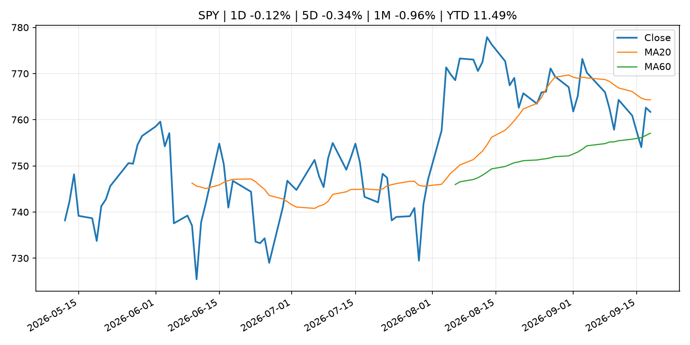
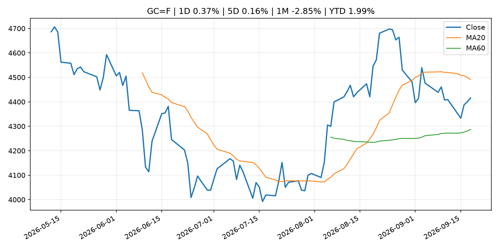
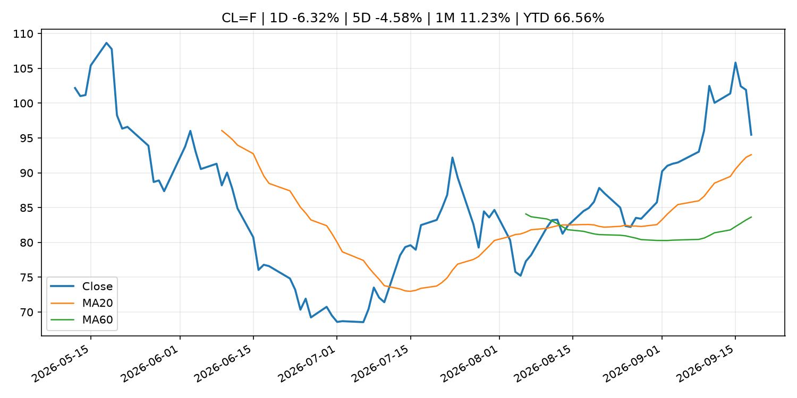
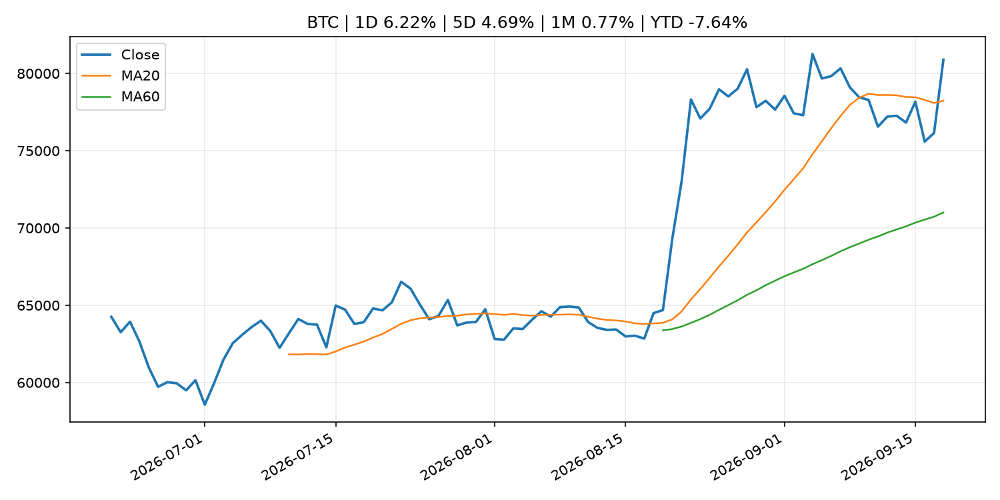
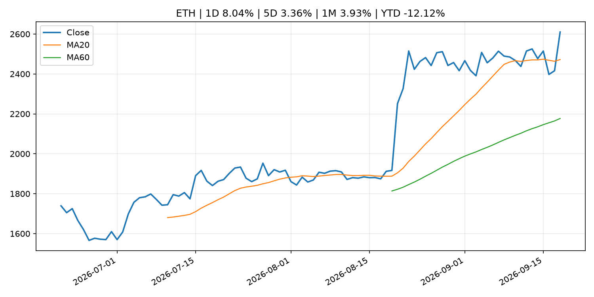
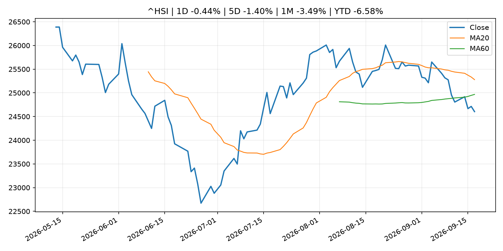

# Global Macro Morning Briefing - 2026-09-19

> Not financial advice / 非投资建议。

## 0. 今日总览
- 市场状态：unknown。市场信号不足，暂不判断明确状态。
- 今日三大主线：
  1. central_bank_decision: My rental property is paid off, but I need cash. Is this a bad time to take out a $50,000 HELOC?
  2. earnings: Amazon, Palantir and 12 more top tech stock picks from UBS analysts
  3. regulation: Real stocks are finally coming on blockchain. Here’s how the SEC wants it to work
- 一句话结论：今日晨报重点关注：央行决策会重定价利率、汇率、久期资产和风险资产。；大型科技股盈利和资本开支会影响纳指、半导体和 AI 交易主线。。跨资产方面，SPY 1D -0.12%；QQQ 1D 0.63%；^VIX 1D -4.08%；TLT 1D -0.65%；GC=F 1D 0.37%；CL=F 1D -6.32%；BTC 1D 6.22%；ETH 1D 8.04%；市场信号不足，暂不判断明确状态。政策、通胀、利率、美元、美债、能源和加密监管仍是主要观察线索。所有结论仅基于公开数据与短摘要整理，不构成投资建议。

## 1. 隔夜跨资产市场
- 美股：SPY 1D -0.12%，QQQ 1D 0.63%，整体趋势需结合 VIX 和利率确认。
- 美债/美元：TLT 1D -0.65%，美元指数 1D -0.00%，是判断折现率压力的核心线索。
- 黄金/原油：黄金 1D 0.37%，原油 1D -6.32%，用于观察避险、通胀和地缘风险。
- 加密：BTC 1D 6.22%，ETH 1D 8.04%，关注是否独立于纳指走出加密自身行情。
- 港股/A股：恒生 1D -0.44%，沪深300/上证 1D n/a，重点看中国政策预期与人民币线索。
- 风险观察：关注后续数据是否确认当前跨资产信号。

### US_EQUITY

| symbol | latest close | 1D | 5D | 1M | YTD | trend |
|---|---:|---:|---:|---:|---:|---|
| SPY | 761.69 | -0.12% | -0.34% | -0.96% | 11.49% | range_bound |
| QQQ | 721.45 | 0.63% | 0.92% | 0.75% | 17.67% | uptrend |
| DIA | 515.88 | -0.48% | -1.88% | -3.44% | 6.67% | range_bound |
| IWM | 284.10 | -0.47% | -1.66% | -5.84% | 14.20% | strong_downtrend |
| VTI | 375.43 | 0.02% | -0.23% | -1.20% | 11.63% | range_bound |

### US_MACRO_MARKET

| symbol | latest close | 1D | 5D | 1M | YTD | trend |
|---|---:|---:|---:|---:|---:|---|
| ^VIX | 14.81 | -4.08% | -6.50% | -7.50% | 2.07% | downtrend |
| DX-Y.NYB | 100.21 | -0.00% | 1.10% | 1.40% | 1.82% | range_bound |
| TLT | 81.25 | -0.65% | 0.47% | -2.13% | -6.64% | downtrend |
| IEF | 90.80 | -0.49% | -0.23% | -2.76% | -5.50% | downtrend |

### COMMODITIES

| symbol | latest close | 1D | 5D | 1M | YTD | trend |
|---|---:|---:|---:|---:|---:|---|
| GC=F | 4,415.90 | 0.37% | 0.16% | -2.85% | 1.99% | range_bound |
| SI=F | 66.79 | 2.01% | 3.46% | 1.60% | -5.34% | uptrend |
| CL=F | 95.47 | -6.32% | -4.58% | 11.23% | 66.56% | strong_uptrend |
| BZ=F | 98.77 | -5.77% | -5.58% | 7.80% | 62.58% | strong_uptrend |
| NG=F | 2.90 | -0.07% | 2.40% | 3.02% | -19.87% | range_bound |
| HG=F | 6.72 | 1.96% | 3.80% | 3.51% | 19.07% | strong_uptrend |

### HK_MARKET

| symbol | latest close | 1D | 5D | 1M | YTD | trend |
|---|---:|---:|---:|---:|---:|---|
| ^HSI | 24,604.29 | -0.44% | -1.40% | -3.49% | -6.58% | range_bound |
| 0700.HK | 419.00 | -1.64% | -2.19% | -7.18% | -32.74% | strong_downtrend |
| 9988.HK | 109.30 | 4.00% | 1.67% | -13.39% | -26.64% | strong_downtrend |
| 3690.HK | 73.20 | 0.41% | -2.53% | -14.74% | -30.02% | strong_downtrend |
| 1810.HK | 26.40 | 0.99% | 0.15% | -4.90% | -34.46% | range_bound |
| 1211.HK | 81.50 | 0.43% | 2.07% | -11.22% | -17.47% | strong_downtrend |

### CRYPTO

| symbol | latest close | 1D | 5D | 1M | YTD | trend |
|---|---:|---:|---:|---:|---:|---|
| BTC | 80,886.68 | 6.22% | 4.69% | 0.77% | -7.64% | uptrend |
| ETH | 2,610.15 | 8.04% | 3.36% | 3.93% | -12.12% | strong_uptrend |
| SOLANA | 112.81 | 14.47% | 10.86% | 3.32% | -9.41% | strong_uptrend |
| BINANCECOIN | 761.44 | 4.97% | 4.68% | 6.94% | -11.74% | strong_uptrend |
| RIPPLE | 1.40 | 7.56% | 2.21% | -3.93% | -24.13% | uptrend |

## 2. 今日最重要的 10 条新闻
### 1. My rental property is paid off, but I need cash. Is this a bad time to take out a $50,000 HELOC?
- 来源：MarketWatch Top Stories
- 时间：2026-09-18T20:01:00+00:00
- 地区：US
- 事件类型：central_bank_decision
- 重要性层级：Tier 1
- 一句话摘要：The Federal Reserve announced a quarter-percentage-point interest-rate hike Wednesday, to a range of 3.75%-4.0%.
- 为什么重要：央行决策会重定价利率、汇率、久期资产和风险资产。
- 可能影响：主要影响 QQQ，方向为 negative，强度 high；鹰派政策提高折现率，压制成长股估值。
  - 资产：QQQ
    方向：negative
    强度：high
    原因：鹰派政策提高折现率，压制成长股估值。
  - 资产：SPY
    方向：negative
    强度：medium
    原因：更紧政策通常削弱风险偏好。
  - 资产：TLT
    方向：negative
    强度：high
    原因：利率上行通常压低长债价格。
  - 资产：DXY
    方向：positive
    强度：high
    原因：更高利率预期通常支撑美元。
  - 资产：BTC
    方向：negative
    强度：high
    原因：流动性收紧通常压制高 beta 加密资产。
- 原文链接：[https://www.marketwatch.com/story/my-rental-property-is-paid-off-but-i-need-cash-is-this-a-bad-time-to-take-out-a-50-000-heloc-d094bbc5?mod=mw_rss_topstories](https://www.marketwatch.com/story/my-rental-property-is-paid-off-but-i-need-cash-is-this-a-bad-time-to-take-out-a-50-000-heloc-d094bbc5?mod=mw_rss_topstories)

### 2. Amazon, Palantir and 12 more top tech stock picks from UBS analysts
- 来源：MarketWatch Top Stories
- 时间：2026-09-18T21:14:00+00:00
- 地区：US
- 事件类型：earnings
- 重要性层级：Tier 2
- 一句话摘要：The AI data-center buildout is still early, and UBS says investors can cash in through investments across the technology, media and telecommunications sectors.
- 为什么重要：大型科技股盈利和资本开支会影响纳指、半导体和 AI 交易主线。
- 可能影响：主要影响 QQQ，方向为 mixed，强度 high；AI 资本开支会影响大型科技股盈利和估值预期。
  - 资产：QQQ
    方向：mixed
    强度：high
    原因：AI 资本开支会影响大型科技股盈利和估值预期。
  - 资产：SMH
    方向：mixed
    强度：high
    原因：AI 投资周期直接影响半导体需求。
  - 资产：NVDA
    方向：mixed
    强度：high
    原因：AI 训练和推理需求是英伟达收入预期核心变量。
  - 资产：MSFT
    方向：mixed
    强度：medium
    原因：云和 AI 资本开支影响利润率与增长叙事。
  - 资产：GOOGL
    方向：mixed
    强度：medium
    原因：AI 投资和搜索商业化影响估值。
  - 资产：META
    方向：mixed
    强度：medium
    原因：AI 基建支出与广告效率共同影响市场预期。
- 原文链接：[https://www.marketwatch.com/story/amazon-palantir-and-12-more-top-tech-stock-picks-from-ubs-analysts-435244bb?mod=mw_rss_topstories](https://www.marketwatch.com/story/amazon-palantir-and-12-more-top-tech-stock-picks-from-ubs-analysts-435244bb?mod=mw_rss_topstories)

### 3. Real stocks are finally coming on blockchain. Here’s how the SEC wants it to work
- 来源：CoinDesk
- 时间：2026-09-17T21:47:22+00:00
- 地区：global
- 事件类型：regulation
- 重要性层级：Tier 2
- 一句话摘要：Real stocks are finally coming on blockchain. Here’s how the SEC wants it to work
- 为什么重要：监管变化会改变行业盈利预期和资产风险溢价。
- 可能影响：主要影响 BTC，方向为 mixed，强度 high；加密监管或 ETF 进展会改变 BTC 的资金流和风险溢价。
  - 资产：BTC
    方向：mixed
    强度：high
    原因：加密监管或 ETF 进展会改变 BTC 的资金流和风险溢价。
  - 资产：ETH
    方向：mixed
    强度：high
    原因：监管框架会影响 ETH 产品化和机构参与度。
  - 资产：COIN
    方向：mixed
    强度：medium
    原因：监管清晰度和执法风险会影响交易平台估值。
  - 资产：crypto market
    方向：mixed
    强度：high
    原因：信息影响整个加密市场结构，但方向取决于细节。
- 原文链接：[https://www.coindesk.com/business/2026/09/17/real-stocks-are-finally-coming-on-blockchain-here-s-how-the-sec-wants-it-to-work](https://www.coindesk.com/business/2026/09/17/real-stocks-are-finally-coming-on-blockchain-here-s-how-the-sec-wants-it-to-work)

### 4. SEC Issues “Innovation Exemption” to Facilitate the Trading of Tokenized NMS Stock and Request for Comment
- 来源：SEC Press Releases
- 时间：2026-09-17T08:55:00-04:00
- 地区：US
- 事件类型：regulation
- 重要性层级：Tier 2
- 一句话摘要：The SEC is taking a significant step forward, within its statutory authority, to bring America’s capital markets into the digital age by facilitating onchain trading of certain tokenized stocks.
- 为什么重要：监管变化会改变行业盈利预期和资产风险溢价。
- 可能影响：主要影响 BTC，方向为 mixed，强度 high；加密监管或 ETF 进展会改变 BTC 的资金流和风险溢价。
  - 资产：BTC
    方向：mixed
    强度：high
    原因：加密监管或 ETF 进展会改变 BTC 的资金流和风险溢价。
  - 资产：ETH
    方向：mixed
    强度：high
    原因：监管框架会影响 ETH 产品化和机构参与度。
  - 资产：COIN
    方向：mixed
    强度：medium
    原因：监管清晰度和执法风险会影响交易平台估值。
  - 资产：crypto market
    方向：mixed
    强度：high
    原因：信息影响整个加密市场结构，但方向取决于细节。
- 原文链接：[https://www.sec.gov/newsroom/press-releases/2026-90-sec-issues-innovation-exemption-facilitate-trading-tokenized-nms-stock-request-comment](https://www.sec.gov/newsroom/press-releases/2026-90-sec-issues-innovation-exemption-facilitate-trading-tokenized-nms-stock-request-comment)

### 5. SEC opens door to tokenized U.S. stock trading. Here’s who could benefit
- 来源：CoinDesk
- 时间：2026-09-17T18:38:10+00:00
- 地区：global
- 事件类型：regulation
- 重要性层级：Tier 2
- 一句话摘要：SEC opens door to tokenized U.S. stock trading. Here’s who could benefit
- 为什么重要：监管变化会改变行业盈利预期和资产风险溢价。
- 可能影响：主要影响 BTC，方向为 mixed，强度 high；加密监管或 ETF 进展会改变 BTC 的资金流和风险溢价。
  - 资产：BTC
    方向：mixed
    强度：high
    原因：加密监管或 ETF 进展会改变 BTC 的资金流和风险溢价。
  - 资产：ETH
    方向：mixed
    强度：high
    原因：监管框架会影响 ETH 产品化和机构参与度。
  - 资产：COIN
    方向：mixed
    强度：medium
    原因：监管清晰度和执法风险会影响交易平台估值。
  - 资产：crypto market
    方向：mixed
    强度：high
    原因：信息影响整个加密市场结构，但方向取决于细节。
- 原文链接：[https://www.coindesk.com/business/2026/09/17/sec-opens-door-to-tokenized-u-s-stock-trading-here-s-who-could-benefit](https://www.coindesk.com/business/2026/09/17/sec-opens-door-to-tokenized-u-s-stock-trading-here-s-who-could-benefit)

### 6. U.S. SEC begins prepping for around-the-clock trading that crypto treats as the norm
- 来源：CoinDesk
- 时间：2026-09-17T15:03:19+00:00
- 地区：global
- 事件类型：regulation
- 重要性层级：Tier 2
- 一句话摘要：U.S. SEC begins prepping for around-the-clock trading that crypto treats as the norm
- 为什么重要：监管变化会改变行业盈利预期和资产风险溢价。
- 可能影响：主要影响 BTC，方向为 mixed，强度 high；加密监管或 ETF 进展会改变 BTC 的资金流和风险溢价。
  - 资产：BTC
    方向：mixed
    强度：high
    原因：加密监管或 ETF 进展会改变 BTC 的资金流和风险溢价。
  - 资产：ETH
    方向：mixed
    强度：high
    原因：监管框架会影响 ETH 产品化和机构参与度。
  - 资产：COIN
    方向：mixed
    强度：medium
    原因：监管清晰度和执法风险会影响交易平台估值。
  - 资产：crypto market
    方向：mixed
    强度：high
    原因：信息影响整个加密市场结构，但方向取决于细节。
- 原文链接：[https://www.coindesk.com/policy/2026/09/17/u-s-sec-begins-prepping-for-round-the-clock-trading-that-crypto-treats-as-the-norm](https://www.coindesk.com/policy/2026/09/17/u-s-sec-begins-prepping-for-round-the-clock-trading-that-crypto-treats-as-the-norm)

### 7. Federal Reserve Board announces termination of enforcement action with SNB Bancshares and Bank of Eufaula
- 来源：Federal Reserve Press Releases
- 时间：2026-09-18T15:00:00+00:00
- 地区：US
- 事件类型：regulation
- 重要性层级：Tier 2
- 一句话摘要：Federal Reserve Board announces termination of enforcement action with SNB Bancshares and Bank of Eufaula
- 为什么重要：监管变化会改变行业盈利预期和资产风险溢价。
- 可能影响：可能影响利率、汇率、风险资产或大宗商品预期，但当前公开信息不足以判断明确方向。
  - 资产：暂无明确资产映射
  - 方向：unknown
  - 强度：low
  - 原因：公开信息不足以判断方向。
- 原文链接：[https://www.federalreserve.gov/newsevents/pressreleases/enforcement20260918b.htm](https://www.federalreserve.gov/newsevents/pressreleases/enforcement20260918b.htm)

### 8. Federal Reserve Board issues enforcement actions with former employee of Northstar Bank, former employee of American Express Travel Related Services Company, Inc., and former employee of Regions Bank
- 来源：Federal Reserve Press Releases
- 时间：2026-09-18T15:00:00+00:00
- 地区：US
- 事件类型：regulation
- 重要性层级：Tier 2
- 一句话摘要：Federal Reserve Board issues enforcement actions with former employee of Northstar Bank, former employee of American Express Travel Related Services Company, Inc., and former employee of Regions Bank
- 为什么重要：监管变化会改变行业盈利预期和资产风险溢价。
- 可能影响：可能影响利率、汇率、风险资产或大宗商品预期，但当前公开信息不足以判断明确方向。
  - 资产：暂无明确资产映射
  - 方向：unknown
  - 强度：low
  - 原因：公开信息不足以判断方向。
- 原文链接：[https://www.federalreserve.gov/newsevents/pressreleases/enforcement20260918a.htm](https://www.federalreserve.gov/newsevents/pressreleases/enforcement20260918a.htm)

### 9. Three words from Kevin Warsh have Wall Street wondering how far the Fed will go with rate hikes
- 来源：CNBC Economy
- 时间：2026-09-18T18:28:31+00:00
- 地区：US
- 事件类型：other
- 重要性层级：Tier 3
- 一句话摘要：The chairman both explained this week's decision to raise interest rates, and raised vexing questions about what comes next
- 为什么重要：这条信息暂未匹配到重大宏观、政策或市场事件，更适合作为背景跟踪。
- 可能影响：更偏背景信息，短期市场影响可能有限。
  - 资产：暂无明确资产映射
  - 方向：unknown
  - 强度：low
  - 原因：公开信息不足以判断方向。
- 原文链接：[https://www.cnbc.com/2026/09/18/three-words-from-kevin-warsh-have-wall-street-wondering-how-far-the-fed-will-go-with-rate-hikes.html](https://www.cnbc.com/2026/09/18/three-words-from-kevin-warsh-have-wall-street-wondering-how-far-the-fed-will-go-with-rate-hikes.html)

### 10. ECB Consumer Expectations Survey results – August 2026
- 来源：ECB Press Releases
- 时间：2026-09-18T10:00:00+02:00
- 地区：EU
- 事件类型：other
- 重要性层级：Tier 3
- 一句话摘要：ECB Consumer Expectations Survey results – August 2026
- 为什么重要：这条信息暂未匹配到重大宏观、政策或市场事件，更适合作为背景跟踪。
- 可能影响：更偏背景信息，短期市场影响可能有限。
  - 资产：暂无明确资产映射
  - 方向：unknown
  - 强度：low
  - 原因：公开信息不足以判断方向。
- 原文链接：[https://www.ecb.europa.eu//press/pr/date/2026/html/ecb.pr260918~295b3ab978.en.html](https://www.ecb.europa.eu//press/pr/date/2026/html/ecb.pr260918~295b3ab978.en.html)

## 3. 政策与央行观察
### 1. My rental property is paid off, but I need cash. Is this a bad time to take out a $50,000 HELOC?
- 来源：MarketWatch Top Stories
- 时间：2026-09-18T20:01:00+00:00
- 地区：US
- 事件类型：central_bank_decision
- 重要性层级：Tier 1
- 一句话摘要：The Federal Reserve announced a quarter-percentage-point interest-rate hike Wednesday, to a range of 3.75%-4.0%.
- 为什么重要：央行决策会重定价利率、汇率、久期资产和风险资产。
- 可能影响：主要影响 QQQ，方向为 negative，强度 high；鹰派政策提高折现率，压制成长股估值。
  - 资产：QQQ
    方向：negative
    强度：high
    原因：鹰派政策提高折现率，压制成长股估值。
  - 资产：SPY
    方向：negative
    强度：medium
    原因：更紧政策通常削弱风险偏好。
  - 资产：TLT
    方向：negative
    强度：high
    原因：利率上行通常压低长债价格。
  - 资产：DXY
    方向：positive
    强度：high
    原因：更高利率预期通常支撑美元。
  - 资产：BTC
    方向：negative
    强度：high
    原因：流动性收紧通常压制高 beta 加密资产。
- 原文链接：[https://www.marketwatch.com/story/my-rental-property-is-paid-off-but-i-need-cash-is-this-a-bad-time-to-take-out-a-50-000-heloc-d094bbc5?mod=mw_rss_topstories](https://www.marketwatch.com/story/my-rental-property-is-paid-off-but-i-need-cash-is-this-a-bad-time-to-take-out-a-50-000-heloc-d094bbc5?mod=mw_rss_topstories)

### 2. Real stocks are finally coming on blockchain. Here’s how the SEC wants it to work
- 来源：CoinDesk
- 时间：2026-09-17T21:47:22+00:00
- 地区：global
- 事件类型：regulation
- 重要性层级：Tier 2
- 一句话摘要：Real stocks are finally coming on blockchain. Here’s how the SEC wants it to work
- 为什么重要：监管变化会改变行业盈利预期和资产风险溢价。
- 可能影响：主要影响 BTC，方向为 mixed，强度 high；加密监管或 ETF 进展会改变 BTC 的资金流和风险溢价。
  - 资产：BTC
    方向：mixed
    强度：high
    原因：加密监管或 ETF 进展会改变 BTC 的资金流和风险溢价。
  - 资产：ETH
    方向：mixed
    强度：high
    原因：监管框架会影响 ETH 产品化和机构参与度。
  - 资产：COIN
    方向：mixed
    强度：medium
    原因：监管清晰度和执法风险会影响交易平台估值。
  - 资产：crypto market
    方向：mixed
    强度：high
    原因：信息影响整个加密市场结构，但方向取决于细节。
- 原文链接：[https://www.coindesk.com/business/2026/09/17/real-stocks-are-finally-coming-on-blockchain-here-s-how-the-sec-wants-it-to-work](https://www.coindesk.com/business/2026/09/17/real-stocks-are-finally-coming-on-blockchain-here-s-how-the-sec-wants-it-to-work)

### 3. SEC Issues “Innovation Exemption” to Facilitate the Trading of Tokenized NMS Stock and Request for Comment
- 来源：SEC Press Releases
- 时间：2026-09-17T08:55:00-04:00
- 地区：US
- 事件类型：regulation
- 重要性层级：Tier 2
- 一句话摘要：The SEC is taking a significant step forward, within its statutory authority, to bring America’s capital markets into the digital age by facilitating onchain trading of certain tokenized stocks.
- 为什么重要：监管变化会改变行业盈利预期和资产风险溢价。
- 可能影响：主要影响 BTC，方向为 mixed，强度 high；加密监管或 ETF 进展会改变 BTC 的资金流和风险溢价。
  - 资产：BTC
    方向：mixed
    强度：high
    原因：加密监管或 ETF 进展会改变 BTC 的资金流和风险溢价。
  - 资产：ETH
    方向：mixed
    强度：high
    原因：监管框架会影响 ETH 产品化和机构参与度。
  - 资产：COIN
    方向：mixed
    强度：medium
    原因：监管清晰度和执法风险会影响交易平台估值。
  - 资产：crypto market
    方向：mixed
    强度：high
    原因：信息影响整个加密市场结构，但方向取决于细节。
- 原文链接：[https://www.sec.gov/newsroom/press-releases/2026-90-sec-issues-innovation-exemption-facilitate-trading-tokenized-nms-stock-request-comment](https://www.sec.gov/newsroom/press-releases/2026-90-sec-issues-innovation-exemption-facilitate-trading-tokenized-nms-stock-request-comment)

### 4. SEC opens door to tokenized U.S. stock trading. Here’s who could benefit
- 来源：CoinDesk
- 时间：2026-09-17T18:38:10+00:00
- 地区：global
- 事件类型：regulation
- 重要性层级：Tier 2
- 一句话摘要：SEC opens door to tokenized U.S. stock trading. Here’s who could benefit
- 为什么重要：监管变化会改变行业盈利预期和资产风险溢价。
- 可能影响：主要影响 BTC，方向为 mixed，强度 high；加密监管或 ETF 进展会改变 BTC 的资金流和风险溢价。
  - 资产：BTC
    方向：mixed
    强度：high
    原因：加密监管或 ETF 进展会改变 BTC 的资金流和风险溢价。
  - 资产：ETH
    方向：mixed
    强度：high
    原因：监管框架会影响 ETH 产品化和机构参与度。
  - 资产：COIN
    方向：mixed
    强度：medium
    原因：监管清晰度和执法风险会影响交易平台估值。
  - 资产：crypto market
    方向：mixed
    强度：high
    原因：信息影响整个加密市场结构，但方向取决于细节。
- 原文链接：[https://www.coindesk.com/business/2026/09/17/sec-opens-door-to-tokenized-u-s-stock-trading-here-s-who-could-benefit](https://www.coindesk.com/business/2026/09/17/sec-opens-door-to-tokenized-u-s-stock-trading-here-s-who-could-benefit)

### 5. U.S. SEC begins prepping for around-the-clock trading that crypto treats as the norm
- 来源：CoinDesk
- 时间：2026-09-17T15:03:19+00:00
- 地区：global
- 事件类型：regulation
- 重要性层级：Tier 2
- 一句话摘要：U.S. SEC begins prepping for around-the-clock trading that crypto treats as the norm
- 为什么重要：监管变化会改变行业盈利预期和资产风险溢价。
- 可能影响：主要影响 BTC，方向为 mixed，强度 high；加密监管或 ETF 进展会改变 BTC 的资金流和风险溢价。
  - 资产：BTC
    方向：mixed
    强度：high
    原因：加密监管或 ETF 进展会改变 BTC 的资金流和风险溢价。
  - 资产：ETH
    方向：mixed
    强度：high
    原因：监管框架会影响 ETH 产品化和机构参与度。
  - 资产：COIN
    方向：mixed
    强度：medium
    原因：监管清晰度和执法风险会影响交易平台估值。
  - 资产：crypto market
    方向：mixed
    强度：high
    原因：信息影响整个加密市场结构，但方向取决于细节。
- 原文链接：[https://www.coindesk.com/policy/2026/09/17/u-s-sec-begins-prepping-for-round-the-clock-trading-that-crypto-treats-as-the-norm](https://www.coindesk.com/policy/2026/09/17/u-s-sec-begins-prepping-for-round-the-clock-trading-that-crypto-treats-as-the-norm)

### 6. Federal Reserve Board announces termination of enforcement action with SNB Bancshares and Bank of Eufaula
- 来源：Federal Reserve Press Releases
- 时间：2026-09-18T15:00:00+00:00
- 地区：US
- 事件类型：regulation
- 重要性层级：Tier 2
- 一句话摘要：Federal Reserve Board announces termination of enforcement action with SNB Bancshares and Bank of Eufaula
- 为什么重要：监管变化会改变行业盈利预期和资产风险溢价。
- 可能影响：可能影响利率、汇率、风险资产或大宗商品预期，但当前公开信息不足以判断明确方向。
  - 资产：暂无明确资产映射
  - 方向：unknown
  - 强度：low
  - 原因：公开信息不足以判断方向。
- 原文链接：[https://www.federalreserve.gov/newsevents/pressreleases/enforcement20260918b.htm](https://www.federalreserve.gov/newsevents/pressreleases/enforcement20260918b.htm)

### 7. Federal Reserve Board issues enforcement actions with former employee of Northstar Bank, former employee of American Express Travel Related Services Company, Inc., and former employee of Regions Bank
- 来源：Federal Reserve Press Releases
- 时间：2026-09-18T15:00:00+00:00
- 地区：US
- 事件类型：regulation
- 重要性层级：Tier 2
- 一句话摘要：Federal Reserve Board issues enforcement actions with former employee of Northstar Bank, former employee of American Express Travel Related Services Company, Inc., and former employee of Regions Bank
- 为什么重要：监管变化会改变行业盈利预期和资产风险溢价。
- 可能影响：可能影响利率、汇率、风险资产或大宗商品预期，但当前公开信息不足以判断明确方向。
  - 资产：暂无明确资产映射
  - 方向：unknown
  - 强度：low
  - 原因：公开信息不足以判断方向。
- 原文链接：[https://www.federalreserve.gov/newsevents/pressreleases/enforcement20260918a.htm](https://www.federalreserve.gov/newsevents/pressreleases/enforcement20260918a.htm)

## 4. 市场异动与图表
- QQQ 上涨 0.63%
- VIX 下跌 -4.08%
- TLT 下跌 -0.65%
- Oil 下跌 -6.32%
- BTC 上涨 6.22%
- ETH 上涨 8.04%

### SPY

### QQQ

### ^VIX

### TLT

### GC=F

### CL=F

### BTC

### ETH

### ^HSI

## 5. 华尔街与机构公开观点
- 暂无可靠公开观点。

## 6. 今日重点关注
- 经济数据：经济数据：暂无可靠公开日历数据；如配置经济日历源后可自动填充。
- 央行讲话：央行讲话：暂无可靠公开日历数据；重点跟踪 Fed、ECB、BoJ、PBOC 官网 RSS。
- 财报：财报：暂无可靠数据。
- 政策事件：政策事件：暂无可靠数据。
- 风险提醒：风险提醒：关注数据源失败项、突发地缘风险、利率和美元的二阶反应。

## 7. 英文金融表达与宏观概念
- **terminal rate**：终端利率，市场预期本轮加息周期的最高政策利率。 例句：A higher terminal rate can pressure growth stocks.
- **risk-off**：避险模式，资金偏向美元、国债、黄金等防御资产。 例句：A geopolitical shock can push markets into risk-off mode.
- **market structure**：市场结构，指交易、托管、清算、ETF、监管等制度安排。 例句：Crypto market structure rules can affect institutional participation.
- **inflation expectations**：通胀预期，指家庭、企业或市场对未来通胀的预估。 例句：Inflation expectations can shape wage bargaining and bond yields.
- **real yield**：实际收益率，名义利率扣除通胀预期后的收益率。 例句：Gold often reacts more to real yields than nominal yields.
- **soft landing**：软着陆，指通胀回落而经济避免明显衰退。 例句：Markets often rally when data support a soft landing.

## 8. 背景材料
- [Three words from Kevin Warsh have Wall Street wondering how far the Fed will go with rate hikes](https://www.cnbc.com/2026/09/18/three-words-from-kevin-warsh-have-wall-street-wondering-how-far-the-fed-will-go-with-rate-hikes.html)（CNBC Economy，other）：The chairman both explained this week's decision to raise interest rates, and raised vexing questions about what comes next
- [XRP on the brink of a golden cross as focus switches to altcoins](https://www.coindesk.com/daybook-us/2026/09/18/xrp-on-the-brink-of-a-golden-cross-as-focus-switches-to-altcoins)（CoinDesk，other）：XRP on the brink of a golden cross as focus switches to altcoins
- [Bitcoin weathers September storm as rate hikes and Clarity act setback test bulls](https://www.coindesk.com/markets/2026/09/18/bitcoin-weathers-september-storm-as-rate-hikes-and-clarity-act-setback-test-bulls)（CoinDesk，other）：Bitcoin weathers September storm as rate hikes and Clarity act setback test bulls
- [Live updates: Bitcoin climbs over $80,000 as crypto shakes off Clarity failure and higher interest rates](https://www.coindesk.com/tech/2026/09/18/live-updates-hype-leads-altcoin-rally-as-bitcoin-recovers-toward-usd78-000)（CoinDesk，other）：Live updates: Bitcoin climbs over $80,000 as crypto shakes off Clarity failure and higher interest rates
- [ECB Consumer Expectations Survey results – August 2026](https://www.ecb.europa.eu//press/pr/date/2026/html/ecb.pr260918~295b3ab978.en.html)（ECB Press Releases，other）：ECB Consumer Expectations Survey results – August 2026
- [Iran’s Strait of Hormuz toll booth ran through a bitcoin exchange, U.S. says](https://www.coindesk.com/policy/2026/09/18/iran-s-strait-of-hormuz-toll-booth-ran-through-a-bitcoin-exchange-u-s-says)（CoinDesk，other）：Iran’s Strait of Hormuz toll booth ran through a bitcoin exchange, U.S. says
- [Boris Vujčić: Interview with Reuters](https://www.ecb.europa.eu//press/inter/date/2026/html/ecb.in260918~33f023fe26.en.html)（ECB Press Releases，other）：Boris Vujčić: Interview with Reuters
- [Corporate treasuries bought just 5,900 bitcoin in 3 months. Other demand signals look weak, too.](https://www.coindesk.com/markets/2026/09/18/corporate-treasuries-bought-just-5-900-bitcoin-in-3-months-other-demand-signals-look-weak-too)（CoinDesk，other）：Corporate treasuries bought just 5,900 bitcoin in 3 months. Other demand signals look weak, too.
- [Ether and XRP ETFs post outflows as crypto majors move higher](https://www.coindesk.com/markets/2026/09/18/ether-and-xrp-etfs-post-outflows-as-bitcoin-moves-above-usd77-000)（CoinDesk，other）：Ether and XRP ETFs post outflows as crypto majors move higher
- [Change in the Guideline for Money Market Operations](http://www.boj.or.jp/en/mopo/mpmdeci/mpr_2026/k260918a.pdf)（Bank of Japan Announcements，other）：Change in the Guideline for Money Market Operations
- [Amendment to "Principal Terms and Conditions of Complementary Deposit Facility"](http://www.boj.or.jp/en/mopo/mpmdeci/mpr_2026/mpr260918b.pdf)（Bank of Japan Announcements，other）：Amendment to "Principal Terms and Conditions of Complementary Deposit Facility"
- [Amendment to "Principal Terms and Conditions of the Funds-Supplying Operations to Support Financing for Climate Change Responses"](http://www.boj.or.jp/en/mopo/mpmdeci/mpr_2026/mpr260918a.pdf)（Bank of Japan Announcements，other）：Amendment to "Principal Terms and Conditions of the Funds-Supplying Operations to Support Financing for Climate Change Responses"
- [Bank of Japan raises interest rates by 25 basis points. Bitcoin tops $77,000](https://www.coindesk.com/markets/2026/09/17/boj-rate-hike)（CoinDesk，other）：Bank of Japan raises interest rates by 25 basis points. Bitcoin tops $77,000
- [(Reference) Change in the Guideline for Money Market Operations (September 2026 MPM)](http://www.boj.or.jp/en/mopo/mpmdeci/mpr_2026/k260918b.pdf)（Bank of Japan Announcements，other）：(Reference) Change in the Guideline for Money Market Operations (September 2026 MPM)
- [Securitize jumps after regulators greenlight some tokenized U.S. stock trading](https://www.cnbc.com/2026/09/17/securitize-jumps-after-regulators-greenlight-tokenized-us-stocks.html)（CNBC Economy，other）：Securitize surged Thursday after federal regulators greenlit the issuing of tokenized stocks on some trading platforms in the U.S.
- [Crypto for Advisors: The case for diversifying beyond bitcoin and ether](https://www.coindesk.com/coindesk-indices/2026/09/17/crypto-for-advisors-beyond-bitcoin-and-ether)（CoinDesk，other）：Crypto for Advisors: The case for diversifying beyond bitcoin and ether
- [Developments in Real Exports and Real Imports](http://www.boj.or.jp/en/research/research_data/reri/index.htm)（Bank of Japan Announcements，other）：Developments in Real Exports and Real Imports

## 9. 数据源、失败项与免责声明
- 采集时间：2026-09-18T23:53:45
- 数据源：公开 RSS、Yahoo Finance、CoinGecko、AKShare、FRED、SEC data.sec.gov，以及用户自有 inputs/reports 文件。
- 合规说明：不绕过 WSJ、Bloomberg、FT、Reuters 等付费墙；对付费媒体只使用公开 RSS 标题、摘要、链接和发布时间。
- 免责声明：Not financial advice / 非投资建议。本项目仅供个人学习、研究和信息整理，不构成投资建议、交易建议或任何收益承诺。
- 失败或跳过的数据源：
  - crypto data failed coin=dogecoin
  - China market data failed symbol=上证指数: empty dataframe
  - China market data failed symbol=深证成指: empty dataframe
  - China market data failed symbol=创业板指: empty dataframe
  - China market data failed symbol=沪深300: empty dataframe
  - China market data failed symbol=中证500: empty dataframe
  - China market data failed symbol=科创50: empty dataframe
  - FRED_API_KEY not set; skipping FRED macro series
  - SEC failed cik=0000320193
  - SEC failed cik=0000789019
  - SEC failed cik=0001045810
  - SEC failed cik=0001318605
  - SEC failed cik=0001577552
