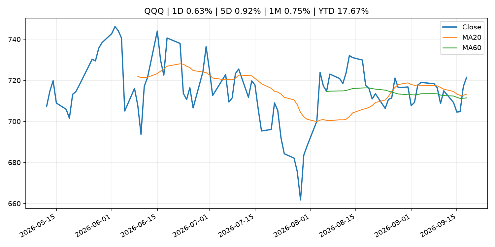
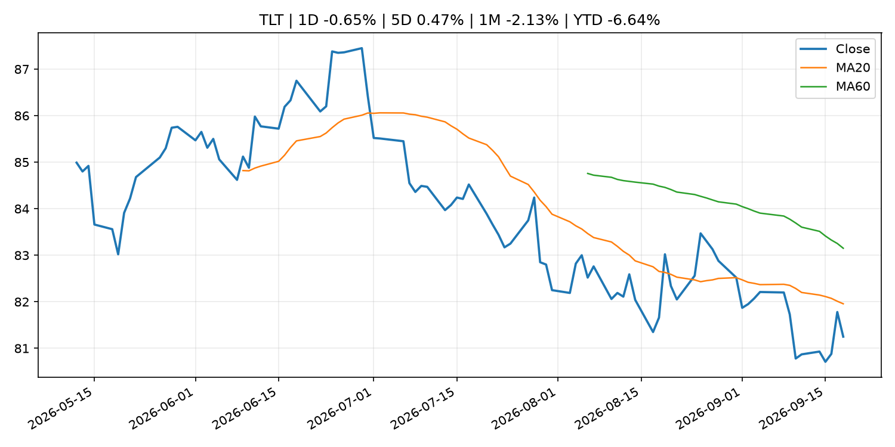
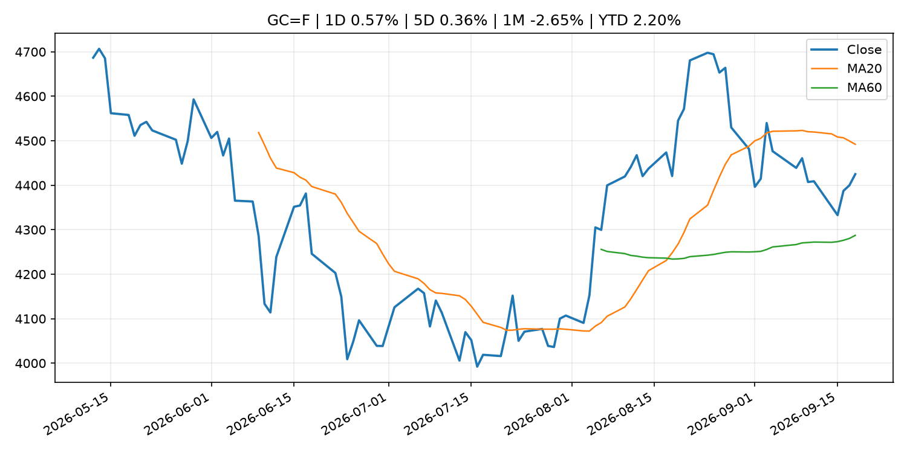
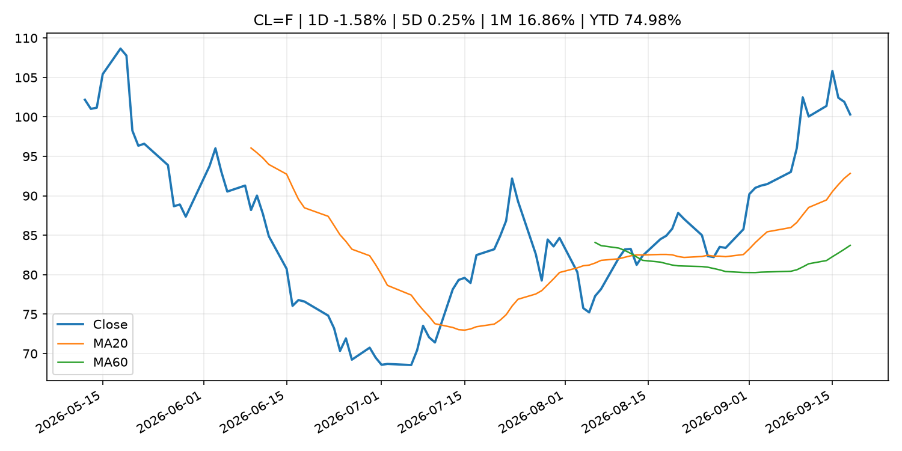
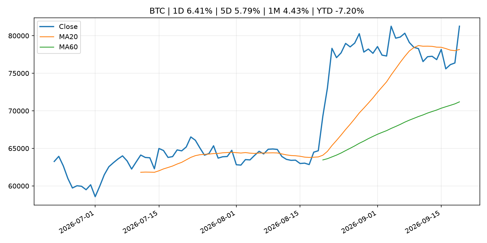
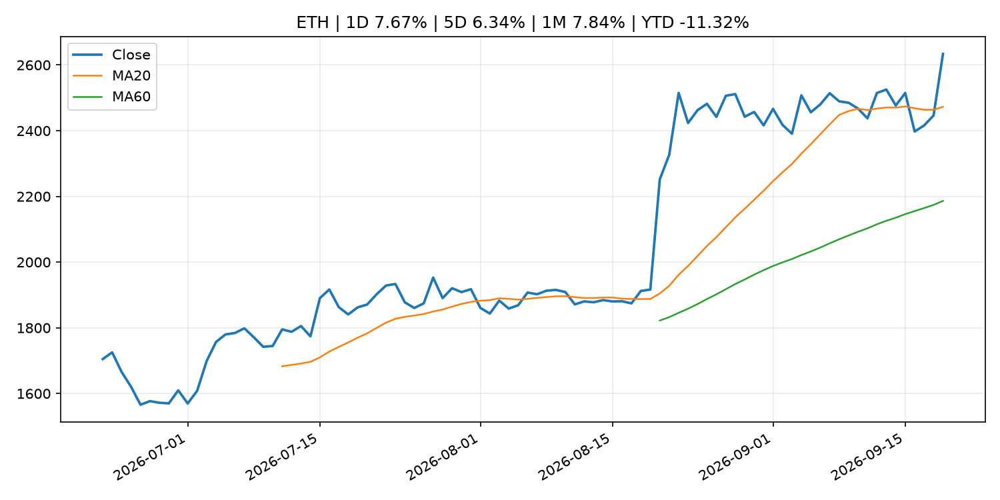

# Global Macro Morning Briefing - 2026-09-20

> Not financial advice / 非投资建议。

## 0. 今日总览
- 市场状态：unknown。市场信号不足，暂不判断明确状态。
- 今日三大主线：
  1. regulation: Federal Reserve Board announces termination of enforcement action with SNB Bancshares and Bank of Eufaula
  2. regulation: Federal Reserve Board issues enforcement actions with former employee of Northstar Bank, former employee of American Express Travel Related Services Company, Inc., and former employee of Regions Bank
- 一句话结论：今日晨报重点关注：监管变化会改变行业盈利预期和资产风险溢价。；监管变化会改变行业盈利预期和资产风险溢价。。跨资产方面，SPY 1D -0.12%；QQQ 1D 0.63%；^VIX 1D -4.08%；TLT 1D -0.65%；GC=F 1D 0.57%；CL=F 1D -1.58%；BTC 1D 6.41%；ETH 1D 7.67%；市场信号不足，暂不判断明确状态。政策、通胀、利率、美元、美债、能源和加密监管仍是主要观察线索。所有结论仅基于公开数据与短摘要整理，不构成投资建议。

## 1. 隔夜跨资产市场
- 美股：SPY 1D -0.12%，QQQ 1D 0.63%，整体趋势需结合 VIX 和利率确认。
- 美债/美元：TLT 1D -0.65%，美元指数 1D 0.00%，是判断折现率压力的核心线索。
- 黄金/原油：黄金 1D 0.57%，原油 1D -1.58%，用于观察避险、通胀和地缘风险。
- 加密：BTC 1D 6.41%，ETH 1D 7.67%，关注是否独立于纳指走出加密自身行情。
- 港股/A股：恒生 1D 0.60%，沪深300/上证 1D n/a，重点看中国政策预期与人民币线索。
- 风险观察：关注后续数据是否确认当前跨资产信号。

### US_EQUITY

| symbol | latest close | 1D | 5D | 1M | YTD | trend |
|---|---:|---:|---:|---:|---:|---|
| SPY | 761.69 | -0.12% | -0.34% | -0.96% | 11.49% | range_bound |
| QQQ | 721.45 | 0.63% | 0.92% | 0.75% | 17.67% | uptrend |
| DIA | 515.88 | -0.48% | -1.88% | -3.44% | 6.67% | range_bound |
| IWM | 284.10 | -0.47% | -1.66% | -5.84% | 14.20% | strong_downtrend |
| VTI | 375.43 | 0.02% | -0.23% | -1.20% | 11.63% | range_bound |

### US_MACRO_MARKET

| symbol | latest close | 1D | 5D | 1M | YTD | trend |
|---|---:|---:|---:|---:|---:|---|
| ^VIX | 14.81 | -4.08% | -6.50% | -7.50% | 2.07% | downtrend |
| DX-Y.NYB | 100.22 | 0.00% | 1.11% | 1.41% | 1.83% | range_bound |
| TLT | 81.25 | -0.65% | 0.47% | -2.13% | -6.64% | downtrend |
| IEF | 90.80 | -0.49% | -0.23% | -2.76% | -5.50% | downtrend |

### COMMODITIES

| symbol | latest close | 1D | 5D | 1M | YTD | trend |
|---|---:|---:|---:|---:|---:|---|
| GC=F | 4,424.90 | 0.57% | 0.36% | -2.65% | 2.20% | range_bound |
| SI=F | 66.56 | 1.66% | 3.10% | 1.25% | -5.67% | uptrend |
| CL=F | 100.30 | -1.58% | 0.25% | 16.86% | 74.98% | strong_uptrend |
| BZ=F | 103.87 | -0.91% | -0.71% | 13.37% | 70.98% | strong_uptrend |
| NG=F | 2.91 | 0.38% | 2.86% | 3.48% | -19.51% | range_bound |
| HG=F | 6.61 | 0.43% | 2.25% | 1.97% | 17.29% | uptrend |

### HK_MARKET

| symbol | latest close | 1D | 5D | 1M | YTD | trend |
|---|---:|---:|---:|---:|---:|---|
| ^HSI | 24,750.78 | 0.60% | -0.22% | -3.69% | -6.03% | range_bound |
| 0700.HK | 419.00 | -1.64% | -2.19% | -7.18% | -32.74% | strong_downtrend |
| 9988.HK | 109.30 | 4.00% | 1.67% | -13.39% | -26.64% | strong_downtrend |
| 3690.HK | 73.20 | 0.41% | -2.53% | -14.74% | -30.02% | strong_downtrend |
| 1810.HK | 26.40 | 0.99% | 0.15% | -4.90% | -34.46% | range_bound |
| 1211.HK | 81.50 | 0.43% | 2.07% | -11.22% | -17.47% | strong_downtrend |

### CRYPTO

| symbol | latest close | 1D | 5D | 1M | YTD | trend |
|---|---:|---:|---:|---:|---:|---|
| BTC | 81,268.48 | 6.41% | 5.79% | 4.43% | -7.20% | strong_uptrend |
| ETH | 2,633.83 | 7.67% | 6.34% | 7.84% | -11.32% | strong_uptrend |
| SOLANA | 111.05 | 9.33% | 11.80% | 6.66% | -10.82% | strong_uptrend |
| BINANCECOIN | 761.73 | 3.24% | 6.35% | 10.18% | -11.70% | strong_uptrend |
| RIPPLE | 1.41 | 8.93% | 5.19% | 2.00% | -23.33% | uptrend |

## 2. 今日最重要的 10 条新闻
### 1. Federal Reserve Board announces termination of enforcement action with SNB Bancshares and Bank of Eufaula
- 来源：Federal Reserve Press Releases
- 时间：2026-09-18T15:00:00+00:00
- 地区：US
- 事件类型：regulation
- 重要性层级：Tier 2
- 一句话摘要：Federal Reserve Board announces termination of enforcement action with SNB Bancshares and Bank of Eufaula
- 为什么重要：监管变化会改变行业盈利预期和资产风险溢价。
- 可能影响：可能影响利率、汇率、风险资产或大宗商品预期，但当前公开信息不足以判断明确方向。
  - 资产：暂无明确资产映射
  - 方向：unknown
  - 强度：low
  - 原因：公开信息不足以判断方向。
- 原文链接：[https://www.federalreserve.gov/newsevents/pressreleases/enforcement20260918b.htm](https://www.federalreserve.gov/newsevents/pressreleases/enforcement20260918b.htm)

### 2. Federal Reserve Board issues enforcement actions with former employee of Northstar Bank, former employee of American Express Travel Related Services Company, Inc., and former employee of Regions Bank
- 来源：Federal Reserve Press Releases
- 时间：2026-09-18T15:00:00+00:00
- 地区：US
- 事件类型：regulation
- 重要性层级：Tier 2
- 一句话摘要：Federal Reserve Board issues enforcement actions with former employee of Northstar Bank, former employee of American Express Travel Related Services Company, Inc., and former employee of Regions Bank
- 为什么重要：监管变化会改变行业盈利预期和资产风险溢价。
- 可能影响：可能影响利率、汇率、风险资产或大宗商品预期，但当前公开信息不足以判断明确方向。
  - 资产：暂无明确资产映射
  - 方向：unknown
  - 强度：low
  - 原因：公开信息不足以判断方向。
- 原文链接：[https://www.federalreserve.gov/newsevents/pressreleases/enforcement20260918a.htm](https://www.federalreserve.gov/newsevents/pressreleases/enforcement20260918a.htm)

### 3. The future of retirement? Work until you die.
- 来源：MarketWatch Top Stories
- 时间：2026-09-19T17:53:00+00:00
- 地区：US
- 事件类型：other
- 重要性层级：Tier 3
- 一句话摘要：Social Security, once seen as “old-age insurance,” will eventually disappear, this author predicts.
- 为什么重要：这条信息暂未匹配到重大宏观、政策或市场事件，更适合作为背景跟踪。
- 可能影响：更偏背景信息，短期市场影响可能有限。
  - 资产：暂无明确资产映射
  - 方向：unknown
  - 强度：low
  - 原因：公开信息不足以判断方向。
- 原文链接：[https://www.marketwatch.com/story/the-future-of-retirement-work-until-you-die-6d0e5341?mod=mw_rss_topstories](https://www.marketwatch.com/story/the-future-of-retirement-work-until-you-die-6d0e5341?mod=mw_rss_topstories)

### 4. ‘There might be a silver lining’: My friend’s wife died at 60 after a high-earning career. Can he claim her Social Security?
- 来源：MarketWatch Top Stories
- 时间：2026-09-19T16:15:00+00:00
- 地区：US
- 事件类型：other
- 重要性层级：Tier 3
- 一句话摘要：“They had been married for over 30 years when she passed.”
- 为什么重要：这条信息暂未匹配到重大宏观、政策或市场事件，更适合作为背景跟踪。
- 可能影响：更偏背景信息，短期市场影响可能有限。
  - 资产：暂无明确资产映射
  - 方向：unknown
  - 强度：low
  - 原因：公开信息不足以判断方向。
- 原文链接：[https://www.marketwatch.com/story/there-might-be-a-silver-lining-my-friends-wife-died-at-60-after-a-high-earning-career-can-he-claim-her-social-security-eb95210a?mod=mw_rss_topstories](https://www.marketwatch.com/story/there-might-be-a-silver-lining-my-friends-wife-died-at-60-after-a-high-earning-career-can-he-claim-her-social-security-eb95210a?mod=mw_rss_topstories)

## 3. 政策与央行观察
### 1. Federal Reserve Board announces termination of enforcement action with SNB Bancshares and Bank of Eufaula
- 来源：Federal Reserve Press Releases
- 时间：2026-09-18T15:00:00+00:00
- 地区：US
- 事件类型：regulation
- 重要性层级：Tier 2
- 一句话摘要：Federal Reserve Board announces termination of enforcement action with SNB Bancshares and Bank of Eufaula
- 为什么重要：监管变化会改变行业盈利预期和资产风险溢价。
- 可能影响：可能影响利率、汇率、风险资产或大宗商品预期，但当前公开信息不足以判断明确方向。
  - 资产：暂无明确资产映射
  - 方向：unknown
  - 强度：low
  - 原因：公开信息不足以判断方向。
- 原文链接：[https://www.federalreserve.gov/newsevents/pressreleases/enforcement20260918b.htm](https://www.federalreserve.gov/newsevents/pressreleases/enforcement20260918b.htm)

### 2. Federal Reserve Board issues enforcement actions with former employee of Northstar Bank, former employee of American Express Travel Related Services Company, Inc., and former employee of Regions Bank
- 来源：Federal Reserve Press Releases
- 时间：2026-09-18T15:00:00+00:00
- 地区：US
- 事件类型：regulation
- 重要性层级：Tier 2
- 一句话摘要：Federal Reserve Board issues enforcement actions with former employee of Northstar Bank, former employee of American Express Travel Related Services Company, Inc., and former employee of Regions Bank
- 为什么重要：监管变化会改变行业盈利预期和资产风险溢价。
- 可能影响：可能影响利率、汇率、风险资产或大宗商品预期，但当前公开信息不足以判断明确方向。
  - 资产：暂无明确资产映射
  - 方向：unknown
  - 强度：low
  - 原因：公开信息不足以判断方向。
- 原文链接：[https://www.federalreserve.gov/newsevents/pressreleases/enforcement20260918a.htm](https://www.federalreserve.gov/newsevents/pressreleases/enforcement20260918a.htm)

## 4. 市场异动与图表
- QQQ 上涨 0.63%
- VIX 下跌 -4.08%
- TLT 下跌 -0.65%
- Gold 上涨 0.57%
- Oil 下跌 -1.58%
- BTC 上涨 6.41%
- ETH 上涨 7.67%

### SPY

### QQQ

### ^VIX

### TLT

### GC=F

### CL=F

### BTC

### ETH

### ^HSI

## 5. 华尔街与机构公开观点
- 暂无可靠公开观点。

## 6. 今日重点关注
- 经济数据：经济数据：暂无可靠公开日历数据；如配置经济日历源后可自动填充。
- 央行讲话：央行讲话：暂无可靠公开日历数据；重点跟踪 Fed、ECB、BoJ、PBOC 官网 RSS。
- 财报：财报：暂无可靠数据。
- 政策事件：政策事件：暂无可靠数据。
- 风险提醒：风险提醒：关注数据源失败项、突发地缘风险、利率和美元的二阶反应。

## 7. 英文金融表达与宏观概念
- **market structure**：市场结构，指交易、托管、清算、ETF、监管等制度安排。 例句：Crypto market structure rules can affect institutional participation.
- **inflation expectations**：通胀预期，指家庭、企业或市场对未来通胀的预估。 例句：Inflation expectations can shape wage bargaining and bond yields.
- **real yield**：实际收益率，名义利率扣除通胀预期后的收益率。 例句：Gold often reacts more to real yields than nominal yields.
- **terminal rate**：终端利率，市场预期本轮加息周期的最高政策利率。 例句：A higher terminal rate can pressure growth stocks.
- **soft landing**：软着陆，指通胀回落而经济避免明显衰退。 例句：Markets often rally when data support a soft landing.
- **risk-off**：避险模式，资金偏向美元、国债、黄金等防御资产。 例句：A geopolitical shock can push markets into risk-off mode.

## 8. 背景材料
- [The future of retirement? Work until you die.](https://www.marketwatch.com/story/the-future-of-retirement-work-until-you-die-6d0e5341?mod=mw_rss_topstories)（MarketWatch Top Stories，other）：Social Security, once seen as “old-age insurance,” will eventually disappear, this author predicts.
- [‘There might be a silver lining’: My friend’s wife died at 60 after a high-earning career. Can he claim her Social Security?](https://www.marketwatch.com/story/there-might-be-a-silver-lining-my-friends-wife-died-at-60-after-a-high-earning-career-can-he-claim-her-social-security-eb95210a?mod=mw_rss_topstories)（MarketWatch Top Stories，other）：“They had been married for over 30 years when she passed.”
- ['The orange tie stays': Michael Saylor responds to venture capitalist's bitcoin obituary](https://www.coindesk.com/markets/2026/09/19/the-orange-tie-stays-michael-saylor-responds-to-venture-capitalist-s-bitcoin-obituary)（CoinDesk，other）：'The orange tie stays': Michael Saylor responds to venture capitalist's bitcoin obituary
- [Three words from Kevin Warsh have Wall Street wondering how far the Fed will go with rate hikes](https://www.cnbc.com/2026/09/18/three-words-from-kevin-warsh-have-wall-street-wondering-how-far-the-fed-will-go-with-rate-hikes.html)（CNBC Economy，other）：The chairman both explained this week's decision to raise interest rates, and raised vexing questions about what comes next
- [XRP on the brink of a golden cross as focus switches to altcoins](https://www.coindesk.com/daybook-us/2026/09/18/xrp-on-the-brink-of-a-golden-cross-as-focus-switches-to-altcoins)（CoinDesk，other）：XRP on the brink of a golden cross as focus switches to altcoins
- [Bitcoin weathers September storm as rate hikes and Clarity act setback test bulls](https://www.coindesk.com/markets/2026/09/18/bitcoin-weathers-september-storm-as-rate-hikes-and-clarity-act-setback-test-bulls)（CoinDesk，other）：Bitcoin weathers September storm as rate hikes and Clarity act setback test bulls
- [Live updates: Bitcoin climbs over $80,000 as crypto shakes off Clarity failure and higher interest rates](https://www.coindesk.com/tech/2026/09/18/live-updates-hype-leads-altcoin-rally-as-bitcoin-recovers-toward-usd78-000)（CoinDesk，other）：Live updates: Bitcoin climbs over $80,000 as crypto shakes off Clarity failure and higher interest rates
- [ECB Consumer Expectations Survey results – August 2026](https://www.ecb.europa.eu//press/pr/date/2026/html/ecb.pr260918~295b3ab978.en.html)（ECB Press Releases，other）：ECB Consumer Expectations Survey results – August 2026
- [Iran’s Strait of Hormuz toll booth ran through a bitcoin exchange, U.S. says](https://www.coindesk.com/policy/2026/09/18/iran-s-strait-of-hormuz-toll-booth-ran-through-a-bitcoin-exchange-u-s-says)（CoinDesk，other）：Iran’s Strait of Hormuz toll booth ran through a bitcoin exchange, U.S. says
- [Boris Vujčić: Interview with Reuters](https://www.ecb.europa.eu//press/inter/date/2026/html/ecb.in260918~33f023fe26.en.html)（ECB Press Releases，other）：Boris Vujčić: Interview with Reuters
- [Corporate treasuries bought just 5,900 bitcoin in 3 months. Other demand signals look weak, too.](https://www.coindesk.com/markets/2026/09/18/corporate-treasuries-bought-just-5-900-bitcoin-in-3-months-other-demand-signals-look-weak-too)（CoinDesk，other）：Corporate treasuries bought just 5,900 bitcoin in 3 months. Other demand signals look weak, too.
- [Ether and XRP ETFs post outflows as crypto majors move higher](https://www.coindesk.com/markets/2026/09/18/ether-and-xrp-etfs-post-outflows-as-bitcoin-moves-above-usd77-000)（CoinDesk，other）：Ether and XRP ETFs post outflows as crypto majors move higher
- [Change in the Guideline for Money Market Operations](http://www.boj.or.jp/en/mopo/mpmdeci/mpr_2026/k260918a.pdf)（Bank of Japan Announcements，other）：Change in the Guideline for Money Market Operations
- [Amendment to "Principal Terms and Conditions of Complementary Deposit Facility"](http://www.boj.or.jp/en/mopo/mpmdeci/mpr_2026/mpr260918b.pdf)（Bank of Japan Announcements，other）：Amendment to "Principal Terms and Conditions of Complementary Deposit Facility"
- [Amendment to "Principal Terms and Conditions of the Funds-Supplying Operations to Support Financing for Climate Change Responses"](http://www.boj.or.jp/en/mopo/mpmdeci/mpr_2026/mpr260918a.pdf)（Bank of Japan Announcements，other）：Amendment to "Principal Terms and Conditions of the Funds-Supplying Operations to Support Financing for Climate Change Responses"
- [Bank of Japan raises interest rates by 25 basis points. Bitcoin tops $77,000](https://www.coindesk.com/markets/2026/09/17/boj-rate-hike)（CoinDesk，other）：Bank of Japan raises interest rates by 25 basis points. Bitcoin tops $77,000
- [(Reference) Change in the Guideline for Money Market Operations (September 2026 MPM)](http://www.boj.or.jp/en/mopo/mpmdeci/mpr_2026/k260918b.pdf)（Bank of Japan Announcements，other）：(Reference) Change in the Guideline for Money Market Operations (September 2026 MPM)

## 9. 数据源、失败项与免责声明
- 采集时间：2026-09-19T23:55:15
- 数据源：公开 RSS、Yahoo Finance、CoinGecko、AKShare、FRED、SEC data.sec.gov，以及用户自有 inputs/reports 文件。
- 合规说明：不绕过 WSJ、Bloomberg、FT、Reuters 等付费墙；对付费媒体只使用公开 RSS 标题、摘要、链接和发布时间。
- 免责声明：Not financial advice / 非投资建议。本项目仅供个人学习、研究和信息整理，不构成投资建议、交易建议或任何收益承诺。
- 失败或跳过的数据源：
  - crypto data failed coin=dogecoin
  - China market data failed symbol=上证指数: empty dataframe
  - China market data failed symbol=深证成指: empty dataframe
  - China market data failed symbol=创业板指: empty dataframe
  - China market data failed symbol=沪深300: empty dataframe
  - China market data failed symbol=中证500: empty dataframe
  - China market data failed symbol=科创50: empty dataframe
  - FRED_API_KEY not set; skipping FRED macro series
  - SEC failed cik=0000320193
  - SEC failed cik=0000789019
  - SEC failed cik=0001045810
  - SEC failed cik=0001318605
  - SEC failed cik=0001577552
